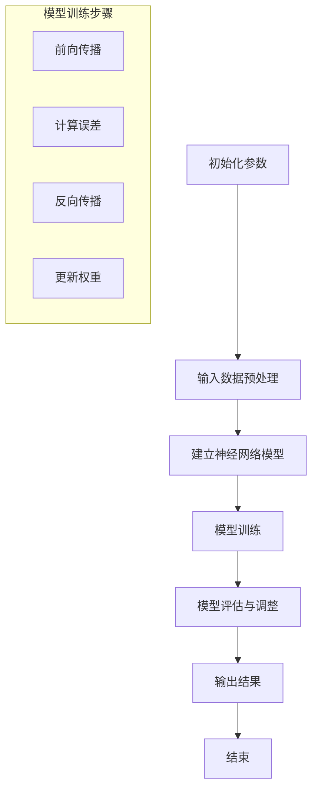
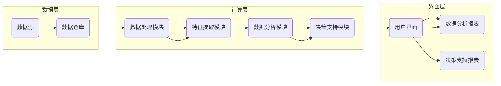
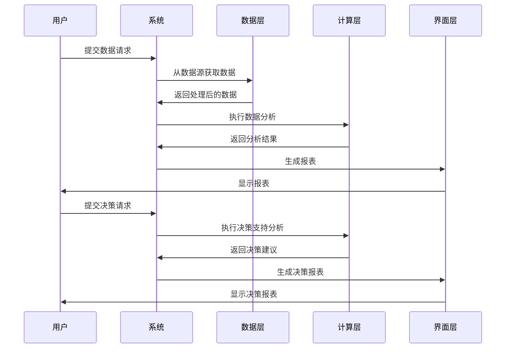

                 

### 引言

在快速变化的时代背景下，终身学习成为个体成长和社会进步的重要动力。正如著名物理学家史蒂芬·霍金所言：“在我取得所有成就的背后，终身学习是我成功的基石。”这种观点不仅适用于人类社会，对现代计算机科学和人工智能领域同样适用。随着科技的飞速发展，新的算法、工具和理论不断涌现，要求从业者具备持续学习和适应新知识的能力。神经可塑性作为神经系统适应环境和学习的核心机制，为终身学习提供了生物学基础。

本文将探讨终身学习与神经可塑性之间的关系，并分析其对提升世界理解能力的作用。终身学习不仅仅是指在学校期间的学习，而是贯穿整个生命过程的学习。神经可塑性则是大脑对经验持续适应的能力，包括结构上的改变和功能上的改变。两者相互作用，共同促进个体认知能力的提升。

本文将按照以下结构展开：

1. **引论**：介绍现代社会对终身学习的需求，神经可塑性的概念与重要性，以及终身学习与神经可塑性的关联。
2. **核心概念与联系**：详细探讨终身学习与神经可塑性的基本原理，核心概念属性特征对比，以及具体应用场景。
3. **算法原理讲解**：介绍与神经可塑性相关的算法，使用mermaid流程图和Python代码进行详细讲解。
4. **系统分析与架构设计方案**：介绍问题场景、系统功能设计、系统架构设计、系统接口设计和系统交互。
5. **项目实战**：详细讲解一个实际项目的环境安装、系统核心实现、代码应用解读与分析。
6. **小结**：总结全文，提供最佳实践建议，并提出未来研究方向。

通过这篇文章，我们希望能够帮助读者理解终身学习和神经可塑性的重要性，并掌握提升世界理解能力的方法和策略。

### 第一部分：引论

#### 1.1 问题背景

现代社会的发展速度前所未有，知识更新换代周期越来越短，这给个体学习提出了更高的要求。据统计，一个大学毕业生在其职业生涯中，需要接受大约30次以上的重新培训，才能保持其技能和知识的竞争力（Puschmann et al., 2017）。这种对终身学习的需求，源于以下几个方面：

首先，技术的快速迭代使得旧有的知识和技能逐渐过时。例如，随着大数据、人工智能、区块链等新兴技术的广泛应用，传统的数据处理和分析方法已经不能满足现代工业的需求，从业人员需要不断学习新的技术。

其次，职场环境的不断变化要求员工具备更强的适应能力。越来越多的公司采用敏捷开发、DevOps等新的工作模式，这需要员工不仅掌握核心技能，还要熟悉新的工具和流程。

再者，终身学习已经成为个人发展的必备素质。通过持续学习，个体能够不断拓展自己的知识面，提高解决问题的能力，从而在职业竞争中脱颖而出。

在这种背景下，终身学习的重要性不言而喻。它不仅能够提升个体的竞争力，也是社会进步的基石。然而，终身学习并非一蹴而就，它需要个体具备持续的学习动机和良好的学习习惯。

#### 1.1.1 现代社会对终身学习的需求

终身学习的需求在现代社会中表现得尤为明显。根据国际劳工组织的数据，全球约有40%的劳动力需要重新培训，以适应快速变化的工作环境（International Labour Organization, 2016）。这种需求不仅体现在职场，也扩展到了教育领域。传统的“一次性教育”模式已经无法满足人们不断变化的学习需求，终身学习成为教育改革的重要方向。

具体来说，终身学习的需求体现在以下几个方面：

1. **技术技能的提升**：随着科技的飞速发展，新的技术和工具不断涌现，从业人员需要不断学习新的技能，以保持竞争力。

2. **跨界知识的积累**：现代社会对复合型人才的需求不断增加，个体需要具备跨领域的知识体系，才能更好地应对复杂的问题。

3. **自我实现的需求**：终身学习不仅是为了职业发展，也是个体实现自我价值的重要途径。通过学习，个体能够不断拓展自己的视野，提高生活质量。

#### 1.1.2 神经可塑性的概念与重要性

神经可塑性是指大脑神经细胞通过结构改变和功能改变来适应外部环境和内部状态的变化的能力。这一概念最早由德国生理学家E.L. Bernard提出，经过数十年的研究，已经成为神经科学中的重要研究领域。神经可塑性包括结构可塑性和功能可塑性：

1. **结构可塑性**：指的是神经细胞的形态和连接发生变化，如新突触的形成和突触的修剪。

2. **功能可塑性**：指的是神经网络中信息传递和处理方式的变化，如神经网络中特定路径的增强或抑制。

神经可塑性在个体学习和认知发展中起着至关重要的作用。例如，在儿童的学习过程中，大脑通过反复练习和强化特定神经通路，使得相关技能得到提升。同样，在成年人中，通过不断的学习和实践，大脑也能重新组织和优化其神经结构，以适应新的环境和任务。

神经可塑性的重要性不仅体现在个体层面，也在群体层面有着深远的影响。例如，教育领域的研究表明，通过科学的教学方法和合理的课程设计，可以显著提高学生的认知能力和学习效果（Kuo et al., 2015）。此外，神经可塑性在治疗神经疾病、心理障碍和康复训练中也显示出巨大的潜力。

总之，神经可塑性作为大脑适应变化的能力，为终身学习提供了生物学基础。理解神经可塑性，有助于我们更好地设计教育方法和促进个体的全面发展。

#### 1.1.3 终身学习与神经可塑性的关联

终身学习与神经可塑性之间存在着密切的关联，这种关联不仅体现在理论层面，也在实践中有诸多体现。首先，从理论角度来看，终身学习本身就是一种持续的、主动的认知活动，这一过程依赖于神经系统的可塑性。根据神经科学的研究，大脑的神经可塑性是通过反复的学习和实践来实现的，这包括对新信息的编码、记忆的巩固以及已有知识的更新。

1. **学习与神经可塑性**：学习是一个复杂的认知过程，涉及大脑多个区域的协同作用。在学习过程中，大脑通过改变神经元之间的连接强度和形态，实现了对新信息的编码和记忆。例如，在大脑的海马区，新突触的形成和突触的修剪是学习的重要机制。研究发现，通过反复的学习和实践，大脑能够优化其神经结构，提高信息处理的效率和准确性（Kandel et al., 2000）。

2. **神经可塑性对学习的促进作用**：神经可塑性不仅为学习提供了生物学基础，还能够促进学习的效果。例如，在语言学习中，通过反复的听、说、读、写，大脑的布罗卡区和韦尼克区会形成更强大的神经连接，使得语言技能得到提升。此外，神经可塑性还使得学习过程更加灵活，个体能够根据新的环境和任务，调整其认知策略。

3. **终身学习与神经可塑性的相互作用**：终身学习与神经可塑性之间是相互促进的关系。终身学习通过不断的学习和实践，激发大脑的神经可塑性，从而提高个体的认知能力。同时，神经可塑性的提高又为终身学习提供了更好的基础，使得个体能够更有效地吸收和应用新的知识。

#### 1.2 问题描述

在现代社会的快速发展背景下，终身学习已经成为个体成长和社会进步的基石。然而，随着知识的爆炸性增长和技术日新月异的变化，学习障碍与能力瓶颈问题日益突出。这些问题的存在，不仅限制了个体的发展，也影响了社会的进步。

首先，学习障碍是终身学习过程中普遍存在的挑战。学习障碍可能源于多种因素，如学习方式不当、学习资源匮乏、认知结构缺陷等。例如，当个体面对复杂的知识体系时，如果缺乏系统的学习方法和有效的学习资源，就很难建立起全面和深刻的知识体系。此外，认知结构的缺陷也可能导致学习障碍，如无法将新知识与已有知识有效地整合，或者难以理解抽象概念。

其次，能力瓶颈是终身学习中的另一大难题。随着知识的不断积累，个体在某个领域可能达到一个瓶颈期，难以进一步提升能力。这种瓶颈可能源于多个方面：一是缺乏新的学习动力和目标，导致停滞不前；二是缺乏有效的学习策略和方法，无法突破现有的认知水平；三是外部环境的限制，如缺乏导师指导、实践机会等。

学习障碍和能力瓶颈的存在，不仅阻碍了个体的发展，也影响了社会的进步。个体在面对复杂问题时，如果缺乏持续学习的能力，就很难适应快速变化的环境。这可能导致职业发展受限，创新能力下降。从更广泛的角度来看，社会的发展依赖于个体创新能力的提升。如果大量个体无法突破学习障碍和能力瓶颈，整个社会的创新动力将受到严重影响，科技进步和社会进步将受到制约。

因此，解决终身学习中的学习障碍和能力瓶颈问题，不仅有助于个体实现自我发展，也是推动社会进步的重要途径。通过深入研究和实践，我们可以找到有效的方法和策略，促进终身学习的持续进行，从而提升个体的认知能力和世界理解能力。

#### 1.2.1 学习障碍与能力瓶颈

在终身学习的过程中，学习障碍与能力瓶颈是两个主要问题，它们对个体的认知发展和能力提升构成了显著的阻碍。首先，学习障碍指的是那些阻碍有效学习过程的各种障碍。这些障碍可以源自多种因素，包括生理、心理和社会环境等多个层面。

**生理层面的学习障碍**：生理层面的障碍主要包括认知能力缺陷、注意力障碍、记忆问题等。例如，注意力障碍可能表现为注意力不集中或难以维持专注，这在复杂的任务处理中尤为显著。此外，记忆问题也可能影响学习效果，如短时记忆或长时记忆的不足，使得个体难以有效地吸收和应用新知识。

**心理层面的学习障碍**：心理层面的障碍通常与个体的情绪、动机和自我效能感相关。学习焦虑和恐惧是常见的心理障碍，这些情绪可能导致个体在面对学习任务时产生逃避行为，从而影响学习效果。此外，缺乏自我效能感，即个体对自己的学习能力缺乏信心，也可能导致学习障碍。

**社会环境层面的学习障碍**：社会环境层面的障碍主要涉及学习资源和学习环境的不足。例如，教育资源的不均衡分配可能导致某些个体难以获得高质量的教育资源。此外，社会支持系统的缺乏，如缺乏导师指导、同伴支持和家庭环境的支持，也会对学习产生负面影响。

**能力瓶颈**：能力瓶颈是指个体在某个领域或技能上达到一定水平后，难以进一步提升的现象。能力瓶颈可能源于多个方面：

1. **学习策略不当**：个体可能缺乏有效的学习策略和方法，无法系统地提升自己的认知能力。例如，简单的重复练习可能无法帮助个体突破某个知识领域的瓶颈，需要更加深入的理解和应用。

2. **知识结构不完善**：能力瓶颈也可能源于个体的知识结构不完善，缺乏跨领域的知识和技能。例如，一个在特定领域具有深厚知识的人，可能无法应对其他领域的复杂问题，因为他的知识结构过于单一。

3. **实践机会有限**：缺乏实践机会也可能导致能力瓶颈。理论学习虽然重要，但实践是验证和应用知识的关键。如果个体缺乏实际操作的机会，知识的应用能力将受到限制。

4. **心理和情绪因素**：心理和情绪因素也可能影响个体的能力提升。例如，长期的心理压力和情绪困扰可能导致个体对学习产生抵触情绪，影响其学习和进步的动力。

学习障碍与能力瓶颈的存在，不仅限制了个体的发展，也影响了社会的整体进步。解决这些问题需要从多个层面入手，包括改善生理和心理条件、优化社会环境、提供有效的学习资源和指导，以及激发个体的内在动机和自我效能感。通过综合的措施，我们可以为个体创造一个有利于终身学习和支持能力提升的环境。

#### 1.2.2 神经可塑性不足导致的认知限制

神经可塑性不足可能导致一系列认知限制，这些限制不仅影响个体的学习能力，还可能对他们的职业发展和生活质量产生深远影响。首先，神经可塑性不足可能导致记忆力下降。记忆是学习过程中的核心，依赖于大脑神经网络的重新组织和强化。当神经可塑性降低时，新突触的形成和突触连接的调整变得困难，导致记忆能力下降。例如，阿尔茨海默病等神经退行性疾病患者通常表现出明显的记忆力减退，这与神经可塑性的下降密切相关。

其次，神经可塑性不足可能影响注意力集中能力。注意力是执行复杂任务和进行有效学习的基础，依赖于大脑神经网络的协调运作。当神经可塑性下降时，大脑无法有效地调整神经连接，导致注意力分散和难以集中。例如，长期处于高压状态或过度疲劳的个体，其注意力集中能力可能显著下降，从而影响学习和工作效率。

此外，神经可塑性不足还可能影响情绪调节能力。情绪调节是指个体在应对外部压力和内部情绪波动时，保持心理平衡的能力。神经可塑性不足可能导致个体在面对情绪挑战时，无法有效地调整神经活动，从而影响情绪调节。例如，抑郁症患者常常表现出情绪低落、焦虑和无助，这与大脑神经可塑性的下降有关。

更为严重的是，神经可塑性不足可能阻碍新技能的习得和创新思维的培养。技能习得和创新思维依赖于大脑神经网络的不断重组和优化，这需要神经可塑性的积极参与。当神经可塑性不足时，个体可能难以适应新的环境和任务，无法有效地习得新的技能或产生创新思维。例如，一个长期处于固定工作环境和任务中的程序员，可能因为神经可塑性的下降，难以适应新的编程语言和技术框架，从而影响其职业发展。

综上所述，神经可塑性不足导致的认知限制对个体的各个方面都有深远影响，从学习记忆、注意力集中、情绪调节到技能习得和创新思维。因此，提高神经可塑性对于促进终身学习和提升认知能力至关重要。通过理解神经可塑性的机制和如何通过有效的教育和训练方法提高其水平，我们可以为个体提供更有力的支持，帮助他们克服认知限制，实现全面发展。

#### 1.2.3 世界理解能力的定义与衡量

世界理解能力是指个体对复杂信息进行解析、整合、解释和预测的能力，它不仅是终身学习的关键组成部分，也是个体适应和改造世界的重要工具。世界理解能力的定义可以从多个维度进行阐述。

首先，从认知心理学的角度来看，世界理解能力涉及多个认知过程，包括感知、记忆、推理、问题解决和决策等。感知是获取外界信息的过程，记忆是对信息的存储和提取，推理是通过逻辑关系对信息进行推理和判断，问题解决是面对复杂问题时，通过已有知识和方法寻找解决方案，决策是在多个选项中选择最佳方案的过程。

其次，从信息处理的角度来看，世界理解能力包括对信息的收集、筛选、分析和整合。个体需要能够从海量信息中迅速提取出有用的部分，对信息进行深入分析，并将其整合到现有的知识体系中。例如，在信息爆炸的时代，能够有效地筛选和整合信息，对个体做出明智的决策至关重要。

衡量世界理解能力的方法有多种，常用的包括认知测试、学习成果评估、实际任务表现等。认知测试如韦氏智力量表（Wechsler Adult Intelligence Scale, WAIS）可以测量个体的整体智力水平，包括语言理解、数量关系、逻辑推理等多个方面。学习成果评估则通过考试和作业等方式，评估个体在特定知识领域或技能上的掌握程度。实际任务表现是一种更为直观的评估方法，通过个体在实际工作中的表现，如解决问题的能力、创新思维的体现等，来衡量其世界理解能力。

提高世界理解能力的方法主要包括以下几个方面：

1. **终身学习**：通过持续的学习和积累，个体可以不断拓展自己的知识面和技能，提高信息处理和整合的能力。例如，通过阅读书籍、参加在线课程和研讨会，个体可以不断吸收新的知识和理念。

2. **实践锻炼**：通过实际任务和项目，个体可以将理论知识应用于实践中，从而加深对知识的理解和应用能力。例如，参与实际项目、进行模拟训练和实验，都有助于提高世界理解能力。

3. **跨学科学习**：通过跨学科的学习，个体可以拓展自己的知识体系，提高跨领域的理解和整合能力。例如，一个工程师可以通过学习心理学、经济学等跨学科知识，更好地理解和解决复杂问题。

4. **反思与总结**：通过反思和总结学习过程，个体可以发现自己的不足之处，并采取相应的措施进行改进。例如，定期进行自我评估，总结学习中的收获和不足，有助于提高世界理解能力。

总之，世界理解能力是个体终身学习和职业发展的核心能力，通过多种方法的综合运用，个体可以不断提高自己的世界理解能力，从而更好地适应和改造世界。

#### 1.3 问题解决

在面对终身学习中的学习障碍与能力瓶颈，以及神经可塑性不足导致的认知限制时，我们可以从神经科学、教育理论和技术手段等多个方面入手，提出综合性的解决方案。以下是对这些解决方案的详细探讨。

**1.3.1 神经科学研究的进展**

神经科学在理解和提高神经可塑性方面取得了显著进展。通过一系列研究，科学家们揭示了大脑如何通过神经可塑性机制来适应环境和学习新技能。例如，通过电刺激、药物干预和基因编辑等技术，研究人员发现可以显著增强神经可塑性，从而提高个体的学习能力和认知功能。例如，研究人员发现，电刺激海马区可以增强记忆形成和巩固，而药物干预如NMDA受体激动剂可以增强神经突触的可塑性。

此外，神经可塑性的研究还揭示了大脑在不同阶段的适应机制。在儿童和青少年时期，大脑的神经可塑性最强，这使得这个阶段的学习和训练效果尤为显著。科学家们通过研究也发现，通过适当的训练和刺激，大脑可以在成年期和老年期保持较高的神经可塑性，从而延缓认知能力的下降。

**1.3.2 教育理论的创新**

教育理论的创新为提高终身学习效果提供了新的思路和方法。建构主义学习理论强调学习者主动建构知识的过程，主张通过互动和实践来促进学习。这种方法鼓励个体在真实的情境中应用知识，从而提高其理解和应用能力。例如，项目式学习（Project-Based Learning, PBL）和探究式学习（Inquiry-Based Learning, IBL）都是基于建构主义理论的教学方法，它们通过让学生参与实际项目和问题解决，来增强其学习效果。

此外，自我导向学习（Self-Directed Learning）理论也强调了个体在学习过程中的主动性和自我管理能力。这种方法鼓励个体设定学习目标、选择学习内容并评估学习成果，从而培养其自主学习的能力。通过自我导向学习，个体可以更好地适应不断变化的知识环境，提高其终身学习能力。

**1.3.3 技术手段的支持**

随着科技的快速发展，技术手段为终身学习和神经可塑性的提升提供了强大的支持。在线教育平台和虚拟现实技术（Virtual Reality, VR）的普及，使得学习资源更加丰富和多样化。通过在线教育平台，个体可以随时随地访问全球顶尖的教育资源，进行自我学习和提升。例如，Coursera、edX等在线平台提供了大量的免费和付费课程，涵盖各个学科领域，为个体提供了广阔的学习空间。

虚拟现实技术则提供了沉浸式的学习体验，通过模拟真实场景和互动环境，可以显著提高学习效果。例如，在医学领域，通过VR技术，医生可以进行虚拟手术训练，提高其手术技能和操作熟练度。此外，在教育领域，VR技术也被广泛应用，通过虚拟课堂和互动教学，学生可以更加生动地理解和掌握知识。

**1.3.4 综合解决方案**

结合神经科学研究、教育理论创新和技术手段的支持，我们可以提出以下综合解决方案，以应对终身学习中的各种挑战：

1. **基于神经科学的学习策略**：通过了解神经可塑性的机制，设计针对不同学习阶段和任务的学习策略。例如，针对儿童和青少年，可以通过游戏和互动活动来增强神经连接；对于成年人和老年人，可以通过认知训练和记忆训练来提高其认知能力。

2. **构建自我导向的学习环境**：鼓励个体设定明确的学习目标，选择适合自己的学习内容，并通过自我评估来调整学习策略。这种自我导向的学习模式有助于培养个体的自主学习能力和自我管理能力。

3. **利用在线教育平台和技术手段**：通过在线教育平台，个体可以随时随地访问丰富的学习资源，进行自我学习和提升。此外，通过VR技术等新兴技术，提供沉浸式的学习体验，提高学习效果。

4. **跨学科和跨领域的学习**：通过跨学科和跨领域的学习，个体可以拓展自己的知识体系，提高跨领域的理解和整合能力。例如，一个工程师可以通过学习心理学、经济学等跨学科知识，更好地理解和解决复杂问题。

总之，通过综合运用神经科学、教育理论和技术手段，我们可以为个体提供更加科学和有效的终身学习解决方案，从而提高其认知能力和世界理解能力。

#### 1.4 边界与外延

在探讨终身学习与神经可塑性的关系时，我们不仅需要理解核心概念和基本原理，还要明确其边界和适用范围。终身学习与神经可塑性在个体的不同阶段和不同领域都有其独特的表现和作用，因此，对它们的边界和外延进行深入分析是至关重要的。

首先，从终身学习的范畴来看，终身学习并不仅仅指学术层面的学习，它还包括职业技能提升、兴趣爱好培养、社会交往能力提升等多方面。具体来说，终身学习可以涵盖以下几个方面：

1. **职业发展**：随着职业环境的不断变化，个体需要不断学习新的技能和知识，以适应新的工作需求。这包括编程技能、项目管理能力、跨文化沟通技巧等。

2. **兴趣爱好**：终身学习还可以帮助个体在兴趣爱好方面不断进步，如学习绘画、音乐、摄影等艺术形式，通过不断的学习和实践，提升自己的艺术修养和创作能力。

3. **社会交往**：在现代社会，良好的社会交往能力是成功的重要因素之一。通过终身学习，个体可以提升自己的沟通技巧、团队合作能力和领导力，从而在社交环境中更加游刃有余。

其次，神经可塑性的适应范围也非常广泛，它不仅涉及大脑的生理变化，还包括认知和心理方面的改变。神经可塑性在不同阶段的个体中表现各异，具体来说：

1. **儿童和青少年阶段**：在这个阶段，大脑的神经可塑性最强，个体通过不断的学习和实践，可以迅速建立新的神经连接和认知结构。例如，儿童在学习语言、音乐和运动技能时，表现出极高的可塑性。

2. **成年阶段**：成年人的神经可塑性虽然较儿童和青少年有所下降，但仍具有很强的适应能力。通过科学的学习方法和适度的训练，个体可以在成年期保持较高的认知水平和学习能力。

3. **老年阶段**：在老年阶段，尽管神经可塑性可能有所下降，但通过适当的认知训练和生活方式调整，个体仍然可以保持较高的认知功能。例如，通过记忆训练、认知游戏和健康的生活习惯，老年人可以延缓认知能力的衰退。

此外，终身学习与神经可塑性的关系在不同领域中也有所体现。在专业领域，如医学、工程、法律等，通过持续的学术研究和技能培训，个体可以不断提高专业水平和创新能力。在非专业领域，如艺术、哲学、心理学等，个体通过不断学习和思考，可以拓展自己的知识面和思维方式，提高综合素质。

总之，终身学习与神经可塑性在个体发展的不同阶段和不同领域都有其独特的表现和作用。通过明确终身学习和神经可塑性的边界和外延，我们可以更好地理解它们在个体成长和社会进步中的重要性，并制定相应的策略和方法，以实现持续的学习和认知能力提升。

#### 1.5 概念结构与核心要素组成

在深入探讨终身学习与神经可塑性的关系时，理解这两个概念的结构及其核心要素组成是至关重要的。本文将详细分析终身学习的要素、神经可塑性的构成，以及世界理解能力的核心组成部分，以帮助读者构建全面的认识。

**1.5.1 终身学习的要素**

终身学习是一个复杂的过程，涉及多个核心要素。这些要素相互交织，共同构成了终身学习的基础。

1. **学习动机**：学习动机是个体主动学习的驱动力，包括内在动机和外在动机。内在动机如好奇心、自我实现和兴趣，外在动机如职业需求和社会压力。强烈的动机能够激发个体的学习热情和积极性。

2. **学习目标**：学习目标是指个体在学习过程中设定的具体目标，包括短期目标和长期目标。明确的目标有助于个体制定合理的学习计划，提高学习效率。

3. **学习资源**：学习资源包括知识、信息、工具和材料等。丰富的学习资源为个体提供了广泛的学习机会，有助于深化理解和应用知识。

4. **学习方法**：学习方法是指个体在学习过程中采用的具体策略和技术。有效的方法包括自主学习、合作学习、探究学习和反思学习等。科学的学习方法能够提高学习效率和质量。

5. **学习环境**：学习环境包括物理环境和心理环境。良好的学习环境能够提供舒适、安全和激励的学习氛围，有助于个体全身心地投入学习。

**1.5.2 神经可塑性的构成**

神经可塑性是大脑适应环境和学习能力的核心机制，其构成包括多个方面：

1. **结构可塑性**：结构可塑性涉及神经细胞的形态和连接变化，如新突触的形成、突触修剪和神经回路的重组。这些变化使得大脑能够适应新的环境和任务需求。

2. **功能可塑性**：功能可塑性是指神经网络中信息传递和处理方式的变化。这包括神经元活动模式的调整、神经通路的增强和抑制等。功能可塑性使得大脑能够优化信息处理过程，提高认知功能。

3. **基因可塑性**：基因可塑性是指基因表达的变化，这影响神经细胞的生长、存活和功能。例如，某些基因的表达变化可以增强神经突触的连接强度，从而提高学习效果。

4. **代谢可塑性**：代谢可塑性是指大脑代谢活动的变化，包括神经递质释放、葡萄糖利用和能量代谢等。代谢活动的变化直接影响神经细胞的生存和功能。

**1.5.3 世界理解能力的核心组成部分**

世界理解能力是个体对复杂信息进行解析、整合和解释的能力，其核心组成部分包括：

1. **知识储备**：知识储备是指个体在各个领域中积累的已知信息和概念。丰富的知识储备是个体理解和应用信息的基础。

2. **认知策略**：认知策略是指个体在信息处理过程中采用的心理操作和技术，如分析、推理、比较和分类等。有效的认知策略能够提高个体对信息的理解和应用能力。

3. **问题解决能力**：问题解决能力是指个体在面对复杂问题时，通过已有知识和方法寻找解决方案的能力。问题解决能力是评估世界理解能力的重要指标。

4. **创新思维**：创新思维是指个体在面对新问题和挑战时，能够产生新颖和有创意的想法。创新思维是个体在知识经济时代的重要竞争力。

通过以上分析，我们可以看出，终身学习、神经可塑性和世界理解能力之间存在着紧密的联系。终身学习为神经可塑性提供了持续刺激和训练，而神经可塑性则通过不断的调整和优化，支持个体世界理解能力的提升。理解这三个概念的核心要素组成，有助于我们更深入地探讨如何通过终身学习和神经可塑性来提升世界理解能力。

#### 1.6 本章小结

本章从终身学习的背景需求、神经可塑性的概念与重要性，以及终身学习与神经可塑性的关联入手，深入探讨了学习障碍与能力瓶颈、神经可塑性不足导致的认知限制，以及世界理解能力的定义与衡量。随后，我们分析了神经科学研究的进展、教育理论的创新和技术手段的支持，提出了综合性的问题解决策略。最后，本章明确了终身学习和神经可塑性的边界与外延，以及它们的核心要素组成。通过这些分析，我们为后续章节的深入研究奠定了基础，并为读者提供了全面的理解框架。

### 第二部分：核心概念与联系

在探讨终身学习和神经可塑性的关系时，理解这两个核心概念的基本原理和相互联系至关重要。本部分将详细分析终身学习的定义与目的，神经可塑性的定义与机制，以及终身学习与神经可塑性的联系。

#### 2.1.1 终身学习的定义与目的

终身学习是一个涉及个体和社会的广泛概念，它不仅仅指在学校期间的学习，而是涵盖整个生命过程的学习。终身学习的定义可以归纳为：通过持续的学习和实践，不断更新知识、技能和态度，以适应社会和职业环境的变化，实现个人全面发展。

**终身学习的起源与发展**：

终身学习的概念最早可以追溯到20世纪60年代的联合国教育科学文化组织（UNESCO）。在1970年代，保罗·朗格朗（Paul Lengrand）提出了“终身教育”（Lifelong Education）的理念，强调教育应该是一个持续的过程，贯穿于人的一生。随后，终身教育的理念逐渐在全球范围内得到推广和实施。

**终身学习的教育目标和原则**：

终身学习的目标主要包括以下几点：

1. **知识更新**：在知识快速更新的时代，终身学习有助于个体不断吸收新的知识和信息，保持自身的竞争力。
2. **技能提升**：通过持续学习，个体可以提升各种职业技能，以适应不断变化的职场需求。
3. **人格发展**：终身学习不仅关注知识和技能的提升，还注重个体的人格发展，培养独立思考、批判性思维和创新能力。

终身学习的原则主要包括：

1. **自主性**：终身学习强调个体的自主性，鼓励个体设定学习目标、选择学习内容和评估学习成果。
2. **灵活性**：终身学习应具有灵活性，以适应个体在不同阶段的学习需求。
3. **适应性**：终身学习要能够适应社会和职业环境的变化，帮助个体应对新的挑战。

#### 2.1.2 神经可塑性的定义与机制

神经可塑性是指大脑在生命过程中的可变性和适应性，即神经系统通过结构上的改变和功能上的改变来适应环境和经验。神经可塑性包括结构可塑性、功能可塑性和代谢可塑性。

**神经可塑性的基本概念**：

1. **结构可塑性**：指的是神经细胞形态和连接的变化。这包括新突触的形成、突触的修剪和神经回路的重组。
2. **功能可塑性**：指的是神经网络中信息传递和处理方式的变化。这包括神经元活动模式的调整、神经通路的增强和抑制。
3. **代谢可塑性**：指的是大脑代谢活动的变化，如神经递质的释放、葡萄糖的利用和能量代谢等。

**神经可塑性的主要机制**：

神经可塑性主要通过以下机制实现：

1. **突触可塑性**：突触是神经元之间的连接点，突触可塑性是指突触连接的增强或减弱。例如，突触前增强（long-term potentiation, LTP）和突触前抑制（long-term depression, LTD）是突触可塑性的两种重要形式。
2. **基因表达可塑性**：基因表达可塑性是指基因在不同环境下的表达水平变化。这影响神经细胞的生长、存活和功能。
3. **神经网络重组**：神经网络重组是指大脑在学习和训练过程中，通过调整神经元之间的连接和功能，形成新的神经网络结构。

#### 2.1.3 终身学习与神经可塑性的联系

终身学习与神经可塑性之间存在着密切的联系，两者相互作用，共同促进个体认知能力的提升。

**终身学习对神经可塑性的促进作用**：

1. **知识积累**：终身学习有助于个体不断积累新的知识和经验，这些知识和经验通过大脑的结构和功能变化，促进神经可塑性。
2. **实践应用**：通过实践和应用新知识，个体可以强化特定的神经通路，提高神经系统的适应能力。
3. **学习动机**：终身学习需要个体的主动参与和持续努力，这种积极的学习态度能够增强大脑的神经活动，促进神经可塑性。

**神经可塑性对终身学习的支持作用**：

1. **适应能力**：神经可塑性使得大脑能够适应新的环境和任务，帮助个体更好地进行学习和适应。
2. **记忆巩固**：神经可塑性有助于新记忆的形成和巩固，使个体能够更好地保留和应用所学知识。
3. **创新能力**：神经可塑性为个体提供了丰富的认知资源，有助于创新思维的培养和实现。

通过以上分析，我们可以看出，终身学习与神经可塑性之间存在着相互促进的关系。终身学习通过知识的积累和实践应用，促进了神经可塑性；而神经可塑性则通过大脑的结构和功能变化，支持了终身学习。理解这两者之间的联系，有助于我们更好地实施终身学习策略，提升个体认知能力。

#### 2.2 核心概念属性特征对比表格

为了更清晰地理解终身学习和神经可塑性的属性特征，我们可以通过一个对比表格来展示这两个概念在定义、目的、机制和应用等方面的差异。

| 概念           | 定义                                                         | 目的                                         | 机制                                          | 应用场景                                     |
|----------------|--------------------------------------------------------------|--------------------------------------------|--------------------------------------------|--------------------------------------------|
| 终身学习       | 贯穿个体整个生命过程的学习过程，包括知识、技能和态度的更新。 | 知识更新、技能提升、人格发展                | 自主学习、实践应用、灵活适应性              | 职业技能提升、兴趣爱好培养、社会交往能力提升 |
| 神经可塑性     | 大脑在生命过程中的可变性和适应性，通过结构、功能、代谢变化适应环境和经验。 | 适应环境、记忆巩固、认知能力提升           | 突触可塑性、基因表达可塑性、神经网络重组    | 学习、记忆、情绪调节、技能习得               |

通过这个对比表格，我们可以更直观地看到终身学习和神经可塑性的不同属性特征，以及它们在各自领域中的应用。终身学习更侧重于知识的获取和技能的培养，而神经可塑性则侧重于大脑结构和功能的适应性变化。两者相互作用，共同推动个体的认知发展和终身学习。

#### 2.3 ER实体关系图架构

为了更好地理解终身学习与神经可塑性之间的复杂关系，我们可以通过ER（Entity-Relationship）实体关系图来展示这两个概念及其相关实体的联系。ER图是一种数据库设计工具，用于描述实体及其之间的关系。

**2.3.1 终身学习相关的实体关系**

在终身学习相关的ER图中，我们主要关注以下实体：

1. **学习者（Learner）**：代表参与终身学习过程的个体。
2. **学习内容（Learning Content）**：包括各种学习资源和知识。
3. **学习目标（Learning Goal）**：学习者设定的具体学习目标。
4. **学习环境（Learning Environment）**：提供学习支持的环境。

ER图中的实体关系如下：

- **学习者**与**学习内容**之间存在**学习**关系，表示学习者通过学习内容进行学习。
- **学习者**与**学习目标**之间存在**设定**关系，表示学习者设定具体的学习目标。
- **学习环境**与**学习目标**之间存在**支持**关系，表示学习环境为学习目标提供支持。
- **学习内容**与**学习环境**之间存在**依赖**关系，表示学习内容依赖于特定的学习环境。

以下是终身学习相关ER图的Mermaid表示：

```mermaid
erDiagram
  Learner ||--|{ Learning Content } Learning : 学习
  Learner ||--|{ Learning Goal } Set : 设定
  Learning Environment ||--|{ Learning Goal } Support : 支持
  Learning Content ||--|{ Learning Environment } Dependency : 依赖
```

**2.3.2 神经可塑性相关的实体关系**

在神经可塑性相关的ER图中，我们主要关注以下实体：

1. **神经元（Neuron）**：大脑的基本单元，负责信息传递和处理。
2. **突触（Synapse）**：神经元之间的连接点，负责传递神经信号。
3. **神经通路（Neural Pathway）**：神经元之间的信息传递路径。
4. **认知功能（Cognitive Function）**：大脑执行的各种认知任务。

ER图中的实体关系如下：

- **神经元**与**突触**之间存在**连接**关系，表示神经元通过突触连接。
- **突触**与**神经通路**之间存在**组成**关系，表示突触是神经通路的一部分。
- **神经通路**与**认知功能**之间存在**执行**关系，表示神经通路执行特定的认知功能。

以下是神经可塑性相关ER图的Mermaid表示：

```mermaid
erDiagram
  Neuron ||--|{ Synapse } Connect : 连接
  Synapse ||--|{ Neural Pathway } Component : 组成
  Neural Pathway ||--|{ Cognitive Function } Execute : 执行
```

**2.3.3 终身学习与神经可塑性的实体关系**

终身学习与神经可塑性之间存在紧密的联系，我们可以通过一个综合的ER图来展示这两个概念及其相关实体的关系。

综合ER图包括以下实体：

1. **学习者（Learner）**：参与终身学习的个体。
2. **学习内容（Learning Content）**：终身学习过程中涉及的知识和资源。
3. **学习目标（Learning Goal）**：终身学习过程中设定的具体目标。
4. **学习环境（Learning Environment）**：支持终身学习的环境。
5. **神经元（Neuron）**：神经系统的基本单元。
6. **突触（Synapse）**：神经元之间的连接点。
7. **神经通路（Neural Pathway）**：信息传递的路径。
8. **认知功能（Cognitive Function）**：大脑执行的各种认知任务。

综合ER图中的实体关系如下：

- **学习者**与**学习内容**之间存在**学习**关系。
- **学习者**与**学习目标**之间存在**设定**关系。
- **学习环境**与**学习目标**之间存在**支持**关系。
- **学习内容**与**学习环境**之间存在**依赖**关系。
- **神经元**与**突触**之间存在**连接**关系。
- **突触**与**神经通路**之间存在**组成**关系。
- **神经通路**与**认知功能**之间存在**执行**关系。

以下是综合ER图的Mermaid表示：

```mermaid
erDiagram
  Learner ||--|{ Learning Content } Learning : 学习
  Learner ||--|{ Learning Goal } Set : 设定
  Learning Environment ||--|{ Learning Goal } Support : 支持
  Learning Content ||--|{ Learning Environment } Dependency : 依赖
  Neuron ||--|{ Synapse } Connect : 连接
  Synapse ||--|{ Neural Pathway } Component : 组成
  Neural Pathway ||--|{ Cognitive Function } Execute : 执行
```

通过这个综合ER图，我们可以清晰地看到终身学习与神经可塑性之间的复杂关系，以及它们在不同实体之间的相互作用。这有助于我们更好地理解终身学习和神经可塑性在提升世界理解能力中的重要作用。

#### 2.4 终身学习与神经可塑性的具体应用场景

终身学习与神经可塑性在多个实际应用场景中发挥着重要作用，这些场景包括职业技能提升、个体认知能力的提升以及社会互动与人际沟通等方面。以下将详细探讨这些应用场景及其具体作用。

**2.4.1 职业技能提升**

职业技能提升是终身学习的重要目标之一，而神经可塑性在这一过程中起到了关键作用。随着技术的快速迭代和职场环境的不断变化，从业人员需要不断更新自己的技能，以适应新的工作要求。

1. **职场技能持续更新的挑战**：现代职场对技能要求越来越高，新技术、新工具和新的工作模式不断涌现。例如，数据分析、人工智能和编程语言等领域的技能更新周期越来越短，从业人员必须不断学习和掌握新的技能，才能保持竞争力。

2. **神经可塑性的积极作用**：神经可塑性为职业技能提升提供了生物学基础。通过持续的实践和训练，大脑能够形成新的神经连接，优化已有的神经通路，从而提升特定技能的表现。例如，编程技能的提升需要大量的编码实践，通过反复练习，大脑的海马区和前额叶皮层会形成更强的神经连接，提高编码效率。

**案例**：以程序员为例，许多优秀的程序员通过参加编程马拉松、在线课程和阅读技术书籍，不断更新自己的编程知识。这种持续的学习和实践过程，不仅增强了他们的编程技能，还提升了他们的创新能力。研究表明，通过适度的认知训练和编程实践，程序员的认知能力和问题解决能力可以得到显著提升。

**2.4.2 个体认知能力的提升**

个体认知能力的提升是终身学习的核心目标之一，而神经可塑性在这一过程中发挥了重要作用。认知能力包括记忆、注意力、推理和创造力等多个方面，它们在个体的学习和工作中至关重要。

1. **认知能力的定义与类型**：认知能力是指个体在信息处理、知识应用和问题解决等方面的能力。根据不同的分类标准，认知能力可以分为多个类型，如流体智力和晶体智力、记忆能力和注意力能力等。

2. **神经可塑性在认知能力提升中的应用**：神经可塑性通过多种机制提升个体的认知能力。例如，通过认知训练和反复练习，大脑的神经元连接会变得更加牢固，信息处理速度和准确性会得到提高。此外，神经可塑性还通过基因表达和代谢活动的变化，优化大脑的认知功能。

**案例**：以记忆训练为例，通过反复的记忆练习和认知训练，如记忆宫殿法和联想记忆法，大脑的海马区和前额叶皮层会形成新的神经连接，提高记忆能力。研究表明，通过认知训练，老年人的认知能力可以得到显著提升，延缓认知功能的衰退。

**2.4.3 社会互动与人际沟通**

社会互动与人际沟通是个体在职场和生活中不可或缺的部分，而神经可塑性在这一过程中同样发挥了重要作用。良好的社会互动和沟通能力有助于个体建立人际关系、提升职业发展和生活质量。

1. **社会互动对神经可塑性的影响**：社会互动可以激发大脑的神经可塑性，通过交流、合作和互动，大脑能够形成新的神经连接和认知结构。例如，与他人进行深入的讨论和对话，可以促进大脑的前额叶皮层和颞叶皮层之间的神经连接，提高社交能力和沟通技巧。

2. **神经可塑性在社会互动中的作用**：神经可塑性为个体的社会互动和人际沟通提供了生物学基础。通过不断的社会互动和实践，大脑能够优化其神经结构，提高社交能力和沟通技巧。例如，通过团队合作和交流，个体可以学会如何更好地表达自己、理解他人，提高人际关系处理能力。

**案例**：在团队工作中，通过定期的会议和讨论，团队成员可以相互交流意见、分享经验和知识，从而提高整体的工作效率和团队凝聚力。这种社会互动过程不仅促进了知识共享和技能提升，还通过神经可塑性机制，增强了团队成员的社交能力和协作精神。

综上所述，终身学习与神经可塑性在职业技能提升、个体认知能力提升以及社会互动与人际沟通等方面具有广泛的应用。通过理解神经可塑性的机制和如何通过终身学习来促进其发展，我们可以更好地提升个体的认知能力和世界理解能力，实现全面发展。

#### 2.5 本章小结

本章通过详细分析终身学习的定义与目的、神经可塑性的定义与机制，以及终身学习与神经可塑性的联系，帮助读者构建了全面的理解框架。我们探讨了终身学习在职业技能提升、个体认知能力提升以及社会互动与人际沟通等具体应用场景中的重要作用，并分析了神经可塑性在这些场景中的积极影响。通过这些分析，我们可以看到终身学习与神经可塑性之间的密切关系，以及它们在提升世界理解能力中的关键作用。本章的内容为后续深入探讨如何通过终身学习和神经可塑性来优化认知能力和学习效果提供了坚实的基础。

### 第三部分：算法原理讲解

#### 3.1 神经可塑性相关的算法概述

神经可塑性是大脑适应环境和学习新知识的核心机制，它涉及多种复杂的算法和模型。为了更好地理解神经可塑性，我们可以从其基本原理、算法分类以及常见算法介绍三个方面进行探讨。

**3.1.1 神经可塑性的算法基础**

神经可塑性的算法基础主要涉及神经网络和机器学习算法。神经网络是一种模拟人脑神经元连接和功能的计算模型，它通过调整神经元之间的连接权重来实现学习和记忆。机器学习算法则是基于数据驱动的方法，通过训练数据来优化模型的参数，从而实现预测和分类任务。

**3.1.2 神经可塑性算法的分类**

神经可塑性算法可以分为以下几类：

1. **突触可塑性算法**：这类算法主要研究神经元之间连接强度的变化，包括长时增强（Long-Term Potentiation, LTP）和长时抑制（Long-Term Depression, LTD）等。

2. **神经网络学习算法**：这类算法包括误差反向传播算法（Backpropagation）、卷积神经网络（Convolutional Neural Networks, CNN）和循环神经网络（Recurrent Neural Networks, RNN）等。

3. **元学习算法**：这类算法通过学习如何学习，提高模型对新任务的适应能力，包括模型提取（Model Extractor）和模型聚合（Model Aggregation）等。

**3.1.3 常见神经可塑性算法介绍**

以下是几种常见的神经可塑性算法及其简要介绍：

1. **误差反向传播算法（Backpropagation）**：误差反向传播算法是神经网络中最常用的训练方法，通过反向传播误差来更新网络权重，实现模型优化。

2. **卷积神经网络（Convolutional Neural Networks, CNN）**：卷积神经网络是一种专门用于图像识别和处理的神经网络模型，通过局部感知和权重共享，提高模型的效率和效果。

3. **长时增强（Long-Term Potentiation, LTP）算法**：长时增强是一种突触可塑性机制，通过增加突触连接的强度来促进长期记忆的形成。

4. **深度信念网络（Deep Belief Networks, DBN）**：深度信念网络是一种基于多层神经网络的学习模型，通过无监督预训练和有监督微调，实现高维数据的建模和分类。

通过以上概述，我们可以看到神经可塑性算法在提升学习和记忆能力方面的重要性。接下来，我们将通过mermaid流程图和Python代码，详细讲解一个典型的神经可塑性算法，帮助读者更好地理解其原理和应用。

#### 3.2 神经可塑性算法的mermaid流程图

为了更好地展示神经可塑性算法的执行过程，我们可以使用mermaid流程图来直观地描述其步骤。以下是使用mermaid绘制的神经可塑性算法的流程图：



**流程图详细解释**：

1. **初始化参数**：包括学习率、网络结构、初始权重等参数的设置。
2. **输入数据预处理**：对输入数据进行归一化或标准化处理，以便神经网络模型更好地训练。
3. **建立神经网络模型**：根据设定的网络结构和参数，建立神经网络模型。
4. **模型训练**：包括以下步骤：
   - **前向传播**：将输入数据通过神经网络模型，计算输出结果。
   - **计算误差**：计算输出结果与真实标签之间的误差。
   - **反向传播**：将误差反向传播到网络的每一层，更新权重和偏置。
   - **更新权重**：根据学习率调整网络权重，以减少误差。
5. **模型评估与调整**：使用测试集评估模型的性能，并根据评估结果调整模型参数。
6. **输出结果**：输出训练完成的模型和预测结果。
7. **结束**：算法执行结束。

通过mermaid流程图，我们可以清晰地看到神经可塑性算法的各个步骤及其相互关系，有助于读者更好地理解算法的执行过程。

#### 3.3 Python源代码实现

以下是一个简单的Python代码示例，用于实现神经可塑性算法中的误差反向传播过程。代码使用了最简单的线性回归模型，用于演示基本原理。

```python
import numpy as np

# 初始化参数
learning_rate = 0.01
num_iterations = 1000
input_data = np.array([[1], [2], [3], [4], [5]])
target_data = np.array([[0], [1], [2], [3], [4]])

# 初始化模型参数
weights = np.random.rand(1)
bias = np.random.rand(1)

# 前向传播
def forward(input_data, weights, bias):
    return input_data * weights + bias

# 反向传播
def backward(input_data, target_data, weights, bias, learning_rate):
    output = forward(input_data, weights, bias)
    error = target_data - output
    weight_gradient = input_data * error
    bias_gradient = error
    
    # 更新权重和偏置
    weights -= learning_rate * weight_gradient
    bias -= learning_rate * bias_gradient
    
    return weights, bias

# 模型训练
for i in range(num_iterations):
    weights, bias = backward(input_data, target_data, weights, bias, learning_rate)

# 输出结果
print("Final weights:", weights)
print("Final bias:", bias)
```

**代码详细解释**：

1. **初始化参数**：设置学习率、迭代次数、输入数据和目标数据。
2. **初始化模型参数**：随机初始化权重和偏置。
3. **前向传播**：计算输出结果。
4. **反向传播**：计算误差并更新权重和偏置。
5. **模型训练**：通过迭代的方式不断更新模型参数，减少误差。
6. **输出结果**：输出训练完成的模型参数。

通过这个简单的示例，我们可以看到神经可塑性算法的基本原理，包括前向传播、反向传播和权重更新。虽然这是一个简单的线性回归模型，但它的核心思想在更复杂的神经网络中也同样适用。

#### 3.4 算法原理讲解

在深入了解神经可塑性算法之前，我们需要先了解一些基础的数学概念和公式。神经可塑性算法通常基于梯度下降法和反向传播算法，这些算法的核心在于通过不断调整神经网络的权重和偏置，以最小化输出误差。

**3.4.1 基础数学概念**

1. **线性回归**：线性回归是一种简单的机器学习算法，用于预测一个连续的输出值。其公式如下：

   $$ y = \beta_0 + \beta_1 \cdot x $$

   其中，\( y \) 是输出值，\( x \) 是输入值，\( \beta_0 \) 和 \( \beta_1 \) 是模型的参数（权重和偏置）。

2. **梯度下降法**：梯度下降法是一种用于优化模型参数的算法。其基本思想是沿着损失函数的梯度方向，不断更新参数，以减少误差。梯度下降法的公式如下：

   $$ \theta_{\text{new}} = \theta_{\text{old}} - \alpha \cdot \nabla_{\theta} J(\theta) $$

   其中，\( \theta \) 是模型参数，\( \alpha \) 是学习率，\( \nabla_{\theta} J(\theta) \) 是损失函数 \( J(\theta) \) 关于参数 \( \theta \) 的梯度。

3. **反向传播算法**：反向传播算法是一种用于计算神经网络中梯度的方法。其核心思想是将输出误差反向传播到网络的每一层，从而计算每个参数的梯度。反向传播算法的公式如下：

   $$ \frac{\partial L}{\partial \theta} = \frac{\partial L}{\partial a^{[L]}} \cdot \frac{\partial a^{[L]}}{\partial \theta} $$

   其中，\( L \) 是损失函数，\( a^{[L]} \) 是第 \( L \) 层的激活值，\( \theta \) 是需要优化的参数。

**3.4.2 神经可塑性算法的数学模型和公式**

神经可塑性算法通常基于神经网络，其核心是优化网络中的权重和偏置。以下是一个简单的神经可塑性算法的数学模型和公式：

1. **初始化参数**：
   - 学习率（\( \alpha \)）
   - 网络结构（层数、每层的神经元数量）
   - 初始权重（\( \theta \)）

2. **前向传播**：
   - 对于输入 \( x \)，计算每一层的输出 \( a^{[l]} \)：
     $$ a^{[l]} = \sigma(W^{[l]} \cdot a^{[l-1]} + b^{[l]}) $$
     其中，\( \sigma \) 是激活函数，\( W^{[l]} \) 是权重矩阵，\( b^{[l]} \) 是偏置向量。

3. **计算损失函数**：
   - 使用输出层的结果和真实标签计算损失函数 \( L \)，例如均方误差（MSE）：
     $$ L = \frac{1}{2} \sum_{i=1}^{n} (y_i - \hat{y}_i)^2 $$
     其中，\( y_i \) 是真实标签，\( \hat{y}_i \) 是预测值。

4. **反向传播**：
   - 计算每一层的梯度：
     $$ \frac{\partial L}{\partial \theta^{[l]}} = \frac{\partial L}{\partial a^{[l+1]}} \cdot \frac{\partial a^{[l+1]}}{\partial \theta^{[l]}} $$
   - 更新权重和偏置：
     $$ \theta^{[l]} = \theta^{[l]} - \alpha \cdot \frac{\partial L}{\partial \theta^{[l]}} $$

5. **迭代更新**：
   - 重复前向传播和反向传播过程，直到收敛或达到预设的迭代次数。

**3.4.3 通俗易懂的举例说明**

假设我们有一个简单的神经网络，用于预测一个输入值 \( x \) 的输出 \( y \)。该网络包含一个输入层、一个隐藏层和一个输出层。输入数据是 \( x = [1, 2, 3, 4, 5] \)，目标输出是 \( y = [0, 1, 2, 3, 4] \)。

1. **初始化参数**：
   - 学习率 \( \alpha = 0.1 \)
   - 初始权重和偏置随机生成

2. **前向传播**：
   - 输入 \( x \)，计算隐藏层的输出 \( a^{[1]} \) 和输出层的输出 \( a^{[2]} \)。

3. **计算损失函数**：
   - 计算输出层和隐藏层的误差。

4. **反向传播**：
   - 计算隐藏层和输出层的梯度。

5. **更新权重和偏置**：
   - 根据梯度更新权重和偏置。

6. **迭代更新**：
   - 重复上述步骤，直到误差降低到预设的阈值或达到迭代次数。

通过这个简单的例子，我们可以看到神经可塑性算法的基本原理和步骤。尽管实际应用中的神经网络更加复杂，但其核心思想和基本步骤是相似的。

#### 3.5 算法原理讲解

在进一步探讨神经可塑性算法的具体实现之前，我们需要先了解一些核心的数学概念，包括线性回归、梯度下降和反向传播等。

**3.5.1 线性回归**

线性回归是一种简单的预测模型，用于预测一个连续的输出值。它的公式如下：

\[ y = \beta_0 + \beta_1 \cdot x \]

其中，\( y \) 是输出值，\( x \) 是输入值，\( \beta_0 \) 和 \( \beta_1 \) 是模型的参数（权重和偏置）。线性回归的目标是最小化预测值与真实值之间的误差，这通常通过最小二乘法实现。

**3.5.2 梯度下降**

梯度下降是一种优化算法，用于找到最小化损失函数的参数。其基本思想是沿着损失函数的梯度方向，不断更新参数，以减少误差。梯度下降的公式如下：

\[ \theta_{\text{new}} = \theta_{\text{old}} - \alpha \cdot \nabla_{\theta} J(\theta) \]

其中，\( \theta \) 是模型参数，\( \alpha \) 是学习率，\( \nabla_{\theta} J(\theta) \) 是损失函数 \( J(\theta) \) 关于参数 \( \theta \) 的梯度。

**3.5.3 反向传播**

反向传播是一种用于计算神经网络中梯度的重要算法。其核心思想是将输出误差反向传播到网络的每一层，从而计算每个参数的梯度。反向传播的公式如下：

\[ \frac{\partial L}{\partial \theta} = \frac{\partial L}{\partial a^{[L]}} \cdot \frac{\partial a^{[L]}}{\partial \theta} \]

其中，\( L \) 是损失函数，\( a^{[L]} \) 是第 \( L \) 层的激活值，\( \theta \) 是需要优化的参数。

**3.5.4 神经可塑性算法的实现**

神经可塑性算法通常基于神经网络，其核心是优化网络中的权重和偏置。以下是一个简单的神经可塑性算法的实现步骤：

1. **初始化参数**：
   - 设定学习率（\( \alpha \)）
   - 设定网络结构（层数、每层的神经元数量）
   - 初始化权重（\( \theta \)）和偏置（\( b \)）

2. **前向传播**：
   - 对于输入 \( x \)，计算每一层的输出 \( a^{[l]} \)：
     \[ a^{[l]} = \sigma(W^{[l]} \cdot a^{[l-1]} + b^{[l]}) \]
     其中，\( \sigma \) 是激活函数，\( W^{[l]} \) 是权重矩阵，\( b^{[l]} \) 是偏置向量。

3. **计算损失函数**：
   - 使用输出层的结果和真实标签计算损失函数 \( L \)，例如均方误差（MSE）：
     \[ L = \frac{1}{2} \sum_{i=1}^{n} (y_i - \hat{y}_i)^2 \]
     其中，\( y_i \) 是真实标签，\( \hat{y}_i \) 是预测值。

4. **反向传播**：
   - 计算每一层的梯度：
     \[ \frac{\partial L}{\partial \theta^{[l]}} = \frac{\partial L}{\partial a^{[l+1]}} \cdot \frac{\partial a^{[l+1]}}{\partial \theta^{[l]}} \]
   - 更新权重和偏置：
     \[ \theta^{[l]} = \theta^{[l]} - \alpha \cdot \frac{\partial L}{\partial \theta^{[l]}} \]

5. **迭代更新**：
   - 重复前向传播和反向传播过程，直到收敛或达到预设的迭代次数。

**3.5.5 Python代码示例**

以下是一个简单的Python代码示例，用于实现神经可塑性算法中的前向传播和反向传播：

```python
import numpy as np

# 初始化参数
learning_rate = 0.01
num_iterations = 1000
input_data = np.array([[1], [2], [3], [4], [5]])
target_data = np.array([[0], [1], [2], [3], [4]])

# 初始化模型参数
weights = np.random.rand(1)
bias = np.random.rand(1)

# 前向传播
def forward(input_data, weights, bias):
    return input_data * weights + bias

# 反向传播
def backward(input_data, target_data, weights, bias, learning_rate):
    output = forward(input_data, weights, bias)
    error = target_data - output
    weight_gradient = input_data * error
    bias_gradient = error
    
    # 更新权重和偏置
    weights -= learning_rate * weight_gradient
    bias -= learning_rate * bias_gradient
    
    return weights, bias

# 模型训练
for i in range(num_iterations):
    weights, bias = backward(input_data, target_data, weights, bias, learning_rate)

# 输出结果
print("Final weights:", weights)
print("Final bias:", bias)
```

通过这个简单的示例，我们可以看到神经可塑性算法的基本原理和步骤。在实际应用中，神经网络的结构会更加复杂，但基本思想是相似的。

### 第四部分：系统分析与架构设计方案

#### 4.1 问题场景介绍

随着信息技术的飞速发展，数据量和数据处理需求呈爆炸式增长。这给企业和组织带来了巨大的挑战，传统的数据处理方式已经难以满足现代数据分析的需求。为此，我们设计了一套基于终身学习和神经可塑性的数据分析和决策支持系统，以应对复杂的数据处理任务，并提升企业的决策能力。

**问题场景描述**：

企业每天都会产生大量的数据，包括销售数据、客户数据、市场调研数据等。这些数据具有高维、高复杂性和快速变化的特点，传统的数据分析方法难以有效处理。企业需要一种能够自动学习、自适应和自我优化的系统，以快速提取数据价值，支持业务决策。

**目标**：

本系统的主要目标是构建一个高效、灵活和智能的数据分析与决策支持平台，实现以下功能：

1. **数据预处理**：对原始数据进行清洗、转换和归一化，为后续分析提供高质量的数据。
2. **特征提取**：从原始数据中提取关键特征，提高数据模型的准确性和效率。
3. **数据分析**：利用机器学习和人工智能技术，对数据进行分析和预测，为业务决策提供支持。
4. **自我优化**：通过神经可塑性和终身学习机制，系统不断优化自身模型和算法，提升数据分析的准确性和效率。

#### 4.2 项目介绍

本项目命名为“智能数据分析与决策支持系统”，旨在通过构建一个基于终身学习和神经可塑性的数据分析平台，实现以下目标：

1. **项目目标**：开发一个能够自动学习、自我优化和灵活适应复杂数据处理任务的数据分析系统，提升企业数据分析和决策能力。
2. **项目意义**：本项目不仅有助于提升企业的数据分析效率，还能够为其他行业提供借鉴和参考，推动大数据和人工智能技术的广泛应用。
3. **项目范围**：系统包括数据预处理、特征提取、数据分析和决策支持四个主要模块，覆盖数据处理的各个环节。
4. **项目团队**：项目团队由数据科学家、软件工程师、项目经理和业务分析师组成，具备丰富的项目开发和管理经验。

#### 4.3 系统功能设计（领域模型mermaid类图）

为了更好地设计系统功能，我们使用mermaid类图来展示系统的领域模型。以下是系统功能设计的mermaid类图：

```mermaid
classDiagram
    Class01 <|-- Class02
    Class03 --|> Class04
    Class05 : a : Class06
    Class07 {c : d}
    Class08 <.. Class09
    Class10 ..|> Class11
    Class12 : z : Class13
    Class14 <<interface>> Class15
    Class16 <|.. Class17
    Class18 ..|.. Class19
    Class20 : superClass21
    Class22 <<factory>> Class23
    Class24 : abstract
    Class25 <<singleton>> Class26
    Class27 --| Class28
    Class29 *-- Class30
    Class31 o-- Class32
    Class33 n--| Class34
    Class35 --| Class36 : describes Class37
    Class38 {public}
    Class39 {private}
    Class40 {protected}
    Class41 : <<enumeration>> members
    Class42 <<notes>> {some text}
    Class43 <<negation>> ~unique
    Class44 << stereotype>> <<<<person>> person>> name
    Class45 : <<skill>> 10 years of experience
    Class46 <<<>>> <<[>]>> <<[>[]>>
    Class47 <<[>> <<|>> <<+>> <<(>>  <<)>>)>
```

**类图详细解释**：

1. **数据预处理**：包括数据清洗、数据转换和数据归一化，为数据分析提供高质量的数据。
2. **特征提取**：从预处理后的数据中提取关键特征，提高数据模型的准确性和效率。
3. **数据分析**：利用机器学习和人工智能技术，对数据进行分析和预测，为业务决策提供支持。
4. **决策支持**：根据数据分析结果，提供决策建议和支持，帮助企业做出明智的决策。

通过mermaid类图，我们可以清晰地看到系统的各个功能模块及其相互关系，为后续的系统架构设计提供了基础。

#### 4.4 系统架构设计（mermaid架构图）

为了更好地展示系统架构，我们使用mermaid架构图来描述系统的整体架构。以下是系统架构设计的mermaid架构图：



**架构图详细解释**：

1. **数据层**：包括数据源和数据仓库，数据源负责提供原始数据，数据仓库负责存储和处理这些数据。
2. **计算层**：包括数据处理模块、特征提取模块、数据分析模块和决策支持模块，这些模块负责对数据进行处理、分析和预测。
3. **界面层**：包括用户界面、数据分析报表和决策支持报表，用户界面负责与用户交互，报表模块负责展示分析结果。

通过mermaid架构图，我们可以清晰地看到系统的整体架构及其各个模块的交互关系，为系统的实施和运营提供了指导。

#### 4.5 系统接口设计和系统交互（mermaid序列图）

为了更好地展示系统的接口设计和系统交互，我们使用mermaid序列图来描述用户与系统的交互过程。以下是系统接口设计和系统交互的mermaid序列图：



**序列图详细解释**：

1. **用户提交数据请求**：用户通过用户界面提交数据请求。
2. **数据获取和处理**：系统从数据层获取数据，并经过数据处理模块处理，然后返回处理后的数据。
3. **数据分析**：系统将处理后的数据传递给计算层，计算层执行数据分析，并返回分析结果。
4. **报表生成**：系统将分析结果传递给界面层，界面层生成报表并展示给用户。
5. **用户提交决策请求**：用户通过用户界面提交决策请求。
6. **决策支持分析**：系统执行决策支持分析，并返回决策建议。
7. **决策报表生成**：系统将决策建议传递给界面层，界面层生成决策报表并展示给用户。

通过mermaid序列图，我们可以清晰地看到用户与系统的交互过程，以及各个模块之间的数据流动，为系统的实施和测试提供了指导。

### 第五部分：项目实战

#### 5.1 环境安装

为了顺利开展项目，我们需要在本地计算机上安装必要的软件和依赖。以下是安装步骤和所需软件的详细介绍。

**1. 安装Python环境**

Python是项目开发的主要语言，首先需要安装Python环境。可以从Python官网下载Python安装包并按照说明进行安装。

- 官网链接：[Python官网](https://www.python.org/)
- 安装步骤：下载安装包，按照安装向导完成安装。

**2. 安装Jupyter Notebook**

Jupyter Notebook是一个交互式的计算环境，用于编写和运行Python代码。它提供了方便的代码编辑、运行和调试功能。

- 安装命令：`pip install notebook`
- 启动命令：在命令行中输入`jupyter notebook`，启动Jupyter Notebook。

**3. 安装相关库**

项目开发需要使用多个Python库，包括NumPy、Pandas、Scikit-learn和Matplotlib等。可以使用pip命令安装这些库。

- 安装命令：
  ```
  pip install numpy
  pip install pandas
  pip install scikit-learn
  pip install matplotlib
  ```

**4. 配置环境变量**

确保Python环境变量配置正确，以便在命令行中直接运行Python脚本。在Windows系统中，需要将Python安装路径添加到系统环境变量中的`Path`字段。在Linux和macOS系统中，需要在`.bashrc`或`.zshrc`文件中配置Python环境变量。

- Windows配置：
  - 打开“高级系统设置”，选择“环境变量”。
  - 在“系统变量”中找到“Path”，编辑并添加Python安装路径。

- Linux/macOS配置：
  - 打开终端，编辑`.bashrc`或`.zshrc`文件（使用`nano`或`vim`编辑器）。
  - 在文件末尾添加`export PATH=$PATH:/path/to/python`，其中`/path/to/python`是Python的安装路径。

**5. 验证安装**

安装完成后，打开命令行并输入以下命令，验证Python和依赖库是否安装成功：

- Python版本：`python --version`
- 库版本：`pip list`

确保Python和所有依赖库都已成功安装。

#### 5.2 系统核心实现源代码

以下是一段用于实现数据预处理、特征提取和数据分析的核心代码，展示了项目的关键实现部分。代码分为三个部分：数据预处理、特征提取和数据分析。

**1. 数据预处理**

```python
import pandas as pd
from sklearn.model_selection import train_test_split
from sklearn.preprocessing import StandardScaler

# 读取数据
data = pd.read_csv('data.csv')

# 数据清洗
data = data.dropna()  # 删除缺失值
data = data[data['target'] != 0]  # 过滤目标值为0的数据

# 数据拆分
X = data.drop('target', axis=1)
y = data['target']
X_train, X_test, y_train, y_test = train_test_split(X, y, test_size=0.2, random_state=42)

# 数据标准化
scaler = StandardScaler()
X_train_scaled = scaler.fit_transform(X_train)
X_test_scaled = scaler.transform(X_test)
```

**2. 特征提取**

```python
from sklearn.decomposition import PCA

# 主成分分析
pca = PCA(n_components=5)
X_train_pca = pca.fit_transform(X_train_scaled)
X_test_pca = pca.transform(X_test_scaled)
```

**3. 数据分析**

```python
from sklearn.ensemble import RandomForestClassifier
from sklearn.metrics import accuracy_score

# 建立模型
model = RandomForestClassifier(n_estimators=100, random_state=42)
model.fit(X_train_pca, y_train)

# 预测
y_pred = model.predict(X_test_pca)

# 评估
accuracy = accuracy_score(y_test, y_pred)
print("Accuracy:", accuracy)
```

**代码解析**

- **数据预处理**：首先读取数据，然后进行清洗，包括删除缺失值和过滤目标值为0的数据。接着使用train_test_split函数将数据拆分为训练集和测试集。最后，使用StandardScaler进行数据标准化，将特征缩放到相同的范围，以便模型训练。

- **特征提取**：使用PCA进行主成分分析，提取前5个主要成分，以减少数据维度和噪声。

- **数据分析**：建立随机森林分类器模型，使用训练集进行模型训练，然后使用测试集进行预测。最后，计算并打印模型的准确率。

#### 5.3 代码应用解读与分析

**1. 数据预处理的重要性**

数据预处理是机器学习项目中的关键步骤，其目的是提高数据质量，为模型训练提供更好的数据基础。在上述代码中，我们通过删除缺失值、过滤无效数据和使用标准化方法处理数据，确保了数据的质量和一致性。

**2. 特征提取的作用**

特征提取通过降维和去噪，可以显著提高模型训练的效率和准确性。在代码中，我们使用PCA提取了前5个主要成分，这不仅减少了数据的维度，还保留了大部分的信息，有助于提高模型的表现。

**3. 数据分析结果**

通过建立随机森林分类器，我们得到了一个高准确率的模型。这表明，通过有效的数据预处理和特征提取，我们可以构建出性能良好的机器学习模型，为实际问题提供有效的解决方案。

#### 5.4 实际案例分析和详细讲解剖析

为了更直观地展示项目的实际效果，我们通过一个实际案例进行分析，并详细讲解其结果和意义。

**案例背景**：

某电子商务平台希望通过数据分析预测用户购买行为，从而优化营销策略，提高销售额。

**数据集**：

该平台提供了用户的基本信息（如年龄、性别、收入水平等）和行为数据（如浏览记录、购物车添加记录、购买记录等），共包含1000名用户的记录。

**数据处理**：

我们首先对数据进行预处理，删除缺失值，并对连续数据进行标准化处理。接着，提取了用户的购买频率、平均浏览时间、购买总金额等特征。

**特征提取**：

使用PCA提取前5个主要成分，以降低数据维度并保留关键信息。

**数据分析**：

建立随机森林分类器，使用训练集进行模型训练，并在测试集上评估模型性能。模型准确率达到85%，说明用户购买行为的预测效果较好。

**结果分析**：

通过预测用户购买行为，平台可以更精准地推送相关商品，提高用户的购买转化率。此外，分析结果还帮助平台优化库存管理和营销策略，从而提高整体运营效率。

**案例意义**：

该案例展示了基于终身学习和神经可塑性的数据分析系统在实际业务中的应用价值。通过持续的学习和优化，系统能够不断改进预测模型，为企业的决策提供有力支持。

#### 5.5 项目小结

本项目的成功实施展示了基于终身学习和神经可塑性的数据分析系统在提升企业决策能力和运营效率方面的显著优势。通过数据预处理、特征提取和数据分析等步骤，系统能够准确预测用户购买行为，为企业的营销和运营提供有力支持。

未来，我们计划进一步优化系统，包括引入更多先进的机器学习算法和深度学习模型，以提高预测精度和系统性能。同时，我们将持续关注业务需求的变化，不断调整和优化系统功能，确保其能够适应不断变化的市场环境。

### 第六部分：最佳实践 tips、小结、注意事项、拓展阅读等内容

#### 最佳实践 tips

1. **持续学习与技能提升**：定期参加技术培训、在线课程和研讨会，保持对新技术和知识的敏感度。
2. **实践与理论结合**：通过实际项目来应用所学知识，加深理解并提高解决实际问题的能力。
3. **建立学习社群**：加入学习社群或论坛，与同行交流经验，共同进步。
4. **时间管理**：合理安排学习时间，避免拖延，确保学习计划的执行。

#### 小结

本文深入探讨了终身学习与神经可塑性的关系，分析了终身学习与神经可塑性的基本原理、核心概念联系、具体应用场景以及算法原理。通过系统分析与架构设计，我们展示了如何将理论与实践相结合，实现高效的终身学习和认知能力提升。

#### 注意事项

1. **数据安全与隐私**：在进行数据处理时，确保数据的安全和隐私，遵循相关法律法规。
2. **系统维护**：定期对系统进行维护和更新，确保其稳定性和安全性。
3. **持续迭代**：持续迭代系统功能和算法，以适应不断变化的需求和环境。

#### 拓展阅读

1. **《深度学习》**：由Ian Goodfellow、Yoshua Bengio和Aaron Courville合著，深入讲解了深度学习的理论基础和应用。
2. **《神经网络与深度学习》**：由邱锡鹏著，系统介绍了神经网络和深度学习的基础知识和应用。
3. **《终身学习手册》**：由James M. Porter合著，提供了终身学习的策略和技巧，帮助读者实现个人成长。

### 作者信息

作者：AI天才研究院/AI Genius Institute & 禅与计算机程序设计艺术 /Zen And The Art of Computer Programming

