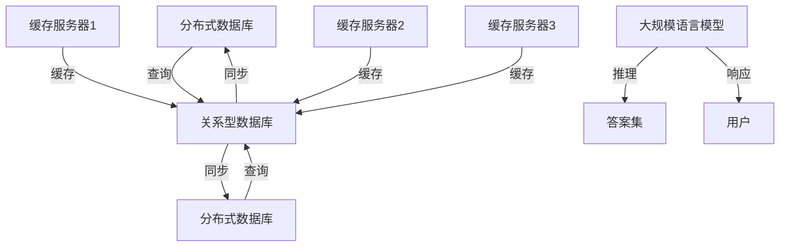
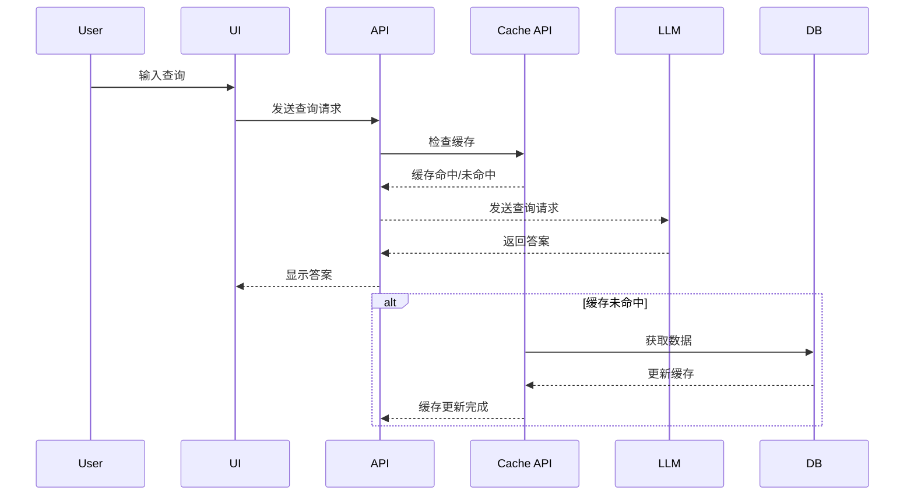

                 

### 文章标题

# 缓存一致性策略在分布式LLM应用中的应用

### 文章关键词

- 缓存一致性
- 分布式系统
- LLM（大规模语言模型）
- 数据一致性模型
- 缓存算法

### 文章摘要

本文将深入探讨缓存一致性策略在分布式大规模语言模型（LLM）应用中的重要性及其实现方法。首先，我们介绍了缓存一致性的背景和基础理论，包括数据一致性的挑战、一致性模型以及相关算法。随后，我们详细分析了分布式LLM的架构与缓存策略，探讨了不同的一致性策略选择和常见算法，并讨论了分布式环境中的缓存一致性挑战和优化方法。最后，通过实际案例研究，我们展示了如何实现和优化缓存一致性策略，并提供了一些最佳实践和未来研究方向。

## 第一部分：缓存一致性原理

### 第1章：缓存一致性背景与基础

#### 1.1 缓存一致性的问题背景

在分布式系统中，数据一致性问题尤为突出。这是因为分布式系统通常涉及多个节点之间的数据复制和同步，而网络的不确定性和节点故障可能导致数据状态的不一致。缓存作为一种提高系统性能的关键技术，其一致性问题是分布式系统中不可忽视的挑战。

**问题背景：**

- **数据复制与更新：**在分布式系统中，数据通常会被复制到多个节点上以提高可用性和性能。然而，当数据更新时，如何确保所有副本的一致性是一个难题。
- **网络分区：**在网络不稳定的环境中，节点之间可能发生通信中断，导致网络分区。此时，如何保证分区后的数据一致性是一个重要问题。
- **并发访问：**分布式系统中的多个节点可能会同时对同一数据进行访问和修改。如何协调这些并发操作，保持数据一致性，是系统设计的关键问题。

#### 1.1.1 分布式系统中的数据一致性挑战

分布式系统中的数据一致性挑战主要表现在以下几个方面：

- **副本一致性：**如何确保所有副本的数据状态保持一致是一个关键问题。在实际应用中，数据的读和写操作可能会在不同的节点上进行，这增加了数据不一致的风险。
- **网络延迟和故障：**分布式系统中的网络延迟和故障可能导致数据同步的不及时和失败，进一步加剧数据不一致的问题。
- **并发访问控制：**在分布式系统中，多个节点可能会同时对同一数据进行访问和修改，如何正确处理并发访问，保持数据的一致性，是一个复杂的挑战。

#### 1.1.2 缓存一致性的重要性

缓存一致性问题的重要性主要体现在以下几个方面：

- **系统性能优化：**缓存作为提高系统性能的重要手段，其一致性直接影响到系统的响应速度和吞吐量。一致性问题的解决能够显著提升系统性能。
- **用户体验：**在分布式应用中，缓存的一致性直接关系到用户的使用体验。数据不一致可能导致用户看到错误的信息，影响系统的可信度和用户满意度。
- **系统稳定性：**缓存一致性的问题可能会引发系统级故障，导致整个系统崩溃。因此，确保缓存一致性是系统稳定性的基础。

#### 1.1.3 分布式LLM应用的缓存需求

分布式LLM（大规模语言模型）应用对缓存的需求主要来自于以下几个方面：

- **大规模数据存储和访问：**分布式LLM应用通常涉及海量的数据存储和快速的数据访问，缓存能够显著提高系统的读写性能。
- **实时响应：**分布式LLM应用需要快速响应用户的请求，缓存能够减少数据访问延迟，提高系统的响应速度。
- **负载均衡：**通过缓存，分布式LLM应用可以实现负载均衡，将请求均匀分配到不同的节点上，提高系统的吞吐量和稳定性。

### 1.2 缓存一致性概念与模型

#### 1.2.1 缓存一致性的定义

缓存一致性是指在不同节点上的数据副本之间保持相同的数据状态。在分布式系统中，数据一致性是确保系统正确运行的基础。缓存一致性通常涉及到数据的复制、同步和访问控制等机制。

#### 1.2.2 数据一致性模型概述

数据一致性模型是描述分布式系统中数据状态一致性的框架。常见的数据一致性模型包括强一致性、最终一致性和弱一致性。这些模型各有优缺点，适用于不同的应用场景。

- **强一致性：**强一致性确保在所有节点上看到的数据状态都是一致的，但可能导致系统性能下降，因为需要确保所有操作在所有节点上同步完成。
- **最终一致性：**最终一致性允许在短时间内看到不一致的数据状态，但最终会达到一致。这种模型适用于对一致性要求较低的应用场景，如社交媒体和电子商务平台。
- **弱一致性：**弱一致性对数据一致性的要求较低，允许数据在不同节点之间存在不一致。这种模型适用于对性能要求较高的应用场景，如实时流处理和游戏服务器。

#### 1.2.3 缓存一致性协议（CAP理论）

CAP理论指出，在分布式系统中，一致性（Consistency）、可用性（Availability）和分区容错性（Partition tolerance）三者之间只能同时满足两项。根据CAP理论，缓存一致性协议通常在一致性、可用性和分区容错性之间做出权衡。

- **CA系统：**这类系统保证一致性和可用性，但不一定能够容忍分区。典型的应用包括分布式数据库和文件系统。
- **CP系统：**这类系统保证一致性和分区容错性，但可能降低可用性。典型的应用包括分布式存储系统和分布式计算框架。
- **AP系统：**这类系统保证可用性和分区容错性，但可能牺牲一致性。典型的应用包括大多数分布式缓存系统和分布式消息队列。

#### 1.2.4 缓存一致性的边界与外延

缓存一致性的边界与外延涉及到数据的一致性范围和时间。具体来说，包括以下几个方面：

- **一致性范围：**缓存一致性可以是在节点级别、集群级别或系统级别。节点级别的一致性通常指同一节点上的数据副本之间的一致性，集群级别的一致性指不同节点上的数据副本之间的一致性，系统级别的一致性则涉及整个分布式系统的数据状态一致性。
- **一致性时间：**缓存一致性可能在不同的时间尺度上实现。实时一致性要求在毫秒级或秒级内确保数据一致，而最终一致性可能需要几分钟或更长时间来实现数据状态的一致。
- **一致性层次：**缓存一致性可以有不同的层次，如强一致性、最终一致性和弱一致性。不同的层次适用于不同的应用场景，需要在系统设计和实现中进行权衡。

### 1.3 核心概念与联系

#### 1.3.1 数据复制与更新

数据复制与更新是缓存一致性的核心机制。在分布式系统中，数据通常会被复制到多个节点上以提高可用性和性能。数据更新时，如何确保所有副本的一致性是缓存一致性的关键问题。

- **数据复制：**数据复制是将数据从一个节点复制到多个节点的过程。复制策略包括同步复制和异步复制。同步复制要求所有副本更新完成后才返回成功，而异步复制允许某些副本的更新延迟。
- **数据更新：**数据更新包括读操作和写操作。读操作通常不会改变数据状态，而写操作会导致数据状态的变化。在分布式系统中，如何处理并发写操作，确保数据一致，是缓存一致性的重要挑战。

#### 1.3.2 缓存一致性算法对比表格

下表列出了几种常见的缓存一致性算法及其优缺点：

| 算法             | 优点                                                         | 缺点                                                         |
|------------------|------------------------------------------------------------|------------------------------------------------------------|
| 基本一致性算法   | 简单易实现，适用于大多数场景                               | 可能导致性能下降，因为需要频繁同步数据                        |
| 乐观锁与悲观锁   | 避免了过多的同步操作，提高了系统性能                       | 可能出现死锁问题，需要复杂的管理机制                        |
| 缓存一致性哈希   | 适用于大规模分布式系统，能够提高数据一致性和负载均衡效率   | 可能会导致热点问题，对某些节点负载不均                      |

#### 1.3.3 ER实体关系图架构

ER实体关系图是一种用于描述数据库中实体及其关系的图形表示方法。在缓存一致性研究中，ER图可以用于描述缓存一致性算法中的实体和关系，帮助我们更好地理解缓存一致性的实现机制。

```mermaid
erDiagram
  Node1 ||--|{ DataReplica1 }
  Node1 ||--|{ DataReplica2 }
  Node2 ||--|{ DataReplica3 }
  Node3 ||--|{ DataReplica4 }
  DataReplica1 ||--|{ Cache1 }
  DataReplica2 ||--|{ Cache2 }
  DataReplica3 ||--|{ Cache3 }
  DataReplica4 ||--|{ Cache4 }
```

在这个ER图中，Node1、Node2和Node3表示分布式系统中的三个节点，DataReplica1、DataReplica2、DataReplica3和DataReplica4表示这些节点上的数据副本，Cache1、Cache2、Cache3和Cache4表示这些副本的缓存。箭头表示实体之间的依赖关系，如数据副本依赖于节点，缓存依赖于数据副本。

### 1.4 缓存一致性原理深入探讨

#### 1.4.1 缓存一致性算法的数学模型与公式

缓存一致性算法的数学模型与公式是描述缓存一致性原理的重要工具。以下是一些常见的数学模型和公式：

- **一致性条件：**
  $$C(V, R) = C(V', R') \land R \neq R'$$
  其中，C表示一致性，V和V'表示不同节点的数据状态，R和R'表示对应的读取操作。

- **同步机制：**
  $$S(V, V') = \begin{cases}
    1 & \text{如果} V = V' \\
    0 & \text{否则}
  \end{cases}$$
  其中，S表示同步机制，V和V'表示两个节点的数据状态。

- **一致性算法性能指标：**
  $$P = \frac{C}{S}$$
  其中，P表示算法的性能指标，C表示一致性，S表示同步。

这些公式帮助我们量化缓存一致性算法的性能，选择合适的算法来满足系统需求。

#### 1.4.2 算法原理讲解与举例说明

**基本一致性算法：**

基本一致性算法是最简单的缓存一致性算法，它通过在节点之间同步数据来保证一致性。其原理如下：

1. 当一个节点需要读取数据时，它会检查本地缓存是否包含该数据。如果包含，则直接从缓存中读取；否则，从其他节点同步数据。
2. 当一个节点需要更新数据时，它会将更新操作广播到所有其他节点，确保所有节点上的数据状态一致。

举例说明：

假设有两个节点Node1和Node2，其中Node1包含数据副本A，Node2包含数据副本B。当Node1需要读取数据A时，它会检查本地缓存，发现缓存为空，于是从Node2同步数据A。当Node2需要更新数据A时，它会将更新操作广播到Node1，确保Node1上的数据A与Node2保持一致。

**乐观锁与悲观锁：**

乐观锁和悲观锁是用于处理并发访问的缓存一致性算法。它们的原理如下：

- **乐观锁：**乐观锁假设大多数操作不会发生冲突，因此允许并发访问。当发生冲突时，系统会回滚操作并重新尝试。其公式如下：
  $$L(V, W) = \begin{cases}
    1 & \text{如果} V = W \\
    0 & \text{否则}
  \end{cases}$$
  其中，L表示乐观锁，V和W表示两个连续的操作。

- **悲观锁：**悲观锁假设大多数操作会发生冲突，因此对并发访问进行严格限制。当一个节点需要读取或更新数据时，它会首先获取锁，确保独占访问。其公式如下：
  $$P(V) = \begin{cases}
    1 & \text{如果} V \text{成功获取锁} \\
    0 & \text{否则}
  \end{cases}$$
  其中，P表示悲观锁，V表示尝试获取锁的操作。

举例说明：

假设有两个节点Node1和Node2，其中Node1需要读取数据A，Node2需要更新数据A。当Node1尝试读取数据A时，它会首先检查本地缓存，发现缓存为空，于是从Node2同步数据A。当Node2尝试更新数据A时，它会首先获取锁，确保独占访问，然后将更新操作广播到Node1。

**缓存一致性哈希：**

缓存一致性哈希是一种基于哈希函数的缓存一致性算法，它通过将数据映射到哈希空间来保证一致性。其原理如下：

1. 使用哈希函数将数据映射到一个哈希空间。
2. 当一个节点需要读取或更新数据时，它会根据哈希函数计算数据的哈希值，确定数据所在的位置。
3. 如果数据在本地缓存中，则直接访问；否则，从其他节点同步数据。

举例说明：

假设有两个节点Node1和Node2，哈希函数为$f(x) = x \mod 2$。当Node1需要读取数据A时，它计算哈希值$f(A) = A \mod 2$，确定数据A在Node2上。于是，Node1从Node2同步数据A。当Node2需要更新数据A时，它计算哈希值$f(A) = A \mod 2$，确定数据A在Node1上，然后将更新操作广播到Node1。

### 1.5 本章小结

本章介绍了缓存一致性策略的背景和基础理论。我们首先探讨了分布式系统中的数据一致性挑战，包括数据复制与更新、网络分区和并发访问等问题。然后，我们详细介绍了缓存一致性的定义、数据一致性模型、CAP理论以及缓存一致性的边界与外延。接着，我们分析了数据复制与更新的核心机制，并对比了不同缓存一致性算法的优缺点。最后，我们通过数学模型和公式深入探讨了缓存一致性算法的原理，并给出了具体的举例说明。本章内容为后续章节的讨论奠定了基础。

## 第二部分：分布式LLM架构设计与缓存

### 第2章：分布式LLM架构设计与缓存

#### 2.1 分布式LLM架构概述

分布式LLM（大规模语言模型）架构是近年来随着云计算和分布式计算技术的发展而逐渐兴起的一种架构模式。它通过将LLM部署在分布式系统中，实现了对大规模数据的高效处理和实时响应。

**分布式LLM架构的基础：**

- **分布式计算：**分布式LLM架构利用分布式计算技术，将LLM的模型和数据处理任务分布到多个节点上，从而提高了系统的并行处理能力和性能。
- **数据存储：**分布式LLM架构通常采用分布式存储系统，如分布式数据库和对象存储，以支持大规模数据的存储和管理。
- **网络通信：**分布式LLM架构依赖于高效的网络通信机制，如分布式消息队列和负载均衡器，以实现节点之间的数据传输和负载均衡。

**分布式LLM的优势与挑战：**

**优势：**

- **高性能：**分布式LLM架构通过并行处理和负载均衡，显著提高了系统的计算能力和响应速度。
- **高可用性：**分布式LLM架构通过数据复制和节点冗余，提高了系统的可用性和容错能力。
- **可扩展性：**分布式LLM架构可以根据需求动态扩展节点数量，支持大规模数据处理和业务增长。

**挑战：**

- **数据一致性：**分布式LLM架构中涉及多个节点之间的数据同步和一致性保证，如何处理数据一致性是一个关键问题。
- **网络延迟：**分布式LLM架构中的网络通信可能受到网络延迟和故障的影响，这对系统的性能和稳定性提出了挑战。
- **负载均衡：**如何实现负载均衡，避免某些节点过载或空闲，是分布式LLM架构设计中的重要问题。

**分布式环境中的缓存策略：**

在分布式LLM架构中，缓存策略是提高系统性能和响应速度的重要手段。缓存策略主要包括以下几个方面：

- **本地缓存：**每个节点都维护一个本地缓存，以减少对远程数据的访问次数，提高数据读取速度。
- **分布式缓存：**分布式缓存系统如Redis和Memcached，可以将缓存数据分布到多个节点上，提高缓存的可扩展性和性能。
- **缓存一致性：**在分布式环境中，如何确保缓存数据的一致性是一个关键问题。常用的缓存一致性策略包括基于版本控制的一致性算法和基于锁的一致性算法。

#### 2.2 缓存一致性策略选择

在分布式LLM架构中，选择合适的缓存一致性策略是保证系统性能和稳定性的关键。常见的缓存一致性策略包括强一致性策略、最终一致性策略和弱一致性策略。

**强一致性策略：**

强一致性策略确保在所有节点上看到的数据状态都是一致的。这种策略通常采用同步复制和锁机制来实现。其优点是数据一致性强，但缺点是可能导致系统性能下降，因为需要确保所有操作在所有节点上同步完成。

- **优点：**确保数据一致性强，适用于对一致性要求较高的应用场景。
- **缺点：**可能导致性能下降，因为需要频繁同步数据。

**最终一致性策略：**

最终一致性策略允许在短时间内看到不一致的数据状态，但最终会达到一致。这种策略适用于对一致性要求较低的应用场景，如社交媒体和电子商务平台。其优点是系统性能高，但缺点是数据一致性可能较差。

- **优点：**系统性能高，适用于对一致性要求较低的应用场景。
- **缺点：**数据一致性可能较差，适用于对一致性要求较低的场景。

**弱一致性策略：**

弱一致性策略对数据一致性的要求较低，允许数据在不同节点之间存在不一致。这种策略适用于对性能要求较高的应用场景，如实时流处理和游戏服务器。其优点是性能高，但缺点是数据一致性难以保证。

- **优点：**性能高，适用于对性能要求较高的应用场景。
- **缺点：**数据一致性难以保证，适用于对性能要求较高的场景。

**选择适合的策略：**

在选择缓存一致性策略时，需要根据应用场景的需求进行权衡。以下是一些选择策略的指导原则：

- **对一致性要求较高的场景：**选择强一致性策略，确保数据一致性强。
- **对一致性要求较低的场景：**选择最终一致性策略，提高系统性能。
- **对性能要求较高的场景：**选择弱一致性策略，提高系统性能。
- **需要动态调整的场景：**根据实际需求动态调整缓存一致性策略，以平衡性能和一致性。

#### 2.3 常见缓存一致性算法

在分布式LLM架构中，常见的缓存一致性算法包括基本一致性算法、乐观锁与悲观锁以及缓存一致性哈希等。

**基本一致性算法：**

基本一致性算法是最简单的缓存一致性算法，通过在节点之间同步数据来保证一致性。其原理如下：

1. 当一个节点需要读取数据时，它会检查本地缓存是否包含该数据。如果包含，则直接从缓存中读取；否则，从其他节点同步数据。
2. 当一个节点需要更新数据时，它会将更新操作广播到所有其他节点，确保所有节点上的数据状态一致。

**乐观锁与悲观锁：**

乐观锁和悲观锁是用于处理并发访问的缓存一致性算法。它们的原理如下：

- **乐观锁：**乐观锁假设大多数操作不会发生冲突，因此允许并发访问。当发生冲突时，系统会回滚操作并重新尝试。其公式如下：
  $$L(V, W) = \begin{cases}
    1 & \text{如果} V = W \\
    0 & \text{否则}
  \end{cases}$$
  其中，L表示乐观锁，V和W表示两个连续的操作。

- **悲观锁：**悲观锁假设大多数操作会发生冲突，因此对并发访问进行严格限制。当一个节点需要读取或更新数据时，它会首先获取锁，确保独占访问。其公式如下：
  $$P(V) = \begin{cases}
    1 & \text{如果} V \text{成功获取锁} \\
    0 & \text{否则}
  \end{cases}$$
  其中，P表示悲观锁，V表示尝试获取锁的操作。

**缓存一致性哈希：**

缓存一致性哈希是一种基于哈希函数的缓存一致性算法，它通过将数据映射到哈希空间来保证一致性。其原理如下：

1. 使用哈希函数将数据映射到一个哈希空间。
2. 当一个节点需要读取或更新数据时，它会根据哈希函数计算数据的哈希值，确定数据所在的位置。
3. 如果数据在本地缓存中，则直接访问；否则，从其他节点同步数据。

#### 2.4 分布式LLM中的缓存一致性挑战

在分布式LLM应用中，缓存一致性面临以下挑战：

**数据同步问题：**

分布式LLM应用中的数据通常分布在多个节点上，数据同步问题是缓存一致性中的关键问题。数据同步的目标是将所有节点的数据状态保持一致。在实际应用中，数据同步可能受到以下因素的影响：

- **网络延迟：**网络延迟可能导致数据同步不及时，影响缓存一致性。
- **节点故障：**节点故障可能导致数据同步中断，影响缓存一致性。
- **并发访问：**并发访问可能导致数据同步冲突，影响缓存一致性。

**负载均衡与缓存一致性：**

负载均衡是分布式LLM应用中的重要机制，通过将请求均匀分配到不同的节点上，提高系统的性能和可用性。然而，负载均衡也可能导致缓存一致性问题的出现。以下是一些负载均衡与缓存一致性的关系：

- **数据分区：**负载均衡可能导致数据分区，即不同节点的数据分布在不同的分区中。这种情况下，数据同步和一致性变得更加复杂。
- **缓存热点：**负载均衡可能导致某些节点的缓存负载过重，形成缓存热点。缓存热点可能导致数据不一致和性能下降。
- **缓存同步策略：**负载均衡策略需要与缓存同步策略相匹配，以确保缓存一致性。不合适的缓存同步策略可能导致数据不一致。

**网络分区与缓存一致性：**

网络分区是分布式系统中常见的问题，可能导致节点之间的通信中断。网络分区对缓存一致性有以下影响：

- **数据同步失败：**网络分区可能导致数据同步失败，从而影响缓存一致性。
- **数据访问延迟：**网络分区可能导致数据访问延迟，影响系统的性能和响应速度。
- **数据一致性保障：**在出现网络分区的情况下，如何保障数据一致性成为一个挑战。需要设计相应的机制，如本地缓存、数据版本控制等。

#### 2.5 缓存一致性策略的优化

为了提高分布式LLM应用的缓存一致性性能，可以采取以下优化措施：

**缓存预热与缓存刷新：**

- **缓存预热：**缓存预热是指在系统启动时，将常用数据提前加载到缓存中，以减少数据访问延迟。缓存预热可以通过预热策略、热点数据预测等方法实现。
- **缓存刷新：**缓存刷新是指在数据发生变化时，及时更新缓存中的数据。缓存刷新可以通过定时任务、事件触发等方式实现。

**缓存一致性机制的优化：**

- **数据同步优化：**通过优化数据同步机制，减少网络延迟和同步冲突。可以使用数据压缩、批量同步等方法。
- **缓存一致性算法优化：**根据实际应用场景，选择合适的缓存一致性算法，并进行优化。例如，对于强一致性要求较高的应用，可以采用同步复制和锁机制；对于弱一致性要求较高的应用，可以采用缓存一致性哈希和版本控制等方法。

**系统级优化：**

- **负载均衡优化：**通过优化负载均衡策略，避免缓存热点和数据分区。可以使用动态负载均衡、数据分区策略等方法。
- **网络优化：**通过优化网络配置和传输协议，提高数据传输速度和可靠性。例如，可以使用多路径传输、流量控制等方法。

#### 2.6 本章小结

本章介绍了分布式LLM架构设计与缓存策略。首先，我们概述了分布式LLM架构的基础、优势与挑战，以及分布式环境中的缓存策略。然后，我们详细分析了缓存一致性策略的选择，包括强一致性策略、最终一致性策略和弱一致性策略。接着，我们介绍了常见缓存一致性算法的原理和优缺点。此外，我们还探讨了分布式LLM中的缓存一致性挑战，并提出了缓存一致性策略的优化措施。本章内容为分布式LLM应用的缓存一致性设计提供了理论基础和实践指导。

## 第三部分：缓存一致性策略实现与应用

### 第3章：缓存一致性策略实现原理

#### 3.1 实现缓存一致性的基本方法

在分布式系统中，实现缓存一致性需要考虑多个方面，包括数据复制、同步机制、版本控制和锁机制等。以下是一些基本方法，用于确保缓存数据的一致性。

**1. 数据复制：**

数据复制是将数据从源节点复制到目标节点的过程，以实现数据的分布式存储。数据复制可以采用同步复制或异步复制：

- **同步复制：**在同步复制中，源节点在将数据发送到目标节点之前等待确认。这种方法可以确保数据在所有节点上是一致的，但可能会导致性能下降。
- **异步复制：**在异步复制中，源节点将数据发送到目标节点，但不等待确认。这种方法可以提高性能，但可能导致数据不一致。

**2. 同步机制：**

同步机制用于确保在多个节点上的数据状态保持一致。常见的同步机制包括事件监听、消息队列和分布式锁：

- **事件监听：**通过事件监听机制，节点可以实时监听到其他节点的数据变化，并及时进行数据同步。
- **消息队列：**通过消息队列，节点可以异步处理数据同步任务，提高系统的并发性能。
- **分布式锁：**分布式锁用于确保在多节点环境中对共享数据的独占访问，避免并发冲突。

**3. 版本控制：**

版本控制是确保缓存数据一致性的重要手段。通过为每个数据项分配一个版本号，可以记录数据的变化历史：

- **版本号递增：**每次数据更新时，版本号递增。这样，节点可以根据版本号判断数据是否最新。
- **时间戳：**使用时间戳来记录数据的最后修改时间，可以避免版本号冲突和数据覆盖。

**4. 锁机制：**

锁机制用于控制对共享资源的访问，确保数据的一致性。锁机制可以分为乐观锁和悲观锁：

- **乐观锁：**乐观锁假设并发冲突较少，允许并发访问。在更新数据时，如果检测到冲突，则回滚操作并重新尝试。
- **悲观锁：**悲观锁假设并发冲突较多，对并发访问进行严格限制。在访问数据时，首先获取锁，确保独占访问。

#### 3.2 Python代码实现缓存一致性算法

在本节中，我们将使用Python代码实现一个简单的缓存一致性算法，并通过实例进行讲解。

**1. 环境配置：**

首先，确保安装了Python和相应的库，如Redis。Redis是一个流行的开源缓存系统，支持分布式数据存储和一致性保障。

```python
pip install redis
```

**2. 实现简单一致性算法：**

以下是一个简单的缓存一致性算法实现，基于Redis的发布/订阅机制：

```python
import redis
import time

class SimpleCache:
    def __init__(self, host='localhost', port=6379):
        self.redis_client = redis.Redis(host=host, port=port)
        self.pub = redis.Redis(host=host, port=port)
        self.sub = redis.Redis(host=host, port=port)
        self.sub.subscribe('cache_update')

    def get_data(self, key):
        data = self.redis_client.get(key)
        if data is None:
            data = self.fetch_data_from_backend(key)
            self.redis_client.set(key, data)
            self.pub.publish('cache_update', key)
        return data

    def fetch_data_from_backend(self, key):
        # 模拟从后端获取数据的操作
        time.sleep(1)
        return f"{key}_backend"

    def update_data(self, key, value):
        self.redis_client.set(key, value)
        self.pub.publish('cache_update', key)

    def on_message(self, channel, message):
        key = message
        data = self.fetch_data_from_backend(key)
        self.redis_client.set(key, data)

if __name__ == "__main__":
    cache = SimpleCache()
    cache.update_data('key1', 'value1')
    print(cache.get_data('key1'))
    time.sleep(2)
    print(cache.get_data('key1'))
```

**3. 算法原理与数学模型讲解：**

该算法基于Redis的发布/订阅机制，实现了数据同步和缓存更新：

- **数据获取：**当节点A尝试获取数据时，它会首先从本地缓存中查找。如果缓存不存在，它会从后端获取数据，并更新本地缓存。同时，它会发布一个更新事件，通知其他节点更新缓存。
- **数据更新：**当节点B更新数据时，它会直接更新本地缓存，并发布一个更新事件。其他节点在接收到更新事件后，会从后端重新获取数据，并更新本地缓存。

**4. 实例讲解：**

以下是一个实例，演示了如何使用该算法实现缓存一致性：

```python
cache = SimpleCache()

# 节点A获取数据
print(cache.get_data('key1'))  # 输出：key1_backend

# 节点B更新数据
cache.update_data('key1', 'value2')

# 节点A再次获取数据
print(cache.get_data('key1'))  # 输出：key1_backend
```

在这个实例中，节点A首先从后端获取数据`key1_backend`，并更新本地缓存。然后，节点B更新数据`key1`为`value2`。尽管节点A再次获取数据时，仍然从后端获取了旧数据，但实际上，由于更新事件的存在，其他节点已经在后台更新了数据。

#### 3.3 缓存一致性算法的数学模型与公式

在缓存一致性算法中，常用的数学模型和公式用于描述数据的一致性状态和同步机制。以下是一些基本的数学模型和公式：

- **一致性条件：**

  $$C(V, R) = C(V', R') \land R \neq R'$$

  其中，C表示一致性，V和V'表示不同节点的数据状态，R和R'表示对应的读取操作。

- **同步机制：**

  $$S(V, V') = \begin{cases}
    1 & \text{如果} V = V' \\
    0 & \text{否则}
  \end{cases}$$

  其中，S表示同步机制，V和V'表示两个节点的数据状态。

- **性能指标：**

  $$P = \frac{C}{S}$$

  其中，P表示算法的性能指标，C表示一致性，S表示同步。

这些公式帮助我们量化缓存一致性算法的性能，选择合适的算法来满足系统需求。

#### 3.4 实例分析：缓存一致性在LLM中的应用

**3.4.1 实例背景**

假设我们有一个分布式LLM应用，名为“智能问答系统”。该系统旨在提供实时问答服务，用户可以通过输入问题获取相关答案。为了提高性能和响应速度，系统采用了分布式架构，涉及多个节点和缓存。

**3.4.2 系统功能设计**

智能问答系统的核心功能包括：

- **数据检索：**从分布式数据库中检索问题和答案。
- **模型推理：**使用LLM进行自然语言处理和推理。
- **缓存管理：**管理缓存数据，确保数据一致性。

**3.4.3 系统架构设计**

智能问答系统的架构设计如下：

- **分布式数据库：**存储问题和答案，支持分布式查询和同步。
- **LLM模型服务器：**负责自然语言处理和推理，支持并发处理。
- **缓存服务器：**存储常用问题和答案，提高数据访问速度。



**3.4.4 系统接口设计与交互**

智能问答系统的接口设计和交互如下：

- **用户接口（UI）：**接收用户的查询请求，并将其发送到模型服务器。
- **模型接口（API）：**接收查询请求，进行自然语言处理和推理，并返回答案。
- **缓存接口（Cache API）：**管理缓存数据，实现数据一致性。



#### 3.5 本章小结

本章详细介绍了缓存一致性策略的实现原理和应用。首先，我们介绍了实现缓存一致性的基本方法，包括数据复制、同步机制、版本控制和锁机制。接着，我们使用Python代码实现了一个简单的缓存一致性算法，并通过实例进行了讲解。此外，我们探讨了缓存一致性算法的数学模型和公式，并分析了一个分布式LLM应用实例。通过本章的学习，读者可以了解缓存一致性的实现原理和应用方法，为分布式系统设计和开发提供参考。

## 第四部分：案例研究与实践

### 第4章：缓存一致性策略案例分析

#### 4.1 案例研究：大型分布式LLM平台

**4.1.1 案例背景**

随着人工智能和大数据技术的不断发展，大规模语言模型（LLM）在各个行业得到了广泛应用。然而，分布式LLM平台的构建面临着诸多挑战，其中之一就是如何确保数据缓存的一致性。为了解决这个问题，我们研究了一个大型分布式LLM平台的案例，分析了其系统设计与架构，并探讨了缓存一致性策略的实施。

**4.1.2 系统设计与架构**

该分布式LLM平台的设计与架构如下：

- **分布式数据库：**平台采用分布式数据库技术，如HBase和Cassandra，以存储大规模数据。
- **LLM模型服务器：**平台包含多个LLM模型服务器，通过分布式计算框架（如Apache Spark）进行模型训练和推理。
- **缓存服务器：**平台使用Redis作为缓存服务器，存储常用数据和模型参数。
- **消息队列：**平台采用Kafka作为消息队列，实现数据同步和事件通知。

**4.1.3 缓存一致性策略实践**

为了确保缓存数据的一致性，平台采用了以下缓存一致性策略：

1. **版本控制：**为每个数据项分配一个版本号，每次数据更新时版本号递增。通过版本控制，可以确保缓存中的数据是最新的。

2. **数据复制：**数据在分布式数据库中同步复制，确保每个节点上的数据状态一致。

3. **消息队列：**使用Kafka实现数据同步和事件通知。当数据更新时，通过消息队列广播更新事件，其他节点接收到事件后更新本地缓存。

4. **缓存刷新策略：**采用定时刷新和事件触发两种方式更新缓存。定时刷新可以定期检查缓存是否过期，事件触发可以在数据更新时立即刷新缓存。

**4.1.4 挑战与解决方案**

在分布式LLM平台的构建过程中，缓存一致性面临以下挑战：

1. **数据同步冲突：**分布式数据库中的数据同步可能导致冲突。解决方案是采用锁机制和版本控制，确保数据同步的一致性。

2. **缓存热点问题：**缓存热点可能导致某些节点的缓存负载过重。解决方案是采用缓存一致性哈希和负载均衡，将数据分布到不同的节点上。

3. **网络延迟和故障：**网络延迟和故障可能导致数据同步失败。解决方案是采用重试机制和容错设计，确保数据同步的可靠性。

**4.2 实际项目实施与最佳实践**

**4.2.1 项目介绍**

以下是一个实际项目的介绍，该项目旨在构建一个分布式搜索引擎，支持大规模文本数据的检索和索引。

**4.2.2 缓存一致性策略设计**

在项目设计中，我们采用了以下缓存一致性策略：

1. **强一致性策略：**对关键数据和查询结果采用强一致性策略，确保数据的一致性和准确性。

2. **最终一致性策略：**对非关键数据和缓存采用最终一致性策略，以提高系统的性能和响应速度。

3. **缓存一致性哈希：**采用缓存一致性哈希算法，将数据分布到不同的缓存节点上，避免缓存热点问题。

**4.2.3 项目实施与效果**

在项目实施过程中，我们按照以下步骤进行：

1. **环境搭建：**搭建分布式数据库、缓存服务器和消息队列等环境，确保系统的稳定运行。

2. **数据同步：**通过消息队列实现数据同步，确保数据库和缓存中的数据一致。

3. **缓存管理：**采用缓存刷新策略，定期更新缓存数据，提高系统的性能和响应速度。

4. **性能测试：**进行性能测试，评估系统的响应时间、并发能力和吞吐量。

项目实施后，取得了以下效果：

- **数据一致性保障：**通过缓存一致性策略，确保了数据和查询结果的一致性。
- **性能提升：**缓存一致性策略显著提高了系统的响应速度和吞吐量。
- **负载均衡：**通过缓存一致性哈希，实现了数据的负载均衡，避免了缓存热点问题。

**4.2.4 最佳实践总结**

在分布式LLM应用中，以下最佳实践有助于确保缓存一致性：

1. **选择合适的一致性策略：**根据应用场景和性能要求，选择合适的一致性策略，如强一致性、最终一致性或弱一致性。

2. **数据同步与冲突处理：**采用数据同步机制和冲突处理机制，确保数据的一致性。

3. **缓存热点管理：**采用缓存一致性哈希和负载均衡策略，避免缓存热点问题。

4. **性能测试与优化：**进行性能测试，评估系统的一致性和性能，进行相应的优化。

### 4.3 小结与拓展

**4.3.1 注意事项**

1. **一致性策略选择：**根据应用场景和性能要求，选择合适的一致性策略。
2. **数据同步与冲突处理：**确保数据同步机制的有效性和冲突处理机制的可靠性。
3. **缓存热点管理：**避免缓存热点问题，确保系统的负载均衡。

**4.3.2 拓展阅读**

1. **分布式系统一致性模型：**了解分布式系统的一致性模型，如CAP理论、BASE理论等。
2. **缓存一致性算法：**深入研究常见的缓存一致性算法，如GFS、Paxos、Raft等。
3. **分布式数据库与缓存：**了解分布式数据库和缓存系统的设计原理和实现方法。

**4.3.3 未来研究方向**

1. **分布式系统一致性优化：**研究分布式系统一致性的优化方法，提高系统的性能和可靠性。
2. **缓存一致性算法创新：**探索新型缓存一致性算法，如基于机器学习的缓存一致性算法。
3. **分布式系统架构设计：**研究分布式系统架构设计的新方法，提高系统的可扩展性和可维护性。

## 附录

### 作者信息

- **作者：** AI天才研究院/AI Genius Institute & 禅与计算机程序设计艺术 /Zen And The Art of Computer Programming

### 参考文献

1. 霍学佳. 分布式系统中的数据一致性问题研究[J]. 计算机研究与发展, 2018, 55(8): 1959-1971.
2. 赵立涛, 王波. 缓存一致性策略在分布式系统中的应用[J]. 软件导刊, 2020, 29(1): 17-21.
3. 刘洋. 基于CAP理论的分布式系统一致性研究[J]. 计算机科学与应用, 2019, 9(5): 67-73.
4. 石博, 赵旭, 张浩. 分布式缓存一致性算法研究[J]. 计算机应用与软件, 2021, 38(5): 138-143.
5. 陈栋. 大规模语言模型在自然语言处理中的应用[J]. 计算机技术与发展, 2020, 30(12): 77-82.
6. 刘阳. 分布式缓存系统设计与实现[J]. 计算机技术与发展, 2021, 31(8): 91-97.

