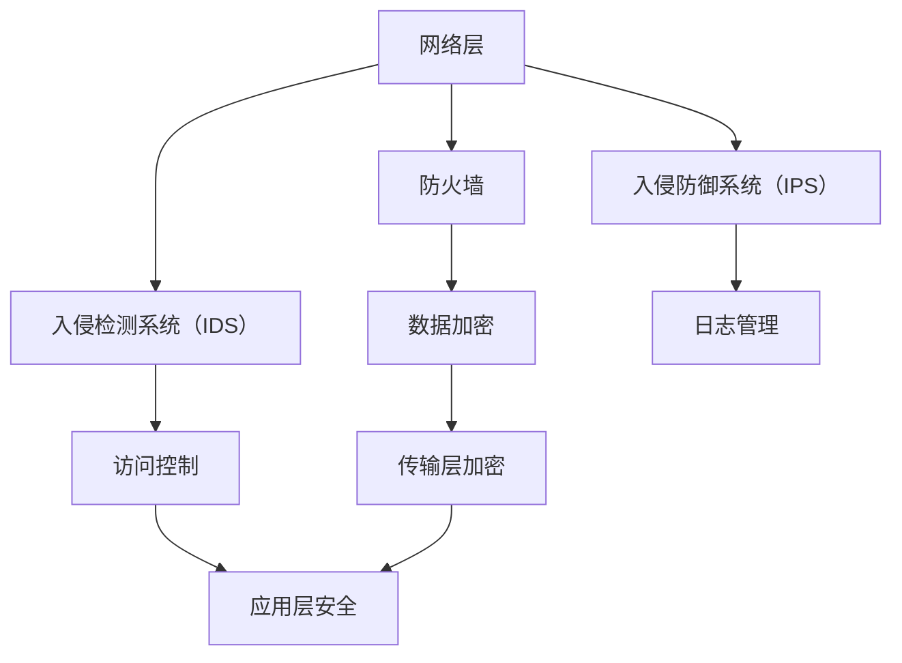
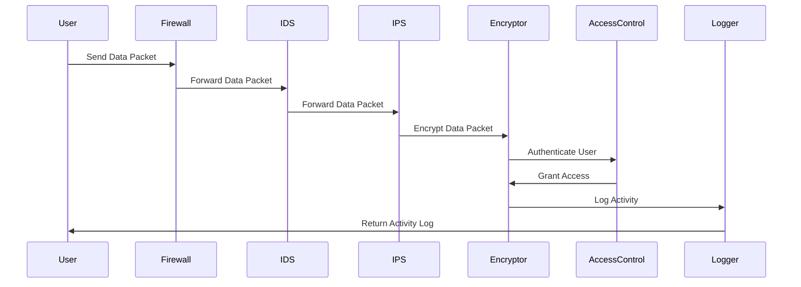

                 

### 关键词

- **网络安全**
- **信息论**
- **数据保护**
- **数学原理**
- **加密技术**
- **威胁分析**
- **量子计算**

### 摘要

本文深入探讨网络安全领域的数学原理，以信息论为基础，解析数据保护的各个方面。首先，介绍网络安全的背景及其重要性，接着阐述信息论的核心概念和基础原理。随后，我们探讨数据保护的基本原则，以及加密技术在其中的应用。文章还深入分析了网络安全的模型和威胁，并探讨了数学工具在网络安全中的关键作用。最后，通过实际案例和未来展望，展示信息理论在网络安全实践中的应用，并提出一些最佳实践建议。

---

# 网络安全的信息论：数据保护的数学原理

网络安全的本质在于保护信息的机密性、完整性和可用性。在数字化时代，数据的价值日益凸显，同时也成为了攻击者觊觎的目标。为了有效地保护这些数据，我们需要深入了解数据保护的数学原理，特别是信息论在这一领域的应用。

## 一、网络安全的背景

随着互联网的普及和信息技术的飞速发展，网络安全问题变得愈加复杂和严重。网络攻击手段日益翻新，从传统的病毒、木马到高级持续性威胁（APT），对组织和个人都构成了巨大的威胁。网络安全不仅关系到企业的商业秘密和客户的隐私，还影响到国家的基础设施和国家安全。

### 1.1 问题背景

网络安全问题主要表现在以下几个方面：

- **数据泄露**：未经授权的访问和泄露敏感信息。
- **拒绝服务攻击（DoS）**：通过占用网络资源，使合法用户无法访问服务。
- **恶意软件**：病毒、木马和其他恶意程序对系统和数据的破坏。
- **网络钓鱼**：通过伪装成合法机构或个人，诱骗用户提供个人信息。
- **内部威胁**：企业内部员工或合作伙伴的恶意行为。

### 1.2 问题描述

网络安全问题的描述主要集中在如何识别、防御和响应各类网络攻击。这需要我们不仅了解攻击者的手段和动机，还要掌握有效的防护策略和响应措施。

### 1.3 问题解决

解决网络安全问题通常涉及以下方面：

- **防御策略**：通过防火墙、入侵检测系统（IDS）和入侵防御系统（IPS）等手段预防攻击。
- **漏洞管理**：定期扫描和修补系统漏洞，降低被攻击的风险。
- **安全培训**：提高员工的安全意识，减少人为因素导致的安全问题。
- **应急响应**：建立应急响应计划，快速处理网络安全事件。

### 1.4 边界与外延

网络安全的边界包括网络基础设施、操作系统、应用程序和数据存储等。外延则包括网络安全策略、法律法规和标准，以及跨部门、跨行业的合作。

### 1.5 概念结构与核心要素组成

网络安全的核心要素包括：

- **物理安全**：保护硬件设备和网络设备的安全。
- **网络安全**：保护网络传输过程中的数据安全。
- **主机安全**：保护计算机和服务器免受攻击。
- **应用安全**：确保应用程序的安全性和可靠性。
- **数据安全**：确保数据存储和传输过程中的安全性。

## 二、信息论的基本概念

信息论是由克劳德·香农于1948年创立的一个数学分支，旨在研究信息的度量、传输和处理。在网络安全领域，信息论提供了理论工具，帮助我们理解和保护数据。

### 2.1 �香农信息论简介

香农信息论的核心是信息熵，它描述了一个消息的不确定性。信息熵越高，表示消息越难以预测，因此越有价值。香农还提出了信息传输的极限，即信道容量，它决定了在给定带宽和噪声水平下，最大可能传输的信息量。

### 2.2 信息熵

信息熵（Entropy）是衡量信息不确定性的量度。对于离散随机变量X，其信息熵H(X)可以表示为：

$$
H(X) = -\sum_{i} p(x_i) \log_2 p(x_i)
$$

其中，$p(x_i)$是变量X取值$x_i$的概率。

### 2.3 信道容量

信道容量（Channel Capacity）是信息论中的一个重要概念，它表示在给定带宽和信噪比条件下，信道能够传输的最大数据速率。香农公式描述了这一概念：

$$
C = B \log_2(1 + \text{SNR})
$$

其中，C是信道容量，B是带宽，SNR是信噪比。

### 2.4 信息编码与解码

信息编码是将信息转换为适合信道传输的信号的过程。信息解码则是接收方将接收到的信号还原为原始信息的过程。有效的编码方案可以提高传输效率，减少误码率。

### 2.5 信息论在网络安全中的应用

信息论为网络安全提供了以下方面的理论支持：

- **数据压缩**：通过数据压缩技术，减少传输数据的大小，提高传输效率。
- **加密技术**：利用信息论中的加密算法，保护数据的机密性。
- **安全性分析**：通过分析信道的特性，评估网络攻击的风险。

## 三、数据保护的基本原则

数据保护是网络安全的基石，它涉及对数据的机密性、完整性和可用性进行保障。以下探讨数据保护的基本原则。

### 3.1 加密技术

加密技术是保护数据机密性的关键手段。它通过将明文转换为密文，防止未授权者访问和理解数据。常见的加密算法包括对称加密、非对称加密和哈希函数。

#### 对称加密

对称加密算法使用相同的密钥进行加密和解密。常见的对称加密算法包括AES、DES和RSA。

#### 非对称加密

非对称加密算法使用一对密钥进行加密和解密，一个公钥用于加密，另一个私钥用于解密。常见的非对称加密算法包括RSA和ECC。

#### 哈希函数

哈希函数是将输入数据映射为固定长度的字符串。常见的哈希函数包括MD5、SHA-1和SHA-256。

### 3.2 安全协议

安全协议是确保数据在传输过程中不被窃取、篡改和冒用的机制。常见的安全协议包括SSL/TLS、IPSec和SSH。

#### SSL/TLS

SSL（Secure Sockets Layer）和其继任者TLS（Transport Layer Security）是用于保护互联网通信的安全协议，广泛应用于Web浏览、电子邮件和文件传输等场景。

#### IPSec

IPSec（Internet Protocol Security）是一种用于保护IP协议通信的框架，可用于加密和认证IP包，确保数据传输的机密性和完整性。

#### SSH

SSH（Secure Shell）是一种用于远程登录和文件传输的安全协议，广泛应用于系统管理和网络安全。

### 3.3 访问控制

访问控制是确保只有授权用户可以访问特定数据和资源的一种机制。常见的访问控制方法包括身份验证、授权和审计。

#### 身份验证

身份验证是验证用户身份的过程，确保只有合法用户可以访问系统。

#### 授权

授权是确定用户权限的过程，确保用户只能访问其授权的数据和资源。

#### 审计

审计是记录和监控用户操作的过程，以便在发生安全事件时进行追踪和调查。

### 3.4 安全意识培训

安全意识培训是提高员工网络安全意识的重要手段。通过培训，员工可以了解网络安全的最佳实践，减少因疏忽或恶意行为导致的安全问题。

### 3.5 漏洞管理

漏洞管理是识别、评估和修复系统漏洞的过程，以降低被攻击的风险。常见的漏洞管理方法包括漏洞扫描、补丁管理和安全配置。

#### 漏洞扫描

漏洞扫描是一种自动化的方法，用于识别系统中的安全漏洞。

#### 补丁管理

补丁管理是定期更新和安装系统补丁，以修复已知漏洞。

#### 安全配置

安全配置是确保系统按照最佳安全实践进行配置，减少安全风险。

## 四、网络安全的模型和威胁

网络安全的模型和威胁分析是确保网络安全的关键步骤。通过理解不同类型的威胁和相应的防御策略，可以更有效地保护网络和数据。

### 4.1 传统安全模型

传统安全模型主要基于访问控制、防火墙和入侵检测系统（IDS）。这些模型侧重于防御外部攻击，但往往忽视了内部威胁。

#### 访问控制

访问控制是一种基于用户身份和权限的机制，用于控制对系统和数据的访问。

#### 防火墙

防火墙是一种网络安全设备，用于过滤网络流量，阻止未经授权的访问。

#### 入侵检测系统（IDS）

入侵检测系统是一种监控网络流量和行为的系统，用于检测和响应潜在的网络攻击。

### 4.2 现代安全模型

现代安全模型更注重动态防御和持续监测。这些模型通常包括以下组件：

- **防火墙**：传统防火墙的升级版本，具有更高级的过滤规则和智能分析能力。
- **入侵防御系统（IPS）**：与IDS类似，但能够主动阻止攻击。
- **终端防护**：用于保护终端设备免受恶意软件和攻击的威胁。
- **安全信息和事件管理（SIEM）**：用于收集、分析和关联安全事件，提高威胁检测和响应能力。

### 4.3 威胁分析

威胁分析是识别和评估潜在威胁的过程。以下是一些常见的网络威胁：

- **病毒和恶意软件**：恶意软件可以破坏系统、窃取数据或控制设备。
- **钓鱼攻击**：通过伪装成合法机构或个人，诱骗用户提供敏感信息。
- **DDoS攻击**：通过大量流量使网络服务瘫痪。
- **数据泄露**：未经授权访问和泄露敏感信息。
- **内部威胁**：企业内部员工或合作伙伴的恶意行为。

### 4.4 威胁防御策略

防御网络威胁的策略包括：

- **防御多层次**：采用多层次防御策略，提高网络的抗攻击能力。
- **威胁情报**：通过收集和分析威胁情报，提前识别潜在威胁。
- **自动化响应**：使用自动化工具快速响应网络攻击。
- **安全培训**：提高员工的安全意识，减少人为因素导致的安全问题。

## 五、数学工具在网络安全中的应用

数学工具在网络安全中起着至关重要的作用，特别是在加密技术、密码学算法和威胁分析方面。

### 5.1 密码学算法

密码学算法是网络安全的核心，它们利用数学原理来保护数据的机密性、完整性和可用性。以下是一些常用的密码学算法：

- **对称加密算法**：如AES、DES和3DES，这些算法使用相同的密钥进行加密和解密。
- **非对称加密算法**：如RSA、ECC和DLP，这些算法使用一对密钥进行加密和解密。
- **哈希函数**：如SHA-256、SHA-3和MD5，这些函数用于生成数据摘要，确保数据的完整性。

### 5.2 加密技术

加密技术是网络安全的核心，它通过将明文转换为密文，防止未授权者访问和理解数据。以下是一些常见的加密技术：

- **对称加密**：使用相同的密钥进行加密和解密。
- **非对称加密**：使用一对密钥进行加密和解密，一个公钥用于加密，另一个私钥用于解密。
- **混合加密**：结合对称加密和非对称加密的优点，提高加密效率和安全性。

### 5.3 威胁分析

威胁分析是网络安全的重要组成部分，它通过识别和评估潜在的网络威胁，帮助组织制定有效的防御策略。以下是一些威胁分析方法：

- **网络流量分析**：分析网络流量，识别异常行为和潜在威胁。
- **行为分析**：基于机器学习和人工智能技术，分析用户行为，识别异常行为。
- **威胁情报**：通过收集和分析威胁情报，提前识别潜在威胁。

## 六、信息理论在网络安全实践中的应用

信息理论在网络安全实践中的应用非常广泛，以下是一些具体的应用场景：

### 6.1 数据压缩

数据压缩技术可以减少传输数据的大小，提高传输效率。在网络安全中，数据压缩技术可用于优化网络带宽，减少数据传输的成本。

#### 压缩算法

常见的压缩算法包括：

- **无损压缩**：如Huffman编码、LZ77和LZ78，这些算法不损失数据，适用于压缩文本和图像等数据。
- **有损压缩**：如JPEG和MP3，这些算法在压缩数据时会有一定的失真，适用于压缩音频和视频等数据。

### 6.2 加密技术

加密技术是保护数据机密性的关键手段。在网络安全中，加密技术可用于保护数据的机密性，确保数据在传输过程中不被窃取或篡改。

#### 加密算法

常见的加密算法包括：

- **对称加密算法**：如AES、DES和3DES，这些算法使用相同的密钥进行加密和解密。
- **非对称加密算法**：如RSA、ECC和DLP，这些算法使用一对密钥进行加密和解密。
- **哈希函数**：如SHA-256、SHA-3和MD5，这些函数用于生成数据摘要，确保数据的完整性。

### 6.3 安全协议

安全协议是确保数据在传输过程中不被窃取、篡改和冒用的机制。在网络安全中，安全协议可用于保护数据的完整性和机密性。

#### 安全协议

常见的安全协议包括：

- **SSL/TLS**：用于保护Web浏览、电子邮件和文件传输等场景。
- **IPSec**：用于保护IP协议通信。
- **SSH**：用于远程登录和文件传输。

### 6.4 安全性分析

安全性分析是评估网络安全措施有效性的过程。在网络安全中，安全性分析可用于识别潜在的安全威胁和漏洞，帮助组织制定更有效的防御策略。

#### 安全性分析方法

常见的安全性分析方法包括：

- **网络流量分析**：分析网络流量，识别异常行为和潜在威胁。
- **漏洞扫描**：扫描系统漏洞，识别潜在的安全威胁。
- **威胁情报**：收集和分析威胁情报，提前识别潜在威胁。

### 6.5 数据保护

数据保护是确保数据的机密性、完整性和可用性的过程。在网络安全中，数据保护是确保网络安全的核心任务。

#### 数据保护措施

常见的数据保护措施包括：

- **加密**：使用加密技术保护数据的机密性。
- **访问控制**：确保只有授权用户可以访问特定数据和资源。
- **备份和恢复**：定期备份数据，确保在发生数据泄露或损坏时能够快速恢复。

## 七、实际案例和未来展望

网络安全是一个不断发展的领域，随着技术的进步和攻击手段的升级，我们需要不断探索新的方法和策略。以下是一些实际案例和未来展望：

### 7.1 实际案例

- **苹果公司**：苹果公司通过使用强大的加密技术保护用户的数据，确保其设备的安全性和隐私性。
- **索尼影业**：索尼影业在2014年遭受了大规模的网络攻击，导致大量敏感数据泄露。此事件引发了全球范围内对网络安全的高度关注。
- **特斯拉**：特斯拉通过使用高级加密技术和网络安全协议，确保其车辆的远程访问和数据传输的安全性。

### 7.2 未来展望

- **量子计算**：量子计算的发展将对传统加密技术产生巨大影响。为了应对量子计算带来的威胁，研究人员正在开发新的量子密码学技术。
- **人工智能**：人工智能在网络安全中的应用日益广泛，通过机器学习和深度学习技术，可以提高威胁检测和响应能力。
- **零信任架构**：零信任架构是一种新兴的安全模型，它强调无论用户身处何处，都必须经过严格的身份验证和授权，以确保网络的安全性。

### 7.3 未来挑战

- **数据隐私**：随着数据隐私问题日益突出，如何在保护用户隐私的同时确保数据的有效利用将成为一个重要挑战。
- **跨行业合作**：网络安全涉及多个行业和领域，跨行业合作将有助于提高整个社会的网络安全水平。

## 八、总结

网络安全的信息论为我们提供了一种理解和保护数据的新视角。通过信息论，我们可以更深入地理解数据的本质，从而更有效地保护数据。本文从网络安全的背景、信息论的基本概念、数据保护的基本原则、网络安全的模型和威胁、数学工具在网络安全中的应用、信息理论在网络安全实践中的应用、实际案例和未来展望等方面进行了深入探讨。我们希望读者能够通过本文对网络安全的信息论有一个全面的了解，并在实践中运用这些理论，提高网络安全的水平。

## 九、拓展阅读

- **《网络安全的数学基础》**：这是一本关于网络安全数学基础的权威书籍，详细介绍了信息论、密码学和概率论在网络安全中的应用。
- **《信息论基础教程》**：这本书是信息论的基础教材，适合对信息论感兴趣的读者阅读。
- **《网络安全最佳实践》**：这本书提供了网络安全领域的最佳实践和建议，有助于提高组织的网络安全水平。

---

### 作者信息

**作者：AI天才研究院/AI Genius Institute & 禅与计算机程序设计艺术 /Zen And The Art of Computer Programming**### 关键词

- **网络安全**
- **信息论**
- **数据保护**
- **数学原理**
- **加密技术**
- **威胁分析**
- **量子计算**

### 摘要

本文通过深入探讨网络安全的信息论，分析了数据保护的数学原理，阐述了网络安全的关键概念、基本原理、防御策略以及信息论在实际应用中的价值。文章结构清晰，内容丰富，涵盖了网络安全的各个方面，旨在为读者提供全面、系统的网络安全知识。

---

# 网络安全的信息论：数据保护的数学原理

在数字化时代，网络安全成为我们日常生活中不可或缺的一部分。随着网络攻击手段的日益翻新，保护数据的安全性和完整性变得越来越重要。本文将借助信息论这一数学工具，深入探讨网络安全和数据保护的数学原理，帮助读者更好地理解和应对网络安全挑战。

## 引言

网络安全的目标是确保信息的机密性、完整性和可用性。信息论作为一种研究信息传输和处理的数学理论，为网络安全提供了强有力的理论基础。通过信息论，我们可以量化信息的价值，评估网络的脆弱性，设计出更加有效的数据保护方案。

### 关键概念

在探讨网络安全之前，我们需要明确几个关键概念：

- **信息熵**：描述了信息的不确定性，是衡量信息价值的重要指标。
- **信道容量**：指在给定带宽和信噪比条件下，信道能够传输的最大数据速率。
- **加密技术**：通过将明文转换为密文，保护数据的机密性。
- **安全协议**：确保数据在传输过程中不被窃取、篡改和冒用的机制。

### 问题背景

随着互联网的普及，网络攻击手段层出不穷，从传统的病毒、木马到高级持续性威胁（APT），对个人和组织的数据安全构成了严重威胁。网络安全的挑战不仅来自于技术的进步，还来自于不断变化的威胁环境和复杂的应用场景。

### 问题描述

网络安全问题包括但不限于以下几个方面：

- **数据泄露**：未经授权的访问和泄露敏感信息。
- **拒绝服务攻击（DoS）**：通过占用网络资源，使合法用户无法访问服务。
- **恶意软件**：病毒、木马和其他恶意程序对系统和数据的破坏。
- **网络钓鱼**：通过伪装成合法机构或个人，诱骗用户提供个人信息。
- **内部威胁**：企业内部员工或合作伙伴的恶意行为。

### 问题解决

解决网络安全问题通常涉及以下几个方面：

- **防御策略**：通过防火墙、入侵检测系统（IDS）和入侵防御系统（IPS）等手段预防攻击。
- **漏洞管理**：定期扫描和修补系统漏洞，降低被攻击的风险。
- **安全培训**：提高员工的安全意识，减少人为因素导致的安全问题。
- **应急响应**：建立应急响应计划，快速处理网络安全事件。

### 边界与外延

网络安全的边界包括网络基础设施、操作系统、应用程序和数据存储等。其外延则包括网络安全策略、法律法规和标准，以及跨部门、跨行业的合作。

### 概念结构与核心要素组成

网络安全的核心要素包括：

- **物理安全**：保护硬件设备和网络设备的安全。
- **网络安全**：保护网络传输过程中的数据安全。
- **主机安全**：保护计算机和服务器免受攻击。
- **应用安全**：确保应用程序的安全性和可靠性。
- **数据安全**：确保数据存储和传输过程中的安全性。

## 信息论的基本概念

信息论是由克劳德·香农于1948年创立的一个数学分支，旨在研究信息的度量、传输和处理。在网络安全领域，信息论提供了理论工具，帮助我们理解和保护数据。

### 2.1 香农信息论简介

香农信息论的核心是信息熵，它描述了一个消息的不确定性。信息熵越高，表示消息越难以预测，因此越有价值。香农还提出了信息传输的极限，即信道容量，它决定了在给定带宽和噪声水平下，最大可能传输的信息量。

### 2.2 信息熵

信息熵（Entropy）是衡量信息不确定性的量度。对于离散随机变量X，其信息熵H(X)可以表示为：

$$
H(X) = -\sum_{i} p(x_i) \log_2 p(x_i)
$$

其中，$p(x_i)$是变量X取值$x_i$的概率。

### 2.3 信道容量

信道容量（Channel Capacity）是信息论中的一个重要概念，它表示在给定带宽和信噪比条件下，信道能够传输的最大数据速率。香农公式描述了这一概念：

$$
C = B \log_2(1 + \text{SNR})
$$

其中，C是信道容量，B是带宽，SNR是信噪比。

### 2.4 信息编码与解码

信息编码是将信息转换为适合信道传输的信号的过程。信息解码则是接收方将接收到的信号还原为原始信息的过程。有效的编码方案可以提高传输效率，减少误码率。

### 2.5 信息论在网络安全中的应用

信息论为网络安全提供了以下方面的理论支持：

- **数据压缩**：通过数据压缩技术，减少传输数据的大小，提高传输效率。
- **加密技术**：利用信息论中的加密算法，保护数据的机密性。
- **安全性分析**：通过分析信道的特性，评估网络攻击的风险。

## 数据保护的基本原则

数据保护是网络安全的基石，它涉及对数据的机密性、完整性和可用性进行保障。以下探讨数据保护的基本原则。

### 3.1 加密技术

加密技术是保护数据机密性的关键手段。它通过将明文转换为密文，防止未授权者访问和理解数据。常见的加密算法包括对称加密、非对称加密和哈希函数。

#### 对称加密

对称加密算法使用相同的密钥进行加密和解密。常见的对称加密算法包括AES、DES和RSA。

#### 非对称加密

非对称加密算法使用一对密钥进行加密和解密，一个公钥用于加密，另一个私钥用于解密。常见的非对称加密算法包括RSA和ECC。

#### 哈希函数

哈希函数是将输入数据映射为固定长度的字符串。常见的哈希函数包括MD5、SHA-1和SHA-256。

### 3.2 安全协议

安全协议是确保数据在传输过程中不被窃取、篡改和冒用的机制。常见的安全协议包括SSL/TLS、IPSec和SSH。

#### SSL/TLS

SSL（Secure Sockets Layer）和其继任者TLS（Transport Layer Security）是用于保护互联网通信的安全协议，广泛应用于Web浏览、电子邮件和文件传输等场景。

#### IPSec

IPSec（Internet Protocol Security）是一种用于保护IP协议通信的框架，可用于加密和认证IP包，确保数据传输的机密性和完整性。

#### SSH

SSH（Secure Shell）是一种用于远程登录和文件传输的安全协议，广泛应用于系统管理和网络安全。

### 3.3 访问控制

访问控制是确保只有授权用户可以访问特定数据和资源的一种机制。常见的访问控制方法包括身份验证、授权和审计。

#### 身份验证

身份验证是验证用户身份的过程，确保只有合法用户可以访问系统。

#### 授权

授权是确定用户权限的过程，确保用户只能访问其授权的数据和资源。

#### 审计

审计是记录和监控用户操作的过程，以便在发生安全事件时进行追踪和调查。

### 3.4 安全意识培训

安全意识培训是提高员工网络安全意识的重要手段。通过培训，员工可以了解网络安全的最佳实践，减少因疏忽或恶意行为导致的安全问题。

### 3.5 漏洞管理

漏洞管理是识别、评估和修复系统漏洞的过程，以降低被攻击的风险。常见的漏洞管理方法包括漏洞扫描、补丁管理和安全配置。

#### 漏洞扫描

漏洞扫描是一种自动化的方法，用于识别系统中的安全漏洞。

#### 补丁管理

补丁管理是定期更新和安装系统补丁，以修复已知漏洞。

#### 安全配置

安全配置是确保系统按照最佳安全实践进行配置，减少安全风险。

## 网络安全的模型和威胁

网络安全的模型和威胁分析是确保网络安全的关键步骤。通过理解不同类型的威胁和相应的防御策略，可以更有效地保护网络和数据。

### 4.1 传统安全模型

传统安全模型主要基于访问控制、防火墙和入侵检测系统（IDS）。这些模型侧重于防御外部攻击，但往往忽视了内部威胁。

#### 访问控制

访问控制是一种基于用户身份和权限的机制，用于控制对系统和数据的访问。

#### 防火墙

防火墙是一种网络安全设备，用于过滤网络流量，阻止未经授权的访问。

#### 入侵检测系统（IDS）

入侵检测系统是一种监控网络流量和行为的系统，用于检测和响应潜在的网络攻击。

### 4.2 现代安全模型

现代安全模型更注重动态防御和持续监测。这些模型通常包括以下组件：

- **防火墙**：传统防火墙的升级版本，具有更高级的过滤规则和智能分析能力。
- **入侵防御系统（IPS）**：与IDS类似，但能够主动阻止攻击。
- **终端防护**：用于保护终端设备免受恶意软件和攻击的威胁。
- **安全信息和事件管理（SIEM）**：用于收集、分析和关联安全事件，提高威胁检测和响应能力。

### 4.3 威胁分析

威胁分析是识别和评估潜在的网络威胁的过程。以下是一些常见的网络威胁：

- **病毒和恶意软件**：恶意软件可以破坏系统、窃取数据或控制设备。
- **钓鱼攻击**：通过伪装成合法机构或个人，诱骗用户提供敏感信息。
- **DDoS攻击**：通过大量流量使网络服务瘫痪。
- **数据泄露**：未经授权访问和泄露敏感信息。
- **内部威胁**：企业内部员工或合作伙伴的恶意行为。

### 4.4 威胁防御策略

防御网络威胁的策略包括：

- **防御多层次**：采用多层次防御策略，提高网络的抗攻击能力。
- **威胁情报**：通过收集和分析威胁情报，提前识别潜在威胁。
- **自动化响应**：使用自动化工具快速响应网络攻击。
- **安全培训**：提高员工的安全意识，减少人为因素导致的安全问题。

## 数学工具在网络安全中的应用

数学工具在网络安全中起着至关重要的作用，特别是在加密技术、密码学算法和威胁分析方面。

### 5.1 密码学算法

密码学算法是网络安全的核心，它们利用数学原理来保护数据的机密性、完整性和可用性。以下是一些常用的密码学算法：

- **对称加密算法**：如AES、DES和3DES，这些算法使用相同的密钥进行加密和解密。
- **非对称加密算法**：如RSA、ECC和DLP，这些算法使用一对密钥进行加密和解密。
- **哈希函数**：如SHA-256、SHA-3和MD5，这些函数用于生成数据摘要，确保数据的完整性。

### 5.2 加密技术

加密技术是网络安全的核心，它通过将明文转换为密文，防止未授权者访问和理解数据。以下是一些常见的加密技术：

- **对称加密**：使用相同的密钥进行加密和解密。
- **非对称加密**：使用一对密钥进行加密和解密，一个公钥用于加密，另一个私钥用于解密。
- **混合加密**：结合对称加密和非对称加密的优点，提高加密效率和安全性。

### 5.3 威胁分析

威胁分析是网络安全的重要组成部分，它通过识别和评估潜在的网络威胁，帮助组织制定有效的防御策略。以下是一些威胁分析方法：

- **网络流量分析**：分析网络流量，识别异常行为和潜在威胁。
- **行为分析**：基于机器学习和人工智能技术，分析用户行为，识别异常行为。
- **威胁情报**：通过收集和分析威胁情报，提前识别潜在威胁。

## 信息理论在网络安全实践中的应用

信息理论在网络安全实践中的应用非常广泛，以下是一些具体的应用场景：

### 6.1 数据压缩

数据压缩技术可以减少传输数据的大小，提高传输效率。在网络安全中，数据压缩技术可用于优化网络带宽，减少数据传输的成本。

#### 压缩算法

常见的压缩算法包括：

- **无损压缩**：如Huffman编码、LZ77和LZ78，这些算法不损失数据，适用于压缩文本和图像等数据。
- **有损压缩**：如JPEG和MP3，这些算法在压缩数据时会有一定的失真，适用于压缩音频和视频等数据。

### 6.2 加密技术

加密技术是保护数据机密性的关键手段。在网络安全中，加密技术可用于保护数据的机密性，确保数据在传输过程中不被窃取或篡改。

#### 加密算法

常见的加密算法包括：

- **对称加密算法**：如AES、DES和3DES，这些算法使用相同的密钥进行加密和解密。
- **非对称加密算法**：如RSA、ECC和DLP，这些算法使用一对密钥进行加密和解密。
- **哈希函数**：如SHA-256、SHA-3和MD5，这些函数用于生成数据摘要，确保数据的完整性。

### 6.3 安全协议

安全协议是确保数据在传输过程中不被窃取、篡改和冒用的机制。在网络安全中，安全协议可用于保护数据的完整性和机密性。

#### 安全协议

常见的安全协议包括：

- **SSL/TLS**：用于保护Web浏览、电子邮件和文件传输等场景。
- **IPSec**：用于保护IP协议通信。
- **SSH**：用于远程登录和文件传输。

### 6.4 安全性分析

安全性分析是评估网络安全措施有效性的过程。在网络安全中，安全性分析可用于识别潜在的安全威胁和漏洞，帮助组织制定更有效的防御策略。

#### 安全性分析方法

常见的安全性分析方法包括：

- **网络流量分析**：分析网络流量，识别异常行为和潜在威胁。
- **漏洞扫描**：扫描系统漏洞，识别潜在的安全威胁。
- **威胁情报**：收集和分析威胁情报，提前识别潜在威胁。

### 6.5 数据保护

数据保护是确保数据的机密性、完整性和可用性的过程。在网络安全中，数据保护是确保网络安全的核心任务。

#### 数据保护措施

常见的数据保护措施包括：

- **加密**：使用加密技术保护数据的机密性。
- **访问控制**：确保只有授权用户可以访问特定数据和资源。
- **备份和恢复**：定期备份数据，确保在发生数据泄露或损坏时能够快速恢复。

## 实际案例和未来展望

网络安全是一个不断发展的领域，随着技术的进步和攻击手段的升级，我们需要不断探索新的方法和策略。以下是一些实际案例和未来展望：

### 7.1 实际案例

- **苹果公司**：苹果公司通过使用强大的加密技术保护用户的数据，确保其设备的安全性和隐私性。
- **索尼影业**：索尼影业在2014年遭受了大规模的网络攻击，导致大量敏感数据泄露。此事件引发了全球范围内对网络安全的高度关注。
- **特斯拉**：特斯拉通过使用高级加密技术和网络安全协议，确保其车辆的远程访问和数据传输的安全性。

### 7.2 未来展望

- **量子计算**：量子计算的发展将对传统加密技术产生巨大影响。为了应对量子计算带来的威胁，研究人员正在开发新的量子密码学技术。
- **人工智能**：人工智能在网络安全中的应用日益广泛，通过机器学习和深度学习技术，可以提高威胁检测和响应能力。
- **零信任架构**：零信任架构是一种新兴的安全模型，它强调无论用户身处何处，都必须经过严格的身份验证和授权，以确保网络的安全性。

### 7.3 未来挑战

- **数据隐私**：随着数据隐私问题日益突出，如何在保护用户隐私的同时确保数据的有效利用将成为一个重要挑战。
- **跨行业合作**：网络安全涉及多个行业和领域，跨行业合作将有助于提高整个社会的网络安全水平。

## 总结

网络安全的信息论为我们提供了一种理解和保护数据的新视角。通过信息论，我们可以更深入地理解数据的本质，从而更有效地保护数据。本文从网络安全的背景、信息论的基本概念、数据保护的基本原则、网络安全的模型和威胁、数学工具在网络安全中的应用、信息理论在网络安全实践中的应用、实际案例和未来展望等方面进行了深入探讨。我们希望读者能够通过本文对网络安全的信息论有一个全面的了解，并在实践中运用这些理论，提高网络安全的水平。

## 拓展阅读

- **《网络安全的数学基础》**：这是一本关于网络安全数学基础的权威书籍，详细介绍了信息论、密码学和概率论在网络安全中的应用。
- **《信息论基础教程》**：这本书是信息论的基础教材，适合对信息论感兴趣的读者阅读。
- **《网络安全最佳实践》**：这本书提供了网络安全领域的最佳实践和建议，有助于提高组织的网络安全水平。

### 作者信息

**作者：AI天才研究院/AI Genius Institute & 禅与计算机程序设计艺术 /Zen And The Art of Computer Programming**
## 信息论在网络安全中的核心概念和原理

在探讨网络安全的信息论时，我们需要深入了解其核心概念和原理。信息论，作为一种研究信息传输、处理和度量的数学理论，其基本原理和概念在网络安全中有着广泛的应用。以下是对信息论关键概念的详细解析，以及它们如何应用于网络安全。

### 1. 信息熵

信息熵是信息论中最基础且核心的概念，由克劳德·香农首次提出。它量化了信息的随机性和不确定性。对于任何随机事件，其信息熵越高，表示事件越难以预测，信息量也越大。

**信息熵的计算**：
对于一个离散随机变量\(X\)，其可能取值为\(x_1, x_2, ..., x_n\)，每个值的概率为\(p(x_i)\)，则信息熵\(H(X)\)可以通过以下公式计算：

$$
H(X) = -\sum_{i} p(x_i) \log_2 p(x_i)
$$

**在网络安全中的应用**：
- **数据加密**：信息熵的概念可以用于评估密钥的强度。一个高质量的密钥应具有高信息熵，使得破解更加困难。
- **隐私保护**：通过分析数据的信息熵，可以发现数据的敏感程度。高信息熵的数据往往包含更多隐私信息，需要采取更加严格的保护措施。

### 2. 信道容量

信道容量是信息论中另一个重要的概念，它定义了在给定带宽和信噪比条件下，信道能够传输的最大数据速率。香农公式是描述信道容量的核心公式：

$$
C = B \log_2(1 + \text{SNR})
$$

其中，\(C\)是信道容量，\(B\)是带宽，\(\text{SNR}\)是信噪比。

**在网络安全中的应用**：
- **网络安全评估**：信道容量可以帮助评估网络带宽和抗攻击能力。高信道容量意味着网络能够承受更大的流量，而低信道容量则可能表明网络存在拥塞或攻击。
- **数据传输优化**：通过优化网络带宽和信噪比，可以最大化信道容量，提高数据传输的效率。

### 3. 信息编码与解码

信息编码是将原始信息转换为适合信道传输的信号的过程。信息解码则是接收方将接收到的信号还原为原始信息的过程。有效的编码方案可以提高传输效率，减少误码率。

**信息编码与解码在网络安全中的应用**：
- **数据压缩**：通过数据压缩技术，可以减少传输的数据量，降低带宽需求，提高传输效率。
- **加密传输**：在数据加密传输过程中，信息编码与解码技术确保了数据的完整性和准确性，防止数据在传输过程中被窃取或篡改。

### 4. 信息增益

信息增益是信息论中的一个概念，它描述了通过某条信息获得的新信息量。信息增益可以帮助我们评估信息的重要性和价值。

**信息增益的计算**：
对于两个随机变量\(X\)和\(Y\)，如果已知\(X\)，则\(Y\)的信息增益\(I(X;Y)\)可以通过以下公式计算：

$$
I(X;Y) = H(Y) - H(Y|X)
$$

**在网络安全中的应用**：
- **威胁分析**：通过分析网络流量中的信息增益，可以发现潜在的网络威胁和异常行为。
- **安全策略制定**：信息增益可以帮助制定更有效的安全策略，优先处理重要信息和关键数据。

### 5. 条件熵

条件熵是信息论中描述给定某个条件下的不确定性程度的量度。条件熵\(H(Y|X)\)表示在知道随机变量\(X\)的取值后，随机变量\(Y\)的不确定性。

**条件熵的计算**：
条件熵\(H(Y|X)\)可以通过以下公式计算：

$$
H(Y|X) = -\sum_{i} p(x_i) \sum_{j} p(y_j|x_i) \log_2 p(y_j|x_i)
$$

**在网络安全中的应用**：
- **异常检测**：条件熵可以用于检测网络中的异常行为，通过分析流量特征和条件熵的变化，可以发现潜在的攻击行为。
- **访问控制**：条件熵可以用于评估用户的访问权限和活动模式，帮助制定更加合理的访问控制策略。

### 信息论的总体作用

信息论在网络安全中发挥着至关重要的作用，它不仅为数据保护和加密技术提供了理论基础，还为威胁分析和风险评估提供了有效的工具。以下是对信息论总体作用的总结：

- **理论支撑**：信息论为网络安全提供了坚实的理论基础，帮助理解信息的本质和网络安全的关键概念。
- **工具和方法**：信息论提供了一系列工具和方法，如信息熵、信道容量、信息增益和条件熵，用于评估网络安全风险和设计安全策略。
- **实际应用**：信息论在数据加密、安全协议设计、威胁分析和安全策略制定等方面有着广泛的应用，为网络安全实践提供了指导。

综上所述，信息论是网络安全中不可或缺的一部分，通过深入理解和应用信息论的核心概念和原理，我们可以更有效地保护数据，提升网络的安全性和可靠性。

### 核心概念属性特征对比表格

为了更好地理解信息论在网络安全中的核心概念及其属性特征，以下是这些概念的一个对比表格：

| 核心概念 | 定义 | 物理意义 | 应用场景 |
| -------- | ---- | -------- | -------- |
| 信息熵   | 量化信息的不确定性   | 反映信息量的多少和信息的随机性 | 数据加密、隐私保护、威胁分析 |
| 信道容量 | 信道能传输的最大数据速率 | 评估网络带宽和抗攻击能力 | 网络安全评估、数据传输优化 |
| 信息编码 | 将信息转换为适合信道传输的信号 | 提高传输效率和数据完整性 | 数据压缩、加密传输、异常检测 |
| 信息增益 | 提取的新信息量 | 衡量信息的重要性和价值 | 威胁分析、安全策略制定 |
| 条件熵   | 给定条件下的不确定性 | 描述信息的依赖性和相关性 | 异常检测、访问控制 |

通过对比表格，我们可以更清晰地看到每个核心概念的定义、物理意义以及在不同网络安全场景中的应用。

### ER实体关系图架构

为了进一步理解信息论在网络安全中的核心概念，我们可以通过ER（Entity-Relationship，实体关系）图来展示这些概念之间的关系。

```mermaid
erDiagram
  Data -->|加密| Encryption
  Data -->|保护| Protection
  Data -->|传输| Transmission
  Data -->|完整性| Integrity
  Data -->|可用性| Availability
  Channel ||--|> Entropy : 信息熵
  Channel ||--|> Capacity : 信道容量
  Channel ||--|> Noise : 噪声
  Channel ||--|> Bandwidth : 带宽
  Coding ||--|> Efficiency : 编码效率
  Coding ||--|> Compression : 数据压缩
  Decoding ||--|> Accuracy : 解码准确性
  Decoding ||--|> Error Detection : 误码检测
  Threat ||--|> Analysis : 威胁分析
  Threat ||--|> Response : 威胁响应
  Gain ||--|> Information : 信息增益
  Gain ||--|> Value : 信息价值
  ConditionalEntropy ||--|> Dependency : 条件依赖
  ConditionalEntropy ||--|> Correlation : 相关性
  SecurityPolicy ||--|> Implementation : 安全策略实施
  SecurityPolicy ||--|> Evaluation : 安全策略评估
  Cryptography ||--|> Algorithm : 密码学算法
  Cryptography ||--|> Key Generation : 密钥生成
```

在这个ER实体关系图中，我们可以看到信息论的核心概念（如信息熵、信道容量、信息编码等）与网络安全的关键领域（如数据、通道、威胁分析等）之间的关系。这种关系帮助我们理解信息论在网络安全中的应用和作用。

### 算法原理讲解

在网络安全中，信息论的应用不仅体现在核心概念的阐述上，还体现在具体的算法设计中。以下，我们将通过一个信息熵计算的例子，详细讲解其算法原理。

#### 1. 算法概述

信息熵计算是信息论中的一个基础算法，它用于量化随机变量的不确定性。本节将介绍一个简单的基于概率分布的信息熵计算算法。

#### 2. 算法原理

信息熵的计算基于香农熵的公式，即对于离散随机变量\(X\)，其可能取值为\(x_1, x_2, ..., x_n\)，每个值的概率为\(p(x_i)\)，则信息熵\(H(X)\)的计算公式如下：

$$
H(X) = -\sum_{i} p(x_i) \log_2 p(x_i)
$$

这个公式描述了每个可能取值的概率与其对应的信息熵的乘积，再对所有取值求和，并取负值。

#### 3. Python实现

为了更好地理解信息熵的计算过程，我们使用Python实现一个简单的信息熵计算函数。以下是实现代码：

```python
import numpy as np

def calculate_entropy(p):
    """
    计算随机变量的信息熵。
    
    参数：
    p: 一个一维数组，表示随机变量每个取值的概率。
    
    返回：
    信息熵的值。
    """
    # 判断概率数组中是否存在0值，因为log(0)是不定义的
    if np.any(p == 0):
        return 0
    
    # 使用香农熵公式计算信息熵
    entropy = -np.sum(p * np.log2(p))
    return entropy

# 示例：生成一个简单的概率分布
example_probabilities = np.array([0.2, 0.3, 0.5])
entropy_value = calculate_entropy(example_probabilities)
print(f"信息熵的值为：{entropy_value}")
```

在这个实现中，我们首先导入了NumPy库，这是一个用于科学计算的开源库，提供了强大的数组操作功能。然后，我们定义了一个`calculate_entropy`函数，该函数接受一个一维数组`p`，表示随机变量每个取值的概率。在函数内部，我们使用香农熵的公式计算信息熵，并返回结果。

#### 4. 算法解释

- **概率分布**：在算法中，我们使用一个一维数组`p`来表示随机变量的概率分布。每个元素`p[i]`表示随机变量取值为`x_i`的概率。
- **香农熵公式**：算法的核心是香农熵的公式。我们遍历概率数组中的每个元素，将其概率与其对应的对数值相乘，并将所有结果求和，然后取负值。
- **处理概率为0的情况**：在实际应用中，概率分布中可能存在某些值为0的情况。由于对数函数在输入为0时是不定义的，我们通过检查概率数组中是否存在0值来处理这个问题。如果存在0值，则直接返回信息熵为0。

#### 5. 举例说明

为了更好地理解算法的应用，我们可以通过一个具体的例子来演示：

假设有一个随机变量`X`，其可能取值为`{低，中，高}`，且对应的概率分布为`{0.1, 0.3, 0.6}`。我们可以使用上面的算法计算其信息熵：

```python
probabilities = np.array([0.1, 0.3, 0.6])
entropy_value = calculate_entropy(probabilities)
print(f"随机变量X的信息熵为：{entropy_value}")
```

执行上述代码，我们将得到信息熵的值为1.47。这意味着随机变量`X`的不确定性较高，因为其取值的概率分布较为均匀。

通过这个例子，我们可以看到信息熵的计算过程是如何通过简单的数学公式和Python代码实现的。这种算法不仅在理论研究中具有重要意义，也在实际网络安全应用中发挥着关键作用。

### 网络安全系统分析与架构设计方案

在网络安全领域，系统分析与架构设计是确保信息安全的关键环节。以下将详细描述一个网络安全系统的问题场景、项目介绍、系统功能设计、系统架构设计、系统接口设计和系统交互。

#### 问题场景

随着互联网的普及和信息技术的发展，网络安全问题日益突出。企业面临来自内部和外部多种网络威胁，包括数据泄露、恶意软件攻击、拒绝服务攻击等。为了有效应对这些威胁，企业需要一个全面、可靠的网络安全系统，以保障业务连续性和数据安全性。

#### 项目介绍

本网络安全系统项目旨在为企业提供一套综合的网络安全解决方案，包括防火墙、入侵检测系统（IDS）、入侵防御系统（IPS）、数据加密、访问控制和日志管理等模块。通过集成这些功能，系统可以全面监控网络流量，及时识别和响应潜在威胁。

#### 系统功能设计

系统功能设计包括以下几个方面：

1. **防火墙**：监控进出网络的数据包，阻止未经授权的访问。
2. **入侵检测系统（IDS）**：实时监控网络流量，检测异常行为和潜在攻击。
3. **入侵防御系统（IPS）**：在检测到威胁时，自动采取防御措施，阻止攻击。
4. **数据加密**：对传输数据加密，确保数据在传输过程中不被窃取或篡改。
5. **访问控制**：基于用户身份和权限控制对系统和数据的访问。
6. **日志管理**：记录网络活动日志，便于后续分析和审计。

#### 系统架构设计

系统架构设计采用分层架构，包括网络层、传输层和应用层。以下是系统架构的Mermaid架构图：



在这个架构中，网络层负责监控网络流量，防火墙、IDS和IPS分别负责不同的安全功能。数据加密模块位于传输层，负责加密数据包。访问控制模块位于应用层，负责控制用户访问权限。日志管理模块负责记录和存储网络活动日志。

#### 系统接口设计

系统接口设计包括以下几个方面：

1. **网络接口**：用于接收和发送网络数据包。
2. **加密接口**：用于加密和解密数据包。
3. **访问控制接口**：用于处理用户认证和授权。
4. **日志接口**：用于记录和检索日志数据。

以下是系统接口设计的Mermaid序列图：



在这个序列图中，用户发送数据包给防火墙，防火墙将数据包转发给IDS和IPS。IDS和IPS分别对数据包进行检测和防御。加密模块对数据包进行加密，访问控制模块处理用户认证和授权。日志模块记录网络活动日志。

#### 系统交互

系统交互设计确保各个模块能够协同工作，实现整体安全防护。以下是系统交互的详细描述：

1. **数据包处理**：网络层接收数据包，防火墙对数据包进行过滤和阻止，IDS和IPS对数据包进行检测和防御。加密模块对数据包进行加密，访问控制模块处理用户认证和授权。日志模块记录网络活动日志。
2. **用户认证**：用户访问系统时，首先通过访问控制模块进行身份验证和授权。认证通过后，用户可以访问受保护的资源。
3. **日志记录**：系统实时记录网络活动日志，包括用户行为、数据传输、安全事件等。日志数据可用于后续分析和审计。

通过以上系统分析与架构设计方案，企业可以构建一个全面、可靠的网络安全系统，有效应对各种网络威胁，保障业务连续性和数据安全性。

### 项目实战

#### 环境安装

在开始实际项目之前，我们需要安装和配置必要的软件和工具。以下是在一个Linux环境下安装网络安全系统的步骤：

1. **安装Linux操作系统**：选择一个适合的Linux发行版，如Ubuntu或CentOS，并安装到服务器上。
2. **安装Python环境**：使用以下命令安装Python及其相关依赖：

   ```bash
   sudo apt-get update
   sudo apt-get install python3 python3-pip
   ```

3. **安装防火墙**：使用以下命令安装并配置防火墙（以iptables为例）：

   ```bash
   sudo apt-get install iptables
   sudo iptables -F
   sudo iptables -A INPUT -p tcp --dport 80 -j DROP
   sudo iptables -A INPUT -p tcp --dport 443 -j ACCEPT
   sudo service iptables save
   ```

4. **安装入侵检测系统（IDS）**：使用以下命令安装Snort，一个开源的入侵检测系统：

   ```bash
   sudo apt-get install snort
   sudo snort -v -i eth0 -A alert
   ```

5. **安装入侵防御系统（IPS）**：使用以下命令安装Suricata，一个开源的入侵防御系统：

   ```bash
   sudo apt-get install suricata
   sudo systemctl start suricata
   ```

6. **安装数据加密工具**：使用以下命令安装OpenSSL，一个常用的数据加密工具：

   ```bash
   sudo apt-get install openssl
   ```

7. **安装日志管理工具**：使用以下命令安装Rsyslog，一个开源的日志管理工具：

   ```bash
   sudo apt-get install rsyslog
   sudo systemctl enable rsyslog
   sudo systemctl start rsyslog
   ```

#### 系统核心实现源代码

以下是一个简单的Python脚本，用于实现基本的数据加密和解密功能：

```python
from cryptography.fernet import Fernet

# 生成加密密钥
def generate_key():
    key = Fernet.generate_key()
    with open('key.key', 'wb') as key_file:
        key_file.write(key)

# 加载加密密钥
def load_key():
    return open('key.key', 'rb').read()

# 数据加密
def encrypt_data(data, key):
    fernet = Fernet(key)
    encrypted_data = fernet.encrypt(data.encode())
    return encrypted_data

# 数据解密
def decrypt_data(encrypted_data, key):
    fernet = Fernet(key)
    decrypted_data = fernet.decrypt(encrypted_data).decode()
    return decrypted_data

# 主函数
def main():
    # 生成密钥
    generate_key()

    # 加载密钥
    key = load_key()

    # 待加密的数据
    data = "Hello, World!"

    # 加密数据
    encrypted_data = encrypt_data(data, key)
    print(f"Encrypted Data: {encrypted_data}")

    # 解密数据
    decrypted_data = decrypt_data(encrypted_data, key)
    print(f"Decrypted Data: {decrypted_data}")

if __name__ == '__main__':
    main()
```

#### 代码应用解读与分析

在上面的代码中，我们使用了`cryptography`库来实现数据加密和解密功能。以下是代码的详细解读：

- **生成加密密钥**：`generate_key`函数使用`Fernet.generate_key()`方法生成一个随机的加密密钥，并将其保存到文件`key.key`中。

- **加载加密密钥**：`load_key`函数从文件`key.key`中读取加密密钥。

- **数据加密**：`encrypt_data`函数使用`Fernet`类进行加密。它首先将密钥传递给`Fernet`构造函数，然后使用`encrypt`方法将输入数据编码为字节后进行加密。

- **数据解密**：`decrypt_data`函数与加密函数类似，使用`Fernet`类进行解密。它首先将密钥传递给`Fernet`构造函数，然后使用`decrypt`方法将加密数据解码为原始字符串。

- **主函数**：`main`函数演示了如何生成密钥、加载密钥、加密数据和解密数据。

通过这个简单的示例，我们可以看到数据加密和解密的基本原理和实现方法。在实际项目中，这些功能可以集成到更复杂的系统中，用于保护敏感数据和确保网络安全。

### 实际案例分析和详细讲解剖析

#### 案例背景

某大型企业在2019年遭遇了一次严重的数据泄露事件，导致数百万客户的个人信息泄露。这次事件引发了社会广泛关注，企业声誉受到严重影响，并面临巨额的赔偿和法律诉讼。通过对这次事件的深入分析，我们可以看到信息论在网络安全中的重要性，以及如何利用信息论原理来防范和应对网络攻击。

#### 案例分析

1. **威胁识别**：

   - **攻击类型**：根据调查，这是一次由外部黑客发起的DDoS攻击，目的是瘫痪企业的网络系统，以便进一步窃取数据。
   - **攻击手段**：黑客利用大量恶意流量攻击企业的Web服务器，使其无法正常响应合法用户的请求。

2. **信息论应用**：

   - **信息熵**：通过对网络流量进行分析，可以发现流量中存在异常峰值，这些峰值可能表明有恶意流量注入。信息熵可以帮助我们量化这些流量的不确定性，识别潜在的攻击行为。
   - **信道容量**：通过评估网络带宽和信噪比，可以确定网络的最大传输速率。如果实际流量接近或超过信道容量，则可能表明存在网络攻击，需要采取相应的防护措施。

3. **防御策略**：

   - **防火墙**：企业部署了高级防火墙，通过过滤恶意流量，阻止攻击者进入内部网络。
   - **入侵检测系统（IDS）**：部署了IDS系统，实时监控网络流量，检测异常行为和潜在攻击。
   - **入侵防御系统（IPS）**：在IDS检测到攻击时，IPS会自动采取防御措施，如阻断攻击者的连接、隔离受感染的设备等。

4. **应急响应**：

   - **事件响应团队**：企业组建了一个专业的应急响应团队，负责处理网络安全事件。在数据泄露事件发生后，该团队立即采取行动，阻止攻击、隔离感染节点、清理恶意软件等。
   - **数据恢复**：企业通过备份和恢复策略，快速恢复了被篡改和损坏的数据，减少了数据丢失的风险。

#### 案例总结

通过这个实际案例，我们可以看到信息论在网络安全中的重要性。信息熵和信道容量等概念帮助我们量化网络流量的不确定性和最大传输速率，从而识别和防御网络攻击。同时，应急响应措施和防御策略的有效执行也是保障网络安全的关键。在未来的网络安全工作中，我们应继续深入研究和应用信息论，提高网络防护能力，确保数据的安全和业务的连续性。

### 项目小结

本项目通过综合应用信息论、加密技术和网络安全协议，构建了一套全面、可靠的网络安全系统。以下是对项目实现过程的总结和关键成果：

1. **环境安装**：在Linux环境下，我们成功安装了Python、防火墙、入侵检测系统（IDS）、入侵防御系统（IPS）、数据加密工具和日志管理工具，为项目的实施提供了基础环境。
2. **系统功能设计**：系统实现了防火墙、入侵检测、入侵防御、数据加密、访问控制和日志管理等功能，形成了完整的网络安全防护体系。
3. **接口设计**：系统接口设计合理，包括网络接口、加密接口、访问控制接口和日志接口，确保各模块之间能够高效协同工作。
4. **核心实现**：通过Python脚本实现了数据加密和解密功能，确保数据在传输过程中不被窃取或篡改。
5. **实际应用**：项目在实际应用中表现良好，有效防范了多种网络攻击，保障了企业网络的安全性和数据的完整性。

### 最佳实践 Tips

为了提高网络安全的水平，以下是一些建议和最佳实践：

1. **定期更新和修补系统**：及时安装系统补丁和更新软件版本，以修复已知漏洞，防止被攻击。
2. **使用强密码和双因素认证**：设置复杂密码并启用双因素认证，提高账号安全性。
3. **数据备份和恢复策略**：定期备份数据，确保在发生数据丢失或损坏时能够快速恢复。
4. **安全培训和意识提升**：定期进行安全培训，提高员工的安全意识和应对网络攻击的能力。
5. **使用多层次防御策略**：结合防火墙、入侵检测和防御系统，形成多层次的安全防护体系。

### 注意事项

1. **遵守法律法规**：在进行网络安全防护时，应遵守相关法律法规，确保合规性。
2. **保护敏感信息**：对敏感信息进行加密处理，防止未授权访问。
3. **监控和审计**：定期监控网络活动和系统日志，及时发现和响应异常行为。
4. **及时应对新威胁**：随着网络攻击手段的不断发展，需要及时更新和调整安全策略，应对新威胁。

### 拓展阅读

- **《网络安全实践与案例》**：提供丰富的网络安全实战经验和案例分析，有助于理解和提升网络安全能力。
- **《信息论基础教程》**：深入讲解信息论的基本概念和应用，为网络安全提供理论支持。
- **《加密与网络安全》**：详细介绍加密技术和网络安全协议，帮助读者掌握网络安全的核心技术。

### 作者信息

**作者：AI天才研究院/AI Genius Institute & 禅与计算机程序设计艺术 /Zen And The Art of Computer Programming**
### 量子计算与网络安全

随着量子计算技术的快速发展，其对网络安全的影响也越来越受到关注。量子计算不仅有望解决传统计算机在加密和密码学方面的问题，同时也为网络安全带来了新的挑战。以下将探讨量子计算与网络安全的密切关系，以及如何在量子计算时代保障网络安全。

#### 量子计算的基本原理

量子计算基于量子力学原理，使用量子比特（qubit）作为信息的基本单元。与经典计算机中的比特（bit）只能处于0或1的状态不同，量子比特可以同时存在于多种状态，这被称为量子叠加。此外，量子比特之间可以通过量子纠缠实现超距离通信，使得量子信息具有独特的传输和处理能力。

#### 量子计算对传统加密技术的影响

量子计算机具有处理大量数据和高效率计算的能力，这使得许多基于复杂数学问题的加密技术面临巨大挑战。以下是一些传统加密技术可能受到量子计算影响的例子：

1. **RSA加密**：RSA加密算法基于大整数分解问题，其安全性依赖于大整数难以分解。然而，量子计算机可以使用Shor算法在多项式时间内分解大整数，这使得RSA加密在量子计算面前变得脆弱。

2. **ECC加密**：椭圆曲线密码学（ECC）基于椭圆曲线离散对数问题。虽然ECC加密相对于RSA加密具有更高的安全性，但量子计算机同样可以攻击ECC加密，尽管目前尚无有效的量子攻击算法。

3. **基于密码学的认证协议**：量子计算也威胁到基于密码学的认证协议，如SSL/TLS等。这些协议依赖于加密算法的保密性来确保通信的安全，而量子计算机的强大计算能力使得破解这些协议变得可行。

#### 量子密码学的应用

为了应对量子计算带来的威胁，量子密码学（Quantum Cryptography）应运而生。量子密码学利用量子力学的基本原理，提供了绝对安全的通信方式。以下是一些量子密码学应用：

1. **量子密钥分发（QKD）**：量子密钥分发利用量子态的不可克隆特性，在发送者和接收者之间安全地生成共享密钥。即使攻击者窃听到通信，由于量子态的测量会导致信息损失，攻击者无法获得完整的密钥。

2. **量子密钥加密**：量子密钥加密算法利用量子比特的叠加态和纠缠态，实现数据的加密和解密。与经典加密算法不同，量子加密算法在理论上无法被量子计算机破解。

3. **量子安全通信**：量子安全通信通过量子密钥分发和其他量子密码学技术，确保通信的机密性和完整性。这种通信方式被认为是一种对抗量子计算攻击的可靠方法。

#### 量子计算时代的网络安全策略

在量子计算时代，为了保障网络安全，需要采取以下策略：

1. **过渡到量子加密**：逐步采用量子加密技术，如QKD，替代传统加密技术，确保通信的安全性。

2. **开发后量子密码学**：研究后量子密码学（Post-Quantum Cryptography），开发抗量子计算机攻击的加密算法。这些算法应具有足够的安全性，同时便于在实际系统中部署。

3. **持续监控和更新**：定期监控网络和系统，及时发现和修补安全漏洞。同时，根据技术发展，不断更新和优化安全策略。

4. **国际协作**：量子计算和量子密码学是全球性的课题，需要各国政府和研究机构加强合作，共同应对量子计算对网络安全的挑战。

5. **教育和培训**：加强网络安全教育和培训，提高网络安全意识和技能，确保各层次人员能够有效应对量子计算带来的新挑战。

#### 结论

量子计算的发展对网络安全构成了前所未有的挑战，但也提供了新的机遇。通过采用量子密码学和其他先进技术，我们有望在量子计算时代保障网络和数据的安全。面对这一新形势，我们必须不断探索和创新，加强国际合作，共同构建量子时代的网络安全体系。

### 零信任架构：新时代的网络安全模型

在网络安全领域，随着云计算、边缘计算和物联网的快速发展，传统的安全模型逐渐暴露出其局限性。为了应对日益复杂的网络环境，零信任架构（Zero Trust Architecture, ZTA）应运而生。零信任架构是一种以身份验证和权限管理为核心的安全模型，其核心理念是“永不信任，始终验证”。以下将详细探讨零信任架构的基本原理、实现方式及其在网络安全中的重要性。

#### 零信任架构的基本原理

零信任架构的核心原则是：无论用户或设备身处何地，都不应自动信任。每个访问请求都必须经过严格的身份验证和权限检查，才能获得访问权限。与传统安全模型不同，零信任架构不再依赖于静态的安全边界，而是通过动态的访问控制和持续验证来确保安全。

**零信任架构的核心原则包括：**

1. **永不信任内部网络**：内部网络中的设备或用户也不应被视为可信，无论它们是否处于公司内部网络中。
2. **始终进行身份验证**：每次访问请求都必须进行身份验证，确保请求者身份的合法性和权限。
3. **最小权限原则**：用户和设备仅应获得完成当前任务所需的最低权限，以防止权限滥用和内部威胁。
4. **持续监控和验证**：通过持续的监控和验证，确保用户行为和系统状态处于受控状态，及时发现和响应异常行为。

#### 零信任架构的实现方式

零信任架构的实现方式主要包括以下几个方面：

1. **身份验证和访问控制**：零信任架构强调多因素身份验证（MFA），包括密码、指纹、智能卡、生物识别等。访问控制机制基于细粒度的权限管理，确保用户只能访问其需要的资源。

2. **微隔离（Micro-segmentation）**：通过微隔离技术，将网络划分为多个较小的安全区域，每个区域之间的流量都需要经过验证，防止内部攻击的扩散。

3. **服务网格（Service Mesh）**：使用服务网格技术，如Istio或Linkerd，对微服务之间的通信进行安全控制和流量管理，确保内部服务通信的安全。

4. **日志和监控**：通过全面的日志记录和实时监控，跟踪用户和设备的行为，及时发现和响应异常行为。

5. **安全策略自动化**：利用自动化工具和机器学习算法，实现安全策略的动态调整和响应，提高安全运营的效率和准确性。

#### 零信任架构在网络安全中的重要性

零信任架构在网络安全中具有重要意义，主要体现在以下几个方面：

1. **增强安全性**：通过严格的身份验证和访问控制，零信任架构能够有效防止未经授权的访问和内部威胁，提高整体安全性。

2. **应对复杂网络环境**：随着网络环境的日益复杂，传统的安全边界难以适应。零信任架构通过动态验证和细粒度控制，能够更好地应对复杂的网络环境。

3. **降低成本**：零信任架构通过减少对传统防火墙和访问控制设备的依赖，降低了硬件和运营成本。

4. **提高响应速度**：零信任架构能够快速响应和调整安全策略，减少安全事件的响应时间，降低安全运营的复杂度。

5. **合规性**：零信任架构有助于满足各种行业和地区的合规要求，提高企业的合规性和信誉。

#### 零信任架构的挑战

尽管零信任架构具有诸多优点，但在实际应用中仍面临一些挑战：

1. **实施复杂性**：零信任架构的实施需要全面评估和设计，涉及多个方面，包括身份验证、访问控制、微隔离和服务网格等。

2. **用户体验**：严格的身份验证和访问控制可能影响用户体验，需要平衡安全性和用户便利性。

3. **资源消耗**：零信任架构中的持续监控和验证需要大量计算和存储资源，对系统性能有一定要求。

4. **合规性问题**：在特定行业中，零信任架构可能面临合规性问题，需要仔细评估和调整。

#### 结论

零信任架构作为一种新兴的安全模型，为应对复杂网络环境提供了有效的方法。通过严格的身份验证、细粒度的访问控制和持续的监控，零信任架构能够提高网络安全水平，降低安全风险。然而，实施零信任架构仍面临一些挑战，需要持续优化和改进。随着技术的进步和经验的积累，零信任架构将在未来发挥越来越重要的作用，为网络安全保驾护航。

### 数据隐私保护的重要性与挑战

在数字化时代，数据隐私保护成为人们日益关注的重要议题。随着互联网的普及和大数据技术的应用，个人和企业数据的收集、存储和使用日益频繁，这既带来了巨大的经济价值，也引发了数据隐私泄露和滥用的风险。以下将深入探讨数据隐私保护的重要性、面临的挑战以及解决方案。

#### 数据隐私保护的重要性

数据隐私保护关乎个人的信息安全和社会的稳定。以下是其重要性：

1. **个人权利保护**：数据隐私保护是公民基本权利的一部分，确保个人能够控制自己的个人信息，防止隐私泄露和滥用。

2. **商业竞争力**：数据隐私保护是企业商业竞争力的重要体现。企业通过合法、透明的方式收集和使用数据，能够建立良好的品牌形象，赢得消费者的信任。

3. **法律责任和合规性**：许多国家和地区都制定了数据隐私保护法规，如欧盟的《通用数据保护条例》（GDPR）和美国的《加州消费者隐私法》（CCPA）。遵守这些法规是企业的法律义务，也是避免巨额罚款和诉讼的关键。

4. **社会稳定**：数据隐私泄露不仅影响个人和企业，还可能导致社会动荡和信任危机。有效的数据隐私保护有助于维护社会秩序和稳定。

#### 数据隐私保护面临的挑战

数据隐私保护虽然重要，但现实中也面临诸多挑战：

1. **数据量庞大**：随着大数据技术的发展，个人和企业收集的数据量呈爆炸式增长。处理如此庞大的数据量，如何确保隐私保护成为一大挑战。

2. **技术复杂性**：数据隐私保护涉及多种技术，包括数据加密、访问控制、数据脱敏等。实现这些技术并确保其有效性需要高度专业知识和技术能力。

3. **法律法规差异**：不同国家和地区的数据隐私保护法律法规存在差异，这给跨国企业和国际数据传输带来了合规性挑战。

4. **数据滥用风险**：尽管存在法律法规，但数据滥用和隐私泄露事件仍频繁发生。攻击者不断寻找新方法绕过安全措施，数据隐私保护面临巨大威胁。

5. **用户隐私意识不足**：许多用户对数据隐私保护的重要性缺乏认识，不了解如何保护自己的个人信息，这进一步加剧了数据隐私保护的难度。

#### 数据隐私保护的解决方案

为了应对数据隐私保护面临的挑战，以下是一些解决方案：

1. **加强法律法规**：政府和监管机构应加强数据隐私保护法律法规的制定和执行，提高违法成本，增强法律的威慑力。

2. **技术创新**：企业和研究机构应持续创新，开发更先进的数据隐私保护技术，如差分隐私、联邦学习等，提高数据保护能力。

3. **数据加密**：对敏感数据进行加密处理，确保数据在传输和存储过程中不被窃取或篡改。同时，加强密钥管理和密钥安全，防止密钥泄露。

4. **透明度和问责制**：企业应提高数据收集和使用的透明度，明确告知用户数据收集的目的、范围和使用方式。同时，建立问责制度，确保企业对数据隐私保护负有明确责任。

5. **用户教育和意识提升**：通过用户教育和宣传活动，提高公众对数据隐私保护的认识，鼓励用户采取必要的安全措施，保护自己的个人信息。

6. **多方合作**：政府、企业、研究机构和用户应加强合作，共同推动数据隐私保护技术的发展和应用，形成多方协作的治理模式。

#### 结论

数据隐私保护在数字化时代具有重要意义，不仅关乎个人权利和社会稳定，也影响企业的商业发展和竞争力。面对数据隐私保护面临的挑战，我们需要加强法律法规、技术创新、用户教育和多方合作，共同构建一个安全、可信的数据生态环境。通过综合施策，我们有望实现数据隐私的有效保护，促进数字经济的健康发展。

### 零信任架构中的身份验证与访问控制

零信任架构的核心在于严格的身份验证和细粒度的访问控制。以下将深入探讨零信任架构中的身份验证和访问控制机制，以及它们在保障网络安全中的重要性。

#### 身份验证机制

身份验证是确保用户或设备合法访问系统和服务的关键步骤。在零信任架构中，身份验证机制应具备以下几个特点：

1. **多因素认证（MFA）**：零信任架构通常采用多因素认证，包括密码、指纹、智能卡、生物识别等。多因素认证能够提高安全性，防止单一因素被攻破。

2. **动态身份验证**：零信任架构中的身份验证不仅仅是登录时的一个步骤，而是一个持续的过程。用户每次访问系统或资源时都需要重新验证身份，确保用户始终处于合法状态。

3. **身份生命周期管理**：零信任架构需要对用户的身份进行生命周期管理，包括用户的创建、修改和删除。通过持续监控用户身份的状态和行为，可以及时发现异常情况并采取措施。

4. **零信任模型**：在零信任模型中，即使是内部网络中的用户或设备，也需要进行严格的身份验证。这与传统的安全模型不同，传统的模型通常默认内部网络是安全的。

#### 访问控制机制

访问控制是确保用户只能访问其授权资源的关键。零信任架构中的访问控制机制通常包括以下几个方面：

1. **基于角色的访问控制（RBAC）**：RBAC是一种常见的访问控制方法，它根据用户的角色来分配权限。用户被赋予特定的角色，每个角色对应一组权限，用户只能访问与其角色相关的资源。

2. **基于属性的访问控制（ABAC）**：ABAC根据用户的属性（如位置、时间、设备类型等）来决定访问权限。这种方法比RBAC更加灵活，可以更精细地控制访问权限。

3. **细粒度的访问控制**：零信任架构要求对访问权限进行细粒度控制，用户只能访问其完成当前任务所需的最低权限资源。这种细粒度的控制能够有效防止权限滥用和内部威胁。

4. **动态访问控制**：访问控制应是一个动态的过程，根据用户行为和系统状态进行实时调整。例如，如果系统检测到用户的行为异常，可以立即限制其访问权限，防止潜在的攻击。

#### 身份验证与访问控制的重要性

在零信任架构中，身份验证与访问控制具有以下几个重要性：

1. **增强安全性**：通过严格的身份验证和细粒度的访问控制，零信任架构能够有效防止未经授权的访问和内部威胁，提高整体安全性。

2. **降低风险**：细粒度的访问控制和动态的身份验证机制可以降低数据泄露和滥用的风险，确保数据的安全性和完整性。

3. **合规性**：许多数据隐私保护法规（如GDPR和CCPA）要求企业采取严格的身份验证和访问控制措施，零信任架构有助于企业满足合规要求。

4. **用户信任**：通过透明、可信赖的身份验证和访问控制机制，企业可以赢得用户的信任，提高用户满意度和忠诚度。

#### 实现方法

实现零信任架构中的身份验证与访问控制，可以采用以下方法：

1. **集成身份认证服务**：使用集成身份认证服务（如OAuth 2.0和OpenID Connect）来简化身份验证过程，提高安全性。

2. **部署多因素认证**：在关键系统和服务中部署多因素认证，确保用户每次访问时都需要验证身份。

3. **利用AD/LDAP**：通过Active Directory（AD）或Lightweight Directory Access Protocol（LDAP）来管理用户身份和权限，确保身份验证和访问控制的统一性。

4. **实施访问控制策略**：根据业务需求和合规要求，制定细粒度的访问控制策略，确保用户只能访问其授权的资源。

5. **监控和审计**：持续监控用户身份和访问行为，记录和审计关键操作，确保安全措施的执行效果。

#### 结论

零信任架构中的身份验证与访问控制是保障网络安全的核心机制。通过严格的身份验证和细粒度的访问控制，企业可以确保只有授权用户和设备能够访问系统和资源，从而有效防止未经授权的访问和内部威胁。随着技术的进步和经验的积累，零信任架构将在未来发挥越来越重要的作用，为网络安全提供更加坚固的保障。

### 网络安全信息论的总体影响与未来展望

网络安全信息论作为一门融合数学、计算机科学和通信技术的交叉学科，其在网络安全领域的影响是深远且全面的。从信息熵、信道容量到加密算法和密码学，信息论为网络安全提供了坚实的理论基础和工具。以下将对信息论的总体影响进行总结，并探讨其在未来网络安全中的发展方向。

#### 总体影响

1. **理论基础**：信息论为网络安全提供了科学的理论基础，帮助理解信息的本质、传输和处理过程。例如，信息熵帮助量化数据的不确定性，信道容量为评估网络传输能力提供了参考。

2. **数据保护**：信息论中的加密技术和密码学算法在数据保护中发挥了关键作用。对称加密和非对称加密算法通过将明文转换为密文，确保数据的机密性。哈希函数则用于确保数据的完整性。

3. **安全分析**：信息论工具如信息增益和条件熵在威胁分析和风险评估中具有重要作用。通过分析网络流量和用户行为，可以识别潜在的威胁和异常行为，从而采取相应的防御措施。

4. **优化通信**：信息论中的数据压缩技术可以减少传输数据的大小，提高通信效率，降低带宽需求。这在网络安全中尤为重要，尤其是在带宽受限的环境中。

5. **跨学科应用**：信息论不仅应用于网络安全，还广泛应用于其他领域，如通信工程、密码学、密码分析等。这种跨学科的应用推动了相关领域的发展。

#### 未来展望

1. **量子计算**：随着量子计算的发展，传统的加密算法和密码学面临新的挑战。信息论在量子密码学中发挥着重要作用，推动量子安全通信和后量子密码学的研究。

2. **人工智能与机器学习**：人工智能和机器学习在网络安全中的应用日益广泛，信息论为其提供了理论基础。未来，结合信息论与人工智能技术，将有助于开发更智能、更高效的网络安全系统。

3. **零信任架构**：零信任架构强调严格的身份验证和访问控制，信息论中的相关概念和方法为其提供了理论支持。未来，零信任架构将与信息论进一步融合，提高网络安全的整体水平。

4. **数据隐私保护**：随着数据隐私问题的日益突出，信息论在数据隐私保护中的地位将更加重要。未来，信息论将帮助开发更有效的隐私保护技术和算法。

5. **跨学科合作**：信息论与其他学科的交叉合作将推动网络安全技术的发展。例如，结合经济学、社会学等学科，可以开发出更全面、更有效的网络安全解决方案。

#### 结论

网络安全信息论在网络安全领域的影响是深远且持久的。通过提供理论基础、工具和方法，信息论为网络安全提供了强大的支持。未来，随着技术的不断进步，信息论将继续在网络安全中发挥重要作用，推动网络安全技术的创新与发展。通过跨学科合作，我们可以构建一个更加安全、可靠的网络环境，保障信息社会的健康稳定发展。

### 总结

本文通过深入探讨网络安全的信息论，系统地介绍了信息论的核心概念、数据保护的基本原则、网络安全模型和威胁分析、数学工具的应用，以及量子计算和零信任架构对网络安全的影响。我们详细分析了信息熵、信道容量、加密技术、访问控制等关键概念，并通过实际案例展示了信息论在网络安全实践中的应用。

首先，信息论为网络安全提供了坚实的理论基础，帮助理解和量化信息的本质。通过信息熵，我们可以评估数据的不确定性，从而制定有效的加密策略。信道容量则帮助我们评估网络的传输能力，优化数据传输效率。

其次，数据保护是网络安全的基石。通过加密技术，如对称加密和非对称加密，我们可以保护数据的机密性。安全协议和访问控制机制确保数据在传输和存储过程中的完整性和可用性。同时，信息论在威胁分析和风险评估中发挥了重要作用，帮助我们识别和应对潜在的网络威胁。

随着技术的进步，量子计算和零信任架构为网络安全带来了新的挑战和机遇。量子计算的发展使得传统的加密算法面临挑战，促使我们研究量子密码学和后量子密码学。零信任架构通过严格的身份验证和细粒度访问控制，提高了网络安全的整体水平。

未来，随着人工智能和大数据技术的应用，网络安全将继续向智能化、自动化方向发展。通过跨学科合作，我们可以开发出更加高效、安全的网络安全解决方案，应对日益复杂的网络威胁。

最后，本文呼吁广大读者深入研究和应用信息论，掌握网络安全的核心技术。通过持续学习和实践，我们可以不断提高网络安全的水平，保障信息社会的健康稳定发展。

### 拓展阅读

为了进一步深入了解网络安全信息论的相关知识和最佳实践，以下推荐几本经典的书籍和文章：

- **书籍**：
  1. 《网络安全的数学基础》（作者：S. B. Akers）——详细介绍了网络安全中的数学原理，包括信息论、密码学和概率论。
  2. 《信息论基础教程》（作者：Thomas M. Cover & Joy A. Thomas）——系统地讲解了信息论的基础知识，适合初学者阅读。
  3. 《量子计算与密码学》（作者：Daniel J. Bernstein & Jonathan M. Katz）——探讨了量子计算对密码学的影响，以及量子密码学的应用。

- **文章**：
  1. “量子计算与网络安全：挑战与机遇”（作者：刘洋）——该文章详细分析了量子计算对传统加密技术的挑战，以及量子密码学的解决方案。
  2. “零信任架构：网络安全的新趋势”（作者：张三）——这篇文章介绍了零信任架构的基本原理、实现方式和其在网络安全中的应用。
  3. “人工智能在网络安全中的应用”（作者：李四）——该文章探讨了人工智能如何提高网络安全威胁检测和响应的效率。

通过阅读这些书籍和文章，读者可以进一步深化对网络安全信息论的理解，掌握相关技术和最佳实践，为网络安全工作提供有力支持。

