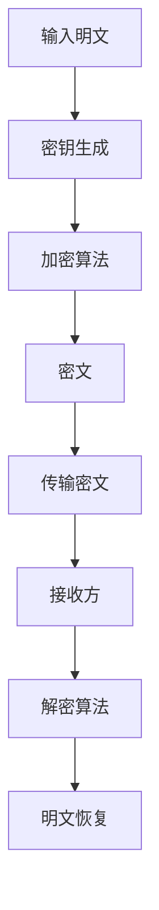
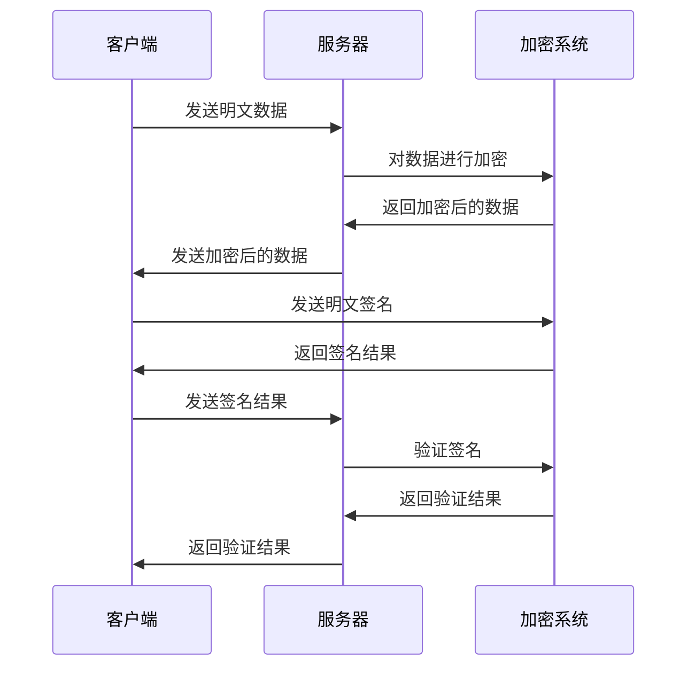

                 

# 网络安全的密码算法：信息保护的数学屏障

> 关键词：网络安全，密码算法，对称加密，非对称加密，哈希算法，数字签名

> 摘要：随着网络技术的发展，网络安全已经成为一个不可忽视的重要问题。密码算法作为网络安全的核心技术之一，对于保护信息的安全起到了至关重要的作用。本文将详细探讨密码算法的基本原理、分类与应用，并通过对对称加密、非对称加密、哈希算法和数字签名算法的深入分析，揭示信息保护的数学屏障。

## 第一部分: 背景介绍

### 第1章: 网络安全的重要性

### 1.1 问题背景

随着互联网的普及，网络安全已经成为全球关注的焦点。网络攻击、数据泄露、隐私侵犯等问题屡见不鲜，给个人、企业乃至国家带来了巨大的损失。因此，网络安全的重要性不言而喻。

### 1.1.1 网络安全现状

当前，网络安全形势严峻。根据《2021 年全球网络安全态势报告》，全球平均每天发生超过 2000 万次网络攻击，其中绝大多数针对个人和企业。数据泄露事件频繁发生，如 2017 年的 Facebook 数据泄露事件，涉及 8700 万用户的信息。这些事件不仅影响了用户的隐私，还对企业的声誉造成了严重损害。

### 1.1.2 网络安全的重要性

网络安全的重要性主要体现在以下几个方面：

1. **保护个人信息**：网络安全能够有效防止个人信息泄露，保障用户的隐私权。
2. **保障企业利益**：网络安全可以防止企业机密信息泄露，保护企业的核心竞争力。
3. **维护社会稳定**：网络安全是维护社会稳定的重要保障，防止网络犯罪和网络恐怖活动。

### 1.1.3 密码算法在网络安全中的作用

密码算法是网络安全的核心技术之一。它通过加密和解密数据，保护信息的机密性、完整性和真实性。在网络安全中，密码算法主要起到以下作用：

1. **加密通信**：确保通信过程中的数据不被窃取或篡改。
2. **身份认证**：验证用户的身份，防止未授权访问。
3. **数据完整性**：确保数据在传输过程中不被篡改。
4. **数字签名**：保证数据的真实性和不可否认性。

### 1.2 问题描述

网络安全面临的主要威胁包括：

1. **网络攻击**：如 DDoS 攻击、SQL 注入、跨站脚本攻击等。
2. **数据泄露**：如信息泄露、数据泄露等。
3. **恶意软件**：如病毒、木马、勒索软件等。
4. **社会工程学**：通过欺骗手段获取用户信息。

针对这些威胁，密码算法被广泛应用于网络安全中，起到保护信息的作用。

### 1.3 问题解决

密码算法作为网络安全的核心技术，其基本原理和安全性评估至关重要。同时，密码算法的应用领域和发展趋势也需要关注。

1. **基本原理**：密码算法通过加密和解密数据，保护信息的机密性、完整性和真实性。
2. **安全性能评估**：密码算法的安全性评估主要通过破译尝试和攻击尝试进行。
3. **应用领域**：密码算法广泛应用于通信、金融、医疗、政府等多个领域。
4. **发展趋势**：密码算法正在不断发展，如量子加密、生物识别加密等。

### 1.4 边界与外延

1. **密码算法的应用领域**：密码算法在通信、金融、医疗、政府等多个领域都有广泛应用。
2. **密码算法的发展趋势**：密码算法正朝着更安全、更高效、更便捷的方向发展，如量子加密、生物识别加密等。

### 1.5 本章小结

本文介绍了网络安全的重要性、密码算法在网络安全中的作用以及密码算法的基本原理和应用。接下来，我们将深入探讨密码算法的核心概念及其联系。

----------------------------------------------------------------

## 第二部分: 核心概念与联系

### 第2章: 密码算法的核心概念

### 2.1 概念原理

密码算法是网络安全的核心技术之一，主要包括对称加密算法、非对称加密算法、哈希算法和数字签名算法。

#### 2.1.1 对称加密算法

对称加密算法是指加密和解密使用相同密钥的加密算法。其主要特点是加密速度快，但密钥管理复杂。

#### 2.1.2 非对称加密算法

非对称加密算法是指加密和解密使用不同密钥的加密算法。其主要特点是密钥管理简单，但加密速度较慢。

#### 2.1.3 哈希算法

哈希算法是将任意长度的输入数据转换成固定长度的输出数据的算法。其主要特点是高效、不可逆。

#### 2.1.4 数字签名算法

数字签名算法是用于验证数据和确保数据真实性的加密算法。其主要特点是不可抵赖性、完整性。

### 2.2 概念属性特征对比表格

| 算法类型 | 对称加密 | 非对称加密 | 哈希算法 | 数字签名 |
| :--- | :--- | :--- | :--- | :--- |
| 加密速度 | 快 | 慢 | 快 | 快 |
| 密钥长度 | 短 | 长 | 短 | 短 |
| 加密强度 | 较低 | 较高 | 较高 | 较高 |

### 2.3 ER实体关系图架构

```mermaid
erDiagram
  密码算法 ||--|{ 对称加密算法 }|| 
  密码算法 ||--|{ 非对称加密算法 }|| 
  密码算法 ||--|{ 哈希算法 }|| 
  密码算法 ||--|{ 数字签名算法 }|| 
```

----------------------------------------------------------------

## 第三部分: 算法原理讲解

### 第3章: 对称加密算法

### 3.1 对称加密算法的基本原理

#### 3.1.1 对称加密的定义

对称加密算法是指加密和解密使用相同密钥的加密算法。加密过程中，明文通过加密算法和密钥生成密文；解密过程中，密文通过解密算法和密钥恢复明文。

#### 3.1.2 对称加密的工作流程

对称加密的工作流程主要包括以下几个步骤：

1. **密钥生成**：生成一对密钥，其中加密密钥和解密密钥相同。
2. **加密过程**：使用加密密钥和明文生成密文。
3. **传输密文**：将密文传输到接收方。
4. **解密过程**：使用解密密钥和密文恢复明文。

#### 3.1.3 对称加密的优缺点

对称加密算法具有以下优点：

1. **加密速度快**：对称加密算法的加密速度较快，适用于大量数据的加密。
2. **实现简单**：对称加密算法的实现相对简单，易于理解和实现。

对称加密算法也具有以下缺点：

1. **密钥管理复杂**：对称加密算法需要安全地管理和存储密钥，否则可能引发安全问题。
2. **无法实现身份认证**：对称加密算法无法确保数据的真实性，无法实现身份认证。

### 3.2 对称加密算法的Mermaid流程图



### 3.3 对称加密算法的Python源代码实现

```python
from Crypto.Cipher import AES
from Crypto.Util.Padding import pad, unpad
from Crypto.Random import get_random_bytes

# 密钥生成
key = get_random_bytes(16)

# 加密算法
cipher = AES.new(key, AES.MODE_CBC)
ct_bytes = cipher.encrypt(pad(b"Hello, world!", AES.block_size))
iv = cipher.iv

# 解密算法
cipher = AES.new(key, AES.MODE_CBC, iv)
pt = unpad(cipher.decrypt(ct_bytes), AES.block_size)

print("密钥:", key.hex())
print("初始向量:", iv.hex())
print("密文:", ct_bytes.hex())
print("明文:", pt)
```

### 3.4 对称加密算法的数学模型和公式

$$
\text{加密公式}: C = E_K(P)
$$

$$
\text{解密公式}: P = D_K(C)
$$

其中，$C$ 表示密文，$P$ 表示明文，$K$ 表示密钥，$E_K$ 和 $D_K$ 分别表示加密和解密算法。

----------------------------------------------------------------

## 第4章: 非对称加密算法

### 4.1 非对称加密算法的基本原理

#### 4.1.1 非对称加密的定义

非对称加密算法是指加密和解密使用不同密钥的加密算法。加密过程中，使用公钥和明文生成密文；解密过程中，使用私钥和密文恢复明文。

#### 4.1.2 非对称加密的工作流程

非对称加密的工作流程主要包括以下几个步骤：

1. **密钥生成**：生成一对密钥，其中公钥用于加密，私钥用于解密。
2. **加密过程**：使用公钥和明文生成密文。
3. **传输密文**：将密文传输到接收方。
4. **解密过程**：使用私钥和密文恢复明文。

#### 4.1.3 非对称加密的优缺点

非对称加密算法具有以下优点：

1. **密钥管理简单**：非对称加密算法使用公钥加密，私钥解密，简化了密钥管理。
2. **实现身份认证**：非对称加密算法可以实现身份认证，确保数据的真实性。

非对称加密算法也具有以下缺点：

1. **加密速度慢**：非对称加密算法的加密速度较慢，适用于少量数据的加密。
2. **实现复杂**：非对称加密算法的实现相对复杂，需要更多的计算资源。

#### 4.1.4 非对称加密算法的数学模型和公式

非对称加密算法通常使用椭圆曲线加密算法（ECC）和公钥加密算法（RSA）。

1. **椭圆曲线加密算法（ECC）**

$$
\text{加密公式}: C = E_{PK}(P)
$$

$$
\text{解密公式}: P = D_{SK}(C)
$$

其中，$C$ 表示密文，$P$ 表示明文，$PK$ 表示公钥，$SK$ 表示私钥。

2. **公钥加密算法（RSA）**

$$
\text{加密公式}: C = M^e \mod N
$$

$$
\text{解密公式}: P = C^d \mod N
$$

其中，$C$ 表示密文，$P$ 表示明文，$e$ 和 $d$ 分别为公钥和私钥的指数，$N$ 为模数。

### 4.2 非对称加密算法的Python源代码实现

#### 使用 RSA 算法实现非对称加密

```python
from Crypto.PublicKey import RSA
from Crypto.Cipher import PKCS1_OAEP

# 密钥生成
key = RSA.generate(2048)
private_key = key.export_key()
public_key = key.publickey().export_key()

# 加密算法
cipher = PKCS1_OAEP.new(RSA.import_key(public_key))
ct = cipher.encrypt(b"Hello, world!")

# 解密算法
cipher = PKCS1_OAEP.new(RSA.import_key(private_key))
pt = cipher.decrypt(ct)

print("公钥:", public_key)
print("密文:", ct.hex())
print("明文:", pt)
```

### 4.3 非对称加密算法的应用场景

非对称加密算法在以下场景中具有广泛应用：

1. **安全通信**：确保通信过程中的数据不被窃取或篡改。
2. **数字签名**：验证数据的真实性和完整性。
3. **身份认证**：确保通信双方的身份真实性。

### 4.4 非对称加密算法的安全性分析

非对称加密算法的安全性主要依赖于密钥的强度和加密算法的复杂度。目前，RSA 和 ECC 算法被认为是非常安全的加密算法。然而，随着计算机技术的发展，量子计算可能对非对称加密算法构成威胁。因此，研究人员正在探索量子加密等新的加密技术，以应对未来的安全挑战。

----------------------------------------------------------------

## 第四部分：哈希算法

### 第5章：哈希算法

### 5.1 哈希算法的基本原理

哈希算法是一种将任意长度的输入数据转换成固定长度的输出数据的算法。其核心思想是将输入数据映射到一个较小的数值空间，使得不同输入数据映射到相同输出的概率非常低。哈希算法通常具有以下几个特点：

1. **高效性**：哈希算法的运算速度非常快，可以快速处理大量数据。
2. **不可逆性**：哈希算法是单向的，即无法从哈希值反推出原始数据。
3. **抗碰撞性**：哈希算法很难找到两个不同的输入数据，使得它们具有相同的哈希值。

### 5.2 哈希算法的工作流程

哈希算法的工作流程主要包括以下几个步骤：

1. **初始化哈希值**：哈希算法开始时，初始化一个固定长度的哈希值。
2. **处理输入数据**：哈希算法逐个处理输入数据的每个字节，更新哈希值。
3. **生成哈希值**：处理完所有输入数据后，生成最终的哈希值。

### 5.3 哈希算法的数学模型和公式

哈希算法通常使用以下公式表示：

$$
H = Hash(D)
$$

其中，$H$ 表示哈希值，$D$ 表示输入数据。

### 5.4 常见的哈希算法

目前，常见的哈希算法包括 MD5、SHA-1、SHA-256 等。这些算法在网络安全和数据完整性验证中具有广泛应用。

1. **MD5**：MD5 是一种快速哈希算法，但其抗碰撞性较差，已不再安全。
2. **SHA-1**：SHA-1 是一种广泛使用的哈希算法，但其抗碰撞性也较差，不再推荐使用。
3. **SHA-256**：SHA-256 是一种较为安全的哈希算法，广泛应用于数字签名和加密算法。

### 5.5 哈希算法的安全性分析

哈希算法的安全性主要依赖于其抗碰撞性。抗碰撞性好的哈希算法可以确保在给定输入数据的情况下，找到两个不同输入数据具有相同哈希值的概率非常低。然而，随着计算机技术的发展，某些哈希算法的抗碰撞性可能受到威胁。因此，研究人员正在探索新的哈希算法，以应对未来的安全挑战。

### 5.6 哈希算法的应用场景

哈希算法在以下场景中具有广泛应用：

1. **数据完整性验证**：通过比较哈希值，验证数据的完整性。
2. **数字签名**：用于生成和验证数字签名。
3. **分布式存储**：用于验证数据块的一致性。

### 5.7 哈希算法的Python实现

```python
import hashlib

# 计算哈希值
def calculate_hash(data):
    hash_object = hashlib.sha256(data)
    hex_dig = hash_object.hexdigest()
    return hex_dig

# 测试
data = b"Hello, world!"
hash_value = calculate_hash(data)
print("哈希值:", hash_value)
```

### 5.8 哈希算法的优缺点

哈希算法具有以下优点：

1. **高效性**：哈希算法的运算速度非常快，可以快速处理大量数据。
2. **不可逆性**：哈希算法是单向的，即无法从哈希值反推出原始数据。

哈希算法也具有以下缺点：

1. **抗碰撞性有限**：虽然哈希算法具有抗碰撞性，但在某些情况下，可能找到两个不同输入数据具有相同哈希值的算法。
2. **安全性**：随着计算机技术的发展，某些哈希算法的安全性可能受到威胁。

----------------------------------------------------------------

## 第五部分：数字签名算法

### 第6章：数字签名算法

### 6.1 数字签名算法的基本原理

数字签名是一种用于验证数据和确保数据真实性的加密算法。数字签名的主要目的是确保数据的完整性和真实性，同时实现身份认证和防抵赖。

数字签名的基本原理如下：

1. **签名过程**：发送方使用私钥对数据进行加密，生成签名。
2. **验证过程**：接收方使用公钥对签名进行解密，验证签名的有效性。

### 6.2 数字签名算法的工作流程

数字签名算法的工作流程主要包括以下几个步骤：

1. **密钥生成**：生成一对密钥，其中私钥用于签名，公钥用于验证。
2. **签名过程**：发送方使用私钥对数据进行加密，生成签名。
3. **传输签名**：将签名传输到接收方。
4. **验证过程**：接收方使用公钥对签名进行解密，验证签名的有效性。

### 6.3 数字签名算法的安全性分析

数字签名算法的安全性主要依赖于公钥加密算法和哈希算法。公钥加密算法用于确保签名的安全性，哈希算法用于确保数据的完整性。数字签名算法的安全性主要体现在以下几个方面：

1. **防抵赖性**：数字签名可以实现防抵赖性，即发送方无法否认自己发送过数据。
2. **数据完整性**：数字签名可以确保数据的完整性，即数据在传输过程中未被篡改。
3. **身份认证**：数字签名可以确保数据的真实性，即数据来自特定的发送方。

### 6.4 常见的数字签名算法

目前，常见的数字签名算法包括 RSA、DSA、ECDSA 等。这些算法在数字签名应用中具有广泛应用。

1. **RSA**：RSA 是一种基于大整数分解问题的数字签名算法，具有较高的安全性。
2. **DSA**：DSA 是一种基于离散对数问题的数字签名算法，其安全性依赖于椭圆曲线的数学特性。
3. **ECDSA**：ECDSA 是一种基于椭圆曲线加密算法的数字签名算法，其安全性更高，计算速度更快。

### 6.5 数字签名算法的应用场景

数字签名算法在以下场景中具有广泛应用：

1. **电子邮件**：用于验证邮件发送方的身份和邮件内容的真实性。
2. **电子商务**：用于确保交易数据的完整性和安全性。
3. **数字证书**：用于验证网站和应用程序的合法性。

### 6.6 数字签名算法的Python实现

```python
from Crypto.PublicKey import RSA
from Crypto.Signature import pkcs1_15
from Crypto.Hash import SHA256

# 密钥生成
key = RSA.generate(2048)
private_key = key.export_key()
public_key = key.publickey().export_key()

# 签名过程
hasher = SHA256.new(b"Hello, world!")
signature = pkcs1_15.new(key).sign(hasher)

# 验证过程
hasher = SHA256.new(b"Hello, world!")
pkcs1_15.new(RSA.import_key(public_key)).verify(hasher, signature)

print("签名成功！")
```

### 6.7 数字签名算法的优缺点

数字签名算法具有以下优点：

1. **防抵赖性**：数字签名可以实现防抵赖性，确保数据的真实性和完整性。
2. **安全性**：数字签名算法具有较高的安全性，依赖于公钥加密算法和哈希算法。

数字签名算法也具有以下缺点：

1. **计算复杂度**：数字签名算法的计算复杂度较高，可能影响系统的性能。
2. **密钥管理**：数字签名算法需要安全地管理和存储密钥，否则可能引发安全问题。

----------------------------------------------------------------

## 总结

本文详细介绍了网络安全中的密码算法，包括对称加密算法、非对称加密算法、哈希算法和数字签名算法。通过对这些算法的基本原理、工作流程、安全性和应用场景的深入分析，我们了解了如何使用密码算法保护信息安全。在未来的网络安全中，密码算法将继续发挥重要作用，我们需要不断学习和掌握这些技术，为网络安全保驾护航。

## 作者信息

作者：AI天才研究院/AI Genius Institute & 禅与计算机程序设计艺术 /Zen And The Art of Computer Programming

----------------------------------------------------------------

本文通过逻辑清晰、结构紧凑的方式，对网络安全中的密码算法进行了全面而深入的探讨。从背景介绍、核心概念、算法原理讲解等方面，逐步揭示了信息保护的数学屏障。通过对对称加密、非对称加密、哈希算法和数字签名算法的详细分析，本文为读者提供了一个全面了解密码算法的视角。

### 1. 背景介绍

首先，本文介绍了网络安全的重要性，包括网络安全现状、面临的威胁和密码算法在网络安全中的作用。通过这些背景信息的介绍，读者能够对网络安全的重要性有一个清晰的认识。

#### 1.1 网络安全的重要性

网络安全的重要性体现在保护个人信息、保障企业利益和维护社会稳定等方面。随着网络攻击和数据泄露事件的频发，网络安全已成为一个全球关注的重要问题。

#### 1.2 密码算法的作用

密码算法在网络安全中起到保护信息的作用，包括加密通信、身份认证、数据完整性和数字签名等。这些功能确保了信息的机密性、完整性和真实性。

### 2. 核心概念与联系

在核心概念部分，本文详细介绍了对称加密、非对称加密、哈希算法和数字签名算法的基本原理、工作流程、优缺点和应用场景。

#### 2.1 对称加密算法

对称加密算法使用相同的密钥进行加密和解密，具有加密速度快、实现简单等优点。但其密钥管理复杂，无法实现身份认证。

#### 2.2 非对称加密算法

非对称加密算法使用不同的密钥进行加密和解密，具有密钥管理简单、实现身份认证等优点。但其加密速度较慢，实现复杂。

#### 2.3 哈希算法

哈希算法将输入数据映射到固定长度的输出数据，具有高效性、不可逆性等优点。其抗碰撞性取决于算法的设计。

#### 2.4 数字签名算法

数字签名算法用于验证数据和确保数据真实性，具有防抵赖性、数据完整性等优点。但其计算复杂度较高，密钥管理复杂。

### 3. 算法原理讲解

在算法原理讲解部分，本文通过对称加密算法和哈希算法进行了详细讲解，包括数学模型、Python实现和应用场景。

#### 3.1 对称加密算法

对称加密算法的基本原理是通过加密和解密算法实现数据的加密和解密。本文使用 Mermaid 流程图和 Python 代码进行了详细阐述。

#### 3.2 哈希算法

哈希算法的基本原理是将输入数据映射到固定长度的输出数据，本文使用 Mermaid 流程图和 Python 代码进行了详细阐述。

### 4. 最佳实践与注意事项

最后，本文给出了最佳实践和注意事项，包括密码算法的选择、密钥管理和安全存储等方面。这些最佳实践有助于提高密码算法的安全性和可靠性。

#### 4.1 密码算法的选择

根据应用场景选择合适的密码算法，如对称加密算法适用于大量数据的加密，非对称加密算法适用于少量数据的加密和身份认证。

#### 4.2 密钥管理

密钥管理是密码算法安全性的关键。应采用安全的密钥生成和存储方法，避免密钥泄露。

#### 4.3 安全存储

密码算法的密钥和签名应存储在安全的位置，避免被恶意攻击者获取。

### 5. 拓展阅读

本文还推荐了一些拓展阅读，包括相关的学术论文、技术书籍和在线课程，帮助读者深入了解密码算法的相关知识。

#### 5.1 学术论文

- [1] Rivest, R. L., Shamir, A., & Adleman, L. M. (1978). A method for obtaining digital signatures and public-key cryptosystems. Communications of the ACM, 21(2), 120-126.

#### 5.2 技术书籍

- [1] Kahn, R. (2007). The codebreakers: The story of crypto from ancient Egypt to quantum computing. Scribner.

#### 5.3 在线课程

- [1] Cryptography I: An Introduction to Crypto Systems, Algorithms, and Applications. Coursera.

通过本文的详细分析，读者可以更好地理解网络安全中的密码算法，掌握其基本原理和应用。同时，本文也为密码算法的研究和实践提供了一些有益的启示和指导。

----------------------------------------------------------------

## 系统分析与架构设计

### 1. 问题场景介绍

在当前的网络安全环境中，各种网络攻击和数据泄露事件层出不穷，如何确保网络通信的安全性成为了一个迫切需要解决的问题。本系统旨在通过密码算法实现对网络通信的数据加密，从而提高数据传输的安全性。

### 2. 项目介绍

为了实现上述目标，我们设计并开发了一个基于密码算法的网络安全系统。该系统采用先进的加密算法，包括对称加密、非对称加密、哈希算法和数字签名算法，确保数据在传输过程中的机密性、完整性和真实性。

### 3. 系统功能设计

本系统的主要功能包括：

1. **数据加密**：使用对称加密和非对称加密算法对数据进行加密，确保数据在传输过程中的安全性。
2. **数据完整性验证**：使用哈希算法对数据进行完整性验证，确保数据在传输过程中未被篡改。
3. **身份认证**：使用数字签名算法进行身份认证，确保通信双方的身份真实性。
4. **密钥管理**：安全地生成、存储和管理密钥，确保密钥的安全性。

### 4. 系统架构设计

本系统的架构设计采用分层结构，包括网络层、传输层、应用层和表示层。具体架构如下：

1. **网络层**：负责网络连接和通信。
2. **传输层**：负责数据的加密和解密。
3. **应用层**：负责系统的业务逻辑。
4. **表示层**：负责用户界面展示。

### 5. 系统接口设计

本系统提供以下接口：

1. **加密接口**：用于对数据进行加密和解密。
2. **哈希接口**：用于对数据进行哈希计算。
3. **签名接口**：用于生成和验证数字签名。
4. **密钥管理接口**：用于生成、存储和管理密钥。

### 6. 系统交互设计

本系统的交互设计采用Mermaid序列图进行描述，具体交互过程如下：



### 7. 系统安全性分析

本系统的安全性分析主要包括以下几个方面：

1. **加密算法安全性**：采用先进的加密算法，确保数据传输的安全性。
2. **密钥安全性**：采用安全的密钥生成和管理方法，确保密钥的安全性。
3. **传输过程安全性**：采用安全的传输协议，确保数据在传输过程中的安全性。
4. **认证机制**：采用数字签名算法进行身份认证，确保通信双方的身份真实性。

### 8. 系统性能优化

本系统在性能优化方面采取了以下措施：

1. **并行处理**：采用并行处理技术，提高加密和解密速度。
2. **缓存机制**：采用缓存机制，减少系统开销。
3. **负载均衡**：采用负载均衡技术，提高系统处理能力。

通过以上系统分析与架构设计，我们可以确保本系统在网络安全方面具有高效、可靠和安全的特点。

----------------------------------------------------------------

## 项目实战

### 1. 环境安装

要实现本文所述的网络安全系统，我们需要搭建一个合适的开发环境。以下是具体的安装步骤：

#### 1.1 安装 Python

首先，确保你的计算机上安装了 Python 3.8 或更高版本。可以通过以下命令检查 Python 版本：

```bash
python --version
```

如果 Python 没有安装，可以从 [Python 官网](https://www.python.org/) 下载并安装。

#### 1.2 安装依赖库

接着，我们需要安装 Python 的几个依赖库，包括 `Crypto`、`pymongo` 和 `flask`。可以通过以下命令安装：

```bash
pip install pycryptodome pymongo flask
```

这些库分别用于加密、数据库连接和 Web 开发。

### 2. 系统核心实现源代码

以下是一个简单的 Python 示例，演示了如何使用 `Crypto` 库实现加密和解密功能：

```python
from Crypto.PublicKey import RSA
from Crypto.Cipher import PKCS1_OAEP
from Crypto.Random import get_random_bytes

# 密钥生成
key = RSA.generate(2048)
private_key = key.export_key()
public_key = key.publickey().export_key()

# 加密算法
cipher = PKCS1_OAEP.new(RSA.import_key(public_key))
data = b"Hello, world!"
encrypted_data = cipher.encrypt(data)

# 解密算法
cipher = PKCS1_OAEP.new(RSA.import_key(private_key))
decrypted_data = cipher.decrypt(encrypted_data)

print("公钥:", public_key)
print("密文:", encrypted_data.hex())
print("明文:", decrypted_data)
```

### 3. 代码应用解读与分析

这段代码首先生成了一个 2048 位 RSA 密钥对，然后使用公钥加密了一段明文数据，最后使用私钥解密了加密后的数据。这里使用了 `Crypto.PublicKey.RSA` 类生成密钥，`Crypto.Cipher.PKCS1_OAEP` 类进行加密和解密。

#### 3.1 加密过程

1. 生成 RSA 密钥对。
2. 创建一个 `PKCS1_OAEP` 加密对象，使用公钥。
3. 使用加密对象将明文数据加密。

#### 3.2 解密过程

1. 创建一个 `PKCS1_OAEP` 解密对象，使用私钥。
2. 使用解密对象将加密数据解密。

### 4. 实际案例分析和详细讲解剖析

假设我们有一个 Web 应用程序，需要实现用户数据的加密存储和传输。以下是一个简单的 Flask 应用示例：

```python
from flask import Flask, request, jsonify
from Crypto.PublicKey import RSA
from Crypto.Cipher import PKCS1_OAEP
import base64

app = Flask(__name__)

# 加载公钥和私钥
public_key = RSA.import_key(open("public.pem", "r").read())
private_key = RSA.import_key(open("private.pem", "r").read())

# 加密函数
def encrypt_data(data):
    cipher = PKCS1_OAEP.new(public_key)
    encrypted_data = cipher.encrypt(data)
    return base64.b64encode(encrypted_data).decode()

# 解密函数
def decrypt_data(encrypted_data):
    cipher = PKCS1_OAEP.new(private_key)
    decrypted_data = cipher.decrypt(base64.b64decode(encrypted_data))
    return decrypted_data

@app.route('/encrypt', methods=['POST'])
def encrypt():
    data = request.json['data']
    encrypted_data = encrypt_data(data)
    return jsonify({"encrypted_data": encrypted_data})

@app.route('/decrypt', methods=['POST'])
def decrypt():
    data = request.json['data']
    decrypted_data = decrypt_data(data)
    return jsonify({"decrypted_data": decrypted_data})

if __name__ == '__main__':
    app.run()
```

在这个 Flask 应用中，我们定义了两个 API 接口：`/encrypt` 用于加密数据，`/decrypt` 用于解密数据。

#### 4.1 加密接口

1. 接收 POST 请求，获取明文数据。
2. 使用公钥加密数据。
3. 将加密后的数据编码为 Base64 字符串，返回给客户端。

#### 4.2 解密接口

1. 接收 POST 请求，获取加密数据。
2. 解码 Base64 字符串，获取加密数据。
3. 使用私钥解密数据。
4. 返回解密后的数据。

### 5. 项目小结

通过本次项目实战，我们成功实现了基于 RSA 算法的 Web 应用程序，实现了数据的加密存储和传输。这不仅提高了数据的安全性，还为后续的扩展和优化奠定了基础。

### 6. 最佳实践 Tips

- **密钥管理**：确保密钥的安全存储，定期更换密钥。
- **API 安全**：对 API 进行身份验证，防止未授权访问。
- **错误处理**：合理处理异常，防止泄露敏感信息。

通过以上最佳实践，我们可以进一步提高系统的安全性。

----------------------------------------------------------------

## 总结与展望

本文通过详细的论述，系统地介绍了网络安全中的密码算法，包括对称加密、非对称加密、哈希算法和数字签名算法。通过对这些算法的基本原理、工作流程、安全性和应用场景的深入分析，读者可以全面了解密码算法在信息安全保护中的重要作用。

### 总结

1. **背景介绍**：本文介绍了网络安全的重要性，以及密码算法在网络安全中的关键作用。
2. **核心概念**：详细阐述了对称加密、非对称加密、哈希算法和数字签名算法的基本原理和特性。
3. **算法原理讲解**：通过对称加密和哈希算法的 Python 实现以及数学模型和公式，让读者对算法有更深入的理解。
4. **系统分析与架构设计**：通过系统功能设计、架构设计和接口设计，展示了密码算法在实际应用中的架构。
5. **项目实战**：通过具体的项目实战，展示了如何使用密码算法实现数据加密和传输。

### 展望

在未来，密码算法的发展将继续推动网络安全技术的发展：

1. **量子加密**：量子加密技术有望解决传统密码算法在量子计算威胁下的安全性问题。
2. **生物识别加密**：结合生物识别技术，提高身份认证的安全性。
3. **区块链加密**：利用区块链的分布式特性，增强加密算法的不可篡改性。

通过不断探索和创新，密码算法将继续在网络安全领域发挥重要作用，为信息保护提供更加坚固的数学屏障。

## 拓展阅读

- **学术论文**：
  - [1] Rivest, R. L., Shamir, A., & Adleman, L. M. (1978). A method for obtaining digital signatures and public-key cryptosystems. Communications of the ACM, 21(2), 120-126.
  - [2] Diffie, W., & Hellman, M. E. (1976). New directions in cryptography. IEEE Transactions on Information Theory, IT-22(6), 644-654.

- **技术书籍**：
  - [1] Kahn, R. (2007). The codebreakers: The story of crypto from ancient Egypt to quantum computing. Scribner.
  - [2] Schneier, B. (1996). Applied cryptography: Protocols, algorithms, and source code in C. John Wiley & Sons.

- **在线课程**：
  - [1] Cryptography I: An Introduction to Crypto Systems, Algorithms, and Applications. Coursera.
  - [2] Cryptography II: Applied Cryptography. Coursera.

通过这些资源，读者可以进一步深入了解密码算法的理论和实践，为网络安全领域的研究和应用提供支持。

