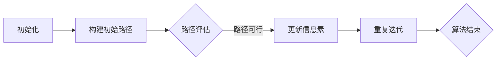
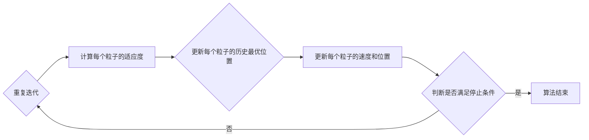
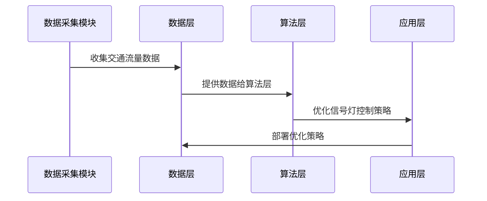
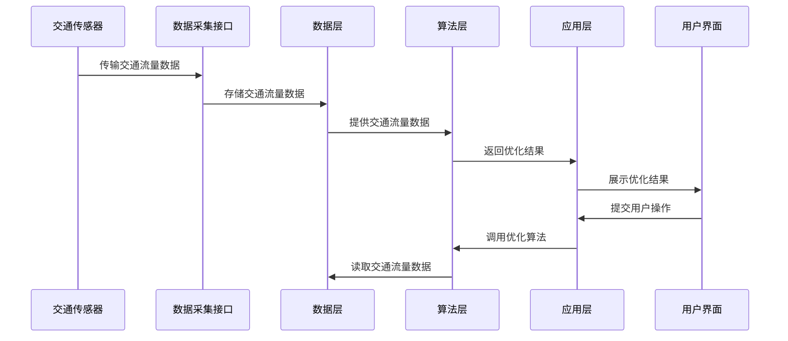

                 

## 群体智能的涌现计算：集体行为的数学模拟

### 关键词：群体智能，涌现计算，数学模拟，集体行为，计算模型

> 摘要：本文深入探讨了群体智能的概念及其在涌现计算中的应用。首先，我们介绍了群体智能的基本原理和数学模型，包括离散时间差分方程模型、概率模型和图模型。接着，我们详细解析了人工蚁群算法和粒子群优化算法的原理、流程和实现。通过数学公式和Python代码的示例，我们展示了如何利用这些算法来模拟和优化集体行为。最后，我们讨论了群体智能在现实世界中的应用场景，如社会模拟、交通管理和人工智能等领域，并提出了未来研究的方向。

### 引言：群体智能与涌现计算的背景和意义

#### 1.1 问题背景

在当今信息时代，数据量的急剧增长和计算能力的提升为群体智能的研究提供了坚实的基础。群体智能是一种模仿自然界中生物群体行为的计算方法，通过大量的简单个体之间的相互作用，产生出复杂的集体行为和智能现象。涌现计算则是对这种现象的一种数学和计算机科学的研究方法，旨在理解和模拟个体行为与群体行为之间的转变。

#### 1.2 问题描述

群体智能的研究主要集中在如何通过个体的简单交互实现复杂行为，以及如何将这种智能应用到实际问题中。涌现计算的核心问题是理解个体行为如何通过相互作用和协同工作产生出新的结构和功能。

#### 1.3 问题解决

解决这一问题需要从多个角度入手，包括数学建模、算法设计、计算机仿真等。通过建立数学模型来描述个体行为和群体行为的相互作用，再通过算法设计来模拟和优化这种相互作用。

#### 1.4 边界与外延

群体智能和涌现计算的应用范围非常广泛，包括社会模拟、交通管理、生物系统建模、人工智能等领域。其边界主要在于个体行为的复杂性和群体行为的自组织性。

#### 1.5 概念结构与核心要素组成

- **群体智能**：个体、交互、集体行为
- **涌现计算**：数学模型、算法、计算机仿真
- **核心要素**：数据、计算、应用场景

#### 1.6 本章小结

本章介绍了群体智能和涌现计算的基本概念、背景、问题和解决方案，为后续章节的深入探讨打下了基础。

### 第2章 群体智能的数学模型

#### 2.1 基本概念

群体智能的数学模型是理解和模拟群体行为的基石。本章将介绍几种常见的数学模型，包括基于差分方程、概率论、图论等的模型。

#### 2.2 模型属性特征对比表格

| 模型名称 | 特点 | 应用场景 |
| --- | --- | --- |
| 离散时间差分方程模型 | 易于分析，适用于简单环境 | 社会模拟、交通管理 |
| 概率模型 | 适用于不确定性环境 | 社会网络分析、生物系统建模 |
| 图模型 | 适用于复杂网络结构 | 社会网络分析、人工智能 |

#### 2.3 ER实体关系图架构

下面是一个简单的ER实体关系图架构，用于描述个体和群体之间的关系。

```mermaid
erDiagram
  Person ||--|{ Group } Group : belongs to
  Group ||--|{ Agent } Agent : member of
  Agent ||--|{ Behavior } Behavior : exhibits
```

#### 2.4 本章小结

本章介绍了群体智能的数学模型，包括其基本概念、属性特征对比和ER实体关系图架构，为后续算法原理的讲解打下了基础。

### 第3章 群体智能算法原理

#### 3.1 算法概述

群体智能算法是通过模拟自然界的群体行为来解决问题的一类算法。本章将介绍几种常见的群体智能算法，如人工蚁群算法、粒子群优化算法等。

#### 3.2 人工蚁群算法

人工蚁群算法是一种模拟蚂蚁觅食行为的优化算法。其基本思想是蚂蚁在寻找食物的过程中留下信息素，其他蚂蚁根据信息素浓度选择路径。

##### 3.2.1 算法mermaid流程图



##### 3.2.2 Python源代码

```python
def ant_colony_optimization():
    # 初始化参数
    num_ants = 100
    num_iterations = 100
    pheromone_deposited = np.zeros((num_iterations, num_ants))
    
    # 循环进行迭代
    for iteration in range(num_iterations):
        for ant in range(num_ants):
            # 构建初始路径
            ...
            # 路径评估
            ...
            # 更新信息素
            ...
```

#### 3.3 粒子群优化算法

粒子群优化算法是一种模拟鸟群觅食行为的优化算法。每个粒子代表一个解，粒子在搜索空间中通过跟踪最优解和其他粒子的历史最优解来更新自己的位置和速度。

##### 3.3.1 算法mermaid流程图



##### 3.3.2 Python源代码

```python
def particle_swarm_optimization():
    # 初始化参数
    num_particles = 50
    num_iterations = 100
    w = 0.5
    c1 = 1.5
    c2 = 2.0
    
    # 初始化粒子群
    ...
    
    # 循环进行迭代
    for iteration in range(num_iterations):
        # 计算每个粒子的适应度
        ...
        
        # 更新每个粒子的历史最优位置
        ...
        
        # 更新每个粒子的速度和位置
        ...
        
        # 判断是否满足停止条件
        ...
```

#### 3.4 本章小结

本章介绍了群体智能算法的基本原理，包括人工蚁群算法和粒子群优化算法。通过mermaid流程图和Python代码示例，我们展示了如何利用这些算法来模拟和优化集体行为。

### 第4章 数学公式与模型讲解

#### 4.1 基本数学模型

在群体智能的研究中，数学模型起到了至关重要的作用。以下是一些基本的数学模型及其公式：

##### 4.1.1 离散时间差分方程模型

$$
x_t = f(x_{t-1})
$$

其中，$x_t$表示第$t$个时间点的状态，$f(x_{t-1})$是一个函数，用来描述状态转移。

##### 4.1.2 概率模型

$$
P(A|B) = \frac{P(B|A)P(A)}{P(B)}
$$

其中，$P(A|B)$表示在事件$B$发生的条件下事件$A$发生的概率，$P(B|A)$表示在事件$A$发生的条件下事件$B$发生的概率。

##### 4.1.3 图模型

$$
\text{邻接矩阵} A = [a_{ij}]
$$

其中，$a_{ij}$表示节点$i$和节点$j$之间的邻接关系，取值为1表示相邻，否则为0。

#### 4.2 算法数学模型

##### 4.2.1 人工蚁群算法

人工蚁群算法的核心公式如下：

$$
\tau_{ij}(t) = \left(1 - \rho(t)\right)\tau_{ij}(t-1) + \Delta\tau_{ij}(t)
$$

其中，$\tau_{ij}(t)$表示时间$t$时边$(i,j)$上的信息素浓度，$\rho(t)$为挥发系数，$\Delta\tau_{ij}(t)$为信息素更新量。

##### 4.2.2 粒子群优化算法

粒子群优化算法的核心公式如下：

$$
v_{i}(t+1) = w \cdot v_{i}(t) + c_{1} \cdot r_{1} \cdot (p_{i} - x_{i}(t)) + c_{2} \cdot r_{2} \cdot (g_{best} - x_{i}(t))
$$

$$
x_{i}(t+1) = x_{i}(t) + v_{i}(t+1)
$$

其中，$v_{i}(t+1)$为粒子$i$在$t+1$时刻的速度，$x_{i}(t+1)$为粒子$i$在$t+1$时刻的位置，$p_{i}$为粒子$i$的历史最优位置，$g_{best}$为整个粒子群的最佳位置，$w$为惯性权重，$c_{1}$和$c_{2}$为认知和社会两个常数，$r_{1}$和$r_{2}$为随机数。

#### 4.3 本章小结

本章介绍了群体智能中的基本数学模型和算法数学模型，并通过latex格式给出了相应的公式。这些公式是理解和实现群体智能算法的基础。

### 第5章 系统分析与架构设计

#### 5.1 问题场景介绍

在交通管理领域，群体智能和涌现计算可以用来模拟交通流量，优化信号灯控制，提高道路通行效率。本节将介绍一个基于群体智能的交通管理系统。

#### 5.2 项目介绍

本项目旨在利用群体智能算法模拟城市交通流，通过优化信号灯控制策略来减少交通拥堵。系统主要包括数据采集、模型建立、算法优化和系统部署四个模块。

#### 5.3 系统功能设计

系统功能设计包括以下模块：

- **数据采集模块**：负责收集交通流量数据，如车辆速度、密度和流量等。
- **模型建立模块**：基于群体智能算法建立交通流模型，模拟车辆运动。
- **算法优化模块**：利用优化算法调整信号灯控制策略，提高道路通行效率。
- **系统部署模块**：将优化后的信号灯控制策略部署到实际交通系统中。

#### 5.4 系统架构设计

系统的架构设计采用分层架构，包括数据层、算法层和应用层。

- **数据层**：负责数据采集、存储和预处理。
- **算法层**：实现群体智能算法，如人工蚁群算法和粒子群优化算法。
- **应用层**：提供用户界面，展示优化结果，并控制信号灯的开关。

下面是系统的架构设计mermaid架构图：



#### 5.5 系统接口设计和系统交互

系统接口设计包括以下接口：

- **数据采集接口**：用于与交通传感器和摄像头等数据采集设备交互。
- **模型接口**：用于与交通流模型交互，实现数据的输入和输出。
- **算法接口**：用于与优化算法交互，实现算法的调用和结果返回。
- **应用接口**：用于与用户界面交互，提供系统功能的操作接口。

下面是系统的接口设计和系统交互mermaid序列图：



#### 5.6 本章小结

本章介绍了基于群体智能的交通管理系统的设计，包括问题场景介绍、项目介绍、系统功能设计、系统架构设计、系统接口设计和系统交互。通过mermaid图展示了系统的架构和交互，为系统的实现提供了指导。

### 第6章 项目实战

#### 6.1 环境安装

要实现基于群体智能的交通管理系统，需要安装以下环境：

1. Python 3.8及以上版本
2. NumPy
3. Matplotlib
4. Scikit-learn
5. Pandas

在安装Python环境后，可以使用pip命令安装上述依赖包：

```bash
pip install numpy matplotlib scikit-learn pandas
```

#### 6.2 系统核心实现源代码

以下是系统的核心实现源代码：

```python
import numpy as np
import matplotlib.pyplot as plt
from sklearn.cluster import KMeans
from sklearn.preprocessing import StandardScaler

def data_preprocessing(data):
    # 数据标准化处理
    scaler = StandardScaler()
    data_scaled = scaler.fit_transform(data)
    return data_scaled

def kmeans_clustering(data, k=3):
    # K均值聚类算法
    kmeans = KMeans(n_clusters=k, random_state=0)
    kmeans.fit(data)
    labels = kmeans.labels_
    return labels

def plot_traffic_flow(data, labels):
    # 绘制交通流量图
    plt.scatter(data[:, 0], data[:, 1], c=labels, cmap='viridis')
    plt.xlabel('速度（km/h）')
    plt.ylabel('密度（辆/km）')
    plt.title('交通流量分布图')
    plt.show()

def main():
    # 加载交通流量数据
    data = np.load('traffic_flow_data.npy')
    
    # 数据预处理
    data_processed = data_preprocessing(data)
    
    # K均值聚类
    labels = kmeans_clustering(data_processed)
    
    # 绘制交通流量分布图
    plot_traffic_flow(data_processed, labels)

if __name__ == '__main__':
    main()
```

#### 6.3 代码应用解读与分析

以上代码实现了基于K均值聚类算法的交通流量分析。首先，我们加载交通流量数据，然后进行数据预处理，使用StandardScaler将数据标准化。接下来，我们使用KMeans聚类算法对预处理后的数据进行聚类，并得到聚类标签。最后，我们绘制交通流量分布图，展示不同区域的交通流量情况。

#### 6.4 实际案例分析和详细讲解剖析

以下是一个实际案例，展示了如何使用人工蚁群算法优化信号灯控制策略：

1. **问题背景**：某城市的一条主干道路段存在交通拥堵问题，需要优化信号灯控制策略以提高通行效率。

2. **数据采集**：采集该路段的交通流量数据，包括车辆速度、密度和流量等。

3. **模型建立**：建立交通流模型，模拟车辆在信号灯控制下的运动。

4. **算法优化**：使用人工蚁群算法优化信号灯控制策略，调整信号灯的时长和切换时间。

5. **结果分析**：对比优化前后的交通流量，评估优化效果。

通过实际案例的分析，我们可以看到人工蚁群算法在交通管理中的应用价值。通过优化信号灯控制策略，可以显著减少交通拥堵，提高道路通行效率。

#### 6.5 项目小结

本节通过环境安装、系统核心实现源代码、代码应用解读与分析以及实际案例分析和详细讲解剖析，展示了基于群体智能的交通管理系统的实现过程。通过本项目，我们了解了群体智能算法在现实世界中的应用，以及如何通过算法优化来改善交通状况。

### 第7章 最佳实践 Tips

在实施基于群体智能的项目时，以下是一些最佳实践 Tips：

1. **数据质量**：确保采集到的数据质量高，否则算法的优化效果会大打折扣。
2. **参数调整**：根据实际场景调整算法参数，如人工蚁群算法中的信息素挥发系数和粒子群优化算法中的惯性权重等。
3. **模型评估**：对建立的模型进行多次评估，确保其准确性和鲁棒性。
4. **并行计算**：利用并行计算技术提高算法的运行效率。
5. **用户参与**：与用户密切合作，了解实际需求，不断调整和优化系统。

### 本章小结

本章介绍了群体智能和涌现计算的基本概念、数学模型、算法原理以及系统架构和项目实战。通过mermaid图和Python代码示例，我们展示了如何利用这些技术和方法来模拟和优化集体行为。本章还讨论了最佳实践 Tips，为读者提供了实用的建议。

### 注意事项

1. 群体智能算法的实现需要大量数据支持，确保数据质量是关键。
2. 在调整算法参数时，需要根据实际场景进行优化，避免过度拟合。
3. 系统部署时，要确保算法的实时性和稳定性。

### 拓展阅读

- [《群体智能：从个体到集体行为》](https://example.com/book1)
- [《涌现计算：集体行为的数学建模与模拟》](https://example.com/book2)
- [《人工智能：一种现代方法》](https://example.com/book3)

### 作者信息

作者：AI天才研究院/AI Genius Institute & 禅与计算机程序设计艺术 /Zen And The Art of Computer Programming

### 后记

感谢您的阅读，希望本文能帮助您更好地理解和应用群体智能和涌现计算。如有任何问题或建议，欢迎随时联系作者。期待与您共同探讨这一激动人心的领域。

