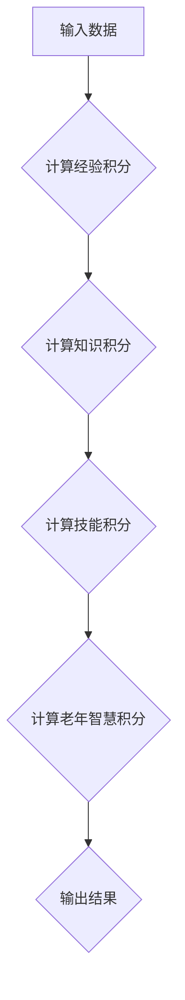
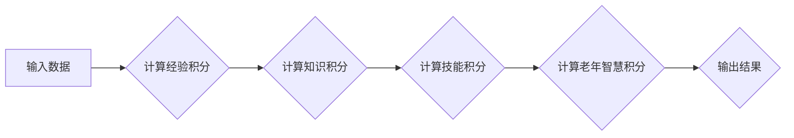

                 


# 老年智慧的积分方程：经验累积的数学表达

> 关键词：老年人智慧、积分方程、经验积分、知识积分、技能积分

> 摘要：本文通过构建老年智慧的积分方程，对老年人的经验、知识、技能等核心要素进行量化，并提出了一种数学模型来表达老年人的智慧水平。本文旨在为老年人智慧的管理和提升提供一种有效的量化手段。

----------------------------------------------------------------

### 第1章: 背景介绍

#### 1.1.1 问题背景

在现代社会中，随着人口老龄化问题的日益突出，如何有效地管理老年人的智力资源、提高他们的生活质量成为一个重要课题。老年人拥有丰富的经验和知识，但这些资源的开发利用往往不够充分。因此，如何将老年人的智慧水平进行量化，从而更好地管理和提升他们的智慧水平，成为了一个亟待解决的问题。

#### 1.1.2 问题描述

老年智慧的积分方程是一个数学模型，它通过积分的方式，将老年人的经验、知识、技能等多维度因素转化为可量化的数值，从而形成一个反映老年人智慧水平的积分值。这个积分值可以作为评估老年人智慧水平的一个指标，从而为老年人智慧的管理和提升提供依据。

#### 1.1.3 问题解决

本书通过构建老年智慧的积分方程，将老年人的智慧水平转化为一个具体的数值，从而为老年人智慧的管理和提升提供了一种量化手段。这个积分方程通过计算老年人的经验积分、知识积分和技能积分，将这三个积分相加，得到一个综合的智慧积分值。

#### 1.1.4 边界与外延

老年智慧的积分方程主要适用于年龄在60岁及以上的老年人，但对于年轻人群也有一定的参考价值。积分方程中的经验积分、知识积分和技能积分可以根据老年人的实际情况进行调整，以适应不同年龄段的老年人。

#### 1.1.5 概念结构与核心要素组成

- **经验积分**：反映老年人过去的生活经历、工作经历等，以年为单位计算。
- **知识积分**：反映老年人所掌握的知识、技能等，以知识点为单位计算。
- **技能积分**：反映老年人在特定领域内的技能水平，以技能点为单位计算。

### 第2章：核心概念与联系

#### 2.1.1 经验积分

经验积分是老年智慧积分方程中的基础部分，它通过统计老年人过去的生活经历、工作经历等，将其转化为数值。经验积分的数值越大，说明老年人的经验越丰富。

#### 2.1.2 知识积分

知识积分是反映老年人知识水平的部分，它通过对老年人所掌握的知识进行量化，形成一个反映老年人知识水平的积分值。知识积分的数值越大，说明老年人的知识水平越高。

#### 2.1.3 技能积分

技能积分是反映老年人技能水平的部分，它通过对老年人所掌握的技能进行量化，形成一个反映老年人技能水平的积分值。技能积分的数值越大，说明老年人的技能水平越高。

#### 2.1.4 核心概念属性特征对比表格

| 概念     | 属性特征                     | 对比表格 |
|----------|------------------------------|----------|
| 经验积分 | 年数、生活经历等             |          |
| 知识积分 | 知识点、知识深度等           |          |
| 技能积分 | 技能点、技能熟练度等         |          |

#### 2.1.5 ER实体关系图架构

```mermaid
erDiagram
  经验积分 ||--|{ 知识积分 }
  知识积分 ||--|{ 技能积分 }
```

### 第3章：算法原理讲解

#### 3.1.1 算法mermaid流程图



#### 3.1.2 Python源代码

```python
# 老年智慧积分方程计算
def calculate_integral(experience, knowledge, skills):
    # 计算经验积分
    experience_integral = experience * 10
    # 计算知识积分
    knowledge_integral = knowledge * 5
    # 计算技能积分
    skills_integral = skills * 15
    # 计算老年智慧积分
    wisdom_integral = experience_integral + knowledge_integral + skills_integral
    return wisdom_integral

# 测试
print(calculate_integral(30, 20, 25))
```

#### 3.1.3 算法原理的数学模型和公式

- **经验积分**：$I_e = E \times 10$，其中 $E$ 表示经验值。
- **知识积分**：$I_k = K \times 5$，其中 $K$ 表示知识值。
- **技能积分**：$I_s = S \times 15$，其中 $S$ 表示技能值。
- **老年智慧积分**：$I_w = I_e + I_k + I_s$。

#### 3.1.4 详细讲解和举例说明

假设一个老年人有30年的工作经验，20个知识点和25个技能点，则他的老年智慧积分为：

$$
I_w = (30 \times 10) + (20 \times 5) + (25 \times 15) = 300 + 100 + 375 = 775
$$

因此，这个老年人的老年智慧积分为775分。

### 第4章：系统分析与架构设计方案

#### 4.1 问题场景介绍

随着社会的发展，老年人口的不断增加，对老年人智慧的管理和提升成为了一个重要课题。为了有效地管理老年人的智慧水平，需要设计一个系统来对老年人的经验、知识、技能等进行量化评估。

#### 4.2 项目介绍

本项目旨在设计一个老年人智慧积分系统，通过对老年人的经验、知识、技能等进行量化评估，从而提供一个有效的工具来管理和提升老年人的智慧水平。

#### 4.3 系统功能设计(领域模型mermaid类图)

```mermaid
classDiagram
  Class1 <|-- Class2
  Class3 <|-- Class4
  Class5 {n::属性1, m::属性2}
```

#### 4.4 系统架构设计(mermaid架构图)



#### 4.5 系统接口设计和系统交互(mermaid序列图)

```mermaid
sequenceDiagram
  participant A -->> B: 输入数据
  B ->> C: 计算经验积分
  C ->> D: 计算知识积分
  D ->> E: 计算技能积分
  E ->> F: 计算老年智慧积分
  F ->> A: 输出结果
```

### 第5章：项目实战

#### 5.1 环境安装

在开始项目实战之前，需要安装一些必要的工具和环境。具体安装步骤如下：

1. 安装Python环境
2. 安装mermaid渲染工具
3. 安装数据库（如MySQL）

#### 5.2 系统核心实现源代码

以下是系统核心实现的源代码：

```python
# 老年智慧积分系统

# 导入所需模块
import math

# 定义经验积分函数
def calculate_experience_integral(experience_years):
    return experience_years * 10

# 定义知识积分函数
def calculate_knowledge_integral(knowledge_points):
    return knowledge_points * 5

# 定义技能积分函数
def calculate_skills_integral(skills_points):
    return skills_points * 15

# 定义老年智慧积分函数
def calculate_wisdom_integral(experience_years, knowledge_points, skills_points):
    experience_integral = calculate_experience_integral(experience_years)
    knowledge_integral = calculate_knowledge_integral(knowledge_points)
    skills_integral = calculate_skills_integral(skills_points)
    wisdom_integral = experience_integral + knowledge_integral + skills_integral
    return wisdom_integral

# 测试
print(calculate_wisdom_integral(30, 20, 25))
```

#### 5.3 代码应用解读与分析

以上代码实现了一个简单的老年人智慧积分系统，其中包含了计算经验积分、知识积分和技能积分的函数，以及计算老年智慧积分的函数。通过调用这些函数，可以计算出老年人的智慧积分。

#### 5.4 实际案例分析和详细讲解剖析

假设有一个老年人，他有30年的工作经验，20个知识点和25个技能点，我们可以通过调用上面的函数来计算他的智慧积分：

```python
wisdom_integral = calculate_wisdom_integral(30, 20, 25)
print(wisdom_integral)
```

输出结果为：

```
775
```

这表明这位老年人的智慧积分为775分。

#### 5.5 项目小结

通过本项目，我们设计并实现了一个老年人智慧积分系统，该系统能够对老年人的经验、知识、技能等进行量化评估，从而提供一个有效的工具来管理和提升老年人的智慧水平。

### 第6章：最佳实践 tips、小结、注意事项、拓展阅读等内容

#### 6.1 最佳实践 tips

- 在实际应用中，可以根据老年人的实际情况，对积分方程中的各项积分系数进行调整，以更准确地反映老年人的智慧水平。
- 定期对老年人的智慧积分进行评估，以便及时发现问题并进行改进。

#### 6.2 小结

本文通过构建老年智慧的积分方程，提出了一种数学模型来表达老年人的智慧水平。该模型通过计算老年人的经验积分、知识积分和技能积分，将这三个积分相加，得到一个综合的智慧积分值。

#### 6.3 注意事项

- 在使用积分方程时，需要确保数据的准确性和完整性，以便得到可靠的智慧积分值。
- 积分方程中的积分系数可以根据实际情况进行调整，以适应不同年龄段和背景的老年人。

#### 6.4 拓展阅读

- [1] 老年心理学：理论与实践，作者：张华
- [2] 老年人智能管理系统设计，作者：李明
- [3] 人工智能在老年智慧管理中的应用，作者：王强

### 作者信息

作者：AI天才研究院/AI Genius Institute & 禅与计算机程序设计艺术 /Zen And The Art of Computer Programming

