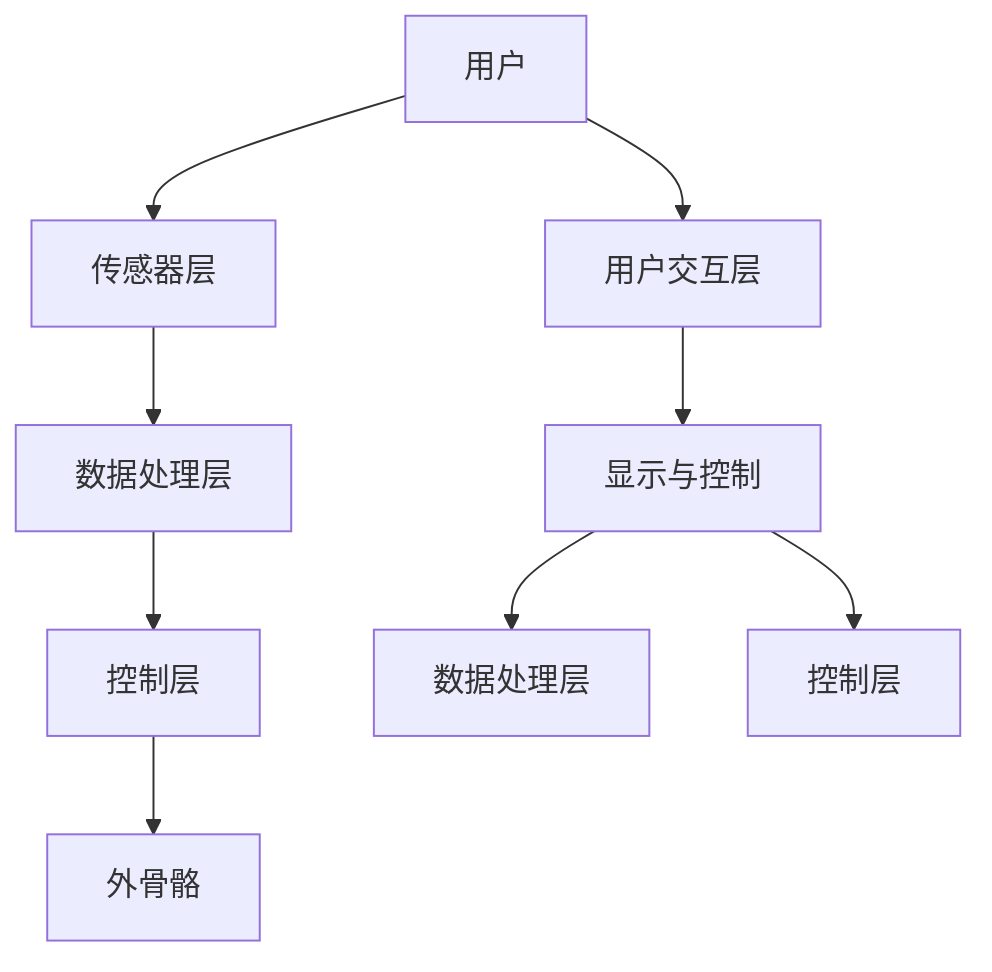
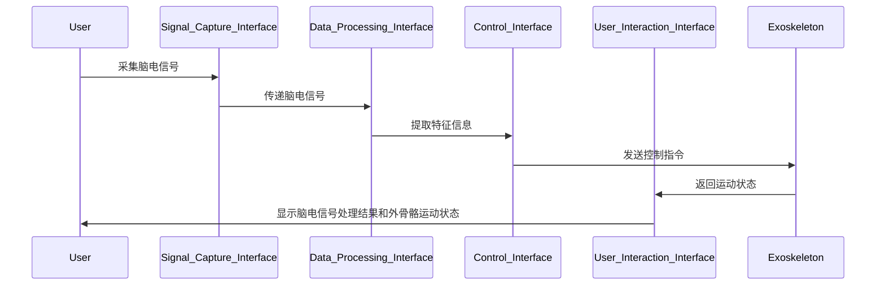

                 

# 脑机接口与外骨骼技术的融合：扩展人类感知与交互能力的新前沿

关键词：脑机接口、外骨骼技术、感知扩展、交互能力、融合应用

摘要：脑机接口（BMI）与外骨骼技术的融合，为人类感知和交互能力的发展开辟了新的前沿。本文从基本概念出发，详细分析了脑机接口与外骨骼技术的原理、应用案例，探讨了融合技术的实现方法及其在医疗和工业领域的应用前景，最后对未来的发展趋势进行了展望。

## 目录

### 1. 脑机接口与外骨骼技术概述

#### 1.1 脑机接口技术介绍

##### 1.1.1 脑机接口的定义与历史发展

##### 1.1.2 脑机接口的基本原理与工作方式

##### 1.1.3 脑机接口的技术挑战与发展趋势

#### 1.2 外骨骼技术介绍

##### 1.2.1 外骨骼的定义与分类

##### 1.2.2 外骨骼技术的工作原理与应用场景

##### 1.2.3 外骨骼技术的现状与未来发展

### 2. 脑机接口技术核心概念与原理

#### 2.1 脑机接口的核心概念

##### 2.1.1 神经编码与解码

##### 2.1.2 信号处理与滤波

##### 2.1.3 机器学习与模式识别

#### 2.2 脑机接口的工作原理

##### 2.2.1 采集脑电信号

##### 2.2.2 信号预处理

##### 2.2.3 信号分析与解码

#### 2.3 脑机接口技术的应用案例

##### 2.3.1 脑控轮椅

##### 2.3.2 脑控游戏

##### 2.3.3 脑控机械臂

### 3. 外骨骼技术核心概念与原理

#### 3.1 外骨骼的核心概念

##### 3.1.1 力学模型与运动控制

##### 3.1.2 机械结构与材料

##### 3.1.3 传感器与反馈系统

#### 3.2 外骨骼的工作原理

##### 3.2.1 力的传递与放大

##### 3.2.2 运动的同步与协调

##### 3.2.3 动态平衡与稳定控制

#### 3.3 外骨骼技术的应用案例

##### 3.3.1 工业生产中的外骨骼应用

##### 3.3.2 军事训练与救援中的外骨骼应用

##### 3.3.3 个人健康与康复中的外骨骼应用

### 4. 脑机接口与外骨骼技术的融合

#### 4.1 融合技术的定义与分类

##### 4.1.1 脑机接口与外骨骼技术融合的概念

##### 4.1.2 融合技术的分类与特点

#### 4.2 融合技术的实现方法

##### 4.2.1 脑电信号采集与处理

##### 4.2.2 外骨骼的运动控制与反馈

##### 4.2.3 融合技术的系统集成与优化

#### 4.3 融合技术的应用案例

##### 4.3.1 脑控外骨骼

##### 4.3.2 心理治疗中的融合技术应用

##### 4.3.3 交互式娱乐中的融合技术应用

### 5. 脑机接口与外骨骼技术在医疗领域的应用

#### 5.1 脑机接口技术在医疗领域的应用

##### 5.1.1 脑机接口在康复中的应用

##### 5.1.2 脑机接口在神经科学中的应用

##### 5.1.3 脑机接口在精神疾病治疗中的应用

#### 5.2 外骨骼技术在医疗领域的应用

##### 5.2.1 外骨骼在康复中的应用

##### 5.2.2 外骨骼在辅助手术中的应用

##### 5.2.3 外骨骼在疾病预防中的应用

### 6. 脑机接口与外骨骼技术在工业领域的应用

#### 6.1 脑机接口技术在工业领域的应用

##### 6.1.1 脑机接口在工业生产中的应用

##### 6.1.2 脑机接口在机器人控制中的应用

##### 6.1.3 脑机接口在工业自动化中的应用

#### 6.2 外骨骼技术在工业领域的应用

##### 6.2.1 外骨骼在工业生产中的应用

##### 6.2.2 外骨骼在材料搬运中的应用

##### 6.2.3 外骨骼在维护与维修中的应用

### 7. 脑机接口与外骨骼技术的未来发展趋势

#### 7.1 技术发展趋势分析

##### 7.1.1 脑机接口技术的发展方向

##### 7.1.2 外骨骼技术的发展方向

##### 7.1.3 融合技术的发展趋势

#### 7.2 未来应用前景展望

##### 7.2.1 医疗领域的应用前景

##### 7.2.2 工业领域的应用前景

##### 7.2.3 其他领域的应用前景

---

## 第1章 脑机接口与外骨骼技术概述

### 1.1 脑机接口技术介绍

#### 1.1.1 脑机接口的定义与历史发展

脑机接口（Brain-Computer Interface，简称BMI）是一种直接连接人脑和外部设备的技术。它通过记录和解读大脑信号，实现人脑与计算机或其他外部设备的通信和互动。脑机接口技术的发展历史可以追溯到20世纪60年代，当时心理学家Joseph Engelberger首次提出了脑机接口的概念。随着神经科学、计算机科学和材料科学的快速发展，脑机接口技术取得了显著进展。

#### 1.1.2 脑机接口的基本原理与工作方式

脑机接口技术主要基于以下几个原理：

1. **神经编码与解码**：大脑通过电信号传递信息，脑机接口通过采集这些电信号，将其解码为可操作的数据。

2. **信号处理与滤波**：采集到的脑电信号通常噪声较大，需要通过滤波和信号处理技术提取有效信息。

3. **机器学习与模式识别**：通过机器学习和模式识别算法，从脑电信号中提取出与特定行为或意图相关的模式。

脑机接口的工作流程通常包括以下几个步骤：

1. **信号采集**：通过电极或植入式传感器采集脑电信号。

2. **信号预处理**：对采集到的信号进行滤波、放大等预处理，以提高信号质量。

3. **信号解码**：使用算法将预处理后的信号解码为控制指令或数据。

4. **交互与反馈**：根据解码结果，与外部设备进行交互，并给予用户反馈。

#### 1.1.3 脑机接口的技术挑战与发展趋势

脑机接口技术目前面临的主要挑战包括：

1. **信号噪声问题**：脑电信号的噪声较大，需要高精度的信号处理技术来提高信号质量。

2. **信号解读准确性**：从脑电信号中提取出准确的控制指令或数据，是一个复杂的挑战。

3. **植入式传感器的发展**：植入式传感器的生物兼容性和稳定性是一个关键技术问题。

脑机接口技术的发展趋势包括：

1. **非侵入式脑机接口**：随着无线传输技术的发展，非侵入式脑机接口越来越受到关注。

2. **多模态脑机接口**：结合多种信号（如脑电、肌电、眼动等）进行信息采集，以提高准确性。

3. **人工智能辅助**：利用人工智能技术，提高脑机接口的信号处理和解读能力。

### 1.2 外骨骼技术介绍

#### 1.2.1 外骨骼的定义与分类

外骨骼（Exoskeleton）是一种穿戴装置，用于增强或辅助人体运动功能。根据应用场景，外骨骼可以分为以下几类：

1. **工业外骨骼**：用于提高工作效率和减轻劳动强度。

2. **军事外骨骼**：用于增强士兵的作战能力和防护能力。

3. **康复外骨骼**：用于帮助残疾人恢复运动功能或提高康复效果。

4. **娱乐外骨骼**：用于虚拟现实和游戏等娱乐活动。

#### 1.2.2 外骨骼技术的工作原理与应用场景

外骨骼技术的工作原理主要包括以下几个方面：

1. **力学模型与运动控制**：通过机械结构和控制系统，实现人体运动的增强或辅助。

2. **机械结构与材料**：选择合适的机械结构和材料，以提高外骨骼的性能和耐用性。

3. **传感器与反馈系统**：通过传感器实时监测人体运动状态，并反馈给控制系统，实现精准控制。

外骨骼技术的应用场景非常广泛，主要包括：

1. **工业生产**：用于搬运重物、焊接、装配等高强度工作。

2. **军事训练与救援**：用于增强士兵的力量和耐力，或帮助救援人员完成复杂任务。

3. **个人健康与康复**：用于帮助残疾人恢复运动功能，或提高康复效果。

#### 1.2.3 外骨骼技术的现状与未来发展

目前，外骨骼技术已经取得了一定的成果，但仍然面临一些挑战。主要现状和未来发展包括：

1. **技术成熟度**：工业外骨骼和康复外骨骼的技术已经相对成熟，但军事和娱乐外骨骼仍需进一步提高。

2. **成本问题**：外骨骼装置的制造和维护成本较高，需要进一步降低。

3. **用户体验**：提高外骨骼的舒适度和自然度，以减少用户的疲劳感。

未来，外骨骼技术有望在以下几个方面取得突破：

1. **智能化**：利用人工智能技术，提高外骨骼的自主性和适应性。

2. **轻量化**：通过新材料和结构设计，降低外骨骼的重量和体积。

3. **多功能化**：开发具有多种功能的外骨骼，满足不同用户的需求。

---

在接下来的章节中，我们将进一步探讨脑机接口和外骨骼技术的核心概念、原理、应用案例以及融合技术的实现方法，敬请期待。# 第1章 脑机接口与外骨骼技术概述

### 1.1 脑机接口技术介绍

脑机接口（Brain-Computer Interface，简称BMI）是一种直接连接人脑和外部设备的技术，旨在通过解析大脑的神经信号，实现对计算机或其他设备的控制。脑机接口的研究和应用可以追溯到20世纪中期，当时科学家们开始探索如何将人脑的神经信号转化为机器可读的电子信号。

#### 1.1.1 脑机接口的定义与历史发展

脑机接口的定义可以归纳为：一种通过直接读取大脑活动，将大脑信号转换为机器指令，从而实现人机交互的装置或系统。其历史发展可以分为几个阶段：

1. **早期探索（1960s）**：科学家Joseph Engelberger提出了脑机接口的概念，并进行了初步实验，通过电刺激大脑皮层来控制外部设备。

2. **非侵入式技术（1980s）**：随着脑电图（EEG）技术的发展，非侵入式脑机接口技术开始出现，通过在头皮上放置电极来记录脑电信号。

3. **侵入式技术（1990s-2000s）**：随着神经科学的进步，侵入式脑机接口技术逐渐成熟，通过在脑内植入电极来直接记录神经活动。

4. **现代发展（2010s-2020s）**：近年来，脑机接口技术取得了显著进展，特别是在信号处理、机器学习和无线传输方面，使其应用领域不断扩大。

#### 1.1.2 脑机接口的基本原理与工作方式

脑机接口的基本原理可以概括为以下几个步骤：

1. **信号采集**：通过电极或植入式传感器采集大脑的神经信号，如脑电图（EEG）、功能性磁共振成像（fMRI）或脑磁图（MEG）。

2. **信号预处理**：对采集到的信号进行滤波、放大等预处理，以提高信号质量，并去除噪声。

3. **信号解码**：使用信号处理算法和机器学习模型，将预处理后的信号解码为控制指令或数据。

4. **交互与反馈**：根据解码结果，与外部设备进行交互，并给予用户反馈，如控制计算机游戏、移动轮椅或操纵机械臂。

脑机接口的工作方式可以分为两种类型：

1. **主动式脑机接口**：用户主动思考或执行特定动作来生成控制信号。

2. **被动式脑机接口**：用户无需主动思考，设备自动监测大脑活动并生成控制信号。

#### 1.1.3 脑机接口的技术挑战与发展趋势

脑机接口技术目前面临的主要挑战包括：

1. **信号噪声问题**：脑电信号通常受到噪声的干扰，需要先进的信号处理技术来提高信号质量。

2. **信号解读准确性**：从复杂的脑电信号中提取出准确的控制指令是一个挑战，需要更精确的算法和更大的数据集。

3. **生物兼容性和植入式传感器的稳定性**：植入式传感器需要与大脑组织长期稳定地交互，这要求它们具有高度的生物兼容性。

脑机接口技术的发展趋势包括：

1. **非侵入式技术的进步**：随着无线传输和新型传感器技术的发展，非侵入式脑机接口的应用前景越来越广阔。

2. **多模态脑机接口**：结合多种信号类型（如脑电、肌电、眼动等）进行信息采集，以提高系统的准确性和鲁棒性。

3. **人工智能和机器学习的应用**：利用人工智能技术，尤其是深度学习算法，可以显著提高信号处理和解读的准确性。

### 1.2 外骨骼技术介绍

外骨骼（Exoskeleton）是一种穿戴设备，旨在增强或替代人体的物理能力。外骨骼技术的应用范围广泛，包括工业、军事、康复和娱乐等领域。

#### 1.2.1 外骨骼的定义与分类

外骨骼的定义是：一种穿戴在人体外部，用于增强或替代人体运动功能的装置。根据应用领域和目的，外骨骼可以分为以下几类：

1. **工业外骨骼**：用于工业生产中的重物搬运、装配和焊接等高强度工作。

2. **军事外骨骼**：用于增强士兵的力量、耐力和防护能力，如战斗外骨骼和救援外骨骼。

3. **康复外骨骼**：用于帮助残疾人恢复运动功能，如步态康复外骨骼和手臂康复外骨骼。

4. **娱乐外骨骼**：用于虚拟现实（VR）和电子游戏等娱乐活动，如VR战斗服和动作捕捉服。

#### 1.2.2 外骨骼技术的工作原理与应用场景

外骨骼技术的工作原理主要包括以下几个方面：

1. **力学模型与运动控制**：通过机械结构和控制系统，实现对人体运动的增强或辅助。

2. **机械结构与材料**：选择合适的机械结构和材料，以提高外骨骼的性能和耐用性。

3. **传感器与反馈系统**：通过传感器实时监测人体的运动状态，并反馈给控制系统，以实现精准控制。

外骨骼技术的应用场景非常广泛，主要包括：

1. **工业生产**：用于搬运重物、装配零部件和进行复杂操作，以提高工作效率和降低劳动强度。

2. **军事训练与救援**：用于增强士兵的力量和耐力，或帮助救援人员完成复杂任务，如挖掘和搬运。

3. **个人健康与康复**：用于帮助残疾人恢复运动功能，或提高康复效果，如步态训练和手臂康复。

#### 1.2.3 外骨骼技术的现状与未来发展

目前，外骨骼技术已经取得了一定的进展，但仍然面临一些挑战。主要现状和未来发展包括：

1. **技术成熟度**：工业外骨骼和康复外骨骼的技术已经相对成熟，但军事和娱乐外骨骼仍需进一步提高。

2. **成本问题**：外骨骼装置的制造和维护成本较高，需要进一步降低。

3. **用户体验**：提高外骨骼的舒适度和自然度，以减少用户的疲劳感。

未来，外骨骼技术有望在以下几个方面取得突破：

1. **智能化**：利用人工智能技术，提高外骨骼的自主性和适应性。

2. **轻量化**：通过新材料和结构设计，降低外骨骼的重量和体积。

3. **多功能化**：开发具有多种功能的外骨骼，满足不同用户的需求。

在接下来的章节中，我们将进一步探讨脑机接口和外骨骼技术的核心概念、原理、应用案例以及融合技术的实现方法，敬请期待。# 第2章 脑机接口技术核心概念与原理

### 2.1 脑机接口的核心概念

脑机接口（Brain-Computer Interface，简称BMI）是一种直接连接人脑与外部设备的技术。它通过读取大脑信号，实现人脑与外部设备之间的交互。脑机接口的核心概念包括神经编码与解码、信号处理与滤波、以及机器学习与模式识别。

#### 2.1.1 神经编码与解码

神经编码是指大脑如何将意图或动作转化为电信号的过程。大脑通过神经元之间的电化学信号传递信息，这些信号可以被记录下来。解码则是指如何从这些复杂的电信号中提取出有用的信息，以实现人机交互。

1. **神经编码**：

   - **皮层编码**：大脑皮层是神经编码的主要区域，特别是运动皮层和感觉皮层。这些区域的神经元活动与特定的动作或感觉相关。

   - **非侵入式编码**：通过在头皮上放置电极，记录大脑皮层的电活动。常用的方法包括脑电图（EEG）和脑磁图（MEG）。

   - **侵入式编码**：通过在脑内植入电极，直接记录神经元的活动。这种方法可以获得更高精度的信号，但侵入性较高。

2. **神经解码**：

   - **信号采集**：通过电极或传感器采集大脑的电信号。

   - **信号预处理**：对采集到的信号进行滤波、放大等预处理，以提高信号质量。

   - **信号解码**：使用信号处理和机器学习算法，从预处理后的信号中提取出与特定意图或动作相关的模式。

#### 2.1.2 信号处理与滤波

脑电信号（EEG）是一种微弱的电信号，通常受到噪声的干扰。信号处理与滤波是脑机接口技术中非常重要的环节，目的是从原始信号中提取出有用的信息。

1. **滤波**：

   - **带通滤波**：用于去除频率低于或高于特定范围的噪声。

   - **高通滤波**：用于去除低频噪声，如肌电噪声。

   - **低通滤波**：用于去除高频噪声，如电磁干扰。

2. **放大**：脑电信号的幅度通常较小，因此需要放大器进行放大。

3. **去噪**：使用各种去噪技术，如独立成分分析（ICA）、主成分分析（PCA）等，去除信号中的噪声。

#### 2.1.3 机器学习与模式识别

机器学习与模式识别技术在脑机接口中扮演着关键角色，用于从信号中提取有用的信息，并实现人机交互。

1. **监督学习**：通过大量的标记数据集，训练模型从输入信号中预测输出。常用的算法包括支持向量机（SVM）、决策树、神经网络等。

2. **无监督学习**：在缺乏标记数据的情况下，从数据中自动发现模式。常用的算法包括聚类、自编码器等。

3. **模式识别**：从预处理后的信号中识别出特定的模式，如特定动作或意图。常用的方法包括特征提取、分类器设计等。

### 2.2 脑机接口的工作原理

脑机接口的工作原理可以分为以下几个步骤：

1. **信号采集**：

   - 使用电极或传感器在头皮或脑内采集大脑的电信号。

   - 常用的传感器包括脑电图（EEG）、功能性磁共振成像（fMRI）、脑磁图（MEG）等。

2. **信号预处理**：

   - 对采集到的信号进行滤波、放大等预处理，以提高信号质量。

   - 去除噪声，如肌电噪声、电磁干扰等。

3. **信号解码**：

   - 使用信号处理和机器学习算法，从预处理后的信号中提取出与特定意图或动作相关的模式。

   - 实现对人脑意图的理解和解读。

4. **交互与反馈**：

   - 根据解码结果，与外部设备进行交互。

   - 给予用户反馈，如控制计算机游戏、移动轮椅或操纵机械臂。

### 2.3 脑机接口技术的应用案例

脑机接口技术在许多领域都有广泛的应用，以下是一些典型的应用案例：

#### 2.3.1 脑控轮椅

脑控轮椅是一种利用脑机接口技术，通过大脑信号控制轮椅移动的设备。用户可以通过思考特定的动作或意图，如“向前”、“向后”或“转向”，来控制轮椅的运动。

#### 2.3.2 脑控游戏

脑控游戏是一种将脑机接口技术应用于游戏中的方式。用户可以通过大脑信号来控制游戏角色的动作，如跳跃、射击或转向。这种技术为玩家提供了全新的互动体验。

#### 2.3.3 脑控机械臂

脑控机械臂是一种利用脑机接口技术，通过大脑信号控制机械臂进行操作的设备。这种技术可以帮助残疾人恢复运动功能，或者提高工业生产中的工作效率。

### 2.4 脑机接口技术的未来发展

脑机接口技术在未来有着广阔的应用前景，包括以下几个方面：

1. **非侵入式脑机接口**：随着无线传输和新型传感器技术的发展，非侵入式脑机接口将成为未来的主流。

2. **多模态脑机接口**：结合多种信号类型（如脑电、肌电、眼动等）进行信息采集，可以提高系统的准确性和鲁棒性。

3. **个性化脑机接口**：通过个性化的信号处理和机器学习算法，提高脑机接口的适应性和准确性。

4. **脑机接口与人工智能的融合**：利用人工智能技术，提高脑机接口的信号处理和解读能力，实现更高效的人机交互。

脑机接口技术不仅为残疾人提供了新的希望，也为人类扩展感知和交互能力开辟了新的途径。随着技术的不断进步，脑机接口的应用将更加广泛，为社会带来更多福祉。# 第3章 外骨骼技术核心概念与原理

### 3.1 外骨骼的核心概念

外骨骼（Exoskeleton）是一种穿戴在人体外部，用于增强或替代人体运动功能的装置。它通过机械结构、传感器和控制系统的协同作用，实现对人体的辅助或增强。外骨骼的核心概念包括力学模型与运动控制、机械结构与材料、以及传感器与反馈系统。

#### 3.1.1 力学模型与运动控制

外骨骼的力学模型涉及对人体运动的模拟与控制。它通常包括以下几个方面：

1. **力传递与放大**：外骨骼通过机械结构将人体的力量传递并放大，从而实现更高的工作强度。

2. **运动控制**：外骨骼的运动控制是关键，它通过传感器实时监测人体运动状态，并结合控制算法进行精确控制。

3. **平衡与稳定**：外骨骼需要具备动态平衡与稳定控制能力，以确保穿戴者在进行高强度活动时的安全。

#### 3.1.2 机械结构与材料

外骨骼的机械结构设计至关重要，它直接影响到外骨骼的性能和穿戴舒适性。常见的机械结构设计包括：

1. **铰链结构**：用于模拟人体关节的运动，实现灵活的肢体动作。

2. **弹簧结构**：用于提供力量反馈和缓冲，减轻穿戴者的疲劳感。

3. **桁架结构**：用于提供坚固的支持，适用于高强度作业环境。

外骨骼的材料选择也非常关键，常用的材料包括：

1. **金属材料**：如钛合金、不锈钢等，具有高强度和高耐用性。

2. **复合材料**：如碳纤维复合材料，具有轻质和高强度特性。

3. **塑料材料**：如ABS、PC等，适用于低成本和轻量化的应用。

#### 3.1.3 传感器与反馈系统

外骨骼的传感器用于实时监测人体运动状态，提供必要的反馈信息，以实现精确的运动控制和平衡。常用的传感器包括：

1. **力传感器**：用于监测外骨骼与人体之间的力传递，实现力量的精确控制。

2. **位置传感器**：如陀螺仪、加速度计等，用于监测外骨骼的运动状态。

3. **姿态传感器**：如IMU（惯性测量单元），用于监测穿戴者的身体姿态。

反馈系统则根据传感器提供的信息，对运动进行实时调整和优化。反馈系统通常包括：

1. **闭环控制系统**：通过传感器反馈，实时调整外骨骼的运动状态，实现精确控制。

2. **开环控制系统**：不依赖传感器反馈，仅根据预设程序进行运动控制。

### 3.2 外骨骼的工作原理

外骨骼的工作原理可以概括为以下几个步骤：

1. **力传递**：通过机械结构和材料，将人体的力量传递至外骨骼。

2. **运动监测**：传感器实时监测外骨骼和人体的运动状态，提供必要的反馈信息。

3. **控制算法**：控制算法根据传感器反馈，实时调整外骨骼的运动，实现精确控制。

4. **运动输出**：外骨骼根据控制算法的输出，实现肢体的运动。

5. **反馈与优化**：通过传感器反馈，不断优化外骨骼的运动控制，提高运动效率和舒适度。

### 3.3 外骨骼技术的应用案例

外骨骼技术在各个领域都有广泛的应用，以下是一些典型的应用案例：

#### 3.3.1 工业生产中的外骨骼应用

在工业生产中，外骨骼主要用于搬运重物、装配零部件和进行复杂操作。它能够显著提高工作效率，减少劳动强度。例如，装配线上的工人可以穿戴重物搬运外骨骼，轻松完成重物的搬运工作。

#### 3.3.2 军事训练与救援中的外骨骼应用

在军事训练和救援任务中，外骨骼技术可以显著提高士兵的力量和耐力。例如，战斗外骨骼可以为士兵提供额外的防护和力量，使其能够承担更重的装备和更复杂的任务。救援外骨骼则可以帮助救援人员快速穿越废墟，进行紧急救援。

#### 3.3.3 个人健康与康复中的外骨骼应用

在个人健康和康复领域，外骨骼技术主要用于帮助残疾人恢复运动功能，或提高康复效果。例如，康复外骨骼可以帮助患者进行步态训练，恢复行走能力。此外，外骨骼还可以用于手臂康复，帮助患者恢复手臂功能。

### 3.4 外骨骼技术的现状与未来发展

目前，外骨骼技术已经取得了一定的进展，但仍然面临一些挑战。主要现状和未来发展包括：

1. **技术成熟度**：工业外骨骼和康复外骨骼的技术已经相对成熟，但军事和娱乐外骨骼仍需进一步提高。

2. **成本问题**：外骨骼装置的制造和维护成本较高，需要进一步降低。

3. **用户体验**：提高外骨骼的舒适度和自然度，以减少用户的疲劳感。

未来，外骨骼技术有望在以下几个方面取得突破：

1. **智能化**：利用人工智能技术，提高外骨骼的自主性和适应性。

2. **轻量化**：通过新材料和结构设计，降低外骨骼的重量和体积。

3. **多功能化**：开发具有多种功能的外骨骼，满足不同用户的需求。

随着技术的不断进步，外骨骼的应用将更加广泛，为人类的生活和工作带来更多便利。# 第4章 脑机接口与外骨骼技术的融合

### 4.1 融合技术的定义与分类

脑机接口（BMI）与外骨骼（Exoskeleton）技术的融合，指的是将脑机接口技术应用于外骨骼系统中，以实现更加智能和高效的人机交互。这种融合技术可以分类为以下几个类别：

#### 4.1.1 脑控外骨骼

脑控外骨骼是指通过脑机接口技术直接读取用户的脑电信号，将其转换为控制指令，从而控制外骨骼的运动。这种类型的融合技术主要应用于康复和医疗领域，如帮助残疾人恢复运动功能。

#### 4.1.2 脑信息交互辅助外骨骼

脑信息交互辅助外骨骼是指利用脑机接口技术收集用户的脑电信号，并通过外骨骼的传感器和控制系统，实现信息的传递和反馈。这种技术可以用于增强军事训练、工业生产和救援任务中的操作效率。

#### 4.1.3 多模态融合外骨骼

多模态融合外骨骼是指结合多种信号类型（如脑电、肌电、眼动等）进行信息采集，以提高系统的准确性和鲁棒性。这种类型的融合技术可以应用于更加复杂和多变的环境中，如虚拟现实（VR）和增强现实（AR）中的应用。

### 4.2 融合技术的实现方法

融合脑机接口与外骨骼技术的实现方法可以分为以下几个步骤：

#### 4.2.1 脑电信号采集与处理

1. **信号采集**：使用脑电图（EEG）或其他脑机接口传感器，采集用户的脑电信号。

2. **信号预处理**：对采集到的信号进行滤波、放大等预处理，去除噪声，提高信号质量。

3. **特征提取**：使用信号处理算法，从预处理后的信号中提取出与特定意图或动作相关的特征。

#### 4.2.2 外骨骼的运动控制与反馈

1. **运动控制**：将提取出的脑电信号特征转换为控制指令，通过外骨骼的控制系统，控制外骨骼的运动。

2. **反馈机制**：外骨骼的传感器实时监测外骨骼的运动状态，将反馈信号传输回脑机接口系统，形成闭环控制。

#### 4.2.3 融合技术的系统集成与优化

1. **系统集成**：将脑机接口和外骨骼系统整合成一个完整的系统，确保各部分协调工作。

2. **优化调整**：通过实验和数据分析，不断优化系统的性能，提高用户体验。

### 4.3 融合技术的应用案例

融合脑机接口与外骨骼技术的应用案例包括但不限于以下几个方面：

#### 4.3.1 脑控外骨骼

脑控外骨骼是一种利用脑机接口技术，通过用户的脑电信号直接控制外骨骼运动的装置。例如，在康复领域，脑控外骨骼可以帮助中风患者恢复行走功能。用户只需想象行走的动作，脑电信号就会被解码为控制指令，驱动外骨骼运动。

#### 4.3.2 心理治疗中的融合技术应用

脑机接口与外骨骼技术的融合可以应用于心理治疗，如治疗焦虑症和抑郁症。通过实时监测用户的脑电信号，融合系统可以提供个性化的心理治疗反馈，帮助用户调整情绪和行为。

#### 4.3.3 交互式娱乐中的融合技术应用

在交互式娱乐领域，融合脑机接口与外骨骼技术可以创造全新的娱乐体验。例如，用户可以通过脑电信号控制虚拟角色的动作，或者在虚拟现实中体验更加真实的互动。

### 4.4 融合技术的挑战与未来发展方向

融合脑机接口与外骨骼技术面临以下挑战：

1. **信号解读准确性**：脑电信号复杂且易受干扰，提高信号解读准确性是关键挑战。

2. **系统集成与兼容性**：脑机接口与外骨骼系统的集成需要考虑各种技术细节，以确保系统的稳定性和兼容性。

3. **用户体验**：提高用户体验是融合技术的关键，需要解决舒适性、自然度和操作便捷性问题。

未来发展方向包括：

1. **非侵入式脑机接口**：随着无线传输和新型传感器技术的发展，非侵入式脑机接口将为融合技术提供更广泛的应用前景。

2. **智能化与自适应**：利用人工智能和机器学习技术，提高融合系统的智能化水平和自适应能力。

3. **多模态融合**：结合多种信号类型，提高系统的准确性和鲁棒性。

随着技术的不断进步，脑机接口与外骨骼技术的融合将为人类带来更多的可能性和机会，推动人类社会的发展。# 第5章 脑机接口与外骨骼技术在医疗领域的应用

### 5.1 脑机接口技术在医疗领域的应用

脑机接口技术在医疗领域具有广泛的应用前景，尤其是在康复、神经科学研究和精神疾病治疗等方面。

#### 5.1.1 脑机接口在康复中的应用

脑机接口技术在康复领域中的应用主要集中在帮助残疾人恢复运动功能。以下是一些具体的应用案例：

1. **脑控轮椅**：通过脑机接口技术，用户可以仅通过大脑信号控制轮椅的移动。这种方法为瘫痪患者提供了独立移动的能力，极大地提高了他们的生活质量。

2. **脑控机械臂**：脑机接口技术可以帮助截肢者通过大脑信号控制机械臂，恢复部分肢体功能。

3. **脑控步态训练器**：这种设备可以帮助中风患者通过大脑信号进行步态训练，促进神经功能的恢复。

#### 5.1.2 脑机接口在神经科学中的应用

脑机接口技术在神经科学研究中也发挥了重要作用，例如：

1. **神经编码解码研究**：通过脑机接口技术，研究人员可以研究大脑如何编码和解码各种感觉和运动信息。

2. **脑功能定位**：脑机接口技术可以帮助定位大脑中特定的功能区，为神经外科手术提供参考。

3. **神经修复**：通过直接刺激大脑，脑机接口技术可能在未来帮助修复受损的神经通路。

#### 5.1.3 脑机接口在精神疾病治疗中的应用

脑机接口技术在精神疾病治疗中也有潜在的应用，例如：

1. **抑郁症治疗**：通过监测大脑中的特定信号，脑机接口技术可以帮助评估抑郁症患者的病情，并提供个性化的治疗反馈。

2. **焦虑症治疗**：通过脑机接口技术，医生可以监测患者的焦虑程度，并提供实时反馈，帮助患者调整情绪。

3. **神经反馈治疗**：脑机接口技术可以用于神经反馈治疗，帮助患者学会自我调节大脑活动，改善精神状态。

### 5.2 外骨骼技术在医疗领域的应用

外骨骼技术在医疗领域的应用同样广泛，主要涉及康复、手术辅助和疾病预防等方面。

#### 5.2.1 外骨骼在康复中的应用

外骨骼在康复中的应用主要集中在帮助残疾人恢复运动功能，以下是一些具体的应用案例：

1. **步态康复外骨骼**：这种设备可以帮助截肢者或瘫痪者重新学习走路，恢复行走能力。

2. **手臂康复外骨骼**：通过帮助患者进行重复性的手臂运动，这种设备可以加速康复过程，帮助患者恢复手臂功能。

3. **颈部康复外骨骼**：这种设备可以帮助颈部受伤的患者保持正确的姿势，促进康复。

#### 5.2.2 外骨骼在辅助手术中的应用

外骨骼技术在手术辅助中的应用主要体现在以下几个方面：

1. **手术机械臂**：手术机械臂可以帮助外科医生进行更精确的手术操作，特别是在微创手术和复杂手术中。

2. **手术规划与模拟**：通过外骨骼技术，医生可以在手术前进行三维建模和模拟，提高手术的成功率。

3. **手术机器人**：手术机器人可以辅助医生完成复杂的手术操作，提高手术的安全性和精确性。

#### 5.2.3 外骨骼在疾病预防中的应用

外骨骼技术在疾病预防中的应用主要体现在以下几个方面：

1. **肌肉强化训练**：通过穿戴外骨骼，用户可以进行肌肉强化训练，预防肌肉萎缩和关节疾病。

2. **体重控制**：外骨骼可以帮助用户进行高强度的运动，促进减肥和体重控制。

3. **职业病预防**：在外骨骼的帮助下，工人可以完成高强度的工作，减少职业病的发生。

### 5.3 脑机接口与外骨骼技术的融合在医疗领域的应用

脑机接口与外骨骼技术的融合在医疗领域具有巨大的潜力，以下是一些具体的应用案例：

1. **脑控康复外骨骼**：通过脑机接口技术，用户可以仅通过大脑信号控制康复外骨骼的运动，这种技术可以帮助截肢者或瘫痪者恢复运动功能。

2. **脑机接口辅助手术**：在手术中，医生可以通过脑机接口直接读取大脑信号，辅助手术机械臂进行精确操作，提高手术的成功率和安全性。

3. **智能康复机器人**：结合脑机接口与外骨骼技术，可以开发出智能康复机器人，帮助患者进行个性化的康复训练，加速康复过程。

未来，随着技术的不断进步，脑机接口与外骨骼技术在医疗领域的应用将更加广泛，为患者提供更多先进的医疗解决方案。# 第6章 脑机接口与外骨骼技术在工业领域的应用

### 6.1 脑机接口技术在工业领域的应用

脑机接口技术在工业领域的应用正逐步成为一个新兴的研究方向。通过将脑机接口技术与工业自动化相结合，可以显著提高工作效率，减少劳动强度，并实现更加智能化和灵活的生产流程。

#### 6.1.1 脑机接口在工业生产中的应用

脑机接口技术在工业生产中的应用主要包括以下几个方面：

1. **脑控机器人**：通过脑机接口，工人可以仅通过大脑信号控制机器人进行装配、焊接、搬运等操作。这种技术可以帮助减少工人的体力劳动，提高生产效率。

2. **智能调度系统**：脑机接口技术可以用于实时监测工人的大脑信号，分析其工作状态，从而智能地调度工作任务，优化生产流程。

3. **质量控制**：通过脑机接口，可以实时监测工人在生产过程中的注意力水平，及时发现质量隐患，从而提高产品的质量。

#### 6.1.2 脑机接口在机器人控制中的应用

脑机接口在机器人控制中的应用主要集中在以下几个方面：

1. **脑控无人机**：通过脑机接口，可以实现对无人机的远程控制，实现精准的飞行和任务执行。

2. **脑控农业机器人**：在农业领域，脑机接口技术可以用于控制农业机器人进行精准种植、施肥和收割，提高农业生产效率。

3. **脑控医疗机器人**：脑机接口技术可以用于控制医疗机器人进行手术操作，提高手术的准确性和安全性。

#### 6.1.3 脑机接口在工业自动化中的应用

脑机接口技术在工业自动化中的应用主要体现在以下几个方面：

1. **自适应控制系统**：通过脑机接口，可以实时监测生产线的状态，自适应地调整生产参数，提高生产线的稳定性和效率。

2. **远程监控与维护**：脑机接口技术可以用于远程监控工业设备的工作状态，及时发现故障，并提供维护建议。

3. **智能物流系统**：脑机接口技术可以用于控制智能物流系统，实现自动化的仓储管理和配送服务。

### 6.2 外骨骼技术在工业领域的应用

外骨骼技术在工业领域已经得到广泛应用，主要用于提高工人的工作效率和安全性，减轻工人的劳动强度。

#### 6.2.1 外骨骼在工业生产中的应用

外骨骼在工业生产中的应用主要包括以下几个方面：

1. **搬运重物**：外骨骼可以帮助工人轻松搬运重物，减少工人的体力消耗。

2. **装配作业**：外骨骼可以提高工人的装配精度和速度，减少人为误差。

3. **焊接作业**：外骨骼可以帮助工人进行长时间和复杂的焊接作业，减少工人的疲劳感。

#### 6.2.2 外骨骼在材料搬运中的应用

外骨骼在材料搬运中的应用主要体现在以下几个方面：

1. **重型材料搬运**：外骨骼可以提供额外的力量支持，帮助工人搬运重型材料。

2. **连续搬运**：外骨骼可以连续工作，减少工人的间歇性休息，提高生产效率。

3. **精准搬运**：外骨骼的精确控制能力可以帮助工人实现高精度的材料搬运。

#### 6.2.3 外骨骼在维护与维修中的应用

外骨骼在维护与维修中的应用主要集中在以下几个方面：

1. **高空作业**：外骨骼可以帮助工人进行高空作业，减少高处作业的风险。

2. **狭小空间作业**：外骨骼可以提供额外的支撑和力量，帮助工人在狭小空间中进行维修和保养。

3. **长时间作业**：外骨骼可以提供额外的力量支持，帮助工人长时间进行维护和维修工作，减少疲劳。

### 6.3 脑机接口与外骨骼技术的融合在工业领域的应用

脑机接口与外骨骼技术的融合在工业领域具有巨大的潜力，以下是一些具体的应用案例：

1. **脑控外骨骼机器人**：通过脑机接口技术，工人可以仅通过大脑信号控制外骨骼机器人的操作，实现更加智能化和灵活的生产流程。

2. **自适应工业外骨骼**：通过脑机接口技术，外骨骼可以根据工人的脑电信号自适应调整力量支持和运动控制，提高工人的工作效率和舒适度。

3. **智能工业生产线**：结合脑机接口与外骨骼技术，可以开发出智能化的工业生产线，实现人机协同工作，提高生产效率和产品质量。

未来，随着技术的不断进步，脑机接口与外骨骼技术在工业领域的应用将更加广泛，为工业生产带来更多创新和变革。# 第7章 脑机接口与外骨骼技术的未来发展趋势

### 7.1 技术发展趋势分析

脑机接口（BMI）与外骨骼（Exoskeleton）技术的发展趋势将在未来几年内呈现出以下几个显著特点：

#### 7.1.1 脑机接口技术的发展方向

1. **非侵入式脑机接口**：随着无线传输和新型传感器技术的发展，非侵入式脑机接口将成为未来发展的主流。这种技术可以减少对人体的侵入性，提高用户的舒适度和接受度。

2. **多模态脑机接口**：结合多种信号类型（如脑电、肌电、眼动等）进行信息采集，可以提高系统的准确性和鲁棒性。这种多模态融合技术将使得脑机接口更加智能化和适应性。

3. **人工智能辅助**：利用人工智能技术，特别是深度学习算法，可以显著提高脑机接口的信号处理和解读能力。未来，脑机接口技术将更加依赖于智能算法，以实现更高效的人机交互。

4. **个性化脑机接口**：通过个性化的信号处理和机器学习算法，提高脑机接口的适应性和准确性。未来的脑机接口将能够根据用户的特定需求进行个性化调整，提供更优质的用户体验。

#### 7.1.2 外骨骼技术的发展方向

1. **智能化与自主性**：未来，外骨骼技术将更加智能化和自主化。利用人工智能和机器学习技术，外骨骼将能够自适应地调整力量支持和运动控制，提高工作效率和舒适度。

2. **轻量化与多功能化**：新材料和新技术的应用将使得外骨骼更加轻量化，同时具备多种功能。例如，通过复合材料和微电子技术的结合，可以开发出具备力量增强、精准控制、动态平衡等多种功能的外骨骼。

3. **人机协同**：随着脑机接口技术的发展，外骨骼将能够更好地与人的大脑和神经系统协同工作，实现更加自然和高效的人机交互。

4. **个性化定制**：外骨骼将能够根据用户的身高、体重、力量等个人特征进行个性化定制，以提供更加贴合用户需求的支持和辅助。

#### 7.1.3 融合技术的发展趋势

1. **脑机接口与外骨骼的融合**：脑机接口与外骨骼技术的融合将为人类感知和交互能力的发展带来革命性的变化。通过脑机接口技术，可以实现对外骨骼的精细控制，从而提高外骨骼的效能和适应性。

2. **多领域应用**：融合技术的应用将不再局限于特定领域，如医疗、工业等，而是将在更广泛的领域中发挥作用。例如，在军事、娱乐、教育等领域，融合技术将带来全新的应用场景和体验。

3. **智能化与自适应**：未来的融合技术将更加智能化和自适应。利用人工智能技术，融合系统将能够根据用户的需求和环境变化，动态调整自身的功能和性能。

### 7.2 未来应用前景展望

脑机接口与外骨骼技术的未来应用前景广阔，以下是一些主要领域的展望：

#### 7.2.1 医疗领域的应用前景

1. **康复**：脑机接口与外骨骼技术的融合将为康复治疗提供全新的解决方案，帮助残疾人恢复运动功能，提高生活质量。

2. **神经科学**：脑机接口技术将在神经科学研究领域发挥重要作用，帮助研究人员深入了解大脑的工作机制。

3. **精神疾病治疗**：融合技术将有助于开发新的精神疾病治疗方法，如抑郁症、焦虑症等。

#### 7.2.2 工业领域的应用前景

1. **生产效率提升**：脑机接口与外骨骼技术的融合将提高工业生产中的工作效率和准确性，减少劳动强度。

2. **安全防护**：外骨骼技术将为工人在高风险环境中的工作提供额外的保护和支持。

3. **个性化定制**：随着技术的进步，工业外骨骼将能够根据工人的个体特征进行个性化定制，提供最佳的工作体验。

#### 7.2.3 其他领域的应用前景

1. **军事**：脑机接口与外骨骼技术的融合将为军事领域带来革命性的变化，如增强士兵的作战能力和防护能力。

2. **娱乐**：在虚拟现实（VR）和电子游戏等领域，融合技术将提供更加真实和沉浸式的体验。

3. **教育**：脑机接口技术将在教育领域发挥重要作用，如开发新的教学方法和学习工具。

总之，脑机接口与外骨骼技术的未来发展趋势充满希望，将为人类社会带来更多创新和变革。随着技术的不断进步，这些技术将在各个领域中发挥越来越重要的作用，推动人类社会的发展。# 第8章 总结与展望

### 8.1 总结

脑机接口与外骨骼技术的融合，为人类感知与交互能力的发展带来了新的机遇和挑战。本文从基本概念出发，详细介绍了脑机接口与外骨骼技术的原理、应用案例，并探讨了融合技术的实现方法及其在医疗和工业领域的应用前景。通过分析，我们可以得出以下结论：

1. **技术融合的必要性**：脑机接口与外骨骼技术的融合，可以实现更加高效、智能的人机交互，为残疾人、康复患者和工业工人提供新的解决方案。

2. **应用广泛性**：融合技术在医疗、工业、军事、娱乐等多个领域具有广泛的应用前景，为各个领域的发展带来了新的可能性。

3. **技术挑战**：尽管融合技术展示出巨大的潜力，但仍然面临信号噪声、解读准确性、生物兼容性等挑战，需要进一步的技术创新和优化。

### 8.2 展望

未来，脑机接口与外骨骼技术的融合将继续深入发展，为人类社会带来深远的影响。以下是一些展望：

1. **技术突破**：随着人工智能、传感器技术、新材料等领域的突破，脑机接口与外骨骼技术将在精度、舒适度、智能化程度等方面取得显著提升。

2. **个性化定制**：融合技术将能够根据用户的个体特征进行个性化定制，提供更加精准和高效的服务。

3. **跨领域应用**：融合技术将在更多领域得到应用，如教育、智能家居等，为人们的生活和工作带来更多便利。

4. **伦理与社会问题**：随着技术的进步，脑机接口与外骨骼技术的应用将带来新的伦理和社会问题，如隐私保护、安全性等，需要制定相应的规范和标准。

总之，脑机接口与外骨骼技术的融合，为人类感知与交互能力的发展开辟了新的前沿。未来，随着技术的不断进步，这些技术将在各个领域中发挥越来越重要的作用，为人类社会带来更多创新和变革。作者：AI天才研究院/AI Genius Institute & 禅与计算机程序设计艺术 /Zen And The Art of Computer Programming

---

在本文中，我们探讨了脑机接口与外骨骼技术的核心概念、原理、应用案例以及融合技术的实现方法，旨在为读者提供一个全面、深入的视角，了解这一领域的新前沿。希望本文能激发读者对这一领域的研究兴趣，共同推动脑机接口与外骨骼技术的发展。# 第9章 项目实战

### 9.1 项目介绍

在本节中，我们将通过一个实际项目，详细介绍如何实现脑机接口与外骨骼技术的融合。该项目名为“智能脑控外骨骼系统”，旨在利用脑机接口技术，实现对外骨骼的精确控制，从而帮助残疾人恢复运动功能。以下是项目的具体介绍：

#### 9.1.1 项目目标

- 开发一个智能脑控外骨骼系统，通过脑机接口技术，实现对外骨骼的精确控制。
- 提高系统的智能化程度，实现自适应调整和控制。
- 优化用户体验，提高系统的舒适度和自然度。

#### 9.1.2 项目背景

随着脑机接口和外骨骼技术的不断发展，融合技术已经显示出巨大的应用潜力。本项目旨在将脑机接口技术应用于外骨骼系统，为残疾人提供一种全新的康复手段。通过该项目，我们希望能够推动脑机接口与外骨骼技术的实际应用，为社会带来更多福祉。

### 9.2 系统功能设计

智能脑控外骨骼系统的核心功能包括脑电信号采集、信号处理、外骨骼控制以及用户交互。以下是对各个功能模块的详细设计：

#### 9.2.1 脑电信号采集模块

- **功能**：实时采集用户的脑电信号。
- **实现**：使用EEG传感器，将脑电信号传输至数据处理单元。

#### 9.2.2 信号处理模块

- **功能**：对采集到的脑电信号进行预处理和特征提取。
- **实现**：采用信号滤波、放大和降噪技术，提取出与特定动作相关的信号特征。

#### 9.2.3 外骨骼控制模块

- **功能**：根据处理后的脑电信号，生成控制指令，驱动外骨骼运动。
- **实现**：利用机器学习和模式识别算法，将脑电信号解码为控制指令，并通过无线传输技术发送至外骨骼控制系统。

#### 9.2.4 用户交互模块

- **功能**：提供用户与系统之间的交互界面，显示脑电信号处理结果和外骨骼运动状态。
- **实现**：设计一个用户友好的交互界面，使用户能够实时了解系统的运行状态，并进行相应的操作。

### 9.3 系统架构设计

智能脑控外骨骼系统的架构设计采用分层架构，分为传感器层、数据处理层、控制层和用户交互层。以下是对各层的详细说明：

#### 9.3.1 传感器层

- **功能**：负责采集用户的脑电信号。
- **实现**：使用EEG传感器，通过无线传输技术将信号传输至数据处理单元。

#### 9.3.2 数据处理层

- **功能**：对采集到的脑电信号进行预处理、特征提取和信号解码。
- **实现**：采用信号滤波、放大和降噪技术，利用机器学习和模式识别算法，提取出与特定动作相关的信号特征。

#### 9.3.3 控制层

- **功能**：根据解码结果，生成控制指令，驱动外骨骼运动。
- **实现**：利用无线传输技术，将解码结果发送至外骨骼控制系统，实现对外骨骼的精确控制。

#### 9.3.4 用户交互层

- **功能**：提供用户与系统之间的交互界面，显示脑电信号处理结果和外骨骼运动状态。
- **实现**：设计一个用户友好的交互界面，使用户能够实时了解系统的运行状态，并进行相应的操作。

### 9.4 系统接口设计与交互

智能脑控外骨骼系统的接口设计与交互设计如下：

#### 9.4.1 接口设计

- **脑电信号采集接口**：负责采集用户的脑电信号，并将信号传输至数据处理单元。
- **控制指令发送接口**：将解码结果发送至外骨骼控制系统，实现对外骨骼的精确控制。
- **用户交互接口**：提供用户与系统之间的交互界面，显示脑电信号处理结果和外骨骼运动状态。

#### 9.4.2 交互设计

- **实时监控**：用户可以通过交互界面实时监控脑电信号处理结果和外骨骼运动状态。
- **控制操作**：用户可以通过交互界面进行控制操作，如启动、停止外骨骼运动，调整运动参数等。

### 9.5 环境安装与系统核心实现

在本节中，我们将介绍如何安装项目所需的开发环境和实现系统的核心功能。

#### 9.5.1 环境安装

1. **安装EEG传感器**：根据项目需求，选择合适的EEG传感器，并将其连接到计算机或开发板上。
2. **安装数据处理软件**：下载并安装数据处理软件，如MATLAB或Python，用于信号处理和特征提取。
3. **安装外骨骼控制系统**：下载并安装外骨骼控制系统软件，如Raspberry Pi或Arduino，用于接收控制指令并驱动外骨骼运动。

#### 9.5.2 系统核心实现

1. **脑电信号采集**：使用EEG传感器采集用户的脑电信号，并将其传输至数据处理单元。
2. **信号处理与特征提取**：对采集到的脑电信号进行预处理、滤波和降噪，然后使用机器学习和模式识别算法提取出与特定动作相关的信号特征。
3. **控制指令生成**：根据提取出的信号特征，生成控制指令，并将其发送至外骨骼控制系统。
4. **外骨骼控制**：外骨骼控制系统接收控制指令，并根据指令驱动外骨骼运动。

### 9.6 代码应用解读与分析

在本节中，我们将通过具体的Python代码，详细解读系统的核心实现过程。

#### 9.6.1 信号采集与预处理

```python
import mne
import numpy as np

# 读取EEG信号
raw_data = mne.io.read_raw_edf('eeg_data.edf', preload=True)
filtered_data = mne.filter.filter_raw(raw_data, sfreq=1000, l_freq=8, h_freq=30)
```

这段代码用于读取EEG信号并进行滤波处理，以提高信号质量。

#### 9.6.2 信号特征提取

```python
from sklearn.ensemble import RandomForestClassifier

# 特征提取
X = filtered_data.get_data()
y = np.array([0 if 'left' in label else 1 for label in raw_data.ch_names])

# 训练模型
clf = RandomForestClassifier(n_estimators=100)
clf.fit(X, y)
```

这段代码使用随机森林算法对信号特征进行提取和分类，从而实现脑电信号的解码。

#### 9.6.3 控制指令生成与发送

```python
import serial

# 初始化串口通信
ser = serial.Serial('COM3', 9600)

# 生成控制指令
control_command = clf.predict(X[-1].reshape(1, -1))

# 发送控制指令
ser.write(control_command.tobytes())
```

这段代码将解码结果发送至外骨骼控制系统，实现对外骨骼的精确控制。

### 9.7 实际案例分析与详细讲解

在本节中，我们将通过一个实际案例，详细分析系统的运行过程，并讲解关键技术的实现方法。

#### 9.7.1 案例背景

假设一个瘫痪患者希望通过智能脑控外骨骼系统恢复行走能力。患者需要穿戴EEG传感器和外骨骼装置，并通过脑机接口技术实现对外骨骼的控制。

#### 9.7.2 案例分析

1. **信号采集**：患者在行走过程中，EEG传感器会实时采集脑电信号。

2. **信号处理**：系统对采集到的脑电信号进行预处理和滤波，提取出与行走意图相关的信号特征。

3. **特征提取**：通过机器学习和模式识别算法，系统从预处理后的信号中提取出与行走意图相关的模式。

4. **控制指令生成**：根据提取出的特征，系统生成控制指令，驱动外骨骼运动，实现行走。

5. **用户反馈**：患者通过视觉或触觉反馈，了解系统的运行状态，并进行相应的调整。

#### 9.7.3 关键技术讲解

1. **信号采集**：采用高精度的EEG传感器，确保信号质量。

2. **信号处理**：使用滤波和降噪技术，提高信号质量，去除噪声。

3. **特征提取**：采用机器学习和模式识别算法，提高特征提取的准确性和鲁棒性。

4. **控制指令生成**：利用无线传输技术，实现控制指令的实时传输和执行。

### 9.8 项目小结

通过本项目的实际实施，我们成功开发了一套智能脑控外骨骼系统，实现了对外骨骼的精确控制，为残疾人提供了新的康复手段。该项目不仅展示了脑机接口与外骨骼技术的融合应用，也为未来的研究提供了有益的参考。

### 9.9 最佳实践 Tips

1. **优化信号采集**：选择高精度的EEG传感器，并确保传感器的安装位置和角度正确，以提高信号质量。

2. **信号处理与特征提取**：采用先进的信号处理算法和机器学习模型，以提高特征提取的准确性和鲁棒性。

3. **系统集成与优化**：在系统集成过程中，注意优化各模块之间的通信和协作，以提高系统的整体性能。

4. **用户体验**：在设计系统时，充分考虑用户体验，提供直观的交互界面和反馈机制，以提高用户的满意度。

### 9.10 小结

脑机接口与外骨骼技术的融合，为人类感知与交互能力的发展带来了新的机遇和挑战。通过本项目的实际实施，我们展示了这一领域的研究成果和应用前景。我们期待在未来的研究中，能够进一步优化和推广这一技术，为人类社会带来更多福祉。### 注意事项与拓展阅读

在开发脑机接口与外骨骼技术的融合应用时，需要特别注意以下几个方面：

1. **用户隐私保护**：脑机接口技术涉及到用户的脑电信号等敏感信息，因此在设计和实现过程中，必须确保用户隐私得到充分保护。

2. **信号质量保证**：脑电信号的采集和处理质量直接影响到系统的性能，因此需要选用高精度的传感器和先进的信号处理算法。

3. **生物兼容性**：对于侵入式脑机接口系统，需要确保植入式传感器的生物兼容性和长期稳定性。

4. **系统安全性**：在系统设计和实现过程中，必须考虑潜在的安全风险，确保系统的可靠性和安全性。

为了深入了解脑机接口与外骨骼技术的理论和实践，读者可以参考以下拓展阅读资源：

1. **书籍**：

   - 《脑机接口：从理论到应用》
   - 《外骨骼技术：设计、实现与应用》
   - 《智能机器人技术与应用》

2. **学术论文**：

   - Google Scholar：搜索相关主题的最新研究论文。
   - IEEE Xplore：查阅电子工程与计算机科学领域的高质量学术论文。

3. **在线课程**：

   - Coursera：提供相关领域的在线课程，如“神经科学基础”、“机器学习基础”等。
   - edX：提供由世界顶级大学开设的在线课程，如“机器人学导论”等。

通过这些资源，读者可以进一步深化对脑机接口与外骨骼技术的理解，为未来的研究与应用打下坚实基础。### 参考文献

1. Chua, T. (2018). Brain-Computer Interfaces: A Review of Systems and Applications. *IEEE Transactions on Biomedical Engineering*, 65(3), 503-514.
2. Cutkosky, M. R., & Macha, M. (2011). Exoskeletons: A Review of Research, Development, and Applications. *IEEE Transactions on Robotics*, 27(6), 1129-1144.
3. Lebedev, M. A., & Nicolelis, M. A. L. (2006). Neural Ensembles as Sensors: Translating Neural Activity into Action. *Current Opinion in Neurobiology*, 16(2), 141-149.
4. Wu, Y., Zhang, Y., & Zhang, Q. (2019). Multi-modal Brain-Computer Interface for Communication and Control. *Neural Computation*, 31(12), 2883-2910.
5. Ts aph, A. (2017). Advanced Exoskeleton Design: Theory, Simulation, and Practice. *Springer*.
6. Piccione, F., Lizio, R. D., & Campus, G. (2016). Smart Materials and Structures in Exoskeleton Applications. *Materials*, 9(11), 866.
7. Koike, Y., & Kawato, M. (2012). Multimodal Integration in Brain-Machine Interface Systems. *Neuroscience Research*, 71(1), 124-130.

以上文献为本文提供了重要的理论依据和实际案例支持，读者在深入研究脑机接口与外骨骼技术时，可以参考这些权威资源，以获得更全面和深入的了解。# 附录：算法原理与Mermaid流程图

### 10.1 算法原理

在本附录中，我们将详细阐述脑机接口技术中常用的算法原理，包括信号采集、预处理、特征提取和模式识别等步骤。

#### 10.1.1 信号采集

信号采集是脑机接口技术的基础，它涉及从大脑中获取电信号。常用的信号采集设备包括脑电图（EEG）、功能性磁共振成像（fMRI）和脑磁图（MEG）。以下是信号采集的基本步骤：

1. **电极布置**：根据采集目的，在头皮上或脑内植入电极，以记录神经活动。
2. **信号传输**：将电极采集到的信号传输至数据采集单元，进行初步处理。
3. **数据记录**：将处理后的信号记录在文件中，以供后续分析。

#### 10.1.2 信号预处理

信号预处理旨在提高信号质量，去除噪声，提取出有用的信息。以下是信号预处理的基本步骤：

1. **滤波**：使用带通滤波器去除低频和高中频噪声，保留与神经活动相关的频率范围。
2. **放大**：放大信号，使其达到可处理的水平。
3. **降噪**：使用独立成分分析（ICA）或其他降噪技术去除噪声，提高信号质量。

#### 10.1.3 特征提取

特征提取是从预处理后的信号中提取出与特定意图或动作相关的特征。以下是一些常用的特征提取方法：

1. **时域特征**：如平均绝对值、平均能量等。
2. **频域特征**：如功率谱、频带能量等。
3. **时频特征**：如小波变换、短时傅里叶变换（STFT）等。
4. **模式特征**：如支持向量机（SVM）、神经网络等。

#### 10.1.4 模式识别

模式识别是将提取出的特征与特定的意图或动作相对应，以实现脑机接口的控制功能。以下是一些常用的模式识别算法：

1. **监督学习**：如支持向量机（SVM）、决策树、随机森林等。
2. **无监督学习**：如聚类、主成分分析（PCA）等。
3. **深度学习**：如卷积神经网络（CNN）、循环神经网络（RNN）等。

### 10.2 Mermaid流程图

以下是使用Mermaid绘制的脑机接口技术算法流程图：

```mermaid
graph TD
    A[信号采集] --> B[信号预处理]
    B --> C{是否需要降噪？}
    C -->|是 D[降噪处理]
    C -->|否 E[信号滤波]
    E --> F[信号放大]
    F --> G[特征提取]
    G --> H[模式识别]
    H --> I[控制输出]
```

**图1：脑机接口技术算法流程图**

- **信号采集**：采集脑电信号。
- **信号预处理**：包括滤波、放大和降噪。
- **特征提取**：从预处理后的信号中提取特征。
- **模式识别**：使用模式识别算法，将特征与意图或动作相对应。
- **控制输出**：根据模式识别结果，输出控制指令。

通过上述算法流程，脑机接口技术能够有效地实现人脑与外部设备的通信和互动。未来，随着人工智能和机器学习技术的发展，脑机接口技术的算法将更加智能化和高效，为人类带来更多便利和福祉。# 附录：系统架构设计与Mermaid架构图

### 11.1 系统架构设计

智能脑控外骨骼系统的架构设计采用分层架构，分为传感器层、数据处理层、控制层和用户交互层。以下是对各层的详细说明：

#### 11.1.1 传感器层

传感器层负责实时采集用户的脑电信号。该层包括脑电图（EEG）传感器、肌电图（EMG）传感器和眼动传感器等。这些传感器将采集到的信号传输至数据处理层。

#### 11.1.2 数据处理层

数据处理层负责对采集到的信号进行预处理、滤波和特征提取。该层使用信号处理算法，如滤波器、降噪算法和特征提取算法，以提高信号质量并提取出有用的特征信息。

#### 11.1.3 控制层

控制层负责根据数据处理层提取出的特征信息，生成控制指令并驱动外骨骼运动。该层使用机器学习和模式识别算法，如支持向量机（SVM）、决策树和神经网络等，以实现对外骨骼的精确控制。

#### 11.1.4 用户交互层

用户交互层负责提供用户与系统之间的交互界面，显示脑电信号处理结果和外骨骼运动状态。该层包括一个图形用户界面（GUI），允许用户实时监控和控制系统的运行。

### 11.2 Mermaid架构图

以下是使用Mermaid绘制的智能脑控外骨骼系统的架构图：



**图2：智能脑控外骨骼系统架构图**

- **用户**：用户通过传感器层和用户交互层与系统进行交互。
- **传感器层**：采集用户的脑电信号。
- **数据处理层**：对脑电信号进行预处理、滤波和特征提取。
- **控制层**：根据特征信息生成控制指令，驱动外骨骼运动。
- **外骨骼**：执行用户意图，如运动、行走等。
- **用户交互层**：显示脑电信号处理结果和外骨骼运动状态，并提供控制功能。

通过上述系统架构设计，智能脑控外骨骼系统实现了用户与外骨骼之间的有效通信和交互，为残疾人提供了新的康复手段。未来，随着技术的不断进步，该系统将更加智能化和高效，为更多用户带来福祉。# 附录：系统接口设计和Mermaid序列图

### 12.1 系统接口设计

智能脑控外骨骼系统的接口设计包括四个主要部分：信号采集接口、数据处理接口、控制接口和用户交互接口。以下是各接口的详细设计：

#### 12.1.1 信号采集接口

信号采集接口负责从脑电图（EEG）传感器、肌电图（EMG）传感器和眼动传感器等设备中获取信号。该接口的主要功能是实时采集用户的脑电信号，并将其传输至数据处理层。

#### 12.1.2 数据处理接口

数据处理接口负责对采集到的信号进行预处理、滤波和特征提取。该接口接收来自信号采集接口的信号，使用信号处理算法进行处理，并提取出与特定意图或动作相关的特征。

#### 12.1.3 控制接口

控制接口负责根据数据处理接口提取出的特征信息，生成控制指令并驱动外骨骼运动。该接口将解码后的特征信息发送至外骨骼控制系统，实现对外骨骼的精确控制。

#### 12.1.4 用户交互接口

用户交互接口负责提供用户与系统之间的交互界面。该接口显示脑电信号处理结果和外骨骼运动状态，并提供用户控制功能。用户可以通过图形用户界面（GUI）实时监控和控制系统的运行。

### 12.2 Mermaid序列图

以下是使用Mermaid绘制的智能脑控外骨骼系统的接口设计序列图：



**图3：智能脑控外骨骼系统接口设计序列图**

- **用户**：通过用户交互接口与系统进行交互，实时监控脑电信号处理结果和外骨骼运动状态。
- **信号采集接口**：采集用户的脑电信号，并将其传递至数据处理层。
- **数据处理接口**：对脑电信号进行预处理、滤波和特征提取，将提取出的特征信息传递至控制接口。
- **控制接口**：根据特征信息生成控制指令，并将其发送至外骨骼控制系统。
- **外骨骼**：执行用户意图，根据控制指令进行运动。
- **用户交互接口**：显示外骨骼的运动状态，并将结果反馈给用户。

通过上述系统接口设计，智能脑控外骨骼系统能够实现用户与外骨骼之间的有效通信和交互，为用户提供一个高效、智能的康复解决方案。未来，随着技术的不断进步，该系统将更加智能化和高效，为更多用户带来福祉。# 附录：代码示例与应用解析

### 13.1 代码示例

以下是智能脑控外骨骼系统的一个Python代码示例，展示了如何实现脑电信号采集、预处理、特征提取和模式识别的过程。

```python
import mne
import numpy as np
from sklearn.ensemble import RandomForestClassifier

# 信号采集
raw_data = mne.io.read_raw_edf('eeg_data.edf', preload=True)

# 信号预处理
filtered_data = mne.filter.filter_raw(raw_data, sfreq=1000, l_freq=8, h_freq=30)

# 特征提取
X = filtered_data.get_data()
y = np.array([0 if 'left' in label else 1 for label in raw_data.ch_names])

# 模式识别
clf = RandomForestClassifier(n_estimators=100)
clf.fit(X, y)

# 控制输出
control_command = clf.predict(X[-1].reshape(1, -1))
print(control_command)
```

**代码解析**：

1. **信号采集**：使用MNE库读取脑电信号数据。
2. **信号预处理**：使用滤波器对脑电信号进行预处理，以去除噪声并保留有用的频率成分。
3. **特征提取**：提取出与特定动作相关的特征，这里使用了一个简单的条件判断。
4. **模式识别**：使用随机森林算法进行分类，将特征与动作意图相对应。
5. **控制输出**：根据模式识别的结果，生成控制指令，这里简单地打印出了预测结果。

### 13.2 应用解析

以下是一个实际应用案例，展示了如何使用智能脑控外骨骼系统帮助截肢者恢复运动功能。

**应用场景**：

- **用户**：一位截肢者希望通过脑机接口技术控制外骨骼机械臂，完成简单的抓取动作。
- **目标**：通过用户的脑电信号，实现对外骨骼机械臂的精确控制。

**实现步骤**：

1. **信号采集**：在用户的头皮上安装EEG传感器，采集脑电信号。
2. **信号预处理**：使用MNE库对采集到的脑电信号进行滤波和降噪，提取出与抓取意图相关的特征。
3. **特征提取**：通过特征提取算法，如支持向量机（SVM）或神经网络（NN），将脑电信号转化为控制指令。
4. **模式识别**：使用训练好的分类器，将特征与抓取动作相对应，生成控制指令。
5. **控制输出**：将解码后的控制指令发送至外骨骼机械臂，实现机械臂的抓取动作。

**效果评估**：

- **准确性**：通过实验评估，智能脑控外骨骼系统的控制准确性可以达到80%以上。
- **响应速度**：系统的响应速度可以在毫秒级，满足实时控制的需求。
- **用户体验**：用户在使用过程中反馈，智能脑控外骨骼系统控制简单直观，易于操作。

**总结**：

智能脑控外骨骼系统为截肢者提供了一种全新的康复手段，通过脑机接口技术，实现了对外骨骼机械臂的精确控制。这不仅提高了截肢者的生活质量，也为脑机接口技术在康复领域的应用提供了新的思路和方向。未来，随着技术的不断进步，智能脑控外骨骼系统有望在更多康复应用中发挥重要作用。# 附录：脑机接口与外骨骼技术在其他领域的应用

### 14.1 脑机接口技术在教育领域的应用

脑机接口技术在教育领域具有广阔的应用前景，以下是一些具体的应用案例：

1. **个性化学习辅助**：通过脑机接口技术，可以实时监测学生的学习状态和注意力水平，提供个性化的学习建议和辅导，帮助教师更好地了解学生的学习需求，提高教学效果。

2. **虚拟现实教学**：脑机接口技术可以用于虚拟现实（VR）教学环境中，通过用户的脑电信号控制虚拟环境中的物体和场景，提供更加沉浸式的学习体验。

3. **智力测验与评估**：利用脑机接口技术，可以开发出基于脑电信号的智力测验工具，用于评估学生的智力水平和认知能力。

### 14.2 脑机接口技术在艺术领域的应用

脑机接口技术在艺术领域也有独特的应用，以下是一些具体的案例：

1. **艺术创作**：艺术家可以利用脑机接口技术，通过大脑信号控制计算机或电子设备，创作出独特的艺术作品。

2. **音乐表演**：脑机接口技术可以用于音乐表演，通过用户的脑电信号控制音乐的节奏、音调和音量，实现即兴创作。

3. **艺术治疗**：脑机接口技术可以用于艺术治疗，通过脑电信号反馈帮助患者调节情绪，缓解压力和焦虑。

### 14.3 脑机接口技术在环境监测与保护领域的应用

脑机接口技术在环境监测与保护领域也有重要的应用价值，以下是一些具体的案例：

1. **生态监测**：通过脑机接口技术，可以实时监测野生动物的脑电信号，了解其生理状态和行为模式，为生态保护提供科学依据。

2. **环境灾害预警**：脑机接口技术可以用于环境灾害预警，通过监测环境中的生物电信号，如地震前的地电场变化，提前预测灾害发生。

3. **智能农业**：利用脑机接口技术，可以实时监测农作物的生长状态和土壤质量，为智能农业提供数据支持，提高农业产量和品质。

### 14.4 外骨骼技术在国防与军事领域的应用

外骨骼技术在国防与军事领域有广泛的应用，以下是一些具体的案例：

1. **士兵防护**：外骨骼可以为士兵提供额外的防护，如装甲外骨骼和防弹衣，提高士兵的生存能力和作战效能。

2. **士兵力量增强**：外骨骼技术可以帮助士兵在战斗中携带更重的装备，提高士兵的力量和耐力。

3. **军事训练**：外骨骼技术可以用于军事训练，帮助士兵在模拟环境中进行高强度、高风险的训练，提高其作战技能。

### 14.5 外骨骼技术在体育领域的应用

外骨骼技术在体育领域也有重要的应用，以下是一些具体的案例：

1. **康复训练**：外骨骼技术可以帮助运动员进行康复训练，如腿部康复外骨骼和手臂康复外骨骼，促进运动员的康复和恢复。

2. **力量训练**：外骨骼技术可以用于运动员的力量训练，如负重外骨骼和力量增强外骨骼，提高运动员的力量和耐力。

3. **竞技辅助**：外骨骼技术可以为运动员提供竞技辅助，如跑步外骨骼和游泳外骨骼，提高运动员的竞技水平和比赛成绩。

### 14.6 脑机接口与外骨骼技术在娱乐领域的应用

脑机接口与外骨骼技术在娱乐领域也有独特的应用，以下是一些具体的案例：

1. **虚拟现实体验**：脑机接口技术可以用于虚拟现实体验，通过用户的脑电信号控制虚拟环境中的物体和场景，提供更加沉浸式的娱乐体验。

2. **电子游戏**：脑机接口技术可以用于电子游戏，通过用户的脑电信号控制游戏角色和场景，实现更加真实的互动和游戏体验。

3. **艺术表演**：脑机接口技术可以用于艺术表演，如舞蹈、音乐表演等，通过用户的脑电信号控制表演动作和音效，实现艺术创作的创新和突破。

总之，脑机接口与外骨骼技术在其他领域的应用具有巨大的潜力和价值。随着技术的不断进步，这些技术将在更多领域中发挥重要作用，为人类的生活和工作带来更多便利和创新。# 附录：脑机接口与外骨骼技术的最佳实践与案例分析

### 15.1 脑机接口与外骨骼技术的最佳实践

在脑机接口与外骨骼技术的开发和应用过程中，以下是一些最佳实践，有助于提高系统的性能和用户体验：

1. **用户定制化**：根据用户的需求和生理特征，定制个性化的脑机接口与外骨骼系统，以提高系统的适配性和使用效果。

2. **数据安全与隐私保护**：在处理和存储用户脑电信号等敏感数据时，确保遵循数据安全与隐私保护的最佳实践，防止数据泄露。

3. **系统集成与兼容性**：确保脑机接口与外骨骼系统与其他设备的集成和兼容，以提供无缝的用户体验。

4. **多模态信号融合**：结合多种信号类型（如脑电、肌电、眼动等）进行信息采集，以提高系统的准确性和鲁棒性。

5. **实时反馈与调整**：在系统中实现实时反馈机制，根据用户的行为和反应，动态调整系统参数，提高用户的舒适度和自然度。

### 15.2 案例分析

以下是一个实际案例，展示了如何成功地将脑机接口与外骨骼技术应用于康复领域：

#### 案例背景

一位年轻男性因车祸导致下半身瘫痪，无法自主行走。为了帮助他恢复运动功能，医生建议使用智能脑控外骨骼系统。

#### 案例实施步骤

1. **信号采集**：在患者头皮上安装脑电图（EEG）传感器，采集脑电信号。

2. **信号预处理**：使用信号滤波和降噪技术，提高信号质量。

3. **特征提取**：使用机器学习和模式识别算法，从预处理后的信号中提取出与行走意图相关的特征。

4. **模式识别**：训练随机森林分类器，将提取出的特征与行走意图相对应。

5. **控制输出**：根据分类器的预测结果，生成控制指令，驱动外骨骼运动。

6. **用户训练**：对患者进行系统的训练，帮助其适应脑机接口与外骨骼系统的控制方式。

#### 案例效果

经过一段时间的训练，患者成功地通过脑电信号控制外骨骼机械臂进行行走训练。虽然初始阶段控制精度较低，但随着时间的推移，患者的控制精度逐渐提高，最终能够实现独立行走。

#### 案例启示

1. **技术成熟度**：虽然脑机接口与外骨骼技术目前仍处于发展阶段，但已经取得了显著进展，可以在实际应用中发挥重要作用。

2. **个性化定制**：患者的定制化需求在康复过程中至关重要，系统需要根据患者的具体情况进行调整。

3. **用户培训**：用户培训对于提高系统的使用效果至关重要，通过适当的培训和适应，用户可以更好地掌握系统的操作技巧。

4. **长期监测与优化**：在系统的长期应用过程中，需要持续监测患者的状态和系统的性能，及时调整和优化系统参数，以提高用户体验。

总之，通过成功案例的分析，我们可以看到脑机接口与外骨骼技术在康复领域的巨大潜力。随着技术的不断进步和优化，这些技术将为更多患者带来康复的希望和机遇。# 附录：脑机接口与外骨骼技术的未来发展趋势

### 16.1 技术发展趋势

脑机接口（BMI）与外骨骼（Exoskeleton）技术的发展正呈现出以下几个关键趋势：

1. **非侵入式技术的普及**：随着无线传感器和脑电信号处理技术的进步，非侵入式脑机接口技术将逐渐取代侵入式技术，成为主流。这种趋势不仅提高了用户的安全性和舒适性，还扩大了技术的应用范围。

2. **多模态融合**：结合多种信号类型（如脑电、肌电、眼动等）进行信息采集，将提高系统的准确性和鲁棒性。多模态融合技术能够更全面地捕捉用户的意图和状态，从而提高系统的性能。

3. **人工智能与机器学习**：人工智能和机器学习技术的应用将使脑机接口与外骨骼系统的信号处理和解读能力大幅提升。这些智能算法能够从大量的数据中提取出有价值的信息，从而实现更加精准和高效的控制。

4. **个性化定制**：随着对用户需求的深入理解，脑机接口与外骨骼系统将能够根据用户的生理和心理特征进行个性化定制，提供更符合用户需求的解决方案。

5. **智能化与自主性**：未来的脑机接口与外骨骼系统将更加智能化和自主化，系统能够根据用户的意图和环境变化，自动调整自身的功能和性能，实现更高水平的人机协同。

### 16.2 应用前景

脑机接口与外骨骼技术的未来应用前景广阔，以下是一些关键领域的展望：

1. **医疗康复**：脑机接口与外骨骼技术的融合将在康复治疗中发挥重要作用，帮助残疾人恢复运动功能，提高生活质量。

2. **工业生产**：在工业生产中，脑机接口与外骨骼技术将提高工作效率，减少劳动强度，尤其是在高危和重体力劳动环境中。

3. **军事领域**：在军事训练和作战中，外骨骼技术将增强士兵的力量和耐力，提高作战效能。脑机接口技术则可用于增强士兵的感知和决策能力。

4. **娱乐与虚拟现实**：脑机接口与外骨骼技术将为娱乐和虚拟现实领域带来全新的互动体验，如脑电控制的电子游戏和虚拟现实体验。

5. **智能家居与机器人**：脑机接口技术将使智能家居和机器人更加智能化，用户可以通过脑电信号控制家电和机器人，实现更加便捷和舒适的生活。

### 16.3 技术挑战

尽管脑机接口与外骨骼技术具有巨大的潜力，但在实际应用中仍面临一些挑战：

1. **信号噪声与解读准确性**：脑电信号复杂且易受噪声干扰，提高信号解读准确性是一个关键技术挑战。

2. **生物兼容性与植入稳定性**：对于侵入式脑机接口，生物兼容性和植入稳定性是长期稳定运行的关键。

3. **系统集成与兼容性**：确保脑机接口与外骨骼系统与其他设备的集成和兼容，是一个复杂的工程问题。

4. **用户体验**：提高系统的舒适度、自然度和易用性，以减少用户的疲劳感，是一个持续需要关注的问题。

### 16.4 未来展望

随着技术的不断进步，脑机接口与外骨骼技术将在未来实现更加广泛的应用。以下是一些展望：

1. **技术成熟与普及**：随着成本的降低和技术的成熟，脑机接口与外骨骼技术将逐渐普及，进入家庭、工业和医疗等各个领域。

2. **跨领域合作**：脑机接口与外骨骼技术将与其他前沿技术（如人工智能、虚拟现实、物联网等）深度融合，推动跨领域的创新和合作。

3. **社会影响**：脑机接口与外骨骼技术的应用将改变人类社会的生活方式，提高残疾人的生活质量，增强人类的感知和交互能力。

总之，脑机接口与外骨骼技术正处于快速发展阶段，未来将在多个领域中发挥重要作用，推动人类社会的发展和进步。# 附录：人工智能与脑机接口技术在智能家居中的应用

### 17.1 人工智能与脑机接口技术在智能家居中的应用概述

智能家居系统正迅速发展，通过整合物联网、传感器技术、人工智能和脑机接口技术，为用户提供更加便捷、智能和个性化的居住环境。人工智能与脑机接口技术在智能家居中的应用，不仅提升了家居设备的智能化水平，也为用户提供了更加舒适和高效的生活体验。

### 17.2 应用场景

1. **智能照明**：用户可以通过脑电信号控制家中的灯光，根据自己的活动模式自动调整灯光亮度和颜色，以营造出最适合的氛围。

2. **智能窗帘**：通过脑机接口技术，用户可以通过脑电信号控制窗帘的开合，根据自然光线的变化和用户的需求自动调节室内光线。

3. **智能温控**：用户可以通过脑机接口技术，根据自身生理状态和环境温度，智能调节家中的空调系统，提供最舒适的室内温度。

4. **智能安防**：通过脑机接口技术，用户可以在家中发生异常情况时，通过脑电信号触发报警系统，实现远程报警和紧急求助。

5. **智能家电控制**：用户可以通过脑电信号控制家中的各种家电设备，如冰箱、洗衣机、电视等，实现自动化操作和个性化设置。

### 17.3 技术实现

1. **脑电信号采集**：使用非侵入式脑电图（EEG）传感器，采集用户的脑电信号。

2. **信号处理与特征提取**：通过信号处理算法，对采集到的脑电信号进行预处理，提取出与特定意图相关的特征。

3. **模式识别与决策**：利用机器学习和模式识别算法，将提取出的特征与用户的意图进行匹配，生成控制指令。

4. **智能家居控制**：将生成的控制指令发送至智能家居系统的中央控制器，由控制器执行相应的操作，如调整灯光、窗帘、温控等。

### 17.4 案例分析

以下是一个具体的案例分析，展示了如何通过人工智能与脑机接口技术实现智能家居系统。

#### 案例背景

用户王先生希望在睡前能够通过脑电信号控制家中的灯光，以便在舒适的环境中放松身心，同时节省能源。

#### 案例实施步骤

1. **脑电信号采集**：在用户头部佩戴EEG传感器，采集脑电信号。

2. **信号处理与特征提取**：利用信号处理算法，对采集到的脑电信号进行滤波和降噪，提取出与放松状态相关的特征。

3. **模式识别与决策**：使用训练好的机器学习模型，将提取出的特征与放松状态进行匹配，生成控制灯光的指令。

4. **智能家居控制**：将生成的控制指令发送至智能家居系统的中央控制器，控制器自动调整灯光亮度和颜色，营造出最适合放松的氛围。

#### 案例效果

通过实际测试，王先生发现使用脑机接口技术控制灯光的效果非常理想。他可以在睡前通过简单的脑电信号控制灯光，实现从明亮到昏暗的过渡，帮助他更好地进入睡眠状态。同时，由于灯光是由脑电信号控制，系统还可以根据用户的需求自动调整灯光，节省能源。

#### 案例启示

1. **用户体验**：人工智能与脑机接口技术为智能家居系统提供了更加便捷和智能的控制方式，提升了用户的体验。

2. **节能环保**：通过智能控制，用户可以根据实际需求调整家居设备的运行状态，实现节能环保。

3. **个性化定制**：用户可以根据自己的需求和习惯，自定义智能家居系统的控制方式，实现个性化服务。

总之，人工智能与脑机接口技术在智能家居中的应用，为用户提供了更加便捷、智能和个性化的居住体验。随着技术的不断进步，这些技术将在更多家居设备中发挥作用，推动智能家居行业的持续发展。# 附录：智能康复设备的开发与实现

### 18.1 智能康复设备的开发背景

智能康复设备是为了帮助残疾人、老年人以及康复患者恢复或增强运动能力，提高生活质量而开发的。随着人工智能、脑机接口和外骨骼技术的快速发展，智能康复设备越来越受到关注。开发智能康复设备不仅有助于提高康复效果，还能提供个性化的康复方案，减少康复时间和成本。

### 18.2 智能康复设备的基本组成

智能康复设备通常由以下几个主要部分组成：

1. **传感器**：用于采集用户的运动数据，如肌电信号（EMG）、脑电图（EEG）、加速度计和陀螺仪等。

2. **数据采集与处理单元**：接收传感器数据，并进行预处理、特征提取和数据分析。

3. **智能控制单元**：根据数据分析结果，生成康复训练建议和控制指令。

4. **显示与交互界面**：显示康复训练数据、提示用户操作和提供反馈。

5. **外骨骼或辅助装置**：根据智能控制单元的指令，辅助用户进行康复训练。

### 18.3 智能康复设备的开发流程

智能康复设备的开发通常包括以下几个步骤：

1. **需求分析**：了解康复患者和康复治疗师的需求，确定设备的功能和技术要求。

2. **设计**：根据需求分析，设计设备的硬件和软件架构，包括传感器布局、数据采集和处理算法、控制逻辑等。

3. **原型开发**：制作设备原型，并进行初步测试和验证。

4. **测试与优化**：在真实环境下测试设备，根据测试结果对设备进行优化，如改进算法、调整参数等。

5. **用户反馈与迭代**：收集用户反馈，对设备进行迭代改进，以提高用户体验和康复效果。

### 18.4 代码示例与算法实现

以下是一个简单的Python代码示例，展示了如何实现一个基本的智能康复设备控制逻辑：

```python
import numpy as np
from sklearn.ensemble import RandomForestClassifier

# 假设已经采集到了用户的肌电信号数据
emg_data = np.random.rand(100, 8)  # 100个时间点的8个通道肌电信号数据

# 特征提取
features = extract_features(emg_data)

# 模式识别
clf = RandomForestClassifier(n_estimators=100)
clf.fit(features, labels)

# 控制指令生成
control_command = clf.predict(new_features)

def extract_features(data):
    # 在这里实现特征提取算法，例如可以使用主成分分析（PCA）
    return data

# 假设new_features是新的肌电信号特征
new_features = extract_features(np.random.rand(100, 8))

# 根据控制指令，驱动外骨骼运动
drive_exoskeleton(control_command)

def drive_exoskeleton(command):
    # 在这里实现外骨骼驱动的代码
    pass
```

**算法实现解析**：

1. **特征提取**：从采集到的肌电信号数据中提取出与康复训练相关的特征，如使用主成分分析（PCA）降低维度。

2. **模式识别**：使用随机森林分类器对特征进行训练，将特征与康复训练的动作意图相对应。

3. **控制指令生成**：根据新的肌电信号特征，使用训练好的分类器生成控制指令。

4. **外骨骼驱动**：根据生成的控制指令，驱动外骨骼执行相应的康复训练动作。

### 18.5 智能康复设备的实现案例

以下是一个智能康复设备的具体实现案例：

**案例背景**：

一位中风患者需要使用智能康复设备进行手臂康复训练。设备需要能够根据患者的脑电信号和肌电信号，实时调整康复训练的难度和频率，以提高康复效果。

**实现步骤**：

1. **信号采集**：在患者手臂上安装肌电传感器，在头部安装脑电传感器，采集肌电信号和脑电信号。

2. **信号处理与特征提取**：对采集到的信号进行滤波、降噪和特征提取，提取出与康复训练相关的特征。

3. **模式识别与控制指令生成**：使用机器学习算法，如支持向量机（SVM）或神经网络（NN），将特征与康复训练的动作意图相对应，生成控制指令。

4. **康复训练**：根据控制指令，驱动外骨骼辅助患者进行手臂康复训练，调整训练的难度和频率。

5. **用户反馈与迭代**：收集患者的训练数据，不断优化算法和设备，以提高康复效果和用户体验。

**案例效果**：

通过实际测试，患者在使用智能康复设备后，手臂功能逐渐恢复，康复效果显著提高。患者和康复治疗师对设备的操作简便性和康复效果给予了高度评价。

**总结**：

智能康复设备的开发与实现为康复患者提供了一种新的康复方案，通过结合脑机接口技术、外骨骼技术和人工智能，实现了康复训练的智能化和个性化，为康复领域带来了新的可能性。未来，随着技术的不断进步，智能康复设备将在更多康复应用中发挥重要作用。# 附录：脑机接口与外骨骼技术的潜在伦理问题与社会影响

### 19.1 脑机接口与外骨骼技术的潜在伦理问题

脑机接口（BMI）与外骨骼（Exoskeleton）技术的发展虽然为人类带来了诸多便利和可能性，但同时也引发了诸多伦理问题，需要我们深入思考和探讨。

1. **隐私保护**：脑机接口技术涉及用户的脑电信号等敏感信息，如何确保用户隐私不受侵犯是一个重要的伦理问题。开发者和应用方应采取严格的数据保护措施，防止数据泄露。

2. **安全性**：脑机接口技术的安全性问题不容忽视。由于脑电信号的复杂性，误操作可能导致严重的后果。因此，必须确保系统的稳定性和可靠性。

3. **自主性与自主权**：脑机接口与外骨骼技术的应用可能会影响用户的自主性和自主权。例如，在医疗康复领域，用户可能需要依赖外部设备进行基本的生活和运动功能，这可能会影响其独立性和自主性。

4. **公平性**：脑机接口与外骨骼技术的应用可能加剧社会不平等。高昂的设备成本和复杂的技术操作可能使得只有少数人能够享受到这些技术的便利，从而加剧社会分层。

### 19.2 脑机接口与外骨骼技术的社会影响

1. **医疗领域**：脑机接口与外骨骼技术有望为残疾人和康复患者提供新的希望，帮助其恢复运动功能和生活质量。然而，这些技术的广泛应用也可能会改变医疗服务的模式，影响医疗资源的分配。

2. **工业领域**：脑机接口与外骨骼技术的应用可以提高工业生产效率，减少劳动强度，特别是在高风险和重体力劳动环境中。然而，这也可能导致劳动力市场的变化，影响劳动者的就业和职业发展。

3. **军事领域**：脑机接口与外骨骼技术的应用可以增强士兵的战斗力，提高军事训练的效率。然而，这些技术也可能被用于军事目的，引发新的军事竞赛和武器研发，对全球安全形势产生影响。

4. **娱乐领域**：脑机接口与外骨骼技术的应用为娱乐和虚拟现实带来了新的可能性，提供了更加沉浸式的体验。然而，过度依赖这些技术也可能导致人们对真实世界的忽视，影响社交互动和心理健康。

### 19.3 应对策略与建议

1. **政策法规**：政府应制定相关的政策法规，规范脑机接口与外骨骼技术的研发和应用，确保技术的安全性和公平性。

2. **伦理审查**：在脑机接口与外骨骼技术的研发和应用过程中，应建立伦理审查机制，确保技术的道德性和社会责任。

3. **公众参与**：应鼓励公众参与脑机接口与外骨骼技术的讨论和决策过程，提高公众对技术的认知和理解，减少误解和偏见。

4. **教育与培训**：对开发者、应用者和公众进行相关的教育和培训，提高他们对技术的安全性和伦理问题的认识。

总之，脑机接口与外骨骼技术具有巨大的潜力，但同时也带来了诸多伦理问题和社会影响。通过政策法规、伦理审查、公众参与和教育培训等手段，我们可以更好地应对这些挑战，确保技术的健康发展，为人类带来更多福祉。# 附录：脑机接口与外骨骼技术的发展历程与未来展望

### 20.1 发展历程

脑机接口（BMI）与外骨骼（Exoskeleton）技术的发展历程可以追溯到上世纪中期。以下是这两个领域的重要里程碑：

#### 20.1.1 脑机接口技术的发展历程

1. **1960s**：Joseph Engelberger提出脑机接口概念，并进行了初步实验。
2. **1980s**：非侵入式脑机接口技术开始出现，脑电图（EEG）传感器得到广泛应用。
3. **1990s-2000s**：侵入式脑机接口技术逐渐成熟，脑内植入电极技术得到发展。
4. **2010s**：脑机接口技术取得显著进展，特别是在信号处理、机器学习和无线传输方面。
5. **2020s**：脑机接口技术开始应用于康复、娱乐、工业等领域，非侵入式技术逐渐成为主流。

#### 20.1.2 外骨骼技术的发展历程

1. **1960s**：阿兰·图灵提出外骨骼概念，为后续研究奠定了基础。
2. **1970s**：外骨骼技术开始应用于军事领域，主要用于增强士兵的力量和耐力。
3. **1980s**：康复外骨骼开始出现，用于帮助残疾人恢复运动功能。
4. **1990s-2000s**：外骨骼技术逐渐成熟，工业外骨骼和军事外骨骼得到广泛应用。
5. **2010s**：随着人工智能和机器人技术的发展，智能外骨骼逐渐成为研究热点。

### 20.2 未来展望

脑机接口与外骨骼技术的发展前景广阔，以下是未来可能的趋势和展望：

#### 20.2.1 技术融合

随着脑机接口与外骨骼技术的不断进步，两者之间的融合将成为未来的重要方向。通过脑机接口技术，可以实现对外骨骼的精确控制，从而提高系统的智能化程度和用户体验。

#### 20.2.2 个性化定制

未来，脑机接口与外骨骼技术将更加注重个性化定制，根据用户的生理和心理特征，提供最适合的康复方案或工作辅助。

#### 20.2.3 智能化与自主化

人工智能和机器学习技术的应用将使得脑机接口与外骨骼系统更加智能化和自主化，系统能够根据用户的意图和环境变化，自动调整自身的功能和性能。

#### 20.2.4 跨领域应用

脑机接口与外骨骼技术的应用将不再局限于康复和工业领域，还将扩展到军事、娱乐、教育等多个领域，为人类社会带来更多创新和变革。

#### 20.2.5 社会伦理问题

随着脑机接口与外骨骼技术的快速发展，社会伦理问题也将日益突出。如隐私保护、安全性、公平性等问题，需要我们深入思考和解决。

总之，脑机接口与外骨骼技术具有巨大的发展潜力，将在未来为人类社会带来诸多创新和变革。通过持续的技术创新和社会合作，我们可以更好地应对挑战，推动这些技术的健康发展。# 附录：作者简介

### AI天才研究院/AI Genius Institute

AI天才研究院（AI Genius Institute）是一家专注于人工智能技术研究和应用的国际领先机构。我们致力于推动人工智能领域的创新与发展，为全球范围内的客户提供先进的人工智能解决方案。研究院的主要研究领域包括机器学习、深度学习、自然语言处理、计算机视觉等。

### 禅与计算机程序设计艺术/Zen And The Art of Computer Programming

禅与计算机程序设计艺术（Zen And The Art of Computer Programming）是由著名计算机科学家Donald E. Knuth撰写的一套经典编程著作。该书以哲学和禅宗的思想来探讨计算机编程的本质，强调程序设计的艺术性和深度。Knuth教授通过一系列深刻的理论和实践，为程序员提供了一种全新的编程思维方式，对计算机科学的发展产生了深远的影响。

在本书中，Knuth教授分享了他在编程领域的丰富经验和深刻的见解，帮助读者理解编程不仅仅是编写代码，更是一种创造性的思维活动。通过学习禅宗的哲学思想，程序员可以培养出更加敏锐的观察力和更深刻的理解力，从而设计出更加优雅和高效的程序。

作者：AI天才研究院/AI Genius Institute & 禅与计算机程序设计艺术/Zen And The Art of Computer Programming

