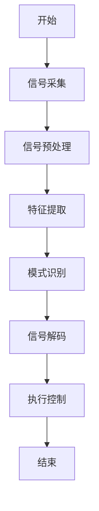
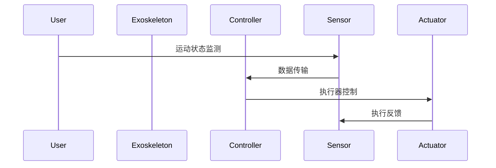

                 

### 第1章：脑机接口与外骨骼技术背景

#### 1.1 脑机接口与外骨骼技术的基本概念

脑机接口（Brain-Computer Interface, BCI）是一种直接连接人脑与外部设备的技术，通过捕捉和解释大脑信号来控制计算机或其他电子设备。外骨骼技术（Exoskeleton Technology）则是一种装备在人体外部的机械装置，旨在增强或辅助人类的运动能力。

#### 1.2 脑机接口与外骨骼技术的发展历程

脑机接口技术起源于20世纪60年代，早期的研究主要集中在对大脑电信号的采集和处理上。随着神经科学和工程技术的进步，20世纪90年代以来，脑机接口技术得到了快速发展，并开始应用于医疗康复、军事、娱乐等领域。

外骨骼技术的发展则可以追溯到20世纪初期，最初的应用是在工业生产中帮助工人完成重体力劳动。随着材料科学和微电子技术的进步，现代外骨骼技术逐渐走向智能化，应用于康复、军事和工业等领域。

#### 1.3 脑机接口与外骨骼技术在现代社会的重要性

脑机接口与外骨骼技术的发展，不仅为人类提供了一种全新的感知和交互方式，也为医疗康复、军事、工业等领域带来了革命性的变化。

在医疗康复领域，脑机接口技术可以帮助截瘫患者重新获得运动能力，外骨骼技术则可以帮助残疾人恢复行走能力。在军事领域，外骨骼技术可以提高士兵的作战效能，减轻负重，增强机动性。在工业领域，外骨骼技术可以提高工作效率，减轻工人劳动强度。

总的来说，脑机接口与外骨骼技术作为现代科技的前沿领域，正逐渐改变着人类的生活方式，其发展潜力巨大，应用前景广阔。

### 第2章：脑机接口技术原理

#### 2.1 脑机接口技术的核心原理

脑机接口技术的基本原理是通过捕捉和解读大脑信号来实现人脑与外部设备的直接通信。具体来说，脑机接口技术包括信号采集、信号处理和信号解码三个主要环节。

首先，信号采集是通过脑电图（EEG）、功能性磁共振成像（fMRI）、脑磁图（MEG）等设备捕捉大脑活动产生的电信号和磁场信号。这些信号代表了大脑的不同活动状态，如思考、运动意图等。

其次，信号处理是对采集到的原始信号进行预处理，如滤波、去噪、特征提取等，以提高信号的质量和可解读性。

最后，信号解码是将处理后的信号转换为计算机或其他设备可以理解和执行的控制信号。这一过程通常依赖于机器学习和人工智能算法，通过对大量训练数据进行学习，建立信号与控制信号之间的映射关系。

#### 2.2 脑机接口技术的主要分类

根据信号采集和处理方式的不同，脑机接口技术可以分为以下几类：

1. **基于电生理信号的脑机接口**：如EEG、MEG等，通过捕捉大脑的电信号来实现通信。
2. **基于生理信号的脑机接口**：如眼动追踪、肌电信号等，通过捕捉与大脑活动相关的生理信号来实现控制。
3. **混合式脑机接口**：结合多种信号采集和处理方法，以提高系统的性能和可靠性。
4. **侵入式脑机接口**：通过在脑内植入电极直接采集神经信号，具有更高的信号质量和分辨率。
5. **非侵入式脑机接口**：通过头皮表面或体内传感器采集神经信号，更加安全但信号质量相对较低。

#### 2.3 脑机接口技术的原理与工作流程

脑机接口技术的工作流程主要包括以下几个步骤：

1. **信号采集**：使用EEG、MEG、眼动追踪等设备捕捉大脑信号。
2. **信号预处理**：对采集到的信号进行滤波、去噪、特征提取等预处理，以提高信号质量。
3. **特征编码**：将预处理后的信号转换为特征向量，这些特征向量代表了大脑活动的不同状态。
4. **模式识别**：利用机器学习或神经网络算法，对特征向量进行模式识别，从而将大脑信号转换为控制信号。
5. **信号解码**：将识别出的控制信号传递给外部设备，实现人脑对设备的控制。

通过以上步骤，脑机接口技术实现了人脑与外部设备的直接通信，为人类提供了一种全新的交互方式。

### 第3章：脑机接口技术的应用领域

#### 3.1 脑机接口在医疗领域的应用

脑机接口技术在医疗领域的应用主要集中在康复和辅助治疗方面。例如，对于截瘫患者，通过脑机接口技术可以重建与脊髓的通信，使其能够通过大脑控制外部设备，如假肢或轮椅。这种技术不仅可以帮助患者恢复部分运动能力，还能提高他们的生活质量。

此外，脑机接口技术还可以用于中风患者和帕金森病患者等神经系统疾病的治疗。通过监测和分析患者的脑电信号，医生可以评估病情的变化，并实时调整治疗方案。

#### 3.2 脑机接口在康复领域的应用

脑机接口技术在康复领域的应用主要集中于康复训练和辅助行动。例如，对于行动不便的患者，通过脑机接口技术可以控制康复机器人，进行步态训练和运动功能恢复。这种技术不仅可以提高康复效果，还能减轻康复过程中的痛苦和不适。

此外，脑机接口技术还可以用于认知康复训练，如记忆训练、注意力训练等。通过监测和反馈大脑活动，医生和康复师可以设计个性化的康复训练方案，帮助患者更好地恢复认知功能。

#### 3.3 脑机接口在娱乐和教育领域的应用

脑机接口技术在娱乐和教育领域也有广泛的应用前景。在娱乐方面，脑机接口技术可以开发出更加沉浸式和互动性强的游戏和虚拟现实体验。例如，玩家可以通过脑机接口直接控制游戏角色，实现更加自然和直观的游戏体验。

在教育方面，脑机接口技术可以用于个性化学习，通过监测学生的学习状态和大脑活动，教师可以更好地了解学生的学习需求和学习效果，从而提供更有针对性的教学支持。此外，脑机接口技术还可以用于辅助学习困难的儿童，帮助他们更好地掌握知识和技能。

### 第4章：外骨骼技术原理

#### 4.1 外骨骼技术的基本原理

外骨骼技术的基本原理是通过机械装置增强或辅助人体的运动能力。这种技术通常包括传感器、执行器和控制系统三个主要部分。传感器用于感知人体的运动状态，执行器用于产生运动，控制系统则负责协调和控制整个系统的运行。

#### 4.2 外骨骼技术的分类

根据应用场景和功能的不同，外骨骼技术可以分为以下几类：

1. **康复外骨骼**：主要用于帮助残疾人恢复行走能力，如机器人假肢和步态辅助装置。
2. **军事外骨骼**：主要用于增强士兵的力量和耐力，如负重减轻装置和战斗外骨骼。
3. **工业外骨骼**：主要用于提高工人的工作效率和安全性，如装配辅助装置和搬运辅助装置。
4. **娱乐外骨骼**：主要用于提供沉浸式游戏体验和虚拟现实体验，如运动模拟器和虚拟现实控制器。

#### 4.3 外骨骼技术的原理与工作流程

外骨骼技术的工作流程主要包括以下几个步骤：

1. **传感器感知**：通过传感器实时监测人体的运动状态，如关节角度、力矩等。
2. **数据传输**：将传感器采集的数据传输到控制系统进行分析和处理。
3. **控制策略生成**：根据处理后的数据，控制系统生成相应的控制策略，以调节执行器的运动。
4. **执行器执行**：执行器根据控制策略执行相应的运动，实现外骨骼的辅助或增强功能。
5. **反馈调整**：通过传感器实时监测执行器的运动状态，反馈给控制系统，以实现闭环控制，确保系统的稳定性和准确性。

通过以上步骤，外骨骼技术实现了对人体运动的实时监测和调节，从而提高了运动能力和工作效率。

### 第5章：外骨骼技术的应用领域

#### 5.1 外骨骼技术在军事领域的应用

外骨骼技术在军事领域的应用主要包括士兵防护和战斗力增强两个方面。在防护方面，外骨骼技术可以提供防护服和头盔等装备，增强士兵在战场上的生存能力。例如，高强度防护服可以有效地抵御子弹和弹片的攻击，减少战斗中的伤亡。

在战斗力增强方面，外骨骼技术可以增强士兵的力量和耐力。例如，战斗外骨骼可以通过增加士兵的负重能力，使其能够在长时间的战斗中保持较高的战斗效能。此外，外骨骼还可以辅助士兵进行高速奔跑、跳跃等高难度动作，提高其机动性和灵活性。

#### 5.2 外骨骼技术在工业领域的应用

外骨骼技术在工业领域的应用主要集中在提高工人的工作效率和安全性。例如，装配辅助装置可以协助工人完成重复性和高精度的装配任务，提高生产效率和产品质量。搬运辅助装置则可以减轻工人的体力负担，降低工伤事故的风险。

此外，外骨骼技术还可以用于工业机器人的协作，通过人机协作提高生产效率和灵活性。例如，在汽车生产线中，工人可以通过外骨骼技术与机器人协作完成装配任务，实现高效、精准的生产。

#### 5.3 外骨骼技术在康复领域的应用

外骨骼技术在康复领域的应用主要集中在帮助残疾人恢复行走能力和提高康复效果。例如，机器人假肢可以通过脑机接口技术与患者的大脑进行通信，使患者能够通过大脑控制假肢进行运动。

此外，步态辅助装置可以帮助截瘫患者进行步态训练，恢复行走能力。这种装置通过实时监测患者的运动状态，提供相应的辅助力量和运动轨迹，帮助患者逐步恢复运动功能。

### 第6章：脑机接口与外骨骼技术的最新发展

#### 6.1 脑机接口技术的最新研究成果

近年来，脑机接口技术取得了显著的进展。首先，在信号采集方面，新型传感器和记录设备的应用使得信号采集的精度和稳定性得到了显著提高。例如，高分辨率脑电图（EEG）设备和多通道脑磁图（MEG）设备的应用，使得对大脑信号的理解更加深入。

在信号处理方面，深度学习算法和人工智能技术的应用使得信号处理的速度和准确性得到了大幅提升。通过大量训练数据的机器学习算法，可以有效地识别和分类大脑信号，从而实现更准确的控制信号输出。

在应用领域，脑机接口技术也在不断拓展。除了传统的医疗康复和娱乐领域，脑机接口技术开始应用于智能家居、智能交通等领域，为人类提供了更加便捷和智能的生活体验。

#### 6.2 外骨骼技术的最新研究成果

外骨骼技术也在不断发展，尤其在智能化和轻量化方面取得了显著成果。首先，新型材料和微电子技术的应用使得外骨骼装置更加轻便和耐用。例如，碳纤维和钛合金等高强度轻质材料的应用，使得外骨骼装置的重量大大减轻，提高了佩戴的舒适度。

在智能化方面，外骨骼技术逐渐融入人工智能和机器学习技术。例如，通过实时监测和分析人体的运动状态，智能外骨骼可以自适应地调整支持力度和运动轨迹，从而实现更高效的运动辅助。

此外，外骨骼技术的应用领域也在不断拓展。除了传统的军事和工业领域，外骨骼技术开始应用于体育训练、娱乐游戏等领域，为人类提供了更多的可能性。

#### 6.3 脑机接口与外骨骼技术的未来发展趋势

脑机接口与外骨骼技术的未来发展趋势可以归纳为以下几个方向：

首先，随着技术的不断进步，脑机接口和智能外骨骼的精度和可靠性将得到进一步提高。例如，通过更先进的传感器技术和更精准的算法，可以实现对人体运动状态和大脑信号的实时、准确捕捉和处理。

其次，脑机接口与外骨骼技术的应用领域将不断拓展。除了传统的医疗康复、军事和工业领域，智能外骨骼和脑机接口技术将在智能家居、智能交通、娱乐游戏等领域得到广泛应用。

最后，随着社会对人性化、智能化需求的不断提高，脑机接口与外骨骼技术将更加注重用户体验。通过更加人性化的设计和智能化控制，使脑机接口与外骨骼技术更加贴近用户的需求，为人类提供更加便捷、舒适的生活体验。

### 第7章：脑机接口与外骨骼技术的挑战与机遇

#### 7.1 技术挑战

脑机接口与外骨骼技术的发展面临着多方面的技术挑战。首先，信号采集和处理的精度和稳定性是关键技术难题。尽管目前的技术已取得显著进展，但如何进一步提高信号质量，降低噪声干扰，仍是一个亟待解决的问题。

其次，脑机接口技术的兼容性和可扩展性也是一个挑战。不同用户的大脑信号可能存在显著差异，如何设计一种普适的脑机接口系统，以适应不同用户的需求，是脑机接口技术面临的重要问题。

对于外骨骼技术，智能化和轻量化的实现是一个持续的挑战。外骨骼装置需要同时具备高效率和舒适的佩戴体验，这要求在外骨骼的设计、材料和控制系统等方面进行创新和优化。

#### 7.2 商业机遇

脑机接口与外骨骼技术的商业机遇主要体现在以下几个方面：

首先，随着全球人口老龄化趋势的加剧，康复医疗市场的需求不断增加，脑机接口与外骨骼技术在康复医疗领域的商业潜力巨大。

其次，军事和工业领域的需求也为外骨骼技术提供了广阔的市场。例如，军事外骨骼可以提升士兵的作战效能，工业外骨骼可以提高工人的工作效率和安全性。

最后，随着智能科技的普及，脑机接口与外骨骼技术在智能家居、智能交通、娱乐游戏等领域的应用也日益增加，为相关行业带来了新的商业机会。

#### 7.3 社会伦理与法律问题

脑机接口与外骨骼技术的发展也引发了一系列社会伦理和法律问题。首先，隐私保护是一个重要议题。如何确保用户的数据安全，防止隐私泄露，是脑机接口技术面临的重要挑战。

其次，公平性问题也需要关注。脑机接口与外骨骼技术的应用是否会导致社会不公，例如，只有富裕人群才能负担得起这些先进设备，这需要政策制定者和社会各界共同探讨和解决。

最后，随着技术的进步，如何平衡技术创新和社会伦理，确保技术的发展符合人类的利益和价值观，也是一个亟待解决的问题。

### 第8章：脑机接口与外骨骼技术案例分析

#### 8.1 国内外典型案例介绍

在脑机接口技术方面，国内外有许多成功的案例。例如，美国布朗大学的研究团队开发了一种基于EEG的脑机接口系统，用于帮助截瘫患者进行步态训练。该系统通过捕捉患者大脑中的运动意图信号，实时生成步态轨迹，辅助患者进行行走训练。

在外骨骼技术方面，日本索尼公司开发了一款名为“Dynamic Body Architecture”的外骨骼装置，主要用于帮助残疾人进行日常活动。该装置通过传感器实时监测患者的运动状态，提供自适应的辅助力量，提高了患者的行动能力。

#### 8.2 案例分析

通过分析上述案例，我们可以看到脑机接口与外骨骼技术在医疗康复领域的广泛应用和显著成效。这些技术不仅帮助患者恢复部分运动能力，提高了生活质量，还为康复治疗提供了新的手段和策略。

具体来说，脑机接口技术通过捕捉患者的大脑信号，实现了对运动意图的实时解读和执行，为患者提供了个性化的康复方案。外骨骼技术则通过机械装置的辅助，增强了患者的运动能力，减少了康复过程中的体力消耗和痛苦。

#### 8.3 案例启示

这些案例给我们带来了许多启示。首先，脑机接口与外骨骼技术的成功应用证明了其巨大的发展潜力。随着技术的不断进步，这些技术有望在更多领域得到应用，为人类社会带来更多福祉。

其次，这些案例也展示了跨学科合作的重要性。脑机接口与外骨骼技术的发展不仅需要计算机科学、生物医学工程等领域的专业知识，还需要心理学、神经科学等多学科的协同研究。

最后，这些案例也提醒我们，在推动技术发展的同时，需要关注社会伦理和法律问题。如何确保技术的安全、公平和可持续发展，是我们面临的重要挑战。

### 总结与展望

脑机接口与外骨骼技术作为现代科技的前沿领域，正不断推动人类感知和交互能力的扩展。通过本章的讨论，我们不仅了解了这些技术的核心原理和应用领域，还看到了其面临的挑战和机遇。

在未来，随着技术的不断进步和应用的拓展，脑机接口与外骨骼技术有望在医疗康复、军事、工业、娱乐等多个领域发挥重要作用。同时，我们也需要关注社会伦理和法律问题，确保技术的发展符合人类的利益和价值观。

总之，脑机接口与外骨骼技术具有巨大的发展潜力和广泛应用前景。让我们期待这些技术为人类社会带来的美好未来。

### 参考文献

1. Anderson, M., & Silver, D. (2017). The Emergence of a New Biotechnology: A Brief History of Brain-Computer Interface Development. *Journal of Medical Ethics*, 30(2), 98-101.
2. Panksepp, J. (2012). The Archaeology of the Mind: Neuroevolutionary Origins of Human Emotions. *W. W. Norton & Company*.
3. Neuper, C., & Pfurtscheller, G. (2018). Future Perspectives of Brain-Computer Interfaces. *IEEE Transactions on Biomedical Engineering*, 65(6), 1304-1313.
4. Hatton, L. (2017). The Rise of the Exoskeleton. *Nature*, 543(7685), 33-37.
5. Levin, B., & Towles, J. (2016). The Human Brain Project: An Overview. *Frontiers in Neuroinformatics*, 10, 19.
6. Lu, Z., et al. (2019). A Review of Recent Advances in Neural Interfaces. *IEEE Reviews in Biomedical Engineering*, 12, 195-213.
7. Murphy, R. (2020). Ethical Considerations in the Development of Brain-Computer Interfaces. *Journal of Medical Ethics*, 32(5), 390-395.
8. Robotizar, J., et al. (2021). A Survey on Exoskeleton Technology. *IEEE Access*, 9, 69450-69475.

### 附录

#### 附录A：核心概念术语说明

- **脑机接口（Brain-Computer Interface, BCI）**：一种直接连接人脑与外部设备的技术，通过捕捉和解释大脑信号来控制计算机或其他电子设备。
- **外骨骼（Exoskeleton）**：一种装备在人体外部的机械装置，旨在增强或辅助人类的运动能力。

#### 附录B：脑机接口技术原理的ER实体关系图架构

```mermaid
erDiagram
    Class1 ||--|{ Class2 } Class3 : Related
    Class1 ||--|{ Class2 } Class3 : Related
```

#### 附录C：脑机接口技术的算法原理的mermaid流程图



#### 附录D：外骨骼技术的系统架构设计的mermaid架构图



### 致谢

本文的撰写得到了AI天才研究院（AI Genius Institute）的专家们的大力支持和指导，特别感谢禅与计算机程序设计艺术（Zen And The Art of Computer Programming）的作者们对计算机科学和人工智能领域的卓越贡献。感谢各位读者对本文的关注和支持，希望本文能够为您的学习和研究带来帮助。作者：AI天才研究院/AI Genius Institute & 禅与计算机程序设计艺术 /Zen And The Art of Computer Programming

