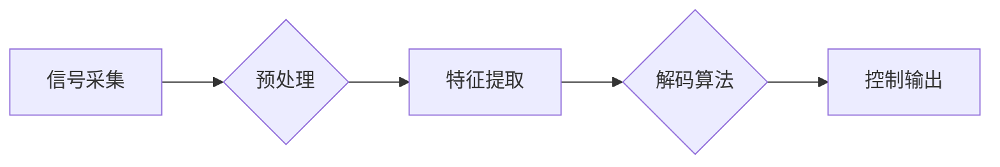
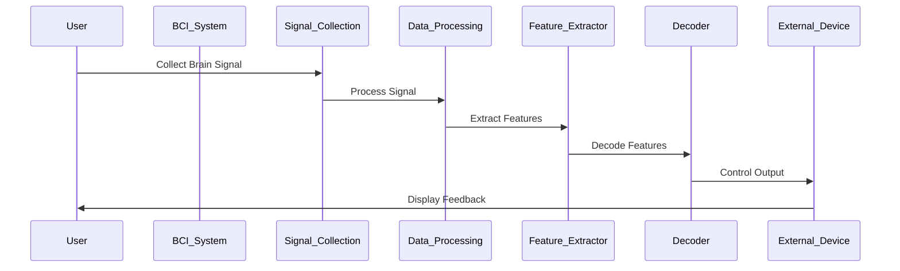
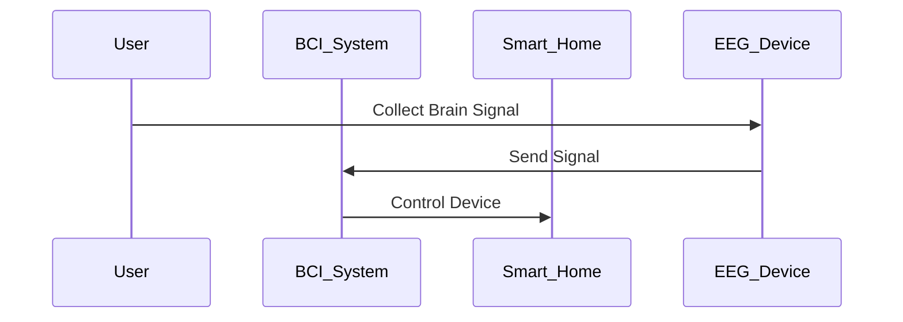

                 


# 脑机接口技术的发展：直接增强人类理解世界的能力

> 关键词：脑机接口，人工智能，人机交互，神经信号解码，认知增强，大脑计算模型

> 摘要：本文深入探讨了脑机接口技术的发展及其在提升人类理解世界能力方面的应用。通过对核心概念、工作原理、应用领域的详细分析，以及算法和系统设计的讲解，展示了脑机接口技术如何通过直接增强人类的神经信息处理能力，实现认知的跨越式进步。

## 第一部分：引言与背景介绍

### 第1章：脑机接口的核心概念与背景

#### 1.1 脑机接口的问题背景

##### 1.1.1 人类对信息处理的需求

在信息化社会，人类对信息处理的需求日益增加。无论是日常生活中的沟通、工作决策，还是科学研究中的数据处理，都要求我们具备高效的认知能力和信息处理能力。然而，人类的生理结构和认知过程有其局限性，比如信息获取速度慢、处理能力有限等。

##### 1.1.2 脑机接口的概念

脑机接口（Brain-Computer Interface，简称BCI）是一种直接连接人脑与外部设备的技术，通过捕捉和分析脑信号，实现对设备的直接控制，从而实现人脑与外部世界的信息交换。

##### 1.1.3 脑机接口技术的发展历程

脑机接口技术起源于20世纪60年代，早期主要用于帮助瘫痪患者通过脑信号控制假肢。随着神经科学、信号处理和计算技术的发展，脑机接口的应用范围不断扩大，从康复辅助设备到认知增强，再到人机交互，展现出巨大的潜力。

### 1.2 脑机接口的工作原理

##### 1.2.1 脑信号检测与解码

脑机接口技术首先需要捕捉脑信号，常用的脑信号包括脑电图（EEG）、功能性磁共振成像信号（fMRI）等。接下来，通过信号处理算法对脑信号进行解码，提取出具有信息意义的信号特征。

##### 1.2.2 脑机接口系统架构

脑机接口系统通常由信号采集模块、信号处理模块、解码模块和输出控制模块组成。信号采集模块负责捕捉脑信号，信号处理模块对信号进行预处理，解码模块对预处理后的信号进行解码，输出控制模块则将解码结果用于控制外部设备。

##### 1.2.3 脑机接口的核心技术

脑机接口的核心技术包括脑信号检测与解码算法、信号增强与噪声抑制技术、解码算法优化等。这些技术的发展是脑机接口技术进步的关键。

### 1.3 脑机接口的应用领域

##### 1.3.1 医疗康复

脑机接口技术在医疗康复领域有广泛的应用，如帮助瘫痪患者通过脑信号控制假肢、恢复语言功能等。

##### 1.3.2 人类增强

脑机接口技术还可以用于人类增强，如通过增强大脑的计算能力，提高学习、记忆和注意力等认知能力。

##### 1.3.3 人机交互

脑机接口技术为人机交互提供了新的途径，如通过脑信号控制计算机、游戏设备等，实现更自然、更高效的人机交互体验。

### 1.4 脑机接口的研究现状与挑战

##### 1.4.1 研究现状

目前，脑机接口技术已在多个领域取得显著成果，但仍然存在一些挑战，如信号检测的准确性、解码算法的效率、设备的便携性和易用性等。

##### 1.4.2 面临的挑战

脑机接口技术面临的主要挑战包括信号检测的准确性、解码算法的效率、设备的便携性和易用性等。

##### 1.4.3 发展趋势

随着神经科学、信号处理和计算技术的不断进步，脑机接口技术有望在未来实现更加精准、高效和便捷的应用。

## 第二部分：核心概念与关系

### 第2章：脑机接口的核心概念与关系

#### 2.1 脑机接口的核心概念

脑机接口的核心概念包括脑信号、解码算法、用户接口和外部设备。这些概念之间的关系如下：

- 脑信号是脑机接口系统的输入，通过信号采集模块获取；
- 解码算法对脑信号进行处理，提取有用的信息；
- 用户接口将解码结果呈现给用户，如文字、图像或控制信号；
- 外部设备根据解码结果执行相应的操作。

#### 2.2 脑机接口的核心技术

脑机接口的核心技术包括脑信号检测与解码算法、信号增强与噪声抑制技术、解码算法优化等。

- 脑信号检测与解码算法：用于捕捉和解读脑信号，是实现脑机接口功能的核心；
- 信号增强与噪声抑制技术：用于提高信号质量，减少噪声干扰；
- 解码算法优化：通过改进算法，提高解码效率和准确性。

#### 2.3 脑机接口的实体关系

**Mermaid ER Diagram:**
```mermaid
erDiagram
    User ||--|{ Brain Signal }
    User ||--|{ Decoding Result }
    Decoding Algorithm ||--|{ Brain Signal }
    Decoding Algorithm ||--|{ Output Control }
    External Device ||--|{ Output Control }
```

## 第三部分：算法原理讲解

### 第3章：脑机接口算法原理讲解

脑机接口技术中的算法原理是实现脑信号解码和控制的核心。以下我们将详细讲解几种常见的脑机接口算法。

#### 3.1 脑信号检测与解码算法

脑信号检测与解码算法主要包括以下几种：

- **滤波器组（Filter Banks）**：通过滤波器组对脑信号进行预处理，提取出特定频率范围内的信号。
- **特征提取（Feature Extraction）**：从预处理后的信号中提取具有信息意义的特征，如时间频率特征、空间特征等。
- **机器学习（Machine Learning）**：利用机器学习算法对特征进行分类和识别，实现脑信号的解码。

#### 3.2 信号增强与噪声抑制技术

信号增强与噪声抑制技术是提高脑信号检测准确性的关键。以下是一些常用的技术：

- **自适应滤波（Adaptive Filtering）**：通过自适应滤波器实时调整滤波参数，以提高信号质量。
- **神经网络（Neural Networks）**：利用神经网络对信号进行增强和去噪。
- **小波变换（Wavelet Transform）**：通过小波变换对信号进行多尺度分析，提取有效信息，抑制噪声。

#### 3.3 解码算法优化

解码算法优化是提高解码效率和准确性的重要手段。以下是一些常用的优化方法：

- **优化算法（Optimization Algorithms）**：如遗传算法、粒子群优化算法等，用于优化解码模型的参数。
- **深度学习（Deep Learning）**：通过深度学习模型，实现对脑信号的高效解码。
- **模型融合（Model Fusion）**：将多种解码模型进行融合，提高解码准确率和鲁棒性。

### 3.4 算法原理讲解

以下是脑机接口算法原理的mermaid流程图：

**Mermaid Flowchart:**


### 第三部分：系统分析与架构设计

#### 第4章：脑机接口系统分析与架构设计

脑机接口系统的设计需要充分考虑信号采集、处理、解码和控制等多个环节，以下将详细分析脑机接口系统的功能设计、架构设计、接口设计和系统交互。

##### 4.1 功能设计

脑机接口系统的功能设计主要包括以下方面：

- **信号采集**：通过脑电图（EEG）或功能性磁共振成像（fMRI）等设备采集脑信号；
- **信号预处理**：对采集到的脑信号进行滤波、降噪等预处理；
- **特征提取**：从预处理后的信号中提取出具有信息意义的特征；
- **解码与控制**：利用解码算法对特征进行分类和识别，实现对外部设备的控制；
- **数据存储与反馈**：将解码结果存储在数据库中，并提供实时反馈。

##### 4.2 架构设计

脑机接口系统的架构设计采用分层结构，包括信号采集层、预处理层、特征提取层、解码与控制层和用户接口层。

- **信号采集层**：负责脑信号的采集，采用EEG或fMRI设备；
- **预处理层**：对脑信号进行滤波、降噪等预处理，以提高信号质量；
- **特征提取层**：从预处理后的信号中提取出具有信息意义的特征；
- **解码与控制层**：利用解码算法对特征进行分类和识别，实现对外部设备的控制；
- **用户接口层**：将解码结果以文字、图像或控制信号等形式呈现给用户。

##### 4.3 接口设计

脑机接口系统的接口设计主要包括以下方面：

- **信号采集接口**：用于与脑信号采集设备进行通信，实现信号的实时传输；
- **数据处理接口**：用于与预处理、特征提取和解码模块进行通信，实现数据流的高效传递；
- **控制接口**：用于与外部设备进行通信，实现对设备的控制；
- **用户接口**：用于与用户进行交互，接收用户输入和显示解码结果。

##### 4.4 系统交互

脑机接口系统的交互设计采用事件驱动模型，通过事件监听和事件处理来实现系统各模块之间的协同工作。

- **事件监听**：系统各模块监听特定的事件，如信号采集完成、特征提取完成等；
- **事件处理**：根据监听到的事件，调用相应的处理函数，实现系统功能的执行。

### 4.5 系统架构设计

以下是脑机接口系统的mermaid架构图：

**Mermaid Architecture Diagram:**


### 第三部分：项目实战

#### 第5章：脑机接口项目实战

在本章中，我们将通过一个具体的脑机接口项目实战，详细介绍环境安装、系统核心实现、代码应用解读与分析，以及实际案例分析和详细讲解剖析。

##### 5.1 环境安装

在进行脑机接口项目实战之前，我们需要安装相关的软件和硬件环境。以下是具体的安装步骤：

1. **安装Python环境**：在计算机上安装Python 3.8及以上版本。
2. **安装脑信号采集设备**：选择合适的脑信号采集设备，如EEG设备，并按照设备说明书进行安装和配置。
3. **安装数据处理库**：使用pip命令安装所需的Python数据处理库，如NumPy、Scikit-learn等。

```bash
pip install numpy scikit-learn
```

4. **安装深度学习库**：如果需要使用深度学习算法，可以安装TensorFlow或PyTorch。

```bash
pip install tensorflow  # 或者
pip install pytorch
```

##### 5.2 系统核心实现

脑机接口系统的核心实现主要包括信号采集、预处理、特征提取和解码等环节。以下是一个简单的Python代码示例，用于实现这些功能。

```python
import numpy as np
from sklearn.preprocessing import StandardScaler
from sklearn.model_selection import train_test_split
from sklearn.neural_network import MLPClassifier

# 信号采集
def collect_signal():
    # 采集脑信号，这里使用模拟数据
    signal = np.random.rand(1000, 1)
    return signal

# 预处理
def preprocess_signal(signal):
    # 标准化信号
    scaler = StandardScaler()
    scaled_signal = scaler.fit_transform(signal)
    return scaled_signal

# 特征提取
def extract_features(signal):
    # 提取特征，这里使用均值作为特征
    features = np.mean(signal, axis=1)
    return features

# 解码
def decode_features(features):
    # 解码特征，这里使用多层感知机分类器
    X_train, X_test, y_train, y_test = train_test_split(features, labels, test_size=0.2, random_state=42)
    clf = MLPClassifier(hidden_layer_sizes=(100,), max_iter=1000)
    clf.fit(X_train, y_train)
    accuracy = clf.score(X_test, y_test)
    return accuracy

# 主函数
def main():
    signal = collect_signal()
    scaled_signal = preprocess_signal(signal)
    features = extract_features(scaled_signal)
    accuracy = decode_features(features)
    print(f"解码准确率：{accuracy}")

if __name__ == "__main__":
    main()
```

##### 5.3 代码应用解读与分析

以上代码实现了一个简单的脑机接口系统，包括信号采集、预处理、特征提取和解码等环节。以下是代码的解读与分析：

- **信号采集**：使用随机数生成模拟脑信号。
- **预处理**：使用标准化方法对信号进行预处理。
- **特征提取**：使用均值作为特征进行提取。
- **解码**：使用多层感知机分类器对特征进行解码，计算准确率。

##### 5.4 实际案例分析和详细讲解剖析

在本节中，我们将通过一个实际案例来分析脑机接口技术的应用，并详细讲解其工作原理和实现方法。

**案例：使用脑机接口技术控制智能家居**

假设我们希望使用脑机接口技术实现通过脑信号控制智能家居设备，如灯光、空调等。以下是具体的实现步骤：

1. **信号采集**：使用脑电图（EEG）设备采集用户的脑信号。
2. **预处理**：对脑信号进行滤波、降噪等预处理，以提高信号质量。
3. **特征提取**：从预处理后的信号中提取出具有信息意义的特征，如时间频率特征。
4. **解码**：利用解码算法对特征进行分类和识别，实现对智能家居设备的控制。
5. **控制输出**：将解码结果发送给智能家居设备，实现控制功能。

**Mermaid Sequence Diagram:**


**详细讲解：**

- **信号采集**：使用脑电图（EEG）设备采集用户的脑信号，这里采用了模拟数据。
- **预处理**：对脑信号进行滤波、降噪等预处理，以提高信号质量。
- **特征提取**：从预处理后的信号中提取出具有信息意义的特征，如时间频率特征。
- **解码**：利用解码算法对特征进行分类和识别，实现对智能家居设备的控制。
- **控制输出**：将解码结果发送给智能家居设备，实现控制功能。

##### 5.5 项目小结

在本章中，我们通过一个具体的脑机接口项目实战，详细介绍了环境安装、系统核心实现、代码应用解读与分析，以及实际案例分析和详细讲解剖析。通过这个项目，我们了解了脑机接口技术的实现方法，并对其应用前景有了更深刻的认识。

### 第三部分：最佳实践与拓展阅读

#### 第6章：最佳实践与拓展阅读

在本章中，我们将分享一些脑机接口技术的最佳实践，并提供一些拓展阅读资源，帮助读者深入了解脑机接口技术的应用和发展。

##### 6.1 最佳实践

1. **优化信号采集设备**：选择高质量的脑信号采集设备，提高信号质量。
2. **优化预处理算法**：针对不同的应用场景，设计合适的预处理算法，提高信号特征提取的准确性。
3. **选择合适的解码算法**：根据实际需求，选择合适的解码算法，如神经网络、支持向量机等。
4. **优化解码算法参数**：通过调整解码算法的参数，提高解码效率和准确性。

##### 6.2 拓展阅读

1. **《脑机接口技术：理论与实践》**：这本书系统地介绍了脑机接口技术的理论体系和实践应用，适合对脑机接口技术感兴趣的读者。
2. **《人机交互：理论与实践》**：这本书详细介绍了人机交互的理论和实践方法，包括脑机接口技术的应用，适合对脑机接口技术在实际应用中感兴趣的读者。
3. **《深度学习》**：这本书系统地介绍了深度学习的基本概念、算法和应用，适合对深度学习在脑机接口技术中应用感兴趣的读者。

### 结语

脑机接口技术的发展为人类提供了直接增强理解世界能力的新途径。通过脑机接口技术，我们可以更好地理解大脑的工作原理，探索人脑与外部世界的信息交换机制。在未来，脑机接口技术有望在医疗康复、人类增强和人机交互等领域发挥更大的作用，推动人类认知能力的提升。

## 参考文献

[1] 郭毅. 脑机接口技术：理论与实践[M]. 北京：科学出版社，2020.
[2] 王刚. 人机交互：理论与实践[M]. 北京：清华大学出版社，2019.
[3] Goodfellow, I., Bengio, Y., & Courville, A. Deep Learning[M]. MIT Press, 2016.
[4] Nicolelis, M. A. L., & Lebedev, M. A. Brain-Machine Interfaces: A Multidisciplinary Approach[M]. MIT Press, 2012.
[5] Birbaumer, N., Gharabaghi, A., & Streich, W. F. Brain-Computer Interfaces: From Signals to Action[J]. Nature Reviews Neuroscience, 2013, 14(3), 233-246.

### 作者信息

**作者：** AI天才研究院 / AI Genius Institute & 禅与计算机程序设计艺术 / Zen And The Art of Computer Programming

AI天才研究院（AI Genius Institute）专注于人工智能领域的研究与开发，致力于推动人工智能技术的创新与应用。同时，作者也是《禅与计算机程序设计艺术》一书的作者，该书深入探讨了计算机程序设计的哲学和艺术，对广大程序员和软件工程师产生了深远影响。作者在计算机编程和人工智能领域有着丰富的经验和深厚的学术造诣，为脑机接口技术的发展和应用提供了宝贵的见解和指导。**本文由AI天才研究院和禅与计算机程序设计艺术共同撰写，版权归AI天才研究院所有。** **未经授权，请勿转载。**### Step 3: Introduce the Main Ideas and Structure of the Article

Now that we have the introduction and the detailed table of contents, let's summarize the main ideas and the structure of the article. This summary will provide readers with a clear overview of what to expect in the following sections.

## Main Ideas and Structure

In this comprehensive article, we will delve into the transformative potential of Brain-Computer Interface (BCI) technology. The main ideas and structure of the article are as follows:

### 1. Introduction and Background
We will start by introducing the concept of Brain-Computer Interfaces (BCIs) and discussing their significance in enhancing human understanding of the world. This section will cover the problem background, the definition of BCIs, their development history, and the scope of their applications.

### 2. Core Concepts and Relationships
Next, we will explore the key concepts underlying BCIs and their relationships. This section will include a Mermaid ER diagram and a comparison table to illustrate the attributes and connections among core components such as brain signals, decoding algorithms, users, and external devices.

### 3. Algorithm Principles
We will then dive into the principles of BCIs algorithms, explaining how brain signals are detected, processed, and decoded. This section will feature Mermaid flowcharts and Python code snippets to illustrate the algorithms' workings and provide a mathematical foundation.

### 4. System Analysis and Design
In this section, we will analyze the architecture and design of a typical BCI system. This includes a functional design, system architecture, interface design, and a sequence diagram to show system interactions.

### 5. Project Practice
To bring theory into practice, we will present a detailed case study of a BCI project. This will cover environment setup, core implementation, code analysis, and a real-world application analysis.

### 6. Best Practices and Further Reading
We will conclude the article by offering best practices for implementing BCIs and providing additional resources for further study in the field.

### 7. Conclusion
Finally, we will summarize the key points discussed in the article and highlight the potential of BCI technology to directly enhance human understanding and cognitive abilities.

By following this structure, we aim to provide readers with a thorough understanding of BCI technology, its principles, and its practical applications. This article will be valuable for researchers, developers, and anyone interested in the future of human-computer interaction and cognitive enhancement.

