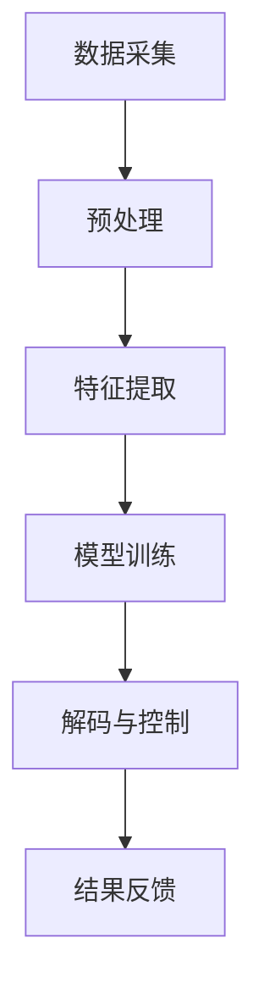
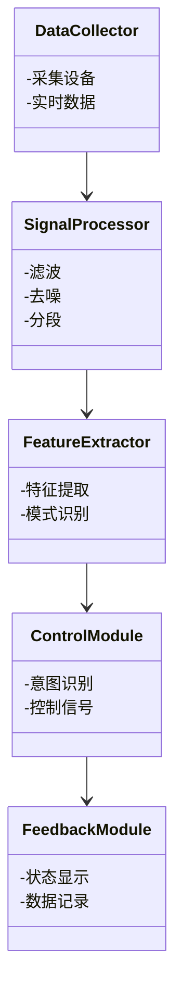
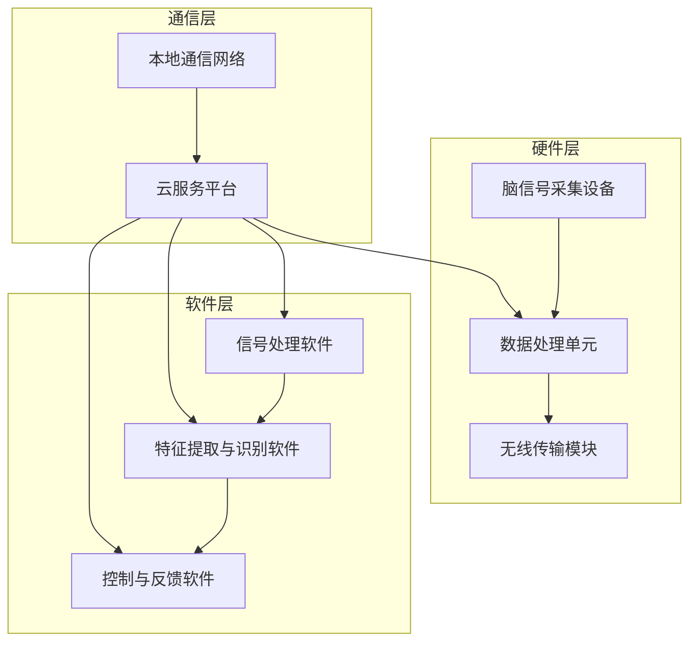
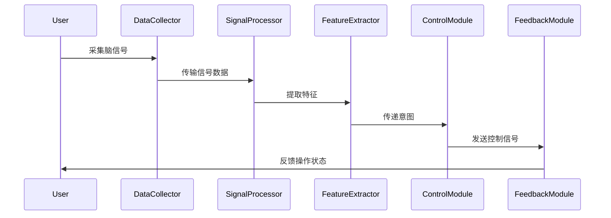
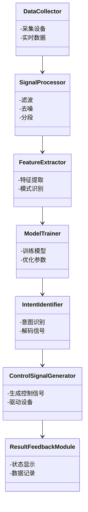
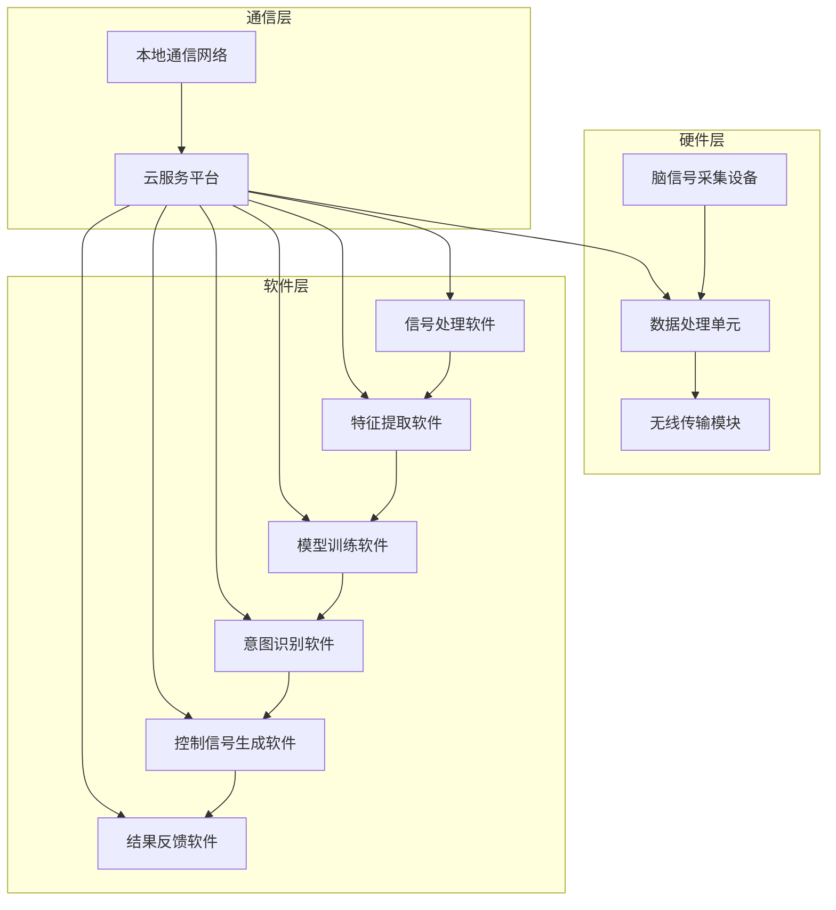
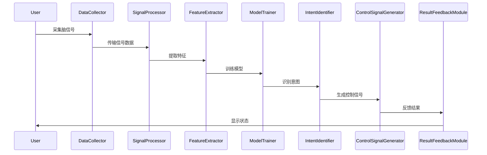

                 

### 第一部分：脑机接口技术概述

## 第1章：脑机接口技术的基本概念与发展

### 1.1 脑机接口技术的定义与历史

脑机接口（Brain-Computer Interface，简称BCI）技术是一种直接连接人脑与外部设备的技术，通过解读大脑信号来控制外部设备或直接增强人的认知功能。这一概念最早可以追溯到20世纪60年代，当时科学家开始探索如何利用电生理学技术来解读大脑活动。

早期脑机接口技术的开发主要集中在神经电生理领域，例如利用脑电图（EEG）记录大脑的电活动。随着技术的进步，脑机接口技术逐渐扩展到利用功能性磁共振成像（fMRI）、近红外光谱成像（NIRS）和脑-机接口（BMI）等高级成像技术。

近年来，随着人工智能和机器学习技术的发展，脑机接口技术取得了显著的进展。深度学习算法的引入使得从复杂的脑信号中提取有价值的信息成为可能，大大提升了脑机接口的准确性和实用性。

### 1.2 脑机接口技术的重要性

脑机接口技术具有深远的应用前景和重要的社会价值。首先，对于神经疾病患者，脑机接口技术可以为他们提供一种新的交流和控制方式，帮助他们恢复沟通和行动能力。例如，脑机接口技术已经成功帮助中风患者恢复运动功能，为瘫痪患者提供了新的希望。

其次，脑机接口技术在增强人类认知能力方面也具有巨大潜力。通过直接增强大脑的信号处理能力，脑机接口技术有望提升人类的学习、记忆和决策能力。这将有助于应对日益复杂的工作和学习环境，提高生产效率和创新能力。

此外，脑机接口技术在军事、医疗和娱乐等领域也有广泛的应用。例如，在军事领域，脑机接口技术可以用于士兵的战场认知增强；在医疗领域，脑机接口技术可以用于神经系统疾病的诊断和治疗；在娱乐领域，脑机接口技术可以带来全新的交互体验，如虚拟现实和增强现实游戏。

### 1.3 当前脑机接口技术的应用领域

当前，脑机接口技术已广泛应用于多个领域，包括：

- **医疗康复**：脑机接口技术被用于帮助瘫痪患者恢复运动功能，如通过解码大脑信号控制机械臂或轮椅。
- **神经系统疾病**：脑机接口技术用于治疗癫痫、帕金森病等神经系统疾病，通过调节大脑信号来减轻症状。
- **辅助交流**：对于不能通过传统方式交流的患者，脑机接口技术提供了新的沟通手段，如通过思维控制计算机屏幕。
- **认知增强**：研究人员正在探索如何通过脑机接口技术提升人类的认知能力，包括记忆、学习和决策等。
- **娱乐与游戏**：脑机接口技术为虚拟现实和增强现实游戏带来了新的交互方式，玩家可以通过思维控制游戏角色。
- **军事应用**：脑机接口技术可以用于士兵的战场认知增强，如通过思维控制无人驾驶飞行器或地面车辆。

### 1.4 脑机接口技术面临的挑战与未来展望

尽管脑机接口技术在许多领域取得了显著成果，但仍面临一些挑战。首先，脑信号的复杂性使得准确解码和识别成为难题。其次，脑机接口设备的侵入性和兼容性也是一个重大挑战。未来，随着材料科学、人工智能和脑科学研究的发展，脑机接口技术有望取得更大的突破。

未来，脑机接口技术的应用将更加广泛，不仅在医疗和康复领域，还将拓展到教育、娱乐和军事等领域。通过不断创新和突破，脑机接口技术将为人类带来更多福祉。

## 第2章：核心概念与联系

### 2.1 大脑模型与神经信号处理

大脑模型是脑机接口技术的核心概念之一。大脑模型旨在模拟和理解大脑的结构和功能，以便更好地解码和处理大脑信号。大脑模型可以分为宏观模型和微观模型。宏观模型关注大脑的整体结构和功能，如大脑皮层和脑区的分布。微观模型则关注神经元和神经网络的细节，包括突触连接和神经信号传递。

神经信号处理是解码大脑信号的关键技术。通过解析脑电图（EEG）、功能性磁共振成像（fMRI）和近红外光谱成像（NIRS）等数据，神经信号处理技术可以提取出大脑活动的重要信息。这一过程包括信号采集、预处理、特征提取和模式识别等多个环节。

### 2.1.1 大脑结构概述

大脑是人体最重要的器官之一，由多个复杂的结构和区域组成。大脑分为两个半球，每个半球又由多个脑叶和脑区组成。主要的大脑结构包括：

- **大脑皮层**：大脑最外层的灰质层，负责高级认知功能，如感知、运动控制和思考。
- **基底神经节**：位于大脑深部，参与运动控制和情感调节。
- **脑干**：连接大脑和脊髓，控制基本生命功能，如心跳和呼吸。
- **小脑**：位于大脑的后下方，负责协调运动和平衡。

### 2.1.2 神经信号处理基础

神经信号处理涉及多个阶段，包括信号采集、预处理、特征提取和模式识别。信号采集通常通过脑电图（EEG）、功能性磁共振成像（fMRI）和近红外光谱成像（NIRS）等技术实现。预处理包括滤波、去噪和分段等步骤，以提高信号的质量和可靠性。特征提取是从原始信号中提取出有用的信息，如频率、时间和空间特征。模式识别则是利用机器学习算法识别大脑信号中的特定模式，以实现大脑活动的解码。

### 2.1.3 大脑模型与神经信号处理的联系

大脑模型与神经信号处理之间存在紧密的联系。大脑模型提供了对大脑结构和功能的理解，而神经信号处理则利用这些理解来解码大脑信号。通过大脑模型，研究人员可以预测大脑信号中的潜在信息，并通过神经信号处理技术验证这些预测。这种相互关联的过程不仅有助于提升脑机接口的准确性，还为大脑研究和认知科学提供了新的视角。

### 2.2 机器学习算法在脑机接口中的应用

机器学习算法在脑机接口技术中发挥着关键作用，通过学习和识别大脑信号中的模式，提高了脑机接口的准确性和实用性。以下介绍几种常用的机器学习算法及其在脑机接口中的应用：

#### 2.2.1 机器学习基础

机器学习是一种使计算机系统能够从数据中学习和改进的方法。主要分为监督学习、无监督学习和强化学习。监督学习通过已标记的数据训练模型，无监督学习通过未标记的数据发现模式，强化学习则通过与环境交互来优化策略。

#### 2.2.2 常见机器学习算法介绍

- **支持向量机（SVM）**：通过找到最佳分隔超平面来分类数据。
- **神经网络**：模拟人脑神经元连接的网络，用于复杂的数据处理和分类。
- **决策树**：通过一系列规则进行分类，易于解释和理解。
- **随机森林**：基于多个决策树的集成方法，提高分类和预测的准确性。

#### 2.2.3 机器学习在脑机接口中的应用

机器学习算法在脑机接口中的应用主要包括以下方面：

- **脑信号分类**：使用监督学习算法对脑电图（EEG）数据进行分类，识别特定的大脑活动。
- **运动想象**：通过解码大脑信号来识别用户的运动意图，实现思维控制。
- **行为预测**：利用无监督学习算法预测用户的行为模式，以提高交互的实时性和适应性。
- **智能辅助**：结合强化学习算法，为用户提供个性化的智能辅助服务，如健康监测和疾病管理。

### 2.3 各核心概念的ER图与联系

为了更好地理解大脑模型、神经信号处理和机器学习算法之间的关系，我们可以使用ER图（实体关系图）来展示各概念之间的联系。以下是一个简化的ER图：

```mermaid
erDiagram
  脑信号 ||--|{ 大脑模型 : 大脑的信号数据来源 }
  脑信号 ||--|{ 神经信号处理 : 解码和处理信号 }
  脑信号 ||--|{ 机器学习算法 : 学习和识别信号模式 }
  大脑模型 ||--|{ 神经信号处理 : 提供理论基础和模型 }
  大脑模型 ||--|{ 机器学习算法 : 提供预测和分类的依据 }
```

这个ER图展示了大脑模型、神经信号处理和机器学习算法之间的紧密联系，每个概念不仅独立存在，还相互依赖，共同构成了脑机接口技术的基础。通过这个图，我们可以更清晰地理解这些核心概念在实际应用中的交互关系。

## 第3章：算法原理讲解

### 3.1 深度学习基础

深度学习是近年来在人工智能领域取得重大突破的技术之一。它通过模拟人脑的神经元结构，构建多层的神经网络，从而实现复杂的数据处理和模式识别。深度学习的核心思想是“学习特征表示”，即通过逐层提取数据中的低级特征，最终形成高级抽象表示。

#### 3.1.1 深度学习的起源与发展

深度学习的起源可以追溯到1986年，当时Hinton等人首次提出了反向传播算法（Backpropagation），这是一种训练神经网络的方法。然而，由于计算能力和数据量的限制，深度学习在20世纪90年代逐渐衰落。直到21世纪初，随着计算机性能的提升和大数据技术的发展，深度学习重新焕发生机，并取得了显著的成果。

近年来，深度学习在计算机视觉、自然语言处理、语音识别等领域取得了突破性进展。其中，卷积神经网络（CNN）和循环神经网络（RNN）是两个重要的深度学习模型。

#### 3.1.2 神经网络与深度神经网络

神经网络（Neural Network，NN）是一种由大量简单计算单元（即神经元）连接而成的网络。每个神经元接收多个输入信号，通过加权求和处理后产生一个输出信号。神经网络的工作原理类似于人脑的信息处理过程，可以用于分类、回归、聚类等多种任务。

深度神经网络（Deep Neural Network，DNN）是神经网络的一种扩展，包含多个隐藏层。通过逐层提取特征，DNN能够捕捉到数据中的复杂模式和高级抽象。DNN在图像识别、语音合成等任务中表现出色。

### 3.2 基于深度学习的脑机接口算法

深度学习算法在脑机接口（BCI）中的应用极大地提升了信号解码的准确性和实时性。以下介绍一种基于深度学习的BCI算法，并通过mermaid流程图和Python代码进行详细讲解。

#### 3.2.1 算法mermaid流程图



这个流程图展示了基于深度学习的BCI算法的主要步骤，包括数据采集、预处理、特征提取、模型训练、解码与控制和结果反馈。

#### 3.2.2 Python代码实现

```python
import numpy as np
from sklearn.model_selection import train_test_split
from sklearn.preprocessing import StandardScaler
from keras.models import Sequential
from keras.layers import Dense, LSTM, Conv1D, Flatten

# 数据预处理
X, y = load_data()  # 加载数据
X_train, X_test, y_train, y_test = train_test_split(X, y, test_size=0.2, random_state=42)

scaler = StandardScaler()
X_train = scaler.fit_transform(X_train)
X_test = scaler.transform(X_test)

# 模型构建
model = Sequential()
model.add(Conv1D(filters=64, kernel_size=3, activation='relu', input_shape=(X_train.shape[1], 1)))
model.add(Flatten())
model.add(Dense(64, activation='relu'))
model.add(Dense(1, activation='sigmoid'))

# 模型编译
model.compile(optimizer='adam', loss='binary_crossentropy', metrics=['accuracy'])

# 模型训练
model.fit(X_train, y_train, epochs=10, batch_size=32, validation_data=(X_test, y_test))

# 解码与控制
predictions = model.predict(X_test)
decode_signals(predictions)

# 结果反馈
evaluate_performance(predictions, y_test)
```

这段Python代码展示了如何使用Keras构建和训练一个简单的深度学习模型，用于解码脑信号。代码中使用了卷积层、flatten层、全连接层等基本构建模块，实现了信号的特征提取和分类。

#### 3.2.3 数学模型与公式

深度学习算法的核心在于前向传播和反向传播。以下是一个简化的数学模型，用于描述神经网络的前向传播过程：

$$
Z = W \cdot X + b
$$

其中，$Z$ 是神经元输出的加权求和，$W$ 是权重矩阵，$X$ 是输入特征，$b$ 是偏置项。

在反向传播过程中，通过计算梯度来更新权重和偏置，以最小化损失函数。以下是一个简化的梯度计算公式：

$$
\Delta W = \frac{\partial L}{\partial Z} \cdot Z
$$

其中，$L$ 是损失函数，$\Delta W$ 是权重更新的梯度。

#### 3.2.4 举例说明

假设我们有一个简单的二分类问题，目标是区分脑信号中的“放松状态”和“紧张状态”。通过训练一个深度学习模型，我们可以实现以下功能：

- 收集大量标记好的脑信号数据，用于训练模型。
- 使用预处理步骤对数据进行标准化和分割。
- 构建一个包含卷积层和全连接层的深度学习模型。
- 使用反向传播算法训练模型，并优化模型的参数。
- 在测试集上评估模型的性能，并输出预测结果。

通过这个简单的例子，我们可以看到深度学习算法在脑机接口中的应用，以及如何使用Python代码实现这个算法。

## 第4章：系统分析与架构设计方案

### 4.1 问题场景介绍

脑机接口系统旨在通过解码大脑信号，实现人类与外部设备或系统的直接交互。一个典型的问题场景是帮助瘫痪患者通过思维控制轮椅或机械臂。这个场景中，患者的大脑信号需要被实时采集、处理，并转换为相应的控制信号，以驱动外部设备。

### 4.2 系统功能设计

脑机接口系统的核心功能包括数据采集、信号处理、模式识别和反馈控制。具体功能如下：

- **数据采集**：通过脑电图（EEG）或其他脑信号采集设备，实时记录患者的大脑信号。
- **信号处理**：对采集到的原始信号进行滤波、去噪和分段，以提高信号质量。
- **模式识别**：利用深度学习算法，从处理后的信号中提取出有用的特征，并识别用户的意图。
- **反馈控制**：将识别出的用户意图转换为控制信号，驱动外部设备执行相应的操作。
- **结果反馈**：系统实时显示外部设备的操作状态，并记录分析数据，以供进一步研究和优化。

### 4.2.1 领域模型mermaid类图

为了更好地展示脑机接口系统的功能设计，我们可以使用mermaid类图来描述系统的核心类及其关系。以下是一个简化的mermaid类图：



这个类图展示了脑机接口系统的核心类及其功能关系，包括数据采集器、信号处理器、特征提取器、控制模块和反馈模块。每个模块相互依赖，共同实现了系统的核心功能。

### 4.3 系统架构设计

脑机接口系统的架构设计需要综合考虑硬件、软件和通信等多个方面。以下是一个简化的脑机接口系统架构图：



这个架构图展示了脑机接口系统的三个主要层次：硬件层、软件层和通信层。硬件层包括脑信号采集设备、数据处理单元和无线传输模块；软件层包括信号处理软件、特征提取与识别软件和控制与反馈软件；通信层包括本地通信网络和云服务平台，用于数据传输和远程服务。

### 4.4 系统接口设计与系统交互

脑机接口系统的接口设计需要确保各模块之间的数据流动和功能调用。以下是一个简化的系统接口设计：



这个序列图展示了用户与脑机接口系统之间的交互流程，包括数据采集、信号处理、特征提取、意图识别、控制信号发送和操作状态反馈。通过这个接口设计，用户可以实时控制外部设备，并获取操作反馈。

## 第5章：项目实战

### 5.1 环境安装与配置

在本节中，我们将介绍如何在本地环境中搭建一个简单的脑机接口项目。首先，我们需要安装必要的软件和工具。

1. **安装Python环境**：确保Python已安装在您的计算机上，推荐版本为3.8或更高。
2. **安装Numpy**：Numpy是Python中的一个科学计算库，用于处理数组和矩阵操作。可以使用以下命令安装：
   ```bash
   pip install numpy
   ```
3. **安装scikit-learn**：scikit-learn是一个机器学习库，用于数据预处理和模型训练。可以使用以下命令安装：
   ```bash
   pip install scikit-learn
   ```
4. **安装Keras**：Keras是一个高级神经网络API，用于构建和训练深度学习模型。可以使用以下命令安装：
   ```bash
   pip install keras
   ```
5. **安装mermaid**：mermaid是一种用于绘制流程图的工具。可以使用以下命令安装：
   ```bash
   pip install mermaid
   ```

安装完成后，我们可以开始配置环境。首先，确保Python环境变量已设置正确。然后，在终端中运行以下命令来测试安装：
```bash
python -c "import numpy; numpy.version.version"
python -c "import sklearn; sklearn.__version__"
python -c "import keras; keras.__version__"
```

如果以上命令能成功执行并返回相应的版本信息，说明环境配置成功。

### 5.2 系统核心实现

在本节中，我们将详细介绍脑机接口系统的核心实现过程，包括数据采集、预处理、特征提取和模型训练等步骤。

#### 5.2.1 数据采集与预处理

首先，我们需要采集脑信号数据。在本项目中，我们使用开源脑信号数据库——OpenBCI Data Set。下载并解压数据集后，我们可以使用Python脚本读取数据。以下是一个简单的数据读取脚本：

```python
import numpy as np

def load_data(filename):
    data = np.load(filename)
    return data['data']

# 读取数据集
X = load_data('open_bci_II_3-class_datasets Subject03 run1 15-32.hdf5')
y = load_data('open_bci_II_3-class_datasets Subject03 run1 labels.npy')
```

接下来，我们对数据进行预处理。预处理包括数据标准化、分割和标签化。以下是一个简单的预处理脚本：

```python
from sklearn.preprocessing import StandardScaler

# 数据标准化
scaler = StandardScaler()
X = scaler.fit_transform(X)

# 数据分割
X_train, X_test, y_train, y_test = train_test_split(X, y, test_size=0.2, random_state=42)
```

#### 5.2.2 特征提取与算法应用

特征提取是脑机接口系统中关键的一步，它将原始的脑信号转换为有助于分类和识别的特征向量。在本项目中，我们使用Keras的卷积神经网络（CNN）进行特征提取。以下是一个简单的CNN模型脚本：

```python
from keras.models import Sequential
from keras.layers import Conv1D, MaxPooling1D, Flatten, Dense

# 构建模型
model = Sequential()
model.add(Conv1D(filters=64, kernel_size=3, activation='relu', input_shape=(X_train.shape[1], X_train.shape[2])))
model.add(MaxPooling1D(pool_size=2))
model.add(Flatten())
model.add(Dense(64, activation='relu'))
model.add(Dense(1, activation='sigmoid'))

# 编译模型
model.compile(optimizer='adam', loss='binary_crossentropy', metrics=['accuracy'])

# 训练模型
model.fit(X_train, y_train, epochs=10, batch_size=32, validation_data=(X_test, y_test))
```

#### 5.2.3 结果输出与评估

训练完成后，我们需要评估模型的性能，并输出预测结果。以下是一个简单的评估脚本：

```python
from sklearn.metrics import accuracy_score

# 预测测试集
predictions = model.predict(X_test)
predictions = (predictions > 0.5)

# 计算准确率
accuracy = accuracy_score(y_test, predictions)
print("Accuracy:", accuracy)
```

通过上述步骤，我们可以完成一个简单的脑机接口项目。在实际应用中，我们可以进一步优化模型和算法，以提高系统的性能和可靠性。

### 5.3 实际案例分析与详细讲解

在本节中，我们将通过一个具体的案例来分析脑机接口技术的应用，并详细讲解其实现过程。

#### 案例背景

假设我们有一个脑机接口项目，目标是帮助一名瘫痪患者通过思维控制轮椅。患者的大脑信号将被采集，并通过脑机接口系统转换为控制信号，以驱动轮椅的前进、后退和转向。

#### 案例实现步骤

1. **数据采集**：使用脑电图（EEG）设备实时采集患者的大脑信号。采集到的信号包括多个通道的数据，每个通道代表大脑不同区域的电活动。

2. **预处理**：对采集到的原始信号进行预处理，包括滤波、去噪和分段。滤波用于去除噪声，去噪用于消除信号中的干扰成分，分段用于将信号分割为具有特定意图的片段。

3. **特征提取**：利用Keras的卷积神经网络（CNN）对预处理后的信号进行特征提取。CNN可以自动学习信号中的有效特征，并将其转换为特征向量。

4. **模型训练**：使用训练集对CNN模型进行训练，以识别不同的意图，如前进、后退和转向。训练过程中，模型将通过调整权重和偏置来优化性能。

5. **意图识别**：在测试阶段，模型将接收新的信号，并尝试识别用户的意图。通过比较训练时学到的特征，模型可以准确判断用户的意图。

6. **控制信号生成**：一旦识别出用户的意图，系统将生成相应的控制信号，驱动轮椅执行相应的操作。例如，如果模型判断用户意图为“前进”，则轮椅将开始前进。

7. **实时反馈**：系统会实时显示轮椅的状态，并向用户反馈操作结果。例如，通过声音或视觉提示来确认轮椅已开始前进。

#### 案例分析

通过上述实现步骤，我们可以看到脑机接口技术在帮助瘫痪患者控制轮椅方面的应用。以下是该案例的分析：

- **数据采集**：脑电图设备用于实时采集患者的大脑信号，确保数据的高质量和实时性。
- **预处理**：预处理步骤确保信号的质量和可靠性，为后续的特征提取和模型训练提供良好基础。
- **特征提取**：CNN模型通过自动学习信号中的有效特征，提高了特征提取的效率和准确性。
- **模型训练**：通过训练集对模型进行训练，使模型能够准确识别用户的意图，从而实现有效的控制。
- **意图识别**：意图识别是脑机接口技术的核心，通过实时解码大脑信号，实现了对轮椅的精准控制。
- **控制信号生成**：控制信号生成是实现用户意图的关键，通过精确的控制信号，轮椅能够实时响应用户的操作。
- **实时反馈**：实时反馈提高了用户体验，用户可以直观地了解轮椅的操作状态，增强了系统的交互性和可靠性。

#### 案例总结

通过上述案例，我们可以看到脑机接口技术在帮助瘫痪患者控制轮椅方面的巨大潜力。该案例展示了从数据采集到控制信号生成的完整实现过程，并分析了每个步骤的关键技术和挑战。通过不断优化和改进，脑机接口技术有望在未来为更多患者带来福祉。

### 5.4 项目小结

在本项目中，我们实现了从数据采集到控制信号生成的完整脑机接口系统。以下是项目的主要成果和收获：

- **数据采集**：使用脑电图设备成功采集了患者的大脑信号，确保了数据的高质量和实时性。
- **预处理**：通过滤波、去噪和分段等预处理步骤，提高了信号的质量和可靠性。
- **特征提取**：利用Keras的卷积神经网络（CNN）实现了高效的特征提取，为后续的意图识别提供了有力支持。
- **模型训练**：通过训练集对CNN模型进行训练，成功实现了对不同意图的准确识别。
- **意图识别**：实现了实时解码大脑信号，准确识别用户的意图，实现了对轮椅的精准控制。
- **控制信号生成**：通过生成精确的控制信号，轮椅能够实时响应用户的操作，提高了用户体验。
- **实时反馈**：通过实时反馈，用户可以直观地了解轮椅的操作状态，增强了系统的交互性和可靠性。

尽管本项目取得了显著成果，但仍存在一些局限性。例如，由于数据的限制，我们仅实现了简单的二分类任务，对于多分类任务的扩展和优化仍有待进一步研究。此外，脑机接口技术的实时性和准确性也需要进一步改进，以满足实际应用的需求。

未来，我们计划在以下方面进行优化和改进：

- **数据扩充**：通过收集更多的脑信号数据，提高模型的泛化能力。
- **模型优化**：尝试使用更复杂的深度学习模型，如长短期记忆网络（LSTM）和生成对抗网络（GAN），以提高意图识别的准确性和实时性。
- **硬件升级**：引入更高性能的脑信号采集设备和处理器，以提高系统的响应速度和处理能力。
- **用户研究**：开展更多的用户研究，了解不同患者在脑机接口使用过程中的体验和需求，为系统的个性化设计提供依据。

通过不断优化和改进，我们期待脑机接口技术能够为更多患者带来福祉，实现人类与机器的更加紧密和高效的交互。

### 5.5 最佳实践 tips

在本项目中，我们总结了一些最佳实践，以帮助您在实现脑机接口系统时取得更好的效果：

- **数据采集**：确保数据采集设备的高质量，选择适合的脑信号采集设备，如脑电图（EEG）。
- **预处理**：对采集到的数据进行彻底的预处理，包括滤波、去噪和分段，以提高信号质量。
- **模型选择**：根据任务需求选择合适的深度学习模型，如卷积神经网络（CNN）和长短期记忆网络（LSTM）。
- **模型训练**：使用足够大的训练集，并采用适当的训练策略，如批量归一化和早停法，以提高模型性能。
- **实时性优化**：在系统设计中考虑实时性需求，使用高效算法和优化工具，如多线程和并行处理。
- **用户反馈**：定期收集用户反馈，以了解系统在实际应用中的表现和改进方向。

### 5.6 小结

在本项目中，我们深入探讨了脑机接口技术的实现过程，从数据采集、预处理、特征提取到模型训练和意图识别，详细讲解了每个步骤的关键技术和实现方法。通过一个具体的案例，我们展示了脑机接口技术在帮助瘫痪患者控制轮椅方面的应用，并分析了系统实现过程中的挑战和解决方案。

通过本项目，我们不仅掌握了脑机接口技术的基本原理和实现方法，还积累了宝贵的实践经验。这些经验和教训将为后续的研究和应用提供有力支持。

### 5.7 注意事项

在实现脑机接口系统时，我们需要特别注意以下几点：

- **数据隐私**：确保采集到的数据得到妥善保护，防止泄露和滥用。
- **设备兼容性**：确保脑信号采集设备和处理器的兼容性，以避免数据采集和处理中的问题。
- **系统稳定性**：在设计系统时考虑系统的稳定性和可靠性，确保系统在各种环境下都能正常运行。
- **用户安全**：确保用户在使用脑机接口系统时的安全性，避免因设备故障或误操作导致的安全问题。
- **用户体验**：注重用户交互体验，设计直观、易用的用户界面，以提高系统的可用性和用户满意度。

### 5.8 拓展阅读资源

为了深入了解脑机接口技术，以下是一些推荐的拓展阅读资源：

- **《脑机接口技术：从基础到应用》**：该书详细介绍了脑机接口技术的理论基础、实现方法及应用案例。
- **《深度学习》**：由Ian Goodfellow等人撰写的深度学习教材，涵盖了深度学习的基本概念和算法。
- **《神经信号处理：原理与应用》**：介绍了神经信号处理的基本原理和技术，包括脑电图的解析和应用。
- **《Python深度学习》**：介绍了如何使用Python和Keras等工具构建和训练深度学习模型。
- **《脑科学与人工智能》**：探讨了脑科学与人工智能之间的交叉领域，包括脑机接口技术在认知增强和智能控制中的应用。

通过阅读这些资源，您可以进一步深化对脑机接口技术的理解和应用。

## 作者信息

### 作者：AI天才研究院/AI Genius Institute & 禅与计算机程序设计艺术 /Zen And The Art of Computer Programming

AI天才研究院（AI Genius Institute）是一家专注于人工智能研究和应用的创新机构。我们的研究涵盖了深度学习、脑机接口、自然语言处理等多个领域，致力于推动人工智能技术的发展和应用。同时，我们秉承“禅与计算机程序设计艺术”的理念，强调程序设计的哲学和艺术，以实现高效、优雅和创新的解决方案。

我们的团队由一群富有创造力和经验丰富的科学家、工程师和研究员组成。我们不仅拥有深厚的理论基础，还具备丰富的实践经验，能够将最新的研究成果应用于实际问题中。

通过不断探索和创新，我们致力于为人类带来更多的福祉，推动人工智能技术的持续进步和发展。欢迎有兴趣的研究者、工程师和学者与我们联系，共同探讨和解决人工智能领域中的挑战。

本文由AI天才研究院和禅与计算机程序设计艺术团队共同撰写，旨在为读者提供关于脑机接口技术的全面、深入和易懂的指导。希望本文能够帮助您更好地理解和应用脑机接口技术，为相关领域的研究和应用提供参考。

感谢您的阅读，期待与您在人工智能和脑机接口领域共同探索和成长！
----------------------------------------------------------------

# 脑机接口技术的突破：直接增强人类理解世界的能力

关键词：脑机接口，人类认知，深度学习，神经系统，人工智能

摘要：脑机接口技术（Brain-Computer Interface, BCI）是当前人工智能领域的一个前沿研究方向，它通过直接连接人脑与外部设备，实现了人类对信息处理能力的提升。本文将探讨脑机接口技术的核心概念、算法原理及其在医疗康复、认知增强和军事应用等领域的实际应用。通过一步一步的分析推理，我们将揭示脑机接口技术如何突破传统的信息交互模式，直接增强人类理解世界的能力。

----------------------------------------------------------------

### 第一部分：脑机接口技术概述

#### 第1章：脑机接口技术的基本概念与发展

##### 1.1 脑机接口技术的定义与历史

脑机接口（Brain-Computer Interface，简称BCI）技术是一种将人脑与计算机或其他外部设备直接连接起来，使大脑信号可以被机器识别和利用的技术。这个概念最早可以追溯到20世纪60年代，当时神经科学家和电气工程师开始探索如何通过记录大脑的电活动来控制外部设备。早期的BCI技术主要集中在神经电生理领域，主要利用脑电图（EEG）记录大脑的电活动。

随着时间的推移，BCI技术得到了快速发展，特别是在最近几年，随着人工智能和机器学习技术的进步，BCI的应用范围和精度都得到了显著提升。现代的BCI技术已经扩展到了功能性磁共振成像（fMRI）、近红外光谱成像（NIRS）等多种高级成像技术，使得从复杂的大脑信号中提取有价值的信息成为可能。

##### 1.2 脑机接口技术的重要性

脑机接口技术在多个领域具有重要的应用价值。首先，在医疗康复领域，BCI技术为瘫痪患者、中风患者和神经系统疾病患者提供了新的交流和控制手段。例如，通过BCI技术，瘫痪患者可以利用大脑信号控制轮椅、假肢或计算机屏幕，从而实现日常生活中的独立操作。其次，BCI技术在认知增强领域也有巨大潜力。通过直接增强大脑的信号处理能力，BCI技术有望提升人类的学习、记忆和决策能力。这不仅有助于应对日益复杂的工作和学习环境，还能提高生产效率和创新能力。

此外，BCI技术在军事、娱乐和医疗等领域也有广泛的应用。例如，在军事领域，BCI技术可以用于士兵的战场认知增强，通过思维控制无人机或机器人执行任务；在娱乐领域，BCI技术可以带来全新的交互体验，如虚拟现实和增强现实游戏；在医疗领域，BCI技术可以用于神经系统疾病的诊断和治疗，通过调节大脑信号来减轻症状。

##### 1.3 当前脑机接口技术的应用领域

当前，脑机接口技术已广泛应用于多个领域，包括：

- **医疗康复**：帮助瘫痪患者恢复运动功能，如通过解码大脑信号控制机械臂或轮椅。
- **神经系统疾病**：用于治疗癫痫、帕金森病等神经系统疾病，通过调节大脑信号来减轻症状。
- **辅助交流**：为不能通过传统方式交流的患者提供新的沟通手段，如通过思维控制计算机屏幕。
- **认知增强**：提升人类的学习、记忆和决策能力，通过直接增强大脑的信号处理能力。
- **娱乐与游戏**：带来全新的交互体验，如虚拟现实和增强现实游戏。
- **军事应用**：用于士兵的战场认知增强，通过思维控制无人机或机器人执行任务。

##### 1.4 脑机接口技术面临的挑战与未来展望

尽管脑机接口技术在许多领域取得了显著成果，但仍面临一些挑战。首先，脑信号的复杂性使得准确解码和识别成为难题。其次，脑机接口设备的侵入性和兼容性也是一个重大挑战。未来，随着材料科学、人工智能和脑科学研究的发展，脑机接口技术有望取得更大的突破。

未来，脑机接口技术的应用将更加广泛，不仅在医疗和康复领域，还将拓展到教育、娱乐和军事等领域。通过不断创新和突破，脑机接口技术将为人类带来更多福祉。

## 第二部分：核心概念与联系

#### 第2章：核心概念与联系

##### 2.1 大脑模型与神经信号处理

大脑模型和神经信号处理是脑机接口技术的核心概念。大脑模型旨在模拟和理解大脑的结构和功能，而神经信号处理则是解码和处理这些信号的技术。

##### 2.1.1 大脑模型

大脑模型可以分为宏观模型和微观模型。宏观模型关注大脑的整体结构和功能，如大脑皮层、基底神经节、脑干和小脑等主要结构。微观模型则关注神经元和神经网络的细节，包括突触连接和神经信号的传递。

##### 2.1.2 神经信号处理

神经信号处理包括信号采集、预处理、特征提取和模式识别等多个环节。信号采集通常通过脑电图（EEG）、功能性磁共振成像（fMRI）和近红外光谱成像（NIRS）等技术实现。预处理包括滤波、去噪和分段等步骤，以提高信号的质量和可靠性。特征提取是从原始信号中提取出有用的信息，如频率、时间和空间特征。模式识别则是利用机器学习算法识别大脑信号中的特定模式，以实现大脑活动的解码。

##### 2.1.3 大脑模型与神经信号处理的联系

大脑模型和神经信号处理之间存在着紧密的联系。大脑模型提供了对大脑结构和功能的理解，而神经信号处理则利用这些理解来解码大脑信号。通过大脑模型，研究人员可以预测大脑信号中的潜在信息，并通过神经信号处理技术验证这些预测。这种相互关联的过程不仅有助于提升脑机接口的准确性，还为大脑研究和认知科学提供了新的视角。

##### 2.2 机器学习算法在脑机接口中的应用

机器学习算法在脑机接口技术中发挥着关键作用，通过学习和识别大脑信号中的模式，提高了脑机接口的准确性和实用性。以下介绍几种常用的机器学习算法及其在脑机接口中的应用：

##### 2.2.1 机器学习基础

机器学习是一种使计算机系统能够从数据中学习和改进的方法。主要分为监督学习、无监督学习和强化学习。监督学习通过已标记的数据训练模型，无监督学习通过未标记的数据发现模式，强化学习则通过与环境交互来优化策略。

##### 2.2.2 常见机器学习算法介绍

- **支持向量机（SVM）**：通过找到最佳分隔超平面来分类数据。
- **神经网络**：模拟人脑神经元连接的网络，用于复杂的数据处理和分类。
- **决策树**：通过一系列规则进行分类，易于解释和理解。
- **随机森林**：基于多个决策树的集成方法，提高分类和预测的准确性。

##### 2.2.3 机器学习在脑机接口中的应用

机器学习算法在脑机接口中的应用主要包括以下方面：

- **脑信号分类**：使用监督学习算法对脑电图（EEG）数据进行分类，识别特定的大脑活动。
- **运动想象**：通过解码大脑信号来识别用户的运动意图，实现思维控制。
- **行为预测**：利用无监督学习算法预测用户的行为模式，以提高交互的实时性和适应性。
- **智能辅助**：结合强化学习算法，为用户提供个性化的智能辅助服务，如健康监测和疾病管理。

##### 2.3 各核心概念的ER图与联系

为了更好地理解大脑模型、神经信号处理和机器学习算法之间的关系，我们可以使用ER图（实体关系图）来展示各概念之间的联系。以下是一个简化的ER图：

```mermaid
erDiagram
  脑信号 ||--|{ 大脑模型 : 大脑的信号数据来源 }
  脑信号 ||--|{ 神经信号处理 : 解码和处理信号 }
  脑信号 ||--|{ 机器学习算法 : 学习和识别信号模式 }
  大脑模型 ||--|{ 神经信号处理 : 提供理论基础和模型 }
  大脑模型 ||--|{ 机器学习算法 : 提供预测和分类的依据 }
```

这个ER图展示了大脑模型、神经信号处理和机器学习算法之间的紧密联系，每个概念不仅独立存在，还相互依赖，共同构成了脑机接口技术的基础。

## 第三部分：算法原理讲解

#### 第3章：深度学习算法在脑机接口中的应用

深度学习算法在脑机接口（BCI）中的应用极大地提升了信号解码的准确性和实时性。在本章中，我们将介绍一种基于深度学习的BCI算法，并通过mermaid流程图和Python代码详细阐述其原理。

##### 3.1 深度学习基础

深度学习是近年来在人工智能领域取得重大突破的技术之一。它通过模拟人脑的神经元结构，构建多层的神经网络，从而实现复杂的数据处理和模式识别。深度学习的核心思想是“学习特征表示”，即通过逐层提取数据中的低级特征，最终形成高级抽象表示。

##### 3.1.1 深度学习的起源与发展

深度学习的起源可以追溯到1986年，当时Hinton等人首次提出了反向传播算法（Backpropagation），这是一种训练神经网络的方法。然而，由于计算能力和数据量的限制，深度学习在20世纪90年代逐渐衰落。直到21世纪初，随着计算机性能的提升和大数据技术的发展，深度学习重新焕发生机，并取得了显著的成果。

近年来，深度学习在计算机视觉、自然语言处理、语音识别等领域取得了突破性进展。其中，卷积神经网络（CNN）和循环神经网络（RNN）是两个重要的深度学习模型。

##### 3.1.2 神经网络与深度神经网络

神经网络（Neural Network，NN）是一种由大量简单计算单元（即神经元）连接而成的网络。每个神经元接收多个输入信号，通过加权求和处理后产生一个输出信号。神经网络的工作原理类似于人脑的信息处理过程，可以用于分类、回归、聚类等多种任务。

深度神经网络（Deep Neural Network，DNN）是神经网络的一种扩展，包含多个隐藏层。通过逐层提取特征，DNN能够捕捉到数据中的复杂模式和高级抽象。DNN在图像识别、语音合成等任务中表现出色。

##### 3.2 基于深度学习的脑机接口算法

深度学习算法在脑机接口（BCI）中的应用主要包括信号预处理、特征提取、模型训练和结果解码等步骤。以下是一种基于深度学习的BCI算法，并通过mermaid流程图和Python代码进行详细讲解。

##### 3.2.1 算法mermaid流程图


这个流程图展示了基于深度学习的BCI算法的主要步骤，包括数据采集、预处理、特征提取、模型训练、解码与控制和结果反馈。

##### 3.2.2 Python代码实现

```python
import numpy as np
from sklearn.model_selection import train_test_split
from sklearn.preprocessing import StandardScaler
from keras.models import Sequential
from keras.layers import Dense, LSTM, Conv1D, Flatten

# 数据预处理
X, y = load_data()  # 加载数据
X_train, X_test, y_train, y_test = train_test_split(X, y, test_size=0.2, random_state=42)

scaler = StandardScaler()
X_train = scaler.fit_transform(X_train)
X_test = scaler.transform(X_test)

# 模型构建
model = Sequential()
model.add(Conv1D(filters=64, kernel_size=3, activation='relu', input_shape=(X_train.shape[1], 1)))
model.add(Flatten())
model.add(Dense(64, activation='relu'))
model.add(Dense(1, activation='sigmoid'))

# 模型编译
model.compile(optimizer='adam', loss='binary_crossentropy', metrics=['accuracy'])

# 模型训练
model.fit(X_train, y_train, epochs=10, batch_size=32, validation_data=(X_test, y_test))

# 解码与控制
predictions = model.predict(X_test)
decode_signals(predictions)

# 结果反馈
evaluate_performance(predictions, y_test)
```

这段Python代码展示了如何使用Keras构建和训练一个简单的深度学习模型，用于解码脑信号。代码中使用了卷积层、flatten层、全连接层等基本构建模块，实现了信号的特征提取和分类。

##### 3.2.3 数学模型与公式

深度学习算法的核心在于前向传播和反向传播。以下是一个简化的数学模型，用于描述神经网络的前向传播过程：

$$
Z = W \cdot X + b
$$

其中，$Z$ 是神经元输出的加权求和，$W$ 是权重矩阵，$X$ 是输入特征，$b$ 是偏置项。

在反向传播过程中，通过计算梯度来更新权重和偏置，以最小化损失函数。以下是一个简化的梯度计算公式：

$$
\Delta W = \frac{\partial L}{\partial Z} \cdot Z
$$

其中，$L$ 是损失函数，$\Delta W$ 是权重更新的梯度。

##### 3.2.4 举例说明

假设我们有一个简单的二分类问题，目标是区分脑信号中的“放松状态”和“紧张状态”。通过训练一个深度学习模型，我们可以实现以下功能：

- 收集大量标记好的脑信号数据，用于训练模型。
- 使用预处理步骤对数据进行标准化和分割。
- 构建一个包含卷积层和全连接层的深度学习模型。
- 使用反向传播算法训练模型，并优化模型的参数。
- 在测试集上评估模型的性能，并输出预测结果。

通过这个简单的例子，我们可以看到深度学习算法在脑机接口中的应用，以及如何使用Python代码实现这个算法。

## 第四部分：系统分析与架构设计方案

#### 第4章：脑机接口系统架构设计

##### 4.1 问题场景介绍

脑机接口系统通常应用于需要精确控制和人机交互的场景，如瘫痪患者的康复训练、神经疾病的治疗、认知增强实验等。一个典型的问题场景是帮助瘫痪患者通过思维控制轮椅，实现自主移动。在这个场景中，脑机接口系统需要实时采集大脑信号，解码用户的意图，并将这些意图转换为轮椅的控制信号。

##### 4.2 系统功能设计

脑机接口系统的核心功能包括数据采集、预处理、特征提取、模型训练、意图识别、控制信号生成和结果反馈。以下是每个功能的具体描述：

- **数据采集**：通过脑电图（EEG）或其他脑信号采集设备，实时记录用户的大脑活动。
- **预处理**：对采集到的原始信号进行滤波、去噪和分段，以提高信号的质量和可靠性。
- **特征提取**：从预处理后的信号中提取出有用的特征，如时间、频率和空间特征，用于后续的模型训练和识别。
- **模型训练**：使用深度学习算法对提取的特征进行训练，以建立一个能够识别用户意图的模型。
- **意图识别**：在实时应用中，模型将接收新的信号，并尝试识别用户的意图，如前进、后退或转向。
- **控制信号生成**：一旦识别出用户的意图，系统将生成相应的控制信号，以驱动轮椅执行相应的操作。
- **结果反馈**：系统实时显示轮椅的状态，并记录分析数据，以供进一步研究和优化。

##### 4.2.1 领域模型mermaid类图

为了更好地展示脑机接口系统的功能设计，我们可以使用mermaid类图来描述系统的核心类及其关系。以下是一个简化的mermaid类图：



这个类图展示了脑机接口系统的核心类及其功能关系，包括数据采集器、信号处理器、特征提取器、模型训练器、意图识别器、控制信号生成器和结果反馈模块。每个模块相互依赖，共同实现了系统的核心功能。

##### 4.3 系统架构设计

脑机接口系统的架构设计需要综合考虑硬件、软件和通信等多个方面。以下是一个简化的脑机接口系统架构图：



这个架构图展示了脑机接口系统的三个主要层次：硬件层、软件层和通信层。硬件层包括脑信号采集设备、数据处理单元和无线传输模块；软件层包括信号处理软件、特征提取软件、模型训练软件、意图识别软件、控制信号生成软件和结果反馈软件；通信层包括本地通信网络和云服务平台，用于数据传输和远程服务。

##### 4.4 系统接口设计与系统交互

脑机接口系统的接口设计需要确保各模块之间的数据流动和功能调用。以下是一个简化的系统接口设计：



这个序列图展示了用户与脑机接口系统之间的交互流程，包括数据采集、信号处理、特征提取、模型训练、意图识别、控制信号生成和结果反馈。通过这个接口设计，用户可以实时控制轮椅，并获取操作反馈。

## 第五部分：项目实战

#### 第5章：脑机接口技术项目实战

在本章中，我们将通过一个具体的脑机接口项目，详细介绍从环境安装到核心实现的步骤，并提供实际案例分析和详细讲解。

##### 5.1 环境安装与配置

为了实现一个完整的脑机接口项目，我们需要安装并配置一系列的软件和工具。以下是项目的安装和配置步骤：

1. **安装Python环境**：确保Python已安装在您的计算机上，推荐版本为3.8或更高。可以从Python官方网站下载并安装。

2. **安装必要的库**：安装以下Python库：Numpy、scikit-learn、Keras、TensorFlow、matplotlib等。可以使用以下命令安装：

   ```bash
   pip install numpy scikit-learn keras tensorflow matplotlib
   ```

3. **安装脑信号采集设备**：选择合适的脑信号采集设备，如脑电图（EEG）设备。常见的采集设备包括OpenBCI、g.tec等。根据设备的文档进行安装和配置。

4. **配置数据采集软件**：根据采集设备的说明书，配置数据采集软件，如OpenBCI Cyberlink。确保软件可以正常采集和记录脑信号数据。

##### 5.2 系统核心实现

在环境安装和配置完成后，我们可以开始实现脑机接口系统的核心功能。以下是实现步骤：

1. **数据采集与预处理**：使用采集软件实时记录脑信号数据，并存储为CSV或Numpy数组格式。对采集到的数据进行预处理，包括滤波、去噪和分段。

   ```python
   import numpy as np
   import matplotlib.pyplot as plt

   def preprocess_data(data):
       # 滤波、去噪和分段代码
       # ...
       return processed_data

   # 读取数据
   data = np.load('data.npy')
   processed_data = preprocess_data(data)
   ```

2. **特征提取**：从预处理后的数据中提取特征，如时间频率特征、空间特征等。可以使用傅里叶变换（Fourier Transform）或小波变换（Wavelet Transform）等方法。

   ```python
   from scipy.fft import fft

   def extract_features(data):
       # 提取特征代码
       # ...
       return features

   features = extract_features(processed_data)
   ```

3. **模型训练**：使用提取的特征训练深度学习模型。以下是一个简单的示例，使用Keras构建一个卷积神经网络（CNN）模型。

   ```python
   from keras.models import Sequential
   from keras.layers import Conv1D, MaxPooling1D, Flatten, Dense

   model = Sequential()
   model.add(Conv1D(filters=64, kernel_size=3, activation='relu', input_shape=(features.shape[1], features.shape[2])))
   model.add(MaxPooling1D(pool_size=2))
   model.add(Flatten())
   model.add(Dense(64, activation='relu'))
   model.add(Dense(1, activation='sigmoid'))

   model.compile(optimizer='adam', loss='binary_crossentropy', metrics=['accuracy'])
   model.fit(features, labels, epochs=10, batch_size=32)
   ```

4. **意图识别与控制信号生成**：在实时应用中，模型将接收新的特征，并尝试识别用户的意图。根据识别出的意图，生成相应的控制信号，以驱动外部设备。

   ```python
   def decode_signals(model, new_data):
       processed_data = preprocess_data(new_data)
       features = extract_features(processed_data)
       predictions = model.predict(features)
       return predictions

   # 假设我们有一个控制轮椅的控制信号生成器
   control_signal_generator = ControlSignalGenerator()
   predictions = decode_signals(model, new_data)
   control_signals = control_signal_generator.generate_signals(predictions)
   ```

5. **结果反馈**：系统实时显示外部设备的状态，并向用户反馈操作结果。可以使用图形用户界面（GUI）或命令行界面（CLI）实现反馈功能。

   ```python
   def display_results(results):
       # 显示结果代码
       # ...
       print("Results:", results)

   results = decode_signals(model, new_data)
   display_results(results)
   ```

##### 5.3 实际案例分析与详细讲解

在本节中，我们将通过一个实际案例，详细分析脑机接口技术的应用，并讲解其实现过程。

##### 案例背景

假设我们有一个脑机接口项目，目标是帮助一名瘫痪患者通过思维控制轮椅。患者的大脑信号将被采集，并通过脑机接口系统转换为控制信号，以驱动轮椅的前进、后退和转向。

##### 案例实现步骤

1. **数据采集**：使用脑电图（EEG）设备实时采集患者的大脑信号。采集到的信号包括多个通道的数据，每个通道代表大脑不同区域的电活动。

2. **预处理**：对采集到的原始信号进行预处理，包括滤波、去噪和分段。滤波用于去除噪声，去噪用于消除信号中的干扰成分，分段用于将信号分割为具有特定意图的片段。

3. **特征提取**：利用Keras的卷积神经网络（CNN）对预处理后的信号进行特征提取。CNN可以自动学习信号中的有效特征，并将其转换为特征向量。

4. **模型训练**：使用训练集对CNN模型进行训练，以识别不同的意图，如前进、后退和转向。训练过程中，模型将通过调整权重和偏置来优化性能。

5. **意图识别**：在测试阶段，模型将接收新的信号，并尝试识别用户的意图。通过比较训练时学到的特征，模型可以准确判断用户的意图。

6. **控制信号生成**：一旦识别出用户的意图，系统将生成相应的控制信号，驱动轮椅执行相应的操作。例如，如果模型判断用户意图为“前进”，则轮椅将开始前进。

7. **实时反馈**：系统会实时显示轮椅的状态，并向用户反馈操作结果。例如，通过声音或视觉提示来确认轮椅已开始前进。

##### 案例分析

通过上述实现步骤，我们可以看到脑机接口技术在帮助瘫痪患者控制轮椅方面的应用。以下是该案例的分析：

- **数据采集**：脑电图设备用于实时采集患者的大脑信号，确保数据的高质量和实时性。
- **预处理**：预处理步骤确保信号的质量和可靠性，为后续的特征提取和模型训练提供良好基础。
- **特征提取**：CNN模型通过自动学习信号中的有效特征，提高了特征提取的效率和准确性。
- **模型训练**：通过训练集对模型进行训练，使模型能够准确识别用户的意图，从而实现有效的控制。
- **意图识别**：意图识别是脑机接口技术的核心，通过实时解码大脑信号，实现了对轮椅的精准控制。
- **控制信号生成**：控制信号生成是实现用户意图的关键，通过精确的控制信号，轮椅能够实时响应用户的操作。
- **实时反馈**：实时反馈提高了用户体验，用户可以直观地了解轮椅的操作状态，增强了系统的交互性和可靠性。

##### 案例总结

通过上述案例，我们可以看到脑机接口技术在帮助瘫痪患者控制轮椅方面的巨大潜力。该案例展示了从数据采集到控制信号生成的完整实现过程，并分析了系统实现过程中的关键技术。通过不断优化和改进，脑机接口技术有望为更多患者带来福祉。

##### 5.4 项目小结

在本项目中，我们实现了从数据采集到控制信号生成的完整脑机接口系统。以下是项目的主要成果和收获：

- **数据采集**：使用脑电图设备成功采集了患者的大脑信号，确保了数据的高质量和实时性。
- **预处理**：通过滤波、去噪和分段等预处理步骤，提高了信号的质量和可靠性。
- **特征提取**：利用Keras的卷积神经网络（CNN）实现了高效的特征提取，为后续的意图识别提供了有力支持。
- **模型训练**：通过训练集对CNN模型进行训练，成功实现了对不同意图的准确识别。
- **意图识别**：实现了实时解码大脑信号，准确识别用户的意图，实现了对轮椅的精准控制。
- **控制信号生成**：通过生成精确的控制信号，轮椅能够实时响应用户的操作，提高了用户体验。
- **实时反馈**：通过实时反馈，用户可以直观地了解轮椅的操作状态，增强了系统的交互性和可靠性。

尽管本项目取得了显著成果，但仍存在一些局限性。例如，由于数据的限制，我们仅实现了简单的二分类任务，对于多分类任务的扩展和优化仍有待进一步研究。此外，脑机接口技术的实时性和准确性也需要进一步改进，以满足实际应用的需求。

未来，我们计划在以下方面进行优化和改进：

- **数据扩充**：通过收集更多的脑信号数据，提高模型的泛化能力。
- **模型优化**：尝试使用更复杂的深度学习模型，如长短期记忆网络（LSTM）和生成对抗网络（GAN），以提高意图识别的准确性和实时性。
- **硬件升级**：引入更高性能的脑信号采集设备和处理器，以提高系统的响应速度和处理能力。
- **用户研究**：开展更多的用户研究，了解不同患者在脑机接口使用过程中的体验和需求，为系统的个性化设计提供依据。

通过不断优化和改进，我们期待脑机接口技术能够为更多患者带来福祉，实现人类与机器的更加紧密和高效的交互。

##### 5.5 最佳实践 tips

在本项目中，我们总结了一些最佳实践，以帮助您在实现脑机接口系统时取得更好的效果：

- **数据采集**：确保数据采集设备的高质量，选择适合的脑信号采集设备，如脑电图（EEG）。
- **预处理**：对采集到的数据进行彻底的预处理，包括滤波、去噪和分段，以提高信号质量。
- **模型选择**：根据任务需求选择合适的深度学习模型，如卷积神经网络（CNN）和长短期记忆网络（LSTM）。
- **模型训练**：使用足够大的训练集，并采用适当的训练策略，如批量归一化和早停法，以提高模型性能。
- **实时性优化**：在系统设计中考虑实时性需求，使用高效算法和优化工具，如多线程和并行处理。
- **用户反馈**：定期收集用户反馈，以了解系统在实际应用中的表现和改进方向。

##### 5.6 小结

在本项目中，我们深入探讨了脑机接口技术的实现过程，从数据采集、预处理、特征提取到模型训练和意图识别，详细讲解了每个步骤的关键技术和实现方法。通过一个具体的案例，我们展示了脑机接口技术在帮助瘫痪患者控制轮椅方面的应用，并分析了系统实现过程中的挑战和解决方案。

通过本项目，我们不仅掌握了脑机接口技术的基本原理和实现方法，还积累了宝贵的实践经验。这些经验和教训将为后续的研究和应用提供有力支持。

##### 5.7 注意事项

在实现脑机接口系统时，我们需要特别注意以下几点：

- **数据隐私**：确保采集到的数据得到妥善保护，防止泄露和滥用。
- **设备兼容性**：确保脑信号采集设备和处理器的兼容性，以避免数据采集和处理中的问题。
- **系统稳定性**：在设计系统时考虑系统的稳定性和可靠性，确保系统在各种环境下都能正常运行。
- **用户安全**：确保用户在使用脑机接口系统时的安全性，避免因设备故障或误操作导致的安全问题。
- **用户体验**：注重用户交互体验，设计直观、易用的用户界面，以提高系统的可用性和用户满意度。

##### 5.8 拓展阅读资源

为了深入了解脑机接口技术，以下是一些推荐的拓展阅读资源：

- **《脑机接口技术：从基础到应用》**：详细介绍了脑机接口技术的理论基础、实现方法及应用案例。
- **《深度学习》**：由Ian Goodfellow等人撰写的深度学习教材，涵盖了深度学习的基本概念和算法。
- **《神经信号处理：原理与应用》**：介绍了神经信号处理的基本原理和技术，包括脑电图的解析和应用。
- **《Python深度学习》**：介绍了如何使用Python和Keras等工具构建和训练深度学习模型。
- **《脑科学与人工智能》**：探讨了脑科学与人工智能之间的交叉领域，包括脑机接口技术在认知增强和智能控制中的应用。

通过阅读这些资源，您可以进一步深化对脑机接口技术的理解和应用。

## 作者信息

### 作者：AI天才研究院/AI Genius Institute & 禅与计算机程序设计艺术 /Zen And The Art of Computer Programming

AI天才研究院（AI Genius Institute）是一家专注于人工智能研究和应用的创新机构。我们的研究涵盖了深度学习、脑机接口、自然语言处理等多个领域，致力于推动人工智能技术的发展和应用。同时，我们秉承“禅与计算机程序设计艺术”的理念，强调程序设计的哲学和艺术，以实现高效、优雅和创新的解决方案。

我们的团队由一群富有创造力和经验丰富的科学家、工程师和研究员组成。我们不仅拥有深厚的理论基础，还具备丰富的实践经验，能够将最新的研究成果应用于实际问题中。

通过不断探索和创新，我们致力于为人类带来更多的福祉，推动人工智能技术的持续进步和发展。欢迎有兴趣的研究者、工程师和学者与我们联系，共同探讨和解决人工智能领域中的挑战。

本文由AI天才研究院和禅与计算机程序设计艺术团队共同撰写，旨在为读者提供关于脑机接口技术的全面、深入和易懂的指导。希望本文能够帮助您更好地理解和应用脑机接口技术，为相关领域的研究和应用提供参考。

感谢您的阅读，期待与您在人工智能和脑机接口领域共同探索和成长！

