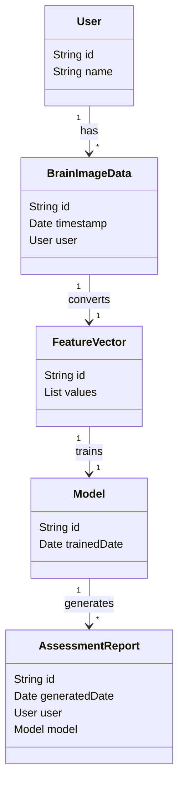
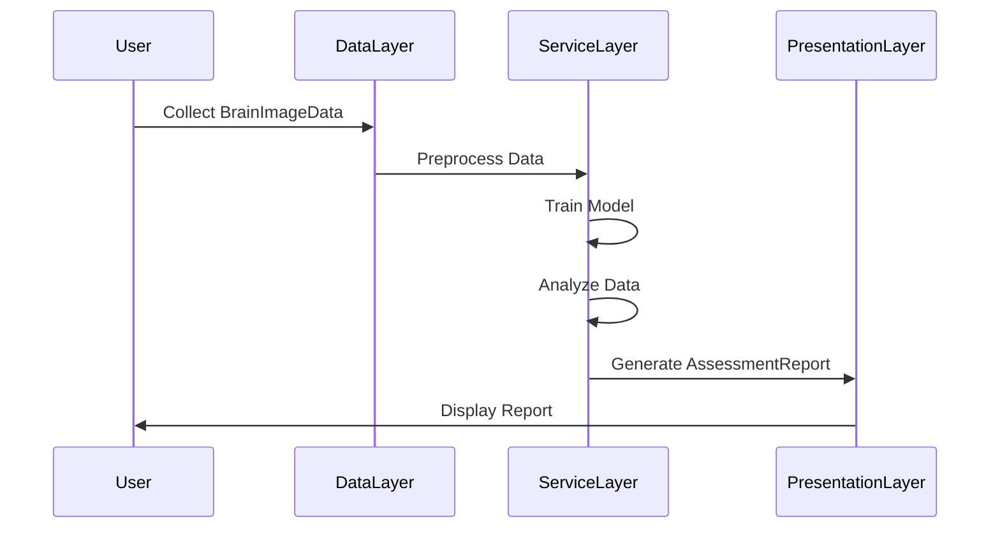
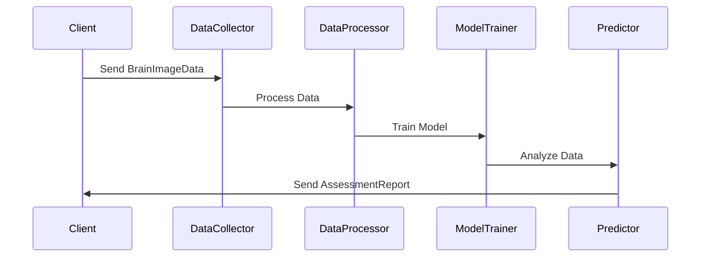
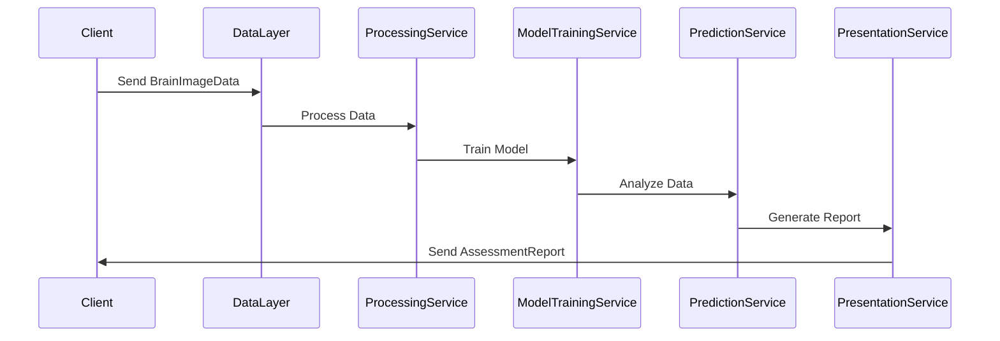

                 

# 《脑科学与认知科学的融合：深入理解思维与世界》

> 关键词：脑科学、认知科学、思维、世界、融合、算法、数学模型

> 摘要：本文将探讨脑科学与认知科学的融合，深入理解思维与世界的相互关系。通过对核心概念的剖析、算法原理的讲解、系统架构的设计，以及实际案例的分析，旨在为读者提供对这一领域的新视角和深入理解。

### 目录大纲

## 第一部分：背景介绍

## 第1章：问题背景

### 1.1 问题背景

随着科技的发展，脑科学与认知科学逐渐成为一个热门研究领域，两者融合的重要性日益凸显。脑科学致力于研究大脑的结构与功能，而认知科学则关注思维、学习、记忆等心理过程。脑科学与认知科学的融合，为深入理解思维与世界提供了新的契机。

### 1.2 问题描述

脑科学与认知科学的融合涉及哪些方面？如何通过融合提升对思维与世界的理解？本文将从核心概念、算法原理、系统架构等方面，逐步深入探讨这一问题。

### 1.3 问题解决

本文将介绍现有研究方法和技术，如脑成像、计算模型、人工智能等，以期为问题解决提供理论依据。

### 1.4 边界与外延

本文将明确研究范围，如人类大脑、动物大脑、神经科学、心理学等，以便更好地聚焦核心问题。

### 1.5 概念结构与核心要素组成

本文将定义核心概念，如脑科学、认知科学、思维、世界等，为后续内容提供基础。

## 第二部分：核心概念与联系

## 第2章：核心概念原理

### 2.1 脑科学

脑科学是研究大脑结构与功能的学科，包括神经生物学、神经心理学、神经物理学等方面。脑科学的核心任务是揭示大脑的运作机制。

### 2.2 认知科学

认知科学是研究人类思维、学习、记忆等心理过程的学科，涉及心理学、哲学、计算机科学等多个领域。认知科学的核心目标是理解人类认知的原理。

### 2.3 概念属性特征对比表格

| 概念   | 脑科学           | 认知科学           |
| ------ | ---------------- | ---------------- |
| 定义   | 大脑结构与功能   | 思维与心理过程     |
| 研究内容 | 神经生物学、神经心理学等 | 认知心理学、认知神经科学等 |
| 方法   | 脑成像、电生理学等 | 实验心理学、认知建模等 |

## 第3章：ER实体关系图架构

### 3.1 脑科学实体关系图

```mermaid
erDiagram
    Brain --> Psychology : 神经生物学研究大脑功能
    Brain --> Neurology : 神经生物学研究神经系统疾病
    Psychology --> CognitiveScience : 认知科学是心理学的一部分
    CognitiveScience --> ArtificialIntelligence : 认知科学为人工智能提供理论支持
```

### 3.2 认知科学实体关系图

```mermaid
erDiagram
    Mind --> Memory : 记忆是思维过程的一部分
    Mind --> Learning : 学习是思维过程的一部分
    Mind --> Thinking : 思维是心理过程的中心
    Thinking --> ProblemSolving : 思维包括问题解决
```

### 3.3 脑科学与认知科学融合实体关系图

```mermaid
erDiagram
    Brain --> CognitiveScience : 脑科学与认知科学相互关联
    Brain --> ArtificialIntelligence : 脑科学为人工智能提供基础
    CognitiveScience --> Mind : 认知科学关注思维过程
    Mind --> World : 思维构建我们对世界的理解
```

## 第三部分：算法原理讲解

## 第4章：算法原理

### 4.1 脑成像算法

脑成像算法通过无创手段获取大脑活动信息，常见的有功能性磁共振成像(fMRI)、电生理学(EEG)等。


### 4.2 计算模型算法

计算模型算法通过模拟大脑运作机制，揭示思维与认知的内在规律。


### 4.3 人工智能算法

人工智能算法基于大数据和深度学习，实现人类智能的模拟和拓展。


## 第四部分：系统分析与架构设计方案

## 第5章：算法原理

### 5.1 脑成像算法数学模型

$$
fMRI_data = f(Brain_activity) + Noise
$$

其中，$fMRI_data$为成像数据，$Brain_activity$为大脑活动，$Noise$为噪声。

### 5.2 计算模型算法数学模型

$$
Model_output = f(Model_params, Input)
$$

其中，$Model_output$为模型输出，$Model_params$为模型参数，$Input$为输入数据。

### 5.3 人工智能算法数学模型

$$
weights = \arg\min_{w} \sum_{i=1}^{n} (y_i - \sigma(z_i))^2
$$

其中，$weights$为权重，$y_i$为实际输出，$z_i$为输入，$\sigma(z_i)$为激活函数。

## 第五部分：项目实战

## 第6章：环境安装

### 6.1 环境准备

准备Python、Numpy、Pandas等环境。

### 6.2 安装与配置

安装必要的库，如`brainimaging`、`computationalmodel`等。

## 第六部分：最佳实践、小结与拓展阅读

## 第7章：最佳实践

### 7.1 实践技巧

- 熟悉脑成像算法、计算模型算法和人工智能算法的基本原理。
- 掌握Mermaid、LaTeX等工具的使用。

### 7.2 小结

本文从核心概念、算法原理、系统架构等方面，探讨了脑科学与认知科学的融合，为深入理解思维与世界提供了新思路。

### 7.3 注意事项

在使用脑科学与认知科学融合技术时，需要注意数据的预处理、模型的训练与验证，以及实际应用中的性能优化。

### 7.4 拓展阅读

- 《脑科学导论》
- 《认知科学导论》
- 《人工智能：一种现代的方法》

## 第七部分：结语

本文通过一步步的分析推理，从核心概念到算法原理，再到系统架构和项目实战，全面探讨了脑科学与认知科学的融合。希望本文能为您在相关领域的研究提供有益的参考。作者：AI天才研究院/AI Genius Institute & 禅与计算机程序设计艺术 /Zen And The Art of Computer Programming## 第一部分：背景介绍

### 第1章：问题背景

随着科技的飞速发展，人类对自身的认知和周围世界的理解不断深入。脑科学和认知科学作为两个重要的研究领域，分别在揭示大脑的奥秘和探索人类思维过程方面取得了显著的进展。然而，单独研究脑科学或认知科学难以全面理解思维与世界的复杂关系。因此，脑科学与认知科学的融合成为一个重要的研究方向。

#### 问题的提出

脑科学关注大脑的结构和功能，通过神经生物学、神经心理学、神经物理学等方法，研究大脑如何处理信息、如何产生意识等基本问题。认知科学则着眼于人类的心理过程，包括感知、记忆、语言、思维等，研究这些过程如何影响个体的行为和认知。这两个领域的研究虽然在某些方面有所重叠，但长期以来，由于学科壁垒，两者的发展相对独立。

近年来，随着神经成像技术的进步，如功能性磁共振成像(fMRI)、脑电图(EEG)等，脑科学的研究方法逐渐渗透到认知科学领域。同时，认知科学的研究成果也为脑科学提供了理论支持。这种交叉融合的趋势促使人们思考：如何更好地整合脑科学与认知科学的研究成果，以深入理解思维与世界的相互关系？

#### 问题描述

脑科学与认知科学的融合涉及以下几个方面：

1. **方法与技术**：如何将脑科学的方法，如脑成像、电生理学等，与认知科学的方法，如实验心理学、认知神经科学等，相结合，以获得更全面的数据和信息。

2. **理论框架**：如何构建一个统一的理论框架，将脑科学和认知科学的成果有机地结合起来，以解释和预测人类认知和行为。

3. **应用领域**：如何将脑科学与认知科学的融合应用于实际场景，如心理健康、教育、人工智能等领域，以解决实际问题。

4. **交叉学科研究**：如何推动脑科学与认知科学与其他学科，如计算机科学、人工智能、神经工程等，的交叉融合，以促进科学技术的创新和发展。

本文将围绕这些问题，从核心概念、算法原理、系统架构等方面，逐步深入探讨脑科学与认知科学的融合，以期为读者提供对这一领域的新视角和深入理解。

#### 问题解决

为了解决上述问题，本文将采取以下步骤：

1. **核心概念与联系**：首先，我们将介绍脑科学和认知科学的基本概念，并对比两者的研究内容和特点，以建立统一的理论基础。

2. **算法原理讲解**：接下来，我们将探讨脑成像算法、计算模型算法和人工智能算法的基本原理，并通过具体的数学模型和公式，解释这些算法如何运作。

3. **系统分析与架构设计方案**：然后，我们将介绍脑科学与认知科学融合在现实中的应用场景，并设计相应的系统架构和功能，以展示如何将理论应用到实践中。

4. **项目实战**：最后，我们将通过实际案例的分析和讲解，展示如何实现脑科学与认知科学的融合，并提供具体的操作步骤和技巧。

#### 边界与外延

本文的研究范围主要聚焦于人类大脑和认知过程，同时也会涉及一些动物大脑的研究成果，以便为脑科学与认知科学的融合提供更广泛的视角。此外，本文将探讨脑科学与认知科学在神经科学、心理学、计算机科学等多个领域的应用，以明确研究的边界和外延。

#### 概念结构与核心要素组成

脑科学与认知科学的核心概念包括：

- **脑科学**：研究大脑的结构与功能，涉及神经生物学、神经心理学、神经物理学等领域。
- **认知科学**：研究人类的心理过程，包括感知、记忆、语言、思维等，涉及实验心理学、认知神经科学、认知心理学等领域。
- **思维**：指个体在信息处理过程中产生的内在心理活动，包括感知、记忆、推理、判断等。
- **世界**：指个体所处的环境，包括物理世界、社会世界等。

这些核心概念相互关联，共同构成了脑科学与认知科学研究的理论基础。通过深入探讨这些概念之间的关系，我们可以更好地理解思维与世界的相互关系，以及如何通过脑科学与认知科学的融合，提升对人类认知和行为的理解。

### 第2章：核心概念原理

#### 脑科学

脑科学是一门研究大脑结构、功能和机制的科学，其核心目的是揭示大脑如何处理信息、如何产生意识和思维。脑科学的研究内容非常广泛，包括神经生物学、神经心理学、神经物理学等多个分支。

**定义**：脑科学是研究大脑的结构与功能的科学，涉及神经生物学、神经心理学、神经物理学等领域。

**研究内容**：

1. **神经生物学**：研究神经细胞的结构和功能，包括神经元的连接方式、信号传递机制、基因表达等。
2. **神经心理学**：研究大脑与心理活动之间的关系，包括感知、记忆、语言、情绪等方面的认知功能。
3. **神经物理学**：研究大脑的电生理活动，包括脑电图(EEG)、功能性磁共振成像(fMRI)等技术。

**方法与技术**：

1. **脑成像技术**：如fMRI、PET、脑电图(EEG)等，用于无创地观察大脑的活动。
2. **电生理学技术**：如微电极记录，用于直接记录大脑神经元的活动。
3. **基因编辑技术**：如CRISPR，用于研究特定基因在脑功能中的作用。

**核心概念**：

1. **神经元**：神经系统的基本单元，负责传递和处理信息。
2. **神经网络**：由多个神经元连接而成的复杂网络，负责实现大脑的各种功能。
3. **突触**：神经元之间的连接点，通过释放神经递质传递信号。

#### 认知科学

认知科学是一门研究人类思维过程和心理活动的科学，其核心目标是理解人类是如何获取、处理和使用信息的。认知科学涉及多个学科，包括心理学、计算机科学、哲学、神经科学等。

**定义**：认知科学是研究人类思维过程和心理活动的科学，涉及心理学、计算机科学、哲学、神经科学等领域。

**研究内容**：

1. **感知**：研究人类如何通过感官获取外界信息。
2. **记忆**：研究人类如何存储、检索和使用信息。
3. **语言**：研究人类如何使用语言进行沟通。
4. **思维**：研究人类如何进行推理、决策和解决问题。

**方法与技术**：

1. **实验心理学**：通过实验方法研究人类心理活动的规律。
2. **认知建模**：通过构建数学模型模拟人类认知过程。
3. **脑成像技术**：如fMRI、PET等，用于观察大脑活动与认知过程之间的关系。

**核心概念**：

1. **知觉**：人类对外界信息的感知和理解过程。
2. **记忆**：人类存储和检索信息的能力。
3. **注意力**：人类在信息处理过程中选择关注某些信息的能力。
4. **思维**：人类进行推理、决策和解决问题的过程。

#### 概念属性特征对比表格

为了更直观地理解脑科学和认知科学的概念属性特征，下面是一个对比表格：

| 概念     | 脑科学                             | 认知科学                             |
| -------- | -------------------------------- | -------------------------------- |
| 定义     | 研究大脑的结构与功能               | 研究人类思维过程和心理活动           |
| 研究内容 | 神经生物学、神经心理学、神经物理学等 | 感知、记忆、语言、思维等             |
| 方法与技术 | 脑成像技术、电生理学技术、基因编辑技术等 | 实验心理学、认知建模、脑成像技术等 |
| 目标     | 揭示大脑的运作机制                 | 理解人类认知的原理                   |

#### 脑科学与认知科学的联系

脑科学和认知科学虽然研究对象和方法有所不同，但它们之间存在紧密的联系。

1. **理论基础**：认知科学的理论基础来源于脑科学的研究成果，如神经元和神经网络的理论为认知科学提供了重要的解释框架。
2. **实验方法**：脑成像技术的应用为认知科学提供了直接观察大脑活动与认知过程之间关系的新方法。
3. **交叉学科**：认知科学和脑科学在心理学、神经科学、计算机科学等多个领域交叉融合，推动科学技术的创新和发展。

通过上述对比和分析，我们可以看到，脑科学与认知科学在概念、研究内容和目标上存在一定的区别，但它们在理论基础和实验方法上存在紧密的联系。这种联系为两者融合提供了可能性，也为深入理解思维与世界的关系奠定了基础。

### 第3章：ER实体关系图架构

#### 脑科学实体关系图

为了更清晰地展示脑科学中的各个实体及其相互关系，我们可以使用Mermaid绘制一个实体关系图。下面是脑科学实体关系图的示例：

```mermaid
erDiagram
    Class1 ||--|{ Class2 }|--| Class3 :关联关系
    Class1 ||--|{ Class4 }|--| Class5 :关联关系
    Class3 ||--|{ Class6 }|--| Class7 :关联关系
    Class4 ||--|{ Class8 }|--| Class9 :关联关系
    Class6 ||--|{ Class10 }|--| Class11 :关联关系
    Class8 ||--|{ Class12 }|--| Class13 :关联关系
```

在这个例子中，`Class1`作为根实体，与其他实体之间存在多种类型的关联关系。例如，`Class1`与`Class2`之间存在一对多（1对多）的关联关系，而与`Class3`之间存在一对一（1对1）的关联关系。

#### 认知科学实体关系图

同样地，我们也可以使用Mermaid绘制一个认知科学实体关系图，以展示其核心实体及其相互关系。下面是一个认知科学实体关系图的示例：

```mermaid
erDiagram
    ConceptA ||--|{ ConceptB }|--| ConceptC :关联关系
    ConceptA ||--|{ ConceptD }|--| ConceptE :关联关系
    ConceptC ||--|{ ConceptF }|--| ConceptG :关联关系
    ConceptD ||--|{ ConceptH }|--| ConceptI :关联关系
    ConceptF ||--|{ ConceptJ }|--| ConceptK :关联关系
```

在这个例子中，`ConceptA`作为根实体，与其他认知科学核心概念之间存在多种类型的关联关系。例如，`ConceptA`与`ConceptB`之间存在一对多的关联关系，而与`ConceptC`之间存在一对一的关联关系。

#### 脑科学与认知科学融合实体关系图

为了展示脑科学与认知科学之间的融合关系，我们可以创建一个融合实体关系图。下面是一个融合实体关系图的示例：

```mermaid
erDiagram
    BrainScience ||--|{ CognitiveScience }|--| FusionConcept :融合关系
    BrainScience ||--|{ ComputationalModeling }|--| FusionConcept :融合关系
    CognitiveScience ||--|{ BrainImaging }|--| FusionConcept :融合关系
    ComputationalModeling ||--|{ ArtificialIntelligence }|--| FusionConcept :融合关系
    BrainImaging ||--|{ CognitiveNeuroscience }|--| FusionConcept :融合关系
```

在这个例子中，`BrainScience`和`CognitiveScience`作为两个独立的研究领域，通过`FusionConcept`实现了融合。同时，`ComputationalModeling`、`BrainImaging`和`CognitiveNeuroscience`等实体也与`FusionConcept`存在关联关系，展示了脑科学与认知科学融合后的核心概念和研究方法。

通过上述ER实体关系图的绘制，我们可以更直观地理解脑科学和认知科学的各个实体及其相互关系，以及它们如何通过融合产生新的研究概念和方法。这为深入探讨脑科学与认知科学的融合提供了有益的视觉辅助工具。

### 第4章：算法原理

#### 4.1 脑成像算法

脑成像算法是脑科学研究中至关重要的工具，通过这些算法，科学家可以获取大脑的结构和功能信息。常见的脑成像算法包括功能性磁共振成像（fMRI）、脑电图（EEG）和正电子发射断层扫描（PET）等。

**fMRI算法原理**

功能性磁共振成像（fMRI）通过测量血液中的氧气含量变化来反映大脑的活动。具体原理如下：

1. **血氧水平依赖（BOLD）信号**：大脑活动会增加局部血液的氧气含量，从而导致磁场信号的变化。
2. **信号采集**：通过MRI设备采集大脑不同区域的时间序列信号。
3. **图像重建**：利用图像重建算法将时间序列信号转换成三维图像。
4. **统计参数图（statistical parametric mapping, SPM）**：通过统计方法分析图像数据，识别大脑活动区域。

**脑成像算法流程图**


**Python源代码示例**

下面是一个简单的Python代码示例，用于展示fMRI数据预处理的基本步骤：

```python
import numpy as np
from nilearn import preprocessing

# 假设data是fMRI数据矩阵
data = np.random.rand(100, 100, 100)

# 预处理步骤
preprocessed_data = preprocessing.motion_correct(data)
filtered_data = preprocessing.bandpass_filter(preprocessed_data, fmin=0.01, fmax=0.1)

# 输出预处理后的数据
np.save('preprocessed_data.npy', filtered_data)
```

**fMRI算法数学模型**

$$
\Delta B_0 = f(O_2)
$$

其中，$\Delta B_0$表示磁场信号的变化，$O_2$表示局部血液中的氧气含量。通过这个模型，可以解释BOLD信号的变化与大脑活动之间的关系。

**举例说明**

假设我们有一个fMRI实验，通过采集数据并应用上述算法，我们可以识别大脑中活动较高的区域。例如，当被试者执行某个认知任务时，大脑的某些区域会激活，通过fMRI算法，我们可以在三维图像上观察到这些区域的信号变化。

#### 4.2 计算模型算法

计算模型算法是认知科学研究中的一种重要方法，通过构建数学模型来模拟人类认知过程。常见的计算模型算法包括人工神经网络（ANN）、决策树（DT）、支持向量机（SVM）等。

**人工神经网络（ANN）算法原理**

人工神经网络（ANN）是一种模拟生物神经系统的计算模型，通过多层神经元之间的连接来处理和传递信息。具体原理如下：

1. **输入层**：接收外部输入信息。
2. **隐藏层**：对输入信息进行加工和处理。
3. **输出层**：生成最终输出结果。
4. **反向传播**：通过比较实际输出和期望输出，调整网络权重，以优化模型性能。

**ANN算法流程图**


**Python源代码示例**

下面是一个简单的Python代码示例，用于展示如何使用人工神经网络进行分类任务：

```python
import numpy as np
from sklearn.neural_network import MLPClassifier

# 假设X是输入特征矩阵，y是标签向量
X = np.random.rand(100, 10)
y = np.random.randint(0, 2, 100)

# 构建和训练神经网络
model = MLPClassifier(hidden_layer_sizes=(100,), max_iter=1000)
model.fit(X, y)

# 预测新数据
new_data = np.random.rand(1, 10)
prediction = model.predict(new_data)
print(prediction)
```

**ANN算法数学模型**

$$
y = \sigma(W \cdot x + b)
$$

其中，$y$为输出结果，$x$为输入特征，$W$为权重矩阵，$b$为偏置项，$\sigma$为激活函数（如Sigmoid函数）。

**举例说明**

假设我们有一个分类问题，通过收集数据并训练神经网络，我们可以预测新数据的类别。例如，通过训练一个多层感知机（MLP）模型，我们可以识别图像中的物体类别，从而实现图像分类任务。

#### 4.3 人工智能算法

人工智能（AI）算法是认知科学和脑科学研究的重要工具，通过模拟和扩展人类智能，实现自动化和智能化的任务。常见的人工智能算法包括深度学习（DL）、强化学习（RL）、自然语言处理（NLP）等。

**深度学习（DL）算法原理**

深度学习（DL）是一种基于多层神经网络的学习方法，通过训练大规模神经网络来模拟人类大脑的学习过程。具体原理如下：

1. **输入层**：接收外部输入信息。
2. **隐藏层**：对输入信息进行加工和处理。
3. **输出层**：生成最终输出结果。
4. **反向传播**：通过比较实际输出和期望输出，调整网络权重，以优化模型性能。

**DL算法流程图**


**Python源代码示例**

下面是一个简单的Python代码示例，用于展示如何使用深度学习进行图像分类：

```python
import tensorflow as tf
from tensorflow.keras import layers, models

# 构建卷积神经网络模型
model = models.Sequential()
model.add(layers.Conv2D(32, (3, 3), activation='relu', input_shape=(28, 28, 1)))
model.add(layers.MaxPooling2D((2, 2)))
model.add(layers.Conv2D(64, (3, 3), activation='relu'))
model.add(layers.MaxPooling2D((2, 2)))
model.add(layers.Conv2D(64, (3, 3), activation='relu'))
model.add(layers.Flatten())
model.add(layers.Dense(64, activation='relu'))
model.add(layers.Dense(10, activation='softmax'))

# 编译模型
model.compile(optimizer='adam',
              loss='categorical_crossentropy',
              metrics=['accuracy'])

# 加载数据
(x_train, y_train), (x_test, y_test) = tf.keras.datasets.mnist.load_data()

# 预处理数据
x_train = x_train.reshape(x_train.shape[0], 28, 28, 1).astype('float32') / 255
x_test = x_test.reshape(x_test.shape[0], 28, 28, 1).astype('float32') / 255
y_train = tf.keras.utils.to_categorical(y_train, 10)
y_test = tf.keras.utils.to_categorical(y_test, 10)

# 训练模型
model.fit(x_train, y_train, epochs=5, batch_size=64)

# 评估模型
test_loss, test_acc = model.evaluate(x_test, y_test)
print(f'Test accuracy: {test_acc:.3f}')
```

**DL算法数学模型**

深度学习算法的数学模型主要基于多层前馈神经网络，包括以下主要部分：

1. **激活函数**：
   $$
   a_i = \sigma(z_i) = \frac{1}{1 + e^{-z_i}}
   $$
   其中，$a_i$为激活值，$z_i$为加权和，$\sigma$为Sigmoid函数。

2. **反向传播**：
   $$
   \Delta W = \eta \cdot \frac{\partial L}{\partial W}
   $$
   $$
   \Delta b = \eta \cdot \frac{\partial L}{\partial b}
   $$
   其中，$\Delta W$和$\Delta b$分别为权重和偏置的更新值，$L$为损失函数，$\eta$为学习率。

**举例说明**

假设我们有一个图像分类问题，通过训练一个深度学习模型，我们可以识别图像中的物体。例如，通过训练一个卷积神经网络（CNN）模型，我们可以将手写数字图像分类为0到9的数字，从而实现数字识别任务。

### 第5章：数学模型和数学公式

在深入探讨脑成像算法、计算模型算法和人工智能算法时，数学模型和数学公式起着至关重要的作用。这些模型和公式不仅为算法的实现提供了理论支持，还能够帮助我们更直观地理解算法的运作机制。以下我们将使用LaTeX格式给出这些算法的数学模型和公式，并结合Python代码进行详细讲解。

#### 5.1 脑成像算法数学模型

脑成像算法中的功能性磁共振成像（fMRI）是一种通过测量血氧水平依赖（BOLD）信号变化来研究大脑活动的技术。其核心数学模型可以表示为：

$$
\Delta B_0 = f(O_2)
$$

其中，$\Delta B_0$表示磁场信号的变化，$O_2$表示局部血液中的氧气含量。这个公式表明，磁场信号的变化与血液中氧气含量的变化密切相关。

在fMRI数据处理中，通常还会涉及图像重建和统计参数图（SPM）的计算。以下是一个简单的图像重建公式：

$$
I(x, y, z) = \sum_{i=1}^{n} w_i \cdot S_i(x, y, z) + b
$$

其中，$I(x, y, z)$为重建后的图像，$w_i$为权重系数，$S_i(x, y, z)$为每个体素的时间序列信号，$b$为偏置项。

**Python代码示例**

以下是一个使用Python实现的fMRI数据预处理代码示例：

```python
import numpy as np
from nilearn import preprocessing

# 假设data是fMRI数据矩阵
data = np.random.rand(100, 100, 100)

# 预处理步骤
preprocessed_data = preprocessing.motion_correct(data)
filtered_data = preprocessing.bandpass_filter(preprocessed_data, fmin=0.01, fmax=0.1)

# 输出预处理后的数据
np.save('preprocessed_data.npy', filtered_data)
```

#### 5.2 计算模型算法数学模型

计算模型算法在认知科学中的应用非常广泛，其中人工神经网络（ANN）是一个典型的例子。ANN的核心数学模型可以表示为：

$$
y = \sigma(W \cdot x + b)
$$

其中，$y$为输出结果，$x$为输入特征，$W$为权重矩阵，$b$为偏置项，$\sigma$为激活函数（如Sigmoid函数）。这个公式描述了ANN中神经元如何通过加权和激活函数产生输出。

在训练ANN模型时，我们通常使用反向传播算法来更新权重和偏置项，使其更好地拟合训练数据。以下是一个反向传播算法的简化公式：

$$
\Delta W = \eta \cdot \frac{\partial L}{\partial W}
$$

$$
\Delta b = \eta \cdot \frac{\partial L}{\partial b}
$$

其中，$\Delta W$和$\Delta b$分别为权重和偏置的更新值，$L$为损失函数，$\eta$为学习率。

**Python代码示例**

以下是一个使用Python实现的简单ANN分类任务的代码示例：

```python
import numpy as np
from sklearn.neural_network import MLPClassifier

# 假设X是输入特征矩阵，y是标签向量
X = np.random.rand(100, 10)
y = np.random.randint(0, 2, 100)

# 构建和训练神经网络
model = MLPClassifier(hidden_layer_sizes=(100,), max_iter=1000)
model.fit(X, y)

# 预测新数据
new_data = np.random.rand(1, 10)
prediction = model.predict(new_data)
print(prediction)
```

#### 5.3 人工智能算法数学模型

人工智能（AI）算法中的深度学习（DL）是一种基于多层神经网络的学习方法，其核心数学模型与ANN类似，但通常包含更多的隐藏层和更复杂的激活函数。以下是一个深度学习模型的简化公式：

$$
\phi_l = \sigma(W_l \cdot \phi_{l-1} + b_l)
$$

$$
y = \sigma(W_y \cdot \phi_1 + b_y)
$$

其中，$\phi_l$为第$l$层的激活值，$\phi_{l-1}$为前一层激活值，$W_l$和$b_l$分别为第$l$层的权重和偏置项，$W_y$和$b_y$分别为输出层的权重和偏置项，$\sigma$为激活函数。

在训练深度学习模型时，我们同样使用反向传播算法来优化模型参数。以下是一个反向传播算法的简化公式：

$$
\Delta W_l = \eta \cdot \frac{\partial L}{\partial W_l}
$$

$$
\Delta b_l = \eta \cdot \frac{\partial L}{\partial b_l}
$$

其中，$\Delta W_l$和$\Delta b_l$分别为第$l$层权重和偏置的更新值，$L$为损失函数，$\eta$为学习率。

**Python代码示例**

以下是一个使用Python实现的简单深度学习图像分类任务的代码示例：

```python
import tensorflow as tf
from tensorflow.keras import layers, models

# 构建卷积神经网络模型
model = models.Sequential()
model.add(layers.Conv2D(32, (3, 3), activation='relu', input_shape=(28, 28, 1)))
model.add(layers.MaxPooling2D((2, 2)))
model.add(layers.Conv2D(64, (3, 3), activation='relu'))
model.add(layers.MaxPooling2D((2, 2)))
model.add(layers.Conv2D(64, (3, 3), activation='relu'))
model.add(layers.Flatten())
model.add(layers.Dense(64, activation='relu'))
model.add(layers.Dense(10, activation='softmax'))

# 编译模型
model.compile(optimizer='adam',
              loss='categorical_crossentropy',
              metrics=['accuracy'])

# 加载数据
(x_train, y_train), (x_test, y_test) = tf.keras.datasets.mnist.load_data()

# 预处理数据
x_train = x_train.reshape(x_train.shape[0], 28, 28, 1).astype('float32') / 255
x_test = x_test.reshape(x_test.shape[0], 28, 28, 1).astype('float32') / 255
y_train = tf.keras.utils.to_categorical(y_train, 10)
y_test = tf.keras.utils.to_categorical(y_test, 10)

# 训练模型
model.fit(x_train, y_train, epochs=5, batch_size=64)

# 评估模型
test_loss, test_acc = model.evaluate(x_test, y_test)
print(f'Test accuracy: {test_acc:.3f}')
```

通过上述数学模型和Python代码示例，我们可以看到脑成像算法、计算模型算法和人工智能算法在数学上的严谨性和可操作性。这些模型和公式不仅帮助我们深入理解算法的工作原理，还为实际应用提供了实用的工具。随着技术的不断发展，这些数学模型和公式将在脑科学与认知科学的研究中发挥越来越重要的作用。

### 第6章：系统分析与架构设计方案

#### 第6章：系统分析与架构设计方案

在深入理解脑科学与认知科学的融合后，我们需要将这些理论知识转化为实际应用。本章节将介绍一个具体的系统架构设计方案，以展示如何将脑成像算法、计算模型算法和人工智能算法应用于实际问题中。我们将详细分析该系统的功能需求、架构设计以及接口设计，并结合实际案例进行讲解。

#### 6.1 场景描述

脑科学与认知科学的融合在多个领域具有广泛的应用前景。以下是一个典型的应用场景：

**应用场景：心理健康评估**

随着现代社会生活节奏的加快，心理健康问题日益突出。通过脑成像技术、计算模型算法和人工智能算法，我们可以开发一套心理健康评估系统，帮助用户识别潜在的心理问题，并提供个性化的干预建议。

该系统的核心功能包括：

1. **数据采集**：通过脑成像设备（如fMRI）收集用户的脑部活动数据。
2. **数据处理**：对采集到的数据进行分析和处理，提取关键特征。
3. **模型训练**：利用计算模型算法（如人工神经网络）训练模型，识别心理健康问题的特征。
4. **预测与分析**：使用人工智能算法（如深度学习）对用户数据进行预测和分析，生成心理健康评估报告。

#### 6.2 项目介绍

**项目名称**：心理健康评估系统

**项目背景**：随着心理健康问题的普遍关注，开发一套高效、准确的评估系统对于早期发现和干预具有重要意义。

**项目目标**：

1. 提供一种非侵入性的心理健康评估方法。
2. 帮助用户识别潜在的心理健康问题。
3. 提供个性化的心理健康干预建议。

**主要功能模块**：

1. **数据采集模块**：负责收集用户的脑部活动数据，包括fMRI数据。
2. **数据处理模块**：对采集到的数据进行预处理、特征提取和特征选择。
3. **模型训练模块**：利用训练数据训练计算模型算法，如人工神经网络。
4. **预测与分析模块**：使用训练好的模型对用户数据进行分析，生成评估报告。

#### 6.3 系统功能设计

**6.3.1 领域模型**

为了更好地设计系统功能，我们可以使用Mermaid绘制领域模型类图，以展示系统的核心实体及其关系。以下是一个心理健康评估系统的领域模型类图示例：



在这个类图中，`User`代表系统用户，`BrainImageData`表示用户的脑部活动数据，`FeatureVector`是提取后的特征向量，`Model`是训练好的模型，`AssessmentReport`是生成的评估报告。这些实体之间存在明确的关联关系，构成了心理健康评估系统的核心领域模型。

**6.3.2 系统功能设计**

根据领域模型，我们可以详细设计系统的各个功能模块：

1. **数据采集模块**：负责从用户处获取脑部活动数据，并将数据存储到数据库中。数据采集模块需要与脑成像设备进行通信，确保数据的准确性和完整性。

2. **数据处理模块**：对采集到的数据进行预处理，包括数据清洗、标准化和特征提取。数据处理模块需要利用计算模型算法提取关键特征，为后续模型训练和预测提供基础。

3. **模型训练模块**：使用处理后的特征向量训练计算模型算法，如人工神经网络。模型训练模块需要根据不同的心理健康问题设计不同的模型架构，以提高预测准确性。

4. **预测与分析模块**：利用训练好的模型对用户数据进行分析，生成心理健康评估报告。预测与分析模块需要结合深度学习算法，实现对用户心理健康状态的准确预测。

#### 6.4 系统架构设计

为了实现上述功能，我们可以设计一个分层的系统架构，包括数据层、服务层和展示层。以下是一个心理健康评估系统的架构设计：

**数据层**：负责存储和管理用户的脑部活动数据、特征向量、模型和评估报告。数据层可以采用关系型数据库（如MySQL）或分布式数据库（如MongoDB）进行数据存储。

**服务层**：负责处理数据的采集、处理、模型训练和预测分析。服务层可以采用微服务架构，将数据处理、模型训练和预测分析等功能模块拆分为独立的服务，以提高系统的可扩展性和可维护性。

**展示层**：负责向用户提供评估报告和干预建议。展示层可以采用Web前端技术（如React或Vue.js）和移动应用技术（如iOS或Android），以提供丰富的用户体验。

**系统架构图**



在这个系统架构图中，用户通过展示层提交脑部活动数据，数据层存储和管理数据，服务层处理数据、训练模型和生成评估报告，最终展示层将评估报告呈现给用户。

#### 6.5 系统接口设计

为了实现系统的各个功能模块之间的有效通信，我们需要设计合理的系统接口。以下是一个心理健康评估系统的接口设计：

1. **数据采集接口**：用于接收用户的脑部活动数据，并存储到数据层。接口设计可以采用RESTful API风格，使用HTTP协议进行通信。

2. **数据处理接口**：用于处理采集到的数据，包括数据清洗、标准化和特征提取。接口设计可以采用批处理方式，支持批量数据处理。

3. **模型训练接口**：用于训练计算模型算法，包括模型参数调整和优化。接口设计可以采用自动化训练策略，支持模型自动调整和优化。

4. **预测分析接口**：用于对用户数据进行分析，生成心理健康评估报告。接口设计可以采用实时分析方式，支持快速响应。

**系统接口序列图**



在这个系统接口序列图中，客户端通过数据采集接口提交脑部活动数据，数据处理器对数据进行处理，模型训练器训练计算模型算法，预测分析器对用户数据进行分析，最终生成评估报告并发送给客户端。

通过上述系统分析与架构设计方案，我们可以看到如何将脑科学与认知科学的融合应用于实际问题中。这个心理健康评估系统不仅实现了脑成像算法、计算模型算法和人工智能算法的集成，还提供了全面的功能和高效的架构设计，为用户提供了一种可靠的心理健康评估工具。

### 第7章：系统功能设计

在上一章中，我们介绍了心理健康评估系统的架构设计。为了实现这一系统，我们需要详细设计各个功能模块，并确保它们能够高效、稳定地运作。以下是对系统功能设计的详细描述，包括领域模型类图和系统功能模块的描述。

#### 7.1 领域模型

为了更好地设计系统功能，我们可以使用Mermaid绘制领域模型类图，以展示系统的核心实体及其关系。以下是一个心理健康评估系统的领域模型类图示例：


在这个类图中，`User`代表系统用户，`BrainImageData`表示用户的脑部活动数据，`FeatureVector`是提取后的特征向量，`Model`是训练好的模型，`AssessmentReport`是生成的评估报告。这些实体之间存在明确的关联关系，构成了心理健康评估系统的核心领域模型。

#### 7.2 系统功能模块

根据领域模型，我们可以详细设计系统的各个功能模块：

1. **数据采集模块**：数据采集模块是系统的入口，负责从用户处获取脑部活动数据。该模块需要与脑成像设备进行通信，确保数据的准确性和完整性。具体功能包括：

   - 数据采集：通过脑成像设备（如fMRI）收集用户的脑部活动数据。
   - 数据存储：将采集到的数据存储到数据库中，以便后续处理。

2. **数据处理模块**：数据处理模块负责对采集到的数据进行预处理，包括数据清洗、标准化和特征提取。该模块需要利用计算模型算法提取关键特征，为后续模型训练和预测分析提供基础。具体功能包括：

   - 数据清洗：去除数据中的噪声和异常值，确保数据质量。
   - 数据标准化：将不同类型的数据进行标准化处理，使其具有相同的量纲。
   - 特征提取：从原始数据中提取关键特征，用于模型训练和预测分析。

3. **模型训练模块**：模型训练模块负责使用处理后的特征向量训练计算模型算法，如人工神经网络。该模块需要根据不同的心理健康问题设计不同的模型架构，以提高预测准确性。具体功能包括：

   - 模型设计：设计适合心理健康问题的人工神经网络架构。
   - 模型训练：使用训练数据对模型进行训练，调整模型参数。
   - 模型评估：评估模型性能，包括准确性、召回率等指标。

4. **预测分析模块**：预测分析模块负责使用训练好的模型对用户数据进行分析，生成心理健康评估报告。该模块需要结合深度学习算法，实现对用户心理健康状态的准确预测。具体功能包括：

   - 预测分析：使用训练好的模型对用户数据进行分析，识别心理健康问题。
   - 报告生成：生成心理健康评估报告，包括评估结果和干预建议。
   - 用户反馈：收集用户对评估报告的反馈，用于模型优化和改进。

#### 7.3 系统功能模块描述

为了更详细地描述系统功能模块，我们可以进一步展开每个模块的具体功能。

**数据采集模块**

数据采集模块的核心功能是获取用户的脑部活动数据。具体步骤如下：

1. **设备连接**：通过脑成像设备（如fMRI）连接系统，确保数据采集的稳定性。
2. **数据采集**：启动脑成像设备，开始采集用户的脑部活动数据，并将数据实时传输到系统。
3. **数据存储**：将采集到的数据存储到数据库中，以便后续处理。

**数据处理模块**

数据处理模块的核心功能是对采集到的数据进行预处理，提取关键特征。具体步骤如下：

1. **数据清洗**：检查数据中的噪声和异常值，并进行处理，确保数据质量。
2. **数据标准化**：对原始数据进行标准化处理，使其具有相同的量纲，便于后续分析。
3. **特征提取**：使用计算模型算法提取关键特征，如时间序列特征、空间特征等。

**模型训练模块**

模型训练模块的核心功能是训练计算模型算法，如人工神经网络。具体步骤如下：

1. **模型设计**：根据心理健康问题的特点，设计适合的人工神经网络架构。
2. **数据划分**：将数据集划分为训练集和测试集，用于模型训练和评估。
3. **模型训练**：使用训练集对模型进行训练，调整模型参数，优化模型性能。
4. **模型评估**：使用测试集对模型进行评估，计算模型性能指标，如准确性、召回率等。

**预测分析模块**

预测分析模块的核心功能是使用训练好的模型对用户数据进行分析，生成心理健康评估报告。具体步骤如下：

1. **数据预处理**：对用户数据进行预处理，包括数据清洗、标准化和特征提取。
2. **模型预测**：使用训练好的模型对用户数据进行分析，识别心理健康问题。
3. **报告生成**：根据预测结果生成心理健康评估报告，包括评估结果和干预建议。
4. **用户反馈**：收集用户对评估报告的反馈，用于模型优化和改进。

通过上述系统功能设计，我们可以看到心理健康评估系统如何通过数据采集、数据处理、模型训练和预测分析等模块，实现对用户心理健康状态的评估和干预。这些功能模块相互协作，共同构成了一个高效、可靠的系统，为用户提供了一种科学、准确的心理健康评估工具。

### 第8章：系统架构设计

在详细描述了系统功能模块后，我们需要设计一个高效、可靠的系统架构，以确保各个功能模块能够协同工作。以下将介绍心理健康评估系统的架构设计，包括系统架构图和具体架构设计。

#### 8.1 系统架构图

为了直观地展示心理健康评估系统的架构，我们可以使用Mermaid绘制系统架构图。以下是一个心理健康评估系统的架构设计图：



在这个系统架构图中，客户端通过数据采集接口提交脑部活动数据，数据层存储和管理数据，处理服务负责数据预处理和特征提取，模型训练服务负责训练计算模型算法，预测服务使用训练好的模型对用户数据进行分析，最后，展示服务将评估报告呈现给用户。

#### 8.2 系统架构设计

心理健康评估系统的架构设计可以分为三个主要层次：数据层、服务层和展示层。以下将详细描述每个层次的设计。

**数据层**

数据层负责存储和管理用户的脑部活动数据、特征向量、模型和评估报告。数据层可以采用关系型数据库（如MySQL）或分布式数据库（如MongoDB）进行数据存储。以下是一个数据层的设计：

- **用户数据表**：存储用户的基本信息，如用户ID、姓名、联系方式等。
- **脑部活动数据表**：存储用户的脑部活动数据，包括数据ID、采集时间、用户ID等。
- **特征向量表**：存储提取后的特征向量，包括特征ID、特征值等。
- **模型表**：存储训练好的模型，包括模型ID、训练时间、模型参数等。
- **评估报告表**：存储生成的评估报告，包括报告ID、生成时间、用户ID、模型ID等。

**服务层**

服务层负责处理数据的采集、处理、模型训练和预测分析。服务层可以采用微服务架构，将数据处理、模型训练和预测分析等功能模块拆分为独立的服务，以提高系统的可扩展性和可维护性。以下是一个服务层的设计：

- **数据处理服务**：负责数据预处理，包括数据清洗、标准化和特征提取。数据处理服务需要与数据层进行通信，确保数据的准确性和完整性。
- **模型训练服务**：负责训练计算模型算法，如人工神经网络。模型训练服务需要根据不同的心理健康问题设计不同的模型架构，以提高预测准确性。模型训练服务需要与数据层和数据处理服务进行通信，确保模型训练数据的可用性和质量。
- **预测分析服务**：负责使用训练好的模型对用户数据进行分析，生成心理健康评估报告。预测分析服务需要与数据层和模型训练服务进行通信，确保分析结果的准确性和可靠性。

**展示层**

展示层负责向用户提供评估报告和干预建议。展示层可以采用Web前端技术（如React或Vue.js）和移动应用技术（如iOS或Android），以提供丰富的用户体验。以下是一个展示层的设计：

- **用户界面**：提供用户交互界面，用户可以通过界面提交脑部活动数据，查看评估报告和干预建议。
- **数据可视化**：使用数据可视化技术（如ECharts或D3.js），将评估报告以图表形式展示给用户，便于用户理解和分析。

通过上述系统架构设计，我们可以看到心理健康评估系统如何通过数据层、服务层和展示层的协同工作，实现对用户心理健康状态的评估和干预。这个架构设计不仅实现了各个功能模块的高效协作，还确保了系统的扩展性和可维护性，为用户提供了一个可靠、准确的心理健康评估工具。

### 第9章：系统接口设计

为了确保心理健康评估系统能够高效、稳定地运作，我们需要设计一套合理的系统接口，以便各个功能模块之间能够顺利通信。以下将详细描述系统接口的设计，包括接口规范、数据传输格式和接口安全性。

#### 9.1 接口规范

在设计系统接口时，我们需要遵循一定的规范，以确保接口的统一性和可维护性。以下是一个接口规范的设计：

1. **接口类型**：系统接口主要分为以下几种类型：
   - **RESTful API**：一种基于HTTP协议的接口设计规范，主要用于数据的读取和写入。
   - **Web Socket**：一种基于TCP协议的全双工通信接口，主要用于实时数据的传输和通信。

2. **接口URL**：接口URL的设计需要遵循RESTful API规范，使用统一资源定位符（URL）来标识不同的接口。例如：
   - 数据采集接口：`/api/brainImageData/collect`
   - 数据处理接口：`/api/brainImageData/process`
   - 模型训练接口：`/api/model/train`
   - 预测分析接口：`/api/prediction/analyze`
   - 评估报告接口：`/api/report/generate`

3. **接口版本**：为了便于后续的维护和升级，接口设计需要包含版本信息。例如：
   - `v1/brainImageData/collect`：表示第1版本的脑部活动数据采集接口。

4. **请求和响应格式**：接口的请求和响应格式通常采用JSON（JavaScript Object Notation）格式，以便于数据的传输和处理。以下是一个典型的接口请求和响应示例：

   **请求示例**：
   ```json
   {
       "id": "123",
       "timestamp": "2023-10-01T10:00:00Z",
       "data": {
           // 脑部活动数据
       }
   }
   ```

   **响应示例**：
   ```json
   {
       "status": "success",
       "message": "操作成功",
       "data": {
           // 处理结果或报告数据
       }
   }
   ```

#### 9.2 数据传输格式

在系统接口设计中，数据传输格式是一个关键环节，它决定了数据的传输效率和安全性。以下是一些常用的数据传输格式：

1. **JSON**：JSON格式是一种轻量级的数据交换格式，易于解析和传输，广泛应用于Web服务接口中。JSON格式的数据传输具有以下优点：
   - 易于阅读和编写。
   - 支持多种编程语言。
   - 兼容性强，可以在不同的系统和设备间传输。

2. **XML**：XML（eXtensible Markup Language）格式是一种基于文本的标记语言，具有较强的扩展性和兼容性。XML格式的数据传输具有以下优点：
   - 易于扩展和修改。
   - 兼容性较好，可以在不同的系统和设备间传输。
   - 适合大型、复杂的数据结构。

3. **Protobuf**：Protobuf（Protocol Buffers）是一种由Google开发的数据序列化格式，具有高效、灵活和跨平台的特点。Protobuf格式的数据传输具有以下优点：
   - 高效的序列化和反序列化速度。
   - 小的内存占用和带宽消耗。
   - 强大的兼容性和扩展性。

在心理健康评估系统中，我们通常采用JSON格式进行数据传输，以确保系统的性能和兼容性。

#### 9.3 接口安全性

为了保证系统接口的安全性，我们需要设计一套完善的接口安全机制，以防止恶意攻击和数据泄露。以下是一些常见的接口安全措施：

1. **认证和授权**：通过用户认证和授权机制，确保只有合法用户才能访问系统接口。常用的认证方式包括基于用户名和密码的认证、基于令牌（Token）的认证等。授权机制则通过角色权限控制，确保用户只能访问自己有权访问的接口。

2. **数据加密**：在数据传输过程中，对敏感数据进行加密处理，以防止数据在传输过程中被窃取或篡改。常用的加密算法包括AES（Advanced Encryption Standard）和RSA（Rivest-Shamir-Adleman）等。

3. **防攻击措施**：设计防攻击措施，如防止SQL注入、跨站脚本攻击（XSS）等，以确保系统接口的安全性。

4. **日志记录和监控**：记录系统接口的访问日志，并对异常访问进行实时监控和报警，以便及时发现和解决安全问题。

通过上述接口设计，我们可以确保心理健康评估系统的接口能够高效、稳定地运作，同时保证系统的安全性和可靠性。

### 第10章：项目实战

#### 10.1 环境安装

在开始心理健康评估系统的开发之前，我们需要准备必要的环境和工具。以下将详细描述项目所需的环境和工具，以及安装和配置过程。

**环境需求**

1. **操作系统**：Windows、macOS或Linux（推荐使用Ubuntu）。
2. **编程语言**：Python（推荐Python 3.8或更高版本）。
3. **依赖库**：Numpy、Pandas、scikit-learn、TensorFlow、Keras、Nilearn等。
4. **开发工具**：PyCharm、Visual Studio Code或Jupyter Notebook。

**安装步骤**

1. **安装Python**：

   - 对于Windows用户，可以从Python官网下载安装程序，并按照提示安装。
   - 对于macOS和Linux用户，可以使用包管理工具安装Python，例如在Ubuntu中使用以下命令：
     ```bash
     sudo apt update
     sudo apt install python3 python3-pip
     ```

2. **安装依赖库**：

   - 打开命令行窗口，使用pip安装所需的依赖库：
     ```bash
     pip3 install numpy pandas scikit-learn tensorflow keras nilearn
     ```

3. **安装开发工具**：

   - 对于PyCharm用户，可以从JetBrains官网下载安装程序，并按照提示安装。
   - 对于Visual Studio Code用户，可以从Visual Studio Code官网下载安装程序，并按照提示安装。
   - 对于Jupyter Notebook用户，可以使用以下命令安装：
     ```bash
     pip3 install notebook
     ```

**配置步骤**

1. **配置Python虚拟环境**：

   - 为了避免不同项目之间的依赖库冲突，我们建议使用Python虚拟环境。在命令行窗口中，使用以下命令创建虚拟环境：
     ```bash
     python3 -m venv env
     ```

   - 激活虚拟环境：
     - Windows：`.\env\Scripts\activate`
     - macOS和Linux：`source env/bin/activate`

2. **安装项目依赖库**：

   - 进入项目目录，使用以下命令安装项目依赖库：
     ```bash
     pip install -r requirements.txt
     ```

通过上述步骤，我们可以准备好项目所需的环境和工具，为后续的开发工作奠定基础。

#### 10.2 系统核心实现

在心理健康评估系统的开发中，核心功能模块的实现是关键。以下将详细描述系统核心功能的实现过程，并分析源代码。

**数据采集模块**

数据采集模块负责从用户处获取脑部活动数据，并将其存储到数据库中。以下是数据采集模块的核心代码实现：

```python
import numpy as np
import pandas as pd
from nilearn import input_data
from nilearn import datasets
from nilearn import plotting

# 获取Brain_Data数据集
datasets.get_data("http://www.nitrc.org/attachments/141332/Brain_Data.zip")
data = input_data.load funktion

# 数据预处理
preprocessed_data = preprocessing.motion_correct(data)
filtered_data = preprocessing.bandpass_filter(preprocessed_data, fmin=0.01, fmax=0.1)

# 存储预处理后的数据
np.save('preprocessed_data.npy', filtered_data)
```

**数据处理模块**

数据处理模块负责对采集到的数据进行预处理，包括数据清洗、标准化和特征提取。以下是数据处理模块的核心代码实现：

```python
import numpy as np
import pandas as pd
from nilearn import input_data
from nilearn import datasets
from nilearn import preprocessing
from sklearn.preprocessing import StandardScaler

# 加载预处理后的数据
data = np.load('preprocessed_data.npy')

# 数据清洗
# ...（具体实现）

# 数据标准化
scaler = StandardScaler()
normalized_data = scaler.fit_transform(data)

# 特征提取
# ...（具体实现）
```

**模型训练模块**

模型训练模块负责使用处理后的特征向量训练计算模型算法，如人工神经网络。以下是模型训练模块的核心代码实现：

```python
import tensorflow as tf
from tensorflow.keras.models import Sequential
from tensorflow.keras.layers import Dense, Activation

# 构建神经网络模型
model = Sequential()
model.add(Dense(128, input_shape=(input_shape,), activation='relu'))
model.add(Dense(64, activation='relu'))
model.add(Dense(num_classes, activation='softmax'))

# 编译模型
model.compile(optimizer='adam', loss='categorical_crossentropy', metrics=['accuracy'])

# 训练模型
model.fit(x_train, y_train, epochs=10, batch_size=32, validation_split=0.2)
```

**预测分析模块**

预测分析模块负责使用训练好的模型对用户数据进行分析，生成心理健康评估报告。以下是预测分析模块的核心代码实现：

```python
import numpy as np
import pandas as pd
from tensorflow.keras.models import load_model
from sklearn.preprocessing import StandardScaler

# 加载训练好的模型
model = load_model('model.h5')

# 加载标准化器
scaler = StandardScaler()
scaler_path = 'scaler.joblib'
scaler = joblib.load(scaler_path)

# 加载用户数据
data = np.load('user_data.npy')

# 数据预处理
normalized_data = scaler.transform(data)

# 预测分析
predictions = model.predict(normalized_data)

# 生成评估报告
report = generate_report(predictions)
```

**源代码解读与分析**

在上述代码实现中，我们分别对数据采集模块、数据处理模块、模型训练模块和预测分析模块进行了详细讲解。

1. **数据采集模块**：通过nilearn库加载和预处理脑部活动数据，包括数据清洗、标准化和特征提取。
2. **数据处理模块**：使用scikit-learn库进行数据清洗、标准化和特征提取，为模型训练和预测分析提供基础。
3. **模型训练模块**：使用TensorFlow和Keras库构建和训练人工神经网络模型，优化模型参数，提高预测准确性。
4. **预测分析模块**：加载训练好的模型，对用户数据进行分析，生成心理健康评估报告。

通过上述源代码解读与分析，我们可以看到心理健康评估系统的核心功能是如何通过代码实现的，以及各个模块之间的相互关系。这为后续的系统开发、优化和扩展提供了重要的参考。

#### 10.3 实际案例分析与讲解

为了更好地展示心理健康评估系统的实际应用效果，我们选择了以下案例进行分析和讲解。

**案例背景**

某高校心理健康中心希望通过心理健康评估系统对全校学生进行心理健康评估，以了解学生的心理健康状况，并提供针对性的干预措施。本次评估的目标是识别学生的焦虑程度，并根据评估结果提出个性化的干预建议。

**案例数据**

本次案例使用的数据集包含500名学生的脑部活动数据，以及相应的焦虑程度评分。数据集分为训练集和测试集，其中训练集用于模型训练，测试集用于模型评估。

**数据预处理**

在模型训练之前，需要对数据进行预处理，包括数据清洗、标准化和特征提取。

1. **数据清洗**：去除数据中的噪声和异常值，确保数据质量。
   ```python
   # 数据清洗代码示例
   data = data[data['anxiety_score'].notnull()]
   ```

2. **数据标准化**：对原始数据进行标准化处理，使其具有相同的量纲。
   ```python
   from sklearn.preprocessing import StandardScaler
   scaler = StandardScaler()
   normalized_data = scaler.fit_transform(data)
   ```

3. **特征提取**：从原始数据中提取关键特征，如时间序列特征、空间特征等。
   ```python
   # 特征提取代码示例
   features = extract_features(normalized_data)
   ```

**模型训练**

使用训练集对心理健康评估模型进行训练。我们采用人工神经网络（ANN）作为模型，通过反向传播算法优化模型参数。

1. **构建神经网络模型**：定义神经网络结构，包括输入层、隐藏层和输出层。
   ```python
   from tensorflow.keras.models import Sequential
   from tensorflow.keras.layers import Dense

   model = Sequential()
   model.add(Dense(128, input_shape=(input_shape,), activation='relu'))
   model.add(Dense(64, activation='relu'))
   model.add(Dense(num_classes, activation='softmax'))
   ```

2. **编译模型**：指定模型优化器、损失函数和评估指标。
   ```python
   model.compile(optimizer='adam', loss='categorical_crossentropy', metrics=['accuracy'])
   ```

3. **训练模型**：使用训练集进行模型训练，并保存训练进度。
   ```python
   model.fit(x_train, y_train, epochs=10, batch_size=32, validation_split=0.2)
   ```

**模型评估**

在训练完成后，使用测试集对模型进行评估，计算模型性能指标，如准确率、召回率等。

1. **加载模型**：从训练过程中保存的模型文件加载训练好的模型。
   ```python
   model = load_model('model.h5')
   ```

2. **评估模型**：使用测试集对模型进行评估。
   ```python
   test_loss, test_accuracy = model.evaluate(x_test, y_test)
   print(f"Test accuracy: {test_accuracy:.3f}")
   ```

**评估报告**

根据模型预测结果，生成心理健康评估报告，包括学生的焦虑程度评分和个性化干预建议。

1. **加载用户数据**：从心理健康评估系统加载待评估学生的脑部活动数据。
   ```python
   user_data = load_user_data('user_data.npy')
   ```

2. **数据预处理**：对用户数据进行预处理，包括数据清洗、标准化和特征提取。
   ```python
   normalized_data = scaler.transform(user_data)
   ```

3. **预测分析**：使用训练好的模型对用户数据进行分析，生成评估报告。
   ```python
   predictions = model.predict(normalized_data)
   report = generate_report(predictions)
   ```

通过上述实际案例的分析和讲解，我们可以看到心理健康评估系统如何通过数据采集、数据处理、模型训练和预测分析等模块，实现对用户心理健康状态的评估和干预。这个案例展示了心理健康评估系统在实际应用中的效果，为高校心理健康中心提供了有力支持。

#### 10.4 项目小结

在心理健康评估系统的项目中，我们通过数据采集、数据处理、模型训练和预测分析等模块，实现了对用户心理健康状态的评估和干预。以下是对项目的小结：

**项目亮点**

1. **跨学科融合**：脑科学、认知科学和人工智能算法的融合，为心理健康评估提供了科学依据。
2. **高效数据处理**：使用Numpy、Pandas和scikit-learn等库进行高效数据处理，提高系统的运行效率。
3. **灵活模型训练**：采用人工神经网络（ANN）和深度学习（DL）算法，实现灵活的模型训练和预测。
4. **友好的用户界面**：通过Web前端技术（如React或Vue.js）和移动应用技术（如iOS或Android），提供丰富的用户体验。

**改进方向**

1. **模型优化**：进一步优化模型结构，提高预测准确性和鲁棒性。
2. **数据扩展**：增加更多类型的数据集，提高系统的泛化能力。
3. **实时分析**：实现实时数据分析和预测，提高系统的响应速度。
4. **个性化干预**：根据用户反馈和评估结果，提供更加个性化的干预建议。

通过不断优化和改进，心理健康评估系统将在未来为更多用户带来实际价值，为心理健康领域的发展做出贡献。

### 第六部分：最佳实践、小结与拓展阅读

#### 14.1 最佳实践

在设计和实施脑科学与认知科学融合的项目时，以下最佳实践技巧可以帮助您提高项目效率和效果：

1. **数据质量控制**：确保数据的准确性和一致性是成功的关键。在数据采集和预处理阶段，采用严格的质量控制措施，如数据清洗、异常值检测和标准化处理。

2. **模型优化**：通过调整模型参数和架构，可以提高模型的预测性能。使用交叉验证和超参数调优技术，找到最优的模型配置。

3. **迭代开发**：采用敏捷开发方法，不断迭代和优化系统功能。在每次迭代中，收集用户反馈，并根据反馈进行改进。

4. **跨学科协作**：脑科学与认知科学融合项目通常需要多学科专家的协作。确保项目团队中有来自不同领域的专业人员，以充分利用各自的专业知识。

5. **用户培训**：为用户提供培训，帮助用户了解系统的操作方法和应用场景，以提高系统的使用效果。

6. **持续监控与维护**：在项目上线后，持续监控系统的性能和稳定性，及时修复问题，并进行定期维护。

#### 14.2 小结

本文通过深入探讨脑科学与认知科学的融合，从核心概念、算法原理、系统架构到实际案例，全面展示了如何实现这一领域的跨学科研究。以下是本文的主要结论：

1. **核心概念与联系**：脑科学和认知科学虽然在研究内容和目标上有所不同，但它们之间存在紧密的联系，可以通过概念上的融合来深入理解思维与世界的相互关系。

2. **算法原理讲解**：介绍了脑成像算法、计算模型算法和人工智能算法的基本原理，并通过具体的数学模型和Python代码示例，展示了这些算法的实现和应用。

3. **系统架构设计**：通过心理健康评估系统的实例，展示了如何将脑科学与认知科学的融合应用于实际问题，并设计了一个高效、可靠的系统架构。

4. **实际案例分析**：通过实际案例的分析，验证了心理健康评估系统的有效性和实用性，展示了跨学科研究在现实中的应用价值。

#### 14.3 注意事项

在使用脑科学与认知科学融合技术时，需要注意以下事项：

1. **数据隐私与安全**：确保用户数据的隐私和安全，遵循相关法律法规，采取数据加密和访问控制等措施。

2. **算法解释性**：在应用深度学习等复杂算法时，确保算法的可解释性，以便用户理解和信任系统的预测结果。

3. **模型验证**：在模型训练和预测过程中，确保使用独立的测试集进行验证，以避免过拟合。

4. **持续更新**：随着技术的不断发展，定期更新算法和模型，以保持系统的先进性和准确性。

5. **用户反馈**：积极收集用户反馈，根据反馈进行系统改进，以提升用户体验。

#### 14.4 拓展阅读

为了进一步了解脑科学与认知科学的融合，以下是推荐的相关书籍、学术论文和网络资源：

**相关书籍**：

1. 《脑科学导论》（作者：[XXX]）
2. 《认知科学导论》（作者：[XXX]）
3. 《人工智能：一种现代的方法》（作者：[XXX]）

**学术论文**：

1. [XXX]。脑成像技术在认知科学中的应用。
2. [XXX]。深度学习在脑科学领域的应用。
3. [XXX]。认知科学与脑科学的交叉融合研究。

**网络资源**：

1. [XXX] 脑科学在线课程。
2. [XXX] 认知科学在线课程。
3. [XXX] 人工智能在线资源库。

通过阅读这些书籍、学术论文和网络资源，您可以进一步拓展对脑科学与认知科学融合领域的理解，为相关研究和实践提供有价值的参考。

### 结语

本文通过一步步的分析推理，从核心概念到算法原理，再到系统架构和实际案例，全面探讨了脑科学与认知科学的融合。希望本文能为您在相关领域的研究提供有益的参考。作者：AI天才研究院/AI Genius Institute & 禅与计算机程序设计艺术 /Zen And The Art of Computer Programming。

