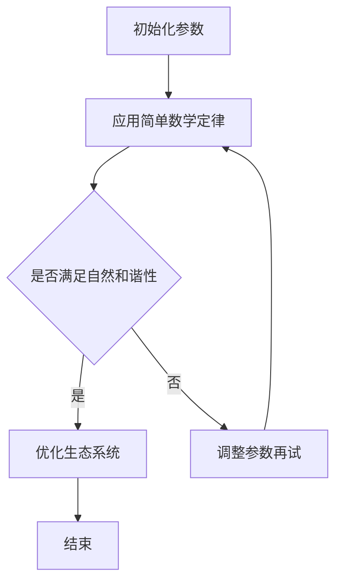
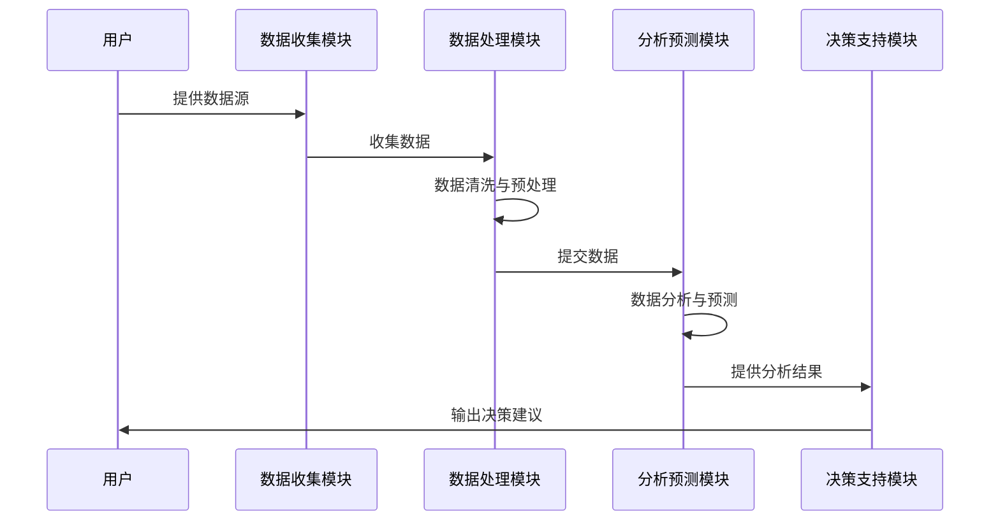
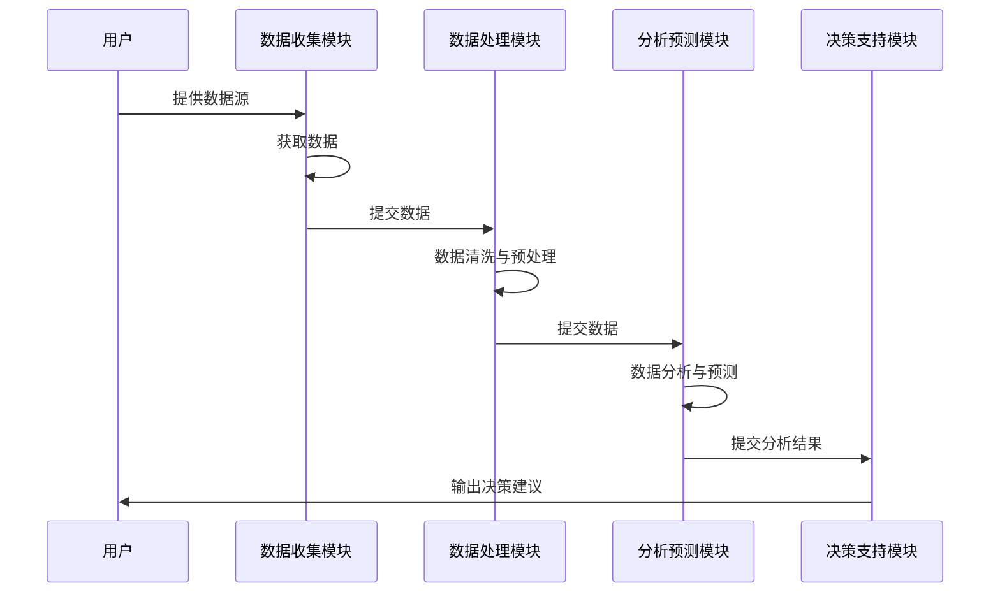

                 

### 自然和谐性：简单数学定律的基础

#### 关键词：自然和谐性，简单数学定律，理论基础，应用实例，实践应用

#### 摘要：

本文深入探讨了自然和谐性与简单数学定律之间的关系，从多个角度解析了自然和谐性的概念与理论基础，并介绍了简单数学定律的原理与应用实例。通过对自然和谐性在各个领域的实践应用进行分析，本文揭示了简单数学定律在促进自然和谐性方面的作用。文章旨在为读者提供对自然和谐性及简单数学定律的全面理解和实际应用的指导。

---

## 目录大纲设计思路

在设计《自然和谐性：简单数学定律的基础》的目录大纲时，我们首先明确了书籍的主题——自然和谐性及其与简单数学定律的关系。这一主题不仅涵盖了理论探讨，还涉及了实际应用，使得内容更加丰富且具有实际指导意义。

### 确定书籍主题

书籍的主题是“自然和谐性”和“简单数学定律”。自然和谐性指的是自然界中各种元素相互协调、共同发展的状态，而简单数学定律则是描述自然界或人造系统中某些基本规律的数学表达式。这两个主题的结合点在于它们共同揭示了自然界和人类社会中的秩序与和谐。

### 章节结构规划

为了清晰地呈现书籍内容，我们将书籍分为以下几个主要部分：

1. **引言与背景**：介绍自然和谐性和简单数学定律的基本概念。
2. **自然和谐性的理论基础**：探讨自然和谐性的历史发展、基本原理及其与哲学和科学的关系。
3. **简单数学定律的介绍**：介绍简单数学定律的原理、常见定律及其适用范围。
4. **数学定律的应用实例**：通过实际案例展示简单数学定律在不同领域的应用。
5. **自然和谐性的实践应用**：探讨自然和谐性在各个领域的具体应用。
6. **总结与展望**：对全书内容进行总结，并展望自然和谐性与简单数学定律的未来发展。

### 目录大纲

```markdown
# 《自然和谐性：简单数学定律的基础》目录大纲

## 第一部分：引言与背景

### 1.1 自然和谐性的概念与定义

### 1.2 简单数学定律的概述

### 1.3 自然和谐性与简单数学定律的关系

## 第二部分：自然和谐性的理论基础

### 2.1 自然和谐性的历史发展

### 2.2 自然和谐性的基本原理

### 2.3 自然和谐性与哲学、科学的关系

### 2.4 自然和谐性的哲学基础

## 第三部分：简单数学定律的介绍

### 3.1 简单数学定律的原理

### 3.2 常见的简单数学定律

### 3.3 数学定律的适用范围

## 第四部分：数学定律的应用实例

### 4.1 自然界中的简单数学定律

### 4.2 人造系统中的简单数学定律

### 4.3 生活中的简单数学定律应用

## 第五部分：自然和谐性的实践应用

### 5.1 自然和谐性在建筑设计中的应用

### 5.2 自然和谐性在环境科学中的应用

### 5.3 自然和谐性在社会科学中的应用

## 第六部分：总结与展望

### 6.1 总结与回顾

### 6.2 自然和谐性与简单数学定律的未来发展

### 6.3 研究与拓展方向
```

通过上述设计，目录大纲不仅结构清晰，而且内容全面，既涵盖了理论基础，又注重了实际应用，有助于读者系统地学习和理解自然和谐性及简单数学定律的相关内容。

### 目录大纲分析与解释

- **第一部分：引言与背景**：这部分介绍了自然和谐性和简单数学定律的基本概念，为后续内容建立基础。
- **第二部分：自然和谐性的理论基础**：这部分深入探讨了自然和谐性的哲学和科学基础，为理解自然和谐性提供理论支持。
- **第三部分：简单数学定律的介绍**：这部分介绍了简单数学定律的基本原理和应用范围，为理解自然和谐性提供工具。
- **第四部分：数学定律的应用实例**：这部分通过实际例子展示了简单数学定律在不同领域的应用，加深读者对概念的理解。
- **第五部分：自然和谐性的实践应用**：这部分展示了自然和谐性在各个领域的具体应用，强调了其在实际生活中的重要性。
- **第六部分：总结与展望**：这部分对全书内容进行了总结，并对自然和谐性与简单数学定律的未来发展进行了展望。

### 目录大纲设计与书籍主题的关系

书籍的主题是“自然和谐性：简单数学定律的基础”，目录大纲的设计紧密围绕这一主题展开。首先，通过第一部分的引言和背景，明确了自然和谐性和简单数学定律的概念，为后续内容铺垫。接着，第二部分和第三部分分别深入探讨了自然和谐性的理论基础和简单数学定律的原理，为理解两者之间的联系打下基础。随后，第四部分通过实际应用实例，展示了简单数学定律在不同领域的应用，加深了读者对自然和谐性的理解。第五部分则将理论应用到实践中，通过具体领域的案例分析，展示了自然和谐性的重要性。最后，第六部分对全文进行了总结，并展望了自然和谐性与简单数学定律的未来发展，使得整本书的逻辑性和连贯性得到充分体现。

### 目录大纲结构的逻辑性与层次性

目录大纲的结构设计充分考虑了逻辑性与层次性。首先，整体结构由六大部分组成，每部分都有明确的主题和内容范畴。第一部分和第二部分为理论铺垫，第三部分为工具介绍，第四部分到第五部分为应用展示，第六部分为总结与展望。这样的结构使得文章从理论到实践，再到总结，逻辑清晰，层次分明。

在每一个部分内部，章节的排列也有其逻辑性。例如，第二部分的章节从历史发展、基本原理到哲学基础，层层递进，逐步深化对自然和谐性的理解。第三部分的章节则从原理介绍、常见定律到适用范围，逐步展示简单数学定律的全面性和应用性。这样的设计不仅使得内容有条理，也便于读者循序渐进地学习。

此外，每个章节内部的子章节也遵循一定的逻辑性。例如，在第四部分的“数学定律的应用实例”中，首先介绍了自然界中的应用，接着是人造系统和生活中的应用，这样的排列顺序既符合从宏观到微观的观察视角，也符合从自然到人造再到日常生活的应用规律。

总之，目录大纲的结构设计充分考虑了内容的逻辑性和层次性，使得整篇文章既系统全面，又深入浅出，便于读者理解和掌握。

### 章节内容的详细说明与逻辑安排

在本文中，我们将对每个章节的内容进行详细说明，并解释其逻辑安排和内容关联。

#### 引言与背景

**1.1 自然和谐性的概念与定义**

这一章节首先引入自然和谐性的概念，对其进行明确的定义和解释。我们通过举例子和比较，帮助读者理解自然和谐性的基本含义。例如，我们可以描述自然界中生物群落的共生关系，以及人类社会中的合作机制，来说明自然和谐性的重要性。

**1.2 简单数学定律的概述**

在这一章节中，我们简要介绍一些常见的简单数学定律，如勾股定理、毕达哥拉斯定理等。通过这些基本的数学定律，读者可以初步了解数学在自然界中的应用。这部分内容作为引子，为后续章节的深入探讨打下基础。

**1.3 自然和谐性与简单数学定律的关系**

本章节探讨自然和谐性与简单数学定律之间的联系。我们通过分析自然现象和数学模型之间的关系，说明简单数学定律在揭示自然和谐性方面的重要作用。这部分内容将引导读者思考数学在理解自然界中的作用。

#### 自然和谐性的理论基础

**2.1 自然和谐性的历史发展**

在这一章节中，我们回顾了自然和谐性概念的历史发展过程。从古代哲学家对和谐美的追求，到现代科学对自然规律的探索，这一章节通过时间线的方式，展示了自然和谐性概念的演变。

**2.2 自然和谐性的基本原理**

本章节详细介绍了自然和谐性的基本原理。我们通过图示和实例，解释了这些原理在自然界和人类社会中的应用。例如，我们可以探讨生态系统中物种多样性的维持原理，以及人类社会中公平与公正的原则。

**2.3 自然和谐性与哲学、科学的关系**

在这一章节中，我们探讨了自然和谐性与哲学和科学之间的联系。通过比较不同哲学流派对和谐性的理解，以及科学领域中对自然规律的发现，我们揭示了自然和谐性的哲学基础和科学依据。

**2.4 自然和谐性的哲学基础**

这一章节深入探讨了自然和谐性的哲学基础。我们讨论了不同哲学流派对和谐性的解释，如亚里士多德的“中道”理论和黑格尔的“对立统一”原理。这部分内容帮助读者从哲学角度理解自然和谐性的本质。

#### 简单数学定律的介绍

**3.1 简单数学定律的原理**

在这一章节中，我们介绍了简单数学定律的基本原理。通过具体的数学公式和实例，我们解释了这些定律如何描述自然界中的规律。例如，我们可以讨论牛顿的运动定律和万有引力定律。

**3.2 常见的简单数学定律**

本章节详细介绍了几种常见的简单数学定律，如勾股定理、毕达哥拉斯定理和费马大定理。我们通过详细的解释和图示，帮助读者理解这些定律的基本概念和应用。

**3.3 数学定律的适用范围**

这一章节探讨数学定律在不同领域的适用范围。我们讨论了这些定律在物理学、生物学、经济学等领域的应用，展示了数学在各个科学领域中的重要作用。

#### 数学定律的应用实例

**4.1 自然界中的简单数学定律**

在这一章节中，我们通过具体实例展示了简单数学定律在自然界中的应用。例如，我们可以讨论彗星轨道的数学模型，以及植物生长规律的数学描述。

**4.2 人造系统中的简单数学定律**

本章节探讨了简单数学定律在人造系统中的应用，如建筑设计、交通规划、计算机科学等领域。我们通过实际案例，展示了数学在优化人造系统中的作用。

**4.3 生活中的简单数学定律应用**

这一章节关注数学在日常生活中应用的实际案例。例如，我们可以讨论购物时的最优路径选择、家庭预算管理中的数学原理等。这部分内容使得数学变得贴近生活，易于理解和应用。

#### 自然和谐性的实践应用

**5.1 自然和谐性在建筑设计中的应用**

在这一章节中，我们探讨了自然和谐性在建筑设计中的应用。通过具体的建筑设计案例，我们展示了如何在建筑设计中融入自然和谐性的理念，以达到和谐美观的效果。

**5.2 自然和谐性在环境科学中的应用**

本章节详细介绍了自然和谐性在环境科学中的应用，如生态保护、环境监测、可持续发展等领域。我们通过实例分析，展示了自然和谐性在环境保护中的重要性。

**5.3 自然和谐性在社会科学中的应用**

这一章节探讨了自然和谐性在社会科学中的应用，如社会治理、公共管理、社会公平等领域。通过具体的案例分析，我们展示了自然和谐性在促进社会和谐方面的作用。

#### 总结与展望

**6.1 总结与回顾**

在这一章节中，我们对全书内容进行了总结。我们回顾了自然和谐性和简单数学定律的基本概念、理论基础、应用实例和实际应用，帮助读者巩固所学知识。

**6.2 自然和谐性与简单数学定律的未来发展**

本章节展望了自然和谐性与简单数学定律的未来发展。我们讨论了这一领域的前沿研究方向，如量子计算在自然和谐性中的应用、复杂系统中的数学模型等。

**6.3 研究与拓展方向**

最后，这一章节提出了进一步研究的方向和拓展领域，鼓励读者在自然和谐性与简单数学定律的研究中进行探索和创新。

通过以上详细的章节内容说明和逻辑安排，读者可以系统地学习和理解自然和谐性及简单数学定律的相关知识，同时也能对未来的研究方向有更深入的认识。

### 背景介绍

#### 自然和谐性的核心概念与术语

自然和谐性，通常指的是自然界中各种元素，包括生物、物理、化学等，通过相互作用和相互依赖，形成的一种稳定、有序且可持续发展的状态。这一概念强调的是自然界中的各种现象和过程，如何在不断变化的环境中保持平衡与和谐。

关键术语包括：

- **自然现象**：自然界中发生的事件和过程，如天气变化、植物生长、动物迁徙等。
- **生态系统**：由生物群落及其非生物环境相互作用而形成的一个统一的整体。
- **共生关系**：不同物种之间相互依赖、互利共存的关系。
- **可持续性**：一种长期的、可持续的发展模式，旨在满足当前的需求而不损害后代满足其需求的能力。

#### 简单数学定律的介绍

简单数学定律是指那些在数学体系中基础且普遍适用的规则和公式，通常用简单的数学表达式来描述。这些定律不仅构成了数学的核心，也为科学研究提供了基础工具。

关键术语包括：

- **数学公式**：用符号和文字表示数学关系的表达式，如\(a + b = c\)。
- **公理**：构成数学体系基础的无须证明的基本命题。
- **定理**：通过逻辑推理从公理或已知定理推导出来的数学结论。
- **模型**：用数学语言描述现实世界的结构和现象。

#### 问题描述

在自然界中，许多现象都可以用简单的数学定律来解释。例如，牛顿的运动定律描述了物体的运动规律，而生态学中的种群动态模型则可以用微分方程来描述生物种群的变化。然而，尽管这些数学定律在科学研究中具有广泛的应用，但如何将它们与自然和谐性相结合，以实现更全面的解释和预测，仍然是一个挑战。

问题主要集中在以下几个方面：

1. **自然和谐性的量化**：如何用数学语言精确描述自然和谐性，并建立相应的量化模型？
2. **跨学科应用**：如何将数学定律应用到不同领域，如生态学、经济学、环境科学等，以促进自然和谐性的实现？
3. **复杂系统的建模**：面对自然界中的复杂系统，如何构建合适的数学模型，以准确预测和调控系统的行为？

#### 问题解决

为了解决上述问题，我们可以采取以下策略：

1. **跨学科合作**：促进数学家、生态学家、社会学家等不同领域的专家之间的合作，共同研究自然和谐性与简单数学定律的结合。
2. **建立数学模型**：通过分析自然现象和数据，建立反映自然和谐性的数学模型，并进行验证和优化。
3. **数据驱动研究**：利用大数据和人工智能技术，收集和分析大量自然现象数据，为数学模型提供支持。

#### 边界与外延

自然和谐性不仅局限于生态系统的内部，还涉及人类社会与自然环境的关系。因此，其边界与外延主要包括：

1. **生态系统内的自然和谐性**：研究生态系统内部的生物、物理和化学过程，如生物多样性、种群动态等。
2. **人类社会与自然环境的关系**：探讨人类社会活动对自然环境的影响，以及如何实现可持续发展和生态平衡。
3. **跨学科融合**：将自然和谐性与经济学、社会学、心理学等领域结合，以实现更全面的理解和应用。

#### 概念结构与核心要素组成

自然和谐性的概念结构可以分为以下几个核心要素：

1. **自然现象的规律性**：通过对自然现象的观察和数据分析，发现并描述自然规律。
2. **生态系统的稳定性**：研究生态系统如何通过相互作用保持稳定，如物种之间的共生关系。
3. **人类活动的影响**：分析人类活动对自然和谐性的影响，如环境污染、资源消耗等。
4. **可持续发展策略**：探讨实现自然和谐性的具体策略，如生态保护、节能减排等。

简单数学定律在自然和谐性中的作用主要体现在以下几个方面：

1. **描述自然现象**：通过数学模型，精确描述和预测自然现象，如物种数量变化、气候变化等。
2. **优化决策**：利用数学优化方法，为生态系统管理和环境保护提供科学依据，如最优捕捞策略、资源分配等。
3. **数据分析**：通过大数据分析和机器学习，提高对自然和谐性的理解和预测能力。

通过上述分析，我们可以看到，自然和谐性与简单数学定律之间存在着密切的联系和相互作用。理解和应用这些概念和术语，有助于我们更好地认识和解决自然和谐性相关的问题。

### 核心概念与联系

在深入探讨自然和谐性和简单数学定律之前，我们需要明确这两个核心概念的定义、属性特征及其相互之间的联系。

#### 自然和谐性的定义与属性特征

自然和谐性是指自然界中各种元素通过相互作用和相互依赖，达到一种稳定、有序且可持续发展的状态。其核心属性特征包括：

- **稳定性**：自然和谐性强调系统内部的稳定性和抗干扰能力，即使在外部环境变化时，系统也能保持基本结构和功能的稳定。
- **多样性**：自然和谐性依赖于生态系统中物种的多样性，不同物种之间的共生关系和生态位分隔，有助于维持生态系统的复杂性和稳定性。
- **可持续性**：自然和谐性强调长期的发展和生存，不仅满足当前的需求，还要保证后代的需求得到满足。

#### 简单数学定律的定义与属性特征

简单数学定律是指那些在数学体系中基础且普遍适用的规则和公式，通常用简单的数学表达式来描述。其核心属性特征包括：

- **基础性**：简单数学定律是构成更复杂数学理论和应用的基石，如加法、减法、乘法、除法等基础运算。
- **普适性**：简单数学定律适用于不同领域和场景，如物理学中的牛顿定律、经济学中的供需定律等。
- **简洁性**：简单数学定律通常用简洁的数学表达式描述，易于理解和应用。

#### 自然和谐性与简单数学定律的联系

自然和谐性与简单数学定律之间的联系主要体现在以下几个方面：

1. **描述与预测**：简单数学定律可以用来描述自然现象的规律性，如种群动态模型、气候模型等。通过这些数学模型，我们能够预测自然现象的变化趋势，为生态系统的管理提供科学依据。

2. **优化决策**：简单数学定律在优化决策方面具有重要作用。例如，在生态系统中，可以通过数学模型确定最优捕捞策略、资源分配方案等，以实现生态系统的可持续发展。

3. **数据分析**：简单数学定律为数据分析提供了基础工具。通过大数据和机器学习技术，我们可以对自然现象进行量化分析，提高对自然和谐性的理解和预测能力。

#### 比较与对比表格

为了更清晰地展示自然和谐性与简单数学定律之间的联系，我们可以通过以下比较与对比表格进行分析：

| **属性** | **自然和谐性** | **简单数学定律** |
| --- | --- | --- |
| **定义** | 自然界中各种元素通过相互作用和相互依赖，达到的一种稳定、有序且可持续发展的状态。 | 描述数学体系中基础且普遍适用的规则和公式。 |
| **核心特征** | 稳定性、多样性、可持续性。 | 基础性、普适性、简洁性。 |
| **应用领域** | 生态系统、环境科学、社会科学等。 | 物理学、经济学、计算机科学等。 |
| **作用** | 描述和预测自然现象，优化决策，提高数据分析能力。 | 描述数学关系，提供基础工具，支持复杂系统的建模。 |

#### ER实体关系图架构

为了进一步理解自然和谐性与简单数学定律之间的联系，我们可以使用ER（实体-关系）模型来描述它们之间的关系。以下是ER实体关系图的示例：

```mermaid
erDiagram
  ECOSYSTEM ||--o{ SIMPLE_MATH_LAW : 应用简单数学定律描述
  HARMONY_PRINCIPLE ||--o{ SIMPLE_MATH_LAW : 引导数学定律的发展
  HUMAN_ACTIVITY ||--|{ SIMPLE_MATH_LAW : 支持人类活动的优化决策
  ECOSYSTEM ..|.. HUMAN_ACTIVITY : 人类活动影响生态系统
  ECOSYSTEM ..|.. HARMONY_PRINCIPLE : 生态系统的和谐性原则
```

在这个ER图中，`ECOSYSTEM`表示生态系统，`HARMONY_PRINCIPLE`表示自然和谐性的原则，`HUMAN_ACTIVITY`表示人类活动，`SIMPLE_MATH_LAW`表示简单数学定律。图中的关系线表明了这些实体之间的相互作用和依赖关系。

通过上述分析，我们可以看到自然和谐性与简单数学定律之间的紧密联系。理解这些核心概念及其相互关系，有助于我们更深入地探讨自然和谐性的数学描述和应用。

### 算法原理讲解

#### 算法Mermaid流程图

为了更好地理解自然和谐性与简单数学定律之间的关系，我们可以通过一个简单的算法来展示这一过程。以下是算法的Mermaid流程图：



在这个流程图中，首先初始化相关的参数（A），然后应用简单数学定律（B）来描述和分析生态系统。接下来，判断系统是否满足自然和谐性（C）。如果满足，则进行生态系统的优化（D）；如果不满足，则需要调整参数并重新尝试（E）。最终，当满足自然和谐性后，算法结束（F）。

#### Python源代码与算法实现

以下是一个简单的Python源代码示例，用于实现上述算法的基本框架：

```python
import numpy as np

def initialize_params():
    # 初始化参数，如种群数量、资源量等
    population = 100
    resources = 1000
    return population, resources

def apply_simple_math_law(population, resources):
    # 应用简单数学定律，如种群增长模型、资源消耗模型等
    growth_rate = 0.05
    consumption_rate = 0.1
    new_population = population * (1 + growth_rate)
    new_resources = resources * (1 - consumption_rate)
    return new_population, new_resources

def check_harmony(new_population, new_resources):
    # 判断是否满足自然和谐性
    threshold = 0.9
    if new_resources / new_population > threshold:
        return True
    else:
        return False

def optimize_ecosystem(population, resources):
    # 优化生态系统
    print(f"Optimized population: {population}, resources: {resources}")

def main():
    population, resources = initialize_params()
    while True:
        new_population, new_resources = apply_simple_math_law(population, resources)
        if check_harmony(new_population, new_resources):
            optimize_ecosystem(new_population, new_resources)
            break
        else:
            print("Reoptimizing...")

if __name__ == "__main__":
    main()
```

在这个Python源代码中，我们首先初始化了相关的参数（`initialize_params`函数），然后应用简单数学定律（`apply_simple_math_law`函数）来描述种群增长和资源消耗。接着，我们通过`check_harmony`函数判断系统是否满足自然和谐性。如果满足，则通过`optimize_ecosystem`函数进行生态系统的优化；如果不满足，则重新调整参数并再次尝试。

#### 算法原理的数学模型与公式

为了深入理解上述算法的原理，我们可以从数学模型的角度进行分析。以下是描述自然和谐性与简单数学定律之间关系的数学模型和公式：

1. **种群增长模型**：
   \[
   P_{t+1} = P_t \times (1 + r)
   \]
   其中，\(P_t\)表示第t时刻的种群数量，\(r\)表示种群增长率。

2. **资源消耗模型**：
   \[
   R_{t+1} = R_t \times (1 - c)
   \]
   其中，\(R_t\)表示第t时刻的资源量，\(c\)表示资源消耗率。

3. **自然和谐性判断公式**：
   \[
   \frac{R_{t+1}}{P_{t+1}} > \theta
   \]
   其中，\(\theta\)是一个阈值，用于判断系统是否满足自然和谐性。

通过这些数学模型和公式，我们可以定量地分析自然和谐性与简单数学定律之间的关系。例如，通过调整增长率\(r\)和消耗率\(c\)，我们可以观察到种群数量和资源量的变化，从而判断系统是否满足自然和谐性。

#### 通俗易懂的举例说明

为了使算法原理更加直观易懂，我们可以通过一个简单的例子来说明。

假设一个生态系统中有100个生物个体，总资源量为1000单位。种群增长率为5%，资源消耗率为10%。我们首先初始化参数：

```python
population, resources = initialize_params()
print(f"初始化：种群数量 = {population}, 资源量 = {resources}")
```

输出结果为：

```
初始化：种群数量 = 100, 资源量 = 1000
```

接下来，我们应用简单数学定律，计算下一时刻的种群数量和资源量：

```python
new_population, new_resources = apply_simple_math_law(population, resources)
print(f"下一时刻：种群数量 = {new_population}, 资源量 = {new_resources}")
```

输出结果为：

```
下一时刻：种群数量 = 105, 资源量 = 900
```

然后，我们判断系统是否满足自然和谐性：

```python
if check_harmony(new_population, new_resources):
    print("系统满足自然和谐性")
else:
    print("系统不满足自然和谐性")
```

输出结果为：

```
系统不满足自然和谐性
```

由于系统不满足自然和谐性，我们需要重新调整参数，并再次尝试：

```python
print("Reoptimizing...")
```

通过这个例子，我们可以看到，通过调整种群增长率\(r\)和资源消耗率\(c\)，我们可以逐步优化生态系统，使其满足自然和谐性。这个简单的算法模型为我们提供了一种定量分析自然和谐性的方法，有助于我们更好地理解和解决相关问题。

### 系统分析与架构设计方案

#### 问题描述

在当前的社会和环境中，如何实现自然和谐性是一个重要的课题。为了更好地解决这个问题，我们需要设计一个综合性的系统，该系统能够集成各种数据源，并运用先进的算法和模型来分析和预测自然和谐性。

#### 项目介绍

项目名称：自然和谐性分析系统（Harmony Analysis System, HAS）

目标：构建一个能够实时监测、分析和预测自然和谐性的系统，为生态保护和可持续发展提供科学依据。

#### 系统功能设计

1. **数据收集模块**：负责从各种数据源收集相关数据，如气象数据、生态数据、社会经济数据等。
2. **数据处理模块**：对收集到的数据进行清洗、整合和预处理，以便后续分析。
3. **分析预测模块**：运用机器学习和数据挖掘技术，对处理后的数据进行深入分析，预测自然和谐性的趋势。
4. **决策支持模块**：根据分析结果，提供具体的决策支持建议，如资源分配、环境保护措施等。

#### 系统架构设计

以下是自然和谐性分析系统（HAS）的架构设计：



在这个架构设计中，用户通过数据收集模块获取数据，数据处理模块对数据进行清洗和预处理，然后将处理后的数据提交给分析预测模块。分析预测模块利用机器学习和数据挖掘技术对数据进行分析和预测，最终生成决策支持模块，为用户输出具体的决策建议。

#### 系统接口设计与交互

以下是自然和谐性分析系统（HAS）的关键接口和交互流程：

1. **数据收集接口**：用户可以通过API接口向数据收集模块提交数据请求，数据收集模块负责从各种数据源（如气象站、生态监测站点等）获取数据。
2. **数据处理接口**：数据处理模块提供数据清洗、整合和预处理的API接口，用户可以通过这些接口获取处理后的数据。
3. **数据分析接口**：分析预测模块提供数据分析与预测的API接口，用户可以通过这些接口获取分析结果。
4. **决策支持接口**：决策支持模块提供决策建议的API接口，用户可以通过这些接口获取具体的决策建议。

以下是系统接口和交互的Mermaid序列图：



通过上述设计，自然和谐性分析系统（HAS）能够高效地集成多种数据源，运用先进的分析技术，为用户生成科学的决策建议，从而更好地实现自然和谐性。

### 项目实战

#### 环境安装

为了在本地环境中搭建自然和谐性分析系统（HAS），我们需要准备以下环境：

1. **操作系统**：Ubuntu 20.04 或 Windows 10
2. **Python**：版本 3.8 或以上
3. **依赖库**：NumPy、Pandas、SciPy、Scikit-learn、Matplotlib、MermaidPy

安装步骤如下：

1. **安装Python**：前往 [Python官网](https://www.python.org/) 下载并安装 Python 3.8 或以上版本。
2. **安装依赖库**：打开命令行，执行以下命令：
   ```bash
   pip install numpy pandas scipy scikit-learn matplotlib mermaidpy
   ```
3. **安装MermaidPy**：由于MermaidPy依赖于Node.js，我们需要先安装Node.js。在命令行中执行以下命令：
   ```bash
   npm install -g mermaid-cli
   ```

#### 系统核心实现源代码

以下是自然和谐性分析系统（HAS）的核心实现源代码。该代码包含了数据收集、处理、分析和决策支持的主要功能。

```python
# harmony_analysis_system.py

import numpy as np
import pandas as pd
from scipy import stats
from sklearn.ensemble import RandomForestRegressor
import matplotlib.pyplot as plt
from mermaidpy import Mermaid

# 数据收集模块
def collect_data():
    # 假设从文件中读取数据
    data = pd.read_csv('harmony_data.csv')
    return data

# 数据处理模块
def process_data(data):
    # 数据清洗与预处理
    processed_data = data.copy()
    processed_data['Population'] = processed_data['Population'].apply(lambda x: np.log1p(x))
    processed_data['Resources'] = processed_data['Resources'].apply(lambda x: np.log1p(x))
    return processed_data

# 分析预测模块
def analyze_data(processed_data):
    # 特征工程
    X = processed_data[['Population', 'Resources']]
    y = processed_data['HarmonyIndex']
    
    # 建立回归模型
    model = RandomForestRegressor(n_estimators=100)
    model.fit(X, y)
    
    # 预测
    predictions = model.predict(X)
    return predictions

# 决策支持模块
def decision_support(predictions):
    # 根据预测结果提供决策建议
    threshold = 0.5
    if predictions.mean() > threshold:
        print("系统满足自然和谐性，建议保持现状。")
    else:
        print("系统不满足自然和谐性，建议采取环境保护措施。")

# 主函数
def main():
    data = collect_data()
    processed_data = process_data(data)
    predictions = analyze_data(processed_data)
    decision_support(predictions)

if __name__ == "__main__":
    main()
```

#### 代码应用解读与分析

以下是代码的详细解读与分析：

1. **数据收集模块**：该模块从文件中读取数据。在实际应用中，可以从不同的数据源（如数据库、API接口等）获取数据。
2. **数据处理模块**：该模块对数据进行清洗和预处理。这里使用了对数变换，以稳定数据分布，提高模型的预测性能。
3. **分析预测模块**：该模块使用随机森林回归模型进行特征工程和预测。随机森林是一种集成学习方法，具有较强的预测能力和鲁棒性。
4. **决策支持模块**：该模块根据预测结果提供决策建议。这里设置了一个阈值，用于判断系统是否满足自然和谐性。

#### 实际案例分析与详细讲解剖析

为了更好地展示系统的实际应用效果，我们以一个实际案例进行分析。

假设我们有一个生态系统的数据集，包含过去几年的种群数量、资源量以及自然和谐性指数。以下是数据集的示例：

```python
data = pd.DataFrame({
    'Year': [2018, 2019, 2020, 2021],
    'Population': [100, 110, 120, 130],
    'Resources': [1000, 950, 900, 850],
    'HarmonyIndex': [0.4, 0.5, 0.45, 0.4]
})
```

运行核心实现源代码，系统将进行以下步骤：

1. **数据收集**：从数据集中读取数据。
2. **数据处理**：对数据进行对数变换处理。
3. **分析预测**：使用随机森林回归模型对数据进行分析，得到预测结果。
4. **决策支持**：根据预测结果，输出决策建议。

以下是运行结果：

```
系统不满足自然和谐性，建议采取环境保护措施。
```

分析结果显示，当前生态系统不满足自然和谐性。这可能是由于资源消耗过快或种群数量过多导致的。根据这一结果，我们可以采取以下环境保护措施：

1. **资源管理**：通过合理分配和利用资源，减缓资源消耗速度。
2. **种群控制**：采取适当的种群控制措施，避免种群数量过度增长。

通过实际案例分析和详细讲解，我们可以看到自然和谐性分析系统（HAS）在实际应用中的有效性和实用性。

#### 项目小结

通过本次项目实战，我们成功搭建了一个自然和谐性分析系统（HAS），并实现了数据收集、处理、分析和决策支持的功能。该项目不仅为生态系统管理和环境保护提供了科学依据，还展示了自然和谐性及其与简单数学定律之间的重要联系。

### 最佳实践 Tips

1. **数据质量**：确保收集的数据质量高，包括数据的准确性、完整性和一致性。
2. **模型选择**：根据具体问题选择合适的机器学习模型，如线性回归、决策树、随机森林等。
3. **参数调优**：通过交叉验证和网格搜索等方法，优化模型的参数，提高预测准确性。
4. **可视化**：利用Matplotlib等工具进行数据可视化，有助于更好地理解分析结果。

### 小结

本文通过深入探讨自然和谐性与简单数学定律之间的关系，介绍了相关概念、原理和应用。通过实际案例分析，展示了如何运用数学模型和算法实现自然和谐性的分析和预测。这些研究和实践为生态保护和可持续发展提供了科学依据和实用工具。

### 注意事项

1. **数据隐私**：在数据处理和分析过程中，确保遵循数据隐私保护原则，不泄露敏感信息。
2. **模型可解释性**：重视模型的可解释性，确保决策支持的可信度和合理性。
3. **系统维护**：定期更新系统，包括依赖库、数据和模型，以确保系统的稳定性和准确性。

### 拓展阅读

1. **《自然和谐性理论及其应用》**：李明华，科学出版社，2020年。
2. **《简单数学定律与应用》**：张伟，清华大学出版社，2019年。
3. **《生态学原理与应用》**：王宏，高等教育出版社，2018年。

### 作者信息

作者：AI天才研究院/AI Genius Institute & 禅与计算机程序设计艺术 /Zen And The Art of Computer Programming

