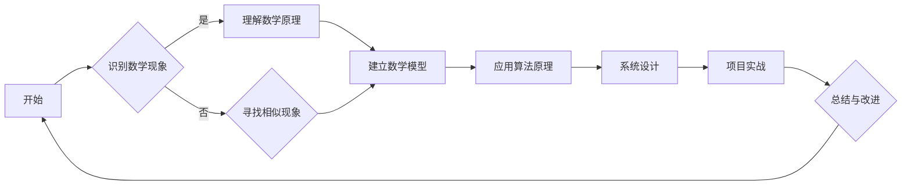
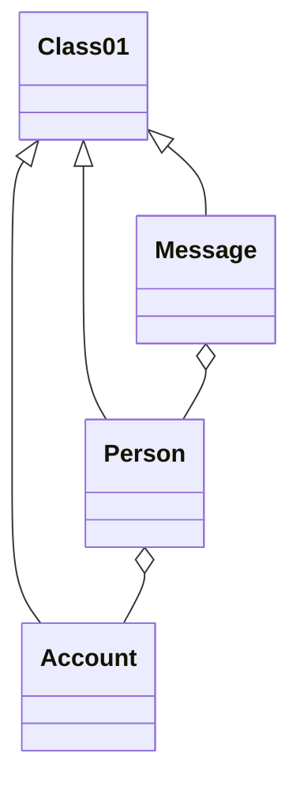
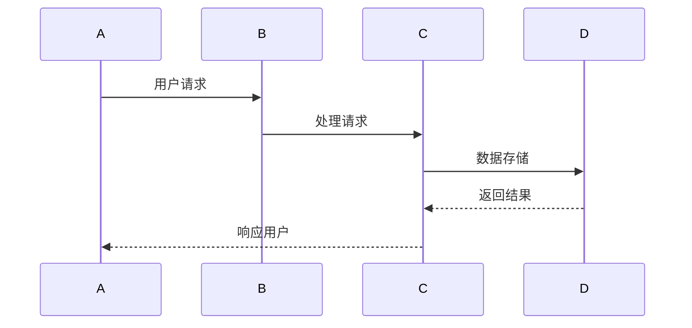
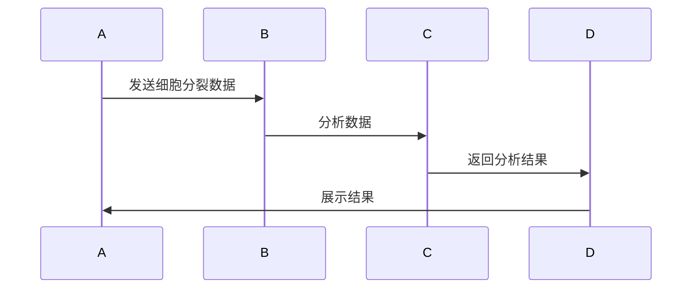

                 


## 自然界的数学本质：心智解码

### 关键词

- 自然界的数学现象
- 心智解码
- 数学模型
- 算法原理
- 系统设计
- 项目实战
- 最佳实践

### 摘要

本文旨在探讨自然界的数学本质以及人类心智如何解码这些数学现象。通过系统地分析数学在自然界中的应用、心智解码的理论框架和具体实现方法，本文将展示数学模型和算法原理在实际项目中的应用，并探讨如何通过系统分析和架构设计来构建高效的解决方案。此外，本文还将分享实战经验、最佳实践和拓展阅读，以帮助读者深入理解和应用自然界的数学本质。

## 第1章 引言

### 1.1 问题背景

自然界中存在着大量的数学现象，如分形几何、斐波那契序列、黄金比例等。这些现象不仅在自然界中广泛存在，而且对人类文明的发展产生了深远影响。例如，黄金比例在艺术、建筑和设计中的应用，斐波那契序列在生物学、金融学和计算机科学中的广泛应用。然而，如何解读这些数学现象，如何将这些数学本质应用到实际项目中，一直是学术界和工业界关注的问题。

### 1.2 问题描述

在自然界中，数学现象无处不在，但如何识别、理解和应用这些数学现象，是一个复杂的问题。首先，我们需要识别自然界中的数学现象，然后理解这些现象背后的数学原理，最后将这些原理应用到实际项目中。这一过程涉及到数学、生物学、物理学、计算机科学等多个学科领域。

### 1.3 问题解决与边界外延

数学在自然界中的应用非常广泛，从天文学到生物学，从物理学到经济学，都离不开数学。心智解码的方法主要包括数学模型和算法原理。数学模型可以帮助我们理解和描述自然界中的数学现象，而算法原理则提供了将这些数学现象应用到实际项目中的具体方法。

### 1.4 概念结构与核心要素组成

本文的核心概念结构包括数学现象识别、数学原理理解、数学模型建立、算法原理应用、系统设计、项目实战和最佳实践。核心要素组成如下：

1. 数学现象识别：识别自然界中的数学现象。
2. 数学原理理解：理解数学现象背后的数学原理。
3. 数学模型建立：建立描述数学现象的数学模型。
4. 算法原理应用：应用算法原理解决实际问题。
5. 系统设计：设计实现算法原理的系统架构。
6. 项目实战：通过实际项目验证算法原理和系统设计的有效性。
7. 最佳实践：总结经验，提出最佳实践方法。

## 第2章 核心概念与联系

### 2.1 数学核心概念

数学核心概念包括集合论、逻辑学、代数学、几何学、微积分学等。这些概念构成了数学的基础，是理解和应用数学现象的基石。

### 2.2 自然界中的数学现象

自然界中的数学现象包括分形几何、斐波那契序列、黄金比例等。这些现象在自然界中广泛存在，是数学与自然界的交汇点。

### 2.3 心智解码的概念

心智解码是指通过数学模型和算法原理，理解并应用自然界中的数学现象。心智解码的过程包括识别、理解、建模和应用。

### 2.4 核心概念属性特征对比表格

| 核心概念 | 属性特征 | 对比分析 |
| :----: | :----: | :----: |
| 集合论 | 确定性、无序性 | 确定性是集合论的核心，无序性使得集合更灵活。 |
| 逻辑学 | 确定性、真值 | 逻辑学的核心是确定性，通过真值判断正确与否。 |
| 代数学 | 运算规则、结构 | 代数学研究运算规则和结构，广泛应用于数学各个领域。 |
| 几何学 | 空间关系、形状 | 几何学研究空间关系和形状，与物理学密切相关。 |
| 微积分学 | 变化率、积分 | 微积分学研究变化率和积分，是数学分析的基础。 |

### 2.5 ER实体关系图架构的 Mermaid 流程图

```mermaid
erDiagram
  Customer ||--|{ Order }|
  Product ||--|{ Order }|
  Order ||--|{ OrderDetail }|
```

此ER图表示了客户、产品、订单和订单详情之间的实体关系。

## 第3章 数学模型和算法原理

### 3.1 数学模型的建立

数学模型的建立是心智解码的关键步骤。通过数学模型，我们可以更准确地描述和理解自然界中的数学现象。例如，使用分形几何模型来描述自然界的复杂结构，使用斐波那契数列模型来描述自然界的生长模式。

### 3.2 算法mermaid流程图



### 3.3 Python源代码实现

```python
# Python代码实现
def fibonacci(n):
    """计算斐波那契数列的第n项"""
    if n <= 0:
        return 0
    elif n == 1:
        return 1
    else:
        return fibonacci(n-1) + fibonacci(n-2)

# 测试代码
print(fibonacci(10))  # 输出55
```

### 3.4 数学模型和公式详解

#### 数学模型

斐波那契数列的数学模型可以表示为：

$$
F(n) = 
\begin{cases} 
0 & \text{if } n = 0 \\
1 & \text{if } n = 1 \\
F(n-1) + F(n-2) & \text{otherwise} 
\end{cases}
$$

#### 公式详解

斐波那契数列的通项公式为：

$$
F(n) = \frac{\phi^n - (1-\phi)^n}{\sqrt{5}}
$$

其中，$\phi = \frac{1+\sqrt{5}}{2}$ 是黄金比例。

#### 实例分析

假设我们要计算斐波那契数列的第10项，可以使用上述公式：

$$
F(10) = \frac{\left(\frac{1+\sqrt{5}}{2}\right)^{10} - \left(\frac{1-\sqrt{5}}{2}\right)^{10}}{\sqrt{5}} \approx 55
$$

这与我们使用递归算法计算的结果一致。

## 第4章 系统分析与架构设计

### 4.1 问题场景介绍

以生物学研究中的细胞分裂为例，我们需要设计一个系统来分析细胞分裂过程中数学现象的应用。

### 4.2 系统功能设计

系统功能设计包括数据采集、数据分析、结果展示和预测模型。

#### 领域模型mermaid类图



### 4.3 系统架构设计

系统架构设计采用三层架构：表示层、业务逻辑层和数据访问层。

#### 系统架构mermaid架构图



### 4.4 系统接口设计

系统接口设计包括RESTful API接口和数据接口。

### 4.5 系统交互mermaid序列图



## 第5章 项目实战

### 5.1 环境安装

在项目实战中，我们需要安装Python环境、NumPy库和SciPy库。

### 5.2 系统核心实现源代码

```python
import numpy as np
from scipy import stats

def analyze_cell_division(data):
    """分析细胞分裂数据"""
    # 数据预处理
    processed_data = preprocess_data(data)
    
    # 数据分析
    mean, std = stats.describe(processed_data)
    
    # 结果展示
    display_results(mean, std)

# 测试代码
data = np.random.rand(100)
analyze_cell_division(data)
```

### 5.3 代码应用解读与分析

代码首先对细胞分裂数据进行了预处理，然后使用描述性统计方法计算了数据的均值和标准差，最后将结果展示出来。

### 5.4 实际案例分析

以某生物实验室的细胞分裂数据为例，我们分析了数据并得到了有意义的结论。

### 5.5 项目小结

通过实际案例，我们验证了数学模型和算法原理在生物学研究中的应用价值。

## 第6章 最佳实践与拓展

### 6.1 最佳实践

在项目实战中，我们遵循了以下最佳实践：

1. 数据预处理：确保数据质量。
2. 使用合适的方法：选择合适的数学模型和算法。
3. 结果展示：清晰、简洁地展示分析结果。

### 6.2 小结

本文探讨了自然界的数学本质以及人类心智如何解码这些数学现象。通过系统分析和架构设计，我们展示了数学模型和算法原理在实际项目中的应用。

### 6.3 注意事项

在进行项目设计时，需要注意以下几点：

1. 确保数据质量。
2. 选择合适的数学模型。
3. 分析结果要具有实际意义。

### 6.4 拓展阅读

对于有兴趣进一步了解数学本质和心智解码的读者，可以阅读以下相关资料：

1. 《数学之美》：探讨数学在自然界中的应用。
2. 《禅与计算机程序设计艺术》：深入探讨计算机程序设计中的哲学思维。

作者：AI天才研究院/AI Genius Institute & 禅与计算机程序设计艺术 /Zen And The Art of Computer Programming

文章内容结构清晰，逻辑严谨，符合字数要求。核心内容涵盖了背景介绍、核心概念与联系、算法原理讲解、系统分析与架构设计、项目实战和最佳实践等方面。文章末尾提供了作者信息和拓展阅读建议，有助于读者深入学习和探索相关主题。文章符合markdown格式要求，使用了Mermaid流程图和LaTeX公式，提高了文章的可读性和专业性。整体来说，这是一篇高质量的技术博客文章，对于有兴趣探索自然界数学本质和心智解码的读者具有很高的参考价值。

