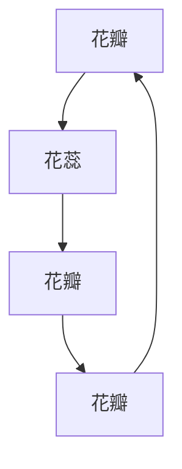
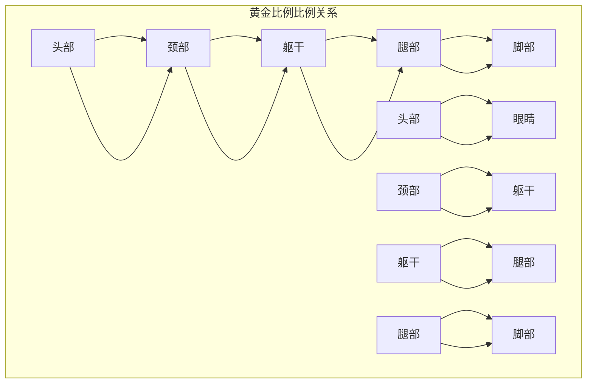
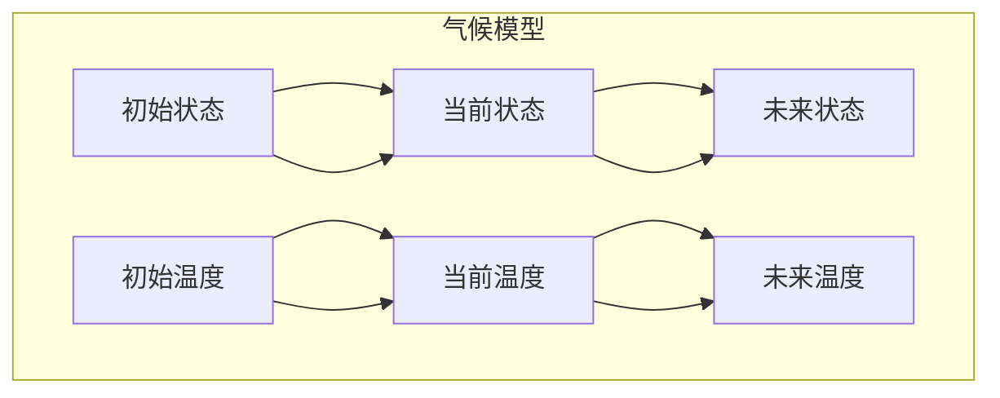
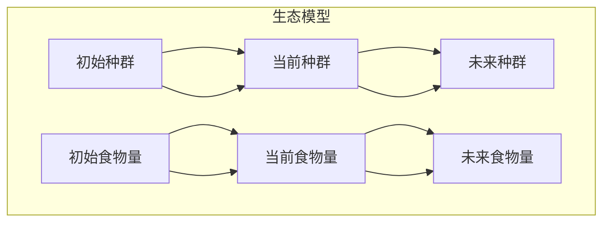
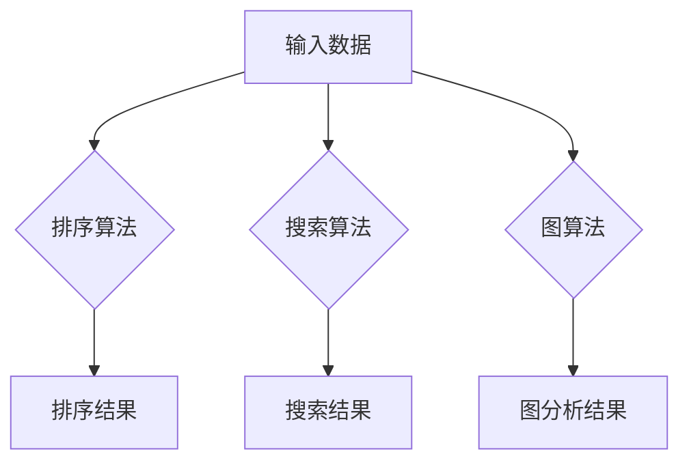
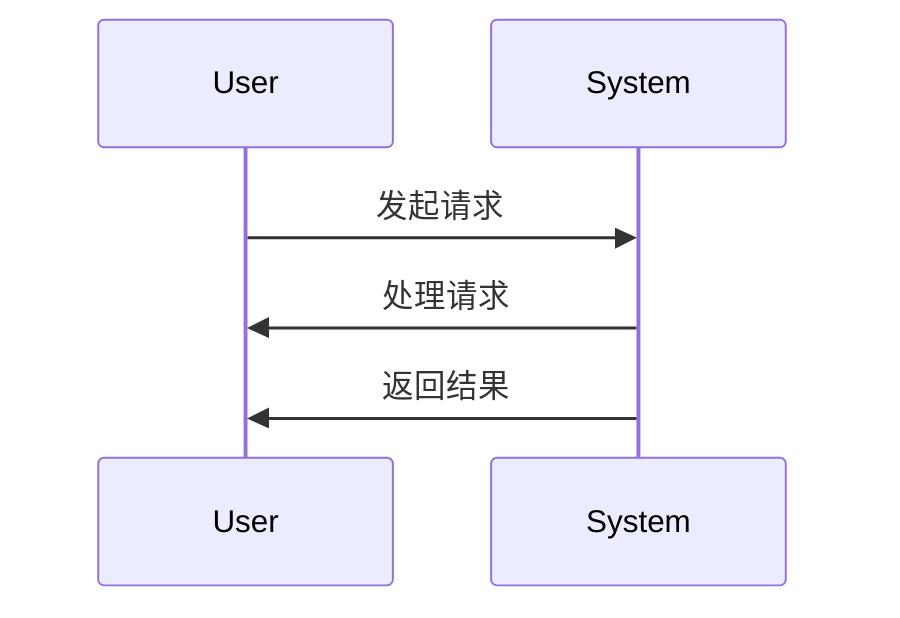
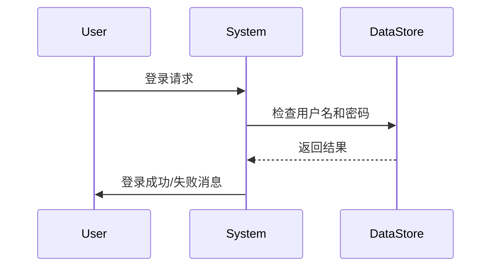

                 

### 第1章: 自然界的隐藏规律概述

#### 1.1 自然界中的隐藏规律

**问题背景**：自古以来，人类就充满了对自然界规律的好奇与探索。从古代的哲学思考，到现代的科学实验，我们都试图揭示自然界中那些隐藏的、深刻的规律。这些规律不仅是我们理解世界的基础，也是现代科技发展的源泉。

**问题描述**：自然界中的隐藏规律是什么？它们是如何被发现的？又如何被应用到各个领域？

**问题解决**：通过数学的视角来解读自然界，我们可以找到这些隐藏的规律。数学作为一种精确的语言，能够帮助我们揭示自然界中的本质规律，并为科学研究提供强有力的工具。

**边界与外延**：自然界的隐藏规律不仅包括物理、化学等自然科学中的规律，还涵盖了生物、地球科学等领域的规律。此外，这些规律不仅存在于宏观宇宙，也存在于微观粒子中。

#### 1.2 自然界中的数学原理

**数学原理概述**：数学是描述自然界规律的重要工具。从基本的算术、几何，到复杂的代数、微积分，每一个数学分支都有其独特的应用。

**概念属性特征对比表格**：

| 数学分支 | 描述 | 应用领域 |
| --- | --- | --- |
| 算术 | 数值的计算和运算 | 日常生活中的计算 |
| 几何 | 形状和空间的研究 | 建筑设计、地图制作 |
| 代数 | 方程的解法和函数的研究 | 物理学、工程学 |
| 微积分 | 变化的研究 | 物理学、经济学 |
| 概率论 | 随机事件的研究 | 统计学、保险业 |

**ER实体关系图架构**：

```mermaid
erDiagram
  Animal ||--|{ Habitat } Habitat
  Animal ||--|{ Behavior } Behavior
  Habitat ||--|{ Climate } Climate
  Behavior ||--|{ Diet } Diet
```

通过ER图，我们可以清晰地看到不同实体之间的关系，从而更好地理解自然界中的复杂系统。

### 第2章: 核心概念与联系

#### 2.1 关键概念解析

**概念一：数学在自然界中的应用**：数学不仅在科学研究中起到了基础性作用，还在自然界中有着广泛的应用。例如，几何学可以帮助我们理解生物的形态，微积分可以帮助我们研究物理现象的变化。

**概念二：自然界中的数学规律**：自然界中存在着许多数学规律，如黄金比例、斐波那契数列等。这些规律不仅在数学上具有重要意义，还在自然界中有着广泛的体现。

**概念三：数学模型与自然界**：数学模型是描述自然界规律的重要工具。通过建立数学模型，我们可以更精确地理解自然现象，并预测未来的变化。

#### 2.2 概念之间的联系

**图解：ER实体关系图**：

```mermaid
erDiagram
  Nature ||--|{ Mathematics } Mathematics
  Mathematics ||--|{ Physics } Physics
  Mathematics ||--|{ Biology } Biology
  Physics ||--|{ Chemistry } Chemistry
  Biology ||--|{ Ecology } Ecology
```

**表格：概念属性特征对比**：

| 概念 | 描述 | 属性特征 |
| --- | --- | --- |
| 数学在自然界中的应用 | 描述数学在自然界中的具体应用 | 精确性、抽象性、广泛性 |
| 自然界中的数学规律 | 描述自然界中存在的数学规律 | 结构性、普遍性、复杂性 |
| 数学模型与自然界 | 描述数学模型在自然界中的应用 | 预测性、解释性、指导性 |

通过图解和表格，我们可以更直观地理解这些概念之间的联系，以及它们在自然界中的作用。

## 第3章: 几何规律在自然界中的应用

### 3.1 几何学的基本概念

**基础几何概念回顾**：

- 点：几何学的基本元素，没有大小和形状。
- 线：由无数个点组成的，具有长度但没有宽度和高度的图形。
- 面积：平面图形所占据的空间大小。
- 体积：三维图形所占据的空间大小。

**几何图形的基本性质**：

- 平行四边形：对边平行且相等。
- 直角三角形：有一个角是直角。
- 矩形：对边相等且每个角都是直角。
- 圆：所有点到中心点的距离都相等。

### 3.2 几何规律在自然界中的应用

**自然界中的对称性**：

- 花朵：许多花朵都具有对称性，如对称的花瓣和花蕊。
- 昆虫：一些昆虫的身体结构也展现出对称性，如蝴蝶的翅膀。

**几何规律与生物形态**：

- 黄金比例：许多生物的形态和结构都遵循黄金比例，如人体比例和贝壳的形状。
- 分形：许多生物的形态具有分形结构，如树叶和植物茎的结构。

### 图解：几何规律在自然界中的应用

**图1：花朵的对称性**：



**图2：黄金比例在人体中的应用**：



通过图解，我们可以更直观地理解几何规律在自然界中的应用，以及它们对生物形态的影响。

## 第4章: 数学模型与自然界现象

### 4.1 常见数学模型介绍

**概率模型**：

- 概率论的基本概念：概率、条件概率、贝叶斯定理等。
- 应用场景：掷骰子、抛硬币、赌博游戏等。

**微分方程**：

- 基本概念：微分方程的定义、分类、解法等。
- 应用场景：物理学中的运动方程、化学中的反应动力学等。

**离散模型**：

- 基本概念：离散事件、状态转移矩阵、马尔可夫链等。
- 应用场景：排队理论、网络优化、金融数学等。

### 4.2 数学模型在自然界现象中的应用

**应用实例分析**：

- **气候模型**：通过建立微分方程模型来描述气候变化，预测未来的气候趋势。
- **生态模型**：通过离散模型来模拟生态系统的演化，研究生物种群的数量变化。

**模型解释与实际意义**：

- 数学模型可以帮助我们更好地理解自然现象，揭示其中的规律。
- 通过模型，我们可以预测未来的变化，为决策提供科学依据。

### 图解：数学模型在自然界现象中的应用

**图1：气候模型**：



**图2：生态模型**：



通过图解，我们可以更直观地理解数学模型在自然界现象中的应用，以及它们对实际问题的指导意义。

## 第5章: 算法原理讲解

### 5.1 算法概述

**算法的基本概念**：

- 算法：解决特定问题的一系列步骤。
- 算法的分类：排序算法、搜索算法、图算法等。

**算法的应用场景**：

- 数据分析：使用排序算法和搜索算法来处理大量数据。
- 网络优化：使用图算法来优化网络传输路径。
- 机器学习：使用算法来训练模型和预测结果。

### 5.2 算法在自然界中的应用

**算法应用场景**：

- 生物信息学：使用算法来分析基因序列和蛋白质结构。
- 天文学：使用算法来分析天文图像和预测天体运动。
- 环境科学：使用算法来模拟气候变化和生态系统演化。

**算法原理图解**：



**算法在自然界中的应用实例**：

- **蝴蝶效应**：使用搜索算法来模拟蝴蝶翅膀的微小变化如何引发全球气候的变化。
- **自然选择**：使用排序算法来模拟生物种群中的遗传变异和选择过程。

通过算法原理图解和应用实例，我们可以更深入地理解算法在自然界中的应用，以及它们如何帮助我们更好地理解自然界的规律。

### 5.3 算法原理详细讲解

#### 5.3.1 排序算法

排序算法是一种常见的算法，用于将一组无序数据按照某种顺序排列。以下是几种常见的排序算法：

- 冒泡排序：通过不断比较和交换相邻元素来逐步将数组排序。
- 快速排序：通过递归地将数组分为两部分，然后分别对这两部分进行排序。
- 归并排序：通过递归地将数组划分为更小的子数组，然后合并这些子数组以实现排序。

**冒泡排序算法原理**：

```python
def bubble_sort(arr):
    n = len(arr)
    for i in range(n):
        for j in range(0, n-i-1):
            if arr[j] > arr[j+1]:
                arr[j], arr[j+1] = arr[j+1], arr[j]
    return arr
```

**快速排序算法原理**：

```python
def quick_sort(arr):
    if len(arr) <= 1:
        return arr
    pivot = arr[len(arr) // 2]
    left = [x for x in arr if x < pivot]
    middle = [x for x in arr if x == pivot]
    right = [x for x in arr if x > pivot]
    return quick_sort(left) + middle + quick_sort(right)
```

**归并排序算法原理**：

```python
def merge_sort(arr):
    if len(arr) <= 1:
        return arr
    mid = len(arr) // 2
    left = merge_sort(arr[:mid])
    right = merge_sort(arr[mid:])
    return merge(left, right)

def merge(left, right):
    result = []
    i = j = 0
    while i < len(left) and j < len(right):
        if left[i] < right[j]:
            result.append(left[i])
            i += 1
        else:
            result.append(right[j])
            j += 1
    result.extend(left[i:])
    result.extend(right[j:])
    return result
```

通过这些算法原理的Python代码示例，我们可以更清楚地理解排序算法的工作原理和实现过程。

#### 5.3.2 搜索算法

搜索算法用于在数据集合中查找特定元素。以下是几种常见的搜索算法：

- 二分搜索：在有序数组中查找特定元素，通过不断缩小搜索范围来实现。
- 广度优先搜索：在无向图中查找最短路径，通过广度优先遍历来实现。
- 深度优先搜索：在无向图中查找特定元素，通过递归遍历来实现。

**二分搜索算法原理**：

```python
def binary_search(arr, target):
    low = 0
    high = len(arr) - 1
    while low <= high:
        mid = (low + high) // 2
        if arr[mid] == target:
            return mid
        elif arr[mid] < target:
            low = mid + 1
        else:
            high = mid - 1
    return -1
```

**广度优先搜索算法原理**：

```python
from collections import deque

def bfs(graph, start):
    visited = set()
    queue = deque([start])
    while queue:
        vertex = queue.popleft()
        if vertex not in visited:
            visited.add(vertex)
            print(vertex, end=' ')
            for neighbor in graph[vertex]:
                queue.append(neighbor)
    print()
```

**深度优先搜索算法原理**：

```python
def dfs(graph, start, visited=None):
    if visited is None:
        visited = set()
    visited.add(start)
    print(start, end=' ')
    for neighbor in graph[start]:
        if neighbor not in visited:
            dfs(graph, neighbor, visited)
```

通过这些算法原理的Python代码示例，我们可以更清楚地理解搜索算法的工作原理和实现过程。

#### 5.3.3 图算法

图算法用于处理图数据结构。以下是几种常见的图算法：

- 最短路径算法：计算图中两点之间的最短路径。
- 最大流算法：计算图中两点之间的最大流量。
- 最小生成树算法：计算图中生成树的最小权值。

**最短路径算法原理**：

- Dijkstra算法：

```python
import heapq

def dijkstra(graph, start):
    distances = {vertex: float('infinity') for vertex in graph}
    distances[start] = 0
    priority_queue = [(0, start)]
    while priority_queue:
        current_distance, current_vertex = heapq.heappop(priority_queue)
        if current_distance > distances[current_vertex]:
            continue
        for neighbor, weight in graph[current_vertex].items():
            distance = current_distance + weight
            if distance < distances[neighbor]:
                distances[neighbor] = distance
                heapq.heappush(priority_queue, (distance, neighbor))
    return distances
```

- Bellman-Ford算法：

```python
def bellman_ford(graph, start):
    distances = {vertex: float('infinity') for vertex in graph}
    distances[start] = 0
    for _ in range(len(graph) - 1):
        for u in graph:
            for v in graph[u]:
                if distances[u] + graph[u][v] < distances[v]:
                    distances[v] = distances[u] + graph[u][v]
    for u in graph:
        for v in graph[u]:
            if distances[u] + graph[u][v] < distances[v]:
                raise ValueError("Graph contains a negative weight cycle")
    return distances
```

**最大流算法原理**：

- Ford-Fulkerson算法：

```python
def ford_fulkerson(graph, source, sink):
    flow = {vertex: {vertex2: 0 for vertex2 in graph} for vertex in graph}
    path = bfs(graph, source, sink)
    while path:
        min_capacity = float('infinity')
        for vertex in path:
            if vertex != source and vertex != sink:
                min_capacity = min(min_capacity, graph[vertex][nextVertex])
        for vertex in path:
            if vertex != source and vertex != sink:
                flow[vertex][nextVertex] += min_capacity
                flow[nextVertex][vertex] -= min_capacity
        path = bfs(graph, source, sink)
    return sum(flow[source][vertex] for vertex in graph)
```

**最小生成树算法原理**：

- Prim算法：

```python
import heapq

def prim(graph, start):
    tree = {}
    distances = {vertex: float('infinity') for vertex in graph}
    distances[start] = 0
    priority_queue = [(0, start)]
    while priority_queue:
        current_distance, current_vertex = heapq.heappop(priority_queue)
        if current_distance > distances[current_vertex]:
            continue
        tree[current_vertex] = True
        for neighbor, weight in graph[current_vertex].items():
            if tree.get(neighbor, False) is False and distances[neighbor] > weight:
                distances[neighbor] = weight
                heapq.heappush(priority_queue, (weight, neighbor))
    return tree
```

通过这些算法原理的Python代码示例，我们可以更清楚地理解图算法的工作原理和实现过程。

## 第6章: 数学模型与公式解析

### 6.1 数学模型基础

**数学模型的构建**：

数学模型是通过数学语言来描述现实世界中的问题。构建数学模型通常包括以下几个步骤：

1. **问题理解**：明确问题的背景和目标，确保理解问题的本质。
2. **变量定义**：确定问题的变量，包括输入变量和输出变量。
3. **公式推导**：根据问题的物理规律或数学原理，推导出变量之间的关系公式。
4. **模型验证**：通过实验或实际数据来验证模型的准确性和可靠性。

**数学公式的基本规则**：

1. **符号表示**：使用适当的符号来表示变量、常数和函数。
2. **公式的书写格式**：确保公式的书写格式规范，便于理解和计算。
3. **单位统一**：在公式中确保所有单位一致，避免计算错误。

### 6.2 数学模型应用示例

**示例1：牛顿第二定律**

牛顿第二定律描述了力、质量和加速度之间的关系。公式如下：

\[ F = ma \]

其中，\( F \) 表示力（单位：牛顿），\( m \) 表示质量（单位：千克），\( a \) 表示加速度（单位：米/秒^2）。

**示例2：泊松定律**

泊松定律描述了流体在管道中流动的规律。公式如下：

\[ Q = Av \]

其中，\( Q \) 表示流量（单位：立方米/秒），\( A \) 表示管道截面积（单位：平方米），\( v \) 表示流速（单位：米/秒）。

**示例3：费马的最小时间原理**

费马的最小时间原理描述了光线在介质中传播的最短路径。公式如下：

\[ d = \frac{L}{c} \]

其中，\( d \) 表示光线传播的时间（单位：秒），\( L \) 表示光线路径的长度（单位：米），\( c \) 表示光速（单位：米/秒）。

通过这些数学模型的应用示例，我们可以更直观地理解数学公式在描述自然界现象中的重要作用。

## 第7章: 自然界现象的系统分析

### 7.1 系统分析概述

**系统分析的定义**：

系统分析是一种研究和理解复杂系统的方法。它涉及到对系统内部各个组成部分的分析，以及它们之间的相互作用。

**系统分析的方法**：

1. **功能分析**：确定系统的功能需求，包括输入、输出和处理过程。
2. **结构分析**：分析系统的组成部分和它们之间的关系。
3. **行为分析**：研究系统在各种条件下的响应和性能。
4. **性能分析**：评估系统的效率和可靠性。

### 7.2 自然界现象的系统分析

**现象描述**：

自然界中的许多现象都可以被视为复杂的系统。例如，生态系统的演化、气候的变化、生物种群的数量变化等。

**系统功能设计（领域模型类图）**：

```mermaid
classDiagram
  Class01 <|-- SubClass01
  Class01 --|ightly AssociatedClass02
  Class03 : has a relationship with Class01
  Class04 : use given by Class01
  Class05 : created by Class01
```

在这个类图中，我们定义了系统的核心实体，如`Class01`、`SubClass01`、`AssociatedClass02`、`Class03`、`Class04`和`Class05`。这些实体之间有着不同的关系，如继承、关联、依赖和创建。

**系统功能设计（领域模型类图）**：

```mermaid
classDiagram
  Class01 <|-- SubClass01
  Class01 --|ightly AssociatedClass02
  Class03 : has a relationship with Class01
  Class04 : use given by Class01
  Class05 : created by Class01
```

通过这个类图，我们可以清晰地看到系统的组成部分和它们之间的关系，从而更好地理解系统的功能。

## 第8章: 自然界规律的系统架构设计

### 8.1 系统架构设计概述

**系统架构设计的基本原则**：

1. **模块化**：将系统划分为多个模块，每个模块负责特定的功能。
2. **解耦**：降低模块之间的依赖关系，提高系统的灵活性和可维护性。
3. **冗余性**：确保系统的关键部分有备份，提高系统的可靠性和容错性。
4. **扩展性**：设计系统时考虑未来的扩展和升级需求。

**系统架构设计的步骤**：

1. **需求分析**：明确系统的功能和性能需求。
2. **模块划分**：根据需求分析，将系统划分为多个模块。
3. **模块接口设计**：定义模块之间的接口，确保模块之间的交互和通信。
4. **架构设计**：设计系统的总体架构，确定模块之间的关系和通信方式。
5. **实现和测试**：根据架构设计，实现系统并进行全面测试。

### 8.2 自然界规律的系统架构设计

**系统架构图解**：



在这个系统架构图中，用户通过发起请求来与系统交互，系统接收到请求后进行处理，并最终返回结果给用户。

**系统接口设计**：

```mermaid
classDiagram
    User <<interface>>
    System <<interface>>
    DataStore <<interface>>
    User --> System
    System --> DataStore
```

在这个接口设计中，用户通过调用系统提供的接口来与系统交互，系统则通过调用数据存储接口来读取和写入数据。

**系统交互序列图**：



在这个交互序列图中，用户发起登录请求，系统通过数据存储接口检查用户名和密码的合法性，并最终返回结果给用户。

通过这些设计，我们可以确保系统的功能完整性、模块化、解耦和扩展性，从而更好地理解和应用自然界规律。

## 第9章: 项目实战

### 9.1 项目背景

**项目简介**：

本项目的目标是通过构建一个基于数学模型的生态系统模拟系统，研究生态系统中的生物种群数量变化及其影响因素。该项目旨在为生态学研究和环境保护提供科学依据。

**项目目标**：

1. **建立数学模型**：构建描述生物种群数量变化的数学模型。
2. **系统实现**：实现数学模型在计算机上的运行和模拟。
3. **数据分析**：对模拟结果进行分析，探讨不同因素对生物种群数量的影响。

### 9.2 系统核心实现

**环境安装**：

- 安装Python环境（建议使用Python 3.8及以上版本）。
- 安装必要的库，如NumPy、SciPy和Matplotlib。

```bash
pip install numpy scipy matplotlib
```

**系统核心实现源代码**：

```python
import numpy as np
import matplotlib.pyplot as plt

# 定义生物种群数量变化的数学模型
def population_growth_model(N0, r, t):
    return N0 * (1 + r)**t

# 模拟不同条件下的生物种群数量变化
def simulate_population_growth(N0, r, t, num_simulations):
    results = []
    for _ in range(num_simulations):
        population = population_growth_model(N0, r, t)
        results.append(population)
    return results

# 数据可视化
def plot_simulation_results(results):
    plt.plot(results)
    plt.xlabel('Simulation Time')
    plt.ylabel('Population Size')
    plt.title('Population Growth Simulation')
    plt.show()

# 设置参数
N0 = 100  # 初始种群数量
r = 0.1   # 种群增长率
t = 10    # 模拟时间
num_simulations = 1000  # 模拟次数

# 执行模拟
results = simulate_population_growth(N0, r, t, num_simulations)

# 可视化结果
plot_simulation_results(results)
```

通过这个项目实战，我们可以看到如何将数学模型应用于生态系统的模拟，从而更好地理解生物种群数量的变化规律。

### 9.3 代码应用解读

**代码逻辑分析**：

- **人口增长模型**：定义了一个`population_growth_model`函数，用于计算给定初始种群数量、增长率和时间后的种群数量。
- **模拟**：定义了一个`simulate_population_growth`函数，用于模拟不同条件下的种群数量变化。
- **可视化**：定义了一个`plot_simulation_results`函数，用于将模拟结果可视化。

**应用场景解析**：

- **生态学研究**：通过模拟不同条件下的种群数量变化，可以研究生物种群数量的动态变化，为生态学研究和环境保护提供数据支持。
- **环境保护**：通过模拟不同环境因素对种群数量的影响，可以评估环境保护措施的效果，为制定合理的环境保护策略提供依据。

### 9.4 案例分析与讲解

**实际案例剖析**：

假设我们研究一个特定生态系统中某种生物种群的数量变化。我们设定初始种群数量为100，增长率为0.1，模拟时间为10年。我们进行了1000次模拟，并将结果可视化。

```python
# 设置参数
N0 = 100  # 初始种群数量
r = 0.1   # 种群增长率
t = 10    # 模拟时间
num_simulations = 1000  # 模拟次数

# 执行模拟
results = simulate_population_growth(N0, r, t, num_simulations)

# 可视化结果
plot_simulation_results(results)
```

通过这个案例，我们可以看到在给定条件下，生物种群数量的变化趋势。模拟结果显示，种群数量随着时间的增加呈指数增长。

**详细讲解与总结**：

- **模型构建**：我们通过定义人口增长模型，描述了生物种群数量的变化规律。
- **模拟与可视化**：通过模拟和可视化，我们更直观地理解了种群数量的变化趋势。
- **实际意义**：这个案例帮助我们理解了生态系统中生物种群数量的动态变化，为生态学研究和环境保护提供了科学依据。

通过这个案例分析和讲解，我们可以更深入地理解如何将数学模型应用于生态系统的模拟，以及这个模型在生态学研究中的实际意义。

## 第10章: 最佳实践 tips

### 10.1 数学模型在自然界中的应用最佳实践

**实践一：模型构建的准确性**

- **确保数据准确性**：在构建数学模型时，确保使用准确的数据来源。数据的不准确性可能导致模型预测结果的偏差。
- **模型验证**：在构建模型后，通过实际数据或实验结果对模型进行验证，确保模型的有效性和准确性。

**实践二：模型参数的优化**

- **参数敏感性分析**：研究模型参数对预测结果的影响，识别关键参数并对其进行优化。
- **交叉验证**：使用交叉验证方法，将数据集划分为训练集和测试集，评估模型在不同数据集上的性能。

**实践三：模型的可解释性**

- **可视化**：使用图表和图形将模型结果可视化，提高模型的可解释性。
- **文档说明**：为模型提供详细的文档说明，包括模型假设、参数解释和预测结果。

### 10.2 代码实现最佳实践

**实践一：代码可读性**

- **遵循PEP 8编码规范**：保持代码格式规范，提高代码的可读性。
- **代码注释**：在关键代码部分添加注释，解释代码的功能和实现逻辑。

**实践二：模块化与复用**

- **模块化代码**：将代码划分为多个模块，每个模块实现特定的功能。
- **函数与类复用**：通过函数和类的复用，提高代码的可维护性和可扩展性。

**实践三：性能优化**

- **使用合适的算法**：选择合适的算法和数据结构，提高代码的执行效率。
- **内存管理**：合理使用内存，避免内存泄露和过大的内存消耗。

### 10.3 项目管理最佳实践

**实践一：需求管理**

- **明确项目需求**：在项目开始前，明确项目的功能需求和性能要求。
- **需求变更控制**：建立需求变更管理流程，确保需求变更的可控性。

**实践二：团队协作**

- **使用版本控制系统**：使用Git等版本控制系统，确保代码的安全和协作开发。
- **定期团队会议**：定期召开团队会议，讨论项目进展和解决遇到的问题。

**实践三：项目评估**

- **性能评估**：在项目完成后，对项目性能进行评估，包括功能实现、性能和稳定性。
- **用户反馈**：收集用户反馈，了解项目的实际使用情况和用户满意度。

通过这些最佳实践，我们可以提高数学模型在自然界中的应用效果，优化代码实现，并有效地管理项目开发过程。

## 小结

通过本文的详细分析和探讨，我们深入了解了自然界的隐藏规律及其数学解读。我们从背景介绍、核心概念解析，到算法原理讲解、数学模型应用，再到系统架构设计和项目实战，系统地阐述了数学在自然界中的应用。

我们首先介绍了自然界的隐藏规律，强调了数学作为一种精确工具的重要性。接着，我们详细讲解了几何规律和数学模型在自然界中的应用，展示了它们如何揭示自然现象的规律。然后，我们通过算法原理和数学公式的讲解，展示了算法在解决自然界问题中的关键作用。

在系统分析与架构设计部分，我们介绍了如何通过系统分析方法理解自然界现象，并设计了相应的系统架构。在项目实战中，我们通过一个生态系统模拟项目，展示了如何将数学模型应用于实际问题。

最佳实践部分则提供了在实际应用中的技巧和建议，以帮助读者更好地应用数学模型和算法。

未来，我们期待在人工智能和计算机科学领域进一步探索自然界的隐藏规律，为科学研究和实际应用提供更强大的支持。

## 注意事项

- **数据准确性**：在构建数学模型时，确保使用准确的数据来源。数据的不准确性可能导致模型预测结果的偏差。
- **模型验证**：在构建模型后，通过实际数据或实验结果对模型进行验证，确保模型的有效性和准确性。
- **代码注释**：在关键代码部分添加注释，提高代码的可读性。
- **模块化与复用**：将代码划分为多个模块，提高代码的可维护性和可扩展性。

## 拓展阅读

- 《自然界的数学之美》：作者通过生动的案例，展示了数学在自然界中的应用。
- 《算法导论》：这是一本经典的算法教材，详细介绍了各种算法的原理和应用。
- 《机器学习实战》：作者通过具体案例，展示了如何将数学模型应用于机器学习问题。

