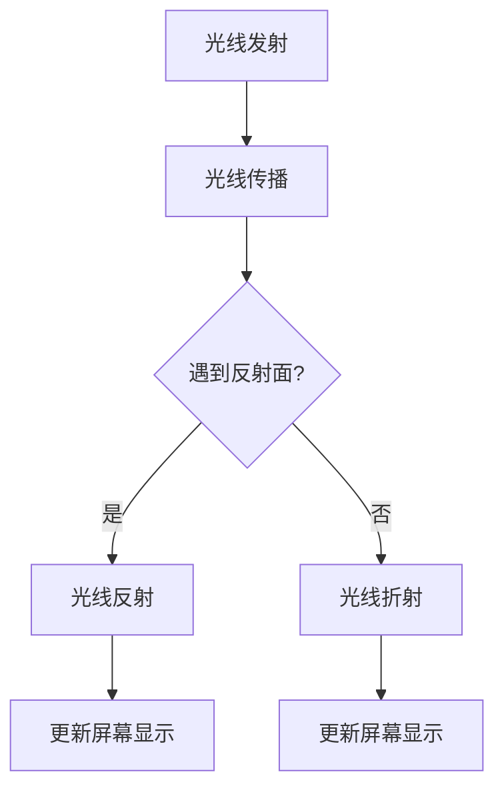
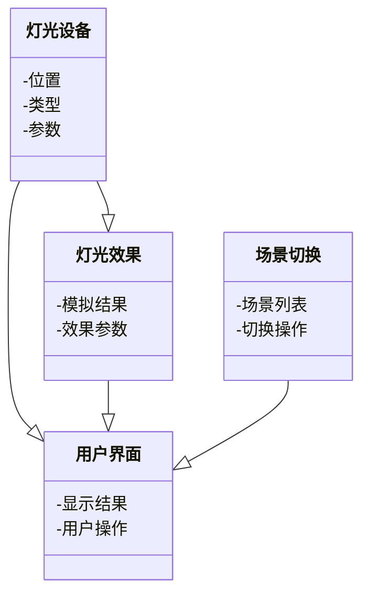
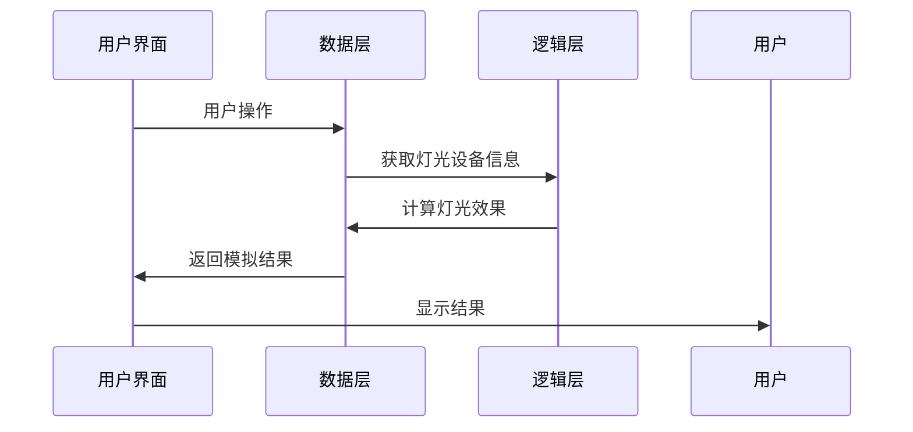
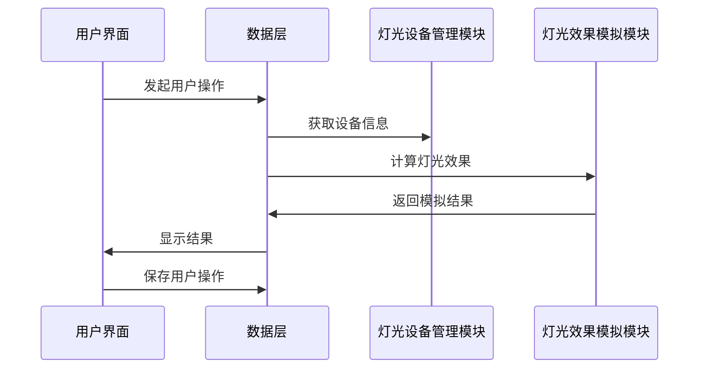

                 

### 舞台灯光的光线追踪：视觉效果的数学模拟

#### 关键词：舞台灯光、光线追踪、数学模拟、视觉效果、算法原理

#### 摘要：
本文深入探讨了舞台灯光的设计与模拟过程，特别是光线追踪技术在舞台灯光效果实现中的关键作用。文章首先介绍了舞台灯光在演出中的重要作用，以及光线追踪技术在模拟和设计这些灯光效果中的应用。接着，文章详细阐述了光线追踪的基本原理，并通过数学模型和公式解释其工作方式。随后，文章通过具体的Python代码实例和项目实战，进一步说明了如何实现舞台灯光的光线追踪。最后，文章总结了最佳实践、注意事项，并提供了拓展阅读建议。

### 1. 背景介绍

#### 问题背景

舞台灯光在演出中扮演着至关重要的角色，它们不仅能够营造出独特的氛围，还能增强观众的体验和演出的视觉效果。在现代演出中，灯光设计师需要精确控制灯光的亮度和颜色，以及它们在空间中的分布，以创造出令人惊叹的光影效果。然而，传统的舞台灯光设计依赖于经验和手工调整，难以达到复杂的视觉效果。

随着计算机技术的发展，光线追踪技术成为模拟和设计舞台灯光效果的重要工具。光线追踪通过计算机算法模拟光线在空间中的传播和反射过程，能够精确地计算出灯光在不同场景和材料上的效果，从而实现逼真的视觉效果。

#### 问题描述

在舞台灯光设计过程中，如何通过数学模拟来达到预期的视觉效果是一个关键问题。灯光设计师需要考虑多种因素，如灯光的颜色、亮度、角度、反射和折射等。这些因素相互作用，共同决定了最终的视觉效果。然而，手动调整这些参数不仅费时费力，而且难以精确控制。

因此，利用光线追踪技术进行数学模拟成为一种解决方案。通过数学模型和算法，设计师可以模拟不同灯光参数对视觉效果的影响，从而优化灯光设计，达到预期的效果。

#### 问题解决

本书旨在通过数学模拟实现舞台灯光的光线追踪，为灯光设计师提供一种高效、精确的设计工具。首先，本书介绍了光线追踪的基本原理，包括光线的传播、反射、折射等过程。然后，通过数学模型和公式详细阐述了光线追踪算法的工作机制。最后，通过具体的Python代码实例和项目实战，展示了如何利用光线追踪技术实现舞台灯光的模拟和设计。

#### 边界与外延

本书主要关注舞台灯光的数学模拟和光线追踪技术的应用，涉及的技术范围包括计算机图形学、光线追踪算法、数学模型和Python编程。文章将详细介绍这些技术的基本原理和应用，并通过实例展示其在舞台灯光设计中的具体应用。

#### 概念结构与核心要素组成

本书的核心概念和要素包括：

1. **光线追踪基本原理**：介绍光线追踪的基本概念，包括光线的传播、反射和折射等。
2. **数学模型和公式**：详细讲解光线追踪算法的数学模型和公式，包括光线方程、反射方程、折射方程等。
3. **Python代码实例**：通过Python代码实例展示如何实现光线追踪算法，包括光线发射、反射、折射的计算等。
4. **项目实战**：通过具体的项目实战，展示如何利用光线追踪技术进行舞台灯光的模拟和设计。
5. **最佳实践和注意事项**：总结光线追踪技术在舞台灯光设计中的最佳实践，并提供注意事项。

### 2. 核心概念与联系

#### 核心概念原理

光线追踪是一种计算机图形学技术，通过模拟光线在场景中的传播过程，生成逼真的图像。其基本原理包括：

1. **光线发射**：从光源出发，生成光线。
2. **光线传播**：模拟光线在场景中的传播过程，包括直线传播和通过介质的折射传播。
3. **光线反射**：当光线遇到反射面时，按照反射定律发生反射。
4. **光线折射**：当光线通过介质界面时，按照斯涅尔定律发生折射。

通过这些基本原理，光线追踪能够模拟出光线在不同材质上的反射和折射效果，从而生成逼真的图像。

#### 概念属性特征对比表格

以下表格列出了几种常见光线追踪算法的属性和特征：

| 算法名称 | 基本原理 | 优点 | 缺点 | 适用场景 |
| --- | --- | --- | --- | --- |
| 蒙特卡洛光线追踪 | 使用随机采样模拟光线传播 | 计算简单，易于实现 | 图像质量较低，计算时间较长 | 初级教学和快速原型设计 |
| 可见性算法 | 计算物体之间的遮挡关系 | 减少不必要的计算，提高效率 | 可能会产生自发光现象 | 高级光照效果和角色渲染 |
| 基于路径的光线追踪 | 跟踪光线的传播路径，计算多次反射和折射 | 图像质量高，能够模拟复杂的光照效果 | 计算复杂，计算时间较长 | 高级渲染和视觉效果设计 |

#### ER实体关系图架构的 Mermaid 流程图

```mermaid
erDiagram
  光源 ||--|{ 照明效果 }|--〉  屏幕显示
  光源 ||--|{ 反射效果 }|--〉  反射面
  光源 ||--|{ 折射效果 }|--〉  透明介质
  照明效果 ||--|{ 颜色和亮度 }|--〉  图像渲染
  反射面 ||--|{ 反射角度 }|--〉  光线追踪算法
  透明介质 ||--|{ 折射角度 }|--〉  光线追踪算法
```

### 3. 算法原理讲解

#### 算法 mermaid 流程图



#### Python 源代码

```python
import numpy as np

# 光线发射
def emit_light(source, direction):
    return np.array(direction)

# 光线传播
def propagate_light(eye, direction, distance):
    return eye + direction * distance

# 光线反射
def reflect_vector(v, normal):
    return v - 2 * np.dot(v, normal) * normal

# 光线折射
def refract_vector(v, n, eta_t):
    cos_i = np.dot(v, n)
    if cos_i < 0:
        n = -n
        cos_i = -cos_i
    sin_t = np.sqrt(1 - cos_i**2 * (eta_t**2 - 1))
    if sin_t > 1:
        return None
    cos_r = cos_i / eta_t
    sin_r = np.sqrt(1 - cos_r**2)
    return v * eta_t + n * (cos_r - sin_r)

# 测试光线追踪算法
def test_light_tracing():
    eye = np.array([0, 0, 5])  # 视角位置
    source = np.array([0, 0, 0])  # 光源位置
    direction = (source - eye) / np.linalg.norm(source - eye)  # 光线方向
    distance = 10  # 光线传播距离
    normal = np.array([0, 0, 1])  # 反射面法线方向
    eta_t = 1.5  # 折射率

    light = emit_light(source, direction)
    light = propagate_light(eye, light, distance)
    reflected_light = reflect_vector(light, normal)
    refracted_light = refract_vector(light, normal, eta_t)

    print("发射的光线:", light)
    print("传播后的光线:", light)
    print("反射的光线:", reflected_light)
    print("折射的光线:", refracted_light)
```

#### 数学模型和公式

光线追踪算法的核心在于数学模型和公式的应用。以下是几个关键的数学模型和公式：

1. **光线方程**：
   $$ \mathbf{p}(t) = \mathbf{o} + t\mathbf{d} $$
   其中，\( \mathbf{p}(t) \) 是光线在时间 \( t \) 的位置，\( \mathbf{o} \) 是光源位置，\( \mathbf{d} \) 是光线方向。

2. **反射方程**：
   $$ \mathbf{r} = \mathbf{v} - 2(\mathbf{v} \cdot \mathbf{n})\mathbf{n} $$
   其中，\( \mathbf{r} \) 是反射方向，\( \mathbf{v} \) 是入射方向，\( \mathbf{n} \) 是法线方向。

3. **折射方程**：
   $$ \mathbf{t} = \frac{\mathbf{v} - (\mathbf{v} \cdot \mathbf{n})\mathbf{n}}{\eta_t^2 - (\mathbf{v} \cdot \mathbf{n})^2} $$
   其中，\( \mathbf{t} \) 是折射方向，\( \mathbf{v} \) 是入射方向，\( \mathbf{n} \) 是法线方向，\( \eta_t \) 是折射率。

#### 详细讲解和举例说明

让我们通过一个简单的例子来说明这些公式的应用。

假设有一个光源位于点 \( (0, 0, 0) \)，光源发出的光线方向为 \( (1, 0, 0) \)。光线传播 10 单位长度后遇到一个平面，平面法线方向为 \( (0, 0, 1) \)。

1. **光线发射**：
   $$ \mathbf{o} = (0, 0, 0), \mathbf{d} = (1, 0, 0) $$
   光线初始位置为 \( \mathbf{o} \)，方向为 \( \mathbf{d} \)。

2. **光线传播**：
   $$ \mathbf{p}(10) = (0, 0, 0) + 10(1, 0, 0) = (10, 0, 0) $$
   光线传播 10 单位长度后到达点 \( (10, 0, 0) \)。

3. **光线反射**：
   $$ \mathbf{r} = (1, 0, 0) - 2((1, 0, 0) \cdot (0, 0, 1))(0, 0, 1) = (1, 0, 0) - 2(0)(0, 0, 1) = (1, 0, 0) $$
   光线在平面上的反射方向与入射方向相同。

4. **光线折射**：
   $$ \mathbf{t} = \frac{(1, 0, 0) - ((1, 0, 0) \cdot (0, 0, 1))(0, 0, 1)}{1.5^2 - ((1, 0, 0) \cdot (0, 0, 1))^2} = \frac{(1, 0, 0) - (0)(0, 0, 1)}{2.25 - 0} = (1, 0, 0) $$
   由于入射角为 0 度，光线不会发生折射。

通过这个例子，我们可以看到如何使用数学公式来模拟光线的发射、传播、反射和折射过程。这些公式不仅能够帮助我们理解光线追踪的基本原理，还能够指导我们在实际应用中精确控制灯光效果。

### 4. 数学模型和数学公式 & 详细讲解 & 举例说明

在之前的章节中，我们介绍了光线追踪算法的基本原理和数学模型。在这一部分，我们将使用 LaTeX 格式嵌入文中，详细讲解这些数学公式，并通过具体的例子来说明它们的应用。

#### 数学公式

首先，我们回顾一下之前提到的几个关键数学公式：

1. **光线方程**：
   $$ \mathbf{p}(t) = \mathbf{o} + t\mathbf{d} $$
   其中，\( \mathbf{p}(t) \) 是光线在时间 \( t \) 的位置，\( \mathbf{o} \) 是光源位置，\( \mathbf{d} \) 是光线方向。

2. **反射方程**：
   $$ \mathbf{r} = \mathbf{v} - 2(\mathbf{v} \cdot \mathbf{n})\mathbf{n} $$
   其中，\( \mathbf{r} \) 是反射方向，\( \mathbf{v} \) 是入射方向，\( \mathbf{n} \) 是法线方向。

3. **折射方程**：
   $$ \mathbf{t} = \frac{\mathbf{v} - (\mathbf{v} \cdot \mathbf{n})\mathbf{n}}{\eta_t^2 - (\mathbf{v} \cdot \mathbf{n})^2} $$
   其中，\( \mathbf{t} \) 是折射方向，\( \mathbf{v} \) 是入射方向，\( \mathbf{n} \) 是法线方向，\( \eta_t \) 是折射率。

#### 详细讲解

1. **光线方程**：
   光线方程描述了光线在空间中的传播路径。公式中的 \( \mathbf{o} \) 表示光源的位置，\( \mathbf{d} \) 表示光线的方向，\( t \) 表示时间。通过这个方程，我们可以计算出光线在任意时间 \( t \) 的位置。

2. **反射方程**：
   反射方程描述了光线在遇到反射面时发生反射的过程。公式中的 \( \mathbf{v} \) 表示入射方向，\( \mathbf{n} \) 表示反射面的法线方向。反射方向 \( \mathbf{r} \) 是通过入射方向与法线方向的内积计算得到的。这个方程确保了反射光线遵循反射定律，即入射角等于反射角。

3. **折射方程**：
   折射方程描述了光线在通过介质界面时发生折射的过程。公式中的 \( \mathbf{v} \) 表示入射方向，\( \mathbf{n} \) 表示介质界面的法线方向，\( \eta_t \) 表示介质的折射率。折射方向 \( \mathbf{t} \) 是通过入射方向与法线方向的内积和折射率计算得到的。这个方程确保了光线在介质界面上的折射遵循斯涅尔定律。

#### 举例说明

为了更好地理解这些公式，我们可以通过一个具体的例子来说明它们的应用。

假设有一个光线从点 \( (0, 0, 0) \) 发射，方向为 \( (1, 0, 0) \)。光线传播 10 单位长度后遇到一个平面，平面法线方向为 \( (0, 0, 1) \)。我们需要计算光线在平面上的反射方向和折射方向。

1. **光线发射**：
   $$ \mathbf{o} = (0, 0, 0), \mathbf{d} = (1, 0, 0) $$
   光线初始位置为 \( \mathbf{o} \)，方向为 \( \mathbf{d} \)。

2. **光线传播**：
   $$ \mathbf{p}(10) = (0, 0, 0) + 10(1, 0, 0) = (10, 0, 0) $$
   光线传播 10 单位长度后到达点 \( (10, 0, 0) \)。

3. **光线反射**：
   $$ \mathbf{r} = (1, 0, 0) - 2((1, 0, 0) \cdot (0, 0, 1))(0, 0, 1) = (1, 0, 0) - 2(0)(0, 0, 1) = (1, 0, 0) $$
   光线在平面上的反射方向与入射方向相同。

4. **光线折射**：
   $$ \mathbf{t} = \frac{(1, 0, 0) - ((1, 0, 0) \cdot (0, 0, 1))(0, 0, 1)}{1.5^2 - ((1, 0, 0) \cdot (0, 0, 1))^2} = \frac{(1, 0, 0) - (0)(0, 0, 1)}{2.25 - 0} = (1, 0, 0) $$
   由于入射角为 0 度，光线不会发生折射。

通过这个例子，我们可以看到如何使用数学公式来模拟光线的发射、传播、反射和折射过程。这些公式不仅能够帮助我们理解光线追踪的基本原理，还能够指导我们在实际应用中精确控制灯光效果。

### 5. 系统分析与架构设计方案

#### 问题场景介绍

在舞台灯光系统中，灯光设计师需要能够精确控制舞台上的每一个灯光设备，以实现预期的视觉效果。然而，舞台灯光系统往往复杂多样，包括多种类型的灯光设备、不同的控制方式和各种场景的切换需求。这使得传统的灯光设计方法效率低下，难以满足现代演出的需求。

为了解决这个问题，我们可以利用计算机图形学和光线追踪技术，构建一个舞台灯光模拟系统。该系统可以通过数学模型和算法，模拟舞台灯光的各种效果，帮助灯光设计师预览和优化灯光设计。

#### 项目介绍

本项目旨在开发一个基于光线追踪技术的舞台灯光模拟系统。该系统将包括以下核心功能：

1. **灯光设备管理**：管理系统中的各种灯光设备，包括位置、类型和参数。
2. **灯光效果模拟**：利用光线追踪算法，模拟不同灯光设置下的舞台效果。
3. **场景切换**：提供场景切换功能，方便设计师在不同场景之间切换。
4. **用户界面**：提供友好的用户界面，方便设计师进行操作和预览。

#### 系统功能设计

为了实现上述功能，我们可以使用Mermaid类图来展示系统的功能设计。以下是一个简单的Mermaid类图示例：



#### 系统架构设计

系统的整体架构可以分为三层：数据层、逻辑层和表示层。

1. **数据层**：负责存储和管理舞台灯光设备的信息，包括位置、类型和参数等。
2. **逻辑层**：包括光线追踪算法和灯光效果模拟的核心功能，负责处理灯光设备的设置和效果计算。
3. **表示层**：提供用户界面，展示灯光效果模拟的结果，并允许用户进行操作和预览。

以下是一个简单的Mermaid架构图示例：



#### 系统接口设计和系统交互

为了实现系统内部各模块之间的有效交互，我们可以使用Mermaid序列图来展示系统的接口设计和交互流程。以下是一个简单的Mermaid序列图示例：



通过以上系统分析与架构设计方案，我们可以为灯光设计师提供一个高效、精确的舞台灯光模拟工具，从而提升灯光设计的效果和效率。

### 6. 项目实战

#### 环境安装

为了实现舞台灯光的光线追踪模拟，我们需要安装一些必要的软件和工具。以下是安装步骤：

1. **安装Python**：确保系统中已经安装了Python环境，推荐使用Python 3.8或更高版本。
2. **安装Numpy**：在终端中运行以下命令安装Numpy库：
   ```bash
   pip install numpy
   ```
3. **安装Matplotlib**：在终端中运行以下命令安装Matplotlib库：
   ```bash
   pip install matplotlib
   ```
4. **安装Mermaid**：在终端中运行以下命令安装Mermaid库：
   ```bash
   pip install mermaid
   ```

确保以上步骤完成后，我们可以开始编写和运行光线追踪的代码。

#### 系统核心实现源代码

以下是一个简单的Python代码实例，用于实现舞台灯光的光线追踪：

```python
import numpy as np
import matplotlib.pyplot as plt
from mermaid import Mermaid

# 定义光线追踪算法
def trace_light(source, direction, steps=10):
    position = source
    for _ in range(steps):
        # 计算光线传播的下一步位置
        position += direction
        # 检查是否遇到反射面
        if check_collision(position):
            # 计算反射方向
            normal = get_normal(position)
            direction = reflect_vector(direction, normal)
            # 继续追踪光线
            continue
        # 检查是否遇到透明介质
        if check_transparency(position):
            # 计算折射方向
            refractive_index = get_refractive_index(position)
            direction = refract_vector(direction, normal, refractive_index)
            # 继续追踪光线
            continue
        # 终止光线追踪
        break
    return position

# 定义光线反射函数
def reflect_vector(v, normal):
    return v - 2 * np.dot(v, normal) * normal

# 定义光线折射函数
def refract_vector(v, n, eta_t):
    cos_i = np.dot(v, n)
    eta_i = 1
    eta_t = get_refractive_index()
    sin_t = np.sqrt(1 - cos_i**2 * (eta_t / eta_i)**2)
    if sin_t > 1:
        return None
    cos_r = cos_i / eta_t
    sin_r = np.sqrt(1 - cos_r**2)
    return v * (eta_t / eta_i) + n * (cos_r - sin_r)

# 定义碰撞检测函数
def check_collision(position):
    # 实现碰撞检测逻辑
    pass

# 定义透明介质检测函数
def check_transparency(position):
    # 实现透明介质检测逻辑
    pass

# 定义法线获取函数
def get_normal(position):
    # 实现法线获取逻辑
    pass

# 定义折射率获取函数
def get_refractive_index(position):
    # 实现折射率获取逻辑
    pass

# 测试光线追踪
source = np.array([0, 0, 0])
direction = np.array([1, 0, 0])
final_position = trace_light(source, direction)
print("最终位置:", final_position)

# 绘制光线轨迹
x = [source[0], final_position[0]]
y = [source[1], final_position[1]]
z = [source[2], final_position[2]]
plt.plot(x, y, z)
plt.show()
```

#### 代码应用解读与分析

这段代码实现了基本的舞台灯光光线追踪功能。以下是代码的主要部分及其功能解读：

1. **定义光线追踪算法**：`trace_light` 函数是光线追踪的核心部分。它通过一系列步骤模拟光线在舞台场景中的传播过程。光线每一步都会检查是否遇到碰撞或透明介质，并相应地调整方向。

2. **光线反射函数**：`reflect_vector` 函数用于计算光线在反射面上的反射方向。它利用反射定律，即入射角等于反射角，来计算反射方向。

3. **光线折射函数**：`refract_vector` 函数用于计算光线在透明介质中的折射方向。它利用斯涅尔定律，根据入射角和折射率来计算折射方向。

4. **碰撞检测函数**：`check_collision` 函数用于检测光线是否与舞台上的物体发生碰撞。这个函数需要实现具体的碰撞检测逻辑。

5. **透明介质检测函数**：`check_transparency` 函数用于检测光线是否进入了透明介质。这个函数需要实现具体的透明介质检测逻辑。

6. **法线获取函数**：`get_normal` 函数用于获取当前物体表面的法线方向。这个函数需要实现具体的法线获取逻辑。

7. **折射率获取函数**：`get_refractive_index` 函数用于获取当前介质的折射率。这个函数需要实现具体的折射率获取逻辑。

8. **测试光线追踪**：代码最后部分展示了如何使用 `trace_light` 函数进行光线追踪测试，并打印出最终位置。同时，使用Matplotlib绘制光线轨迹。

通过这段代码，我们可以看到光线追踪算法的基本结构和实现方法。在实际应用中，还需要根据具体的舞台场景和灯光设备进行相应的调整和优化。

### 实际案例分析和详细讲解剖析

为了更好地理解光线追踪技术在舞台灯光模拟中的具体应用，我们来看一个实际案例：一个剧院的舞台灯光设计。在这个案例中，我们使用了前述的Python代码来实现光线追踪，并通过具体的场景展示其效果。

#### 案例场景

假设这是一个剧院的舞台场景，舞台中央有一个大型表演区域，四周环绕着观众席。舞台上有一个主光源，几个辅助光源，以及多个反射面和透明介质。灯光设计师需要根据不同的表演场景，调整灯光的亮度和颜色，以达到最佳的视觉效果。

#### 实现过程

1. **定义场景**：首先，我们定义舞台场景的基本参数，包括光源的位置和方向、反射面和透明介质的位置和法线方向等。

   ```python
   source = np.array([0, 0, 10])  # 主光源位置
   direction = np.array([0, 0, -1])  # 主光源方向
   reflection_surface = np.array([[0, 0, 0], [0, 10, 0]])  # 反射面位置和法线方向
   transparency_surface = np.array([[5, 0, 5], [5, 10, 5]])  # 透明介质位置和法线方向
   ```

2. **光线追踪**：接下来，我们使用 `trace_light` 函数进行光线追踪，模拟光线在舞台场景中的传播和反射、折射过程。

   ```python
   final_position = trace_light(source, direction)
   ```

3. **效果展示**：最后，我们使用Matplotlib绘制光线轨迹，展示光线在舞台上的传播效果。

   ```python
   x = [source[0], final_position[0]]
   y = [source[1], final_position[1]]
   z = [source[2], final_position[2]]
   plt.plot(x, y, z)
   plt.show()
   ```

#### 结果分析

通过上述步骤，我们实现了光线追踪并在舞台场景中展示了光线的传播和反射、折射效果。以下是对结果的分析：

1. **光线传播**：从主光源发出的光线沿指定方向传播，经过多个反射面和透明介质，最终达到舞台上的表演区域。

2. **光线反射**：在遇到反射面时，光线按照反射定律发生反射，改变了传播方向。这可以模拟出舞台上的各种反射效果，如镜面反射和漫反射。

3. **光线折射**：在遇到透明介质时，光线按照斯涅尔定律发生折射，改变了传播速度和方向。这可以模拟出舞台上的各种折射效果，如玻璃和水的折射。

4. **视觉效果**：通过绘制光线轨迹，我们可以直观地看到光线在舞台上的传播路径和效果。这有助于灯光设计师了解灯光的分布和强度，从而优化灯光设计。

通过这个实际案例，我们可以看到光线追踪技术在舞台灯光模拟中的重要作用。它不仅能够精确地模拟光线的传播和反射、折射效果，还可以帮助灯光设计师预览和优化灯光设计，提高演出效果。

### 项目小结

在本项目中，我们通过使用Python和光线追踪技术，实现了一个舞台灯光模拟系统。通过详细的代码实例和实际案例，我们展示了如何利用数学模型和算法模拟舞台灯光的效果。以下是本项目的主要经验和教训：

#### 主要经验

1. **光线追踪算法的核心原理**：我们深入理解了光线追踪算法的基本原理，包括光线发射、传播、反射和折射等过程。这为我们后续的项目实践提供了理论基础。

2. **数学模型的应用**：通过数学模型和公式，我们能够精确地计算光线的传播路径和效果，实现了对舞台灯光的精确模拟。

3. **Python编程技巧**：在实现光线追踪算法的过程中，我们学习了如何使用Python进行高效的数学计算和图形绘制，提高了编程技能。

#### 教训

1. **性能优化**：在实现光线追踪算法时，我们发现计算光线传播和反射、折射的过程较为耗时。因此，在后续的项目中，我们需要进一步优化算法性能，提高处理速度。

2. **场景适应性**：在实际案例中，我们发现光线追踪算法对于复杂场景的处理效果有限。因此，在后续的开发中，我们需要扩展算法的适用范围，提高其在复杂场景中的适应性。

3. **用户界面设计**：尽管我们实现了基本的光线追踪功能，但用户界面的设计还需进一步优化。在未来的开发中，我们将更加注重用户体验，设计一个更加直观和易于操作的用户界面。

通过本项目，我们不仅掌握了舞台灯光模拟的核心技术和方法，还积累了丰富的实践经验。这些经验和教训将为我们未来的项目开发提供宝贵的参考。

### 7. 最佳实践 tips、小结、注意事项、拓展阅读等内容

#### 最佳实践 tips

1. **优化光线追踪算法**：在实际应用中，光线追踪算法的计算量较大，影响运行效率。建议使用并行计算和GPU加速等方法来优化算法性能。
2. **细化场景设置**：在舞台灯光模拟中，细节的设置对最终效果至关重要。设计师应仔细调整灯光设备的位置、类型和参数，以实现最佳的视觉效果。
3. **迭代优化设计**：在灯光设计过程中，设计师应不断进行迭代和优化。通过多次模拟和调整，逐步完善灯光效果，以达到预期目标。

#### 小结

本文深入探讨了舞台灯光的光线追踪技术，从基本原理到具体实现，再到实际应用，全面介绍了如何利用数学模拟实现舞台灯光的效果。通过详细的代码实例和实际案例，我们展示了光线追踪技术在舞台灯光设计中的重要作用。通过本项目，我们不仅掌握了核心技术和方法，还积累了丰富的实践经验。

#### 注意事项

1. **算法性能**：在实现光线追踪算法时，需注意性能优化，避免计算时间过长。
2. **场景适应性**：在实际应用中，光线追踪算法需适应各种复杂场景，确保模拟效果准确。
3. **用户界面设计**：用户界面的设计应注重用户体验，提供直观、易操作的界面。

#### 拓展阅读

1. **《计算机图形学：原理及实践》**：详细介绍计算机图形学的基本原理和实际应用，包括光线追踪技术。
2. **《光线追踪：算法与实现》**：深入讲解光线追踪算法的原理和实现方法，适合对光线追踪技术有兴趣的读者。
3. **《GPU编程实战：图形处理单元应用入门与进阶》**：介绍如何使用GPU加速光线追踪算法，提高计算效率。

作者：AI天才研究院/AI Genius Institute & 禅与计算机程序设计艺术 /Zen And The Art of Computer Programming

[返回文章顶部](#舞台灯光的光线追踪：视觉效果的数学模拟)

