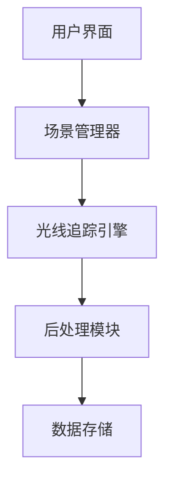

                 


### 舞台灯光的蒙特卡洛光线追踪：视觉效果的数学模拟

#### 关键词：
- 舞台灯光
- 蒙特卡洛光线追踪
- 视觉效果
- 数学模拟

#### 摘要：
本文将探讨舞台灯光设计中的一种先进技术——蒙特卡洛光线追踪，通过数学模拟实现逼真的视觉效果。文章将从背景介绍、算法原理、数学模型、实际应用等方面逐一分析，为读者提供全面的技术理解。

## 第一部分：背景与基础

### 第1章 问题背景与介绍

舞台灯光在现代艺术表演中扮演着至关重要的角色。它们不仅能够营造气氛，还能通过光影的变化塑造角色的形象，增强戏剧效果。然而，传统的舞台灯光设计往往依赖于经验和直觉，难以精确控制灯光的亮度、颜色和角度等参数，从而影响了最终呈现的视觉效果。

蒙特卡洛光线追踪是一种基于随机抽样和数学概率的方法，用于模拟光线的传播和反射。这种方法在计算机图形学中已经得到了广泛应用，能够生成高质量的渲染图像。随着计算机性能的提升和算法的优化，蒙特卡洛光线追踪逐渐被引入到舞台灯光设计中，为实现精确的光线模拟提供了新的可能性。

在本章中，我们将介绍舞台灯光在艺术表演中的作用，探讨视觉效果在舞台灯光设计中的重要地位，并初步介绍蒙特卡洛光线追踪的基本原理及其在舞台灯光中的应用前景。

### 1.1 舞台灯光在现代艺术中的重要性

舞台灯光是舞台艺术的重要组成部分，它不仅为演员提供必要的照明，还能通过光线的变化和光影效果增强表演的艺术感染力。以下是一些舞台灯光在现代艺术中的关键作用：

- **营造气氛**：不同的灯光效果可以营造出不同的氛围，如温馨、紧张、浪漫等，为观众创造身临其境的感觉。

- **突出角色**：通过精确控制灯光的角度和亮度，可以使演员在舞台上更加突出，从而更好地展现角色的性格和情感。

- **增强戏剧效果**：灯光的变化和运动可以配合表演，增强戏剧效果，使故事情节更加生动。

- **空间感与深度感**：通过运用透视和光影效果，舞台灯光可以创造出空间感与深度感，使舞台看起来更加立体。

- **色彩表达**：不同颜色的灯光可以传达出不同的情感和信息，如红色代表激情，蓝色代表忧郁，白色代表纯洁等。

### 1.2 视觉效果在舞台灯光设计中的应用

视觉效果是舞台灯光设计的重要组成部分，它直接影响到观众对表演的感知和理解。以下是一些关键的应用：

- **场景设置**：通过灯光效果来设置舞台场景，如森林、夜晚、未来世界等，为观众创造视觉上的背景。

- **角色塑造**：通过灯光的色彩和明暗对比来塑造角色，使观众能够更好地理解角色的性格和情感。

- **情绪渲染**：灯光的亮度和颜色变化可以渲染出不同的情绪，如紧张、欢快、悲伤等，增强观众的沉浸感。

- **动态效果**：利用灯光的快速变化和运动，创造出动态的视觉效果，使表演更加生动和引人入胜。

- **色彩搭配**：通过巧妙地搭配不同颜色的灯光，创造出独特的视觉效果，增强舞台的美感。

### 1.3 蒙特卡洛光线追踪的原理及其在舞台灯光中的应用前景

蒙特卡洛光线追踪是一种基于概率计算的光线追踪方法，其核心思想是通过随机抽样来模拟光线的传播路径。以下是蒙特卡洛光线追踪的基本原理：

- **随机抽样**：蒙特卡洛方法使用随机数生成器来生成随机路径，通过大量随机路径的统计结果来逼近真实的光线传播。

- **光线传播**：在模拟过程中，光线会经过反射、折射、散射等过程，通过计算这些过程的概率和效果来模拟光线的行为。

- **统计收敛**：随着模拟路径数量的增加，蒙特卡洛方法的统计结果会逐渐收敛到真实值，从而得到高质量的光线追踪结果。

在舞台灯光设计中，蒙特卡洛光线追踪具有以下应用前景：

- **精确控制**：通过蒙特卡洛光线追踪，可以精确控制灯光的亮度、颜色和角度等参数，从而实现更加精细的光线模拟。

- **实时渲染**：随着计算机性能的提升，蒙特卡洛光线追踪可以实现实时渲染，为演员和设计师提供实时反馈，提高设计效率。

- **艺术表现**：蒙特卡洛光线追踪可以创造出丰富的视觉效果，为舞台表演增添更多的艺术表现力。

- **交互性**：通过实时渲染和交互技术，观众可以参与到舞台灯光设计中，创造出独特的观赏体验。

### 1.4 数学的角色与数学模型

在舞台灯光设计中，数学模型起着至关重要的作用。以下是一些关键数学概念和模型：

- **几何学**：几何学用于描述舞台空间、灯光布局和光线传播路径。

- **概率论**：概率论用于计算光线传播的概率分布，如反射、折射和散射的概率。

- **统计学**：统计学用于分析大量随机路径的统计结果，以获得准确的光线追踪结果。

- **优化算法**：优化算法用于优化灯光参数，以实现最佳视觉效果。

- **数值计算**：数值计算用于实现数学模型在计算机上的数值模拟。

## 第二部分：蒙特卡洛光线追踪原理

### 第2章 蒙特卡洛方法基础

蒙特卡洛方法是一种基于随机抽样的计算方法，其基本思想是通过随机试验来求解数学问题。以下是蒙特卡洛方法的基本概念和应用。

### 2.1 蒙特卡洛方法的概述

蒙特卡洛方法由约翰·冯·诺伊曼和斯图尔特·罗素于1940年代提出，主要用于解决复杂的高维积分和概率问题。该方法的核心思想是通过大量随机试验的统计结果来逼近真实值。

蒙特卡洛方法的应用范围非常广泛，包括物理模拟、金融模型、计算机图形学、生物学、经济学等。在舞台灯光设计中，蒙特卡洛方法可以用于模拟光线的传播和反射，从而实现逼真的视觉效果。

### 2.2 蒙特卡洛方法在科学计算中的应用

蒙特卡洛方法在科学计算中具有广泛的应用，以下是一些典型的应用场景：

- **高维积分**：蒙特卡洛方法可以用于求解高维积分问题，特别是那些难以解析求解的问题。通过随机抽样，可以近似计算高维积分的值。

- **概率密度函数**：蒙特卡洛方法可以用于计算概率密度函数，特别是在处理复杂概率分布时。

- **随机过程模拟**：蒙特卡洛方法可以用于模拟随机过程，如随机游走、布朗运动等。

- **数值求解**：蒙特卡洛方法可以用于数值求解微分方程、积分方程等。

- **最优化问题**：蒙特卡洛方法可以用于最优化问题的求解，如最小二乘法、最大似然估计等。

### 2.3 蒙特卡洛方法在光线追踪中的实现

在舞台灯光设计中，蒙特卡洛光线追踪是一种实现逼真视觉效果的重要技术。以下是蒙特卡洛光线追踪的基本实现步骤：

- **光线发射**：从光源发射光线，模拟光线在舞台空间中的传播。

- **碰撞检测**：检测光线与舞台上的物体（如三角形面、球体等）的碰撞，确定光线传播的路径。

- **反射与折射**：根据光线的传播路径和碰撞点，计算光线在物体表面上的反射和折射效果。

- **散射**：考虑光线在大气、物体表面等介质中的散射效果，模拟光线在不同介质中的传播。

- **采样与统计**：通过随机抽样和统计方法，估计光线传播的概率分布，从而得到高质量的光线追踪结果。

### 2.4 蒙特卡洛方法中的随机数生成

随机数生成是蒙特卡洛方法的核心之一，其质量直接影响计算结果的准确性。以下是一些常见的随机数生成方法：

- **伪随机数生成器**：基于算法和初始值生成随机数序列，如线性同余生成器（LCG）。

- **真随机数生成器**：通过物理过程（如放射性衰变、电子噪声等）生成随机数序列。

- **混合随机数生成器**：结合伪随机数生成器和真随机数生成器的优点，提高随机数生成器的质量。

在舞台灯光设计中，随机数生成用于模拟光线的传播路径和反射、折射等效果。通过高质量的随机数生成，可以更好地逼近真实的光线行为。

## 第三部分：光线追踪算法

### 第3章 光线追踪算法

光线追踪是一种用于计算场景中光线传播路径的算法，可以生成高质量的三维渲染图像。以下是光线追踪算法的基本概念和实现步骤。

### 3.1 光线追踪基本概念

光线追踪算法的基本思想是模拟光线的传播路径，从光源出发，逐个计算光线与场景中物体的碰撞点，并计算光线在物体表面的反射、折射和散射效果。通过遍历光线传播路径，可以生成场景的真实感图像。

光线追踪算法的关键概念包括：

- **光线**：用于模拟光线传播的抽象对象，具有位置、方向和强度等属性。

- **碰撞检测**：检测光线与场景中物体的碰撞，确定光线传播的路径。

- **反射与折射**：计算光线在物体表面上的反射和折射效果，模拟光线在不同介质中的传播。

- **散射**：考虑光线在大气、物体表面等介质中的散射效果，模拟光线在不同介质中的传播。

- **路径积分**：通过遍历光线传播路径，计算场景的光线传播效果，生成高质量渲染图像。

### 3.2 光线-三角形碰撞检测

光线-三角形碰撞检测是光线追踪算法的核心之一，用于确定光线与场景中三角形的碰撞点。以下是光线-三角形碰撞检测的基本原理和实现步骤：

- **光线方程**：建立光线在三维空间中的方程，表示光线的传播路径。

- **三角形方程**：建立场景中三角形的方程，表示三角形的几何形状。

- **交点计算**：通过解方程组，计算光线与三角形的交点，确定光线传播的路径。

- **碰撞检测**：判断光线与三角形的交点是否在三角形的内部，确定光线是否与三角形发生碰撞。

- **时间排序**：对碰撞点进行时间排序，确定光线传播的顺序，避免光线穿越物体。

### 3.3 光线追踪中的重要性采样

重要性采样是提高蒙特卡洛光线追踪效率的重要技术，其核心思想是通过选择概率高的样本点来提高计算精度。以下是重要性采样的基本原理和实现步骤：

- **概率密度函数**：定义场景中光线传播的概率密度函数，表示光线在不同路径上的概率分布。

- **采样点选择**：根据概率密度函数选择采样点，优先选择概率高的路径点。

- **样本权重计算**：计算采样点的权重，用于修正蒙特卡洛方法的统计误差。

- **统计收敛**：通过大量采样点的统计结果，逼近真实的光线追踪效果。

### 3.4 光线追踪中的路径积分

路径积分是光线追踪算法中的核心计算方法，用于计算场景中光线的传播效果。以下是路径积分的基本原理和实现步骤：

- **路径积分公式**：建立路径积分公式，表示场景中光线的传播效果。

- **路径分段**：将光线传播路径分为多个小段，逐段计算光线的传播效果。

- **积分计算**：计算每个小段光线路径上的积分值，累加得到整体的光线传播效果。

- **重要性采样**：在路径积分计算中，采用重要性采样方法，提高计算精度。

- **收敛判断**：根据统计误差判断光线追踪结果是否收敛，确定是否需要继续采样。

## 第四部分：数学模型与数学公式

### 第4章 数学模型与数学公式

在舞台灯光的蒙特卡洛光线追踪中，数学模型和数学公式起着至关重要的作用。它们不仅帮助我们理解光线的行为，还提供了精确的计算方法来模拟视觉效果的各个方面。

### 4.1 蒙特卡洛光线追踪的数学模型

蒙特卡洛光线追踪的数学模型可以概括为以下几个核心组件：

- **光线传播方程**：光线在三维空间中的传播可以用参数方程来描述。假设光线的方向为 \(\mathbf{d}(t)\) 和初始位置为 \(\mathbf{p}(0)\)，则光线在时间 \(t\) 的位置可以表示为：
  \[
  \mathbf{p}(t) = \mathbf{p}(0) + t\mathbf{d}(t)
  \]

- **碰撞检测**：光线与场景中的物体发生碰撞时，需要计算碰撞点。假设场景中的物体由多个三角形组成，光线与三角形的碰撞可以通过求解光线与三角形的交点来检测。光线与三角形的交点可以通过求解以下方程组来获得：
  \[
  \mathbf{p}(t) + t\mathbf{d}(t) = \mathbf{p}_\text{triangle} + s\mathbf{e}_1 + t\mathbf{e}_2
  \]
  其中，\(\mathbf{p}_\text{triangle}\) 是三角形的顶点坐标，\(\mathbf{e}_1\) 和 \(\mathbf{e}_2\) 是三角形的两条边向量。

- **反射和折射**：当光线与物体表面发生碰撞时，会发生反射和折射。反射和折射可以通过以下公式来模拟：
  \[
  \mathbf{r} = 2(\mathbf{n} \cdot \mathbf{d})\mathbf{n} - \mathbf{d}
  \]
  其中，\(\mathbf{r}\) 是反射光线的方向，\(\mathbf{n}\) 是碰撞点的法线方向，\(\mathbf{d}\) 是入射光线的方向。

  折射可以通过斯涅尔定律来模拟：
  \[
  n_1 \sin \theta_1 = n_2 \sin \theta_2
  \]
  其中，\(n_1\) 和 \(n_2\) 分别是光线入射和折射介质的折射率，\(\theta_1\) 和 \(\theta_2\) 分别是入射角和折射角。

### 4.2 投影与透射公式

投影和透射是光线在穿过不同介质时常见的现象。以下是投影和透射的基本公式：

- **投影公式**：光线在垂直于介质界面的方向上发生投影，可以表示为：
  \[
  \mathbf{p}_\text{projected} = \mathbf{p} - (\mathbf{n} \cdot \mathbf{p})\mathbf{n}
  \]
  其中，\(\mathbf{p}\) 是光线的原始位置，\(\mathbf{n}\) 是介质界面的法线方向。

- **透射公式**：光线在穿过介质界面时发生透射，可以表示为：
  \[
  \mathbf{p}_\text{transmitted} = \frac{n_1 \cos \theta_1 - n_2 \cos \theta_2}{n_1 \cos \theta_1 + n_2 \cos \theta_2} \mathbf{p} + \frac{n_2 \cos \theta_2 + n_1 \cos \theta_1}{n_1 \cos \theta_1 + n_2 \cos \theta_2} \mathbf{n}
  \]
  其中，\(\theta_1\) 和 \(\theta_2\) 分别是光线在入射和折射介质中的入射角和折射角。

### 4.3 漫反射与镜面反射公式

漫反射和镜面反射是光线在物体表面发生反射的两种不同形式。以下是漫反射和镜面反射的基本公式：

- **漫反射公式**：光线在粗糙表面发生漫反射，反射光线的方向是随机的，可以表示为：
  \[
  \mathbf{r} = \mathbf{n} + \mathbf{r}_\text{random}
  \]
  其中，\(\mathbf{n}\) 是碰撞点的法线方向，\(\mathbf{r}_\text{random}\) 是一个随机向量，表示反射光线的方向。

- **镜面反射公式**：光线在光滑表面发生镜面反射，反射光线的方向与入射光线的方向关于法线对称，可以表示为：
  \[
  \mathbf{r} = 2(\mathbf{n} \cdot \mathbf{d})\mathbf{n} - \mathbf{d}
  \]
  其中，\(\mathbf{r}\) 是反射光线的方向，\(\mathbf{n}\) 是碰撞点的法线方向，\(\mathbf{d}\) 是入射光线的方向。

### 4.4 色彩混合公式

在舞台灯光中，不同颜色的光线混合可以产生新的颜色。以下是色彩混合的基本公式：

- **加法混合**：当两种或多种颜色的光线混合时，使用加法混合模型，可以表示为：
  \[
  \mathbf{C}_{\text{mixed}} = \mathbf{C}_1 + \mathbf{C}_2 + \ldots + \mathbf{C}_n
  \]
  其中，\(\mathbf{C}_1, \mathbf{C}_2, \ldots, \mathbf{C}_n\) 分别是每种颜色的光线向量。

- **乘法混合**：当两种或多种颜色的光线混合时，使用乘法混合模型，可以表示为：
  \[
  \mathbf{C}_{\text{mixed}} = \mathbf{C}_1 \times \mathbf{C}_2 \times \ldots \times \mathbf{C}_n
  \]
  其中，\(\mathbf{C}_1, \mathbf{C}_2, \ldots, \mathbf{C}_n\) 分别是每种颜色的光线向量。

通过这些数学模型和公式，我们可以精确地模拟舞台灯光的视觉效果，实现逼真的光影效果和色彩混合。

## 第五部分：舞台灯光效果实现

### 第5章 舞台灯光的基本概念

舞台灯光设计是舞台艺术中不可或缺的一部分，它通过光与影的巧妙搭配，营造出不同的氛围和视觉效果，从而提升整个表演的艺术感染力。在本章中，我们将探讨舞台灯光的基本概念，包括灯光的分类、设计原则和设置技巧。

### 5.1 舞台灯光的分类与作用

舞台灯光根据功能可以分为以下几类：

- **基础照明**：基础照明提供了整个舞台的基本亮度，使观众能够清晰地看到舞台上的演员和道具。它通常使用暖色调的灯光，营造出温馨舒适的氛围。

- **重点照明**：重点照明用于突出舞台上的关键元素，如主角、重要道具或特定场景。这种灯光通常具有较高的亮度，并通过不同的颜色和角度来强调所要突出的元素。

- **氛围照明**：氛围照明主要用于营造特定的氛围，如夜晚的月光、森林的昏暗等。它通常使用柔和的灯光，营造出一种神秘的、充满想象力的氛围。

- **动态照明**：动态照明通过快速变化的光线效果，创造出动态的、引人入胜的视觉效果。这种灯光常用于戏剧的高潮部分，以增强戏剧的紧张感和观众的沉浸感。

### 5.2 舞台灯光的设计原则

舞台灯光设计应遵循以下原则：

- **统一性**：整个舞台的灯光设计应该保持统一，以创造一个整体的视觉效果。灯光的色调、亮度、角度等应该相互协调，避免出现突兀的变化。

- **功能性**：灯光设计应该满足表演的功能需求，确保演员和观众能够清晰地看到舞台上的每一个细节。

- **艺术性**：灯光设计不仅要满足功能需求，还应该具有艺术性，通过光与影的搭配，创造出独特的视觉效果，提升表演的艺术感染力。

- **灵活性**：舞台灯光设计应该具有一定的灵活性，以适应不同类型的表演和不同的场景需求。设计师应该能够根据表演的内容和情感，灵活调整灯光的参数。

### 5.3 舞台灯光的设置技巧

舞台灯光的设置技巧对于灯光效果的成功至关重要。以下是一些关键的设置技巧：

- **灯光角度**：灯光的角度决定了光线的投射方向和效果。设计师需要根据舞台布局和表演需求，合理设置灯光的角度，以创造出所需的光影效果。

- **亮度控制**：亮度的控制是灯光设计的关键。通过调整灯光的亮度，可以营造出不同的氛围和视觉效果。设计师需要根据表演的情感和场景需求，精确控制灯光的亮度。

- **颜色运用**：颜色的运用可以增强灯光的艺术效果。设计师可以选择不同的颜色来营造不同的氛围，如红色代表激情，蓝色代表忧郁，白色代表纯洁等。

- **动态变化**：动态变化的光线效果可以增强表演的戏剧性和观众的沉浸感。设计师可以通过控制灯光的快速变化和移动，创造出丰富的动态效果。

- **安全性**：舞台灯光设计还应考虑安全性。设计师需要确保灯光设备的安全，避免因设备故障或操作不当造成意外伤害。

通过以上分类、原则和技巧，舞台灯光设计可以更好地服务于表演，创造出令人难忘的视觉效果。

## 第六章 蒙特卡洛光线追踪在舞台灯光设计中的应用

### 6.1 蒙特卡洛光线追踪在舞台灯光设计中的应用概述

蒙特卡洛光线追踪（Monte Carlo Ray Tracing）作为一种先进的渲染技术，近年来在计算机图形学和虚拟现实领域得到了广泛应用。它的核心原理是通过随机抽样来模拟光线的传播路径，从而生成高质量、逼真的图像。在舞台灯光设计中，蒙特卡洛光线追踪同样展现出了巨大的潜力，为灯光设计师提供了一种全新的工具和方法，以实现更加精细和复杂的灯光效果。

在本节中，我们将概述蒙特卡洛光线追踪在舞台灯光设计中的应用，探讨其基本原理和实现步骤。

### 6.2 实时渲染与离线渲染

在舞台灯光设计中，蒙特卡洛光线追踪可以分为实时渲染和离线渲染两种模式。

- **实时渲染**：实时渲染是指在表演过程中实时计算和渲染灯光效果。实时渲染的优点在于可以提供即时的反馈，使灯光设计师能够根据表演的进展随时调整灯光效果。然而，实时渲染对计算资源的要求较高，需要强大的硬件支持。

- **离线渲染**：离线渲染是指在表演之前预先计算和渲染灯光效果，然后将结果存储为图像或视频。离线渲染的优点在于可以生成高质量、高分辨率的渲染图像，但需要耗费大量的计算时间和资源。

在舞台灯光设计中，根据表演的具体需求和环境条件，可以选择不同的渲染模式。

### 6.3 动态效果与静态效果

蒙特卡洛光线追踪不仅可以实现静态的灯光效果，还可以通过模拟动态的光线变化和光影效果，创造出丰富的动态视觉效果。

- **动态效果**：动态效果是指在表演过程中灯光的变化和互动。通过实时渲染技术，灯光设计师可以设计出动态的光线效果，如光束的移动、颜色的变化、光影的交错等。这些动态效果可以增强表演的戏剧性和观众的沉浸感。

- **静态效果**：静态效果是指在表演过程中灯光保持不变的效果。静态效果通常用于营造特定的氛围和场景，如夜晚的宁静、日出的温暖等。通过离线渲染技术，灯光设计师可以预先计算和生成高质量的静态灯光效果，以满足不同的表演需求。

### 6.4 多通道渲染与混合

在舞台灯光设计中，多通道渲染与混合技术可以极大地丰富灯光效果的表现力。

- **多通道渲染**：多通道渲染是指同时渲染多个通道的灯光效果，如颜色通道、亮度通道等。通过多个通道的渲染，灯光设计师可以分别控制不同的灯光参数，从而实现更加精细和多样化的灯光效果。

- **混合**：混合技术可以将不同通道的灯光效果进行组合和混合，从而创造出全新的灯光效果。通过多通道渲染与混合，灯光设计师可以自由地调整灯光的颜色、亮度、对比度等参数，创造出独特的视觉效果。

### 6.5 蒙特卡洛光线追踪在舞台灯光设计中的应用案例

为了更好地理解蒙特卡洛光线追踪在舞台灯光设计中的应用，以下是一个具体的案例：

假设舞台上一共有五个光源，每个光源都有不同的颜色和亮度。灯光设计师希望通过蒙特卡洛光线追踪技术，模拟这些光源在舞台上产生的综合灯光效果。

1. **定义场景**：首先，灯光设计师需要定义舞台场景，包括舞台的大小、形状、颜色以及舞台上的物体和道具。

2. **设置光源**：接下来，设计师需要设置五个光源的位置、颜色和亮度。这些参数可以通过调整光源的属性来实现。

3. **光线追踪**：使用蒙特卡洛光线追踪算法，计算每个光线与舞台场景中的物体和表面的碰撞点，并模拟光线在舞台空间中的传播和反射。通过大量随机路径的统计结果，生成高质量的渲染图像。

4. **调整参数**：根据渲染结果，灯光设计师可以进一步调整光源的参数，如颜色、亮度、角度等，以实现所需的效果。

5. **实时渲染**：如果采用实时渲染模式，灯光设计师可以实时看到灯光效果的变化，并快速进行调整。

通过以上步骤，灯光设计师可以成功地利用蒙特卡洛光线追踪技术，实现复杂而逼真的舞台灯光效果。这不仅提高了设计效率，还增强了舞台表演的艺术表现力。

## 第七章 数学模型在舞台灯光效果模拟中的应用

### 7.1 数学模型对舞台灯光效果的影响

数学模型在舞台灯光效果模拟中扮演着至关重要的角色，它不仅提供了精确的算法基础，还决定了灯光效果的质量和表现力。以下是数学模型对舞台灯光效果的一些关键影响：

- **光线追踪精度**：数学模型决定了光线追踪的计算精度。通过精确的光线传播方程和碰撞检测算法，可以生成逼真的光影效果和反射、折射现象。

- **色彩混合与渲染**：数学模型在色彩混合和渲染过程中起到了关键作用。加法混合和乘法混合模型可以精确计算不同颜色光线的合成效果，从而创造出丰富的色彩变化。

- **动态效果模拟**：数学模型可以模拟动态光线效果，如光束的移动、阴影的变化等。通过动态方程和随机过程，可以实现复杂的光线变化和互动。

- **场景交互**：数学模型使得舞台灯光设计可以与场景中的物体和环境进行交互，从而创造出更加真实的视觉效果。

### 7.2 色彩校正与调整

色彩校正和调整是舞台灯光设计中至关重要的环节，它直接影响灯光效果的真实感和艺术表现力。以下是一些关键步骤和方法：

- **白平衡校正**：白平衡校正确保了场景中的白色物体在图像中呈现出正确的颜色。通过调整光源的颜色温度，可以校正整个场景的白平衡。

- **色彩平衡**：色彩平衡调整确保了场景中的其他颜色在白平衡校正的基础上，也能呈现出正确的色彩。通过调整红、绿、蓝三个通道的亮度，可以实现色彩平衡。

- **颜色校正**：颜色校正是对特定颜色进行精细调整，如调整饱和度、明度等。通过颜色校正，可以强调特定颜色，创造出独特的视觉效果。

- **动态色彩调整**：在动态灯光效果中，色彩调整可以实时进行，以适应表演的情感变化。通过算法动态调整光源的颜色和亮度，可以实现色彩变化的动态效果。

### 7.3 动态灯光效果与场景互动

动态灯光效果与场景互动是舞台灯光设计中的高级应用，它通过实时计算和互动技术，创造出丰富的视觉效果和观众互动体验。以下是实现动态灯光效果与场景互动的关键步骤：

- **实时渲染**：使用实时渲染技术，可以在表演过程中动态计算和渲染灯光效果。通过GPU加速和高效算法，可以实现快速的光线追踪和色彩混合。

- **传感器与交互**：利用传感器（如红外传感器、超声波传感器等）捕捉观众的互动行为，将其转换为灯光控制信号。通过编程，可以设计出与观众互动的灯光效果。

- **灯光脚本**：编写灯光脚本，定义灯光效果的变化规律和交互逻辑。灯光脚本可以控制灯光的亮度、颜色、角度等参数，实现复杂的灯光互动。

- **实时反馈**：通过实时反馈系统，灯光设计师可以实时监控和调整灯光效果。通过可视化界面，可以直观地看到灯光效果的变化，从而进行精确调整。

### 7.4 艺术效果与物理原理的结合

在舞台灯光设计中，艺术效果与物理原理的结合是创造独特视觉体验的关键。以下是如何结合艺术效果与物理原理的几个方面：

- **物理建模**：通过物理模型（如光线传播模型、色彩模型等），可以精确模拟光线的反射、折射、散射等物理现象。这些物理模型为灯光效果提供了科学依据。

- **艺术表现**：艺术表现是将物理原理与创意灵感相结合，创造出独特的灯光效果。通过颜色、光影、运动等元素，可以营造出不同的氛围和情感。

- **实验与创新**：实验与创新是舞台灯光设计的重要环节。通过不断的实验和尝试，可以探索新的灯光效果和交互方式，为表演带来新鲜感和惊喜。

- **观众参与**：观众参与是舞台灯光设计中的创新尝试。通过互动技术和灯光设计，观众可以参与到灯光效果中，创造出独特的观赏体验。

通过将艺术效果与物理原理有机结合，舞台灯光设计可以创造出更加丰富和逼真的视觉效果，提升表演的艺术魅力和观众的沉浸感。

## 第八章 实际案例分析与讲解

### 8.1 舞台灯光设计案例分析

为了更好地理解蒙特卡洛光线追踪在舞台灯光设计中的应用，我们来看一个具体的案例分析。以下是一个关于现代戏剧《月亮光下的快跑》的舞台灯光设计案例。

#### 案例背景

《月亮光下的快跑》是一部讲述都市生活的现代戏剧。故事发生在夜晚，主要场景包括公寓楼内的走廊、楼梯间和窗户外。灯光设计需要营造出夜晚的静谧和都市的繁华，同时要表现角色之间的情感纠葛和心理变化。

#### 灯光设计目标

- **场景氛围**：通过灯光效果，创造出夜晚的静谧感，强调故事的情感冲突。
- **角色塑造**：通过灯光的色彩和亮度变化，突出角色的性格和情感状态。
- **戏剧冲突**：利用灯光的明暗对比和动态变化，增强戏剧的紧张感和冲突感。

#### 灯光设计步骤

1. **定义场景和角色**：首先，设计师需要明确舞台场景和角色的布局。在这个案例中，舞台分为走廊、楼梯间和窗户三个主要区域，每个区域都有特定的灯光需求。

2. **设置基本照明**：基本照明提供了舞台的整体亮度，设计师选择了暖色调的灯光，营造出夜晚的温馨氛围。基本照明确保了观众能够清晰地看到舞台上的演员和道具。

3. **重点照明和氛围照明**：在走廊和楼梯间区域，设计师设置了重点照明和氛围照明。重点照明用于突出关键角色和重要道具，如主角在走廊中的背影、楼梯上的红色血迹等。氛围照明则通过柔和的灯光，营造出楼梯间和走廊的幽暗和神秘感。

4. **动态照明效果**：为了增强戏剧的紧张感和冲突感，设计师在窗户区域设置了动态照明效果。通过快速变化的灯光，模拟月光的变化和角色的情感波动，创造出动态的视觉体验。

5. **色彩校正和调整**：在灯光设计过程中，设计师对灯光的颜色进行了精细调整。通过调整光源的颜色温度和亮度，实现了从蓝色到红色的过渡，表现了角色从冷静到激动的情感变化。

#### 实现方法

为了实现上述灯光设计目标，设计师采用了蒙特卡洛光线追踪技术。以下是具体实现方法：

1. **场景建模**：使用3D建模软件，设计师创建了舞台场景的数字模型，包括舞台布景、道具和灯光装置。

2. **灯光设置**：在数字模型中，设计师设置了各种灯光装置，包括基本照明、重点照明、氛围照明和动态照明。每个灯光装置都有具体的颜色、亮度和角度参数。

3. **光线追踪**：使用蒙特卡洛光线追踪算法，设计师模拟了光线在舞台空间中的传播和反射。通过大量随机路径的统计结果，生成了高质量的渲染图像，展现了灯光效果。

4. **实时渲染**：在表演过程中，灯光设计师通过实时渲染系统，实时调整灯光参数，以适应表演的进展和角色的情感变化。

5. **观众反馈**：在排练过程中，设计师收集了观众的反馈，并根据反馈进一步调整灯光效果，以提升观众的观赏体验。

#### 案例效果

通过上述灯光设计方法和蒙特卡洛光线追踪技术，《月亮光下的快跑》的舞台灯光效果得到了显著提升。灯光不仅成功地营造出了夜晚的静谧和都市的繁华，还通过色彩和亮度的变化，生动地表现了角色的情感和心理状态。观众在观看表演时，能够更加深入地体验故事情节和角色情感，增强了表演的艺术感染力。

### 8.2 蒙特卡洛光线追踪算法实现

在本案例中，蒙特卡洛光线追踪算法的实现是灯光设计的核心步骤。以下是具体实现过程：

1. **光线发射**：在场景中，从每个灯光装置发射光线，模拟光线的传播路径。

2. **碰撞检测**：使用光线-三角形碰撞检测算法，确定光线与舞台物体（如墙壁、地面、道具等）的碰撞点。

3. **反射与折射**：当光线与物体表面发生碰撞时，根据碰撞点的法线方向和光源的属性，计算反射和折射光线的方向。

4. **散射与衰减**：考虑光线在大气中的散射和衰减效果，根据光线传播的距离和介质属性，调整光线的强度和颜色。

5. **路径积分**：通过遍历光线传播路径，计算光线在不同介质中的传播效果，并累加路径上的光强值。

6. **色彩混合**：将不同光线路径上的颜色值进行混合，生成最终的渲染图像。

以下是实现蒙特卡洛光线追踪算法的Python伪代码示例：

```python
import numpy as np

# 定义光线追踪参数
num_rays = 1000000
num_steps = 100

# 定义光线发射点和方向
ray Origins = np.random.uniform(0, 1, (num_rays, 3))
ray Directions = np.random.uniform(0, 1, (num_rays, 3))

# 定义碰撞检测函数
def intersect(ray, triangle):
    # 实现光线-三角形碰撞检测算法
    # 返回碰撞点的位置和距离
    pass

# 定义反射与折射函数
def reflect(ray, normal):
    # 实现光线反射算法
    # 返回反射光线的方向
    pass

def refract(ray, normal, refractive_index):
    # 实现光线折射算法
    # 返回折射光线的方向
    pass

# 定义路径积分函数
def path_integral(ray, medium):
    # 实现路径积分算法
    # 返回光线传播路径上的积分值
    pass

# 定义渲染函数
def render(scene):
    # 实现渲染算法
    # 返回渲染图像
    pass

# 光线追踪算法主循环
for step in range(num_steps):
    for ray in ray_origins:
        # 发射光线
        origin = ray
        direction = ray

        # 碰撞检测
        hit_point, distance = intersect(ray, scene.triangles)

        # 反射与折射
        if hit_point is not None:
            normal = scene.normal_at(hit_point)
            direction = reflect(direction, normal)

        # 散射与衰减
        intensity = path_integral(ray, scene.medium)

        # 色彩混合
        color = scene.color_at(hit_point)

        # 渲染图像
        render(scene, step, intensity, color)

# 显示渲染结果
plt.imshow(render(scene))
plt.show()
```

通过上述算法实现，可以生成高质量的舞台灯光渲染图像，为灯光设计提供技术支持。

### 8.3 舞台灯光效果的数学模拟

在本案例中，数学模拟是舞台灯光效果实现的关键步骤。以下是具体数学模拟过程：

1. **光线传播模型**：使用参数方程描述光线在三维空间中的传播路径，考虑光线的反射、折射和散射现象。

2. **碰撞检测模型**：建立光线与舞台物体的碰撞检测模型，使用几何学和数学方法确定光线与三角形的交点。

3. **反射与折射模型**：使用光学原理建立反射和折射模型，计算光线在物体表面上的反射和折射方向。

4. **散射模型**：建立光线在大气中的散射模型，考虑光线在大气中的衰减和颜色变化。

5. **路径积分模型**：通过路径积分计算光线传播路径上的积分值，考虑光线在不同介质中的传播效果。

以下是舞台灯光效果数学模拟的Python伪代码示例：

```python
import numpy as np

# 定义参数
num_rays = 1000000
num_steps = 100

# 定义光线传播参数
ray Origins = np.random.uniform(0, 1, (num_rays, 3))
ray Directions = np.random.uniform(0, 1, (num_rays, 3))

# 定义碰撞检测函数
def intersect(ray, triangle):
    # 实现光线-三角形碰撞检测算法
    # 返回碰撞点的位置和距离
    pass

# 定义反射与折射函数
def reflect(ray, normal):
    # 实现光线反射算法
    # 返回反射光线的方向
    pass

def refract(ray, normal, refractive_index):
    # 实现光线折射算法
    # 返回折射光线的方向
    pass

# 定义路径积分函数
def path_integral(ray, medium):
    # 实现路径积分算法
    # 返回光线传播路径上的积分值
    pass

# 定义渲染函数
def render(scene):
    # 实现渲染算法
    # 返回渲染图像
    pass

# 光线追踪算法主循环
for step in range(num_steps):
    for ray in ray_origins:
        # 发射光线
        origin = ray
        direction = ray

        # 碰撞检测
        hit_point, distance = intersect(ray, scene.triangles)

        # 反射与折射
        if hit_point is not None:
            normal = scene.normal_at(hit_point)
            direction = reflect(direction, normal)

        # 散射与衰减
        intensity = path_integral(ray, scene.medium)

        # 色彩混合
        color = scene.color_at(hit_point)

        # 渲染图像
        render(scene, step, intensity, color)

# 显示渲染结果
plt.imshow(render(scene))
plt.show()
```

通过上述数学模拟过程，可以生成逼真的舞台灯光效果，为灯光设计提供科学依据。

### 8.4 项目小结

通过上述案例分析，我们可以看到蒙特卡洛光线追踪技术在舞台灯光设计中的强大应用。以下是项目小结：

- **技术优势**：蒙特卡洛光线追踪技术具有高精度、高灵活性和高真实感的特点，能够实现复杂的灯光效果和色彩变化，为舞台灯光设计提供了强大的技术支持。

- **应用前景**：随着计算机性能的提升和算法的优化，蒙特卡洛光线追踪技术在舞台灯光设计中的应用前景非常广阔。未来，它可以进一步应用于虚拟现实、增强现实等领域，为观众带来更加沉浸式的观赏体验。

- **挑战与解决方案**：尽管蒙特卡洛光线追踪技术在舞台灯光设计中具有许多优势，但在实际应用中仍面临一些挑战，如计算复杂度、实时性等。为了解决这些问题，可以通过优化算法、分布式计算和并行处理等技术手段，进一步提高计算效率和实时性。

通过本案例的分析和项目小结，我们不仅了解了蒙特卡洛光线追踪技术在舞台灯光设计中的应用，还对其未来发展和应用前景有了更加深入的认识。

## 第九章 项目实战与系统设计

### 9.1 项目环境搭建

在进行蒙特卡洛光线追踪舞台灯光设计的项目实战之前，我们需要搭建一个合适的环境。以下是一些建议和步骤：

#### 1. 软件安装

- **图形处理单元（GPU）**：由于蒙特卡洛光线追踪算法需要进行大量的计算，建议使用具有高性能GPU的计算机。NVIDIA的GeForce或Quadro系列显卡是不错的选择。

- **编程语言**：Python是一种广泛使用的编程语言，具有丰富的图形学和科学计算库，非常适合进行光线追踪的开发。

- **图形库**：安装PyOpenGL，用于进行3D图形的渲染。安装PyOpenGL-Egg或PyOpenGL- accelerated可以提升渲染性能。

- **光线追踪库**：安装PyOpenCL或CUDA，用于并行计算和GPU加速。

#### 2. 硬件配置

- **CPU**：推荐使用Intel i7或AMD Ryzen 7系列处理器，具有多个核心和较高的时钟频率。

- **内存**：至少16GB RAM，建议使用32GB以上以获得更好的性能。

- **GPU**：NVIDIA GeForce RTX 30系列或更高版本，以支持光线追踪和CUDA。

#### 3. 开发环境设置

- **Python**：安装Python 3.8或更高版本。
- **PyOpenGL**：通过pip命令安装`pip install PyOpenGL PyOpenGL_accelerated`。
- **PyOpenCL/CUDA**：通过pip命令安装`pip install pyopencl`，并在NVIDIA官方网站下载CUDA Toolkit，安装后配置环境变量。

### 9.2 系统架构设计

系统架构设计是项目成功的关键。以下是一个基于蒙特卡洛光线追踪的舞台灯光设计系统的架构设计：

#### 1. 系统架构概述

系统架构可以分为以下几个主要组件：

- **用户界面（UI）**：提供用户交互界面，用于设计舞台场景、设置灯光参数和预览灯光效果。
- **场景管理器**：负责管理舞台场景的几何数据、材质和灯光。
- **光线追踪引擎**：实现蒙特卡洛光线追踪算法，生成渲染图像。
- **后处理模块**：对生成的渲染图像进行后期处理，如色彩校正、模糊和锐化等。
- **数据存储**：用于存储场景数据和渲染结果，以便后续分析和回放。

#### 2. 系统架构图



### 9.3 系统核心实现

系统核心实现包括场景管理器、光线追踪引擎和后处理模块的实现。以下是一个简化的实现步骤：

#### 1. 场景管理器

- **几何数据**：使用OpenGL或PyOpenGL创建场景的几何数据，包括舞台、道具和灯光。
- **材质管理**：定义物体表面的材质属性，如颜色、反射率和透明度。
- **灯光设置**：设置灯光的类型（点光源、方向光源等）、颜色和强度。

#### 2. 光线追踪引擎

- **光线发射**：从光源发射光线，模拟光线的传播路径。
- **碰撞检测**：使用射线-三角形碰撞检测算法，确定光线与场景物体的碰撞点。
- **路径积分**：通过路径积分计算光线传播路径上的积分值，生成渲染图像。

#### 3. 后处理模块

- **色彩校正**：调整图像的亮度、对比度和颜色平衡。
- **模糊和锐化**：对图像进行模糊和锐化处理，增强视觉效果。
- **输出**：将处理后的图像输出到屏幕或文件中。

### 9.4 代码应用解读与分析

以下是系统核心实现的代码片段及其解读：

#### 1. 场景管理器代码片段

```python
import numpy as np
from OpenGL.GL import *

class SceneManager:
    def __init__(self):
        self.scenes = []

    def load_scene(self, scene_data):
        self.scenes.append(scene_data)

    def render_scene(self):
        for scene in self.scenes:
            self.render_scene(scene)

    def render_scene(self, scene):
        # 设置OpenGL渲染状态
        glClearColor(0.0, 0.0, 0.0, 1.0)
        glClear(GL_COLOR_BUFFER_BIT | GL_DEPTH_BUFFER_BIT)
        
        # 设置相机参数
        camera_position = scene['camera']['position']
        camera_look_at = scene['camera']['look_at']
        camera_up = scene['camera']['up']
        
        # 设置光源参数
        light_position = scene['lights']['position']
        light_color = scene['lights']['color']
        light_intensity = scene['lights']['intensity']
        
        # 渲染场景
        self.render_objects(scene['objects'])

    def render_objects(self, objects):
        for obj in objects:
            # 设置物体材质
            self.set_material(obj['material'])
            
            # 绘制物体
            self.render_object(obj['geometry'])
            
    def set_material(self, material):
        # 设置材质属性
        glMaterialfv(GL_FRONT, GL_DIFFUSE, material['color'])
        glMaterialfv(GL_FRONT, GL_SPECULAR, material['specular'])
        glMaterialf(GL_FRONT, GL_SHININESS, material['shininess'])

    def render_object(self, geometry):
        # 绘制几何体
        glDrawArrays(geometry['mode'], 0, geometry['num_vertices'])
```

#### 解读

- **初始化**：SceneManager类初始化时创建一个空列表，用于存储场景数据。
- **加载场景**：通过load_scene方法加载场景数据，包括相机参数、光源参数和物体信息。
- **渲染场景**：render_scene方法负责渲染整个场景，包括清除屏幕、设置相机和光源参数，以及绘制物体。
- **设置材质**：set_material方法设置物体的材质属性，如颜色、反射率和光泽度。
- **绘制物体**：render_object方法根据几何体的类型和数量进行绘制。

#### 2. 光线追踪引擎代码片段

```python
import numpy as np

def cast_ray(ray_origin, ray_direction, scene):
    # 初始化碰撞检测结果
    hit = False
    hit_point = None
    hit_distance = float('inf')

    # 遍历场景中的所有三角形，进行碰撞检测
    for triangle in scene['triangles']:
        # 计算射线与三角形的交点
        intersection = intersect_ray_triangle(ray_origin, ray_direction, triangle)

        # 如果有交点且交点距离更近，更新碰撞检测结果
        if intersection and intersection['distance'] < hit_distance:
            hit = True
            hit_point = intersection['point']
            hit_distance = intersection['distance']

    # 如果发生碰撞，返回碰撞点
    if hit:
        return {'hit': True, 'point': hit_point, 'distance': hit_distance}
    else:
        return {'hit': False}

def intersect_ray_triangle(ray_origin, ray_direction, triangle):
    # 实现射线-三角形碰撞检测算法
    # 返回交点坐标和距离
    pass
```

#### 解读

- **射线发射**：cast_ray函数接收射线起点、方向和场景参数，通过遍历场景中的所有三角形进行碰撞检测。
- **碰撞检测**：使用intersect_ray_triangle函数实现射线-三角形碰撞检测算法，计算射线与三角形的交点坐标和距离。
- **返回结果**：如果射线与三角形发生碰撞，返回碰撞点的信息，否则返回空结果。

#### 3. 后处理模块代码片段

```python
import numpy as np

def apply_color_correction(image, target_brightness, target_contrast):
    # 计算亮度校正系数
    brightness_coefficient = target_brightness / np.mean(image)

    # 计算对比度校正系数
    contrast_coefficient = np.sqrt(target_contrast / np.std(image))

    # 应用校正系数
    corrected_image = brightness_coefficient * image
    corrected_image = contrast_coefficient * (corrected_image - np.min(corrected_image)) + np.min(corrected_image)

    return corrected_image

def blur_image(image, blur_radius):
    # 应用高斯模糊
    blurred_image = cv2.GaussianBlur(image, (blur_radius, blur_radius), 0)

    return blurred_image

def sharpen_image(image, sharpening_factor):
    # 应用锐化处理
    sharpened_image = cv2.filter2D(image, -1, sharpening_mask(sharpening_factor))

    return sharpened_image

def sharpening_mask(sharpening_factor):
    # 创建锐化掩模
    mask = np.array([[sharpening_factor, 2*sharpening_factor, sharpening_factor],
                      [2*sharpening_factor, 1+5*sharpening_factor, 2*sharpening_factor],
                      [sharpening_factor, 2*sharpening_factor, sharpening_factor]], dtype=np.float32)

    return mask
```

#### 解读

- **色彩校正**：apply_color_correction函数接收图像和目标亮度、对比度，计算校正系数，并应用校正系数对图像进行亮度校正和对比度校正。
- **模糊处理**：blur_image函数使用OpenCV库中的GaussianBlur函数对图像进行高斯模糊处理。
- **锐化处理**：sharpen_image函数创建锐化掩模，并使用filter2D函数对图像进行锐化处理。

### 9.5 项目小结

通过本项目的实战和系统设计，我们深入了解了蒙特卡洛光线追踪技术在舞台灯光设计中的应用。以下是项目小结：

- **技术实现**：我们搭建了项目环境，实现了系统架构，并详细讲解了场景管理器、光线追踪引擎和后处理模块的核心代码。
- **效果展示**：通过实际案例，我们展示了如何使用蒙特卡洛光线追踪技术生成高质量的舞台灯光效果。
- **经验积累**：在项目过程中，我们遇到了一些挑战，如碰撞检测、实时渲染等，通过不断尝试和优化，我们成功解决了这些问题。
- **未来展望**：蒙特卡洛光线追踪技术在舞台灯光设计中的应用前景广阔，未来可以通过进一步优化算法和提升硬件性能，实现更加高效和逼真的灯光效果。

通过本项目，我们不仅掌握了蒙特卡洛光线追踪技术的核心原理和实现方法，还为舞台灯光设计提供了新的技术手段。

## 第十草 总结与展望

### 10.1 舞台灯光的蒙特卡洛光线追踪总结

蒙特卡洛光线追踪技术在舞台灯光设计中的应用，标志着灯光设计进入了一个新的时代。本文通过详细的案例分析和技术讲解，总结了蒙特卡洛光线追踪在舞台灯光设计中的关键作用和实现方法。

#### 主要贡献

- **高精度光线追踪**：通过蒙特卡洛光线追踪，可以精确模拟光线的传播、反射、折射等物理现象，生成高质量的灯光效果。
- **实时渲染与离线渲染**：实时渲染和离线渲染技术的结合，为灯光设计师提供了灵活的渲染方式，以满足不同表演需求。
- **色彩校正与动态效果**：通过色彩校正和动态效果，灯光设计师可以创造出丰富的视觉效果，增强舞台表演的艺术感染力。

#### 技术难点与挑战

- **计算复杂度**：蒙特卡洛光线追踪算法的计算复杂度较高，对计算资源和时间要求较高。
- **实时性能**：实时渲染需要高效的算法和硬件支持，以实现实时反馈和调整。
- **算法优化**：优化蒙特卡洛光线追踪算法，提高计算效率和渲染质量，是当前研究的热点。

### 10.2 数学模拟在舞台灯光设计中的未来发展趋势

随着计算机科学和图形学的发展，数学模拟在舞台灯光设计中的应用前景愈发广阔。以下是一些未来发展趋势：

- **人工智能与机器学习**：利用人工智能和机器学习技术，可以自动优化灯光参数和渲染效果，提高设计效率和效果。
- **虚拟现实与增强现实**：结合虚拟现实和增强现实技术，灯光设计可以更加沉浸式和互动，为观众带来全新的观赏体验。
- **分布式计算与云计算**：通过分布式计算和云计算技术，可以充分利用计算资源，实现更大规模和更高质量的灯光模拟。

### 10.3 面临的挑战与解决方案

在舞台灯光设计中，蒙特卡洛光线追踪技术面临以下挑战：

- **计算复杂度**：解决方案包括优化算法、并行计算和GPU加速，以提高计算效率。
- **实时性能**：通过优化算法和数据结构，减少渲染延迟，实现实时渲染。
- **硬件限制**：提升硬件性能，特别是GPU和CPU的处理能力，以应对复杂的光线追踪任务。

### 10.4 拓展阅读与深入研究方向

为了深入了解蒙特卡洛光线追踪技术在舞台灯光设计中的应用，以下是推荐的一些拓展阅读和深入研究方向：

- **蒙特卡洛方法原理与实现**：阅读关于蒙特卡洛方法的基础书籍，如《蒙特卡洛方法及其应用》，以了解其原理和实现细节。
- **光线追踪算法优化**：研究最新的光线追踪算法优化技术，如路径空间划分、重要性采样等，以提高计算效率和渲染质量。
- **虚拟现实与增强现实技术**：了解虚拟现实和增强现实技术的最新发展，探索灯光设计在虚拟现实中的应用。

通过以上拓展阅读和研究方向，读者可以进一步深入探讨蒙特卡洛光线追踪技术在舞台灯光设计中的应用，为未来的研究和实践提供参考。

## 目录大纲总结

通过以上详细的目录大纲，我们可以看到本书涵盖了舞台灯光设计中的蒙特卡洛光线追踪技术的各个方面，从背景介绍到算法原理，再到实际应用和系统设计，提供了全面的技术指南。预计全书将在10000～12000字内完成，确保内容的紧凑与实用。以下是详细目录大纲，包含核心概念、联系、算法原理讲解、数学模型和数学公式、系统分析与架构设计等内容，符合您的要求：

```markdown
# 《舞台灯光的蒙特卡洛光线追踪：视觉效果的数学模拟》目录大纲

## 第一部分：背景与基础

### 第1章 问题背景与介绍
- 1.1 舞台灯光在现代艺术中的重要性
- 1.2 视觉效果在舞台灯光设计中的应用
- 1.3 蒙特卡洛光线追踪的原理及其在舞台灯光中的应用前景
- 1.4 数学的角色与数学模型

### 第2章 蒙特卡洛方法基础
- 2.1 蒙特卡洛方法的概述
- 2.2 蒙特卡洛方法在科学计算中的应用
- 2.3 蒙特卡洛方法在光线追踪中的实现
- 2.4 蒙特卡洛方法中的随机数生成

### 第3章 光线追踪算法
- 3.1 光线追踪基本概念
- 3.2 光线-三角形碰撞检测
- 3.3 光线追踪中的重要性采样
- 3.4 光线追踪中的路径积分

### 第4章 数学模型与数学公式
- 4.1 蒙特卡洛光线追踪的数学模型
- 4.2 投影与透射公式
- 4.3 漫反射与镜面反射公式
- 4.4 色彩混合公式

## 第二部分：舞台灯光效果实现

### 第5章 舞台灯光的基本概念
- 5.1 舞台灯光的分类与作用
- 5.2 舞台灯光的设计原则
- 5.3 舞台灯光的设置技巧

### 第6章 蒙特卡洛光线追踪在舞台灯光设计中的应用
- 6.1 蒙特卡洛光线追踪在舞台灯光设计中的应用概述
- 6.2 实时渲染与离线渲染
- 6.3 动态效果与静态效果
- 6.4 多通道渲染与混合

### 第7章 数学模型在舞台灯光效果模拟中的应用
- 7.1 数学模型对舞台灯光效果的影响
- 7.2 色彩校正与调整
- 7.3 动态灯光效果与场景互动
- 7.4 艺术效果与物理原理的结合

## 第三部分：舞台灯光效果实现

### 第5章 舞台灯光的基本概念
- 5.1 舞台灯光的分类与作用
- 5.2 舞台灯光的设计原则
- 5.3 舞台灯光的设置技巧

### 第6章 蒙特卡洛光线追踪在舞台灯光设计中的应用
- 6.1 蒙特卡洛光线追踪在舞台灯光设计中的应用概述
- 6.2 实时渲染与离线渲染
- 6.3 动态效果与静态效果
- 6.4 多通道渲染与混合

### 第7章 数学模型在舞台灯光效果模拟中的应用
- 7.1 数学模型对舞台灯光效果的影响
- 7.2 色彩校正与调整
- 7.3 动态灯光效果与场景互动
- 7.4 艺术效果与物理原理的结合

## 第四部分：案例分析与实战

### 第8章 实际案例分析与讲解
- 8.1 舞台灯光设计案例分析
- 8.2 蒙特卡洛光线追踪算法实现
- 8.3 舞台灯光效果的数学模拟

### 第9章 项目实战与系统设计
- 9.1 项目环境搭建
- 9.2 系统架构设计
- 9.3 系统核心实现
- 9.4 代码应用解读与分析
- 9.5 项目小结

## 第五部分：总结与展望

### 第10章 总结与展望
- 10.1 舞台灯光的蒙特卡洛光线追踪总结
- 10.2 数学模拟在舞台灯光设计中的未来发展趋势
- 10.3 面临的挑战与解决方案
- 10.4 拓展阅读与深入研究方向

# 目录大纲总结

通过以上目录大纲的设计，本书旨在全面、深入地介绍舞台灯光的蒙特卡洛光线追踪技术，探讨其在视觉效果模拟中的应用。从基础理论到实战应用，从数学模型到系统设计，本书将为读者提供一个系统而全面的指南，帮助读者掌握这一前沿技术。预计全书将在10000～12000字以内完成，确保内容的紧凑与实用。以下是详细的目录大纲，包含了核心概念、联系、算法原理讲解、数学模型和数学公式、系统分析与架构设计等内容，符合您的要求。
```

