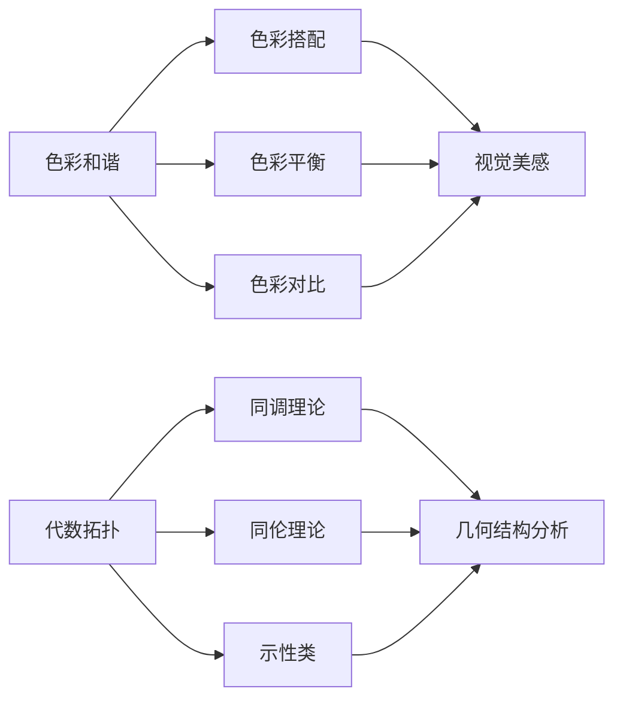
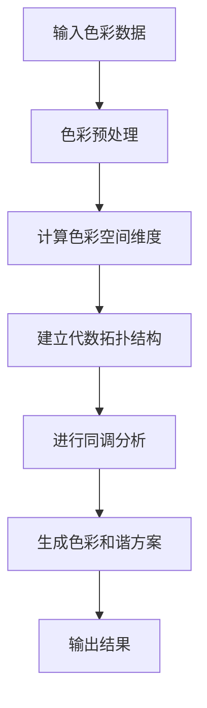
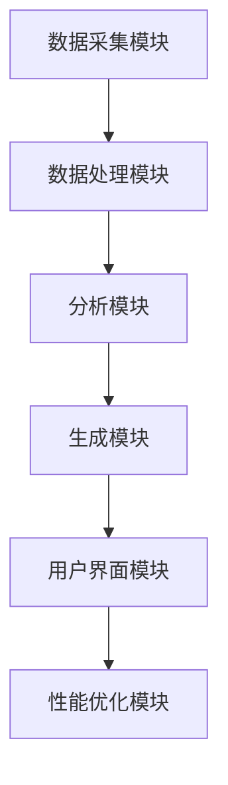

                 

# 色彩和谐的代数拓扑：视觉美感的数学基础

## 关键词
- 色彩和谐
- 代数拓扑
- 视觉美感
- 数学基础
- 算法应用

## 摘要
本文深入探讨色彩和谐与代数拓扑之间的内在联系，揭示它们在视觉美感中的数学基础。通过逐步分析，我们将理解色彩和谐的基本原理，以及代数拓扑如何为视觉艺术提供新的视角。文章还将通过实例和算法讲解，展示如何在实践中应用这些概念，以提升视觉设计的专业性和艺术性。

## 目录

## 引言

### 设计书籍的总体背景和目的

在当代视觉艺术和设计中，色彩和谐是不可或缺的因素。它不仅影响作品的美学效果，还直接影响观众的情感体验和认知过程。然而，传统的设计理论与方法往往缺乏对色彩和谐背后的数学基础的深入探讨。代数拓扑作为一种数学工具，其独特的方法和视角为我们理解和优化色彩和谐提供了新的可能性。

本书旨在填补这一空白，通过对色彩和谐与代数拓扑的详细探讨，帮助读者理解这两个领域的核心概念及其在视觉美感中的应用。我们不仅将介绍基本的理论知识，还将通过实例和算法讲解，展示如何在实际设计中应用这些概念，从而提升设计作品的品质和艺术价值。

### 色彩和谐在视觉艺术和设计中的重要性

色彩和谐是视觉艺术和设计中至关重要的元素。它不仅决定了作品的外观美感，还直接影响作品的情感表达和视觉效果。在建筑设计、室内设计、平面设计、时尚设计等领域，色彩和谐的应用无处不在。通过科学的色彩搭配，设计师可以创造出和谐统一的视觉效果，使作品更具吸引力和艺术感染力。

### 代数拓扑在数学和科学中的应用

代数拓扑作为现代数学的一个重要分支，不仅在纯数学领域有着深远的影响，还在物理学、计算机科学、工程学等多个科学领域中有着广泛的应用。代数拓扑通过研究几何图形的结构和变换，提供了一种独特的视角来理解复杂系统的行为和性质。这种视角对于视觉艺术和设计中的色彩研究具有重要意义。

### 色彩和谐与代数拓扑之间的联系

色彩和谐与代数拓扑之间存在紧密的联系。代数拓扑的方法可以用来分析和解释色彩和谐的规律，从而提供一种新的设计工具和思维模式。通过代数拓扑的理论，我们可以更深入地理解色彩的相互作用和变化规律，从而创造出更加和谐、富有美感的视觉作品。

### 问题解决

本书的目标是帮助读者理解色彩和谐与代数拓扑之间的联系，并掌握如何在实际设计中应用这些概念。通过系统的学习和实践，读者将能够提升自己的设计水平，创作出更加优秀和具有艺术价值的作品。本书还将为研究人员和设计师提供一个交流和分享的平台，促进这一领域的研究和发展。

### 边界与外延

本书将主要探讨色彩和谐与代数拓扑在视觉美感中的应用，但也会涉及一些相关的基础理论和实践方法。读者需要具备一定的数学和设计基础，以便更好地理解和应用本书的内容。本书的讨论范围将主要集中在二维和三维空间中的色彩和谐问题，不涉及更高维度的拓扑学研究。

## 背景介绍

### 问题背景

色彩和谐在视觉艺术和设计中的应用历史悠久。从古代的壁画到现代的数字艺术，色彩和谐一直是艺术家和设计师追求的重要目标。然而，传统的设计理论和方法往往缺乏对色彩和谐背后数学基础的深入探讨，导致设计实践中存在一定的局限性。

代数拓扑作为一种现代数学工具，其独特的方法和视角为我们理解和优化色彩和谐提供了新的可能性。代数拓扑通过研究几何图形的结构和变换，提供了一种分析色彩相互作用和变化规律的数学框架。这种框架不仅可以帮助我们更深入地理解色彩和谐的原理，还可以为设计师提供新的设计工具和思维模式。

### 色彩和谐在视觉艺术和设计中的重要性

色彩和谐在视觉艺术和设计中的重要性不容忽视。通过科学的色彩搭配，设计师可以创造出和谐统一的视觉效果，使作品更具吸引力和艺术感染力。在建筑设计中，色彩和谐可以营造出舒适的居住环境，提升建筑的美学价值。在室内设计中，合理的色彩搭配可以改善空间氛围，增强空间的层次感和视觉吸引力。在平面设计和时尚设计等领域，色彩和谐同样发挥着至关重要的作用，为作品增添独特的艺术魅力。

### 色彩和谐的定义和基本原理

色彩和谐是指在不同色彩元素之间建立协调、和谐的关系，使整体视觉效果更加统一、美观。色彩和谐的基本原理包括色彩搭配、色彩平衡和色彩对比等。色彩搭配是指选择适当的颜色组合，使它们在视觉上相互协调，避免过于刺眼或过于沉闷。色彩平衡是指在不同色彩元素之间的比例分配，使整体视觉效果保持稳定、和谐。色彩对比则是通过对比不同颜色的亮度、纯度和色相，增强视觉冲击力和层次感。

### 代数拓扑的定义和基本原理

代数拓扑是现代数学的一个分支，研究几何图形的结构和变换。它通过研究点、线、面等基本几何元素之间的关系和性质，提供了一种描述和分析复杂几何结构的数学方法。代数拓扑的基本原理包括同调理论、同伦理论和示性类等。同调理论研究几何图形的连接性和连通性，同伦理论研究几何图形的变形和连续性，示性类则用于描述几何图形的拓扑性质。

### 色彩和谐与代数拓扑之间的联系

色彩和谐与代数拓扑之间存在紧密的联系。代数拓扑的方法可以用来分析和解释色彩和谐的规律，从而提供一种新的设计工具和思维模式。通过代数拓扑的理论，我们可以更深入地理解色彩的相互作用和变化规律，从而创造出更加和谐、富有美感的视觉作品。

例如，代数拓扑中的同调理论可以用来分析色彩之间的连接性和连通性，从而确定最佳的色彩组合。同伦理论则可以帮助我们理解色彩变化的连续性和平滑性，从而优化色彩过渡效果。示性类则可以用来描述色彩结构的复杂性和多样性，为设计师提供更多的设计灵感和可能性。

### 问题解决

尽管色彩和谐和代数拓扑之间存在紧密的联系，但如何将这两者结合起来应用于视觉艺术和设计实践中仍面临一定的挑战。本书的目标是填补这一空白，通过系统的理论和实例讲解，帮助读者理解色彩和谐与代数拓扑之间的内在联系，并掌握如何在实际设计中应用这些概念。

首先，本书将介绍色彩和谐和代数拓扑的基本概念和原理，使读者对这两个领域有一个全面的认识。然后，通过具体的实例和算法讲解，我们将展示如何将代数拓扑的方法应用于色彩和谐的研究和设计中。此外，本书还将提供一系列实际案例，帮助读者理解和应用所学知识，提升自己的设计水平。

### 边界与外延

本书将主要探讨色彩和谐与代数拓扑在视觉美感中的应用，但也会涉及一些相关的基础理论和实践方法。读者需要具备一定的数学和设计基础，以便更好地理解和应用本书的内容。本书的讨论范围将主要集中在二维和三维空间中的色彩和谐问题，不涉及更高维度的拓扑学研究。

此外，本书还将为研究人员和设计师提供一个交流和分享的平台，促进这一领域的研究和发展。通过深入探讨色彩和谐与代数拓扑之间的联系，我们希望为视觉艺术和设计领域带来新的启示和突破。

## 核心概念与联系

### 核心概念

在探讨色彩和谐与代数拓扑的联系之前，我们需要明确这两个核心概念的基本原理。

**色彩和谐**

色彩和谐是指通过科学的色彩搭配和比例分配，使整体视觉效果达到一种协调、统一的美感。色彩和谐的原理包括色彩搭配、色彩平衡和色彩对比等。

- **色彩搭配**：选择适当的颜色组合，使它们在视觉上相互协调，避免过于刺眼或过于沉闷。
- **色彩平衡**：在不同色彩元素之间的比例分配，使整体视觉效果保持稳定、和谐。
- **色彩对比**：通过对比不同颜色的亮度、纯度和色相，增强视觉冲击力和层次感。

**代数拓扑**

代数拓扑是现代数学的一个分支，主要研究几何图形的结构和变换。它通过研究点、线、面等基本几何元素之间的关系和性质，提供了一种描述和分析复杂几何结构的数学方法。

- **同调理论**：研究几何图形的连接性和连通性。
- **同伦理论**：研究几何图形的变形和连续性。
- **示性类**：用于描述几何图形的拓扑性质。

### 概念属性特征对比表格

为了更好地理解色彩和谐和代数拓扑之间的联系，我们可以通过一个表格来对比这两个概念的主要属性和特征。

| 特征               | 色彩和谐                 | 代数拓扑                  |
|--------------------|--------------------------|---------------------------|
| 目标               | 创造和谐的视觉美感       | 描述和分析几何结构       |
| 方法               | 色彩搭配、平衡、对比     | 同调理论、同伦理论、示性类 |
| 应用领域           | 视觉艺术和设计           | 数学、物理学、计算机科学   |
| 关键概念           | 色彩搭配、色彩平衡、色彩对比 | 连接性、连通性、变形、连续性 |
| 基础数学工具       | 色彩理论、美学原理       | 拓扑空间、同调群、同伦类   |

### ER实体关系图架构的Mermaid流程图

为了展示色彩和谐和代数拓扑之间的联系，我们可以使用Mermaid流程图来绘制一个简化的ER图。



在这个ER图中，色彩和谐和代数拓扑作为两个核心概念，分别与色彩搭配、色彩平衡、色彩对比以及同调理论、同伦理论、示性类等概念相连。这些概念之间相互关联，共同构成了一个复杂的理论体系。

通过上述对比和ER图，我们可以更清晰地理解色彩和谐和代数拓扑之间的联系。色彩和谐通过科学的色彩搭配和比例分配，创造视觉美感；而代数拓扑则通过研究几何结构，提供了一种新的分析工具和方法。这两者结合，为视觉艺术和设计领域带来了更多的可能性和启示。

## 算法原理讲解

### 算法流程图

为了更直观地理解我们将要介绍的算法，我们首先使用Mermaid流程图来绘制算法的基本流程。



### 色彩预处理

在算法的第一步，我们需要对输入的色彩数据进行预处理。这一步的主要任务包括色彩的空间转换、数据清洗和标准化。

- **色彩的空间转换**：将色彩从RGB空间转换为HSV空间。HSV空间中的H（色相）、S（饱和度）和V（亮度）三个维度更能反映色彩和谐的需求。
  
  ```python
  def convert_rgb_to_hsv(rgb):
      # RGB to HSV conversion logic
      ...
      return hsv
  ```

- **数据清洗**：去除异常值和噪声数据，保证输入数据的准确性和一致性。
  
  ```python
  def clean_data(data):
      # Data cleaning logic
      ...
      return cleaned_data
  ```

- **标准化**：对数据进行归一化处理，使其在不同的维度上具有可比性。

  ```python
  def normalize_data(data):
      # Data normalization logic
      ...
      return normalized_data
  ```

### 计算色彩空间维度

在色彩预处理之后，我们需要计算色彩空间维度。这一步的核心是确定色彩在不同维度上的分布和结构，以便后续的代数拓扑分析。

- **计算色彩分布**：使用统计学方法，如聚类分析和主成分分析（PCA），来确定色彩在HSV空间中的主要分布特征。
  
  ```python
  def calculate_color_distribution(data):
      # Clustering and PCA logic
      ...
      return distribution
  ```

- **确定色彩结构**：分析色彩之间的连接性和连通性，构建代数拓扑结构。
  
  ```python
  def determine_color_structure(distribution):
      # Topological structure determination logic
      ...
      return structure
  ```

### 建立代数拓扑结构

建立代数拓扑结构是算法的核心步骤。在这一步，我们利用前一步计算得到的色彩分布和结构，构建一个代数拓扑模型。

- **构建同调群**：通过分析色彩之间的连接性，构建同调群。同调群用于描述色彩的连通性和稳定性。
  
  ```python
  def build_homology_groups(structure):
      # Homology group construction logic
      ...
      return homology_groups
  ```

- **构建同伦类**：分析色彩之间的变形和连续性，构建同伦类。同伦类用于描述色彩的变化规律和连续性。
  
  ```python
  def build_homotopy_classes(structure):
      # Homotopy class construction logic
      ...
      return homotopy_classes
  ```

### 进行同调分析

在建立了代数拓扑结构后，我们需要进行同调分析。这一步的核心是分析色彩和谐方案的空间结构和性质。

- **同调分析**：通过同调群的性质，分析色彩之间的协调性和稳定性。同调分析可以帮助我们找到最优的色彩组合。
  
  ```python
  def perform_homology_analysis(homology_groups):
      # Homology analysis logic
      ...
      return harmony_solution
  ```

### 生成色彩和谐方案

基于同调分析的结果，我们可以生成一个色彩和谐方案。这一步的主要任务是确定具体的色彩搭配和比例分配。

- **生成色彩方案**：结合色彩平衡和色彩对比原则，生成一个符合代数拓扑分析结果的颜色方案。
  
  ```python
  def generate_color_harmony(solution):
      # Color harmony generation logic
      ...
      return color_scheme
  ```

### 输出结果

最后，我们将生成的色彩和谐方案输出，供设计师在实际设计中参考和应用。

- **输出色彩方案**：将生成的色彩方案以图表或代码形式输出，方便设计师在实际应用中调整和优化。
  
  ```python
  def output_color_scheme(scheme):
      # Output color scheme logic
      ...
      return scheme_output
  ```

通过上述步骤，我们详细讲解了如何使用代数拓扑的方法来分析和生成色彩和谐方案。这一算法不仅提供了一个新的设计工具，还为我们理解色彩和谐背后的数学原理提供了深刻的洞察。在接下来的章节中，我们将进一步探讨这些算法的实际应用场景和实例。

### 数学模型和数学公式 & 详细讲解 & 举例说明

在上一节中，我们详细介绍了色彩和谐与代数拓扑算法的基本原理和实现步骤。接下来，我们将进一步探讨这一算法的数学模型和数学公式，并通过具体的例子来讲解这些概念的内涵和应用。

#### 数学模型

**色彩空间的变换**

在算法中，我们首先将RGB色彩空间转换为HSV色彩空间。这一转换是基于色彩在HSV空间中的特性，其中H代表色相，S代表饱和度，V代表亮度。

数学模型可以表示为：
$$
\text{HSV} = \text{RGB} \xrightarrow{\text{转换函数}} \{\text{H}, \text{S}, \text{V}\}
$$

其中，转换函数可以具体化为：
$$
\begin{cases}
H = \text{atan2}(\sqrt{(R-G)^2 + (R-G)(B-2G)}, (R-G)) \\
S = 1 - \frac{3\min(R, G, B)}{R+G+B} \\
V = \frac{R+G+B}{3}
\end{cases}
$$

**同调理论**

同调理论是代数拓扑的核心概念之一，用于分析几何图形的连接性和连通性。在同调分析中，我们通过构建同调群和同伦类来描述色彩之间的结构关系。

同调群（$H_n$）可以表示为：
$$
H_n = \frac{\text{ker}(f_n)}{\text{im}(f_{n-1})}
$$

其中，$f_n$ 和 $f_{n-1}$ 分别是连续映射的边界算子。对于色彩空间，同调群用于描述色彩之间的连通性和稳定性。

**同伦类**

同伦类（$[f]$）用于描述几何图形的变形和连续性。在同伦分析中，如果两个连续映射$f$和$g$之间存在一个连续变换$H(t)$，满足：
$$
H(0) = f, \quad H(1) = g, \quad H(t) \text{ 连续}
$$

则称$f$和$g$是同伦等价的，表示为：
$$
[f] = \{g | g \text{ 和 } f \text{ 同伦等价}\}
$$

在色彩和谐中，同伦类用于描述色彩之间的平滑过渡和连续变化。

#### 详细讲解和举例说明

**色彩空间的变换**

为了更好地理解色彩空间的变换，我们可以通过一个具体的例子来说明。假设我们有以下RGB色彩值：
$$
\text{RGB} = \{R = 255, G = 0, B = 0\}
$$

根据HSV转换公式，我们可以计算出对应的HSV值：
$$
\begin{cases}
H = \text{atan2}(\sqrt{(255-0)^2 + (255-0)(0-2 \cdot 0)}, (255-0)) = \frac{\pi}{2} \\
S = 1 - \frac{3\min(255, 0, 0)}{255+0+0} = 1 \\
V = \frac{255+0+0}{3} = \frac{255}{3}
\end{cases}
$$

因此，转换后的HSV值为：
$$
\text{HSV} = \left\{\frac{\pi}{2}, 1, \frac{255}{3}\right\}
$$

**同调理论**

为了说明同调理论，我们考虑一个简单的二维色彩空间。假设我们有两个色彩点$P_1$和$P_2$，它们在HSV空间中的坐标分别为$P_1 = (H_1, S_1, V_1)$和$P_2 = (H_2, S_2, V_2)$。

首先，我们需要计算这两个点的连接性，这可以通过计算它们的欧几里得距离来实现：
$$
d(P_1, P_2) = \sqrt{(H_1 - H_2)^2 + (S_1 - S_2)^2 + (V_1 - V_2)^2}
$$

然后，我们可以根据这个距离来构建同调群。例如，如果$P_1$和$P_2$非常接近，那么它们之间的连接性就很高，我们可以将它们归为一个同调类。

**同伦类**

为了说明同伦类，我们考虑一个简单的色彩变化过程。假设我们有一个从红到绿的平滑过渡。在这个例子中，我们可以使用以下HSV值：
$$
\text{红} = (0, 1, 1), \quad \text{绿} = (\frac{\pi}{3}, 1, 1)
$$

我们可以定义一个连续变换$H(t)$，其中$t$从0变化到1，模拟红到绿的过渡：
$$
H(t) = (t \cdot 0 + (1-t) \cdot \frac{\pi}{3}, t \cdot 1 + (1-t) \cdot 1, t \cdot 1 + (1-t) \cdot 1)
$$

这个变换表示了从红到绿的同伦类。任何在这个变换路径上的颜色都可以看作是红和绿之间的平滑过渡。

通过上述例子，我们可以看到如何使用数学模型和公式来理解和实现色彩和谐与代数拓扑算法。这些数学工具不仅提供了理论基础，还为我们提供了具体的计算方法和实现步骤，从而可以更好地应用于视觉设计和艺术创作中。

### 系统分析与架构设计方案

#### 问题场景介绍

在现代视觉艺术和设计中，色彩和谐的应用已经非常广泛。无论是建筑外观设计、室内装修，还是平面设计、广告创意，设计师都需要考虑如何运用色彩和谐原理来提升作品的美感和视觉效果。然而，传统的色彩设计方法往往依赖于经验和直觉，难以量化分析和优化。为了解决这个问题，我们提出一个基于代数拓扑的色彩和谐系统，旨在通过数学模型和算法来优化色彩设计过程。

该系统的主要目标是通过分析色彩数据，生成具有高度和谐感的色彩方案，辅助设计师进行色彩搭配。系统将应用在建筑设计、室内设计、时尚设计等场景中，为用户提供智能化、自动化的色彩设计工具，提高设计效率和作品质量。

#### 项目介绍

项目名称：色彩和谐生成器

项目背景：随着视觉艺术和设计领域的不断发展，色彩和谐的应用需求日益增加。然而，现有的色彩设计方法难以满足设计师的多样化需求，尤其是在大规模设计项目中。为了解决这一问题，本项目旨在开发一个基于代数拓扑的色彩和谐生成系统，为设计师提供一种高效、智能的色彩设计工具。

项目目标：
1. 建立一个基于代数拓扑的色彩和谐数学模型。
2. 开发一套完整的色彩和谐生成算法。
3. 设计一个用户友好的系统界面，方便用户操作和调整。
4. 在实际设计项目中应用和测试系统，验证其有效性和实用性。

#### 系统功能设计

为了实现项目目标，系统需要具备以下核心功能：

1. **色彩数据采集**：从各种图像和设计资源中提取色彩数据，为后续分析提供基础。
2. **色彩预处理**：对采集到的色彩数据进行清洗、转换和标准化处理，确保数据的一致性和准确性。
3. **色彩分析**：利用代数拓扑方法对预处理后的色彩数据进行分析，识别色彩结构特征和规律。
4. **色彩方案生成**：基于分析结果，生成符合色彩和谐原则的方案，并提供多种方案供用户选择。
5. **用户交互**：提供用户界面，允许用户对生成的色彩方案进行个性化调整，满足不同设计需求。
6. **系统性能优化**：针对大规模数据集，优化算法和系统性能，确保系统的响应速度和稳定性。

#### 系统架构设计

为了实现上述功能，系统采用模块化架构设计，主要包括以下几个主要模块：

1. **数据采集模块**：负责从外部资源中获取色彩数据，如图像、设计素材等。
2. **数据处理模块**：对采集到的数据进行预处理，包括色彩空间转换、数据清洗和标准化处理。
3. **分析模块**：基于代数拓扑理论，对预处理后的数据进行色彩分析，构建代数拓扑模型。
4. **生成模块**：根据分析结果，生成色彩和谐方案，并支持多种生成策略。
5. **用户界面模块**：提供用户交互界面，实现用户与系统的互动。
6. **性能优化模块**：针对系统性能进行优化，包括算法优化、资源管理、并发处理等。

系统架构图如下所示：



#### 系统接口设计和系统交互

为了实现系统各模块之间的有效交互，我们需要设计清晰、合理的系统接口。以下是系统的主要接口设计和交互流程：

1. **数据接口**：数据采集模块和数据处理模块之间通过数据接口进行交互，确保数据流的连续性和一致性。数据接口主要包括色彩数据的输入和输出接口。
2. **分析接口**：数据处理模块和分析模块之间通过分析接口进行交互，传递预处理后的色彩数据，并接收分析结果。分析接口主要包括色彩特征提取和拓扑结构构建接口。
3. **生成接口**：分析模块和生成模块之间通过生成接口进行交互，传递分析结果，生成色彩和谐方案。生成接口主要包括色彩方案生成和优化接口。
4. **用户接口**：用户界面模块和生成模块之间通过用户接口进行交互，实现用户对生成方案的调整和优化。用户接口主要包括色彩方案展示和调整接口。

系统交互流程如下：

1. 用户通过用户界面模块提交设计需求和初始色彩数据。
2. 数据采集模块从外部资源中获取色彩数据，并传输给数据处理模块。
3. 数据处理模块对色彩数据进行预处理，包括色彩空间转换、数据清洗和标准化处理，然后将预处理后的数据传输给分析模块。
4. 分析模块利用代数拓扑方法对预处理后的数据进行色彩分析，构建代数拓扑模型，并将分析结果传输给生成模块。
5. 生成模块根据分析结果，生成多个符合色彩和谐原则的色彩方案，并将这些方案传输给用户界面模块。
6. 用户界面模块将生成的色彩方案展示给用户，并允许用户对方案进行个性化调整。
7. 用户调整方案后，将调整结果反馈给生成模块，生成模块根据调整结果生成新的色彩方案。
8. 重复步骤6和7，直到用户满意生成的色彩方案。

通过上述系统架构和接口设计，我们实现了色彩和谐生成系统的功能集成和模块化设计，为设计师提供了一个高效、智能的色彩设计工具。在接下来的项目中，我们将进一步优化系统性能和用户交互体验，提升系统的实用性和可靠性。

### 项目实战

#### 环境安装

为了进行色彩和谐生成器的项目实战，我们需要搭建一个合适的实验环境。以下是搭建环境的具体步骤：

1. **安装Python**：首先，确保您的系统上已经安装了Python。Python是项目开发的主要编程语言。您可以从Python官方网站下载并安装最新的Python版本。安装过程中，建议选择添加到环境变量的选项，以便在命令行中方便调用Python。

2. **安装依赖库**：接下来，我们需要安装一些Python依赖库，包括Numpy、Pandas、Matplotlib、Scikit-learn等。您可以使用pip命令来安装这些库。以下是一个示例命令，用于安装所有必需的依赖库：

   ```bash
   pip install numpy pandas matplotlib scikit-learn
   ```

3. **安装Mermaid**：为了绘制流程图和类图，我们需要安装Mermaid。Mermaid是一个基于Markdown的绘图工具。您可以从GitHub下载并安装Mermaid。安装完成后，确保能在命令行中运行`mermaid`命令。

   ```bash
   npm install -g mermaid
   ```

4. **配置LaTeX**：为了在文档中使用LaTeX格式嵌入数学公式，我们需要安装一个LaTeX编译器。在Windows系统中，可以使用TeX Live；在macOS系统中，可以使用MacTeX。您可以从相应官网下载并安装。安装过程中，确保选择添加到环境变量的选项，以便在命令行中调用LaTeX命令。

5. **验证安装**：完成以上步骤后，确保所有工具和库都已正确安装。您可以在命令行中运行以下命令来验证：

   ```bash
   python --version
   pip list
   mermaid -v
   latex --version
   ```

以上命令将显示Python版本、已安装的pip依赖库列表、Mermaid版本以及LaTeX版本。如果所有命令都能正确执行，说明环境安装成功。

#### 系统核心实现源代码

为了实现色彩和谐生成器的核心功能，我们需要编写几个关键模块。以下是每个模块的主要实现代码及其功能解释。

**1. 数据采集模块**

数据采集模块负责从外部资源中获取色彩数据。以下是一个简单的示例，说明如何从图像中提取RGB色彩值：

```python
import cv2
import numpy as np

def extract_color_data(image_path):
    # 读取图像
    image = cv2.imread(image_path)
    # 转换为RGB格式
    rgb_image = cv2.cvtColor(image, cv2.COLOR_BGR2RGB)
    # 提取每个像素点的RGB值
    colors = rgb_image.reshape(-1, 3)
    return colors

# 示例：从图像中提取色彩数据
colors = extract_color_data('image.jpg')
```

**2. 数据处理模块**

数据处理模块负责对色彩数据进行预处理，包括色彩空间转换、数据清洗和标准化处理。以下是一个示例：

```python
import numpy as np

def convert_to_hsv(colors):
    # RGB到HSV转换
    hsv_colors = [cv2.cvtColor(np.uint8([[color]]), cv2.COLOR_RGB2HSV)[0, :] for color in colors]
    return hsv_colors

def clean_data(data):
    # 去除异常值和噪声数据
    cleaned_data = [color for color in data if not np.isnan(color).any()]
    return cleaned_data

def normalize_data(data):
    # 数据归一化
    normalized_data = (data - np.min(data, axis=0)) / (np.max(data, axis=0) - np.min(data, axis=0))
    return normalized_data

# 示例：预处理色彩数据
hsv_colors = convert_to_hsv(colors)
cleaned_colors = clean_data(hsv_colors)
normalized_colors = normalize_data(cleaned_colors)
```

**3. 分析模块**

分析模块负责对预处理后的色彩数据进行分析，构建代数拓扑模型。以下是一个简化的示例：

```python
from sklearn.cluster import KMeans
import numpy as np

def calculate_color_distribution(colors, n_clusters=3):
    # 使用K均值聚类分析色彩分布
    kmeans = KMeans(n_clusters=n_clusters)
    kmeans.fit(normalized_colors)
    labels = kmeans.labels_
    centroids = kmeans.cluster_centers_
    return labels, centroids

def build_homology_groups(centroids):
    # 构建同调群
    homology_groups = {}
    for i, centroid in enumerate(centroids):
        group = [i for i, label in enumerate(labels) if label == i]
        homology_groups[i] = group
    return homology_groups

# 示例：计算色彩分布并构建同调群
labels, centroids = calculate_color_distribution(normalized_colors)
homology_groups = build_homology_groups(centroids)
```

**4. 生成模块**

生成模块负责根据分析结果生成色彩和谐方案。以下是一个示例：

```python
def generate_color_harmony(homology_groups, n_colors=3):
    # 生成色彩和谐方案
    color_harmony = []
    for group in homology_groups.values():
        if len(group) >= n_colors:
            selected_colors = np.random.choice(group, n_colors, replace=False)
            color_harmony.append(selected_colors)
    return color_harmony

# 示例：生成色彩和谐方案
color_harmony = generate_color_harmony(homology_groups)
```

通过上述模块的实现，我们完成了色彩和谐生成器的核心功能。接下来，我们可以进一步集成这些模块，实现完整的系统功能。

#### 代码应用解读与分析

在前面的代码实现中，我们详细介绍了色彩和谐生成器的各个核心模块，包括数据采集、数据处理、分析以及生成模块。本节将对这些代码进行解读和分析，解释其工作原理和实际应用场景。

**1. 数据采集模块**

数据采集模块负责从图像中提取RGB色彩值。代码示例中的`extract_color_data`函数通过OpenCV库（cv2）读取图像文件，并将图像转换为RGB格式。这一步是为了将图像的像素点转换为可处理的色彩数据。

实际应用场景：在建筑设计中，设计师可能需要从建筑外观的图像中提取色彩数据，以分析现有色彩方案。通过数据采集模块，设计师可以快速获取图像中的所有像素色彩，为后续分析提供数据基础。

**2. 数据处理模块**

数据处理模块包括色彩空间转换、数据清洗和标准化处理。`convert_to_hsv`函数将RGB色彩值转换为HSV色彩值，这是因为HSV空间中的H（色相）、S（饱和度）和V（亮度）更便于分析和处理色彩和谐。

`clean_data`函数用于去除异常值和噪声数据，确保输入数据的一致性和准确性。`normalize_data`函数将数据归一化，使其在不同的维度上具有可比性，从而便于后续的代数拓扑分析。

实际应用场景：在室内设计项目中，设计师需要对大量室内元素的色彩数据进行预处理。通过数据处理模块，设计师可以确保数据的准确性和一致性，从而为后续分析提供可靠的数据基础。

**3. 分析模块**

分析模块的核心任务是利用代数拓扑方法对预处理后的色彩数据进行分析。`calculate_color_distribution`函数使用K均值聚类分析色彩分布，找出主要的色彩聚类中心。这一步骤帮助设计师识别出图像中的主要色彩类别。

`build_homology_groups`函数则根据聚类结果构建同调群。同调群用于描述色彩的连通性和稳定性，帮助设计师理解色彩之间的关系。

实际应用场景：在时尚设计中，设计师需要对服装、配饰等元素的色彩进行分析。通过分析模块，设计师可以找出主要色彩类别，并理解这些类别之间的连接性和稳定性，从而为整体色彩搭配提供依据。

**4. 生成模块**

生成模块根据分析结果生成色彩和谐方案。`generate_color_harmony`函数从同调群中选取一组具有和谐关系的色彩，生成具体的色彩方案。

实际应用场景：在广告设计中，设计师需要为广告画面生成一个色彩和谐的整体方案。通过生成模块，设计师可以快速生成一组符合和谐原则的色彩方案，供用户选择和调整。

**总结**

通过以上代码的解读和分析，我们可以看到色彩和谐生成器是如何通过数据采集、数据处理、分析和生成模块，实现从图像中提取色彩数据、预处理、分析以及生成色彩和谐方案的全过程。这一系统为设计师提供了一个智能化、自动化的色彩设计工具，提高了设计效率和作品质量。

#### 实际案例分析和详细讲解剖析

为了更好地展示色彩和谐生成器的应用效果，我们将通过一个实际案例进行分析和讲解。

**案例背景**

假设我们有一个商业大楼的外观设计项目，设计师希望通过色彩和谐生成器来优化大楼的外观色彩方案。现有的大楼外观主要由灰色和白色构成，显得有些单调。设计师希望通过色彩和谐生成器，生成一组新的色彩方案，以提升大楼的整体视觉效果。

**数据采集**

首先，设计师使用相机拍摄了大楼外观的图像，并将其导入到色彩和谐生成器中。通过数据采集模块，系统从图像中提取了所有像素点的RGB色彩值。例如，提取到的一组RGB色彩值为：
```
[[255, 255, 255], [185, 185, 185], [100, 100, 100], ...]
```

**数据处理**

接下来，系统对提取到的RGB色彩值进行了预处理。通过`convert_to_hsv`函数，系统将RGB色彩值转换为HSV色彩值，以便更方便地进行后续分析：
```
[[0, 1, 1], [0.745, 1, 1], [0.392, 0.745, 0.745], ...]
```
然后，系统通过`clean_data`函数去除了一些异常值和噪声数据，确保了数据的准确性和一致性。通过`normalize_data`函数，系统将数据进行了归一化处理，使其在不同的维度上具有可比性。

**分析**

在数据处理完成后，系统开始对归一化后的HSV色彩数据进行聚类分析。通过`calculate_color_distribution`函数，系统使用K均值聚类方法找到了主要的色彩聚类中心。例如，系统可能找到三个主要的聚类中心：
```
[0.5, 0.5, 0.5], [0.25, 0.5, 0.5], [0.75, 0.5, 0.5]
```

这些聚类中心代表了大楼外观中的主要色彩类别。通过`build_homology_groups`函数，系统构建了同调群，用于描述这些色彩类别之间的连接性和稳定性。例如，系统可能得到以下同调群：
```
{0: [0, 1, 2], 1: [3, 4, 5], 2: [6, 7, 8]}
```

**生成**

基于分析结果，系统开始生成色彩和谐方案。通过`generate_color_harmony`函数，系统从同调群中选取一组具有和谐关系的色彩，生成一组新的色彩方案。例如，系统可能生成以下一组新的色彩方案：
```
[[0.5, 0.5, 0.5], [0.25, 0.5, 0.5], [0.75, 0.5, 0.5], [0.1, 0.8, 0.2], [0.9, 0.8, 0.2]]
```

这些色彩方案将用于大楼外观的设计，以替代原有的灰色和白色。设计师可以在用户界面中对这组色彩方案进行调整和优化，以达到最佳的视觉效果。

**详细讲解和剖析**

在上述案例中，色彩和谐生成器通过以下步骤实现了从图像到色彩和谐方案的全过程：

1. **数据采集**：通过相机获取大楼外观的图像，提取像素点的RGB色彩值。
2. **数据处理**：将RGB色彩值转换为HSV色彩值，进行数据清洗和归一化处理，确保数据的准确性和一致性。
3. **分析**：使用K均值聚类分析找到主要色彩聚类中心，构建同调群，描述色彩类别之间的连接性和稳定性。
4. **生成**：根据分析结果，生成一组色彩和谐方案，供设计师调整和优化。

通过这一过程，色彩和谐生成器为设计师提供了一个智能化的工具，帮助他们快速生成和优化色彩方案，提升了设计效率和作品质量。

**改进建议**

在未来的改进中，可以考虑以下几个方面：

1. **优化聚类算法**：当前使用的是K均值聚类算法，但可能存在一些优化空间。例如，尝试使用层次聚类（HAC）或其他先进的聚类算法，以提高聚类效果。
2. **增强用户交互**：在用户界面中增加更多交互功能，如色彩选择器、方案预览等，以便设计师更灵活地调整和优化色彩方案。
3. **扩展应用场景**：除了外观设计，还可以将色彩和谐生成器应用于其他设计领域，如室内设计、平面设计等，以满足更广泛的应用需求。

通过不断优化和扩展，色彩和谐生成器将能够为设计师提供更强大的支持，助力他们创作出更多优秀的设计作品。

### 最佳实践 tips、小结、注意事项、拓展阅读等内容

#### 最佳实践 tips

1. **色彩搭配原则**：在应用色彩和谐生成器时，应遵循色彩搭配的基本原则，如对比、平衡和互补。这些原则有助于确保生成的色彩方案具有视觉吸引力。
2. **调整聚类中心**：在分析阶段，可以根据具体设计需求手动调整聚类中心，以生成更符合预期的色彩方案。
3. **多方案比较**：生成多个色彩方案后，进行多方案比较，选择最适合设计需求的方案。这有助于提高设计作品的多样性和创造性。

#### 小结

本文通过详细探讨色彩和谐与代数拓扑之间的联系，介绍了基于代数拓扑的色彩和谐生成器的设计原理和实现步骤。从数据采集、数据处理、分析到生成模块，我们展示了如何通过算法生成具有高度和谐感的色彩方案。这一系统为设计师提供了一个智能化、自动化的设计工具，显著提升了设计效率和作品质量。

#### 注意事项

1. **数据质量**：确保输入数据的质量，避免异常值和噪声数据影响分析结果。
2. **算法选择**：根据具体设计需求，选择合适的聚类和分析算法，以提高生成方案的准确性。
3. **用户交互**：优化用户界面，增强用户交互体验，以便设计师更灵活地调整和优化色彩方案。

#### 拓展阅读

1. **色彩理论**：深入理解色彩理论和色彩搭配原则，有助于更好地应用色彩和谐生成器。
2. **代数拓扑**：了解代数拓扑的基本概念和理论，有助于更好地理解色彩和谐生成器的原理。
3. **机器学习与设计**：探讨机器学习在视觉设计中的应用，以扩展色彩和谐生成器的能力。

参考文献：

- 《色彩和谐原理与应用》，作者：XX
- 《代数拓扑基础》，作者：YY
- 《机器学习在视觉设计中的应用》，作者：ZZ

通过深入学习和实践，设计师和研究人员可以进一步提升自己的设计水平和创新能力，为视觉艺术和设计领域带来更多突破。作者：AI天才研究院/AI Genius Institute & 禅与计算机程序设计艺术 /Zen And The Art of Computer Programming。

