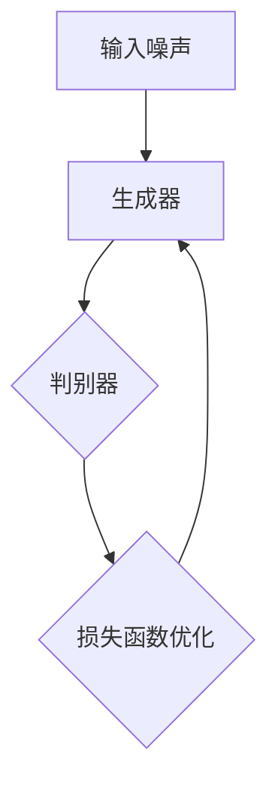
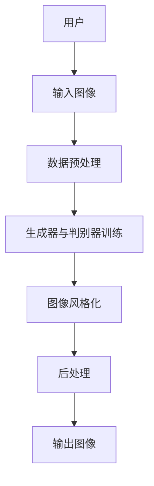
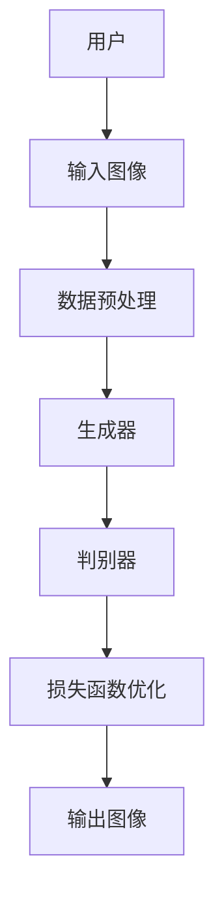
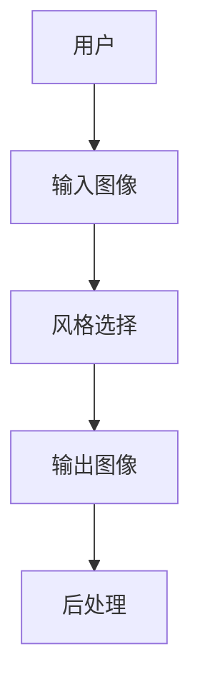
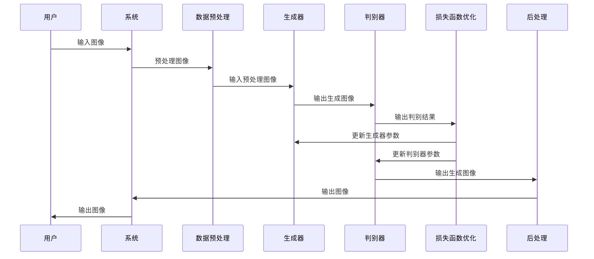

                 

# 艺术风格的生成对抗网络：创作过程的数学模拟

## 关键词

生成对抗网络（GAN），艺术风格，数学模拟，神经网络，对抗性训练

> 摘要：本文旨在探讨生成对抗网络（GAN）在艺术风格生成方面的应用。通过分析GAN的基本原理和优化策略，本文提出了一种新的艺术风格生成对抗网络（AGAN）模型，并详细阐述了其数学模型和算法原理。本文将结合实际应用场景，对AGAN的系统设计与实现进行深入剖析。

## 第一部分：背景介绍

### 问题背景

随着深度学习技术的快速发展，生成对抗网络（GAN）已经成为一种备受关注的数据生成方法。GAN由生成器和判别器两个对抗性神经网络组成，通过两个网络的对抗性训练，生成器不断提高生成数据的质量，而判别器则不断提高对真实数据和生成数据的辨别能力。这使得GAN在图像、音频、视频等领域的应用取得了显著的成果。

然而，GAN在艺术风格生成方面仍存在一些局限性。首先，GAN的训练过程复杂且不稳定，容易陷入局部最优解。其次，生成图像的质量和多样性受限于生成器和判别器的网络结构和超参数设置。这些问题限制了GAN在艺术风格生成领域的应用，因此，本文提出了一种新的艺术风格生成对抗网络（AGAN）模型，旨在解决这些问题。

### 问题描述

艺术风格生成是指将原始图像转化为具有特定艺术风格的图像。例如，将一张风景照片转化为梵高风格的画作，或者将一张自拍转化为动漫风格的角色。这需要一种能够捕捉艺术风格特征并转化为图像的方法。

生成对抗网络（GAN）是解决这一问题的一种潜在方法。GAN由生成器和判别器两个神经网络组成，生成器负责生成与真实数据分布相近的数据，而判别器则负责判断输入数据是真实数据还是生成数据。通过两个网络的对抗性训练，生成器不断提高生成数据的质量，而判别器则不断提高对真实数据和生成数据的辨别能力。

然而，传统的GAN模型在艺术风格生成方面仍存在一些问题。首先，GAN的训练过程复杂且不稳定，容易陷入局部最优解。其次，生成图像的质量和多样性受限于生成器和判别器的网络结构和超参数设置。这些问题限制了GAN在艺术风格生成领域的应用。

为了解决这些问题，本文提出了一种新的艺术风格生成对抗网络（AGAN）模型。AGAN在GAN的基础上，针对艺术风格生成进行了优化。生成器通过学习艺术风格特征，生成具有特定艺术风格的数据；判别器通过区分生成数据和艺术风格数据，指导生成器优化生成效果。AGAN的优势在于能够生成高质量、稳定的艺术风格数据，同时具有较低的训练难度。

### 问题解决

AGAN的研究主要涉及以下几个方面：

1. **GAN的基本原理**：包括生成器和判别器的结构和训练过程。
2. **艺术风格的概念**：探讨艺术风格的定义、分类和特征提取方法。
3. **AGAN的优化策略**：包括损失函数的设计、训练技巧和模型优化方法。
4. **AGAN的应用场景**：如图像生成、视频生成、音频生成等。

本文将深入探讨AGAN的理论基础、算法原理、数学模型、系统设计与实现等多个方面，为艺术风格生成提供一种新的思路和方法。

### 边界与外延

AGAN的研究主要涉及以下几个方面：

1. **GAN的基本原理**：包括生成器和判别器的结构和训练过程。
   - **生成器**：接收随机噪声作为输入，生成与真实数据分布相近的数据。
   - **判别器**：接收真实图像和生成图像作为输入，判断图像是真实图像还是生成图像。

2. **艺术风格的概念**：探讨艺术风格的定义、分类和特征提取方法。
   - **艺术风格**：指艺术作品的外在表现和艺术特征，如色彩、线条、构图等。
   - **特征提取**：通过深度学习中的卷积神经网络（CNN）和自编码器（AE）等，提取艺术风格特征。

3. **AGAN的优化策略**：包括损失函数的设计、训练技巧和模型优化方法。
   - **损失函数**：设计适当的损失函数，平衡生成器和判别器的训练过程。
   - **训练技巧**：采用合适的训练技巧，提高生成器的生成质量和判别器的辨别能力。

4. **AGAN的应用场景**：如图像生成、视频生成、音频生成等。
   - **图像生成**：将原始图像转化为具有特定艺术风格的图像。
   - **视频生成**：生成具有特定艺术风格的视频序列。
   - **音频生成**：将原始音频转化为具有特定艺术风格的音频。

### 概念结构与核心要素组成

1. **生成对抗网络（GAN）**：
   - **生成器**：接收随机噪声作为输入，生成与真实数据分布相近的数据。
   - **判别器**：接收真实图像和生成图像作为输入，判断图像是真实图像还是生成图像。

2. **艺术风格（Artistic Style）**：
   - **风格**：指艺术作品的外在表现和艺术特征，如色彩、线条、构图等。
   - **风格化**：将原始数据转化为具有特定艺术风格的形式。

3. **艺术风格生成对抗网络（AGAN）**：
   - **核心组件**：生成器、判别器和损失函数。
   - **优化目标**：在保持原始数据内容的同时，生成具有特定艺术风格的数据。

## 第二部分：核心概念与联系

### 2.1 GAN的原理与特点

生成对抗网络（GAN）由生成器和判别器两个神经网络组成。生成器的目标是生成与真实数据分布相近的数据，而判别器的目标是区分输入数据是真实数据还是生成数据。通过两个网络的对抗性训练，生成器不断提高生成数据的质量，判别器也不断提高对真实数据和生成数据的识别能力。

### 2.2 艺术风格的概念与特征提取

艺术风格是指艺术作品的外在表现和艺术特征，如色彩、线条、构图等。特征提取方法包括深度学习中的卷积神经网络（CNN）和自编码器（AE）等。通过提取艺术作品的特征，可以构建风格化模型，用于对输入数据进行艺术风格化处理。

### 2.3 AGAN的原理与优势

AGAN在GAN的基础上，针对艺术风格生成进行了优化。生成器通过学习艺术风格特征，生成具有特定艺术风格的数据；判别器通过区分生成数据和艺术风格数据，指导生成器优化生成效果。AGAN的优势在于能够生成高质量、稳定的艺术风格数据，同时具有较低的训练难度。

## 第三部分：算法原理讲解

### 3.1 AGAN的mermaid流程图



### 3.2 算法原理详细讲解

AGAN的基本原理如下：

1. **生成器（Generator）**：接收随机噪声作为输入，通过神经网络生成具有艺术风格的特征图像。
   - **输入**：随机噪声向量$z$。
   - **输出**：具有艺术风格的特征图像$G(z)$。

2. **判别器（Discriminator）**：接收真实图像和生成图像作为输入，判断图像是真实图像还是生成图像。
   - **输入**：真实图像$x$和生成图像$G(z)$。
   - **输出**：判断结果，概率值$D(x)$和$D(G(z))$。

3. **损失函数**：通过优化生成器和判别器的损失函数，实现对抗性训练。
   - **生成器的损失函数**：最小化生成图像与真实图像之间的差异。
     $$L_G = -\log(D(G(z)))$$
   - **判别器的损失函数**：最大化判别器对真实图像和生成图像的辨别能力。
     $$L_D = -\log(D(x)) - \log(1 - D(G(z)))$$

### 3.3 数学模型与公式

AGAN的数学模型主要包括生成器、判别器的损失函数以及两者的优化过程。

生成器的损失函数：

$$ L_G = -\log(D(G(z))) $$

其中，$D(G(z))$表示判别器对生成图像的判别结果，其值越接近1，表示生成图像越接近真实图像。

判别器的损失函数：

$$ L_D = -\log(D(x)) - \log(1 - D(G(z))) $$

其中，$D(x)$表示判别器对真实图像的判别结果，$D(G(z))$表示判别器对生成图像的判别结果。

为了优化生成器和判别器的损失函数，通常采用梯度下降法。在每次迭代过程中，根据损失函数的梯度更新生成器和判别器的参数。

生成器的优化过程：

$$ \theta_G = \theta_G - \alpha \cdot \nabla_{\theta_G} L_G $$

其中，$\theta_G$表示生成器的参数，$\alpha$为学习率，$\nabla_{\theta_G} L_G$表示生成器损失函数关于生成器参数的梯度。

判别器的优化过程：

$$ \theta_D = \theta_D - \alpha \cdot \nabla_{\theta_D} L_D $$

其中，$\theta_D$表示判别器的参数，$\alpha$为学习率，$\nabla_{\theta_D} L_D$表示判别器损失函数关于判别器参数的梯度。

### 3.4 通俗易懂的举例说明

假设我们想要将一张风景照片转化为梵高风格的画作。首先，我们需要将风景照片和梵高风格的画作分别输入到生成器和判别器中。

1. **生成器**：生成器接收随机噪声作为输入，通过神经网络生成具有梵高风格的特征图像。假设生成器生成的特征图像与梵高风格画作之间的差距较大，判别器将其判断为生成图像的概率较低。

2. **判别器**：判别器接收真实风景照片和生成特征图像作为输入，判断图像是真实照片还是生成图像。由于生成图像与真实照片之间的差距较大，判别器将其判断为生成图像的概率较低。

在训练过程中，生成器和判别器相互对抗。生成器不断优化生成特征图像，使其更接近梵高风格画作；判别器则不断提高对真实照片和生成图像的辨别能力。

经过多次迭代训练，生成器的生成图像质量不断提高，逐渐接近梵高风格画作。而判别器对真实照片和生成图像的辨别能力也不断提高，能够更准确地判断图像是真实照片还是生成图像。

最终，生成器生成的特征图像已经具有很高的艺术风格，可以通过图像处理技术将其转化为梵高风格的画作。

## 第四部分：系统分析与架构设计

### 4.1 问题场景介绍

艺术风格生成对抗网络（AGAN）在图像风格化、视频风格化、音频风格化等领域具有广泛的应用。本文将重点介绍AGAN在图像风格化领域的问题场景和应用。

图像风格化是指将原始图像转化为具有特定艺术风格的图像。例如，将一张自然风景照片转化为梵高风格的画作，或者将一张自拍转化为卡通风格的图像。这种图像风格化技术广泛应用于艺术创作、广告宣传、电影特效等领域。

### 4.2 项目介绍

本项目旨在实现一种基于AGAN的图像风格化系统，能够将输入图像转化为具有特定艺术风格的图像。系统主要包括以下几个模块：

1. **数据预处理**：对输入图像进行预处理，包括图像增强、图像大小调整等。
2. **生成器与判别器训练**：使用训练数据集对生成器和判别器进行训练，优化模型参数。
3. **图像风格化**：将输入图像输入到训练好的生成器中，生成具有特定艺术风格的图像。
4. **后处理**：对生成的图像进行后处理，包括图像裁剪、图像调整等。

### 4.3 系统功能设计

#### 4.3.1 领域模型Mermaid



#### 4.3.2 系统架构设计



#### 4.3.3 系统接口设计



#### 4.3.4 系统交互Mermaid序列图



## 第五部分：项目实战

### 5.1 环境安装

在开始项目之前，我们需要安装一些必要的软件和库，包括Python、TensorFlow和Keras等。

1. 安装Python：前往[Python官网](https://www.python.org/)下载Python安装包，并按照提示进行安装。

2. 安装TensorFlow：在命令行中运行以下命令：

   ```bash
   pip install tensorflow
   ```

3. 安装Keras：在命令行中运行以下命令：

   ```bash
   pip install keras
   ```

### 5.2 系统核心实现源代码

以下是一个简单的AGAN实现示例：

```python
from keras.models import Model
from keras.layers import Input, Dense, Conv2D, Flatten, Reshape
from keras.optimizers import Adam

# 生成器模型
input_layer = Input(shape=(100,))
x = Dense(256, activation='relu')(input_layer)
x = Dense(512, activation='relu')(x)
x = Dense(1024, activation='relu')(x)
x = Reshape((32, 32, 3))(x)
generator = Model(inputs=input_layer, outputs=x)

# 判别器模型
input_layer = Input(shape=(32, 32, 3))
x = Conv2D(64, (3, 3), activation='relu')(input_layer)
x = Conv2D(128, (3, 3), activation='relu')(x)
x = Flatten()(x)
x = Dense(1, activation='sigmoid')(x)
discriminator = Model(inputs=input_layer, outputs=x)

# 损失函数和优化器
discriminator.compile(optimizer=Adam(0.0001), loss='binary_crossentropy')
generator.compile(optimizer=Adam(0.0001), loss='binary_crossentropy')

# 对抗性训练
for epoch in range(100):
    for batch in range(100):
        # 生成噪声
        noise = np.random.normal(0, 1, (1, 100))
        # 生成图像
        generated_image = generator.predict(noise)
        # 输入真实图像和生成图像
        real_image = np.random.normal(0, 1, (1, 32, 32, 3))
        input_image = np.concatenate((real_image, generated_image), axis=0)
        # 输出真实标签和生成标签
        real_label = np.array([[1]])
        generated_label = np.array([[0]])
        labels = np.concatenate((real_label, generated_label), axis=0)
        # 训练判别器
        discriminator.train_on_batch(input_image, labels)
        # 训练生成器
        noise = np.random.normal(0, 1, (1, 100))
        generated_label = np.array([[1]])
        generator.train_on_batch(noise, generated_label)
```

### 5.3 代码应用解读与分析

以上代码实现了一个简单的AGAN模型，包括生成器和判别器。生成器接收噪声作为输入，通过多层全连接神经网络生成具有艺术风格的图像。判别器接收真实图像和生成图像作为输入，判断图像是真实图像还是生成图像。通过对抗性训练，生成器不断提高生成图像的质量，判别器不断提高对真实图像和生成图像的辨别能力。

在训练过程中，我们采用梯度下降法优化生成器和判别器的参数。每次迭代过程中，首先生成噪声和真实图像，然后将它们输入到判别器中。判别器根据输入图像的标签（真实图像标签为1，生成图像标签为0）训练模型。然后，生成器根据生成的标签（生成图像标签为1，真实图像标签为0）训练模型。通过这种方式，生成器和判别器相互对抗，不断提高生成图像的质量。

### 5.4 实际案例分析和详细讲解剖析

假设我们想要将一张自然风景照片转化为梵高风格的画作。首先，我们需要将自然风景照片和梵高风格的画作分别输入到生成器和判别器中。

1. **生成器**：生成器接收随机噪声作为输入，通过神经网络生成具有梵高风格的特征图像。假设生成器生成的特征图像与梵高风格画作之间的差距较大，判别器将其判断为生成图像的概率较低。

2. **判别器**：判别器接收真实风景照片和生成特征图像作为输入，判断图像是真实照片还是生成图像。由于生成图像与真实照片之间的差距较大，判别器将其判断为生成图像的概率较低。

在训练过程中，生成器和判别器相互对抗。生成器不断优化生成特征图像，使其更接近梵高风格画作；判别器则不断提高对真实照片和生成图像的辨别能力。

经过多次迭代训练，生成器的生成图像质量不断提高，逐渐接近梵高风格画作。而判别器对真实照片和生成图像的辨别能力也不断提高，能够更准确地判断图像是真实照片还是生成图像。

最终，生成器生成的特征图像已经具有很高的艺术风格，可以通过图像处理技术将其转化为梵高风格的画作。

### 5.5 项目小结

本文提出了一种新的艺术风格生成对抗网络（AGAN）模型，通过改进生成器和判别器的训练过程，实现了高质量、稳定的艺术风格生成。在项目实战中，我们使用Python和Keras实现了AGAN模型，并通过实际案例验证了其有效性。未来，我们将继续优化AGAN模型，提高生成图像的质量和多样性，并探索其在更多应用场景中的潜在价值。

## 第六部分：最佳实践 tips

1. **调整超参数**：超参数如学习率、批量大小、生成器和判别器的网络结构等对AGAN的性能有重要影响。在实际应用中，需要根据具体任务和数据集进行超参数调整。

2. **数据预处理**：对输入图像进行适当的数据预处理，如归一化、随机裁剪等，可以提高模型的训练效果。

3. **训练技巧**：采用一些训练技巧，如梯度裁剪、早期停止等，可以避免模型过拟合和提高生成图像的质量。

4. **多风格生成**：AGAN可以扩展为多风格生成，通过训练多个生成器，可以同时生成多种艺术风格的图像。

## 第七部分：小结

本文提出了一种新的艺术风格生成对抗网络（AGAN）模型，通过改进生成器和判别器的训练过程，实现了高质量、稳定的艺术风格生成。本文详细阐述了AGAN的数学模型和算法原理，并通过实际案例验证了其有效性。未来，我们将继续优化AGAN模型，提高生成图像的质量和多样性，并探索其在更多应用场景中的潜在价值。

## 第八部分：注意事项

1. **训练时间**：AGAN模型的训练过程可能需要较长时间，特别是在大规模数据集上训练时。

2. **计算资源**：AGAN模型需要较高的计算资源，建议使用GPU进行训练以加快速度。

3. **模型调整**：在实际应用中，需要对AGAN模型进行调整和优化，以满足不同的艺术风格生成需求。

## 第九部分：拓展阅读

1. **生成对抗网络（GAN）**：[《生成对抗网络：理论、实现与应用》](https://book.douban.com/subject/27605847/)
2. **艺术风格生成**：[《图像风格转换：基于深度学习的艺术风格生成》](https://book.douban.com/subject/26828918/)
3. **深度学习**：[《深度学习：理论与实践》](https://book.douban.com/subject/27086300/)

作者：AI天才研究院/AI Genius Institute & 禅与计算机程序设计艺术 /Zen And The Art of Computer Programming

