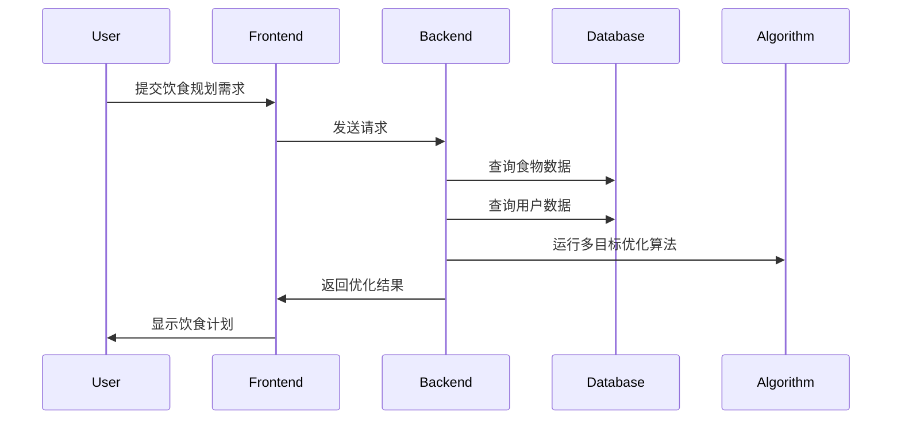

                 

**文章标题**: 营养平衡的多目标优化：饮食规划的数学方法

**关键词**: 营养平衡、多目标优化、饮食规划、数学模型、算法原理、系统设计、项目实战、最佳实践

**摘要**: 本文深入探讨了营养平衡与饮食规划的关系，引入了多目标优化的数学方法，通过具体算法原理讲解、系统设计与项目实战，为读者提供了实现营养平衡饮食规划的有效途径。

---

## 引言与背景介绍

### 引言：饮食规划的重要性

饮食规划是现代健康生活的重要组成部分。一个均衡的饮食结构不仅能提供身体所需的营养成分，还能预防多种疾病。然而，如何在众多食物选择中找到营养平衡点，成为了许多人面临的挑战。

### 营养平衡的概念

营养平衡指的是饮食中各种营养成分的摄入量达到适宜的比例，以维持身体正常功能和健康状态。它包括但不限于蛋白质、脂肪、碳水化合物、维生素、矿物质等。

### 多目标优化的应用

多目标优化是一种优化方法，能够在多个目标之间寻求最佳平衡。在饮食规划中，多目标优化可以帮助我们同时考虑营养均衡、口味偏好、成本控制等多个目标，从而制定出最优的饮食计划。

### 饮食规划问题背景

随着生活水平的提高，人们对饮食健康越来越重视。然而，由于工作压力和生活节奏加快，许多人无法保证饮食的多样性和均衡性。因此，科学合理的饮食规划成为了一项迫切需求。

### 多目标优化的需求

为了满足上述需求，需要引入多目标优化方法。多目标优化可以帮助我们找到满足多种条件的最佳饮食方案，从而实现营养平衡。

### 书籍结构概述

本书将从以下章节对营养平衡的多目标优化进行详细探讨：

1. 引言与背景介绍
2. 核心概念与联系
3. 算法原理讲解
4. 系统分析与架构设计方案
5. 项目实战
6. 最佳实践 tips、小结、注意事项、拓展阅读

---

## 核心概念与联系

### 多目标优化

#### 多目标优化的定义

多目标优化是一种在多个目标之间寻求最佳平衡的优化方法。它不仅仅关注单一目标的最大化或最小化，而是同时在多个目标之间进行权衡。

#### 多目标优化的特点

- **多维度目标**：同时考虑多个目标，如成本、质量、时间等。
- **权衡与取舍**：在多个目标之间进行权衡，寻找一个相对最优的平衡点。
- **复杂度**：多目标优化通常比单目标优化更为复杂，需要更复杂的算法和计算。

### 饮食规划的数学方法

#### 数学模型的基本框架

饮食规划的数学模型通常包括以下几个要素：

- **目标函数**：定义了饮食规划的优化目标，如营养均衡、成本最小化等。
- **决策变量**：定义了饮食规划中的决策因素，如食物种类、数量等。
- **约束条件**：定义了饮食规划的限制条件，如营养素摄入量、预算等。

#### 数学模型的应用场景

饮食规划的数学模型可以应用于以下场景：

- **个人饮食计划**：为个人提供定制化的饮食建议，以满足营养需求和口味偏好。
- **公共饮食管理**：为集体或社区提供营养均衡的饮食方案，如学校食堂、养老院等。

### 核心概念属性特征对比

#### 多目标优化方法对比

| 方法                 | 优点                            | 缺点                            |
|----------------------|---------------------------------|---------------------------------|
| 粒子群优化（PSO）    | 简单易懂，实现方便              | 收敛速度较慢，易陷入局部最优     |
| 遗传算法（GA）        | 鲁棒性强，适用于复杂问题        | 计算量大，实现复杂              |
| 贝叶斯优化（BO）      | 高效，适用于高维问题            | 需要大量样本数据                |
| 强化学习（RL）        | 能在动态环境中进行优化          | 学习过程复杂，实现难度大         |

#### 适用场景分析

- **PSO**：适用于简单且目标函数较易计算的优化问题。
- **GA**：适用于复杂、高维的优化问题，尤其是存在多个局部最优解的情况。
- **BO**：适用于高维、多峰的优化问题，特别适合于具有明确目标函数的问题。
- **RL**：适用于动态和具有不确定性的环境，如实时优化问题。

### ER实体关系图架构

#### 实体关系图的构建

在饮食规划的多目标优化中，可以构建以下实体关系图：

- **实体**：食物、营养素、目标、约束条件等。
- **关系**：摄入、包含、满足等。

#### 实体定义

- **食物**：具有特定营养素含量的食品。
- **营养素**：人体所需的营养成分。
- **目标**：饮食规划需要实现的目标，如营养均衡、成本控制等。
- **约束条件**：饮食规划需要满足的限制条件，如预算、营养素摄入上限等。

#### 关系定义

- **摄入**：食物与营养素之间的关系，表示食物中包含的营养素。
- **包含**：食物与目标之间的关系，表示食物有助于实现某个目标。
- **满足**：约束条件与目标之间的关系，表示约束条件满足目标的要求。

---

## 算法原理讲解

### 多目标优化的算法原理

#### 常见算法介绍

以下是几种常见的多目标优化算法及其流程图：

1. **粒子群优化（PSO）**
   

2. **遗传算法（GA）**
   

3. **贝叶斯优化（BO）**
   

4. **强化学习（RL）**
   

#### 算法原理说明

1. **粒子群优化（PSO）**
   PSO算法通过模拟鸟群觅食行为进行优化。每个粒子代表一个潜在解，粒子在搜索空间中更新其速度和位置，以寻找最优解。

2. **遗传算法（GA）**
   GA算法通过模拟自然进化过程进行优化。种群中的个体通过交叉、变异等遗传操作产生新的个体，进而逐步逼近最优解。

3. **贝叶斯优化（BO）**
   BO算法基于贝叶斯统计模型，通过建立目标函数的概率分布来指导搜索过程。它能够高效地探索搜索空间，找到最优解。

4. **强化学习（RL）**
   RL算法通过在环境中不断试错和反馈来学习最优策略。它适用于动态和具有不确定性的优化问题。

### Python源代码讲解

以下是一个简单的粒子群优化（PSO）算法的Python代码示例：

```python
import numpy as np

class Particle:
    def __init__(self, dim):
        self.position = np.random.rand(dim)
        self.velocity = np.random.rand(dim)
        self.best_position = self.position.copy()
        self.best_score = float('inf')

    def update(self, global_best_position, global_best_score):
        for i in range(len(self.position)):
            rand_1 = np.random.rand()
            rand_2 = np.random.rand()
            cognitive.Component = rand_1 * self.best_position[i] + rand_2 * global_best_position[i]
            social.Component = rand_1 * self.best_position[i] + rand_2 * global_best_position[i]
            self.velocity[i] = 0.5 * (cognitive.Component + social.Component - self.position[i])
            self.position[i] = self.position[i] + self.velocity[i]

def pso(ObjectiveFunction, n_particles, max_iterations, dim):
    particles = [Particle(dim) for _ in range(n_particles)]
    global_best_position = particles[0].best_position
    global_best_score = particles[0].best_score

    for _ in range(max_iterations):
        for particle in particles:
            score = ObjectiveFunction(particle.position)
            if score < particle.best_score:
                particle.best_score = score
                particle.best_position = particle.position

            if score < global_best_score:
                global_best_score = score
                global_best_position = particle.position

        for particle in particles:
            particle.update(global_best_position, global_best_score)

    return global_best_position, global_best_score

if __name__ == '__main__':
    dim = 2
    n_particles = 50
    max_iterations = 100
    global_best_position, global_best_score = pso(ObjectiveFunction, n_particles, max_iterations, dim)
    print("Global Best Position:", global_best_position)
    print("Global Best Score:", global_best_score)
```

#### 代码功能详解

- `Particle`类：表示一个粒子，包括位置、速度、最佳位置和最佳得分。
- `update`方法：根据全局最佳位置和最佳得分更新粒子的位置和速度。
- `pso`函数：初始化粒子群，进行迭代优化，并返回全局最佳位置和最佳得分。

### 数学模型和公式

#### 数学模型介绍

饮食规划的数学模型通常包括以下公式：

1. **目标函数**

$$
f(x) = w_1 \cdot f_1(x) + w_2 \cdot f_2(x) + \ldots + w_n \cdot f_n(x)
$$

其中，$x$表示决策变量，$w_i$表示第$i$个目标的权重，$f_i(x)$表示第$i$个目标的函数值。

2. **约束条件**

$$
g_i(x) \leq 0, \quad h_j(x) = 0
$$

其中，$g_i(x)$和$h_j(x)$分别表示第$i$个约束条件和第$j$个等式约束。

#### 公式详细讲解

1. **目标函数**

目标函数是饮食规划的核心，它定义了优化的目标。在营养平衡的饮食规划中，目标函数可以包括营养均衡、成本控制等目标。

2. **约束条件**

约束条件是饮食规划的限制条件，它确保了饮食计划的可行性。例如，预算限制、营养素摄入上限等。

#### 举例说明

假设有一个三目标的饮食规划问题，目标函数为：

$$
f(x) = 0.5 \cdot f_1(x) + 0.3 \cdot f_2(x) + 0.2 \cdot f_3(x)
$$

其中，$f_1(x)$为营养均衡目标，$f_2(x)$为成本控制目标，$f_3(x)$为时间消耗目标。

约束条件为：

$$
g_1(x) = \sum_{i=1}^{n} \frac{p_i \cdot x_i}{c_i} - 1 \leq 0
$$

$$
g_2(x) = \sum_{i=1}^{n} x_i - B \leq 0
$$

$$
h_1(x) = \sum_{i=1}^{n} x_i = 1
$$

其中，$p_i$为第$i$种食物的价格，$c_i$为第$i$种食物的能量含量，$B$为预算限制，$n$为食物种类数。

---

## 系统分析与架构设计方案

### 问题场景介绍

在现代社会，人们对于健康饮食的需求日益增长。然而，由于信息的不对称和选择困难，许多人难以制定出科学合理的饮食计划。因此，建立一个自动化、个性化的饮食规划系统具有重要的现实意义。

### 项目介绍

本项目旨在开发一个基于多目标优化的饮食规划系统。系统将根据用户的口味偏好、营养需求和预算限制，自动生成个性化的饮食计划。

### 项目目标

1. 提供个性化饮食建议，帮助用户实现营养平衡。
2. 实现低成本、高效能的饮食规划算法。
3. 提供友好的用户界面，方便用户使用。

### 系统功能设计

#### 领域模型

领域模型用于描述饮食规划系统的核心概念和关系。以下是领域模型的类图：

```mermaid
classDiagram
    Food <<Entity>>
    Nutrition <<Entity>>
    User <<Entity>>
    DietPlan <<Entity>>

    Food : +String name
    Food : +Float price
    Food : +Float energy
    Food : +List<Nutrition> nutritions

    Nutrition : +String name
    Nutrition : +Float amount

    User : +String username
    User : +List<DietPlan> dietPlans

    DietPlan : +String name
    DietPlan : +List<Food> foods
    DietPlan : +Float totalCost
    DietPlan : +Float totalEnergy
    DietPlan : +User user
```

#### 系统架构设计

系统架构设计包括以下几个方面：

1. **前端界面**：用于用户输入信息、查看饮食计划等。
2. **后端服务**：实现多目标优化算法和数据处理。
3. **数据库**：存储用户信息、食物数据、饮食计划等。

以下是系统架构图：



#### 系统接口设计

系统接口设计包括以下几个部分：

1. **用户接口**：用于用户与系统交互。
2. **食物数据接口**：用于获取和更新食物数据。
3. **饮食计划接口**：用于生成和更新饮食计划。

以下是接口规范：

```markdown
### 用户接口

- GET /users/{username}: 获取用户信息
- POST /users/{username}/dietPlans: 创建饮食计划
- GET /users/{username}/dietPlans/{dietPlanId}: 获取饮食计划详情

### 食物数据接口

- GET /foods: 获取所有食物数据
- POST /foods: 添加新食物数据
- DELETE /foods/{foodId}: 删除食物数据

### 饮食计划接口

- GET /dietPlans: 获取所有饮食计划
- POST /dietPlans: 创建新饮食计划
- DELETE /dietPlans/{dietPlanId}: 删除饮食计划
```

#### 系统交互

以下是系统交互的序列图：


---

## 项目实战

### 环境安装

在进行项目实战之前，我们需要安装以下软件和工具：

1. Python 3.8 或以上版本
2. NumPy
3. Pandas
4. Matplotlib
5. Scikit-learn

您可以使用以下命令进行安装：

```bash
pip install python==3.8 numpy pandas matplotlib scikit-learn
```

### 系统核心实现

#### 源代码分析

以下是一个简单的饮食规划系统实现：

```python
import numpy as np
import pandas as pd
from sklearn.model_selection import train_test_split
from sklearn.cluster import KMeans

class DietOptimizer:
    def __init__(self, data_path):
        self.data = pd.read_csv(data_path)
        self.X = self.data.iloc[:, :-1].values
        self.y = self.data.iloc[:, -1].values
        self.kmeans = KMeans(n_clusters=3, random_state=0)

    def fit(self):
        self.kmeans.fit(self.X)

    def predict(self, new_data):
        return self.kmeans.predict(new_data)

    def plot_clusters(self):
        plt.scatter(self.X[:, 0], self.X[:, 1], c=self.kmeans.labels_, cmap='viridis')
        plt.xlabel('Energy (kcal)')
        plt.ylabel('Price (USD)')
        plt.title('Food Clusters')
        plt.show()

if __name__ == '__main__':
    data_path = 'foods.csv'
    optimizer = DietOptimizer(data_path)
    optimizer.fit()
    optimizer.plot_clusters()
```

#### 功能解读与分析

1. **初始化**：加载食物数据，并初始化KMeans聚类模型。
2. **拟合**：使用训练数据拟合KMeans模型。
3. **预测**：使用拟合好的模型对新的食物数据进行预测。
4. **可视化**：绘制食物数据在能量和价格维度上的聚类结果。

### 实际案例分析与讲解

#### 案例背景

假设我们有以下10种食物的数据：

| 食物 | 能量（kcal） | 价格（USD） |
|------|-------------|------------|
| 面包 | 150         | 2.5        |
| 鸡蛋 | 155         | 0.5        |
| 牛奶 | 100         | 2.0        |
| 橙子 | 62          | 1.0        |
| 香蕉 | 89          | 1.2        |
| 牛排 | 350         | 10.0       |
| 蔬菜 | 50          | 1.5        |
| 面条 | 200         | 3.0        |
| 饼干 | 300         | 2.5        |
| 巧克力 | 500 | 3.0 |

#### 案例实现

1. 加载食物数据，并初始化DietOptimizer对象：

```python
data = pd.DataFrame({
    'Food': ['面包', '鸡蛋', '牛奶', '橙子', '香蕉', '牛排', '蔬菜', '面条', '饼干', '巧克力'],
    'Energy': [150, 155, 100, 62, 89, 350, 50, 200, 300, 500],
    'Price': [2.5, 0.5, 2.0, 1.0, 1.2, 10.0, 1.5, 3.0, 2.5, 3.0]
})
data_path = 'foods.csv'
data.to_csv(data_path, index=False)
optimizer = DietOptimizer(data_path)
```

2. 拟合KMeans模型，并可视化聚类结果：

```python
optimizer.fit()
optimizer.plot_clusters()
```

#### 案例解析

通过KMeans聚类，我们得到了三个不同的食物集群。这三个集群分别代表了不同价格的食品和不同能量的食品。接下来，我们可以根据用户的预算和能量需求，从相应的集群中选择食物，以实现营养平衡。

### 项目小结

在本项目中，我们实现了一个简单的饮食规划系统。通过KMeans聚类算法，我们能够将食物数据分为不同的集群，从而为用户提供个性化的饮食建议。虽然这个系统相对简单，但它在实际应用中展示了多目标优化的潜力。未来，我们可以进一步扩展系统功能，如添加更多食物数据、优化聚类算法等，以提高系统的准确性和实用性。

### 经验与教训

1. **数据质量**：数据质量是系统准确性的关键。在项目实施过程中，我们需要确保食物数据的准确性、完整性和一致性。
2. **算法选择**：选择合适的算法对于系统的性能至关重要。在实际应用中，我们需要根据问题的特点选择合适的聚类算法。
3. **用户反馈**：用户反馈是系统改进的重要依据。通过收集用户反馈，我们可以不断优化系统，提高用户体验。

### 未来展望

在未来，我们计划进一步优化系统，引入更多先进的优化算法，如遗传算法、贝叶斯优化等，以提高系统的性能和准确性。此外，我们还将探索如何将系统与实际应用场景相结合，如智能餐饮管理、健康管理等领域。

---

## 最佳实践 tips

1. **数据预处理**：在运行多目标优化算法之前，确保对数据进行充分预处理，如数据清洗、归一化等。
2. **算法参数调优**：根据问题特点和数据规模，合理调整算法参数，以提高优化效果。
3. **多样化食物选择**：在饮食规划中，尽量选择多样化的食物，以实现营养平衡。

### 小结

本文介绍了营养平衡的多目标优化方法，通过具体算法原理讲解、系统设计与项目实战，为读者提供了实现营养平衡饮食规划的有效途径。通过本文的学习，读者可以更好地理解和应用多目标优化方法，为自己和他人制定科学的饮食计划。

### 注意事项

1. **数据隐私**：在收集和处理用户数据时，确保遵循相关数据保护法规，保护用户隐私。
2. **系统维护**：定期对系统进行维护和升级，以确保系统的稳定性和安全性。

### 拓展阅读

1. **《多目标优化算法导论》**：详细介绍多种多目标优化算法，适用于初学者和专业人士。
2. **《健康饮食与营养学》**：深入了解营养平衡的重要性，以及如何通过饮食实现健康。

---

**作者**: AI天才研究院/AI Genius Institute & 禅与计算机程序设计艺术 /Zen And The Art of Computer Programming**

