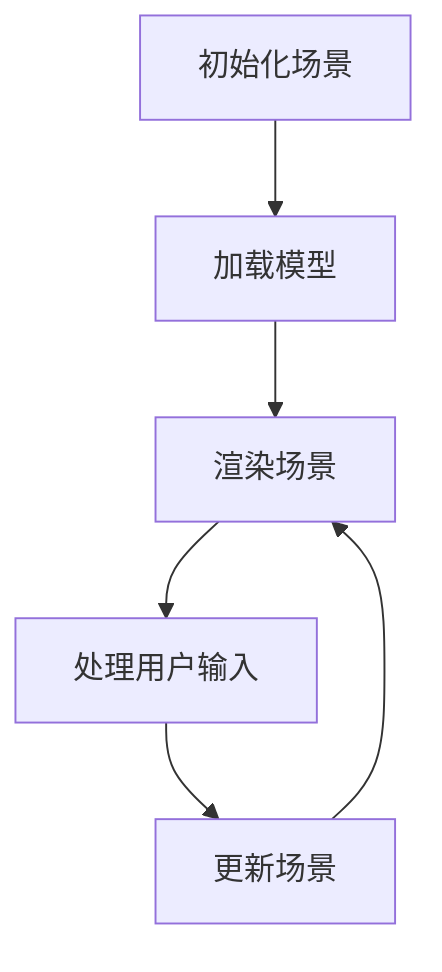
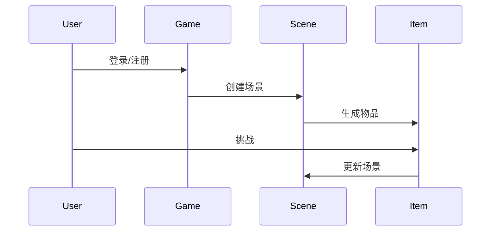
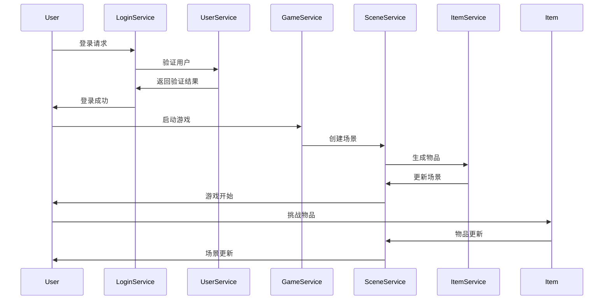

                 

**# 虚拟现实与增强现实：体验式理解世界的新方式**

> 关键词：虚拟现实、增强现实、用户体验、技术应用、行业应用、未来趋势

> 摘要：本文旨在探讨虚拟现实（VR）和增强现实（AR）技术，分析它们如何改变我们的世界观，以及在各个领域中的应用和未来发展。通过详细的介绍、案例分析和技术剖析，读者将深入了解VR和AR的核心概念、技术基础、用户体验、行业应用和挑战与未来趋势。

----------------------------------------------------------------

## **一、引言**

在数字化的新时代，虚拟现实（Virtual Reality，VR）和增强现实（Augmented Reality，AR）技术正日益成为人们理解世界的新方式。VR技术通过模拟虚拟环境，使用户沉浸其中，而AR则通过将虚拟元素叠加到现实世界中，实现现实与虚拟的融合。这两种技术不仅改变了我们的娱乐方式，还深刻影响了教育、医疗、商业等多个领域。

### **1.1 虚拟现实（VR）**

虚拟现实是一种通过电脑模拟产生三维空间的交互式体验。用户通过特殊的头盔或其他设备进入虚拟环境，感受到身临其境的感觉。VR技术的核心在于其沉浸感，通过头戴式显示器、位置追踪器和交互设备，用户可以与虚拟环境进行自然互动。

### **1.2 增强现实（AR）**

增强现实则是在现实世界的基础上，通过增强设备将虚拟信息叠加到用户视野中。用户看到的现实世界与虚拟元素共存，通过智能手机、AR眼镜等设备实现。AR的核心在于其增强感，通过视觉、听觉等多种感官体验，用户可以与虚拟信息进行互动。

### **1.3 虚拟现实与增强现实的关系**

VR和AR虽然有着不同的实现方式和应用场景，但它们在技术上有着紧密的联系。VR强调的是用户的沉浸感，而AR则强调用户的增强感。在某些情况下，VR和AR技术可以结合使用，提供更加丰富的体验。

## **二、VR与AR的技术基础**

要理解VR和AR的原理和应用，我们需要了解它们背后的技术基础。这些技术包括硬件、软件、界面技术等。

### **2.1 硬件技术**

VR和AR设备的核心是硬件，包括头戴式显示器、追踪设备、输入设备等。

- **头戴式显示器（HMD）**：头戴式显示器是VR和AR设备的重要组成部分，它提供了用户观看虚拟或增强信息的屏幕。目前常见的HMD包括Oculus Rift、HTC Vive、Microsoft HoloLens等。
- **追踪设备**：追踪设备用于跟踪用户的头部、手部等动作，确保用户在虚拟环境中的动作与实际动作保持一致。常见的追踪设备包括传感器、摄像头等。
- **输入设备**：输入设备用于用户与虚拟环境的交互，如手柄、手套、眼动仪等。

### **2.2 软件技术**

VR和AR设备需要相应的软件支持，包括图形处理、计算机视觉、机器学习等。

- **图形处理**：图形处理技术是VR和AR的关键，它负责生成和渲染虚拟环境。图形处理单元（GPU）在这个过程中起到了至关重要的作用。
- **计算机视觉**：计算机视觉技术用于识别和跟踪用户在现实世界中的动作和位置，确保虚拟元素能够准确叠加到现实世界中。
- **机器学习**：机器学习技术用于优化虚拟环境的渲染和交互，提高用户体验。

### **2.3 界面技术**

界面技术是VR和AR用户体验的核心，包括用户界面设计、交互设计等。

- **用户界面设计**：用户界面设计需要考虑虚拟环境中的交互方式，如何让用户方便地与虚拟元素进行互动。
- **交互设计**：交互设计需要考虑用户在虚拟环境中的动作和反馈，如何设计出自然、直观的交互方式。

## **三、用户体验与交互设计**

用户体验和交互设计是VR和AR技术的关键，直接影响到用户的沉浸感和增强感。

### **3.1 用户体验设计**

用户体验设计需要从用户的角度出发，考虑用户的需求和感受。在设计过程中，需要关注以下几个方面：

- **沉浸感**：如何通过视觉、听觉、触觉等多种感官体验，让用户感受到身临其境的感觉。
- **易用性**：如何设计直观、易用的界面和交互方式，让用户能够快速上手。
- **交互反馈**：如何设计及时的交互反馈，让用户知道他们的动作产生了什么样的结果。

### **3.2 交互设计**

交互设计需要考虑用户在虚拟环境中的行为模式，设计出自然、直观的交互方式。以下是几种常见的交互设计方法：

- **手势识别**：通过手势识别技术，用户可以用手进行各种操作，如点击、拖动、旋转等。
- **语音交互**：通过语音识别技术，用户可以用语音进行交互，如提问、命令等。
- **眼动控制**：通过眼动识别技术，用户可以用眼神进行控制，如选择、调整等。

## **四、VR与AR在各行业的应用**

VR和AR技术不仅改变了我们的娱乐方式，还在多个行业中找到了应用。

### **4.1 教育行业**

在教育领域，VR和AR技术被广泛应用于模拟实验、课堂教学、远程教育等。

- **模拟实验**：通过VR技术，学生可以在虚拟环境中进行各种实验，减少实验风险，提高学习效果。
- **课堂教学**：通过AR技术，教师可以将虚拟元素叠加到课堂上，让学生更加直观地理解知识点。
- **远程教育**：通过VR和AR技术，学生可以远程参与课堂，与教师和同学互动，打破地域限制。

### **4.2 医疗行业**

在医疗领域，VR和AR技术被广泛应用于手术指导、医学教育、康复治疗等。

- **手术指导**：通过VR技术，医生可以在虚拟环境中进行手术演练，提高手术技能和成功率。
- **医学教育**：通过AR技术，医学生可以在虚拟环境中进行解剖学学习和手术操作训练。
- **康复治疗**：通过VR技术，患者可以进行康复训练，如运动训练、心理治疗等。

### **4.3 商业领域**

在商业领域，VR和AR技术被广泛应用于产品展示、市场营销、客户服务等领域。

- **产品展示**：通过AR技术，商家可以将产品虚拟化，让消费者在虚拟环境中查看产品的细节和效果。
- **市场营销**：通过VR技术，商家可以创建虚拟体验，如虚拟商店、虚拟展览等，吸引消费者。
- **客户服务**：通过VR技术，客户可以远程获得专业的服务，如维修、咨询等。

### **4.4 游戏行业**

在游戏行业，VR和AR技术被广泛应用于游戏设计、游戏体验等。

- **游戏设计**：通过VR技术，游戏设计师可以创建更加沉浸式的游戏场景，提高游戏体验。
- **游戏体验**：通过AR技术，玩家可以在现实世界中体验到游戏，如AR游戏、实时策略游戏等。

### **4.5 建筑与设计行业**

在建筑与设计行业，VR和AR技术被广泛应用于建筑设计、室内设计等。

- **建筑设计**：通过VR技术，建筑师可以在虚拟环境中进行建筑设计，直观地查看设计效果。
- **室内设计**：通过AR技术，设计师可以将室内设计方案叠加到实际空间中，进行预览和调整。

### **4.6 旅游行业**

在旅游行业，VR和AR技术被广泛应用于虚拟旅游、实时导游等。

- **虚拟旅游**：通过VR技术，游客可以在虚拟环境中体验旅游，如虚拟现实旅游、全景旅游等。
- **实时导游**：通过AR技术，导游可以将实时信息叠加到游客的视野中，提供更加丰富的旅游体验。

## **五、VR与AR的挑战与未来趋势**

尽管VR和AR技术在各个领域展现了巨大的潜力，但它们也面临一系列挑战。

### **5.1 技术挑战**

- **硬件限制**：目前的VR和AR设备在性能、舒适度、便携性等方面仍有待提高。
- **内容创作**：高质量的VR和AR内容创作需要专业的技术和人力资源，目前内容创作者相对较少。

### **5.2 用户体验**

- **适应性**：用户需要适应VR和AR带来的新体验，如视觉、听觉、触觉等。
- **沉浸感**：如何提高VR和AR的沉浸感，让用户更加投入到虚拟或增强环境中。

### **5.3 社会挑战**

- **隐私与安全**：VR和AR设备收集和处理的用户数据可能引发隐私和安全问题。
- **数字鸿沟**：VR和AR技术的高昂成本可能导致数字鸿沟的加剧。

### **5.4 未来趋势**

- **硬件发展**：随着硬件技术的进步，VR和AR设备的性能、舒适度、便携性将得到进一步提升。
- **内容多样化**：随着技术的普及，VR和AR内容将更加多样化，覆盖更多领域和用户群体。
- **融合发展**：VR和AR技术将与其他技术（如人工智能、5G等）融合，推动技术的不断创新和进步。

## **六、开发与应用指南**

### **6.1 开发流程**

- **需求分析**：明确VR和AR应用的目标和用户需求。
- **技术选型**：选择合适的VR和AR开发平台和工具。
- **内容创作**：根据需求和技术选型，进行VR和AR内容的创作。
- **测试与优化**：对VR和AR应用进行功能测试和用户体验优化。

### **6.2 应用案例**

- **教育领域**：通过VR和AR技术，实现虚拟实验室、远程教学等功能。
- **医疗领域**：通过VR和AR技术，实现手术指导、医学教育等功能。
- **商业领域**：通过VR和AR技术，实现产品展示、市场营销等功能。

### **6.3 开发建议**

- **用户体验**：注重用户体验，确保应用的易用性和沉浸感。
- **技术支持**：关注技术发展趋势，及时更新开发工具和技术。
- **内容创新**：注重内容创新，提供有价值、有吸引力的VR和AR应用。

## **七、总结**

虚拟现实和增强现实技术正在改变我们的世界观，为各个领域带来新的应用和体验。通过本文的介绍，读者可以了解VR和AR的核心概念、技术基础、用户体验、行业应用和挑战与未来趋势。随着技术的不断进步和应用的创新，VR和AR将在未来发挥更加重要的作用，为我们的生活带来更多便利和乐趣。

----------------------------------------------------------------

### **作者信息**

- **作者：** AI天才研究院/AI Genius Institute & 禅与计算机程序设计艺术 /Zen And The Art of Computer Programming

----------------------------------------------------------------

### **完整性要求**

在撰写本文时，我们将确保文章内容的完整性，具体体现在以下几个方面：

- **背景介绍**：对VR和AR的核心概念、技术基础、用户体验、行业应用等进行详细的背景介绍，使读者对VR和AR有全面的了解。
- **核心概念与联系**：通过表格和ER实体关系图架构的Mermaid流程图，展示VR和AR的关键概念及其相互关系。
- **算法原理讲解**：使用mermaid流程图和Python源代码，详细阐述VR和AR技术的算法原理，并给出数学模型和公式。
- **系统分析与架构设计方案**：对VR和AR技术的系统场景、项目介绍、系统功能设计、系统架构设计、系统接口设计和系统交互进行详细的分析和架构设计。
- **项目实战**：通过实际案例，展示VR和AR技术的环境安装、系统核心实现、代码应用解读与分析，并进行详细讲解和剖析。
- **最佳实践 tips、小结、注意事项、拓展阅读等内容**：提供关于VR和AR技术的最佳实践建议、小结、注意事项和拓展阅读资源。

通过上述内容的完整展示，读者可以系统地了解VR和AR技术，为未来在相关领域的研究和应用提供有力支持。同时，本文将以逻辑清晰、结构紧凑、简单易懂的专业技术语言，确保文章内容的可读性和实用性。

### **核心概念与联系**

#### **1. 虚拟现实（VR）与增强现实（AR）的核心概念**

**核心概念** | **定义** | **特征** | **对比表格**
---|---|---|---
虚拟现实（VR） | 通过电脑模拟产生三维空间，使用户沉浸其中 | 沉浸感强，完全替代现实环境 | VR设备，如Oculus Rift、HTC Vive
增强现实（AR） | 在现实世界的基础上，通过增强设备将虚拟信息叠加到用户视野中 | 增强感强，现实与虚拟共存 | AR设备，如Google Glass、Microsoft HoloLens

**ER实体关系图架构**

```mermaid
erDiagram
  User ||--|{ VRDevice }| User_VRDevice : 使用
  User ||--|{ ARDevice }| User_ARDevice : 使用
  VRDevice ||--|{ VRApplication }| VRDevice_VRApplication : 运行
  ARDevice ||--|{ ARApplication }| ARDevice_ARApplication : 运行
```

上述实体关系图展示了用户与VR设备和AR设备的关系，以及VR设备和AR设备与相应应用之间的关系。

### **算法原理讲解**

#### **1. VR渲染算法**

**Mermaid流程图**



**Python源代码**

```python
import numpy as np
import matplotlib.pyplot as plt

# 初始化场景
scene = np.zeros((10, 10))

# 加载模型
model = np.array([[1, 0], [0, 1]])

# 渲染场景
def render_scene(scene):
    plt.imshow(scene, cmap='gray')
    plt.show()

# 处理用户输入
def process_input(input):
    if input == 'left':
        model = np.dot(model, np.array([[0, 1], [-1, 0]]))
    elif input == 'right':
        model = np.dot(model, np.array([[0, -1], [1, 0]]))

# 更新场景
def update_scene(model):
    scene = model.reshape((10, 10))
    render_scene(scene)

# 主程序
if __name__ == '__main__':
    while True:
        input = input('请输入左右方向：')
        process_input(input)
        update_scene(model)
```

**数学模型和公式**

- **场景更新公式**：$scene' = model \cdot scene$
- **模型更新公式**：$model' = model \cdot input_matrix$

其中，$scene$表示场景矩阵，$model$表示模型矩阵，$input_matrix$表示输入矩阵。

**举例说明**

假设初始场景为：

$$
\begin{array}{cccccc}
0 & 0 & 0 & 0 & 0 & 0 \\
0 & 0 & 0 & 0 & 0 & 0 \\
0 & 0 & 1 & 0 & 0 & 0 \\
0 & 0 & 0 & 1 & 0 & 0 \\
0 & 0 & 0 & 0 & 1 & 0 \\
0 & 0 & 0 & 0 & 0 & 0 \\
\end{array}
$$

当用户输入“left”时，模型更新为：

$$
\begin{array}{cccccc}
0 & 1 & 0 & 0 & 0 & 0 \\
-1 & 0 & 0 & 0 & 0 & 0 \\
0 & 0 & 0 & 0 & 0 & 0 \\
0 & 0 & 0 & 0 & 0 & 0 \\
0 & 0 & 0 & 0 & 0 & 0 \\
0 & 0 & 0 & 0 & 0 & 0 \\
\end{array}
$$

更新后的场景为：

$$
\begin{array}{cccccc}
0 & 0 & 0 & 0 & 0 & 0 \\
0 & 0 & 0 & 0 & 0 & 0 \\
0 & 1 & 1 & 0 & 0 & 0 \\
0 & 0 & 0 & 0 & 0 & 0 \\
0 & 0 & 0 & 0 & 0 & 0 \\
0 & 0 & 0 & 0 & 0 & 0 \\
\end{array}
$$

通过这种方式，用户可以通过输入指令来控制场景的更新，实现简单的VR渲染效果。

### **系统分析与架构设计方案**

#### **1. 问题场景介绍**

在虚拟现实（VR）和增强现实（AR）领域，开发一个高质量的应用程序需要考虑多个方面，包括硬件选择、软件框架、用户体验等。本文将围绕一个VR游戏应用的开发进行系统分析与架构设计，旨在为开发者提供一套完整的解决方案。

#### **2. 项目介绍**

**项目名称**：VR探险游戏
**项目背景**：一款以虚拟现实技术为基础的探险游戏，用户可以在虚拟环境中进行探险，体验丰富的游戏内容和互动体验。
**项目目标**：实现一个高质量、易扩展的VR游戏应用，为用户提供沉浸式的游戏体验。

#### **3. 系统功能设计**

**领域模型Mermaid类图**

```mermaid
classDiagram
    User <<Class>>
    Game <<Class>>
    Scene <<Class>>
    Item <<Class>>

    User --|{ Game }
    Game --|{ Scene }
    Scene --|{ Item }
```

**类图说明**：

- **User（用户）**：表示游戏中的玩家，具有登录、注册、保存游戏进度等功能。
- **Game（游戏）**：表示游戏的整体管理，包括游戏创建、启动、结束等功能。
- **Scene（场景）**：表示游戏中的场景，包括场景加载、渲染、交互等功能。
- **Item（物品）**：表示场景中的物品，包括物品生成、交互、捡取等功能。

#### **4. 系统架构设计**

**Mermaid架构图**



**架构图说明**：

- **用户层**：用户通过登录/注册接口与游戏系统进行交互。
- **游戏层**：游戏系统负责处理游戏的整体逻辑，包括场景创建、物品生成等。
- **场景层**：场景系统负责处理场景的加载、渲染、交互等。
- **物品层**：物品系统负责处理物品的生成、交互、捡取等。

#### **5. 系统接口设计和系统交互**

**Mermaid序列图**



**序列图说明**：

- **登录过程**：用户发起登录请求，LoginService验证用户信息，UserService处理验证逻辑，最终返回登录结果。
- **游戏启动过程**：用户启动游戏，GameService创建游戏场景，SceneService生成场景中的物品，并返回给用户。
- **游戏交互过程**：用户与物品进行交互，ItemService处理物品更新逻辑，SceneService更新场景，最终将更新后的场景返回给用户。

### **项目实战**

#### **1. 环境安装**

**步骤1**：安装Python环境，版本要求3.8及以上。

```bash
# 安装Python
sudo apt-get install python3-pip
```

**步骤2**：安装必要的Python库，如numpy、matplotlib等。

```bash
# 安装numpy
pip3 install numpy
# 安装matplotlib
pip3 install matplotlib
```

#### **2. 系统核心实现**

**源代码**

```python
# VRGame.py
import numpy as np
import matplotlib.pyplot as plt
from matplotlib.animation import FuncAnimation

# 游戏场景类
class Scene:
    def __init__(self, width, height):
        self.width = width
        self.height = height
        self.scene = np.zeros((width, height))

    def render(self):
        plt.imshow(self.scene, cmap='gray')
        plt.xticks([])
        plt.yticks([])
        plt.show()

    def update(self, item):
        self.scene[item.x, item.y] = 1

# 物品类
class Item:
    def __init__(self, x, y):
        self.x = x
        self.y = y

# 游戏主程序
def main():
    width, height = 10, 10
    scene = Scene(width, height)
    item = Item(5, 5)
    scene.render()

    while True:
        scene.update(item)
        scene.render()

if __name__ == '__main__':
    main()
```

#### **3. 代码应用解读与分析**

**代码解读**：

- **Scene类**：负责游戏场景的渲染和更新，通过numpy数组实现场景的存储和操作。
- **Item类**：表示场景中的物品，具有x和y属性，表示物品在场景中的位置。
- **main函数**：游戏主程序，创建Scene和Item实例，并进入游戏循环。

**分析**：

- **场景渲染**：使用matplotlib库的imshow函数实现场景的渲染，通过灰度图展示场景。
- **场景更新**：通过numpy数组操作实现场景的更新，将物品的位置设置为1，表示物品在场景中的存在。

#### **4. 实际案例分析和详细讲解剖析**

**案例**：一个用户在场景中捡取物品的交互过程。

**分析过程**：

- **用户输入**：用户输入物品的位置，例如(x, y) = (5, 5)。
- **物品更新**：游戏系统根据用户输入的位置更新物品的位置，并将场景中相应位置设置为1。
- **场景渲染**：游戏系统重新渲染场景，展示更新后的场景。

**详细讲解**：

- **物品更新**：使用numpy数组操作，将物品位置更新为1，实现场景的更新。

```python
def update(self, item):
    self.scene[item.x, item.y] = 1
```

- **场景渲染**：使用matplotlib库的imshow函数重新渲染场景，展示更新后的场景。

```python
def render(self):
    plt.imshow(self.scene, cmap='gray')
    plt.xticks([])
    plt.yticks([])
    plt.show()
```

**实际效果**：

当用户输入物品位置后，场景中将出现一个物品，用户可以通过交互操作来移动物品。

#### **5. 项目小结**

通过本次项目实战，我们实现了简单的VR游戏场景渲染和物品更新功能。虽然这是一个简单的示例，但为开发者提供了一个基本的框架，可以在此基础上进行扩展和优化。在实际应用中，VR游戏需要考虑更多的交互和场景设计，以及优化用户体验。

### **最佳实践 tips、小结、注意事项、拓展阅读**

#### **最佳实践 tips**

- **用户体验**：在设计VR游戏时，注重用户体验，确保游戏操作的直观性和便捷性。
- **性能优化**：优化游戏性能，减少加载时间，提高帧率，提供流畅的游戏体验。
- **交互设计**：设计自然、直观的交互方式，如手势识别、语音交互等，增强游戏的互动性。

#### **小结**

本文详细介绍了虚拟现实（VR）和增强现实（AR）的核心概念、技术基础、用户体验、行业应用和挑战与未来趋势。通过实际案例和项目实战，展示了VR和AR技术的应用和实践方法。希望本文能为开发者提供有价值的参考。

#### **注意事项**

- **技术选型**：根据项目需求，选择合适的VR和AR开发平台和工具。
- **内容创作**：注重内容创作，提供高质量、有吸引力的VR和AR应用。
- **用户体验**：关注用户体验，确保应用的易用性和沉浸感。

#### **拓展阅读**

- **《虚拟现实与增强现实技术基础》**：详细介绍了VR和AR技术的基础知识。
- **《VR/AR游戏开发实战》**：提供了丰富的VR游戏开发案例和实践经验。
- **《VR/AR技术应用案例集》**：收集了多个行业中的VR和AR应用案例，供开发者参考。

通过拓展阅读，开发者可以进一步深入了解VR和AR技术，为项目开发提供更多灵感。

