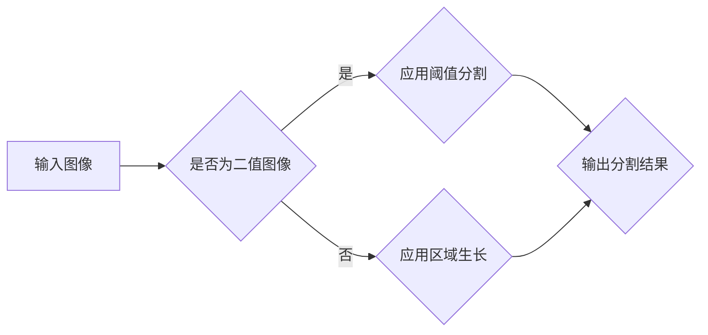
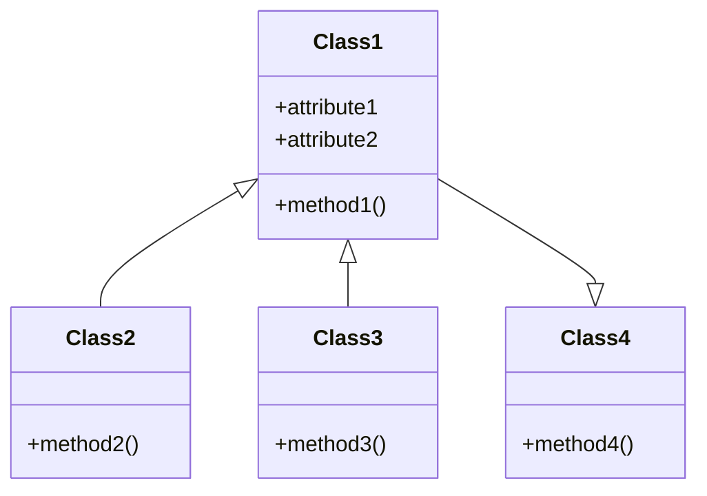
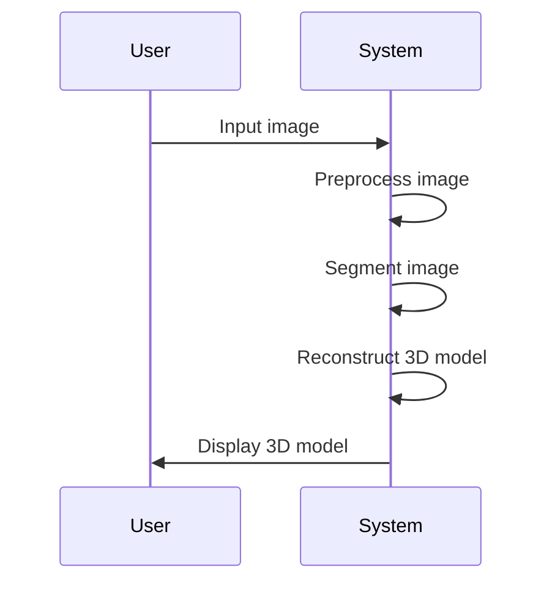

                 

### 虚拟现实在生物学研究中的应用

#### 2.1.1 虚拟现实在生物医学图像处理中的应用

虚拟现实（VR）在生物医学图像处理中的应用正在逐步改变医学成像领域的面貌。首先，我们需要理解什么是生物医学图像处理。生物医学图像处理是指对医学成像设备产生的图像进行数字化、处理和分析，以便医生能够更好地诊断和治疗疾病。常见的医学成像技术包括CT、MRI、X射线和超声波等。

**背景介绍**：
在传统医学成像中，医生需要通过2D图像来解读三维结构，这往往带来一定的难度和误差。虚拟现实技术通过提供沉浸式的三维图像体验，大大提升了医生对图像的理解和诊断的准确性。例如，通过VR眼镜，医生可以直观地旋转、缩放和解剖医学图像，从而更清晰地观察病灶。

**核心概念与联系**：
VR在生物医学图像处理中的核心概念包括三维重建、交互性和可视化。三维重建是将2D图像数据通过算法处理，恢复出三维结构。交互性则允许医生在虚拟环境中实时操作图像，提高诊断效率。可视化是将复杂的医学图像转化为直观的可视化形式，帮助医生更好地理解图像内容。

**算法原理讲解**：
虚拟现实在生物医学图像处理中的算法原理主要涉及图像分割、三维重建和交互技术。图像分割是将图像分割成不同的区域，以便更精确地分析。三维重建则是通过图像分割得到的三维数据，构建出完整的医学图像。交互技术则通过用户输入，实现对图像的实时操作和调整。

下面是一个简单的图像分割算法的流程图：

在实际应用中，通常会结合多种算法来提高图像分割的准确性和效率。

**数学公式**：
在图像分割中，常用的数学模型是阈值分割模型，其公式如下：
$$
\text{Threshold}(x, t) = \begin{cases}
0, & \text{if } x < t \\
1, & \text{if } x \geq t
\end{cases}
$$
其中，\( x \) 是像素值，\( t \) 是阈值。

**实例说明**：
假设有一幅医学图像，其中血管的像素值范围在50到150之间。我们可以设置阈值\( t = 100 \)，将血管像素值大于100的部分标记为1（血管），小于等于100的部分标记为0（背景）。这样，我们就可以通过简单的阈值分割算法将血管从背景中分离出来。

**系统分析与架构设计方案**：
一个典型的VR生物医学图像处理系统包括以下几个部分：

1. **图像采集模块**：使用医学成像设备采集图像数据。
2. **图像预处理模块**：对图像进行去噪、增强等预处理。
3. **三维重建模块**：利用分割算法和重建算法构建三维模型。
4. **交互界面模块**：提供VR眼镜和手柄等设备，实现医生与虚拟环境的交互。
5. **可视化模块**：将三维模型转化为可视化的图像，供医生诊断使用。

以下是系统的类图和架构图的Mermaid表示：

**项目实战**：

1. **环境安装**：
   - 安装VR设备（如Oculus Rift、HTC Vive）。
   - 安装必要的图像处理软件（如OpenCV、PCL）。
   - 配置VR开发环境（如Unity、Unreal Engine）。

2. **系统核心实现源代码**：
   - 使用Python编写图像预处理和分割算法。
   - 使用Unity开发VR交互界面。

3. **代码应用解读与分析**：
   - 分析图像预处理中的滤波算法。
   - 分析图像分割中的阈值选择策略。

4. **实际案例分析和详细讲解剖析**：
   - 分析某次实际医学图像分割和重建的过程。
   - 讨论如何通过VR技术提高医学诊断的准确性。

5. **项目小结**：
   - 总结VR在生物医学图像处理中的优势和挑战。
   - 提出未来VR技术在医学领域的应用前景。

**最佳实践 tips**：
- 考虑到不同类型医学图像的特点，选择合适的预处理和分割算法。
- 合理设置阈值，避免过度分割或漏分。
- 加强VR设备的跟踪精度和舒适度，提高用户体验。

**小结**：
虚拟现实技术在生物医学图像处理中的应用，不仅提高了图像的处理效率和准确性，还为医生提供了一种全新的诊断方式。通过沉浸式的三维图像体验，医生可以更直观地观察和理解医学图像，从而提高诊断的准确性。

**注意事项**：
- 在开发VR生物医学图像处理系统时，要充分考虑设备的兼容性和用户的操作习惯。
- 注意保护患者的隐私和数据安全。

**拓展阅读**：
- [OpenCV官方文档](https://docs.opencv.org/opencv/master/)
- [Point Cloud Library（PCL）官方文档](https://pointcloudlibrary.org/)
- [Unity官方文档](https://docs.unity3d.com/)
- [虚拟现实与医学成像相关研究论文](https://www.ncbi.nlm.nih.gov/pmc/articles/PMC5955056/)

