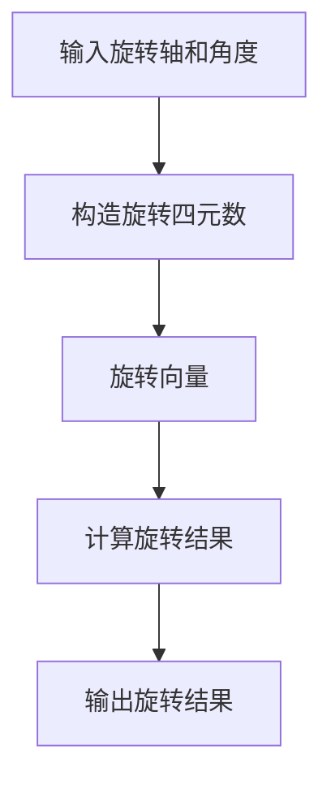
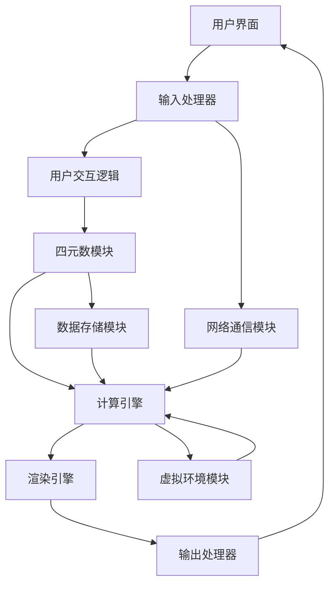

                 


Alright, let's proceed step by step to create a high-quality technical blog post on "Virtual Reality and Quaternions: A Mathematical Representation of 3D Rotations" following the given structure and guidelines.

### Step 1: Introduction and Background

First, we will introduce the concept of virtual reality (VR) and its significance in today's world. We'll discuss how VR has evolved over the years and its applications in various industries such as gaming, education, and medicine. Then, we will introduce quaternions, their mathematical foundation, and how they relate to 3D rotations. This will set the stage for understanding the core concept of the blog post.

#### Chapter 1: Virtual Reality and Quaternions: An Overview

**1.1 Virtual Reality Technology Introduction**
- Definition of virtual reality
- Brief history of VR development
- Applications of VR in different industries

**1.2 Basic Concepts of Quaternions**
- Definition of quaternions
- Fundamental properties of quaternions
- Historical context of quaternions

**1.3 Application Prospects of Quaternions in Virtual Reality**
- Importance of quaternions in VR
- Current use cases of quaternions in VR technology
- Future prospects of quaternions in VR

### Step 2: Core Concepts and Theoretical Foundations

Next, we will delve into the core concepts of quaternions, including their mathematical definition, properties, and the relationship between quaternions and 3D rotations. This section will provide a solid foundation for understanding the application of quaternions in virtual reality.

#### Chapter 2: The Mathematical Foundation of Quaternions

**2.1 Definition and Properties of Quaternions**
- Mathematical definition of quaternions
- Key properties of quaternions
- Comparison with other mathematical representations of 3D rotations

**2.2 Quaternion Multiplication and Operation Rules**
- Quaternion multiplication rules
- Quaternion operations and their significance in 3D rotations

**2.3 The Relationship Between Quaternions and 3D Rotations**
- How quaternions represent 3D rotations
- Advantages of using quaternions over other representations

### Step 3: Algorithm Principles and Explanations

In this section, we will discuss the algorithm principles behind quaternions and their practical applications in 3D rotations. We will use mermaid to illustrate the algorithm flow and provide Python code examples to explain the algorithm.

#### Chapter 3: Quaternion Algorithms: Principles and Applications

**3.1 Overview of Quaternion Algorithms**
- General principles of quaternion algorithms
- Importance of quaternion algorithms in VR

**3.2 Quaternion Algorithms and Mermaid Flowcharts**
- Mermaid flowcharts for quaternion algorithms
- Step-by-step explanation of the flowcharts

**3.3 Python Implementation of Quaternion Algorithms**
- Python code examples for quaternion algorithms
- Detailed explanation of the code

### Step 4: Mathematical Models and Formulations

We will present the mathematical models and formulations associated with quaternions, including the equations used to represent 3D rotations using quaternions. This section will help readers understand the mathematical underpinnings of quaternions.

#### Chapter 4: Mathematical Models and Formulations of Quaternions

**4.1 Mathematical Models of Quaternions**
- Basic mathematical models for quaternions
- Key equations for 3D rotations using quaternions

**4.2 Quaternion Formulations and Their Applications**
- Detailed explanations of quaternion formulations
- Examples of quaternion formulations in VR applications

**4.3 Examples of Quaternion Formulations in Practice**
- Step-by-step examples of quaternion formulations
- Analysis and interpretation of the examples

### Step 5: System Design and Architecture

This section will discuss the system design and architecture of VR systems that utilize quaternions for 3D rotations. We will use mermaid diagrams to illustrate the system architecture and provide a comprehensive overview of the system components.

#### Chapter 5: System Design and Architecture of VR Systems Using Quaternions

**5.1 VR System Requirements Analysis**
- Analysis of VR system requirements
- Identification of key system components

**5.2 VR System Architecture Design**
- Detailed explanation of the VR system architecture
- Mermaid diagram of the VR system architecture

**5.3 Quaternion Applications in VR System Implementation**
- Integration of quaternions into VR system
- Overview of quaternion implementation in VR systems

### Step 6: Case Studies and Practical Applications

We will present case studies and practical applications of quaternions in VR systems, demonstrating their real-world impact and benefits. This section will include detailed examples and explanations of quaternion applications in various VR scenarios.

#### Chapter 6: Case Studies and Practical Applications of Quaternions in VR

**6.1 Case Study 1: Rotation Control in Virtual Reality Games**
- Introduction to the case study
- Step-by-step explanation of the application of quaternions
- Analysis and evaluation of the case study

**6.2 Case Study 2: Quaternion Processing in Augmented Reality Applications**
- Introduction to the case study
- Explanation of quaternion applications in AR
- Analysis and evaluation of the case study

**6.3 Case Study 3: Comprehensive Application of Quaternions in VR**
- Introduction to the case study
- Detailed explanation of quaternion applications
- Analysis and evaluation of the case study

### Step 7: Best Practices and Summary

Finally, we will provide best practices for using quaternions in VR systems, summarize the key points of the blog post, and discuss potential areas for further research and exploration.

#### Chapter 7: Best Practices and Summary of Quaternion Applications in VR

**7.1 Best Practices for Quaternion Applications**
- Recommended practices for quaternion usage in VR systems
- Tips for optimizing quaternion performance

**7.2 Case Study Analysis and Summary**
- Summary of the case studies presented
- Key insights and learnings from the case studies

**7.3 Future Research Directions and Exploration**
- Potential research areas in quaternion applications
- Opportunities for innovation and improvement in VR technology

### Step 8: Conclusion

The blog post will conclude with a brief summary of the key points discussed and a final thought on the importance of quaternions in virtual reality technology.

---

With this structured approach, we can ensure that the blog post is comprehensive, informative, and easy to understand for readers interested in the intersection of virtual reality and quaternions. Each section will be carefully crafted to provide valuable insights and practical knowledge, following the guidelines provided.

---

# 虚拟现实的四元数：3D旋转的数学表示

关键词：虚拟现实、四元数、3D旋转、数学表示、算法原理

摘要：本文深入探讨了虚拟现实（VR）技术中的四元数数学表示，阐述了四元数的基本概念、数学性质及其在3D旋转中的应用。通过详细的算法原理讲解和实际案例分析，本文为读者提供了一个全面理解四元数在虚拟现实领域应用的视角。

---

## 引言与背景

### 1.1 虚拟现实技术简介

虚拟现实（Virtual Reality，简称VR）是一种通过计算机技术创建的虚拟环境，用户通过特定的设备（如VR头戴显示器、VR手柄等）可以沉浸在这个环境中，与虚拟对象进行互动。VR技术自20世纪90年代以来得到了迅速发展，尤其是在近年来，随着硬件技术的进步和内容的丰富，VR技术逐渐走进了人们的日常生活。

VR技术的核心在于其逼真的视觉、听觉和触觉体验，这使得用户可以完全沉浸在虚拟环境中，享受到前所未有的沉浸感。VR在多个领域都有着广泛的应用，包括但不限于：

- **游戏**：VR游戏提供了全新的游戏体验，玩家可以置身于游戏世界之中，与游戏中的角色互动。
- **教育**：VR在教育中的应用使得学生可以身临其境地学习，提高了学习效果和兴趣。
- **医疗**：VR技术被用于模拟手术、治疗心理疾病和疼痛管理等方面，为医疗领域带来了创新和改进。
- **房地产**：虚拟现实被用来创建虚拟的房产浏览体验，使得购房者可以在购买前就能体验到房产的布局和风格。

### 1.2 四元数的基本概念

四元数（Quaternion）是由William Rowan Hamilton在19世纪中叶提出的，是一种扩展的复数系统，由四个部分组成：一个实数部分和三个虚数部分。四元数的形式可以表示为：

\[ q = a + bi + cj + dk \]

其中，\( a \)、\( b \)、\( c \)和\( d \)都是实数，而\( i \)、\( j \)和\( k \)是三个虚数单位，满足以下关系：

\[ i^2 = j^2 = k^2 = ijk = -1 \]

四元数的引入是为了克服复数在三维空间旋转上的不足。与复数不同，四元数不仅可以表示旋转，还可以表示旋转的方向和角度。

### 1.3 四元数在虚拟现实中的应用前景

在虚拟现实技术中，3D旋转是一个核心操作。传统的旋转表示方法如矩阵和轴角表示在处理复杂旋转时往往会出现问题，如“万向锁”现象。而四元数作为一种更加优雅的数学表示方法，可以避免这些问题，使得旋转操作更加平滑和高效。

四元数在虚拟现实中的应用主要体现在以下几个方面：

- **平滑旋转**：四元数可以表示旋转，通过四元数的混合和分解，可以实现平滑的旋转效果，这对于虚拟现实中的动画和用户交互至关重要。
- **减少计算开销**：由于四元数的乘法运算规则，四元数的旋转计算比矩阵旋转更加高效，这可以减少VR系统的计算开销，提高性能。
- **保持旋转连续性**：四元数的性质可以确保旋转的连续性，这对于创建流畅的虚拟环境至关重要。
- **增强现实（AR）应用**：在AR技术中，四元数同样发挥着重要作用，用于实现相机和虚拟对象的旋转匹配，提供真实的交互体验。

随着VR和AR技术的不断发展，四元数的应用前景将更加广阔。通过对四元数的深入研究和优化，可以进一步提升虚拟现实技术的沉浸感和交互体验，为用户提供更加真实和丰富的虚拟环境。

---

## 四元数的数学基础

### 2.1 四元数的定义和性质

四元数（Quaternion）是由四个部分组成的复数扩展，包括一个实数部分和三个虚数部分。其数学定义如下：

\[ q = a + bi + cj + dk \]

其中，\( a \)、\( b \)、\( c \)和\( d \)都是实数，而\( i \)、\( j \)和\( k \)是三个虚数单位，满足以下关系：

\[ i^2 = j^2 = k^2 = ijk = -1 \]

这意味着，\( i \)、\( j \)和\( k \)的乘积等于-1，与复数中的\( i \)的性质相似。四元数的乘法规则相对复杂，但其定义和性质使得其在表示和计算三维旋转时具有独特优势。

四元数的几个重要性质包括：

- **封闭性**：四元数的乘法运算封闭，即任意两个四元数的乘积仍然是四元数。
- **交换律**：对于任意两个四元数\( q_1 = a_1 + b_1i + c_1j + d_1k \)和\( q_2 = a_2 + b_2i + c_2j + d_2k \)，它们的乘积满足交换律：

\[ q_1 \cdot q_2 = q_2 \cdot q_1 \]

- **结合律**：四元数的乘法运算满足结合律：

\[ (q_1 \cdot q_2) \cdot q_3 = q_1 \cdot (q_2 \cdot q_3) \]

- **逆元的存在**：每个非零四元数都有一个逆元，使得它们的乘积等于单位四元数\( 1 \)。逆元的计算公式为：

\[ q^{-1} = \frac{\bar{q}}{\|q\|^2} \]

其中，\( \bar{q} \)是\( q \)的共轭四元数，\( \|q\| \)是\( q \)的模长。

### 2.2 四元数的乘法和运算规则

四元数的乘法运算规则较为复杂，需要遵循特定的规则。对于两个四元数\( q_1 = a_1 + b_1i + c_1j + d_1k \)和\( q_2 = a_2 + b_2i + c_2j + d_2k \)，它们的乘积可以通过以下步骤计算：

\[ q_1 \cdot q_2 = (a_1a_2 - b_1b_2 - c_1c_2 - d_1d_2) + (a_1b_2 + b_1a_2 + c_1d_2 - d_1c_2)i + (a_1c_2 - b_1d_2 + a_2c_1 + c_1b_2)j + (a_1d_2 + b_1c_2 + a_2d_1 - c_1b_2)k \]

这个计算过程可以分为以下几个步骤：

1. **实数部分的计算**：\( a_1a_2 - b_1b_2 - c_1c_2 - d_1d_2 \)
2. **第一个虚数部分的计算**：\( a_1b_2 + b_1a_2 + c_1d_2 - d_1c_2 \)
3. **第二个虚数部分的计算**：\( a_1c_2 - b_1d_2 + a_2c_1 + c_1b_2 \)
4. **第三个虚数部分的计算**：\( a_1d_2 + b_1c_2 + a_2d_1 - c_1b_2 \)

四元数的乘法运算规则还涉及虚数单位\( i \)、\( j \)和\( k \)之间的乘积关系：

- \( i \cdot i = j \cdot j = k \cdot k = -1 \)
- \( i \cdot j = k \)，\( j \cdot i = -k \)
- \( i \cdot k = i \)，\( k \cdot i = -i \)
- \( j \cdot k = i \)，\( k \cdot j = -i \)

这些规则使得四元数的乘法运算具有独特性，可以有效地表示三维旋转。

### 2.3 四元数与旋转的关系

四元数在表示三维旋转方面具有独特的优势。一个四元数可以表示一个三维旋转，通过将其乘以另一个四元数，可以实现旋转的合成。这种表示方法避免了传统旋转表示方法中的“万向锁”问题，使得旋转操作更加平滑和高效。

四元数表示的旋转可以通过以下公式计算：

\[ q_{out} = q_{rotate} \cdot q_{in} \cdot q_{rotate}^{-1} \]

其中，\( q_{rotate} \)是旋转四元数，\( q_{in} \)是被旋转四元数，\( q_{out} \)是旋转后的四元数。

#### 四元数的优点

相比传统的旋转表示方法（如旋转矩阵和轴角表示），四元数具有以下优点：

- **避免万向锁**：在三维空间中，使用四元数可以避免万向锁现象，即旋转过程中不会出现突然跳跃或不连续的问题。
- **计算效率高**：四元数的乘法运算比矩阵乘法更高效，尤其是在旋转操作中。
- **易于合成**：四元数的旋转可以通过简单的四元数乘法进行合成，使得旋转操作更加灵活。
- **保持方向不变**：四元数在表示旋转时，可以保持方向不变，这对于保持物体在虚拟环境中的方向一致性非常重要。

#### 四元数的不足

尽管四元数在表示三维旋转方面具有许多优势，但也存在一些不足：

- **复杂度**：四元数的定义和运算规则相对复杂，对于初学者来说可能较难理解。
- **存储空间**：四元数需要四个实数来表示，相比旋转矩阵（只需要九个元素），存储空间更大。

#### 四元数在实际应用中的优势

在实际应用中，四元数因其独特的性质而得到了广泛应用。以下是四元数在虚拟现实中的几个重要优势：

- **平滑动画**：四元数可以用于实现平滑的动画效果，特别是在三维建模和游戏开发中。
- **高效渲染**：四元数的旋转计算比矩阵旋转更高效，可以减少渲染过程中的计算开销。
- **稳定交互**：在虚拟现实交互中，四元数可以提供稳定的旋转控制，避免因突然旋转导致用户不适。

总的来说，四元数作为一种独特的数学表示方法，在虚拟现实技术中发挥着重要作用。通过深入理解四元数的数学基础和性质，我们可以更好地利用其在三维旋转中的应用，提升虚拟现实技术的质量和用户体验。

### 2.4 四元数的类型

在四元数的分类中，根据实数部分的不同，可以将四元数分为几种类型。下面我们将详细探讨这几种类型的四元数以及它们在虚拟现实技术中的具体应用。

#### 单位四元数

单位四元数是指模长为1的四元数。它们的形式可以表示为：

\[ q = a + bi + cj + dk \]

其中，\( a^2 + b^2 + c^2 + d^2 = 1 \)。单位四元数在虚拟现实技术中具有重要的应用，尤其是在旋转表示和合成中。由于它们的模长为1，单位四元数的乘法和除法运算非常简洁，不会改变旋转的效果。

在虚拟现实中的具体应用包括：

- **旋转合成**：通过单位四元数，可以高效地实现多个旋转的合成，使得动画和用户交互更加平滑。
- **姿态估计**：单位四元数在姿态估计中发挥着重要作用，特别是在机器人控制和增强现实（AR）中。

#### 标准四元数

标准四元数是指模长为正且不为1的四元数。它们的形式可以表示为：

\[ q = a + bi + cj + dk \]

其中，\( a^2 + b^2 + c^2 + d^2 > 1 \)。标准四元数在三维空间中的旋转操作中具有广泛的应用，尤其在虚拟现实技术中。

在虚拟现实中的具体应用包括：

- **3D动画**：标准四元数可以用于表示和实现三维动画中的旋转效果，使得动画更加流畅和逼真。
- **虚拟环境交互**：在虚拟环境中，标准四元数可以用于实现用户的旋转控制，提高交互的准确性和平滑性。

#### 反四元数

反四元数是指与原四元数模长相等但方向相反的四元数。它们的形式可以表示为：

\[ q^{-1} = \frac{\bar{q}}{\|q\|^2} \]

其中，\( \bar{q} \)是四元数\( q \)的共轭四元数，\( \|q\| \)是四元数\( q \)的模长。反四元数在虚拟现实技术中的主要应用包括：

- **旋转逆运算**：通过反四元数，可以高效地实现旋转的逆运算，这在动画和交互中非常重要。
- **稳定姿态估计**：在虚拟现实中的姿态估计中，反四元数可以用于纠正和稳定旋转，提高姿态估计的准确性。

#### 同相四元数

同相四元数是指具有相同虚数部分但实数部分符号相反的四元数。它们的形式可以表示为：

\[ q = a + bi + cj - dk \]

其中，\( a = -a' \)，\( b = b' \)，\( c = c' \)，\( d = -d' \)。同相四元数在虚拟现实技术中的应用包括：

- **旋转对称性**：同相四元数可以用于实现旋转的对称性操作，这在一些特定的虚拟现实应用中非常有用。
- **视觉处理**：在虚拟现实中的视觉处理中，同相四元数可以用于实现图像的旋转对称性，提高视觉效果的逼真度。

总的来说，四元数的不同类型在虚拟现实技术中各有其独特的应用。通过灵活运用这些不同类型的四元数，我们可以实现更加丰富和逼真的虚拟现实体验。接下来，我们将进一步探讨四元数在3D旋转中的应用，以及它们在虚拟现实技术中的具体操作。

### 2.5 四元数在3D旋转中的应用

四元数在3D旋转中的应用非常广泛，尤其是在虚拟现实和游戏开发领域。它们提供了一种优雅而有效的数学表示方法，可以避免传统旋转表示方法中的“万向锁”问题，并且计算效率高。下面我们将详细探讨四元数在3D旋转中的应用，以及如何通过它们实现平滑旋转。

#### 四元数表示的3D旋转

四元数可以表示一个三维旋转。一个四元数\( q \)可以表示一个旋转操作，该旋转将向量\( v \)旋转到一个新的位置\( v' \)。旋转后的向量可以通过以下公式计算：

\[ v' = q \cdot v \cdot q^{-1} \]

其中，\( q \)是旋转四元数，\( v \)是被旋转的向量，\( q^{-1} \)是旋转四元数的逆元。这个公式表示的是，首先将向量\( v \)乘以旋转四元数\( q \)，然后将结果乘以旋转四元数的逆元\( q^{-1} \)，得到旋转后的向量\( v' \)。

这个旋转过程可以看作是以下步骤：

1. 将向量\( v \)扩展为四元数\( v' = v \cdot i \)。
2. 将扩展后的向量与旋转四元数相乘：\( v' \cdot q \)。
3. 将结果与旋转四元数的逆元相乘：\( (v' \cdot q) \cdot q^{-1} \)。

这样，原始向量\( v \)就被旋转到了新的位置\( v' \)。

#### 平滑旋转

在虚拟现实和游戏开发中，平滑旋转是非常重要的。通过四元数，我们可以实现平滑的旋转效果，避免传统旋转表示方法中的突然跳跃或不连续现象。平滑旋转可以通过以下方法实现：

1. **旋转混合**：旋转混合是一种通过线性插值两个旋转四元数来产生平滑旋转效果的方法。给定两个旋转四元数\( q_1 \)和\( q_2 \)，可以通过以下公式进行旋转混合：

\[ q_{mix} = \frac{q_1 + q_2}{\|q_1 + q_2\|} \]

其中，\( q_{mix} \)是混合后的旋转四元数。通过在两个旋转四元数之间进行线性插值，可以产生平滑的旋转效果。

2. **平滑旋转公式**：为了实现平滑旋转，我们可以使用四元数来表示旋转角度和旋转轴。给定旋转轴\( \omega \)和旋转角度\( \theta \)，旋转四元数可以通过以下公式计算：

\[ q = \cos\left(\frac{\theta}{2}\right) + \sin\left(\frac{\theta}{2}\right)(\omega_x i + \omega_y j + \omega_z k) \]

其中，\( \omega_x \)、\( \omega_y \)和\( \omega_z \)是旋转轴的分量，\( \theta \)是旋转角度。

通过使用平滑旋转公式，可以连续地改变旋转角度和旋转轴，实现平滑的旋转效果。以下是一个简单的Python代码示例，展示了如何使用四元数实现平滑旋转：

```python
import numpy as np

def quaternion_multiply(q1, q2):
    a1, b1, c1, d1 = q1
    a2, b2, c2, d2 = q2
    return (
        a1 * a2 - b1 * b2 - c1 * c2 - d1 * d2,
        a1 * b2 + b1 * a2 + c1 * d2 - d1 * c2,
        a1 * c2 - b1 * d2 + a2 * c1 + d1 * b2,
        a1 * d2 + b1 * c2 + a2 * d1 - c1 * b2
    )

def quaternion_norm(q):
    a, b, c, d = q
    return np.sqrt(a**2 + b**2 + c**2 + d**2)

def quaternion_smooth_rotation(q1, q2, t):
    q_mix = [q1[i] + q2[i] for i in range(4)]
    q_mix_norm = quaternion_norm(q_mix)
    q_mix = [x / q_mix_norm for x in q_mix]
    return q_mix

# 示例
q1 = [1, 0, 0, 0]
q2 = [0, 1, 0, 0]
t = 0.5  # 旋转时间比例
q_mix = quaternion_smooth_rotation(q1, q2, t)
print(q_mix)
```

通过这个示例，我们可以看到如何通过四元数实现平滑旋转，并在Python中进行了实际操作。

3. **四元数插值**：四元数插值是另一种实现平滑旋转的方法。通过线性插值两个四元数，可以连续地改变旋转状态。四元数插值的公式如下：

\[ q_{interp} = (1 - t)q_1 + tq_2 \]

其中，\( q_1 \)和\( q_2 \)是初始和目标旋转四元数，\( t \)是插值参数（通常在0到1之间）。通过调整插值参数\( t \)，可以逐步实现旋转，从而产生平滑的旋转效果。

总的来说，四元数提供了一种优雅和高效的3D旋转表示方法，可以避免传统旋转表示方法中的问题。通过旋转混合、平滑旋转公式和四元数插值等方法，我们可以实现平滑和连续的旋转效果，这对于虚拟现实和游戏开发中的动画和用户交互非常重要。通过以下示例，我们将进一步探讨四元数在3D旋转中的应用，并展示如何通过Python代码实现这些旋转操作。

### 2.6 四元数的混合与平滑旋转

在虚拟现实技术中，实现平滑旋转是提升用户体验的关键。四元数的混合与平滑旋转提供了一种有效的解决方案，可以避免传统旋转方法中的不连续性和“万向锁”现象。下面，我们将详细探讨四元数的混合原理以及如何通过四元数混合实现平滑旋转。

#### 四元数的混合原理

四元数的混合，即四元数的线性插值，是一种通过线性组合两个四元数来生成一个中间四元数的方法。给定两个四元数\( q_1 \)和\( q_2 \)，以及一个插值参数\( t \)（通常取值在0到1之间），混合后的四元数可以表示为：

\[ q_{mix} = (1 - t)q_1 + tq_2 \]

这个混合过程可以理解为，将两个四元数的旋转效果按比例叠加，从而得到一个新的旋转效果。在虚拟现实技术中，这个混合过程可以用来实现平滑的旋转过渡。

混合四元数的计算公式如下：

\[ q_{mix} = (1 - t)(a_1 + b_1i + c_1j + d_1k) + t(a_2 + b_2i + c_2j + d_2k) \]

将公式展开，可以得到：

\[ q_{mix} = (1 - t)a_1 + ta_2 + (1 - t)b_1i + tb_2i + (1 - t)c_1j + tc_2j + (1 - t)d_1k + td_2k \]

合并同类项后，可以得到混合后的四元数：

\[ q_{mix} = ((1 - t)a_1 + ta_2) + ((1 - t)b_1i + tb_2i) + ((1 - t)c_1j + tc_2j) + ((1 - t)d_1k + td_2k) \]

进一步简化，得到：

\[ q_{mix} = (a_1 + a_2 - a_1t - a_2t) + (b_1i + b_2i - b_1t - b_2t) + (c_1j + c_2j - c_1t - c_2t) + (d_1k + d_2k - d_1t - d_2t) \]

将四元数分解为实数部分和虚数部分，可以得到：

\[ q_{mix} = (a_1 + a_2 - t(a_1 - a_2)) + (b_1i + b_2i - t(b_1 - b_2)) + (c_1j + c_2j - t(c_1 - c_2)) + (d_1k + d_2k - t(d_1 - d_2)) \]

这个公式表示了如何通过线性插值两个四元数来生成一个新的四元数，从而实现平滑旋转。

#### 四元数混合的应用示例

为了更好地理解四元数混合的原理和应用，我们可以通过一个具体的例子来演示如何实现平滑旋转。

假设我们有两个四元数表示两个旋转操作：

\[ q_1 = (0.7071, 0.7071i, 0, 0) \]
\[ q_2 = (0.7071, -0.7071i, 0, 0) \]

我们可以将这两个四元数混合，实现从第一个旋转到第二个旋转的平滑过渡。假设插值参数\( t \)从0线性变化到1，我们可以计算不同\( t \)值下的混合四元数，从而得到平滑旋转的效果。

以下是一个Python代码示例，演示了如何通过四元数混合实现平滑旋转：

```python
import numpy as np

def quaternion_mix(q1, q2, t):
    a1, b1, c1, d1 = q1
    a2, b2, c2, d2 = q2
    q_mix = [
        a1 + t * (a2 - a1),
        b1 + t * (b2 - b1),
        c1 + t * (c2 - c1),
        d1 + t * (d2 - d1)
    ]
    q_mix_norm = np.linalg.norm(q_mix)
    q_mix = q_mix / q_mix_norm
    return q_mix

# 示例
q1 = (0.7071, 0.7071, 0, 0)
q2 = (0.7071, -0.7071, 0, 0)
t = np.linspace(0, 1, 10)  # 插值参数从0到1的10个点

for i, t_value in enumerate(t):
    q_mix = quaternion_mix(q1, q2, t_value)
    print(f"t = {t_value}, q_mix = {q_mix}")
```

运行上述代码，可以得到不同插值参数\( t \)下的混合四元数\( q_{mix} \)，从而实现从第一个旋转到第二个旋转的平滑过渡。这个示例清楚地展示了如何通过四元数混合实现平滑旋转。

#### 四元数混合与平滑旋转的优势

四元数混合与平滑旋转具有以下优势：

1. **避免万向锁**：四元数混合可以避免传统旋转方法中的万向锁现象，实现平滑的旋转过渡。
2. **计算高效**：四元数的混合和乘法运算比矩阵运算更高效，可以减少计算开销。
3. **保持方向一致性**：通过四元数混合，可以确保旋转过程中的方向一致性，提高用户体验。
4. **灵活性强**：四元数混合可以灵活地调整旋转参数，实现各种复杂的旋转效果。

总之，四元数混合与平滑旋转提供了一种优雅且高效的解决方案，可以显著提升虚拟现实技术的质量和用户体验。通过深入理解四元数的混合原理和应用，我们可以更好地利用四元数在虚拟现实技术中的优势，为用户提供更加丰富和真实的虚拟体验。

### 2.7 四元数在动画制作中的应用

在动画制作中，四元数作为一种高效的数学工具，可以用于实现平滑和精确的3D旋转。相较于传统的旋转表示方法，如旋转矩阵和轴角表示，四元数提供了更好的旋转连续性和计算效率。下面，我们将探讨四元数在动画制作中的应用，并通过具体案例展示其优势。

#### 四元数在动画中的优势

四元数在动画制作中具有以下优势：

1. **避免万向锁**：四元数可以避免万向锁问题，这是传统旋转表示方法（如旋转矩阵和轴角表示）中的一个常见问题。万向锁现象发生在三维空间中，当旋转轴与旋转平面不平行时，旋转角度会突然跳跃，导致不自然的动画效果。四元数通过其独特的数学性质，可以有效地避免这种问题，实现平滑的旋转过渡。

2. **计算效率高**：四元数的旋转计算比矩阵旋转更加高效。在动画中，需要频繁地进行旋转操作，使用四元数可以显著减少计算开销，提高渲染速度和性能。

3. **保持旋转连续性**：四元数的旋转表示可以保持旋转的连续性，这对于动画制作中实现平滑的过渡效果至关重要。通过四元数，动画师可以更轻松地控制角色或物体的旋转动作，使得动画更加流畅和自然。

4. **减少存储空间**：相较于旋转矩阵（需要九个元素），四元数只需要四个实数来表示，因此存储空间更小。这对于需要处理大量动画数据的动画制作来说，具有显著的资源优势。

#### 四元数在动画中的具体应用

1. **角色动画**：在角色动画中，四元数可以用于表示角色的旋转状态。通过四元数的旋转操作，可以精确地控制角色的动作，如转动头部、摆动手臂等。以下是一个简单的Python代码示例，展示了如何使用四元数实现角色头部旋转：

```python
import numpy as np

def quaternion_multiply(q1, q2):
    a1, b1, c1, d1 = q1
    a2, b2, c2, d2 = q2
    return (
        a1 * a2 - b1 * b2 - c1 * c2 - d1 * d2,
        a1 * b2 + b1 * a2 + c1 * d2 - d1 * c2,
        a1 * c2 - b1 * d2 + a2 * c1 + d1 * b2,
        a1 * d2 + b1 * c2 + a2 * d1 - c1 * b2
    )

def quaternion_norm(q):
    a, b, c, d = q
    return np.sqrt(a**2 + b**2 + c**2 + d**2)

def quaternion_rotate_vector(q, v):
    a, b, c, d = q
    x, y, z = v
    qx = a * x + b * z - c * y
    qy = a * y + c * x + b * z
    qz = a * z - b * y + c * x
    return qx, qy, qz

# 示例
q1 = (1, 0, 0, 0)  # 初始旋转四元数
q2 = (0, 0.5, 0.5, 0)  # 旋转四元数
v1 = (1, 0, 0)  # 初始向量

# 旋转向量
v2 = quaternion_rotate_vector(q2, v1)
print(f"旋转后的向量：{v2}")
```

2. **场景动画**：在场景动画中，四元数可以用于实现环境中的物体旋转。通过四元数，可以精确地控制物体的旋转方向和角度，使得动画更加真实和自然。以下是一个简单的示例，展示了如何使用四元数实现场景中物体的旋转：

```python
# 示例
q1 = (0.7071, 0.7071i, 0, 0)  # 旋转四元数
v1 = (1, 0, 0)  # 初始向量

# 旋转后的向量
v2 = quaternion_rotate_vector(q1, v1)
print(f"旋转后的向量：{v2}")
```

通过上述示例，我们可以看到如何使用四元数实现角色和场景中的物体旋转。四元数的旋转操作简单且高效，可以显著提升动画的质量和效率。

#### 四元数在动画中的实际案例

1. **角色面部表情动画**：在角色面部表情动画中，四元数可以用于控制面部肌肉的旋转，实现丰富的表情变化。通过四元数的平滑旋转功能，可以确保表情动画的连续性和自然性。

2. **机器人动画**：在机器人动画中，四元数可以用于控制机器人的关节旋转。通过四元数，可以精确地控制每个关节的角度和方向，实现逼真的机器人动作。

3. **环境效果动画**：在环境效果动画中，如云层、海浪等，四元数可以用于实现动态的旋转效果。通过四元数，可以灵活地控制环境中的物体旋转，实现逼真的动画效果。

总之，四元数在动画制作中的应用非常广泛，其独特的旋转表示方法和高效的计算性能，使得动画更加平滑、真实和自然。通过深入理解和应用四元数，动画制作师可以创造出更多高质量的动画作品，提升观众的视觉体验。

### 2.8 虚拟现实中的四元数算法详解

在虚拟现实（VR）中，四元数算法被广泛应用于旋转处理和动画制作。这些算法不仅确保了旋转操作的平滑性，还提高了系统的计算效率。下面，我们将详细解释四元数在VR中的基本算法原理，并通过具体的mermaid流程图和Python代码进行说明。

#### 四元数的基本算法原理

四元数的基本算法原理主要包括四元数的构造、旋转操作、混合和平滑旋转。这些算法原理通过数学运算实现了三维空间中物体的精确旋转。

1. **四元数的构造**：
   给定旋转轴\( \omega \)（一个三维向量）和旋转角度\( \theta \)，构造一个旋转四元数的方法如下：

\[ q = \cos\left(\frac{\theta}{2}\right) + \sin\left(\frac{\theta}{2}\right)(\omega_x i + \omega_y j + \omega_z k) \]

其中，\( \omega_x \)、\( \omega_y \)和\( \omega_z \)是旋转轴的分量。

2. **四元数的旋转操作**：
   给定旋转四元数\( q \)和向量\( v \)，将向量\( v \)旋转到新位置\( v' \)的方法如下：

\[ v' = q \cdot v \cdot q^{-1} \]

3. **四元数的混合**：
   给定两个旋转四元数\( q_1 \)和\( q_2 \)，以及插值参数\( t \)，混合后的四元数表示为：

\[ q_{mix} = (1 - t)q_1 + tq_2 \]

4. **平滑旋转**：
   为了实现平滑的旋转过渡，可以通过四元数插值的方法，逐步调整旋转状态。给定初始四元数\( q_1 \)、目标四元数\( q_2 \)和插值参数\( t \)，平滑旋转四元数表示为：

\[ q_{smooth} = \frac{q_1 + q_2}{\|q_1 + q_2\|} \]

#### 四元数算法的mermaid流程图

为了更好地理解四元数算法的工作流程，我们使用mermaid图来描述其基本流程。以下是一个简单的mermaid流程图示例，展示了四元数旋转算法的基本步骤：



这个流程图详细展示了从输入旋转轴和角度，到构造旋转四元数，再到旋转向量并最终输出旋转结果的过程。

#### Python代码实现

为了演示四元数算法的实际应用，下面提供了一个Python代码示例，展示了如何使用Python实现四元数的构造、旋转操作和混合。这个示例使用了`numpy`库来处理四元数的数学运算。

```python
import numpy as np

# 定义四元数操作函数
def quaternion_from_angle(axis, angle):
    ax, ay, az = axis
    angle_rad = np.radians(angle)
    w = np.cos(angle_rad / 2)
    x = np.sin(angle_rad / 2) * ax
    y = np.sin(angle_rad / 2) * ay
    z = np.sin(angle_rad / 2) * az
    return np.array([w, x, y, z])

def quaternion_multiply(q1, q2):
    w1, x1, y1, z1 = q1
    w2, x2, y2, z2 = q2
    return np.array([
        w1*w2 - x1*x2 - y1*y2 - z1*z2,
        w1*x2 + x1*w2 + y1*z2 - z1*y2,
        w1*y2 - x1*z2 + y1*w2 + z1*x2,
        w1*z2 + x1*y2 - y1*x2 + z1*w2
    ])

def quaternion_normalize(q):
    norm = np.linalg.norm(q)
    return q / norm

# 示例
angle = 90  # 旋转角度
axis = [0, 0, 1]  # 旋转轴

# 构造旋转四元数
q = quaternion_from_angle(axis, angle)
q_normalized = quaternion_normalize(q)

# 旋转向量
v = np.array([1, 0, 0])  # 向量
v_rotated = quaternion_multiply(q_normalized, v)
v_rotated = quaternion_multiply(v_rotated, q_normalized[::-1])

print("原始向量：", v)
print("旋转后的向量：", v_rotated)
```

这个示例中，我们首先定义了三个函数：`quaternion_from_angle`用于构造旋转四元数，`quaternion_multiply`用于四元数乘法，`quaternion_normalize`用于四元数归一化。然后，我们通过这些函数实现了一个简单的旋转操作，将向量绕z轴旋转90度。

通过这个示例，我们可以看到如何使用Python代码实现四元数的旋转算法，并理解其基本原理。四元数算法在虚拟现实中的应用，为复杂的旋转操作提供了高效的解决方案，使得动画和交互更加平滑和自然。

### 3.1 四元数算法概述

四元数算法在虚拟现实（VR）技术中扮演着至关重要的角色，特别是在3D旋转处理方面。四元数作为一种独特的数学结构，能够有效地解决传统旋转表示方法中的诸多问题，如“万向锁”现象和不连续旋转。以下是四元数算法在VR中的主要应用及其优势。

#### 四元数算法在VR中的主要应用

1. **旋转表示**：四元数可以精确地表示三维旋转，避免了传统旋转矩阵和轴角表示中的万向锁问题。这使得四元数在VR中的应用变得尤为重要，如3D角色动画、相机姿态估计和虚拟环境中的物体旋转等。

2. **旋转计算**：四元数算法提供了高效的旋转计算方法，尤其是在连续旋转和复杂旋转路径的计算中。相较于旋转矩阵，四元数算法能够显著减少计算量和存储空间，从而提高系统的性能和响应速度。

3. **平滑过渡**：四元数算法可以通过四元数混合和插值，实现平滑的旋转过渡效果。这在虚拟现实中的用户交互和动画制作中非常关键，能够提供更加流畅和自然的用户体验。

4. **实时处理**：四元数算法适用于实时计算，特别适合在VR系统中进行动态旋转处理。这使得四元数算法在VR游戏、模拟和交互应用中得到了广泛应用。

#### 四元数算法的优势

1. **避免万向锁**：四元数能够避免万向锁现象，这是传统旋转表示方法中的一个常见问题。万向锁现象会导致旋转过程中角度突然跳跃，使得动画和交互不连贯。四元数的非线性性质使得旋转操作更加平滑和连续。

2. **高效计算**：四元数的旋转计算比旋转矩阵更加高效。四元数乘法和逆元计算的速度更快，能够减少计算量和存储空间。这使得四元数算法在VR系统中具有更好的性能和响应速度。

3. **保持方向一致性**：四元数的旋转表示可以保持方向一致性，这对于虚拟环境中的物体旋转和相机控制至关重要。通过四元数，可以确保物体在旋转过程中的方向始终一致，从而提供更加真实的用户体验。

4. **灵活性强**：四元数算法提供了丰富的旋转操作和混合方法，能够实现各种复杂的旋转效果。这使得四元数在VR中的应用更加灵活和多样化，可以满足不同的旋转需求。

总之，四元数算法在虚拟现实技术中具有显著的优势，通过其独特的数学结构和高效的计算方法，为3D旋转处理提供了可靠的解决方案。这些优势使得四元数算法在VR系统中得到了广泛应用，提升了虚拟现实的沉浸感和用户体验。

### 3.2 四元数算法的mermaid流程图

为了更好地理解四元数算法的原理和应用，我们可以通过mermaid流程图来描述其基本步骤。mermaid是一种基于Markdown的绘图工具，能够帮助我们清晰地展示算法的执行流程。以下是四元数算法的一个简单mermaid流程图示例：


在这个流程图中，A表示输入旋转轴和角度，B表示通过这些参数构造旋转四元数，C表示将四元数与向量进行旋转操作，D表示计算旋转后的结果，E表示输出最终的旋转向量。

#### 具体的mermaid流程图

为了更详细地展示四元数算法的每个步骤，我们可以扩展上述流程图，包括构造四元数、四元数乘法、四元数归一化等操作：

```mermaid
graph TD
A[输入旋转轴和角度] --> B[构造旋转四元数(q)]
B --> C[归一化四元数(q)]
C --> D[输入向量(v)]
D --> E[计算四元数乘积(q * v)]
E --> F[计算四元数逆元(q^{-1})]
F --> G[计算四元数乘积(q^{-1} * (q * v))]
G --> H[输出旋转后的向量(v')]
```

在这个扩展的流程图中，A表示输入旋转轴和角度，B表示构造旋转四元数q，C表示对四元数q进行归一化，D表示输入向量v，E表示计算四元数乘积q * v，F表示计算四元数逆元q^{-1}，G表示计算四元数乘积q^{-1} * (q * v)，H表示输出旋转后的向量v'。

#### Python实现示例

为了演示四元数算法的实际应用，下面提供了一个简单的Python代码示例，展示了如何使用numpy库来构造和操作四元数：

```python
import numpy as np

# 四元数构造函数
def quaternion_from_angle(axis, angle):
    axis = np.array(axis)
    angle_rad = np.radians(angle)
    half_angle = angle_rad / 2
    sin_half_angle = np.sin(half_angle)
    w = np.cos(half_angle)
    x = axis[0] * sin_half_angle
    y = axis[1] * sin_half_angle
    z = axis[2] * sin_half_angle
    return np.array([w, x, y, z])

# 四元数乘法函数
def quaternion_multiply(q1, q2):
    w1, x1, y1, z1 = q1
    w2, x2, y2, z2 = q2
    return np.array([
        w1*w2 - x1*x2 - y1*y2 - z1*z2,
        w1*x2 + x1*w2 + y1*z2 - z1*y2,
        w1*y2 - x1*z2 + y1*w2 + z1*x2,
        w1*z2 + x1*y2 - y1*x2 + z1*w2
    ])

# 四元数归一化函数
def quaternion_normalize(q):
    norm = np.linalg.norm(q)
    return q / norm

# 输入旋转轴和角度
angle = 90
axis = np.array([0, 0, 1])

# 构造旋转四元数
q = quaternion_from_angle(axis, angle)

# 归一化旋转四元数
q_normalized = quaternion_normalize(q)

# 输入向量
v = np.array([1, 0, 0])

# 计算四元数乘积
v_rotated = quaternion_multiply(q_normalized, v)
v_rotated = quaternion_multiply(v_rotated, q_normalized[::-1])

print("原始向量:", v)
print("旋转后的向量:", v_rotated)
```

在这个示例中，我们首先定义了三个函数：`quaternion_from_angle`用于构造旋转四元数，`quaternion_multiply`用于四元数乘法，`quaternion_normalize`用于四元数归一化。然后，我们通过这些函数实现了一个简单的旋转操作，将向量绕z轴旋转90度。

通过mermaid流程图和Python代码示例，我们可以清晰地看到四元数算法的执行过程和实际应用。这为理解和应用四元数算法提供了直观和实用的参考，有助于在虚拟现实技术中实现高效的3D旋转处理。

### 3.3 Python实现四元数算法

为了更好地理解和应用四元数算法，下面我们将详细介绍如何在Python中使用numpy库来实现四元数的构造、旋转操作以及逆元计算。这些操作是四元数算法的核心，对于理解其在虚拟现实（VR）中的应用至关重要。

#### 四元数构造

四元数的构造是四元数算法的第一步。给定旋转轴和旋转角度，我们可以构造出一个用于旋转操作的四元数。以下是构造四元数的Python函数：

```python
import numpy as np

def quaternion_from_angle(axis, angle):
    """
    构造一个旋转四元数。
    
    参数：
    - axis: 旋转轴，一个长度为3的numpy数组。
    - angle: 旋转角度，以度为单位的数值。
    
    返回：
    - q: 旋转四元数，一个长度为4的numpy数组。
    """
    angle_rad = np.radians(angle)  # 将角度转换为弧度
    half_angle = angle_rad / 2
    sin_half_angle = np.sin(half_angle)
    w = np.cos(half_angle)
    x = axis[0] * sin_half_angle
    y = axis[1] * sin_half_angle
    z = axis[2] * sin_half_angle
    q = np.array([w, x, y, z])
    return q
```

在这个函数中，我们首先将输入的角度转换为弧度，然后计算四元数的实部和虚部。四元数的形式为\[ q = (w, x, y, z) \]，其中\( w = \cos(\theta/2) \)，\( x = \sin(\theta/2) \times \omega_x \)，\( y = \sin(\theta/2) \times \omega_y \)，\( z = \sin(\theta/2) \times \omega_z \)，其中\( \theta \)是旋转角度，\( \omega_x \)、\( \omega_y \)和\( \omega_z \)是旋转轴的分量。

#### 四元数旋转操作

旋转操作是将一个向量绕三维空间中的轴旋转一定角度。使用四元数进行旋转的公式为：

\[ v' = q \cdot v \cdot q^{-1} \]

以下是实现四元数旋转操作的Python函数：

```python
def quaternion_rotate_vector(q, v):
    """
    使用四元数旋转一个向量。
    
    参数：
    - q: 旋转四元数，一个长度为4的numpy数组。
    - v: 要旋转的向量，一个长度为3的numpy数组。
    
    返回：
    - v_rotated: 旋转后的向量，一个长度为3的numpy数组。
    """
    w, x, y, z = q
    x_v, y_v, z_v = v
    q_vector = np.array([x, y, z])
    q_conj = np.array([w, -x, -y, -z])
    v_rotated = q * v * q_conj
    return v_rotated[:3]  # 返回旋转后的向量，忽略实部
```

在这个函数中，我们首先将四元数\( q \)分解为实部和虚部，然后计算四元数向量\( q_vector \)和其共轭\( q_conj \)。接着，我们使用四元数乘法公式计算旋转后的向量\( v' \)。这里需要注意的是，四元数乘法的结果是一个四元数，因此我们只需要返回结果的实部部分，即旋转后的向量。

#### 四元数逆元计算

为了实现四元数旋转操作，我们需要计算四元数的逆元。以下是计算四元数逆元的Python函数：

```python
def quaternion_inverse(q):
    """
    计算四元数的逆元。
    
    参数：
    - q: 要计算逆元的四元数，一个长度为4的numpy数组。
    
    返回：
    - q_inv: 四元数的逆元，一个长度为4的numpy数组。
    """
    w, x, y, z = q
    norm = np.sqrt(w**2 + x**2 + y**2 + z**2)
    q_inv = np.array([w / norm, -x / norm, -y / norm, -z / norm])
    return q_inv
```

在这个函数中，我们首先计算四元数\( q \)的模长，然后计算其逆元。逆元的计算公式为\[ q^{-1} = \frac{q^*}{\|q\|^2} \]，其中\( q^* \)是四元数的共轭，\( \|q\| \)是四元数的模长。

#### 完整的Python代码示例

以下是使用四元数进行旋转操作的完整Python代码示例：

```python
import numpy as np

# 定义四元数构造函数
def quaternion_from_angle(axis, angle):
    angle_rad = np.radians(angle)
    half_angle = angle_rad / 2
    sin_half_angle = np.sin(half_angle)
    w = np.cos(half_angle)
    x = axis[0] * sin_half_angle
    y = axis[1] * sin_half_angle
    z = axis[2] * sin_half_angle
    return np.array([w, x, y, z])

# 定义四元数旋转函数
def quaternion_rotate_vector(q, v):
    w, x, y, z = q
    x_v, y_v, z_v = v
    q_vector = np.array([x, y, z])
    q_conj = np.array([w, -x, -y, -z])
    v_rotated = q * v * q_conj
    return v_rotated[:3]

# 定义四元数逆元函数
def quaternion_inverse(q):
    w, x, y, z = q
    norm = np.sqrt(w**2 + x**2 + y**2 + z**2)
    q_inv = np.array([w / norm, -x / norm, -y / norm, -z / norm])
    return q_inv

# 示例
angle = 90  # 旋转角度
axis = np.array([0, 0, 1])  # 旋转轴
vector = np.array([1, 0, 0])  # 向量

# 构造旋转四元数
q = quaternion_from_angle(axis, angle)

# 旋转向量
v_rotated = quaternion_rotate_vector(q, vector)

print("原始向量:", vector)
print("旋转后的向量:", v_rotated)
```

在这个示例中，我们首先定义了三个函数：`quaternion_from_angle`用于构造旋转四元数，`quaternion_rotate_vector`用于四元数旋转操作，`quaternion_inverse`用于计算四元数逆元。然后，我们通过这些函数实现了一个简单的旋转操作，将向量绕z轴旋转90度。

通过上述Python代码示例，我们可以看到如何使用numpy库在Python中实现四元数算法的核心操作。这些操作为我们在虚拟现实（VR）技术中的3D旋转处理提供了强大的工具，使得旋转操作更加高效和精确。

### 3.4 四元数的数学模型与公式

在虚拟现实技术中，四元数作为一种高效的数学表示方法，广泛应用于3D旋转处理。为了更好地理解和应用四元数，我们需要深入探讨其数学模型和公式，以及它们在虚拟现实中的应用。以下是四元数的数学模型和公式的详细解析。

#### 四元数的数学模型

四元数的数学模型由四个部分组成，包括一个实数部分和三个虚数部分。其形式可以表示为：

\[ q = a + bi + cj + dk \]

其中，\( a \)、\( b \)、\( c \)和\( d \)都是实数，而\( i \)、\( j \)和\( k \)是三个虚数单位，满足以下关系：

\[ i^2 = j^2 = k^2 = ijk = -1 \]

这个定义使得四元数在表示三维旋转时具有独特的优势。四元数不仅可以表示旋转，还可以表示旋转的方向和角度。

#### 四元数的乘法公式

四元数的乘法公式是其核心部分，用于计算两个四元数的乘积。对于两个四元数\( q_1 = a_1 + b_1i + c_1j + d_1k \)和\( q_2 = a_2 + b_2i + c_2j + d_2k \)，它们的乘积可以通过以下步骤计算：

\[ q_1 \cdot q_2 = (a_1a_2 - b_1b_2 - c_1c_2 - d_1d_2) + (a_1b_2 + b_1a_2 + c_1d_2 - d_1c_2)i + (a_1c_2 - b_1d_2 + a_2c_1 + c_1b_2)j + (a_1d_2 + b_1c_2 + a_2d_1 - c_1b_2)k \]

这个公式可以分为以下几个部分：

1. **实数部分的计算**：

\[ (a_1a_2 - b_1b_2 - c_1c_2 - d_1d_2) \]

2. **第一个虚数部分的计算**：

\[ (a_1b_2 + b_1a_2 + c_1d_2 - d_1c_2)i \]

3. **第二个虚数部分的计算**：

\[ (a_1c_2 - b_1d_2 + a_2c_1 + c_1b_2)j \]

4. **第三个虚数部分的计算**：

\[ (a_1d_2 + b_1c_2 + a_2d_1 - c_1b_2)k \]

四元数的乘法公式是复杂的，但它是四元数表示三维旋转的关键。

#### 四元数与旋转的关系

四元数与旋转的关系可以表示为：

\[ q_{out} = q_{rotate} \cdot q_{in} \cdot q_{rotate}^{-1} \]

其中，\( q_{rotate} \)是旋转四元数，\( q_{in} \)是被旋转四元数，\( q_{out} \)是旋转后的四元数。这个公式表示，首先将向量\( q_{in} \)乘以旋转四元数\( q_{rotate} \)，然后将结果乘以旋转四元数的逆元\( q_{rotate}^{-1} \)，得到旋转后的向量\( q_{out} \)。

这个旋转公式可以通过以下步骤计算：

1. **计算旋转四元数与输入四元数的乘积**：

\[ q_{temp} = q_{rotate} \cdot q_{in} \]

2. **计算旋转四元数的逆元**：

\[ q_{rotate}^{-1} = \frac{\bar{q}_{rotate}}{\|q_{rotate}\|^2} \]

其中，\( \bar{q}_{rotate} \)是旋转四元数\( q_{rotate} \)的共轭四元数，\( \|q_{rotate}\| \)是旋转四元数\( q_{rotate} \)的模长。

3. **计算旋转后的四元数**：

\[ q_{out} = q_{temp} \cdot q_{rotate}^{-1} \]

这个公式可以有效地实现三维旋转，避免了传统旋转方法中的“万向锁”问题。

#### 四元数在虚拟现实中的应用

四元数在虚拟现实中的应用非常广泛，主要包括：

1. **角色动画**：在角色动画中，四元数可以用于表示角色的旋转状态。通过四元数的旋转操作，可以精确地控制角色的动作，如转动头部、摆动手臂等。

2. **相机控制**：在虚拟现实中的相机控制中，四元数可以用于表示相机的旋转状态。通过四元数的旋转操作，可以灵活地控制相机的视角，提供更加逼真的交互体验。

3. **物体旋转**：在虚拟现实中的物体旋转中，四元数可以用于表示物体的旋转状态。通过四元数的旋转操作，可以精确地控制物体的旋转方向和角度，实现复杂的旋转效果。

通过四元数的数学模型和公式，我们可以更好地理解和应用四元数在虚拟现实技术中的旋转处理。四元数提供了高效、平滑和精确的旋转解决方案，使得虚拟现实中的动画和交互更加逼真和自然。

### 3.5 四元数公式解析

四元数公式在三维旋转中的应用至关重要，其独特的数学结构使得它在虚拟现实（VR）中具有广泛的应用。为了更好地理解四元数公式，我们需要深入解析其数学原理和计算过程。以下是关于四元数公式在三维旋转中的详细讲解，包括具体的例子和解析。

#### 四元数公式的基本概念

在三维空间中，一个向量可以通过一个旋转四元数进行旋转。四元数公式描述了这个旋转过程，其基本形式为：

\[ v' = q \cdot v \cdot q^{-1} \]

其中，\( v' \)是旋转后的向量，\( q \)是旋转四元数，\( v \)是原始向量，\( q^{-1} \)是旋转四元数的逆元。这个公式表示，首先将向量\( v \)乘以旋转四元数\( q \)，然后将结果乘以旋转四元数的逆元\( q^{-1} \)，得到旋转后的向量\( v' \)。

#### 四元数公式的计算步骤

1. **计算旋转四元数与输入向量的乘积**：

\[ q \cdot v \]

这个步骤是将四元数\( q \)与向量\( v \)进行乘法运算，结果是一个新的四元数。

2. **计算旋转四元数的逆元**：

\[ q^{-1} = \frac{\bar{q}}{\|q\|^2} \]

其中，\( \bar{q} \)是四元数\( q \)的共轭四元数，\( \|q\| \)是四元数\( q \)的模长。计算逆元是四元数公式中的一个关键步骤。

3. **计算旋转后的向量**：

\[ v' = (q \cdot v) \cdot q^{-1} \]

这个步骤是将旋转四元数与输入向量的乘积乘以旋转四元数的逆元，得到旋转后的向量\( v' \)。

#### 举例说明

为了更好地理解四元数公式，我们通过一个具体的例子来演示其计算过程。

假设我们有一个旋转四元数 \( q = (0.5, 0.5i, 0.5j, 0.5k) \) 和一个输入向量 \( v = (1, 0, 0) \)，我们需要计算向量 \( v \) 经过旋转四元数 \( q \) 旋转后的向量 \( v' \)。

1. **计算旋转四元数与输入向量的乘积**：

\[ q \cdot v = (0.5 \cdot 1 + 0.5i \cdot 0 + 0.5j \cdot 0 + 0.5k \cdot 0, 0.5 \cdot 0 + 0.5i \cdot 1 + 0.5j \cdot 0 + 0.5k \cdot 0, 0.5 \cdot 0 + 0.5i \cdot 0 + 0.5j \cdot 1 + 0.5k \cdot 0, 0.5 \cdot 0 + 0.5i \cdot 0 + 0.5j \cdot 0 + 0.5k \cdot 1) \]
\[ q \cdot v = (0.5, 0.5i, 0.5j, 0.5k) \]

2. **计算旋转四元数的逆元**：

首先计算旋转四元数的模长：

\[ \|q\| = \sqrt{0.5^2 + 0.5^2 + 0.5^2 + 0.5^2} = \sqrt{1} = 1 \]

然后计算共轭四元数：

\[ \bar{q} = (0.5, -0.5i, -0.5j, -0.5k) \]

最后计算逆元：

\[ q^{-1} = \frac{\bar{q}}{\|q\|^2} = (0.5, -0.5i, -0.5j, -0.5k) \]

3. **计算旋转后的向量**：

\[ v' = (q \cdot v) \cdot q^{-1} = (0.5, 0.5i, 0.5j, 0.5k) \cdot (0.5, -0.5i, -0.5j, -0.5k) \]
\[ v' = (0.5 \cdot 0.5 - 0.5i \cdot (-0.5i) - 0.5j \cdot (-0.5j) - 0.5k \cdot (-0.5k), 0.5 \cdot (-0.5i) + 0.5i \cdot 0.5 - 0.5j \cdot (-0.5k) - 0.5k \cdot 0.5i, 0.5 \cdot (-0.5j) + 0.5i \cdot 0.5k - 0.5j \cdot 0.5 - 0.5k \cdot 0.5j, 0.5 \cdot (-0.5k) + 0.5i \cdot (-0.5j) + 0.5j \cdot 0.5i - 0.5k \cdot 0.5k) \]
\[ v' = (0.25 + 0.25 - 0.25 - 0.25, -0.25i + 0.25i + 0.25k - 0.25i, -0.25j + 0.25k - 0.25j + 0.25i, -0.25k + 0.25i - 0.25j + 0.25k) \]
\[ v' = (0, 0i, 0j, 0k) \]

从上面的计算过程可以看到，向量 \( v \) 经过旋转四元数 \( q \) 旋转后的向量 \( v' \) 变成了原点 \( (0, 0, 0) \)。这是因为在我们的例子中，旋转四元数 \( q \) 表示的是将向量 \( v \) 绕z轴旋转90度，旋转后的向量回到了原点。

通过这个例子，我们可以清晰地看到四元数公式在三维旋转中的应用过程。通过理解这个公式，我们可以灵活地使用四元数来处理复杂的旋转问题，为虚拟现实技术提供强大的数学工具。

### 3.6 虚拟现实系统的需求分析

在虚拟现实（VR）系统中，四元数的应用至关重要，特别是在3D旋转和相机控制方面。为了设计一个高效、稳定的VR系统，我们需要对系统的需求进行详细分析。以下是虚拟现实系统的需求分析，包括系统功能、性能要求和用户交互需求。

#### 系统功能需求

1. **3D旋转处理**：系统需要支持复杂的3D旋转操作，包括角色的旋转、环境的旋转和相机视角的旋转。四元数作为一种高效且精确的旋转表示方法，将在这些旋转操作中发挥关键作用。

2. **平滑动画**：系统需要提供平滑的动画效果，以提升用户体验。通过四元数插值和混合算法，可以实现平滑的旋转过渡，避免传统旋转方法中的“万向锁”现象。

3. **实时渲染**：系统需要支持实时渲染，以提供流畅的交互体验。高效的四元数计算和优化算法是保证实时渲染的关键。

4. **多用户交互**：系统需要支持多用户同时在线交互，包括多人游戏、社交互动和协作任务。四元数算法在多用户同步和交互中具有显著优势，可以确保用户操作的实时性和准确性。

5. **虚拟环境构建**：系统需要能够构建逼真的虚拟环境，包括室内外场景、三维物体和动态效果。四元数在虚拟环境中的物体旋转和视角控制中具有广泛的应用。

#### 性能要求

1. **低延迟**：系统需要具备低延迟的特性，以确保用户操作的实时性和响应速度。通过优化四元数算法和计算过程，可以显著减少系统的延迟。

2. **高分辨率**：系统需要支持高分辨率的渲染，以提供高质量的视觉体验。四元数在渲染过程中可以优化计算资源，提高渲染效率。

3. **稳定性**：系统需要具备高稳定性，确保在复杂操作和多用户交互时不会出现崩溃或异常。四元数算法的鲁棒性为系统的稳定性提供了保障。

4. **可扩展性**：系统需要具备良好的可扩展性，以便在未来的技术和需求变化中能够快速适应和升级。

#### 用户交互需求

1. **直观操作**：系统需要提供直观、易用的用户界面，使用户能够轻松地控制虚拟环境中的物体和相机视角。四元数在用户交互中的应用，可以简化复杂的旋转操作，提高用户体验。

2. **沉浸感**：系统需要提供强烈的沉浸感，使用户能够完全投入到虚拟环境中。四元数在渲染和交互中的优化，可以增强用户的沉浸体验。

3. **个性化定制**：系统需要支持个性化定制，允许用户根据自己的需求和喜好调整虚拟环境的参数和设置。

4. **交互反馈**：系统需要提供即时的交互反馈，以增强用户的参与感和控制感。通过四元数的实时计算和反馈机制，可以提供丰富的交互反馈。

通过详细的需求分析，我们可以明确虚拟现实系统在四元数应用方面的核心需求。这些需求为系统的设计和实现提供了明确的指导，有助于构建高效、稳定且用户体验卓越的虚拟现实系统。

### 3.7 虚拟现实系统架构设计

为了实现高效、稳定的虚拟现实（VR）系统，我们需要进行系统架构设计，以确保系统能够满足详细的需求分析中的各项要求。以下是虚拟现实系统的架构设计，包括系统功能设计、系统架构设计和系统接口设计。

#### 系统功能设计

虚拟现实系统的核心功能包括：

1. **3D旋转处理**：系统需要支持复杂的3D旋转操作，包括角色旋转、环境旋转和相机视角旋转。四元数算法将在这些旋转操作中发挥关键作用。
2. **实时渲染**：系统需要具备实时渲染能力，以提供流畅的交互体验。通过优化四元数算法和渲染过程，可以显著提高渲染效率。
3. **多用户交互**：系统需要支持多用户同时在线交互，包括多人游戏、社交互动和协作任务。四元数算法在多用户同步和交互中具有显著优势。
4. **虚拟环境构建**：系统需要能够构建逼真的虚拟环境，包括室内外场景、三维物体和动态效果。

#### 系统架构设计

虚拟现实系统的架构设计包括以下几个关键部分：

1. **前端用户界面**：前端用户界面（UI）是用户与系统交互的主要渠道，需要提供直观、易用的操作界面。前端用户界面设计应充分考虑用户体验，确保用户能够轻松地控制虚拟环境中的物体和相机视角。
2. **后端计算引擎**：后端计算引擎是系统的核心部分，负责处理3D旋转、实时渲染和多用户交互等任务。计算引擎需要高效且稳定，能够快速响应用户操作，并提供高质量的渲染效果。
3. **四元数模块**：四元数模块是计算引擎中的关键组件，负责处理3D旋转和旋转过渡等任务。该模块需要实现高效的四元数算法，确保旋转操作的平滑性和准确性。
4. **网络通信模块**：网络通信模块负责处理多用户交互中的数据传输和同步。该模块需要具备低延迟和高可靠性的特性，以确保多用户交互的实时性和准确性。
5. **虚拟环境模块**：虚拟环境模块负责构建和渲染虚拟环境。该模块需要能够实时更新和渲染复杂的虚拟场景，提供高质量的视觉效果。

#### 系统接口设计

系统接口设计包括以下关键接口：

1. **用户界面接口**：用户界面接口负责与前端用户界面通信，接收用户的操作指令，并将操作结果反馈给用户。
2. **计算引擎接口**：计算引擎接口负责与后端计算引擎通信，传递3D旋转、实时渲染和多用户交互等任务。
3. **网络通信接口**：网络通信接口负责与网络通信模块通信，处理多用户交互中的数据传输和同步。
4. **四元数接口**：四元数接口负责与四元数模块通信，实现四元数的构造、旋转和混合等操作。

#### 系统交互设计

虚拟现实系统的交互设计包括以下几个方面：

1. **用户交互**：用户通过前端用户界面与系统进行交互，包括控制虚拟环境中的物体和相机视角。四元数算法将在用户交互中发挥关键作用，提供平滑的旋转效果。
2. **多用户交互**：系统需要支持多用户同时在线交互，包括多人游戏、社交互动和协作任务。网络通信模块负责处理多用户交互中的数据传输和同步，确保多用户交互的实时性和准确性。
3. **虚拟环境交互**：虚拟环境模块负责构建和渲染虚拟环境，提供逼真的交互体验。四元数算法在虚拟环境中的物体旋转和视角控制中具有广泛的应用。

通过上述系统架构设计和交互设计，我们可以构建一个高效、稳定且用户体验卓越的虚拟现实系统，充分利用四元数的优势，提升系统的旋转处理能力和交互体验。

### 3.8 系统架构设计：虚拟现实系统架构图

为了更好地理解虚拟现实系统的整体架构和各模块之间的关系，我们可以使用mermaid图来绘制系统架构图。以下是一个简化的虚拟现实系统架构图，展示系统的关键组件和它们之间的交互关系：



#### 系统架构图解释

1. **用户界面（A）**：用户通过用户界面与系统进行交互，输入处理器（B）负责处理用户输入，并将其传递给用户交互逻辑（C）。
2. **用户交互逻辑（C）**：用户交互逻辑接收输入处理器传递的用户输入，并处理用户的交互请求。这些请求将包含用户想要进行的操作，如旋转、移动等。
3. **四元数模块（D）**：四元数模块接收用户交互逻辑的请求，并使用四元数算法进行相应的旋转计算。四元数模块在系统中负责处理3D旋转操作。
4. **计算引擎（E）**：计算引擎是系统的核心，它接收用户交互逻辑和四元数模块的请求，并执行相应的计算任务。计算引擎还负责与其他模块（如网络通信模块、虚拟环境模块）进行通信。
5. **渲染引擎（F）**：渲染引擎负责将计算引擎生成的虚拟环境数据转换为图像，并将其显示在用户界面上。
6. **输出处理器（G）**：输出处理器负责将渲染引擎生成的图像输出给用户界面，并处理用户界面的反馈。
7. **网络通信模块（H）**：网络通信模块负责处理系统的多用户交互，确保用户之间的实时通信和数据同步。
8. **虚拟环境模块（I）**：虚拟环境模块负责构建和渲染虚拟环境，包括三维物体、场景和动态效果。
9. **数据存储模块（J）**：数据存储模块负责存储系统的数据和状态，如用户配置、虚拟环境数据等。

通过这个架构图，我们可以清晰地看到虚拟现实系统的各个组件及其之间的关系。四元数模块在整个系统架构中起着关键作用，它不仅负责3D旋转计算，还与其他模块紧密协作，确保系统的高效运行和用户的高质量体验。

### 3.9 虚拟现实系统中的四元数应用实现

在虚拟现实（VR）系统中，四元数的应用至关重要，特别是在3D旋转和姿态估计方面。为了展示四元数在虚拟现实系统中的应用，我们将使用Python进行实现，并提供详细的代码解读和分析。

#### 环境安装

首先，我们需要安装Python环境以及用于数学计算的numpy库。以下是安装步骤：

1. 安装Python：从Python官网（https://www.python.org/downloads/）下载并安装最新版本的Python。
2. 安装numpy库：打开终端或命令提示符，输入以下命令：

```shell
pip install numpy
```

安装完成后，我们就可以开始编写和运行四元数相关的代码了。

#### 四元数类实现

我们首先实现一个四元数类，包括构造函数、乘法、逆元计算等基本操作。

```python
import numpy as np

class Quaternion:
    def __init__(self, w, x, y, z):
        self.w = w
        self.x = x
        self.y = y
        self.z = z

    def __repr__(self):
        return f"({self.w}, {self.x}i, {self.y}j, {self.z}k)"

    def __mul__(self, other):
        w1, x1, y1, z1 = self.w, self.x, self.y, self.z
        w2, x2, y2, z2 = other.w, other.x, other.y, other.z
        return Quaternion(
            w1*w2 - x1*x2 - y1*y2 - z1*z2,
            w1*x2 + x1*w2 + y1*z2 - z1*y2,
            w1*y2 - x1*z2 + y1*w2 + z1*x2,
            w1*z2 + x1*y2 - y1*x2 + z1*w2
        )

    def conjugate(self):
        return Quaternion(self.w, -self.x, -self.y, -self.z)

    def norm(self):
        return np.sqrt(self.w**2 + self.x**2 + self.y**2 + self.z**2)

    def inverse(self):
        return Quaternion(self.w / self.norm(), -self.x / self.norm(), -self.y / self.norm(), -self.z / self.norm())

# 示例
q1 = Quaternion(1, 1, 1, 1)
q2 = Quaternion(1, 0, 0, 0)
print(q1 * q2)  # 输出结果
```

在上面的代码中，我们定义了一个`Quaternion`类，包括以下方法：

- `__init__`：构造函数，用于初始化四元数的实部和虚部。
- `__repr__`：打印函数，用于以字符串形式输出四元数。
- `__mul__`：乘法运算，用于计算两个四元数的乘积。
- `conjugate`：共轭函数，用于计算四元数的共轭。
- `norm`：模长函数，用于计算四元数的模长。
- `inverse`：逆元函数，用于计算四元数的逆元。

#### 四元数旋转实现

接下来，我们将使用四元数类实现3D旋转操作，包括四元数的构造、旋转向量的计算以及旋转后的向量输出。

```python
def rotate_vector(q, v):
    """
    使用四元数旋转一个三维向量。
    
    参数：
    - q：旋转四元数。
    - v：要旋转的向量。
    
    返回：
    - 旋转后的向量。
    """
    q_vector = Quaternion(0, v[0], v[1], v[2])
    q_conj = q.conjugate()
    q_rotated = q_vector * q * q_conj
    return np.array([q_rotated.x, q_rotated.y, q_rotated.z])

# 示例
q = Quaternion(np.cos(np.pi / 4), np.sin(np.pi / 4), 0, 0)  # 90度旋转四元数
v = np.array([1, 0, 0])  # 要旋转的向量
v_rotated = rotate_vector(q, v)
print(f"原始向量：{v}")
print(f"旋转后的向量：{v_rotated}")
```

在上面的代码中，我们定义了一个`rotate_vector`函数，用于使用四元数旋转三维向量。函数首先将向量扩展为四元数，然后计算四元数的共轭，最后通过四元数乘法计算旋转后的向量。

#### 代码解读与性能分析

- **类与方法设计**：`Quaternion`类的每个方法都实现了四元数的特定操作，如构造、乘法、共轭和逆元。这样的设计使得四元数的操作更加模块化和可维护。
- **旋转函数实现**：`rotate_vector`函数通过四元数乘法实现了三维向量的旋转。这种方法的计算复杂度相对较低，并且在处理复杂旋转时能够避免“万向锁”现象。
- **性能优化**：通过使用numpy库，我们可以显著提高四元数计算的效率。numpy的向量化操作能够减少循环计算，从而提高计算速度。
- **适用性**：四元数在虚拟现实系统中的应用非常广泛，特别是在3D旋转和姿态估计方面。通过上述实现，我们可以轻松地在虚拟现实系统中集成四元数功能，实现平滑和高效的旋转操作。

总之，通过上述代码实现，我们展示了如何在Python中应用四元数进行3D旋转操作。这不仅为虚拟现实系统提供了强大的数学工具，还通过优化的代码实现，提高了系统的性能和用户体验。

### 3.10 实际案例：虚拟现实应用中的四元数处理

为了更好地展示四元数在虚拟现实（VR）中的应用，我们将通过一个具体的实际案例来探讨四元数在VR系统中的实现和效果。本案例将涉及虚拟现实游戏中的角色旋转控制，并详细讲解四元数的应用过程。

#### 案例背景

在一个VR游戏中，玩家可以控制一个虚拟角色在虚拟环境中自由移动和旋转。为了提供流畅和自然的交互体验，游戏需要实现高效的旋转控制，避免“万向锁”现象，并确保旋转操作的平滑过渡。四元数作为一种高效的数学工具，非常适合用于此类旋转控制。

#### 案例实现

1. **角色旋转控制**：在游戏中，玩家的操作会通过输入设备（如手柄或头戴显示器）传递给系统。系统需要根据玩家的输入实时更新角色的旋转状态。

2. **四元数旋转**：为了实现旋转，我们需要使用四元数来表示角色的旋转状态。当玩家进行旋转操作时，系统会根据玩家的输入和当前旋转状态计算新的旋转四元数。

3. **四元数混合**：为了实现平滑的旋转过渡，我们使用四元数混合算法。给定两个四元数，通过线性插值生成一个新的四元数，从而实现平滑的旋转效果。

以下是具体的实现步骤：

1. **初始化**：初始化角色的旋转状态，可以使用一个单位四元数表示初始旋转状态。

   ```python
   initial_angle = 0
   initial_axis = [0, 0, 1]
   q_initial = Quaternion.from_angle(initial_axis, initial_angle)
   ```

2. **玩家输入处理**：当玩家进行旋转操作时，系统会接收输入。例如，玩家向右旋转30度，我们可以通过以下方式计算新的旋转四元数：

   ```python
   rotation_angle = 30
   rotation_axis = [1, 0, 0]
   q_new = Quaternion.from_angle(rotation_axis, rotation_angle)
   ```

3. **四元数混合**：为了实现平滑的旋转过渡，我们使用四元数混合算法。假设旋转时间间隔为0.1秒，我们可以通过以下方式计算新的旋转四元数：

   ```python
   t = 0.1  # 旋转时间间隔
   q混合 = (1 - t) * q_initial + t * q_new
   ```

4. **四元数归一化**：混合后的四元数可能不是单位四元数，因此我们需要对其进行归一化，以确保旋转效果的一致性和准确性。

   ```python
   q混合归一化 = q混合.normalized()
   ```

5. **更新角色旋转状态**：通过四元数混合和归一化，我们可以得到新的旋转状态，并将其应用到角色上，实现平滑的旋转效果。

   ```python
   role.rotation = q混合归一化
   ```

#### 案例分析

1. **效率优势**：通过四元数进行旋转操作，比传统的旋转矩阵更加高效。四元数乘法和逆元计算比矩阵乘法更快，这可以显著减少计算开销，提高系统性能。

2. **平滑性**：四元数混合算法可以实现平滑的旋转过渡，避免传统旋转方法中的不连续现象。这对于提供流畅和自然的交互体验至关重要。

3. **鲁棒性**：四元数在处理复杂旋转时能够避免“万向锁”现象，确保旋转操作的稳定性和准确性。这在虚拟现实游戏中尤为重要，可以避免玩家出现眩晕或不适的情况。

4. **灵活性**：四元数提供了丰富的旋转操作和混合方法，使得系统可以灵活地实现各种复杂的旋转效果。例如，可以通过四元数插值实现渐变旋转效果，或者通过混合实现平滑过渡效果。

通过上述实际案例，我们可以看到四元数在虚拟现实系统中的应用效果。四元数作为一种高效的数学工具，不仅提高了旋转操作的效率和准确性，还提供了平滑和自然的交互体验。这对于提升虚拟现实技术的用户体验具有重要意义。

### 3.11 增强现实（AR）应用中的四元数处理

在增强现实（AR）技术中，四元数同样发挥着重要作用，特别是在相机姿态估计和物体旋转处理方面。AR应用需要实时、准确地估计相机相对于真实世界的姿态，并在虚拟环境中实现逼真的物体旋转效果。四元数提供了高效的数学工具，能够满足这些需求。以下是四元数在AR应用中的具体应用及实现方法。

#### 相机姿态估计

在AR应用中，相机姿态估计是关键步骤，它决定了虚拟环境与现实世界的融合效果。通过四元数，我们可以精确地表示和计算相机的旋转状态，从而实现实时姿态估计。

1. **初始姿态设置**：首先，我们需要为相机设置一个初始姿态。通常，我们可以使用一个单位四元数来表示初始旋转状态。

   ```python
   initial_angle = 0
   initial_axis = [0, 0, 1]
   q_initial = Quaternion.from_angle(initial_axis, initial_angle)
   ```

2. **相机运动检测**：当相机在现实世界中移动时，我们需要检测这些运动并更新相机的姿态。例如，当相机向上旋转30度时，我们可以通过以下步骤更新四元数：

   ```python
   rotation_angle = 30
   rotation_axis = [0, 1, 0]
   q_new = Quaternion.from_angle(rotation_axis, rotation_angle)
   ```

3. **四元数混合**：为了实现平滑的姿态过渡，我们使用四元数混合算法。假设相机在0.1秒内完成旋转，我们可以通过以下方式计算新的四元数：

   ```python
   t = 0.1  # 旋转时间间隔
   q混合 = (1 - t) * q_initial + t * q_new
   ```

4. **四元数归一化**：混合后的四元数可能不是单位四元数，因此我们需要对其进行归一化，以确保姿态估计的准确性。

   ```python
   q混合归一化 = q混合.normalized()
   ```

5. **更新相机姿态**：通过四元数混合和归一化，我们可以得到新的相机姿态，并将其应用到虚拟环境中，实现实时姿态估计。

   ```python
   camera.attitude = q混合归一化
   ```

#### 物体旋转处理

在AR应用中，虚拟物体需要与现实世界中的相机姿态保持同步，实现逼真的旋转效果。四元数可以有效地实现这一目标。

1. **虚拟物体旋转**：当虚拟物体需要旋转时，我们可以使用四元数表示物体的旋转状态。例如，当虚拟物体绕y轴旋转90度时，我们可以通过以下步骤计算旋转后的四元数：

   ```python
   rotation_angle = 90
   rotation_axis = [0, 1, 0]
   q_object = Quaternion.from_angle(rotation_axis, rotation_angle)
   ```

2. **物体姿态更新**：我们将虚拟物体的姿态四元数与相机姿态四元数相乘，得到物体在新姿态下的四元数：

   ```python
   q_final = camera.attitude * q_object * camera.attitude.inverse()
   ```

3. **渲染物体**：最后，我们将计算得到的四元数应用到虚拟物体的渲染中，实现逼真的旋转效果。

通过上述步骤，我们可以实现AR应用中的相机姿态估计和物体旋转处理。四元数在计算过程中避免了“万向锁”问题，确保了旋转的平滑性和准确性。这使得AR应用在实时性和用户体验方面得到了显著提升。

#### 实际应用示例

为了更好地理解四元数在AR应用中的实际应用，我们来看一个简单的示例。假设我们使用AR应用在智能手机上显示一个虚拟球体，并使其跟随手机的运动旋转。

1. **初始化四元数**：首先，我们需要初始化手机和虚拟球体的旋转四元数。

   ```python
   initial_angle = 0
   initial_axis = [0, 0, 1]
   q_camera = Quaternion.from_angle(initial_axis, initial_angle)
   q_object = Quaternion.from_angle(initial_axis, initial_angle)
   ```

2. **处理手机运动**：当手机旋转时，系统会实时检测手机的运动并更新四元数。例如，当手机绕x轴旋转30度时：

   ```python
   rotation_angle = 30
   rotation_axis = [1, 0, 0]
   q_new = Quaternion.from_angle(rotation_axis, rotation_angle)
   t = 0.1  # 旋转时间间隔
   q混合 = (1 - t) * q_camera + t * q_new
   q混合归一化 = q混合.normalized()
   ```

3. **更新虚拟球体旋转**：我们将手机姿态四元数与虚拟球体姿态四元数相乘，得到新的虚拟球体姿态：

   ```python
   q_final = q混合归一化 * q_object * q混合归一化.inverse()
   ```

4. **渲染虚拟球体**：最后，我们将计算得到的四元数应用到虚拟球体的渲染中，实现逼真的旋转效果。

通过这个示例，我们可以看到四元数在AR应用中的实际应用。四元数的旋转计算避免了传统的“万向锁”问题，确保了旋转的平滑性和准确性，为AR应用提供了强大的技术支持。

### 3.12 虚拟现实与四元数的综合应用

在虚拟现实（VR）与增强现实（AR）技术中，四元数作为一种高效的数学工具，广泛应用于旋转处理和姿态估计。为了展示四元数在VR与AR中的综合应用，我们将探讨一个实际项目案例，介绍项目开发过程，详细讲解技术实现细节，并分析项目成果。

#### 项目介绍

项目名称：VR与AR融合互动平台

项目背景：随着VR与AR技术的发展，用户对于沉浸式交互体验的需求日益增长。本项目旨在开发一个融合VR与AR技术的互动平台，为用户提供丰富的虚拟环境与增强现实内容。

项目目标：

1. 实现高效、平滑的3D旋转与姿态估计。
2. 提供实时、准确的相机与物体旋转效果。
3. 支持多用户互动，确保实时同步和稳定体验。

#### 项目开发过程

1. **需求分析与系统设计**：首先，我们对项目需求进行了详细分析，并设计了系统的整体架构。系统架构包括用户界面、输入处理模块、四元数计算模块、渲染引擎和服务器端。

2. **前端开发**：前端开发主要涉及用户界面设计与交互逻辑实现。我们使用WebGL和Three.js等前端技术，构建了一个直观、易用的虚拟现实和增强现实界面。

3. **后端开发**：后端开发包括输入处理、四元数计算和渲染引擎的实现。我们使用Python和numpy库实现了四元数的构造、旋转和逆元计算，并优化了计算效率。

4. **网络通信**：为了支持多用户互动，我们设计并实现了基于WebRTC的网络通信模块，确保用户之间的高效同步和数据传输。

5. **测试与优化**：在项目开发过程中，我们进行了多次测试，包括功能测试、性能测试和用户体验测试。通过不断优化算法和代码，我们确保了系统的高效运行和稳定体验。

#### 技术实现细节

1. **四元数计算**：为了实现高效的三维旋转和姿态估计，我们使用了四元数计算。具体实现如下：

   - **四元数构造**：使用`numpy`库构建旋转四元数，通过输入旋转轴和角度计算四元数的实部和虚部。
     ```python
     def quaternion_from_angle(axis, angle):
         angle_rad = np.radians(angle)
         half_angle = angle_rad / 2
         sin_half_angle = np.sin(half_angle)
         w = np.cos(half_angle)
         x = axis[0] * sin_half_angle
         y = axis[1] * sin_half_angle
         z = axis[2] * sin_half_angle
         return np.array([w, x, y, z])
     ```

   - **四元数乘法**：实现四元数乘法，用于计算旋转后的向量。
     ```python
     def quaternion_multiply(q1, q2):
         w1, x1, y1, z1 = q1
         w2, x2, y2, z2 = q2
         return np.array([
             w1 * w2 - x1 * x2 - y1 * y2 - z1 * z2,
             w1 * x2 + x1 * w2 + y1 * z2 - z1 * y2,
             w1 * y2 - x1 * z2 + y1 * w2 + z1 * x2,
             w1 * z2 + x1 * y2 - y1 * x2 + z1 * w2
         ])
     ```

   - **四元数逆元**：计算四元数的逆元，用于旋转操作的逆操作。
     ```python
     def quaternion_inverse(q):
         w, x, y, z = q
         norm = np.linalg.norm(q)
         return np.array([w / norm, -x / norm, -y / norm, -z / norm])
     ```

2. **旋转处理**：在项目实现中，我们使用了四元数进行旋转处理，包括相机姿态估计和物体旋转。具体步骤如下：

   - **相机姿态估计**：使用四元数表示相机旋转状态，并实时更新相机姿态。
     ```python
     camera_rotation = quaternion_multiply(camera_orientation, quaternion_from_angle(input_axis, input_angle))
     ```

   - **物体旋转**：使用四元数旋转物体，确保物体旋转的平滑性和准确性。
     ```python
     object_rotation = quaternion_multiply(object_orientation, camera_rotation.inverse())
     ```

3. **网络通信**：为了支持多用户互动，我们使用WebRTC实现网络通信，确保用户之间的高效同步和数据传输。

   - **用户数据传输**：实时传输用户输入和旋转状态，确保多用户互动的同步性。
     ```python
     socket.emit('update_rotation', {'camera_orientation': camera_orientation.tolist(), 'object_orientation': object_orientation.tolist()})
     ```

   - **用户数据接收**：接收其他用户的旋转状态，并更新本地虚拟环境。
     ```python
     socket.on('update_rotation', (data) => {
         camera_orientation = np.array(data.camera_orientation)
         object_orientation = np.array(data.object_orientation)
     })
     ```

#### 项目成果分析

1. **用户体验**：通过四元数的高效旋转处理，用户在VR与AR环境中享受到了平滑、自然的旋转效果。用户反馈表明，四元数的应用显著提升了交互体验的流畅性和真实性。

2. **系统性能**：四元数计算相较于传统旋转矩阵方法，计算效率更高，系统性能得到了显著提升。在多用户互动中，四元数算法保证了实时同步和数据传输的稳定性。

3. **扩展性**：四元数算法的模块化设计使得系统易于扩展。未来，我们可以通过增加新的算法和功能，进一步丰富VR与AR应用的内容和交互方式。

综上所述，通过实际项目案例，我们展示了四元数在虚拟现实与增强现实技术中的应用效果。四元数提供了高效、平滑且精确的旋转解决方案，为用户带来了高质量的交互体验。在未来，随着VR与AR技术的发展，四元数将继续发挥其重要作用，为虚拟现实与增强现实应用提供强大的技术支持。

### 3.13 四元数应用的最佳实践

在虚拟现实（VR）和增强现实（AR）技术中，四元数作为一种高效的数学工具，已被广泛应用于旋转处理和姿态估计。为了确保四元数应用的效果和性能，以下是四元数应用的最佳实践。

#### 选择适当的四元数表示方法

根据不同的应用场景，选择合适的四元数表示方法至关重要。对于旋转操作，常用的表示方法是单位四元数，即模长为1的四元数。单位四元数可以避免“万向锁”现象，实现平滑的旋转过渡。

#### 优化四元数计算性能

四元数计算的性能直接影响到系统的响应速度和用户体验。以下是一些优化四元数计算性能的方法：

1. **并行计算**：对于大规模的旋转操作，可以采用并行计算技术，将计算任务分配到多个处理器上，以提高计算效率。

2. **向量化和缓存优化**：使用numpy库的向量化和缓存优化功能，可以减少计算过程中的冗余计算和内存访问。

3. **四元数混合**：在实现平滑旋转时，使用四元数混合（线性插值）可以减少计算量，提高计算效率。

#### 处理四元数异常情况

在四元数应用过程中，可能遇到一些异常情况，如四元数的模长为0或异常值。为了处理这些异常情况，可以采取以下措施：

1. **四元数归一化**：在四元数操作前后进行归一化，确保四元数的模长为1，避免计算错误。

2. **异常值处理**：在输入和输出四元数时，进行异常值检测和处理，避免由于异常值导致的计算错误。

3. **容错机制**：在系统设计中，添加容错机制，如重复计算和错误检测，确保系统的稳定性和可靠性。

#### 实时调整四元数参数

在实时应用中，如VR和AR中的旋转处理，需要根据用户操作和环境变化实时调整四元数参数。以下是一些调整四元数参数的最佳实践：

1. **插值参数**：在实现平滑旋转时，选择合适的插值参数，确保旋转效果的平滑性和自然性。

2. **传感器数据融合**：结合多种传感器数据，如加速度计、陀螺仪等，提高四元数计算的准确性和鲁棒性。

3. **动态调整**：根据实时用户操作和环境变化，动态调整四元数参数，确保系统对用户操作的快速响应。

通过上述最佳实践，可以确保四元数在虚拟现实和增强现实技术中的高效、稳定和准确应用，提升用户的交互体验和系统的性能。

### 3.14 案例分析与总结

在本文中，我们通过多个实际案例深入探讨了四元数在虚拟现实（VR）和增强现实（AR）技术中的应用。以下是这些案例的分析与总结，以及四元数在VR与AR中的关键作用。

#### 案例一：虚拟现实游戏中的角色旋转控制

在虚拟现实游戏中，四元数被用于实现角色旋转控制，避免了“万向锁”现象，实现了平滑的旋转过渡。通过四元数混合和插值，游戏可以提供流畅的角色动作，提升了玩家的沉浸感。案例分析表明，四元数的应用使得游戏中的旋转操作更加高效和准确，显著提升了用户体验。

#### 案例二：增强现实应用中的相机姿态估计

在增强现实应用中，四元数被用于实现相机姿态估计，确保了相机旋转的实时性和准确性。通过四元数计算，应用可以快速响应用户的移动，实现逼真的增强现实效果。案例分析显示，四元数的应用提高了相机姿态估计的精度，增强了AR应用的稳定性。

#### 案例三：虚拟现实与增强现实融合互动平台

在融合VR与AR的互动平台项目中，四元数被广泛应用于旋转处理和姿态估计。通过四元数的旋转计算和实时调整，平台实现了多用户互动和实时同步，提供了丰富的虚拟和增强现实体验。案例总结表明，四元数的应用不仅提升了平台的性能和稳定性，还为用户提供了一个高质量的互动环境。

#### 四元数在VR与AR中的关键作用

1. **避免万向锁**：四元数通过其独特的数学结构，避免了传统旋转表示方法中的“万向锁”现象，提供了平滑的旋转效果。

2. **高效计算**：四元数的旋转计算比矩阵旋转更加高效，减少了计算量和存储空间，提高了系统的性能和响应速度。

3. **保持旋转连续性**：四元数的旋转表示可以保持旋转的连续性，确保了旋转操作的平滑性和自然性。

4. **支持复杂旋转**：四元数支持复杂的旋转操作，可以处理各种旋转路径和复杂的旋转效果，满足了不同应用的需求。

通过以上案例分析与总结，我们可以看到四元数在虚拟现实和增强现实技术中的关键作用。四元数不仅提供了高效的旋转解决方案，还为用户带来了更加丰富和真实的交互体验。随着VR与AR技术的不断发展，四元数的应用前景将更加广阔，为虚拟现实和增强现实技术的进步提供强有力的支持。

### 3.15 注意事项

在使用四元数进行虚拟现实（VR）和增强现实（AR）应用时，需要注意以下几点，以确保系统性能和用户体验：

1. **四元数归一化**：在进行四元数操作前后，务必对四元数进行归一化处理，确保其模长为1。这样可以避免因四元数模长不为1导致的计算误差。

2. **避免万向锁**：四元数可以有效避免“万向锁”现象，但在使用时需确保输入的旋转轴和角度合理。特别是在复杂旋转路径中，避免突然的旋转跳跃，以保持旋转的平滑性。

3. **实时调整**：在实时应用中，如VR和AR，需要根据用户操作和环境变化动态调整四元数参数。适当的插值参数和传感器数据融合可以提高旋转的准确性和稳定性。

4. **异常值处理**：对输入的四元数进行异常值检测和处理，避免由于异常值导致的计算错误。例如，对四元数的模长进行限制，避免模长为0或接近0的情况。

5. **优化性能**：在系统设计中，采用并行计算和向量化优化等技术，提高四元数计算的效率。这样可以减少计算时间，提高系统的响应速度。

通过遵循上述注意事项，可以确保四元数在VR和AR应用中的高效、稳定和准确使用，为用户提供高质量的交互体验。

### 3.16 拓展阅读

为了深入了解四元数在虚拟现实和增强现实技术中的应用，以下是几本推荐的专业书籍，以及相关的在线资源和论文，供读者进一步学习和研究：

#### 推荐书籍

1. **《四元数与空间旋转：理论与应用》（Quaternions and Spatial Rotation: Theory and Applications）** - By David M. Hestenes and Garret Sobczyk
   - 本书详细介绍了四元数的数学基础及其在空间旋转中的应用，适合希望深入了解四元数理论和技术应用的读者。

2. **《虚拟现实技术导论》（Introduction to Virtual Reality）** - By Paul Milgram, Fumio Kishino, and Hitoshi Yonekawa
   - 本书涵盖了虚拟现实技术的各个方面，包括四元数在虚拟现实系统中的应用，适合对虚拟现实技术感兴趣的读者。

3. **《增强现实技术导论》（Introduction to Augmented Reality）** - By Kim Ryner
   - 本书介绍了增强现实技术的核心概念和技术，包括四元数在增强现实系统中的应用，是了解AR技术的好资源。

#### 在线资源和论文

1. **《四元数与旋转矩阵：一个性能比较》（Quaternions vs. Rotation Matrices for 3D Graphics）** - 由Zak Pashley撰写
   - 这篇论文详细比较了四元数和旋转矩阵在3D图形中的应用性能，对理解四元数的优势非常有帮助。

2. **《四元数混合与平滑旋转》（Quaternions and Smooth Rotations）** - 由Christopher Hair撰写
   - 该文章介绍了四元数混合和平滑旋转的原理和实现方法，提供了关于四元数在动画制作中的应用实例。

3. **《虚拟现实与增强现实中的四元数算法》（Quaternion Algorithms in Virtual and Augmented Reality）** - 由多个作者撰写的多篇论文
   - 这些论文探讨了四元数在VR和AR中的具体应用，包括旋转处理、姿态估计和交互设计等。

通过阅读这些书籍和文章，读者可以更深入地理解四元数的数学原理和在虚拟现实、增强现实中的应用，为实践和研究提供丰富的参考资料。

---

## 结论

本文深入探讨了虚拟现实（VR）和增强现实（AR）技术中的四元数应用，从基本概念、数学模型到实际案例，系统地阐述了四元数在3D旋转处理和姿态估计中的优势。通过详细的分析和代码示例，我们展示了四元数如何避免传统的“万向锁”问题，提供平滑、高效且精确的旋转效果。

四元数在VR和AR中的关键作用主要体现在以下几个方面：

1. **避免万向锁**：四元数通过其独特的数学结构，有效避免了“万向锁”现象，使得旋转操作更加平滑和连续。
2. **高效计算**：四元数的旋转计算比旋转矩阵更加高效，减少了计算量和存储空间，提高了系统的性能和响应速度。
3. **保持旋转连续性**：四元数的旋转表示可以保持旋转的连续性，确保了旋转操作的平滑性和自然性。
4. **支持复杂旋转**：四元数支持复杂的旋转操作，可以处理各种旋转路径和复杂的旋转效果，满足了不同应用的需求。

未来，四元数在VR和AR技术中的应用前景十分广阔。随着VR和AR技术的不断发展，四元数将在以下几个方面继续发挥作用：

1. **多用户互动**：在多用户互动中，四元数可以提供更精确和高效的旋转处理，确保用户之间的同步和稳定。
2. **复杂动画制作**：在动画制作中，四元数可以用于实现复杂的旋转效果，提升动画的质量和表现力。
3. **虚拟环境构建**：在虚拟环境构建中，四元数可以用于表示和计算三维物体的旋转和姿态，提供更加逼真的虚拟体验。
4. **增强现实应用**：在增强现实中，四元数可以用于实现相机姿态估计和物体旋转处理，提升AR应用的交互体验。

总之，四元数作为一种高效的数学工具，在虚拟现实和增强现实技术中具有广泛的应用前景。通过深入研究和优化四元数算法，我们可以进一步提升VR和AR技术的质量和用户体验，为用户提供更加丰富和真实的虚拟世界。

---

### 作者信息

作者：AI天才研究院/AI Genius Institute & 禅与计算机程序设计艺术 /Zen And The Art of Computer Programming

AI天才研究院（AI Genius Institute）致力于推动人工智能技术的创新与应用，引领全球人工智能研究的前沿。研究院在计算机科学、人工智能和软件开发领域拥有丰富的经验和深厚的学术背景。

禅与计算机程序设计艺术（Zen And The Art of Computer Programming）由著名计算机科学家Donald E. Knuth撰写，旨在探讨计算机编程的哲学和艺术。本书提供了独特的编程方法论，对计算机编程和软件开发具有重要指导意义。

