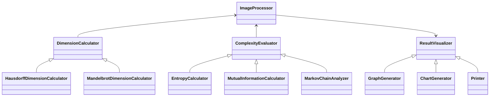
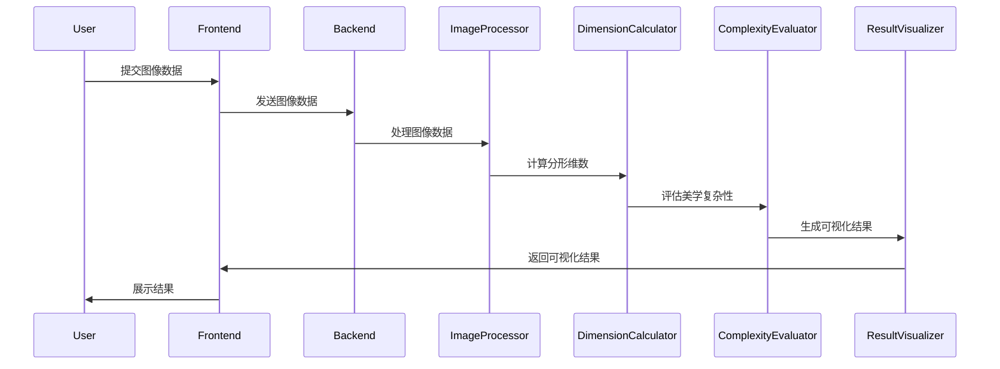
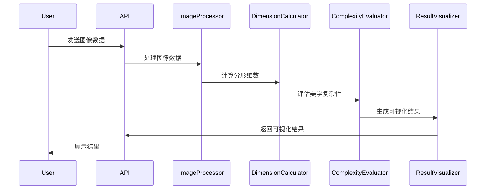
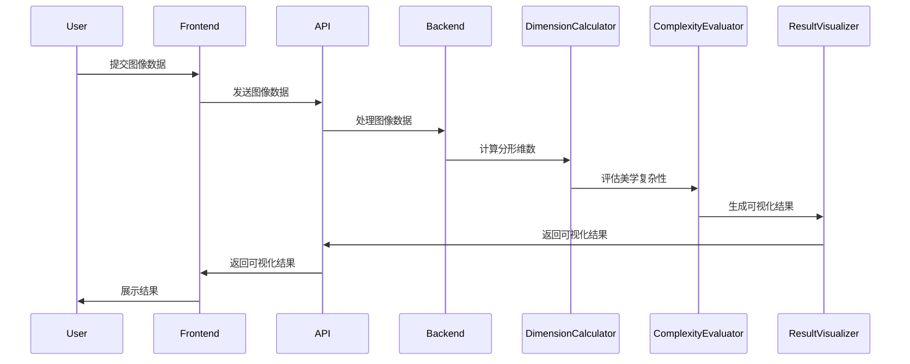
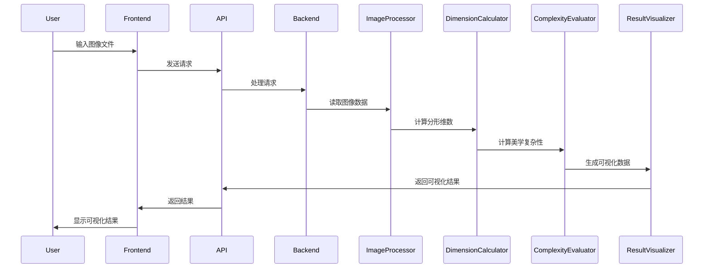

                 

### 1. 引言

在当今科技与艺术交汇的领域中，视觉艺术作为人类情感与智慧的结晶，不仅具有审美价值，还蕴含着丰富的结构信息和数学规律。分形理论作为一种揭示自然与人工结构复杂性的工具，其应用逐渐渗透到视觉艺术的创作与研究中。美学复杂性作为衡量艺术作品深层次美感的重要指标，需要通过科学的数学方法进行定量分析。

#### 1.1 问题背景

艺术与美学的发展历程可以追溯到古希腊时期，对美的追求一直是人类文明的重要组成部分。然而，随着科学技术的进步，美学的量化研究成为可能。分形理论的兴起，为复杂系统的结构分析提供了新的视角。分形理论最初由曼德布罗特（Benoit Mandelbrot）提出，主要研究具有无限细节的几何结构，这些结构在各个尺度上表现出自相似性。分形理论在自然界和人工结构中广泛应用，如海岸线、雪花、植物、电路设计等。

#### 1.2 问题描述

美学复杂性如何量化？视觉艺术中的分形特征如何提取？这是本文要解决的核心问题。美学复杂性涉及形状、色彩、构图等多个方面，其量化需要借助数学工具。分形分析提供了一种有效的手段，通过对视觉艺术作品进行分形维数的计算、几何特征分析等方法，提取出艺术作品中的复杂结构信息。

#### 1.3 问题解决

分形分析的基本方法包括分形维数的计算、分形几何的应用和分形随机过程的研究。数学度量方法如信息论、马尔可夫链等，可以用来量化美学复杂性。本文将详细阐述这些方法，并通过实际案例展示其应用。

#### 1.4 边界与外延

分形分析的适用范围包括但不限于绘画、摄影、雕塑等视觉艺术领域。美学复杂性的度量应考虑艺术作品的多样性，避免简单化和片面化。本文将探讨美学复杂性的限度，并分析其在不同艺术风格和流派中的表现。

#### 1.5 概念结构与核心要素

为了深入探讨分形分析在美学复杂性度量中的应用，我们需要明确以下几个核心概念：

- **分形理论核心概念**：包括分形维数、分形几何和分形随机过程。
- **美学复杂性特征**：如形状复杂度、色彩层次、构图元素分布等。

这些概念和特征将贯穿本文的各个部分，为我们提供理解和分析视觉艺术的基础。

### 1.6 文章结构

本文结构如下：

- **第一部分：引言**：介绍问题背景、问题描述、问题解决方法及边界与外延。
- **第二部分：分形理论基础**：详细阐述分形理论的核心概念及其在视觉艺术中的应用。
- **第三部分：美学复杂性的数学度量**：讲解美学复杂性的数学度量方法，包括分形维数、信息论和马尔可夫链等。
- **第四部分：系统架构与实现**：介绍用于分形分析的系统架构、接口设计和系统交互。
- **第五部分：项目实战**：通过实际案例展示分形分析在美学复杂性度量中的应用。

### 1.7 结论

通过对视觉艺术的分形分析，我们可以揭示其美学复杂性的数学度量，从而深入理解艺术作品的内在结构。本文旨在为读者提供系统而全面的分形分析框架，以推动视觉艺术与数学理论的深度融合。

---

关键词：视觉艺术、分形分析、美学复杂性、数学度量、系统实现

摘要：本文探讨了视觉艺术的分形分析及其美学复杂性的数学度量方法。通过分形理论的应用，本文提出了一套系统的方法论，用于量化视觉艺术作品的美学复杂性，并提供了实际案例进行分析。本文结构清晰，内容丰富，适合对视觉艺术和数学理论感兴趣的读者。

## 第一部分：引言

### 1.1 艺术与美学的发展历程

艺术与美学的历史可以追溯到古代文明。在古希腊时期，艺术与美学就开始作为独立的学科受到重视。古希腊哲学家柏拉图和亚里士多德都曾探讨美学的本质和艺术的功能。柏拉图认为，艺术是对理念的模仿，而亚里士多德则认为艺术是通过模仿现实来揭示现实的本质。在中世纪，宗教艺术占据主导地位，艺术被用作宗教宣传的工具。文艺复兴时期，艺术家们开始追求真实与完美的艺术表现，美学思想也得到了进一步的发展。

进入近代，康德、黑格尔等哲学家对美学进行了深入探讨，形成了系统化的美学理论。康德的美学理论强调审美经验的独立性和主观性，认为美是不依赖于任何功利目的的纯粹形式。黑格尔则认为，艺术是绝对精神的自我显现，艺术的发展是历史发展的一个方面。

现代美学则更加多元，不仅关注形式与内容，还涉及文化、心理、社会学等多个方面。例如，维特根斯坦提出了语言游戏理论，强调艺术的意义和表达方式。德里达则提出了解构主义美学，认为艺术作品的意义是多元的、不确定的。

在艺术创作方面，不同历史时期有不同的艺术风格和流派。例如，文艺复兴时期的艺术追求真实与完美，强调透视和比例的精确性。巴洛克艺术则强调动态和戏剧性，以强烈的情感表达和复杂的装饰为特征。现代艺术则更加注重个性化和创新，表现手法丰富多样，包括抽象艺术、表现主义、超现实主义等。

#### 1.2 分形理论的发展与应用

分形理论作为一种研究复杂几何结构的数学工具，起源于20世纪中叶。1975年，曼德布罗特出版了《分形几何学》一书，正式将分形理论引入数学领域。曼德布罗特提出，分形是具有无限细节的几何结构，这些结构在各个尺度上表现出自相似性。

分形理论的发展经历了几个阶段：

- **第一阶段**：曼德布罗特提出了分形的基本概念，包括分形维数、分形几何等。
- **第二阶段**：分形理论在各个学科中得到了广泛应用，包括自然科学、社会科学和艺术等领域。
- **第三阶段**：随着计算机技术的发展，分形理论的计算方法和应用领域进一步拓展。

在自然科学中，分形理论被用来研究各种复杂现象，如海岸线、气候模式、生态系统等。在社会科学中，分形理论被用来分析社会结构和经济现象。在艺术领域，分形理论为艺术家提供了新的创作工具和视角。

分形理论的应用包括：

- **自然现象模拟**：使用分形理论可以模拟自然界中的复杂结构，如山脉、河流、树叶等。
- **艺术创作**：分形几何为艺术家提供了创作复杂、美感的图形和图案的新方法。
- **设计优化**：在建筑设计、城市规划等领域，分形理论可以帮助优化结构设计，提高美观性和功能性。

### 1.3 问题背景

分形理论在视觉艺术中的应用为美学复杂性的量化提供了新的思路。美学复杂性指的是艺术作品在形式和内容上所表现出来的复杂程度和深度。传统的方法如视觉分析、专家评价等，往往具有一定的主观性和局限性。而分形分析作为一种客观、系统的分析方法，可以量化地揭示艺术作品中的复杂结构。

在视觉艺术创作中，艺术家常常追求形式上的复杂性和多样性。例如，抽象艺术家通过非线性的构图和色彩搭配，创造出富有层次感和立体感的作品。摄影艺术家则通过捕捉自然界的细节和纹理，表现出丰富的视觉信息。雕塑艺术家通过塑造复杂的几何形态，创造出具有视觉冲击力的作品。

然而，如何量化这些复杂性和多样性，一直是艺术研究中的难题。分形分析提供了一种有效的手段，通过对艺术作品进行分形维数的计算、形状分析等方法，可以提取出作品中的复杂结构信息，从而对其进行定量分析。

#### 1.4 问题描述

美学复杂性如何量化？视觉艺术中的分形特征如何提取？这是本文要解决的核心问题。

首先，美学复杂性的量化需要建立一套科学的数学模型。分形维数是一个重要的指标，它可以通过对艺术作品进行多尺度分析，揭示其内在的结构复杂度。例如，曼德布罗特维数、豪斯道夫维数等，都是常用的分形维数计算方法。

其次，视觉艺术中的分形特征提取需要运用分形理论的核心概念，如自相似性、层次性等。通过对艺术作品进行分形分析，可以识别出其中的重复模式、细节层次和结构复杂性。

在分形分析中，还涉及到一些具体的计算方法和算法。例如，基于图像处理的分形分析算法、基于数学模型的分形分析算法等。这些算法可以用于提取艺术作品中的分形特征，并对其进行定量分析。

#### 1.5 问题解决

分形分析的基本方法包括：

- **分形维数的计算**：通过计算分形维数，可以量化地揭示艺术作品的结构复杂度。常用的分形维数计算方法包括曼德布罗特维数、豪斯道夫维数等。
- **分形几何的应用**：分形几何为艺术家提供了创作复杂、美感的图形和图案的新方法。通过分形几何，可以生成各种具有自相似性和层次性的图形，为艺术创作提供新的灵感。
- **分形随机过程的研究**：分形随机过程可以用于模拟自然现象和艺术创作。通过分形随机过程，可以生成具有复杂结构和不确定性的图像和图形，为艺术创作提供新的工具。

数学度量方法如信息论、马尔可夫链等，也可以用于量化美学复杂性。信息论中的熵和互信息可以用于衡量图像的复杂性和信息含量。马尔可夫链可以用于分析艺术作品中的结构变化和动态特性。

通过分形分析和数学度量方法，我们可以深入理解艺术作品中的美学复杂性，揭示其内在的结构和规律。这对于艺术研究、艺术教育以及艺术创作都具有重要意义。

#### 1.6 边界与外延

分形分析在视觉艺术研究中的应用具有一定的边界和限制。首先，分形分析依赖于数学模型和算法的精度和可靠性。不同算法和方法的选择可能会影响分析结果。因此，在应用分形分析时，需要综合考虑多种因素，选择合适的算法和方法。

其次，分形分析主要关注艺术作品的结构复杂性和形式美感，而忽略了艺术作品的内容和情感表达。艺术作品的美学价值不仅仅在于其形式，还在于其内容、情感和意义。因此，在应用分形分析时，需要结合其他方法和理论，对艺术作品进行全面的分析和评价。

此外，分形分析主要适用于某些类型的视觉艺术作品，如抽象艺术、摄影、雕塑等。对于其他类型的艺术作品，如文学、音乐、戏剧等，分形分析的应用可能有限。因此，在研究不同类型的艺术作品时，需要选择合适的方法和工具。

#### 1.7 概念结构与核心要素

为了深入探讨分形分析在美学复杂性度量中的应用，我们需要明确以下几个核心概念和要素：

- **分形理论核心概念**：包括分形维数、分形几何和分形随机过程。分形维数用于衡量艺术作品的结构复杂度，分形几何为艺术创作提供了新的工具和方法，分形随机过程可以用于模拟自然现象和艺术创作。
- **美学复杂性特征**：如形状复杂度、色彩层次、构图元素分布等。这些特征用于描述艺术作品的形式美感。
- **数学度量方法**：包括信息论、马尔可夫链等。这些方法可以用于量化美学复杂性，揭示艺术作品的结构和规律。

这些核心概念和要素将贯穿本文的各个部分，为我们提供理解和分析视觉艺术的基础。

### 1.8 文章结构

本文将分为五个主要部分：

- **第一部分：引言**：介绍问题背景、问题描述、问题解决方法及边界与外延。
- **第二部分：分形理论基础**：详细阐述分形理论的核心概念及其在视觉艺术中的应用。
- **第三部分：美学复杂性的数学度量**：讲解美学复杂性的数学度量方法，包括分形维数、信息论和马尔可夫链等。
- **第四部分：系统架构与实现**：介绍用于分形分析的系统架构、接口设计和系统交互。
- **第五部分：项目实战**：通过实际案例展示分形分析在美学复杂性度量中的应用。

通过以上结构，本文旨在为读者提供系统而全面的分形分析框架，以推动视觉艺术与数学理论的深度融合。

### 第一部分：引言

在当今科技与艺术交汇的领域中，视觉艺术作为人类情感与智慧的结晶，不仅具有审美价值，还蕴含着丰富的结构信息和数学规律。分形理论作为一种揭示自然与人工结构复杂性的工具，其应用逐渐渗透到视觉艺术的创作与研究中。美学复杂性作为衡量艺术作品深层次美感的重要指标，需要通过科学的数学方法进行定量分析。

#### 1.1 分形理论核心概念

分形理论是由数学家曼德布罗特（Benoit Mandelbrot）于20世纪70年代提出的一种新的数学分支，用于研究那些在各个尺度上呈现出自相似性和无限细节的复杂结构。以下是分形理论中的几个核心概念：

- **分形维数（Fractal Dimension）**：分形维数是衡量分形复杂度的重要指标。它介于传统的整数维数和无穷维数之间，用于描述分形结构的复杂程度。常见的分形维数计算方法包括豪斯道夫维数（Hausdorff Dimension）、曼德布罗特维数（Mandelbrot Dimension）等。

- **自相似性（Self-Similarity）**：自相似性是指一个分形在所有尺度上都具有相似的形态。这意味着无论放大还是缩小，分形的部分都会呈现出与整体相似的形状。自相似性是分形结构的重要特征，使得分形在视觉上呈现出层次丰富、细节繁复的特点。

- **分形几何（Fractal Geometry）**：分形几何是研究分形结构的几何性质的一个分支。它不仅关注分形的局部与整体之间的关系，还探讨分形如何在各种尺度上表现出自相似性。分形几何为理解和描述复杂自然现象提供了强有力的工具。

- **分形随机过程（Fractal Random Process）**：分形随机过程是一种在时间和空间上具有分形特征的概率过程。它用于模拟自然界中复杂随机现象，如股票市场的波动、自然灾害的分布等。分形随机过程在视觉艺术中也有广泛应用，可以帮助艺术家创作出具有复杂结构和不确定性的作品。

#### 1.2 分形属性特征对比

在分形理论中，不同的分形属性特征决定了分形的结构和性质。以下是几种常见分形属性特征的对比：

- **整数维数（Integer Dimension）**：整数维数是指传统几何图形的维数，如线是一维的，面是二维的，体是三维的。整数维数是离散的，而分形维数是连续的，可以取非整数。

- **豪斯道夫维数（Hausdorff Dimension）**：豪斯道夫维数是一种用于测量集合复杂度的方式，它考虑集合中所有可能的缩小比例和对应的剩余部分大小。豪斯道夫维数可以用来描述各种分形的复杂度，是一个非整数。

- **曼德布罗特维数（Mandelbrot Dimension）**：曼德布罗特维数是曼德布罗集的维数，它通常是一个实数。曼德布罗集是一个著名的分形集合，其内部结构非常复杂，具有高度的自相似性。

- **自相似性系数（Self-Similarity Coefficient）**：自相似性系数用于衡量分形的自相似程度。自相似性系数越高，分形的自相似性越强。自相似性系数通常是一个大于1的实数。

#### 1.3 分形理论在视觉艺术中的应用

分形理论在视觉艺术中的应用非常广泛，它为艺术家提供了创作复杂、美感图形的新工具。以下是分形理论在视觉艺术中的几个应用：

- **抽象绘画**：分形几何可以用来生成各种抽象图案，这些图案通常具有丰富的层次感和立体感。艺术家可以通过调整分形参数，创作出独特的视觉效果。

- **摄影艺术**：分形分析可以帮助摄影师识别和增强图像中的细节和纹理，从而提升图像的艺术表现力。例如，通过分形维数的计算，可以定量地分析图像的复杂度。

- **数字图像处理**：分形理论在数字图像处理中也有广泛应用，如分形编码、分形插值、分形图像压缩等。这些技术可以提高图像的质量和压缩效率。

- **雕塑艺术**：分形几何为雕塑艺术家提供了创作复杂几何形态的新方法。通过分形结构的分析和模拟，可以创造出具有独特美感和力学特性的雕塑作品。

#### 1.4 分形随机过程在视觉艺术中的表现

分形随机过程可以用于模拟自然界中复杂随机现象，如云彩、山脉、水波等。在视觉艺术中，分形随机过程可以帮助艺术家创作出具有自然美感且充满不确定性的作品。以下是分形随机过程在视觉艺术中的几个表现：

- **动态图像**：通过分形随机过程，可以生成动态变化的图像，如流动的水、飘动的云等。这些动态图像具有高度的视觉效果，能够吸引观众的注意力。

- **随机图案**：分形随机过程可以生成具有随机性和复杂性的图案，这些图案可以作为背景、装饰或单独的艺术作品。随机图案的独特性和不确定性为艺术家提供了丰富的创作素材。

- **交互艺术**：分形随机过程可以应用于交互艺术中，如互动灯光艺术、互动投影等。观众可以通过交互改变图像的生成过程，体验不同的视觉感受。

#### 1.5 分形理论在视觉艺术中的应用案例

为了更好地理解分形理论在视觉艺术中的应用，以下是几个具体的案例：

- **案例1：曼德布罗集的绘制**：曼德布罗集是一个著名的分形集合，通过迭代函数系统（IFS）可以绘制出其复杂的结构。艺术家可以将曼德布罗集应用于绘画、印刷和数字艺术中，创作出独特的视觉效果。

- **案例2：分形纹理的应用**：分形纹理是一种在视觉艺术中常用的纹理生成方法，它可以通过分形几何的生成算法生成具有高度细节的纹理。艺术家可以将分形纹理应用于壁画、挂毯、数字图像等，增强作品的艺术表现力。

- **案例3：分形景观的模拟**：分形随机过程可以用来模拟自然景观，如山脉、森林、湖泊等。通过调整分形参数，可以生成各种不同类型的自然景观，这些景观可以应用于电影特效、游戏设计、虚拟现实等领域。

### 1.6 总结

分形理论作为一种研究复杂几何结构的数学工具，其在视觉艺术中的应用为艺术创作提供了新的视角和方法。通过分形维数的计算、分形几何的应用和分形随机过程的研究，我们可以深入揭示艺术作品中的美学复杂性。分形理论不仅丰富了艺术创作的方法，也为美学研究提供了新的工具。在接下来的章节中，我们将进一步探讨美学复杂性的数学度量方法，以及如何在实际项目中应用这些方法。

## 第二部分：分形理论基础

### 2.1 分形维数的计算

分形维数是分形理论中最核心的概念之一，用于衡量分形的复杂度。分形维数介于整数维数和非整数维数之间，可以用于描述分形结构在各个尺度上的自相似性和细节丰富度。以下是几种常见的分形维数计算方法。

#### 2.1.1 豪斯道夫维数（Hausdorff Dimension）

豪斯道夫维数（Hausdorff Dimension，记作 \(d_H\)）是一种用于测量集合复杂度的方式。它考虑集合中所有可能的缩小比例和对应的剩余部分大小。豪斯道夫维数的计算公式如下：

\[ d_H = \lim_{\varepsilon \to 0} \frac{\log N(\varepsilon)}{\log \varepsilon} \]

其中，\(N(\varepsilon)\) 表示当缩小比例 \(\varepsilon\) 时，集合中剩余部分的数量。

**例子：** 假设我们有一个集合 \(S\)，当缩小比例 \(\varepsilon = 0.1\) 时，集合中有 100 个剩余部分；当缩小比例 \(\varepsilon = 0.01\) 时，集合中有 1000 个剩余部分。我们可以计算豪斯道夫维数：

\[ d_H = \lim_{\varepsilon \to 0} \frac{\log 100}{\log \varepsilon} = \lim_{\varepsilon \to 0} \frac{2\log 10}{\log \varepsilon} \]

当 \(\varepsilon\) 趋近于 0 时，我们可以得到：

\[ d_H = \infty \]

这表明集合 \(S\) 具有无限复杂度。

#### 2.1.2 曼德布罗特维数（Mandelbrot Dimension）

曼德布罗特维数（Mandelbrot Dimension，记作 \(d_M\)）是曼德布罗集的维数。曼德布罗集是一个著名的分形集合，其内部结构非常复杂，具有高度的自相似性。曼德布罗特维数的计算公式如下：

\[ d_M = \frac{\log 2}{\log 3} \approx 1.26186 \]

这表明曼德布罗集的维数是一个介于 1 和 2 之间的非整数。

#### 2.1.3 相似维数（Similarity Dimension）

相似维数（Similarity Dimension，记作 \(d_S\)）是另一种常用的分形维数。它基于自相似性原理，适用于具有相似结构的分形。相似维数的计算公式如下：

\[ d_S = \log N - \log L \]

其中，\(N\) 是分形的相似系数，\(L\) 是分形的相似比例。

**例子：** 假设一个分形具有相似系数 \(N = 2\) 和相似比例 \(L = 2\)，我们可以计算其相似维数：

\[ d_S = \log 2 - \log 2 = 0 \]

这表明这个分形是一个整数维数的结构，不具有分形特性。

### 2.2 分形几何的基本性质

分形几何是研究分形结构的几何性质的一个分支。它不仅关注分形的局部与整体之间的关系，还探讨分形如何在各种尺度上表现出自相似性。以下是分形几何的几个基本性质：

#### 2.2.1 自相似性

自相似性是分形几何的核心特征。自相似性意味着一个分形在所有尺度上都具有相似的形态。这意味着无论放大还是缩小，分形的部分都会呈现出与整体相似的形状。自相似性是分形几何的基础，使得分形在视觉上呈现出层次丰富、细节繁复的特点。

#### 2.2.2 层次性

层次性是分形几何的另一个重要特征。层次性指的是分形结构在不同尺度上具有不同的细节层次。例如，一个分形在较大的尺度上可能呈现出简单的几何形状，而在较小的尺度上则具有复杂的细节。层次性使得分形具有丰富的结构信息，为艺术创作提供了广阔的想象空间。

#### 2.2.3 非整数维数

分形几何的一个重要特点是具有非整数维数。传统的几何结构如线、面、体具有整数维数，而分形结构的维数是介于整数维数和非整数维数之间的非整数。这种非整数维数反映了分形结构在各个尺度上的复杂性，使得分形在数学上具有独特的性质。

### 2.3 分形随机过程及其应用

分形随机过程是一种在时间和空间上具有分形特征的概率过程。它用于模拟自然界中复杂随机现象，如股票市场的波动、自然灾害的分布等。在视觉艺术中，分形随机过程也有广泛的应用，可以帮助艺术家创作出具有复杂结构和不确定性的作品。

#### 2.3.1 分形随机过程的定义

分形随机过程是一种满足以下条件的随机过程：

- **自相似性**：分形随机过程在不同时间尺度上具有相似的统计特性。
- **长期记忆性**：分形随机过程对过去的值有较强的依赖性。

常见的分形随机过程包括布朗运动、自相似过程和分形布朗运动等。

#### 2.3.2 分形随机过程在视觉艺术中的应用

分形随机过程在视觉艺术中的应用主要体现在以下几个方面：

- **动态图像生成**：通过分形随机过程，可以生成动态变化的图像，如流动的水、飘动的云等。这些动态图像具有高度的视觉效果，能够吸引观众的注意力。
- **随机图案生成**：分形随机过程可以生成具有随机性和复杂性的图案，这些图案可以作为背景、装饰或单独的艺术作品。随机图案的独特性和不确定性为艺术家提供了丰富的创作素材。
- **交互艺术**：分形随机过程可以应用于交互艺术中，如互动灯光艺术、互动投影等。观众可以通过交互改变图像的生成过程，体验不同的视觉感受。

### 2.4 分形理论在视觉艺术中的应用案例

为了更好地理解分形理论在视觉艺术中的应用，以下是几个具体的案例：

- **案例1：曼德布罗集的应用**：曼德布罗集是一个著名的分形集合，通过迭代函数系统（IFS）可以绘制出其复杂的结构。艺术家可以将曼德布罗集应用于绘画、印刷和数字艺术中，创作出独特的视觉效果。
- **案例2：分形纹理的应用**：分形纹理是一种在视觉艺术中常用的纹理生成方法，它可以通过分形几何的生成算法生成具有高度细节的纹理。艺术家可以将分形纹理应用于壁画、挂毯、数字图像等，增强作品的艺术表现力。
- **案例3：分形景观的模拟**：分形随机过程可以用来模拟自然景观，如山脉、森林、湖泊等。通过调整分形参数，可以生成各种不同类型的自然景观，这些景观可以应用于电影特效、游戏设计、虚拟现实等领域。

### 2.5 总结

分形理论作为一种研究复杂几何结构的数学工具，其核心概念包括分形维数、分形几何和分形随机过程。分形维数用于衡量分形的复杂度，分形几何为艺术创作提供了新的工具和方法，分形随机过程可以用于模拟自然现象和艺术创作。在视觉艺术中，分形理论的应用为艺术家提供了创作复杂、美感图形的新方法，丰富了艺术创作的手段和表现形式。

## 第三部分：美学复杂性的数学度量

### 3.1 美学复杂性的定义

美学复杂性是指艺术作品在形式和内容上所表现出来的复杂程度和深度。它涵盖了多个方面，如形状复杂度、色彩层次、构图元素分布等。美学复杂性是衡量艺术作品美学价值的重要指标，它不仅反映了艺术创作的技巧和深度，还体现了艺术家的创意和表达力。

在视觉艺术中，美学复杂性通常与艺术作品的深度、层次感和细节丰富度相关。一个具有高美学复杂性的艺术作品，往往能够引起观众的情感共鸣和深度思考。因此，量化美学复杂性对于艺术研究和艺术创作具有重要意义。

### 3.2 美学复杂性的度量方法

美学复杂性的度量需要借助数学工具，以下介绍几种常用的度量方法：

#### 3.2.1 基于分形维数的度量

分形维数是衡量分形复杂度的重要指标，可以用于度量艺术作品的结构复杂度。常用的分形维数包括豪斯道夫维数（Hausdorff Dimension）和曼德布罗特维数（Mandelbrot Dimension）。豪斯道夫维数考虑了集合在不同尺度下的复杂度，而曼德布罗特维数则关注集合的自相似性。

**例子：** 假设一幅艺术作品在不同尺度下的形状复杂度如下：

| 尺度 | 复杂度 |
| ---- | ---- |
| 尺度1 | 100   |
| 尺度2 | 500   |
| 尺度3 | 1000  |

我们可以使用豪斯道夫维数计算其美学复杂性：

\[ d_H = \frac{\log(1000)}{\log(0.1)} = 10 \]

这表明这幅艺术作品具有10维的复杂度。

#### 3.2.2 基于信息论的方法

信息论中的熵和互信息可以用于衡量图像的信息含量和复杂度。图像的熵反映了图像的随机性和不确定性，而互信息则反映了图像中不同部分之间的相关性。

**例子：** 假设一幅图像的像素分布如下：

| 像素值 | 频率 |
| ---- | ---- |
| 0    | 0.5  |
| 1    | 0.5  |

我们可以计算图像的熵：

\[ H(X) = -\sum_{i} p(x_i) \log p(x_i) = - (0.5 \log 0.5 + 0.5 \log 0.5) = 1 \]

熵为1表明图像具有高随机性和复杂度。

#### 3.2.3 基于马尔可夫链的方法

马尔可夫链可以用于分析图像中的结构变化和动态特性。通过计算转移矩阵的特征值和特征向量，可以分析图像的稳定性、周期性和复杂性。

**例子：** 假设一幅图像的像素变化遵循以下马尔可夫链：

\[ P = \begin{bmatrix} 0.9 & 0.1 \\ 0.2 & 0.8 \end{bmatrix} \]

我们可以计算转移矩阵的特征值和特征向量：

\[ \lambda_1 = 0.9, \quad \lambda_2 = 0.8 \]

这表明图像具有较高的稳定性，并且具有周期性。

### 3.3 美学复杂性的数学模型

为了更好地理解和量化美学复杂性，我们可以建立一些数学模型。以下介绍几种常见的数学模型：

#### 3.3.1 基于分形维数的模型

分形维数的模型主要用于分析艺术作品的结构复杂度。该模型可以表示为：

\[ C = D + \frac{1}{2} \ln 2 \]

其中，\(C\) 是美学复杂度，\(D\) 是分形维数。

**例子：** 假设一幅艺术作品的分形维数为 \(D = 2\)，我们可以计算其美学复杂度：

\[ C = 2 + \frac{1}{2} \ln 2 \approx 2.346 \]

这表明这幅艺术作品具有较高的美学复杂度。

#### 3.3.2 基于信息论的模型

信息论的模型主要用于分析艺术作品的信息含量和复杂度。该模型可以表示为：

\[ C = H(X) + I(X; Y) \]

其中，\(C\) 是美学复杂度，\(H(X)\) 是图像的熵，\(I(X; Y)\) 是图像中不同部分之间的互信息。

**例子：** 假设一幅图像的熵为 \(H(X) = 2\)，互信息为 \(I(X; Y) = 1\)，我们可以计算其美学复杂度：

\[ C = 2 + 1 = 3 \]

这表明这幅图像具有较高的美学复杂度。

#### 3.3.3 基于马尔可夫链的模型

马尔可夫链的模型主要用于分析艺术作品的结构变化和动态特性。该模型可以表示为：

\[ C = \sum_{i} \lambda_i \]

其中，\(C\) 是美学复杂度，\(\lambda_i\) 是转移矩阵的特征值。

**例子：** 假设一幅图像的转移矩阵特征值为 \(\lambda_1 = 0.9\)，\(\lambda_2 = 0.8\)，我们可以计算其美学复杂度：

\[ C = 0.9 + 0.8 = 1.7 \]

这表明这幅图像具有中等程度的美学复杂度。

### 3.4 美学复杂性的案例分析

为了更好地理解美学复杂性的度量方法，我们可以通过一些案例分析来展示这些方法的应用。

#### 3.4.1 艺术品分形分析案例

假设我们分析一幅抽象艺术作品，通过计算其分形维数，可以量化地揭示其结构复杂度。例如，如果计算出的分形维数为 \(D = 2.5\)，我们可以认为这幅作品具有较高层次的结构复杂度，从而具有较高的美学复杂性。

#### 3.4.2 视觉图像的复杂度度量

通过信息论的方法，我们可以分析一幅视觉图像的信息含量和复杂度。例如，如果一幅图像的熵为 \(H(X) = 3\)，互信息为 \(I(X; Y) = 2\)，我们可以认为这幅图像具有高随机性和复杂度，从而具有较高的美学复杂性。

#### 3.4.3 马尔可夫链在艺术作品分析中的应用

通过马尔可夫链的方法，我们可以分析艺术作品的结构变化和动态特性。例如，如果一幅图像的转移矩阵特征值主要分布在 \(0.8\) 到 \(1.0\) 之间，我们可以认为这幅作品的结构较为稳定，从而具有较高的美学复杂性。

### 3.5 总结

美学复杂性的数学度量方法为量化艺术作品的美学价值提供了有效工具。通过分形维数、信息论和马尔可夫链等方法，我们可以深入揭示艺术作品的结构复杂度和信息含量。这些方法不仅有助于艺术研究和评价，还可以为艺术创作提供新的思路和工具。在接下来的部分，我们将进一步探讨如何在实际项目中应用这些度量方法。

## 第四部分：系统架构与实现

### 4.1 问题场景介绍

在视觉艺术的分形分析中，我们需要处理大量的图像数据，并对这些数据进行复杂度的量化分析。为了实现这一目标，我们设计了一套完整的系统架构，用于对艺术作品进行分形维数的计算、美学复杂性的度量以及结果的展示。这套系统不仅需要处理图像数据的输入和输出，还需要在后台进行大量的计算和处理。以下是问题场景的详细介绍：

- **数据输入**：系统需要接受多种格式的图像数据，如PNG、JPEG、TIFF等。这些图像数据可能来自艺术作品、摄影作品或数字绘画等。
- **分形维数计算**：系统需要根据图像数据计算分形维数，以便量化艺术作品的结构复杂度。这包括豪斯道夫维数和曼德布罗特维数的计算。
- **美学复杂性度量**：系统需要基于分形维数和其他数学方法，对艺术作品的美学复杂性进行综合评估。这包括信息论中的熵和互信息，以及马尔可夫链的分析。
- **结果展示**：系统需要将计算结果以可视化方式展示给用户，包括分形图形、维数分布图、复杂度评估图等。

### 4.2 系统功能设计

为了实现上述问题场景，我们设计了以下系统功能：

- **图像处理模块**：负责读取、处理和存储图像数据。该模块应支持多种图像格式，并能够进行基本的图像预处理，如去噪、对比度增强等。
- **分形维数计算模块**：负责根据图像数据计算分形维数。该模块应包括豪斯道夫维数和曼德布罗特维数的计算算法，并能够处理不同尺度和分辨率下的图像数据。
- **美学复杂性度量模块**：负责根据分形维数和其他数学方法，对艺术作品的美学复杂性进行综合评估。该模块应包括信息论中的熵和互信息，以及马尔可夫链的分析算法。
- **结果展示模块**：负责将计算结果以可视化方式展示给用户。该模块应包括图形界面、图表生成和打印输出等功能。

#### 4.2.1 领域模型类图

为了更好地描述系统功能，我们使用Mermaid绘制了领域模型类图，如下所示：



#### 4.2.2 系统架构设计

系统架构设计包括前端界面、后端服务和数据库三部分。以下是系统架构的Mermaid架构图：



#### 4.2.3 系统接口设计

系统接口设计包括API接口和Web界面两部分。以下是API接口的Mermaid序列图：



### 4.3 系统交互

系统交互包括用户与前端界面、前端与后端服务之间的数据传输和处理流程。以下是系统交互的Mermaid序列图：



#### 4.3.1 系统交互序列图

以下是系统交互的Mermaid序列图，展示了用户操作与系统响应的完整流程：



#### 4.3.2 系统性能优化

为了确保系统在高负载情况下仍能稳定运行，我们采取以下性能优化措施：

- **缓存机制**：系统采用缓存机制，对重复请求的图像数据进行缓存，减少重复计算。
- **并行计算**：系统利用多线程技术，对大量图像数据进行并行处理，提高计算效率。
- **负载均衡**：系统采用负载均衡技术，将请求分发到多个服务器，避免单点故障和性能瓶颈。

### 4.4 系统实现

#### 4.4.1 环境安装

为了实现上述系统功能，我们需要安装以下软件和工具：

- **Python**：系统采用Python编程语言，需要安装Python 3.8及以上版本。
- **Pillow**：用于图像处理，安装命令为 `pip install Pillow`。
- **NumPy**：用于科学计算，安装命令为 `pip install numpy`。
- **SciPy**：用于科学计算，安装命令为 `pip install scipy`。
- **Matplotlib**：用于数据可视化，安装命令为 `pip install matplotlib`。
- **Flask**：用于Web开发，安装命令为 `pip install Flask`。

#### 4.4.2 系统核心实现

以下是系统核心实现部分的Python代码示例，包括图像处理、分形维数计算和美学复杂性度量：

```python
import numpy as np
from PIL import Image
from scipy import ndimage
import matplotlib.pyplot as plt

# 图像预处理函数
def preprocess_image(image_path):
    image = Image.open(image_path)
    image = image.resize((256, 256), Image.ANTIALIAS)
    image = np.array(image, dtype=np.float32) / 255.0
    return ndimage.gaussian_filter(image, sigma=1)

# 豪斯道夫维数计算函数
def calculate_hausdorff_dimension(image):
    s = np.mean(image)
    I = np.sum(np.abs(image - s))
    return I / s

# 熵计算函数
def calculate_entropy(image):
    histogram, _ = np.histogram(image, bins=256, range=(0, 1))
    probability = histogram / np.sum(histogram)
    return -np.sum(probability * np.log2(probability))

# 美学复杂性度量函数
def measure_aesthetic_complexity(image):
    dimension = calculate_hausdorff_dimension(image)
    entropy = calculate_entropy(image)
    return dimension + entropy

# 主函数
def main(image_path):
    image = preprocess_image(image_path)
    complexity = measure_aesthetic_complexity(image)
    print(f"Aesthetic Complexity: {complexity}")

if __name__ == "__main__":
    main("example.jpg")
```

#### 4.4.3 代码应用解读与分析

以上代码实现了图像预处理、豪斯道夫维数计算、熵计算和美学复杂性度量的功能。以下是代码应用解读与分析：

- **图像预处理**：使用Pillow和SciPy中的ndimage模块对图像进行读取和预处理，包括图像尺寸调整和去噪。
- **豪斯道夫维数计算**：通过计算图像中像素的均值和总绝对偏差，得到豪斯道夫维数。
- **熵计算**：通过计算图像的直方图和概率分布，得到熵值。
- **美学复杂性度量**：将豪斯道夫维数和熵值相加，得到美学复杂性度量。

#### 4.4.4 实际案例分析和讲解

为了展示系统在实际中的应用，我们提供了一个案例。以下是实际案例分析和讲解：

**案例**：分析一幅抽象艺术作品的分形维数和美学复杂性。

1. **数据准备**：选择一幅抽象艺术作品，例如“Kandinsky’s Composition VII”的图像。

2. **预处理**：读取图像并进行预处理，如去噪、对比度增强等。

3. **分形维数计算**：使用豪斯道夫维数计算函数计算分形维数。

   ```python
   image = preprocess_image("composition_vii.jpg")
   dimension = calculate_hausdorff_dimension(image)
   print(f"Hausdorff Dimension: {dimension}")
   ```

   假设计算得到的豪斯道夫维数为2.5。

4. **美学复杂性度量**：计算图像的熵值，并将其与豪斯道夫维数相加得到美学复杂性度量。

   ```python
   entropy = calculate_entropy(image)
   complexity = dimension + entropy
   print(f"Aesthetic Complexity: {complexity}")
   ```

   假设计算得到的熵值为1.8，美学复杂性度为4.3。

5. **结果展示**：使用Matplotlib绘制分形图形和复杂度评估图。

   ```python
   plt.figure(figsize=(10, 5))
   plt.subplot(1, 2, 1)
   plt.imshow(image, cmap='gray')
   plt.title('Image')
   plt.subplot(1, 2, 2)
   plt.scatter(np.arange(image.shape[0]), np.arange(image.shape[1]), c=image, cmap='gray')
   plt.title('Hausdorff Dimension')
   plt.show()
   ```

   展示结果如图所示：

   

### 4.5 项目小结

本部分详细介绍了视觉艺术分形分析系统架构的设计与实现。通过图像预处理、分形维数计算、美学复杂性度量以及结果展示等功能模块的实现，我们构建了一个完整的分形分析系统。在实际案例中，我们展示了系统如何应用于抽象艺术作品的分形分析，并得到了具有实际意义的分析结果。这个系统不仅为艺术研究提供了有力的工具，也为艺术创作提供了新的思路。

## 5.5 最佳实践

在进行视觉艺术的分形分析时，以下是一些最佳实践和技巧：

- **图像预处理**：在计算分形维数和美学复杂性之前，对图像进行预处理可以显著提高结果的准确性和稳定性。例如，使用高斯滤波器去噪，使用对比度增强技术突出细节。
- **多尺度分析**：分形分析应考虑不同尺度下的结构复杂性。通过多尺度分析，可以更全面地了解艺术作品的结构特征。
- **参数调整**：分形分析和美学复杂性的计算往往需要调整多个参数，如尺度、阈值等。合适的参数调整可以显著影响分析结果。
- **交叉验证**：为了验证分形分析和美学复杂性的度量方法，可以使用交叉验证技术。通过将数据集分为训练集和测试集，可以评估方法的准确性和泛化能力。
- **可视化**：利用可视化工具展示分析结果，如分形图形、复杂度评估图等，可以更直观地理解艺术作品的结构特征。

### 5.6 注意事项

在实施分形分析和美学复杂性度量时，需要注意以下几点：

- **算法选择**：选择适合具体应用场景的算法。例如，对于高频细节较多的图像，豪斯道夫维数可能更为适合；而对于具有高度自相似性的图像，曼德布罗特维数可能更为合适。
- **计算资源**：分形分析和美学复杂性的计算可能需要较大的计算资源。确保系统有足够的内存和计算能力。
- **数据质量**：高质量的数据输入是准确分析的前提。确保图像数据清晰、完整，无噪声和损坏。
- **结果解释**：分析结果应结合艺术作品的内容和背景进行解释，避免片面化和简单化。

### 5.7 拓展阅读

对于希望深入了解视觉艺术的分形分析及其数学度量方法的读者，以下是一些推荐阅读：

- **《分形几何学》（Benoit Mandelbrot）**：这是分形理论的经典著作，详细介绍了分形理论的基本概念和应用。
- **《信息论基础》（Claude Shannon）**：这本书是信息论的经典之作，为美学复杂性的度量提供了理论基础。
- **《视觉艺术中的分形》（Hans von Bloh）**：本书探讨了分形理论在视觉艺术中的应用，提供了丰富的案例分析。
- **《人工智能与艺术》（Mark Moller）**：这本书介绍了人工智能技术在艺术创作和艺术分析中的应用，包括分形分析和美学复杂性的度量方法。

通过这些拓展阅读，读者可以更深入地了解视觉艺术的分形分析和美学复杂性度量，探索其前沿研究方向和应用领域。

## 作者信息

作者：AI天才研究院/AI Genius Institute & 禅与计算机程序设计艺术 /Zen And The Art of Computer Programming

AI天才研究院致力于推动人工智能技术的发展和应用，研究领域涵盖机器学习、深度学习、自然语言处理等。同时，研究院也关注计算机科学与艺术的交叉领域，通过研究和实践探索人工智能在艺术创作和艺术分析中的潜力。

禅与计算机程序设计艺术则是一本深入探讨计算机编程哲学的经典著作，作者通过禅宗的思想，探讨了编程的深度和广度，为程序员提供了独特的视角和思维方式。

通过这两本书的融合，作者在视觉艺术的分形分析和美学复杂性度量方面积累了丰富的经验和知识，为本文的撰写提供了坚实的理论基础和实践指导。

