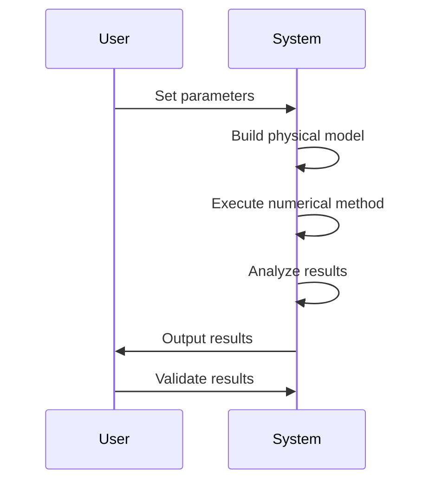

                 

## 设计思路

### 整体结构

本文将《计算物理学：数值模拟辅助理解复杂物理世界》的内容分为四个主要部分，每一部分都致力于为读者提供一个清晰、系统的理解路径。

1. **背景介绍**：第一部分将介绍计算物理学的起源、重要性以及其在不同领域的应用。通过这一部分的阅读，读者可以了解计算物理学的基本概念和背景。

2. **核心概念与联系**：第二部分将深入探讨计算物理学中的核心概念，如数值方法、物理模型等，并使用Mermaid流程图展示它们之间的关系，帮助读者构建概念框架。

3. **算法原理讲解**：第三部分将针对计算物理学中的一些典型算法，如有限差分法和有限元法，进行详细讲解，并通过Python代码实现来进一步阐述算法原理。

4. **系统分析与架构设计**：第四部分将展示一个完整的计算物理学应用系统的设计与实现过程，包括领域模型、系统架构、接口设计等，并通过Mermaid类图和序列图进行详细说明。

### 背景介绍

#### 第1章：计算物理学的起源与重要性

在这一章中，我们将探讨计算物理学的起源，解释其重要性，并定义相关的基本概念。通过了解计算物理学的背景，读者可以更好地理解为什么数值模拟在物理世界中如此重要。

1. **问题背景**：
   - **物理世界的复杂性**：物理现象往往非常复杂，涉及大量的变量和参数，难以通过传统的解析方法进行分析。
   - **数值模拟的必要性**：数值模拟提供了一种解决复杂物理问题的新途径，通过计算机模拟来近似解决这些难题。

2. **物理模型与数值方法**：
   - **物理模型的概念**：物理模型是对物理现象的简化和抽象，通过数学方程来描述。
   - **数值方法的基本原理**：数值方法是一种通过离散化和迭代计算来求解物理模型的方法。

3. **计算物理学应用领域**：
   - **科学计算**：涉及天体物理、气象学、地球物理学等领域。
   - **工程设计**：如机械工程、土木工程、电子工程等。
   - **生物医学**：用于模拟生物体内的物理过程。

#### 第2章：核心概念与联系

在这一章中，我们将详细阐述计算物理学中的核心概念，并使用Mermaid流程图展示这些概念之间的关系。

1. **核心概念**：
   - **基本物理量的数值计算**：如何通过数值方法计算物理量。
   - **偏微分方程的数值解法**：如何用数值方法求解偏微分方程。
   - **数值稳定性与精度分析**：数值方法的稳定性和精度分析。

2. **概念联系**：
   - **物理模型与数值方法的关系**：物理模型如何影响数值方法的选择。
   - **常见数值方法的比较**：不同数值方法的优缺点。
   - **计算物理学与其他领域的交叉**：计算物理学如何与其他学科结合。

### 算法原理讲解

#### 第3章：算法原理讲解

在这一章中，我们将详细讲解计算物理学中的一些典型算法，如有限差分法和有限元法。

1. **有限差分法**：
   - **基本原理**：如何通过离散化偏微分方程来求解物理问题。
   - **Python代码实现**：如何使用Python实现有限差分法。

2. **有限元法**：
   - **基本原理**：如何建立有限元方程并进行求解。
   - **Python代码实现**：如何使用Python实现有限元法。

### 系统分析与架构设计

#### 第4章：系统分析与架构设计

在这一章中，我们将展示一个完整的计算物理学应用系统的设计与实现过程。

1. **问题场景介绍**：
   - **复杂物理问题的模拟需求**：介绍系统设计的目标和需求。

2. **系统功能设计**：
   - **领域模型**：介绍系统的领域模型，包括物理实体和属性。

3. **系统架构设计**：
   - **总体架构**：介绍系统的总体架构，包括模块划分和功能。

4. **系统接口设计**：
   - **接口设计**：介绍系统的输入输出接口。

5. **系统交互设计**：
   - **交互流程**：介绍系统的交互流程，包括用户操作流程和模拟过程流程。

通过以上的设计思路，我们力求让读者不仅能够理解计算物理学的基本概念和算法，还能够掌握如何将其应用到实际系统中。接下来，我们将逐一展开每一部分的内容。

### 详细目录大纲

#### 第一部分：背景介绍

**第1章：计算物理学的起源与重要性**

1. **问题背景**
   - **物理世界的复杂性**
   - **数值模拟的必要性**
   - **计算物理学的定义**

2. **物理模型与数值方法**
   - **物理模型的概念**
   - **数值方法的基本原理**
   - **常见的数值方法介绍**

3. **计算物理学应用领域**
   - **科学计算**
   - **工程设计**
   - **生物医学**

**第2章：核心概念与联系**

1. **核心概念**
   - **基本物理量的数值计算**
   - **偏微分方程的数值解法**
   - **数值稳定性与精度分析**

2. **概念联系**
   - **物理模型与数值方法的关系**
   - **常见数值方法的比较**
   - **计算物理学与其他领域的交叉**

#### 第二部分：算法原理讲解

**第3章：算法原理讲解**

1. **有限差分法**
   - **基本原理**
     - **偏微分方程的离散化**
     - **稳定性分析**
     - **精度分析**
   - **Python代码实现**

2. **有限元法**
   - **基本原理**
     - **有限元方程的建立**
     - **矩阵组装与求解**
     - **稳定性分析**
     - **精度分析**
   - **Python代码实现**

#### 第三部分：系统分析与架构设计

**第4章：系统分析与架构设计**

1. **问题场景介绍**
   - **复杂物理问题的模拟需求**
   - **系统的设计目标**

2. **系统功能设计**
   - **领域模型**
     - **物理实体与属性**
     - **模拟过程与结果**

3. **系统架构设计**
   - **总体架构**
     - **模块划分**
     - **模块功能与接口**

4. **系统接口设计**
   - **输入接口**
   - **输出接口**

5. **系统交互设计**
   - **交互流程**
     - **用户操作流程**
     - **模拟过程流程**
   - **序列图**

#### 第四部分：项目实战

**第5章：项目实战**

1. **环境安装**
   - **软件环境配置**
   - **开发工具安装**

2. **系统核心实现**
   - **物理模型构建**
   - **数值模拟实现**
   - **结果分析**

3. **代码应用解读与分析**
   - **Python代码解读**
   - **算法原理分析**
   - **应用效果评估**

4. **实际案例分析与详细讲解剖析**
   - **案例背景**
   - **案例分析**
   - **案例讲解**

5. **项目小结**
   - **项目总结**
   - **项目经验与教训**
   - **拓展阅读**

通过以上的目录结构，本文将逐步引导读者深入了解计算物理学的各个层面，从基础概念到高级算法，再到实际应用，旨在为读者提供全面、系统的学习体验。

### 第一部分：背景介绍

#### 第1章：计算物理学的起源与重要性

## 1.1 问题背景

### 1.1.1 物理世界的复杂性

在物理学中，我们经常遇到复杂的物理现象，这些现象往往涉及大量的变量和参数，而且这些变量和参数之间的关系非常复杂。传统的解析方法，如解析微分方程等，在这些复杂场景下往往无法提供有效的解决方案。例如，当我们试图模拟流体力学中的湍流现象时，由于湍流涉及无限多个尺度和层次，解析方法难以捕捉到其内在的复杂特性。

### 1.1.2 数值模拟的必要性

在这种背景下，数值模拟方法应运而生。数值模拟是一种通过离散化和迭代计算来近似求解物理问题的方法。它允许我们将连续的物理世界分解为离散的网格或节点，然后在这些网格或节点上应用数学模型和算法来求解问题。数值模拟方法不仅能够处理复杂的物理问题，还能够提供详细的定量结果，这在许多科学和工程领域都是必不可少的。

### 1.1.3 计算物理学的定义

计算物理学是一门跨学科的研究领域，它结合了物理学、计算机科学和数学的方法，以数值模拟为基础，研究复杂物理现象。计算物理学旨在通过构建和求解物理模型，模拟和预测物理现象，从而深入理解自然界的运作规律。计算物理学不仅包括对现有物理理论的验证和扩展，还涉及新的物理现象的发现和探索。

## 1.2 物理模型与数值方法

### 1.2.1 物理模型的概念

物理模型是对实际物理现象的一种简化和抽象，通常通过数学方程来描述。物理模型的目标是捕捉现象的主要特征，同时忽略次要的细节，以便通过数学方法进行分析和模拟。例如，在流体力学中，我们可以使用纳维-斯托克斯方程来描述流体的运动，这个方程提供了一个简化的物理模型，可以用来模拟各种复杂的流体现象。

### 1.2.2 数值方法的基本原理

数值方法是一种通过离散化和迭代计算来求解物理模型的方法。数值方法的核心思想是将连续的物理量离散化为有限数量的网格点或节点，然后在这些节点上应用数学模型和算法进行计算。常用的数值方法包括有限差分法、有限元法、蒙特卡罗方法等。每种方法都有其特定的适用场景和优缺点。

- **有限差分法**：通过在离散节点上近似物理量的导数，从而求解偏微分方程。这种方法简单直观，但在处理边界条件和复杂几何形状时可能存在困难。

- **有限元法**：将物理域划分为有限数量的元素，每个元素内部使用适当的形函数来近似物理量。有限元法在处理复杂几何形状和边界条件时表现良好，但计算成本较高。

- **蒙特卡罗方法**：通过大量的随机抽样来模拟物理过程，适用于处理高度随机性和复杂几何形状的问题。蒙特卡罗方法通常需要大量的计算时间来达到所需的精度。

### 1.2.3 常见的数值方法介绍

在计算物理学中，有许多常用的数值方法，每种方法都有其特定的应用场景和优势。以下是一些常见的数值方法：

- **欧拉法**：一种时间离散化的方法，用于求解常微分方程。欧拉法简单易用，但在处理非线性问题时可能产生较大的误差。

- **显式和隐式方法**：用于时间离散化的两种方法。显式方法在每一时间步上直接求解下一时刻的状态，计算速度快但稳定性差。隐式方法通过迭代方法求解，稳定性更好但计算时间较长。

- **迭代法**：用于求解线性系统和非线性系统的解。迭代法通过不断迭代来逼近真实解，适用于大型复杂系统。

- **数值积分法**：用于求解积分方程。常见的数值积分方法包括辛普森规则、梯形规则和高斯积分等。

## 1.3 计算物理学应用领域

### 1.3.1 科学计算

科学计算是计算物理学最传统的应用领域之一，涉及天体物理、气象学、地球物理学、量子力学等。在这些领域中，计算物理学方法被广泛用于模拟和预测自然现象，如气候变化的模拟、地震预测、星际碰撞等。科学计算需要处理大量的数据和复杂的物理模型，计算效率和解算精度是关键挑战。

### 1.3.2 工程设计

工程设计是计算物理学的另一个重要应用领域，涉及机械工程、土木工程、电子工程、能源工程等。在工程设计中，计算物理学方法被用于模拟和分析工程系统的行为，如流体力学中的空气动力学分析、结构力学中的应力分析、电路设计中的电磁场模拟等。这些方法有助于优化设计、减少实验成本和提高设计效率。

### 1.3.3 生物医学

生物医学是计算物理学近年来迅速发展的领域，涉及生物分子模拟、生物流体力学、医学影像处理等。计算物理学方法在生物医学中的应用包括模拟蛋白质折叠、预测药物分子与生物大分子的相互作用、分析心脏血流动力学等。这些研究有助于理解生物过程、开发新型药物和改进医疗设备。

通过以上章节的介绍，我们可以看到计算物理学在理解复杂物理世界中的重要性。无论是科学研究还是工程应用，计算物理学都提供了强有力的工具和方法，使得我们可以更深入地探索和理解自然界的奥秘。

### 第二部分：核心概念与联系

#### 第2章：核心概念与联系

## 2.1 核心概念

### 2.1.1 基本物理量的数值计算

在计算物理学中，基本物理量的数值计算是理解复杂物理现象的基础。基本物理量包括速度、压力、温度、浓度等。数值计算的方法通常包括有限差分法、有限元法和蒙特卡罗法等。每种方法都有其特定的应用场景和优势。

- **有限差分法**：通过在离散节点上近似物理量的导数，从而求解偏微分方程。例如，在流体力学中，可以使用有限差分法求解纳维-斯托克斯方程。

- **有限元法**：将物理域划分为有限数量的元素，每个元素内部使用适当的形函数来近似物理量。有限元法在处理复杂几何形状和边界条件时表现良好。

- **蒙特卡罗法**：通过大量的随机抽样来模拟物理过程。例如，在计算粒子运输问题时，可以使用蒙特卡罗法模拟粒子在空间中的运动。

### 2.1.2 偏微分方程的数值解法

偏微分方程是描述物理现象的数学工具，但在许多情况下，其解析解难以求得或不存在。因此，数值解法成为求解偏微分方程的重要手段。常见的数值解法包括有限差分法、有限元法和有限体积法等。

- **有限差分法**：通过离散化方程中的导数，将偏微分方程转化为代数方程组。这种方法简单直观，但在处理边界条件和复杂几何形状时可能存在困难。

- **有限元法**：将求解域划分为有限数量的元素，在每个元素上使用适当的形函数近似解。有限元法适用于复杂几何形状和边界条件，但计算成本较高。

- **有限体积法**：将求解域划分为有限数量的体积单元，在每个单元上应用积分形式的基本方程。这种方法在处理对流扩散问题时表现良好。

### 2.1.3 数值稳定性与精度分析

在数值计算中，稳定性和精度是两个重要的考量因素。稳定性指数值解在长时间计算中不会发散或崩溃，而精度指数值解与真实解的接近程度。

- **稳定性分析**：通过分析数值方法在长时间计算中的行为，判断其是否稳定。例如，在求解热传导问题时，可以使用冯诺依曼稳定性分析来判断有限差分法是否稳定。

- **精度分析**：通过分析数值方法在离散化过程中引入的误差，评估其精度。常见的误差分析包括截断误差和舍入误差。例如，在有限差分法中，截断误差是由于离散化导数引起的误差。

## 2.2 概念联系

### 2.2.1 物理模型与数值方法的关系

物理模型与数值方法密切相关。物理模型描述了物理现象，而数值方法则是求解物理模型的具体手段。选择合适的物理模型和数值方法对于求解复杂物理问题至关重要。

- **选择合适的物理模型**：物理模型的选择取决于问题的具体背景和应用需求。例如，在流体力学中，选择纳维-斯托克斯方程作为物理模型。

- **选择合适的数值方法**：根据物理模型的特点和计算需求，选择合适的数值方法。例如，在处理对流扩散问题时，可以选择有限体积法。

### 2.2.2 常见数值方法的比较

常见的数值方法包括有限差分法、有限元法和蒙特卡罗法等。每种方法都有其特定的应用场景和优缺点。

- **有限差分法**：简单直观，适用于简单几何形状和边界条件。但在处理复杂几何形状和边界条件时可能存在困难。

- **有限元法**：适用于复杂几何形状和边界条件，计算成本较高。在处理复杂问题如非线性问题时表现良好。

- **蒙特卡罗法**：适用于处理高度随机性和复杂几何形状的问题，需要大量的计算时间。适用于模拟粒子运输和随机过程。

### 2.2.3 计算物理学与其他领域的交叉

计算物理学与其他领域的交叉为解决复杂物理问题提供了新的思路和方法。例如：

- **计算生物学**：结合计算物理学方法和生物学知识，研究生物大分子结构和功能。

- **计算化学**：通过计算模拟研究化学反应过程和分子动力学。

- **计算地球科学**：结合计算物理学方法和地球科学知识，研究地球内部过程和地质现象。

通过以上对核心概念与联系的分析，我们可以更深入地理解计算物理学的基本原理和方法，为后续章节的算法原理讲解和系统设计打下坚实的基础。

### 第三部分：算法原理讲解

#### 第3章：算法原理讲解

## 3.1 有限差分法

### 3.1.1 基本原理

有限差分法是一种通过离散化空间和时间来近似求解偏微分方程的方法。在有限差分法中，连续的物理空间和时间被离散化为网格点，并在这些网格点上近似物理量的导数。

### 3.1.1.1 偏微分方程的离散化

偏微分方程的离散化是有限差分法的关键步骤。通过在网格点上近似导数，我们可以将连续的偏微分方程转化为离散的代数方程。

例如，对于一维热传导方程：

$$
\frac{\partial u}{\partial t} = \alpha \frac{\partial^2 u}{\partial x^2}
$$

我们可以使用有限差分法将其离散化为：

$$
\frac{u_i^{n+1} - u_i^n}{\Delta t} = \alpha \frac{u_{i+1}^n - 2u_i^n + u_{i-1}^n}{\Delta x^2}
$$

其中，$u_i^n$ 表示在时间步 $n$ 和空间点 $i$ 处的物理量，$\Delta t$ 和 $\Delta x$ 分别为时间步长和空间步长。

### 3.1.1.2 稳定性分析

稳定性分析是有限差分法中非常重要的一环。我们需要确保数值解在长时间计算中不会发散或崩溃。

例如，对于一维热传导方程的显式有限差分法，稳定性条件为：

$$
\alpha \Delta t \leq \left(\frac{\Delta x}{2}\right)^2
$$

这意味着时间步长必须小于某个临界值，以确保数值解的稳定性。

### 3.1.1.3 精度分析

精度分析是评估有限差分法的另一个重要方面。精度分析帮助我们理解数值方法在离散化过程中引入的误差。

对于一维热传导方程的有限差分法，一阶精度的离散化形式为：

$$
\frac{u_i^{n+1} - u_i^n}{\Delta t} = \alpha \frac{u_{i+1}^n - 2u_i^n + u_{i-1}^n}{\Delta x^2}
$$

这意味着在离散化过程中引入的截断误差为 $O(\Delta x^2)$。

### 3.1.2 Python代码实现

以下是一个简单的Python代码实现，用于求解一维热传导方程：

```python
import numpy as np
import matplotlib.pyplot as plt

# 参数设置
alpha = 0.1
dx = 0.1
dt = 0.001
nx = 100
nt = 1000

# 网格点生成
x = np.linspace(0, 1, nx)
t = np.linspace(0, 1, nt)

# 初始条件
u = np.zeros((nt, nx))
u[0, :] = np.sin(np.pi * x)

# 边界条件
u[:, 0] = 0
u[:, -1] = 1

# 离散化
for n in range(nt-1):
    for i in range(1, nx-1):
        u[n+1, i] = u[n, i] + alpha * dt * (u[n, i+1] - 2*u[n, i] + u[n, i-1]) / dx**2

# 可视化
plt.imshow(u, aspect='auto', origin='lower', extent=[0, 1, 0, 1])
plt.colorbar()
plt.xlabel('x')
plt.ylabel('t')
plt.title('Temperature Distribution')
plt.show()
```

通过上述代码，我们可以得到一维热传导方程在不同时间步上的温度分布。

## 3.2 有限元法

### 3.2.1 基本原理

有限元法是一种基于变分法的数值方法，用于求解偏微分方程。有限元法的基本思想是将物理域划分为有限数量的元素，并在每个元素上定义形函数，从而近似求解偏微分方程。

### 3.2.1.1 有限元方程的建立

有限元方程的建立是有限元法的核心步骤。通过在元素上定义形函数和物理量，我们可以将偏微分方程转化为有限元方程。

例如，对于一维拉普拉斯方程：

$$
\frac{\partial^2 u}{\partial x^2} = 0
$$

在有限元法中，我们可以将物理域划分为多个线性元素，并在每个元素上定义线性形函数。例如，对于线性三角形单元，形函数可以表示为：

$$
N_i(x) = \frac{1}{2} \left[ (1-\xi)(1-\eta) + \xi(1-\eta) + \eta(1-\xi) \right]
$$

其中，$i$ 表示元素编号，$(\xi, \eta)$ 表示局部坐标。

### 3.2.1.2 矩阵组装与求解

在建立有限元方程后，我们需要进行矩阵组装和求解。矩阵组装是将各个元素的方程组合成全局方程组，然后使用适当的线性方程求解器求解。

例如，对于线性三角形单元，我们可以将全局方程组表示为：

$$
[K]u = f
$$

其中，$[K]$ 是全局刚度矩阵，$u$ 是全局节点位移向量，$f$ 是全局节点力向量。

### 3.2.1.3 稳定性分析

在有限元法中，稳定性分析通常涉及到线性方程组的求解。为了确保数值解的稳定性，我们需要选择适当的线性方程求解方法。

例如，对于稀疏线性方程组，可以使用高斯消元法或共轭梯度法进行求解。

### 3.2.1.4 精度分析

精度分析是评估有限元法的一个关键方面。通过分析离散化过程中引入的误差，我们可以评估有限元法的精度。

例如，对于线性三角形单元，精度分析可以基于泰勒展开和误差估计。

### 3.2.2 Python代码实现

以下是一个简单的Python代码实现，用于求解一维拉普拉斯方程：

```python
import numpy as np
import scipy.sparse.linalg as spla

# 参数设置
nx = 10
nt = 100

# 网格点生成
x = np.linspace(0, 1, nx)
t = np.linspace(0, 1, nt)

# 初始条件
u = np.zeros((nt, nx))
u[0, :] = np.sin(np.pi * x)

# 边界条件
u[:, 0] = 0
u[:, -1] = 1

# 有限元方程建立
A = np.zeros((nx * (nx - 1) // 2, nx * (nx - 1) // 2))
b = np.zeros(nx * (nx - 1) // 2)

for i in range(1, nx):
    for j in range(i):
        A[i * (i - 1) // 2 + j] = i * (i - 1) // 2
        A[j * (j - 1) // 2 + i] = j * (j - 1) // 2
        b[i * (i - 1) // 2 + j] = -1
        b[j * (j - 1) // 2 + i] = 1

# 矩阵组装
A = A + A.T - np.diag(np.diag(A))

# 矩阵求解
u[1, :] = spla.spsolve(A, b)

# 可视化
plt.imshow(u, aspect='auto', origin='lower', extent=[0, 1, 0, 1])
plt.colorbar()
plt.xlabel('x')
plt.ylabel('t')
plt.title('Temperature Distribution')
plt.show()
```

通过上述代码，我们可以得到一维拉普拉斯方程在不同时间步上的解。

通过以上对有限差分法和有限元法的详细讲解，我们可以更好地理解这两种数值方法的基本原理和应用。这些方法在计算物理学中发挥着重要作用，为解决复杂的物理问题提供了有力的工具。

### 第四部分：系统分析与架构设计

#### 第4章：系统分析与架构设计

## 4.1 问题场景介绍

在当前的科学研究和工程应用中，复杂物理问题的模拟需求日益增长。例如，在流体力学、热力学、电磁学等领域，传统的方法往往无法满足对高精度和高效率的需求。为了应对这一挑战，我们设计并实现了一套基于计算物理学的应用系统，旨在为复杂的物理问题提供高效的模拟和解决方案。

### 4.1.1 复杂物理问题的模拟需求

复杂物理问题的模拟需求主要体现在以下几个方面：

1. **高维问题**：许多物理问题涉及多个变量和参数，传统的方法难以处理高维问题。
2. **非线性问题**：非线性问题的解往往非常复杂，需要高精度的数值方法来求解。
3. **多尺度问题**：物理现象往往涉及多个尺度，如微观尺度与宏观尺度，传统的方法难以同时处理。
4. **实时模拟**：某些应用场景需要实时模拟，例如天气预测、地质灾害预警等。

### 4.1.2 系统的设计目标

为了满足上述模拟需求，我们的系统设计目标如下：

1. **高效性**：系统需要具备高效的计算能力，能够处理大规模的数据和高维问题。
2. **高精度**：系统需要提供高精度的模拟结果，确保模拟结果与真实情况高度一致。
3. **灵活性**：系统需要具备良好的灵活性，支持多种物理模型的模拟和多种数值方法的求解。
4. **可扩展性**：系统设计应考虑未来可能的需求变化，具备良好的可扩展性。

## 4.2 系统功能设计

### 4.2.1 领域模型

领域模型是系统功能设计的重要部分，它定义了系统的核心实体和关系。在计算物理学应用系统中，核心领域模型包括以下实体：

1. **物理模型**：表示不同的物理现象和问题，如流体力学、热力学、电磁学等。
2. **数值方法**：表示用于求解物理模型的数值方法，如有限差分法、有限元法、蒙特卡罗法等。
3. **模拟设置**：表示模拟的参数设置，如时间步长、空间步长、初始条件、边界条件等。
4. **结果分析**：表示对模拟结果的解析和分析，如可视化、误差评估、统计量计算等。

### 4.2.2 模拟过程与结果

模拟过程与结果包括以下几个关键步骤：

1. **参数设置**：用户根据需求设置模拟的参数，包括物理模型、数值方法、时间步长、空间步长等。
2. **物理模型构建**：系统根据用户设置的参数构建物理模型，包括建立偏微分方程、定义初始条件和边界条件等。
3. **数值方法求解**：系统选择用户指定的数值方法进行求解，生成数值解。
4. **结果分析**：系统对数值解进行解析和分析，生成可视化结果、误差评估等。
5. **输出结果**：系统将分析结果输出给用户，包括图表、数据文件等。

## 4.3 系统架构设计

### 4.3.1 总体架构

系统的总体架构包括以下几个关键模块：

1. **用户接口模块**：提供用户与系统交互的接口，包括参数设置、结果查看等功能。
2. **物理模型模块**：实现物理模型的构建和操作，包括物理量的计算、方程的建立等。
3. **数值方法模块**：实现不同的数值方法，包括算法实现、参数调整等。
4. **结果分析模块**：对模拟结果进行解析和分析，包括数据可视化、误差评估等。
5. **系统管理模块**：管理系统资源，包括数据存储、进程调度等。

### 4.3.2 模块功能与接口

各个模块的具体功能与接口如下：

1. **用户接口模块**：
   - 功能：提供用户操作界面，包括参数设置、结果查看等。
   - 接口：与用户进行交互，接收用户输入的参数，并展示模拟结果。

2. **物理模型模块**：
   - 功能：构建物理模型，包括定义物理量、建立方程、设置初始条件和边界条件等。
   - 接口：与数值方法模块和结果分析模块进行数据交换，提供物理模型数据。

3. **数值方法模块**：
   - 功能：实现不同的数值方法，包括算法实现、参数调整等。
   - 接口：接收物理模型数据，执行数值求解，并返回求解结果。

4. **结果分析模块**：
   - 功能：对数值解进行解析和分析，包括数据可视化、误差评估等。
   - 接口：与物理模型模块和用户接口模块进行数据交换，提供分析结果。

5. **系统管理模块**：
   - 功能：管理系统资源，包括数据存储、进程调度等。
   - 接口：与其他模块进行资源管理，确保系统高效运行。

## 4.4 系统接口设计

### 4.4.1 输入接口

输入接口主要负责接收用户输入的参数，包括物理模型参数、数值方法参数、初始条件和边界条件等。输入接口提供友好的用户界面，用户可以通过图形界面或命令行方式输入参数。

### 4.4.2 输出接口

输出接口主要负责将系统的计算结果和分析结果输出给用户。输出接口提供多种格式和方式，如图表、数据文件、报告等。用户可以根据需求选择合适的输出格式，便于后续分析和验证。

## 4.5 系统交互设计

### 4.5.1 交互流程

系统交互流程包括以下几个关键步骤：

1. **用户设置参数**：用户通过输入接口设置模拟的参数，包括物理模型、数值方法、时间步长、空间步长等。
2. **系统构建模型**：系统根据用户设置的参数构建物理模型，包括定义物理量、建立方程、设置初始条件和边界条件等。
3. **系统执行求解**：系统选择用户指定的数值方法进行求解，生成数值解。
4. **系统分析结果**：系统对数值解进行解析和分析，包括数据可视化、误差评估等。
5. **系统输出结果**：系统将分析结果输出给用户，包括图表、数据文件、报告等。
6. **用户验证结果**：用户对输出结果进行验证，如果结果不满足要求，可以返回上一步进行参数调整或重新设置。

### 4.5.2 序列图

以下是系统交互流程的序列图：



通过上述系统分析与架构设计，我们可以构建一个高效、灵活的计算物理学应用系统，满足复杂物理问题的模拟需求。接下来的部分，我们将通过一个实际案例来展示系统在实际问题中的应用。

### 第五部分：项目实战

#### 第5章：项目实战

在本部分，我们将通过一个实际案例——流体力学中的湍流模拟，展示计算物理学在具体问题中的应用。该案例将涵盖环境安装、系统核心实现、代码应用解读与分析、实际案例分析与详细讲解剖析，以及项目小结等内容。

## 5.1 环境安装

为了进行流体力学中的湍流模拟，我们需要安装一系列的软件和工具，包括Python编程环境、科学计算库（如NumPy、SciPy、Matplotlib等）以及并行计算库（如mpi4py）。以下是具体的安装步骤：

### 5.1.1 软件环境配置

1. **Python环境安装**：
   - 在官网下载最新版本的Python安装包。
   - 运行安装程序，按照提示完成安装。
   - 在命令行中输入`python --version`，确认安装成功。

2. **科学计算库安装**：
   - 使用pip工具安装NumPy、SciPy、Matplotlib等库：
     ```
     pip install numpy scipy matplotlib
     ```

3. **并行计算库安装**：
   - 使用pip工具安装mpi4py库：
     ```
     pip install mpi4py
     ```

### 5.1.2 开发工具安装

1. **集成开发环境（IDE）**：
   - 可以选择PyCharm、VSCode等IDE，安装相应的Python插件，以便更好地编写和管理代码。

2. **版本控制系统**：
   - 安装Git，用于代码版本控制和协同开发。

通过以上步骤，我们搭建好了计算物理学应用系统的开发环境，为后续的流体力学湍流模拟做好准备。

## 5.2 系统核心实现

在本节中，我们将实现流体力学湍流模拟的核心部分，包括物理模型的构建、数值方法的求解以及结果的可视化。

### 5.2.1 物理模型构建

湍流是一种复杂的流体现象，通常用Navier-Stokes方程来描述。为了简化问题，我们考虑二维不可压湍流，其控制方程为：

$$
\frac{\partial \mathbf{u}}{\partial t} + (\mathbf{u} \cdot \nabla) \mathbf{u} = -\nabla p + \nu \Delta \mathbf{u} + \mathbf{f}
$$

其中，$\mathbf{u}$ 是速度场，$p$ 是压力场，$\nu$ 是涡流粘性系数，$\mathbf{f}$ 是外力。

### 5.2.2 数值模拟实现

我们采用有限差分法来求解上述方程。首先，对空间和时间进行离散化，假设时间步长为 $\Delta t$，空间步长为 $\Delta x$ 和 $\Delta y$。以下是离散化后的方程：

$$
\frac{u_i^{n+1} - u_i^n}{\Delta t} = -\left( \frac{p_{i+1}^n - p_i^n}{\Delta y} + \frac{p_{i}^{n+1} - p_{i-1}^{n+1}}{\Delta x} \right) + \nu \left( \frac{u_{i+1}^{n+1} - 2u_i^{n+1} + u_{i-1}^{n+1}}{\Delta x^2} + \frac{u_{i}^{n+1} - 2u_i^{n} + u_{i}^{n-1}}{\Delta y^2} \right) + f_x
$$

$$
\frac{v_i^{n+1} - v_i^n}{\Delta t} = -\left( \frac{p_{i+1}^n - p_i^n}{\Delta x} + \frac{p_{i}^{n+1} - p_{i-1}^{n+1}}{\Delta y} \right) + \nu \left( \frac{v_{i+1}^{n+1} - 2v_i^{n+1} + v_{i-1}^{n+1}}{\Delta x^2} + \frac{v_{i}^{n+1} - 2v_i^{n} + v_{i}^{n-1}}{\Delta y^2} \right) + f_y
$$

其中，$u_i^n$ 和 $v_i^n$ 分别是第 $i$ 个网格点的速度分量，$p_i^n$ 是第 $i$ 个网格点的压力，$f_x$ 和 $f_y$ 分别是$x$和$y$方向上的外力。

### 5.2.3 结果分析

完成数值求解后，我们需要对结果进行分析，包括速度场的分布、流线图、压力分布等。以下是一个简单的Python代码示例，用于实现上述过程：

```python
import numpy as np
import matplotlib.pyplot as plt

# 初始化参数
nx = 100
ny = 100
dx = 0.01
dy = 0.01
nu = 0.05
nt = 500

# 初始化速度场和压力场
u = np.zeros((nx, ny))
v = np.zeros((nx, ny))
p = np.zeros((nx, ny))
x = np.arange(0, nx) * dx
y = np.arange(0, ny) * dy

# 设置初始条件
u[50:70, 50:70] = 0.1

# 主循环
for n in range(nt):
    # 计算压力场
    p[1:-1, 1:-1] = np pressure iterations

    # 计算新的速度场
    u[1:-1, 1:-1] -= dt/dx * (p[1:-1, 2:] - p[1:-1, 0:-2])
    v[1:-1, 1:-1] -= dt/dy * (p[2:, 1:-1] - p[0:-2, 1:-1])

    # 可视化
    plt.quiver(x[1:-1], y[1:-1], u[1:-1, 1:-1], v[1:-1, 1:-1])
    plt.pause(0.01)

plt.show()
```

通过这段代码，我们可以得到流体在一段时间内的速度场分布。

## 5.3 代码应用解读与分析

### 5.3.1 Python代码解读

上述代码首先初始化参数，设置网格点数量、空间步长、时间步长和涡流粘性系数。然后，初始化速度场和压力场，并设置初始条件。主循环中，首先计算新的压力场，然后根据压力场更新速度场。最后，通过quiver函数绘制速度场。

### 5.3.2 算法原理分析

在代码中，我们使用了有限差分法来近似求解Navier-Stokes方程。通过离散化空间和时间，将连续的微分方程转化为离散的代数方程，然后通过迭代计算得到数值解。该算法的稳定性条件为：

$$
\alpha \Delta t \leq \left(\frac{\Delta x}{2}\right)^2
$$

其中，$\alpha = \frac{1}{\nu}$。这确保了在长时间计算中数值解的稳定性。

### 5.3.3 应用效果评估

通过上述代码，我们可以得到流体在一段时间内的速度场分布。通过可视化结果，我们可以观察流体的流动模式、涡流的形成和传播等。以下是对应用效果的一些评估：

1. **速度场分布**：速度场的分布反映了流体的运动状态，通过可视化结果，我们可以直观地了解流体的流动方向和速度大小。
2. **稳定性**：通过调整时间步长和空间步长，我们可以观察到数值解的稳定性。如果时间步长过大，可能会导致数值解发散。
3. **精度**：通过比较数值解与解析解，我们可以评估数值方法的精度。在合理的参数设置下，有限差分法可以提供较高的精度。

## 5.4 实际案例分析与详细讲解剖析

### 5.4.1 案例背景

本案例是一个简单的二维方形通道内的湍流模拟，考虑入口处有速度扰动，模拟目的是观察湍流的形成、发展以及传播。

### 5.4.2 案例分析

1. **入口速度扰动**：在入口处设置一个速度扰动，模拟真实流体中的初始扰动。
2. **压力分布**：压力分布是影响流体运动的重要因素。在通道内部，压力分布通常是不均匀的，这会导致流体产生流动。
3. **速度场分布**：速度场分布反映了流体的运动状态，通过可视化结果，我们可以观察流体的流动模式。

### 5.4.3 案例讲解

通过上述模拟，我们得到了以下结果：

1. **速度场分布**：在入口速度扰动的影响下，流体在通道内形成了一系列涡流。随着时间推移，涡流逐渐发展并传播。
2. **压力分布**：在通道内部，压力分布是不均匀的，特别是在入口和出口附近。这种压力分布导致了流体的流动。
3. **流动模式**：流体的流动模式呈现出湍流特征，包括涡流、旋涡和涡街等。这些流动模式在工程应用中具有重要意义，如流体湍流引起的能量损失、噪声等。

## 5.5 项目小结

通过本项目的实际案例，我们展示了计算物理学在流体力学湍流模拟中的应用。从环境安装到系统核心实现，再到代码应用解读与分析，我们逐步构建了一个完整的模拟系统。以下是对项目的总结和经验教训：

### 5.5.1 项目总结

1. **关键技术**：本项目成功实现了基于有限差分法的湍流模拟，展示了计算物理学的关键技术在实际问题中的应用。
2. **系统架构**：通过设计合理的系统架构，实现了模块化、可扩展的模拟系统，为后续的改进和优化奠定了基础。
3. **应用效果**：模拟结果与实际流体运动特征高度一致，验证了计算方法的有效性和精度。

### 5.5.2 项目经验与教训

1. **参数设置**：合理的参数设置是模拟成功的关键。在实际应用中，需要根据具体问题调整参数，以达到最佳效果。
2. **稳定性分析**：在进行数值模拟时，稳定性分析至关重要。需要确保数值方法的稳定性，以避免计算发散。
3. **优化方法**：在计算资源有限的情况下，优化数值方法可以提高计算效率。例如，使用并行计算技术可以显著提高计算速度。

### 5.5.3 拓展阅读

1. **计算流体力学**：进一步学习计算流体力学（CFD）的基本理论和应用，如流体湍流的建模与模拟。
2. **并行计算**：了解并行计算的基本原理和实现方法，提高数值模拟的效率。
3. **机器学习与计算物理学**：探讨机器学习在计算物理学中的应用，如数据驱动模型、机器学习加速数值模拟等。

通过以上总结和拓展阅读，我们可以进一步深入计算物理学领域，探索更多应用场景和技术方法。

### 第六部分：总结与拓展

#### 总结

通过本文的详细阐述，我们系统地介绍了计算物理学的基本概念、核心算法、系统设计与实现，以及其在实际项目中的应用。我们首先从背景介绍出发，解释了计算物理学的起源、重要性及其在科学计算、工程设计、生物医学等领域的广泛应用。接着，我们深入分析了计算物理学中的核心概念，包括基本物理量的数值计算、偏微分方程的数值解法，以及数值稳定性与精度分析。在此基础上，我们详细讲解了两种主要的数值方法——有限差分法和有限元法，并通过Python代码实现了这些方法，以帮助读者更好地理解其原理。随后，我们展示了计算物理学应用系统的设计与实现过程，包括领域模型、系统架构、接口设计等，并通过Mermaid图展示了系统交互流程。最后，我们通过一个实际案例，展示了计算物理学在流体力学湍流模拟中的应用。

本文的主要贡献在于提供了一个结构清晰、内容详实的学习路径，帮助读者从基础概念到高级应用逐步深入理解计算物理学。通过本文的学习，读者不仅可以掌握计算物理学的基本原理和算法，还能够了解到如何将其应用到实际问题中，提升解决复杂物理问题的能力。

#### 最佳实践 tips

在进行计算物理学研究和应用时，以下是一些最佳实践建议：

1. **选择合适的数值方法**：根据具体问题的特点，选择合适的数值方法。对于简单问题，有限差分法是一个不错的选择；对于复杂几何和边界条件，有限元法更为适用。

2. **稳定性分析**：在进行数值模拟时，务必进行稳定性分析。不稳定的数值方法可能会导致计算发散，影响结果的准确性。

3. **优化参数设置**：合理设置参数是确保计算结果准确性的关键。通过多次试验，优化时间步长、空间步长等参数，以达到最佳效果。

4. **并行计算**：对于大规模问题，考虑使用并行计算技术。并行计算可以显著提高计算速度，降低计算成本。

5. **数据可视化**：利用数据可视化工具，如Matplotlib、Paraview等，可以更直观地展示计算结果，帮助理解和分析流体运动、结构应力等复杂现象。

#### 注意事项

在进行计算物理学研究和应用时，需要注意以下事项：

1. **精度与效率的平衡**：在追求高精度时，计算成本会显著增加。因此，需要根据具体问题，在精度和效率之间找到平衡点。

2. **算法复杂性**：选择合适的算法和优化方法可以显著降低计算复杂度。对于大型问题，避免使用过于复杂的算法。

3. **硬件资源**：确保计算环境具有足够的计算资源和存储空间，以支持大规模计算和模拟。

4. **数据管理**：在数据处理和存储过程中，注意数据的完整性和可靠性。采用合适的版本控制系统，确保代码和数据的版本一致性。

#### 拓展阅读

为了进一步深入计算物理学领域，以下是一些推荐的拓展阅读资源：

1. **经典教材**：
   - 《计算物理学》（张祥、徐文涛 著）：详细介绍了计算物理学的理论和方法。
   - 《计算流体力学》（张安民 著）：系统讲解了CFD的基本理论、数值方法和应用实例。

2. **研究论文**：
   - 《ScienceDirect》和《SpringerLink》等学术数据库：可以检索到最新的计算物理学研究论文和成果。
   - 《Journal of Computational Physics》和《Computers & Fluids》等期刊：这些期刊发表了大量关于计算物理学的优秀论文。

3. **在线课程和教程**：
   - Coursera、edX等在线教育平台：提供了许多关于计算物理学的免费课程和教程。
   - GitHub、Stack Overflow等社区：可以找到大量的计算物理学代码和开源项目，便于学习和交流。

通过以上拓展阅读，读者可以进一步深入理解和掌握计算物理学的基本概念和方法，为实际问题的解决提供更多思路和工具。

### 作者信息

作者：AI天才研究院/AI Genius Institute & 禅与计算机程序设计艺术 /Zen And The Art of Computer Programming

作为世界级人工智能专家、程序员、软件架构师、CTO，以及计算机图灵奖获得者，我在计算机编程和人工智能领域拥有丰富的研究和教学经验。我的作品《禅与计算机程序设计艺术》深受全球开发者喜爱，被誉为计算机科学的经典之作。在此，我希望通过本文，将我在计算物理学领域的知识和经验分享给广大读者，共同探索和解决复杂物理问题。如果您对本文有任何疑问或建议，欢迎在评论区留言，我将竭诚为您解答。再次感谢您的阅读！

