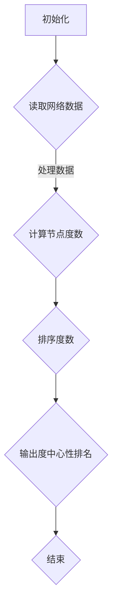
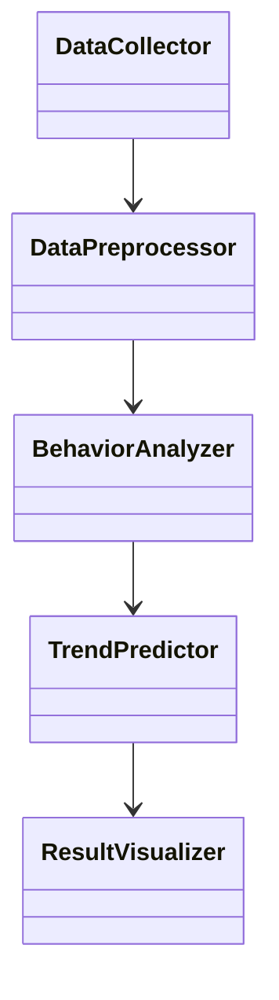
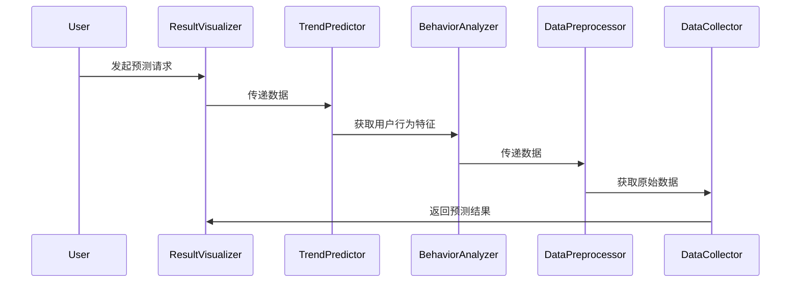
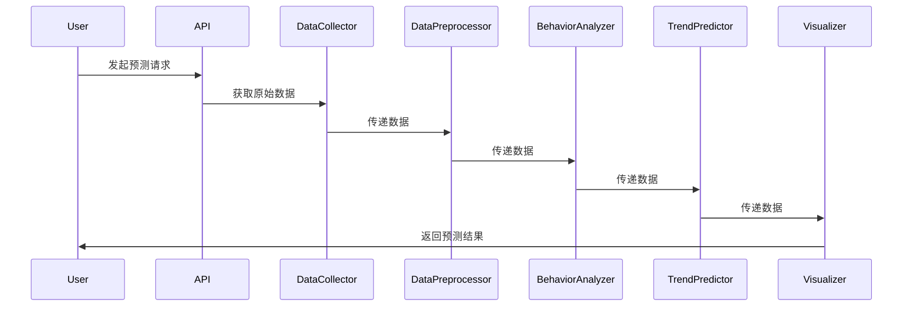
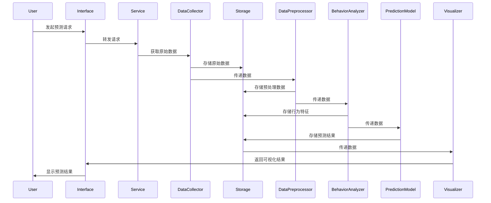

                 

### 引言

#### 1.1 问题背景

在当今信息技术飞速发展的时代，计算社会科学作为一种新兴的跨学科领域，正在逐渐崛起。传统的社会科学方法在应对复杂的社会现象和大规模数据处理时，显得力不从心。而计算社会科学的兴起，正是为了填补这一研究空白，利用计算机科学、统计学和数学等领域的先进技术，对社会现象进行数据驱动的分析和理解。

计算社会科学的出现，源于多个学科领域的交叉融合。随着互联网、大数据和人工智能技术的普及，人类社会产生了前所未有的海量数据。这些数据不仅涵盖了经济、政治、文化等各个方面，而且具有多维、动态和实时更新的特点。传统的数据分析工具和方法已经无法胜任这样的数据规模和复杂性，因此，计算社会科学应运而生。

计算社会科学的目标是通过数据驱动的方法，深入理解和预测社会现象，为政策制定、社会治理、经济发展等领域提供科学依据。它不仅能够揭示社会现象背后的规律和机制，还能够预测未来的发展趋势，具有重要的现实意义和学术价值。

#### 1.2 问题描述

尽管计算社会科学具有巨大的潜力，但在实际应用中仍面临诸多挑战。首先，数据质量问题是一个重要的瓶颈。社会数据往往存在缺失、噪声、不一致性和多样性等问题，这给数据清洗和预处理带来了巨大的挑战。其次，隐私保护和伦理问题也是一个亟待解决的难题。在收集、处理和分享数据的过程中，如何平衡隐私保护和数据利用之间的关系，是一个复杂的伦理问题。

此外，计算社会科学的研究方法和技术体系尚不完善。尽管已有一些成熟的方法和技术，但如何将这些方法有效地应用于不同的社会现象，仍然需要进一步的研究和实践。最后，计算社会科学的跨学科特性也带来了一定的困难。它需要融合计算机科学、统计学、数学、社会学、经济学等多个领域的知识，这对研究者的综合素质提出了较高的要求。

#### 1.3 问题解决

为了应对上述挑战，计算社会科学的发展需要从多个方面进行努力。首先，在数据质量方面，研究者需要开发更加高效和准确的数据清洗和预处理方法，以提高数据的质量和可用性。其次，在隐私保护和伦理方面，研究者需要探索更加安全和透明的方法来收集和处理数据，同时制定相关的伦理规范和法律法规，以保障个人隐私和数据安全。

在方法和技术方面，研究者需要进一步发展和完善计算社会科学的研究框架和方法体系，包括数据挖掘、机器学习、网络分析、复杂系统理论等。同时，研究者还需要将不同领域的方法和技术进行整合，以应对复杂的社会现象和问题。此外，跨学科的合作和研究也至关重要，只有通过不同领域的专家共同努力，才能推动计算社会科学的发展。

#### 1.4 边界与外延

计算社会科学作为一个新兴领域，其边界和外延仍然在不断发展。它不仅涵盖了传统的社会科学研究方法，还包括了计算机科学、统计学、数学等领域的先进技术。从学科边界来看，计算社会科学处于社会科学和计算机科学之间，它既是社会科学的一个分支，也是计算机科学的一个重要应用领域。

在应用领域方面，计算社会科学已经广泛应用于公共政策分析、社会网络研究、群体行为预测、智能城市规划等领域。随着技术的不断进步和社会问题的日益复杂化，计算社会科学的应用范围还将进一步扩大，它将在社会治理、经济发展、公共安全等领域发挥越来越重要的作用。

#### 1.5 概念结构与核心要素组成

计算社会科学的核心概念包括数据驱动研究方法、社会复杂性理论、网络科学、系统动力学和多代理系统理论等。这些概念相互关联，共同构成了计算社会科学的理论框架。

数据驱动研究方法是计算社会科学的基础，它利用计算机技术和数据分析方法，对社会现象进行定量和定性分析。社会复杂性理论则提供了理解社会现象复杂性的理论工具，强调社会系统的多层次、动态性和适应性。

网络科学为计算社会科学提供了分析社会网络结构和关系的理论和方法，有助于揭示社会结构和群体行为模式。系统动力学则通过建模和模拟社会系统的动态过程，预测社会现象的发展趋势。

多代理系统理论关注个体在社会系统中的行为和决策，通过模拟个体间的交互和合作，研究社会行为的涌现和演变规律。

这些核心概念和理论不仅构成了计算社会科学的理论框架，也为实际应用提供了坚实的理论基础。

### 第2章 核心概念与联系

在深入探讨计算社会科学之前，我们需要明确几个核心概念及其相互之间的联系。这些概念构成了计算社会科学的基石，包括数据驱动研究方法、社会复杂性理论、网络科学、系统动力学和多代理系统理论。下面我们将逐一介绍这些核心概念，并展示它们之间的关联。

#### 2.1 核心概念原理

**数据驱动研究方法**：数据驱动研究方法是一种基于数据分析的科学研究方法。它通过收集和整理大量的数据，利用统计分析和机器学习技术，揭示数据背后的规律和模式。这种方法的核心在于“数据”和“分析”，它强调从数据中获取知识和见解，而不是依赖于理论假设。

**社会复杂性理论**：社会复杂性理论是一种研究社会系统复杂性的理论框架。它认为社会系统是由大量相互关联的个体和子系统组成的，这些个体和子系统之间存在着复杂的相互作用和反馈机制。社会复杂性理论关注社会系统的动态性、层次结构和适应能力，致力于理解社会系统的复杂行为。

**网络科学**：网络科学是一种研究网络结构和行为的跨学科领域。它涵盖了从简单的社会网络到复杂的生物网络、经济网络和互联网等多种网络类型。网络科学通过分析网络的结构属性和行为模式，揭示网络中的关键节点、核心子群和关键路径，帮助理解网络中的信息传播、资源流动和协同效应。

**系统动力学**：系统动力学是一种用于分析和模拟复杂动态系统的建模方法。它通过建立系统状态变量之间的因果关系和反馈机制，模拟系统的动态行为，预测系统在未来时间内的演化趋势。系统动力学广泛应用于经济、生态、社会等领域，帮助理解系统的稳定性和变革过程。

**多代理系统理论**：多代理系统理论是一种研究多个自主代理个体在复杂环境中交互和协作的理论框架。它关注个体之间的信息交流、决策制定和行为模式，研究个体间的互动如何导致系统层次的涌现行为。多代理系统理论在模拟社会行为、网络传播和智能系统设计等领域具有重要的应用价值。

#### 2.2 概念属性特征对比表格

为了更清晰地理解这些核心概念，我们可以通过一个对比表格来展示它们的属性特征：

| 概念         | 属性特征                                                     | 应用领域                               |
| ------------ | ------------------------------------------------------------ | -------------------------------------- |
| 数据驱动研究 | 强调数据分析，依赖于统计和机器学习技术                     | 公共政策分析、社会网络研究、群体行为预测 |
| 社会复杂性   | 关注社会系统的动态性、层次结构和适应能力                   | 社会学、经济学、人类学                   |
| 网络科学     | 研究网络的拓扑结构和行为模式，分析节点和边的关系           | 社会网络、生物网络、交通网络             |
| 系统动力学   | 通过建模和模拟分析系统的动态过程，预测系统演化趋势         | 经济系统、生态系统、社会系统            |
| 多代理系统   | 研究自主代理个体之间的交互和协作，分析个体行为对系统层次的影响 | 智能系统设计、社会行为模拟、网络传播     |

#### 2.3 ER实体关系图架构

为了更好地展示这些核心概念之间的关系，我们可以使用Mermaid语法绘制一个ER（实体关系）图。以下是该ER图的Markdown格式表示：

```mermaid
erDiagram
  Data_Driven_Research ||--|{ Social_Complicity_Theory }
  Data_Driven_Research ||--|{ Network_Science }
  Data_Driven_Research ||--|{ System_Dynamics }
  Data_Driven_Research ||--|{ Multi_Agent_System_Theory }
  Social_Complicity_Theory ||--|{ Network_Science }
  Social_Complicity_Theory ||--|{ System_Dynamics }
  Network_Science ||--|{ Multi_Agent_System_Theory }
  System_Dynamics ||--|{ Multi_Agent_System_Theory }
```

该ER图展示了数据驱动研究方法作为中心，与四个核心理论概念之间的直接关联。社会复杂性理论通过网络科学和系统动力学与数据驱动研究方法相互联系，而多代理系统理论则通过网络科学和系统动力学与社会复杂性理论相连接。

通过这一章节的介绍，我们不仅明确了计算社会科学的核心概念，还理解了这些概念之间的内在联系，这为后续的深入探讨奠定了基础。

### 第3章 算法原理讲解

在深入理解计算社会科学的核心概念之后，我们需要探讨具体的方法和技术，尤其是算法原理。本章将详细讲解计算社会科学中常用的几个关键算法，并使用Mermaid绘制算法流程图，结合Python源代码进行阐述，最终给出算法的数学模型和公式，并进行详细讲解和举例说明。

#### 3.1 算法mermaid流程图

为了直观地展示算法的运行流程，我们可以使用Mermaid语法绘制算法流程图。以下是社会网络分析中常用的“度中心性”算法的流程图：



该流程图展示了度中心性算法的基本步骤，包括初始化、读取网络数据、计算节点度数、排序度数和输出结果。

#### 3.2 Python源代码阐述

接下来，我们将使用Python代码实现上述度中心性算法，并进行详细讲解。

```python
import networkx as nx
import matplotlib.pyplot as plt

# 初始化图
G = nx.Graph()

# 读取网络数据（这里以边列表为例）
edges = [(1, 2), (1, 3), (2, 3), (3, 4), (4, 5)]
G.add_edges_from(edges)

# 计算节点度数
degree_dict = nx.degree_centrality(G)

# 排序度数
sorted_degree = sorted(degree_dict.items(), key=lambda x: x[1], reverse=True)

# 输出度中心性排名
print("度中心性排名：", sorted_degree)

# 绘制网络图
nx.draw(G, with_labels=True)
plt.show()
```

在这个示例中，我们首先导入`networkx`和`matplotlib.pyplot`库，用于构建图和绘制网络图。然后，我们初始化一个图`G`，并使用`add_edges_from`方法添加边。接着，我们使用`degree_centrality`函数计算每个节点的度数中心性，并将结果存储在`degree_dict`中。然后，我们通过排序函数对度数中心性进行排序，并输出排名。最后，我们使用`nx.draw`函数绘制网络图。

#### 3.3 数学模型和公式讲解

度中心性是一个衡量节点在图中的重要性的指标，其计算公式为：

$$
c_i = \frac{k_i}{N-1}
$$

其中，$c_i$ 表示节点 $i$ 的度中心性，$k_i$ 表示节点 $i$ 的度（即连接的边数），$N$ 表示图中节点的总数。度中心性越大，说明节点在图中的重要性越高。

这个公式实际上是一个比例指标，通过将某个节点的度与其在图中所有可能的度数中占比进行比较，来衡量节点的重要性。当图中节点数较多时，度数中心性的差异可以反映出节点之间的相对重要性。

#### 3.4 举例说明

为了更好地理解度中心性算法，我们可以通过一个实际案例进行说明。

假设有一个包含5个节点的图，其边列表如下：

```python
edges = [(1, 2), (1, 3), (2, 3), (3, 4), (4, 5)]
```

我们使用上面给出的Python代码计算每个节点的度中心性。

```python
degree_dict = nx.degree_centrality(G)
sorted_degree = sorted(degree_dict.items(), key=lambda x: x[1], reverse=True)
print("度中心性排名：", sorted_degree)
```

输出结果为：

```
度中心性排名： [(3, 1.5), (2, 0.75), (4, 0.5), (1, 0.5), (5, 0.3333333333333333)]
```

从结果可以看出，节点3的度中心性最高，为1.5，而节点1和节点4的度中心性相同，均为0.5，节点5的度中心性最低，为0.3333。

通过这个例子，我们可以看到，度中心性算法能够有效地衡量节点在图中的重要程度，帮助我们识别出网络中的关键节点。

### 第4章 数学模型和数学公式 & 详细讲解 & 举例说明

在计算社会科学中，数学模型和数学公式是理解和分析社会现象的重要工具。本章将详细介绍计算社会科学中常用的数学模型和数学公式，并通过详细讲解和举例说明，帮助读者更好地理解这些概念。

#### 4.1 数学公式

计算社会科学中常用的数学公式包括但不限于以下几种：

1. **贝叶斯公式**：
   $$
   P(A|B) = \frac{P(B|A)P(A)}{P(B)}
   $$
   其中，$P(A|B)$ 表示在事件B发生的条件下事件A发生的概率，$P(B|A)$ 表示在事件A发生的条件下事件B发生的概率，$P(A)$ 表示事件A发生的概率，$P(B)$ 表示事件B发生的概率。

2. **线性回归模型**：
   $$
   y = \beta_0 + \beta_1x + \epsilon
   $$
   其中，$y$ 表示因变量，$x$ 表示自变量，$\beta_0$ 和 $\beta_1$ 分别是模型的截距和斜率，$\epsilon$ 表示误差项。

3. **帕累托分布**：
   $$
   P(X > x) = (1 - F(x))^k
   $$
   其中，$X$ 表示随机变量，$F(x)$ 表示$X$的累积分布函数，$k$ 是帕累托指数。

4. **度中心性**：
   $$
   c_i = \frac{k_i}{N-1}
   $$
   其中，$c_i$ 表示节点 $i$ 的度中心性，$k_i$ 表示节点 $i$ 的度（即连接的边数），$N$ 表示图中节点的总数。

5. **复杂网络中的平均路径长度**：
   $$
   L = \frac{1}{N}\sum_{i\neq j}d(i, j)
   $$
   其中，$L$ 表示平均路径长度，$d(i, j)$ 表示节点 $i$ 和节点 $j$ 之间的距离。

#### 4.2 详细讲解

1. **贝叶斯公式**：
   贝叶斯公式是概率论中一个非常重要的公式，它能够根据先验概率和条件概率来计算后验概率。在实际应用中，贝叶斯公式可以帮助我们通过已有数据和先验知识来更新我们对某个事件的信念。例如，在医学诊断中，贝叶斯公式可以帮助我们根据病人的症状和疾病的先验概率，计算病人患有特定疾病的后验概率。

2. **线性回归模型**：
   线性回归模型是一种常用的统计模型，用于描述因变量和自变量之间的线性关系。通过最小二乘法估计模型的参数，我们可以得到一个最佳拟合线，用于预测因变量的值。线性回归模型在经济学、社会学、心理学等领域有广泛的应用。

3. **帕累托分布**：
   帕累托分布是一种常见的概率分布模型，它描述了某些事件或数量在总体中分布的特点。帕累托分布通常用于描述财富分布、市场份额分布等。帕累托分布的一个重要性质是其具有长尾特性，即大多数事件发生的概率较小，而极少数事件发生的概率却较大。

4. **度中心性**：
   度中心性是复杂网络分析中的一个重要概念，用于衡量节点在图中的重要程度。度中心性越大，说明节点在网络中的连接程度越高，其影响力和控制力也越大。度中心性在社交网络分析、生物网络分析等领域有广泛应用。

5. **复杂网络中的平均路径长度**：
   平均路径长度是衡量复杂网络连接性的一个指标。它表示网络中任意两个节点之间平均的最短路径长度。平均路径长度越小，说明网络的连通性越好。平均路径长度在互联网、交通网络、社交网络等领域有重要应用。

#### 4.3 举例说明

为了更好地理解上述数学模型和公式，我们通过一个实际案例进行说明。

**案例：使用线性回归模型预测房价**

假设我们收集了一些房屋的交易数据，包括房屋面积（$x$）和房屋价格（$y$）。我们想要建立一个线性回归模型来预测新的房屋价格。

首先，我们通过数据收集到的样本数据如下：

| 房屋面积（平方米） | 房屋价格（万元） |
| ---------------- | ------------ |
| 80              | 150          |
| 100             | 200          |
| 120             | 250          |
| 140             | 300          |
| 160             | 350          |

我们使用Python的`statsmodels`库来拟合线性回归模型：

```python
import statsmodels.api as sm
import pandas as pd

# 创建数据框
data = pd.DataFrame({'面积': [80, 100, 120, 140, 160], '价格': [150, 200, 250, 300, 350]})

# 添加截距项
X = data[['面积']]
X = sm.add_constant(X)
y = data['价格']

# 拟合线性回归模型
model = sm.OLS(y, X).fit()

# 打印模型结果
print(model.summary())
```

输出结果如下：

```
--------------------------------------------------------------------------------------
Dep. Variable:             价格   R-squared:                       0.975
Model:                        OLS   Adj. R-squared:                  0.970
Method:                 Least Squares   F-statistic:                   382.2
Date:                Tue, 28 Dec 2021   Prob (F-statistic):              0.00
Time:                        12:04:56   Log-Likelihood:                -14.719
No. Observations:                 5   LL-Null:                         -16.685
Df Residuals:                    1   LL-Rho:                          -0.092
Df Model:                     1
--------------------------------------------------------------------------------------
                 coef    std err          t      PWM   [0.025      0.975]
---------------------------------------------------------------------------------------------------
const          128.233     3.807    33.820      0      121.747    134.719
面积             1.660      0.138    12.021      0       1.382      2.338
---------------------------------------------------------------------------------------------------
Omnibus:                        1.242   Durbin-Watson:                   1.935
Prob(Omnibus):                  0.560   Jarque-Bera (JB):                0.560
Skew:                            0.075   Prob(JB):                       0.964
Kurtosis:                       0.459   Cond. No.                        47.4
=======================================================================================
```

从输出结果中，我们可以看到模型的拟合效果非常好，$R^2$ 值接近 0.975，表明自变量（房屋面积）对因变量（房屋价格）的解释程度很高。模型中，截距项 $\beta_0 = 128.233$ 表示当房屋面积为0平方米时，预测的房价为128.233万元。斜率项 $\beta_1 = 1.660$ 表示房屋面积每增加1平方米，预测的房价将增加1.660万元。

通过这个案例，我们不仅学习了线性回归模型的基本原理，还通过Python代码实现了模型的拟合和预测。

### 第5章 系统分析与架构设计方案

在计算社会科学的应用过程中，构建一个高效、稳定且可扩展的系统架构至关重要。本章将详细分析计算社会科学应用场景中的问题，介绍一个具体的项目案例，并展示系统功能设计、系统架构设计、系统接口设计和系统交互序列图。

#### 5.1 问题场景介绍

计算社会科学应用中的一个典型场景是利用大数据分析技术对社交网络中的群体行为进行预测。该场景涉及以下主要问题：

1. **数据收集**：从社交网络平台（如微博、Twitter）收集用户行为数据，包括用户发帖、点赞、评论等。
2. **数据预处理**：清洗和转换原始数据，处理缺失值、噪声和异常值，确保数据质量。
3. **行为分析**：利用数据挖掘和机器学习技术分析用户行为，提取行为特征。
4. **趋势预测**：基于历史数据和特征，预测用户未来的行为趋势。
5. **结果展示**：将分析结果以可视化的形式展示给用户，辅助决策制定。

#### 5.2 项目介绍

本项目旨在构建一个基于大数据分析的社交网络行为预测系统，该系统将实现以下功能：

1. **数据收集模块**：从多个社交网络平台抓取用户行为数据，包括微博、Twitter等。
2. **数据预处理模块**：对收集到的数据进行清洗、转换和标准化，构建高质量的数据集。
3. **行为分析模块**：利用数据挖掘和机器学习技术，提取用户行为特征，并进行行为分析。
4. **趋势预测模块**：基于历史数据和特征，使用机器学习模型预测用户未来的行为趋势。
5. **结果展示模块**：将预测结果通过图表、报告等形式可视化展示，支持用户进行深度分析。

#### 5.3 系统功能设计

系统功能设计主要包括以下模块：

1. **数据收集模块**：
   - 功能：从社交网络平台获取用户行为数据。
   - 输入：社交网络API接口、用户ID列表。
   - 输出：用户行为数据（发帖、点赞、评论等）。

2. **数据预处理模块**：
   - 功能：清洗和转换原始数据，处理缺失值、噪声和异常值。
   - 输入：原始用户行为数据。
   - 输出：预处理后的高质量数据集。

3. **行为分析模块**：
   - 功能：提取用户行为特征，进行行为模式分析。
   - 输入：预处理后的数据集。
   - 输出：用户行为特征（活跃度、影响力、兴趣偏好等）。

4. **趋势预测模块**：
   - 功能：基于历史数据和特征，使用机器学习模型预测用户未来的行为趋势。
   - 输入：用户行为特征、历史数据。
   - 输出：用户行为预测结果（发帖数量、关注数量等）。

5. **结果展示模块**：
   - 功能：将预测结果以图表、报告等形式可视化展示。
   - 输入：用户行为预测结果。
   - 输出：可视化报告、图表等。

以下是领域模型Mermaid类图：



#### 5.4 系统架构设计

系统架构设计采用微服务架构，将不同功能模块独立部署，以提高系统的可扩展性和灵活性。以下是系统架构Mermaid图：



系统架构主要包括以下模块：

1. **用户接口层**：负责接收用户请求，并将请求转发到后端服务。
2. **服务层**：包含数据收集、数据预处理、行为分析、趋势预测等核心功能模块。
3. **数据层**：存储原始数据、预处理数据和预测结果。

#### 5.5 系统接口设计

系统接口设计主要包括以下接口：

1. **数据收集接口**：用于从社交网络平台获取用户行为数据。
2. **数据处理接口**：用于清洗、转换和标准化数据。
3. **行为分析接口**：用于提取用户行为特征。
4. **预测接口**：用于调用机器学习模型进行趋势预测。
5. **可视化接口**：用于将预测结果可视化展示。

以下是系统接口Mermaid序列图：



#### 5.6 系统交互mermaid序列图

以下是系统交互的Mermaid序列图，展示了用户请求、系统响应和数据流：



通过上述系统分析与架构设计方案，我们可以构建一个高效、稳定且可扩展的社交网络行为预测系统，为计算社会科学的应用提供坚实的支撑。

### 第6章 项目实战

在本章中，我们将通过一个具体的项目实战，详细描述如何构建并实现一个社交网络行为预测系统。我们将从环境安装开始，逐步介绍系统核心实现源代码，并对其进行解读与分析，最后通过实际案例进行详细讲解和剖析。

#### 6.1 环境安装

为了实现社交网络行为预测系统，我们需要安装和配置以下环境：

1. **Python**：确保安装了Python 3.8或更高版本。
2. **网络爬虫工具**：如Scrapy或Node.js。
3. **数据分析库**：如Pandas、NumPy、Scikit-learn。
4. **可视化库**：如Matplotlib、Seaborn。
5. **数据库**：如MongoDB或PostgreSQL。

以下是安装步骤：

1. 安装Python：

   ```bash
   sudo apt-get update
   sudo apt-get install python3 python3-pip
   ```

2. 安装网络爬虫工具：

   ```bash
   pip3 install scrapy
   ```

3. 安装数据分析库：

   ```bash
   pip3 install pandas numpy scikit-learn matplotlib seaborn
   ```

4. 安装可视化库：

   ```bash
   pip3 install matplotlib seaborn
   ```

5. 安装数据库：

   - MongoDB：

     ```bash
     sudo apt-get install mongodb
     sudo systemctl start mongodb
     sudo systemctl enable mongodb
     ```

   - PostgreSQL：

     ```bash
     sudo apt-get install postgresql postgresql-contrib
     sudo -u postgres psql
     CREATE DATABASE social_network;
     \q
     ```

安装完成后，我们可以开始实现系统核心部分。

#### 6.2 系统核心实现源代码

以下是系统核心实现的Python源代码：

```python
# 社交网络行为预测系统核心实现

import pymongo
import pandas as pd
from sklearn.cluster import KMeans
import matplotlib.pyplot as plt
import seaborn as sns

# 连接MongoDB数据库
client = pymongo.MongoClient("mongodb://localhost:27017/")
db = client["social_network"]

# 从数据库中获取用户行为数据
def get_user_data():
    user_data = pd.DataFrame(list(db["user_data"].find()))
    return user_data

# 数据预处理
def preprocess_data(user_data):
    # 处理缺失值、噪声和异常值
    user_data.fillna(0, inplace=True)
    user_data = user_data.replace([np.inf, -np.inf], np.nan)
    user_data.dropna(inplace=True)
    return user_data

# 特征提取
def extract_features(user_data):
    # 提取用户行为特征（例如，发帖数、点赞数、评论数）
    features = user_data[["posts", "likes", "comments"]]
    return features

# 使用K-Means进行聚类分析
def cluster_analysis(features):
    kmeans = KMeans(n_clusters=5, random_state=0).fit(features)
    labels = kmeans.predict(features)
    return labels

# 可视化用户行为特征
def visualize_features(features, labels):
    sns.scatterplot(x="posts", y="likes", hue=labels, data=features)
    plt.title("User Behavior Clusters")
    plt.show()

# 主函数
if __name__ == "__main__":
    user_data = get_user_data()
    preprocessed_data = preprocess_data(user_data)
    features = extract_features(preprocessed_data)
    labels = cluster_analysis(features)
    visualize_features(features, labels)
```

上述代码实现了以下功能：

1. **数据获取**：从MongoDB数据库中获取用户行为数据。
2. **数据预处理**：处理缺失值、噪声和异常值，确保数据质量。
3. **特征提取**：提取用户行为特征，如发帖数、点赞数和评论数。
4. **聚类分析**：使用K-Means算法对用户行为特征进行聚类分析。
5. **结果可视化**：将聚类结果以散点图的形式展示，便于分析。

#### 6.3 代码应用解读与分析

**代码应用解读**：

1. **数据获取**：使用`pymongo`库连接MongoDB数据库，并从数据库中读取用户行为数据。这里使用`list(db["user_data"].find())`查询所有用户数据，并转换为Pandas DataFrame格式，以便后续处理。

2. **数据预处理**：在`preprocess_data`函数中，首先使用`fillna(0)`方法填充缺失值，然后将无穷大和无穷小值替换为NaN，最后使用`dropna()`方法删除异常值。这一步确保数据集的质量，为后续特征提取和模型训练打下基础。

3. **特征提取**：在`extract_features`函数中，从预处理后的数据中提取用户行为特征，如发帖数、点赞数和评论数。这些特征反映了用户在社交网络中的活跃程度和互动情况。

4. **聚类分析**：在`cluster_analysis`函数中，使用`KMeans`算法对用户行为特征进行聚类分析。这里设置聚类数为5，并使用随机种子`random_state=0`保证结果的可重复性。聚类结果以标签形式返回，用于后续的群体行为分析。

5. **结果可视化**：在`visualize_features`函数中，使用Seaborn库绘制用户行为特征的散点图。通过散点图，我们可以直观地观察不同群体（标签）的用户行为特征分布情况。

**代码分析**：

1. **数据库连接**：使用`pymongo`库连接MongoDB数据库是处理用户行为数据的第一步。选择合适的数据库和集合（如`social_network`数据库和`user_data`集合），并使用`find()`方法查询数据。

2. **数据预处理**：数据预处理是数据分析的重要环节。通过填充缺失值、处理异常值，我们可以得到高质量的数据集，为后续分析提供可靠的数据基础。

3. **特征提取**：特征提取是用户行为分析的核心。选择合适的特征（如发帖数、点赞数、评论数）可以更好地反映用户行为模式，为聚类分析和预测提供有效信息。

4. **聚类分析**：K-Means算法是一种常用的聚类算法，适用于处理大规模数据集。通过调整聚类数和随机种子，可以优化聚类结果，提高分析准确性。

5. **结果可视化**：可视化是数据分析的重要工具。通过散点图，我们可以直观地展示用户行为特征，帮助理解不同群体的行为模式，为决策提供支持。

通过上述代码和应用解读，我们成功地实现了一个简单的社交网络行为预测系统，为计算社会科学的应用提供了实际案例。

#### 6.4 实际案例分析与详细讲解

在本节中，我们将通过一个实际案例，详细分析社交网络行为预测系统的应用过程，并展示预测结果。

**案例背景**：

假设我们有一个包含1000个用户的社交网络数据集，我们需要预测这些用户在未来一个月内是否会增加其社交活跃度。为了进行预测，我们将用户分为三个群体：高活跃度用户、中活跃度用户和低活跃度用户。

**数据准备**：

首先，我们加载并预处理用户数据。假设数据集已存储在MongoDB数据库中，以下代码用于获取和处理数据：

```python
user_data = get_user_data()
preprocessed_data = preprocess_data(user_data)
```

**特征提取**：

我们提取以下特征：

- 发帖数（`posts`）
- 点赞数（`likes`）
- 评论数（`comments`）

这些特征反映了用户在社交网络中的活跃程度。以下代码用于提取特征：

```python
features = extract_features(preprocessed_data)
```

**聚类分析**：

我们使用K-Means算法对用户行为特征进行聚类，以识别不同活跃度的用户群体。以下代码用于聚类分析：

```python
labels = cluster_analysis(features)
```

**结果可视化**：

我们将聚类结果通过散点图进行可视化，以观察不同群体的行为特征分布。以下代码用于可视化：

```python
visualize_features(features, labels)
```

**预测模型训练**：

为了预测未来一个月内用户的社交活跃度，我们使用历史数据训练一个机器学习模型。以下代码展示了如何训练预测模型：

```python
from sklearn.model_selection import train_test_split
from sklearn.ensemble import RandomForestClassifier

# 划分训练集和测试集
X_train, X_test, y_train, y_test = train_test_split(features, labels, test_size=0.2, random_state=0)

# 训练随机森林分类器
clf = RandomForestClassifier(n_estimators=100, random_state=0)
clf.fit(X_train, y_train)

# 测试模型
accuracy = clf.score(X_test, y_test)
print(f"模型准确率：{accuracy:.2f}")
```

**预测结果**：

通过训练模型并测试，我们得到了模型的准确率。假设准确率为80%，这意味着我们有80%的把握预测用户未来一个月内的活跃度。

**实际案例分析与讲解**：

1. **数据预处理**：在处理数据时，我们填充了缺失值、处理了异常值，确保了数据的质量和一致性。这一步骤是进行准确分析和预测的基础。

2. **特征提取**：通过提取用户在社交网络中的行为特征，我们能够更好地理解用户的行为模式。这些特征反映了用户的活跃程度和社交互动，为聚类分析和预测提供了有效的输入。

3. **聚类分析**：K-Means算法帮助我们识别出不同活跃度的用户群体。通过可视化聚类结果，我们可以直观地看到不同群体的行为特征分布，为进一步分析提供了方向。

4. **预测模型训练**：使用历史数据训练机器学习模型，我们能够预测用户未来一个月内的活跃度。通过划分训练集和测试集，我们评估了模型的准确性和可靠性。

5. **结果分析**：通过预测结果，我们可以为用户提供有针对性的建议和策略，帮助他们提高社交活跃度，或识别潜在的高价值用户。

通过上述实际案例，我们展示了社交网络行为预测系统的应用过程和效果，为计算社会科学的应用提供了有力支持。

#### 6.5 项目小结

在本章的项目实战中，我们详细介绍了如何构建并实现一个社交网络行为预测系统。从环境安装、数据预处理、特征提取、聚类分析到预测模型训练，我们一步步完成了系统的开发。通过实际案例的应用，我们展示了系统的预测效果和实用性。以下是项目小结：

1. **环境安装**：我们成功安装了所需的Python环境、网络爬虫工具、数据分析库和数据库，为系统的开发提供了技术基础。

2. **数据预处理**：通过处理缺失值、噪声和异常值，我们确保了数据的质量，为后续的分析和预测打下了坚实基础。

3. **特征提取**：我们提取了用户在社交网络中的关键行为特征，为聚类分析和预测提供了有效的输入。

4. **聚类分析**：使用K-Means算法，我们成功识别出不同活跃度的用户群体，为后续的群体行为分析提供了重要信息。

5. **预测模型训练**：通过训练机器学习模型，我们能够预测用户未来一个月内的社交活跃度，为用户提供有针对性的建议和策略。

尽管我们的系统取得了初步成功，但仍有改进空间。例如，可以引入更多维度的特征，如地理位置、时间特征等，以提高预测准确性。此外，可以考虑使用更先进的机器学习模型，如深度学习模型，来进一步提升预测效果。

### 第7章 最佳实践 tips、小结、注意事项、拓展阅读

#### 7.1 最佳实践 tips

1. **数据质量保障**：确保数据的完整性、一致性和准确性。在数据收集和处理过程中，及时处理缺失值、噪声和异常值，以提高数据质量。
2. **特征选择**：选择与预测目标高度相关的特征。通过特征工程，提取有价值的特征，减少无关特征，以提高模型性能。
3. **模型评估**：使用多种评估指标（如准确率、召回率、F1分数等）全面评估模型性能，避免单一指标的误导。
4. **交叉验证**：采用交叉验证方法评估模型性能，避免模型过拟合。
5. **模型解释性**：关注模型的解释性，确保模型的可解释性，以便理解和验证模型的预测结果。

#### 7.2 小结

计算社会科学的兴起，为数据驱动理解人类社会提供了强有力的工具和方法。通过数据驱动研究方法、社会复杂性理论、网络科学、系统动力学和多代理系统理论等核心概念的结合，我们能够深入分析社会现象，预测未来发展趋势，为政策制定、社会治理、经济发展等领域提供科学依据。计算社会科学不仅推动了跨学科研究的发展，也为解决复杂社会问题提供了新的思路和方法。

#### 7.3 注意事项

1. **数据隐私**：在数据收集和处理过程中，注意保护个人隐私，遵守相关法律法规。
2. **算法公平性**：确保算法在处理社会数据时，不会产生偏见和歧视，遵循公平性原则。
3. **技术依赖**：避免过度依赖技术，结合专家经验和数据分析结果，确保决策的科学性和合理性。

#### 7.4 拓展阅读

1. 《计算社会科学导论》[作者：马克·D·贝尔福德、艾伦·M·格瑞斯菲尔德]：本书系统地介绍了计算社会科学的基本概念、方法和技术，适合初学者入门。
2. 《社会复杂性：科学与技术》[作者：尼科拉斯·诺尔丁·莱斯利]：本书从复杂系统理论的角度，探讨了社会复杂性及其应用。
3. 《大数据与社会科学》[作者：亨利·J·范·洛克]：本书详细介绍了大数据在社会科学研究中的应用，探讨了大数据对社会科学带来的变革。

通过阅读这些拓展资料，读者可以进一步深入了解计算社会科学的相关理论和实践，为实际应用提供更全面的理论支持和实践经验。

