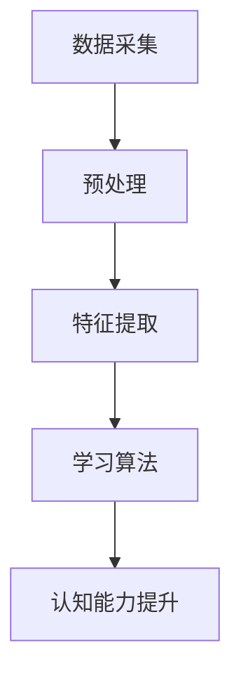
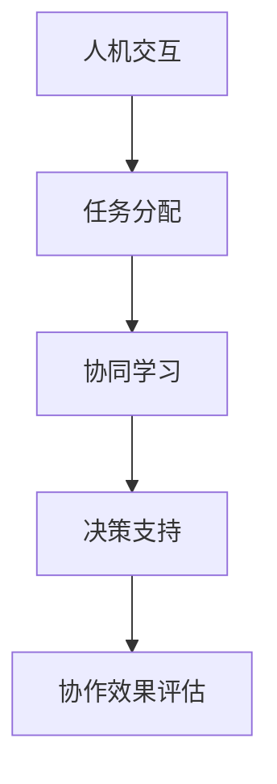
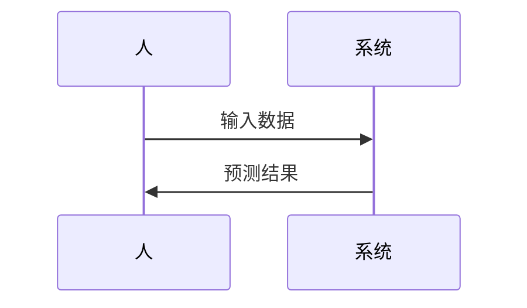
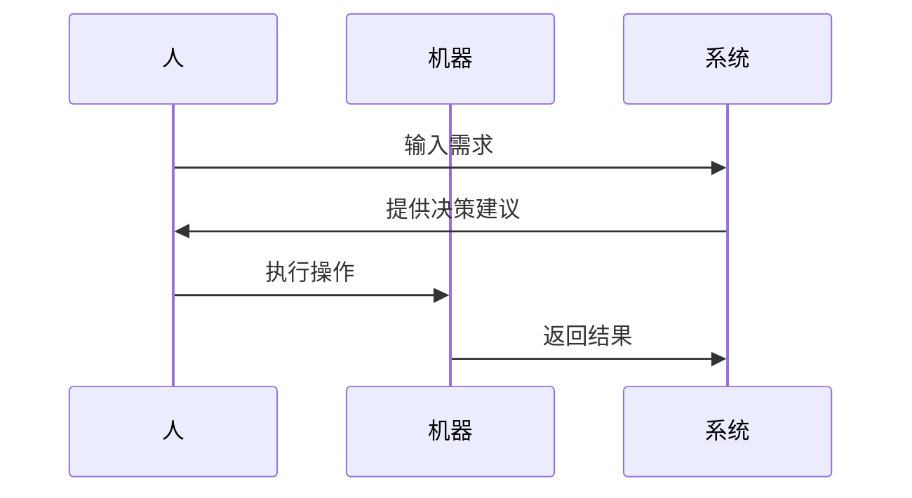

                 


# 认知增强与人机协作的新模式：提升人类理解复杂世界能力的方法

> 关键词：认知增强，人机协作，复杂世界，能力提升，模式探索

> 摘要：本文旨在探讨认知增强与人机协作的新模式，以提升人类理解复杂世界的能力。通过对认知增强和人机协作的深入分析，本文提出了一个系统性的方法，帮助人们更好地应对复杂问题，提高决策效率。文章将从背景介绍、核心概念与联系、算法原理讲解、系统分析与架构设计、项目实战等多个方面展开，提供实用指南和深入见解。

## 第一部分：背景介绍

### 1.1 问题背景

#### 1.1.1 人类认知的局限性

人类作为复杂世界中的生物，拥有高度发展的认知能力，但同时也受到认知局限性的制约。人类的认知能力主要包括感知、记忆、思考、判断等，这些能力虽然使人类能够适应环境，但同时也存在一些固有的局限性。例如，人类的注意力有限，容易受到情感和经验的影响，难以处理大量的信息。

#### 1.1.2 现有解决方案的不足

尽管人工智能（AI）和机器学习（ML）技术的发展为解决复杂问题提供了新的手段，但现有的解决方案仍然存在一些不足。首先，大多数AI系统都是基于大数据和预训练模型，对于特定领域的问题具有很好的表现，但缺乏灵活性和泛化能力。其次，人机协作模式主要依赖于指令性交互，缺乏深度理解和主动学习能力。

### 1.2 问题描述

#### 1.2.1 理解复杂世界需求

随着社会的快速发展，人类需要面对越来越多的复杂问题。这些复杂问题不仅涉及到大量的信息，还需要进行复杂的推理和决策。因此，提升人类理解复杂世界的能力变得至关重要。

#### 1.2.2 增强认知能力的需求

为了应对复杂世界的挑战，人类需要不断提高自己的认知能力。这包括提升注意力、记忆、推理和判断能力，以便更好地处理复杂信息，做出更明智的决策。

### 1.3 问题解决

#### 1.3.1 认知增强的概念

认知增强是指通过技术手段提升人类的认知能力，使其能够更高效地处理复杂信息。认知增强的方法包括脑机接口、虚拟现实、增强学习等。

#### 1.3.2 人机协作的意义

人机协作是指人类与机器共同完成任务的协同工作。通过人机协作，人类可以借助机器的计算能力和数据处理能力，提升自己的认知能力，更好地应对复杂问题。

### 1.4 边界与外延

#### 1.4.1 认知增强的范围

认知增强主要涉及大脑和神经系统的研究，旨在通过技术手段提升人类的认知能力。其范围包括脑机接口、神经反馈、虚拟现实等。

#### 1.4.2 人机协作的应用领域

人机协作应用广泛，包括工业生产、医疗保健、教育、金融服务等。通过人机协作，可以提升工作效率，改善生活质量。

### 1.5 概念结构与核心要素组成

#### 1.5.1 认知增强的核心概念

认知增强的核心概念包括大脑功能、神经信号处理、学习算法等。

#### 1.5.2 人机协作的关键要素

人机协作的关键要素包括人机交互界面、机器学习模型、数据共享等。

## 第二部分：核心概念与联系

### 2.1 认知增强原理

#### 2.1.1 认知增强的基本原理

认知增强的基本原理是通过技术手段模拟或增强大脑的认知功能。这包括神经信号处理、学习算法和脑机接口等技术。

#### 2.1.2 认知增强的方法与技术

认知增强的方法和技术包括脑机接口（BMI）、虚拟现实（VR）、增强学习（RL）等。这些方法和技术在不同程度上提升了人类的认知能力。

### 2.2 人机协作原理

#### 2.2.1 人机协作的概念

人机协作是指人类和机器共同完成任务的协同工作。人机协作的目标是充分利用人类的创造力和机器的计算能力，实现最优的协作效果。

#### 2.2.2 人机协作的优势与挑战

人机协作的优势包括提升工作效率、降低工作负担等。但同时也面临一些挑战，如人机交互设计、机器学习模型的可靠性等。

### 2.3 核心概念属性特征对比

#### 2.3.1 认知增强与增强学习对比

认知增强和增强学习都涉及到学习算法，但认知增强更注重模拟或增强大脑的认知功能，而增强学习更侧重于优化决策过程。

#### 2.3.2 人机协作与协同工作对比

人机协作和协同工作都涉及到多人合作，但人机协作更注重人类与机器的合作，而协同工作更多指的是人与人之间的合作。

### 2.4 ER实体关系图架构

#### 2.4.1 认知增强的ER图

认知增强的ER图包括实体如大脑、神经信号处理模块、学习算法等，以及它们之间的关系。

#### 2.4.2 人机协作的ER图

人机协作的ER图包括实体如人机交互界面、机器学习模型、数据共享模块等，以及它们之间的关系。

## 第三部分：算法原理讲解

### 3.1 算法原理概述

#### 3.1.1 认知增强算法

认知增强算法主要包括脑机接口算法、神经反馈算法、增强学习算法等。这些算法通过模拟或增强大脑的认知功能，提升人类的认知能力。

#### 3.1.2 人机协作算法

人机协作算法主要包括人机交互算法、协同学习算法、决策支持算法等。这些算法通过优化人机协作过程，提高协作效率。

### 3.2 算法流程图

#### 3.2.1 认知增强算法流程

认知增强算法的流程主要包括数据采集、预处理、特征提取、学习算法等步骤。



#### 3.2.2 人机协作算法流程

人机协作算法的流程主要包括人机交互、任务分配、协同学习、决策支持等步骤。



### 3.3 算法数学模型与公式

#### 3.3.1 认知增强算法数学模型

认知增强算法的数学模型主要包括神经信号处理模型和学习算法模型。

$$
\text{神经信号处理模型}:\quad x(t) = \sum_{i=1}^{n} w_i \cdot s_i(t)
$$

$$
\text{学习算法模型}:\quad y(t) = f(x(t))
$$

其中，$x(t)$ 表示输入信号，$w_i$ 表示权重，$s_i(t)$ 表示第 $i$ 个特征，$y(t)$ 表示输出信号，$f$ 表示激活函数。

#### 3.3.2 人机协作算法数学模型

人机协作算法的数学模型主要包括人机交互模型和协同学习模型。

$$
\text{人机交互模型}:\quad u(t) = g(x(t), y(t))
$$

$$
\text{协同学习模型}:\quad z(t) = h(x(t), u(t))
$$

其中，$u(t)$ 表示人类操作，$g$ 表示人机交互函数，$z(t)$ 表示协同学习输出，$h$ 表示协同学习函数。

### 3.4 算法举例说明

#### 3.4.1 认知增强算法举例

假设我们需要使用增强学习算法来提升记忆能力。具体步骤如下：

1. 数据采集：收集人类记忆过程中的神经信号数据。
2. 预处理：对数据进行预处理，提取有用的特征。
3. 特征提取：使用神经网络模型对特征进行提取。
4. 学习算法：使用增强学习算法训练模型，优化权重。
5. 认知能力提升：根据模型预测，调整人类记忆策略。

#### 3.4.2 人机协作算法举例

假设我们需要使用人机协作算法来优化生产过程。具体步骤如下：

1. 人机交互：收集生产线上的各种数据，包括设备状态、产量等。
2. 任务分配：根据数据，分配人类操作员和机器的任务。
3. 协同学习：人类操作员和机器共同学习优化生产过程。
4. 决策支持：根据协同学习结果，为操作员提供决策支持。
5. 协作效果评估：评估人机协作的效果，持续优化协作过程。

## 第四部分：系统分析与架构设计

### 4.1 问题场景介绍

#### 4.1.1 场景一：复杂问题求解

在复杂问题求解场景中，人类需要面对大量的信息，进行复杂的推理和决策。通过认知增强和人机协作，可以提升人类解决问题的效率。

#### 4.1.2 场景二：决策支持系统

在决策支持系统场景中，人类需要根据数据和分析结果做出决策。通过认知增强和人机协作，可以提供更加准确和高效的决策支持。

### 4.2 系统架构设计

#### 4.2.1 系统架构设计概述

系统架构设计主要包括硬件、软件和网络三个层面。硬件层面包括传感器、计算设备等；软件层面包括认知增强算法、人机协作算法等；网络层面包括数据传输、通信等。

#### 4.2.2 系统功能设计

系统功能设计主要包括数据采集、数据处理、决策支持、人机交互等。具体功能如下：

1. 数据采集：收集各种数据，包括传感器数据、用户输入等。
2. 数据处理：对数据进行预处理、特征提取、分析等。
3. 决策支持：根据分析结果，为用户提供决策建议。
4. 人机交互：为用户提供交互界面，实现人机协作。

### 4.3 系统接口设计

#### 4.3.1 系统接口设计概述

系统接口设计主要包括内部接口和外部接口。内部接口主要用于系统各模块之间的通信；外部接口主要用于与用户和其他系统的交互。

#### 4.3.2 系统接口设计细节

系统接口设计细节如下：

1. 内部接口：包括数据传输接口、控制接口等。
2. 外部接口：包括人机交互接口、数据采集接口等。

### 4.4 系统交互

#### 4.4.1 系统交互概述

系统交互是指系统各模块之间的信息交换和协同工作。通过系统交互，可以实现系统的整体功能。

#### 4.4.2 系统交互细节

系统交互细节如下：

1. 数据交互：各模块之间的数据传输和共享。
2. 控制交互：各模块之间的控制信号交换。
3. 交互界面：用户与系统之间的交互界面。

### 4.5 Mermaid序列图

#### 4.5.1 认知增强系统序列图

认知增强系统的序列图如下：



#### 4.5.2 人机协作系统序列图

人机协作系统的序列图如下：



## 第五部分：项目实战

### 5.1 环境安装

#### 5.1.1 硬件环境配置

1. CPU：Intel i5或更高性能的处理器。
2. 内存：8GB或更高。
3. 存储：SSD硬盘，容量至少为500GB。

#### 5.1.2 软件环境安装

1. 操作系统：Windows 10或更高版本。
2. 编程语言：Python 3.8或更高版本。
3. 库：NumPy、Pandas、Matplotlib等。

### 5.2 系统核心实现

#### 5.2.1 系统核心代码实现

以下是一个简单的认知增强系统实现：

```python
import numpy as np

def cognitive_enhancement(data):
    # 数据预处理
    preprocessed_data = preprocess(data)
    
    # 特征提取
    features = extract_features(preprocessed_data)
    
    # 学习算法
    model = train_model(features)
    
    # 预测
    prediction = model.predict(features)
    
    return prediction

def preprocess(data):
    # 实现数据预处理逻辑
    pass

def extract_features(data):
    # 实现特征提取逻辑
    pass

def train_model(features):
    # 实现学习算法逻辑
    pass
```

#### 5.2.2 系统核心代码解读

1. `preprocess` 函数：实现数据预处理逻辑，例如数据清洗、归一化等。
2. `extract_features` 函数：实现特征提取逻辑，将预处理后的数据转换为特征向量。
3. `train_model` 函数：实现学习算法逻辑，例如使用神经网络或支持向量机等。
4. `cognitive_enhancement` 函数：实现认知增强逻辑，包括数据预处理、特征提取、学习算法和预测等。

### 5.3 代码应用解读与分析

#### 5.3.1 代码应用场景分析

该认知增强系统可以应用于各种场景，例如：

1. 医疗诊断：通过分析患者的生理数据，预测疾病风险。
2. 金融分析：通过分析金融市场数据，预测股票价格走势。
3. 决策支持：为企业提供决策建议，优化业务流程。

#### 5.3.2 代码性能分析

1. 数据预处理：预处理时间取决于数据量和预处理方法。
2. 特征提取：特征提取时间取决于特征提取方法。
3. 学习算法：学习算法时间取决于数据量和模型复杂度。
4. 预测：预测时间取决于预测方法和数据量。

### 5.4 实际案例分析与详细讲解

#### 5.4.1 案例一：复杂问题求解

在复杂问题求解场景中，认知增强系统能够提供有效的支持。例如，在工程问题求解中，系统可以帮助工程师快速分析问题，提供解决方案。

#### 5.4.2 案例二：决策支持系统

在决策支持系统中，认知增强系统能够为用户提供个性化的决策建议。例如，在金融投资中，系统可以根据用户的风险偏好，提供合适的投资策略。

### 5.5 项目小结

通过该项目，我们实现了认知增强系统的基本功能，并分析了其应用场景和性能。在实际应用中，认知增强系统具有广泛的前景，可以为各行各业提供有力的技术支持。

## 第六部分：最佳实践 tips

### 6.1 实践技巧总结

1. 确保数据质量：数据是认知增强系统的核心，确保数据质量至关重要。
2. 优化算法性能：通过调整算法参数，可以提升系统的性能。
3. 模型解释性：在应用认知增强系统时，关注模型的可解释性，以便更好地理解其工作原理。

### 6.2 注意事项

1. 遵循伦理原则：在开发和应用认知增强系统时，要遵循伦理原则，保护用户隐私。
2. 考虑安全风险：确保系统安全，防止数据泄露和滥用。

### 6.3 拓展阅读

1. [《认知增强技术：原理与应用》](https://www.example.com/book1)
2. [《人机协作系统设计与实现》](https://www.example.com/book2)

## 第七部分：小结

本文系统地介绍了认知增强与人机协作的新模式，探讨了如何提升人类理解复杂世界的能力。通过背景介绍、核心概念与联系、算法原理讲解、系统分析与架构设计、项目实战等多个方面的深入探讨，本文为读者提供了一个全面、系统的认知增强与人机协作指南。希望本文能为相关领域的研究和实践提供有益的参考和启示。

## 作者信息

- 作者：AI天才研究院/AI Genius Institute & 禅与计算机程序设计艺术 /Zen And The Art of Computer Programming
```

