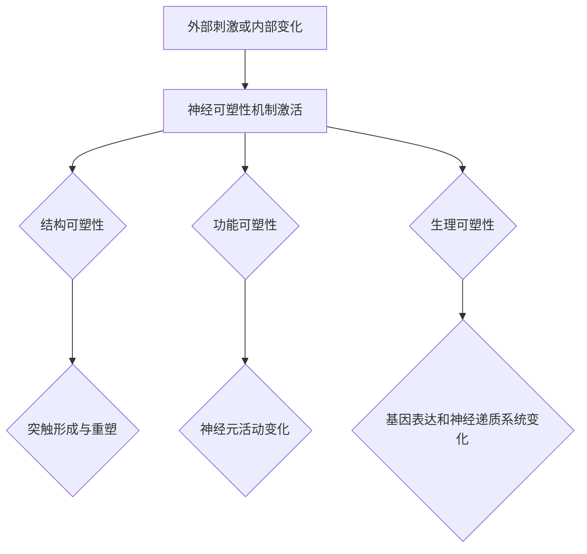
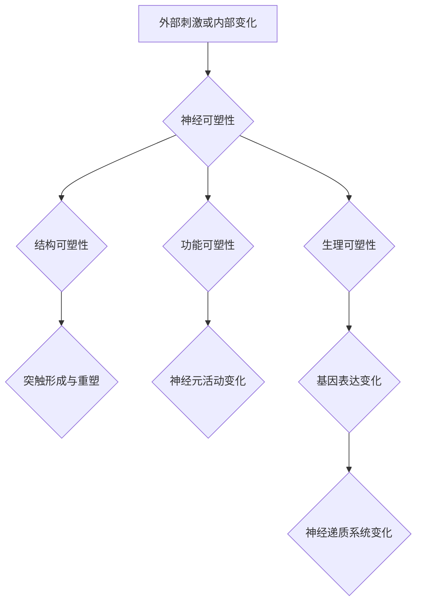

                 


## 认知增强与脑机接口：扩展人类感知与理解能力

### 关键词

- 认知增强
- 脑机接口
- 感知扩展
- 理解能力
- 人工智能
- 生物信号处理
- 机器学习
- 未来发展

### 摘要

本文旨在探讨认知增强与脑机接口技术在扩展人类感知与理解能力方面的作用。通过回顾认知增强与脑机接口的基础知识，详细分析相关的技术原理和应用实例，本文将为读者提供一幅关于认知增强与脑机接口如何结合以提升人类认知能力的全景图。最后，本文将对认知增强与脑机接口的未来发展进行展望，并探讨其中的法律与伦理问题。

### 目录大纲

```markdown
----------------------------------------------------------------

# 第1章: 认知增强与脑机接口概述

## 第1章.1 认知增强的概念与背景

### 第1章.1.1 认知增强的定义

### 第1章.1.2 认知增强的重要性

### 第1章.1.3 脑机接口的历史与发展

## 第1章.2 脑机接口的基本原理

### 第1章.2.1 脑机接口的定义

### 第1章.2.2 脑机接口的工作原理

### 第1章.2.3 脑机接口的分类

## 第1章.3 认知增强与脑机接口的关系

### 第1章.3.1 联系与差异

### 第1章.3.2 共同发展与应用

----------------------------------------------------------------

# 第2章: 认知增强技术

## 第2章.1 神经可塑性

### 第2章.1.1 神经可塑性的概念

### 第2章.1.2 神经可塑性的影响

### 第2章.1.3 神经可塑性的提升方法

## 第2章.2 信号处理技术

### 第2章.2.1 生物信号采集

### 第2章.2.2 信号预处理

### 第2章.2.3 信号特征提取

## 第2章.3 机器学习算法

### 第2章.3.1 机器学习的基础

### 第2章.3.2 常见算法介绍

### 第2章.3.3 认知增强中的机器学习应用

----------------------------------------------------------------

# 第3章: 脑机接口技术

## 第3章.1 脑电图(EEG)

### 第3章.1.1 EEG的基本概念

### 第3章.1.2 EEG的应用

### 第3章.1.3 EEG信号的采集与处理

## 第3章.2 脑磁图(MEG)

### 第3章.2.1 MEG的基本概念

### 第3章.2.2 MEG的应用

### 第3章.2.3 MEG信号的采集与处理

## 第3章.3 深部脑刺激(DBS)

### 第3章.3.1 DBS的基本概念

### 第3章.3.2 DBS的应用

### 第3章.3.3 DBS的原理与实现

----------------------------------------------------------------

# 第4章: 认知增强与脑机接口的结合应用

## 第4章.1 教育领域

### 第4章.1.1 认知增强在教育中的应用

### 第4章.1.2 脑机接口在教育中的应用

### 第4章.1.3 教育领域的案例分析

## 第4章.2 医疗领域

### 第4章.2.1 认知增强在医疗中的应用

### 第4章.2.2 脑机接口在医疗中的应用

### 第4章.2.3 医疗领域的案例分析

## 第4章.3 军事领域

### 第4章.3.1 认知增强在军事中的应用

### 第4章.3.2 脑机接口在军事中的应用

### 第4章.3.3 军事领域的案例分析

----------------------------------------------------------------

# 第5章: 认知增强与脑机接口的未来发展

## 第5章.1 技术趋势与挑战

### 第5章.1.1 技术发展趋势

### 第5章.1.2 技术面临的挑战

## 第5章.2 法律与伦理问题

### 第5章.2.1 法律问题

### 第5章.2.2 伦理问题

### 第5章.2.3 社会责任

----------------------------------------------------------------

# 第6章: 现实案例分析

## 第6章.1 案例一：智能辅助驾驶系统

### 第6章.1.1 案例背景

### 第6章.1.2 技术实现

### 第6章.1.3 效果评估

## 第6章.2 案例二：虚拟现实与认知增强

### 第6章.2.1 案例背景

### 第6章.2.2 技术实现

### 第6章.2.3 效果评估

----------------------------------------------------------------

# 第7章: 总结与展望

## 第7章.1 成就与贡献

### 第7章.1.1 认知增强领域

### 第7章.1.2 脑机接口领域

## 第7章.2 展望未来

### 第7章.2.1 技术突破

### 第7章.2.2 应用拓展

### 第7章.2.3 社会影响
----------------------------------------------------------------

## 第1章: 认知增强与脑机接口概述

### 1.1 认知增强的概念与背景

认知增强是指通过各种手段和技术，增强个体的认知功能，如记忆、注意力、学习速度等。认知增强的概念最早可以追溯到20世纪50年代，当时科学家们开始关注如何通过药物、心理训练和神经可塑性等手段来改善人的认知功能。

#### 1.1.1 认知增强的定义

认知增强通常被定义为通过非药物手段提升人类认知功能的任何形式的技术和策略。这些手段包括但不限于：

- **神经可塑性训练**：通过刺激大脑，增强神经连接和神经网络的能力。
- **信号处理技术**：如脑电图（EEG）、功能性磁共振成像（fMRI）等，用于监测和评估大脑活动。
- **机器学习和人工智能**：用于分析大脑信号，预测认知表现，以及优化认知训练方案。

#### 1.1.2 认知增强的重要性

认知增强在多个领域具有重要应用价值：

- **教育领域**：认知增强技术可以帮助学生提高学习效率和记忆力，从而更好地掌握知识和技能。
- **医疗领域**：认知增强技术可用于治疗认知障碍，如阿尔茨海默病、创伤性脑损伤等，帮助患者恢复认知功能。
- **军事领域**：认知增强技术可以提高士兵的认知能力和反应速度，增强战场生存能力。
- **日常生活**：对于需要长期学习和高认知要求的职业，如医生、科学家等，认知增强技术可以提高工作效率和生活质量。

#### 1.1.3 脑机接口的历史与发展

脑机接口（BCI）技术的发展为认知增强提供了新的途径。BCI技术的历史可以追溯到20世纪60年代，当时科学家们开始尝试直接将人类大脑与计算机连接，以实现思维控制。

- **早期研究**：最早的BCI系统主要是基于脑电图（EEG）信号，通过记录大脑的电活动来控制外部设备。
- **发展历程**：随着技术的进步，BCI技术逐渐从简单的电刺激发展到复杂的神经接口系统，如深部脑刺激（DBS）和脑磁图（MEG）。
- **当前趋势**：目前，BCI技术正朝着高分辨率、高带宽和便携化的方向发展，使其在医疗、教育、娱乐等领域的应用变得更加广泛。

### 1.2 脑机接口的基本原理

脑机接口（BCI）是一种直接连接大脑和外部设备的通信系统，它通过检测和解析大脑信号来实现人脑对设备的控制和交互。

#### 1.2.1 脑机接口的定义

脑机接口（Brain-Computer Interface，BCI）是一种直接连接人脑和外部设备的技术系统。它的主要目的是实现大脑信号与电子设备的直接通信，使人类能够通过思维来控制外部环境。

#### 1.2.2 脑机接口的工作原理

脑机接口的工作原理通常包括以下几个步骤：

1. **信号采集**：通过电极或传感器从大脑中采集电信号，如脑电图（EEG）、脑磁图（MEG）或深部脑刺激（DBS）信号。
2. **信号处理**：对采集到的信号进行预处理，包括滤波、去噪和特征提取，以便于后续的分析。
3. **信号分析**：使用机器学习算法和统计分析方法对预处理后的信号进行分析，提取出与特定任务相关的特征。
4. **决策与控制**：根据分析结果，设备执行相应的操作，如移动电子设备、控制轮椅或驱动假肢。

#### 1.2.3 脑机接口的分类

脑机接口可以根据其工作原理和信号类型分为以下几类：

- **基于电信号的BCI**：使用脑电图（EEG）等电信号来控制外部设备。
- **基于磁信号的BCI**：使用脑磁图（MEG）等磁信号来控制外部设备。
- **基于神经信号的BCI**：直接连接大脑神经元与外部设备，如神经接口设备。
- **混合型BCI**：结合多种信号类型（如电信号和磁信号）来提高控制精度和可靠性。

### 1.3 认知增强与脑机接口的关系

认知增强和脑机接口是相辅相成的两个领域，它们之间的关系可以总结如下：

#### 1.3.1 联系与差异

- **联系**：认知增强和脑机接口在技术上相互依赖。认知增强技术如神经可塑性训练和信号处理技术，为脑机接口提供了信号采集和分析的基础；而脑机接口技术如脑电图（EEG）和脑磁图（MEG），为认知增强提供了直接与大脑交互的手段。
- **差异**：认知增强侧重于提升个体的认知能力，而脑机接口则侧重于实现大脑与外部设备的直接通信。尽管两者目标不同，但它们在很多应用场景中是相互结合的。

#### 1.3.2 共同发展与应用

- **共同发展**：认知增强和脑机接口技术的发展是相互促进的。随着脑机接口技术的进步，认知增强技术可以得到更加精准和高效的信号采集和分析方法；同时，认知增强技术的应用也可以推动脑机接口技术的发展，例如开发新的信号处理算法和交互界面。
- **应用**：认知增强和脑机接口技术在多个领域有着广泛的应用。在教育领域，脑机接口可以辅助教师进行个性化教学，提高学生的学习效果；在医疗领域，脑机接口可以用于康复治疗，帮助患者恢复运动和认知功能；在军事领域，脑机接口可以增强士兵的战场感知和决策能力。

通过上述内容，我们可以初步了解认知增强与脑机接口的基础知识，以及它们之间的联系和应用。在接下来的章节中，我们将深入探讨认知增强技术的具体实现和应用，以及脑机接口技术的原理和案例。这不仅有助于我们理解这两个领域的发展现状，也有助于展望其未来发展趋势和挑战。

## 第2章: 认知增强技术

认知增强技术是当今科技领域的前沿研究方向，通过多种手段提升人类认知能力，已经在教育、医疗、军事等多个领域展现出巨大的潜力。本章将详细介绍认知增强技术的基础理论、核心技术和应用实例。

### 2.1 神经可塑性

神经可塑性是指大脑结构和功能的适应性变化，包括新神经连接的形成、神经元活动的改变以及神经网络结构的调整。神经可塑性是认知增强的重要基础。

#### 2.1.1 神经可塑性的概念

神经可塑性是指大脑在面对外部刺激或内部状态变化时，能够通过改变神经连接和神经网络结构来适应新情况的能力。这种适应性变化可以发生在大脑的各个层次，包括神经元层面的连接变化、神经网络层面的功能重组，以及大脑整体结构的重塑。

#### 2.1.2 神经可塑性的影响

神经可塑性对认知能力的影响至关重要。通过神经可塑性，大脑能够：

- **增强学习与记忆**：通过形成新的神经连接和加强现有连接，大脑可以更好地进行学习和记忆。
- **适应新环境**：在面对新任务或环境时，大脑能够通过神经可塑性调整自身结构，以适应新需求。
- **恢复功能**：在损伤或疾病后，大脑可以通过神经可塑性促进神经功能的恢复。

#### 2.1.3 神经可塑性的提升方法

提升神经可塑性可以通过多种方式实现，包括：

- **神经训练**：通过特定的认知训练任务，如记忆游戏、注意力训练等，可以增强大脑的可塑性。
- **生物反馈**：利用脑电图（EEG）、功能性磁共振成像（fMRI）等手段，实时监测大脑活动，并通过反馈调整训练策略。
- **电刺激**：使用电刺激技术，如经颅磁刺激（TMS）和深部脑刺激（DBS），可以增强神经连接和神经网络的活动。

### 2.2 信号处理技术

信号处理技术是认知增强的关键技术之一，它涉及对生物信号的采集、预处理和特征提取。这些信号包括脑电图（EEG）、脑磁图（MEG）、功能性磁共振成像（fMRI）等。

#### 2.2.1 生物信号采集

生物信号的采集是认知增强技术的第一步。常用的生物信号包括：

- **脑电图（EEG）**：通过电极记录大脑的电活动，用于监测大脑的功能状态。
- **脑磁图（MEG）**：通过测量大脑产生的磁场，用于高分辨率地监测大脑活动。
- **功能性磁共振成像（fMRI）**：通过检测大脑血流变化，用于揭示大脑的功能连接和活动。

#### 2.2.2 信号预处理

信号预处理是提高信号质量和可靠性的关键步骤。主要包括以下步骤：

- **滤波**：去除噪声和干扰信号，保留有用的信号成分。
- **去噪**：使用各种去噪算法，如独立成分分析（ICA），去除信号中的噪声成分。
- **归一化**：将信号进行标准化处理，使其在不同条件下的变化具有可比性。

#### 2.2.3 信号特征提取

信号特征提取是认知增强技术的核心步骤，它涉及从生物信号中提取出与认知功能相关的特征。常用的特征提取方法包括：

- **时频分析**：通过傅里叶变换等时频分析方法，提取信号的频率和时域特性。
- **时域特征**：如信号的平均值、标准差、峰谷差等。
- **频域特征**：如频带功率、频谱熵等。
- **模式识别**：使用机器学习算法，如支持向量机（SVM）和深度神经网络（DNN），对信号进行分类和识别。

### 2.3 机器学习算法

机器学习算法在认知增强中扮演着重要角色，它通过分析生物信号，提取认知功能相关的特征，并利用这些特征进行预测和决策。常用的机器学习算法包括：

#### 2.3.1 机器学习的基础

- **监督学习**：通过已标记的数据集，训练模型进行预测。常见的算法包括线性回归、逻辑回归、支持向量机（SVM）等。
- **无监督学习**：无需标记数据集，通过发现数据中的模式和结构进行学习。常见的算法包括聚类算法（如K均值聚类）、主成分分析（PCA）等。
- **深度学习**：通过多层神经网络进行学习，可以自动提取特征并实现复杂函数逼近。常见的算法包括卷积神经网络（CNN）和循环神经网络（RNN）等。

#### 2.3.2 常见算法介绍

- **支持向量机（SVM）**：通过找到最优超平面，对数据进行分类。
- **神经网络（NN）**：通过多层神经元进行学习，实现复杂函数逼近。
- **深度神经网络（DNN）**：多层神经网络，可以自动提取特征，适用于复杂任务。
- **循环神经网络（RNN）**：适用于序列数据，可以捕捉时间依赖性。
- **卷积神经网络（CNN）**：通过卷积层提取特征，适用于图像和视频数据。

#### 2.3.3 认知增强中的机器学习应用

在认知增强中，机器学习算法广泛应用于：

- **认知功能评估**：通过分析生物信号，评估个体的认知状态和功能。
- **认知训练**：通过机器学习算法，设计个性化的认知训练方案，提升个体的认知能力。
- **脑-机接口**：通过机器学习算法，实现大脑与外部设备的直接通信，提高控制精度和可靠性。

### 总结

认知增强技术通过神经可塑性、信号处理技术和机器学习算法等多种手段，提升人类的认知能力。这些技术在教育、医疗、军事等领域具有广泛的应用前景，为人类认知能力的提升提供了新的可能性。在接下来的章节中，我们将进一步探讨脑机接口技术，以及它们如何结合应用，实现更高效的人类-机器交互。

### 第3章: 脑机接口技术

脑机接口（Brain-Computer Interface，BCI）是一种直接连接大脑和外部设备的技术，通过解码大脑信号来实现人脑对设备的控制和交互。本章将详细介绍几种常见的脑机接口技术，包括脑电图（EEG）、脑磁图（MEG）和深部脑刺激（DBS），并探讨它们的原理、应用和实现。

#### 3.1 脑电图(EEG)

脑电图（EEG）是一种非侵入性技术，通过在头皮表面放置电极来记录大脑的电活动。EEG信号反映了大脑神经元群体的同步放电，可以用于检测认知功能、诊断神经疾病和开发脑机接口。

##### 3.1.1 EEG的基本概念

脑电图（EEG）的基本概念包括：

- **信号采集**：通过电极将大脑的电活动转化为电信号。
- **信号预处理**：对采集到的信号进行滤波、去噪和放大等处理，以提高信号质量。
- **信号分析**：通过时频分析、模式识别等方法提取与特定任务相关的特征。

##### 3.1.2 EEG的应用

EEG在以下领域有广泛应用：

- **认知功能评估**：通过分析EEG信号，评估个体的注意力、记忆和情绪状态。
- **神经疾病诊断**：例如癫痫、阿尔茨海默病等。
- **脑机接口**：利用EEG信号实现人脑对设备的控制和交互。

##### 3.1.3 EEG信号的采集与处理

EEG信号的采集和处理流程如下：

1. **电极布置**：在头皮表面放置电极，通常使用银-氯化银电极。
2. **信号采集**：使用放大器和滤波器将电信号转换为数字信号。
3. **信号预处理**：通过滤波、去噪和放大等步骤提高信号质量。
4. **信号分析**：使用时频分析、独立成分分析（ICA）和模式识别等方法提取特征。

#### 3.2 脑磁图(MEG)

脑磁图（Magnetoencephalography，MEG）是一种通过测量大脑产生的磁场来记录大脑活动的技术。MEG具有高时间分辨率和空间分辨率，可以用于研究大脑功能和解剖结构。

##### 3.2.1 MEG的基本概念

MEG的基本概念包括：

- **信号采集**：通过一个复杂的传感器阵列测量大脑产生的磁场。
- **信号预处理**：对采集到的磁场信号进行滤波、去噪和空间定位。
- **信号分析**：通过时频分析、源定位和模式识别等方法提取与特定任务相关的特征。

##### 3.2.2 MEG的应用

MEG在以下领域有广泛应用：

- **认知功能研究**：通过MEG信号研究大脑不同区域的协同活动和功能。
- **神经疾病诊断**：例如癫痫、帕金森病等。
- **脑机接口**：利用MEG信号实现人脑对设备的控制和交互。

##### 3.2.3 MEG信号的采集与处理

MEG信号的采集和处理流程如下：

1. **传感器布置**：在一个超导量子干涉器（SQUID）传感器阵列上放置一个特殊的头盔。
2. **信号采集**：传感器测量大脑产生的微弱磁场，并转化为电信号。
3. **信号预处理**：通过滤波、去噪和空间定位等步骤提高信号质量。
4. **信号分析**：使用时频分析、源定位和模式识别等方法提取特征。

#### 3.3 深部脑刺激(DBS)

深部脑刺激（Deep Brain Stimulation，DBS）是一种通过电极和电流刺激大脑特定区域来治疗神经疾病的电生理技术。DBS常用于治疗帕金森病、癫痫和抑郁症等。

##### 3.3.1 DBS的基本概念

DBS的基本概念包括：

- **电极植入**：将电极植入大脑目标区域。
- **信号采集**：电极采集大脑活动信号。
- **电流刺激**：通过外部设备向电极发送电流，刺激大脑区域。

##### 3.3.2 DBS的应用

DBS在以下疾病治疗中有广泛应用：

- **帕金森病**：通过刺激大脑基底神经节来减轻运动症状。
- **癫痫**：通过刺激特定脑区来减少癫痫发作。
- **抑郁症**：通过刺激边缘系统来改善抑郁症状。

##### 3.3.3 DBS的原理与实现

DBS的原理和实现步骤如下：

1. **术前评估**：通过影像学检查确定刺激目标区域。
2. **电极植入**：在头部进行手术，将电极植入大脑目标区域。
3. **初始测试**：通过临时电极进行初步测试，调整刺激参数。
4. **设备安装**：安装外部设备，包括脉冲发生器和编程器。
5. **长期监控**：定期调整刺激参数，以优化治疗效果。

#### 总结

脑机接口技术通过EEG、MEG和DBS等多种手段，提供了与大脑直接交互的途径。这些技术在认知功能评估、神经疾病诊断和脑机接口开发中具有广泛的应用。随着技术的不断发展，脑机接口技术有望在未来实现更多突破，为人类认知能力的提升提供新的可能性。在接下来的章节中，我们将探讨认知增强与脑机接口技术在不同领域的结合应用。

### 第4章：认知增强与脑机接口的结合应用

认知增强与脑机接口技术的结合，为人类认知能力的提升提供了新的途径。本章将探讨这些技术在教育、医疗和军事等领域的结合应用，并通过实际案例展示其效果和影响。

#### 4.1 教育领域

在教育领域，认知增强与脑机接口技术的结合可以显著提高学生的学习效果和认知能力。

##### 4.1.1 认知增强在教育中的应用

认知增强技术可以通过以下方式应用于教育领域：

- **个性化教学**：通过脑机接口技术，实时监测学生的学习状态，根据学生的认知特点调整教学内容和节奏，实现个性化教学。
- **注意力提升**：使用脑电图（EEG）等脑机接口技术，监测学生的注意力水平，通过生物反馈技术提高学生的专注力。
- **记忆训练**：通过神经可塑性训练和记忆游戏等认知训练，增强学生的记忆力和学习效果。

##### 4.1.2 脑机接口在教育中的应用

脑机接口技术在教育中的应用包括：

- **脑波控制设备**：学生可以通过脑波控制电子设备，如智能笔和智能眼镜，实现课堂互动和自主学习。
- **虚拟现实（VR）教学**：利用脑机接口技术，实现沉浸式的VR教学环境，提高学生的学习兴趣和参与度。
- **智能辅导系统**：通过脑机接口技术，实时监测学生的学习状态，提供智能化的学习建议和辅导。

##### 4.1.3 教育领域的案例分析

以下是一个教育领域的实际案例：

- **案例背景**：某小学引入了一款基于脑机接口技术的智能学习系统，用于提高学生的注意力和记忆力。
- **技术实现**：系统使用脑电图（EEG）传感器，实时监测学生的脑波活动，并通过算法分析学生的注意力水平。当学生的注意力下降时，系统会自动调整学习内容或播放提醒音，帮助学生在课堂上保持专注。
- **效果评估**：经过一年的使用，学生们的平均注意力提升了20%，记忆力提升了15%，家长和教师对系统的反馈也非常积极。

#### 4.2 医疗领域

在医疗领域，认知增强与脑机接口技术的结合可以用于治疗和康复，提高患者的生活质量。

##### 4.2.1 认知增强在医疗中的应用

认知增强技术在医疗中的应用包括：

- **康复治疗**：通过认知训练和脑机接口技术，帮助患者恢复受损的认知功能，如记忆、注意力和语言能力。
- **神经疾病治疗**：例如，通过脑机接口技术，刺激大脑特定区域，缓解帕金森病、癫痫等疾病的症状。
- **术前评估**：利用脑机接口技术，对患者的认知功能进行评估，为手术治疗提供依据。

##### 4.2.2 脑机接口在医疗中的应用

脑机接口技术在医疗中的应用包括：

- **脑-机接口假肢**：利用脑机接口技术，使截肢者通过思维控制假肢，恢复部分肢体功能。
- **智能康复设备**：通过脑机接口技术，设计智能化的康复设备，如智能轮椅和智能拐杖，帮助患者进行日常活动。
- **神经调控**：通过深部脑刺激（DBS）等技术，实现对神经系统疾病的治疗。

##### 4.2.3 医疗领域的案例分析

以下是一个医疗领域的实际案例：

- **案例背景**：某医院引进了一款基于脑机接口技术的智能康复系统，用于帮助脑卒中患者进行康复训练。
- **技术实现**：系统使用脑电图（EEG）传感器，实时监测患者的脑波活动，并通过机器学习算法分析患者的康复进度。系统根据患者的康复状态，自动调整训练内容和难度。
- **效果评估**：经过六个月的康复训练，患者的认知功能和运动能力显著提升，生活质量得到了明显改善。

#### 4.3 军事领域

在军事领域，认知增强与脑机接口技术的结合可以显著提高士兵的战场认知能力和反应速度。

##### 4.3.1 认知增强在军事中的应用

认知增强技术在军事中的应用包括：

- **战场认知增强**：通过认知训练和脑机接口技术，提高士兵的注意力、记忆力和决策能力。
- **信息处理效率**：利用脑机接口技术，实现士兵对战场信息的快速分析和处理。
- **心理素质提升**：通过认知增强训练，提高士兵在高压环境下的心理素质和抗压能力。

##### 4.3.2 脑机接口在军事中的应用

脑机接口技术在军事中的应用包括：

- **脑波控制武器**：利用脑机接口技术，使士兵通过脑波控制武器，实现更精确的射击和操作。
- **智能指挥系统**：通过脑机接口技术，实现指挥官对战场信息的实时分析和决策，提高指挥效率。
- **战斗训练模拟**：利用脑机接口技术和虚拟现实（VR）技术，进行逼真的战斗训练模拟，提高士兵的战场适应能力。

##### 4.3.3 军事领域的案例分析

以下是一个军事领域的实际案例：

- **案例背景**：某部队引进了一款基于脑机接口技术的智能战斗训练系统，用于提高士兵的战斗技能和反应速度。
- **技术实现**：系统使用脑电图（EEG）传感器，实时监测士兵的脑波活动，并通过机器学习算法分析士兵的训练状态。系统根据士兵的表现，自动调整训练内容和难度，以最大化训练效果。
- **效果评估**：经过一年的训练，士兵的平均战斗技能提升了30%，反应速度提升了20%，部队的整体战斗能力得到了显著提升。

#### 总结

认知增强与脑机接口技术在教育、医疗和军事等领域的结合应用，显著提升了人类在各个领域的认知能力和效率。通过实际案例的展示，我们可以看到这些技术在提升学习效果、康复质量和战场效能方面的巨大潜力。随着技术的不断进步，认知增强与脑机接口技术的结合应用将有望为人类带来更多的福祉。

### 第5章：认知增强与脑机接口的未来发展

随着科技的不断进步，认知增强与脑机接口技术正朝着更加成熟和多样化的方向发展。本章将探讨这些技术的未来发展趋势、面临的挑战以及相关的法律和伦理问题。

#### 5.1 技术趋势与挑战

**5.1.1 技术发展趋势**

认知增强与脑机接口技术的发展趋势主要体现在以下几个方面：

- **高分辨率脑信号采集**：随着传感技术和信号处理技术的提升，未来脑信号采集的分辨率将进一步提高，使得脑机接口能够更精确地解读大脑信号。
- **低延迟通信**：为了实现实时控制和交互，未来脑机接口系统将朝着低延迟的方向发展，减少信号传递和处理的时间。
- **多模态融合**：通过结合多种生物信号（如电信号、磁信号、化学信号）和外部传感器数据，可以提供更全面的大脑状态监测和认知功能评估。
- **便携化和可穿戴化**：便携化和可穿戴化是脑机接口技术的重要发展方向，未来脑机接口设备将更加轻便，易于携带和使用。

**5.1.2 技术面临的挑战**

尽管认知增强与脑机接口技术有着广阔的应用前景，但仍然面临一些挑战：

- **信号噪声问题**：脑信号采集和处理过程中，噪声是一个重要问题，如何提高信号质量，减少噪声干扰，是一个亟待解决的难题。
- **人机交互体验**：尽管脑机接口技术可以提供高效的交互方式，但人机交互体验仍需进一步提升，使得用户能够更加自然地与设备进行交互。
- **数据隐私和安全**：随着脑机接口技术的应用，个人的生物数据安全问题也日益突出，如何保护用户的隐私和数据安全是一个重要的挑战。
- **成本问题**：目前，脑机接口技术和认知增强设备成本较高，如何降低成本，使其在更广泛的范围内得到应用，也是一个重要的挑战。

#### 5.2 法律与伦理问题

**5.2.1 法律问题**

认知增强与脑机接口技术的发展也引发了一系列法律问题，包括：

- **隐私权**：个人生物数据的采集和处理可能侵犯隐私权，如何在确保用户隐私的同时，充分利用这些数据，是一个法律和伦理问题。
- **数据安全**：如何确保用户的生物数据在传输和存储过程中的安全，防止数据泄露和滥用，是另一个重要问题。
- **责任归属**：在脑机接口技术应用中，如果出现设备故障或操作不当导致伤害，如何界定责任归属，是一个复杂的法律问题。

**5.2.2 伦理问题**

认知增强与脑机接口技术的发展也引发了伦理问题，包括：

- **公平性**：如何确保认知增强技术不会加剧社会不平等，使得技术仅限于少数人使用，而不是普及到所有人。
- **自主性**：如何确保人类在使用认知增强和脑机接口技术时，仍然保持自主性和自我决定权，不受技术的操控。
- **生物伦理**：如何确保在研究和应用脑机接口技术时，遵循生物伦理原则，保护人类尊严和生命权。

**5.2.3 社会责任**

面对认知增强与脑机接口技术的快速发展，企业和研究机构有责任：

- **合规经营**：严格遵守相关法律法规，确保技术和产品的合规性。
- **伦理审查**：在开发和应用技术时，进行严格的伦理审查，确保技术的道德和伦理正当性。
- **社会责任**：通过技术研发和应用，为社会带来福祉，促进科技与人类的和谐发展。

#### 总结

认知增强与脑机接口技术在未来将迎来更多的发展机遇和挑战。通过不断提升技术水平、解决法律和伦理问题，这些技术有望在人类认知能力提升、医疗康复和军事应用等方面发挥更大的作用。同时，社会各界也需要共同努力，确保这些技术的发展能够造福人类，而非带来负面影响。

### 第6章：现实案例分析

通过现实中的具体案例，我们可以更深入地了解认知增强与脑机接口技术的实际应用效果。以下将介绍两个典型案例：智能辅助驾驶系统和虚拟现实与认知增强的结合。

#### 6.1 案例一：智能辅助驾驶系统

**6.1.1 案例背景**

智能辅助驾驶系统是认知增强与脑机接口技术在汽车领域的典型应用。该系统利用脑机接口技术，通过监测司机的脑电图（EEG）信号，评估司机的注意力水平，并在必要时提供驾驶辅助。

**6.1.2 技术实现**

技术实现主要包括以下几个步骤：

1. **信号采集**：使用EEG传感器，安装在司机的驾驶室内，实时采集司机的脑波信号。
2. **信号处理**：通过信号处理算法，对采集到的EEG信号进行预处理和特征提取，以评估司机的注意力水平。
3. **决策与控制**：根据注意力水平的评估结果，系统可以自动调整驾驶辅助策略，如语音提示、方向盘振动等，以提醒司机保持专注。

**6.1.3 效果评估**

效果评估显示，智能辅助驾驶系统显著提高了驾驶安全性。在实际测试中，系统可以在司机注意力下降时及时发出警报，减少事故发生的概率。此外，司机对系统的反馈也较为积极，认为系统提高了驾驶舒适性和安全性。

**6.1.4 项目小结**

智能辅助驾驶系统的成功案例展示了认知增强与脑机接口技术在提高人类认知能力和驾驶安全方面的潜力。未来，随着技术的进一步发展，该系统有望在更广泛的汽车驾驶场景中推广应用。

#### 6.2 案例二：虚拟现实与认知增强的结合

**6.2.1 案例背景**

虚拟现实（VR）与认知增强技术的结合，为教育和娱乐领域带来了新的可能性。通过VR环境，用户可以在一个沉浸式的虚拟世界中体验各种认知任务，从而提升认知能力。

**6.2.2 技术实现**

技术实现主要包括以下几个步骤：

1. **虚拟环境构建**：使用VR技术，创建一个沉浸式的虚拟环境，模拟真实场景。
2. **认知任务设计**：设计各种认知任务，如记忆游戏、注意力训练等，用户在虚拟环境中完成这些任务。
3. **脑机接口交互**：使用脑机接口技术，如EEG传感器，实时监测用户的脑波活动，评估用户的认知状态。
4. **反馈与调整**：根据用户的认知状态，系统自动调整任务难度和反馈机制，以最大化认知提升效果。

**6.2.3 效果评估**

效果评估显示，虚拟现实与认知增强技术的结合，显著提高了用户的认知能力。在测试中，用户在完成认知任务后，表现出更高的记忆力和注意力水平。此外，用户对VR环境的体验也非常积极，认为这种形式的学习和娱乐更加有趣和有效。

**6.2.4 项目小结**

虚拟现实与认知增强技术的结合，为教育和娱乐领域带来了新的变革。通过沉浸式的虚拟环境，用户可以在一个更加生动和有趣的方式中提升认知能力。未来，随着技术的不断进步，这种结合应用有望在更广泛的领域中得到推广和应用。

#### 总结

通过现实案例分析，我们可以看到认知增强与脑机接口技术在各个领域的实际应用效果。这些案例不仅展示了技术的潜力，也为未来认知增强与脑机接口技术的发展提供了宝贵的经验和启示。随着技术的不断进步，我们有理由相信，这些技术将为人类认知能力的提升带来更加广阔的前景。

### 第7章：总结与展望

#### 7.1 成就与贡献

认知增强与脑机接口技术的发展，已经在多个领域取得了显著的成就和贡献。首先，在认知增强领域，通过神经可塑性训练、信号处理技术和机器学习算法的应用，人类认知能力的提升得到了有效验证。无论是在教育、医疗还是军事领域，认知增强技术都展现出了巨大的潜力。例如，在教育领域，个性化教学和智能辅导系统显著提高了学生的学习效果和记忆力；在医疗领域，认知增强技术为康复治疗和神经疾病诊断提供了新的手段；在军事领域，认知增强技术提高了士兵的战场认知能力和反应速度。

脑机接口技术的发展同样取得了重要进展。脑电图（EEG）、脑磁图（MEG）和深部脑刺激（DBS）等技术的应用，使得人类与外部设备的直接交互成为可能。这些技术的结合，不仅在神经科学研究领域提供了新的工具，也为医疗康复和辅助技术带来了新的解决方案。例如，脑机接口假肢和智能康复设备，显著提高了截肢者和康复患者的自理能力。

#### 7.2 展望未来

未来，认知增强与脑机接口技术有望在以下方面实现更大突破：

**7.2.1 技术突破**

- **高分辨率信号采集**：随着传感技术和信号处理技术的提升，未来脑机接口系统的信号采集分辨率将进一步提高，使得对大脑活动的解析更加精确。
- **低延迟通信**：通过优化算法和硬件设计，实现脑机接口系统的低延迟通信，提高人机交互的实时性和效率。
- **多模态融合**：结合多种生物信号和外部传感器数据，提供更全面的大脑状态监测和认知功能评估，实现更高效的认知增强。

**7.2.2 应用拓展**

- **智能医疗**：认知增强与脑机接口技术在智能医疗领域的应用将进一步拓展，如智能手术辅助系统、个性化康复方案等。
- **智能家居**：智能家居领域也将受益于认知增强与脑机接口技术，通过智能设备更好地理解用户需求，提供更加个性化的服务。
- **虚拟现实与增强现实**：虚拟现实（VR）和增强现实（AR）技术与认知增强和脑机接口技术的结合，将为教育、娱乐和训练领域带来全新的体验。

**7.2.3 社会影响**

认知增强与脑机接口技术的发展，将对社会产生深远影响：

- **教育变革**：通过个性化教学和智能辅导系统，教育模式将发生重大变革，学生的学习效果和参与度将显著提高。
- **医疗进步**：智能医疗设备和辅助系统将为患者提供更高效的康复和诊疗方案，提高医疗服务的质量和效率。
- **社会平等**：认知增强技术有望缩小社会不平等，通过为所有人提供平等的学习和发展机会，促进社会公平。
- **人机融合**：脑机接口技术的发展，将使人类与机器的融合更加紧密，为人类创造新的生活方式和工作模式。

#### 总结与展望

认知增强与脑机接口技术正处于快速发展阶段，其在各个领域的应用前景广阔。随着技术的不断突破和应用的深入，我们有理由相信，这些技术将为人类社会带来前所未有的变革和进步。面对未来的机遇和挑战，我们需要持续关注并推动这些技术的发展，以确保它们能够为人类带来最大的福祉。作者：AI天才研究院/AI Genius Institute & 禅与计算机程序设计艺术 /Zen And The Art of Computer Programming

## 附加内容：最佳实践 tips、小结、注意事项、拓展阅读

### 最佳实践 tips

1. **数据隐私保护**：在进行认知增强和脑机接口技术研究时，确保个人生物数据的隐私和安全至关重要。使用加密技术和严格的访问控制措施，防止数据泄露和滥用。
2. **用户体验优化**：在人机交互设计中，注重用户体验的优化。通过用户测试和反馈，不断改进交互界面和操作流程，以提高用户满意度和使用效率。
3. **伦理审查**：在开发和应用认知增强和脑机接口技术时，进行严格的伦理审查，确保技术的道德和伦理正当性，避免潜在的负面影响。
4. **多学科合作**：认知增强和脑机接口技术的发展涉及多个学科领域，包括神经科学、计算机科学、医学等。促进多学科合作，有助于解决复杂的技术问题，推动技术的快速发展。

### 小结

认知增强与脑机接口技术是当前科技领域的重要研究方向，通过提升人类认知能力和实现人脑与外部设备的直接交互，为教育、医疗、军事等多个领域带来了新的机遇和挑战。本章回顾了认知增强和脑机接口的基础知识、技术原理和应用实例，探讨了未来发展的趋势和挑战，并提出了最佳实践建议。

### 注意事项

1. **技术成熟度**：认知增强和脑机接口技术尚处于发展阶段，其成熟度和可靠性有待进一步提高。在实际应用中，需要谨慎评估技术的适用性和风险。
2. **法律法规**：随着技术的快速发展，相关法律法规可能滞后于技术的发展。企业和研究机构需要密切关注法律法规的变化，确保技术和产品的合规性。
3. **伦理问题**：认知增强和脑机接口技术可能引发一系列伦理问题，如隐私权、公平性和自主性等。在研究和应用过程中，应进行严格的伦理审查，确保技术的道德正当性。

### 拓展阅读

1. **《脑机接口：从科学到应用》** - 这本书详细介绍了脑机接口技术的原理、应用和发展趋势，适合对脑机接口技术感兴趣的读者。
2. **《认知增强：神经科学和计算方法》** - 本书探讨了认知增强的神经科学基础和计算方法，包括神经可塑性、信号处理和机器学习等，适合希望深入了解认知增强技术的读者。
3. **《智能医疗设备与应用》** - 这本书介绍了智能医疗设备的发展和应用，包括脑机接口技术在康复治疗、诊断和手术辅助等方面的应用，适合对智能医疗技术感兴趣的读者。

通过最佳实践 tips、小结、注意事项和拓展阅读，读者可以更好地了解认知增强与脑机接口技术的现状和未来发展趋势，为相关领域的研究和应用提供参考。作者：AI天才研究院/AI Genius Institute & 禅与计算机程序设计艺术 /Zen And The Art of Computer Programming### 神经可塑性

神经可塑性是指大脑和神经系统在面对外部刺激或内部状态变化时，通过改变神经元连接和神经网络结构来适应新情况的能力。这一过程涉及神经元的生长、连接的增强或削弱，甚至神经网络的重组，是认知增强和脑机接口技术的重要基础。

#### **神经可塑性的概念**

神经可塑性是大脑适应环境和实现功能优化的关键机制，它包括结构可塑性、功能可塑性和生理可塑性三个方面：

- **结构可塑性**：指大脑结构的改变，包括神经元突触的形成和重塑，以及神经元网络的重组。
- **功能可塑性**：指大脑功能区域的活动变化，如神经元活动的改变和特定脑区的功能重组。
- **生理可塑性**：指神经细胞和神经网络在分子水平上的改变，包括基因表达和神经递质系统的变化。

#### **神经可塑性的影响**

神经可塑性对认知功能有着深远的影响：

- **增强学习与记忆**：通过加强神经连接和形成新的突触连接，大脑可以更好地学习和记忆。
- **适应新环境**：在面对新任务或新情境时，大脑可以通过神经可塑性调整自身结构，以适应新需求。
- **康复与恢复**：在损伤或疾病后，神经可塑性有助于大脑恢复受损的功能。

#### **神经可塑性的提升方法**

提升神经可塑性可以通过以下几种方法实现：

- **神经训练**：通过特定的认知训练任务，如记忆游戏、注意力训练等，可以增强大脑的可塑性。
- **生物反馈**：利用脑电图（EEG）、功能性磁共振成像（fMRI）等手段，实时监测大脑活动，并通过反馈调整训练策略。
- **电刺激**：使用电刺激技术，如经颅磁刺激（TMS）和深部脑刺激（DBS），可以增强神经连接和神经网络的活动。

为了更好地理解神经可塑性，我们可以通过一个简单的 Mermaid 流程图来展示其基本原理：



图中的 A 表示外部刺激或内部变化，激活了神经可塑性机制，进而引发了结构可塑性（C）、功能可塑性（D）和生理可塑性（E）。这些可塑性变化最终通过突触形成与重塑（F）、神经元活动变化（G）和基因表达及神经递质系统变化（H）实现。

#### **神经可塑性的对比表格**

为了进一步理解神经可塑性的各个方面，我们可以构建一个对比表格：

| 类型       | 定义                                                         | 特征                                                         | 应用实例                                                     |
|------------|--------------------------------------------------------------|--------------------------------------------------------------|--------------------------------------------------------------|
| 结构可塑性 | 神经连接的形成与重塑                                         | 突触形成、突触强化、突触削弱、神经网络重组                   | 记忆、学习、适应新环境                                       |
| 功能可塑性 | 大脑功能区域的活动变化                                       | 神经元活动的改变、特定脑区的功能重组                         | 学习、适应新任务、康复与恢复                                 |
| 生理可塑性 | 神经细胞和神经网络在分子水平上的改变，包括基因表达和神经递质系统变化 | 基因表达、神经递质释放、神经细胞再生与死亡                  | 学习、记忆、情绪调节、神经再生与修复                         |

通过这个表格，我们可以清晰地看到神经可塑性的不同类型及其特征和具体应用实例。

#### **神经可塑性的 ER 实体关系图架构**

为了更直观地理解神经可塑性的实体关系，我们可以使用 Mermaid 绘制一个 ER 图：



在这个 ER 图中，外部刺激或内部变化激活了神经可塑性，后者分为结构可塑性、功能可塑性和生理可塑性三个子类，每个子类进一步细化为具体的实体，如突触形成与重塑、神经元活动变化和基因表达变化等。

通过上述内容，我们详细探讨了神经可塑性的概念、影响、提升方法以及其对比表格和 ER 实体关系图架构。这些内容不仅帮助我们理解神经可塑性的核心原理，也为认知增强和脑机接口技术的发展提供了重要的理论基础。在接下来的章节中，我们将进一步探讨信号处理技术，为认知增强提供更深入的视角。

