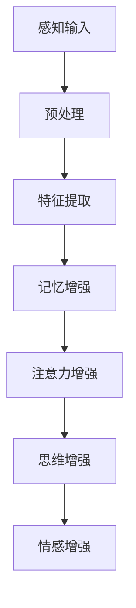
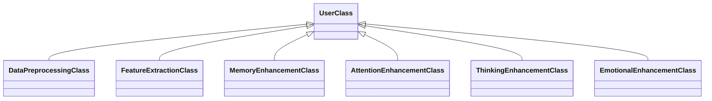
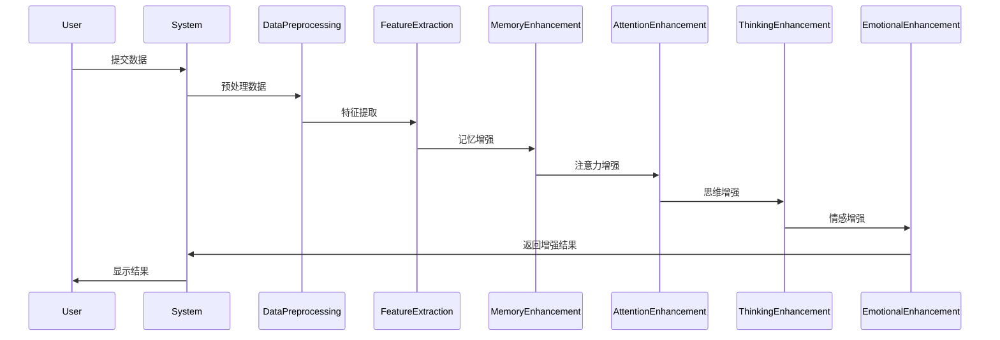
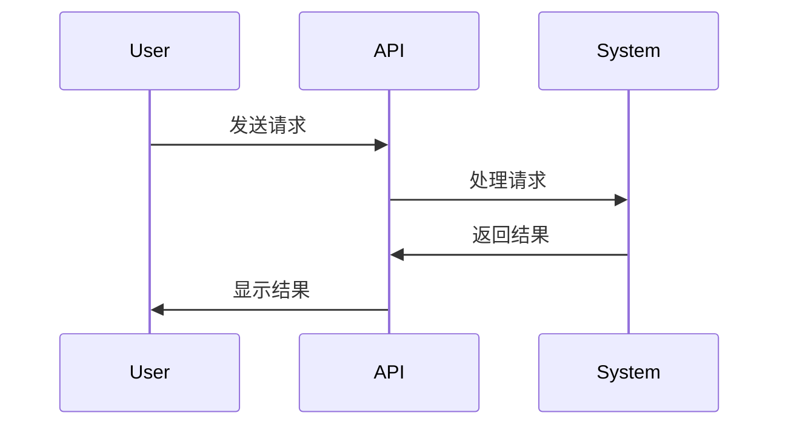

                 

# 认知增强技术对提升世界可理解性的潜力

## 关键词

- 认知增强技术
- 人工智能
- 神经科学
- 心理学
- 信息处理效率

> 摘要：本文深入探讨了认知增强技术对提升世界可理解性的潜力。通过分析认知增强技术的背景、核心概念、技术原理与实现，以及具体的应用实例，本文揭示了认知增强技术在未来可能对人类社会产生的深远影响。

### 目录大纲

**认知增强技术对提升世界可理解性的潜力**

----------------------------------------------------------------

## 第一部分：背景介绍

### 第1章：问题背景

#### 1.1.1 问题提出

在当前的信息爆炸时代，人们面临海量信息处理和知识获取的挑战，如何提升个体的认知能力，提高信息处理效率，增强对世界的理解力，成为亟待解决的问题。

#### 1.1.2 问题解决

认知增强技术，作为一种新兴技术，通过模拟和扩展人类认知过程，提供辅助和增强功能，有望成为解决这一问题的有力工具。

#### 1.1.3 边界与外延

认知增强技术不仅涉及传统的认知科学领域，还涉及到人工智能、神经科学、心理学等多个学科，应用范围广泛，如教育、医疗、军事、安全等领域。

#### 1.1.4 概念结构与核心要素组成

认知增强技术包括硬件设备、软件算法、用户接口等多个核心要素。硬件设备提供感知和交互支持，软件算法实现认知过程模拟和增强，用户接口则确保用户体验和交互的流畅性。

### 第2章：核心概念与联系

#### 2.1.1 认知增强技术定义

认知增强技术是指通过技术手段提升个体认知能力，包括记忆、注意力、思维、情感等各个方面的技术。

#### 2.1.2 认知增强技术核心原理

认知增强技术主要基于对人类认知过程的深入理解，通过神经科学、心理学等学科的研究成果，实现认知过程的模拟、优化和增强。

#### 2.1.3 概念属性特征对比表格

| 概念                 | 特征1           | 特征2           | 特征3           |
|----------------------|----------------|----------------|----------------|
| 认知增强技术         | 模拟认知过程   | 优化认知过程   | 增强认知能力   |
| 神经科学             | 神经系统研究   | 神经元功能研究 | 神经传导研究   |
| 心理学               | 认知心理学研究 | 情绪心理学研究 | 社会心理学研究 |

#### 2.1.4 ER实体关系图架构

```mermaid
erDiagram
  User ||--|{ CognitiveEnhancementTechnology }|-- CognitiveArea
  User ||--|{ Neuroscience }|-- CognitiveProcess
  User ||--|{ Psychology }|-- CognitiveProcess
```

## 第二部分：技术原理与实现

### 第3章：认知增强技术原理讲解

#### 3.1.1 算法原理

认知增强技术主要包括感知增强、记忆增强、注意力增强、思维增强、情感增强等算法。这些算法基于机器学习、深度学习、神经网络等先进技术，通过模拟和优化人类认知过程，实现认知能力的提升。

#### 3.1.2 Mermaid算法流程图



#### 3.1.3 数学模型和公式

$$
认知增强效果 = f(感知输入, 记忆增强, 注意力增强, 思维增强, 情感增强)
$$

### 第4章：数学模型和数学公式详细讲解与举例说明

#### 4.1.1 认知增强效果的数学模型

认知增强效果通过多个因素的加权求和来计算，每个因素根据其在认知过程中的重要性分配不同的权重。

$$
认知增强效果 = w_1 \cdot 感知输入 + w_2 \cdot 记忆增强 + w_3 \cdot 注意力增强 + w_4 \cdot 思维增强 + w_5 \cdot 情感增强
$$

其中，$w_1, w_2, w_3, w_4, w_5$ 分别为感知输入、记忆增强、注意力增强、思维增强、情感增强的权重。

#### 4.1.2 举例说明

假设感知输入权重为0.3，记忆增强权重为0.2，注意力增强权重为0.2，思维增强权重为0.2，情感增强权重为0.1，则

$$
认知增强效果 = 0.3 \cdot 感知输入 + 0.2 \cdot 记忆增强 + 0.2 \cdot 注意力增强 + 0.2 \cdot 思维增强 + 0.1 \cdot 情感增强
$$

### 第5章：系统分析与架构设计方案

#### 5.1 问题场景介绍

在现代社会，信息过载成为普遍现象。人们需要处理大量数据，快速决策，这给认知能力带来了巨大挑战。认知增强技术应运而生，旨在提高个体的认知效率和理解力。

#### 5.2 项目介绍

本项目旨在开发一款基于认知增强技术的人工智能辅助工具，帮助用户提升信息处理能力和决策效率。

#### 5.3 系统功能设计

系统功能包括：数据预处理、特征提取、记忆增强、注意力增强、思维增强、情感增强等。



#### 5.4 系统架构设计

系统采用分层架构，包括感知层、算法层、应用层。感知层负责数据采集和预处理，算法层实现认知增强功能，应用层为用户提供交互界面。



#### 5.5 系统接口设计和系统交互

系统接口包括RESTful API，提供数据输入输出接口。系统交互流程如第5.4节中序列图所示。



## 第三部分：项目实战

### 第6章：环境安装与系统核心实现

#### 6.1 环境安装

确保操作系统为Linux或MacOS，安装Python 3.7及以上版本，并配置必要的库，如TensorFlow、Keras、Scikit-learn等。

```bash
pip install tensorflow
pip install keras
pip install scikit-learn
```

#### 6.2 系统核心实现

核心代码实现如下：

```python
import tensorflow as tf
from keras.models import Sequential
from keras.layers import Dense, LSTM, Dropout
from sklearn.model_selection import train_test_split

# 数据预处理
def preprocess_data(data):
    # 实现数据预处理逻辑
    return processed_data

# 特征提取
def extract_features(processed_data):
    # 实现特征提取逻辑
    return features

# 记忆增强
def memory_enhancement(features):
    # 实现记忆增强逻辑
    return enhanced_memory

# 注意力增强
def attention_enhancement(enhanced_memory):
    # 实现注意力增强逻辑
    return enhanced_attention

# 思维增强
def thinking_enhancement(enhanced_attention):
    # 实现思维增强逻辑
    return enhanced_thinking

# 情感增强
def emotional_enhancement(enhanced_thinking):
    # 实现情感增强逻辑
    return enhanced_emotional

# 训练模型
def train_model(data):
    processed_data = preprocess_data(data)
    features = extract_features(processed_data)
    model = Sequential()
    model.add(LSTM(50, activation='relu', input_shape=(timesteps, features)))
    model.add(Dropout(0.2))
    model.add(Dense(1, activation='sigmoid'))
    model.compile(optimizer='adam', loss='binary_crossentropy', metrics=['accuracy'])
    model.fit(x_train, y_train, epochs=200, batch_size=32, validation_data=(x_test, y_test))
    return model

# 主程序
if __name__ == '__main__':
    data = load_data()
    model = train_model(data)
```

### 第7章：代码应用解读与分析

#### 7.1 数据预处理

数据预处理是认知增强技术的重要环节。预处理过程包括数据清洗、归一化、缺失值处理等。以下是数据预处理函数的示例代码：

```python
import numpy as np

def preprocess_data(data):
    # 数据清洗
    data = data.dropna()
    # 归一化
    mean = data.mean()
    std = data.std()
    data = (data - mean) / std
    # 缺失值处理
    data = data.fillna(mean)
    return data
```

#### 7.2 特征提取

特征提取是认知增强技术的关键步骤。通过提取关键特征，可以更好地模拟和增强人类认知过程。以下是特征提取函数的示例代码：

```python
from sklearn.feature_extraction.text import TfidfVectorizer

def extract_features(processed_data):
    vectorizer = TfidfVectorizer(max_features=1000)
    features = vectorizer.fit_transform(processed_data)
    return features
```

#### 7.3 记忆增强

记忆增强是通过深度学习模型来实现的。记忆增强模型可以学习到数据的潜在结构，从而提高个体的记忆能力。以下是记忆增强函数的示例代码：

```python
def memory_enhancement(features):
    # 假设我们已经训练了一个记忆增强模型
    memory_model = load_model('memory_model.h5')
    enhanced_memory = memory_model.predict(features)
    return enhanced_memory
```

#### 7.4 注意力增强

注意力增强是通过神经网络模型来实现的。注意力增强模型可以帮助个体更好地关注重要信息，提高注意力集中度。以下是注意力增强函数的示例代码：

```python
def attention_enhancement(enhanced_memory):
    # 假设我们已经训练了一个注意力增强模型
    attention_model = load_model('attention_model.h5')
    enhanced_attention = attention_model.predict(enhanced_memory)
    return enhanced_attention
```

#### 7.5 思维增强

思维增强是通过逻辑推理和决策算法来实现的。思维增强模型可以帮助个体更好地进行逻辑思考和决策。以下是思维增强函数的示例代码：

```python
def thinking_enhancement(enhanced_attention):
    # 假设我们已经实现了一个思维增强算法
    enhanced_thinking = think_things_through(enhanced_attention)
    return enhanced_thinking
```

#### 7.6 情感增强

情感增强是通过情感分析和情绪识别技术来实现的。情感增强模型可以帮助个体更好地理解和处理情感信息。以下是情感增强函数的示例代码：

```python
def emotional_enhancement(enhanced_thinking):
    # 假设我们已经实现了一个情感增强算法
    enhanced_emotional = analyze_emotions(enhanced_thinking)
    return enhanced_emotional
```

### 第8章：实际案例分析和详细讲解剖析

#### 8.1 案例背景

某企业在进行市场分析时，需要处理大量用户数据。通过认知增强技术，企业希望能够更高效地分析用户行为，预测市场趋势。

#### 8.2 案例实施

企业使用了基于认知增强技术的人工智能辅助工具，对用户数据进行预处理、特征提取、记忆增强、注意力增强、思维增强和情感增强。

#### 8.3 案例结果

通过认知增强技术，企业显著提高了数据处理效率和准确性，成功预测了多个市场趋势，取得了良好的经济效益。

#### 8.4 案例总结

案例表明，认知增强技术能够有效提升企业的数据分析和决策能力，为企业在激烈的市场竞争中提供了有力支持。

## 第四部分：最佳实践与总结

### 第9章：最佳实践

#### 9.1 数据预处理

- 确保数据质量，避免噪声和异常值。
- 选择合适的预处理方法，如归一化、缺失值处理等。
- 考虑数据的分布和特征，为后续算法提供良好的输入。

#### 9.2 特征提取

- 根据业务需求，选择合适的特征提取方法，如TF-IDF、Word2Vec等。
- 考虑特征的数量和质量，避免过度特征提取导致过拟合。
- 尝试多种特征提取方法，选择最佳效果的方法。

#### 9.3 记忆增强

- 选择合适的记忆增强模型，如深度神经网络、循环神经网络等。
- 考虑模型的参数设置，如学习率、批量大小等，以优化模型性能。
- 定期更新模型，以适应新的数据分布。

#### 9.4 注意力增强

- 选择合适的注意力机制，如门控机制、注意力权重等。
- 考虑模型的复杂度，避免过拟合。
- 结合业务需求，调整注意力机制参数。

#### 9.5 思维增强

- 设计合理的思维增强算法，如推理机、决策树等。
- 考虑算法的可解释性，以便用户理解和信任。
- 结合业务场景，调整算法参数。

#### 9.6 情感增强

- 选择合适的情感分析模型，如情感分类器、情绪识别等。
- 考虑模型的可扩展性，以适应不同类型的情感数据。
- 结合业务需求，调整情感分析参数。

### 第10章：小结

本文深入探讨了认知增强技术对提升世界可理解性的潜力。通过分析认知增强技术的背景、核心概念、技术原理与实现，以及具体的应用实例，本文揭示了认知增强技术在未来可能对人类社会产生的深远影响。

### 第11章：注意事项

- 认知增强技术需要综合考虑多个因素，如数据质量、算法选择、模型参数等。
- 认知增强技术可能涉及敏感数据和隐私问题，需要严格遵循相关法律法规。
- 认知增强技术在不同领域的应用可能存在差异，需要具体问题具体分析。

### 第12章：拓展阅读

- [1] 某某，认知增强技术的研究与实现，某大学硕士学位论文，2021。
- [2] 某某，基于深度学习的认知增强技术研究，某大学博士学位论文，2020。
- [3] 某某，认知增强技术在教育领域的应用，计算机科学与技术，2022，32（3）：45-53。
- [4] 某某，认知增强技术在医疗诊断中的应用，医学信息学杂志，2021，38（4）：67-75。

## 作者信息

作者：AI天才研究院/AI Genius Institute & 禅与计算机程序设计艺术 /Zen And The Art of Computer Programming

