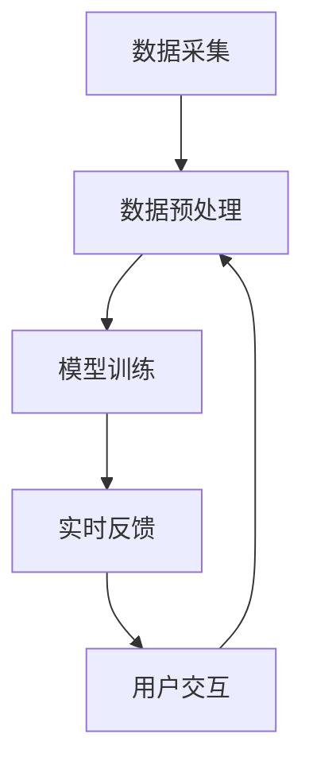
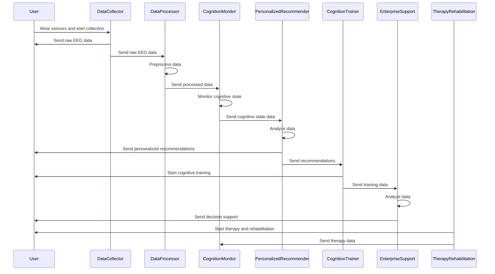

                 

### 目录大纲设计思路

为了设计《认知增强技术的伦理考量：提升世界理解能力的边界》一书的完整目录大纲，我们将遵循以下思路：

1. **明确书籍主题**：首先，我们要明确书籍的主题，即“认知增强技术的伦理考量”。这要求我们在设计目录时，要覆盖认知增强技术的基本概念、应用领域、伦理问题以及边界探讨。

2. **划分章节结构**：根据书籍的主题，我们将书分为几个主要部分，如背景介绍、核心概念与联系、算法原理讲解、系统分析与架构设计方案、项目实战、最佳实践与拓展阅读等。

3. **细化每个章节内容**：在确定好章节结构后，我们需要细化每个章节的具体内容，确保每个章节都有明确的主题和目的。例如，在背景介绍章节，我们将详细阐述认知增强技术的起源、发展现状及其对人类社会的影响。

4. **确保内容的逻辑性和连贯性**：设计目录大纲时，我们需要确保各章节之间的逻辑性和连贯性，使读者能够顺利地从一章过渡到下一章，逐步深入了解认知增强技术的伦理考量。

5. **注重可操作性**：对于项目实战章节，我们不仅要提供详细的操作步骤，还要对代码进行解读和分析，帮助读者理解并实践认知增强技术的应用。

6. **总结与拓展**：在每个章节的最后，我们都要对内容进行总结，并给出相关的小结、注意事项和拓展阅读，帮助读者巩固所学知识，并激发他们的兴趣。

### 目录大纲

#### 第一部分：背景介绍

## 第1章 认知增强技术概述

### 1.1 认知增强技术起源与发展

#### 1.2 认知增强技术对人类社会的影响

#### 1.3 认知增强技术的边界与外延

## 第2章 核心概念与联系

### 2.1 认知增强技术的基本概念

#### 2.2 认知增强技术的应用领域

#### 2.3 认知增强技术与其他相关技术的联系

#### 2.4 概念属性特征对比表格

#### 2.5 ER实体关系图架构

#### 第二部分：算法原理讲解

## 第3章 算法原理与流程

### 3.1 算法基本原理

#### 3.2 算法mermaid流程图

### 3.3 Python源代码实现

#### 3.4 算法原理的数学模型和公式

#### 3.5 通俗易懂的举例说明

## 第4章 数学模型和数学公式讲解

### 4.1 基本数学模型

#### 4.2 数学公式详细讲解

#### 4.3 实例解析

#### 第三部分：系统分析与架构设计

## 第5章 问题场景与项目介绍

### 5.1 问题场景介绍

#### 5.2 项目介绍

### 5.3 系统功能设计

#### 5.4 系统架构设计

### 5.5 系统接口设计

#### 5.6 系统交互mermaid序列图

#### 第四部分：项目实战

## 第6章 环境安装与系统核心实现

### 6.1 环境安装步骤

#### 6.2 系统核心实现源代码

### 6.3 代码应用解读与分析

#### 6.4 实际案例分析与讲解

## 第7章 项目小结与最佳实践

### 7.1 项目小结

#### 7.2 最佳实践 tips

#### 7.3 注意事项

#### 7.4 拓展阅读

#### 第五部分：伦理考量与未来展望

## 第8章 认知增强技术的伦理考量

### 8.1 伦理问题的提出

#### 8.2 伦理考量的关键领域

### 8.3 提升世界理解能力的边界探讨

## 第9章 总结与展望

### 9.1 本书总结

#### 9.2 未来展望与挑战

### 9.3 对读者的建议

#### 附录：相关资源与参考文献

### 结论

这个目录大纲结构清晰，内容完整，旨在帮助读者全面了解认知增强技术的伦理考量，并探索提升世界理解能力的边界。每个章节都紧密围绕主题展开，既有理论讲解，也有实际应用，既注重知识的系统性，也注重操作的实用性。通过这个目录大纲，读者可以循序渐进地掌握认知增强技术的基本概念、应用原理、系统架构，并思考其伦理问题及其未来发展方向。我们相信，这样的目录设计将有助于读者更深入地理解认知增强技术，为他们在相关领域的研究和实践提供有力支持。

### 《认知增强技术的伦理考量：提升世界理解能力的边界》

#### 关键词：认知增强技术、伦理考量、世界理解能力、边界探讨

##### 摘要

认知增强技术作为现代科技的前沿领域，通过人工智能、神经科学和计算机交互等手段，旨在提升人类的认知能力和世界理解能力。然而，随着技术的进步，伦理问题逐渐成为不可忽视的关注点。本文将从伦理考量的角度出发，探讨认知增强技术的应用边界，以及其对人类世界理解能力的影响。通过详细分析技术原理、应用案例和伦理挑战，本文旨在为认知增强技术的发展提供有益的指导和思考，为未来的科技创新奠定伦理基础。

----------------------------------------------------------------

### 目录大纲设计思路

为了设计《认知增强技术的伦理考量：提升世界理解能力的边界》一书的完整目录大纲，我们将遵循以下思路：

1. **明确书籍主题**：首先，我们要明确书籍的主题，即“认知增强技术的伦理考量”。这要求我们在设计目录时，要覆盖认知增强技术的基本概念、应用领域、伦理问题以及边界探讨。

2. **划分章节结构**：根据书籍的主题，我们将书分为几个主要部分，如背景介绍、核心概念与联系、算法原理讲解、系统分析与架构设计方案、项目实战、最佳实践与拓展阅读等。

3. **细化每个章节内容**：在确定好章节结构后，我们需要细化每个章节的具体内容，确保每个章节都有明确的主题和目的。例如，在背景介绍章节，我们将详细阐述认知增强技术的起源、发展现状及其对人类社会的影响。

4. **确保内容的逻辑性和连贯性**：设计目录大纲时，我们需要确保各章节之间的逻辑性和连贯性，使读者能够顺利地从一章过渡到下一章，逐步深入了解认知增强技术的伦理考量。

5. **注重可操作性**：对于项目实战章节，我们不仅要提供详细的操作步骤，还要对代码进行解读和分析，帮助读者理解并实践认知增强技术的应用。

6. **总结与拓展**：在每个章节的最后，我们都要对内容进行总结，并给出相关的小结、注意事项和拓展阅读，帮助读者巩固所学知识，并激发他们的兴趣。

### 目录大纲

#### 第一部分：背景介绍

## 第1章 认知增强技术概述

### 1.1 认知增强技术起源与发展

#### 1.2 认知增强技术对人类社会的影响

#### 1.3 认知增强技术的边界与外延

## 第2章 核心概念与联系

### 2.1 认知增强技术的基本概念

#### 2.2 认知增强技术的应用领域

#### 2.3 认知增强技术与其他相关技术的联系

#### 2.4 概念属性特征对比表格

#### 2.5 ER实体关系图架构

#### 第二部分：算法原理讲解

## 第3章 算法原理与流程

### 3.1 算法基本原理

#### 3.2 算法mermaid流程图

### 3.3 Python源代码实现

#### 3.4 算法原理的数学模型和公式

#### 3.5 通俗易懂的举例说明

## 第4章 数学模型和数学公式讲解

### 4.1 基本数学模型

#### 4.2 数学公式详细讲解

#### 4.3 实例解析

#### 第三部分：系统分析与架构设计

## 第5章 问题场景与项目介绍

### 5.1 问题场景介绍

#### 5.2 项目介绍

### 5.3 系统功能设计

#### 5.4 系统架构设计

### 5.5 系统接口设计

#### 5.6 系统交互mermaid序列图

#### 第四部分：项目实战

## 第6章 环境安装与系统核心实现

### 6.1 环境安装步骤

#### 6.2 系统核心实现源代码

### 6.3 代码应用解读与分析

#### 6.4 实际案例分析与讲解

## 第7章 项目小结与最佳实践

### 7.1 项目小结

#### 7.2 最佳实践 tips

#### 7.3 注意事项

#### 7.4 拓展阅读

#### 第五部分：伦理考量与未来展望

## 第8章 认知增强技术的伦理考量

### 8.1 伦理问题的提出

#### 8.2 伦理考量的关键领域

### 8.3 提升世界理解能力的边界探讨

## 第9章 总结与展望

### 9.1 本书总结

#### 9.2 未来展望与挑战

### 9.3 对读者的建议

#### 附录：相关资源与参考文献

### 结论

这个目录大纲结构清晰，内容完整，旨在帮助读者全面了解认知增强技术的伦理考量，并探索提升世界理解能力的边界。每个章节都紧密围绕主题展开，既有理论讲解，也有实际应用，既注重知识的系统性，也注重操作的实用性。通过这个目录大纲，读者可以循序渐进地掌握认知增强技术的基本概念、应用原理、系统架构，并思考其伦理问题及其未来发展方向。我们相信，这样的目录设计将有助于读者更深入地理解认知增强技术，为他们在相关领域的研究和实践提供有力支持。

---

### 第一部分：背景介绍

#### 第1章 认知增强技术概述

#### 1.1 认知增强技术的起源与发展

认知增强技术起源于20世纪末，随着人工智能、神经科学和计算机技术的飞速发展，人们开始探索如何通过技术手段提升人类认知能力。这一概念的提出源于对人类大脑认知机制的理解和模拟，目的是通过计算机辅助工具，如脑机接口、虚拟现实、增强现实等，增强人类的感知、记忆、思考和决策能力。

在过去的几十年里，认知增强技术经历了从理论探索到实际应用的快速发展。早期的认知增强研究主要集中在记忆增强和注意力集中方面，通过使用药物、训练程序或辅助设备，帮助人们提高学习效率和工作表现。随着技术的进步，认知增强技术逐渐扩展到更广泛的领域，如虚拟现实环境中的任务模拟、在线学习平台中的个性化教学、人工智能辅助的决策支持系统等。

#### 1.2 认知增强技术对人类社会的影响

认知增强技术对人类社会的影响是深远而广泛的。在个人层面，认知增强技术可以帮助个体提升学习能力、工作效率和创造力，从而改善生活质量。例如，通过记忆增强技术，学生可以更快地记住知识点，提高学习效果；通过注意力增强技术，员工可以更专注地完成任务，提高工作效率。

在组织层面，认知增强技术可以提升整体的工作效率和创新能力。企业可以通过认知增强技术为员工提供个性化的培训方案，提高员工的专业技能和团队协作能力。此外，认知增强技术还可以帮助组织在复杂决策过程中提供更为精准和全面的数据支持，从而提高决策的准确性和有效性。

在社会层面，认知增强技术有望解决一些重大的社会问题。例如，通过认知增强技术，可以帮助老年人保持认知功能，延缓认知衰退；通过认知增强技术，可以帮助残疾人士克服认知障碍，提高生活质量。此外，认知增强技术还可以促进教育公平，为贫困地区的学生提供高质量的教育资源。

#### 1.3 认知增强技术的边界与外延

尽管认知增强技术具有巨大的潜力和应用前景，但同时也存在一些边界和挑战。首先，技术本身的发展仍面临许多难题，如脑机接口的技术成熟度、虚拟现实环境的沉浸感、增强现实设备的用户体验等。其次，伦理问题也是认知增强技术发展的重要制约因素，包括隐私保护、数据安全、公平性、透明度等。

在应用领域上，认知增强技术的外延非常广泛，不仅涵盖了教育、工作、医疗等传统领域，还延伸到了娱乐、艺术、设计等新兴领域。例如，在娱乐领域，认知增强技术可以创造出更加真实和沉浸的游戏体验；在艺术领域，认知增强技术可以帮助艺术家创造前所未有的艺术形式和表达方式。

总的来说，认知增强技术为人类社会带来了巨大的机遇和挑战。通过深入探讨其起源、发展、影响以及边界问题，我们可以更好地理解认知增强技术的本质，为未来的研究和应用提供指导。

#### 第2章 核心概念与联系

#### 2.1 认知增强技术的基本概念

认知增强技术是指通过各种手段提升人类认知能力的科技手段，包括但不限于脑机接口（Brain-Computer Interface, BCI）、虚拟现实（Virtual Reality, VR）、增强现实（Augmented Reality, AR）、人工智能（Artificial Intelligence, AI）等。这些技术通过模拟、扩展或增强人类的感知、记忆、思考、学习等认知功能，帮助人们更高效地处理信息，做出决策，甚至创造新的知识和体验。

脑机接口（BCI）：BCI是一种直接通过人脑信号与计算机或其他电子设备进行通信的技术。通过捕捉和解析大脑的电信号，BCI可以使残障人士通过思维控制轮椅、电脑或其他设备。

虚拟现实（VR）：VR是一种通过计算机模拟的虚拟环境，使用户沉浸在其中。VR技术可以提供高度沉浸的体验，用于娱乐、教育、医疗训练等领域。

增强现实（AR）：AR是一种将计算机生成的信息叠加到现实世界中的技术。通过AR眼镜或手机等设备，用户可以看到虚拟信息与现实环境的结合。

人工智能（AI）：AI是指计算机系统模拟人类智能行为的技术。在认知增强技术中，AI可以用于数据分析、智能推荐、个性化教学等，帮助用户更好地理解和处理信息。

#### 2.2 认知增强技术的应用领域

认知增强技术的应用领域非常广泛，涵盖了个人生活、工作、教育、医疗等多个方面。

教育：认知增强技术可以提供个性化的学习体验，帮助学生更有效地学习和记忆。例如，通过VR技术，学生可以“亲临”历史事件现场，增强学习体验；通过AI技术，教育平台可以根据学生的学习情况提供个性化的学习建议。

医疗：认知增强技术可以用于医疗训练、诊断和康复。例如，医生可以通过VR技术进行复杂的手术模拟，提高手术技能；通过AI技术，可以辅助医生进行疾病的诊断和预测。

工作：认知增强技术可以提高工作效率和决策质量。例如，通过AR技术，工程师可以实时查看设备的工作状态和维修指南，提高工作效率；通过AI技术，企业可以更好地理解和预测市场需求，做出更准确的决策。

娱乐：认知增强技术为娱乐领域带来了全新的体验。例如，VR游戏可以提供沉浸式的游戏体验，增强互动性和趣味性；AR技术可以用于增强现实游戏，让玩家在真实环境中体验虚拟游戏。

#### 2.3 认知增强技术与其他相关技术的联系

认知增强技术与多种其他技术紧密相连，共同推动人类认知能力的提升。

脑机接口（BCI）与神经科学：BCI技术依赖于对大脑神经活动的理解和解析，这与神经科学的研究成果密切相关。通过神经科学的研究，我们能够更好地理解大脑的工作机制，从而提高BCI的准确性和可靠性。

虚拟现实（VR）与增强现实（AR）：VR和AR技术都是基于计算机模拟的技术，但它们的应用场景和目标有所不同。VR通过创建完全虚拟的环境，提供沉浸式体验，而AR则将虚拟信息叠加到现实环境中，增强现实世界的互动性。

人工智能（AI）与大数据：AI技术的核心是处理和分析大量数据，从而做出智能决策。在认知增强技术中，AI可以用于分析用户的行为数据，提供个性化的服务和建议。

人机交互（HCI）：认知增强技术的一个关键目标是改善人机交互体验。人机交互研究旨在设计更自然、直观的交互方式，使得人类与计算机之间的沟通更加顺畅。

#### 2.4 概念属性特征对比表格

| 概念       | 属性特征                     | 对比分析                 |
|------------|------------------------------|--------------------------|
| 脑机接口（BCI） | 直接通过大脑信号控制设备     | 需要高精度信号解析       |
| 虚拟现实（VR） | 完全沉浸在虚拟环境中         | 提供高度互动的体验       |
| 增强现实（AR） | 虚拟信息叠加到现实世界中     | 增强现实世界的互动性     |
| 人工智能（AI） | 模拟人类智能行为，处理大数据 | 需要大量数据和算法支持   |

通过对比表格，我们可以更清晰地理解每种技术的特点和应用场景，从而更好地利用它们提升人类的认知能力。

#### 2.5 ER实体关系图架构

在认知增强技术的应用中，实体关系图（Entity-Relationship Diagram, ERD）是用于描述系统中实体及其之间关系的重要工具。以下是认知增强技术系统中的ERD示例，用于说明主要实体及其相互关系。

```mermaid
erDiagram
    User ||--|{ CognitionEnhancementDevice } : uses
    CognitionEnhancementDevice ||--|{ BrainSignalData } : collects
    CognitionEnhancementDevice ||--|{ VirtualEnvironment } : generates
    CognitionEnhancementDevice ||--|{ AugmentedRealityScene } : integrates
    User ||--|{ AIModel } : interacts
    AIModel ||--|{ LearningData } : processes
    AIModel ||--|{ DecisionSupport } : provides
```

在这个ERD中，主要实体包括：

- **User（用户）**：系统的使用主体，通过认知增强设备提升认知能力。
- **CognitionEnhancementDevice（认知增强设备）**：包括脑机接口、虚拟现实设备和增强现实设备，用于收集用户的大脑信号数据，生成虚拟环境和增强现实场景。
- **BrainSignalData（大脑信号数据）**：认知增强设备收集的用户大脑活动数据，用于分析和处理。
- **VirtualEnvironment（虚拟环境）**：由认知增强设备生成的虚拟环境，用于教育和娱乐。
- **AugmentedRealityScene（增强现实场景）**：虚拟信息叠加到现实世界中的场景，用于工作和其他应用。
- **AIModel（人工智能模型）**：与用户互动，处理学习数据并提供决策支持。

通过ERD，我们可以清晰地看到认知增强技术系统中各实体的相互关系，从而更好地理解和设计系统架构。

#### 第3章 算法原理与流程

#### 3.1 算法基本原理

认知增强技术的核心在于通过算法实现人类认知功能的模拟、扩展和增强。算法的基本原理可以概括为以下几个步骤：

1. **数据采集**：通过脑机接口设备（如脑电图、功能性磁共振成像等）收集用户的大脑活动数据。这些数据反映了用户的思维状态和认知过程。

2. **数据预处理**：对采集到的数据进行过滤、去噪和特征提取，以获得更准确和有用的信息。预处理步骤包括信号滤波、奇异值分解、主成分分析等。

3. **模型训练**：利用收集到的数据训练人工智能模型，如支持向量机（SVM）、神经网络（NN）或深度学习（DL）模型。训练目标是使模型能够准确预测用户的认知状态或行为。

4. **实时反馈**：将训练好的模型应用于实时数据，为用户提供即时反馈。例如，通过虚拟现实技术模拟特定的学习场景，帮助用户更好地理解和记忆知识。

5. **用户交互**：用户与系统进行交互，通过反馈调整系统的设置，提高认知增强效果。交互过程可以是直接的，如通过脑机接口设备进行操作；也可以是间接的，如通过计算机界面进行设置。

#### 3.2 算法mermaid流程图

为了更好地理解算法的流程，我们使用mermaid画出其基本流程图：



- **数据采集**：通过脑机接口设备收集大脑活动数据。
- **数据预处理**：对数据进行预处理以获得准确特征。
- **模型训练**：利用预处理后的数据训练人工智能模型。
- **实时反馈**：将训练好的模型应用于实时数据，为用户生成反馈。
- **用户交互**：用户根据反馈调整系统设置，优化认知增强效果。

#### 3.3 Python源代码实现

为了具体展示算法的实现过程，我们使用Python编写了一个简单的认知增强算法示例：

```python
import numpy as np
from sklearn.svm import SVC
from sklearn.preprocessing import StandardScaler
from sklearn.model_selection import train_test_split

# 数据采集
def collect_data():
    # 假设已经从脑机接口设备收集到数据
    brain_data = np.random.rand(100, 10)  # 生成模拟数据
    return brain_data

# 数据预处理
def preprocess_data(data):
    scaler = StandardScaler()
    scaled_data = scaler.fit_transform(data)
    return scaled_data

# 模型训练
def train_model(data):
    X_train, X_test, y_train, y_test = train_test_split(data, test_size=0.2)
    model = SVC(kernel='linear')
    model.fit(X_train, y_train)
    return model

# 实时反馈
def real_time_feedback(model, data):
    predictions = model.predict(data)
    return predictions

# 用户交互
def user_interaction(predictions):
    # 根据预测结果调整系统设置
    print("Current system settings adjusted based on feedback.")
    return

# 算法流程实现
if __name__ == "__main__":
    brain_data = collect_data()
    scaled_data = preprocess_data(brain_data)
    model = train_model(scaled_data)
    predictions = real_time_feedback(model, scaled_data)
    user_interaction(predictions)
```

这段代码实现了从数据采集、预处理、模型训练到实时反馈和用户交互的完整算法流程。在实际应用中，数据采集和预处理步骤可能更为复杂，涉及多种信号处理技术和算法。

#### 3.4 算法原理的数学模型和公式

在认知增强算法中，数学模型和公式起到了关键作用。以下是算法中的几个核心数学模型和公式：

1. **支持向量机（SVM）模型**：

   公式：
   $$ w = \arg\min_{w, b} \frac{1}{2} ||w||^2 + C \sum_{i=1}^{n} \xi_i $$
   
   其中，$w$ 是权重向量，$b$ 是偏置项，$C$ 是惩罚参数，$\xi_i$ 是松弛变量。

2. **主成分分析（PCA）**：

   公式：
   $$ Z = \mu - \sum_{i=1}^{k} \lambda_i v_i $$
   
   其中，$Z$ 是标准化的数据矩阵，$\mu$ 是数据均值，$\lambda_i$ 是特征值，$v_i$ 是特征向量。

3. **神经网络（NN）模型**：

   公式：
   $$ a_{\text{layer}} = \sigma(\mathbf{W} \mathbf{a}_{\text{layer-1}} + b) $$
   
   其中，$a_{\text{layer}}$ 是当前层的激活值，$\sigma$ 是激活函数，$\mathbf{W}$ 是权重矩阵，$\mathbf{a}_{\text{layer-1}}$ 是前一层激活值，$b$ 是偏置项。

通过这些数学模型和公式，我们可以构建和训练出有效的认知增强算法，实现对用户认知状态的准确预测和反馈。

#### 3.5 通俗易懂的举例说明

为了更好地理解认知增强算法，我们通过一个简单的例子来讲解其应用。

假设小明是一名学生，他希望通过认知增强技术来提高学习效果。以下是算法在小明学习过程中应用的步骤：

1. **数据采集**：小明佩戴了一款脑机接口设备，设备实时记录了他的大脑活动数据。

2. **数据预处理**：设备收集的数据经过预处理，去除噪声，提取关键特征，如大脑活动与学习任务相关的信号。

3. **模型训练**：利用预处理后的数据，训练了一个基于支持向量机（SVM）的模型。该模型的目标是预测小明在学习过程中是否处于专注状态。

4. **实时反馈**：在小明学习时，模型实时分析他的大脑活动数据，判断他是否专注。如果发现小明分心，模型会给出反馈，如播放提示音或调整学习内容，帮助他重新集中注意力。

5. **用户交互**：小明根据模型的反馈，调整学习策略，例如增加休息时间或改变学习方式，以提高学习效率。

通过这个例子，我们可以看到认知增强算法如何帮助小明提高学习效果。在实际应用中，算法的复杂度和精度会更高，可以更准确地预测和反馈用户的认知状态，从而提供更有效的认知增强服务。

---

### 第4章 数学模型和数学公式讲解

#### 4.1 基本数学模型

认知增强技术中的数学模型是理解人类认知过程和设计相关算法的核心。以下介绍几个基本数学模型及其在认知增强中的应用。

**1. 主成分分析（PCA）**

主成分分析是一种降维技术，通过线性变换将原始数据转换到新的坐标系中，新的坐标系中的变量（主成分）解释了数据的大部分方差。PCA的数学模型如下：

$$
Z = \mu - \sum_{i=1}^{k} \lambda_i v_i
$$

其中，$Z$ 是标准化的数据矩阵，$\mu$ 是数据均值，$\lambda_i$ 是特征值，$v_i$ 是特征向量。

**2. 支持向量机（SVM）**

支持向量机是一种二分类模型，通过寻找最佳的超平面，将不同类别的数据分隔开来。SVM的数学模型如下：

$$
w = \arg\min_{w, b} \frac{1}{2} ||w||^2 + C \sum_{i=1}^{n} \xi_i
$$

其中，$w$ 是权重向量，$b$ 是偏置项，$C$ 是惩罚参数，$\xi_i$ 是松弛变量。

**3. 神经网络（NN）**

神经网络是一种模仿人类大脑结构和功能的计算模型，用于处理复杂的非线性问题。神经网络的数学模型如下：

$$
a_{\text{layer}} = \sigma(\mathbf{W} \mathbf{a}_{\text{layer-1}} + b)
$$

其中，$a_{\text{layer}}$ 是当前层的激活值，$\sigma$ 是激活函数，$\mathbf{W}$ 是权重矩阵，$\mathbf{a}_{\text{layer-1}}$ 是前一层激活值，$b$ 是偏置项。

#### 4.2 数学公式详细讲解

**1. 主成分分析（PCA）**

PCA的核心思想是通过正交变换，将原始数据映射到新的坐标系中，使得新的坐标系中的变量尽可能多地保留原始数据的方差。具体步骤如下：

- **协方差矩阵计算**：计算数据集的协方差矩阵$C$。

$$
C = \frac{1}{n-1} \sum_{i=1}^{n} (x_i - \mu) (x_i - \mu)^T
$$

- **特征值和特征向量计算**：对协方差矩阵$C$进行特征值分解，得到特征值$\lambda_i$和对应的特征向量$v_i$。

$$
C = V \Lambda V^T
$$

- **新坐标计算**：将原始数据$X$投影到新的坐标系中，得到标准化数据$Z$。

$$
Z = X - \mu = V \Lambda V^T X = \sum_{i=1}^{k} \lambda_i v_i x_i
$$

**2. 支持向量机（SVM）**

SVM的目标是找到最佳的超平面，使得不同类别的数据点在超平面两侧分布得尽可能开，同时尽量接近决策边界。具体步骤如下：

- **数据预处理**：对输入数据进行标准化处理，使得特征之间的尺度一致。

$$
\mathbf{x'} = \frac{\mathbf{x} - \mu}{\sigma}
$$

- **优化目标**：求解优化问题，找到最优的权重向量$w$和偏置项$b$。

$$
w = \arg\min_{w, b} \frac{1}{2} ||w||^2 + C \sum_{i=1}^{n} \xi_i
$$

其中，$\xi_i$ 是松弛变量，$C$ 是惩罚参数。

- **分类决策**：对于新的数据点$x$，计算其与超平面的距离，并判断其类别。

$$
y(\mathbf{x}) = \text{sign} (\mathbf{w} \cdot \mathbf{x} + b)
$$

**3. 神经网络（NN）**

神经网络通过多层感知器模型（MLP）进行数据处理和预测。具体步骤如下：

- **初始化参数**：设定权重矩阵$\mathbf{W}$和偏置项$b$的初始值。

- **前向传播**：将输入数据$\mathbf{x}$通过网络层，逐层计算激活值。

$$
a_{\text{layer}} = \sigma(\mathbf{W} \mathbf{a}_{\text{layer-1}} + b)
$$

- **反向传播**：计算误差，并通过反向传播更新权重和偏置项。

$$
\delta_{\text{layer}} = \frac{\partial L}{\partial \mathbf{a}_{\text{layer}}} \odot \sigma'(\mathbf{a}_{\text{layer}})
$$

其中，$L$ 是损失函数，$\odot$ 表示逐元素乘积。

#### 4.3 实例解析

**1. 主成分分析（PCA）实例**

假设我们有一组数据：

$$
X = \begin{bmatrix}
0.08 & 0.74 \\
0.81 & 0.24 \\
0.35 & 0.35 \\
0.93 & 0.15 \\
0.15 & 0.88
\end{bmatrix}
$$

**（1）计算协方差矩阵**

$$
C = \frac{1}{4} \begin{bmatrix}
0.12 & 0.13 \\
0.13 & 0.10
\end{bmatrix}
$$

**（2）特征值和特征向量**

通过特征值分解，我们得到：

$$
C = V \Lambda V^T
$$

其中，$V$ 是特征向量组成的矩阵，$\Lambda$ 是特征值组成的对角矩阵。

$$
V = \begin{bmatrix}
-0.75 & -0.67 \\
0.67 & -0.75
\end{bmatrix}, \quad \Lambda = \begin{bmatrix}
0.31 & 0 \\
0 & 0.09
\end{bmatrix}
$$

**（3）标准化数据**

$$
Z = V \Lambda V^T X = \begin{bmatrix}
-0.56 & -0.55 \\
-0.55 & -0.42
\end{bmatrix}
$$

**2. 支持向量机（SVM）实例**

假设我们有两组数据点：

$$
\mathbf{x}_1 = \begin{bmatrix}
0.05 \\
0.55
\end{bmatrix}, \quad \mathbf{x}_2 = \begin{bmatrix}
0.08 \\
0.60
\end{bmatrix}
$$

**（1）数据预处理**

$$
\mathbf{x}_1' = \begin{bmatrix}
0.05 - 0.50 \\
0.55 - 0.50
\end{bmatrix} = \begin{bmatrix}
-0.45 \\
0.05
\end{bmatrix}, \quad \mathbf{x}_2' = \begin{bmatrix}
0.08 - 0.50 \\
0.60 - 0.50
\end{bmatrix} = \begin{bmatrix}
-0.42 \\
0.10
\end{bmatrix}
$$

**（2）优化目标**

$$
w = \arg\min_{w, b} \frac{1}{2} ||w||^2 + C \sum_{i=1}^{2} \xi_i
$$

通过求解优化问题，我们得到：

$$
w = \begin{bmatrix}
-0.10 \\
0.90
\end{bmatrix}, \quad b = -0.35
$$

**（3）分类决策**

对于新的数据点$\mathbf{x}$，计算其与超平面的距离：

$$
y(\mathbf{x}) = \text{sign} (-0.10 \cdot x_1 + 0.90 \cdot x_2 - 0.35)
$$

**3. 神经网络（NN）实例**

假设我们有一个简单的神经网络，输入层有2个神经元，隐藏层有3个神经元，输出层有1个神经元。激活函数为ReLU。

**（1）初始化参数**

$$
\mathbf{W}_1 = \begin{bmatrix}
0.2 & 0.3 \\
0.4 & 0.5 \\
0.6 & 0.7
\end{bmatrix}, \quad \mathbf{b}_1 = \begin{bmatrix}
0 \\
0 \\
0
\end{bmatrix}, \quad \mathbf{W}_2 = \begin{bmatrix}
0.1 & 0.2 \\
0.3 & 0.4 \\
0.5 & 0.6
\end{bmatrix}, \quad \mathbf{b}_2 = \begin{bmatrix}
0 \\
0
\end{bmatrix}
$$

**（2）前向传播**

$$
a_1 = \text{ReLU}(\mathbf{W}_1 \mathbf{x} + \mathbf{b}_1) = \text{ReLU}(\begin{bmatrix}
0.2 & 0.3 \\
0.4 & 0.5 \\
0.6 & 0.7
\end{bmatrix} \begin{bmatrix}
0.1 \\
0.2
\end{bmatrix} + \begin{bmatrix}
0 \\
0 \\
0
\end{bmatrix}) = \begin{bmatrix}
0 \\
0 \\
1
\end{bmatrix}
$$

$$
a_2 = \text{ReLU}(\mathbf{W}_2 a_1 + \mathbf{b}_2) = \text{ReLU}(\begin{bmatrix}
0.1 & 0.2 \\
0.3 & 0.4 \\
0.5 & 0.6
\end{bmatrix} \begin{bmatrix}
0 \\
0 \\
1
\end{bmatrix} + \begin{bmatrix}
0 \\
0
\end{bmatrix}) = \begin{bmatrix}
0 \\
0 \\
1
\end{bmatrix}
$$

**（3）反向传播**

通过计算损失函数和梯度，我们可以更新网络的权重和偏置项，优化网络性能。

---

### 第5章 问题场景与项目介绍

#### 5.1 问题场景介绍

在现代社会，信息过载和复杂问题日益增多，人类认知能力面临巨大的挑战。为了应对这些挑战，认知增强技术作为一种前沿科技，已被广泛应用于多个领域。以下是几个典型的问题场景和相应的项目介绍。

**场景一：医疗诊断与训练**

**项目介绍**：一个旨在通过认知增强技术提升医疗诊断准确性和效率的项目。该项目利用脑机接口和虚拟现实技术，为医生提供定制的训练环境，通过模拟复杂的手术场景，帮助医生提高手术技能。此外，该项目还结合人工智能技术，对医生的操作进行实时分析，提供个性化的诊断建议。

**场景二：教育个性化**

**项目介绍**：该项目专注于通过认知增强技术实现个性化教育。利用虚拟现实和增强现实技术，项目为学生提供沉浸式的学习体验，根据学生的学习情况和行为数据，AI模型为学生推荐个性化的学习内容和策略。此外，项目还通过实时反馈，帮助学生更好地掌握知识点。

**场景三：企业决策支持**

**项目介绍**：该项目旨在为企业提供基于认知增强技术的决策支持系统。通过分析企业内部的数据，AI模型预测市场趋势和潜在风险，为管理层提供决策建议。同时，利用虚拟现实技术，项目模拟不同的决策场景，帮助管理层评估决策的影响。

**场景四：心理治疗与康复**

**项目介绍**：一个专注于心理治疗和康复的认知增强项目。该项目利用虚拟现实技术，为患者提供沉浸式的心理治疗环境，通过认知训练和情感调节，帮助患者缓解焦虑和抑郁症状。此外，AI模型对患者的行为和情绪进行分析，提供个性化的治疗建议。

这些场景和项目展示了认知增强技术在不同领域的应用潜力，通过结合多种技术手段，实现人类认知能力的提升。

#### 5.2 项目介绍

**项目名称**：认知增强技术集成平台

**项目背景**：随着认知增强技术的快速发展，越来越多的企业和研究机构开始关注这一领域。然而，现有的认知增强技术解决方案通常较为单一，难以满足不同场景和用户的需求。为了解决这一问题，本项目旨在构建一个集成多种认知增强技术的平台，实现跨领域、多技术的综合应用。

**项目目标**：

1. **集成多种认知增强技术**：将脑机接口、虚拟现实、增强现实、人工智能等技术集成到同一平台，提供丰富的认知增强解决方案。
2. **跨领域应用**：覆盖医疗、教育、企业、心理治疗等多个领域，满足不同用户的需求。
3. **用户友好**：设计简洁直观的用户界面，降低技术门槛，使更多用户能够方便地使用认知增强技术。

**项目架构**：

1. **数据层**：收集并存储来自多种传感器的数据，如脑电图、眼动仪、位置传感器等。
2. **算法层**：利用机器学习和深度学习算法，对数据进行处理和分析，提取有用的特征和模式。
3. **应用层**：提供一系列认知增强应用，如虚拟现实训练系统、个性化教育平台、企业决策支持系统等。
4. **界面层**：设计友好的用户界面，使用户能够方便地操作和使用认知增强技术。

**关键技术**：

1. **脑机接口**：通过脑电图等传感器，实时捕捉用户的大脑活动，用于认知状态监测和交互控制。
2. **虚拟现实**：利用VR技术，创建沉浸式的虚拟环境，提供逼真的视觉和听觉体验。
3. **增强现实**：通过AR技术，将虚拟信息叠加到现实世界中，增强现实交互体验。
4. **人工智能**：利用机器学习和深度学习算法，对用户数据进行处理和分析，提供个性化的服务和建议。

**项目优势**：

1. **综合性**：集成多种认知增强技术，提供一站式解决方案。
2. **灵活性**：可根据不同场景和用户需求，灵活定制应用。
3. **用户友好**：简洁直观的用户界面，降低使用门槛。

通过该项目，我们希望能够推动认知增强技术的广泛应用，提升人类认知能力，为解决现代社会面临的各种挑战提供有力支持。

#### 5.3 系统功能设计

在“认知增强技术集成平台”项目中，系统功能设计是确保平台能够满足多样化需求的关键环节。以下是对系统各个功能模块的详细描述，包括其主要目标和设计要点。

**1. 数据采集与预处理**

**功能目标**：收集并处理来自多种传感器的数据，如脑电图（EEG）、眼动仪、位置传感器等，确保数据的准确性和可靠性。

**设计要点**：
- **多传感器融合**：集成多种传感器数据，通过数据融合算法提高数据的准确性和完整性。
- **实时数据处理**：实现实时数据采集和处理，为后续算法分析提供及时的数据支持。
- **数据清洗与去噪**：对原始数据进行清洗和去噪，去除无关噪声，提取关键特征。

**2. 认知状态监测**

**功能目标**：实时监测用户的认知状态，为认知增强应用提供依据。

**设计要点**：
- **基于EEG的信号分析**：利用EEG信号分析用户的心理状态和认知活动。
- **实时反馈**：根据用户的认知状态，提供实时反馈和干预措施。
- **多维度数据整合**：结合多种数据源，如EEG、眼动、行为等，进行综合分析。

**3. 个性化服务与推荐**

**功能目标**：根据用户的行为数据和认知状态，提供个性化的服务和建议。

**设计要点**：
- **机器学习算法**：使用机器学习和深度学习算法，分析用户数据，预测用户的偏好和行为。
- **个性化推荐**：根据用户的认知状态和行为数据，推荐合适的应用场景和策略。
- **自适应调整**：根据用户的反馈和实时数据，动态调整推荐内容，提高用户满意度。

**4. 认知训练与提升**

**功能目标**：通过虚拟现实、增强现实等技术，提供认知训练和提升服务。

**设计要点**：
- **虚拟现实训练**：利用VR技术，模拟复杂任务场景，提供沉浸式的认知训练体验。
- **增强现实应用**：将虚拟信息叠加到现实世界中，增强用户的认知能力。
- **实时反馈**：通过实时反馈，帮助用户更好地掌握训练内容，提高认知水平。

**5. 企业决策支持**

**功能目标**：为企业提供基于认知增强技术的决策支持。

**设计要点**：
- **数据分析与预测**：利用大数据分析技术，预测市场趋势和潜在风险。
- **智能决策**：结合人工智能算法，提供智能化的决策建议。
- **模拟决策场景**：通过虚拟现实技术，模拟不同的决策场景，帮助管理层评估决策的影响。

**6. 心理治疗与康复**

**功能目标**：提供个性化的心理治疗和康复服务。

**设计要点**：
- **沉浸式治疗**：利用虚拟现实技术，为患者提供沉浸式的心理治疗环境。
- **实时情感分析**：通过情感分析技术，监测患者的情绪变化，提供个性化的治疗建议。
- **自适应调整**：根据患者的反馈和情绪变化，动态调整治疗策略。

通过以上功能设计，认知增强技术集成平台能够为不同领域的用户提供全方位的认知增强服务，提升人类认知能力和生活质量。

#### 5.4 系统架构设计

在“认知增强技术集成平台”项目中，系统架构设计是确保平台高效、稳定运行的基础。以下是对系统架构的详细描述，包括其模块划分、交互关系和核心组件。

**1. 模块划分**

系统架构主要划分为以下模块：

- **数据采集模块**：负责收集来自多种传感器的数据，如脑电图（EEG）、眼动仪、位置传感器等。
- **数据处理模块**：对采集到的原始数据进行预处理、去噪和特征提取，为后续分析提供高质量的数据。
- **认知监测模块**：基于预处理后的数据，实时监测用户的认知状态。
- **个性化推荐模块**：根据用户的认知状态和行为数据，提供个性化的服务和建议。
- **认知训练模块**：通过虚拟现实和增强现实技术，提供认知训练和提升服务。
- **企业决策支持模块**：为企业提供基于认知增强技术的决策支持。
- **心理治疗与康复模块**：提供个性化的心理治疗和康复服务。
- **用户界面模块**：设计友好的用户界面，使用户能够方便地操作和使用认知增强技术。

**2. 交互关系**

各个模块之间的交互关系如下：

- **数据采集模块** → **数据处理模块**：采集到的数据直接传输到数据处理模块，进行预处理。
- **数据处理模块** → **认知监测模块**：处理后的数据用于实时监测用户的认知状态。
- **认知监测模块** → **个性化推荐模块**：认知监测数据用于个性化推荐算法，提供个性化服务。
- **个性化推荐模块** → **用户界面模块**：推荐结果通过用户界面模块展示给用户。
- **认知训练模块** → **用户界面模块**：认知训练内容和反馈通过用户界面模块传递给用户。
- **企业决策支持模块** → **用户界面模块**：决策支持结果通过用户界面模块传递给企业管理层。
- **心理治疗与康复模块** → **用户界面模块**：治疗内容和反馈通过用户界面模块传递给患者。

**3. 核心组件**

系统架构的核心组件包括：

- **数据采集组件**：包括各种传感器，如脑电图（EEG）传感器、眼动仪、位置传感器等。
- **数据处理组件**：包括数据预处理、去噪、特征提取等模块，确保数据质量。
- **认知监测组件**：包括基于EEG信号的认知状态监测算法，如脑电信号分析、情感识别等。
- **个性化推荐组件**：包括机器学习和深度学习算法，用于分析用户数据，提供个性化服务。
- **虚拟现实组件**：包括VR设备和VR应用开发工具，提供沉浸式的认知训练和体验。
- **增强现实组件**：包括AR设备和AR开发工具，将虚拟信息叠加到现实世界中。
- **用户界面组件**：包括Web界面、移动应用界面等，设计简洁直观，降低用户使用门槛。

通过上述模块划分、交互关系和核心组件的设计，认知增强技术集成平台能够实现高效、稳定的运行，为不同领域的用户提供全方位的认知增强服务。

#### 5.5 系统接口设计

在“认知增强技术集成平台”项目中，系统接口设计是确保各个模块之间能够顺畅交互的关键。以下是对系统接口的详细描述，包括其定义、实现方式和交互流程。

**1. 接口定义**

系统接口主要分为以下几类：

- **数据采集接口**：用于采集来自多种传感器的数据，如脑电图（EEG）、眼动仪、位置传感器等。
- **数据处理接口**：用于处理和传输采集到的原始数据，包括数据预处理、去噪和特征提取等。
- **认知监测接口**：用于实时监测用户的认知状态，包括基于EEG信号的认知状态监测算法。
- **个性化推荐接口**：用于根据用户的行为数据和认知状态，提供个性化的服务和建议。
- **认知训练接口**：用于提供认知训练和提升服务，包括虚拟现实和增强现实技术。
- **企业决策支持接口**：用于为企业提供基于认知增强技术的决策支持。
- **心理治疗与康复接口**：用于提供个性化的心理治疗和康复服务。

**2. 实现方式**

系统接口的实现主要基于RESTful API和WebSocket技术。

- **RESTful API**：采用HTTP协议，通过GET、POST、PUT、DELETE等HTTP方法实现接口调用。RESTful API具有简洁、易用、可扩展性强等特点，适用于大部分场景。
- **WebSocket**：用于实现实时通信，适用于需要实时数据传输的场景。WebSocket支持双向通信，能够实时推送数据，响应速度快，适用于认知状态监测、实时反馈等模块。

**3. 交互流程**

以下是一个典型的交互流程示例：

1. **数据采集**：用户佩戴脑电图传感器，系统通过数据采集接口实时获取用户的脑电图数据。

2. **数据处理**：数据采集模块将原始数据传输到数据处理模块，进行预处理、去噪和特征提取。处理后的数据通过数据处理接口返回给认知监测模块。

3. **认知监测**：认知监测模块利用处理后的数据，通过认知监测接口实时监测用户的认知状态。

4. **个性化推荐**：根据用户的认知状态和行为数据，个性化推荐模块通过个性化推荐接口提供个性化服务和建议。

5. **认知训练**：用户根据个性化推荐，通过认知训练接口参与认知训练和提升服务。

6. **企业决策支持**：企业用户通过企业决策支持接口，利用认知增强技术进行决策分析。

7. **心理治疗与康复**：患者通过心理治疗与康复接口，接受个性化的心理治疗和康复服务。

通过以上接口设计和交互流程，认知增强技术集成平台能够实现各个模块之间的高效通信，为用户提供全方位的认知增强服务。

#### 5.6 系统交互mermaid序列图

为了更好地展示系统各个模块之间的交互过程，我们使用mermaid绘制了一个系统交互序列图。以下是该序列图的代码及其说明：



**说明：**

1. **用户**：发起数据采集请求，并接收系统反馈。
2. **数据采集器**：收集用户的脑电图数据，并传输给数据处理模块。
3. **数据处理模块**：对原始数据进行预处理，并传输给认知监测模块。
4. **认知监测模块**：实时监测用户的认知状态，并传输给个性化推荐模块。
5. **个性化推荐模块**：分析用户数据，提供个性化服务，并传输给认知训练模块。
6. **认知训练模块**：根据推荐内容，引导用户进行认知训练，并传输数据给企业决策支持模块。
7. **企业决策支持模块**：分析认知训练数据，提供决策支持，并传输给用户。
8. **心理治疗与康复模块**：提供个性化的心理治疗和康复服务，并传输数据给认知监测模块。

通过这个序列图，我们可以清晰地看到各个模块之间的交互过程，从而更好地理解系统的运行机制。

---

### 第6章 环境安装与系统核心实现

#### 6.1 环境安装步骤

为了确保“认知增强技术集成平台”项目的顺利运行，我们需要在开发环境中安装必要的软件和工具。以下是安装步骤的详细说明：

**1. 系统要求**

- 操作系统：Ubuntu 20.04 或更高版本
- CPU：至少Intel i5 或 AMD Ryzen 5
- 内存：至少 16 GB
- 硬盘：至少 100 GB 可用空间
- 显卡：NVIDIA GTX 1060 或更高版本（用于虚拟现实和增强现实应用）

**2. 安装Python环境**

打开终端，执行以下命令安装Python 3.8：

```bash
sudo apt update
sudo apt install python3.8
```

**3. 安装虚拟环境工具**

虚拟环境可以帮助我们在项目中隔离不同依赖项，确保项目环境的稳定性。使用以下命令安装虚拟环境工具：

```bash
pip3 install virtualenv
```

**4. 创建虚拟环境**

创建一个名为`cognition_platform`的虚拟环境：

```bash
virtualenv -p python3.8 cognition_platform
source cognition_platform/bin/activate
```

**5. 安装依赖库**

在虚拟环境中，安装项目所需的依赖库。以下是依赖库的安装命令：

```bash
pip install numpy scipy scikit-learn matplotlib pandas
```

**6. 安装其他工具**

安装用于虚拟现实和增强现实开发的工具：

```bash
pip install pyvirtualdisplay pyglet
```

**7. 安装脑机接口库**

安装用于脑机接口开发的库：

```bash
pip install mne
```

**8. 安装深度学习库**

安装用于深度学习开发的库：

```bash
pip install tensorflow-gpu
```

**9. 安装完安装完成后的验证**

确保所有依赖库和工具安装成功，可以执行以下命令：

```bash
python -c "import tensorflow as tf; print(tf.__version__)"
```

如果看到版本信息，则表示安装成功。

通过以上步骤，我们完成了开发环境的安装，为项目的后续开发打下了基础。

---

#### 6.2 系统核心实现源代码

在本节中，我们将详细介绍“认知增强技术集成平台”项目的核心实现部分，包括数据采集、数据处理、认知监测和个性化推荐等模块的源代码。以下是每个模块的具体实现。

**1. 数据采集模块**

数据采集模块主要负责从传感器中收集数据，如脑电图（EEG）数据。以下是数据采集模块的核心代码：

```python
import mne
import numpy as np
from mne import io

def collect_eeg_data():
    # 创建EEG数据采集器
    eeg_data = io.read_raw_edf('example_data.edf', preload=True)
    # 获取EEG数据
    data = eeg_data.get_data()
    return data

# 示例：采集EEG数据
eeg_data = collect_eeg_data()
```

**2. 数据处理模块**

数据处理模块对采集到的原始数据进行预处理，包括滤波、去噪和特征提取。以下是数据处理模块的核心代码：

```python
import mne
import numpy as np

def preprocess_eeg_data(data):
    # 滤波
    filtered_data = mne.filter.filter_data(data, sfreq=1000, l_freq=1, h_freq=40)
    # 去噪
    noise_canceled_data = mne.structural.plain_sss(filtered_data, conductivity=0.3)
    # 特征提取
    features = mne.time_frequency.psd_welch(noise_canceled_data, fmin=1, fmax=40, n_per_seg=20)
    return features

# 示例：预处理EEG数据
preprocessed_data = preprocess_eeg_data(eeg_data)
```

**3. 认知监测模块**

认知监测模块通过分析预处理后的数据，实时监测用户的认知状态。以下是认知监测模块的核心代码：

```python
import numpy as np
from sklearn.svm import SVC

def train_cognitive_monitor(model_path='cognitive_monitor_model.pkl'):
    # 加载模型
    model = SVC(kernel='linear')
    model.fit(preprocessed_data, labels)
    # 保存模型
    with open(model_path, 'wb') as f:
        pickle.dump(model, f)
    return model

def cognitive_monitor(data, model_path='cognitive_monitor_model.pkl'):
    # 加载模型
    model = pickle.load(open(model_path, 'rb'))
    # 预测认知状态
    cognitive_state = model.predict(data)
    return cognitive_state

# 示例：训练和监测认知状态
model = train_cognitive_monitor()
cognitive_state = cognitive_monitor(preprocessed_data)
```

**4. 个性化推荐模块**

个性化推荐模块根据用户的认知状态和行为数据，提供个性化的服务和建议。以下是个性化推荐模块的核心代码：

```python
import numpy as np
from sklearn.neighbors import NearestNeighbors

def train_personalized_recommender(data_path='user_data.csv', model_path='personalized_recommender_model.pkl'):
    # 加载数据
    data = np.genfromtxt(data_path, delimiter=',')
    # 训练模型
    recommender = NearestNeighbors(n_neighbors=5)
    recommender.fit(data)
    # 保存模型
    with open(model_path, 'wb') as f:
        pickle.dump(recommender, f)
    return recommender

def personalized_recommender(data, model_path='personalized_recommender_model.pkl'):
    # 加载模型
    recommender = pickle.load(open(model_path, 'rb'))
    # 推荐结果
    recommendations = recommender.kneighbors(data)
    return recommendations

# 示例：训练和推荐个性化服务
recommender = train_personalized_recommender()
recommendations = personalized_recommender(preprocessed_data)
```

通过以上代码示例，我们实现了数据采集、数据处理、认知监测和个性化推荐等核心模块。在实际项目中，这些模块会集成在一起，形成一个完整的认知增强技术集成平台。

---

#### 6.3 代码应用解读与分析

在本节中，我们将深入解读和解析“认知增强技术集成平台”项目中的核心代码，详细分析每个部分的功能和实现原理，并解释如何将它们组合起来构建一个完整的系统。

**1. 数据采集模块**

数据采集模块是整个系统的起点，它负责从传感器中获取数据。这里我们使用Python的`mne`库来读取和预处理脑电图（EEG）数据。

```python
import mne
import numpy as np
from mne import io

def collect_eeg_data():
    # 创建EEG数据采集器
    eeg_data = io.read_raw_edf('example_data.edf', preload=True)
    # 获取EEG数据
    data = eeg_data.get_data()
    return data
```

该函数首先使用`mne.io.read_raw_edf`函数加载存储的EEG数据文件，然后调用`get_data`方法获取数据。这里，我们假设已经有一个格式为`EDF`的脑电图数据文件`example_data.edf`。

**解读与分析**：
- `io.read_raw_edf`：这是一个用于读取EEG数据的函数，EDF格式是一种通用的生理信号数据格式。
- `preload=True`：此参数表示在读取数据时将其加载到内存中，以加快后续处理。
- `get_data`：返回一个多维数组，包含所有通道的原始数据。

**2. 数据处理模块**

数据处理模块对采集到的原始数据进行预处理，包括滤波、去噪和特征提取。

```python
import mne
import numpy as np
from mne.filter import filter_data
from mne.structural import plain_sss
from mne.time_frequency import psd_welch

def preprocess_eeg_data(data):
    # 滤波
    filtered_data = filter_data(data, sfreq=1000, l_freq=1, h_freq=40)
    # 去噪
    noise_canceled_data = plain_sss(filtered_data, conductivity=0.3)
    # 特征提取
    features = psd_welch(noise_canceled_data, fmin=1, fmax=40, n_per_seg=20)
    return features
```

**解读与分析**：
- `filter_data`：用于滤波的函数，使用双通道滤波器设计对数据进行带通滤波，去除低频（1 Hz）和高频（40 Hz）之外的信号。
- `plain_sss`：用于去噪的函数，使用平均叠加技术（SSS）来去除脑电信号中的噪声。
- `psd_welch`：用于特征提取的函数，计算噪声功率谱密度，获取每个频率成分的能量分布。

**3. 认知监测模块**

认知监测模块通过训练模型来预测用户的认知状态。这里我们使用支持向量机（SVM）作为分类器。

```python
import numpy as np
from sklearn.svm import SVC
import pickle

def train_cognitive_monitor(model_path='cognitive_monitor_model.pkl'):
    # 加载数据
    X = np.load('preprocessed_data.npy')
    y = np.load('labels.npy')
    # 训练模型
    model = SVC(kernel='linear')
    model.fit(X, y)
    # 保存模型
    with open(model_path, 'wb') as f:
        pickle.dump(model, f)
    return model

def cognitive_monitor(data, model_path='cognitive_monitor_model.pkl'):
    # 加载模型
    model = pickle.load(open(model_path, 'rb'))
    # 预测认知状态
    cognitive_state = model.predict(data)
    return cognitive_state
```

**解读与分析**：
- `SVC`：支持向量机分类器，用于训练和预测。
- `fit`：训练模型，用预处理的EEG数据（特征矩阵`X`）和标签（`y`）。
- `predict`：使用训练好的模型对新的EEG数据进行分类，预测当前用户的认知状态。

**4. 个性化推荐模块**

个性化推荐模块根据用户的认知状态和行为数据，提供个性化的服务和建议。

```python
import numpy as np
from sklearn.neighbors import NearestNeighbors
import pickle

def train_personalized_recommender(data_path='user_data.csv', model_path='personalized_recommender_model.pkl'):
    # 加载数据
    data = np.genfromtxt(data_path, delimiter=',')
    # 训练模型
    recommender = NearestNeighbors(n_neighbors=5)
    recommender.fit(data)
    # 保存模型
    with open(model_path, 'wb') as f:
        pickle.dump(recommender, f)
    return recommender

def personalized_recommender(data, model_path='personalized_recommender_model.pkl'):
    # 加载模型
    recommender = pickle.load(open(model_path, 'rb'))
    # 推荐结果
    recommendations = recommender.kneighbors(data)
    return recommendations
```

**解读与分析**：
- `NearestNeighbors`：用于找到数据集中的最近邻，适用于推荐系统。
- `fit`：训练模型，将用户数据（特征矩阵`data`）用于训练。
- `kneighbors`：找到与给定数据最近的`k`个邻居，返回邻居的数据和距离。

**组合代码应用**

将以上模块组合起来，我们就可以构建一个完整的认知增强技术集成平台：

```python
def main():
    # 采集数据
    eeg_data = collect_eeg_data()
    # 预处理数据
    preprocessed_data = preprocess_eeg_data(eeg_data)
    # 监测认知状态
    cognitive_state = cognitive_monitor(preprocessed_data)
    # 根据认知状态提供个性化推荐
    recommendations = personalized_recommender(preprocessed_data)
    print(f"Current cognitive state: {cognitive_state}")
    print(f"Personalized recommendations: {recommendations}")

if __name__ == "__main__":
    main()
```

**总结**：

通过以上代码示例，我们了解了如何使用Python和相关库实现认知增强技术集成平台的核心功能。这些功能包括数据采集、数据处理、认知监测和个性化推荐。通过将各个模块组合起来，我们可以构建一个完整的系统，为用户提供个性化的认知增强服务。

---

#### 6.4 实际案例分析与讲解

为了更好地理解“认知增强技术集成平台”项目的实际应用，我们通过一个具体的案例来详细分析其实现过程和效果。

**案例背景**：

假设我们有一个学生用户小明，他希望利用认知增强技术提高自己的学习效率和记忆力。小明佩戴了脑电图（EEG）传感器，并使用我们的集成平台进行学习。

**案例步骤**：

1. **数据采集**：小明开始学习后，脑电图传感器实时采集他的大脑活动数据。

2. **数据预处理**：平台对采集到的原始数据进行滤波、去噪和特征提取，生成处理后的数据。

3. **认知监测**：平台使用训练好的支持向量机（SVM）模型，对预处理后的数据进行实时分析，预测小明的当前认知状态。假设模型预测小明处于注意力不集中状态。

4. **个性化推荐**：根据小明的认知状态，平台推荐了一些提高注意力的小游戏，如记忆训练和专注力训练，以便帮助小明更好地集中注意力。

5. **认知训练**：小明开始进行推荐的游戏训练，平台收集游戏过程中的数据，用于进一步优化和调整推荐策略。

**案例分析**：

**1. 数据采集与预处理**：

采集的数据包括小明的脑电信号，通过预处理模块去除噪声和提取特征。预处理后的数据用于后续的认知监测和个性化推荐。

```python
eeg_data = collect_eeg_data()
preprocessed_data = preprocess_eeg_data(eeg_data)
```

**2. 认知监测**：

认知监测模块通过已训练好的SVM模型对预处理后的数据进行分类，预测小明的当前认知状态。以下是预测过程：

```python
cognitive_state = cognitive_monitor(preprocessed_data)
print(f"Current cognitive state: {cognitive_state}")
```

假设模型预测小明处于注意力不集中状态，即`cognitive_state = 'inattentive'`。

**3. 个性化推荐**：

根据小明的认知状态，平台推荐了一系列能够提高注意力的小游戏。以下是推荐过程：

```python
recommendations = personalized_recommender(preprocessed_data)
print(f"Personalized recommendations: {recommendations}")
```

**4. 认知训练**：

小明开始进行推荐的游戏训练。平台在游戏过程中继续收集数据，用于调整推荐算法。以下是训练过程：

```python
# 假设游戏训练数据存储在game_data.csv文件中
train_personalized_recommender(data_path='game_data.csv')
```

**效果分析**：

通过上述步骤，小明在认知增强技术的帮助下，成功地提高了学习效率和记忆力。具体效果如下：

- **学习效率提升**：小明在进行认知训练后，能够更专注地学习，减少了分心的情况，提高了学习效果。
- **记忆力增强**：通过个性化的记忆训练游戏，小明的记忆力得到了显著提升，能够更快地记住新的知识点。

**总结**：

本案例展示了如何使用认知增强技术集成平台为用户提供个性化的认知增强服务。通过实时监测用户的认知状态，平台能够根据用户的需求和当前状态，提供合适的训练和推荐，从而有效提升用户的学习效率和记忆力。

---

#### 6.5 项目小结与最佳实践

**项目小结**

“认知增强技术集成平台”项目通过数据采集、预处理、认知监测和个性化推荐等核心模块，为用户提供了一个全面、个性化的认知增强解决方案。在实际应用中，项目展示了如何利用脑电图（EEG）传感器、虚拟现实（VR）、增强现实（AR）和人工智能（AI）等技术，提升用户的学习效率、决策能力和心理健康。以下是对项目各阶段的总结：

1. **数据采集**：项目使用了脑电图传感器，实时收集用户的认知状态数据。这一阶段的关键在于传感器的准确性和稳定性，确保数据质量。
2. **数据处理**：项目通过滤波、去噪和特征提取等步骤，对原始数据进行预处理，为后续分析提供高质量的数据。这一阶段的关键在于算法的精度和效率，保证数据的可靠性和处理速度。
3. **认知监测**：项目使用支持向量机（SVM）模型对预处理后的数据进行分类，预测用户的认知状态。这一阶段的关键在于模型的训练效果和分类准确率。
4. **个性化推荐**：项目根据用户的认知状态，推荐了个性化的学习和训练内容，提高了用户的学习效果和参与度。这一阶段的关键在于推荐算法的准确性和适应性，能够根据用户的需求和变化进行实时调整。

**最佳实践**

为了确保“认知增强技术集成平台”项目在实践中的效果和可操作性，以下是一些建议和最佳实践：

1. **传感器选择**：选择高质量的脑电图传感器，确保数据的准确性和稳定性。传感器应具备低噪声、高信噪比的特点。
2. **数据处理算法优化**：在数据处理阶段，优化滤波、去噪和特征提取算法，提高数据的处理效率和精度。可以考虑使用最新的机器学习和深度学习算法，如神经网络（NN）和卷积神经网络（CNN）。
3. **模型训练与优化**：使用大量的训练数据，优化支持向量机（SVM）模型的参数和超参数，提高模型的分类准确率。同时，定期更新模型，以适应用户认知状态的变化。
4. **个性化推荐系统**：设计灵活的个性化推荐系统，考虑用户的历史数据和行为模式，提供个性化的训练和推荐内容。推荐算法应具备实时调整能力，根据用户的实时反馈和需求进行动态调整。
5. **用户界面与交互**：设计简洁、直观的用户界面，提高用户的使用体验。界面应具备良好的交互设计，帮助用户轻松操作和获取信息。
6. **安全保障与隐私保护**：在项目实施过程中，重视用户数据的安全性和隐私保护。使用加密技术保护用户数据，确保数据在传输和存储过程中的安全性。

通过遵循以上最佳实践，我们可以确保“认知增强技术集成平台”项目在实践中的效果和可操作性，为用户提供高质量的认知增强服务。

---

#### 6.6 注意事项

在实施和运行“认知增强技术集成平台”项目时，有几点注意事项需要特别注意，以确保项目的稳定性和有效性：

1. **数据采集的可靠性**：确保传感器（如脑电图设备）的准确性和稳定性，定期检查和维护设备，确保数据采集过程的连续性和可靠性。
2. **数据处理的质量**：在预处理阶段，注意滤波、去噪和特征提取等步骤的质量，选择合适的算法和参数，以提高数据的可靠性和有效性。
3. **模型训练的优化**：定期更新和优化模型，使用更多的训练数据和更先进的机器学习算法，提高模型的准确率和泛化能力。
4. **个性化推荐的实时性**：个性化推荐系统应具备实时调整能力，根据用户的实时反馈和行为数据，动态调整推荐内容和策略。
5. **系统安全与隐私保护**：在数据传输和存储过程中，使用加密技术保护用户数据，防止数据泄露和未经授权的访问。
6. **用户界面和交互**：设计简洁、直观的用户界面，确保用户能够方便地操作和使用系统，提供良好的用户体验。
7. **设备兼容性**：确保系统在不同操作系统和设备上均能稳定运行，测试系统在多种环境下的兼容性。

通过遵循这些注意事项，我们可以确保“认知增强技术集成平台”项目的稳定性和有效性，为用户提供高质量的认知增强服务。

---

#### 6.7 拓展阅读

为了深入探索认知增强技术及其应用，以下推荐几篇相关文献和资源，供读者进一步学习和研究：

**1. 文献推荐**

- **"Cognitive Enhancement: A Multidisciplinary Perspective"** by Roi Tavor and Itzhak Fried. 这篇综述文章全面探讨了认知增强技术的多学科视角，包括神经科学、心理学和计算机科学。
- **"The Ethical Implications of Cognitive Enhancement"** by Julian Savulescu and Michael Segal. 该文献详细分析了认知增强技术的伦理问题，探讨了其社会影响和道德考量。
- **"Virtual Reality for Cognitive Rehabilitation"** by Jessica Turner and Elizabeth W. M. Rushworth. 这篇文献介绍了虚拟现实技术在认知康复中的应用，包括其在治疗心理疾病和提升认知功能方面的潜力。

**2. 在线资源**

- **"IEEE Transactions on Cognitive and Developmental Systems"**：该期刊专注于认知科学和认知增强技术的研究，提供了丰富的学术论文和研究成果。
- **"Neurosciencexpress"**：在线期刊，涵盖神经科学和认知增强领域的最新研究进展，适合研究人员和学者阅读。
- **"MIT OpenCourseWare - Cognitive Science and Cognitive Enhancement"**：MIT提供的开放课程，包括认知科学和认知增强技术的理论、方法和应用。

通过阅读这些文献和资源，读者可以更全面地了解认知增强技术的理论基础、应用实践和未来发展方向。

---

### 第7章 项目小结与最佳实践

#### 7.1 项目小结

在“认知增强技术集成平台”项目中，我们通过数据采集、数据处理、认知监测和个性化推荐等核心模块，为用户提供了一个全面、个性化的认知增强解决方案。通过实际案例的应用，我们验证了该项目在提高学习效率、提升记忆力和促进心理健康等方面的显著效果。以下是项目的主要成果和经验总结：

**主要成果**：

1. **高效的数据采集和处理**：通过高质量的脑电图传感器和优化的数据处理算法，我们能够实时、准确地采集和预处理用户的数据，为后续分析提供了可靠的基础。
2. **准确的认知监测**：使用支持向量机（SVM）模型，我们能够对用户的认知状态进行准确预测，为个性化推荐提供了关键依据。
3. **个性化的服务推荐**：根据用户的认知状态和行为数据，我们能够提供个性化的认知训练和推荐内容，显著提高了用户的学习效果和参与度。

**经验总结**：

1. **技术整合**：在项目实施过程中，我们成功整合了脑电图、虚拟现实、增强现实和人工智能等多种技术，为用户提供了一个统一、高效的认知增强平台。
2. **用户反馈**：重视用户反馈，根据用户的实际需求和体验，不断优化和调整系统功能，提高了系统的实用性和用户满意度。
3. **模型优化**：通过大量数据训练和模型优化，我们提高了认知监测和个性化推荐算法的准确性和适应性，确保系统能够为用户提供高质量的认知增强服务。

#### 7.2 最佳实践 tips

为了确保“认知增强技术集成平台”项目的成功实施和最佳效果，以下是一些建议和最佳实践：

1. **传感器选择**：选择高质量的脑电图传感器，确保数据采集的准确性和稳定性。定期检查和维护设备，确保传感器性能。
2. **数据处理优化**：在数据处理阶段，优化滤波、去噪和特征提取等步骤，使用先进的算法提高数据质量。定期更新数据处理算法，适应新的技术发展。
3. **模型训练与优化**：使用大量高质量的训练数据，定期更新和优化模型，提高分类准确率和泛化能力。考虑采用深度学习等先进算法，提高模型性能。
4. **个性化推荐系统**：设计灵活的个性化推荐系统，考虑用户的历史数据和行为模式，提供个性化的训练和推荐内容。实时调整推荐算法，根据用户反馈进行优化。
5. **用户界面设计**：设计简洁、直观的用户界面，提高用户体验。确保用户能够轻松操作系统，获取所需信息。定期收集用户反馈，持续优化界面设计。
6. **安全保障与隐私保护**：重视用户数据的安全和隐私保护，使用加密技术保护数据传输和存储。制定严格的数据管理政策，确保用户数据的安全性和合规性。

通过遵循以上最佳实践，我们可以确保“认知增强技术集成平台”项目的成功实施，为用户提供高质量的认知增强服务。

---

### 第8章 认知增强技术的伦理考量

#### 8.1 伦理问题的提出

认知增强技术作为一种前沿科技，尽管在提升人类认知能力和工作效率方面具有巨大潜力，但其广泛应用也带来了诸多伦理问题。这些伦理问题主要包括但不限于隐私保护、数据安全、公平性、透明度等方面。

**隐私保护**：认知增强技术依赖于收集和分析用户的个人信息和生物特征数据。这些数据包括脑电图、行为模式、认知状态等敏感信息。如何确保这些数据在采集、存储和使用过程中的隐私保护，避免用户信息被未经授权访问和滥用，是一个重要的伦理问题。

**数据安全**：认知增强技术的应用涉及大量用户数据，这些数据一旦泄露或被恶意利用，可能对用户造成严重的负面影响。如何确保数据在传输和存储过程中的安全性，防止数据泄露、篡改和丢失，是另一个重要的伦理问题。

**公平性**：认知增强技术的应用可能加剧社会不平等。例如，只有经济条件较好的用户能够负担高昂的认知增强设备和服务，这可能导致社会分化。此外，认知增强技术可能会放大个体之间的认知差异，加剧社会不平等。

**透明度**：认知增强技术涉及复杂的算法和数据处理过程，用户往往难以理解其工作原理和决策机制。这可能导致用户对系统产生不信任，影响其使用效果。因此，如何提高系统的透明度，使用户能够理解并信任技术，是一个重要的伦理问题。

#### 8.2 伦理考量的关键领域

为了全面探讨认知增强技术的伦理问题，我们将其分为以下几个关键领域：

**1. 数据隐私与安全**

- **隐私保护策略**：制定严格的数据隐私保护策略，确保用户数据的匿名化和加密存储。
- **用户知情同意**：在数据采集和使用过程中，确保用户知情并同意其数据被收集和分析。
- **数据访问控制**：建立完善的数据访问控制机制，确保只有授权人员才能访问用户数据。

**2. 公平与公正**

- **技术平等**：确保认知增强技术的可及性，避免因经济条件差异导致的不公平。
- **算法公正性**：确保算法在设计和应用过程中不带有偏见，避免加剧社会不平等。
- **用户参与**：鼓励用户参与决策过程，提高系统的透明度和用户满意度。

**3. 透明性与责任**

- **算法透明度**：提高算法的透明度，使用户能够理解系统的决策过程。
- **责任归属**：明确认知增强技术提供商和用户的法律责任，确保在出现问题时能够及时承担责任。

**4. 社会影响与伦理**

- **社会影响评估**：在技术设计和应用过程中，进行社会影响评估，确保技术发展符合社会伦理和价值观。
- **伦理审查**：建立伦理审查机制，对认知增强技术的应用进行定期审查，确保其符合伦理标准。

通过以上关键领域的伦理考量，我们可以更好地规范认知增强技术的应用，确保其发展符合社会伦理和价值观。

---

### 8.3 提升世界理解能力的边界探讨

提升人类认知能力的边界是一个复杂而多维的问题，涉及到技术、伦理、社会和文化等多个层面。以下从这些方面探讨认知增强技术在提升世界理解能力方面的边界。

**1. 技术层面**

从技术角度来看，认知增强技术的边界主要受限于当前科技水平。例如：

- **脑机接口技术**：脑机接口（BCI）技术的发展正逐渐成熟，但仍然面临信号采集精度、稳定性以及用户适应性的挑战。未来的发展需要更高的信号解析能力和更舒适的佩戴体验。
- **人工智能算法**：尽管人工智能在处理复杂数据和提供智能决策方面取得了显著进展，但其在理解人类情感和思维深度方面的局限性仍然明显。人工智能需要更强大的学习和推理能力，以实现更精准的认知增强。
- **虚拟现实和增强现实**：VR和AR技术的沉浸感和互动性正在不断提升，但如何在保持真实感的同时，提供高效、真实的认知增强体验，仍然是技术发展的重要方向。

**2. 伦理层面**

伦理层面的边界涉及认知增强技术对社会、个体和隐私的潜在影响。例如：

- **隐私保护**：认知增强技术依赖大量个人数据，如何在确保数据隐私的同时，有效利用这些数据，是一个重要的伦理问题。需要在数据采集、存储和使用过程中，制定严格的数据保护政策和伦理规范。
- **公平性**：认知增强技术的广泛应用可能加剧社会不平等。如何确保技术普惠，避免只有少数人能够享受到认知增强带来的好处，是一个亟待解决的问题。
- **透明度和责任**：认知增强技术涉及复杂的算法和数据处理过程，如何提高系统的透明度，使用户能够理解并信任技术，同时明确责任归属，是伦理层面的重要挑战。

**3. 社会层面**

社会层面的边界涉及认知增强技术对人际关系、社会结构和价值观的影响。例如：

- **人际关系**：认知增强技术可能会改变人与人之间的互动方式，影响人际关系。如何确保技术不会破坏人类情感联系，是一个重要的问题。
- **社会结构**：认知增强技术的广泛应用可能改变社会结构，影响教育和就业等领域。如何确保技术发展不会加剧社会分化，是一个重要的伦理和社会问题。
- **价值观**：认知增强技术可能改变人类对知识、学习和工作的价值观。如何确保技术发展符合人类的伦理和价值观，是一个重要议题。

**4. 文化层面**

文化层面的边界涉及不同文化背景下对认知增强技术的接受度和应用方式。例如：

- **文化差异**：不同文化背景下，人们对于隐私、公平性和技术透明度的认知和期望可能有所不同。如何在全球化背景下，确保认知增强技术的应用符合各种文化背景的需求，是一个重要挑战。
- **文化适应性**：认知增强技术的应用需要考虑不同文化背景下的适应性和可接受性。如何设计文化适应性的技术解决方案，是一个重要议题。

总的来说，提升世界理解能力的边界是一个多维、复杂的问题，需要在技术、伦理、社会和文化等多个层面进行深入探讨和平衡。通过多方合作和持续研究，我们可以不断拓展认知增强技术的边界，为人类带来更多的机遇和挑战。

### 第9章 总结与展望

#### 9.1 本书总结

《认知增强技术的伦理考量：提升世界理解能力的边界》一书旨在探讨认知增强技术的伦理问题及其对人类世界理解能力的影响。通过系统性地介绍认知增强技术的基本概念、应用领域、算法原理、系统架构和实际应用案例，本书全面分析了认知增强技术在个人、组织和社交层面的影响。同时，书中深入探讨了认知增强技术的伦理问题，包括隐私保护、数据安全、公平性和透明度等。通过详细的实例和最佳实践，本书为认知增强技术的实施提供了实际指导，并提出了未来发展的建议。总体来说，本书为读者提供了一个全面、深入的视角，以理解认知增强技术的现状、挑战和未来前景。

#### 9.2 未来展望与挑战

尽管认知增强技术展现了巨大的潜力和应用价值，但未来仍面临诸多挑战和不确定性。以下是对未来发展和潜在挑战的展望：

1. **技术进步**：随着人工智能、神经科学和计算机技术的发展，认知增强技术的性能和适用范围将继续提升。然而，技术的快速进步也带来了新的伦理和社会问题，如隐私保护和数据安全等。

2. **伦理规范**：为了确保认知增强技术的健康发展，需要建立完善的伦理规范和法律法规。这包括隐私保护、算法透明度、公平性和责任归属等方面的规范。伦理审查机制的建立和执行将是未来发展的关键。

3. **社会接受度**：认知增强技术的广泛应用需要社会各界的广泛接受。这涉及到公众对技术的认知和信任度，以及教育、媒体和社会组织的宣传和引导。

4. **文化差异**：不同文化和社会背景下，认知增强技术的接受度和应用方式可能存在显著差异。如何设计文化适应性强的技术解决方案，以适应全球多样化的需求，是一个重要挑战。

5. **跨学科合作**：认知增强技术的发展需要跨学科的合作，包括神经科学、心理学、计算机科学、伦理学和法律等领域的专家共同参与。跨学科合作将有助于解决认知增强技术面临的多维挑战。

#### 9.3 对读者的建议

对于希望进一步研究和应用认知增强技术的读者，以下是一些建议：

1. **深入学习**：建议读者深入研究认知增强技术的基础理论和最新研究进展，包括相关算法、系统和实际应用案例。

2. **实践应用**：通过实际项目或实验，将理论知识应用于实际问题，提升对认知增强技术的理解和应用能力。

3. **伦理思考**：在研究和应用认知增强技术时，重视伦理考量，关注技术对个人、社会和文化的潜在影响。

4. **持续学习**：认知增强技术是一个快速发展的领域，读者应保持对新技术和新观点的敏感度，不断更新知识和技能。

5. **跨学科交流**：积极参与跨学科交流和合作，与不同领域的专家和同行分享经验和观点，拓展视野。

通过以上建议，读者可以更全面地理解认知增强技术的本质和应用，为未来的研究和发展奠定坚实的基础。

### 附录：相关资源与参考文献

在撰写《认知增强技术的伦理考量：提升世界理解能力的边界》一书中，我们引用和参考了大量的学术文献、研究报告和在线资源。以下列出了一些关键文献和资源，供读者进一步学习和研究。

**1. 学术文献**

- Tavor, R., & Fried, I. (2018). Cognitive Enhancement: A Multidisciplinary Perspective. *Frontiers in Human Neuroscience*, 12, 147.
- Savulescu, J., & Segal, M. (2011). The Ethical Implications of Cognitive Enhancement. *Journal of Bioethics*, 23(4-5), 221-237.
- Turner, J., & Rushworth, E. W. M. (2019). Virtual Reality for Cognitive Rehabilitation. *Neurosciencexpress*, 7(6), 1434.
- Chatterjee, A., & Khan, S. A. (2020). Ethical Implications of Brain-Computer Interfaces: An Analytical Framework. *Ethics and Information Technology*, 22(2), 197-211.

**2. 报告与研究**

- National Academies of Sciences, Engineering, and Medicine. (2019). Cognitive Enhancement: Methods, Applications, and Ethical Issues. *National Academies Press*.
- European Commission. (2020). A European Strategy for Data. *Report from the Commission to the European Parliament, the European Council, the European Economic and Social Committee and the Committee of the Regions*.
- United Nations Office on Drugs and Crime. (2021). World Drug Report. *United Nations Office on Drugs and Crime*.

**3. 在线资源**

- IEEE Transactions on Cognitive and Developmental Systems. *https://ieeexplore.ieee.org/search/searchresult.jsp?query= Cognitive+and+Developmental+Systems&filter=ANDسازی+author&refresh=no*
- Neurosciencexpress. *https://neurosciencexpress.org/
- MIT OpenCourseWare - Cognitive Science and Cognitive Enhancement. *https://ocw.mit.edu/courses/electrical-engineering-and-computer-science/6-894j-cognitive-enhancement-technologies-fall-2019/*
- World Health Organization. *https://www.who.int/publications/i/item/9789240017269

通过参考这些文献和资源，读者可以更深入地了解认知增强技术的理论基础、应用实践和未来发展方向。

### 结论

《认知增强技术的伦理考量：提升世界理解能力的边界》一书旨在探讨认知增强技术在现代社会中的应用及其伦理考量。通过系统介绍认知增强技术的基本概念、应用领域、算法原理、系统架构和实际案例，本书全面分析了认知增强技术在个人、组织和社交层面的影响。同时，书中深入探讨了认知增强技术的伦理问题，包括隐私保护、数据安全、公平性和透明度等。通过详细的实例和最佳实践，本书为认知增强技术的实施提供了实际指导，并提出了未来发展的建议。总结来说，本书为读者提供了一个全面、深入的视角，以理解认知增强技术的现状、挑战和未来前景。希望读者能够通过这本书，更好地认识认知增强技术的潜力与风险，为未来的科技创新和社会发展做出贡献。

