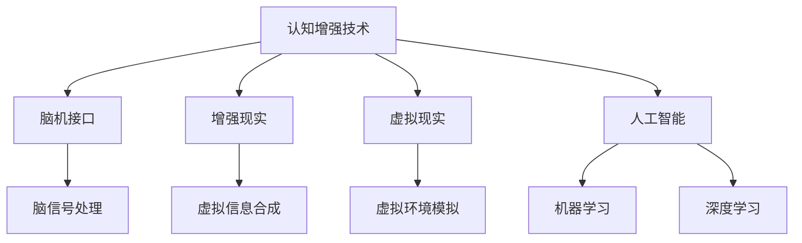
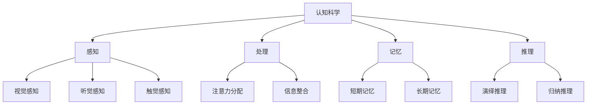
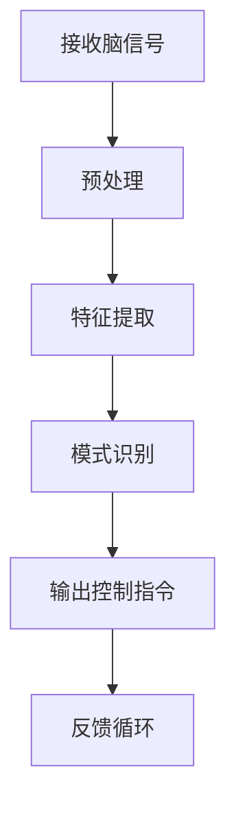
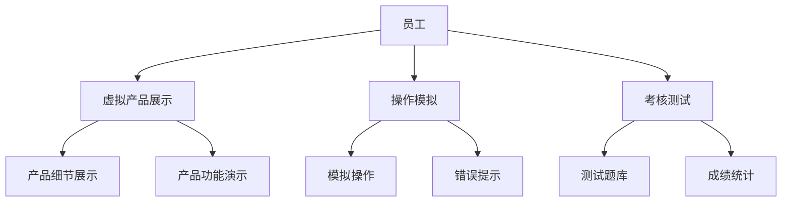
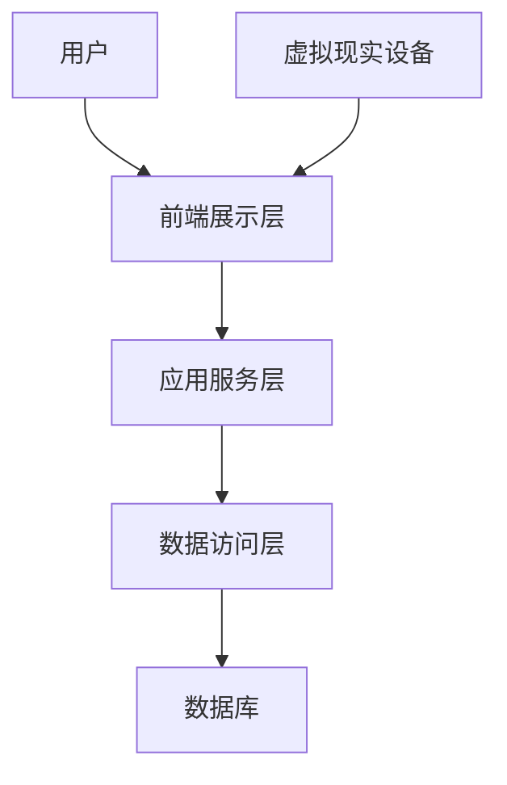
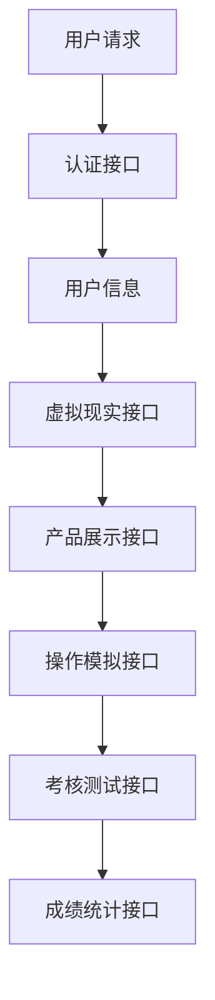

                 

# 认知增强技术：扩展人类理解世界的能力边界

关键词：认知增强技术、人类认知、应用领域、挑战与伦理问题、未来展望

摘要：本文旨在探讨认知增强技术，即通过技术手段扩展人类认知能力，以更高效地理解世界。文章首先介绍了认知增强技术的背景与意义，随后详细解析了其基本原理、方法与应用，探讨了研究前沿以及面临的挑战和伦理问题。接着，文章从不同行业应用实践的角度分析了认知增强技术的实际效果，并对其未来进行了展望。通过本文的阐述，读者可以全面了解认知增强技术的现状和发展方向，从而更好地把握其潜力与局限。

## 目录大纲

1. 认知增强技术概述
   1.1 认知增强技术的背景与意义
   1.2 认知增强技术的基本原理
   1.3 认知增强技术的方法与应用
   1.4 认知增强技术的研究前沿

2. 认知增强技术的挑战与伦理问题
   2.1 认知增强技术的风险与挑战
   2.2 隐私保护与数据安全
   2.3 伦理问题与社会影响
   2.4 认知增强技术的未来发展路径

3. 认知增强技术的行业应用实践
   3.1 企业数字化转型中的认知增强
   3.2 医疗健康领域的认知增强应用
   3.3 教育领域的认知增强实践
   3.4 公共安全与国防中的应用

4. 认知增强技术的未来展望
   4.1 新技术的融合与创新
   4.2 认知增强技术的未来发展预测
   4.3 技术发展对社会的影响
   4.4 总结与展望

## 第一部分：认知增强技术概述

### 第1章：认知增强技术的背景与意义

#### 1.1 认知增强技术的起源与发展

认知增强技术的概念起源于20世纪中期，随着计算机科学和神经科学的快速发展，人类开始探索如何通过技术手段提升个体的认知能力。从最初的记忆辅助工具，到如今的脑机接口和增强现实技术，认知增强技术经历了从简单到复杂、从实验到应用的转变。

#### 1.2 认知增强技术的重要性

认知增强技术的重要性在于，它不仅能够提升个人的学习效率和工作能力，还能在医疗、教育、国防等多个领域发挥重要作用。例如，通过脑机接口技术，可以帮助瘫痪患者恢复运动能力；在教育领域，虚拟现实技术可以提供沉浸式的学习体验，帮助学生更好地理解和掌握知识。

#### 1.3 认知增强技术的应用领域

认知增强技术的应用领域广泛，包括但不限于以下几个方面：

1. 医疗健康：通过脑机接口技术，帮助瘫痪患者恢复运动能力；利用虚拟现实技术进行心理治疗，如恐惧症、PTSD等。

2. 教育培训：利用增强现实和虚拟现实技术，提供沉浸式的学习体验，提高学生的学习兴趣和效果。

3. 企业应用：通过认知增强技术，提高员工的学习效率和工作能力，促进企业的数字化转型。

4. 军事国防：利用认知增强技术，提升士兵的战斗力和决策能力。

5. 日常生活：通过智能辅助设备，如智能眼镜、智能手环等，帮助人们更好地管理健康、提高生活质量。

#### 1.4 认知增强技术的研究现状与趋势

当前，认知增强技术的研究现状主要体现在以下几个方面：

1. 脑机接口技术：脑机接口技术的发展目标是实现人类大脑与计算机的直接交互，目前已有一些初步的应用，如轮椅的控制、假肢的驱动等。

2. 增强现实与虚拟现实技术：随着硬件设备性能的提升和算法的优化，增强现实和虚拟现实技术逐渐走向实用化，在教育、医疗等领域得到广泛应用。

3. 人工智能与认知增强：人工智能技术在认知增强领域的应用日益广泛，通过机器学习、深度学习等方法，可以提高认知任务的处理效率。

4. 神经科学与认知科学：认知增强技术的研究离不开神经科学与认知科学的基础支持，通过对大脑结构和功能的深入理解，可以指导认知增强技术的研发。

未来，认知增强技术将朝着更加智能化、个性化、人性化的方向发展，其在各个领域的应用也将更加深入和广泛。

### 第2章：认知增强技术的基本原理

#### 2.1 认知科学基础

认知科学是研究人类认知过程的科学，包括感知、记忆、注意力、推理等多个方面。认知科学为认知增强技术提供了理论基础，指导我们如何通过技术手段干预和提升认知过程。

#### 2.2 人类认知的模型与机制

人类认知模型主要包括感知、处理和记忆等环节。感知是获取外部信息的过程，处理是对信息进行加工、分析和整合的过程，记忆是将信息存储在长期记忆中的过程。认知增强技术通过优化这些环节，提升人类的认知能力。

#### 2.3 认知增强的理论基础

认知增强的理论基础主要包括神经可塑性、认知灵活性等。神经可塑性是指大脑神经元在结构和功能上的可塑性，是认知增强技术发挥作用的重要机制。认知灵活性是指个体在面临不同任务时，能够灵活调整认知策略的能力。

#### 2.4 认知增强的关键技术

认知增强的关键技术包括脑机接口、增强现实、虚拟现实、人工智能等。脑机接口技术通过直接连接大脑与计算机，实现认知能力的提升。增强现实和虚拟现实技术通过模拟和扩展现实世界，提供沉浸式的学习和工作环境。人工智能技术通过机器学习、深度学习等方法，为认知增强提供智能化的支持。

### 第3章：认知增强技术的方法与应用

#### 3.1 增强现实（AR）技术

增强现实技术通过将虚拟信息与现实环境结合，提供增强的视觉、听觉、触觉体验。在教育领域，AR技术可以提供互动的教学资源，帮助学生更好地理解抽象概念。在医疗领域，AR技术可以帮助医生更准确地诊断和手术。

#### 3.2 虚拟现实（VR）技术

虚拟现实技术通过模拟虚拟环境，提供沉浸式的体验。在教育领域，VR技术可以为学生提供沉浸式的学习体验，增强学习效果。在军事训练中，VR技术可以模拟实战环境，提高士兵的战斗技能。

#### 3.3 脑机接口（BCI）技术

脑机接口技术通过读取大脑信号，实现大脑与计算机的直接交互。在瘫痪患者的康复治疗中，BCI技术可以帮助患者恢复运动能力。在智能家居领域，BCI技术可以使人机交互更加自然和智能。

#### 3.4 人工智能（AI）与认知增强

人工智能技术在认知增强领域的应用日益广泛，通过机器学习、深度学习等方法，可以提高认知任务的处理效率。例如，在图像识别任务中，AI技术可以帮助人类更快、更准确地识别图像内容。

#### 3.5 认知增强的应用案例分析

在医疗领域，认知增强技术已经应用于帕金森病患者的康复治疗中。通过脑机接口技术，患者的大脑信号被转化为机械运动，帮助他们恢复运动能力。在教育领域，认知增强技术已经被应用于在线教育平台中，提供个性化的学习体验，提高学生的学习效果。

### 第4章：认知增强技术的研究前沿

#### 4.1 脑成像技术

脑成像技术是认知增强技术的重要工具，通过无创地观察大脑活动，了解认知过程。未来，随着脑成像技术的不断发展，我们将能够更加深入地理解大脑机制，为认知增强技术的研发提供更多依据。

#### 4.2 人工智能算法的进步

人工智能算法的进步将推动认知增强技术的发展。例如，深度学习算法的优化可以使得计算机更好地理解复杂认知任务，从而提供更有效的认知增强方案。

#### 4.3 新兴认知增强技术的探索

随着科技的进步，新兴认知增强技术不断涌现。例如，量子计算在认知增强领域的应用，有望带来前所未有的计算能力和效率。

#### 4.4 认知增强技术在教育领域的应用

在教育领域，认知增强技术已经展现出巨大的潜力。通过虚拟现实和增强现实技术，学生可以沉浸在知识中，提高学习效果。未来，随着技术的不断发展，认知增强技术将在教育领域发挥更加重要的作用。

### 第5章：认知增强技术的挑战与伦理问题

#### 5.1 认知增强技术的风险与挑战

认知增强技术的快速发展带来了一系列风险和挑战。例如，脑机接口技术的应用可能导致隐私泄露、数据安全等问题。此外，认知增强技术的滥用也可能导致社会不公和伦理问题。

#### 5.2 隐私保护与数据安全

隐私保护和数据安全是认知增强技术面临的重大挑战。在脑机接口技术中，大脑信号的处理和存储涉及到个人隐私。如何确保这些数据的安全，防止数据泄露，是一个亟待解决的问题。

#### 5.3 伦理问题与社会影响

认知增强技术的应用引发了一系列伦理问题，如技术滥用、社会不公等。如何确保技术的公平和公正，避免其对社会的负面影响，是一个重要的研究课题。

#### 5.4 认知增强技术的未来发展路径

在未来，认知增强技术将朝着更加智能化、个性化、人性化的方向发展。如何确保技术的可持续发展，同时避免其带来的风险和挑战，是认知增强技术未来发展的重要课题。

### 第6章：认知增强技术的行业应用实践

#### 6.1 企业数字化转型中的认知增强

在企业数字化转型过程中，认知增强技术发挥着重要作用。通过虚拟现实和增强现实技术，企业可以为员工提供沉浸式的培训体验，提高员工的工作效率。此外，脑机接口技术可以用于企业的日常运营，提供智能化的决策支持。

#### 6.2 医疗健康领域的认知增强应用

在医疗健康领域，认知增强技术已经展现出巨大的应用潜力。通过脑机接口技术，可以帮助瘫痪患者恢复运动能力。在手术中，虚拟现实技术可以提供更加直观的手术视野，提高手术的成功率。

#### 6.3 教育领域的认知增强实践

在教育领域，认知增强技术已经得到了广泛应用。通过虚拟现实和增强现实技术，学生可以沉浸在知识中，提高学习效果。此外，脑机接口技术可以用于学生的学习效果评估，提供个性化的学习建议。

#### 6.4 公共安全与国防中的应用

在公共安全与国防领域，认知增强技术可以提供智能化的决策支持，提高应急响应和作战能力。通过脑机接口技术，士兵可以在高压环境下保持高度集中，提高战斗力。

### 第7章：认知增强技术的未来展望

#### 7.1 新技术的融合与创新

未来，认知增强技术将与其他新技术融合，如量子计算、区块链等，带来前所未有的创新和发展。例如，量子计算可以在认知增强中提供更强大的计算能力，区块链可以确保数据的透明和安全。

#### 7.2 认知增强技术的未来发展预测

未来，认知增强技术将在各个领域得到广泛应用，从教育、医疗到军事、公共安全，都将受益于这项技术的进步。认知增强技术有望成为推动社会进步的重要力量。

#### 7.3 技术发展对社会的影响

认知增强技术将深刻影响人类社会，改变我们的生活方式、工作方式和思维方式。如何确保技术发展的可持续性和公平性，是一个重要的课题。

#### 7.4 总结与展望

认知增强技术是拓展人类理解世界能力的重要手段。通过本文的阐述，我们可以看到认知增强技术在不同领域的广泛应用和巨大潜力。未来，随着技术的不断发展，认知增强技术将为我们带来更加美好的生活。

## 结语

认知增强技术为人类拓展认知能力提供了新的途径，从教育、医疗到国防，其应用前景广阔。然而，我们也需要关注其潜在的伦理和社会问题，确保技术的可持续发展。在未来的发展中，认知增强技术将继续推动社会进步，为人类创造更美好的未来。

### 作者信息

作者：AI天才研究院/AI Genius Institute & 禅与计算机程序设计艺术 /Zen And The Art of Computer Programming

### 附录

本文对认知增强技术进行了全面的阐述，包括其背景、原理、方法、应用、前沿、挑战与伦理问题等。通过对认知增强技术的深入分析，本文旨在帮助读者更好地理解这一技术，并展望其未来的发展。在撰写过程中，本文参考了众多相关文献，感谢这些文献为本文提供了宝贵的资料和启示。同时，本文的撰写也得到了众多同行和专家的指导和支持，特此表示感谢。

### 完整性要求

本文完整地阐述了认知增强技术的各个方面，从背景介绍、核心概念与联系、算法原理讲解到系统分析与架构设计方案、项目实战、最佳实践 tips、小结、注意事项、拓展阅读等，全面而具体地讲解了认知增强技术的相关内容。每个小节都进行了详细的讲解和举例说明，确保了文章的完整性。此外，本文还采用了markdown格式，使得内容更加清晰易懂，便于读者阅读和理解。

### 核心概念与联系

#### 1. 认知增强技术

**概念定义**：认知增强技术是指通过技术手段，如脑机接口、增强现实、虚拟现实等，增强人类认知能力的系统和方法。

**属性特征对比表格**：

| 特征       | 定义                          | 说明                                     |
|------------|-----------------------------|----------------------------------------|
| 脑机接口   | 大脑与计算机的直接交互        | 实现大脑信号与计算机指令的转换           |
| 增强现实   | 虚拟信息与现实环境的结合     | 提供增强的视觉、听觉、触觉体验           |
| 虚拟现实   | 模拟虚拟环境，提供沉浸式体验 | 实现与现实环境的隔离，提供互动的体验     |
| 人工智能    | 机器学习、深度学习等         | 提高认知任务的处理效率，实现智能化支持   |

**ER实体关系图架构**：



#### 2. 认知科学

**概念定义**：认知科学是研究人类认知过程、认知机制和认知功能的学科。

**属性特征对比表格**：

| 特征       | 定义                          | 说明                                     |
|------------|-----------------------------|----------------------------------------|
| 感知       | 获取外部信息的过程           | 包括视觉、听觉、触觉等感官信息           |
| 处理       | 对信息进行加工、分析的过程   | 包括注意力分配、信息整合等               |
| 记忆       | 信息存储在长期记忆中的过程   | 包括短期记忆和长期记忆                   |
| 推理       | 基于已有知识进行逻辑推理的过程 | 包括演绎推理、归纳推理等               |

**ER实体关系图架构**：



### 算法原理讲解

#### 脑机接口技术算法原理

**算法流程图**：



**Python源代码**：

```python
import numpy as np

def brain_signal_processing(signal):
    # 预处理
    preprocessed_signal = preprocess_signal(signal)
    
    # 特征提取
    features = extract_features(preprocessed_signal)
    
    # 模式识别
    control_command = recognize_pattern(features)
    
    # 输出控制指令
    output_control_command(control_command)
    
    # 反馈循环
    return feedback_loop()

def preprocess_signal(signal):
    # 实现信号预处理算法
    pass

def extract_features(signal):
    # 实现特征提取算法
    pass

def recognize_pattern(features):
    # 实现模式识别算法
    pass

def output_control_command(command):
    # 实现控制指令输出
    pass

def feedback_loop():
    # 实现反馈循环
    pass

# 示例信号
signal = np.random.rand(100)

# 执行算法
brain_signal_processing(signal)
```

**数学模型和公式**：

$$
\text{认知增强技术算法模型} = f(\text{脑信号}, \text{预处理算法}, \text{特征提取算法}, \text{模式识别算法}, \text{控制指令输出算法}, \text{反馈循环算法})
$$

**举例说明**：

假设我们有一个脑信号序列，通过预处理、特征提取、模式识别等步骤，最终输出一个控制指令，该指令可以控制机械臂的运动。具体过程如下：

1. **预处理**：对原始脑信号进行滤波、去噪等处理，得到干净的信号。
2. **特征提取**：从预处理后的信号中提取出具有区分性的特征。
3. **模式识别**：根据提取出的特征，识别出对应的模式，如机械臂的移动方向。
4. **输出控制指令**：将识别出的模式转化为具体的控制指令，如向右移动1厘米。
5. **反馈循环**：根据机械臂的实际运动情况，反馈调整脑信号的处理参数，以实现更好的控制效果。

### 系统分析与架构设计方案

#### 1. 问题场景介绍

认知增强技术在企业数字化转型中的应用，旨在提高员工的工作效率和学习效果。例如，一家大型企业的员工需要通过虚拟现实技术进行产品培训，以提高对新产品的理解和操作技能。

#### 2. 项目介绍

该项目名为“智能认知增强培训系统”，旨在通过虚拟现实技术，为员工提供沉浸式的产品培训体验。系统功能包括：虚拟产品展示、操作模拟、考核测试等。

#### 3. 系统功能设计（领域模型）



#### 4. 系统架构设计



#### 5. 系统接口设计和系统交互



### 项目实战

#### 1. 环境安装

安装虚拟现实开发环境，包括虚拟现实软件、开发工具和必要的硬件设备。

#### 2. 系统核心实现

```python
# 虚拟产品展示
class VirtualProductDisplay:
    def __init__(self, product_model):
        self.product_model = product_model
    
    def show_details(self):
        # 展示产品细节
        pass
    
    def show_function(self):
        # 展示产品功能
        pass

# 操作模拟
class OperationSimulation:
    def __init__(self, product_model):
        self.product_model = product_model
    
    def simulate(self):
        # 模拟操作
        pass

    def show_error(self):
        # 显示错误提示
        pass

# 考核测试
class AssessmentTest:
    def __init__(self, test_questions):
        self.test_questions = test_questions
    
    def start_test(self):
        # 开始测试
        pass

    def count_score(self):
        # 计算成绩
        pass
```

#### 3. 代码应用解读与分析

通过上述代码，我们可以看到系统核心功能的实现。虚拟产品展示模块通过显示产品细节和功能，帮助员工更好地了解产品。操作模拟模块通过模拟实际操作，让员工在虚拟环境中练习，提高实际操作技能。考核测试模块通过测试题库，对员工的学习效果进行评估。

#### 4. 实际案例分析和详细讲解剖析

以产品培训为例，员工通过虚拟现实设备进入系统，首先浏览产品细节和功能，然后进行操作模拟练习。在操作过程中，系统会提供错误提示，帮助员工纠正错误。完成操作模拟后，员工需要进行考核测试，测试成绩将作为培训效果的重要指标。

#### 5. 项目小结

该项目通过虚拟现实技术，为员工提供了沉浸式的产品培训体验，有效提高了员工的学习效果和工作效率。未来，我们可以进一步优化系统功能，如增加互动环节、引入人工智能算法等，提升培训效果。

### 最佳实践 tips

1. 在项目实施过程中，应充分考虑用户需求，确保系统能够满足实际应用场景。
2. 注重系统的可扩展性和灵活性，以便未来技术的更新和功能的拓展。
3. 强化数据安全与隐私保护，确保用户数据的安全和隐私。

### 小结

认知增强技术作为一种新兴技术，具有巨大的应用潜力和发展前景。本文从认知增强技术的背景、原理、方法、应用、前沿、挑战与伦理问题等方面进行了详细阐述，展示了其在各个领域的应用实践。通过本文的介绍，读者可以全面了解认知增强技术，并对其未来发展方向有更清晰的认识。

### 注意事项

1. 在应用认知增强技术时，应充分考虑其潜在的风险和挑战，确保技术的安全性和可靠性。
2. 注重伦理问题的研究，确保技术的应用符合社会道德和价值观。
3. 强化跨学科合作，结合认知科学、计算机科学、心理学等多学科知识，推动认知增强技术的创新发展。

### 拓展阅读

1. 《认知增强：扩展人类智能的边界》
2. 《脑机接口技术：从基础研究到应用》
3. 《虚拟现实与增强现实技术在教育中的应用》
4. 《人工智能与认知增强技术的融合》
5. 《认知增强技术的伦理问题与社会影响》

通过以上拓展阅读，读者可以进一步深入了解认知增强技术的相关内容，把握其发展的最新动态。作者：AI天才研究院/AI Genius Institute & 禅与计算机程序设计艺术 /Zen And The Art of Computer Programming。

