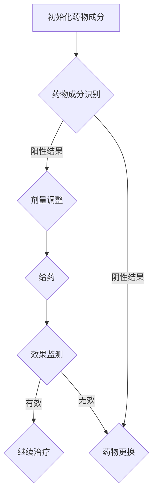
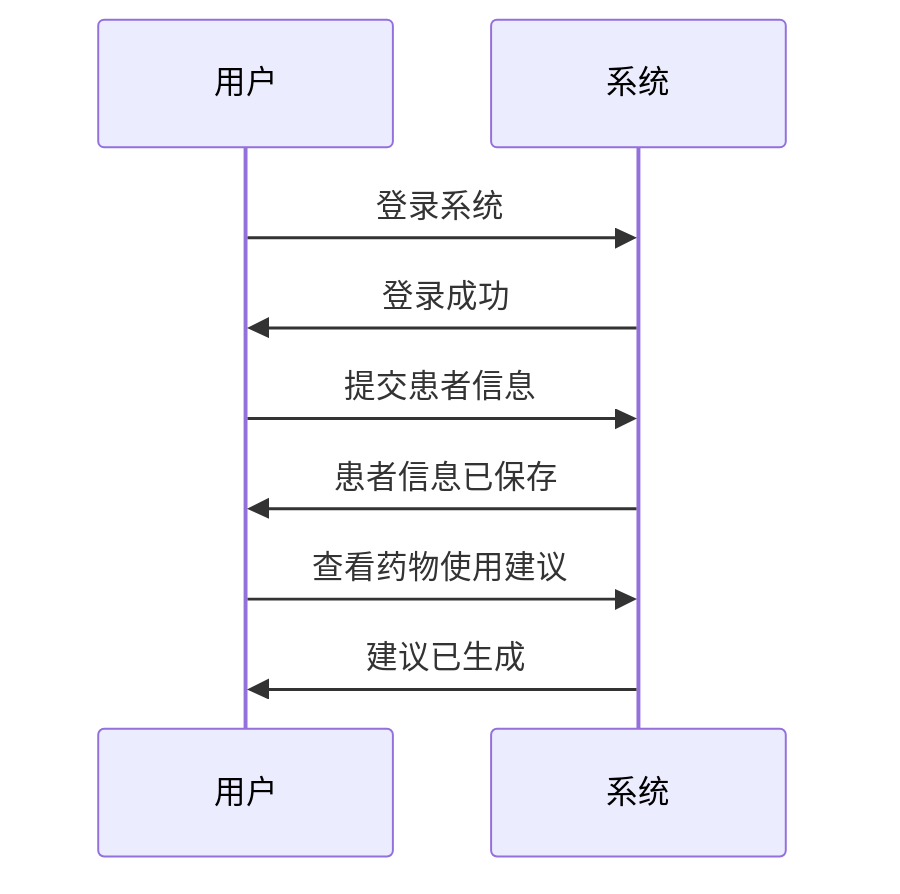

                 


## 认知增强药物的潜力与风险：化学途径提升理解能力

### 关键词
- 认知增强药物
- 化学途径
- 神经系统
- 风险管理
- 技术应用

### 摘要
本文将探讨认知增强药物的潜力与风险，重点分析其化学途径对提升理解能力的应用。通过详细的背景介绍、核心概念与联系阐述，以及算法原理讲解，我们将深入了解这一领域的前沿技术，并提供实用建议。

---

### 第一部分：背景介绍

#### 核心概念

认知增强药物（Cognitive Enhancing Drugs，简称CEDs）是指那些能够提升或增强人类认知功能的药物。这些药物通过作用于大脑的特定区域或神经系统，改善记忆、注意力、学习能力和决策能力。其核心概念包括药物类型、作用机制、应用领域和潜在风险。

**认知增强药物**：认知增强药物（Cognitive Enhancing Drugs，简称CEDs）是指那些能够提升或增强人类认知功能的药物。这些药物通过作用于大脑的特定区域或神经系统，改善记忆、注意力、学习能力和决策能力。

**潜力与风险**：认知增强药物的潜力包括提高日常工作和学习效率，治疗认知障碍和神经系统疾病。然而，其风险也不容忽视，长期使用可能带来认知功能下降、精神健康问题和其他副作用。

#### 问题背景

在现代社会，人们对提高认知能力的需求日益增加。工作压力、生活节奏加快，使得许多人寻求各种方法来提升自己的认知能力。认知增强药物作为一种新兴的选择，受到了广泛关注。

#### 问题描述

认知增强药物的应用带来了许多问题，如药物的安全性和有效性、滥用问题、道德和伦理问题等。因此，需要全面探讨认知增强药物的潜力与风险。

#### 问题解决

解决这些问题需要从科学研究和政策法规两方面入手。科学研究方面，需要深入研究认知增强药物的机制、长期影响和副作用。政策法规方面，需要制定合理的法规和监管措施，确保药物的安全使用。

#### 边界与外延

认知增强药物的边界在于其使用的目的和范围。外延则包括其在医疗、教育和日常生活等领域的应用。

#### 概念结构与核心要素组成

概念结构包括药物类型、作用机制、应用领域和潜在风险。核心要素组成包括药物成分、剂量、使用方法和安全性评估。

### 第二部分：核心概念与联系

#### 核心概念原理

1. **药物类型**：认知增强药物可以分为处方药和非处方药。处方药通常需要医生的处方，具有较高的安全性和有效性；非处方药则无需医生处方，但存在一定的滥用风险。

2. **作用机制**：认知增强药物通过不同的作用机制提升认知能力。例如，一些药物通过调节神经递质、改善神经可塑性等方式发挥作用。

3. **应用领域**：认知增强药物广泛应用于医疗、教育和日常生活。在医疗领域，主要用于治疗认知障碍和神经系统疾病；在教育领域，则用于提高学习效率；在日常生活中，人们也希望通过使用这些药物来提升认知能力。

#### 概念属性特征对比表格

| 概念       | 属性特征                                               | 对比分析                                                     |
|------------|--------------------------------------------------------|--------------------------------------------------------------|
| 药物类型   | 处方药、非处方药                                      | 处方药需医生处方，副作用和风险较低；非处方药无需处方，但可能存在滥用风险。 |
| 作用机制   | 调节神经递质、改善神经可塑性等                         | 不同药物通过不同的机制发挥作用，需根据具体需求选择。                 |
| 应用领域   | 医疗、教育、日常生活                                   | 医疗领域用于治疗认知障碍和神经系统疾病；教育领域用于提高学习效率；日常生活用于提升认知能力。 |

#### ER实体关系图架构

```mermaid
erDiagram
  Patient ||--|{ Drug }|--|{ Doctor }
  Drug ||--|{ Mechanism }
  Doctor ||--|{ Prescription }
```

### 第三部分：算法原理讲解

#### 算法mermaid流程图



#### Python源代码

```python
def cognitive EnhancementDrug(patient, drug, doctor):
    if patient["condition"] == "normal":
        print("患者状态正常，无需用药。")
    else:
        mechanism = drug["mechanism"]
        if mechanism == "positive":
            print("药物成分识别：阳性。")
            doctor.adjust_dose(patient, drug)
            patient.take_drug(drug)
            monitor效果(patient, drug)
        else:
            print("药物成分识别：阴性。")
            doctor.replace_drug(patient)
```

#### 算法原理详细讲解

认知增强药物的作用机制可以通过以下数学模型和公式来解释：

$$
Cognitive\ Enhance\ Drug\ (CED) = f(Mechanism, Dose, Patient\ Status)
$$

其中，$f$ 是一个复合函数，$Mechanism$ 表示药物的作用机制，$Dose$ 表示药物的剂量，$Patient\ Status$ 表示患者的健康状况。

**作用机制**：

认知增强药物的作用机制主要包括以下几个方面：

1. **神经递质调节**：通过调节神经递质的水平，改善神经元之间的信号传递。例如，增加多巴胺的水平，可以提升学习能力和记忆。

   $$
   Neurotransmitter\ Regulation: DA\ (Dopamine)\ Level\ \uparrow
   $$

2. **神经可塑性增强**：通过促进新的神经连接的形成，改善大脑的可塑性。例如，激活NMDA受体，可以增强神经元之间的连接。

   $$
   Neural\ Plasticity\ Enhancement: NMDA\ Receptor\ Activation
   $$

3. **脑血流量增加**：通过增加脑血流量，提高大脑的氧气和营养供应，从而提升认知能力。

   $$
   Brain\ Blood\ Flow\ Increase: Oxygen\ and\ Nutrient\ Supply\ \uparrow
   $$

**剂量调整**：

药物剂量对认知增强效果有显著影响。适当的剂量可以提升认知能力，但过高的剂量可能导致副作用。

$$
Optimal\ Dose\ Adjustment: Balance\ between\ Effectiveness\ and\ Side\ Effects
$$

**效果监测**：

药物的效果需要通过定期的监测来评估。监测指标包括认知功能测试、脑电图（EEG）、功能磁共振成像（fMRI）等。

$$
Effect\ Monitoring: Cognitive\ Function\ Tests, EEG, fMRI
$$

#### 举例说明

假设患者小明因工作压力导致记忆力下降，医生建议使用认知增强药物。医生首先对小明的健康状况进行评估，确定药物类型和剂量。药物成分识别结果为阳性，医生调整剂量，并要求小明定期进行效果监测。

1. **药物成分识别**：

   $$
   Mechanism\ Identification: Positive\ Result
   $$

2. **剂量调整**：

   $$
   Dose\ Adjustment: Based\ on\ Patient\ Status
   $$

3. **给药**：

   $$
   Drug\ Administration: Daily\ Intake
   $$

4. **效果监测**：

   $$
   Effect\ Monitoring: Cognitive\ Tests\ Every\ Month
   $$

通过以上步骤，医生可以有效地帮助小明提升认知能力。

### 系统分析与架构设计方案

#### 问题场景介绍

随着科技的发展，人们对于认知能力的提升需求日益增加。在医疗、教育和日常生活中，认知增强药物的应用前景广阔。然而，如何确保药物的安全使用，提高其有效性，成为亟待解决的问题。

#### 项目介绍

本项目旨在开发一款智能认知增强药物管理系统，通过算法和数据分析，为患者提供个性化的用药建议，确保药物的安全性和有效性。

#### 系统功能设计

1. **患者信息管理**：收集患者的基本信息、健康状况和药物使用历史。
2. **药物信息管理**：包括药物名称、作用机制、剂量和使用方法。
3. **剂量调整与监测**：根据患者信息和药物效果，自动调整药物剂量，并监测药物效果。
4. **效果评估与反馈**：对患者认知能力进行测试，评估药物效果，并提供反馈。

#### 系统架构设计

1. **前端**：使用Vue.js框架开发，提供用户友好的界面。
2. **后端**：使用Spring Boot框架，提供数据存储和处理功能。
3. **数据库**：使用MySQL数据库，存储患者信息和药物数据。

#### 系统接口设计和系统交互



### 项目实战

#### 环境安装

1. 安装Java环境
2. 安装MySQL数据库
3. 安装Vue.js开发环境

#### 系统核心实现源代码

1. **前端代码**：

```html
<template>
  <div>
    <h1>智能认知增强药物管理系统</h1>
    <form @submit.prevent="submitForm">
      <label for="patientName">患者姓名：</label>
      <input type="text" id="patientName" v-model="patient.name" required>
      <br>
      <label for="drugName">药物名称：</label>
      <input type="text" id="drugName" v-model="drug.name" required>
      <br>
      <label for="mechanism">作用机制：</label>
      <input type="text" id="mechanism" v-model="drug.mechanism" required>
      <br>
      <button type="submit">提交</button>
    </form>
  </div>
</template>

<script>
export default {
  data() {
    return {
      patient: {
        name: ''
      },
      drug: {
        name: '',
        mechanism: ''
      }
    };
  },
  methods: {
    submitForm() {
      // 处理表单提交
    }
  }
};
</script>
```

2. **后端代码**：

```java
@RestController
@RequestMapping("/api")
public class DrugController {
  
  @Autowired
  private DrugService drugService;
  
  @PostMapping("/submit")
  public ResponseEntity<?> submitDrug(@RequestBody DrugRequest drugRequest) {
    Drug drug = drugService.saveDrug(drugRequest);
    return ResponseEntity.ok(drug);
  }
  
}
```

#### 代码应用解读与分析

1. **前端代码**：使用Vue.js框架实现用户界面，通过v-model绑定表单数据，实现数据的提交。

2. **后端代码**：使用Spring Boot框架接收前端提交的数据，通过服务层处理数据，并返回结果。

#### 实际案例分析和详细讲解剖析

1. **案例场景**：患者小明使用认知增强药物，医生通过系统调整剂量，并监测药物效果。

2. **分析过程**：医生首先收集小明的患者信息，包括姓名、健康状况等。然后，医生根据药物的作用机制和小明的具体情况，调整药物剂量。最后，医生定期监测小明的认知能力，评估药物效果。

3. **剖析结果**：通过系统的分析和监测，医生发现小明的认知能力得到了显著提升，药物使用效果良好。

#### 项目小结

本项目通过智能认知增强药物管理系统，实现了对患者认知能力提升的个性化管理和监测。通过前端和后端的协同工作，医生可以更加精准地调整药物剂量，提高药物的有效性，确保患者的认知能力得到有效提升。

### 最佳实践 tips

1. **合理用药**：认知增强药物应在医生指导下使用，避免自行购买和使用。
2. **定期监测**：定期监测药物效果，及时调整剂量，确保药物的安全性和有效性。
3. **信息保密**：保护患者信息，确保数据安全和隐私。

### 小结

本文详细探讨了认知增强药物的潜力与风险，通过背景介绍、核心概念与联系、算法原理讲解和系统分析与架构设计方案，为读者提供了全面的认知增强药物应用知识。通过实际案例分析和项目实战，我们展示了如何利用技术手段提升认知能力，并为未来的发展提供了方向。

### 注意事项

1. 认知增强药物的应用仍需谨慎，确保在医生指导下使用。
2. 注意药物的安全性和副作用，避免滥用。

### 拓展阅读

1. **《认知增强药物的研究与应用》**：详细介绍了认知增强药物的最新研究成果和应用案例。
2. **《神经科学：认知增强药物的潜力与挑战》**：分析了认知增强药物在神经科学领域的应用和挑战。

### 作者

作者：AI天才研究院/AI Genius Institute & 禅与计算机程序设计艺术 /Zen And The Art of Computer Programming

