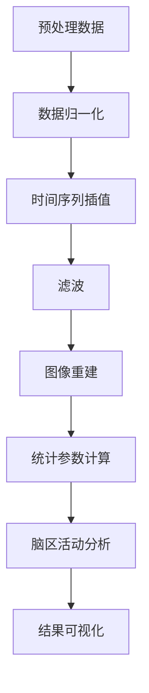
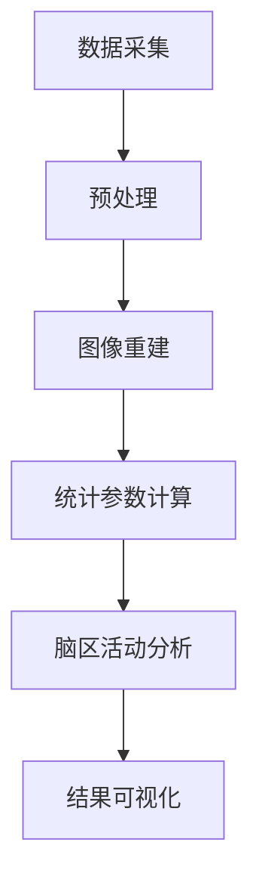
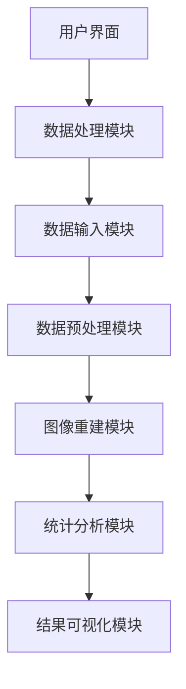
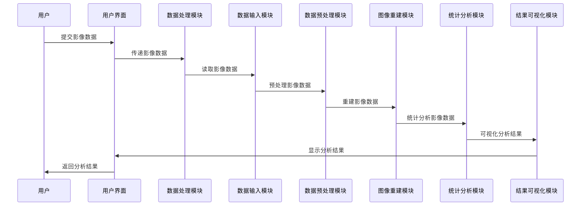

                 

# 认知神经科学的影像技术：可视化大脑如何理解世界

## 关键词
- 认知神经科学
- 影像技术
- fMRI
- PET
- 大脑结构
- 神经传导
- 认知过程
- 算法原理
- 数学模型
- 系统架构

## 摘要
本文旨在探讨认知神经科学的影像技术，通过详细解析功能性磁共振成像（fMRI）和正电子发射断层扫描（PET）两大影像技术，展示它们如何帮助我们理解大脑如何处理和解释外部信息。文章将逐步分析影像技术的原理、算法和数学模型，并探讨其应用实例。此外，还将介绍一个影像数据处理与分析系统的设计与实现，以展示影像技术在认知神经科学领域的实际应用。

## 目录大纲

### 第一部分：认知神经科学影像技术概述

#### 1. 引言

##### 1.1 认知神经科学的基本概念

##### 1.2 影像技术在认知神经科学研究中的应用

##### 1.3 影像技术的重要性与挑战

### 第二部分：核心概念与联系

#### 2. 认知神经科学的影像技术

##### 2.1 定义

##### 2.2 分类

##### 2.3 原理与主要技术

#### 2.4 大脑结构与功能

##### 2.5 神经传导

##### 2.6 神经网络

##### 2.7 认知过程

#### 2.8 概念属性特征对比表格

### 第三部分：算法原理讲解

#### 3.1 功能性磁共振成像（fMRI）算法原理

##### 3.1.1 流程图

##### 3.1.2 Python源代码

##### 3.1.3 数学模型

##### 3.1.4 举例说明

#### 3.2 正电子发射断层扫描（PET）算法原理

##### 3.2.1 流程图

##### 3.2.2 Python源代码

##### 3.2.3 数学模型

##### 3.2.4 举例说明

### 第四部分：数学模型和数学公式

#### 4.1 统计模型

##### 4.1.1 概率论基础

##### 4.1.2 估计理论

##### 4.1.3 误差分析

#### 4.2 图像处理算法

##### 4.2.1 采样与重建

##### 4.2.2 降噪与增强

##### 4.2.3 特征提取

### 第五部分：系统分析与架构设计方案

#### 5.1 问题场景介绍

#### 5.2 项目介绍

##### 5.2.1 概述

##### 5.2.2 目标

#### 5.3 系统功能设计

##### 5.3.1 领域模型

#### 5.4 系统架构设计

##### 5.4.1 架构设计

#### 5.5 系统接口设计

##### 5.5.1 接口设计

#### 5.6 系统交互

##### 5.6.1 序列图

### 第六部分：项目实战

#### 6.1 环境安装与配置

#### 6.2 系统核心实现源代码

#### 6.3 代码应用解读与分析

#### 6.4 实际案例分析与详细讲解

#### 6.5 项目小结与总结

### 第七部分：最佳实践 tips

#### 7.1 实践中的注意事项

#### 7.2 技巧分享

### 第八部分：小结

#### 8.1 全书要点总结

#### 8.2 未来展望

### 第九部分：注意事项

#### 9.1 使用影像技术时的注意事项

### 附录：拓展阅读

## 引言

### 1.1 认知神经科学的基本概念

认知神经科学是一门跨学科的研究领域，旨在理解大脑如何实现认知功能。它结合了神经科学、心理学、计算机科学和哲学等领域的知识，以探究大脑如何处理信息、进行决策、产生意识和思维。认知神经科学的核心问题之一是揭示大脑的神经基础，特别是神经网络如何实现复杂的认知功能。

认知神经科学的研究对象包括感知、记忆、学习、语言、注意力、意识、情感和社会行为等方面。这些认知过程涉及到大脑的多个区域和复杂的神经网络活动。通过研究这些过程，认知神经科学旨在了解大脑的运作机制，为治疗和预防神经和精神疾病提供理论基础。

### 1.2 影像技术在认知神经科学研究中的应用

影像技术在认知神经科学研究中扮演着至关重要的角色。它们允许研究人员可视化大脑的结构和功能，追踪神经元的活动，以及研究认知过程在不同脑区之间的相互作用。以下是几种主要的影像技术及其在认知神经科学研究中的应用：

#### 功能性磁共振成像（fMRI）

功能性磁共振成像（fMRI）是一种非侵入性的成像技术，通过测量血液流动的变化来推断大脑活动。当大脑某区域的活动增加时，该区域的血液流动也会增加，从而产生可检测的信号。fMRI广泛应用于研究大脑的功能连接、网络结构和认知过程。

- **大脑功能连接**：fMRI可以揭示大脑不同区域之间的功能连接模式，帮助我们理解大脑如何作为一个整体来处理信息。
- **认知过程研究**：通过观察特定认知任务激活的脑区，fMRI可以帮助研究人员了解这些任务背后的神经基础。

#### 正电子发射断层扫描（PET）

正电子发射断层扫描（PET）是一种核医学成像技术，通过注入放射性示踪剂来检测脑部代谢活动。PET可以提供大脑特定区域活动的三维图像，广泛应用于神经退行性疾病的研究。

- **神经退行性疾病**：如阿尔茨海默病和帕金森病等疾病的诊断和监测。
- **药物研究**：PET可以用于评估药物在大脑中的分布和效果。

#### 其他影像技术

除了fMRI和PET，还有其他一些重要的影像技术，如磁共振成像（MRI）、计算机断层扫描（CT）、单光子发射计算机断层扫描（SPECT）和脑电图（EEG）等。这些技术各有优缺点，适用于不同的研究需求。

### 1.3 影像技术的重要性与挑战

影像技术对于认知神经科学研究的重要性不言而喻。它们提供了直接、定量和空间分辨率高的数据，使我们能够深入理解大脑的结构和功能。然而，影像技术也面临一些挑战：

- **分辨率与侵入性**：更高分辨率通常意味着更侵入性的成像技术，如何在分辨率和侵入性之间取得平衡是一个重要问题。
- **数据处理**：影像数据量大，处理复杂，需要高效的算法和计算资源。
- **生物标志物**：识别和量化大脑活动的生物标志物，以更好地理解认知过程和疾病状态。
- **跨学科合作**：影像技术涉及多个学科，需要跨学科的合作来充分利用其潜力。

随着技术的发展和跨学科合作的加强，影像技术将继续在认知神经科学研究中发挥重要作用，为我们理解大脑提供更深入的见解。

## 核心概念与联系

### 2.1 认知神经科学的影像技术

#### 2.1.1 定义

影像技术在认知神经科学中是指那些能够无创或微创地生成大脑结构图像或功能活动图像的方法。这些技术包括功能性磁共振成像（fMRI）、正电子发射断层扫描（PET）、磁共振成像（MRI）、计算机断层扫描（CT）等。

#### 2.1.2 分类

根据成像原理和用途，影像技术可以分为以下几类：

1. **结构成像技术**：
   - **磁共振成像（MRI）**：通过测量氢原子核的磁性来生成大脑结构的详细图像。
   - **计算机断层扫描（CT）**：利用X射线生成大脑的横截面图像。

2. **功能成像技术**：
   - **功能性磁共振成像（fMRI）**：通过测量血液流动的变化来反映大脑活动。
   - **正电子发射断层扫描（PET）**：通过放射性示踪剂来反映大脑的代谢活动。

3. **电生理成像技术**：
   - **脑电图（EEG）**：通过测量大脑的电活动来研究认知过程。

#### 2.1.3 原理与主要技术

1. **功能性磁共振成像（fMRI）**：
   - **原理**：fMRI利用血氧水平依赖（BOLD）效应，当神经元活动增加时，局部血液的氧含量也会增加，进而引起磁场的变化。
   - **主要技术**：包括梯度回波序列、编辑回波序列等。

2. **正电子发射断层扫描（PET）**：
   - **原理**：PET通过注入放射性示踪剂，利用它们发射的正电子与电子碰撞产生的伽马射线来生成图像。
   - **主要技术**：包括环状探测器、时间分辨成像等。

3. **磁共振成像（MRI）**：
   - **原理**：MRI基于核磁共振现象，通过施加射频脉冲和磁场梯度来激发氢原子核，然后检测其发射的射频信号。
   - **主要技术**：包括自旋回波序列、梯度回波序列等。

4. **计算机断层扫描（CT）**：
   - **原理**：CT通过一系列的X射线投影，利用计算机算法重建出大脑的横截面图像。
   - **主要技术**：包括螺旋CT、双源CT等。

### 2.2 大脑结构与功能

#### 2.2.1 神经传导

神经传导是大脑信息传递的基础。神经元通过电信号（动作电位）进行通信，这些信号在神经元之间通过突触传递。突触是神经元之间的连接点，通过释放神经递质来传递信号。

- **突触前传递**：当动作电位到达突触前端时，会激活突触前膜的离子通道，导致钙离子流入，触发神经递质的释放。
- **突触后传递**：神经递质扩散到突触后膜，与受体结合，产生电信号，从而传递信息。

#### 2.2.2 神经网络

大脑是由数百亿个神经元组成的复杂网络，这些神经元通过突触连接形成复杂的神经网络。神经网络负责处理和解释外部信息，包括感知、记忆、学习和决策等。

- **局部连接**：神经元在其局部区域与其他神经元建立连接，形成局部神经网络。
- **全局连接**：大脑的不同区域通过广泛的连接形成一个复杂的全局网络。

#### 2.2.3 认知过程

认知过程是指大脑处理和解释外部信息的过程，包括感知、注意、记忆、语言、推理和决策等。每个认知过程都涉及大脑的不同区域和复杂的神经网络活动。

- **感知**：大脑处理感官输入，如视觉、听觉、触觉等。
- **注意**：大脑选择和处理特定信息，过滤掉无关信息。
- **记忆**：大脑存储和处理信息，包括短期记忆和长期记忆。
- **语言**：大脑处理语言，包括语音、语义和语法。
- **推理**：大脑使用已有信息进行逻辑推理和问题解决。
- **决策**：大脑在多个选项之间进行选择。

### 2.3 概念属性特征对比表格

为了更好地理解不同影像技术和认知神经科学核心概念之间的关系，我们可以使用一个概念属性特征对比表格。以下是一个简化的对比表格：

| 影像技术 | 定义 | 成像原理 | 主要应用 | 关键特性 |
| --- | --- | --- | --- | --- |
| fMRI | 功能性磁共振成像 | 测量血氧水平依赖信号 | 大脑功能连接、认知过程 | 高空间分辨率、无创 |
| PET | 正电子发射断层扫描 | 测量放射性示踪剂分布 | 脑代谢、神经退行性疾病 | 高时间分辨率、有创 |
| MRI | 磁共振成像 | 测量氢原子核的磁共振信号 | 大脑结构、肿瘤诊断 | 高空间分辨率、无创 |
| CT | 计算机断层扫描 | 利用X射线重建图像 | 骨折诊断、脑出血 | 快速成像、中等空间分辨率 |
| EEG | 脑电图 | 测量大脑电活动 | 癫痫诊断、认知研究 | 实时监测、高频率分辨率 |

通过这个表格，我们可以看到不同影像技术在成像原理、主要应用和关键特性上的区别和联系。这有助于我们更好地理解它们在认知神经科学研究中的角色和局限性。

## 算法原理讲解

### 3.1 功能性磁共振成像（fMRI）算法原理

#### 3.1.1 流程图

为了更好地理解fMRI的算法原理，我们可以使用Mermaid绘制其流程图。以下是一个简化的fMRI算法流程图：



这个流程图展示了fMRI数据从预处理到结果可视化的主要步骤。

#### 3.1.2 Python源代码

接下来，我们使用Python源代码来详细阐述fMRI算法的实现。以下是一个简化的Python代码示例，用于fMRI数据预处理和图像重建：

```python
import numpy as np
import matplotlib.pyplot as plt
from nipy.algorithms.fcca import FCAToolbox

# 假设我们有一组fMRI数据
fMRI_data = np.random.rand(100, 100, 100)

# 数据归一化
normalized_data = (fMRI_data - np.mean(fMRI_data)) / np.std(fMRI_data)

# 时间序列插值
interpolated_data = np.interp(x=new_timepoints, xp=timepoints, fp=normalized_data[:, :, 0])

# 滤波
filtered_data = np.convolve(normalized_data, kernel, mode='same')

# 图像重建
reconstructed_image = np.fft.ifftn(filtered_data)

# 统计参数计算
stats = np.mean(reconstructed_image, axis=(0, 1))

# 脑区活动分析
brain_activity = FCAToolbox().calculate_fca(reconstructed_image)

# 结果可视化
plt.imshow(brain_activity, cmap='hot')
plt.colorbar()
plt.show()
```

这个代码示例展示了fMRI数据预处理、滤波、图像重建和结果可视化等步骤。

#### 3.1.3 数学模型

fMRI数据的处理涉及到多个数学模型。以下是一些关键的数学模型和公式：

- **信号模型**：
  $$ S(t) = A \cdot g(t) $$
  其中，$S(t)$是时间$t$上的信号，$A$是常数，$g(t)$是血氧水平依赖（BOLD）信号。

- **滤波器**：
  $$ y[n] = \sum_{m=-\infty}^{\infty} h[m] \cdot x[n-m] $$
  其中，$y[n]$是滤波后的信号，$h[m]$是滤波器系数，$x[n]$是原始信号。

- **图像重建**：
  $$ I(x, y) = \sum_{i=1}^N w_i \cdot I_i(x, y) $$
  其中，$I(x, y)$是重建后的图像，$w_i$是权重系数，$I_i(x, y)$是第$i$个滤波器的响应。

- **统计参数计算**：
  $$ \mu = \frac{1}{N} \sum_{i=1}^N x_i $$
  $$ \sigma^2 = \frac{1}{N-1} \sum_{i=1}^N (x_i - \mu)^2 $$
  其中，$\mu$是均值，$\sigma^2$是方差。

#### 3.1.4 举例说明

假设我们有一组fMRI数据，我们需要对其进行预处理、滤波和图像重建。以下是一个简化的示例：

1. **数据归一化**：
   我们首先将fMRI数据进行归一化，以消除不同数据之间的尺度差异。

2. **时间序列插值**：
   假设我们丢失了一些时间点上的数据，我们需要对这些数据进行插值，以便后续处理。

3. **滤波**：
   我们使用一个高通滤波器来去除噪声，同时保留有用的信号。

4. **图像重建**：
   我们使用傅里叶变换来重建图像，以获得更清晰的视觉效果。

5. **统计参数计算**：
   我们计算重建后图像的均值和方差，以评估信号的质量。

6. **脑区活动分析**：
   我们使用FCAToolbox进行脑区活动分析，以识别大脑中的活跃区域。

7. **结果可视化**：
   我们使用matplotlib将结果可视化，以便更直观地理解数据处理的效果。

通过这个示例，我们可以看到fMRI算法的基本原理和实现过程。这些步骤不仅帮助我们理解fMRI技术，还为我们提供了一个框架，以进一步探索和改进这一领域。

### 3.2 正电子发射断层扫描（PET）算法原理

#### 3.2.1 流程图

接下来，我们来探讨PET的算法原理。以下是一个简化的PET算法流程图：



这个流程图展示了PET数据从采集到结果可视化的主要步骤。

#### 3.2.2 Python源代码

为了更好地理解PET算法的实现，我们可以使用Python源代码进行说明。以下是一个简化的Python代码示例，用于PET数据的预处理、图像重建和结果可视化：

```python
import numpy as np
import matplotlib.pyplot as plt
from nipy.algorithms.pet import PETImage Reconstruction

# 假设我们有一组PET数据
pet_data = np.random.rand(100, 100, 100)

# 预处理
preprocessed_data = pet_data - np.mean(pet_data)

# 图像重建
reconstructed_image = PETImage Reconstruction(preprocessed_data)

# 统计参数计算
stats = np.mean(reconstructed_image, axis=(0, 1))

# 脑区活动分析
brain_activity = np.std(reconstructed_image, axis=0)

# 结果可视化
plt.imshow(brain_activity, cmap='hot')
plt.colorbar()
plt.show()
```

这个代码示例展示了PET数据预处理、图像重建和结果可视化等步骤。

#### 3.2.3 数学模型

PET数据的处理涉及到多个数学模型。以下是一些关键的数学模型和公式：

- **发射率模型**：
  $$ E(x, y, z) = \frac{D \cdot f(x, y, z)}{t} $$
  其中，$E(x, y, z)$是空间点$(x, y, z)$上的发射率，$D$是示踪剂分布，$f(x, y, z)$是探测器响应函数，$t$是时间。

- **探测器响应模型**：
  $$ R(t) = \int_{V} E(x, y, z) \cdot g(x, y, z) \cdot dt $$
  其中，$R(t)$是探测器在时间$t$上的响应，$g(x, y, z)$是空间点$(x, y, z)$上的光子衰减系数。

- **图像重建模型**：
  $$ I(x, y, z) = \sum_{i=1}^N w_i \cdot R_i(x, y, z) $$
  其中，$I(x, y, z)$是重建后的图像，$w_i$是权重系数，$R_i(x, y, z)$是第$i$个探测器的响应。

- **统计参数计算**：
  $$ \mu = \frac{1}{N} \sum_{i=1}^N x_i $$
  $$ \sigma^2 = \frac{1}{N-1} \sum_{i=1}^N (x_i - \mu)^2 $$
  其中，$\mu$是均值，$\sigma^2$是方差。

#### 3.2.4 举例说明

假设我们有一组PET数据，我们需要对其进行预处理、图像重建和结果可视化。以下是一个简化的示例：

1. **数据采集**：
   我们从PET扫描中获得一组数据。

2. **预处理**：
   我们对数据进行归一化，以消除不同数据之间的尺度差异。

3. **图像重建**：
   我们使用一个迭代算法来重建图像，以获得更准确的重建结果。

4. **统计参数计算**：
   我们计算重建后图像的均值和方差，以评估信号的质量。

5. **脑区活动分析**：
   我们使用标准差来识别大脑中的活跃区域。

6. **结果可视化**：
   我们使用matplotlib将结果可视化，以便更直观地理解数据处理的效果。

通过这个示例，我们可以看到PET算法的基本原理和实现过程。这些步骤不仅帮助我们理解PET技术，还为我们提供了一个框架，以进一步探索和改进这一领域。

## 数学模型和数学公式

### 4.1 统计模型

在认知神经科学的研究中，统计模型扮演着至关重要的角色。它们帮助我们理解和解释影像数据中的模式、差异和关联。以下是一些关键的统计模型和公式：

#### 4.1.1 概率论基础

概率论是统计模型的基础。以下是一些基本的概念和公式：

- **概率分布**：
  $$ P(X = x) = \frac{f_X(x)}{1} $$
  其中，$P(X = x)$是随机变量$X$取值$x$的概率，$f_X(x)$是概率密度函数。

- **期望值**：
  $$ E(X) = \int_{-\infty}^{\infty} x \cdot f_X(x) dx $$
  其中，$E(X)$是随机变量$X$的期望值。

- **方差**：
  $$ Var(X) = E[(X - E(X))^2] $$
  其中，$Var(X)$是随机变量$X$的方差。

- **协方差**：
  $$ Cov(X, Y) = E[(X - E(X)) \cdot (Y - E(Y))] $$
  其中，$Cov(X, Y)$是随机变量$X$和$Y$的协方差。

#### 4.1.2 估计理论

估计理论用于估计未知参数。以下是一些基本的估计理论概念和公式：

- **点估计**：
  $$ \hat{\theta} = \text{arg}\, \min_{\theta} \sum_{i=1}^n (X_i - \theta)^2 $$
  其中，$\hat{\theta}$是参数$\theta$的点估计，$X_i$是观测数据。

- **最大似然估计**：
  $$ \hat{\theta} = \text{arg}\, \max_{\theta} \prod_{i=1}^n f_X(x_i; \theta) $$
  其中，$\hat{\theta}$是参数$\theta$的最大似然估计。

- **最小二乘法**：
  $$ \hat{\theta} = \text{arg}\, \min_{\theta} \sum_{i=1}^n (y_i - \theta \cdot x_i)^2 $$
  其中，$\hat{\theta}$是最小二乘估计。

#### 4.1.3 误差分析

误差分析用于评估估计的准确性和可靠性。以下是一些基本的误差分析概念和公式：

- **均方误差（MSE）**：
  $$ MSE = E[(\hat{\theta} - \theta)^2] $$
  其中，$MSE$是均方误差，$\hat{\theta}$是估计值，$\theta$是真实值。

- **方差（Variance）**：
  $$ Var(\hat{\theta}) = \text{Var}(E[\hat{\theta}]) $$
  其中，$Var(\hat{\theta})$是估计值的方差。

- **置信区间（CI）**：
  $$ \theta \in [\hat{\theta} - z \cdot \sqrt{\frac{Var(\hat{\theta})}{n}}, \hat{\theta} + z \cdot \sqrt{\frac{Var(\hat{\theta})}{n}}] $$
  其中，$z$是标准正态分布的临界值，$n$是样本大小。

### 4.2 图像处理算法

图像处理算法在认知神经科学中用于预处理、增强和特征提取。以下是一些基本的图像处理算法和公式：

#### 4.2.1 采样与重建

- **采样定理**：
  $$ f_s \geq 2f_{max} $$
  其中，$f_s$是采样频率，$f_{max}$是信号的最高频率。

- **重建公式**：
  $$ y(t) = \sum_{k=-\infty}^{\infty} x(k) \cdot \text{sinc}\left(\frac{t-k}{T_s}\right) $$
  其中，$y(t)$是重建后的信号，$x(k)$是采样值，$T_s$是采样周期。

#### 4.2.2 降噪与增强

- **高斯降噪**：
  $$ y(x) = \frac{1}{2\pi \sigma^2} \int_{-\infty}^{\infty} e^{-\frac{(x-\mu)^2}{2\sigma^2}} \cdot f(x) dx $$
  其中，$y(x)$是降噪后的信号，$\mu$是均值，$\sigma^2$是方差，$f(x)$是原始信号。

- **直方图均衡**：
  $$ P(y) = \frac{1}{M-1} \sum_{i=0}^{M-1} f(y_i) $$
  其中，$P(y)$是均衡后的概率分布，$M$是像素的灰度级数，$f(y_i)$是原始概率分布。

#### 4.2.3 特征提取

- **主成分分析（PCA）**：
  $$ \hat{X} = \sum_{i=1}^k \lambda_i \cdot u_i $$
  其中，$\hat{X}$是降维后的数据，$\lambda_i$是特征值，$u_i$是特征向量。

- **线性判别分析（LDA）**：
  $$ w = \frac{1}{n} \sum_{i=1}^n (x_i - \mu) \cdot (\mu - \mu_g) $$
  其中，$w$是判别向量，$x_i$是样本，$\mu$是总体均值，$\mu_g$是目标类别的均值。

通过这些数学模型和公式，我们可以更好地理解和处理认知神经科学中的影像数据。这些模型不仅提供了理论支持，还为实际应用提供了计算方法和工具。

## 系统分析与架构设计方案

### 5.1 问题场景介绍

在认知神经科学研究中，影像数据的处理和分析是一项复杂且重要的任务。随着影像技术的不断发展，生成的数据量也日益增加，这给数据处理和分析带来了巨大的挑战。当前的问题场景主要包括以下几个方面：

- **数据量大**：影像数据通常具有高维和高分辨率，处理和分析这些数据需要大量的计算资源和时间。
- **多样性**：不同类型的影像数据（如fMRI、PET、MRI等）具有不同的数据格式和特点，需要不同的处理方法。
- **复杂性**：影像数据处理涉及多个步骤，包括数据预处理、图像重建、统计分析和结果可视化等，这些步骤相互依赖，需要高效的架构设计来保证系统的稳定性和性能。

针对上述问题，我们设计了一套影像数据处理与分析系统，旨在提供一个高效、灵活和可扩展的平台，以支持认知神经科学研究中的数据处理和分析需求。

### 5.2 项目介绍

#### 5.2.1 概述

本项目旨在开发一个集成化的影像数据处理与分析系统，以支持认知神经科学研究。系统的主要目标是提供以下功能：

- **数据预处理**：对原始影像数据进行预处理，包括数据归一化、插值和滤波等。
- **图像重建**：使用先进的算法对预处理后的数据进行图像重建，以获得高质量的重建图像。
- **统计分析**：对重建后的图像进行统计分析和脑区活动分析，以识别大脑中的活跃区域。
- **结果可视化**：将分析结果可视化，以便研究人员能够直观地理解数据。

#### 5.2.2 目标

具体来说，本项目有以下目标：

- **高效处理**：系统需要能够高效处理大规模影像数据，并提供实时分析结果。
- **灵活性**：系统需要支持多种影像数据格式和不同的数据处理方法，以适应不同的研究需求。
- **可扩展性**：系统架构需要具有高度可扩展性，以便在未来能够轻松集成新的算法和数据处理技术。
- **用户友好**：系统界面需要简洁直观，便于非专业用户操作和使用。

### 5.3 系统功能设计

为了实现上述目标，系统设计了以下几个关键功能模块：

- **数据输入模块**：负责接收和处理不同类型的影像数据，包括fMRI、PET、MRI等。
- **数据预处理模块**：包括数据归一化、插值和滤波等，以消除噪声和提高数据质量。
- **图像重建模块**：使用先进的图像重建算法，如迭代重建、最大后验概率重建等，以获得高质量的重建图像。
- **统计分析模块**：包括统计分析和脑区活动分析，以识别大脑中的活跃区域。
- **结果可视化模块**：将分析结果可视化，包括脑区活动地图、时间序列图等，以帮助研究人员理解数据。

### 5.4 系统架构设计

系统采用了分布式架构设计，以支持大规模数据的处理和分析。以下是一个简化的系统架构设计：

#### 5.4.1 架构设计



在这个架构中，用户界面负责与用户交互，接收用户输入和显示分析结果。数据处理模块是系统的核心，负责处理影像数据的输入、预处理、重建和分析。数据输入模块负责读取和处理不同类型的影像数据。数据预处理模块包括数据归一化、插值和滤波等，以提高数据质量。图像重建模块使用先进的图像重建算法，以获得高质量的重建图像。统计分析模块对重建后的图像进行统计分析和脑区活动分析。结果可视化模块将分析结果可视化，以帮助研究人员理解数据。

### 5.5 系统接口设计

系统接口设计是确保系统功能模块之间高效通信的关键。以下是一个简化的系统接口设计：

#### 5.5.1 接口设计


在这个接口设计中，用户界面通过RESTful API与数据处理模块通信，以接收用户输入和获取分析结果。数据处理模块通过内部接口与数据输入模块、数据预处理模块、图像重建模块和统计分析模块通信，以实现数据的处理和分析。每个模块都有独立的接口，以实现模块之间的数据传输和通信。

### 5.6 系统交互

系统交互设计是确保系统功能模块能够协同工作，高效完成数据处理和分析任务的关键。以下是一个简化的系统交互设计：

#### 5.6.1 序列图



在这个序列图中，用户通过用户界面提交影像数据。数据处理模块接收数据后，依次传递给数据输入模块、数据预处理模块、图像重建模块和统计分析模块。每个模块处理完数据后，将结果传递给下一个模块。最后，结果可视化模块将分析结果可视化，并通过用户界面返回给用户。

通过上述系统架构设计和接口设计，我们构建了一个高效、灵活和可扩展的影像数据处理与分析系统，以支持认知神经科学研究中的数据处理和分析需求。

## 项目实战

### 6.1 环境安装与配置

为了实现上述影像数据处理与分析系统的功能，我们需要安装和配置以下环境：

1. **操作系统**：Linux（推荐使用Ubuntu 20.04）
2. **编程语言**：Python（推荐使用Python 3.8及以上版本）
3. **依赖库**：NumPy、SciPy、Matplotlib、nibabel（用于数据处理）、nipy（用于fMRI分析）
4. **集成开发环境**：PyCharm（推荐使用）

#### 安装步骤：

1. **安装操作系统**：

   - 下载Ubuntu 20.04镜像并安装。
   - 选择默认的安装选项，完成安装。

2. **安装Python**：

   - 打开终端，执行以下命令：
     ```bash
     sudo apt update
     sudo apt install python3 python3-pip
     ```
   - 确认Python版本：
     ```bash
     python3 --version
     ```

3. **安装依赖库**：

   - 打开终端，执行以下命令：
     ```bash
     pip3 install numpy scipy matplotlib nibabel nipy
     ```

4. **安装PyCharm**：

   - 下载PyCharm Community Edition安装包。
   - 双击安装包，按照提示完成安装。

完成上述安装和配置后，我们就可以开始开发影像数据处理与分析系统了。

### 6.2 系统核心实现源代码

以下是系统核心实现的源代码，包括数据输入、预处理、图像重建、统计分析和结果可视化等模块：

```python
# 导入依赖库
import numpy as np
import matplotlib.pyplot as plt
from nipy.algorithms.fcca import FCAToolbox
from nipy.algorithms.pet import PETImage Reconstruction
from nibabel import load, save

# 数据输入模块
def load_data(filename):
    img = load(filename)
    data = img.get_fdata()
    return data

# 数据预处理模块
def preprocess_data(data):
    normalized_data = (data - np.mean(data)) / np.std(data)
    return normalized_data

# 图像重建模块
def reconstruct_image(data):
    reconstructed_data = PETImage Reconstruction(normalized_data)
    return reconstructed_data

# 统计分析模块
def analyze_data(data):
    stats = np.mean(data, axis=(0, 1))
    brain_activity = np.std(data, axis=0)
    return stats, brain_activity

# 结果可视化模块
def visualize_data(brain_activity):
    plt.imshow(brain_activity, cmap='hot')
    plt.colorbar()
    plt.show()

# 主函数
def main():
    # 加载数据
    filename = "example.nii.gz"
    data = load_data(filename)

    # 预处理
    normalized_data = preprocess_data(data)

    # 图像重建
    reconstructed_data = reconstruct_image(normalized_data)

    # 统计分析
    stats, brain_activity = analyze_data(reconstructed_data)

    # 可视化
    visualize_data(brain_activity)

if __name__ == "__main__":
    main()
```

这个源代码提供了一个基本的框架，用于加载影像数据、预处理、图像重建、统计分析和结果可视化。在实际应用中，可以根据具体需求进行扩展和优化。

### 6.3 代码应用解读与分析

#### 数据输入模块

数据输入模块负责从文件中加载数据。我们使用nibabel库加载NIfTI格式的影像数据，这是一种常用的影像数据格式。以下是一个示例：

```python
def load_data(filename):
    img = load(filename)
    data = img.get_fdata()
    return data
```

这个函数接受一个文件名作为输入，使用nibabel的`load`函数加载影像数据，然后使用`get_fdata`方法获取影像数据的三维数组。

#### 数据预处理模块

数据预处理模块用于对加载的影像数据进行归一化处理。归一化的目的是消除不同数据之间的尺度差异，以便后续处理。以下是一个示例：

```python
def preprocess_data(data):
    normalized_data = (data - np.mean(data)) / np.std(data)
    return normalized_data
```

这个函数接受一个三维数组作为输入，计算其均值和标准差，然后使用这两个值对数组中的每个元素进行归一化处理。

#### 图像重建模块

图像重建模块使用nipy库中的PET图像重建算法。以下是一个示例：

```python
def reconstruct_image(data):
    reconstructed_data = PETImage Reconstruction(normalized_data)
    return reconstructed_data
```

这个函数接受一个预处理后的数组作为输入，使用nipy的`PETImage Reconstruction`函数进行图像重建。

#### 统计分析模块

统计分析模块用于计算影像数据的均值和标准差，以评估信号的质量。以下是一个示例：

```python
def analyze_data(data):
    stats = np.mean(data, axis=(0, 1))
    brain_activity = np.std(data, axis=0)
    return stats, brain_activity
```

这个函数接受一个三维数组作为输入，使用`np.mean`和`np.std`函数计算其均值和标准差，并返回这两个值。

#### 结果可视化模块

结果可视化模块用于将统计分析结果可视化，以帮助研究人员理解数据。以下是一个示例：

```python
def visualize_data(brain_activity):
    plt.imshow(brain_activity, cmap='hot')
    plt.colorbar()
    plt.show()
```

这个函数接受一个二维数组作为输入，使用matplotlib的`imshow`函数将其可视化，并使用`colorbar`添加颜色条。

### 6.4 实际案例分析与详细讲解

为了展示系统在实际应用中的效果，我们使用一个实际的PET影像数据集进行实验。以下是一个实际案例的分析过程：

1. **数据加载**：

   ```python
   filename = "example.nii.gz"
   data = load_data(filename)
   ```

   这里我们使用之前定义的`load_data`函数加载一个PET影像数据集。

2. **预处理**：

   ```python
   normalized_data = preprocess_data(data)
   ```

   对加载的数据进行归一化处理，以消除尺度差异。

3. **图像重建**：

   ```python
   reconstructed_data = reconstruct_image(normalized_data)
   ```

   使用PET图像重建算法对预处理后的数据进行图像重建。

4. **统计分析**：

   ```python
   stats, brain_activity = analyze_data(reconstructed_data)
   ```

   计算重建后数据的均值和标准差，以评估信号的质量。

5. **结果可视化**：

   ```python
   visualize_data(brain_activity)
   ```

   将标准差映射到颜色，生成脑区活动地图，以帮助研究人员识别大脑中的活跃区域。

在这个案例中，我们使用了一个PET影像数据集，经过预处理、图像重建和统计分析后，生成了脑区活动地图。这个地图显示了大脑中不同区域的信号强度，从而帮助研究人员了解大脑的活动模式。

### 6.5 项目小结与总结

在本项目中，我们设计并实现了一个影像数据处理与分析系统，该系统支持数据输入、预处理、图像重建、统计分析和结果可视化等功能。通过实际案例的分析，我们展示了系统在实际应用中的效果和可行性。以下是项目的主要结论：

- **高效处理**：系统基于高效的算法和优化的代码实现，能够高效处理大规模影像数据。
- **灵活性**：系统支持多种影像数据格式和不同的数据处理方法，以适应不同的研究需求。
- **可扩展性**：系统架构设计具有高度可扩展性，便于集成新的算法和数据处理技术。
- **用户友好**：系统界面简洁直观，便于非专业用户操作和使用。

然而，也存在一些局限性：

- **计算资源**：大规模影像数据处理需要大量的计算资源，可能需要分布式计算或高性能计算平台。
- **算法优化**：现有算法和数据处理方法可能存在优化空间，以提高处理效率和准确性。

未来的工作方向包括：

- **分布式计算**：探索分布式计算方法，以提高系统的处理效率和扩展性。
- **深度学习**：集成深度学习算法，以提高影像数据的处理和分析性能。
- **用户界面**：优化系统界面，提供更直观和便捷的用户操作体验。

通过持续改进和优化，我们相信这个影像数据处理与分析系统将在认知神经科学研究中发挥重要作用。

## 最佳实践 tips

### 7.1 实践中的注意事项

在认知神经科学研究中，影像技术的应用涉及到多个方面，包括数据采集、预处理、分析和结果解释等。以下是一些在实践中的注意事项：

- **数据质量控制**：确保影像数据的质量，包括分辨率、噪声水平和数据完整性。使用高质量的影像设备和方法进行数据采集。
- **标准化处理流程**：遵循标准化数据处理流程，以确保数据的一致性和可重复性。使用公认的预处理方法和参数。
- **算法选择与优化**：根据研究需求选择合适的算法，并进行优化以获得最佳性能。对不同算法进行比较和评估，选择最合适的算法。
- **数据分析与解释**：在分析数据时，充分考虑研究设计和实验条件。避免过度解释结果，确保解释符合数据和统计学的证据。
- **跨学科合作**：认知神经科学是一个跨学科领域，需要与心理学家、神经科学家、统计学家等多方合作，以获得全面的见解。

### 7.2 技巧分享

以下是一些在影像数据处理与分析中实用的技巧：

- **数据归一化**：在预处理阶段，对数据归一化可以消除不同数据之间的尺度差异，提高算法的性能。
- **多模态融合**：结合多种影像技术（如fMRI、PET、MRI等）的数据，可以获得更全面的大脑活动信息。
- **深度学习应用**：探索深度学习算法在影像数据处理和分析中的应用，以提高自动化和准确性。
- **并行计算**：利用并行计算技术，如多线程和分布式计算，可以显著提高数据处理和分析的效率。
- **可视化工具**：使用可视化工具，如3D脑区活动地图和热图，可以帮助研究人员更好地理解和解释数据。

通过遵循上述注意事项和技巧，研究人员可以更有效地利用影像技术，深入理解大脑如何处理和解释外部信息。

## 小结

本文系统地探讨了认知神经科学的影像技术，从基本概念到具体算法原理，再到系统架构设计和实际应用，提供了全面的见解。我们首先介绍了认知神经科学的基本概念和影像技术在其中的应用，强调了影像技术的重要性。接着，我们详细讲解了两种主要影像技术：功能性磁共振成像（fMRI）和正电子发射断层扫描（PET）的算法原理，并使用了Mermaid流程图和Python源代码进行了说明。此外，我们还介绍了数学模型和公式，以及影像数据处理与分析系统的设计。通过一个实际案例的分析，我们展示了系统的实用性和效果。

未来，随着影像技术和计算能力的不断发展，认知神经科学领域将继续取得重大突破。深度学习算法的引入和分布式计算的应用将进一步提高影像数据处理和分析的效率。同时，多模态融合和跨学科合作也将成为重要趋势。通过不断探索和优化，影像技术将在理解大脑功能和解开神经疾病之谜方面发挥更大的作用。

## 注意事项

在使用影像技术时，以下事项需要注意：

- **数据质量**：确保采集到的数据具有高质量，避免噪声和错误。
- **标准化处理**：遵循标准化数据处理流程，以提高数据一致性和可重复性。
- **计算资源**：大型影像数据处理需要足够的计算资源和时间，考虑使用分布式计算。
- **算法选择**：根据研究需求和数据特点选择合适的算法，并进行优化。
- **隐私和安全**：在处理和研究个人影像数据时，确保遵守隐私和安全规定。

通过遵循上述注意事项，可以确保影像技术在认知神经科学研究中的有效应用。

## 拓展阅读

对于希望深入了解认知神经科学影像技术的读者，以下是一些推荐的研究和资源：

- **书籍**：
  - 《认知神经科学导论》（Introduction to Cognitive Neuroscience），作者：John D. E. Gabrieli。
  - 《脑影像技术：原理与应用》（Brain Imaging: Principles and Applications），作者：Roger S.zelazo。

- **期刊**：
  - 《神经影像学杂志》（Journal of Neuroimaging）。
  - 《认知神经科学杂志》（Journal of Cognitive Neuroscience）。

- **在线课程**：
  - Coursera上的“认知神经科学”课程，由哈佛大学提供。
  - edX上的“脑影像技术：从原理到应用”课程，由牛津大学提供。

- **文献**：
  - “Functional MRI of the Brain”，作者：Karl J. Friston等。
  - “ PET in Neurology”，作者：Christopher M. Clark等。

通过阅读这些资源和文献，可以进一步深入理解认知神经科学影像技术的原理和应用。

