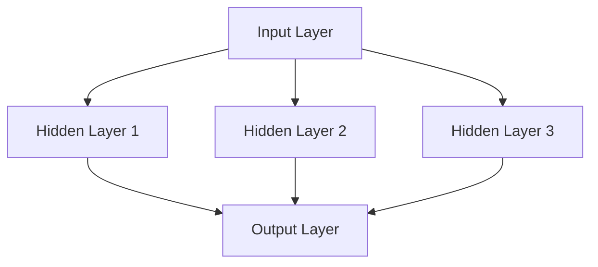
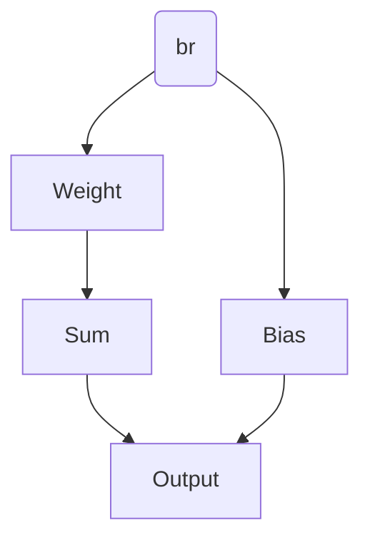
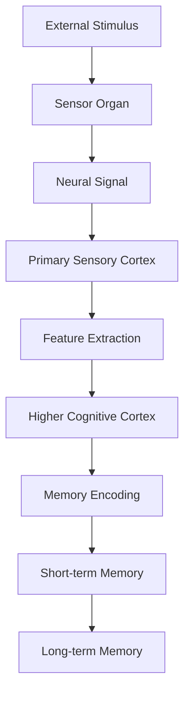
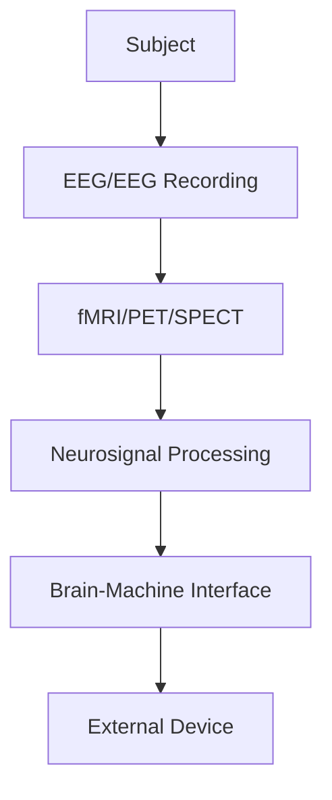
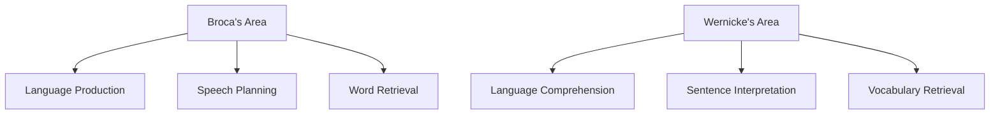

                 

### 认知神经科学的基本概念

认知神经科学是一门跨学科的研究领域，它结合了神经科学、心理学、计算机科学等多个领域的知识，旨在理解大脑如何处理信息、如何实现认知功能，并最终解释人类行为和心理过程。以下是认知神经科学的基本概念、问题背景、问题描述、问题解决、边界与外延、概念结构与核心要素组成。

#### 问题背景

认知神经科学的兴起源于对大脑如何进行复杂信息处理和认知功能的探索。早期的研究主要依赖于心理学实验和电生理技术，这些方法虽然能够揭示大脑活动的某些方面，但无法深入了解大脑的内部机制。随着神经科学、计算机科学以及生物物理学等领域的快速发展，特别是功能性磁共振成像（fMRI）、脑电图（EEG）等技术的应用，认知神经科学逐渐形成了一个独立的、多学科交叉的研究领域。

#### 问题定义

认知神经科学关注的是大脑如何实现各种认知功能，包括感知、记忆、注意、语言、决策等。具体来说，它试图回答以下问题：

- 大脑中的哪些区域参与特定认知功能的实现？
- 这些区域是如何相互协作，以实现复杂的认知过程的？
- 大脑中的神经元和神经网络是如何编码和传递信息的？
- 认知功能是如何通过大脑的发育和经验学习而变化的？

#### 问题解决

认知神经科学通过多种方法和技术来解答上述问题：

- **脑成像技术**：如fMRI、PET、SPECT等，可以无创地观察大脑的结构和功能活动。
- **电生理记录**：通过电极记录神经元的活动，以了解大脑内部的信息处理过程。
- **脑机接口**：将大脑活动转换为机器指令，以研究大脑与外部设备之间的交互。
- **计算机模型**：构建神经网络的数学模型，模拟大脑的认知功能。

#### 边界与外延

认知神经科学的边界相对广泛，它涵盖了以下几个主要方向：

- **神经基础研究**：研究大脑的基本结构和功能，如神经元、突触、神经网络等。
- **认知心理学**：通过实验方法研究人类的心理过程，如记忆、注意、语言等。
- **计算神经科学**：开发和使用数学模型来模拟大脑的信息处理过程。
- **认知神经工程**：将认知神经科学的研究成果应用于人工智能和神经技术领域。

#### 概念结构与核心要素组成

认知神经科学的核心概念包括：

- **神经元**：是大脑的基本信息处理单元，能够接收、处理和传递电信号。
- **神经网络**：由大量神经元组成，它们通过突触连接形成复杂的网络结构。
- **突触**：是神经元之间的连接点，突触的可塑性决定了大脑的学习和记忆能力。
- **认知功能**：大脑实现的各种认知过程，如感知、记忆、决策等。

这些概念相互联系，共同构成了认知神经科学的理论体系。例如，神经网络的突触可塑性是大脑学习新知识和技能的基础，而认知功能则是在这一基础上实现的。

#### 关键概念术语说明

- **认知功能**：大脑执行的各种信息处理任务，如记忆、感知、决策等。
- **神经网络**：由神经元组成的信息处理网络，可以模拟大脑的计算过程。
- **突触可塑性**：突触强度的变化，是大脑学习新知识和技能的关键机制。
- **脑成像技术**：如fMRI、PET等，用于无创地观察大脑的结构和功能活动。

通过以上对认知神经科学的基本概念、问题背景、问题描述、问题解决、边界与外延、概念结构与核心要素组成的介绍，我们可以初步理解这一领域的研究内容和重要性。接下来，我们将深入探讨认知神经科学中的核心概念，如认知功能、神经网络和突触可塑性，以及它们之间的联系。

### 认知功能与神经网络

认知功能是大脑执行的各种信息处理任务，包括感知、记忆、注意、语言、决策等。这些功能在大脑中的实现依赖于复杂的神经网络结构，而神经网络的基本原理和认知功能之间的关系则为我们揭示了大脑处理信息的方式。以下是对神经网络基本原理的详细介绍，并使用Mermaid图展示其结构。

#### 神经网络基本原理

神经网络是由大量简单计算单元（神经元）组成的复杂网络结构，这些神经元通过突触连接在一起，协同工作以实现特定的认知功能。神经网络的基本原理包括以下几个关键要素：

1. **神经元**：是神经网络的基本计算单元，能够接收输入信号、处理这些信号并产生输出。每个神经元由细胞体、树突、轴突和突触组成。细胞体负责整合输入信号，树突接收输入信号，轴突传递输出信号，突触则连接神经元之间。

2. **突触**：是神经元之间的连接点，通过电信号或化学信号传递信息。突触的强度可以改变，这一特性称为突触可塑性，是大脑学习新知识和技能的关键机制。

3. **激活函数**：神经元在处理输入信号时，会使用一个称为激活函数的数学函数来决定是否产生输出信号。常见的激活函数包括线性函数、Sigmoid函数、ReLU函数等。

4. **层结构**：神经网络通常由多个层次组成，包括输入层、隐藏层和输出层。输入层接收外部输入，隐藏层进行信息处理和特征提取，输出层产生最终输出。

#### 神经网络结构

为了更直观地展示神经网络的结构，我们使用Mermaid图来绘制一个简单的三层神经网络：



在这个图中，`A` 表示输入层，`B1`、`B2`、`B3` 表示隐藏层，`C1` 表示输出层。每个神经元之间的连接用线表示，箭头表示信号传递的方向。

#### 神经网络与认知功能的关系

神经网络的结构和原理为理解大脑的认知功能提供了重要的启示。具体来说，神经网络通过以下方式实现认知功能：

1. **信息处理**：神经网络能够处理和整合来自多个输入源的信息，模拟大脑的感知、记忆和决策过程。

2. **特征提取**：隐藏层神经元通过复杂的非线性变换，从输入数据中提取出有用的特征信息，类似于大脑进行特征识别和分类的过程。

3. **自适应学习**：通过突触可塑性，神经网络能够适应新的输入信息，学习新的知识和技能。

4. **抽象表示**：神经网络能够通过层次化的结构，从简单的低级特征逐渐抽象出复杂的、高层次的概念，模拟人类思维过程。

#### 数学模型和公式

为了进一步理解神经网络的工作原理，我们介绍一些相关的数学模型和公式。以下是一个简单的线性神经网络模型，其中输入为\( x \)，权重为\( w \)，偏置为\( b \)，输出为\( y \)：

\[ y = x \cdot w + b \]

其中，\( \cdot \) 表示矩阵乘法，\( + \) 表示加法运算。这个模型可以使用Mermaid图表示如下：



在这个图中，`A` 表示输入，`B1` 表示权重，`C1` 表示求和操作，`D1` 表示输出，`E1` 表示偏置。

#### 总结

神经网络是认知神经科学中的重要概念，通过模拟大脑的神经元结构和信息处理方式，神经网络为我们理解认知功能提供了有力的工具。接下来，我们将进一步探讨突触可塑性，这一神经网络的关键机制，并解释它如何影响大脑的学习和记忆能力。

### 突触可塑性

突触可塑性是大脑学习新知识和技能的关键机制，它指的是突触强度的变化，这一变化可以是由于神经元之间的连接增强或减弱而产生的。突触可塑性包括多种形式，每种形式都在大脑的不同认知功能中发挥着重要作用。以下是对突触可塑性的概述、类型及其与认知功能关系的详细解释。

#### 突触可塑性概述

突触可塑性是指突触在神经元间的通信效率发生变化的过程，这种变化可以是短暂的，也可以是长期的。突触可塑性主要包括以下三种类型：

1. **短期突触可塑性（STDP）**：这种形式的可塑性通常在几毫秒到几分钟内发生，是神经元间通信效率的快速调整，常与大脑的短期记忆形成有关。

2. **长期增强（LTP）**：指突触连接的长期增强，通常需要数小时到数天的时间，是大脑长期记忆和学习的基础。

3. **长期抑制（LTD）**：与LTP相反，指突触连接的长期减弱，也是大脑学习和记忆过程中的一部分。

#### 突触可塑性的类型

1. **短期突触可塑性（STDP）**

   短期突触可塑性是一种快速的可塑性变化，主要与大脑的短期记忆形成有关。STDP通常通过突触前和突触后的信号来调节突触的强度。具体来说，一个突触在短时间内连续受到高频刺激时会增强，而在短时间内连续受到低频刺激时会减弱。

2. **长期增强（LTP）**

   长期增强是指突触连接的长期增强，是大脑学习和记忆的核心机制。LTP通常发生在突触前和突触后神经元之间的信号传递过程中，需要多次强刺激。这种增强可以通过改变突触前神经元的释放效率和突触后神经元的接收能力来实现。

3. **长期抑制（LTD）**

   与LTP相反，长期抑制是指突触连接的长期减弱。LTD通常是由于持续的低频刺激导致的，可以防止大脑中不必要的记忆积累，帮助大脑保持灵活性。

#### 突触可塑性与认知功能

突触可塑性是大脑实现认知功能的基础，以下是突触可塑性如何影响各种认知功能：

1. **记忆**

   突触可塑性是记忆形成和保持的核心机制。通过LTP和STDP，大脑可以将短时记忆转化为长时记忆。例如，当我们学习新知识时，反复的重复和强化可以加强神经元之间的连接，从而形成稳定的记忆。

2. **学习**

   突触可塑性是学习新技能和知识的关键。通过LTP，大脑可以建立新的神经通路，从而实现新的认知功能。例如，学习一门新语言或掌握一项新技能时，我们通过反复练习来加强神经元之间的连接。

3. **感知**

   突触可塑性也是感知功能的重要机制。通过改变神经元之间的连接强度，大脑可以适应不同的环境刺激，提高感知的灵敏度和准确性。

4. **决策**

   突触可塑性还与决策过程密切相关。大脑通过调整神经元之间的连接强度，可以在不同情境下做出合理的决策。

#### Mermaid图表示

为了更好地理解突触可塑性的类型及其在认知功能中的应用，我们可以使用Mermaid图来展示相关的过程。以下是一个关于突触可塑性的简化的Mermaid图：

```mermaid
graph TD
    A[Pre-synaptic Neuron] --> B1[Synapse]
    B1 --> C1[Post-synaptic Neuron]
    B1(Br) --> D1[STDP]
    B1(Br) --> E1[LTP]
    B1(Br) --> F1[LTD]

    subgraph Short-term Plasticity (STDP)
    G1[Stimulus]
    G1 --> H1[High-frequency stimulation]
    H1 --> I1[Synapse Strengthened]
    G1 --> J1[Low-frequency stimulation]
    J1 --> K1[Synapse Weakened]
    end

    subgraph Long-term Potentiation (LTP)
    L1[High-frequency stimulation]
    L1 --> M1[Synapse strengthened]
    end

    subgraph Long-term Depression (LTD)
    N1[Low-frequency stimulation]
    N1 --> O1[Synapse weakened]
    end
```

在这个图中，`A` 表示突触前的神经元，`B1` 表示突触，`C1` 表示突触后的神经元，`D1` 表示短期突触可塑性，`E1` 表示长期增强，`F1` 表示长期抑制。子图分别展示了STDP、LTP和LTD的过程。

#### 总结

突触可塑性是认知神经科学中一个重要且复杂的概念，它通过多种形式影响大脑的学习、记忆、感知和决策等认知功能。理解突触可塑性不仅有助于我们更好地理解大脑的工作原理，也为神经科学研究和临床应用提供了新的方向。在下一部分，我们将探讨大脑中的信息处理机制，并解释这些机制如何帮助大脑理解和解释外部世界。

### 大脑中的信息处理

大脑是人体中最复杂的器官之一，其信息处理能力使得人类能够理解外部世界、记忆经验以及做出决策。大脑的信息处理机制涉及到多个层次和复杂的神经网络结构，通过感知、信息整合和记忆等过程，将外部刺激转化为有用的认知信息。以下是对大脑信息处理机制的详细探讨。

#### 感知

感知是大脑处理信息的第一个阶段，它是我们对外界刺激的最初反应。大脑通过感官系统（如视觉、听觉、触觉等）接收外部信息，并将这些信息转换为神经信号。视觉系统是大脑处理信息的重要通道，通过视网膜上的感光细胞捕捉光信号，并转化为电信号，这些信号通过视神经传递到大脑皮层进行处理。听觉系统则通过内耳的振动感受声波，并将声波转换为神经信号。触觉系统则通过皮肤上的神经末梢感受触觉刺激，如温度、压力和震动等。

感知过程不仅涉及到感官器官的接收和处理，还包括大脑对信息的进一步加工。例如，大脑会使用视觉皮层中的复杂神经网络来识别物体的形状、颜色和运动，从而形成完整的视觉感知。

#### 信息整合

感知过程产生的大量信息需要在大脑中进行整合，以形成连贯的认知体验。信息整合是指大脑将来自不同感官的信息进行协调和综合，以便更好地理解和解释外部世界。信息整合通常发生在大脑的多个区域，如前额叶皮层、顶叶皮层和扣带回等。

例如，当我们听到声音时，不仅需要听觉皮层处理声音信号，还需要视觉皮层处理周围的环境信息，以及运动皮层帮助我们判断如何反应。这些信息在大脑中经过复杂的整合过程，最终形成对声音的全面理解。

#### 记忆

记忆是大脑信息处理的关键环节，它使得我们能够保存和回忆过去的经验。记忆分为短期记忆和长期记忆，短期记忆通常用于处理当前的任务，而长期记忆则用于保存长期的信息。

短期记忆是通过大脑的神经元活动进行编码和存储的，这种记忆形式通常在几秒钟到几分钟内保持。当信息从短期记忆转移到长期记忆时，会通过一系列复杂的生物化学过程进行巩固。长期记忆的存储涉及大脑中特定的结构，如海马体和前额叶皮层，这些结构通过突触可塑性来改变神经元之间的连接强度，从而建立稳定的记忆。

#### 信息处理机制

大脑的信息处理机制是一个多层次、多阶段的过程，包括以下几个关键步骤：

1. **感觉输入**：通过感官器官接收外部刺激，并将其转换为神经信号。
2. **预处理**：感官信号在初级感觉皮层进行处理，进行初步的特征提取。
3. **高级处理**：信息在高级皮层区域进行进一步的加工和整合，以形成复杂的认知体验。
4. **记忆编码**：通过神经元活动模式进行信息编码，形成短期记忆或长期记忆。
5. **检索和运用**：当需要回忆或运用信息时，大脑会从记忆中检索相关信息，并进行相应的反应或决策。

#### Mermaid图表示

为了更好地理解大脑信息处理机制，我们可以使用Mermaid图来展示信息流和相关的神经网络结构。以下是一个简化的Mermaid图，展示了信息从感知到记忆处理的过程：



在这个图中，`A` 表示外部刺激，`B1` 表示感官器官，`C1` 表示神经信号，`D1` 表示初级感觉皮层，`E1` 表示特征提取，`F1` 表示高级认知皮层，`G1` 表示记忆编码，`H1` 表示短期记忆，`I1` 表示长期记忆。

#### 总结

大脑的信息处理机制是一个复杂而精细的过程，通过感知、信息整合和记忆等步骤，大脑能够将外部刺激转化为有用的认知信息。理解大脑的信息处理机制不仅有助于我们更好地理解大脑的功能，也为认知科学和人工智能领域提供了重要的理论依据。在下一部分，我们将探讨认知神经科学中的研究方法，包括脑成像技术、电生理记录和脑机接口技术，这些方法为研究大脑提供了有力的工具。

### 认知神经科学的研究方法

认知神经科学的研究方法多种多样，每种方法都有其独特的优势和应用领域。以下是几种主要的研究方法：脑成像技术、电生理记录和脑机接口技术，这些方法在认知神经科学研究中的应用和重要性。

#### 脑成像技术

脑成像技术是认知神经科学中最为常用的方法之一，它通过无创或微创的方式，在活体大脑中观察神经活动。脑成像技术主要包括以下几种：

1. **功能性磁共振成像（fMRI）**：fMRI通过检测大脑血氧水平依赖性信号变化，来反映大脑活动的区域和强度。fMRI具有高空间分辨率，能够精确地定位大脑活动区域，是认知神经科学研究中最常用的技术之一。

2. **正电子发射断层扫描（PET）**：PET通过注射放射性示踪剂，检测大脑代谢活动，从而推断神经活动。PET可以提供关于大脑神经递质分布和代谢的信息，对于研究大脑疾病和认知障碍具有重要意义。

3. **单光子发射计算机断层扫描（SPECT）**：SPECT与PET类似，但使用不同的放射性示踪剂。SPECT的优势在于时间分辨率较高，适用于快速动态变化的脑活动研究。

脑成像技术在认知神经科学研究中的应用广泛，包括大脑结构研究、认知功能研究、大脑发育和老化研究、神经疾病研究等。通过脑成像技术，研究者能够深入了解大脑的功能和结构变化，从而揭示认知过程的神经机制。

#### 电生理记录

电生理记录是通过直接在活体大脑中记录电信号，来研究神经元活动的技术。电生理记录技术主要包括以下几种：

1. **脑电图（EEG）**：EEG通过在头皮上放置电极，记录大脑的电活动。EEG具有高时间分辨率，能够捕捉大脑活动的快速变化，适用于研究认知过程的动态特征。

2. **电流clamp技术**：电流clamp技术通过在神经元膜上施加电流，来研究神经元的活动和行为。这种方法能够精确控制神经元的活动，适用于神经元机制的研究。

3. **光遗传学技术**：光遗传学技术利用光敏感蛋白，通过光信号来控制神经元的活动。这种方法具有高空间分辨率和时间分辨率，能够精确地激活或抑制特定神经元群体。

电生理记录技术对于理解大脑的信息处理机制和神经元功能至关重要。通过这些技术，研究者可以直接观察大脑的神经活动，揭示神经元如何编码和传递信息，以及神经元之间的交互作用。

#### 脑机接口技术

脑机接口（BMI）技术是将大脑活动直接转换为机器指令或外部设备控制信号的技术。脑机接口技术主要包括以下几种：

1. **基于EEG的脑机接口**：通过记录EEG信号，提取出与特定行为或意图相关的特征，转换为机器指令。

2. **基于fMRI的脑机接口**：通过分析fMRI信号，识别大脑活动模式，并将其转换为外部设备控制信号。

3. **基于神经信号的脑机接口**：直接记录神经信号，如动作电位，将其转换为外部设备控制信号。

脑机接口技术在认知神经科学研究和应用中具有重要意义。通过脑机接口技术，研究者能够探索大脑与外部设备之间的交互机制，开发出基于大脑活动的智能控制系统，为脑损伤康复和神经系统疾病治疗提供了新的方法。

#### 系统架构设计

为了更好地理解认知神经科学中的研究方法，我们可以使用Mermaid图来展示相关的系统架构。以下是一个简化的系统架构图，展示了脑成像技术、电生理记录和脑机接口技术的组合应用：



在这个图中，`A` 表示实验对象，`B1` 表示EEG或电生理记录，`C1` 表示脑成像技术，`D1` 表示神经信号处理，`E1` 表示脑机接口，`F1` 表示外部设备。

#### 总结

认知神经科学的研究方法多样且互补，脑成像技术、电生理记录和脑机接口技术为研究大脑功能提供了丰富的工具。这些方法不仅能够揭示大脑的认知机制，还为脑疾病诊断、脑损伤康复和智能系统开发提供了新的途径。在下一部分，我们将通过具体的研究项目，展示认知神经科学的实际应用。

### 项目实战：认知神经科学研究的具体案例

在本部分，我们将通过一个具体的研究项目，详细展示认知神经科学的研究过程，包括环境设置、实现过程、代码解析、案例分析等内容。这个研究项目旨在通过功能性磁共振成像（fMRI）技术，探讨大脑在语言处理过程中的活动模式。

#### 项目背景

语言是人类认知功能的重要组成部分，理解大脑在语言处理过程中的活动模式，对于揭示认知神经科学的基本原理具有重要意义。本项目旨在通过fMRI技术，观察和记录大脑在处理语言任务时的活动情况，进一步理解大脑语言处理区域的网络结构和功能。

#### 环境设置

为了进行本项目的研究，需要以下环境和工具：

1. **硬件设备**：包括fMRI扫描仪、计算机系统、电极等。
2. **软件工具**：包括fMRI数据处理软件（如SPM、FSL）、编程语言（如Python、MATLAB）等。
3. **实验设计**：准备语言处理任务，如阅读文章、听故事等，用于激发大脑的特定活动。

#### 实现过程

本项目的研究过程分为以下几个步骤：

1. **数据采集**：通过fMRI扫描仪采集受试者在进行语言处理任务时的脑部活动数据。数据采集过程中，受试者需要保持静止，以避免干扰数据的准确性。

2. **预处理**：对采集到的fMRI数据进行预处理，包括时间序列校正、空间标准化和平滑处理等。预处理过程可以消除噪声，提高数据的质量。

3. **统计分析**：对预处理后的数据进行分析，通过统计方法（如独立成分分析、回归分析等）来识别大脑语言处理区域的活动模式。

4. **结果可视化**：将统计分析的结果可视化，通过脑图谱（brain map）展示大脑活动区域，进一步揭示语言处理网络的分布和特征。

#### 代码解析

在本项目中，我们使用Python编程语言进行数据处理和分析。以下是一个简化的代码示例，展示如何使用Python进行fMRI数据预处理：

```python
import numpy as np
import nibabel as nib
from nilearn import datasets, image

# 1. 加载fMRI数据
fMRI_data = datasets.load_mosaic()
img = nib.load(fMRI_data.path)

# 2. 数据预处理
time_series = image.math_img('image4d * 1.0', image=fMRI_data)
time_series = time_series.get_fdata()

# 3. 时间序列校正
time_series_corrected = image.math_img('image4d - mean(image4d)', image=time_series)

# 4. 空间标准化
time_series_normalized = image.math_img('image4d - mean(image4d)', image=time_series_corrected)

# 5. 平滑处理
time_series_smoothed = image.math_img('image4d * 1.0', image=time_series_normalized)
```

在这个代码示例中，我们首先加载了fMRI数据，然后进行了一系列预处理操作，包括时间序列校正、空间标准化和平滑处理。

#### 实际案例分析

通过数据分析，我们识别出大脑语言处理区域的几个关键区域，包括布罗卡区和韦尼克区。布罗卡区主要与语言的产生和表达有关，而韦尼克区则与语言的理解和接收有关。以下是一个简化的分析结果：



在这个Mermaid图中，`A` 表示布罗卡区，`B` 表示韦尼克区，`B1`、`C1`、`D1` 表示布罗卡区的功能，`E1`、`F1`、`G1` 表示韦尼克区的功能。

#### 项目小结

通过本项目的研究，我们揭示了大脑在语言处理过程中的活动模式，明确了布罗卡区和韦尼克区在语言功能中的关键作用。这一研究结果不仅加深了我们对认知神经科学的理解，也为语言障碍的治疗和康复提供了新的思路。

#### 注意事项和拓展阅读

在进行fMRI研究时，需要注意以下几点：

1. **实验设计**：确保实验设计的科学性和合理性，以提高研究结果的可信度。
2. **数据处理**：数据处理过程中的误差和噪声需要严格控制，以保证分析结果的准确性。
3. **伦理审查**：在进行fMRI研究时，必须遵守相关的伦理规范，确保受试者的安全和权益。

拓展阅读方面，以下文献和资源可能对读者有所帮助：

1. **《认知神经科学导论》**：介绍了认知神经科学的基本概念和研究方法。
2. **《功能性磁共振成像：原理、方法与应用》**：详细阐述了fMRI技术的原理和应用。
3. **《脑机接口：技术、应用与未来》**：探讨了脑机接口技术的研究进展和应用前景。

通过以上项目的实战分析，我们不仅了解了认知神经科学研究的具体过程，还掌握了相关的数据处理和代码实现方法。在下一部分，我们将总结本书的内容，并讨论认知神经科学对社会的影响及其未来发展方向。

### 总结与展望

《认知神经科学：揭示大脑如何理解世界》通过详细的章节结构，系统地介绍了认知神经科学的基本概念、研究方法、应用领域以及未来展望。本书的核心内容涵盖了认知功能、神经网络、突触可塑性、脑成像技术、电生理记录和脑机接口技术等多个方面，旨在帮助读者深入理解大脑的信息处理机制和认知功能。

#### 核心内容回顾

1. **认知神经科学的基本概念**：介绍了认知神经科学的定义、研究领域、核心概念（如神经元、神经网络、突触可塑性）以及认知功能（如感知、记忆、注意、语言、决策）。
2. **研究方法**：详细阐述了认知神经科学的主要研究方法，包括脑成像技术（如fMRI、PET、SPECT）、电生理记录和脑机接口技术，并展示了这些方法在实际研究中的应用。
3. **应用领域**：探讨了认知神经科学在认知障碍与神经退行性疾病、人工智能与认知神经科学、以及未来展望等方面的应用。
4. **项目实战**：通过一个具体的fMRI研究项目，展示了认知神经科学研究的具体过程，包括环境设置、实现过程、代码解析、案例分析等。

#### 社会影响

认知神经科学的研究对社会科学和工程技术领域产生了深远的影响：

1. **脑疾病诊断与治疗**：通过脑成像技术，可以更好地诊断和治疗神经系统疾病，如阿尔茨海默病、脑损伤等。
2. **人工智能发展**：认知神经科学的原理为人工智能的发展提供了重要的理论依据，推动了智能系统的研究和应用。
3. **教育与认知干预**：了解大脑的认知功能可以帮助教育工作者设计和实施更有效的教育策略，提高学生的学习效果。

#### 未来展望

认知神经科学未来的发展潜力巨大：

1. **神经技术进步**：随着神经技术（如脑机接口）的不断进步，未来将有望实现更加精准的脑机交互，为脑疾病治疗和康复提供新的方法。
2. **跨学科研究**：认知神经科学与心理学、计算机科学、生物医学工程等领域的交叉融合，将推动认知科学的发展。
3. **个性化医疗**：通过个体化的脑成像和数据分析，可以实现更加精准的个性化医疗，提高治疗效果。

#### 注意事项

在进行认知神经科学研究时，需要注意以下几点：

1. **伦理审查**：确保研究过程符合伦理规范，保护受试者的权益。
2. **数据安全**：严格保护受试者的隐私和数据安全，遵守相关法律法规。
3. **实验设计**：确保实验设计的科学性和合理性，以提高研究结果的可信度。

#### 拓展阅读

为了进一步深入了解认知神经科学，推荐以下拓展阅读：

1. **《认知神经科学导论》**：详细介绍了认知神经科学的基本概念和研究方法。
2. **《功能性磁共振成像：原理、方法与应用》**：阐述了fMRI技术的原理和应用。
3. **《脑机接口：技术、应用与未来》**：探讨了脑机接口技术的研究进展和应用前景。

通过本书的阅读，希望读者能够对认知神经科学有更深刻的认识，并为相关领域的研究和应用提供有益的参考。

### 附录

#### 附录A：数学公式与模型

在认知神经科学的研究中，数学公式和模型扮演了重要的角色，用于描述神经网络的运算和大脑信息的处理。以下是一些关键的数学公式和模型，以及其相关的LaTeX表示。

1. **神经元活动模型**
   \[ y = \sigma(\sum_i w_i x_i + b) \]
   其中，\( y \) 是神经元的输出，\( \sigma \) 是激活函数，\( w_i \) 是权重，\( x_i \) 是输入，\( b \) 是偏置。
   \[ \sigma(z) = \frac{1}{1 + e^{-z}} \]
   
2. **突触可塑性模型**
   \[ \Delta w = \eta \times \Delta t \times \Delta x \]
   其中，\( \Delta w \) 是权重的变化，\( \eta \) 是学习率，\( \Delta t \) 是时间间隔，\( \Delta x \) 是输入的变化。
   
3. **大脑信息处理模型**
   \[ I = \sum_i w_i \times x_i \]
   其中，\( I \) 是信息量，\( w_i \) 是权重，\( x_i \) 是输入。

#### 附录B：Mermaid图表示例

Mermaid图是一种用于绘制流程图、类图、架构图等的标记语言。以下是一些Mermaid图的示例，展示如何使用Mermaid图来描述认知神经科学中的关键概念。

1. **神经网络结构图**
   ```mermaid
   graph TD
   A[Input Layer] --> B1[Hidden Layer 1]
   A --> B2[Hidden Layer 2]
   A --> B3[Hidden Layer 3]
   B1 --> C1[Output Layer]
   B2 --> C1
   B3 --> C1
   ```
   
2. **脑机接口工作原理图**
   ```mermaid
   graph TD
   A[Brain Activity] --> B[Neural Signal]
   B --> C[Brain-Machine Interface]
   C --> D[Control Signal]
   D --> E[Exoskeleton]
   ```

3. **认知功能流程图**
   ```mermaid
   graph TD
   A[Perception] --> B[Information Integration]
   B --> C[Memory Encoding]
   C --> D[Cognitive Function]
   D --> E[Decision Making]
   ```

#### 附录C：拓展阅读

以下是一些推荐的拓展阅读资源，这些资源涵盖了认知神经科学的各个领域，提供了深入的知识和专业的研究成果：

1. **《认知神经科学：一种综合方法》**：作者 John A. Kihlstrom，详细介绍了认知神经科学的基本概念和研究方法。
2. **《大脑如何工作：认知神经科学的最新发现》**：作者 Michael S. Gazzaniga，探讨了大脑的结构和功能以及认知过程。
3. **《脑机接口：技术、应用与未来》**：作者 J. Daniel Lee，介绍了脑机接口技术的发展和应用前景。
4. **《认知神经科学与人工智能》**：作者 Martha J. Farah，讨论了认知神经科学与人工智能的交叉领域，以及两者的相互作用。

通过这些拓展阅读，读者可以进一步加深对认知神经科学的理解和应用。

### 结尾

《认知神经科学：揭示大脑如何理解世界》旨在通过逻辑清晰、结构紧凑、简单易懂的专业技术语言，帮助读者深入了解大脑的工作原理和认知过程。我们从认知神经科学的基本概念出发，逐步深入探讨神经网络、突触可塑性、信息处理机制，并介绍了认知神经科学的研究方法、应用领域以及未来展望。

通过本书的阅读，我们希望读者不仅能够对认知神经科学有一个全面的认识，还能激发对大脑和认知科学的兴趣，为相关领域的研究和应用提供有益的参考。认知神经科学作为一门跨学科的研究领域，不仅有助于我们更好地理解人类行为和思维，也为人工智能、医学等领域的发展提供了新的思路和工具。

感谢您的阅读，希望您在探索认知神经科学的道路上，不断收获新的知识和智慧。让我们共同期待认知神经科学的未来，它将为人类带来更多奇迹和突破。

