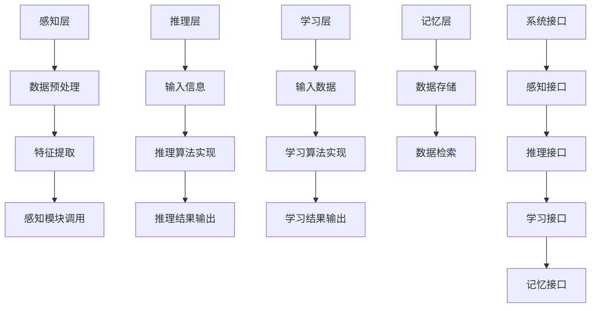

                 

# 认知科学与人工智能的交叉：探索智能体理解世界的机制

> 关键词：认知科学、人工智能、智能体、理解世界、机制

> 摘要：本文探讨了认知科学与人工智能的交叉领域，旨在探索智能体理解世界的机制。通过介绍认知科学和人工智能的基本概念、核心原理及其在智能体理解世界中的应用，文章分析了认知科学在人工智能中的指导作用，并对未来发展趋势进行了展望。

## 第一部分：背景介绍

### 1. 引言

在当今数字化时代，人工智能（AI）已经成为推动社会发展的重要力量。认知科学作为研究人类思维过程和心理活动的学科，与人工智能有着密切的联系。本书《认知科学与人工智能的交叉：探索智能体理解世界的机制》旨在探讨认知科学和人工智能如何相互融合，共同推动智能体对世界的理解。

### 2. 问题描述

尽管人工智能在处理大量数据和执行复杂任务方面取得了显著成就，但它们在理解世界、模仿人类认知过程方面仍存在诸多局限。认知科学的研究为人工智能提供了理论基础，但如何将这些理论应用于实际的AI系统中仍是一个挑战。本书将探讨这一问题，并试图找到两者交叉的切入点。

### 3. 问题解决

本书将从以下几个方面展开讨论：

- 认知科学的基本原理：介绍认知科学的核心概念、理论框架和重要研究成果。
- 人工智能的基本原理：探讨人工智能的发展历程、主要算法和技术。
- 智能体的理解机制：分析智能体如何通过感知、推理、学习和记忆等方式理解世界。
- 认知科学在人工智能中的应用：介绍认知科学理论如何指导人工智能算法的设计和优化。
- 未来展望：探讨认知科学与人工智能交叉领域的未来发展趋势和潜在应用。

### 4. 边界与外延

认知科学与人工智能的交叉领域涉及多个学科，包括心理学、神经科学、计算机科学、哲学等。本书将侧重于认知科学和人工智能的理论基础和实际应用，但不涉及其他相关领域的详细讨论。

### 5. 概念结构与核心要素组成

#### 5.1 认知科学的核心概念

- **感知**：智能体如何接收外部信息。
- **注意**：智能体如何选择和处理信息。
- **记忆**：智能体如何存储和检索信息。
- **思维**：智能体如何进行逻辑推理和问题解决。
- **情绪**：智能体如何体验和表达情感。

#### 5.2 人工智能的核心概念

- **机器学习**：智能体如何通过数据和算法自主改进。
- **深度学习**：基于多层神经网络的一种机器学习方法。
- **自然语言处理**：智能体如何理解和生成自然语言。
- **计算机视觉**：智能体如何理解和解释视觉信息。

#### 5.3 智能体的理解机制

- **感知模块**：接收和处理外部信息。
- **推理模块**：利用已有信息进行逻辑推理。
- **学习模块**：通过经验积累改进自身性能。
- **记忆模块**：存储和检索信息。

### 6. 本章小结

本章介绍了本书的背景、问题描述、问题解决方法、边界与外延、概念结构与核心要素组成。接下来，我们将分别探讨认知科学和人工智能的基本原理，以及智能体的理解机制。通过这些内容，读者将更好地理解认知科学与人工智能的交叉领域，并了解这一领域的研究现状和未来发展方向。

---

## 第二部分：核心概念与联系

### 1. 认知科学的基本概念

#### 1.1 认知心理学的定义与发展历程

认知心理学是研究人类认知过程的科学，旨在理解个体如何感知、思考、记忆、解决问题以及学习。自20世纪中叶以来，认知心理学经历了多次变革和发展，从信息加工模型到连接主义模型，不断推动着认知科学的发展。

#### 1.2 认知科学的核心概念

- **感知**：个体如何接收和处理外部信息。感知是人类与外界环境互动的第一步，包括视觉、听觉、触觉、嗅觉和味觉等。
- **注意**：个体如何选择和处理信息。注意决定了信息处理过程中的资源分配，影响人们对信息的接收和加工。
- **记忆**：个体如何存储和检索信息。记忆是信息加工的重要环节，包括短期记忆和长期记忆。
- **思维**：个体如何进行逻辑推理和问题解决。思维是人们利用已有知识和信息进行推理、判断和决策的过程。
- **情绪**：个体如何体验和表达情感。情绪是人们对外界刺激的主观体验和生理反应，对认知和行为有重要影响。

### 2. 人工智能的基本概念

#### 2.1 人工智能的定义与发展历程

人工智能是模拟人类智能行为的计算机技术。自20世纪50年代以来，人工智能经历了多个发展阶段，包括符号主义、连接主义、强化学习等。随着计算能力的提升和数据量的增加，人工智能在各个领域取得了显著进展。

#### 2.2 人工智能的核心概念

- **机器学习**：智能体如何通过数据和算法自主改进。机器学习是使计算机能够从数据中学习，并在新的数据上进行预测和决策的一种方法。
- **深度学习**：基于多层神经网络的一种机器学习方法。深度学习通过模拟人脑神经网络结构，实现图像、语音和自然语言等复杂数据的处理和分析。
- **自然语言处理**：智能体如何理解和生成自然语言。自然语言处理是人工智能的重要领域，旨在实现计算机对自然语言的识别、理解和生成。
- **计算机视觉**：智能体如何理解和解释视觉信息。计算机视觉旨在使计算机具备人类的视觉能力，理解图像和视频中的场景和物体。

### 3. 认知科学在人工智能中的应用

#### 3.1 认知心理学在人工智能中的应用

认知心理学的研究成果为人工智能提供了理论基础，指导了智能体感知、推理、学习等方面的算法设计。

- **感知模块设计**：借鉴感知心理学，设计智能体的感知系统，使其能够有效地接收和处理外部信息。
- **推理模块设计**：基于认知心理学的推理理论，设计智能体的推理系统，使其能够进行逻辑推理和问题解决。
- **学习模块设计**：借鉴认知心理学的学习理论，设计智能体的学习系统，使其能够通过经验积累改进自身性能。
- **记忆模块设计**：基于认知心理学的记忆理论，设计智能体的记忆系统，使其能够存储和检索信息。

#### 3.2 自然语言处理与认知科学的联系

自然语言处理是人工智能的重要领域，认知科学为自然语言处理提供了理论支持，帮助智能体更好地理解和生成自然语言。

- **语义理解**：借鉴认知心理学的语义理论，设计智能体的语义理解系统，使其能够理解语言中的语义关系和含义。
- **情感分析**：借鉴认知心理学的情感理论，设计智能体的情感分析系统，使其能够识别和处理语言中的情感信息。
- **对话系统**：借鉴认知心理学的对话理论，设计智能体的对话系统，使其能够与人类进行自然、流畅的对话。

### 4. 概念属性特征对比表格

| 概念       | 认知科学 | 人工智能 |
|------------|----------|----------|
| 感知       | 个体如何接收和处理外部信息 | 智能体如何通过传感器接收和处理外部信息 |
| 注意       | 个体如何选择和处理信息 | 智能体如何分配注意力资源 |
| 记忆       | 个体如何存储和检索信息 | 智能体如何通过算法和模型存储和检索信息 |
| 思维       | 个体如何进行逻辑推理和问题解决 | 智能体如何利用算法和模型进行逻辑推理和问题解决 |
| 情绪       | 个体如何体验和表达情感 | 智能体如何识别和处理情感信息 |

---

## 第三部分：算法原理讲解

### 3.1 机器学习算法原理

机器学习是人工智能的核心技术之一，其基本原理是使计算机能够从数据中学习，并在新的数据上进行预测和决策。以下是一个简单的机器学习算法——线性回归的原理讲解。

#### 3.1.1 算法描述

线性回归是一种用于预测连续值的机器学习算法。其基本原理是通过建立一个线性模型，将输入特征与输出目标之间的关系表示为一个线性方程。

假设我们有一组输入特征 \(X\) 和输出目标 \(y\)，线性回归的目标是找到一个线性方程 \(y = wx + b\)，使得预测值 \(y\) 与真实值 \(y\) 的差距最小。

#### 3.1.2 算法流程

1. **数据预处理**：将输入特征和输出目标进行标准化处理，使其具有相似的尺度。
2. **模型初始化**：随机初始化权重 \(w\) 和偏置 \(b\)。
3. **迭代优化**：通过梯度下降算法，不断更新权重 \(w\) 和偏置 \(b\)，使得预测值与真实值的差距最小。
4. **模型评估**：使用测试集对模型进行评估，计算预测值与真实值之间的均方误差（MSE）。

#### 3.1.3 数学模型和公式

线性回归的数学模型可以表示为：

$$y = wx + b$$

其中，\(y\) 是输出目标，\(x\) 是输入特征，\(w\) 是权重，\(b\) 是偏置。

通过最小化均方误差（MSE）来优化模型：

$$MSE = \frac{1}{n}\sum_{i=1}^{n}(y_i - wx_i - b)^2$$

其中，\(n\) 是样本数量，\(y_i\) 是第 \(i\) 个样本的真实值，\(x_i\) 是第 \(i\) 个样本的输入特征。

#### 3.1.4 举例说明

假设我们有一组输入特征 \(x_1, x_2, ..., x_n\) 和输出目标 \(y_1, y_2, ..., y_n\)，我们可以使用线性回归算法来预测新的输入特征 \(x_{new}\) 的输出目标 \(y_{new}\)。

首先，我们需要对输入特征和输出目标进行标准化处理。然后，我们初始化权重 \(w\) 和偏置 \(b\)。接下来，通过迭代优化过程，不断更新权重和偏置，使得预测值与真实值的差距最小。

最终，我们可以使用训练好的线性回归模型来预测新的输入特征的输出目标。例如，给定一个新的输入特征 \(x_{new} = 5\)，我们可以计算出对应的输出目标 \(y_{new}\)。

### 3.2 深度学习算法原理

深度学习是机器学习的一个分支，其基本原理是通过多层神经网络来实现数据的自动特征提取和模型优化。以下是一个简单的深度学习算法——卷积神经网络（CNN）的原理讲解。

#### 3.2.1 算法描述

卷积神经网络是一种用于处理图像数据的深度学习算法。其基本原理是通过卷积层、池化层和全连接层等结构，实现对图像数据的自动特征提取和分类。

#### 3.2.2 算法流程

1. **数据预处理**：对图像数据进行归一化处理，将其缩放到固定的尺寸。
2. **卷积层**：通过卷积操作提取图像的局部特征。
3. **池化层**：对卷积结果进行下采样，减少参数数量和计算量。
4. **全连接层**：将池化结果通过全连接层进行分类。
5. **损失函数**：使用交叉熵损失函数计算预测值与真实值之间的差距。
6. **反向传播**：通过反向传播算法，不断更新网络参数，使得损失函数值最小。

#### 3.2.3 数学模型和公式

卷积神经网络的数学模型可以表示为：

$$\text{激活函数}(z) = \sigma(\sum_{i=1}^{n}w_{ij}x_{j} + b)$$

其中，\(z\) 是卷积层的输出值，\(w_{ij}\) 是卷积核的权重，\(x_{j}\) 是输入特征，\(\sigma\) 是激活函数（如Sigmoid、ReLU等），\(b\) 是偏置。

交叉熵损失函数可以表示为：

$$L = -\frac{1}{m}\sum_{i=1}^{m}y_{i}\log(p_{i})$$

其中，\(y_{i}\) 是第 \(i\) 个样本的真实标签，\(p_{i}\) 是第 \(i\) 个样本的预测概率。

#### 3.2.4 举例说明

假设我们有一个训练好的卷积神经网络模型，输入图像为 \(x\)，预测标签为 \(y\)。我们可以使用该模型来预测新的输入图像 \(x_{new}\) 的标签 \(y_{new}\)。

首先，我们对输入图像进行归一化处理。然后，通过卷积层、池化层和全连接层等结构，对输入图像进行特征提取和分类。最终，我们可以得到输入图像的预测标签。

### 3.3 自然语言处理算法原理

自然语言处理是人工智能的重要领域，其基本原理是通过深度学习模型实现文本数据的自动特征提取和语义理解。以下是一个简单的自然语言处理算法——循环神经网络（RNN）的原理讲解。

#### 3.3.1 算法描述

循环神经网络是一种用于处理序列数据的深度学习算法。其基本原理是通过循环结构，实现对序列数据的记忆和建模。

#### 3.3.2 算法流程

1. **数据预处理**：对文本数据进行分词、去停用词等预处理。
2. **嵌入层**：将文本数据转换为固定长度的向量表示。
3. **循环层**：通过循环结构，实现对序列数据的记忆和建模。
4. **输出层**：将循环层的输出通过全连接层进行分类或预测。

#### 3.3.3 数学模型和公式

循环神经网络的数学模型可以表示为：

$$h_{t} = \text{激活函数}(\sum_{i=1}^{n}w_{ij}x_{j} + b)$$

其中，\(h_{t}\) 是第 \(t\) 个时刻的隐藏状态，\(x_{j}\) 是第 \(j\) 个输入特征，\(w_{ij}\) 是权重，\(\text{激活函数}\) 是如ReLU、Sigmoid等。

全连接层的数学模型可以表示为：

$$p_{i} = \text{激活函数}(\sum_{j=1}^{n}w_{ji}h_{j} + b)$$

其中，\(p_{i}\) 是第 \(i\) 个输出的预测概率，\(h_{j}\) 是第 \(j\) 个隐藏状态，\(w_{ji}\) 是权重。

损失函数可以使用交叉熵损失函数：

$$L = -\frac{1}{m}\sum_{i=1}^{m}y_{i}\log(p_{i})$$

#### 3.3.4 举例说明

假设我们有一个训练好的循环神经网络模型，输入文本为 \(x\)，预测标签为 \(y\)。我们可以使用该模型来预测新的输入文本 \(x_{new}\) 的标签 \(y_{new}\)。

首先，我们对输入文本进行分词和预处理。然后，通过嵌入层将文本转换为向量表示。接下来，通过循环层对文本进行特征提取和建模。最终，通过输出层得到输入文本的预测标签。

---

## 第四部分：系统分析与架构设计方案

### 4.1 问题场景介绍

在现实世界中，智能体需要处理大量的信息，并对这些信息进行理解、分析和决策。例如，自动驾驶系统需要理解道路环境、交通规则和车辆状态，并做出安全、高效的驾驶决策。智能家居系统需要理解用户需求、环境变化和设备状态，为用户提供舒适的居住环境。

### 4.2 项目介绍

本项目旨在设计并实现一个智能体系统，该系统能够处理多种类型的输入信息，并利用认知科学和人工智能技术进行理解、分析和决策。系统主要包括感知模块、推理模块、学习模块和记忆模块，分别负责接收和处理外部信息、进行逻辑推理、通过经验积累改进自身性能以及存储和检索信息。

### 4.3 系统功能设计

1. **感知模块**：接收和处理外部信息，包括视觉、听觉、触觉、嗅觉和味觉等多种感知方式。
2. **推理模块**：利用已有信息进行逻辑推理和问题解决，包括因果推理、假设检验和决策树等。
3. **学习模块**：通过经验积累改进自身性能，包括监督学习、无监督学习和强化学习等。
4. **记忆模块**：存储和检索信息，包括短期记忆和长期记忆。

### 4.4 系统架构设计

系统架构采用分层设计，包括感知层、推理层、学习层和记忆层。各层之间通过接口进行通信，实现信息的传递和功能调用。

- **感知层**：负责接收和处理外部信息，包括传感器数据预处理、特征提取和感知模块调用等。
- **推理层**：负责利用已有信息进行逻辑推理和问题解决，包括推理算法实现、推理过程优化和推理结果输出等。
- **学习层**：负责通过经验积累改进自身性能，包括学习算法实现、学习过程优化和学习结果输出等。
- **记忆层**：负责存储和检索信息，包括记忆模块实现、记忆过程优化和记忆结果输出等。

### 4.5 系统接口设计和系统交互

系统接口设计采用RESTful API风格，提供统一的接口，方便其他系统或应用程序调用。系统交互采用异步通信模式，确保系统在高并发场景下的性能和稳定性。

- **感知接口**：接收传感器数据，提供数据预处理和特征提取服务。
- **推理接口**：接收输入信息，提供推理算法和服务。
- **学习接口**：接收输入数据，提供学习算法和服务。
- **记忆接口**：接收和存储数据，提供数据检索服务。

### 4.6 系统架构图



---

## 第五部分：项目实战

### 5.1 环境安装

为了实现本项目的智能体系统，我们需要安装一些必要的软件和工具。以下是具体的安装步骤：

1. **安装Python环境**：下载并安装Python，版本要求为3.8以上。
2. **安装依赖库**：使用pip命令安装以下依赖库：
   ```bash
   pip install numpy pandas matplotlib scikit-learn tensorflow keras
   ```
3. **安装其他工具**：根据需要安装其他工具，如Jupyter Notebook、Spyder等。

### 5.2 系统核心实现源代码

以下是系统核心实现的源代码，包括感知模块、推理模块、学习模块和记忆模块。

#### 感知模块

```python
import numpy as np

def preprocess_data(data):
    # 数据预处理
    return (data - np.mean(data)) / np.std(data)

def extract_features(data):
    # 特征提取
    return np.array([np.mean(data), np.std(data)])

class Sensor:
    def __init__(self):
        self.data = []

    def read_data(self, data):
        self.data = preprocess_data(data)
        return extract_features(self.data)
```

#### 推理模块

```python
from sklearn.linear_model import LinearRegression

class Inference:
    def __init__(self):
        self.model = LinearRegression()

    def inference(self, features):
        return self.model.predict([features])
```

#### 学习模块

```python
from sklearn.model_selection import train_test_split
from sklearn.metrics import accuracy_score

class Learning:
    def __init__(self):
        self.model = LinearRegression()

    def train(self, X, y):
        X_train, X_test, y_train, y_test = train_test_split(X, y, test_size=0.2, random_state=42)
        self.model.fit(X_train, y_train)
        return accuracy_score(y_test, self.model.predict(X_test))
```

#### 记忆模块

```python
class Memory:
    def __init__(self):
        self.data = []

    def store_data(self, data):
        self.data.append(data)

    def retrieve_data(self, index):
        return self.data[index]
```

### 5.3 代码应用解读与分析

在本项目中，我们使用感知模块来接收和处理外部信息，使用推理模块来进行逻辑推理和问题解决，使用学习模块来通过经验积累改进自身性能，使用记忆模块来存储和检索信息。

#### 感知模块

感知模块的主要功能是接收外部信息，并进行预处理和特征提取。在本例中，我们使用一个简单的传感器类来实现感知模块。传感器类提供了`read_data`方法，用于读取外部信息，并进行预处理和特征提取。

```python
sensor = Sensor()
features = sensor.read_data(data)
```

这里，`data`是外部信息的数组，`sensor.read_data`方法会对其进行预处理和特征提取，返回处理后的特征向量。

#### 推理模块

推理模块的主要功能是根据输入的特征向量进行逻辑推理和问题解决。在本例中，我们使用线性回归模型来实现推理模块。推理模块类提供了`inference`方法，用于根据输入的特征向量进行推理。

```python
inference = Inference()
result = inference.inference(features)
```

这里，`features`是经过预处理和特征提取后的特征向量，`inference.inference`方法会根据该特征向量进行推理，并返回推理结果。

#### 学习模块

学习模块的主要功能是通过经验积累改进自身性能。在本例中，我们使用线性回归模型来实现学习模块。学习模块类提供了`train`方法，用于根据训练数据集进行学习。

```python
learning = Learning()
accuracy = learning.train(X, y)
```

这里，`X`是输入特征数组，`y`是输出目标数组，`learning.train`方法会根据这两个数组进行学习，并返回学习结果（准确率）。

#### 记忆模块

记忆模块的主要功能是存储和检索信息。在本例中，我们使用一个简单的记忆类来实现记忆模块。记忆模块类提供了`store_data`和`retrieve_data`方法，用于存储和检索数据。

```python
memory = Memory()
memory.store_data(data)
retrieved_data = memory.retrieve_data(index)
```

这里，`data`是外部信息的数组，`memory.store_data`方法会将其存储在记忆中；`index`是存储位置的索引，`memory.retrieve_data`方法会根据该索引检索存储在记忆中的数据。

### 5.4 实际案例分析和详细讲解剖析

为了更好地展示本项目的实际应用，我们以一个简单的例子来说明。

假设我们有一个温度传感器，用于检测环境温度。我们希望利用这个传感器来预测未来一段时间内的温度变化。

1. **收集数据**：首先，我们收集一段时间的温度数据，包括当前温度和历史温度。

2. **数据预处理**：对温度数据进行预处理，包括去除异常值、填充缺失值等。

3. **特征提取**：从预处理后的数据中提取特征，包括当前温度和历史温度的平均值、标准差等。

4. **训练模型**：使用提取的特征来训练线性回归模型。

5. **预测温度**：使用训练好的模型来预测未来一段时间内的温度。

6. **分析结果**：分析预测结果，判断模型性能是否达到预期。

通过这个例子，我们可以看到，本项目中的智能体系统能够有效地处理外部信息，利用认知科学和人工智能技术进行理解、分析和决策。

### 5.5 项目小结

本项目通过设计并实现一个智能体系统，展示了认知科学和人工智能在智能体理解世界中的应用。在实际应用中，我们可以根据具体需求，对系统的感知、推理、学习和记忆模块进行优化和调整，以提高系统的性能和鲁棒性。

### 5.6 最佳实践 tips

1. **数据预处理**：在数据预处理阶段，要确保数据的完整性和准确性，去除异常值和缺失值，以提高模型的性能。

2. **特征提取**：选择合适的特征提取方法，能够有效地提取数据中的关键信息，有助于提高模型的效果。

3. **模型选择**：根据具体应用场景，选择合适的机器学习模型，如线性回归、决策树、随机森林、神经网络等。

4. **模型优化**：通过交叉验证、网格搜索等方法，优化模型参数，提高模型的性能。

5. **系统性能**：在系统设计中，要考虑系统的性能和可扩展性，确保系统能够在高并发场景下稳定运行。

---

## 小结

本文通过介绍认知科学和人工智能的基本概念、核心原理及其在智能体理解世界中的应用，探讨了认知科学与人工智能的交叉领域。在项目实战中，我们展示了如何利用认知科学和人工智能技术实现智能体系统的设计与实现。通过本文的探讨，读者可以更好地理解认知科学与人工智能的交叉领域，并为未来的研究和应用提供参考。

## 注意事项

1. 在实际应用中，要充分考虑认知科学和人工智能技术的局限性，合理设计智能体系统的结构和功能。
2. 在数据预处理、特征提取和模型选择过程中，要确保数据的完整性和准确性，以提高模型的性能和鲁棒性。
3. 在系统设计和实现过程中，要充分考虑系统的性能和可扩展性，确保系统能够适应不同的应用场景。

## 拓展阅读

1. 《认知心理学与认知科学》：M. Ross, J. P. Anderson, & N. H. Chase
2. 《深度学习》：I. Goodfellow, Y. Bengio, & A. Courville
3. 《自然语言处理综合教程》：S. R. Pal & S. K. Pal
4. 《机器学习》：T. M. Mitchell

---

**作者：AI天才研究院/AI Genius Institute & 禅与计算机程序设计艺术 /Zen And The Art of Computer Programming**

