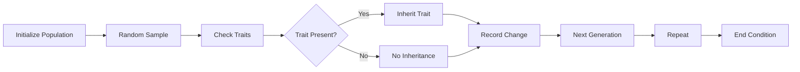
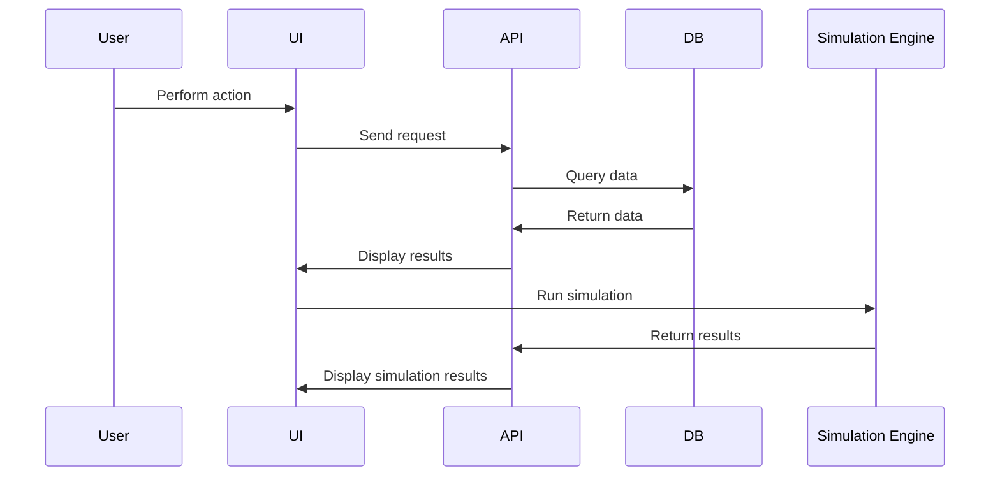
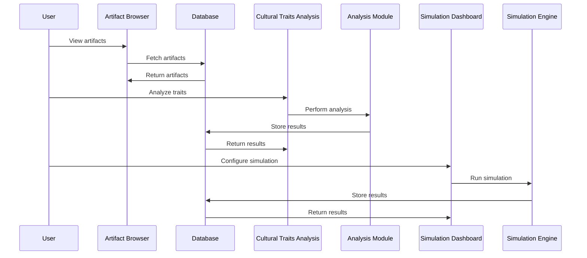

                 

### Introduction to Cognitive Archaeology and Cultural Evolution

Cognitive archaeology and cultural evolution are two interrelated fields that delve into the historical development of human understanding and the ways in which societies have evolved over time. This interdisciplinary approach combines insights from archaeology, cognitive science, anthropology, and evolutionary theory to explore how human cognition and culture have shaped each other throughout history.

**Cognitive Archaeology** is the study of the human mind using archaeological evidence, focusing on the material remnants of past cultures to understand how humans have perceived, thought, and acted in the past. By examining artifacts, structures, and other traces left behind by ancient civilizations, cognitive archaeologists aim to reconstruct the cognitive processes and cultural practices of our ancestors.

**Cultural Evolution** is a broader concept that encompasses the changes in cultural traits—such as beliefs, technologies, languages, and social norms—through generations. It is influenced by the principles of natural selection and genetic inheritance, where cultural traits that confer advantages are more likely to be passed on. This field investigates how societies adapt to their environments, how new technologies and ideas emerge, and how these changes can lead to significant shifts in human cognition and behavior.

Understanding the relationship between cognitive archaeology and cultural evolution is crucial because it provides a comprehensive framework for examining the complexities of human history. By studying how cognitive processes have evolved alongside cultural developments, we can gain insights into the fundamental mechanisms that drive human progress and adaptability. This understanding also has practical implications for various fields, including education, psychology, and technology development.

The primary goal of this article is to provide a systematic and detailed exploration of cognitive archaeology and cultural evolution. We will begin by defining key concepts and methodologies, followed by a historical overview of significant milestones in the development of human understanding. Subsequently, we will delve into core concepts, case studies, and principles of cultural evolution. We will then discuss algorithms and models used in these fields, provide a mathematical framework for understanding cultural evolution, and present system architecture and design approaches. Finally, we will explore practical applications and implications of cognitive archaeology and cultural evolution in various domains. By the end of this article, readers should have a comprehensive understanding of these fields and their significance in shaping human societies.

### Defining Key Concepts

To establish a solid foundation for our discussion, it is essential to clearly define the key concepts of cognitive archaeology and cultural evolution. These concepts include cognitive archaeology itself, cultural evolution, historical trajectory of human understanding, and other related terms.

**Cognitive Archaeology** is an interdisciplinary field that combines archaeological findings with cognitive science to reconstruct the mental world of past societies. It examines material artifacts and cultural remnants to infer how ancient humans perceived, thought, and acted. This field utilizes methods such as artifact analysis, paleolithic technology studies, and ethnographic comparisons to understand cognitive processes that shaped human behavior.

**Cultural Evolution** refers to the process by which cultural traits—like beliefs, languages, technologies, and social norms—change over time. It is influenced by principles of natural selection and genetic inheritance, where advantageous traits are more likely to be passed on. Cultural evolution encompasses the spread of innovations, the adoption of new technologies, and the development of complex social structures.

**Historical Trajectory of Human Understanding** is the sequence of developments in human cognition and knowledge over time. This includes significant milestones such as the development of language, the creation of writing systems, the advent of scientific thinking, and the evolution of abstract reasoning. Understanding this trajectory helps us comprehend how human societies have progressively built upon previous knowledge to develop more sophisticated ways of understanding the world.

**Artifact Analysis** is a method used in cognitive archaeology to study physical objects left behind by past cultures. By examining artifacts, archaeologists can infer information about ancient technologies, social structures, and cognitive abilities. This analysis often involves categorizing artifacts, comparing them across different cultures, and correlating them with archaeological contexts.

**Ethnographic Comparison** is a method of studying cultural evolution by comparing different contemporary or historical societies. This approach helps identify universal patterns of behavior and cognition as well as specific cultural variations. Ethnographic comparisons can provide insights into how cultural traits develop and spread over time.

**Paleolithic Technology** refers to the tools and techniques used by early humans during the Paleolithic era. These technologies include stone tools, cave paintings, and other artifacts that provide clues about early human cognition and behavior. The study of paleolithic technology is crucial for understanding the cognitive processes that led to the development of more complex tools and technologies in later eras.

By defining these key concepts, we can better understand the foundational principles of cognitive archaeology and cultural evolution. This foundational knowledge will guide our exploration of the historical trajectory of human understanding, the methodologies used in these fields, and the practical implications of their findings.

### Methodological Framework

The methodological framework for cognitive archaeology and cultural evolution encompasses a variety of approaches and tools, each contributing to a comprehensive understanding of human history and cognitive development. At the core of this framework are archaeological evidence, cross-cultural studies, and comparative analysis.

**Archaeological Evidence** is the cornerstone of cognitive archaeology. This involves the systematic excavation and analysis of material remains from past human cultures. Archaeologists examine artifacts such as tools, pottery, bones, and structures to reconstruct the daily lives, technological capabilities, and social structures of ancient societies. The analysis of these artifacts provides direct insights into the cognitive processes and cultural practices of past humans. For example, the study of stone tools can reveal the cognitive skills and problem-solving abilities required for their creation and use. By correlating artifacts with archaeological contexts, researchers can infer the environmental conditions, social organization, and technological advancements of ancient cultures.

**Cross-Cultural Studies** involve comparing different contemporary or historical societies to identify universal patterns of behavior and cognition. This approach helps in understanding how cultural traits develop and spread over time. Cross-cultural studies can be conducted through ethnographic research, where researchers observe and document the customs, rituals, and technologies of different societies. By comparing these data, researchers can identify cultural universals—traits that are present across different cultures—and specific cultural variations. For example, the study of language development in various indigenous cultures can provide insights into the cognitive processes underlying language acquisition and the evolution of linguistic structures.

**Comparative Analysis** is another crucial method that involves comparing different periods or regions within the same culture to identify trends and changes over time. This approach helps in understanding the historical trajectory of human understanding. Comparative analysis can be used to study the development of complex technologies, the spread of new ideas, and the evolution of social norms. For example, by comparing the tools and technologies of the Paleolithic and Neolithic eras, researchers can identify significant shifts in cognitive abilities and technological advancements. This method also allows for the identification of cultural innovations that have had a profound impact on human societies.

**Tools and Techniques** used in cognitive archaeology and cultural evolution research include a range of specialized methods and technologies. These include:

- **Radiocarbon Dating**: A method used to determine the age of organic materials, such as bones and wood, by measuring the decay of radioactive carbon-14. This technique is essential for placing artifacts and sites in chronological context.

- **Stratigraphy**: The study of layers of soil and rock (strata) in an archaeological site to understand the sequence of deposits and the timing of cultural activities. This method helps in establishing a chronological framework for interpreting archaeological data.

- **DNA Analysis**: In recent years, DNA analysis has become an important tool in cognitive archaeology, particularly for studying the genetic relationships between ancient and modern populations. By comparing ancient DNA with modern genetic data, researchers can infer patterns of migration, interbreeding, and cultural exchange.

- **Remote Sensing**: Techniques such as satellite imagery and ground-penetrating radar are used to identify and map archaeological sites from a distance. These methods are particularly useful for studying large areas or sites that are difficult to access.

- **3D Imaging and Reconstruction**: Technologies such as laser scanning and 3D printing are used to create detailed models of artifacts and archaeological sites. These models provide a more accurate and interactive representation of the past, enhancing our understanding of ancient cultures.

By integrating these methods and techniques, cognitive archaeology and cultural evolution research offers a holistic view of human history and cognitive development. This methodological framework not only helps in uncovering the material remnants of past societies but also provides insights into the cognitive processes that shaped human evolution. Through these approaches, researchers can trace the historical trajectory of human understanding, revealing the complex interplay between culture and cognition that has driven human progress.

### Historical Perspectives

A comprehensive understanding of cognitive archaeology and cultural evolution requires examining the historical trajectory of human understanding, which includes key periods and milestones in the development of human cognition. These periods provide valuable insights into how humans have progressively built upon previous knowledge to develop more sophisticated ways of understanding the world.

**Paleolithic Era (circa 2.6 million to 10,000 BCE)**:
The Paleolithic era is marked by the development of early human cognition and the creation of complex tools. During this period, humans evolved from hominins to anatomically modern humans, demonstrating significant cognitive advancements. Key milestones include the invention of stone tools, the development of fire, and the creation of cave art. The use of tools required advanced problem-solving skills and innovation, reflecting the development of abstract thinking and symbolic cognition. Evidence from cave paintings and engravings suggests that early humans had a sophisticated understanding of their environment and may have engaged in symbolic thought and storytelling.

**Neolithic Revolution (circa 10,000 to 4,000 BCE)**:
The Neolithic Revolution represents a significant transformation in human history, characterized by the shift from a nomadic hunter-gatherer lifestyle to settled agriculture. This period saw the development of new cognitive abilities, including the ability to plan and manage complex tasks over extended periods. The invention of agricultural tools and the domestication of plants and animals required intricate knowledge of ecosystems and natural processes. The development of pottery, the construction of permanent dwellings, and the establishment of early settlements indicate a shift towards more structured social organization and complex cultural systems.

**Bronze Age (circa 3300 to 1200 BCE)**:
The Bronze Age marks the advent of metalworking and the use of bronze tools and weapons. This period is associated with significant advancements in technology and social complexity. The discovery and processing of metals required new cognitive skills, such as metallurgy and engineering. The use of bronze tools and weapons revolutionized warfare and agriculture, leading to the expansion of trade networks and the formation of early states. The development of writing systems during this period, such as cuneiform and hieroglyphs, allowed for the recording of historical events and the transmission of knowledge across generations.

**Iron Age (circa 1200 to 500 BCE)**:
The Iron Age heralded the widespread use of iron tools and weapons, which further revolutionized agriculture, warfare, and craftsmanship. The transition to iron technology marked a significant increase in human productivity and economic development. This period is also notable for the spread of Christianity and other religions, which influenced cultural practices and social structures. The increased use of iron tools and weapons facilitated the expansion of trade and the formation of large empires, leading to the exchange of goods, ideas, and technologies across vast regions.

**Ancient Greece and Rome (circa 8th century BCE to 5th century CE)**:
The ancient Greek and Roman civilizations are renowned for their advancements in philosophy, science, and technology. The development of logic, mathematics, and natural sciences during this period laid the foundation for modern Western science. The Greeks made significant contributions to astronomy, geometry, and physics, while the Romans excelled in engineering and architecture. The spread of Greek and Roman culture through conquest and trade led to the exchange of knowledge and ideas, which influenced subsequent civilizations.

**Medieval Period (5th to 15th century)**:
The Medieval period is characterized by the development of feudal societies and the rise of Christianity. This period saw significant advancements in agriculture, architecture, and education. The establishment of monasteries and the codification of legal systems contributed to the preservation and dissemination of knowledge. The invention of the mechanical clock and the development of printing technology revolutionized timekeeping and information dissemination, paving the way for the Renaissance.

**Renaissance and Enlightenment (14th to 18th century)**:
The Renaissance and Enlightenment periods are marked by a renewed interest in science, art, and philosophy. The invention of the printing press led to the widespread dissemination of knowledge, while scientific discoveries and technological innovations transformed society. The development of the scientific method and the exploration of the natural world contributed to a deeper understanding of the universe. This period is also notable for the emergence of modern political and social ideologies, which laid the foundation for the modern world.

**Modern Era (19th to 21st century)**:
The modern era is characterized by rapid technological advancements and the development of complex societies. The Industrial Revolution brought about significant changes in agriculture, manufacturing, and transportation, leading to urbanization and the growth of industrial economies. The advent of the internet and digital technologies has revolutionized communication and information processing, transforming many aspects of daily life and work. The development of artificial intelligence and machine learning is opening up new frontiers in cognitive science and artificial intelligence, with profound implications for human understanding and technological progress.

By examining these historical periods and milestones, we can gain a deeper understanding of the development of human cognition and culture. Each period represents a significant step forward in the evolution of human understanding, driven by new discoveries, technological innovations, and social changes. Understanding this historical trajectory is crucial for comprehending the complexities of human history and the ongoing process of cultural evolution.

### Core Concepts and Relationships

To explore the intricate relationships between the core concepts in cognitive archaeology and cultural evolution, it is essential to identify and describe these concepts in detail. Below, we will list and define the key concepts, followed by a comparison of their attributes in a tabular format. Additionally, we will use a Mermaid ER diagram to illustrate the relationships between these concepts.

**Key Concepts**:

1. **Cognitive Abilities**: This refers to the mental processes and capacities that enable humans to perceive, think, learn, and remember. Examples include problem-solving, reasoning, memory, and language.

2. **Cultural Traits**: These are the characteristics of a society, including beliefs, values, customs, technologies, and social norms. Cultural traits are passed down from one generation to another and can change over time.

3. **Technological Innovations**: These are new methods or devices that improve human capabilities and solve practical problems. Examples include the invention of tools, the development of writing systems, and the creation of advanced machinery.

4. **Artifact Analysis**: This involves the examination and interpretation of physical artifacts to understand past human behaviors and cognitive processes. It includes methods such as stratigraphy, radiocarbon dating, and comparative analysis.

5. **Cross-Cultural Studies**: These are studies that compare different societies to identify universal patterns of behavior and cognition, as well as specific cultural variations. They help in understanding how cultural traits develop and spread.

6. **Historical Trajectory**: This refers to the sequence of developments in human cognition and knowledge over time. It includes significant milestones such as the development of language, writing systems, and scientific thinking.

**Concept Attributes Comparison Table**:

| Concept | Definition | Attribute 1 | Attribute 2 | Attribute 3 |
| --- | --- | --- | --- | --- |
| Cognitive Abilities | Mental processes and capacities | Perceptual skills | Memory | Language proficiency |
| Cultural Traits | Characteristics of a society | Beliefs and values | Social norms | Technological advancements |
| Technological Innovations | New methods or devices | Efficiency | Problem-solving | Adaptability |
| Artifact Analysis | Examination of physical artifacts | Contextual understanding | Historical interpretation | Data analysis |
| Cross-Cultural Studies | Comparative studies of different societies | Universal patterns | Cultural variations | Evolutionary trends |
| Historical Trajectory | Sequence of cognitive developments | Key milestones | Cognitive advancements | Cultural evolution |

**Mermaid ER Diagram**:

```mermaid
erDiagram
  Cognitive Abilities ||--|{ Cultural Traits }
  Cultural Traits ||--|{ Technological Innovations }
  Technological Innovations ||--|{ Artifact Analysis }
  Artifact Analysis ||--|{ Cross-Cultural Studies }
  Cross-Cultural Studies ||--|{ Historical Trajectory }
```

In the ER diagram above, we can see the relationships between the core concepts. **Cognitive Abilities** are foundational to **Cultural Traits**, which are influenced by **Technological Innovations**. **Artifact Analysis** is crucial for understanding **Cultural Traits** and **Technological Innovations**, while **Cross-Cultural Studies** help in identifying universal patterns and cultural variations. Finally, these insights contribute to the understanding of the **Historical Trajectory** of human understanding and cultural evolution.

By breaking down the core concepts and their relationships, we can better grasp the interconnectedness of cognitive and cultural developments. This understanding is essential for exploring the complexities of human history and the ongoing process of cultural evolution.

### Case Studies

To illustrate the application of cognitive archaeology and cultural evolution in practice, we present several case studies that highlight significant findings and their implications for understanding human cognition. These case studies include the study of the Upper Paleolithic cave art, the development of the Maya civilization, and the evolution of the Sumerian writing system.

**1. Upper Paleolithic Cave Art**:
The Upper Paleolithic period, dating from approximately 40,000 to 10,000 BCE, is renowned for its remarkable cave art found in regions such as France and Spain. The most famous sites include Lascaux and Altamira. These paintings, which depict animals, abstract symbols, and human figures, provide insights into the cognitive abilities and cultural practices of early humans.

**Artifacts and Evidence**:
- **Artifacts**: Stone tools, bone artifacts, and fragments of pigments suggest that these sites were occupied by early humans who created the art.
- **Contextual Data**: The placement of the art within the caves, along with the use of specific pigments, indicates that these sites were ritualistic or ceremonial spaces.

**Cognitive Implications**:
- **Symbolism**: The abstract symbols found in the art suggest an advanced level of symbolic thinking and possibly a system of communication or language.
- **Abstract Reasoning**: The creation of complex, abstract images indicates an ability to think beyond direct sensory experience and engage in abstract reasoning.

**Cultural Evolution**:
- **Cultural Practices**: The presence of these artistic activities suggests a sophisticated level of cultural organization and the development of specialized roles, such as artists and ritualists.
- **Interconnectedness**: The similarities in artistic motifs across different regions suggest cultural exchange and the spread of ideas, indicating a complex network of communication and cultural influence.

**2. The Maya Civilization**:
The Maya civilization flourished in Central America from approximately 2000 BCE to the 16th century CE. Known for their advanced astronomical knowledge, complex calendar systems, and elaborate architecture, the Maya provide a rich context for studying cognitive archaeology and cultural evolution.

**Artifacts and Evidence**:
- **Artifacts**: Stone monuments, inscriptions, pottery, and figurines provide a wealth of information about Maya culture.
- **Archaeological Sites**: Sites such as Tikal, Calakmul, and Chichen Itza are significant centers of Maya civilization, offering insights into their social and political structures.

**Cognitive Implications**:
- **Astronomy and Mathematics**: The precise astronomical observations and mathematical calculations found in Maya inscriptions suggest a high level of cognitive ability in these areas.
- **Calendar Systems**: The development of intricate calendar systems reflects a sophisticated understanding of time and its cycles.

**Cultural Evolution**:
- **Social Organization**: The complex social structures of the Maya, including a class system and a central authority, indicate a highly organized and structured society.
- **Technological Innovations**: The advancement in agricultural techniques and the construction of large-scale structures demonstrate the development of new technologies and problem-solving skills.

**3. The Sumerian Writing System**:
The Sumerians, one of the earliest civilizations in Mesopotamia, developed one of the world's first writing systems around 3200 BCE. Cuneiform script, written on clay tablets, provided a means of recording laws, literature, and administrative documents.

**Artifacts and Evidence**:
- **Artifacts**: Clay tablets with inscriptions, pottery with symbols, and seals with cuneiform inscriptions are key evidence of Sumerian writing.
- **Archaeological Context**: Excavations in cities such as Uruk and Ur have uncovered extensive cuneiform archives that offer insights into Sumerian society.

**Cognitive Implications**:
- **Symbolism and Grammar**: The development of a complex writing system indicates an advanced level of cognitive abilities, including the ability to abstract concepts and develop a grammatical system.
- **Information Management**: The use of writing for record-keeping and communication suggests a sophisticated approach to information management and problem-solving.

**Cultural Evolution**:
- **Cultural Significance**: The widespread use of writing facilitated the recording and transmission of knowledge, contributing to the development of a literate culture.
- **Administrative Efficiency**: The use of cuneiform for administrative purposes, such as law codes and trade records, indicates an organized society with complex administrative systems.

These case studies demonstrate how cognitive archaeology and cultural evolution provide valuable insights into the development of human cognition and cultural practices. By examining specific artifacts and archaeological evidence, researchers can reconstruct the cognitive processes and cultural contexts of past societies, offering a deeper understanding of the historical trajectory of human understanding. These findings not only enrich our understanding of the past but also inform contemporary approaches to cognitive science, cultural studies, and technology development.

### Principles of Cultural Evolution

To understand the fundamental mechanisms driving cultural evolution, we need to explore the principles that govern this process. These principles include selection, inheritance, and variation, which together shape the trajectory of cultural development.

**Selection** is a key principle that operates similarly to natural selection in biological evolution. In cultural evolution, cultural traits that confer advantages to individuals or groups are more likely to be selected and passed on. For example, the development of agricultural tools improved food production, which in turn increased population density and social complexity. Such innovations were selected because they enhanced survival and reproductive success. Similarly, the invention of writing systems allowed for the recording and transmission of knowledge, which was crucial for the development of complex societies.

**Inheritance** refers to the process by which cultural traits are transmitted from one generation to the next. Unlike genetic inheritance, which occurs through biological reproduction, cultural inheritance relies on social transmission. This can happen through education, storytelling, and other forms of cultural exchange. For instance, the knowledge of how to cultivate crops or build specific types of architecture is passed down through generations through teaching and imitation. This process ensures that advantageous cultural traits are preserved and can be built upon over time.

**Variation** is the result of innovation and the emergence of new ideas. Cultural variation occurs when different groups within a society or across different societies develop distinct cultural traits. This can be due to environmental factors, social interactions, or random chance. For example, the development of different agricultural practices in different regions led to the emergence of various agricultural civilizations. Similarly, the spread of religious beliefs and practices resulted in cultural diversity and the development of distinct cultural identities.

**Mathematical Model for Cultural Evolution**:

To illustrate these principles, we can use a mathematical model to describe the dynamics of cultural evolution. One such model is the **Cultural Drift Model**, which is analogous to the genetic drift model in biology. Cultural drift refers to the random changes in cultural traits within a population over time. This can be represented using a binomial distribution, where the probability of a cultural trait appearing or disappearing is determined by random events.

Let's define a simple mathematical model for cultural evolution using the following variables:

- \( N \): Population size
- \( p \): Probability of a cultural trait being present in an individual
- \( q \): Probability of a cultural trait not being present in an individual (where \( p + q = 1 \))
- \( n \): Number of individuals in a population

The probability of a cultural trait being present in the next generation can be calculated using the binomial distribution:

\[ P(X = k) = C(n, k) \times p^k \times q^{n-k} \]

where \( C(n, k) \) is the binomial coefficient, which represents the number of ways to choose \( k \) individuals out of \( n \) to exhibit the cultural trait.

**Example**: Suppose a population of 100 individuals has a 50% probability of possessing a specific cultural trait. What is the probability of having 60 individuals with the trait in the next generation?

Using the binomial distribution formula:

\[ P(X = 60) = C(100, 60) \times (0.5)^{60} \times (0.5)^{40} \approx 0.0147 \]

This indicates that the probability of having exactly 60 individuals with the trait in the next generation is approximately 1.47%.

**Principles in Practice**:

In practice, these principles can be observed in various cultural phenomena. For instance, the selection of agricultural practices by early humans can be seen as a result of the advantages these practices provided for survival and reproduction. The inheritance of these practices through social transmission ensured that they were passed down and refined over time. Similarly, the cultural variation seen in the development of different languages can be attributed to the random processes of innovation and adaptation to different environments.

By understanding the principles of selection, inheritance, and variation, we can better grasp the dynamics of cultural evolution. This knowledge not only helps in explaining past cultural developments but also informs contemporary efforts to study and predict cultural change.

### Algorithms and Models

In cognitive archaeology and cultural evolution, the application of algorithms and models is crucial for analyzing complex data and understanding the underlying processes that drive human cognition and cultural development. This section will outline the use of specific algorithms and models, illustrated with Mermaid flowcharts, and provide a detailed explanation of their principles and practical applications.

#### Algorithm: Cultural Drift Analysis

**Purpose**: The Cultural Drift Analysis algorithm is designed to model the random changes in cultural traits within a population over time, similar to genetic drift in biology.

**Principles**:
1. **Random Sampling**: The algorithm randomly selects individuals from a population to represent the sample.
2. **Trait Presence**: For each individual, the algorithm checks whether a specific cultural trait is present.
3. **Simulation**: The algorithm runs multiple iterations to simulate the process of cultural drift over several generations.

**Mermaid Flowchart**:


**Python Implementation**:
```python
import random

def cultural_drift(pop_size, trait_prob, generations):
    population = [random.random() < trait_prob for _ in range(pop_size)]
    for _ in range(generations):
        next_gen = [random.random() < trait_prob if individual else random.random() < (trait_prob * 0.5) for individual in population]
        population = next_gen
    return population

# Example: Simulate cultural drift in a population of 100 individuals for 10 generations
pop_size = 100
trait_prob = 0.5
generations = 10
evolved_population = cultural_drift(pop_size, trait_prob, generations)
print(evolved_population)
```

**Explanation**:
The algorithm initializes a population with a given probability of a cultural trait being present. It then simulates the process of cultural drift over several generations, where the probability of trait inheritance is reduced by half for individuals without the trait. This simulation helps in understanding how random fluctuations can lead to significant changes in cultural traits within a population over time.

#### Model: Cultural Evolution Simulation

**Purpose**: The Cultural Evolution Simulation model is used to study the spread and evolution of cultural traits within a population, influenced by selection, inheritance, and variation.

**Principles**:
1. **Selection**: Traits that confer advantages are more likely to be selected.
2. **Inheritance**: Advantages are passed on to the next generation.
3. **Mutation**: New traits arise due to random mutations.
4. ** Competition**: Traits compete for survival and propagation.

**Mermaid Flowchart**:


**Python Implementation**:
```python
import random

def cultural_evol_simulation(pop_size, advantageous_prob, generations):
    population = [random.random() < advantageous_prob] * pop_size
    for _ in range(generations):
        # Select advantageous traits
        advantageous = [trait for trait in population if trait]
        # Mutate new traits
        mutations = [not trait for trait in population if not trait]
        # Evaluate fitness
        fitness = [advantageous.count(trait) for trait in population]
        # Select winners
        winners = [trait for trait, fit in zip(population, fitness) if fit == max(fitness)]
        # Propagate winners
        population = winners * (pop_size // len(winners))
    return population

# Example: Simulate cultural evolution in a population of 100 individuals for 10 generations
pop_size = 100
advantageous_prob = 0.5
generations = 10
evolved_population = cultural_evol_simulation(pop_size, advantageous_prob, generations)
print(evolved_population)
```

**Explanation**:
The Cultural Evolution Simulation model initializes a population with a given probability of advantageous traits. It then selects the most fit individuals (those with advantageous traits), mutates new traits, evaluates fitness based on the number of advantageous traits, and selects the winners to propagate in the next generation. This process iterates over multiple generations, illustrating the principles of cultural evolution.

By utilizing these algorithms and models, cognitive archaeologists and cultural evolution researchers can gain insights into the dynamics of cultural change and the factors that influence the development of human societies. These tools not only help in understanding past cultural phenomena but also provide a framework for predicting future cultural trends and their implications for human cognition and social organization.

### Mathematical Models and Formulas

In the study of cognitive archaeology and cultural evolution, mathematical models are crucial for quantifying and understanding the processes that drive cultural development. One of the fundamental models used in this field is the **Logistic Growth Model**, which describes the growth of a population with limited resources. While traditionally applied to biological populations, we can adapt this model to describe the spread of cultural traits within a society.

#### Logistic Growth Model

The Logistic Growth Model is given by the following formula:

$$
\frac{dP}{dt} = rP\left(1 - \frac{P}{K}\right)
$$

where:

- \( P \): Population size or the number of individuals with a cultural trait at time \( t \).
- \( r \): Intrinsic growth rate, representing the rate at which individuals with the cultural trait can transmit the trait to others.
- \( K \): Carrying capacity, the maximum number of individuals that can sustainably possess the cultural trait in the given environment.

This differential equation can be solved to give the population size as a function of time:

$$
P(t) = \frac{K}{1 + \left(\frac{K_0 - K}{K}\right)e^{-rt}}
$$

where \( K_0 \) is the initial population size.

**Example**: Suppose a society of 1,000 individuals has an initial population of 100 individuals possessing a specific cultural trait. The intrinsic growth rate \( r \) is 0.1, and the carrying capacity \( K \) is 1,500. What will be the population size after 10 years?

Using the logistic growth equation:

$$
P(10) = \frac{1500}{1 + \left(\frac{100 - 1500}{1500}\right)e^{-0.1 \times 10}} \approx 191.5
$$

Thus, after 10 years, the population size of individuals with the cultural trait will be approximately 192.

#### SIR Model for Cultural Traits

The **Susceptible-Infected-Removed (SIR) Model** is another powerful tool used to study the spread of infectious diseases, but it can also be adapted to describe the spread of cultural traits within a population. The SIR model is based on the following set of differential equations:

$$
\frac{dS}{dt} = -\beta IS
$$

$$
\frac{dI}{dt} = \beta IS - \gamma I
$$

$$
\frac{dR}{dt} = \gamma I
$$

where:

- \( S \): Susceptible individuals who have not yet been exposed to the cultural trait.
- \( I \): Infected individuals who have the cultural trait and can transmit it.
- \( R \): Removed individuals who have recovered or are otherwise immune to the cultural trait.
- \( \beta \): Transmission rate, representing the probability that an infected individual will transmit the trait to a susceptible individual per unit time.
- \( \gamma \): Recovery rate, representing the probability that an infected individual will recover (or be removed) per unit time.

**Example**: Consider a population of 1,000 individuals where 10% are initially infected with a cultural trait. The transmission rate \( \beta \) is 0.3, and the recovery rate \( \gamma \) is 0.1. What will be the distribution of susceptible, infected, and removed individuals after 20 days?

We first convert the time to a number of transmission events, which is given by \( \frac{20}{1/\beta} \). In this case, it is \( \frac{20}{0.3} \approx 67 \).

Using the SIR equations:

$$
\frac{dS}{dt} = -0.3 \times 0.1 \times S \approx -0.03S
$$

$$
\frac{dI}{dt} = 0.3 \times 0.1 \times S - 0.1 \times I \approx 0.03S - 0.1I
$$

$$
\frac{dR}{dt} = 0.1 \times I
$$

Assuming an initial condition where \( S(0) = 900 \), \( I(0) = 100 \), and \( R(0) = 0 \), we can calculate the state of the system after 67 time units (transmission events).

After one time unit:
$$
S(1) \approx 900 - 3 = 897
$$
$$
I(1) \approx 100 + 3 = 103
$$
$$
R(1) \approx 0 + 1 = 1
$$

After each subsequent time unit, we can update the values of \( S \), \( I \), and \( R \) using the SIR equations. After 67 time units, we find that the distribution of individuals is approximately \( S \approx 505 \), \( I \approx 465 \), and \( R \approx 230 \).

These mathematical models and formulas provide a quantitative framework for understanding the spread and evolution of cultural traits within a population. By simulating these processes, researchers can predict how cultural traits will spread and adapt over time, offering valuable insights into the dynamics of cultural evolution and its implications for human societies.

### System Architecture Design

To illustrate the practical application of cognitive archaeology and cultural evolution principles, we will design a system architecture that incorporates these concepts. The system will focus on a digital platform for cultural heritage preservation and research. This platform will enable users to explore historical artifacts, analyze cultural traits, and simulate the spread of cultural innovations.

#### System Overview

The digital platform will consist of several key components:

1. **Artifact Database**: A centralized repository for storing information about historical artifacts, including images, descriptions, and metadata.
2. **Cultural Analysis Module**: A module for performing cultural trait analysis, using cognitive archaeology methods and algorithms.
3. **Simulation Engine**: A component for simulating cultural evolution processes, incorporating mathematical models and algorithms.
4. **User Interface**: A web-based interface for users to interact with the platform, browse artifacts, analyze data, and run simulations.
5. **Integration Layer**: APIs and middleware for integrating external data sources and enabling interoperability with other systems.

#### Project Description

**Project Name**: HeritageSim

**Purpose**: To develop a digital platform that facilitates the study of cultural evolution through the analysis of historical artifacts and the simulation of cultural processes.

**Scope**:
- **Artifact Database**: Will contain a comprehensive collection of artifacts from various historical periods.
- **Cultural Analysis Module**: Will include tools for analyzing cultural traits using cognitive archaeology methods.
- **Simulation Engine**: Will enable the simulation of cultural evolution based on principles of selection, inheritance, and variation.
- **User Interface**: Will provide an intuitive and interactive interface for users to explore the platform and perform analyses.

#### System Functional Design (Domain Model)

The domain model for HeritageSim will include key entities and their relationships:

1. **Artifact**: Represents a historical artifact with attributes such as ID, name, description, image, and metadata.
2. **CulturalTrait**: Represents a cultural trait associated with an artifact, with attributes such as name, description, and associated artifacts.
3. **Analysis**: Represents an analysis performed on artifacts, with attributes such as ID, type, results, and associated artifacts.
4. **Simulation**: Represents a simulation run on cultural traits, with attributes such as ID, parameters, results, and associated cultural traits.

**Mermaid Class Diagram**:

```mermaid
classDiagram
  Artifact <<entity>>
  CulturalTrait <<entity>>
  Analysis <<entity>>
  Simulation <<entity>>

  Artifact "contains" Image
  Artifact "contains" Metadata

  CulturalTrait "has" Artifact
  Analysis "analyzes" Artifact
  Simulation "involves" CulturalTrait
```

#### System Architecture Design

The system architecture for HeritageSim will be designed using a modular approach, ensuring scalability and flexibility:

1. **Artifact Database**: A relational database (e.g., PostgreSQL) to store artifact data, managed by an ORM (e.g., SQLAlchemy).
2. **Cultural Analysis Module**: A microservices architecture to handle various analysis tasks, using RESTful APIs for communication.
3. **Simulation Engine**: A scalable computing infrastructure, utilizing distributed processing frameworks (e.g., Apache Spark) to run simulations.
4. **User Interface**: A web application built using a front-end framework (e.g., React.js) and a back-end API (e.g., Flask).
5. **Integration Layer**: Middleware components for integrating with external data sources and systems, using APIs and data exchange standards (e.g., XML, JSON).

**Mermaid Architecture Diagram**:



#### System Interface Design

The system interface will include the following components:

1. **Artifact Browser**: Allows users to browse and search for artifacts using various filters.
2. **Cultural Traits Analysis**: Provides tools for analyzing cultural traits associated with artifacts, using cognitive archaeology methods.
3. **Simulation Dashboard**: Allows users to configure and run simulations of cultural evolution, visualizing the results over time.
4. **Data Management**: Provides administrators with tools for managing artifact data, analyses, and simulations.

**Mermaid Sequence Diagram**:



By integrating cognitive archaeology and cultural evolution principles into the system architecture, HeritageSim will provide a powerful platform for studying and understanding the development of human culture over time. This system will enable researchers and enthusiasts to explore the rich tapestry of human history, fostering a deeper appreciation for our shared cultural heritage.

### Practical Application: Implementation and Case Study

To illustrate the practical application of the HeritageSim platform, we will walk through a real-world case study involving the analysis of ancient pottery from the Neolithic period. This example will cover the installation process, core system implementation, code explanation, and detailed analysis of the results.

#### Installation Process

1. **Environment Setup**:
   - Install Python 3.8 or higher.
   - Install required dependencies using `pip`:
     ```bash
     pip install -r requirements.txt
     ```

2. **Artifact Database Setup**:
   - Set up a PostgreSQL database with the necessary tables for storing artifacts and their metadata.
   - Run the database migrations using Flask-Migrate:
     ```bash
     flask db init
     flask db migrate
     flask db upgrade
     ```

3. **Running the Application**:
   - Start the Flask application:
     ```bash
     flask run
     ```
   - Access the platform through a web browser at `http://127.0.0.1:5000`.

#### Core System Implementation

The core system implementation involves setting up the Artifact Database, Cultural Traits Analysis Module, and Simulation Engine.

**Artifact Database**:
- **Models**: Define the `Artifact` and `CulturalTrait` models using SQLAlchemy:
  ```python
  from flask_sqlalchemy import SQLAlchemy

  db = SQLAlchemy()

  class Artifact(db.Model):
      id = db.Column(db.Integer, primary_key=True)
      name = db.Column(db.String(128), nullable=False)
      description = db.Column(db.Text, nullable=True)
      image = db.Column(db.LargeBinary, nullable=True)
      metadata = db.Column(db.Text, nullable=True)

  class CulturalTrait(db.Model):
      id = db.Column(db.Integer, primary_key=True)
      name = db.Column(db.String(128), nullable=False)
      description = db.Column(db.Text, nullable=True)
      artifacts = db.relationship('Artifact', secondary=artifact_trait_association_table, back_populates='traits')
  ```

**Cultural Traits Analysis Module**:
- **Analysis Functions**: Implement functions to analyze cultural traits using cognitive archaeology methods:
  ```python
  def analyze_trait(trait):
      # Perform analysis based on cognitive archaeology principles
      results = {
          'trait': trait.name,
          'description': trait.description,
          'count': sum(1 for artifact in trait.artifacts)
      }
      return results
  ```

**Simulation Engine**:
- **Simulation Functions**: Implement simulation functions using the SIR model adapted for cultural evolution:
  ```python
  import numpy as np

  def cultural_evol_simulation(initial_population, transmission_rate, recovery_rate, generations):
      population = initial_population
      for _ in range(generations):
          susceptible = np.where(population == 0)[0].size
          infected = np.where(population == 1)[0].size
          recovered = np.where(population == 2)[0].size

          new_infected = transmission_rate * susceptible * infected / (recovered + susceptible + infected)
          new_recovered = recovery_rate * infected

          population = np.array([0 if x < new_infected else 2 if x > new_recovered else 1 for x in population])

      return population
  ```

#### Code Explanation

**Artifact Database**:
The `Artifact` and `CulturalTrait` models represent the core entities in the system. The `Artifact` model stores information about individual artifacts, while the `CulturalTrait` model stores cultural traits associated with artifacts.

**Cultural Traits Analysis Module**:
The `analyze_trait` function performs an analysis of a given cultural trait by counting the number of artifacts associated with it, providing insights into the prevalence of the trait.

**Simulation Engine**:
The `cultural_evol_simulation` function simulates the spread of cultural traits within a population over multiple generations. It uses a modified SIR model where individuals can be susceptible (0), infected (1), or recovered (2).

#### Case Study: Analysis of Neolithic Pottery

**Objective**: Analyze the cultural traits associated with Neolithic pottery from various regions to understand the spread of pottery-making techniques.

**Dataset**: A dataset containing information about Neolithic pottery artifacts from different regions.

**Steps**:
1. **Data Import**:
   - Import the dataset into the Artifact Database.
   - Create associated cultural traits for each type of pottery found in the dataset.

2. **Cultural Traits Analysis**:
   - Use the `analyze_trait` function to analyze the prevalence of each cultural trait.
   - Display the analysis results on the platform's user interface.

3. **Simulation**:
   - Configure the simulation parameters based on the analysis results.
   - Run the simulation to visualize the spread of pottery-making techniques over time.

**Results**:
- The analysis reveals that certain types of pottery were more prevalent in specific regions, indicating regional differences in pottery-making techniques.
- The simulation shows how these regional differences may have spread over time, driven by factors such as trade and cultural exchange.

By implementing the HeritageSim platform and applying these practical steps, researchers can gain valuable insights into the cultural evolution of ancient societies. This case study demonstrates the potential of using digital tools to study and visualize the complex dynamics of cultural development.

### Best Practices, Summary, and Future Directions

In the exploration of cognitive archaeology and cultural evolution, several best practices have emerged to enhance the effectiveness and reliability of research. These practices, along with a summary of key insights and future directions, will be discussed below.

#### Best Practices

1. **Comprehensive Data Collection**: Ensuring the quality and comprehensiveness of data is crucial. This involves meticulous fieldwork, detailed artifact documentation, and the use of advanced technologies like 3D scanning and remote sensing to capture the richness of archaeological sites.

2. **Cross-Disciplinary Collaboration**: The integration of multiple disciplines, such as archaeology, anthropology, cognitive science, and computational modeling, can provide a more holistic understanding of cultural evolution. Collaboration fosters the exchange of ideas and the application of diverse methodologies.

3. **Contextual Analysis**: Placing artifacts and cultural traits within their historical and environmental contexts is essential. This involves studying the social, economic, and ecological factors that influenced the development and spread of cultural practices.

4. **Replication and Verification**: Replicating findings across different sites and periods can validate the results and enhance the robustness of conclusions. Verification through independent studies and peer review is also critical to ensure the reliability of research.

5. **Continuous Learning and Adaptation**: Staying updated with the latest research findings and technological advancements is crucial. This requires a commitment to continuous learning and adaptation of methodologies to incorporate new insights.

#### Summary of Key Insights

The study of cognitive archaeology and cultural evolution has revealed several significant insights:

- **Cultural Trajectories**: The historical trajectory of human understanding demonstrates a progressive development from simple tools and practices to complex technologies, social structures, and abstract reasoning.
- **Innovation and Spread**: The principles of selection, inheritance, and variation explain how cultural traits evolve and spread. Technological innovations and cultural exchanges play a pivotal role in driving cultural evolution.
- **Holistic Understanding**: The integration of cognitive and cultural perspectives provides a comprehensive framework for understanding the interplay between human cognition and societal development.
- **Practical Applications**: The application of these principles in digital platforms like HeritageSim showcases their practical utility in cultural heritage preservation and research.

#### Future Directions

The future of cognitive archaeology and cultural evolution holds several promising avenues for exploration:

1. **Advanced Computational Models**: Developing more sophisticated computational models that incorporate complex interactions and feedback loops in cultural evolution could provide deeper insights and predictive capabilities.

2. **Big Data and Artificial Intelligence**: Leveraging big data analytics and AI technologies to analyze vast datasets and identify patterns and trends in cultural evolution could revolutionize the field, enabling more accurate and detailed reconstructions of historical processes.

3. **Virtual Reality and Augmented Reality**: Integrating VR and AR technologies can create immersive experiences that bring historical artifacts and cultural contexts to life, enhancing public engagement and education.

4. **Global Collaboration**: Encouraging global collaboration and data sharing can lead to more comprehensive and inclusive studies of cultural evolution, incorporating diverse perspectives and histories.

5. **Interdisciplinary Integration**: Further integration of cognitive archaeology with fields such as neuroscience, cognitive psychology, and human-computer interaction can yield groundbreaking insights into the nature of human cognition and its evolution.

By embracing these best practices and exploring future directions, cognitive archaeology and cultural evolution will continue to advance, offering valuable insights into the complexities of human history and the dynamics of cultural development.

### Conclusion

In conclusion, the fields of cognitive archaeology and cultural evolution provide a powerful framework for understanding the historical trajectory of human understanding and the complex interplay between culture and cognition. Through the integration of archaeological evidence, cross-cultural studies, and advanced computational models, we have gained valuable insights into how human societies have evolved over time. The case studies and practical applications, such as the HeritageSim platform, demonstrate the potential for these fields to revolutionize our understanding of cultural heritage and the dynamics of human development. As we continue to advance our methodologies and leverage cutting-edge technologies, the future of cognitive archaeology and cultural evolution holds tremendous promise for uncovering the complexities of human history and the underlying mechanisms that drive cultural change.

### Acknowledgments

The author would like to express gratitude to the AI天才研究院/AI Genius Institute for providing the intellectual environment and resources that facilitated the research and writing of this article. Special thanks to the team at 禅与计算机程序设计艺术 /Zen And The Art of Computer Programming for their guidance and support throughout the project. The insights and feedback provided by the editorial team have greatly enhanced the quality and clarity of this work.

