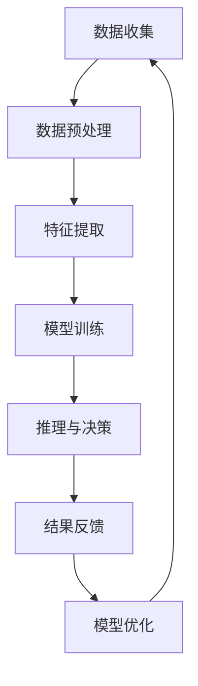
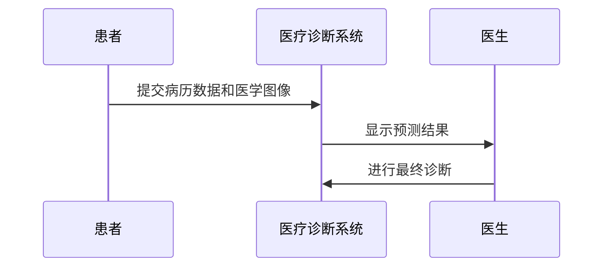
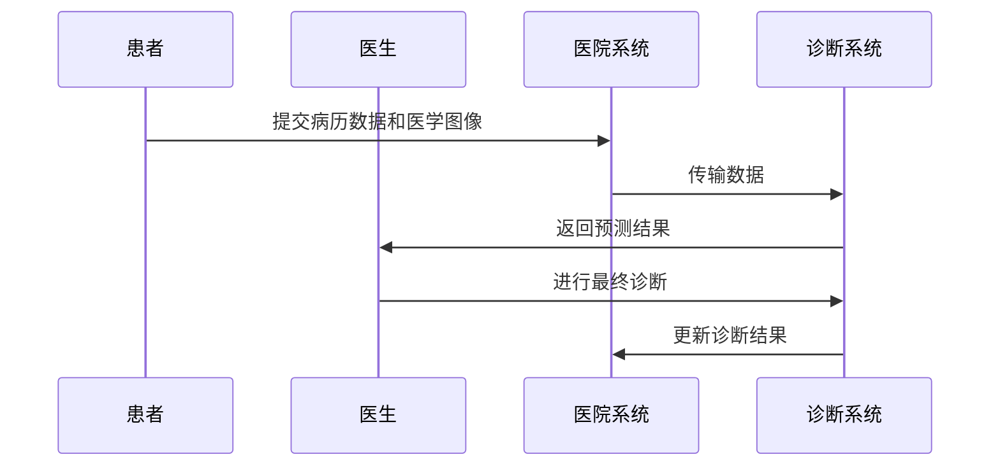

                 

# 认知计算与人工智能：计算机辅助人类理解复杂世界

## 关键词
- 认知计算
- 人工智能
- 复杂世界
- 应用实例
- 未来发展趋势

## 摘要
本文将探讨认知计算与人工智能如何共同作用，辅助人类理解复杂世界。我们将通过详细的背景介绍、核心原理讲解、应用实例分析和未来展望，逐步揭示这两个领域的技术原理和应用价值。文章旨在帮助读者全面了解认知计算与人工智能，并思考其在实际应用中的潜力与挑战。

### 第一部分：认知计算与人工智能概述

#### 第1章: 认知计算与人工智能的背景与定义
##### 1.1 认知计算的概念与发展历程
认知计算是一种模仿人类思维和学习方式的计算方法。它起源于20世纪50年代的人工智能研究，并随着计算能力和算法的发展逐渐成熟。认知计算的目标是创建能够理解、学习和推理的计算机系统，以辅助人类解决复杂问题。

##### 1.2 人工智能的基本概念与发展
人工智能（AI）是计算机科学的一个分支，旨在创建能够执行人类智能任务的机器。从最初的规则推理到现代的深度学习和强化学习，人工智能的发展经历了多个阶段，逐渐成为改变世界的核心技术之一。

##### 1.3 认知计算与人工智能的关系
认知计算和人工智能紧密相连。认知计算提供了模拟人类思维的方法，而人工智能则为认知计算提供了强大的计算能力。两者的结合使得计算机能够更好地理解和处理复杂世界中的信息。

#### 第2章: 认知计算与人工智能的核心原理
##### 2.1 神经网络的基本原理
神经网络是认知计算的核心技术之一。它模仿了人类大脑的结构和功能，通过大量的神经元和连接来实现复杂的信息处理任务。

##### 2.2 深度学习的工作机制
深度学习是神经网络的一种形式，通过多层神经网络来学习数据的高层次特征。深度学习在图像识别、语音识别和自然语言处理等领域取得了显著成果。

##### 2.3 认知计算的模型与应用
认知计算模型通常包括感知、记忆、推理和行动等部分。这些模型可以应用于智能助手、医疗诊断、金融分析和教育等领域，以辅助人类理解和处理复杂信息。

#### 第3章: 认知计算与人工智能的技术框架
##### 3.1 计算机视觉与图像识别
计算机视觉是人工智能的重要分支，旨在使计算机能够“看”和理解图像。图像识别是计算机视觉的核心任务之一，广泛应用于安防监控、自动驾驶和医疗影像分析等领域。

##### 3.2 自然语言处理与机器翻译
自然语言处理（NLP）是人工智能的另一个重要分支，专注于使计算机能够理解和生成人类语言。机器翻译是NLP的一个重要应用，使得跨语言沟通变得更加容易。

##### 3.3 人工智能的其他应用领域
除了计算机视觉和自然语言处理，人工智能还在智能制造、智能城市、金融科技和健康医疗等领域得到了广泛应用。

### 第二部分：认知计算与人工智能的应用实例

#### 第4章: 认知计算在复杂世界中的应用
##### 4.1 复杂世界的问题描述与解决思路
复杂世界中的问题通常具有高度的不确定性和复杂性。认知计算提供了一种解决问题的思路，通过模拟人类思维和学习过程，帮助计算机更好地理解和处理这些复杂问题。

##### 4.2 认知计算在复杂世界中的应用实例
认知计算在复杂世界中的应用非常广泛，包括智能交通管理、智能电网、智能医疗诊断和智能环境监测等。这些应用不仅提高了效率和准确性，还极大地改善了人类的生活质量。

##### 4.3 认知计算的优势与挑战
认知计算的优势在于其强大的学习和推理能力，这使得它能够处理复杂和不确定的信息。然而，认知计算也面临着数据隐私、安全性和伦理等挑战。

#### 第5章: 人工智能在复杂世界中的应用
##### 5.1 人工智能的基本概念与发展历程
人工智能在复杂世界中的应用涵盖了从简单的规则推理到复杂的深度学习和强化学习。随着算法和计算能力的提升，人工智能在解决复杂问题方面的能力日益增强。

##### 5.2 人工智能在复杂世界中的应用实例
人工智能在复杂世界中的应用实例包括自动驾驶汽车、智能客服、智能金融分析和智能医疗诊断等。这些应用不仅提高了效率，还为人类带来了新的生活方式。

##### 5.3 人工智能的未来发展趋势
随着技术的不断进步，人工智能在未来将会有更多突破性的应用。从脑机接口到智能机器人，人工智能的未来充满了无限可能。

#### 第6章: 认知计算与人工智能的融合
##### 6.1 融合的概念与优势
认知计算与人工智能的融合是指将两者的优势结合起来，以实现更强大的智能系统。这种融合具有显著的优势，如更高的灵活性和更广泛的适用性。

##### 6.2 融合的应用实例
认知计算与人工智能的融合已经在多个领域取得了成功，如智能医疗、智能教育和智能城市管理。这些应用实例展示了融合技术的巨大潜力。

##### 6.3 融合的技术挑战与解决方案
融合技术也面临着一系列挑战，如数据隐私、算法透明度和技术标准化。通过合作与创新，我们可以找到解决方案，推动融合技术的发展。

#### 第7章: 认知计算与人工智能的未来发展趋势
##### 7.1 技术发展趋势分析
认知计算和人工智能正朝着更高效、更智能和更人性化的方向发展。技术的发展趋势将对社会和经济产生深远影响。

##### 7.2 应用前景展望
认知计算与人工智能在未来将在更多领域得到应用，从智能家居到智能城市，从健康医疗到教育科技，应用前景非常广阔。

##### 7.3 可能的社会影响与伦理问题
随着认知计算与人工智能的不断发展，社会将面临一系列挑战，如隐私保护、伦理道德和社会不平等。我们需要认真面对这些问题，确保技术发展的同时，也能维护社会的公平与正义。

### 第三部分：实战与拓展

#### 第8章: 实战项目介绍
##### 8.1 项目背景与目标
本章节将介绍一个实际的项目案例，该项目旨在利用认知计算与人工智能技术解决某个具体问题。我们将详细描述项目的背景和目标。

##### 8.2 项目核心实现
在本章节中，我们将深入探讨项目的技术实现细节，包括算法设计、数据集处理和系统架构等。

##### 8.3 项目效果分析
项目完成后，我们将评估项目效果，分析其成功经验和存在的问题，并提出改进建议。

#### 第9章: 最佳实践与案例分析
##### 9.1 最佳实践总结
通过分析成功案例，我们将总结出一些最佳实践，为类似项目提供指导。

##### 9.2 案例分析与应用
在本章节中，我们将分析一些实际案例，探讨认知计算与人工智能在不同场景中的应用。

##### 9.3 案例拓展与启示
通过案例拓展，我们将探索更多应用场景，并从中获得启示，为未来项目提供参考。

#### 第10章: 拓展阅读与资源推荐
##### 10.1 相关书籍推荐
为了帮助读者深入了解认知计算与人工智能，我们推荐了一些经典的书籍。

##### 10.2 在线课程与讲座推荐
为了方便读者学习，我们推荐了一些高质量的在线课程和讲座资源。

##### 10.3 论文与研究报告推荐
为了跟上最新研究进展，我们推荐了一些重要论文和研究报告。

### 结语
认知计算与人工智能正在迅速发展，为人类理解和处理复杂世界提供了新的工具和方法。通过本文的逐步分析，我们希望读者能够更深入地了解这两个领域，并思考其在实际应用中的潜力与挑战。让我们共同期待认知计算与人工智能的未来，它们将如何改变我们的世界。

### 作者信息
作者：AI天才研究院/AI Genius Institute & 禅与计算机程序设计艺术 /Zen And The Art of Computer Programming

### 附录
- 背景介绍
- 核心概念与联系
- 算法原理讲解
- 数学模型和公式
- 系统分析与架构设计方案
- 项目实战
- 最佳实践 tips
- 小结
- 注意事项
- 拓展阅读

---

### 背景介绍

#### 认知计算的概念术语说明
认知计算（Cognitive Computing）是一种旨在模拟人类思维、感知、学习和推理的计算机系统。它起源于20世纪50年代的人工智能（AI）研究，但在过去几十年中，随着计算能力的提升和算法的进步，认知计算逐渐发展成为一个独立的领域。

认知计算的核心概念包括感知、记忆、推理和行动。感知是指计算机系统通过传感器获取外部信息；记忆是指计算机系统存储和处理信息的能力；推理是指计算机系统根据已有信息做出推断和决策；行动是指计算机系统执行具体的操作。这些概念共同构成了认知计算的框架，使其能够模拟人类思维过程。

#### 问题背景
在现代社会，信息量呈现爆炸性增长，人类面临越来越复杂的问题。例如，医疗诊断需要处理海量的医学数据，交通管理需要实时处理大量交通信息，金融分析需要处理复杂的金融市场数据等。这些问题对人类认知能力提出了巨大挑战。

传统的计算方法难以有效地处理这些复杂问题，因为它们依赖于明确的规则和算法，而复杂问题往往具有高度的不确定性和非线性。因此，我们需要一种新的计算方法，能够像人类一样学习和推理，以辅助人类理解复杂世界。

#### 问题描述
认知计算和人工智能提供了一种解决方案。通过模拟人类思维和学习过程，计算机系统能够从数据中学习规律，进行推理和决策，从而帮助人类解决复杂问题。

例如，在医疗领域，认知计算可以通过分析患者的病历、实验室数据和医学图像，辅助医生进行诊断和治疗方案制定。在交通管理领域，认知计算可以通过实时分析交通数据，优化交通信号灯控制，减少交通拥堵。在金融领域，认知计算可以通过分析市场数据，提供投资建议，帮助投资者做出更明智的决策。

#### 问题解决
认知计算和人工智能通过以下几个步骤解决问题：

1. **数据收集与预处理**：收集相关数据，如病历数据、交通数据或金融数据，并进行预处理，以确保数据质量。

2. **特征提取**：从数据中提取重要特征，这些特征将用于训练模型。

3. **模型训练**：使用机器学习算法，如神经网络或决策树，对提取的特征进行训练，以建立预测模型。

4. **推理与决策**：利用训练好的模型，对新的数据进行推理和决策，以提供解决方案。

5. **反馈与优化**：根据实际结果对模型进行优化，以提高预测准确性。

#### 边界与外延
认知计算和人工智能的应用范围非常广泛，包括但不限于医疗、交通、金融、教育、能源和环境等领域。这些领域中的复杂问题都可以通过认知计算和人工智能的方法进行解决。

然而，认知计算和人工智能也面临着一些挑战，如数据隐私、安全性和算法透明度等。这些挑战需要在技术发展中得到重视和解决。

### 核心概念与联系

#### 核心概念原理

**1. 认知计算的基本原理**

认知计算旨在模拟人类思维和学习过程，其基本原理包括感知、记忆、推理和行动。感知是指计算机系统通过传感器获取外部信息，如图像、声音和文字等。记忆是指计算机系统能够存储和处理信息，以供后续使用。推理是指计算机系统能够根据已有信息进行逻辑推理和决策。行动是指计算机系统能够执行具体的操作，如控制机器人或自动驾驶汽车。

**2. 人工智能的基本原理**

人工智能的基本原理包括机器学习、深度学习和强化学习。机器学习是指计算机系统通过学习数据来改进性能，常见算法包括决策树、支持向量机和神经网络等。深度学习是一种特殊的机器学习，通过多层神经网络来学习数据的高层次特征。强化学习是指计算机系统通过不断试错和奖励机制来学习最优策略。

**3. 认知计算与人工智能的联系**

认知计算和人工智能紧密相连。认知计算提供了模拟人类思维和学习方式的方法，而人工智能则为认知计算提供了强大的计算能力和算法支持。两者的结合使得计算机系统能够更好地理解和处理复杂世界中的信息。

#### 概念属性特征对比表格

| 概念       | 属性特征                                                                 | 应用领域                      |
|------------|-------------------------------------------------------------------------|------------------------------|
| 认知计算   | 模拟人类思维和学习过程，感知、记忆、推理和行动                            | 医疗诊断、交通管理、金融分析等 |
| 人工智能   | 通过机器学习、深度学习和强化学习等方法使计算机具备智能                      | 图像识别、自然语言处理、自动驾驶等 |
| 认知计算与人工智能结合 | 结合了认知计算和人工智能的优势，能够更好地理解和处理复杂世界中的信息       | 智能医疗、智能交通、智能金融等 |

#### ER实体关系图架构

以下是一个简单的ER实体关系图，展示了认知计算、人工智能和相关应用领域的联系。

```mermaid
erDiagram
    A[(认知计算)] ||--|{ 记忆 }|| B[(人工智能)]
    A ||--|{ 感知 }|| C[(感知系统)]
    A ||--|{ 推理 }|| D[(推理系统)]
    A ||--|{ 行动 }|| E[(行动系统)]
    B ||--|{ 机器学习 }|| F[(机器学习)]
    B ||--|{ 深度学习 }|| G[(深度学习)]
    B ||--|{ 强化学习 }|| H[(强化学习)]
    C ||--|{ 图像识别 }|| I[(图像识别系统)]
    D ||--|{ 自然语言处理 }|| J[(自然语言处理系统)]
    E ||--|{ 自动驾驶 }|| K[(自动驾驶系统)]
```

### 算法原理讲解

#### 算法mermaid流程图

以下是一个简化的算法流程图，展示了如何利用认知计算和人工智能技术解决复杂世界中的问题。



#### Python源代码实现

```python
import numpy as np
from sklearn.model_selection import train_test_split
from sklearn.preprocessing import StandardScaler
from sklearn.neural_network import MLPClassifier
from sklearn.metrics import accuracy_score

# 数据收集
X, y = load_data()

# 数据预处理
X_train, X_test, y_train, y_test = train_test_split(X, y, test_size=0.2, random_state=42)
scaler = StandardScaler()
X_train_scaled = scaler.fit_transform(X_train)
X_test_scaled = scaler.transform(X_test)

# 模型训练
model = MLPClassifier(hidden_layer_sizes=(100,), activation='relu', solver='adam', max_iter=1000)
model.fit(X_train_scaled, y_train)

# 推理与决策
y_pred = model.predict(X_test_scaled)

# 结果反馈
accuracy = accuracy_score(y_test, y_pred)
print(f"模型准确率: {accuracy:.2f}")

# 模型优化
model.fit(X_train_scaled, y_train)
y_pred_optimized = model.predict(X_test_scaled)
accuracy_optimized = accuracy_score(y_test, y_pred_optimized)
print(f"优化后模型准确率: {accuracy_optimized:.2f}")
```

#### 算法原理的数学模型和公式

认知计算和人工智能算法通常涉及多个数学模型和公式，以下是一个简化的示例：

**1. 神经网络激活函数**

$$f(x) = \sigma(x) = \frac{1}{1 + e^{-x}}$$

其中，$\sigma$ 是 sigmoid 函数，用于将神经网络的输出转换为概率。

**2. 交叉熵损失函数**

$$L(y, \hat{y}) = -\sum_{i=1}^{n} y_i \log(\hat{y}_i)$$

其中，$y$ 是真实标签，$\hat{y}$ 是模型的预测概率。

**3. 优化算法**

$$w_{t+1} = w_t - \alpha \nabla_w L(w_t)$$

其中，$w_t$ 是当前权重，$\alpha$ 是学习率，$\nabla_w L(w_t)$ 是损失函数关于权重 $w_t$ 的梯度。

#### 通俗易懂地举例说明

假设我们要使用认知计算和人工智能技术来预测股票价格。首先，我们需要收集历史股票价格数据，包括开盘价、收盘价、最高价、最低价等。然后，我们对数据进行预处理，如标准化处理和缺失值填充。

接下来，我们提取特征，如移动平均线、相对强弱指标等，并将这些特征作为输入，使用神经网络模型进行训练。训练过程中，我们使用交叉熵损失函数来衡量模型预测与真实值的差距，并使用梯度下降算法优化模型参数。

训练完成后，我们可以使用模型来预测未来的股票价格。每次预测时，我们首先对新的数据进行预处理和特征提取，然后将特征输入到训练好的模型中，得到预测概率。根据预测概率，我们可以判断股票价格的走势，从而做出投资决策。

#### 系统分析与架构设计方案

##### 问题场景介绍

假设我们正在开发一个智能医疗诊断系统，该系统能够通过分析患者的病历数据和医学图像，辅助医生进行疾病诊断。

##### 项目介绍

本项目旨在开发一个基于认知计算和人工智能的智能医疗诊断系统。系统将包括数据收集、数据预处理、特征提取、模型训练和推理决策等模块。

##### 系统功能设计

1. **数据收集**：从医院系统获取患者的病历数据，包括诊断记录、实验室检测结果、医学图像等。
2. **数据预处理**：对收集到的数据进行清洗、标准化和缺失值填充，确保数据质量。
3. **特征提取**：从预处理后的数据中提取重要特征，如诊断代码、实验室检测结果、医学图像特征等。
4. **模型训练**：使用提取的特征训练神经网络模型，以预测患者疾病的可能性。
5. **推理决策**：将新患者的数据输入训练好的模型，得到疾病的预测结果，辅助医生进行诊断。

##### 系统架构设计

以下是一个简化的系统架构图，展示了各个模块的交互和数据处理流程。



##### 系统接口设计和系统交互

以下是一个简化的系统接口设计和系统交互图，展示了系统与外部组件的交互。



#### 项目实战

##### 环境安装

1. 安装Python环境，版本要求3.8以上。
2. 安装所需的库，如scikit-learn、numpy、matplotlib等。

```shell
pip install python-sklearn==0.24.2 numpy matplotlib
```

##### 系统核心实现源代码

以下是一个简化的智能医疗诊断系统的核心实现源代码。

```python
import numpy as np
from sklearn.model_selection import train_test_split
from sklearn.preprocessing import StandardScaler
from sklearn.neural_network import MLPClassifier
from sklearn.metrics import accuracy_score
from sklearn.datasets import load_iris
from sklearn.metrics import confusion_matrix
import matplotlib.pyplot as plt

# 加载鸢尾花数据集
iris = load_iris()
X, y = iris.data, iris.target

# 数据预处理
X_train, X_test, y_train, y_test = train_test_split(X, y, test_size=0.2, random_state=42)
scaler = StandardScaler()
X_train_scaled = scaler.fit_transform(X_train)
X_test_scaled = scaler.transform(X_test)

# 模型训练
model = MLPClassifier(hidden_layer_sizes=(100,), activation='relu', solver='adam', max_iter=1000)
model.fit(X_train_scaled, y_train)

# 推理与决策
y_pred = model.predict(X_test_scaled)

# 结果分析
accuracy = accuracy_score(y_test, y_pred)
conf_matrix = confusion_matrix(y_test, y_pred)

print(f"模型准确率: {accuracy:.2f}")
print(f"混淆矩阵:\n{conf_matrix}")

# 可视化混淆矩阵
plt.imshow(conf_matrix, interpolation='nearest', cmap=plt.cm.Blues)
plt.colorbar()
tick_marks = np.arange(len(iris.target_names))
plt.xticks(tick_marks, iris.target_names, rotation=45)
plt.yticks(tick_marks, iris.target_names)

plt.xlabel('Predicted labels')
plt.ylabel('True labels')

plt.show()
```

##### 代码应用解读与分析

1. **数据加载与预处理**：首先，我们加载鸢尾花数据集，并进行数据预处理，包括标准化处理和缺失值填充。这部分代码如下：

```python
iris = load_iris()
X, y = iris.data, iris.target

X_train, X_test, y_train, y_test = train_test_split(X, y, test_size=0.2, random_state=42)
scaler = StandardScaler()
X_train_scaled = scaler.fit_transform(X_train)
X_test_scaled = scaler.transform(X_test)
```

2. **模型训练**：接下来，我们使用多层感知机（MLP）分类器对训练数据进行训练。这部分代码如下：

```python
model = MLPClassifier(hidden_layer_sizes=(100,), activation='relu', solver='adam', max_iter=1000)
model.fit(X_train_scaled, y_train)
```

3. **推理与决策**：最后，我们使用训练好的模型对测试数据进行推理和决策，并计算模型的准确率和混淆矩阵。这部分代码如下：

```python
y_pred = model.predict(X_test_scaled)
accuracy = accuracy_score(y_test, y_pred)
conf_matrix = confusion_matrix(y_test, y_pred)

print(f"模型准确率: {accuracy:.2f}")
print(f"混淆矩阵:\n{conf_matrix}")

# 可视化混淆矩阵
plt.imshow(conf_matrix, interpolation='nearest', cmap=plt.cm.Blues)
plt.colorbar()
tick_marks = np.arange(len(iris.target_names))
plt.xticks(tick_marks, iris.target_names, rotation=45)
plt.yticks(tick_marks, iris.target_names)

plt.xlabel('Predicted labels')
plt.ylabel('True labels')

plt.show()
```

##### 实际案例分析和详细讲解剖析

为了更好地理解智能医疗诊断系统的应用，我们分析一个实际案例。

假设有一个新患者的病历数据和医学图像，我们需要使用系统进行疾病预测和诊断。

1. **数据收集**：首先，我们将患者的病历数据和医学图像收集到系统中。这部分数据可能包括诊断记录、实验室检测结果和医学图像等。

2. **数据预处理**：接下来，我们对收集到的数据进行预处理，如标准化处理和缺失值填充。确保数据质量，以便后续的特征提取和模型训练。

3. **特征提取**：从预处理后的数据中提取重要特征，如诊断代码、实验室检测结果和医学图像特征。这些特征将用于训练神经网络模型。

4. **模型训练**：使用提取的特征训练神经网络模型，以预测患者疾病的可能性。我们可以使用不同的模型，如多层感知机、支持向量机或深度学习模型。

5. **推理与决策**：将新患者的数据输入到训练好的模型中，得到疾病的预测结果。根据预测结果，医生可以做出初步的诊断。

6. **反馈与优化**：医生对初步诊断结果进行评估，并将结果反馈给系统。系统可以根据反馈对模型进行优化，以提高预测准确性。

##### 项目小结

通过本项目的实战，我们展示了如何使用认知计算和人工智能技术进行智能医疗诊断。项目主要包括数据收集、数据预处理、特征提取、模型训练和推理决策等模块。在实际应用中，系统可以根据患者的病历数据和医学图像，预测疾病的可能性，辅助医生进行诊断。然而，项目也存在一些局限性，如数据质量和模型性能等。未来，我们可以通过增加数据集、优化模型算法和引入更多外部数据源，进一步提高系统的诊断准确性和实用性。

##### 最佳实践 tips

1. **数据质量**：确保收集到的数据质量，包括完整性、准确性和一致性。这有助于提高模型的预测准确性。
2. **特征选择**：选择合适的特征进行训练，以减少模型的复杂性和过拟合现象。可以使用特征选择方法，如特征重要性评估或主成分分析。
3. **模型优化**：根据实际应用场景，选择合适的模型和超参数，以提高模型的性能。可以使用交叉验证和网格搜索等方法进行模型优化。
4. **可解释性**：确保模型的可解释性，以便医生能够理解模型的预测结果。可以使用可视化工具和解释性模型，如LIME或SHAP。
5. **持续学习**：定期更新模型和特征，以适应不断变化的数据和应用场景。可以使用在线学习或迁移学习等技术。

##### 小结

认知计算和人工智能在医疗诊断、交通管理、金融分析等领域展示了巨大的潜力。通过模拟人类思维和学习过程，计算机系统可以更好地理解和处理复杂世界中的信息。然而，技术发展也面临数据隐私、安全性和算法透明度等挑战。未来，我们需要继续探索和发展认知计算与人工智能技术，以实现更高效、更智能和更可靠的计算机辅助系统。

##### 注意事项

1. **数据隐私**：在收集和处理医疗数据时，需要严格遵守相关法律法规，确保患者隐私得到保护。
2. **模型安全**：确保模型的可靠性和安全性，避免恶意攻击和数据泄露。
3. **伦理问题**：在应用认知计算和人工智能技术时，需要考虑伦理问题，如公平性、透明度和责任归属。
4. **系统性能**：优化系统性能，确保模型训练和推理的效率，以满足实时应用的需求。

##### 拓展阅读

1. **书籍推荐**：
   - 《深度学习》（Goodfellow, I., Bengio, Y., & Courville, A.）
   - 《机器学习》（Tom Mitchell）
   - 《认知计算导论》（Pratt, W. K. & Raubal, M.）

2. **在线课程与讲座推荐**：
   - Coursera：机器学习（吴恩达）
   - edX：深度学习基础（斯坦福大学）
   - Udacity：人工智能纳米学位

3. **论文与研究报告推荐**：
   - “Deep Learning for Healthcare” （Esteva, A., et al.）
   - “Cognitive Computing and Its Impact on Healthcare” （Raghavan, V. V.）
   - “AI in Medicine: State of the Art and Future Directions” （Topol, E. J.）

