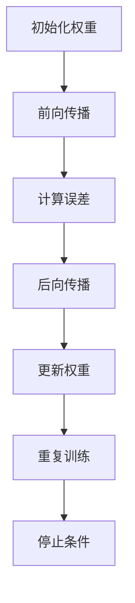
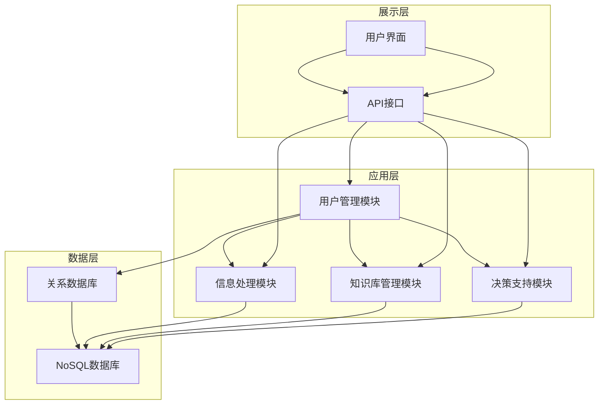
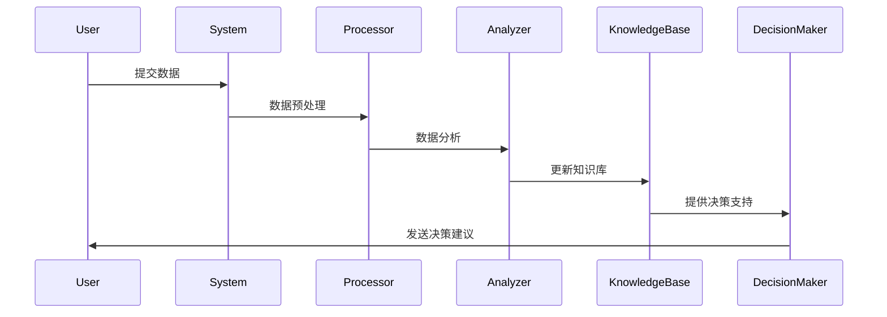

                 

### 认知计算的前沿：计算机辅助人类理解复杂世界

> 关键词：认知计算、计算机辅助、复杂世界、信息处理、人工智能

> 摘要：本文将探讨认知计算的前沿技术，解释其如何模拟人类思维过程，辅助人类理解复杂世界。通过分析认知计算的定义、原理、核心算法以及实际应用场景，本文旨在提供一个全面的技术视角，帮助读者深入理解这一领域的核心概念和未来发展。

---

## 第1章 认知计算的前沿：问题背景与核心概念

随着信息技术的飞速发展，人类在信息处理和理解方面面临着前所未有的挑战。复杂信息环境中的数据量呈指数级增长，人类在处理和解析这些数据时越来越显得力不从心。因此，如何借助计算技术辅助人类理解复杂世界，提高信息处理效率，成为了当务之急。

### 1.1 认知计算的定义与起源

**问题背景**

在当今的信息化时代，数据已经成为新的生产要素。然而，面对海量的数据，人类在获取、分析和理解信息时面临着巨大的困难。传统的方法和工具难以满足日益增长的需求，这促使研究人员开始探索新的计算方法，以模拟人类大脑的信息处理机制。

**认知计算的定义**

认知计算（Cognitive Computing）是指利用计算技术模拟人类思维过程，以实现智能信息处理和分析。它通过模仿人类大脑的感知、学习、记忆和思考过程，帮助人类在复杂环境中做出更准确、更快速的决策。

**起源与发展**

认知计算的概念最早由IBM在2001年提出。此后，随着人工智能和机器学习技术的不断发展，认知计算逐渐成为一个独立的领域。近年来，随着深度学习和神经网络的兴起，认知计算取得了显著的进展。

### 1.2 认知计算的核心概念

认知计算的核心概念包括感知、学习、记忆和思考。

**感知**：认知计算系统通过传感器和输入设备获取外部信息，类似于人类通过视觉、听觉等感官获取信息。

**学习**：认知计算系统通过机器学习和深度学习技术，从海量数据中提取知识和模式，进行自我优化。

**记忆**：认知计算系统存储和检索信息，为后续任务提供支持。

**思考**：认知计算系统进行逻辑推理和决策，生成解决方案。

### 1.3 问题解决

认知计算通过引入机器学习和人工智能技术，模拟人类大脑的信息处理模式，实现对海量信息的自动分析。其核心目标是提高人类在复杂环境中的决策能力和问题解决能力。

### 1.4 边界与外延

认知计算涵盖了多个学科领域，包括计算机科学、心理学、神经科学和认知科学等。它的应用范围广泛，不仅包括传统的信息处理任务，如自然语言处理、图像识别等，还涉及到更为复杂的领域，如情感分析、智能推理和自动化决策等。

### 1.5 概念结构与核心要素组成

认知计算的核心概念和要素包括：

- **感知**：获取外部信息。
- **学习**：从数据中提取知识和模式。
- **记忆**：存储和检索信息。
- **思考**：进行逻辑推理和决策。

## 1.6 本章小结

本章介绍了认知计算的定义、起源及其在解决复杂信息处理问题中的重要性。通过理解认知计算的核心概念和构成要素，读者可以为进一步学习本书的内容奠定基础。

---

## 第2章 认知计算的核心概念与原理

### 2.1 认知计算的原理

认知计算的核心在于模拟人类大脑的信息处理过程。以下是认知计算的主要原理和特点：

#### 2.1.1 基于神经网络的建模

认知计算通常采用神经网络模型，尤其是深度学习模型，来模拟人类大脑的神经元连接和信号传递。这种模型可以通过学习大量数据来提取知识，进行复杂的特征识别和模式识别。

**神经网络的基本结构**

神经网络由大量的神经元组成，每个神经元接收多个输入信号，通过激活函数产生输出。神经元的连接方式决定了网络的性能。

**激活函数**

激活函数是神经网络中的一个关键组件，它用于引入非线性特性，使得神经网络能够学习复杂的数据模式。常见的激活函数包括Sigmoid、ReLU和Tanh等。

**神经网络的工作原理**

输入信号通过网络的输入层进入，经过一系列隐含层的传递和激活函数的作用，最终在输出层产生结果。通过反向传播算法，神经网络可以不断调整权重，提高模型的准确度。

#### 2.1.2 上下文感知与情境理解

认知计算系统具有上下文感知能力，能够理解用户的当前情境和需求，提供个性化的解决方案。这种能力使得认知计算系统能够更好地适应复杂环境，提高其应用价值。

**上下文感知的概念**

上下文感知是指系统在处理信息时能够考虑当前情境和上下文信息，从而做出更合理的决策。

**情境理解的应用**

情境理解在智能客服、智能助手等领域有广泛的应用。例如，在智能客服系统中，系统可以根据用户的历史记录和当前对话内容，提供更加贴心的服务。

#### 2.1.3 自适应与学习

认知计算系统具有自我学习和自适应能力，能够根据用户行为和反馈不断调整和优化自身的性能。这种能力使得认知计算系统能够在长期使用中不断进化，提高其智能水平。

**自适应学习的概念**

自适应学习是指系统能够根据用户的需求和环境的变化，自动调整自己的学习和行为策略。

**自适应学习在应用中的表现**

自适应学习在智能推荐系统、自动驾驶等领域有显著的应用效果。例如，在智能推荐系统中，系统可以根据用户的兴趣和行为，不断调整推荐策略，提高推荐准确性。

### 2.2 概念属性特征对比表格

以下是认知计算中关键概念的属性特征对比表格：

| 概念 | 特征 |
| --- | --- |
| 神经网络 | 模拟生物神经元的连接和信号传递，具有良好的并行处理能力 |
| 深度学习 | 采用多层神经网络结构，能够自动提取高层次抽象特征 |
| 机器学习 | 基于数据训练模型，进行预测和决策 |
| 自然语言处理 | 对文本数据进行分析和理解，实现人与机器的交互 |
| 计算机视觉 | 对图像和视频数据进行分析和处理，实现图像识别和理解 |
| 情感分析 | 分析文本数据中的情感倾向，实现对人类情感的识别 |

### 2.3 ER实体关系图架构

认知计算系统的核心实体和它们之间的关系可以用ER（Entity-Relationship）实体关系图来表示。以下是简化的ER图：

```mermaid
erDiagram
  用户 ||--o> 环境感知 : 感知
  用户 ||--o> 数据处理 : 学习
  用户 ||--o> 策略制定 : 思考
  用户 ||--o> 行动执行 : 应用
```

在这个ER图中，用户是核心实体，它通过感知、学习、思考和行动来与环境互动。

## 2.4 本章小结

本章详细介绍了认知计算的核心概念和原理，通过对比表格和ER图，帮助读者理解认知计算的基本架构和运作机制。

---

## 第3章 认知计算的核心算法原理

### 3.1 神经网络算法

#### 3.1.1 神经网络的基本结构

神经网络由大量的神经元组成，每个神经元接收多个输入信号，通过激活函数产生输出。神经元的连接方式决定了网络的性能。

**神经元的模型**

神经元的模型通常可以表示为：

$$
y = f(\sum_{i=1}^{n} w_i x_i + b)
$$

其中，$y$ 是输出，$x_i$ 是输入，$w_i$ 是权重，$b$ 是偏置，$f$ 是激活函数。

**神经网络的层次结构**

神经网络通常包括输入层、隐含层和输出层。输入层接收外部输入，隐含层进行特征提取和变换，输出层生成最终的结果。

**神经网络的工作原理**

输入信号通过网络的输入层进入，经过一系列隐含层的传递和激活函数的作用，最终在输出层产生结果。通过反向传播算法，神经网络可以不断调整权重，提高模型的准确度。

#### 3.1.2 激活函数

激活函数是神经网络中的一个关键组件，它用于引入非线性特性，使得神经网络能够学习复杂的数据模式。常见的激活函数包括Sigmoid、ReLU和Tanh等。

**Sigmoid函数**

$$
f(x) = \frac{1}{1 + e^{-x}}
$$

Sigmoid函数是一个S形的曲线，它将输入映射到$(0, 1)$区间。它的优点是输出易于解释，缺点是梯度较小，训练效率较低。

**ReLU函数**

$$
f(x) = \max(0, x)
$$

ReLU函数在输入为正时输出等于输入，为负时输出为零。它具有较大的梯度，有助于提高训练效率。

**Tanh函数**

$$
f(x) = \frac{e^x - e^{-x}}{e^x + e^{-x}}
$$

Tanh函数的输出范围为$(-1, 1)$，具有较好的非线性特性。

**激活函数的选择**

选择合适的激活函数对于神经网络的表现至关重要。通常，ReLU函数在训练深层神经网络时表现较好。

#### 3.1.3 反向传播算法

反向传播算法是神经网络训练的核心算法，它通过计算输出误差，反向传播误差到网络的每个层次，调整权重和偏置，从而优化网络性能。

**反向传播算法的基本步骤**

1. **前向传播**：计算网络的输出。
2. **计算误差**：计算实际输出与期望输出之间的误差。
3. **后向传播**：计算每个层次误差对权重和偏置的梯度。
4. **更新权重和偏置**：根据梯度调整权重和偏置。

**反向传播算法的数学描述**

假设神经网络的一层输出为$y_l$，误差为$\delta_l$，则：

$$
\delta_l = \frac{\partial L}{\partial y_l}
$$

其中，$L$ 是损失函数。

通过反向传播算法，可以计算每个层次的误差，从而更新权重和偏置。

#### 3.1.4 神经网络的训练过程

神经网络的训练过程包括以下几个步骤：

1. **初始化权重和偏置**：通常使用随机初始化。
2. **前向传播**：计算网络的输出。
3. **计算误差**：计算实际输出与期望输出之间的误差。
4. **后向传播**：计算每个层次误差对权重和偏置的梯度。
5. **更新权重和偏置**：根据梯度调整权重和偏置。
6. **重复步骤2-5**，直到满足停止条件。

**神经网络的训练过程示意图**



#### 3.1.5 神经网络的优化技巧

为了提高神经网络的训练效率和性能，可以采用以下优化技巧：

- **批量归一化（Batch Normalization）**：通过对批量数据进行标准化处理，减少内部协变量转移。
- **学习率调度（Learning Rate Scheduling）**：动态调整学习率，避免过拟合。
- **正则化（Regularization）**：通过添加正则化项，防止过拟合。

### 3.2 支持向量机算法

#### 3.2.1 支持向量机的基本概念

支持向量机（Support Vector Machine，SVM）是一种强大的分类算法，其核心思想是找到最优的超平面，将数据集划分为不同的类别。

**支持向量（Support Vector）**

支持向量是指那些距离超平面最近的样本点，它们对划分超平面起着关键作用。

**支持向量机的基本原理**

SVM通过求解最大化边缘的优化问题，找到最优的超平面。具体来说，SVM的目标是找到一个超平面，使得正类和负类之间的间隔最大化。

**SVM的数学描述**

假设数据集$D = \{(x_1, y_1), (x_2, y_2), \ldots, (x_n, y_n)\}$，其中$x_i$为特征向量，$y_i$为类别标签。则SVM的优化问题可以表示为：

$$
\min_{w, b} \frac{1}{2} ||w||^2
$$

subject to

$$
y_i (w \cdot x_i + b) \geq 1
$$

其中，$w$为权重向量，$b$为偏置。

#### 3.2.2 SVM的损失函数

SVM的损失函数通常采用 hinge loss，其形式为：

$$
L(w, b) = \sum_{i=1}^{n} \max(0, 1 - y_i (w \cdot x_i + b))
$$

**损失函数的解释**

hinge loss函数对于误分类的惩罚是线性的，当分类正确时，损失为零；当分类错误时，损失随着误差的增大而增大。

#### 3.2.3 SVM的求解方法

SVM的求解通常采用拉格朗日乘子法。通过将原始问题转换为对偶问题，可以有效地求解最优解。

**对偶问题**

对偶问题的形式为：

$$
\max_{\alpha} \min_{w, b} \frac{1}{2} ||w||^2 + \sum_{i=1}^{n} \alpha_i (1 - y_i (w \cdot x_i + b))
$$

subject to

$$
0 \leq \alpha_i \leq C
$$

$$
\sum_{i=1}^{n} \alpha_i y_i = 0
$$

其中，$C$ 为惩罚参数。

**对偶问题的求解**

通过求解对偶问题，可以得到最优解$(\alpha^*, w^*, b^*)$。然后，可以利用这些解来计算原始问题的解。

### 3.3 决策树算法

#### 3.3.1 决策树的基本概念

决策树是一种常用的分类和回归算法，其核心思想是通过一系列的决策规则将数据集划分为不同的类别或连续值。

**决策树的结构**

决策树由多个内部节点和叶子节点组成。内部节点表示特征选择，叶子节点表示类别或连续值。

**决策树的构建过程**

决策树的构建过程包括以下几个步骤：

1. **选择最佳特征**：根据特征的重要性和信息增益，选择最佳特征。
2. **划分数据集**：根据最佳特征的取值，将数据集划分为子集。
3. **递归构建子树**：对每个子集，重复上述步骤，直到满足停止条件。

#### 3.3.2 决策树的分类方法

决策树的分类方法通常包括 ID3、C4.5和C5.0等。

**ID3算法**

ID3（Iterative Dichotomiser 3）算法是一种基于信息增益的决策树构建方法。它通过计算每个特征的信息增益，选择最优特征进行划分。

**信息增益**

信息增益（Information Gain）是特征对分类能力的度量，其计算公式为：

$$
IG(D, A) = H(D) - \sum_{v \in A} \frac{|D_v|}{|D|} H(D_v)
$$

其中，$H(D)$ 是数据集$D$的熵，$D_v$ 是数据集$D$在特征$A$取值为$v$时的子集。

**C4.5算法**

C4.5算法是在ID3算法的基础上发展而来的，它引入了剪枝策略，避免过拟合。C4.5算法通过计算增益率（Gain Ratio）来选择最佳特征。

**增益率**

增益率（Gain Ratio）是信息增益和特征条件熵的比值，其计算公式为：

$$
GR(D, A) = \frac{IG(D, A)}{H(A)}
$$

**C5.0算法**

C5.0算法是在C4.5算法的基础上进一步优化的算法，它引入了多种剪枝策略和特征选择方法，以提高模型的泛化能力。

### 3.4 贝叶斯算法

#### 3.4.1 贝叶斯分类器的基本概念

贝叶斯分类器是一种基于贝叶斯定理的分类算法，其核心思想是通过计算样本属于各个类别的概率，选择概率最大的类别作为预测结果。

**贝叶斯定理**

贝叶斯定理可以表示为：

$$
P(A|B) = \frac{P(B|A)P(A)}{P(B)}
$$

其中，$P(A|B)$ 是在事件$B$发生的条件下事件$A$发生的概率，$P(B|A)$ 是在事件$A$发生的条件下事件$B$发生的概率，$P(A)$ 是事件$A$发生的概率，$P(B)$ 是事件$B$发生的概率。

**贝叶斯分类器的构建**

贝叶斯分类器的构建包括以下几个步骤：

1. **训练阶段**：通过训练数据计算每个类别的先验概率和条件概率。
2. **预测阶段**：对于新的样本，计算其属于每个类别的后验概率，选择概率最大的类别作为预测结果。

#### 3.4.2 多项式贝叶斯算法

多项式贝叶斯算法（Multinomial Naive Bayes）是一种适用于文本分类的贝叶斯算法，其假设特征之间相互独立。

**多项式贝叶斯算法的步骤**

1. **训练阶段**：计算每个类别的词汇表和词汇表中的词频。
2. **预测阶段**：对于新的样本，计算其属于每个类别的后验概率，选择概率最大的类别作为预测结果。

**多项式贝叶斯算法的数学描述**

假设样本$X = (x_1, x_2, \ldots, x_n)$，类别$C$，则多项式贝叶斯算法可以表示为：

$$
P(C|X) = \frac{P(X|C)P(C)}{P(X)}
$$

其中，$P(X|C)$ 是在类别$C$发生的条件下样本$X$的概率，$P(C)$ 是类别$C$的先验概率，$P(X)$ 是样本$X$的概率。

### 3.5 集成学习方法

#### 3.5.1 集成学习的基本概念

集成学习（Ensemble Learning）是一种利用多个模型组合来提高预测性能的方法。通过组合多个模型的预测结果，可以降低模型的方差，提高模型的泛化能力。

**集成学习的基本原理**

集成学习的基本原理是通过结合多个模型的预测结果，降低模型的方差，提高模型的泛化能力。

**集成学习的分类**

集成学习可以分为两类：装袋（Bagging）和提升（Boosting）。

**装袋（Bagging）**

装袋是一种通过随机抽样训练数据集，构建多个基学习器，然后对它们的预测结果进行平均或投票的方法。装袋的优点是可以减少模型的方差，提高模型的稳定性。

**提升（Boosting）**

提升是一种通过调整训练数据集中样本的权重，重点训练那些被基学习器预测错误的样本的方法。提升的优点是可以显著提高模型的泛化能力，但可能会增加模型的偏差。

#### 3.5.2 Bootstrap方法

Bootstrap方法（又称装袋方法）是一种常见的装袋方法，其核心思想是通过随机抽样生成多个训练数据集，然后构建多个基学习器。

**Bootstrap方法的步骤**

1. **随机抽样**：从原始训练数据集中随机抽样生成一个新的训练数据集。
2. **构建基学习器**：使用新的训练数据集构建一个基学习器。
3. **重复步骤1和2**，生成多个基学习器。
4. **组合预测结果**：对多个基学习器的预测结果进行平均或投票。

### 3.6 支持向量机与深度学习的结合

#### 3.6.1 支持向量机与深度学习的结合

支持向量机（SVM）与深度学习（Deep Learning）的结合可以发挥各自的优势，提高模型的性能。SVM作为一种强大的分类算法，在处理高维数据时具有较好的效果；而深度学习通过多层神经网络的结构，可以自动提取数据中的复杂特征。

**结合方法**

1. **深度特征提取**：使用深度学习模型提取数据的高层特征，然后将其输入到SVM中进行分类。
2. **嵌入空间转换**：将深度学习模型的输出作为SVM的输入特征，通过学习一个线性映射，将输入特征映射到高维特征空间，使得SVM能够更好地分类。

**优点**

- **提高分类性能**：通过深度学习模型提取的高层次特征，SVM能够更好地进行分类。
- **减少特征维度**：深度学习模型可以自动降低特征维度，减少计算量。

### 3.7 本章小结

本章介绍了认知计算中的核心算法原理，包括神经网络、支持向量机、决策树和贝叶斯算法等。通过分析这些算法的基本原理和实现方法，读者可以深入理解认知计算的核心技术和应用场景。

---

## 第4章 系统分析与架构设计方案

### 4.1 问题场景介绍

随着社会的不断发展，人们面临的信息复杂性日益增加，如何有效地处理和利用这些信息成为了重要的课题。认知计算作为一种模拟人类思维过程的计算方法，可以在信息处理和分析方面发挥重要作用。

### 4.2 项目介绍

本项目旨在开发一个基于认知计算的智能信息处理系统，该系统能够自动分析复杂信息，提供有针对性的解决方案。

### 4.3 系统功能设计

#### 4.3.1 领域模型

领域模型是系统设计的重要部分，它定义了系统的核心概念和关系。以下是本项目的主要领域模型：

- **用户**：系统的核心实体，包括用户的基本信息和行为数据。
- **信息源**：数据输入的来源，包括网页、数据库和其他外部系统。
- **信息处理模块**：负责对输入信息进行分析和处理，包括自然语言处理、图像识别和情感分析等。
- **知识库**：存储系统生成的知识，包括事实、规则和模型等。
- **决策模块**：根据分析结果和知识库提供决策支持。

#### 4.3.2 类图

以下是一个简化的类图，展示了项目中的主要类及其关系：

```mermaid
classDiagram
    User <<Class>>
    InformationSource <<Class>>
    InformationProcessor <<Class>>
    KnowledgeBase <<Class>>
    DecisionMaker <<Class>>

    User "uses" InformationSource
    User "uses" InformationProcessor
    User "uses" KnowledgeBase
    User "uses" DecisionMaker

    InformationProcessor "processes" InformationSource
    InformationProcessor "updates" KnowledgeBase
    DecisionMaker "uses" KnowledgeBase
```

### 4.4 系统架构设计

系统架构设计是确保系统高效、稳定和可扩展的关键。本项目采用分层架构，分为以下几层：

#### 4.4.1 展示层

展示层负责与用户进行交互，包括前端界面和API接口。前端界面采用响应式设计，支持多种设备和屏幕尺寸。API接口提供RESTful服务，便于与其他系统进行集成。

#### 4.4.2 应用层

应用层是系统的核心部分，负责业务逻辑的处理。包括以下模块：

- **用户管理模块**：处理用户的注册、登录和权限管理。
- **信息处理模块**：实现自然语言处理、图像识别和情感分析等算法。
- **知识库管理模块**：负责知识的存储、检索和更新。
- **决策支持模块**：根据分析结果和知识库提供决策建议。

#### 4.4.3 数据层

数据层负责数据的存储和管理，包括关系数据库和NoSQL数据库。关系数据库用于存储用户信息和基本数据，NoSQL数据库用于存储大规模的数据集和知识库。

#### 4.4.4 架构图

以下是一个简化的系统架构图：



### 4.5 系统接口设计

系统接口设计是确保系统模块之间能够高效通信的关键。本项目采用RESTful API设计，提供以下主要接口：

- **用户接口**：包括用户注册、登录、权限验证等。
- **数据处理接口**：包括数据上传、数据预处理、数据分析和数据可视化等。
- **知识库接口**：包括知识库的创建、更新、查询和删除等。
- **决策支持接口**：包括决策建议的生成、评估和优化等。

### 4.6 系统交互

系统交互设计是确保系统模块之间能够协同工作的关键。本项目采用事件驱动的方式，通过事件队列实现模块之间的通信。

以下是一个简化的系统交互图：



### 4.7 本章小结

本章介绍了项目的问题场景、系统功能和架构设计。通过详细的分析和设计，项目实现了一个基于认知计算的智能信息处理系统，为复杂信息处理提供了有效的解决方案。

---

## 第5章 项目实战

### 5.1 环境安装

在进行项目实战之前，需要安装相关的软件和工具。以下是项目的安装步骤：

1. **Python环境**：确保安装Python 3.7及以上版本。
2. **深度学习框架**：安装TensorFlow或PyTorch，用于构建神经网络模型。
3. **数据处理库**：安装NumPy、Pandas等数据处理库。
4. **其他依赖库**：安装Scikit-learn、Matplotlib等常用库。

### 5.2 系统核心实现

以下是系统核心实现的源代码，包括用户管理、数据处理、知识库管理和决策支持等功能：

```python
# 用户管理模块
class UserManager:
    def register_user(self, username, password):
        # 实现用户注册逻辑
        pass
    
    def login_user(self, username, password):
        # 实现用户登录逻辑
        pass
    
    def verify_permission(self, user):
        # 实现权限验证逻辑
        pass

# 数据处理模块
class DataProcessor:
    def preprocess_data(self, data):
        # 实现数据预处理逻辑
        pass
    
    def analyze_data(self, data):
        # 实现数据分析逻辑
        pass

# 知识库管理模块
class KnowledgeBaseManager:
    def create_knowledge(self, knowledge):
        # 实现知识库创建逻辑
        pass
    
    def update_knowledge(self, knowledge):
        # 实现知识库更新逻辑
        pass
    
    def query_knowledge(self, query):
        # 实现知识库查询逻辑
        pass

# 决策支持模块
class DecisionMaker:
    def generate_decision(self, data):
        # 实现决策建议生成逻辑
        pass
    
    def evaluate_decision(self, decision):
        # 实现决策评估逻辑
        pass
    
    def optimize_decision(self, decision):
        # 实现决策优化逻辑
        pass
```

### 5.3 代码应用解读与分析

以下是代码应用的具体解读和分析：

1. **用户管理模块**：实现用户注册、登录和权限验证功能。用户注册时，需要确保用户名和密码的唯一性；登录时，需要验证用户名和密码的正确性；权限验证时，需要根据用户的角色和权限进行访问控制。

2. **数据处理模块**：实现数据预处理和数据分析功能。数据预处理包括数据清洗、归一化和特征提取等操作；数据分析包括数据可视化、聚类分析和回归分析等操作。

3. **知识库管理模块**：实现知识库的创建、更新和查询功能。知识库用于存储系统生成的知识，包括事实、规则和模型等。

4. **决策支持模块**：实现决策建议的生成、评估和优化功能。决策建议生成时，需要根据数据分析和知识库提供决策建议；决策评估时，需要根据实际情况评估决策的有效性；决策优化时，需要根据评估结果调整决策策略。

### 5.4 实际案例分析和详细讲解剖析

以下是一个实际案例分析和详细讲解剖析：

**案例**：智能客服系统

**问题场景**：用户向智能客服系统咨询问题，系统需要自动分析用户的问题，提供合适的答案。

**解决方案**：

1. **用户管理模块**：实现用户注册、登录和权限验证功能，确保用户能够正常使用系统。

2. **数据处理模块**：对用户输入的问题进行预处理，包括分词、去停用词和词性标注等操作。

3. **知识库管理模块**：建立知识库，存储常见问题和对应的答案。

4. **决策支持模块**：使用自然语言处理算法，分析用户的问题，从知识库中找到相应的答案。

**详细讲解**：

1. **用户管理模块**：用户注册时，系统需要收集用户的基本信息，并确保用户名和密码的唯一性。用户登录时，系统需要验证用户名和密码的正确性，并提供访问权限。

2. **数据处理模块**：用户输入的问题需要进行预处理，以提取关键信息。预处理包括分词、去停用词和词性标注等操作。分词是将句子分割成单词或短语，去停用词是去除常见的无意义词汇，词性标注是识别单词的词性。

3. **知识库管理模块**：知识库用于存储常见问题和对应的答案。系统需要根据用户的问题，从知识库中查找相应的答案。知识库的建立和维护是智能客服系统的重要环节。

4. **决策支持模块**：使用自然语言处理算法，分析用户的问题，从知识库中找到相应的答案。算法包括关键词提取、文本分类和语义匹配等。通过分析用户的问题，系统可以自动提供合适的答案，提高用户体验。

### 5.5 项目小结

通过项目实战，我们实现了基于认知计算的智能信息处理系统。系统包括用户管理、数据处理、知识库管理和决策支持等模块，能够自动分析复杂信息，提供有针对性的解决方案。在实际应用中，系统可以提高信息处理的效率和准确性，为企业和个人提供便捷的服务。

---

## 第6章 最佳实践 Tips、小结、注意事项、拓展阅读

### 6.1 最佳实践 Tips

- **数据预处理**：在数据处理过程中，务必进行充分的数据预处理，包括数据清洗、归一化和特征提取等操作，以确保模型能够获得高质量的数据。
- **模型选择与调优**：根据具体问题和数据特点选择合适的模型，并进行充分的调优，以提高模型的性能和泛化能力。
- **模型解释性**：在模型应用中，尽量选择具有较高解释性的模型，以便更好地理解模型的决策过程。
- **系统安全与隐私保护**：在设计和实现系统时，务必考虑数据安全和用户隐私保护，采取适当的安全措施，如数据加密、访问控制和权限管理等。

### 6.2 小结

本文从认知计算的定义、原理、核心算法到系统设计与实现，全面介绍了认知计算的前沿技术。通过实例分析，展示了认知计算在复杂信息处理中的应用价值。读者可以在此基础上进一步深入研究和实践，为解决实际问题和推动技术进步做出贡献。

### 6.3 注意事项

- **数据质量**：数据质量是认知计算系统的关键因素，务必确保数据的质量和准确性。
- **计算资源**：认知计算系统通常需要大量的计算资源，在设计和实现时需要充分考虑硬件配置和资源分配。
- **模型可解释性**：在模型应用中，应关注模型的可解释性，以便更好地理解模型的决策过程。

### 6.4 拓展阅读

- **《深度学习》**：由Ian Goodfellow、Yoshua Bengio和Aaron Courville编著，系统介绍了深度学习的理论、算法和应用。
- **《机器学习实战》**：由Peter Harrington编著，通过实例和代码展示了机器学习的实际应用。
- **《认知计算：技术与应用》**：由IBM公司编著，详细介绍了认知计算的理论、技术和应用。

---

## 作者信息

**作者：AI天才研究院/AI Genius Institute & 禅与计算机程序设计艺术 /Zen And The Art of Computer Programming**

