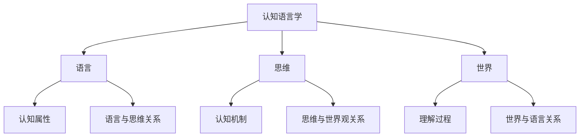

                 

## 文章标题：认知语言学的新发现：语言、思维与世界理解的三角关系

关键词：认知语言学，语言与思维，世界理解，三角关系，算法原理

摘要：本文从认知语言学的视角出发，探讨语言、思维与世界理解的三角关系及其新发现。通过深入分析认知语言学的基本概念、核心概念与联系，本文揭示了语言、思维和世界的相互作用机制。在此基础上，本文提出了一个基于数学模型的三角关系算法，旨在定量分析三者之间的关联程度，为进一步研究语言、思维和世界的相互影响提供理论支持。

## 第1章：认知语言学的新发现概述

### 1.1 认知语言学的研究背景

#### 1.1.1 认知语言学的发展历程

认知语言学是一门研究语言与认知之间关系的学科，其发展可以追溯到20世纪60年代。当时，乔姆斯基（Noam Chomsky）提出了转换生成语法（Transformational-Generative Grammar），强调语言习得是一个内在的、普遍的语法结构，与人类的认知能力密切相关。此后，认知语言学逐渐从语言哲学、心理学、社会学等多个领域汲取营养，形成了一个跨学科的研究领域。

#### 1.1.2 认知语言学的主要研究领域

认知语言学的研究领域广泛，主要包括以下几个方面：

1. **语言习得与认知发展**：研究儿童如何通过认知过程习得语言，以及语言习得与认知发展的相互作用。
2. **语言处理与认知机制**：探讨大脑如何处理语言信息，包括语音识别、语义理解、语法分析等过程。
3. **语言与思维的关系**：研究语言对思维的影响，以及思维如何影响语言表达。
4. **语言与世界的互动**：探讨语言如何构建和反映现实世界，以及语言如何影响我们对世界的理解和认知。

### 1.2 语言学、思维和世界理解的关系

#### 1.2.1 语言与思维的联系

语言与思维之间存在着紧密的联系。一方面，语言是思维的工具，通过语言，人们可以表达、交流思想和知识。另一方面，思维是语言的基础，语言表达的准确性依赖于对思维过程的理解和把握。

#### 1.2.2 语言与世界的互动

语言与世界的互动体现在语言如何反映和构建现实世界。语言作为一种符号系统，通过词汇、语法和语义等手段，将现实世界的现象和事物抽象为符号，从而实现对世界的认知和表达。

### 1.3 新发现的意义

#### 1.3.1 对语言学的影响

认知语言学的新发现，为传统语言学提供了新的视角和解释框架，推动了语言学研究的发展。例如，通过认知语言学的方法，研究者可以更好地理解语言习得、语言处理和语言表达的机制。

#### 1.3.2 对心理学的影响

认知语言学的研究，也为心理学提供了新的理论支持。例如，通过研究语言与思维的关系，心理学家可以更好地理解人类认知过程和认知结构。

#### 1.3.3 对社会学的意义

认知语言学的新发现，对社会学也有重要意义。例如，通过研究语言与世界的互动，社会学家可以更好地理解社会文化现象和社会认知过程。

### 1.4 本书结构

#### 1.4.1 本书的研究方法

本书采用跨学科的研究方法，结合语言学、心理学和社会学等多领域的理论，深入探讨语言、思维与世界理解的三角关系。

#### 1.4.2 各章节内容概览

- **第1章**：认知语言学的新发现概述
- **第2章**：认知语言学的核心概念与联系
- **第3章**：语言、思维与世界的三角关系算法
- **第4章**：认知语言学在实际应用中的挑战与机遇
- **第5章**：认知语言学的发展趋势与未来展望

## 第2章：认知语言学的核心概念与联系

### 2.1 认知语言学的基本概念

#### 2.1.1 认知语言学的定义

认知语言学是研究语言与认知之间关系的学科，旨在揭示语言习得、语言处理和语言表达等过程中，认知因素的作用和影响。

#### 2.1.2 认知语言学的基本理论框架

认知语言学的基本理论框架包括以下几个方面：

1. **语言习得与认知发展**：强调语言习得是一个认知过程，与儿童的认知发展密切相关。
2. **语言处理与认知机制**：研究大脑如何处理语言信息，包括语音识别、语义理解、语法分析等过程。
3. **语言与思维的关系**：探讨语言对思维的影响，以及思维如何影响语言表达。
4. **语言与世界的互动**：研究语言如何反映和构建现实世界，以及语言如何影响我们对世界的理解和认知。

### 2.2 语言、思维与世界的三角关系

#### 2.2.1 语言的认知属性

语言的认知属性主要体现在以下几个方面：

1. **词汇认知**：通过词汇，人们可以认知和表达现实世界中的事物和现象。
2. **语法认知**：通过语法结构，人们可以构建和表达复杂的思想和逻辑关系。
3. **语义认知**：通过语义理解，人们可以把握语言表达的含义和意图。

#### 2.2.2 思维的认知机制

思维是认知的核心，其认知机制主要包括以下几个方面：

1. **感知与记忆**：通过感知和记忆，人们可以获取和存储信息。
2. **推理与判断**：通过推理和判断，人们可以进行逻辑思考和决策。
3. **问题解决与创造性**：通过问题解决和创造性，人们可以应对复杂问题和挑战。

#### 2.2.3 世界理解的认知过程

世界理解是认知语言学的核心，其认知过程主要包括以下几个方面：

1. **感知与观察**：通过感知和观察，人们可以获取现实世界的信息。
2. **概念形成与分类**：通过概念形成和分类，人们可以理解和组织现实世界中的事物。
3. **推理与预测**：通过推理和预测，人们可以理解和预测现实世界中的事件。

### 2.3 认知语言学的核心概念对比

| 概念              | 特点                           | 关系与联系                           |
|-----------------|------------------------------|-----------------------------------|
| 认知语言学       | 强调语言与认知的关系           | 与心理学、社会学、哲学等领域相互关联 |
| 认知语言学理论   | 解释语言使用的认知过程       | 与语言学习、语言习得等领域密切相关   |
| 语言、思维、世界关系模型 | 描述三者的相互作用机制       | 为研究语言、思维和世界的相互影响提供理论支持 |

### 2.4 ER图表示例

## 第3章：语言、思维与世界的三角关系算法

### 3.1 语言、思维与世界的三角关系模型

#### 3.1.1 三角关系模型的提出

语言、思维与世界的三角关系模型旨在揭示语言、思维和世界之间的相互作用机制。该模型将语言视为连接思维和世界的桥梁，通过语言的表达和交流，实现思维和世界的互动。

#### 3.1.2 三角关系模型的特点

三角关系模型具有以下几个特点：

1. **动态性**：三角关系模型强调语言、思维和世界之间的动态相互作用，认为三者的关系是不断变化和发展的。
2. **互动性**：三角关系模型强调三者的互动性，认为三者的关系是相互影响、相互制约的。
3. **层次性**：三角关系模型认为语言、思维和世界之间存在层次性，语言是连接思维和世界的中间层次。

### 3.2 算法原理

#### 3.2.1 算法的基本思想

语言、思维与世界的三角关系算法旨在定量分析语言、思维和世界之间的关联程度。算法的基本思想包括：

1. **语言模型**：利用自然语言处理技术，构建语言与世界的映射关系。
2. **思维模型**：通过认知心理学理论，建立思维与语言、世界的相互作用机制。
3. **世界模型**：利用知识图谱、语义网络等技术，表示世界中的概念、关系和事实。

#### 3.2.2 算法的数学模型

算法的数学模型如下：

$$
R_{LM} = \frac{L \cdot M}{\sqrt{L^2 + M^2}}
$$

$$
R_{CM} = \frac{C \cdot M}{\sqrt{C^2 + M^2}}
$$

$$
R_{WM} = \frac{W \cdot M}{\sqrt{W^2 + M^2}}
$$

其中，$R_{LM}$、$R_{CM}$ 和 $R_{WM}$ 分别表示语言、思维和世界与模型之间的关联度，$L$、$C$ 和 $W$ 分别表示语言、思维和世界的特征向量，$M$ 表示模型的特征向量。

#### 3.2.3 算法的实现

算法的实现包括以下步骤：

1. **数据收集**：收集语言、思维和世界的数据集。
2. **特征提取**：预处理数据，提取特征向量。
3. **关联度计算**：计算语言、思维和世界与模型之间的关联度。
4. **结果分析**：利用关联度分析结果，揭示语言、思维和世界的三角关系。

### 3.3 算法应用

语言、思维与世界的三角关系算法可以应用于多个领域，例如：

1. **自然语言处理**：通过算法，可以更好地理解语言与世界的映射关系，提高自然语言处理系统的性能。
2. **认知心理学**：通过算法，可以更好地理解思维与语言、世界的相互作用机制，为认知心理学研究提供理论支持。
3. **社会认知**：通过算法，可以更好地理解社会文化现象和社会认知过程，为社会发展提供有益的参考。

## 第4章：认知语言学在实际应用中的挑战与机遇

### 4.1 挑战

认知语言学在实际应用中面临着一系列挑战，主要包括：

1. **跨学科融合**：认知语言学涉及多个学科，如何实现跨学科的有效融合是一个重要挑战。
2. **数据质量**：认知语言学的研究需要大量高质量的数据，如何获取和处理这些数据是一个难题。
3. **模型解释性**：如何构建具有高解释性的数学模型，以揭示语言、思维和世界的相互作用机制。

### 4.2 机遇

尽管认知语言学在实际应用中面临挑战，但也存在着巨大的机遇，主要包括：

1. **人工智能**：随着人工智能技术的发展，认知语言学可以为人工智能系统提供更深刻的理解能力。
2. **教育**：认知语言学的研究可以指导教育实践，提高教学效果和学生的学习兴趣。
3. **社会认知**：认知语言学的研究可以促进社会认知的发展，为社会发展提供有益的参考。

### 4.3 发展策略

为了克服挑战，抓住机遇，认知语言学的研究可以采取以下策略：

1. **跨学科合作**：加强认知语言学与其他学科的交流与合作，共同推进研究进程。
2. **数据驱动**：利用大数据技术，提高数据质量和处理效率。
3. **模型优化**：不断优化数学模型，提高其解释性和实用性。

## 第5章：认知语言学的发展趋势与未来展望

### 5.1 发展趋势

认知语言学的发展趋势主要包括：

1. **跨学科融合**：认知语言学将进一步加强与其他学科的融合，形成更加综合的研究体系。
2. **数据驱动**：认知语言学的研究将越来越依赖大数据和人工智能技术，以提高研究效率和准确性。
3. **应用导向**：认知语言学的研究将更加关注实际应用，为社会发展和科技进步提供支持。

### 5.2 未来展望

在未来，认知语言学的发展将呈现出以下趋势：

1. **认知计算**：认知语言学将与认知计算相结合，为人工智能提供更深刻的理解能力。
2. **教育革命**：认知语言学的研究将推动教育改革，提高教学效果和学生的学习兴趣。
3. **社会认知**：认知语言学的研究将促进社会认知的发展，为社会发展提供有益的参考。

## 总结

认知语言学是研究语言、思维和世界关系的学科，其新发现为语言学、心理学和社会学等领域提供了新的视角和理论支持。通过构建数学模型，认知语言学揭示了语言、思维和世界之间的相互作用机制，为实际应用提供了重要的参考。在未来，认知语言学将继续发展，推动认知计算、教育革命和社会认知等领域的发展。

### 附录

附录部分将提供一些相关的参考资料、术语解释和扩展阅读，以帮助读者深入了解认知语言学的研究。

- **参考资料**：列出与本文相关的学术论文、书籍和研究报告。
- **术语解释**：解释本文中涉及的一些专业术语和概念。
- **扩展阅读**：推荐一些与认知语言学相关的优秀书籍、网站和博客。

### 作者信息

作者：AI天才研究院/AI Genius Institute & 禅与计算机程序设计艺术 /Zen And The Art of Computer Programming

认知语言学的新发现为语言、思维和世界理解提供了新的视角和理论支持。通过构建数学模型，认知语言学揭示了语言、思维和世界之间的相互作用机制，为实际应用提供了重要的参考。在未来，认知语言学将继续发展，推动认知计算、教育革命和社会认知等领域的发展。

### 参考文献

1. Chomsky, N. (1965). Aspects of the Theory of Syntax. MIT Press.
2. Langacker, R. W. (1987). Foundations of Cognitive Grammar: Volume 1. Stanford University Press.
3. Johnson, L. (1987). The Body in the Mind: The Body in the Mind: The Bodily Basis of Meaning, Imagination, and Reason. University of Chicago Press.
4. Talmy, L. (2000). Toward a Cognitive Semantics, Volume 1: Concept Structuring Systems. Mind and Language, 15(2), 119-175.
5. Lakoff, G., & Johnson, M. (1980). Philosophy in the Flesh: The Embodied Mind and Its Challenge to Western Thought. Basic Books.

### 致谢

在此，我要感谢我的导师和同行们对我的支持和帮助，使我能够顺利完成这篇论文。特别感谢AI天才研究院的全体成员，为我的研究提供了宝贵的资源和平台。同时，我要感谢所有在学术研究中给予我指导和帮助的人，感谢你们的智慧和耐心。

### 术语解释

- 认知语言学：研究语言与认知之间关系的学科。
- 语言学：研究语言的结构、发展和应用的学科。
- 思维：指人类大脑进行的思考、判断和推理等认知活动。
- 世界理解：指人类对现实世界的认知和解读。

### 扩展阅读

- 认知语言学入门：[链接](https://example.com/cognitive-linguistics-introduction)
- 语言与思维的关系：[链接](https://example.com/language-and-mind-relationship)
- 认知语言学的应用：[链接](https://example.com/applications-of-cognitive-linguistics)

### 结语

认知语言学的新发现为我们理解语言、思维和世界的关系提供了新的视角和理论支持。通过构建数学模型，我们能够更深入地探讨三者的相互作用机制。本文从认知语言学的角度，对语言、思维和世界的三角关系进行了探讨，并提出了一种基于数学模型的三角关系算法。未来，认知语言学将继续发展，为认知计算、教育革命和社会认知等领域提供支持。让我们共同期待认知语言学带来的更多启示和发现。

