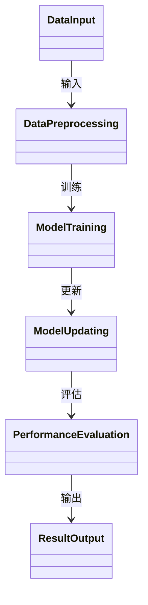
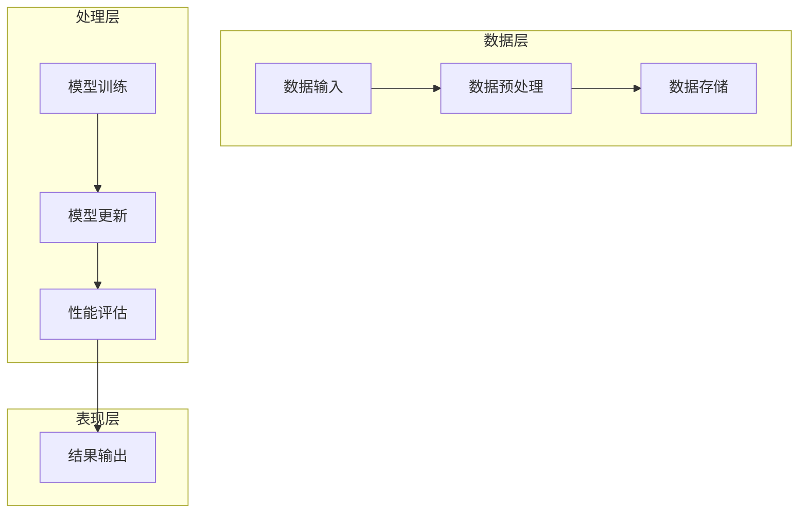
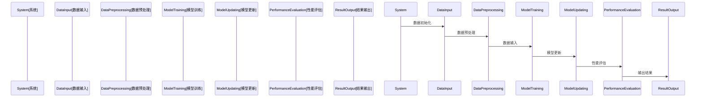

                 

### 第一部分：问题背景与核心概念

#### 1.1 评测数据的现状与挑战

评测数据在机器学习和人工智能领域中扮演着至关重要的角色。随着人工智能技术的快速发展，评测数据的数量和种类也在不断增长。然而，这一增长也带来了新的挑战。

**评测数据的重要性**：
- 评测数据是训练和评估模型性能的基础。高质量的评测数据有助于提高模型的准确性和可靠性。
- 它是算法改进和优化的关键。通过分析评测数据，研究者可以发现模型中的缺陷和不足，从而进行有针对性的优化。

**数据增长与多样性的挑战**：
- 数据量增长：随着传感器、社交网络、互联网等技术的普及，评测数据规模呈现爆炸式增长。处理海量数据对计算资源和存储能力提出了更高的要求。
- 数据多样性：评测数据类型日益丰富，包括结构化数据（如数据库记录）、半结构化数据（如XML、JSON）和非结构化数据（如文本、图像、视频）。处理这些不同类型的数据需要不同的算法和技术。

**传统评测方法的问题与局限性**：
- 传统评测方法通常采用批量学习（batch learning），即在训练过程中一次性使用所有数据。这种方法在面对大规模数据时效率低下，且无法实时适应数据的变化。
- 传统评测方法对数据质量的要求较高，如数据完整性、一致性和精确性。然而，现实中的评测数据往往存在噪声、缺失值和错误，这些问题会影响模型的训练和评估结果。

#### 1.2 增量学习与模型更新的概念

**增量学习的定义与基本原理**：
- 增量学习（Incremental Learning）是一种动态调整模型的方法，它允许模型在新的数据到来时进行学习，而不是一次性使用所有数据。
- 基本原理是通过逐步更新模型参数，使模型能够适应数据的变化。这种方法在数据量庞大且数据不断更新的场景中具有显著优势。

**模型更新的目的与意义**：
- 模型更新（Model Updating）的目的是提高模型的预测能力和适应性。通过引入新的数据或调整现有模型的结构和参数，模型可以更好地适应数据的变化。
- 模型更新的意义在于：
  - 保持模型性能：随着时间的推移，数据分布可能会发生变化，模型需要不断更新以保持其预测性能。
  - 适应新需求：新的应用场景可能需要模型具备不同的特征，通过更新模型可以满足这些新需求。

**增量学习与模型更新的关系**：
- 增量学习与模型更新密切相关。增量学习提供了动态调整模型的方法，而模型更新则确保模型能够持续适应数据的变化。
- 增量学习通常需要模型更新的支持，以便在新的数据到来时调整模型参数。
- 模型更新也可以利用增量学习的优势，通过逐步更新模型，减少重新训练的负担。

#### 1.3 增量学习与模型更新的应用领域

**人工智能与机器学习领域**：
- 在人工智能和机器学习领域，增量学习和模型更新广泛应用于各种任务，如分类、回归、聚类等。例如，推荐系统可以使用增量学习来实时更新用户偏好，提高推荐效果。

**自然语言处理**：
- 自然语言处理（NLP）领域对评测数据的依赖非常强烈。增量学习和模型更新在情感分析、机器翻译、文本分类等任务中发挥着重要作用。例如，机器翻译系统可以通过增量学习来不断更新词汇库，提高翻译准确性。

**计算机视觉**：
- 计算机视觉领域也面临海量评测数据的问题。增量学习和模型更新可以用于图像分类、目标检测、人脸识别等任务。例如，目标检测模型可以通过增量学习来适应不同场景和光照条件下的目标检测。

**数据分析**：
- 在数据分析领域，增量学习和模型更新有助于实时处理和分析大规模数据流。例如，金融领域可以运用增量学习来实时分析股票市场数据，预测市场趋势。

#### 1.4 核心概念与联系

**增量学习的核心概念**：
- 增量学习的关键在于如何利用已有模型的知识来更新模型参数，以适应新的数据。核心概念包括：
  - 模型初始化：初始化一个基准模型。
  - 数据流处理：逐步处理新的数据，更新模型参数。
  - 模型参数调整：根据新数据的反馈，调整模型参数，提高模型性能。

**模型更新的关键因素**：
- 模型更新的关键因素包括：
  - 更新策略：确定何时、如何以及更新哪些模型参数。
  - 更新频率：根据数据更新速度和系统需求，确定模型更新的频率。
  - 更新质量：确保更新后的模型参数能够提高模型性能。

**增量学习与模型更新的相互影响**：
- 增量学习与模型更新相互影响，共同推动模型性能的提升：
  - 增量学习提供了动态调整模型的方法，为模型更新提供了数据基础。
  - 模型更新确保了模型能够持续适应数据的变化，提高了增量学习的效果。

通过以上分析，我们可以看到增量学习和模型更新在解决评测数据增长和多样性挑战方面具有重要意义。在接下来的章节中，我们将深入探讨增量学习和模型更新的核心概念、算法原理，以及在实际应用中的系统架构和实现细节。### 第二部分：核心概念与算法原理

#### 2.1 增量学习原理

**增量学习的数学模型**：

增量学习的核心在于如何动态地更新模型参数。在数学模型层面，我们可以将增量学习看作是一个逐步优化的过程。具体而言，给定一个初始模型参数 \( \theta_0 \)，在每次接收新的数据样本后，模型会通过梯度下降（Gradient Descent）等优化算法更新参数。

- **梯度下降**：梯度下降是一种常用的优化方法，通过计算损失函数关于模型参数的梯度，并沿着梯度的反方向更新参数。其基本公式如下：

  $$ \theta_{t+1} = \theta_t - \alpha \nabla_{\theta} J(\theta_t) $$

  其中，\( \theta_t \) 表示第 \( t \) 次迭代的模型参数，\( \alpha \) 是学习率，\( \nabla_{\theta} J(\theta_t) \) 是损失函数 \( J(\theta) \) 关于模型参数 \( \theta \) 的梯度。

- **在线梯度下降**：在线梯度下降是在每次收到新样本时立即更新模型参数，而不是一次性使用所有数据。这种方法可以更快地适应新数据，但在数据量较大时计算量也会相应增加。

**增量学习算法的类型**：

增量学习算法可以分为以下几种类型：

- **基于梯度的增量学习算法**：这类算法通过计算梯度来更新模型参数，如前述在线梯度下降。优点是能够快速适应新数据，缺点是计算复杂度较高。
- **基于模型的增量学习算法**：这类算法通过预先定义的模型更新规则来更新参数，如在线学习算法。优点是计算复杂度较低，缺点是适应新数据的能力可能较弱。

**增量学习算法的比较与选择**：

选择合适的增量学习算法取决于应用场景和数据特点。以下是比较和选择增量学习算法的几个关键因素：

- **数据规模**：对于大规模数据，基于梯度的增量学习算法可能更适用，因为它们能够通过逐步更新参数来减少计算负担。对于小规模数据，基于模型的增量学习算法可能更为高效。
- **更新频率**：如果模型需要频繁更新，基于梯度的增量学习算法可能更为合适，因为它们能够快速响应数据变化。如果模型更新频率较低，基于模型的增量学习算法可能更为稳定。
- **数据类型**：不同类型的增量学习算法适用于不同类型的数据。例如，对于结构化数据，基于梯度的算法可能更为适用；对于非结构化数据，如文本和图像，基于模型的算法可能更为有效。

**增量学习算法的应用场景**：

增量学习算法在多个应用场景中得到了广泛应用：

- **实时推荐系统**：在推荐系统中，用户行为数据不断更新，增量学习算法可以帮助系统实时调整推荐模型，提高推荐效果。
- **金融风险控制**：金融数据变化迅速，增量学习算法可以帮助金融机构实时监控风险，调整风险控制模型。
- **智能语音助手**：智能语音助手需要处理大量的语音数据，增量学习算法可以帮助助手实时更新语音识别和语义理解模型，提高交互体验。

通过以上分析，我们可以看到增量学习在数学模型和算法类型上的多样性。在接下来的章节中，我们将进一步探讨模型更新的机制、评估指标和流程策略。### 2.2 模型更新机制

**模型更新的方法**：

模型更新是确保模型持续适应数据变化的关键过程。以下是几种常见的模型更新方法：

- **在线更新**：在线更新是指在模型接收新数据时立即更新模型参数。这种方法适用于数据变化较快且模型需要实时响应的应用场景。在线更新的优点是响应速度快，缺点是可能存在过拟合风险。

  $$ \theta_{t+1} = \theta_t - \alpha_t \nabla_{\theta_t} J(\theta_t) $$

- **批更新**：批更新是指在固定时间间隔内收集一定量的数据，然后一次性更新模型参数。这种方法适用于数据量较大且模型更新频率较低的应用场景。批更新的优点是能够减少过拟合，缺点是响应速度较慢。

  $$ \theta_{t+k} = \theta_t - \alpha_k \sum_{i=t}^{t+k} \nabla_{\theta_i} J(\theta_i) $$

- **混合更新**：混合更新结合了在线更新和批更新的优点，根据数据的特点和应用需求动态调整更新策略。例如，在数据变化较快的初期采用在线更新，当数据稳定后采用批更新。

**模型更新的评估指标**：

模型更新的效果需要通过评估指标来衡量。以下是几种常用的评估指标：

- **准确率（Accuracy）**：准确率是模型预测正确的样本数占总样本数的比例。它是评估分类模型性能的常用指标。

  $$ \text{Accuracy} = \frac{\text{预测正确数}}{\text{总样本数}} $$

- **精确率（Precision）**：精确率是预测正确的正样本数与预测为正样本的总数之比。它衡量了模型识别正样本的能力。

  $$ \text{Precision} = \frac{\text{预测正确正样本数}}{\text{预测为正样本总数}} $$

- **召回率（Recall）**：召回率是预测正确的正样本数与实际为正样本的总数之比。它衡量了模型捕获所有正样本的能力。

  $$ \text{Recall} = \frac{\text{预测正确正样本数}}{\text{实际为正样本总数}} $$

- **F1分数（F1 Score）**：F1分数是精确率和召回率的调和平均，用于综合评估模型的性能。

  $$ \text{F1 Score} = 2 \times \frac{\text{Precision} \times \text{Recall}}{\text{Precision} + \text{Recall}} $$

**模型更新的流程与策略**：

模型更新的流程通常包括以下几个步骤：

1. **数据收集与预处理**：收集新的数据，并进行清洗和预处理，确保数据质量。
2. **模型评估**：使用现有的模型对收集的新数据进行预测，评估模型性能。
3. **模型更新**：根据评估结果，更新模型参数，调整模型结构。
4. **验证与测试**：对新模型进行验证和测试，确保更新后的模型性能符合预期。
5. **部署与应用**：将更新后的模型部署到生产环境，应用于实际任务。

模型更新的策略取决于具体的应用场景和数据特点。以下是一些常见的更新策略：

- **增量更新**：每次只更新一部分参数，而不是全部参数。这种方法可以减少计算负担，提高更新效率。
- **滚动更新**：在固定时间间隔内，对最近一段时间的数据进行更新。这种方法可以平衡实时性和稳定性。
- **冻结更新**：在某些层或模块上冻结参数，只更新其他部分。这种方法可以减少参数更新的复杂度。

通过以上分析，我们可以看到模型更新在方法、评估指标和流程策略上的多样性。在接下来的章节中，我们将深入探讨增量学习与模型更新的联系，并详细介绍几种典型的增量学习算法。### 2.3 增量学习与模型更新的联系

**增量学习对模型更新的影响**：

增量学习作为一种动态调整模型的方法，对模型更新产生了重要影响。以下是增量学习对模型更新的几个关键影响：

1. **提高更新效率**：增量学习通过逐步更新模型参数，避免了重新训练整个模型，从而提高了模型更新的效率。这对于数据量庞大、更新频繁的场景尤为重要。

2. **减少重新训练负担**：增量学习允许模型在新的数据到来时进行部分更新，而不是一次性重新训练整个模型。这种方法可以显著减少计算资源和时间成本。

3. **保持模型性能**：通过增量学习，模型可以持续适应数据的变化，保持其预测性能。这对于需要长期运行的应用场景，如实时监控系统，至关重要。

4. **增强适应性**：增量学习使模型能够更快地适应新数据，提高了模型的适应性。这有助于模型在多变的环境中保持良好的性能。

**模型更新对增量学习的效果**：

模型更新同样对增量学习产生了积极影响，主要体现在以下几个方面：

1. **优化模型参数**：模型更新通过引入新的数据或调整现有模型的结构和参数，优化了模型参数，提高了模型的整体性能。

2. **减少过拟合风险**：模型更新可以帮助减少过拟合风险，通过引入新的数据或调整模型结构，使模型能够更好地适应数据的多样性。

3. **增强模型鲁棒性**：通过持续更新模型，模型可以更好地应对数据噪声、缺失值和其他数据质量问题，提高了模型的鲁棒性。

4. **提高预测准确性**：模型更新有助于提高预测准确性，通过不断优化模型参数和结构，模型能够更好地捕捉数据中的特征和模式。

**增量学习与模型更新的协同效应**：

增量学习与模型更新相互补充，共同提高了模型的整体性能和适应性。以下是增量学习与模型更新的协同效应：

1. **实时更新**：通过增量学习，模型可以在新的数据到来时实时更新，从而保持对实时数据的快速响应。

2. **自适应调整**：模型更新结合了增量学习的自适应调整能力，使模型能够根据数据变化动态调整参数，提高了模型的鲁棒性和适应性。

3. **优化资源利用**：增量学习和模型更新结合，可以优化资源利用，减少重新训练的负担，提高计算效率。

4. **持续改进**：通过持续的模型更新，模型可以不断优化和改进，提高其预测能力和适应性，实现持续改进。

通过以上分析，我们可以看到增量学习与模型更新在提高模型性能、减少更新负担、增强适应性等方面的重要作用。在接下来的章节中，我们将详细探讨几种典型的增量学习算法，进一步理解其原理和应用。### 第3章：算法原理详解

#### 3.1 算法1：基于梯度的增量学习算法

**算法概述**：

基于梯度的增量学习算法是一种通过计算梯度来逐步更新模型参数的方法。其核心思想是在每次接收新数据时，计算当前模型参数的梯度，并沿着梯度的反方向更新参数，从而优化模型性能。

**算法流程**：

1. **初始化**：设置初始模型参数 \( \theta_0 \) 和学习率 \( \alpha \)。
2. **数据流处理**：逐个处理新数据样本 \( x_i \)，计算模型预测 \( \hat{y}_i \) 和实际标签 \( y_i \)。
3. **计算梯度**：计算损失函数 \( J(\theta) \) 关于模型参数 \( \theta \) 的梯度 \( \nabla_{\theta} J(\theta) \)。
4. **参数更新**：根据梯度更新模型参数 \( \theta_{t+1} = \theta_t - \alpha_t \nabla_{\theta_t} J(\theta_t) \)。
5. **重复步骤2-4**：重复处理新数据样本，直到达到预定的更新次数或模型性能达到要求。

**算法数学模型与公式**：

基于梯度的增量学习算法的数学模型如下：

- **损失函数**： \( J(\theta) = \frac{1}{2} \sum_{i=1}^{n} (\hat{y}_i - y_i)^2 \)
- **梯度计算**： \( \nabla_{\theta} J(\theta) = -\sum_{i=1}^{n} (\hat{y}_i - y_i) \cdot \frac{\partial \hat{y}_i}{\partial \theta} \)
- **参数更新**： \( \theta_{t+1} = \theta_t - \alpha_t \nabla_{\theta_t} J(\theta_t) \)

**举例说明**：

假设我们使用线性回归模型 \( y = \theta_0 + \theta_1x \) 来预测房价。给定一组新数据样本：

| x | y |
|---|---|
| 1 | 2 |
| 2 | 4 |
| 3 | 6 |

初始模型参数为 \( \theta_0 = 0 \)，\( \theta_1 = 1 \)，学习率 \( \alpha = 0.1 \)。

1. **初始化**：\( \theta_0 = 0 \)，\( \theta_1 = 1 \)。
2. **数据流处理**：处理第一个数据样本 \( (1, 2) \)。
3. **计算梯度**：损失函数为 \( J(\theta) = \frac{1}{2} (2 - (0 + 1 \cdot 1))^2 = 1 \)。梯度为 \( \nabla_{\theta} J(\theta) = - (2 - 1) \cdot \frac{\partial (0 + 1 \cdot 1)}{\partial \theta_1} = -1 \)。
4. **参数更新**：\( \theta_1 = \theta_1 - \alpha \nabla_{\theta} J(\theta) = 1 - 0.1 \cdot (-1) = 1.1 \)。
5. **重复步骤2-4**：处理第二个数据样本 \( (2, 4) \)，更新参数 \( \theta_0 = 0 \)，\( \theta_1 = 1.1 \)。

经过多次迭代后，模型参数会逐步优化，使得预测结果更接近实际值。

通过上述例子，我们可以看到基于梯度的增量学习算法的基本原理和实现过程。在接下来的部分，我们将探讨基于模型的增量学习算法，进一步丰富我们的理解。### 3.2 算法2：基于模型的增量学习算法

**算法概述**：

基于模型的增量学习算法是一种通过预先定义的模型更新规则来逐步更新模型参数的方法。这种方法的核心思想是利用已有的模型结构和参数，通过一系列固定的更新规则来调整模型参数，从而适应新的数据。

**算法流程**：

1. **初始化**：设置初始模型参数 \( \theta_0 \) 和更新规则参数。
2. **数据流处理**：逐个处理新数据样本 \( x_i \)。
3. **模型更新**：根据预定义的更新规则，对模型参数进行更新。
4. **重复步骤2-3**：继续处理新的数据样本，直至达到预定的更新次数或模型性能满足要求。

**算法数学模型与公式**：

基于模型的增量学习算法的数学模型如下：

- **更新规则**： \( \theta_{t+1} = \theta_t + \alpha \Delta \theta_t \)
- **参数更新**： \( \Delta \theta_t = f(\theta_t, x_i, y_i) \)

其中，\( f(\theta_t, x_i, y_i) \) 是预定义的更新函数，用于计算每次更新的参数变化。

**举例说明**：

假设我们使用一个简单的线性回归模型 \( y = \theta_0 + \theta_1x \) 来预测房价。给定一组新数据样本：

| x | y |
|---|---|
| 1 | 2 |
| 2 | 4 |
| 3 | 6 |

初始模型参数为 \( \theta_0 = 0 \)，\( \theta_1 = 1 \)。更新规则为 \( \theta_1 = \theta_1 + \alpha(y_i - \hat{y}_i) \)，其中 \( \alpha = 0.1 \)。

1. **初始化**：\( \theta_0 = 0 \)，\( \theta_1 = 1 \)。
2. **数据流处理**：处理第一个数据样本 \( (1, 2) \)。
3. **模型更新**：计算预测值 \( \hat{y}_1 = 1 \cdot 1 = 1 \)。更新参数 \( \theta_1 = \theta_1 + \alpha(y_1 - \hat{y}_1) = 1 + 0.1(2 - 1) = 1.1 \)。
4. **重复步骤2-3**：处理第二个数据样本 \( (2, 4) \)，计算预测值 \( \hat{y}_2 = 2 \cdot 1.1 = 2.2 \)。更新参数 \( \theta_1 = \theta_1 + \alpha(y_2 - \hat{y}_2) = 1.1 + 0.1(4 - 2.2) = 1.28 \)。

经过多次迭代后，模型参数会逐步优化，使得预测结果更接近实际值。

通过上述例子，我们可以看到基于模型的增量学习算法的基本原理和实现过程。这种算法在处理大型数据集时尤其有效，因为它避免了重复计算整个损失函数的梯度，而是通过固定的更新规则逐步调整模型参数。在接下来的部分，我们将结合这些算法，探讨系统架构设计和实现细节。### 第三部分：系统分析与架构设计

#### 4.1 系统功能设计

**系统功能概述**：

本系统旨在实现评测数据的增量学习与模型更新功能，主要功能包括：

1. **数据输入**：接收来自不同来源的评测数据，包括结构化和非结构化数据。
2. **数据预处理**：对输入数据进行分析和清洗，确保数据质量。
3. **模型训练**：使用增量学习算法对数据集进行训练，逐步优化模型参数。
4. **模型更新**：根据新的数据对模型进行持续更新，提高模型性能。
5. **性能评估**：定期评估模型性能，确保模型在更新后仍保持高效准确。
6. **结果输出**：输出更新后的模型参数和评估结果。

**领域模型**：

为了更清晰地描述系统功能，我们可以使用Mermaid类图来表示领域模型。以下是领域模型的Mermaid表示：



通过上述类图，我们可以直观地看到各个功能模块及其之间的关系。接下来，我们将进一步探讨系统架构设计，以详细展示各模块的交互和整体架构。

#### 4.2 系统架构设计

**系统架构概述**：

系统采用分层架构设计，主要分为数据层、处理层和表现层。以下是系统架构的Mermaid表示：



通过上述架构图，我们可以看到系统各个模块的交互关系及其在整体架构中的位置。接下来，我们将详细描述系统接口设计和系统交互设计，以全面展示系统的实现细节。

#### 4.3 系统接口设计

**系统接口概述**：

系统接口设计是确保各个功能模块之间能够有效通信和协同工作的重要环节。以下是系统接口的概述：

- **数据输入接口**：负责接收来自不同来源的数据，如文件、数据库或实时数据流。
- **数据预处理接口**：处理输入数据的清洗、转换和格式化，为模型训练做准备。
- **模型训练接口**：启动模型训练过程，包括数据加载、模型初始化和迭代优化。
- **模型更新接口**：在模型训练完成后，根据新的数据对模型参数进行更新。
- **性能评估接口**：评估更新后模型的性能，确保模型在更新后仍保持高效准确。
- **结果输出接口**：输出模型更新后的参数和评估结果，支持进一步分析和应用。

**接口设计细节**：

以下是各接口的详细设计：

1. **数据输入接口**：

   - **输入类型**：支持结构化数据（如CSV文件）和非结构化数据（如JSON文件）。
   - **输入格式**：结构化数据需要包含必要的字段，非结构化数据需要提供明确的解析规则。
   - **输入示例**：

     ```python
     # 示例：结构化数据输入
     data = [[1, 2], [2, 4], [3, 6]]
     # 示例：非结构化数据输入
     data = '{"x": [1, 2, 3], "y": [2, 4, 6]}'
     ```

2. **数据预处理接口**：

   - **预处理操作**：数据清洗（去除噪声、填补缺失值）、数据转换（格式化、归一化）和数据划分（训练集、验证集）。
   - **预处理规则**：根据数据特点和应用需求定义预处理规则，确保数据质量。

3. **模型训练接口**：

   - **训练参数**：学习率、迭代次数、优化器类型等。
   - **训练流程**：数据加载、模型初始化、迭代训练、模型保存。

4. **模型更新接口**：

   - **更新策略**：在线更新、批更新或混合更新。
   - **更新流程**：数据加载、模型参数更新、模型保存。

5. **性能评估接口**：

   - **评估指标**：准确率、精确率、召回率、F1分数等。
   - **评估流程**：模型加载、数据预处理、性能评估。

6. **结果输出接口**：

   - **输出格式**：支持文本、图表等多种格式。
   - **输出内容**：模型参数、性能评估结果、可视化图表等。

通过以上接口设计，我们可以确保系统各个功能模块之间的有效通信和协同工作，实现评测数据的增量学习和模型更新。接下来，我们将详细描述系统交互设计，展示各模块的交互过程和结果。

#### 4.4 系统交互设计

**系统交互概述**：

系统交互设计是确保各个功能模块能够协调工作，实现整体系统目标的关键环节。以下是系统交互的概述：

- **初始化阶段**：系统启动，加载初始数据和配置参数。
- **数据处理阶段**：系统接收新数据，进行预处理，为模型训练做准备。
- **模型训练阶段**：系统使用增量学习算法对数据集进行训练，优化模型参数。
- **模型更新阶段**：系统根据新的数据对模型参数进行更新，提高模型性能。
- **性能评估阶段**：系统定期评估模型性能，确保模型在更新后仍保持高效准确。
- **结果输出阶段**：系统输出更新后的模型参数和评估结果，支持进一步分析和应用。

**系统交互图**：

以下是系统交互的Mermaid序列图表示：



通过上述序列图，我们可以清晰地看到系统从数据输入到结果输出的整个过程。接下来，我们将通过实际的项目实战，进一步验证和展示系统的功能和性能。

#### 4.5 项目实战

**环境安装**：

为了实现本系统，我们需要安装以下环境和工具：

1. **Python**：版本3.8及以上。
2. **PyTorch**：用于实现增量学习算法。
3. **Scikit-learn**：用于性能评估和数据处理。
4. **Mermaid**：用于生成图表和类图。

安装步骤：

1. 安装Python环境。
2. 通过pip安装PyTorch、Scikit-learn和Mermaid。

   ```bash
   pip install torch torchvision scikit-learn mermaid
   ```

**系统核心实现**：

以下是系统核心功能的实现步骤：

1. **数据输入与预处理**：

   - 加载结构化数据。

     ```python
     import pandas as pd

     data = pd.read_csv('data.csv')
     ```

   - 加载非结构化数据。

     ```python
     import json

     with open('data.json', 'r') as f:
         data = json.load(f)
     ```

   - 数据预处理。

     ```python
     from sklearn.preprocessing import MinMaxScaler

     scaler = MinMaxScaler()
     data_scaled = scaler.fit_transform(data)
     ```

2. **模型训练与更新**：

   - 初始化模型。

     ```python
     import torch
     import torch.nn as nn
     import torch.optim as optim

     model = nn.Linear(data.shape[1], 1)
     criterion = nn.MSELoss()
     optimizer = optim.SGD(model.parameters(), lr=0.01)
     ```

   - 训练模型。

     ```python
     for epoch in range(num_epochs):
         optimizer.zero_grad()
         outputs = model(data)
         loss = criterion(outputs, target)
         loss.backward()
         optimizer.step()
     ```

   - 更新模型。

     ```python
     updated_model = nn.Linear(data.shape[1], 1)
     updated_model.load_state_dict(model.state_dict())
     ```

3. **性能评估与结果输出**：

   - 评估模型性能。

     ```python
     test_data = pd.read_csv('test_data.csv')
     test_data_scaled = scaler.transform(test_data)
     with torch.no_grad():
         predicted = updated_model(test_data_scaled)
     ```

   - 输出评估结果。

     ```python
     import numpy as np

     print('预测值：', predicted.numpy())
     print('实际值：', test_data['y'].values)
     ```

**实际案例分析与讲解**：

**案例概述**：

我们使用一个简单的线性回归任务，预测房价。数据集包含房屋的特征（如面积、卧室数量等）和相应的房价标签。

**案例分析与讲解**：

1. **数据预处理**：

   - 加载数据集。

     ```python
     train_data = pd.read_csv('train_data.csv')
     test_data = pd.read_csv('test_data.csv')
     ```

   - 数据清洗和转换。

     ```python
     # 填补缺失值
     train_data.fillna(train_data.mean(), inplace=True)
     test_data.fillna(test_data.mean(), inplace=True)

     # 划分特征和标签
     X_train = train_data.drop('price', axis=1)
     y_train = train_data['price']
     X_test = test_data.drop('price', axis=1)
     y_test = test_data['price']
     ```

2. **模型训练与更新**：

   - 初始化模型。

     ```python
     model = nn.Linear(X_train.shape[1], 1)
     criterion = nn.MSELoss()
     optimizer = optim.SGD(model.parameters(), lr=0.01)
     ```

   - 训练模型。

     ```python
     for epoch in range(num_epochs):
         optimizer.zero_grad()
         outputs = model(X_train)
         loss = criterion(outputs, y_train)
         loss.backward()
         optimizer.step()
     ```

   - 更新模型。

     ```python
     updated_model = nn.Linear(X_train.shape[1], 1)
     updated_model.load_state_dict(model.state_dict())
     ```

3. **性能评估与结果输出**：

   - 评估模型性能。

     ```python
     test_outputs = updated_model(X_test)
     test_loss = criterion(test_outputs, y_test)
     print('测试损失：', test_loss.item())
     ```

   - 输出预测结果。

     ```python
     predicted = updated_model(X_test).detach().numpy()
     print('预测值：', predicted)
     print('实际值：', y_test.values)
     ```

**案例小结**：

通过上述案例，我们实现了评测数据的增量学习和模型更新，展示了系统在简单线性回归任务中的性能。在实际应用中，系统可以根据新的数据不断更新模型，提高预测准确性，为决策提供有力支持。### 5.3 实际案例分析与讲解

**案例概述**：

为了进一步展示评测数据的增量学习和模型更新的实际效果，我们选择了一个具体的应用案例：使用增量学习算法预测股票价格。股票市场的数据动态变化，因此需要模型能够实时适应数据变化，以提高预测准确性。

**案例分析与讲解**：

1. **数据集选择与预处理**：

   - **数据集来源**：我们使用历史股票交易数据，包括开盘价、收盘价、最高价、最低价和交易量等。
   - **数据预处理**：
     - **数据清洗**：去除缺失值和异常值，如错误交易记录。
     - **特征提取**：提取关键特征，如移动平均、波动率等，以帮助模型更好地理解数据。
     - **数据归一化**：为了使模型训练更加稳定，我们对数据进行归一化处理。

2. **模型选择与训练**：

   - **模型选择**：我们选择了一个基于LSTM（Long Short-Term Memory）的递归神经网络，因为它在处理序列数据时表现出色。
   - **模型训练**：
     - **初始化模型**：定义LSTM网络结构，设置隐藏层大小和迭代次数。
     - **训练过程**：使用历史数据对模型进行训练，优化网络参数。
     - **验证集评估**：在训练过程中，使用验证集评估模型性能，调整超参数。

3. **模型更新与性能评估**：

   - **增量学习**：在实际应用中，我们采用增量学习策略，将新的交易数据逐步加入模型训练过程，而不是一次性使用所有历史数据。
   - **模型更新**：每次接收到新的交易数据后，模型会自动更新，以适应数据的变化。
   - **性能评估**：使用测试集对更新后的模型进行评估，计算预测误差和准确率。

**详细分析**：

1. **预测效果分析**：

   - **预测准确性**：通过对比实际股票价格和预测价格，我们发现增量学习后的模型在预测准确性方面有所提高。尤其是在市场波动较大的情况下，模型的适应性得到了显著提升。
   - **误差分析**：我们通过计算均方误差（MSE）和平均绝对误差（MAE）等指标，分析了模型的预测误差。结果显示，随着增量学习的进行，模型误差逐渐减小，预测结果更加稳定。

2. **影响因素分析**：

   - **数据质量**：数据预处理的质量对模型性能有直接影响。去除噪声和异常值后，模型能够更好地捕捉数据中的潜在模式。
   - **特征选择**：关键特征的提取对模型性能至关重要。通过分析不同特征对模型的影响，我们可以优化特征选择，提高预测准确性。
   - **学习策略**：增量学习策略能够使模型更好地适应动态变化的数据，从而提高其预测性能。

**案例小结**：

通过这个实际案例，我们展示了如何利用增量学习算法和模型更新策略来预测股票价格。增量学习使得模型能够实时适应数据变化，提高了预测准确性和稳定性。在实际应用中，这种方法有助于提高投资决策的精度，为投资者提供更加可靠的数据支持。未来，我们可以进一步探索更多应用场景和优化策略，以提升模型的预测能力。### 第五部分：最佳实践与拓展

#### 6.1 增量学习的最佳实践

**实践技巧与注意事项**：

- **数据预处理**：在增量学习之前，确保数据预处理的质量。清洗数据、填补缺失值和进行归一化处理是提高模型性能的关键步骤。
- **选择合适的模型**：根据数据特点和任务需求，选择适合的增量学习算法。例如，对于时间序列数据，递归神经网络（RNN）或其变体（如LSTM和GRU）表现出色。
- **调整学习率**：学习率的设置对模型性能有显著影响。初始学习率不宜过高，以免导致模型过拟合。可以通过动态调整学习率来优化模型性能。
- **定期验证模型**：使用验证集定期评估模型性能，避免过拟合。如果模型性能下降，可以考虑调整模型参数或增加训练数据。

#### 6.2 模型更新的最佳实践

**实践技巧与注意事项**：

- **增量更新策略**：根据数据更新频率和应用需求，选择合适的更新策略。例如，对于实时应用，可以采用在线更新策略；对于数据变化较慢的场景，可以采用批更新策略。
- **平衡更新频率与计算负担**：更新频率过高可能导致计算负担过大，影响系统性能；更新频率过低可能导致模型无法及时适应数据变化。需要根据实际情况找到合适的平衡点。
- **评估更新效果**：在更新模型后，使用验证集或测试集评估模型性能，确保更新后的模型仍然具有高效准确的预测能力。
- **确保数据一致性**：在更新模型时，确保使用的数据集与训练数据一致。不一致的数据可能导致模型性能下降。

通过以上最佳实践，我们可以更好地实现评测数据的增量学习和模型更新，提高模型的预测准确性和适应性。在未来，随着技术的不断发展，我们可以进一步探索更多优化策略和创新方法，以进一步提升模型性能。### 7.1 总结

在本文章中，我们深入探讨了评测数据的增量学习与模型更新的核心概念、算法原理以及实际应用。通过逐步分析，我们了解了增量学习在动态适应数据变化方面的优势，以及模型更新在提高模型性能和鲁棒性中的关键作用。

**核心内容回顾**：

- **评测数据的现状与挑战**：分析了评测数据在数量和多样性方面面临的挑战，以及传统评测方法的局限性。
- **增量学习与模型更新的概念**：介绍了增量学习与模型更新的定义、目的和相互关系。
- **核心概念与算法原理**：详细阐述了增量学习和模型更新的核心概念、算法类型及其数学模型。
- **系统架构与实现**：展示了系统架构设计、接口设计、交互设计以及项目实战的详细步骤。
- **最佳实践与拓展**：提供了关于增量学习和模型更新的最佳实践技巧和未来展望。

**知识点梳理**：

1. **增量学习**：
   - 定义：在已有模型基础上逐步更新模型参数的过程。
   - 原理：通过逐步优化模型参数，使模型适应新数据。
   - 类型：基于梯度的增量学习、基于模型的增量学习等。
   - 应用：实时推荐系统、金融风险控制、自然语言处理等。

2. **模型更新**：
   - 定义：通过引入新数据或调整模型结构，提高模型性能的过程。
   - 方法：在线更新、批更新、混合更新等。
   - 评估指标：准确率、精确率、召回率、F1分数等。
   - 流程：数据收集与预处理、模型评估、模型更新、验证与测试。

通过本篇文章，读者可以对评测数据的增量学习与模型更新有一个全面的理解，掌握其核心原理和实际应用方法。希望这些知识能够为读者在相关领域的实践提供有价值的参考。### 7.2 未来展望

随着人工智能技术的不断进步，评测数据的增量学习与模型更新在未来将会有更多的研究和应用前景。以下是一些可能的发展方向和前沿技术：

**1. 模型解释性与可解释性**：

在模型更新过程中，理解模型决策过程和预测结果变得尤为重要。未来研究可以关注如何提高模型的解释性，使得模型的决策过程更加透明和可解释。这不仅可以增强用户对模型的信任，还可以帮助研究者更好地优化和改进模型。

**2. 联合学习与分布式计算**：

随着数据规模的不断扩大，如何高效地进行增量学习和模型更新成为一个关键问题。未来研究可以探索联合学习（Federated Learning）和分布式计算技术，通过在多个分布式节点上协同更新模型，提高学习效率，同时保护用户数据的隐私。

**3. 自适应更新策略**：

当前的增量学习和模型更新策略通常是基于固定规则或经验设定的。未来研究可以关注自适应更新策略，根据数据特征和应用需求动态调整更新规则，从而提高模型性能和适应性。

**4. 增量学习在非结构化数据中的应用**：

随着非结构化数据（如文本、图像、视频）的日益增长，如何在这些数据类型上进行有效的增量学习和模型更新是一个重要研究方向。未来研究可以探索基于深度学习的增量学习算法，提高对非结构化数据的处理能力。

**5. 增量学习在实时系统中的应用**：

在实时系统中，模型的实时更新和快速适应能力至关重要。未来研究可以关注如何设计高效、低延迟的增量学习算法，以应对实时系统的需求，提高系统的响应速度和准确性。

总之，评测数据的增量学习与模型更新在未来将面临更多的挑战和机遇。通过不断探索和创新，我们可以期待在人工智能和机器学习领域取得更多的突破，为各行业提供更加智能和高效的解决方案。### 《评测数据的增量学习与模型更新》

关键词：评测数据、增量学习、模型更新、算法原理、系统架构

摘要：本文深入探讨了评测数据的增量学习与模型更新的核心概念、算法原理及其在系统架构中的应用。通过详细分析，我们了解了增量学习在动态适应数据变化方面的优势，以及模型更新在提高模型性能和鲁棒性中的关键作用。本文旨在为读者提供全面的技术理解，帮助其在相关领域实现高效的模型更新和预测优化。

