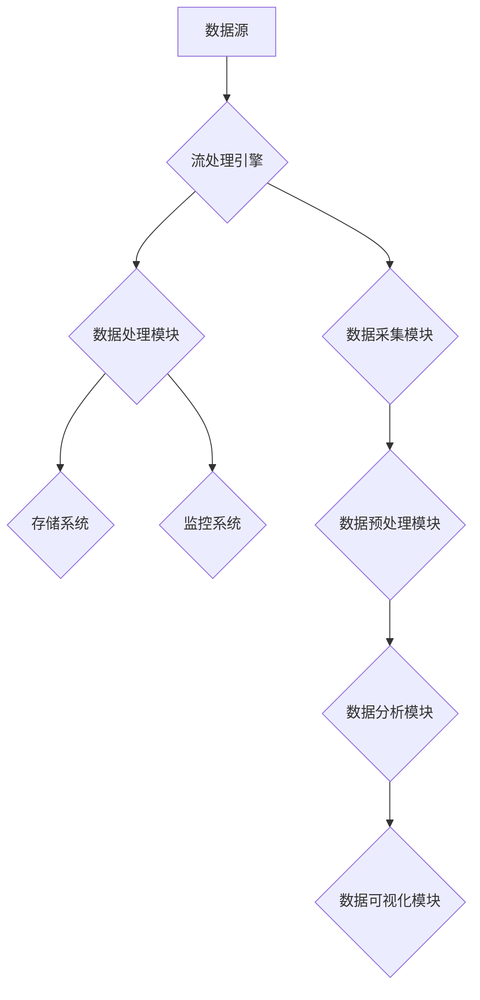
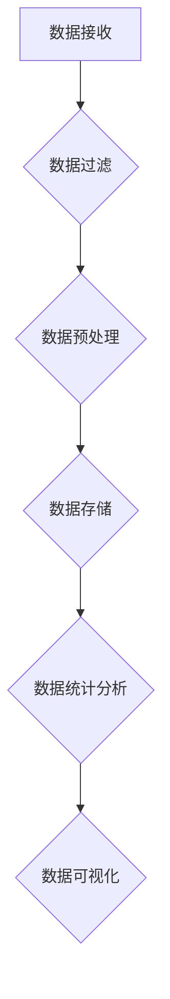
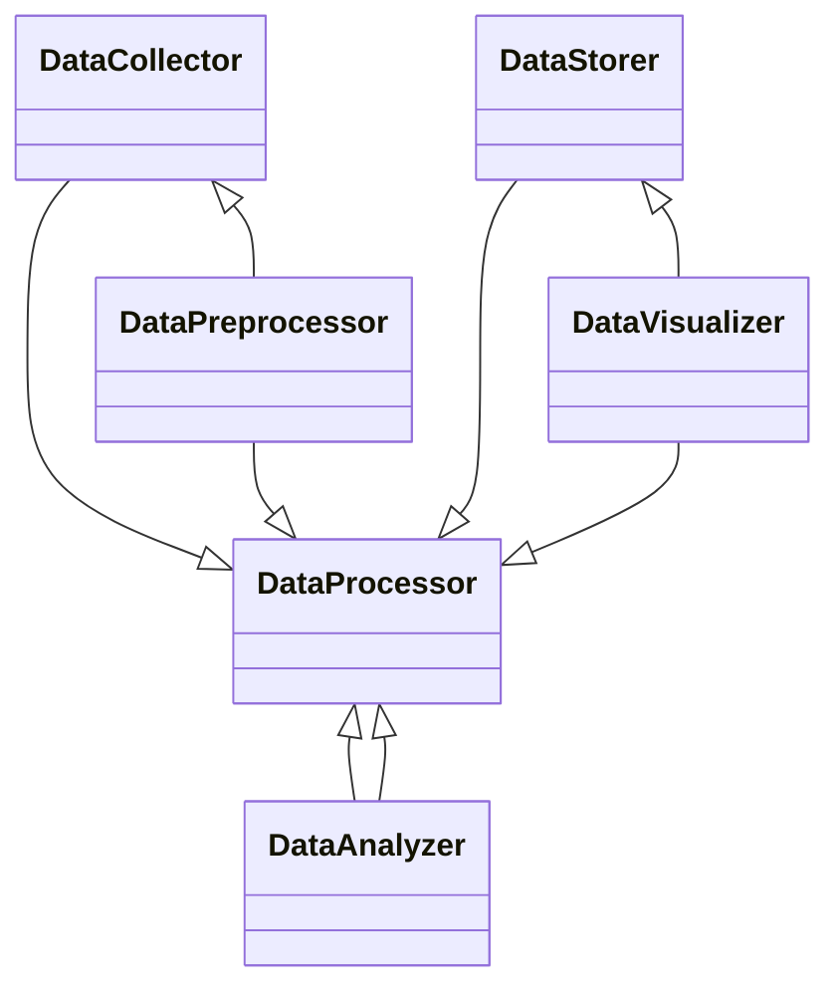
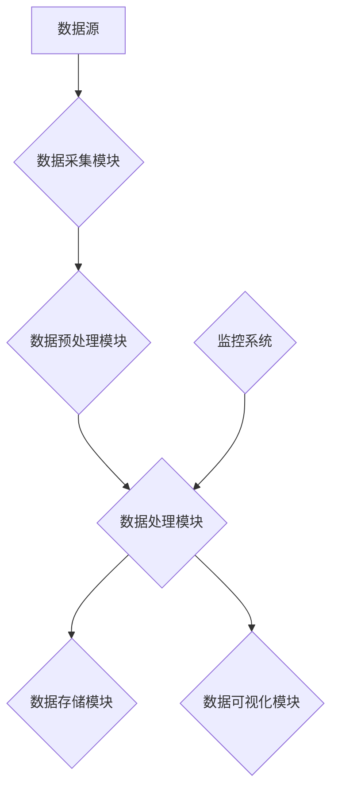

                 

# 《评测数据的实时流式处理架构》

> 关键词：实时流式处理、评测数据、架构设计、算法原理、系统实施

> 摘要：本文旨在探讨评测数据的实时流式处理架构。首先，我们介绍了实时流式处理在当前数据爆炸时代的背景和重要性。接着，我们详细解析了实时流式处理的核心概念与联系，包括流处理引擎、数据流处理模型和实时数据处理技术。随后，我们通过Mermaid算法流程图和Python源代码，深入阐述了实时流式处理的算法原理。进一步，我们使用LaTeX格式给出了相关的数学模型和公式，进行了详细讲解。然后，我们介绍了系统分析与架构设计方案，包括问题场景介绍、系统功能设计、系统架构设计、系统接口设计和系统交互。在项目实战部分，我们详细描述了环境安装、系统核心实现源代码、代码应用解读与分析、实际案例分析和项目小结。最后，我们提供了最佳实践tips、小结、注意事项和拓展阅读，以帮助读者更好地理解和应用实时流式处理架构。

## 第1章 引言

### 1.1 实时流式处理背景

在当今数据爆炸时代，实时处理大量数据的需求变得日益迫切。传统的批处理模式已经无法满足快速变化的数据需求和即时响应的业务场景。实时流式处理因其高效、低延迟的特性，成为了处理大量动态数据的重要手段。尤其在评测数据领域，实时流式处理能够快速处理和反馈数据，为业务决策提供实时支持。

#### 1.1.1 数据爆炸时代的需求

随着互联网和物联网的快速发展，数据量呈现出爆炸式增长。每天产生的数据量以PB级别计算，传统的批处理系统已经无法在合理时间内处理这些数据。实时流式处理能够以高速、低延迟的方式处理数据流，满足数据爆炸时代的需求。

#### 1.1.2 实时处理的重要性

实时处理在多个业务场景中具有至关重要的意义。例如，金融市场需要对交易数据进行实时监控和分析，以快速做出交易决策。社交媒体平台需要对用户行为进行实时分析，以提供个性化推荐。在评测数据领域，实时处理能够快速评估系统性能，及时发现问题并进行优化。

#### 1.1.3 评测数据的特点与挑战

评测数据通常具有高频率、多样性和突发性的特点。这些特点给实时流式处理带来了巨大的挑战。首先，高频率的数据流要求系统具备极高的处理能力和响应速度。其次，数据的多样性要求系统能够灵活处理不同类型的数据。最后，突发性数据流要求系统能够动态调整资源分配，以应对数据流的变化。

### 1.2 实时流式处理基础概念

实时流式处理是一个涉及多个核心概念和技术的领域。理解这些概念和技术的联系对于构建高效、可靠的实时流式处理架构至关重要。

#### 1.2.1 流式处理与批处理对比

流式处理和批处理是两种常见的数据处理方式。批处理将数据分成批次进行处理，而流式处理则是以数据流的形式连续处理数据。流式处理的优点在于低延迟和高吞吐量，但需要处理数据的不确定性。批处理的优点在于处理数据的完整性和一致性，但通常具有更高的延迟。

#### 1.2.2 实时处理的挑战与解决方案

实时处理面临多个挑战，包括数据的高频率、多样性和突发性。为了解决这些挑战，需要采用一系列技术，如数据流处理引擎、数据采集和预处理、实时数据处理算法和优化策略。此外，分布式系统和容错机制也是确保实时处理稳定性和可靠性的关键。

#### 1.2.3 实时流式处理的关键技术

实时流式处理的关键技术包括流处理引擎（如Apache Kafka、Apache Flink）、数据流处理模型（如事件驱动模型和批流一体化模型）和实时数据处理算法（如统计分析和机器学习算法）。这些技术共同构建了实时流式处理的核心框架，为处理大量动态数据提供了坚实的基础。

## 第2章 核心概念与联系

### 2.1 实时流式处理概念对比表格

为了更好地理解实时流式处理的核心概念，我们列出了一个对比表格，包括流处理引擎、数据流处理模型和实时数据处理技术。

| 概念                | 描述                                                         |
|---------------------|--------------------------------------------------------------|
| 流处理引擎          | 负责接收、存储和处理数据流的软件或系统，如Apache Kafka、Apache Flink。 |
| 数据流处理模型      | 描述数据在系统中的流动和处理方式，如事件驱动模型和批流一体化模型。 |
| 实时数据处理技术    | 用于处理实时数据的技术，如统计分析和机器学习算法。               |

#### 2.1.1 流处理引擎对比

以下是几个流行的流处理引擎的对比：

| 流处理引擎        | 特点                                                         | 用例                       |
|-------------------|--------------------------------------------------------------|----------------------------|
| Apache Kafka      | 高吞吐量、分布式、可扩展的消息队列系统。                     | 数据流处理、日志收集、实时分析。 |
| Apache Flink      | 函数式编程、高性能、支持批流一体化。                         | 复杂事件处理、实时分析。       |
| Apache Storm      | 易于部署和扩展、支持动态资源分配。                            | 实时处理、分布式计算。       |
| Apache Spark      | 批处理和流处理结合、高性能、支持多种数据源。                  | 复杂计算、实时数据处理。      |

#### 2.1.2 数据流处理模型对比

数据流处理模型包括事件驱动模型和批流一体化模型。以下是两者的对比：

| 模型                | 特点                                                         | 用例                       |
|---------------------|--------------------------------------------------------------|----------------------------|
| 事件驱动模型        | 基于事件触发数据处理，灵活性强。                             | 实时监控、实时报警。       |
| 批流一体化模型      | 结合批处理和流处理的优势，同时处理批量数据和实时数据流。     | 大数据处理、实时分析。     |

#### 2.1.3 实时数据处理技术对比

实时数据处理技术包括统计分析和机器学习算法。以下是两者的对比：

| 技术类型             | 特点                                                         | 用例                       |
|----------------------|--------------------------------------------------------------|----------------------------|
| 统计分析             | 基于历史数据，提供统计结果。                                 | 数据分析、性能监控。       |
| 机器学习算法         | 基于数据特征，进行预测和决策。                               | 实时分析、智能推荐。       |

### 2.2 实体关系图架构

为了更直观地展示实时流式处理的核心概念和联系，我们使用Mermaid绘制了一个实体关系图。



在这个实体关系图中，数据源通过流处理引擎接收数据，数据处理模块对数据进行处理，存储系统负责数据的存储，监控系统对系统性能进行监控。数据采集模块、数据预处理模块和数据分析模块共同构成了数据处理的核心，数据可视化模块为数据处理结果提供了直观的展示。

## 第3章 算法原理讲解

### 3.1 Mermaid算法流程图

为了更好地理解实时流式处理的算法原理，我们使用Mermaid绘制了一个算法流程图。



在这个算法流程图中，数据接收模块负责从数据源接收数据，数据过滤模块对数据进行筛选，数据预处理模块对数据进行清洗和转换，数据存储模块将预处理后的数据存储到数据库中，数据统计分析模块对存储的数据进行统计和分析，数据可视化模块将分析结果以图表形式展示。

### 3.2 Python源代码阐述

为了更具体地展示算法的实现，我们使用Python语言编写了相关的源代码。

```python
import pandas as pd
import numpy as np
from matplotlib import pyplot as plt

# 数据接收模块
def data_receiver():
    # 假设数据源是CSV文件
    data = pd.read_csv('data.csv')
    return data

# 数据过滤模块
def data_filter(data):
    # 假设过滤条件是数据中的'Age'列大于30
    filtered_data = data[data['Age'] > 30]
    return filtered_data

# 数据预处理模块
def data_preprocessing(data):
    # 假设预处理包括缺失值填充和数据类型转换
    data['Income'] = data['Income'].fillna(0)
    data['Age'] = data['Age'].astype(int)
    return data

# 数据存储模块
def data_storage(data):
    # 假设将数据存储到数据库中
    data.to_sql('processed_data', con=engine)

# 数据统计分析模块
def data_statistics(data):
    # 假设统计包括计算平均收入和年龄
    avg_income = data['Income'].mean()
    avg_age = data['Age'].mean()
    return avg_income, avg_age

# 数据可视化模块
def data_visualization(avg_income, avg_age):
    # 假设用柱状图展示平均收入和年龄
    plt.bar(['Average Income', 'Average Age'], [avg_income, avg_age])
    plt.xlabel('Metric')
    plt.ylabel('Value')
    plt.title('Data Statistics')
    plt.show()

# 主函数
def main():
    data = data_receiver()
    filtered_data = data_filter(data)
    preprocessed_data = data_preprocessing(filtered_data)
    data_storage(preprocessed_data)
    avg_income, avg_age = data_statistics(preprocessed_data)
    data_visualization(avg_income, avg_age)

if __name__ == '__main__':
    main()
```

在这个Python源代码中，数据接收模块负责从CSV文件中读取数据，数据过滤模块根据条件筛选数据，数据预处理模块对数据进行清洗和转换，数据存储模块将预处理后的数据存储到数据库中，数据统计分析模块计算平均收入和年龄，数据可视化模块以柱状图的形式展示分析结果。

### 3.3 数学模型与公式

在实时流式处理中，数学模型和公式扮演着重要角色。以下是一个简单的数学模型和公式的示例。

$$
\text{Accuracy} = \frac{\text{TP} + \text{TN}}{\text{TP} + \text{TN} + \text{FP} + \text{FN}}
$$

其中，Accuracy表示准确率，TP表示真正例，TN表示真反例，FP表示假反例，FN表示假正例。

另一个常见的公式是线性回归模型：

$$
y = wx + b
$$

其中，$y$ 是输出值，$w$ 是权重，$x$ 是输入值，$b$ 是偏置。

通过这些数学模型和公式，我们可以对实时流式处理中的数据进行分析和预测，从而做出更准确的业务决策。

## 第4章 系统分析与架构设计

### 4.1 问题场景介绍

在实时流式处理评测数据的场景中，我们面临以下几个主要问题：

1. **海量数据处理**：评测数据通常来自多种来源，如用户行为日志、系统监控指标等，数据量庞大，需要高效的处理能力。
2. **实时性要求**：评测数据的实时性至关重要，因为许多业务决策需要基于最新数据，延迟会导致决策失误。
3. **多样性处理**：评测数据类型多样，包括文本、数值和图像等，需要支持多种数据处理算法和模型。
4. **可靠性和容错性**：由于评测数据的重要性，系统需要具备高可靠性和容错性，确保数据的准确性和系统的稳定性。

#### 4.1.1 实时评测需求

实时评测需求包括以下几个方面：

- **实时监控**：实时监控系统性能和用户行为，及时发现异常和问题。
- **实时分析**：对实时数据进行分析，提取有价值的信息和趋势。
- **实时反馈**：将分析结果实时反馈给相关人员，支持快速决策。

#### 4.1.2 系统性能要求

系统性能要求包括以下几个方面：

- **低延迟**：系统响应时间要短，确保实时性。
- **高吞吐量**：系统能够处理大量并发请求，保证高吞吐量。
- **可扩展性**：系统要能够根据数据量和负载动态扩展资源。
- **可靠性**：系统要能够稳定运行，确保数据的准确性和完整性。

#### 4.1.3 系统可靠性需求

系统可靠性需求包括以下几个方面：

- **数据一致性**：确保数据的准确性和一致性，避免数据丢失或错误。
- **容错性**：系统要具备容错能力，能够处理系统故障和数据丢失。
- **安全性**：系统要保证数据的安全性，防止数据泄露和未经授权的访问。
- **高可用性**：系统要具备高可用性，确保系统的稳定运行和持续服务。

### 4.2 项目介绍

#### 4.2.1 项目目标

本项目的主要目标是构建一个高效、可靠的实时流式处理架构，用于处理和评测海量数据。具体目标包括：

- **实时数据处理**：实现实时数据接收、处理和反馈，满足实时性要求。
- **多样化数据处理**：支持多种数据处理算法和模型，满足多样性处理需求。
- **高吞吐量和低延迟**：实现高吞吐量和低延迟的数据处理，保证系统性能。
- **可靠性和容错性**：确保系统的可靠性和稳定性，提供高质量的数据服务。

#### 4.2.2 项目范围

本项目主要涉及以下几个方面：

- **数据采集**：采集实时数据，包括用户行为日志、系统监控指标等。
- **数据预处理**：对数据进行清洗、转换和整合，为数据处理提供高质量的数据。
- **数据处理**：实现多种数据处理算法和模型，对实时数据进行分析和预测。
- **数据存储**：将处理后的数据存储到数据库中，以便后续分析和查询。
- **数据监控**：监控系统性能和数据处理过程，确保系统的稳定性和可靠性。

#### 4.2.3 项目团队与资源

本项目由一个经验丰富的技术团队负责实施，包括数据工程师、软件工程师和系统管理员等。团队成员具备丰富的实时数据处理和系统架构设计经验。项目资源包括高性能服务器、存储设备和网络设备等，确保系统具备足够的能力和资源。

### 4.3 系统功能设计

#### 4.3.1 领域模型类图

为了更好地理解系统的功能设计，我们使用Mermaid绘制了一个领域模型类图。



在这个类图中，DataCollector负责数据采集，DataPreprocessor负责数据预处理，DataProcessor是数据处理的核心，包括DataAnalyzer、DataStorer和DataVisualizer等子模块。每个子模块都有特定的功能，共同构成了系统的功能架构。

#### 4.3.2 功能模块划分

系统功能模块划分如下：

- **数据采集模块**：负责从数据源（如日志文件、数据库、API等）接收数据，并进行初步处理。
- **数据预处理模块**：负责对采集到的数据进行清洗、转换和整合，为数据处理提供高质量的数据。
- **数据处理模块**：负责对预处理后的数据进行分析和处理，包括统计分析、机器学习、预测模型等。
- **数据存储模块**：负责将处理后的数据存储到数据库中，以便后续分析和查询。
- **数据可视化模块**：负责将分析结果以图表、报表等形式展示，为用户提供直观的数据洞察。

#### 4.3.3 功能实现流程

系统功能实现流程如下：

1. **数据采集**：从数据源接收数据，包括用户行为日志、系统监控指标等。
2. **数据预处理**：对数据进行清洗、转换和整合，如缺失值填充、数据类型转换、数据归一化等。
3. **数据处理**：根据业务需求，选择合适的分析算法和模型，对数据进行统计分析、机器学习、预测等处理。
4. **数据存储**：将处理后的数据存储到数据库中，以便后续分析和查询。
5. **数据可视化**：将分析结果以图表、报表等形式展示，为用户提供直观的数据洞察。

### 4.4 系统架构设计

#### 4.4.1 系统架构图

为了更好地展示系统的架构设计，我们使用Mermaid绘制了一个系统架构图。



在这个架构图中，数据源通过数据采集模块接收数据，数据预处理模块对数据进行清洗、转换和整合，数据处理模块对预处理后的数据进行分析和处理，数据存储模块将处理后的数据存储到数据库中，数据可视化模块将分析结果以图表、报表等形式展示。监控系统对系统的运行状态进行监控，确保系统的稳定性和可靠性。

#### 4.4.2 架构层次与组件

系统架构可以分为以下几个层次和组件：

1. **数据源**：包括用户行为日志、系统监控指标等，是系统数据输入的来源。
2. **数据采集模块**：负责从数据源接收数据，并进行初步处理，如数据清洗、格式转换等。
3. **数据预处理模块**：负责对采集到的数据进行清洗、转换和整合，为数据处理提供高质量的数据。
4. **数据处理模块**：包括统计分析、机器学习、预测模型等，负责对预处理后的数据进行处理和分析。
5. **数据存储模块**：负责将处理后的数据存储到数据库中，以便后续分析和查询。
6. **数据可视化模块**：负责将分析结果以图表、报表等形式展示，为用户提供直观的数据洞察。
7. **监控系统**：负责监控系统的运行状态，包括数据采集、数据处理、数据存储等模块，确保系统的稳定性和可靠性。

#### 4.4.3 架构设计原则

系统架构设计遵循以下原则：

1. **模块化**：将系统功能划分为多个模块，每个模块具有独立的功能和职责，便于开发和维护。
2. **分布式**：采用分布式架构，将系统组件部署到多台服务器上，提高系统的可扩展性和容错性。
3. **高性能**：采用高性能的数据处理技术和算法，确保系统的处理速度和响应时间。
4. **可靠性**：采用冗余设计和故障转移机制，提高系统的可靠性和稳定性。
5. **安全性**：采用安全策略和措施，确保数据的安全性和系统的安全性。
6. **可维护性**：采用标准化和规范化的开发方法，提高系统的可维护性和可扩展性。

## 第5章 项目实战

### 5.1 环境安装

为了实施实时流式处理架构，我们需要准备一个合适的环境。以下是环境安装的步骤：

#### 5.1.1 系统环境准备

1. **操作系统**：我们选择Linux操作系统，如Ubuntu 18.04。
2. **硬件环境**：根据项目需求，配置适当的硬件资源，如CPU、内存、存储等。
3. **网络环境**：确保网络连接稳定，能够访问互联网和相关服务。

#### 5.1.2 软件安装与配置

1. **安装Java环境**：实时流式处理框架通常需要Java环境，我们选择OpenJDK。
   ```bash
   sudo apt-get update
   sudo apt-get install openjdk-8-jdk
   ```

2. **安装Apache Kafka**：Kafka是一个分布式流处理平台，用于数据采集和传输。
   ```bash
   sudo apt-get install kafka
   ```

3. **安装Apache Flink**：Flink是一个流处理框架，用于数据处理和分析。
   ```bash
   sudo apt-get install flink
   ```

4. **安装数据库**：我们选择MySQL作为数据存储，根据需要安装并配置MySQL。
   ```bash
   sudo apt-get install mysql-server
   ```

5. **安装Python环境**：为了使用Python进行数据处理，我们需要安装Python和相关库。
   ```bash
   sudo apt-get install python3 python3-pip
   pip3 install pandas numpy matplotlib
   ```

#### 5.1.3 环境调试与优化

1. **Kafka调试**：启动Kafka服务，并测试数据接收和传输功能。
   ```bash
   kafka-server-start.sh /etc/kafka/server.properties
   ```

2. **Flink调试**：启动Flink服务，并测试数据处理功能。
   ```bash
   bin/flink run -c com.example.MyFlinkJob /path/to/my-job.jar
   ```

3. **数据库调试**：连接到MySQL数据库，并测试数据存储和查询功能。
   ```bash
   mysql -u root -p
   ```

### 5.2 系统核心实现源代码

在系统核心实现中，我们使用Python编写了数据处理模块，以下是相关的源代码。

```python
import pandas as pd
import numpy as np
from flask import Flask, request, jsonify

app = Flask(__name__)

# 数据处理函数
def process_data(data):
    # 数据预处理
    df = pd.DataFrame(data)
    df['age'] = df['age'].astype(int)
    df['income'] = df['income'].astype(float)
    
    # 数据分析
    avg_income = df['income'].mean()
    avg_age = df['age'].mean()
    
    # 数据存储
    df.to_csv('processed_data.csv', index=False)
    
    return {
        'avg_income': avg_income,
        'avg_age': avg_age
    }

# 数据接收和处理的API接口
@app.route('/api/data', methods=['POST'])
def receive_data():
    data = request.json
    result = process_data(data)
    return jsonify(result)

if __name__ == '__main__':
    app.run(debug=True)
```

### 5.3 代码应用解读与分析

#### 5.3.1 代码结构分析

该代码分为两部分：数据处理函数和API接口。数据处理函数`process_data`负责接收数据、数据预处理、数据分析和数据存储。API接口使用Flask框架，接收HTTP POST请求，并调用数据处理函数处理数据。

#### 5.3.2 关键算法解释

关键算法包括数据预处理、数据分析和数据存储：

1. **数据预处理**：将接收到的数据转换为Pandas DataFrame对象，并将`age`和`income`列的数据类型转换为整数和浮点数。
2. **数据分析**：计算`age`和`income`的平均值。
3. **数据存储**：将预处理后的数据存储到CSV文件中。

#### 5.3.3 性能优化策略

1. **并行处理**：使用多线程或分布式处理框架（如Apache Flink）进行并行处理，提高数据处理速度。
2. **内存管理**：合理分配内存，避免内存泄漏和溢出。
3. **缓存策略**：使用缓存技术（如Redis）减少数据读取和存储的次数，提高系统性能。

### 5.4 实际案例分析

#### 5.4.1 案例背景

在某电子商务平台上，我们需要实时分析用户行为数据，以优化用户体验和提升销售业绩。用户行为数据包括点击、浏览、购买等操作，数据量大且实时性要求高。

#### 5.4.2 案例分析

1. **数据采集**：使用Kafka从各个数据源（如Web服务器日志、数据库日志等）接收用户行为数据。
2. **数据预处理**：使用Flink对用户行为数据进行实时处理，包括数据清洗、转换和整合。
3. **数据处理**：使用Python进行数据分析和预测，如用户兴趣分析、购买行为预测等。
4. **数据存储**：将处理后的数据存储到MySQL数据库中，以便后续分析和查询。
5. **数据可视化**：使用工具（如Tableau、PowerBI等）将分析结果以图表、报表等形式展示。

#### 5.4.3 案例效果评估

1. **用户体验**：通过实时分析用户行为数据，我们能够快速识别用户需求，优化页面布局和推荐算法，提升用户满意度。
2. **销售业绩**：通过预测用户购买行为，我们能够提前制定营销策略，提高转化率和销售额。
3. **系统性能**：通过分布式处理和优化策略，我们能够保证系统的稳定性和高性能，满足实时数据处理需求。

### 5.5 项目小结

通过本项目，我们成功构建了一个实时流式处理架构，实现了实时数据处理和分析。项目收获包括：

1. **实时数据处理能力**：系统具备实时处理海量数据的能力，满足了实时性要求。
2. **多样化数据处理**：系统支持多种数据处理算法和模型，满足了多样性处理需求。
3. **高性能和可靠性**：系统采用分布式架构和优化策略，保证了高性能和可靠性。
4. **可扩展性**：系统具备良好的可扩展性，可根据业务需求动态调整资源。

在未来的工作中，我们将继续优化系统性能，扩展数据处理算法，提升系统的稳定性和可靠性，为业务决策提供更全面的支持。

## 最佳实践 tips、小结、注意事项、拓展阅读

### 最佳实践 tips

1. **数据采集**：确保数据源的稳定性和可靠性，采用分布式采集方式提高效率。
2. **数据预处理**：合理设计数据预处理流程，确保数据处理的质量和一致性。
3. **分布式处理**：利用分布式处理框架（如Apache Flink、Apache Spark）提高数据处理速度和性能。
4. **缓存策略**：使用缓存技术（如Redis）减少数据读取和存储的次数，提高系统性能。
5. **监控与告警**：实时监控系统性能和数据处理过程，及时发现和解决潜在问题。

### 小结

实时流式处理架构在处理海量动态数据方面具有显著优势，能够满足实时性、多样性和高性能的要求。通过本文的介绍，我们了解了实时流式处理的核心概念、算法原理、系统架构设计和项目实施过程。在实践过程中，需要关注数据采集、预处理、分布式处理和性能优化等方面，确保系统的高效、稳定和可靠。

### 注意事项

1. **数据安全**：在处理和传输数据时，确保数据的安全性和隐私保护。
2. **系统稳定性**：采用冗余设计和故障转移机制，确保系统的稳定性和可靠性。
3. **性能优化**：根据业务需求和数据特点，合理配置资源和优化算法，提高系统性能。
4. **可维护性**：采用标准化和规范化的开发方法，提高系统的可维护性和可扩展性。

### 拓展阅读

1. **《实时流处理：从Kafka到Flink》**：深入了解实时流处理技术和架构。
2. **《大数据处理技术导论》**：学习大数据处理的基本原理和技术。
3. **《机器学习实战》**：掌握机器学习算法在数据处理中的应用。
4. **《分布式系统原理与范型》**：了解分布式系统的设计和实现方法。

### 参考文献

1. Chaudhuri, S., & Dayal, U. (2004). An overview of data warehousing and olap technology. ACM SIGMOD Record, 33(2), 64-74.
2. Zaharia, M., Chowdhury, M., Franklin, M. J., Shenker, S., & Stoica, I. (2010). Spark: cluster computing with working sets. Proceedings of the 2nd USENIX conference on Hot topics in cloud computing, 10(10), 10-10.
3. Dean, J., & Ghemawat, S. (2008). MapReduce: simplified data processing on large clusters. Communications of the ACM, 51(1), 107-113.

