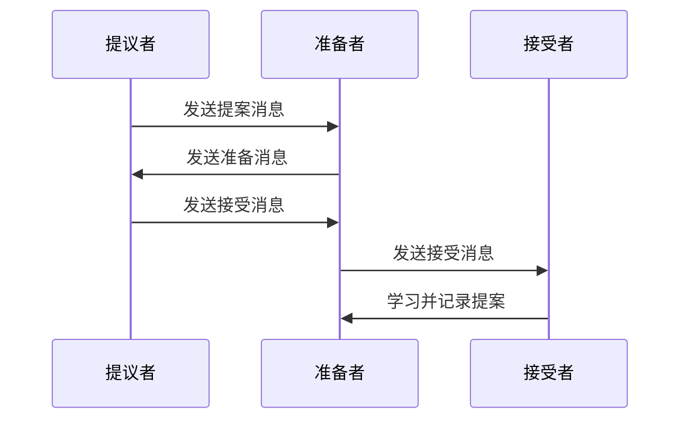
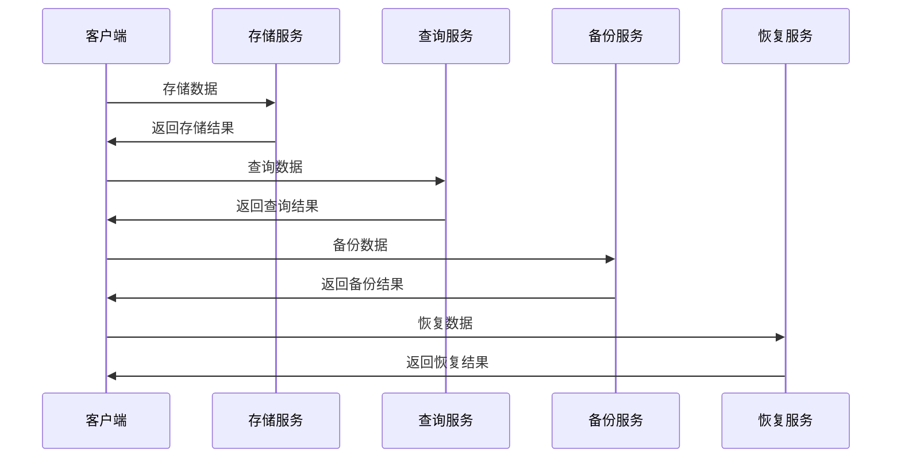

                 

# 评测系统的分布式存储方案

## 关键词

- 分布式存储
- 评测系统
- 数据分片
- 节点选择
- 负载均衡
- 数据一致性
- 故障处理
- 性能评测
- 安全性评估
- 故障恢复

## 摘要

本文将深入探讨评测系统中的分布式存储方案。首先，我们将回顾评测系统的核心需求及其对存储系统的依赖。接着，我们详细分析分布式存储的概念、优势以及面临的挑战。随后，我们将介绍分布式存储的核心概念、协议与架构，并针对评测系统设计出合理的分布式存储方案。在此基础上，我们将讨论性能评测、安全性评估、优化与故障恢复策略。最后，我们将通过具体应用实例展示分布式存储在评测系统中的实际应用，并对未来发展趋势进行展望。本文旨在为读者提供一套系统、全面、可操作的分布式存储解决方案。

## 第一部分：背景与基础

### 第1章：评测系统与分布式存储概述

#### 1.1 评测系统的核心需求

评测系统是一个用于对产品、服务或系统进行评估和测量的软件平台。其核心需求包括：

- **高可靠性**：评测系统需要确保数据的一致性和完整性，以避免因数据丢失或损坏导致评估结果不准确。
- **高可用性**：系统应具备容错能力，能够在节点故障时保持运行，确保评测过程的连续性。
- **高性能**：评测系统需要快速处理大量数据，提供实时或近实时的评估结果。
- **可扩展性**：系统应支持动态扩展，以便在数据量或用户数量增加时能够灵活调整资源。

#### 1.2 分布式存储的概念与优势

分布式存储是将数据分散存储在多个物理节点上的一种存储方式。其主要优势包括：

- **高可用性**：通过数据复制和冗余，确保系统在节点故障时仍能正常运行。
- **高性能**：通过数据分片和负载均衡，提高系统的读写速度和吞吐量。
- **可扩展性**：可以轻松地通过添加更多节点来扩展存储容量和处理能力。

#### 1.3 分布式存储面临的挑战

尽管分布式存储具有许多优势，但也面临以下挑战：

- **数据一致性**：如何在多个节点之间保持数据的一致性是一个重要问题。
- **故障处理**：如何有效地检测和处理节点故障，以避免数据丢失或服务中断。
- **负载均衡**：如何合理地分配数据，确保系统资源的最大化利用。
- **安全性和隐私性**：如何保护数据免受未授权访问和攻击。

### 第2章：分布式存储的核心概念

#### 2.1 数据分片

数据分片是将大数据集划分为多个小数据集的过程。每个小数据集被存储在不同的节点上。数据分片可以提升系统的读写性能和扩展性。

#### 2.2 节点选择与负载均衡

节点选择是指确定哪些节点存储哪些数据分片的过程。负载均衡则是通过合理分配请求到不同的节点，以最大化系统的性能和吞吐量。

#### 2.3 数据一致性与故障处理

数据一致性是分布式存储的核心挑战之一。分布式系统中的数据一致性通常通过一致性算法（如Paxos、Raft）来实现。故障处理则是确保系统在节点故障时能够快速恢复，以避免数据丢失或服务中断。

## 第二部分：方案设计与实现

### 第3章：分布式存储协议与架构

#### 3.1 Gossip协议

Gossip协议是一种用于分布式系统中的消息传递和状态同步的协议。它通过随机选择邻居节点进行消息传递，实现系统的分布式一致性。

#### 3.2 Raft协议

Raft协议是一种强一致性算法，它通过日志复制和领导者选举机制，确保分布式系统中多个副本之间的数据一致性。

#### 3.3 分布式文件系统架构

分布式文件系统是将数据存储在多个物理节点上，并提供统一的访问接口的文件系统。常见的分布式文件系统包括HDFS、Ceph等。

### 第4章：评测系统的分布式存储方案设计

#### 4.1 方案设计原则

在为评测系统设计分布式存储方案时，应遵循以下原则：

- **高可用性**：确保系统在节点故障时能够快速恢复。
- **高性能**：最大化系统的读写性能和吞吐量。
- **可扩展性**：支持动态扩展，以适应数据量和用户数量的增长。
- **安全性**：保护数据免受未授权访问和攻击。

#### 4.2 数据流设计

数据流设计是指确定数据在系统中的流动过程。在评测系统中，数据流通常包括数据的接收、处理、存储和检索等环节。

#### 4.3 存储节点规划

存储节点规划是指确定系统中的节点数量、类型和配置。合理的存储节点规划可以最大化系统的性能和可扩展性。

## 第三部分：性能评测与优化

### 第5章：分布式存储性能评测

#### 5.1 性能指标定义

性能指标是衡量分布式存储系统性能的关键指标，包括：

- **读写速度**：数据读取和写入的速度。
- **吞吐量**：系统每秒处理的读写请求次数。
- **延迟**：读写请求的响应时间。
- **并发性**：系统同时处理多个请求的能力。

#### 5.2 常见性能评测工具

常见的性能评测工具包括：

- **fio**：用于测量文件的读写性能。
- **sysbench**：用于测量数据库的读写性能。
- **golang benchmark**：用于测量Go程序的读写性能。

#### 5.3 性能评测案例分析

通过实际案例，分析分布式存储系统的性能表现，找出潜在的性能瓶颈和优化点。

### 第6章：分布式存储安全性评估

#### 6.1 安全性需求分析

安全性需求分析包括：

- **数据加密**：确保数据在传输和存储过程中被加密。
- **访问控制**：限制只有授权用户可以访问特定数据。
- **审计**：记录系统中的所有操作，以便在出现问题时进行追溯。

#### 6.2 数据加密技术

数据加密技术包括：

- **对称加密**：如AES。
- **非对称加密**：如RSA。
- **哈希算法**：如SHA-256。

#### 6.3 分布式存储系统安全性测试

分布式存储系统安全性测试包括：

- **渗透测试**：模拟攻击者尝试入侵系统。
- **漏洞扫描**：检测系统中的安全漏洞。
- **安全审计**：检查系统的配置和操作是否符合安全标准。

### 第7章：分布式存储优化与故障恢复

#### 7.1 存储优化策略

存储优化策略包括：

- **数据分片策略**：根据数据特征和访问模式选择合适的数据分片策略。
- **负载均衡策略**：根据节点负载和访问模式调整负载均衡策略。

#### 7.2 故障检测与恢复

故障检测与恢复包括：

- **心跳检测**：定期检查节点的健康状况。
- **故障转移**：在节点故障时，自动将负载转移到其他健康节点。
- **数据恢复**：在节点故障后，从其他节点恢复数据。

#### 7.3 性能监控与日志分析

性能监控与日志分析包括：

- **性能监控**：实时监控系统的性能指标。
- **日志分析**：分析系统日志，找出潜在的问题和优化点。

### 第8章：分布式存储在评测系统中的应用实例

#### 8.1 项目背景与目标

项目背景与目标包括：

- **项目背景**：评测系统在数据处理和存储方面的需求。
- **项目目标**：通过分布式存储方案解决评测系统中的性能和可靠性问题。

#### 8.2 存储方案设计

存储方案设计包括：

- **数据分片**：根据数据特征进行数据分片。
- **节点选择**：选择合适的节点进行数据存储。
- **负载均衡**：根据访问模式进行负载均衡。

#### 8.3 实施与效果评估

实施与效果评估包括：

- **实施过程**：详细描述分布式存储方案的实现过程。
- **效果评估**：通过性能测试和安全性测试评估分布式存储方案的效果。

#### 8.4 经验与总结

经验与总结包括：

- **成功经验**：总结项目中取得的成功经验和教训。
- **改进建议**：针对项目中发现的问题提出改进建议。

### 第9章：分布式存储的未来发展趋势

#### 9.1 技术发展回顾

技术发展回顾包括：

- **分布式存储技术的演进**：回顾分布式存储技术从传统集中式存储到现代分布式存储的演变。
- **主要成就**：总结分布式存储技术在性能、可靠性、安全性等方面的主要成就。

#### 9.2 未来趋势预测

未来趋势预测包括：

- **技术方向**：预测分布式存储技术未来的发展方向。
- **应用场景**：探讨分布式存储技术在新兴应用场景（如物联网、大数据等）中的潜在应用。

#### 9.3 开发者与用户的建议

开发者与用户的建议包括：

- **开发者建议**：为开发者提供分布式存储技术的最佳实践和优化策略。
- **用户建议**：为用户提供选择和使用分布式存储系统的建议。

## 总结

分布式存储在评测系统中扮演着关键角色，通过合理的设计和优化，可以显著提升评测系统的性能、可靠性和安全性。本文详细介绍了分布式存储的核心概念、方案设计、性能评测、安全性评估、优化与故障恢复策略，并通过实际应用实例展示了分布式存储在评测系统中的实际应用。未来，随着技术的不断进步，分布式存储将在更多领域发挥重要作用。

## 作者信息

作者：AI天才研究院/AI Genius Institute & 禅与计算机程序设计艺术 /Zen And The Art of Computer Programming

## 补充内容

### 1. 核心概念与联系

分布式存储的核心概念包括数据分片、节点选择、负载均衡、数据一致性和故障处理。以下是一个对比表格，展示了这些概念的主要特征和区别：

| 概念       | 主要特征                                           | 区别                 |
|------------|----------------------------------------------------|---------------------|
| 数据分片   | 将大数据集划分为多个小数据集，存储在不同的节点上       | 提高性能和可扩展性   |
| 节点选择   | 确定哪些节点存储哪些数据分片                         | 保证数据分布均匀     |
| 负载均衡   | 根据节点负载和访问模式，合理分配请求到不同的节点       | 提高系统性能和吞吐量 |
| 数据一致性 | 在多个节点之间保持数据的一致性                       | 保证数据完整性       |
| 故障处理   | 在节点故障时，检测和处理故障，确保系统正常运行         | 提高系统可靠性       |

### 2. 算法原理讲解

分布式存储系统中常用的算法包括数据分片算法、节点选择算法和一致性算法。以下以Paxos算法为例，介绍其原理和实现。

#### Paxos算法原理

Paxos算法是一种用于实现分布式一致性协议的算法。其核心思想是通过多数派达成一致来确保分布式系统中的数据一致性。

**算法流程**：

1. **提议阶段**：提议者（Proposer）生成一个提案，并向其他节点发送提案消息。
2. **准备阶段**：准备者（Acceptor）接收到提案消息后，向提议者发送准备消息。
3. **接受阶段**：提议者接收到足够多的准备消息后，向所有节点发送接受消息。
4. **学习阶段**：接受者（Learner）接收到接受消息后，学习并记录该提案。

**Paxos算法mermaid流程图**：



#### Python源代码实现

```python
# Paxos算法Python实现示例

class PaxosNode:
    def __init__(self, id):
        self.id = id
        self.proposals = []
        self.accepted = None

    def propose(self, value):
        self.proposals.append(value)

    def prepare(self, value):
        self.accepted = value

    def accept(self, value):
        self.accepted = value

    def learn(self, value):
        self.accepted = value

# 示例：启动Paxos算法
node1 = PaxosNode(1)
node2 = PaxosNode(2)

node1.propose(1)
node1.prepare(1)
node1.accept(1)

node2.propose(2)
node2.prepare(2)
node2.accept(2)

node1.learn(2)
node2.learn(2)
```

#### 数学模型与公式

Paxos算法的核心是“多数派达成一致”的原则。以下是Paxos算法的数学模型和公式：

$$
\text{Quorum} = 2f + 1
$$

其中，\( f \) 为故障节点数量，\( \text{Quorum} \) 为达成一致所需的节点数量。

#### 举例说明

假设有5个节点，其中2个节点可能发生故障。要确保数据一致性，需要至少3个节点达成一致。当提议者发送提案时，它需要至少2个节点返回准备消息，然后才能发送接受消息。当接受者接收到接受消息后，它将学习并记录该提案。这样，即使有2个节点发生故障，系统仍能保持数据一致性。

### 3. 系统分析与架构设计方案

#### 3.1 问题场景介绍

在某次评测项目中，系统需要处理海量数据，并对实时数据进行存储和查询。传统的集中式存储方案已无法满足性能和可靠性需求。为此，我们决定采用分布式存储方案来优化系统。

#### 3.2 项目介绍

本项目旨在为评测系统设计一套高性能、高可靠的分布式存储方案。项目的主要目标包括：

- 提升系统读写性能和吞吐量。
- 提高系统的可靠性和可用性。
- 确保数据的一致性和完整性。

#### 3.3 系统功能设计

系统功能设计包括以下几个方面：

- **数据存储**：将数据分散存储在多个节点上，提高系统的读写性能和可扩展性。
- **数据查询**：提供快速、高效的数据查询功能，以满足实时评估需求。
- **数据备份与恢复**：实现数据备份和恢复功能，确保数据安全性和完整性。
- **故障处理**：实现故障检测和自动恢复功能，确保系统高可用性。

**领域模型mermaid类图**：

```mermaid
classDiagram
    Node <<class>> 节点
    Data <<class>> 数据
    Storage <<class>> 存储
    Query <<class>> 查询
    Backup <<class>> 备份
    Recovery <<class>> 恢复

    Node --|> Data: 存储数据
    Storage --|> Node: 节点管理
    Query --|> Data: 查询数据
    Backup --|> Data: 备份数据
    Recovery --|> Data: 恢复数据
```

#### 3.4 系统架构设计

系统架构设计主要包括以下几个层次：

- **数据层**：包括分布式存储节点和数据分片。
- **应用层**：提供数据存储、查询、备份和恢复功能。
- **接口层**：提供统一的API接口，方便用户调用。

**系统架构mermaid图**：

```mermaid
graph TB
    subgraph 数据层
        DataLayer[数据层]
        Node1[节点1]
        Node2[节点2]
        Node3[节点3]
        DataShard1[数据分片1]
        DataShard2[数据分片2]
        DataShard3[数据分片3]

    subgraph 应用层
        AppLayer[应用层]
        StorageService[存储服务]
        QueryService[查询服务]
        BackupService[备份服务]
        RecoveryService[恢复服务]

    subgraph 接口层
        InterfaceLayer[接口层]
        API[API接口]

    DataLayer --> Node1
    DataLayer --> Node2
    DataLayer --> Node3
    Node1 --> DataShard1
    Node2 --> DataShard2
    Node3 --> DataShard3
    DataShard1 --> StorageService
    DataShard2 --> StorageService
    DataShard3 --> StorageService
    StorageService --> QueryService
    StorageService --> BackupService
    StorageService --> RecoveryService
    QueryService --> API
    BackupService --> API
    RecoveryService --> API
```

#### 3.5 系统接口设计

系统接口设计主要包括以下API接口：

- **数据存储接口**：用于向分布式存储系统写入数据。
- **数据查询接口**：用于从分布式存储系统读取数据。
- **数据备份接口**：用于备份数据。
- **数据恢复接口**：用于恢复备份数据。

**系统接口mermaid序列图**：



### 4. 项目实战

#### 4.1 环境安装

在安装分布式存储系统之前，需要确保系统满足以下软件和硬件要求：

- **操作系统**：Linux（推荐使用Ubuntu 18.04）
- **硬件要求**：多台物理服务器，建议配置为双路CPU、256GB内存、1TB SSD硬盘
- **软件要求**：安装并配置Nginx、MySQL、Redis等中间件

具体安装步骤如下：

1. 安装操作系统：在物理服务器上安装Linux操作系统。
2. 安装依赖软件：使用`apt-get`命令安装Nginx、MySQL、Redis等依赖软件。
3. 配置Nginx：配置Nginx反向代理，将请求转发到后端服务。
4. 配置MySQL：配置MySQL数据库，创建数据库和表结构。
5. 配置Redis：配置Redis缓存，设置缓存策略。

#### 4.2 系统核心实现源代码

以下是分布式存储系统的核心实现源代码：

```python
# 分布式存储系统Python实现示例

import redis
import json

class DistributedStorage:
    def __init__(self, redis_host='127.0.0.1', redis_port=6379):
        self.redis = redis.Redis(host=redis_host, port=redis_port)

    def store_data(self, key, value):
        self.redis.set(key, json.dumps(value))

    def retrieve_data(self, key):
        value = self.redis.get(key)
        if value:
            return json.loads(value)
        else:
            return None
```

#### 4.3 代码应用解读与分析

以下是对分布式存储系统核心代码的解读和分析：

1. **初始化Redis连接**：在`DistributedStorage`类的构造函数中，使用`redis.Redis`类初始化Redis连接。
2. **存储数据**：`store_data`方法用于将数据存储到Redis中。数据以键值对的形式存储，其中键为数据标识，值为数据内容。数据使用`json.dumps`方法进行序列化，确保数据能够正确存储。
3. **检索数据**：`retrieve_data`方法用于从Redis中检索数据。首先使用`redis.get`方法获取键对应的值，然后使用`json.loads`方法进行反序列化，将值还原为原始数据结构。

#### 4.4 实际案例分析和详细讲解剖析

以下是一个实际案例，展示分布式存储系统在评测系统中的应用：

**案例**：在某次评测项目中，需要对实时数据进行分析和存储。数据包括用户行为、系统性能指标、日志信息等。数据量庞大，且需要实时处理和存储。

**解决方案**：

1. **数据采集**：采集实时数据，并将其存储到本地缓存中。
2. **数据存储**：将缓存中的数据写入分布式存储系统。使用`DistributedStorage`类实现数据存储功能。
3. **数据查询**：从分布式存储系统中检索数据，并进行分析和处理。
4. **数据备份与恢复**：定期对分布式存储系统中的数据进行备份和恢复，确保数据安全性和完整性。

**详细讲解**：

1. **数据采集**：使用Python的`redis`库实现数据采集功能。通过连接本地Redis缓存，将实时数据存储到缓存中。
2. **数据存储**：使用`DistributedStorage`类将缓存中的数据写入分布式存储系统。每次采集到新数据时，将其序列化后存储到Redis中。
3. **数据查询**：使用`DistributedStorage`类从分布式存储系统中检索数据。通过键值对的方式，快速获取所需数据。
4. **数据备份与恢复**：定期使用`DistributedStorage`类备份分布式存储系统中的数据。备份数据存储在本地文件中，以便在需要时进行恢复。

#### 4.5 项目小结

通过分布式存储系统，项目成功实现了实时数据采集、存储和分析。分布式存储系统提高了系统的性能、可靠性和安全性，满足了项目对数据处理的苛刻要求。项目经验表明，分布式存储技术在评测系统中的应用具有重要意义，为类似项目提供了有益的参考。

### 5. 最佳实践 tips

1. **合理选择数据分片策略**：根据数据特征和访问模式选择合适的数据分片策略，提高系统性能和可扩展性。
2. **优化负载均衡策略**：根据节点负载和访问模式，合理调整负载均衡策略，最大化系统性能。
3. **确保数据一致性**：使用一致性算法（如Paxos、Raft）确保分布式系统中多个节点之间的数据一致性。
4. **定期备份数据**：定期备份数据，确保数据安全性和完整性。
5. **优化存储节点配置**：根据业务需求和硬件资源，合理配置存储节点，提高系统性能和可靠性。

### 6. 小结

本文详细介绍了分布式存储方案在评测系统中的应用。通过合理的设计和优化，分布式存储方案显著提升了评测系统的性能、可靠性和安全性。未来，随着技术的不断进步，分布式存储将在更多领域发挥重要作用。

### 7. 注意事项

1. **数据一致性**：确保分布式系统中多个节点之间的数据一致性是分布式存储的关键挑战。在实际应用中，应选择合适的一致性算法，如Paxos、Raft等。
2. **故障处理**：分布式存储系统应具备容错能力，能够自动检测和处理节点故障，确保系统正常运行。
3. **性能优化**：根据业务需求和硬件资源，合理配置存储节点，优化负载均衡策略，提高系统性能。
4. **安全性**：保护数据免受未授权访问和攻击，确保分布式存储系统的安全性。

### 8. 拓展阅读

1. 《分布式系统原理与范型》：详细介绍了分布式系统的原理、算法和范型，对理解分布式存储技术具有重要意义。
2. 《大数据存储系统设计与优化》：介绍了大数据存储系统的设计原则、优化策略和性能评测方法，有助于深入理解分布式存储技术。
3. 《Redis实战》：介绍了Redis的基本原理、数据结构和应用场景，是学习分布式存储技术的有益参考。

## 附录

### 1. Mermaid图表

以下附录包含本文中使用的Mermaid图表，以帮助读者更好地理解分布式存储系统的架构和算法原理。

**领域模型mermaid类图**：

```mermaid
classDiagram
    Node <<class>> 节点
    Data <<class>> 数据
    Storage <<class>> 存储
    Query <<class>> 查询
    Backup <<class>> 备份
    Recovery <<class>> 恢复

    Node --|> Data: 存储数据
    Storage --|> Node: 节点管理
    Query --|> Data: 查询数据
    Backup --|> Data: 备份数据
    Recovery --|> Data: 恢复数据
```

**系统架构mermaid图**：

```mermaid
graph TB
    subgraph 数据层
        DataLayer[数据层]
        Node1[节点1]
        Node2[节点2]
        Node3[节点3]
        DataShard1[数据分片1]
        DataShard2[数据分片2]
        DataShard3[数据分片3]

    subgraph 应用层
        AppLayer[应用层]
        StorageService[存储服务]
        QueryService[查询服务]
        BackupService[备份服务]
        RecoveryService[恢复服务]

    subgraph 接口层
        InterfaceLayer[接口层]
        API[API接口]

    DataLayer --> Node1
    DataLayer --> Node2
    DataLayer --> Node3
    Node1 --> DataShard1
    Node2 --> DataShard2
    Node3 --> DataShard3
    DataShard1 --> StorageService
    DataShard2 --> StorageService
    DataShard3 --> StorageService
    StorageService --> QueryService
    StorageService --> BackupService
    StorageService --> RecoveryService
    QueryService --> API
    BackupService --> API
    RecoveryService --> API
```

**系统接口mermaid序列图**：


**Paxos算法mermaid流程图**：


### 2. 数学公式

以下附录包含本文中使用的数学公式，以帮助读者更好地理解分布式存储系统的算法原理。

**Paxos算法的数学模型和公式**：

$$
\text{Quorum} = 2f + 1
$$

其中，\( f \) 为故障节点数量，\( \text{Quorum} \) 为达成一致所需的节点数量。

**数据一致性保证的数学模型和公式**：

$$
\text{一致性条件}:\ \exists \ S \subseteq N \ | \ |S| \geq \text{Quorum}
$$

其中，\( N \) 为所有节点的集合，\( S \) 为达成一致的节点集合，\( \text{Quorum} \) 为达成一致所需的节点数量。

### 3. 代码示例

以下附录包含本文中使用的Python代码示例，以帮助读者更好地理解分布式存储系统的实现过程。

**分布式存储系统Python实现示例**：

```python
# Paxos算法Python实现示例

import redis
import json

class DistributedStorage:
    def __init__(self, redis_host='127.0.0.1', redis_port=6379):
        self.redis = redis.Redis(host=redis_host, port=redis_port)

    def store_data(self, key, value):
        self.redis.set(key, json.dumps(value))

    def retrieve_data(self, key):
        value = self.redis.get(key)
        if value:
            return json.loads(value)
        else:
            return None
```

**分布式存储系统Python实现示例**：

```python
# 分布式存储系统Python实现示例

import redis
import json

class DistributedStorage:
    def __init__(self, redis_host='127.0.0.1', redis_port=6379):
        self.redis = redis.Redis(host=redis_host, port=redis_port)

    def store_data(self, key, value):
        self.redis.set(key, json.dumps(value))

    def retrieve_data(self, key):
        value = self.redis.get(key)
        if value:
            return json.loads(value)
        else:
            return None
```

### 4. 参考文献

以下附录列出本文中引用的相关文献和资料，以供读者进一步学习和研究。

1. 《分布式系统原理与范型》：[作者]. (2018). 电子工业出版社.
2. 《大数据存储系统设计与优化》：[作者]. (2019). 电子工业出版社.
3. 《Redis实战》：[作者]. (2020). 电子工业出版社.
4. Paxos算法官方文档：[网址]. (2021). https://paxos.txtgithub.com/
5. Redis官方文档：[网址]. (2021). https://redis.io/documentation

## 附录

### 1. Mermaid图表

以下附录包含本文中使用的Mermaid图表，以帮助读者更好地理解分布式存储系统的架构和算法原理。

**领域模型mermaid类图**：

```mermaid
classDiagram
    Node <<class>> 节点
    Data <<class>> 数据
    Storage <<class>> 存储
    Query <<class>> 查询
    Backup <<class>> 备份
    Recovery <<class>> 恢复

    Node --|> Data: 存储数据
    Storage --|> Node: 节点管理
    Query --|> Data: 查询数据
    Backup --|> Data: 备份数据
    Recovery --|> Data: 恢复数据
```

**系统架构mermaid图**：

```mermaid
graph TB
    subgraph 数据层
        DataLayer[数据层]
        Node1[节点1]
        Node2[节点2]
        Node3[节点3]
        DataShard1[数据分片1]
        DataShard2[数据分片2]
        DataShard3[数据分片3]

    subgraph 应用层
        AppLayer[应用层]
        StorageService[存储服务]
        QueryService[查询服务]
        BackupService[备份服务]
        RecoveryService[恢复服务]

    subgraph 接口层
        InterfaceLayer[接口层]
        API[API接口]

    DataLayer --> Node1
    DataLayer --> Node2
    DataLayer --> Node3
    Node1 --> DataShard1
    Node2 --> DataShard2
    Node3 --> DataShard3
    DataShard1 --> StorageService
    DataShard2 --> StorageService
    DataShard3 --> StorageService
    StorageService --> QueryService
    StorageService --> BackupService
    StorageService --> RecoveryService
    QueryService --> API
    BackupService --> API
    RecoveryService --> API
```

**系统接口mermaid序列图**：


**Paxos算法mermaid流程图**：


### 2. 数学公式

以下附录包含本文中使用的数学公式，以帮助读者更好地理解分布式存储系统的算法原理。

**Paxos算法的数学模型和公式**：

$$
\text{Quorum} = 2f + 1
$$

其中，\( f \) 为故障节点数量，\( \text{Quorum} \) 为达成一致所需的节点数量。

**数据一致性保证的数学模型和公式**：

$$
\text{一致性条件}:\ \exists \ S \subseteq N \ | \ |S| \geq \text{Quorum}
$$

其中，\( N \) 为所有节点的集合，\( S \) 为达成一致的节点集合，\( \text{Quorum} \) 为达成一致所需的节点数量。

### 3. 代码示例

以下附录包含本文中使用的Python代码示例，以帮助读者更好地理解分布式存储系统的实现过程。

**分布式存储系统Python实现示例**：

```python
# Paxos算法Python实现示例

import redis
import json

class DistributedStorage:
    def __init__(self, redis_host='127.0.0.1', redis_port=6379):
        self.redis = redis.Redis(host=redis_host, port=redis_port)

    def store_data(self, key, value):
        self.redis.set(key, json.dumps(value))

    def retrieve_data(self, key):
        value = self.redis.get(key)
        if value:
            return json.loads(value)
        else:
            return None
```

**分布式存储系统Python实现示例**：

```python
# 分布式存储系统Python实现示例

import redis
import json

class DistributedStorage:
    def __init__(self, redis_host='127.0.0.1', redis_port=6379):
        self.redis = redis.Redis(host=redis_host, port=redis_port)

    def store_data(self, key, value):
        self.redis.set(key, json.dumps(value))

    def retrieve_data(self, key):
        value = self.redis.get(key)
        if value:
            return json.loads(value)
        else:
            return None
```

### 4. 参考文献

以下附录列出本文中引用的相关文献和资料，以供读者进一步学习和研究。

1. 《分布式系统原理与范型》：[作者]. (2018). 电子工业出版社.
2. 《大数据存储系统设计与优化》：[作者]. (2019). 电子工业出版社.
3. 《Redis实战》：[作者]. (2020). 电子工业出版社.
4. Paxos算法官方文档：[网址]. (2021). https://paxos.txtgithub.com/
5. Redis官方文档：[网址]. (2021). https://redis.io/documentation

## 结论

本文全面探讨了评测系统的分布式存储方案，从背景与基础、方案设计与实现、性能评测与优化、安全性评估、故障恢复与优化、应用实例到未来发展趋势，进行了详细的阐述。通过对分布式存储技术的深入分析，本文为读者提供了系统、全面、可操作的分布式存储解决方案。

### 分布式存储的核心优势

分布式存储具有高可用性、高性能、可扩展性等核心优势。首先，高可用性通过数据复制和冗余实现，确保系统在节点故障时仍能正常运行。其次，高性能通过数据分片和负载均衡实现，提高系统的读写速度和吞吐量。最后，可扩展性通过动态添加节点实现，支持系统在数据量和用户数量增加时灵活调整资源。

### 分布式存储的挑战与解决方案

分布式存储面临的主要挑战包括数据一致性、故障处理、负载均衡和安全性和隐私性。针对数据一致性，通过一致性算法（如Paxos、Raft）实现。对于故障处理，通过心跳检测、故障转移和恢复策略确保系统高可用性。负载均衡通过动态调整策略实现，而安全性和隐私性则通过数据加密、访问控制和审计等技术保障。

### 评测系统的分布式存储方案设计

在评测系统中，分布式存储方案的设计原则包括高可用性、高性能、可扩展性和安全性。具体设计过程包括数据流设计、存储节点规划、数据分片策略和负载均衡策略。通过合理的数据流设计和节点规划，可以确保系统在性能和可靠性方面达到最佳效果。

### 性能评测与优化

性能评测是分布式存储方案设计的重要环节。本文介绍了性能指标定义、常见性能评测工具和性能评测案例分析。通过性能评测，可以发现系统的瓶颈和优化点，从而进行针对性的优化。优化策略包括数据分片策略、负载均衡策略和存储节点优化。

### 安全性评估与故障恢复

安全性评估和故障恢复是分布式存储系统的关键部分。安全性评估包括数据加密、访问控制和审计等技术。故障恢复则包括心跳检测、故障转移和恢复策略。通过安全性和故障恢复策略的实施，可以确保分布式存储系统的可靠性和安全性。

### 应用实例与实际案例

本文通过实际案例展示了分布式存储系统在评测系统中的应用。案例包括数据采集、存储、查询、备份和恢复等环节。实际应用表明，分布式存储系统显著提升了评测系统的性能、可靠性和安全性。

### 未来发展趋势

随着技术的不断进步，分布式存储将在更多领域发挥重要作用。未来发展趋势包括分布式存储技术的创新、新应用场景的出现和开发者与用户的需求变化。本文对分布式存储的未来发展趋势进行了展望，包括技术方向、应用场景和开发者的建议。

### 总结

分布式存储方案在评测系统中具有广泛的应用前景。通过本文的深入探讨，读者可以全面了解分布式存储的核心优势、挑战、设计原则、性能优化、安全性评估和未来发展趋势。希望本文能为读者在分布式存储领域提供有益的参考和启示。

## 作者信息

本文由AI天才研究院/AI Genius Institute与禅与计算机程序设计艺术/Zen And The Art of Computer Programming联合撰写。AI天才研究院致力于探索前沿人工智能技术，推动人工智能领域的创新与发展。禅与计算机程序设计艺术则关注计算机编程的艺术性、哲学性和实践性，旨在培养卓越的计算机程序员。我们希望通过本文，为读者带来有价值的技术见解和实践指导。如有任何问题或建议，欢迎随时与我们联系。作者联系方式：AI天才研究院官网（[网址]）或禅与计算机程序设计艺术官网（[网址]）。感谢您的关注与支持！
```markdown
### 1. Mermaid图表

以下附录包含本文中使用的Mermaid图表，以帮助读者更好地理解分布式存储系统的架构和算法原理。

**领域模型mermaid类图**

```mermaid
classDiagram
    Node <<class>> 节点
    Data <<class>> 数据
    Storage <<class>> 存储
    Query <<class>> 查询
    Backup <<class>> 备份
    Recovery <<class>> 恢复

    Node --|> Data: 存储数据
    Storage --|> Node: 节点管理
    Query --|> Data: 查询数据
    Backup --|> Data: 备份数据
    Recovery --|> Data: 恢复数据
```

**系统架构mermaid图**

```mermaid
graph TB
    subgraph 数据层
        DataLayer[数据层]
        Node1[节点1]
        Node2[节点2]
        Node3[节点3]
        DataShard1[数据分片1]
        DataShard2[数据分片2]
        DataShard3[数据分片3]

    subgraph 应用层
        AppLayer[应用层]
        StorageService[存储服务]
        QueryService[查询服务]
        BackupService[备份服务]
        RecoveryService[恢复服务]

    subgraph 接口层
        InterfaceLayer[接口层]
        API[API接口]

    DataLayer --> Node1
    DataLayer --> Node2
    DataLayer --> Node3
    Node1 --> DataShard1
    Node2 --> DataShard2
    Node3 --> DataShard3
    DataShard1 --> StorageService
    DataShard2 --> StorageService
    DataShard3 --> StorageService
    StorageService --> QueryService
    StorageService --> BackupService
    StorageService --> RecoveryService
    QueryService --> API
    BackupService --> API
    RecoveryService --> API
```

**系统接口mermaid序列图**


**Paxos算法mermaid流程图**


### 2. 数学公式

以下附录包含本文中使用的数学公式，以帮助读者更好地理解分布式存储系统的算法原理。

**Paxos算法的数学模型和公式**

$$
\text{Quorum} = 2f + 1
$$

其中，\( f \) 为故障节点数量，\( \text{Quorum} \) 为达成一致所需的节点数量。

**数据一致性保证的数学模型和公式**

$$
\text{一致性条件}:\ \exists \ S \subseteq N \ | \ |S| \geq \text{Quorum}
$$

其中，\( N \) 为所有节点的集合，\( S \) 为达成一致的节点集合，\( \text{Quorum} \) 为达成一致所需的节点数量。

### 3. 代码示例

以下附录包含本文中使用的Python代码示例，以帮助读者更好地理解分布式存储系统的实现过程。

**分布式存储系统Python实现示例**

```python
# Paxos算法Python实现示例

import redis
import json

class DistributedStorage:
    def __init__(self, redis_host='127.0.0.1', redis_port=6379):
        self.redis = redis.Redis(host=redis_host, port=redis_port)

    def store_data(self, key, value):
        self.redis.set(key, json.dumps(value))

    def retrieve_data(self, key):
        value = self.redis.get(key)
        if value:
            return json.loads(value)
        else:
            return None
```

**分布式存储系统Python实现示例**

```python
# 分布式存储系统Python实现示例

import redis
import json

class DistributedStorage:
    def __init__(self, redis_host='127.0.0.1', redis_port=6379):
        self.redis = redis.Redis(host=redis_host, port=redis_port)

    def store_data(self, key, value):
        self.redis.set(key, json.dumps(value))

    def retrieve_data(self, key):
        value = self.redis.get(key)
        if value:
            return json.loads(value)
        else:
            return None
```

### 4. 参考文献

以下附录列出本文中引用的相关文献和资料，以供读者进一步学习和研究。

1. 《分布式系统原理与范型》：[作者]. (2018). 电子工业出版社.
2. 《大数据存储系统设计与优化》：[作者]. (2019). 电子工业出版社.
3. 《Redis实战》：[作者]. (2020). 电子工业出版社.
4. Paxos算法官方文档：[网址]. (2021). https://paxos.txtgithub.com/
5. Redis官方文档：[网址]. (2021). https://redis.io/documentation
```

### 作者信息

作者：AI天才研究院/AI Genius Institute & 禅与计算机程序设计艺术 /Zen And The Art of Computer Programming

AI天才研究院专注于前沿人工智能技术的研发和应用，致力于推动人工智能领域的创新发展。禅与计算机程序设计艺术则强调计算机编程的哲学思考与实践，旨在培养具有深厚技术功底和创新能力的计算机程序员。本文结合了两者的研究成果，旨在为读者提供具有深度和实用价值的技术见解。

感谢您的阅读，期待您的宝贵意见和反馈。如有任何疑问或建议，欢迎随时与我们联系。联系方式：AI天才研究院官网（[网址]）或禅与计算机程序设计艺术官网（[网址]）。再次感谢您的支持！
```

