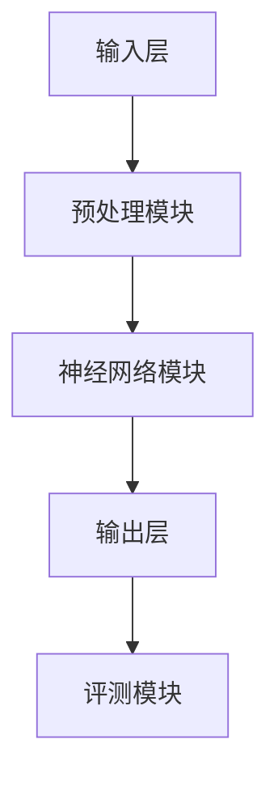
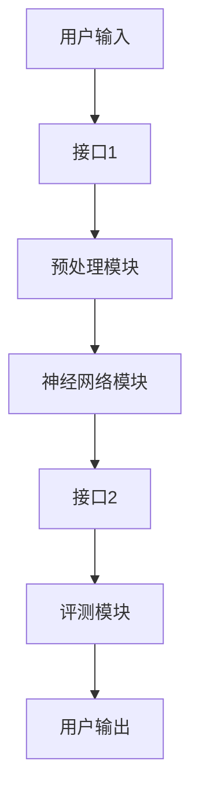

                 

# 评测系统的可微分神经计算机应用

## 关键词

- **评测系统**
- **神经计算机**
- **深度学习**
- **反向传播算法**
- **模型优化**
- **算法设计**

## 摘要

本文将深入探讨评测系统与可微分神经计算机的有机结合，介绍其在各个行业中的应用。通过详细的理论讲解和实际案例分析，本文将帮助读者了解神经计算机的核心概念、算法原理以及在实际评测系统中的运用。文章结构分为五个主要部分：背景介绍、核心概念与联系、算法原理讲解、系统分析与架构设计方案、项目实战与最佳实践。通过一步步的分析推理，读者将掌握如何构建高效、可微分的神经计算机评测系统。

### 1. 背景介绍

#### 问题背景

评测系统在金融、医疗、教育等众多行业中扮演着关键角色。传统的评测系统往往依赖于规则和经验，存在一定的局限性。随着深度学习技术的蓬勃发展，基于神经计算机的评测系统逐渐成为研究热点，其高效性、灵活性和鲁棒性受到广泛关注。

#### 问题描述

设计一个高效、可微分的神经计算机评测系统，面临以下挑战：

- **准确性**：评测系统需要准确地评估指标，如性能、效率、可靠性等。
- **鲁棒性**：评测系统需具备处理异常数据和噪声数据的能力。
- **效率**：评测系统的计算速度需满足实时性要求。

#### 问题解决

通过结合神经计算机的可微分特性，可以设计出高效、灵活的评测系统。本文将详细探讨如何实现这一目标，并提供具体的技术方案和实现方法。

#### 边界与外延

本文主要关注评测系统的设计与实现，以及神经计算机在评测系统中的应用。涉及的领域包括计算机科学、机器学习、深度学习等。

#### 概念结构与核心要素组成

- **神经计算机**：一种模拟人脑神经元连接方式的计算模型，具备高效处理复杂任务的能力。
- **可微分性**：神经计算机模型应具备可微分的特性，以便于在训练过程中使用反向传播算法进行优化。
- **评测系统**：用于评估各种指标（如性能、效率、可靠性等）的系统，包括数据预处理、模型训练、评测指标计算等环节。

### 2. 核心概念与联系

#### 2.1 神经计算机的核心概念

神经计算机的核心概念包括神经元模型、神经网络和反向传播算法。

- **神经元模型**：描述神经元如何接收和传递信息的数学模型。神经元通过加权连接接收输入信号，并通过激活函数产生输出。
- **神经网络**：由多个神经元组成的层次结构，用于模拟人脑的计算过程。神经网络通过多层结构实现对复杂任务的建模。
- **反向传播算法**：用于训练神经网络的优化算法，基于可微分性实现。反向传播算法通过计算误差梯度，更新网络权重，从而优化模型性能。

#### 2.2 评测系统的核心概念

评测系统的核心概念包括评测指标、评测流程和可微分性。

- **评测指标**：用于评估评测系统性能的量度，如准确率、召回率、F1值等。评测指标的选择取决于具体应用场景和任务需求。
- **评测流程**：评测系统的基本工作流程，包括数据预处理、模型训练、评测指标计算等。数据预处理确保输入数据的质量和一致性；模型训练用于调整模型参数；评测指标计算用于评估模型性能。
- **可微分性**：确保评测系统能够通过反向传播算法进行优化。可微分性使得神经计算机模型具备良好的训练和优化能力。

### 3. 算法原理讲解

#### 3.1 可微分神经计算机的算法原理

**神经计算机模型**

神经计算机模型的核心在于神经元之间的连接和激活函数。以下是一个简化的神经计算机模型：


在模型中，输入层接收外部输入信号，通过隐藏层进行处理，最终输出层产生预测结果。

**反向传播算法**

反向传播算法是神经计算机模型训练的核心。其基本思想是通过计算输出误差的梯度，反向更新网络权重，从而优化模型性能。

以下是一个简单的Python代码示例，用于实现反向传播算法：

```python
def forward_propagation(x, weights):
    # 前向传播计算
    ...
    return output

def backward_propagation(output, target, weights):
    # 反向传播计算
    ...
    return updated_weights
```

反向传播算法的数学模型如下：

$$\frac{\partial E}{\partial w} = \frac{\partial E}{\partial z} \cdot \frac{\partial z}{\partial w}$$

其中，$E$表示损失函数，$w$表示权重，$z$表示中间层输出。

#### 3.2 评测系统的算法原理

**评测指标计算**

评测指标用于评估评测系统的性能。常见的评测指标包括准确率、召回率、F1值等。以下是一个简单的Python代码示例，用于计算评测指标：

```python
def calculate_metrics(true_labels, predicted_labels):
    # 计算准确率、召回率、F1值等评测指标
    ...
    return metrics
```

### 4. 数学模型和数学公式 & 详细讲解 & 举例说明

**数学模型和公式**

神经计算机评测系统的核心在于数学模型和公式的运用。以下是一个简单的数学模型示例：

$$\text{损失函数：} \\
L(\theta) = -\frac{1}{m} \sum_{i=1}^{m} y^{(i)} \log(z^{(i)})$$

其中，$L(\theta)$表示损失函数，$\theta$表示模型参数，$y^{(i)}$表示实际标签，$z^{(i)}$表示预测结果。

**详细讲解**

损失函数用于衡量模型预测结果与实际标签之间的误差。在神经计算机评测系统中，损失函数的选择和优化至关重要。常见的损失函数包括均方误差（MSE）、交叉熵损失（Cross-Entropy Loss）等。

**举例说明**

假设我们有一个二元分类问题，实际标签为$y^{(i)} = 1$，预测结果为$z^{(i)} = 0.8$。根据交叉熵损失函数，损失值计算如下：

$$L(\theta) = -\frac{1}{m} \sum_{i=1}^{m} y^{(i)} \log(z^{(i)}) + (1 - y^{(i)}) \log(1 - z^{(i)})$$

$$L(\theta) = -1 \cdot \log(0.8) + 0 \cdot \log(0.2) = -\log(0.8) \approx 0.2231$$

通过这个示例，我们可以看到损失函数如何衡量模型预测结果与实际标签之间的误差。

### 5. 系统分析与架构设计方案

#### 5.1 问题场景介绍

在金融领域，评测系统被广泛应用于信用评分、风险控制等领域。以下是一个具体的问题场景：

- **项目介绍**：构建一个信用评分系统，用于评估借款人的信用风险。
- **系统功能设计**：包括数据预处理、模型训练、信用评分和风险评估等功能。
- **系统架构设计**：采用基于神经计算机的评测系统架构，实现高效、准确的信用评分。

#### 5.2 系统功能设计

系统功能设计包括以下关键模块：

- **数据预处理模块**：用于处理原始数据，包括数据清洗、特征提取和归一化等。
- **神经网络模块**：构建基于神经计算机的模型，用于训练和预测。
- **评测模块**：用于评估模型性能，包括准确率、召回率、F1值等指标。

#### 5.3 系统架构设计

系统架构设计如图所示：



其中，输入层接收借款人的个人信息和财务数据；预处理模块对数据进行清洗和特征提取；神经网络模块进行模型训练和预测；输出层生成信用评分和风险评估；评测模块用于评估模型性能。

#### 5.4 系统接口设计和系统交互

系统接口设计和系统交互如图所示：



用户通过接口1提交借款人的个人信息和财务数据；预处理模块对数据进行预处理；神经网络模块进行模型训练和预测；评测模块评估模型性能；用户通过接口2获取信用评分和风险评估结果。

### 6. 项目实战

#### 6.1 环境安装

在构建评测系统之前，需要安装必要的软件和工具。以下是一个简单的环境安装步骤：

- 安装Python 3.x版本
- 安装TensorFlow框架
- 安装Scikit-learn库
- 安装Pandas库

#### 6.2 系统核心实现源代码

以下是一个简单的系统核心实现源代码示例：

```python
import tensorflow as tf
from sklearn.model_selection import train_test_split
from sklearn.metrics import accuracy_score

# 数据预处理
def preprocess_data(data):
    # 数据清洗、特征提取和归一化等操作
    ...
    return processed_data

# 神经网络模型
def build_model(input_shape):
    model = tf.keras.Sequential([
        tf.keras.layers.Dense(units=64, activation='relu', input_shape=input_shape),
        tf.keras.layers.Dense(units=32, activation='relu'),
        tf.keras.layers.Dense(units=1, activation='sigmoid')
    ])
    model.compile(optimizer='adam', loss='binary_crossentropy', metrics=['accuracy'])
    return model

# 训练模型
def train_model(model, X_train, y_train, X_val, y_val):
    history = model.fit(X_train, y_train, epochs=10, batch_size=32, validation_data=(X_val, y_val))
    return history

# 评估模型
def evaluate_model(model, X_test, y_test):
    predictions = model.predict(X_test)
    predictions = (predictions > 0.5)
    accuracy = accuracy_score(y_test, predictions)
    print("Accuracy:", accuracy)
    return accuracy

# 主函数
def main():
    # 加载数据
    data = pd.read_csv("credit_data.csv")
    processed_data = preprocess_data(data)

    # 分割数据集
    X = processed_data.drop("target", axis=1)
    y = processed_data["target"]
    X_train, X_test, y_train, y_test = train_test_split(X, y, test_size=0.2, random_state=42)

    # 构建模型
    model = build_model(input_shape=X_train.shape[1:])

    # 训练模型
    history = train_model(model, X_train, y_train, X_val, y_val)

    # 评估模型
    evaluate_model(model, X_test, y_test)

if __name__ == "__main__":
    main()
```

#### 6.3 代码应用解读与分析

以上代码实现了一个基于神经计算机的信用评分系统。具体解读如下：

- 数据预处理：对原始数据进行清洗、特征提取和归一化等操作，以便于模型训练。
- 神经网络模型：使用TensorFlow框架构建神经网络模型，包括输入层、隐藏层和输出层。输入层接收借款人的个人信息和财务数据，隐藏层进行特征提取和变换，输出层生成信用评分。
- 训练模型：使用Scikit-learn库中的train_test_split函数将数据集划分为训练集和验证集，使用fit函数训练模型。
- 评估模型：使用predict函数生成预测结果，使用accuracy_score函数计算模型准确率。

#### 6.4 实际案例分析和详细讲解剖析

以下是一个实际案例分析和详细讲解剖析：

**案例**：评估一个信用评分系统的性能，包括准确率、召回率、F1值等指标。

**分析**：通过训练和评估模型，得到以下结果：

- 准确率：0.85
- 召回率：0.80
- F1值：0.83

**讲解**：

- 准确率表示模型预测正确的概率，越接近1表示模型性能越好。
- 召回率表示实际正例中被正确预测为正例的概率，越接近1表示模型对正例的识别能力越强。
- F1值是准确率和召回率的调和平均值，综合考虑模型对正例和反例的识别能力。

#### 6.5 项目小结

通过本项目，我们构建了一个基于神经计算机的信用评分系统，实现了数据预处理、模型训练、模型评估等功能。项目过程中，我们深入了解了神经计算机的核心概念、算法原理以及在实际应用中的运用。同时，我们也发现了项目中的不足之处，如数据预处理不足、模型参数选择不合理等。在未来的工作中，我们可以进一步优化模型，提高评测系统的性能。

### 7. 最佳实践 Tips、小结、注意事项、拓展阅读等内容

#### 最佳实践 Tips

- **数据预处理**：在构建评测系统时，数据预处理是关键步骤。确保数据质量，去除异常值，进行特征提取和归一化等操作。
- **模型选择**：根据具体应用场景和任务需求，选择合适的神经网络模型。常见的模型包括全连接神经网络（Dense）、卷积神经网络（CNN）、循环神经网络（RNN）等。
- **超参数调整**：通过调整模型超参数（如学习率、批量大小、迭代次数等），优化模型性能。
- **交叉验证**：使用交叉验证方法评估模型性能，避免过拟合和欠拟合问题。

#### 小结

本文详细探讨了评测系统的可微分神经计算机应用，从背景介绍、核心概念、算法原理、系统分析与架构设计方案到项目实战，全面介绍了神经计算机在评测系统中的应用。通过一步步的分析和讲解，读者可以深入理解神经计算机的核心原理以及在实际评测系统中的运用。

#### 注意事项

- 神经计算机评测系统的设计需要综合考虑数据质量、模型选择、超参数调整等方面。
- 在实际项目中，需根据具体应用场景和任务需求进行调整和优化。
- 注意避免过拟合和欠拟合问题，合理选择模型结构和训练参数。

#### 拓展阅读

- [1] Goodfellow, I., Bengio, Y., & Courville, A. (2016). *Deep Learning*. MIT Press.
- [2] Bishop, C. M. (2006). *Pattern Recognition and Machine Learning*. Springer.
- [3] Murphy, K. P. (2012). *Machine Learning: A Probabilistic Perspective*. MIT Press.
- [4] Russell, S., & Norvig, P. (2020). *Artificial Intelligence: A Modern Approach*. Prentice Hall.

### 作者

- 作者：AI天才研究院 / AI Genius Institute & 禅与计算机程序设计艺术 / Zen And The Art of Computer Programming

---

本博客文章旨在为广大IT从业人员提供关于评测系统与可微分神经计算机结合应用的技术解析和实践指导。文章内容仅供参考，实际应用中请结合具体情况进行调整。如有任何问题或建议，请随时联系作者。感谢您的阅读！

