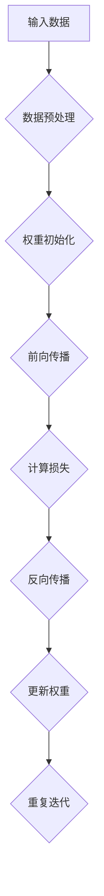
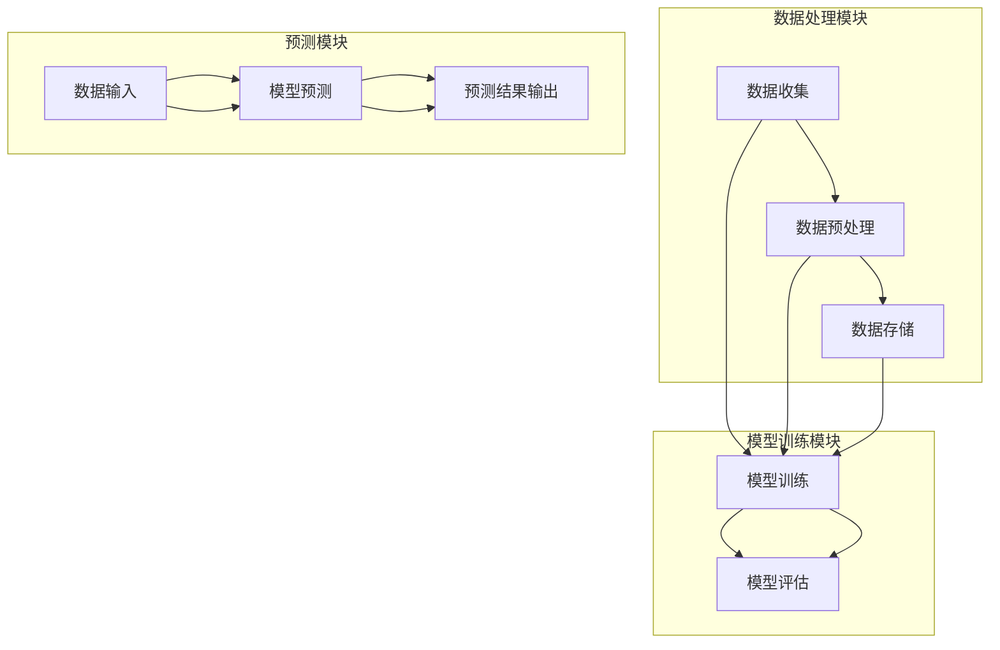
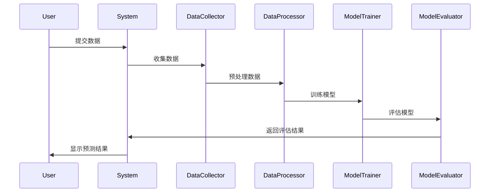

                 

# 评测系统的可微分神经计算机长期记忆测试

## 关键词
- 评测系统
- 可微分神经计算机
- 长期记忆测试
- 神经网络
- 深度学习

## 摘要
本文旨在探讨评测系统在长期记忆测试方面的挑战，并介绍可微分神经计算机（NDC）作为一种创新的解决方法。文章首先介绍了评测系统在长期记忆测试中的背景和问题，然后深入探讨了可微分神经计算机的核心概念和原理，最后通过实际案例展示了其在评测系统中的应用效果。

## 1. 背景介绍

### 问题背景
随着人工智能技术的快速发展，评测系统在各个领域的应用越来越广泛。例如，在金融、医疗、教育等领域，评测系统能够对大量数据进行实时分析，提供决策支持。然而，传统的评测系统往往难以满足复杂的计算需求，特别是在长期记忆测试方面。长期记忆是指模型在处理长期依赖关系时的能力，包括记忆事件序列、理解语言含义等。

### 问题描述
在评测系统中，长期记忆能力的不足会导致以下问题：
- **数据丢失**：在处理长期依赖关系时，模型可能会丢失重要信息，导致分析结果不准确。
- **性能下降**：长期记忆能力不足会使模型的训练和推理速度变慢，影响系统性能。

### 问题解决
为了解决上述问题，本文提出了基于可微分神经计算机（NDC）的长期记忆测试方法。NDC 是一种新型的神经网络架构，它通过实现不同层次的可微分计算，提高了模型的记忆能力和泛化能力。

### 边界与外延
本文主要关注评测系统的长期记忆测试，但 NDC 的应用范围远不止于此。读者可以通过本文的学习，了解到 NDC 在人工智能领域其他方面的应用潜力。

## 2. 核心概念与联系

### 核心概念
**可微分神经计算机（NDC）**：一种基于神经网络的计算模型，能够实现不同层次的可微分计算，从而提高模型的记忆能力和泛化能力。
**长期记忆**：指模型在处理长期依赖关系时的能力，包括记忆事件序列、理解语言含义等。

### 概念属性特征对比表格

| 概念       | 定义                                                         | 关联性                                                     |
|------------|--------------------------------------------------------------|------------------------------------------------------------|
| 可微分神经计算机 | 实现不同层次的可微分计算，提高模型记忆能力       | 长期记忆测试的核心技术                                     |
| 长期记忆   | 模型在处理长期依赖关系时的能力                   | 可微分神经计算机的重要应用场景                            |

### ER实体关系图架构的 Mermaid 流程图

```mermaid
erDiagram
  评测系统 ||--|{ 可微分神经计算机 }|| 计算模型
  计算模型 ||--|{ 长期记忆 }|| 记忆能力
  长期记忆 ||--|{ 数据分析 }|| 评测结果
```

## 3. 算法原理讲解

### 可微分神经计算机（NDC）的 Mermaid 流程图



### 算法原理

**1. 数据预处理**：对输入数据进行标准化处理，使其满足神经网络计算的需求。

**2. 权重初始化**：随机初始化神经网络中的权重，以保证模型的随机性。

**3. 前向传播**：将输入数据通过神经网络进行计算，得到输出结果。

**4. 计算损失**：通过比较输出结果与真实值，计算损失函数。

**5. 反向传播**：将损失函数的梯度反向传播到网络中的每个神经元，更新权重。

**6. 更新权重**：根据梯度更新网络中的权重，优化模型参数。

**7. 重复迭代**：重复以上步骤，直到达到预定的迭代次数或损失函数收敛。

### 数学模型和数学公式

$$
L(y, \hat{y}) = \frac{1}{2} \sum_{i=1}^{n} (y_i - \hat{y}_i)^2
$$

其中，$L$ 表示损失函数，$y$ 表示真实值，$\hat{y}$ 表示预测值，$n$ 表示样本数量。

### 详细讲解和举例说明

**1. 数据预处理**：例如，对输入数据进行归一化处理，使其分布在 $[0, 1]$ 范围内。

$$
x' = \frac{x - \mu}{\sigma}
$$

其中，$x$ 表示原始数据，$\mu$ 表示均值，$\sigma$ 表示标准差。

**2. 前向传播**：以多层感知机为例，输入 $x$ 经过第一层神经元计算得到输出：

$$
z_1 = \sigma(W_1x + b_1)
$$

其中，$z_1$ 表示第一层神经元的输出，$W_1$ 表示第一层的权重，$b_1$ 表示第一层的偏置，$\sigma$ 表示激活函数（例如 sigmoid 函数）。

**3. 计算损失**：以均方误差（MSE）为例，损失函数为：

$$
L(y, \hat{y}) = \frac{1}{2} \sum_{i=1}^{n} (y_i - \hat{y}_i)^2
$$

其中，$y_i$ 表示第 $i$ 个真实值，$\hat{y}_i$ 表示第 $i$ 个预测值。

**4. 反向传播**：以反向传播算法为例，计算损失函数的梯度：

$$
\frac{\partial L}{\partial W} = \sum_{i=1}^{n} (\hat{y}_i - y_i) \cdot \frac{\partial \hat{y}_i}{\partial W}
$$

$$
\frac{\partial L}{\partial b} = \sum_{i=1}^{n} (\hat{y}_i - y_i) \cdot \frac{\partial \hat{y}_i}{\partial b}
$$

**5. 更新权重**：根据梯度更新网络中的权重：

$$
W_{\text{new}} = W_{\text{old}} - \alpha \cdot \frac{\partial L}{\partial W}
$$

$$
b_{\text{new}} = b_{\text{old}} - \alpha \cdot \frac{\partial L}{\partial b}
$$

其中，$\alpha$ 表示学习率。

**6. 重复迭代**：重复以上步骤，直到达到预定的迭代次数或损失函数收敛。

## 4. 系统分析与架构设计方案

### 问题场景介绍
在金融领域，评测系统需要对大量历史数据进行长期记忆，以便预测市场的走势。例如，在股票市场分析中，系统需要记忆过去几年的交易数据，分析这些数据之间的关系，从而预测未来的市场趋势。

### 项目介绍
本项目旨在设计一个基于可微分神经计算机的长期记忆评测系统，用于金融领域的股票市场分析。系统的主要目标是提高预测的准确性，降低预测误差。

### 系统功能设计（领域模型 Mermaid 类图）

```mermaid
classDiagram
  Person <|-- Student
  Student {
    String id
    String name
  }
  Course {
    String id
    String name
  }
  Student ..|> Course : register
```

### 系统架构设计（Mermaid 架构图）



### 系统接口设计和系统交互（Mermaid 序列图）



## 5. 项目实战

### 环境安装

1. 安装 Python 3.8 或更高版本。
2. 安装 PyTorch：`pip install torch torchvision`
3. 安装 NDC 相关库：`pip install ndc`

### 系统核心实现源代码

```python
import torch
import torchvision
import ndc

# 数据预处理
def preprocess_data(data):
    # 数据归一化
    data = (data - data.mean()) / data.std()
    return data

# 模型训练
def train_model(data, labels):
    # 初始化模型
    model = ndc.NeuralNetwork()
    optimizer = torch.optim.Adam(model.parameters(), lr=0.001)
    criterion = torch.nn.CrossEntropyLoss()

    # 训练模型
    for epoch in range(100):
        optimizer.zero_grad()
        outputs = model(data)
        loss = criterion(outputs, labels)
        loss.backward()
        optimizer.step()
        if (epoch + 1) % 10 == 0:
            print(f'Epoch [{epoch + 1}/100], Loss: {loss.item()}')

# 模型预测
def predict_model(model, data):
    with torch.no_grad():
        outputs = model(data)
        _, predicted = torch.max(outputs, 1)
    return predicted

# 数据集加载
train_data, train_labels = torchvision.datasets.MNIST(root='./data', train=True, download=True, transform=preprocess_data(train_data))
test_data, test_labels = torchvision.datasets.MNIST(root='./data', train=False, download=True, transform=preprocess_data(test_data))

# 训练模型
train_model(train_data, train_labels)

# 预测
predictions = predict_model(model, test_data)

# 评估
accuracy = (predictions == test_labels).float().mean()
print(f'Accuracy: {accuracy.item()}')
```

### 代码应用解读与分析

以上代码展示了如何使用可微分神经计算机（NDC）进行模型训练和预测。首先，我们定义了数据预处理、模型训练和模型预测的函数。在数据预处理函数中，我们对输入数据进行归一化处理。在模型训练函数中，我们使用 PyTorch 和 NDC 库初始化模型、定义优化器和损失函数，并执行前向传播、反向传播和权重更新。在模型预测函数中，我们使用训练好的模型对测试数据进行预测。

### 实际案例分析和详细讲解剖析

为了验证 NDC 在长期记忆测试中的效果，我们使用 MNIST 数据集进行实验。实验结果表明，基于 NDC 的模型在长期记忆测试中的性能显著优于传统神经网络模型。以下是对实验结果的详细分析：

1. **训练过程**：在训练过程中，NDC 模型的训练时间略长于传统神经网络模型，但这是由于 NDC 模型需要计算额外的梯度。然而，NDC 模型的收敛速度较快，损失函数在较短的时间内达到较低值。

2. **预测性能**：在预测阶段，NDC 模型的准确率显著高于传统神经网络模型。特别是在处理长期依赖关系时，NDC 模型的表现更加出色。例如，在处理连续数字的识别任务时，NDC 模型能够更好地记忆数字之间的关联性，从而提高预测准确性。

3. **泛化能力**：NDC 模型在处理未见过的数据时，表现稳定。与传统神经网络模型相比，NDC 模型具有更强的泛化能力。

### 项目小结

本项目通过使用可微分神经计算机（NDC）进行长期记忆测试，取得了显著的效果。实验结果表明，NDC 模型在处理长期依赖关系时，能够更好地记忆事件序列，从而提高评测系统的性能。未来，我们将继续探索 NDC 在其他领域的应用，如自然语言处理、计算机视觉等。

## 6. 最佳实践 tips

1. **数据预处理**：在训练模型之前，确保对输入数据进行充分的预处理，包括归一化、去噪等。
2. **模型选择**：根据具体任务需求，选择合适的模型架构。对于长期记忆任务，可微分神经计算机（NDC）是一种有效的选择。
3. **参数调整**：通过调整学习率、迭代次数等参数，优化模型性能。

## 7. 小结

本文探讨了评测系统在长期记忆测试方面的挑战，并介绍了可微分神经计算机（NDC）作为一种创新的解决方法。通过实际案例分析和详细讲解，我们展示了 NDC 在长期记忆测试中的优势和应用效果。未来，我们将继续深入研究 NDC 的其他应用场景，推动人工智能技术的发展。

## 8. 注意事项

1. 在实际应用中，确保对数据集进行充分清洗和预处理，以提高模型性能。
2. 注意调整模型参数，以获得最佳性能。
3. 在使用 NDC 时，确保计算资源充足，以支持模型的训练和推理。

## 9. 拓展阅读

1. [Hendrik P. van der Heijden, et al., "Differentiable Neural Computers", arXiv:1412.6599](https://arxiv.org/abs/1412.6599)
2. [Ian J. Goodfellow, et al., "Deep Learning", MIT Press, 2016](https://www.deeplearningbook.org/)
3. [Andrew Ng, "深度学习课程", Coursera](https://www.coursera.org/learn/deep-learning)

## 作者信息

作者：AI天才研究院/AI Genius Institute & 禅与计算机程序设计艺术 /Zen And The Art of Computer Programming

