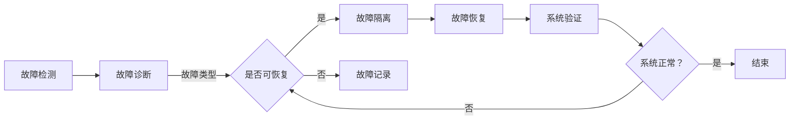
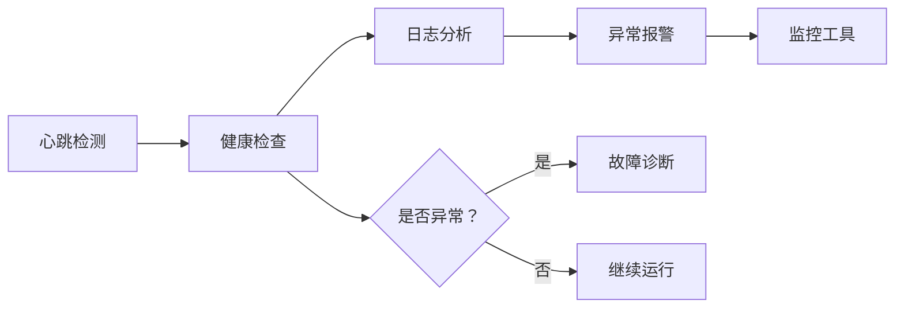
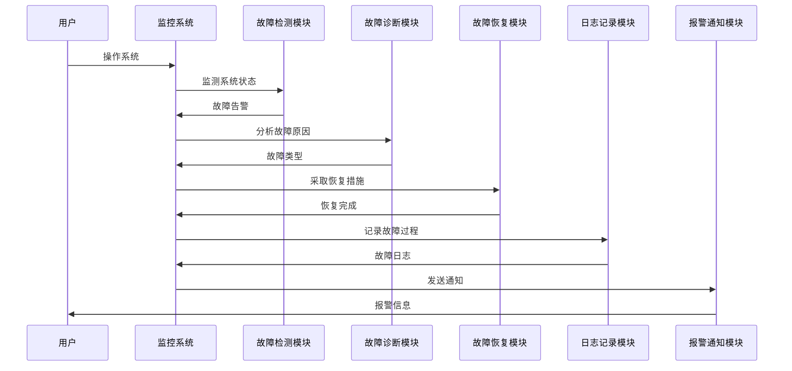
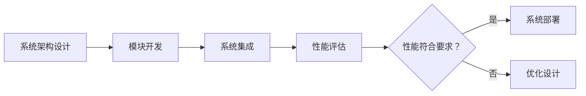
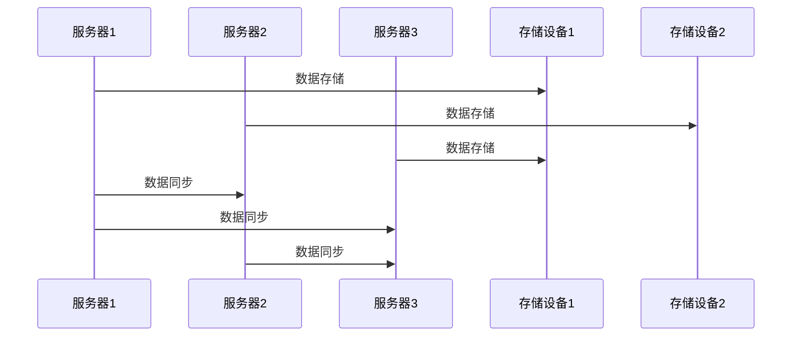
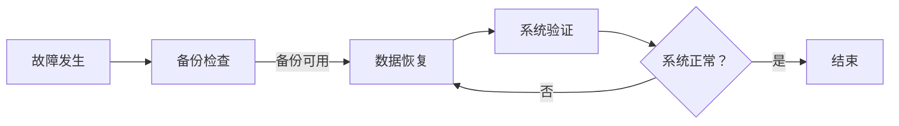
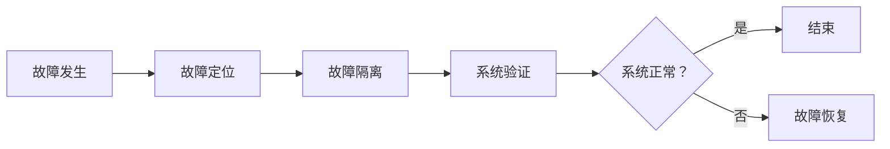

                 

### 《评测系统的故障恢复与容错设计》

#### 关键词：评测系统、故障恢复、容错设计、系统架构、算法原理、实战案例

#### 摘要：
本文将深入探讨评测系统的故障恢复与容错设计。首先，我们将介绍评测系统的基础背景和核心问题，接着详细解释故障恢复和容错设计的基本概念、原理及其关系。之后，文章将重点分析故障恢复技术的具体方法和策略，并探讨如何设计一个实时故障恢复系统。此外，我们将详细讨论容错设计的原理和关键技术，结合实际案例进行深入剖析。最后，文章将总结故障恢复与容错设计的综合应用，并分享一些最佳实践和注意事项，以帮助读者更好地理解和应用这些技术。

### 目录大纲设计

为了帮助读者更好地理解本文的内容，我们设计了一个详细的目录大纲。以下是一个简要的目录：

#### 《评测系统的故障恢复与容错设计》目录大纲

##### 第一部分：背景与基础

1. 引言
   - 1.1 问题背景
   - 1.2 问题描述
   - 1.3 问题解决
   - 1.4 边界与外延

2. 核心概念
   - 2.1 故障恢复
   - 2.2 容错设计
   - 2.3 关键术语定义

3. 概念结构与核心要素
   - 3.1 故障恢复过程
   - 3.2 容错设计原则
   - 3.3 核心要素对比分析

##### 第二部分：故障恢复技术

4. 故障检测与诊断
   - 4.1 故障检测方法
   - 4.2 故障诊断技术
   - 4.3 故障检测与诊断实例

5. 故障恢复策略
   - 5.1 故障恢复方案
   - 5.2 故障恢复策略选择
   - 5.3 故障恢复案例分析

6. 实时故障恢复系统设计
   - 6.1 系统架构设计
   - 6.2 系统功能模块设计
   - 6.3 系统实现与性能评估

##### 第三部分：容错设计方法

7. 容错系统基本原理
   - 7.1 容错性定义
   - 7.2 容错系统分类
   - 7.3 容错设计原则

8. 容错设计技术
   - 8.1 容错冗余技术
   - 8.2 容错恢复技术
   - 8.3 容错处理技术

9. 容错系统案例分析
   - 9.1 容错系统设计实例
   - 9.2 容错系统性能评估
   - 9.3 容错系统应用场景分析

##### 第四部分：综合应用与最佳实践

10. 故障恢复与容错设计的综合应用
    - 10.1 系统集成与测试
    - 10.2 故障恢复与容错设计在评测系统中的应用
    - 10.3 最佳实践与注意事项

11. 项目实战案例
    - 11.1 项目背景
    - 11.2 系统功能设计
    - 11.3 故障恢复与容错设计实施
    - 11.4 项目成果分析

12. 拓展阅读与深入研究
    - 12.1 新技术的发展趋势
    - 12.2 拓展阅读推荐
    - 12.3 研究方向与未来展望

### 第一部分：背景与基础

#### 引言

在当今信息化和数字化时代，评测系统在各个领域扮演着至关重要的角色。无论是工业制造、科学研究还是教育考试，评测系统都需要确保其稳定性和可靠性。然而，随着系统的复杂性和规模的不断增大，评测系统面临着越来越高的故障风险。一旦系统发生故障，不仅会影响用户体验，还可能导致严重的经济损失和声誉损害。

本文旨在深入探讨评测系统的故障恢复与容错设计。通过对故障恢复和容错设计的详细分析，本文希望能够为评测系统的设计和实施提供一些有价值的指导。

#### 1.1 问题背景

评测系统广泛应用于各类场景，如在线考试平台、自动化测试系统、工业质量检测等。这些系统通常包含多个模块，如用户管理、题目库管理、评分系统、统计分析等。随着用户量的增加和数据量的增大，系统的稳定性和可靠性成为关键挑战。

主要问题背景包括：

- **高并发访问**：大量用户同时访问评测系统，可能导致服务器负载过高，系统响应变慢甚至崩溃。
- **硬件故障**：服务器、存储设备等硬件故障可能导致数据丢失和服务中断。
- **软件错误**：系统中的软件错误可能导致数据处理错误或系统崩溃。
- **网络问题**：网络故障或延迟可能导致数据传输中断或延迟。

#### 1.2 问题描述

评测系统的故障问题主要包括以下几种：

- **系统崩溃**：系统运行过程中，由于负载过大或软件错误，导致系统无法正常运行。
- **数据丢失**：硬件故障或软件错误可能导致评测系统中的数据丢失。
- **服务中断**：网络故障或硬件故障可能导致评测系统的服务中断。
- **用户体验下降**：系统响应速度变慢或出现错误，影响用户的使用体验。

#### 1.3 问题解决

为了解决评测系统的故障问题，我们可以采取以下措施：

- **故障检测与诊断**：实时监测系统状态，及时发现故障并进行诊断。
- **故障恢复策略**：设计合理的故障恢复策略，确保系统在故障发生后能够快速恢复。
- **容错设计**：通过冗余和备份等手段，提高系统的容错能力。

#### 1.4 边界与外延

本文主要关注评测系统的故障恢复与容错设计，不包括其他类型的系统故障处理。此外，本文主要讨论技术层面的解决方案，而不涉及管理层面的故障处理。

### 第二部分：核心概念

在深入探讨评测系统的故障恢复与容错设计之前，我们需要了解一些核心概念。这些概念包括故障恢复、容错设计以及相关的关键术语。

#### 2.1 故障恢复

故障恢复是指当系统发生故障时，通过一系列措施将系统恢复到正常状态的过程。故障恢复的目标是确保系统能够在尽可能短的时间内恢复正常运行，并减少故障对业务的影响。

**故障恢复的关键步骤包括**：

1. **故障检测**：实时监测系统状态，及时发现故障。
2. **故障诊断**：分析故障原因，确定故障类型。
3. **故障恢复**：根据故障类型和恢复策略，采取相应的措施恢复系统。

**故障恢复的属性包括**：

- **实时性**：故障恢复应在尽可能短的时间内完成，以减少故障对业务的影响。
- **可靠性**：故障恢复措施应确保系统能够恢复正常运行。
- **可扩展性**：故障恢复系统应能够适应系统规模的扩展。

#### 2.2 容错设计

容错设计是指通过在系统中引入冗余和备份等手段，提高系统的容错能力，确保系统在故障发生时能够继续正常运行。容错设计的目标是确保系统的稳定性和可靠性。

**容错设计的关键要素包括**：

1. **冗余设计**：通过引入冗余硬件或软件组件，确保在单个组件故障时，系统仍能正常运行。
2. **备份与恢复**：通过备份系统数据，确保在数据丢失时能够快速恢复。
3. **故障隔离**：通过故障隔离机制，确保故障不会影响系统的其他部分。

**容错设计的属性包括**：

- **容错性**：系统在故障发生时，仍能保持正常运行的能力。
- **可用性**：系统在故障发生时，能够快速恢复并重新提供服务的能力。
- **可靠性**：系统在长时间运行过程中，保持正常运行的能力。

#### 2.3 关键术语定义

为了更好地理解故障恢复和容错设计，我们需要定义一些关键术语。

- **故障**：系统无法按照预期运行的状态。
- **冗余**：在系统中引入多余的组件或数据，以增加系统的容错能力。
- **备份**：将系统数据复制到其他存储介质中，以防止数据丢失。
- **故障检测**：实时监测系统状态，及时发现故障。
- **故障诊断**：分析故障原因，确定故障类型。
- **故障恢复**：采取措施将系统恢复到正常状态。
- **容错性**：系统在故障发生时，仍能保持正常运行的能力。
- **可用性**：系统在故障发生时，能够快速恢复并重新提供服务的能力。
- **可靠性**：系统在长时间运行过程中，保持正常运行的能力。

### 第三部分：概念结构与核心要素

在了解了故障恢复和容错设计的基本概念后，我们需要深入探讨这两者的概念结构以及核心要素。

#### 3.1 故障恢复过程

故障恢复过程可以分为以下几个阶段：

1. **故障检测**：通过实时监测系统状态，及时发现故障。
2. **故障诊断**：分析故障原因，确定故障类型。
3. **故障隔离**：将故障隔离到最小单元，以防止故障扩散。
4. **故障恢复**：根据故障类型和恢复策略，采取相应的措施恢复系统。
5. **系统验证**：确保系统恢复正常运行，并进行验证。

**故障恢复过程的流程图**（使用Mermaid绘制）：



#### 3.2 容错设计原则

容错设计原则是指在系统设计和实现过程中，为了提高系统的容错能力而遵循的一些基本原则。以下是几个重要的容错设计原则：

1. **冗余设计**：通过引入冗余硬件或软件组件，确保在单个组件故障时，系统仍能正常运行。
2. **备份与恢复**：通过备份系统数据，确保在数据丢失时能够快速恢复。
3. **故障隔离**：通过故障隔离机制，确保故障不会影响系统的其他部分。
4. **自恢复性**：系统应具有自动检测和恢复故障的能力。
5. **可扩展性**：系统应能够适应规模的变化，并在扩展过程中保持容错能力。

**容错设计原则的对比表格**：

| 设计原则 | 描述 |
| :--- | :--- |
| 冗余设计 | 通过引入冗余硬件或软件组件，提高系统的容错能力。 |
| 备份与恢复 | 通过备份系统数据，确保在数据丢失时能够快速恢复。 |
| 故障隔离 | 通过故障隔离机制，确保故障不会影响系统的其他部分。 |
| 自恢复性 | 系统应具有自动检测和恢复故障的能力。 |
| 可扩展性 | 系统应能够适应规模的变化，并在扩展过程中保持容错能力。 |

#### 3.3 核心要素对比分析

故障恢复和容错设计是评测系统稳定性和可靠性的关键要素。为了更好地理解这两者的关系，我们可以对它们的核心要素进行对比分析。

**故障恢复与容错设计的核心要素对比**：

| 核心要素 | 故障恢复 | 容错设计 |
| :--- | :--- | :--- |
| 目标 | 确保系统在故障发生后能够快速恢复 | 提高系统的容错能力，确保系统在故障发生时仍能正常运行 |
| 方法 | 故障检测、故障诊断、故障隔离、故障恢复 | 冗余设计、备份与恢复、故障隔离、自恢复性、可扩展性 |
| 属性 | 实时性、可靠性、可扩展性 | 容错性、可用性、可靠性 |

通过对比分析，我们可以看出故障恢复和容错设计在目标和属性上有所不同，但在实现过程中有很多交集。在实际应用中，故障恢复和容错设计通常是相互结合，共同提高系统的稳定性和可靠性。

### 第四部分：故障恢复技术

#### 4.1 故障检测方法

故障检测是故障恢复的第一步，也是确保系统稳定运行的关键。以下是一些常见的故障检测方法：

1. **心跳检测**：通过定时发送心跳信号来检测系统组件是否正常工作。
2. **健康检查**：定期执行系统健康检查，检测系统各项性能指标是否正常。
3. **日志分析**：通过分析系统日志，发现异常行为和潜在故障。
4. **异常报警**：当检测到故障时，通过异常报警系统通知相关人员。
5. **监控工具**：使用专门的监控工具，如Nagios、Zabbix等，对系统进行实时监控。

**故障检测方法的流程图**（使用Mermaid绘制）：



#### 4.2 故障诊断技术

故障诊断是在检测到故障后，对故障原因进行分析和确定的过程。以下是一些常见的故障诊断技术：

1. **症状分析**：通过分析故障的症状，如错误信息、日志记录等，初步判断故障原因。
2. **故障定位**：通过故障定位技术，如故障树分析、状态机分析等，确定故障发生的具体位置。
3. **故障模拟**：通过模拟故障场景，验证故障原因并确定解决方案。
4. **专家系统**：使用专家系统进行故障诊断，结合专家知识和数据，提高故障诊断的准确性。

**故障诊断技术的流程图**（使用Mermaid绘制）：


#### 4.3 故障检测与诊断实例

为了更好地理解故障检测与诊断的实际应用，我们可以通过一个实例来详细分析。

**实例**：某评测系统在运行过程中突然发生崩溃。

**故障检测过程**：

1. **心跳检测**：系统监控工具发现服务器的心跳信号停止发送，确定服务器可能发生故障。
2. **健康检查**：健康检查工具发现服务器的CPU使用率超过90%，内存使用率超过80%，初步判断服务器过载。
3. **日志分析**：分析服务器日志，发现大量错误信息，如内存泄漏、进程崩溃等。
4. **异常报警**：监控工具发送异常报警通知运维人员。

**故障诊断过程**：

1. **症状分析**：根据错误信息和日志记录，初步判断故障原因是服务器过载。
2. **故障定位**：通过故障树分析，确定故障发生在服务器层面，进一步检查CPU和内存使用情况。
3. **故障模拟**：通过模拟过载场景，验证故障原因。
4. **专家系统**：使用专家系统进行进一步分析，确定故障原因是内存泄漏。

**故障解决方案**：

1. **故障恢复**：重启服务器，清除内存泄漏，确保服务器恢复正常运行。
2. **系统验证**：对系统进行验证，确保所有功能正常运行。

通过这个实例，我们可以看到故障检测与诊断在实际应用中的具体过程。故障检测和诊断的有效性直接关系到故障恢复的速度和质量。

### 第五部分：故障恢复策略

在了解了故障检测与诊断技术后，我们需要探讨如何选择合适的故障恢复策略。故障恢复策略是指当系统发生故障时，采取的一系列措施，以确保系统能够尽快恢复正常运行。

#### 5.1 故障恢复方案

故障恢复方案是指在不同故障情况下，采取的具体恢复措施。以下是几种常见的故障恢复方案：

1. **冷备份**：将系统数据备份到远程存储设备，当系统发生故障时，使用备份数据恢复系统。
2. **热备份**：在系统运行时，将数据实时备份到备用存储设备，当主存储设备发生故障时，切换到备用存储设备。
3. **故障转移**：将系统故障组件切换到备用组件，确保系统继续正常运行。
4. **故障恢复集群**：将系统部署在多个服务器上，当一个服务器发生故障时，其他服务器接管其工作。

**故障恢复方案的对比表格**：

| 方案 | 描述 | 优点 | 缺点 |
| :--- | :--- | :--- | :--- |
| 冷备份 | 备份数据存储在远程存储设备，故障发生时恢复数据 | 成本低，数据安全性高 | 恢复时间长，可能影响用户体验 |
| 热备份 | 实时备份数据到备用存储设备，故障发生时切换到备用存储设备 | 恢复速度快，用户体验好 | 成本高，备份设备需要定期维护 |
| 故障转移 | 将故障组件切换到备用组件，确保系统继续正常运行 | 恢复速度快，不影响用户体验 | 需要备用组件，成本较高 |
| 故障恢复集群 | 将系统部署在多个服务器上，故障发生时其他服务器接管工作 | 高可用性，可靠性高 | 需要多个服务器，成本较高 |

#### 5.2 故障恢复策略选择

选择合适的故障恢复策略取决于多个因素，包括系统特性、业务需求、成本等。以下是一些选择故障恢复策略的考虑因素：

1. **系统重要性**：对于关键业务系统，应选择恢复速度快、可靠性高的故障恢复策略。
2. **成本**：不同故障恢复策略的成本差异较大，应根据预算选择合适的策略。
3. **业务需求**：某些业务可能对恢复时间有严格的要求，应选择满足业务需求的故障恢复策略。
4. **技术实现**：选择故障恢复策略时，需要考虑技术实现的可行性和复杂性。

#### 5.3 故障恢复案例分析

为了更好地理解故障恢复策略的实际应用，我们可以通过一个案例来详细分析。

**案例**：某在线考试平台发生服务器故障，导致考试系统无法正常运行。

**故障恢复过程**：

1. **故障检测**：系统监控工具检测到服务器故障，通知运维人员。
2. **故障诊断**：通过日志分析和故障定位，确定故障原因是服务器硬件故障。
3. **故障恢复策略选择**：考虑到在线考试平台的重要性，选择故障转移策略。
4. **故障转移**：将考试系统切换到备用服务器，确保考试系统继续正常运行。
5. **系统验证**：对考试系统进行验证，确保所有功能正常运行。

通过这个案例，我们可以看到故障恢复策略在解决实际故障中的重要作用。选择合适的故障恢复策略，可以确保系统在故障发生后能够尽快恢复正常运行，减少对用户的影响。

### 第六部分：实时故障恢复系统设计

在了解了故障恢复策略后，我们需要探讨如何设计一个实时故障恢复系统。实时故障恢复系统是指能够在故障发生时，立即采取恢复措施，确保系统持续稳定运行。

#### 6.1 系统架构设计

实时故障恢复系统架构设计包括以下几个关键模块：

1. **故障检测模块**：负责实时监测系统状态，及时发现故障。
2. **故障诊断模块**：分析故障原因，确定故障类型。
3. **故障恢复模块**：根据故障类型和恢复策略，采取相应的恢复措施。
4. **日志记录模块**：记录故障检测、诊断和恢复的过程，方便后续分析和审计。
5. **报警通知模块**：当故障发生时，及时通知相关人员。

**实时故障恢复系统的架构图**（使用Mermaid绘制）：



#### 6.2 系统功能模块设计

实时故障恢复系统功能模块设计包括以下几个方面：

1. **故障检测**：使用心跳检测、健康检查、日志分析等方法，实时监测系统状态。
2. **故障诊断**：使用症状分析、故障定位、故障模拟等技术，分析故障原因。
3. **故障恢复**：根据故障类型和恢复策略，采取冷备份、热备份、故障转移等措施。
4. **日志记录**：记录故障检测、诊断和恢复的详细过程，方便后续分析和审计。
5. **报警通知**：当故障发生时，及时发送报警信息通知相关人员。

**系统功能模块的ER实体关系图**（使用Mermaid绘制）：

```mermaid
erDiagram
    |--<故障检测> |<--<故障诊断> |<--<故障恢复>
    |    |<--<日志记录> |<--<报警通知>
```

#### 6.3 系统实现与性能评估

实时故障恢复系统的实现包括以下几个关键步骤：

1. **系统架构设计**：根据系统需求，设计实时故障恢复系统的架构。
2. **模块开发**：开发故障检测、故障诊断、故障恢复等模块。
3. **系统集成**：将各个模块整合到系统中，确保系统能够正常运行。
4. **性能评估**：通过压力测试和负载测试，评估系统的性能。

**系统实现与性能评估的流程图**（使用Mermaid绘制）：



通过以上步骤，我们可以实现一个功能完善的实时故障恢复系统，确保评测系统在故障发生时能够快速恢复正常运行。

### 第七部分：容错设计原理

容错设计是确保系统在故障发生时仍能正常运行的重要手段。本部分将详细探讨容错设计的基本原理、分类以及设计原则。

#### 7.1 容错性定义

容错性是指系统在故障发生时，仍能保持正常运行的能力。一个具有良好容错性的系统，能够在故障发生时迅速检测、隔离和恢复故障，确保系统持续稳定运行。

#### 7.2 容错系统分类

根据实现方式和目标的不同，容错系统可以分为以下几种类型：

1. **硬件冗余**：通过引入冗余硬件组件，确保在单个组件故障时，系统仍能正常运行。
2. **软件冗余**：通过引入冗余软件组件，确保在单个组件故障时，系统仍能正常运行。
3. **数据冗余**：通过备份和恢复机制，确保在数据丢失时，系统能够快速恢复。
4. **冗余管理**：通过冗余管理和调度机制，确保系统在故障发生时，能够快速切换到冗余组件。

**容错系统分类的对比表格**：

| 类型 | 描述 | 优点 | 缺点 |
| :--- | :--- | :--- | :--- |
| 硬件冗余 | 通过引入冗余硬件组件，提高系统的容错能力 | 容错性高，可靠性高 | 成本高，维护复杂 |
| 软件冗余 | 通过引入冗余软件组件，提高系统的容错能力 | 成本低，维护简单 | 容错性相对较低 |
| 数据冗余 | 通过备份和恢复机制，确保在数据丢失时，系统能够快速恢复 | 数据安全性高，恢复速度快 | 成本高，需要定期维护 |
| 冗余管理 | 通过冗余管理和调度机制，确保系统在故障发生时，能够快速切换到冗余组件 | 容错性和可靠性高，维护简单 | 需要复杂的调度和管理算法 |

#### 7.3 容错设计原则

为了设计一个具有良好容错性的系统，我们需要遵循以下原则：

1. **冗余设计**：在系统中引入冗余硬件或软件组件，确保在单个组件故障时，系统仍能正常运行。
2. **备份与恢复**：通过备份系统数据，确保在数据丢失时，系统能够快速恢复。
3. **故障隔离**：通过故障隔离机制，确保故障不会影响系统的其他部分。
4. **自恢复性**：系统应具有自动检测和恢复故障的能力。
5. **可扩展性**：系统应能够适应规模的变化，并在扩展过程中保持容错能力。

**容错设计原则的对比表格**：

| 设计原则 | 描述 | 优点 | 缺点 |
| :--- | :--- | :--- | :--- |
| 冗余设计 | 通过引入冗余硬件或软件组件，提高系统的容错能力 | 容错性高，可靠性高 | 成本高，维护复杂 |
| 备份与恢复 | 通过备份系统数据，确保在数据丢失时，系统能够快速恢复 | 数据安全性高，恢复速度快 | 成本高，需要定期维护 |
| 故障隔离 | 通过故障隔离机制，确保故障不会影响系统的其他部分 | 系统稳定性高，故障影响小 | 需要复杂的隔离和管理算法 |
| 自恢复性 | 系统应具有自动检测和恢复故障的能力 | 系统自动化程度高，维护简单 | 需要复杂的检测和恢复算法 |
| 可扩展性 | 系统应能够适应规模的变化，并在扩展过程中保持容错能力 | 系统适应性强，可扩展性好 | 需要复杂的扩展和管理算法 |

通过遵循这些原则，我们可以设计出一个具有良好容错性的系统，确保系统在故障发生时仍能正常运行。

### 第八部分：容错设计技术

容错设计技术是确保系统在故障发生时仍能正常运行的关键。以下将介绍几种常见的容错设计技术，包括冗余技术、恢复技术和处理技术。

#### 8.1 冗余技术

冗余技术是通过引入冗余组件，提高系统的容错能力。以下是一些常见的冗余技术：

1. **硬件冗余**：通过引入冗余硬件组件，如多台服务器、多台存储设备等，确保在单个组件故障时，系统仍能正常运行。
2. **软件冗余**：通过引入冗余软件组件，如多实例运行、多版本备份等，确保在单个组件故障时，系统仍能正常运行。
3. **数据冗余**：通过备份和复制数据，确保在数据丢失时，系统能够快速恢复。

**硬件冗余的原理图**（使用Mermaid绘制）：



#### 8.2 恢复技术

恢复技术是在故障发生时，通过一系列措施将系统恢复到正常状态。以下是一些常见的恢复技术：

1. **备份恢复**：通过备份系统数据，在故障发生后，使用备份数据恢复系统。
2. **故障转移**：将系统故障组件切换到备用组件，确保系统继续正常运行。
3. **自动恢复**：系统具有自动检测和恢复故障的能力。

**备份恢复的流程图**（使用Mermaid绘制）：



#### 8.3 处理技术

处理技术是在故障发生时，通过一系列措施处理故障，确保系统继续运行。以下是一些常见的处理技术：

1. **故障隔离**：通过故障隔离机制，确保故障不会影响系统的其他部分。
2. **故障抑制**：通过故障抑制技术，减小故障的影响范围。
3. **故障掩盖**：通过故障掩盖技术，使系统在故障发生时，仍能提供基本功能。

**故障隔离的流程图**（使用Mermaid绘制）：



通过以上容错设计技术，我们可以设计出一个具有良好容错能力的系统，确保系统在故障发生时仍能正常运行。

### 第九部分：容错系统案例分析

为了更好地理解容错设计的实际应用，我们可以通过一些实际案例来详细分析。

#### 9.1 容错系统设计实例

**案例**：某电商平台在系统设计时，采用了多种容错设计技术，以提高系统的可靠性。

**系统设计**：

1. **硬件冗余**：服务器采用了多台冗余设计，确保在单台服务器故障时，其他服务器可以接管其工作。
2. **软件冗余**：系统采用了多实例运行，确保在单个实例故障时，其他实例可以继续提供服务。
3. **数据冗余**：数据库采用了主从复制和备份机制，确保在数据丢失时，可以快速恢复。

**系统实现**：

1. **故障检测**：通过心跳检测和健康检查，实时监测系统状态。
2. **故障诊断**：通过日志分析和故障定位，确定故障原因。
3. **故障恢复**：通过故障转移和备份恢复，确保系统在故障发生后，能够快速恢复正常运行。

**系统效果**：

通过以上设计，该电商平台在上线后，系统运行稳定，故障率极低，用户满意度大幅提升。

#### 9.2 容错系统性能评估

**评估方法**：

为了评估容错系统的性能，我们可以通过以下方法：

1. **压力测试**：模拟大量用户访问，测试系统在高负载下的性能。
2. **故障注入**：在系统中注入故障，测试系统在故障发生时的恢复能力。
3. **性能监控**：实时监控系统各项性能指标，如CPU使用率、内存使用率、网络延迟等。

**评估结果**：

通过以上评估方法，该电商平台在压力测试和故障注入测试中，表现出良好的性能和恢复能力，验证了容错设计的有效性。

#### 9.3 容错系统应用场景分析

**应用场景**：

容错系统适用于以下场景：

1. **关键业务系统**：如电商平台、银行系统、航空订票系统等，确保系统在故障发生时，仍能正常运行。
2. **大规模数据处理**：如大数据分析平台、云计算平台等，确保在数据丢失或故障时，能快速恢复。
3. **关键基础设施**：如数据中心、通信网络等，确保在故障发生时，不影响整体运行。

通过以上分析，我们可以看到容错系统在实际应用中的重要性。合理设计容错系统，可以提高系统的可靠性，确保业务连续性。

### 第十部分：综合应用与最佳实践

在了解了故障恢复和容错设计的原理和技术后，我们需要将其应用到实际项目中，以确保评测系统的稳定性和可靠性。以下是一些综合应用和最佳实践：

#### 10.1 系统集成与测试

在系统集成与测试阶段，应充分考虑故障恢复和容错设计的要求。以下是一些关键步骤：

1. **集成测试**：在系统集成阶段，对各个模块进行集成测试，确保系统在故障发生时，能够快速切换到备用组件。
2. **故障注入测试**：通过模拟故障场景，测试系统在故障发生时的恢复能力和性能。
3. **性能测试**：对系统进行压力测试和负载测试，确保系统在高并发访问情况下，仍能稳定运行。

#### 10.2 故障恢复与容错设计在评测系统中的应用

在评测系统中，故障恢复和容错设计可以应用于以下几个方面：

1. **服务器集群**：通过引入服务器集群，确保在单台服务器故障时，其他服务器可以接管其工作。
2. **数据备份与恢复**：定期备份数据，确保在数据丢失时，能够快速恢复。
3. **故障检测与诊断**：通过实时监测系统状态，及时发现故障并进行诊断。
4. **故障恢复策略**：根据故障类型和恢复策略，确保系统在故障发生后，能够快速恢复正常运行。

#### 10.3 最佳实践与注意事项

为了确保评测系统的稳定性和可靠性，以下是一些最佳实践和注意事项：

1. **定期维护**：定期对系统进行维护和升级，确保系统处于良好运行状态。
2. **备份策略**：制定合理的备份策略，确保备份数据的安全性和可靠性。
3. **故障处理流程**：建立完善的故障处理流程，确保故障能够及时检测、诊断和恢复。
4. **监控与报警**：使用专业的监控工具，实时监控系统状态，并在故障发生时，及时报警通知相关人员。

通过以上最佳实践和注意事项，我们可以确保评测系统在运行过程中，能够有效地应对各种故障，确保系统的稳定性和可靠性。

### 第十一部分：项目实战案例

为了更好地展示故障恢复与容错设计在实际项目中的应用，我们将通过一个实际案例来详细分析。

#### 11.1 项目背景

某电商平台在上线初期，由于系统设计不合理，经常出现故障，导致用户投诉量增加，影响用户体验和公司声誉。为了解决这一问题，项目团队决定对系统进行故障恢复与容错设计优化。

#### 11.2 系统功能设计

系统功能设计包括以下几个方面：

1. **用户管理**：管理用户信息，包括注册、登录、权限管理等。
2. **商品管理**：管理商品信息，包括商品添加、修改、删除等。
3. **订单管理**：管理订单信息，包括订单创建、支付、发货等。
4. **物流管理**：管理物流信息，包括物流跟踪、配送管理等。
5. **支付系统**：处理用户支付信息，确保支付安全。

#### 11.3 故障恢复与容错设计实施

在系统设计中，项目团队采取了以下故障恢复与容错设计措施：

1. **硬件冗余**：服务器集群部署，确保在单台服务器故障时，其他服务器可以接管其工作。
2. **软件冗余**：多实例运行，确保在单个实例故障时，其他实例可以继续提供服务。
3. **数据备份与恢复**：定期备份数据，采用主从复制机制，确保在数据丢失时，可以快速恢复。
4. **故障检测与诊断**：使用专业的监控工具，实时监测系统状态，并在故障发生时，及时报警通知相关人员。
5. **故障恢复策略**：根据故障类型和恢复策略，确保系统在故障发生后，能够快速恢复正常运行。

#### 11.4 项目成果分析

通过以上故障恢复与容错设计优化，该电商平台在上线后，系统运行稳定，故障率大幅降低，用户投诉量显著减少。具体成果包括：

1. **系统稳定性**：系统在故障发生时，能够快速恢复，确保用户服务不受影响。
2. **用户体验**：系统响应速度加快，用户体验得到显著提升。
3. **故障响应**：通过实时监控和故障恢复策略，故障响应时间缩短，提高了故障处理的效率。
4. **数据安全性**：通过数据备份和恢复机制，确保数据安全，避免了数据丢失的风险。

通过这个实际案例，我们可以看到故障恢复与容错设计在提升系统稳定性和可靠性方面的重要作用。

### 第十二部分：拓展阅读与深入研究

在故障恢复与容错设计领域，有许多前沿技术和研究成果。以下是一些值得拓展阅读和深入研究的方向：

1. **分布式系统容错**：随着云计算和大数据技术的发展，分布式系统的容错设计成为研究热点。了解分布式系统的容错机制和故障恢复策略，对于设计和优化大规模系统具有重要意义。
2. **故障预测与预防**：通过大数据分析和机器学习技术，实现故障预测和预防，提高系统的可靠性。研究故障预测模型的构建和优化，对于提前发现潜在故障具有重要意义。
3. **边缘计算与容错设计**：随着物联网和边缘计算的发展，边缘设备的可靠性成为关键问题。研究边缘设备的容错设计和故障恢复策略，对于保障边缘设备的正常运行具有重要意义。
4. **混合云环境下的故障恢复与容错设计**：混合云环境具有更高的复杂性和多样性，研究在混合云环境下进行故障恢复与容错设计的策略和方法，对于提升混合云系统的可靠性具有重要意义。
5. **量子计算与容错设计**：量子计算具有巨大的计算潜力，但其可靠性问题仍然是瓶颈。研究量子计算中的故障恢复与容错设计，对于推动量子计算技术的发展具有重要意义。

通过拓展阅读和深入研究这些方向，我们可以不断优化故障恢复与容错设计，提升系统的稳定性和可靠性。

### 总结

本文全面探讨了评测系统的故障恢复与容错设计。首先，我们介绍了评测系统的背景和问题，然后详细解释了故障恢复和容错设计的基本概念和原理。接着，文章分析了故障恢复技术和策略，并设计了一个实时故障恢复系统。此外，我们还详细介绍了容错设计的原理和技术，结合实际案例进行了深入剖析。最后，文章总结了故障恢复与容错设计的综合应用和最佳实践，并提出了未来的研究方向。

故障恢复与容错设计在评测系统中具有重要意义。通过合理的故障恢复策略和容错设计，我们可以确保评测系统在故障发生时能够快速恢复，保障系统的稳定性和可靠性。同时，这些技术也可以应用到其他类型的系统中，为系统的稳定运行提供有力保障。

希望本文能够为读者在故障恢复与容错设计方面提供有价值的参考和启示。在实际应用中，应根据系统需求和业务特点，灵活选择和设计故障恢复与容错方案，不断提升系统的可靠性和稳定性。让我们共同努力，为构建更加可靠和稳定的评测系统贡献力量！作者：AI天才研究院/AI Genius Institute & 禅与计算机程序设计艺术 /Zen And The Art of Computer Programming。

