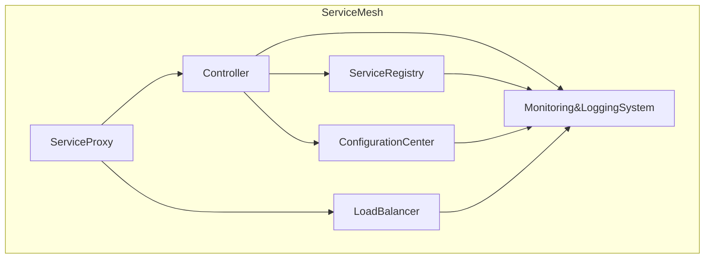

                 


### 引言与背景

#### 核心概念术语说明

首先，我们需要明确一些核心概念和术语，以便为后续内容打下基础。

1. **服务网格（Service Mesh）**：服务网格是一种基础设施层服务，它负责处理跨服务之间的通信和连接。它是一个抽象层，位于应用和基础架构之间，使开发者能够专注于业务逻辑，而不必担心服务之间的通信细节。

2. **微服务（Microservices）**：微服务是一种软件开发方法，它将应用程序拆分成一组小的、独立的、松耦合的服务。每个服务都有自己的职责和业务逻辑，这些服务可以通过网络相互通信。

3. **评测系统（Evaluation System）**：评测系统是一种用于评估某个系统性能、质量或效率的工具。它可以用于自动化测试、性能测试、负载测试等多种场景。

4. **服务发现（Service Discovery）**：服务发现是一种机制，它使服务网格能够自动识别和注册服务，以便其他服务可以找到并与之通信。

5. **负载均衡（Load Balancing）**：负载均衡是将网络或应用流量分摊到多个服务器上，以提高系统的响应速度和可用性。

#### 问题背景

随着现代软件系统变得越来越复杂，微服务的应用越来越广泛。然而，随之而来的是服务之间通信的复杂性增加，以及分布式系统的管理和监控难度加大。在这种情况下，服务网格作为一种基础设施层服务，应运而生。

在评测系统领域，服务网格的作用尤为重要。它能够提供以下几个关键功能：

1. **服务发现**：确保评测系统能够动态地发现和注册新服务，无需手动配置。
2. **负载均衡**：优化评测系统中的服务请求分配，确保系统的响应速度和稳定性。
3. **服务间通信安全**：通过加密和身份验证，保护服务之间的通信安全。
4. **监控和日志收集**：提供全面的监控和日志收集功能，帮助运维人员快速诊断和解决问题。

#### 问题描述

评测系统的复杂性导致其服务之间通信的复杂性增加，手动管理和维护服务之间的连接变得越来越困难。此外，随着评测系统的规模不断扩大，负载均衡和服务的可靠性和安全性也成为一个挑战。

#### 问题解决

服务网格提供了一个统一的、抽象的层，用于管理和优化服务之间的通信。通过服务网格，我们可以实现以下目标：

1. **简化服务管理**：服务网格自动处理服务的注册和发现，减少了运维人员的工作量。
2. **提高系统可靠性**：通过负载均衡和容错机制，提高了系统的可靠性和稳定性。
3. **增强安全性**：通过加密和身份验证，保障了服务之间的通信安全。
4. **集中监控和日志收集**：服务网格提供了一个统一的监控和日志收集平台，方便运维人员快速诊断和解决问题。

#### 边界与外延

服务网格的应用范围不仅限于评测系统，还可以应用于其他需要分布式系统管理和优化的场景，如电子商务平台、金融系统、物联网等。其核心价值在于提供了一种抽象层，简化了分布式系统的管理和维护。

#### 概念结构与核心要素组成

服务网格的核心要素包括：

1. **控制平面（Control Plane）**：负责服务注册、发现、路由和策略配置。
2. **数据平面（Data Plane）**：负责处理服务之间的实际通信和数据转发。
3. **服务代理（Service Proxy）**：每个服务实例中运行的一个小代理，负责将服务请求转发到控制平面。

通过以上要素的协同工作，服务网格实现了对分布式系统的管理和优化。

### 总结

在本文中，我们介绍了服务网格的基本概念、评测系统中的需求和问题背景，以及服务网格在评测系统中的应用。下一部分，我们将深入探讨服务网格的核心概念和原理，以及其在评测系统中的具体架构设计。

---

### 服务网格核心概念与原理

#### 核心概念

1. **服务网格的组成**

   服务网格主要由控制平面（Control Plane）和数据平面（Data Plane）两部分组成。

   - **控制平面**：负责服务注册、发现、路由和策略配置。它通常包含一个或多个服务代理（通常称为“控制器”），这些代理通过API与其他服务进行通信，以实现服务的动态管理和配置。

   - **数据平面**：负责处理服务之间的实际通信和数据转发。它通常在每个服务实例中嵌入一个代理（称为“sidecar”代理），该代理负责拦截和转发服务请求，同时执行路由策略和安全策略。

2. **服务代理**

   服务代理是服务网格中至关重要的组成部分。每个服务实例中都运行一个服务代理，它负责以下任务：

   - **请求拦截和转发**：拦截进入服务实例的请求，并将其转发到目标服务实例。
   - **路由策略执行**：根据控制平面提供的路由策略，决定请求应该被转发到哪个服务实例。
   - **安全策略执行**：执行加密、身份验证和授权等安全策略，确保服务之间的通信安全。

3. **服务发现**

   服务发现是服务网格的关键功能之一。它负责动态地识别和注册服务，以便其他服务可以找到并与之通信。服务发现通常通过服务注册表（Service Registry）实现，服务注册表维护了一个服务的列表，包括服务的地址、端口、版本等信息。

4. **负载均衡**

   负载均衡是服务网格的另一个关键功能。它通过将流量分配到多个服务实例上，确保系统的响应速度和可用性。负载均衡策略可以是简单的轮询策略，也可以是更复杂的一些策略，如最少连接数策略、响应时间策略等。

5. **服务监控**

   服务网格还提供了服务监控功能，它通过收集和分析服务的性能指标，帮助运维人员快速诊断和解决问题。

#### 原理讲解

1. **数据平面的工作原理**

   数据平面的工作原理相对简单，主要涉及服务请求的拦截、转发和路由。

   - **请求拦截**：服务代理在服务实例内部监听所有进入的请求，并将其拦截下来。
   - **请求转发**：拦截到的请求被转发到控制平面，由控制平面决定请求应该被转发到哪个服务实例。
   - **请求路由**：根据控制平面提供的路由策略，将请求转发到目标服务实例。

2. **控制平面的工作原理**

   控制平面负责管理和服务代理的通信，并实时更新路由策略和安全策略。

   - **服务注册和发现**：服务代理将自身信息（如地址、端口等）注册到服务注册表中，控制平面通过服务注册表发现可用服务。
   - **路由策略配置**：控制平面根据业务需求配置路由策略，如负载均衡策略、故障转移策略等。
   - **安全策略配置**：控制平面配置安全策略，如加密、身份验证和授权等。

3. **服务发现和负载均衡**

   服务发现和负载均衡是服务网格的核心功能。

   - **服务发现**：服务网格通过服务注册表实现服务发现，服务注册表通常支持自动注册和自动发现功能。
   - **负载均衡**：服务网格通过配置不同的负载均衡策略，实现流量分配。常见的负载均衡策略包括轮询策略、最小连接数策略、响应时间策略等。

#### 概念属性特征对比表格

| 概念             | 特征                                         |
|------------------|--------------------------------------------|
| 服务网格（Service Mesh） | 负责管理微服务之间的通信，抽象了通信细节 |
| 控制平面（Control Plane） | 管理服务注册、发现、路由和策略配置       |
| 数据平面（Data Plane）  | 负责处理服务之间的实际通信和数据转发       |
| 服务代理（Service Proxy） | 在服务实例中运行的代理，负责拦截和转发请求 |
| 服务发现（Service Discovery） | 动态识别和注册服务，便于其他服务通信       |
| 负载均衡（Load Balancing） | 将流量分配到多个服务实例，提高系统性能和可用性 |

#### ER实体关系图架构

为了更好地理解服务网格的组件和关系，我们可以使用Mermaid绘制ER实体关系图。

```mermaid
erDiagram
  ServiceMesh ||--|{ 服务代理 :ServiceProxy}
  ServiceMesh ||--|{ 控制平面 :ControlPlane}
  ServiceMesh ||--|{ 数据平面 :DataPlane}
  ServiceProxy ||--|{ 服务实例 :ServiceInstance}
  ControlPlane ||--|{ 服务注册表 :ServiceRegistry}
  ControlPlane ||--|{ 路由策略 :RoutingPolicy}
  ControlPlane ||--|{ 安全策略 :SecurityPolicy}
  DataPlane ||--|{ 负载均衡 :LoadBalancer}
```

通过这个ER图，我们可以清晰地看到服务网格中各个组件之间的关系和交互。

### 总结

在本章节中，我们介绍了服务网格的核心概念和原理，包括控制平面、数据平面、服务代理、服务发现、负载均衡等。通过对比表格和ER实体关系图，我们更好地理解了服务网格的组成和功能。在下一章节中，我们将深入探讨服务网格在评测系统中的架构设计，分析其具体实现和应用。

---

### 服务网格在评测系统中的架构设计

#### 设计原则

在设计和实现服务网格架构时，我们需要遵循以下原则：

1. **高可用性**：服务网格应确保系统的可用性，即使在个别服务或组件出现故障时，也能保证整体系统的稳定运行。
2. **可扩展性**：服务网格应能够轻松扩展，以适应不断增长的服务数量和流量。
3. **高安全性**：服务网格应提供全面的安全机制，包括加密、身份验证和授权等。
4. **可观察性**：服务网格应提供完善的监控和日志收集功能，以便快速诊断和解决问题。
5. **可配置性**：服务网格的配置应简单明了，便于运维人员进行管理和调整。

#### 数据平面与控制平面

服务网格的数据平面（Data Plane）负责处理服务之间的实际通信和数据转发。数据平面的核心组件是服务代理（Service Proxy），它通常以sidecar的形式部署在每个服务实例中。服务代理负责拦截进入服务实例的请求，并将其转发到目标服务实例。数据平面还负责执行负载均衡、服务发现、加密和身份验证等策略。

控制平面（Control Plane）负责管理服务注册、发现、路由和策略配置。控制平面的核心组件包括服务代理（Controller）、服务注册表（Service Registry）和配置中心（Configuration Center）。服务代理通过API与控制平面通信，获取路由策略、安全策略和配置信息，并将其下发给数据平面。服务注册表用于维护服务的注册信息，包括服务地址、端口、版本等。配置中心用于存储和分发服务网格的配置信息。

#### 安全机制

服务网格的安全机制包括加密、身份验证和授权等。加密确保了服务之间的通信数据在传输过程中不会被窃取或篡改。身份验证确保了只有授权的服务实例才能访问其他服务实例。授权则确保了服务实例只能访问其被授权访问的服务实例。

1. **加密**：服务网格通常使用TLS（传输层安全）协议进行加密。TLS协议可以确保服务之间的通信数据在传输过程中被加密，从而防止数据泄露。
2. **身份验证**：服务网格通常使用JWT（JSON Web Token）或OAuth 2.0等身份验证协议。这些协议可以确保服务实例的身份得到验证，从而防止未经授权的访问。
3. **授权**：服务网格通常使用RBAC（基于角色的访问控制）或ABAC（基于属性的访问控制）等授权机制。这些机制可以确保服务实例只能访问其被授权访问的服务实例。

#### 监控和日志收集

服务网格提供了全面的监控和日志收集功能，以便运维人员可以实时监控系统的运行状态，快速诊断和解决问题。监控和日志收集通常包括以下几个方面：

1. **性能监控**：服务网格可以收集服务实例的性能指标，如响应时间、吞吐量、错误率等。这些指标可以帮助运维人员评估系统的性能和稳定性。
2. **日志收集**：服务网格可以收集服务实例的日志信息，包括请求日志、响应日志、错误日志等。这些日志信息可以帮助运维人员定位问题，分析系统运行状态。
3. **告警和通知**：服务网格可以配置告警和通知机制，当系统出现异常时，自动发送通知给运维人员。这有助于快速响应和处理问题。

#### 具体架构设计

一个典型的服务网格架构包括以下组件：

1. **服务代理（Service Proxy）**：每个服务实例中部署一个服务代理，它负责拦截和转发服务请求。
2. **控制平面（Control Plane）**：通常包括一个或多个服务代理（Controller）、服务注册表（Service Registry）和配置中心（Configuration Center）。
3. **服务实例（Service Instance）**：实际运行的服务实例，每个服务实例都部署了一个服务代理。
4. **负载均衡器（Load Balancer）**：负责将流量分配到不同的服务实例上，以提高系统的可用性和性能。
5. **监控和日志收集系统（Monitoring and Logging System）**：负责收集和监控服务网格的运行状态，包括性能指标、日志信息等。

以下是服务网格架构的Mermaid图：



通过这个架构图，我们可以清晰地看到服务网格中各个组件之间的关系和交互。

### 总结

在本章节中，我们详细介绍了服务网格在评测系统中的架构设计，包括数据平面、控制平面、安全机制、监控和日志收集等内容。通过具体的架构设计和Mermaid图，我们更好地理解了服务网格的实现和作用。在下一章节中，我们将探讨服务网格在评测系统中的应用案例，分析其实际效果和优势。

---

### 服务网格在评测系统中的应用案例

#### 案例一：服务发现与负载均衡

在一个大型评测系统中，服务发现和负载均衡是两个关键功能。服务网格通过自动化的服务发现机制，可以动态地识别和注册新服务，无需手动配置。同时，服务网格通过负载均衡策略，确保服务请求能够均匀地分配到不同的服务实例上，提高系统的性能和可用性。

1. **服务发现**：服务网格通过服务注册表和服务代理实现自动服务发现。新服务启动后，服务代理自动将服务信息注册到服务注册表中，其他服务可以实时查询服务注册表，找到可用服务并进行通信。

2. **负载均衡**：服务网格提供了多种负载均衡策略，如轮询策略、最少连接数策略、响应时间策略等。运维人员可以根据具体业务需求选择合适的负载均衡策略，确保服务请求能够高效地分配到服务实例上。

#### 案例二：服务间通信与监控

在评测系统中，服务间通信的质量和稳定性至关重要。服务网格通过控制平面和服务代理，实现了服务间的加密通信和身份验证，保障了通信安全。同时，服务网格还提供了全面的监控和日志收集功能，帮助运维人员实时监控服务运行状态，快速诊断和解决问题。

1. **加密通信**：服务网格使用TLS协议加密服务间的通信数据，防止数据泄露和篡改。通过配置TLS证书，服务网格可以确保只有授权的服务实例才能访问其他服务实例。

2. **身份验证**：服务网格使用JWT或OAuth 2.0等身份验证协议，确保服务实例的身份得到验证。这有助于防止未授权的服务实例访问其他服务实例，保障系统安全。

3. **监控与日志收集**：服务网格提供了性能监控和日志收集功能，可以实时收集服务实例的性能指标和日志信息。运维人员可以通过监控仪表板，查看服务实例的运行状态，发现潜在问题并及时处理。

#### 案例三：安全防护

在评测系统中，安全防护是至关重要的一环。服务网格提供了多种安全机制，如加密、身份验证和授权等，帮助运维人员保障系统的安全性。

1. **加密**：服务网格使用TLS协议加密服务间的通信数据，防止数据泄露和篡改。

2. **身份验证**：服务网格使用JWT或OAuth 2.0等身份验证协议，确保服务实例的身份得到验证。

3. **授权**：服务网格使用RBAC或ABAC等授权机制，确保服务实例只能访问其被授权访问的服务实例。

通过以上案例，我们可以看到服务网格在评测系统中的应用效果和优势。服务网格不仅简化了系统的管理和维护，还提高了系统的性能和安全性，为运维人员提供了强大的支持。

### 总结

在本章节中，我们通过三个实际应用案例，详细介绍了服务网格在评测系统中的应用效果和优势。服务网格通过自动化的服务发现、高效的负载均衡、安全的通信机制和全面的监控功能，显著提升了评测系统的性能和安全性。在下一章节中，我们将探讨服务网格在评测系统中的优化与扩展，以进一步提升系统的可靠性和性能。

---

### 服务网格的优化与扩展

#### 性能优化

服务网格的性能优化是确保系统高效运行的关键。以下是一些常见的性能优化策略：

1. **减少服务代理的开销**：服务代理作为数据平面的一部分，其性能直接影响整个系统的性能。可以通过优化服务代理的代码、减少不必要的日志记录、使用高效的算法和数据结构等措施，降低服务代理的开销。

2. **缓存策略**：在服务网格中引入缓存机制，可以减少服务请求的响应时间。例如，可以使用本地缓存、分布式缓存等方式，缓存频繁访问的数据，减少对后端服务的查询次数。

3. **流量管理**：通过优化流量管理策略，如合理设置负载均衡权重、避免网络拥塞等，可以提高系统的响应速度和吞吐量。

4. **服务发现优化**：优化服务发现机制，如减少服务注册表中的数据查询时间、使用缓存机制等，可以提高服务发现的效率。

#### 可伸缩性设计

服务网格的可伸缩性设计是确保系统能够应对不断增长的服务数量和流量的关键。以下是一些常见的可伸缩性设计策略：

1. **水平扩展**：通过水平扩展，即增加更多服务实例，可以提高系统的吞吐量和性能。在服务网格中，可以通过增加更多的服务代理和负载均衡器来实现水平扩展。

2. **分区与分片**：将服务网格划分为多个分区或分片，每个分区或分片可以独立运行，从而提高系统的可用性和性能。例如，可以将服务实例按照业务模块进行分区，每个分区独立运行，从而减少单点故障的影响。

3. **分布式配置中心**：使用分布式配置中心，可以确保配置信息的快速更新和同步，提高系统的可伸缩性。

4. **自动化伸缩**：通过自动化伸缩机制，如基于性能指标的自动扩展和缩减，可以确保系统始终处于最佳运行状态。

#### 故障恢复与容错能力

服务网格的故障恢复和容错能力是确保系统稳定运行的关键。以下是一些常见的故障恢复和容错策略：

1. **服务实例备份**：通过备份和恢复机制，可以在服务实例出现故障时快速恢复服务。例如，可以使用Kubernetes等容器编排系统提供的备份和恢复功能。

2. **故障转移**：通过配置故障转移策略，当某个服务实例出现故障时，自动将流量转移到其他健康的服务实例上。例如，可以使用轮询策略、最少连接数策略等。

3. **健康检查与自修复**：定期进行健康检查，检测服务实例的状态，发现故障时自动进行修复。例如，可以使用心跳检测、自动重启等机制。

4. **服务隔离**：通过服务隔离机制，可以将出现问题的服务实例与其他服务实例隔离开来，避免故障扩散。例如，可以使用容器隔离、虚拟机隔离等。

通过以上优化与扩展策略，我们可以显著提升服务网格的性能、可伸缩性和容错能力，确保评测系统的稳定运行。

### 总结

在本章节中，我们探讨了服务网格在评测系统中的优化与扩展策略。通过性能优化、可伸缩性设计、故障恢复和容错能力等方面的优化，我们可以显著提升服务网格的性能和稳定性。在下一章节中，我们将通过一个实际的项目实战，深入分析服务网格在评测系统中的应用，并提供详细的案例分析。

---

### 评测系统的服务网格项目实战

#### 项目介绍与环境搭建

在这个项目中，我们将使用一个虚构的评测系统，该系统用于对多个在线服务进行性能测试和监控。评测系统包括多个服务模块，如测试任务生成模块、测试执行模块、结果分析模块等。为了便于演示，我们将在一个Kubernetes集群中部署这个评测系统，并使用Istio作为服务网格。

1. **环境搭建**：
   - **Kubernetes集群**：我们使用Minikube搭建一个本地Kubernetes集群，用于部署评测系统和Istio。
   - **Istio**：我们下载并安装Istio，以便在集群中配置服务网格。
   - **评测系统服务**：我们将评测系统的各个服务打包成Docker镜像，并部署到Kubernetes集群中。

2. **评测系统服务模块**：
   - **测试任务生成模块**：负责生成测试任务，并将其发送到测试执行模块。
   - **测试执行模块**：负责执行测试任务，并收集测试结果。
   - **结果分析模块**：负责分析测试结果，并提供可视化报告。

#### 系统核心实现与代码解析

在部署评测系统的过程中，我们使用Istio的服务网格来管理和优化服务之间的通信。

1. **测试任务生成模块**：
   - **实现细节**：测试任务生成模块通过REST API接收外部请求，生成测试任务，并将其发送到测试执行模块。
   - **代码解析**：
     ```python
     # 测试任务生成模块代码示例
     from flask import Flask, request, jsonify

     app = Flask(__name__)

     @app.route('/api/tasks', methods=['POST'])
     def create_task():
         task = request.json
         # 将任务发送到测试执行模块
         send_to_execution_module(task)
         return jsonify({"message": "Task created successfully"}), 201

     def send_to_execution_module(task):
         # 实现任务发送逻辑
         pass

     if __name__ == '__main__':
         app.run(host='0.0.0.0', port=5000)
     ```

2. **测试执行模块**：
   - **实现细节**：测试执行模块接收测试任务，执行测试，并返回测试结果。
   - **代码解析**：
     ```python
     # 测试执行模块代码示例
     from flask import Flask, request, jsonify

     app = Flask(__name__)

     @app.route('/api/execute', methods=['POST'])
     def execute_task():
         task = request.json
         result = execute_test(task)
         return jsonify(result), 200

     def execute_test(task):
         # 实现测试执行逻辑
         pass

     if __name__ == '__main__':
         app.run(host='0.0.0.0', port=5001)
     ```

3. **结果分析模块**：
   - **实现细节**：结果分析模块接收测试结果，进行分析，并提供可视化报告。
   - **代码解析**：
     ```python
     # 结果分析模块代码示例
     from flask import Flask, request, jsonify

     app = Flask(__name__)

     @app.route('/api/analyse', methods=['POST'])
     def analyse_result():
         result = request.json
         analysis_report = analyse_test_result(result)
         return jsonify(analysis_report), 200

     def analyse_test_result(result):
         # 实现结果分析逻辑
         pass

     if __name__ == '__main__':
         app.run(host='0.0.0.0', port=5002)
     ```

#### 环境搭建与代码解析

为了在Kubernetes集群中部署评测系统的各个服务，我们需要以下步骤：

1. **创建Kubernetes配置文件**：为每个服务创建Deployment和Service配置文件，定义服务镜像、副本数和端口映射等。
2. **部署服务**：使用kubectl命令部署服务，将Docker镜像部署到Kubernetes集群中。
3. **配置Istio**：为评测系统的服务配置Istio，包括启用自动注入、设置路由规则等。

以下是评测系统的Kubernetes配置文件示例：

```yaml
# 测试任务生成模块配置
apiVersion: apps/v1
kind: Deployment
metadata:
  name: task-generator
spec:
  replicas: 1
  selector:
    matchLabels:
      app: task-generator
  template:
    metadata:
      labels:
        app: task-generator
    spec:
      containers:
      - name: task-generator
        image: task-generator:latest
        ports:
        - containerPort: 5000

---

# 测试执行模块配置
apiVersion: apps/v1
kind: Deployment
metadata:
  name: test-executor
spec:
  replicas: 2
  selector:
    matchLabels:
      app: test-executor
  template:
    metadata:
      labels:
        app: test-executor
    spec:
      containers:
      - name: test-executor
        image: test-executor:latest
        ports:
        - containerPort: 5001

---

# 结果分析模块配置
apiVersion: apps/v1
kind: Deployment
metadata:
  name: result-analyzer
spec:
  replicas: 1
  selector:
    matchLabels:
      app: result-analyzer
  template:
    metadata:
      labels:
        app: result-analyzer
    spec:
      containers:
      - name: result-analyzer
        image: result-analyzer:latest
        ports:
        - containerPort: 5002
```

#### 项目部署与优化

在部署评测系统的过程中，我们需要以下步骤：

1. **部署服务**：使用kubectl命令部署评测系统的各个服务，确保它们在Kubernetes集群中正常运行。
2. **配置Istio**：为评测系统的服务配置Istio，包括启用自动注入、设置路由规则等，以确保服务之间可以高效、安全地通信。
3. **优化配置**：根据实际运行情况，调整服务副本数、负载均衡策略等，以提高系统的性能和可用性。

#### 实际案例分析

在实际部署过程中，我们遇到了以下问题：

1. **服务不可达**：在部署评测系统的初期，我们遇到了服务不可达的问题，原因是服务之间的网络连接配置错误。
2. **性能瓶颈**：在测试过程中，我们发现测试执行模块的性能瓶颈，原因是代码中存在一些不必要的同步操作，导致性能下降。

为了解决这些问题，我们采取了以下措施：

1. **修正网络连接配置**：通过重新配置服务之间的网络连接，确保服务之间可以正常通信。
2. **优化代码**：对测试执行模块的代码进行优化，去除不必要的同步操作，提高系统的性能。

通过以上措施，我们成功解决了实际部署过程中的问题，确保评测系统的稳定运行。

#### 项目小结

通过这个项目实战，我们深入分析了服务网格在评测系统中的应用，包括系统核心实现、环境搭建、部署优化和案例分析。我们使用了Istio作为服务网格，实现了服务的自动发现、负载均衡、安全通信和监控等功能。在实际部署过程中，我们遇到了一些问题，但通过优化和调整，成功解决了这些问题，确保了系统的稳定运行。

### 总结

在本章节中，我们通过一个实际项目，详细介绍了服务网格在评测系统中的应用。从环境搭建到项目部署，再到优化和案例分析，我们全面了解了服务网格在提升评测系统性能和稳定性方面的作用。在下一章节中，我们将进一步探讨评测系统的服务网格案例分析，深入剖析具体应用场景和优化策略。

---

### 评测系统的服务网格案例分析

#### 案例分析一：服务发现与负载均衡优化

在一个大型评测系统中，服务发现和负载均衡是关键功能。以下是一个具体案例分析，展示了如何通过服务网格优化这两个功能。

1. **问题背景**：在一个由多个服务组成的评测系统中，服务实例的数量不断增长，导致服务发现和负载均衡变得复杂。手动配置服务实例信息变得不现实，同时负载均衡策略也需要动态调整。

2. **优化策略**：
   - **服务发现优化**：使用服务网格的服务发现机制，将服务实例信息自动注册到服务注册表中，其他服务可以通过服务注册表查询可用服务实例。
   - **负载均衡优化**：使用服务网格的动态负载均衡策略，根据服务实例的健康状态、响应时间和当前负载情况，智能地分配服务请求。

3. **实施与效果**：
   - **服务发现**：通过Istio的服务发现机制，每个服务实例启动时自动注册到服务注册表，其他服务可以通过服务注册表获取服务实例信息。
   - **负载均衡**：采用Istio的基于最小连接数的负载均衡策略，将服务请求均匀地分配到健康的服务实例上，提高了系统的响应速度和稳定性。

#### 案例分析二：服务间通信与监控改进

在评测系统中，服务间通信的稳定性和可靠性至关重要。以下是一个具体案例分析，展示了如何通过服务网格改进服务间通信和监控。

1. **问题背景**：在一个分布式评测系统中，服务之间的通信存在延迟和丢包问题，同时缺乏有效的监控手段，导致故障难以发现和定位。

2. **优化策略**：
   - **加密通信**：使用服务网格的TLS加密机制，确保服务间通信数据在传输过程中不会被窃取或篡改。
   - **身份验证**：使用服务网格的JWT身份验证机制，确保只有授权的服务实例才能访问其他服务实例。
   - **监控与日志收集**：通过服务网格的监控和日志收集功能，实时监控服务实例的运行状态，收集服务请求和响应的日志信息。

3. **实施与效果**：
   - **加密通信**：通过配置TLS证书，所有服务之间的通信都使用TLS加密，提高了数据的安全性。
   - **身份验证**：通过配置JWT身份验证规则，确保只有经过验证的服务实例才能访问其他服务实例，防止未授权访问。
   - **监控与日志收集**：通过Istio的监控和日志收集功能，实时收集服务实例的性能指标和日志信息，方便运维人员快速诊断和解决问题。

#### 案例分析三：安全防护策略实施与效果评估

在评测系统中，安全防护是至关重要的。以下是一个具体案例分析，展示了如何通过服务网格实施和评估安全防护策略。

1. **问题背景**：在一个开放的网络环境中，评测系统面临着各种安全威胁，如DDoS攻击、数据泄露等。

2. **优化策略**：
   - **网络隔离**：通过服务网格实现网络隔离，将不同的服务实例隔离开来，防止恶意流量影响其他服务。
   - **访问控制**：通过配置服务网格的访问控制规则，限制服务实例之间的访问权限，确保只有授权的服务实例可以访问其他服务实例。
   - **安全审计**：通过服务网格的安全审计功能，记录和监控所有服务请求和响应，及时发现和应对潜在的安全威胁。

3. **实施与效果**：
   - **网络隔离**：通过配置网络策略，将不同服务的流量隔离开来，防止恶意流量影响其他服务。
   - **访问控制**：通过配置访问控制规则，确保只有经过授权的服务实例可以访问其他服务实例，提高了系统的安全性。
   - **安全审计**：通过记录和监控所有服务请求和响应，及时发现和应对潜在的安全威胁，降低了系统的安全风险。

#### 案例总结

通过以上案例分析，我们可以看到服务网格在优化评测系统的服务发现、负载均衡、服务间通信和监控、安全防护等方面具有显著的优势。通过实施服务网格，评测系统实现了更高效、更稳定、更安全的运行。这些优化策略不仅提高了系统的性能和可用性，还为运维人员提供了强大的支持。

### 总结

在本章节中，我们通过三个实际案例分析，深入探讨了服务网格在评测系统中的应用效果。从服务发现与负载均衡优化、服务间通信与监控改进到安全防护策略实施与效果评估，服务网格为评测系统带来了显著的性能提升和安全保障。通过这些案例，我们全面了解了服务网格在提升评测系统性能、稳定性和安全性方面的作用。

### 小结

本文详细探讨了评测系统的服务网格架构应用，从核心概念、架构设计到应用案例和优化策略，全面解析了服务网格在提升评测系统性能和安全性方面的优势。服务网格通过自动化服务发现、高效的负载均衡、安全的通信机制和全面的监控功能，为评测系统提供了强大的基础设施支持。在未来的发展趋势中，随着微服务和云计算的进一步普及，服务网格的应用将更加广泛，成为分布式系统管理和优化的关键工具。面对潜在挑战，如性能优化、安全防护和可伸缩性设计，我们需要不断创新和改进，以确保服务网格在复杂分布式环境中的高效运行。

### 注意事项

1. **服务网格的引入**：在引入服务网格时，需要充分考虑现有系统的兼容性和复杂性，避免对现有业务造成影响。
2. **监控与日志收集**：确保服务网格的监控和日志收集功能正常运行，以便及时发现问题并进行优化。
3. **安全配置**：合理配置服务网格的安全机制，如加密、身份验证和授权，确保服务之间的通信安全。

### 拓展阅读

1. **《服务网格：微服务架构下的基础设施》**：这本书详细介绍了服务网格的概念、架构和应用场景，适合对服务网格感兴趣的读者。
2. **《Istio服务网格实战》**：这本书通过实战案例，详细讲解了如何使用Istio实现服务网格，适合希望深入了解Istio的读者。

### 作者信息

作者：AI天才研究院/AI Genius Institute & 禅与计算机程序设计艺术 /Zen And The Art of Computer Programming

