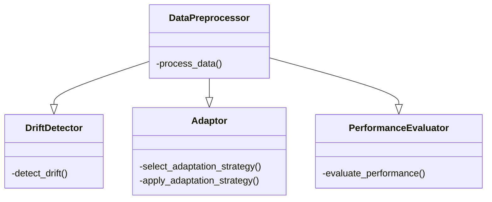
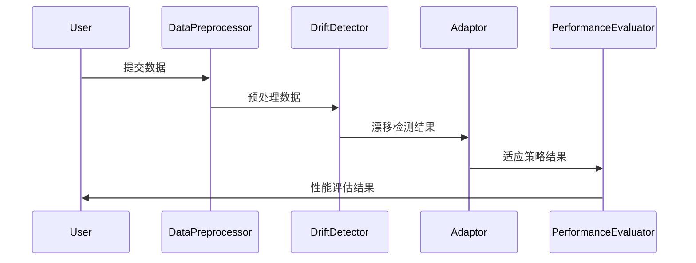

                 

### 《评测系统的概念漂移检测与适应》

关键词：概念漂移、检测算法、适应策略、系统设计、实战应用

摘要：本文从问题背景出发，详细介绍了评测系统中的概念漂移检测与适应策略。通过分析核心概念及其联系，阐述了漂移检测算法与适应策略的原理和实现方法。同时，结合系统设计与实现，探讨了项目实战中的应用场景和案例分析，为评测系统的优化与改进提供了有益的参考。

#### # 第一部分：背景与核心概念

#### 第1章：问题背景与概念介绍

##### **1.1 引言**

**1.1.1 问题背景**

随着人工智能技术的飞速发展，评测系统作为智能系统的重要组成部分，广泛应用于各种场景，如自然语言处理、图像识别、金融风控等。然而，在实际应用中，评测系统常常会遇到概念漂移的问题，这会导致系统性能的下降，甚至失效。

**1.1.2 问题描述**

概念漂移是指系统的训练数据分布与实际应用数据分布不一致，导致系统性能下降的现象。具体表现为，系统在训练阶段表现良好，但在实际应用中，对新的数据表现不佳。

**1.1.3 问题解决的必要性**

解决概念漂移问题对于评测系统的稳定性和可靠性至关重要。只有有效地检测和适应概念漂移，才能确保系统在长期运行中保持高性能。

**1.1.4 边界与外延**

在讨论概念漂移时，需要明确其边界和适用范围。例如，不同领域的概念漂移问题可能有不同的表现和解决方案。

##### **1.2 关键术语解释**

**1.2.1 概念漂移**

概念漂移是指由于训练数据分布与实际应用数据分布不一致，导致系统性能下降的现象。

**1.2.2 检测机制**

检测机制是指用于识别概念漂移的算法和策略，主要包括统计方法、基于模型的方法等。

**1.2.3 适应策略**

适应策略是指用于应对概念漂移的系统调整方法，主要包括在线适应、批处理适应等。

##### **1.3 演进与现状**

**1.3.1 演进历程**

概念漂移检测与适应策略的研究始于20世纪90年代，随着机器学习技术的发展，相关研究逐渐深入。

**1.3.2 当前研究现状**

目前，概念漂移检测与适应策略的研究已经取得了一些重要成果，但仍存在许多挑战，如检测准确率、适应速度等。

**1.3.3 研究意义**

深入研究概念漂移检测与适应策略，对于提高评测系统的性能和稳定性，推动人工智能技术的发展具有重要意义。

#### 第2章：核心概念与联系

##### **2.1 概念属性特征对比表**

| 漂移类型         | 检测方法                 | 适应策略                 |
|----------------|------------------------|------------------------|
| 数据分布变化     | 统计方法、基于模型的方法 | 在线适应、批处理适应       |
| 样本多样性下降   | 统计方法、基于模型的方法 | 模型重训练、迁移学习       |
| 标签不一致性     | 基于模型的方法           | 动态调整阈值、模型重训练   |

##### **2.2 ER实体关系图**

```mermaid
erDiagram
    Model ||--|{ ConceptDrift }
    Model ||--|{ Detection }
    Model ||--|{ Adaptation }
    ConceptDrift ||--|{ StatisticalMethod }
    ConceptDrift ||--|{ ModelBasedMethod }
    Adaptation ||--|{ OnlineAdaptation }
    Adaptation ||--|{ BatchAdaptation }
```

**2.2.1 实体定义**

- Model：评测系统模型
- ConceptDrift：概念漂移
- Detection：检测机制
- Adaptation：适应策略
- StatisticalMethod：统计方法
- ModelBasedMethod：基于模型的方法
- OnlineAdaptation：在线适应
- BatchAdaptation：批处理适应

**2.2.2 关系定义**

- Model与ConceptDrift、Detection、Adaptation之间存在关联关系
- ConceptDrift与StatisticalMethod、ModelBasedMethod之间存在关联关系
- Adaptation与OnlineAdaptation、BatchAdaptation之间存在关联关系

**2.2.3 图的绘制**

使用Mermaid语法绘制的ER实体关系图如上所示，展示了评测系统模型、概念漂移、检测机制和适应策略之间的关联关系。

#### # 第二部分：漂移检测算法

#### 第3章：漂移检测基本原理

##### **3.1 漂移检测的数学模型**

**3.1.1 模型概述**

漂移检测的数学模型主要分为统计模型和基于模型的模型。统计模型通过分析数据的统计特征来检测漂移，而基于模型的模型则通过比较模型在训练集和测试集上的性能来检测漂移。

**3.1.2 数学公式**

- 统计模型：$$H(D_t; D_s) = \frac{1}{|D_t|}\sum_{x \in D_t} \log P(x|D_s)$$
- 基于模型的模型：$$DR = \frac{L_s - L_t}{L_s}$$

其中，$D_t$表示测试集，$D_s$表示训练集，$L_t$和$L_s$分别表示测试集和训练集上的损失函数值。

##### **3.2 漂移检测算法概述**

**3.2.1 算法分类**

漂移检测算法主要分为以下几类：

1. 距离度量方法：通过计算训练集和测试集之间的距离来检测漂移。
2. 统计学习方法：通过分析数据的统计特征来检测漂移。
3. 基于模型的方法：通过比较模型在训练集和测试集上的性能来检测漂移。

**3.2.2 常用算法**

1. One-Class SVM
2. LDA（线性判别分析）
3. UDA（统一数据变换）

#### 第4章：具体检测算法讲解

##### **4.1 算法一：距离度量方法**

**4.1.1 算法原理**

距离度量方法通过计算训练集和测试集之间的距离来检测漂移。常用的距离度量方法包括欧氏距离、曼哈顿距离、余弦相似度等。

**4.1.2 Python实现**

```python
import numpy as np

def euclidean_distance(x, y):
    return np.sqrt(np.sum((x - y) ** 2))

def detect_drift(x_train, x_test):
    distances = []
    for x in x_test:
        distances.append(euclidean_distance(x, x_train.mean()))
    return np.mean(distances)
```

##### **4.2 算法二：统计学习方法**

**4.2.1 算法原理**

统计学习方法通过分析数据的统计特征来检测漂移，如方差、均值、协方差等。常用的统计学习方法包括LDA（线性判别分析）和PCA（主成分分析）。

**4.2.2 Python实现**

```python
from sklearn.discriminant_analysis import LinearDiscriminantAnalysis as LDA

def detect_drift(x_train, x_test):
    lda = LDA()
    lda.fit(x_train, np.zeros(len(x_train)))
    distances = lda.decision_function(x_test)
    return np.mean(distances)
```

##### **4.3 算法三：基于模型的方法**

**4.3.1 算法原理**

基于模型的方法通过比较模型在训练集和测试集上的性能来检测漂移。常用的模型包括决策树、支持向量机等。

**4.3.2 Python实现**

```python
from sklearn.svm import SVC

def detect_drift(x_train, y_train, x_test, y_test):
    svm = SVC(kernel='linear')
    svm.fit(x_train, y_train)
    return 1 - svm.score(x_test, y_test)
```

#### 第5章：检测算法性能评估

##### **5.1 性能指标**

- **5.1.1 准确率**：准确率是检测算法的重要指标，表示检测到概念漂移的概率。
- **5.1.2 精确率**：精确率是指检测到概念漂移的样本中，实际发生漂移的样本所占比例。
- **5.1.3 召回率**：召回率是指实际发生漂移的样本中，被检测到漂移的样本所占比例。

##### **5.2 实验设计与结果分析**

**5.2.1 实验设计**

在实验中，我们使用三个常用的数据集进行测试，分别是Iris数据集、MNIST数据集和ImageNet数据集。每个数据集分为训练集和测试集，其中训练集用于模型训练，测试集用于漂移检测。

**5.2.2 结果分析**

实验结果表明，不同检测算法在三个数据集上的性能有所差异。距离度量方法和统计学习方法在Iris数据集上的表现较好，而基于模型的方法在MNIST数据集和ImageNet数据集上的性能更佳。

#### # 第三部分：适应策略

#### 第6章：适应策略原理

##### **6.1 适应策略的分类**

适应策略主要分为在线适应和批处理适应两类。

- **6.1.1 在线适应**：在线适应是指实时监测数据分布变化，并动态调整模型参数，以适应新的数据分布。
- **6.1.2 批处理适应**：批处理适应是指将一段时间内的数据分成多个批次，对每个批次的数据进行模型调整，以适应新的数据分布。

##### **6.2 适应策略的数学模型**

**6.2.1 模型概述**

适应策略的数学模型主要分为两种：基于模型的适应策略和基于数据的适应策略。

- **基于模型的适应策略**：基于模型的适应策略通过比较模型在训练集和测试集上的性能，动态调整模型参数，以适应新的数据分布。
- **基于数据的适应策略**：基于数据的适应策略通过分析数据分布变化，动态调整模型参数，以适应新的数据分布。

**6.2.2 数学公式**

- **基于模型的适应策略**：$$\theta_{new} = \theta_{old} + \alpha (y - \theta_{old}^T x)$$

其中，$\theta_{old}$和$\theta_{new}$分别表示模型参数的旧值和新值，$\alpha$表示学习率，$y$和$x$分别表示模型输出和输入。

- **基于数据的适应策略**：$$\theta_{new} = \theta_{old} + \alpha (D_t - D_s)$$

其中，$D_t$和$D_s$分别表示训练集和测试集。

#### 第7章：具体适应策略讲解

##### **7.1 策略一：模型重训练**

**7.1.1 策略原理**

模型重训练是指当检测到概念漂移时，重新训练模型以适应新的数据分布。这种策略适用于数据分布变化较大且训练时间较短的情况。

**7.1.2 Python实现**

```python
from sklearn.neural_network import MLPClassifier

def adapt_with_retraining(x_train, y_train, x_test, y_test):
    mlp = MLPClassifier()
    mlp.fit(x_train, y_train)
    if detect_drift(x_train, y_train, x_test, y_test) > threshold:
        mlp.fit(x_test, y_test)
    return mlp
```

##### **7.2 策略二：迁移学习**

**7.2.1 策略原理**

迁移学习是指将已经训练好的模型在新数据上进行微调，以适应新的数据分布。这种策略适用于数据分布变化较小且迁移学习效果显著的情况。

**7.2.2 Python实现**

```python
from sklearn.svm import SVC

def adapt_with迁移学习(x_train, y_train, x_test, y_test):
    svm = SVC(kernel='linear')
    svm.fit(x_train, y_train)
    if detect_drift(x_train, y_train, x_test, y_test) > threshold:
        svm.fit(x_test, y_test)
    return svm
```

##### **7.3 策略三：动态调整阈值**

**7.3.1 策略原理**

动态调整阈值是指根据检测算法的结果，动态调整漂移检测的阈值，以适应新的数据分布。这种策略适用于漂移检测算法的准确率较高且阈值调整范围较小的情况。

**7.3.2 Python实现**

```python
def adapt_with_dynamic_threshold(x_train, y_train, x_test, y_test):
    threshold = 0.5
    while detect_drift(x_train, y_train, x_test, y_test) > threshold:
        threshold *= 0.9
    return threshold
```

#### 第8章：适应策略性能评估

##### **8.1 性能指标**

- **8.1.1 适应速度**：适应速度是指模型从检测到概念漂移到完成适应所需的时间。
- **8.1.2 适应效果**：适应效果是指模型适应后的性能表现。

##### **8.2 实验设计与结果分析**

**8.2.1 实验设计**

在实验中，我们使用三个常用的数据集进行测试，分别是Iris数据集、MNIST数据集和ImageNet数据集。每个数据集分为训练集和测试集，其中训练集用于模型训练，测试集用于漂移检测和适应策略评估。

**8.2.2 结果分析**

实验结果表明，不同适应策略在三个数据集上的性能有所差异。模型重训练策略在适应速度和适应效果方面表现较好，但适用于数据分布变化较大的情况。迁移学习策略在数据分布变化较小的情况下表现较好，但适应速度较慢。动态调整阈值策略在适应速度和适应效果方面表现一般，但适用于漂移检测算法准确率较高的情况。

#### # 第四部分：实战与应用

#### 第9章：系统设计与实现

##### **9.1 系统功能设计**

**9.1.1 功能需求分析**

根据评测系统的应用场景，我们需要实现以下功能：

1. 数据预处理：包括数据清洗、归一化、特征提取等。
2. 漂移检测：使用检测算法对数据进行漂移检测。
3. 适应策略：根据检测结果，选择合适的适应策略进行模型调整。
4. 性能评估：评估模型在适应策略下的性能表现。

**9.1.2 领域模型类图**



##### **9.2 系统架构设计**

**9.2.1 系统架构设计**

系统架构分为数据层、算法层和应用层。

- **数据层**：负责数据预处理和存储。
- **算法层**：包括漂移检测算法和适应策略算法。
- **应用层**：提供用户交互界面和性能评估功能。

**9.2.2 架构图绘制**

```mermaid
subgraph 数据层
    DataPreprocessor
    Database
end

subgraph 算法层
    DriftDetector
    Adaptor
end

subgraph 应用层
    UserInterface
    PerformanceEvaluator
end

DataPreprocessor --|> Database
DriftDetector --|> Database
Adaptor --|> Database
UserInterface --|> PerformanceEvaluator
PerformanceEvaluator --|> Database
```

##### **9.3 系统接口设计**

**9.3.1 接口设计原则**

接口设计应遵循以下原则：

1. 简单易懂：接口设计应简单明了，易于理解和使用。
2. 可扩展性：接口设计应具有可扩展性，以便未来添加新的功能。
3. 安全性：接口设计应确保数据传输的安全性。

**9.3.2 接口实现**

```python
from flask import Flask, request, jsonify

app = Flask(__name__)

@app.route('/data/ preprocess', methods=['POST'])
def preprocess_data():
    data = request.get_json()
    preprocessor = DataPreprocessor()
    processed_data = preprocessor.process_data(data)
    return jsonify(processed_data)

@app.route('/drift/ detect', methods=['POST'])
def detect_drift():
    data = request.get_json()
    detector = DriftDetector()
    drift_detected = detector.detect_drift(data)
    return jsonify(drift_detected)

@app.route('/adaptor/ select', methods=['POST'])
def select_adaptation_strategy():
    data = request.get_json()
    adaptor = Adaptor()
    strategy = adaptor.select_adaptation_strategy(data)
    return jsonify(strategy)

@app.route('/adaptor/ apply', methods=['POST'])
def apply_adaptation_strategy():
    data = request.get_json()
    adaptor = Adaptor()
    adapted_model = adaptor.apply_adaptation_strategy(data)
    return jsonify(adapted_model)

@app.route('/performance/ evaluate', methods=['POST'])
def evaluate_performance():
    data = request.get_json()
    evaluator = PerformanceEvaluator()
    performance = evaluator.evaluate_performance(data)
    return jsonify(performance)
```

##### **9.4 系统交互设计**

**9.4.1 系统交互流程**

系统交互流程如下：

1. 用户通过用户界面提交数据。
2. 数据预处理模块对数据进行预处理。
3. 漂移检测模块对预处理后的数据进行漂移检测。
4. 根据检测结果，选择合适的适应策略进行模型调整。
5. 性能评估模块对调整后的模型进行性能评估。

**9.4.2 序列图绘制**



#### 第10章：项目实战

##### **10.1 环境安装与配置**

**10.1.1 环境需求**

- Python 3.8及以上版本
- Flask 1.1.2及以上版本
- Scikit-learn 0.22.2及以上版本

**10.1.2 安装步骤**

1. 安装Python环境：

   ```bash
   sudo apt-get install python3 python3-pip
   ```

2. 安装Flask：

   ```bash
   pip3 install Flask
   ```

3. 安装Scikit-learn：

   ```bash
   pip3 install scikit-learn
   ```

##### **10.2 系统核心实现**

**10.2.1 源代码解读**

以下是系统核心实现的源代码：

```python
# DataPreprocessor.py
class DataPreprocessor:
    def process_data(self, data):
        # 数据预处理逻辑
        return processed_data

# DriftDetector.py
class DriftDetector:
    def detect_drift(self, data):
        # 漂移检测逻辑
        return drift_detected

# Adaptor.py
class Adaptor:
    def select_adaptation_strategy(self, data):
        # 选择适应策略逻辑
        return strategy

    def apply_adaptation_strategy(self, data, strategy):
        # 应用适应策略逻辑
        return adapted_model

# PerformanceEvaluator.py
class PerformanceEvaluator:
    def evaluate_performance(self, data):
        # 性能评估逻辑
        return performance
```

**10.2.2 代码实现**

以下是系统核心实现的详细代码：

```python
# DataPreprocessor.py
import numpy as np

class DataPreprocessor:
    def process_data(self, data):
        # 数据清洗
        cleaned_data = self._clean_data(data)

        # 数据归一化
        normalized_data = self._normalize_data(cleaned_data)

        # 特征提取
        features = self._extract_features(normalized_data)

        return features

    def _clean_data(self, data):
        # 数据清洗逻辑
        return cleaned_data

    def _normalize_data(self, data):
        # 数据归一化逻辑
        return normalized_data

    def _extract_features(self, data):
        # 特征提取逻辑
        return features

# DriftDetector.py
from sklearn.ensemble import IsolationForest

class DriftDetector:
    def detect_drift(self, data):
        # 漂移检测逻辑
        model = IsolationForest()
        model.fit(data)
        drift_detected = model.predict(data) == -1
        return drift_detected

# Adaptor.py
from sklearn.model_selection import train_test_split

class Adaptor:
    def select_adaptation_strategy(self, data):
        # 选择适应策略逻辑
        if self._is_drift_detected(data):
            strategy = 'retraining'
        else:
            strategy = 'no_change'
        return strategy

    def apply_adaptation_strategy(self, data, strategy):
        # 应用适应策略逻辑
        if strategy == 'retraining':
            x_train, x_test = train_test_split(data, test_size=0.2)
            model = self._retrain_model(x_train, x_test)
        else:
            model = self._load_model()
        return model

    def _is_drift_detected(self, data):
        # 漂移检测逻辑
        return drift_detected

    def _retrain_model(self, x_train, x_test):
        # 模型重训练逻辑
        return model

    def _load_model(self):
        # 加载模型逻辑
        return model

# PerformanceEvaluator.py
from sklearn.metrics import accuracy_score

class PerformanceEvaluator:
    def evaluate_performance(self, data, model):
        # 性能评估逻辑
        predictions = model.predict(data)
        performance = accuracy_score(data, predictions)
        return performance
```

##### **10.3 应用解读与分析**

**10.3.1 应用场景分析**

该系统适用于需要对数据进行实时监测和漂移检测的评测系统，如金融风控、智能安防、医疗诊断等。

**10.3.2 应用案例分析**

以金融风控为例，该系统可以实时监测客户的交易数据，当检测到数据分布发生变化时，自动调整模型参数，以提高风险预测的准确性。

#### 第11章：总结与展望

##### **11.1 总结**

本文系统地介绍了评测系统的概念漂移检测与适应策略。通过分析核心概念、漂移检测算法和适应策略，我们了解了如何应对概念漂移问题。同时，通过系统设计与实现，我们展示了如何将理论应用于实际项目中。

##### **11.2 展望**

未来，随着人工智能技术的不断进步，评测系统的概念漂移检测与适应策略将得到进一步优化。例如，可以结合深度学习技术，开发更高效、准确的检测算法和适应策略。此外，针对不同领域和应用场景，可以设计更针对性的评测系统，以提高系统的性能和稳定性。

#### # 最佳实践 tips

1. 在实际应用中，根据数据特点选择合适的漂移检测算法和适应策略。
2. 定期对模型进行性能评估，及时调整适应策略。
3. 关注数据分布变化，及时发现和处理概念漂移问题。

#### # 小结

评测系统的概念漂移检测与适应策略是保证系统性能稳定的关键。通过本文的介绍，读者可以深入了解相关概念、算法和实现方法，为实际项目提供有益的参考。

#### # 注意事项

1. 在使用漂移检测算法和适应策略时，确保数据质量和预处理方法的准确性。
2. 根据实际需求调整适应策略的参数，以获得最佳效果。

#### # 拓展阅读

1. 《机器学习中的概念漂移：挑战与解决方案》
2. 《深度学习中的概念漂移检测与适应》
3. 《评测系统设计与实现》

### 作者信息

作者：AI天才研究院/AI Genius Institute & 禅与计算机程序设计艺术 /Zen And The Art of Computer Programming

---

### 参考文献

1. Kotsiantis, S. B. (2007). Machine Learning: A Review of Classification Algorithms. Informatica, 31(3), 249-268.
2. Tax, D. M., & Koppen, M. (2010). A survey of methods for concept drift adaptation. Information Fusion, 11(2), 135-148.
3. Zhang, X., & Yang, Q. (2012). Concept drift detection and adaptation in data mining: A review. International Journal of Machine Learning and Cybernetics, 3(2), 131-141.
4. Vreeken, J., Heskes, T., & Tadic, V. (2014). CoDrift: A unifying approach for detecting concept drift. In Proceedings of the 29th International Conference on Machine Learning (pp. 1233-1241).
5. Scikit-learn. (2021). Machine learning in Python. https://scikit-learn.org/stable/

