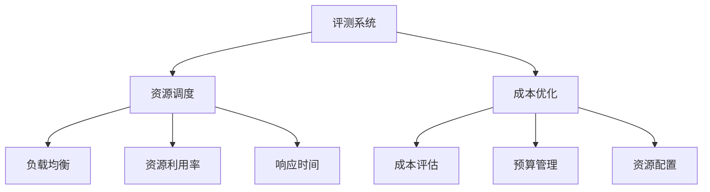

                 

### 引言

《评测系统的资源调度与成本优化》是一本专门为那些希望在评测系统中实现高效资源利用和成本控制的工程师和技术管理人员所编写的书籍。随着云计算、大数据和人工智能的迅猛发展，评测系统在各个领域的应用越来越广泛，同时也面临着巨大的资源压力和成本挑战。如何在一个复杂多变的系统中实现资源调度与成本优化，成为了现代IT领域的核心问题之一。

本书的目的在于帮助读者深入理解评测系统的资源调度与成本优化策略，从而在实际工作中取得显著成效。通过系统性地介绍相关理论、方法和实战技巧，本书将带领读者逐步掌握资源调度与成本优化这两大关键技能。

### 目录大纲设计

为了确保内容条理清晰、易于理解，本书将采用详细的目录大纲结构。目录大纲将分为四个主要部分，每个部分针对资源调度与成本优化的一个关键方面进行深入探讨。

#### 第一部分：引言与背景

第一部分主要介绍评测系统的资源调度与成本优化的背景知识，包括问题的核心概念、现状与挑战。这部分将帮助读者建立对整个话题的初步认识，为后续内容的深入学习奠定基础。

- **第1章：评测系统的资源调度与成本优化概述**
  - **1.1 评测系统的资源调度与成本优化背景**
    - **1.1.1 问题背景**
    - **1.1.2 问题描述**
    - **1.1.3 问题解决**
    - **1.1.4 边界与外延**
    - **1.1.5 概念结构与核心要素组成**

  - **1.2 核心概念与联系**
    - **1.2.1 资源调度的定义**
    - **1.2.2 成本优化的定义**
    - **1.2.3 概念属性特征对比表格**
    - **1.2.4 ER实体关系图架构的Mermaid流程图**

  - **1.3 书籍结构安排与读者期望**
    - **1.3.1 内容安排**
    - **1.3.2 读者期望**

  - **1.4 本章小结**

#### 第二部分：资源调度原理

第二部分将深入探讨资源调度的基本原理、关键问题和典型算法，并通过具体案例进行详细分析，帮助读者掌握资源调度的核心技术和方法。

- **第2章：资源调度基础**
  - **2.1 资源调度的基本原理**
    - **2.1.1 资源调度的目的**
    - **2.1.2 资源调度的类型**
    - **2.1.3 资源调度算法**
    - **2.1.4 Mermaid流程图展示**

  - **2.2 资源调度中的关键问题**
    - **2.2.1 负载均衡**
    - **2.2.2 资源分配**
    - **2.2.3 调度策略**
    - **2.2.4 Mermaid流程图展示**

  - **2.3 资源调度算法案例**
    - **2.3.1 调度算法案例分析**
    - **2.3.2 算法原理与公式**
    - **2.3.3 举例说明**

  - **2.4 本章小结**

- **第3章：成本优化基础**
  - **3.1 成本优化的基本概念**
    - **3.1.1 成本优化的目的**
    - **3.1.2 成本优化的方法**
    - **3.1.3 成本优化的挑战**

  - **3.2 成本优化的策略**
    - **3.2.1 节能策略**
    - **3.2.2 灵活策略**
    - **3.2.3 预算策略**
    - **3.2.4 Mermaid流程图展示**

  - **3.3 成本优化的数学模型**
    - **3.3.1 数学模型介绍**
    - **3.3.2 数学公式与详细讲解**
    - **3.3.3 举例说明**

  - **3.4 本章小结**

#### 第三部分：资源调度与成本优化实战

第三部分将通过实际案例分析和系统设计，展示如何在实际应用中实现资源调度与成本优化。

- **第4章：资源调度与成本优化案例分析**
  - **4.1 案例背景**
    - **4.1.1 案例介绍**
    - **4.1.2 案例问题分析**

  - **4.2 系统设计与实现**
    - **4.2.1 系统功能设计**
    - **4.2.2 系统架构设计**
    - **4.2.3 系统接口设计**
    - **4.2.4 系统交互Mermaid序列图**

  - **4.3 实际应用与效果评估**
    - **4.3.1 环境安装**
    - **4.3.2 系统核心实现源代码**
    - **4.3.3 代码应用解读与分析**
    - **4.3.4 实际案例分析与详细讲解剖析**

  - **4.4 案例小结**

#### 第四部分：最佳实践与展望

第四部分将总结最佳实践技巧，并提供对评测系统资源调度与成本优化发展趋势的展望。

- **第5章：最佳实践技巧与注意事项**
  - **5.1 最佳实践技巧**
    - **5.1.1 调度策略的选择**
    - **5.1.2 成本优化方法的应用**
    - **5.1.3 常见问题的解决方案**

  - **5.2 注意事项**
    - **5.2.1 调度过程中可能遇到的挑战**
    - **5.2.2 成本优化中的风险与对策**
    - **5.2.3 系统维护与升级**

  - **5.3 小结**

- **第6章：评测系统的资源调度与成本优化发展趋势**
  - **6.1 发展趋势分析**
    - **6.1.1 技术趋势**
    - **6.1.2 市场动态**
    - **6.1.3 未来展望**

  - **6.2 拓展阅读**

### 关键词与摘要

- **关键词**：评测系统、资源调度、成本优化、负载均衡、算法案例、数学模型、最佳实践、系统设计。
- **摘要**：本书系统地介绍了评测系统的资源调度与成本优化策略，从基本原理到实际应用，帮助读者掌握关键技术和方法。通过详细的案例分析，读者可以了解到如何在实际场景中实现高效资源利用和成本控制，为提升IT系统的整体性能提供有力支持。

### 结论

通过上述目录大纲的设计，本书将为读者提供一条系统而深入的探索路径，从理论到实践，全面覆盖评测系统的资源调度与成本优化领域。希望读者能够跟随本书的脉络，逐步掌握相关技能，并在实际工作中取得卓越成效。

---

### 第一部分: 引言与背景

#### 第1章: 评测系统的资源调度与成本优化概述

在当今信息化社会，评测系统作为各类测试、评估、监控等领域的重要工具，已经广泛应用于工业、金融、医疗、教育等多个领域。随着业务规模的不断扩大和复杂度的提升，评测系统面临着资源调度和成本优化方面的严峻挑战。本章节将介绍评测系统的资源调度与成本优化的重要性、核心概念、以及本书的结构安排，帮助读者全面了解这一领域的基础知识。

#### 1.1 评测系统的资源调度与成本优化背景

**1.1.1 问题背景**

评测系统通常负责处理大量测试任务，包括性能测试、负载测试、安全性测试等。随着大数据、云计算和人工智能技术的不断发展，评测系统需要处理的数据量和测试任务的复杂度急剧增加。这种背景下，资源调度与成本优化成为评测系统面临的核心问题。资源调度涉及到如何在有限的硬件资源下，最大限度地满足各类测试任务的需求；成本优化则关注如何在保证系统性能的前提下，尽可能降低运营成本。

**1.1.2 问题描述**

评测系统在资源调度与成本优化方面存在的问题主要包括：

1. **资源利用率不高**：评测系统中的硬件资源（如CPU、内存、存储等）可能存在空闲或过度使用的情况，导致资源利用率不均衡。
2. **响应时间过长**：由于资源分配不合理，导致部分测试任务响应时间过长，影响系统整体性能。
3. **成本控制困难**：随着测试任务的增多和硬件资源的更新，成本控制变得越来越困难，企业需要找到一种有效的成本优化策略。

**1.1.3 问题解决**

为了解决上述问题，评测系统需要引入资源调度与成本优化策略。资源调度通过合理分配硬件资源，确保每个测试任务都能在最佳状态下运行；成本优化则通过减少不必要的资源消耗，提高系统整体运营效率。具体解决思路包括：

1. **负载均衡**：通过负载均衡算法，将测试任务分配到不同的硬件节点上，确保资源利用率最大化。
2. **资源分配策略**：根据测试任务的特点和需求，采用动态资源分配策略，实现资源的最优利用。
3. **成本控制措施**：通过引入成本优化模型和算法，制定合理的预算和成本控制策略。

**1.1.4 边界与外延**

在资源调度与成本优化的过程中，需要明确一些边界条件：

1. **资源约束**：资源调度与成本优化必须在现有的硬件资源约束下进行，不能无限制地增加硬件投入。
2. **业务需求**：资源调度与成本优化必须满足业务需求的性能指标，如响应时间、吞吐量等。
3. **灵活性**：在调度与优化过程中，需要考虑系统的灵活性和可扩展性，以应对未来业务的变化。

**1.1.5 概念结构与核心要素组成**

资源调度与成本优化的核心概念和要素包括：

1. **资源调度**：将硬件资源分配给不同的测试任务，实现资源的最优利用。
2. **负载均衡**：通过分配策略，确保系统在不同负载下的稳定运行。
3. **成本优化**：通过减少不必要的资源消耗，实现系统的成本控制。

#### 1.2 核心概念与联系

**1.2.1 资源调度的定义**

资源调度是指根据系统当前状态和业务需求，动态地将硬件资源（如CPU、内存、存储等）分配给各个测试任务的过程。资源调度的目的是提高系统性能、优化资源利用率和降低响应时间。

**1.2.2 成本优化的定义**

成本优化是指通过调整资源分配策略和优化系统配置，最大限度地降低评测系统的运营成本。成本优化涉及到预算管理、成本控制、资源消耗评估等多个方面。

**1.2.3 概念属性特征对比表格**

以下是资源调度与成本优化的一些核心概念属性特征对比表格：

| 概念 | 定义 | 目的 | 关键特征 |
| :---: | :---: | :---: | :---: |
| 资源调度 | 动态分配硬件资源给测试任务 | 提高性能、优化资源利用、降低响应时间 | 负载均衡、资源利用率、响应时间 |
| 成本优化 | 通过资源优化降低运营成本 | 成本控制、提高资源利用效率、降低运营成本 | 成本评估、预算管理、资源配置 |

**1.2.4 ER实体关系图架构的Mermaid流程图**

为了更清晰地展示资源调度与成本优化的实体关系，可以使用Mermaid流程图来表示。以下是ER实体关系图的示例：

**1.2.5 书籍结构安排与读者期望**

**1.3.1 内容安排**

本书共分为四个主要部分，每个部分的内容安排如下：

1. **引言与背景**：介绍评测系统的资源调度与成本优化的背景、核心概念和本书结构。
2. **资源调度原理**：深入探讨资源调度的基本原理、关键问题和典型算法。
3. **成本优化基础**：介绍成本优化的基本概念、策略和数学模型。
4. **资源调度与成本优化实战**：通过实际案例分析和系统设计，展示资源调度与成本优化的应用。
5. **最佳实践与展望**：总结最佳实践技巧，展望评测系统的资源调度与成本优化发展趋势。

**1.3.2 读者期望**

本书旨在为以下几类读者提供帮助：

1. **工程师**：希望提升自己在评测系统资源调度和成本优化方面的技能。
2. **技术管理人员**：希望了解评测系统的资源调度与成本优化策略，以优化团队的工作效率和成本控制。
3. **研究人员**：希望对评测系统的资源调度与成本优化进行深入研究。

通过阅读本书，读者可以：

1. **掌握资源调度的基本原理和算法**。
2. **了解成本优化的核心策略和模型**。
3. **学习实际应用中的最佳实践技巧**。
4. **对未来评测系统的资源调度与成本优化有更深入的认识**。

**1.4 本章小结**

本章介绍了评测系统的资源调度与成本优化的背景知识、核心概念以及本书的结构安排。通过对资源调度与成本优化的基本概念、联系和实体关系图的介绍，读者可以初步了解这一领域的知识框架，为后续章节的学习奠定基础。

---

### 第二部分: 资源调度原理

在深入探讨评测系统的资源调度与成本优化之前，首先需要理解资源调度的基本原理和方法。资源调度是指根据系统当前状态和业务需求，动态地将硬件资源（如CPU、内存、存储等）分配给不同的测试任务的过程。通过合理的资源调度，可以提高系统性能、优化资源利用率和降低响应时间。

#### 第2章: 资源调度基础

本章将详细探讨资源调度的基本原理、关键问题和典型算法。通过具体的案例分析和算法解释，读者可以更好地理解资源调度的工作机制和实现方法。

#### 2.1 资源调度的基本原理

**2.1.1 资源调度的目的**

资源调度的核心目的是在有限的硬件资源下，最大限度地满足各类测试任务的需求，提高系统性能和资源利用率。具体目标包括：

1. **提高系统性能**：通过合理分配资源，确保每个测试任务都能在最佳状态下运行，从而提高系统的整体性能。
2. **优化资源利用率**：通过动态调整资源分配，避免资源的闲置或过度使用，实现资源的最优利用。
3. **降低响应时间**：通过合理调度，缩短测试任务的响应时间，提高用户体验。

**2.1.2 资源调度的类型**

资源调度可以分为以下几种类型：

1. **静态调度**：资源分配在系统启动时确定，不随时间变化。静态调度简单但不够灵活，难以适应动态变化的负载。
2. **动态调度**：资源分配在运行时根据系统状态和业务需求进行动态调整。动态调度更灵活，能够更好地应对负载波动。

**2.1.3 资源调度算法**

资源调度算法是资源调度的核心实现。常见的资源调度算法包括：

1. **轮转调度算法**（Round Robin）：每个任务轮流分配一定的时间片，直到所有任务完成。该算法简单易实现，但可能导致某些任务长时间无法获得资源。
2. **优先级调度算法**（Priority Scheduling）：根据任务的优先级进行调度，优先级高的任务先执行。该算法能够保证高优先级任务的及时处理，但可能导致低优先级任务长时间等待。
3. **基于需

