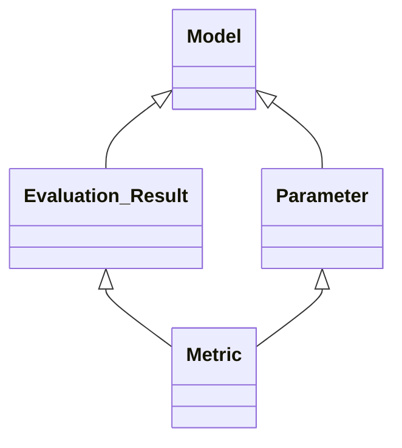
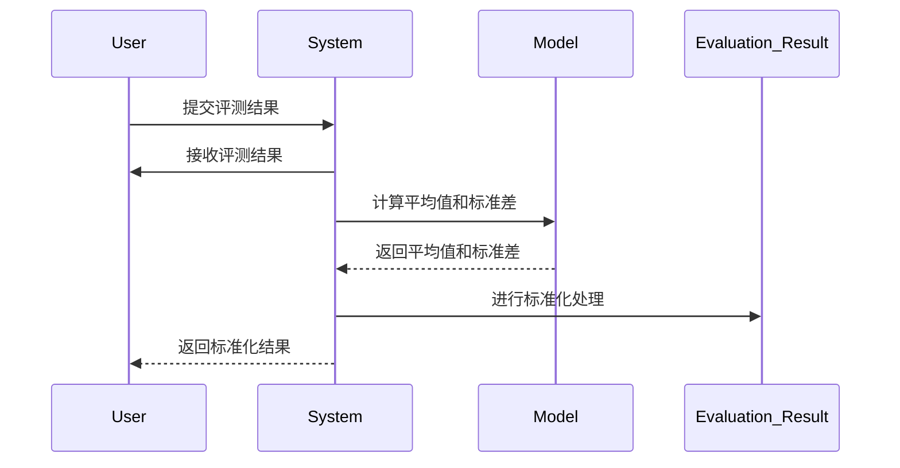
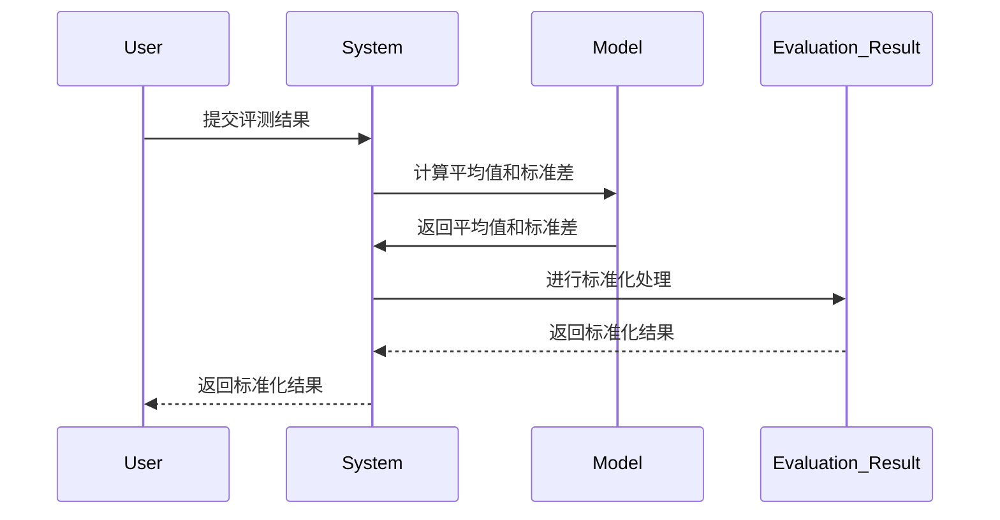

                 

# 评测结果的跨模型标准化处理

关键词：评测结果标准化、跨模型评测、算法原理、系统设计与实现、最佳实践

摘要：本文将深入探讨评测结果的跨模型标准化处理，从背景与基础、核心概念与联系、算法原理讲解、系统分析与架构设计、实现与案例分析、最佳实践与展望等几个方面进行详细阐述。通过本文的阅读，读者将能够理解评测结果跨模型标准化处理的重要性和原理，掌握相关算法和系统设计的实际应用。

## 第一部分：背景与基础

### 1.1 评测结果跨模型标准化处理的重要性

随着人工智能技术的飞速发展，评测结果跨模型标准化处理成为了研究和应用中的重要问题。在实际应用中，不同的模型往往会产生不同的评测结果，这些结果具有不同的量纲和单位，缺乏可比性。因此，为了对不同的评测结果进行有效的分析和比较，跨模型标准化处理显得尤为重要。

### 1.2 相关概念介绍

在讨论评测结果跨模型标准化处理之前，需要了解一些核心概念。这些概念包括评测结果、标准化、跨模型评测等。评测结果是指通过某种评估方法对模型性能进行评估的结果；标准化是指将具有不同量纲和单位的数值转化为具有相同量纲和单位的数值，以便进行有效的分析和比较；跨模型评测是指对多个模型进行评测，并将评测结果进行对比和分析。

### 1.3 跨模型标准化的边界与外延

跨模型标准化的边界涉及到如何处理具有不同量纲和单位的评测结果。具体来说，边界包括以下方面：

1. **量纲一致性**：确保评测结果具有相同的量纲，如将不同模型的评测结果统一为相同的时间、空间等物理量。
2. **数值一致性**：确保评测结果的数值具有可比性，如通过归一化方法将不同模型的评测结果转化为相同的比例或百分比。
3. **误差一致性**：确保评测结果的误差范围具有可比性，如通过标准差或置信区间等方法对评测结果的误差进行标准化。

跨模型标准化的外延则涉及到如何将标准化的评测结果应用于实际应用中，如优化模型选择、评估模型性能、比较不同模型之间的优劣等。

## 第二部分：核心概念与联系

### 2.1 评测结果标准化方法

评测结果标准化方法主要包括以下几种：

1. **归一化**：将评测结果按照一定比例缩放到0-1之间，便于比较。
2. **标准化**：根据评测结果的平均值和标准差，将评测结果转化为标准分数，使得不同评测结果具有相同的基准。
3. **归一化加权重**：在归一化的基础上，为不同评测结果分配不同的权重，以反映它们的重要程度。

### 2.2 跨模型评测方法

跨模型评测方法主要包括以下几种：

1. **直接比较**：直接比较不同模型的评测结果，通常通过计算评测结果的平均值和标准差来进行。
2. **加权比较**：为不同模型的评测结果分配不同的权重，然后进行比较，以反映不同模型的重要程度。
3. **多模型集成**：通过集成多个模型的评测结果，生成一个综合评估结果，以提高评估的准确性。

### 2.3 概念属性特征对比表格

概念属性特征对比表格是一种有效的工具，用于比较不同概念或模型的属性特征。以下是一个示例表格：

| 概念/模型 | 属性1 | 属性2 | 属性3 | ... |
| --------- | ----- | ----- | ----- | --- |
| 模型A     | 值1   | 值2   | 值3   | ... |
| 模型B     | 值1   | 值2   | 值3   | ... |
| ...       | ...   | ...   | ...   | ... |

### 2.4 ER实体关系图

ER实体关系图是一种用于描述实体之间关系的图形化工具。以下是一个示例ER实体关系图：

```mermaid
erDiagram
    Model ||--|{ Evaluation_Result }|| Result
    Model ||--|{ Parameter }|| Param
    Evaluation_Result ||--|{ Metric }|| Metric
    Parameter ||--|{ Metric }|| Metric
```

在ER实体关系图中，Model表示评估模型，Evaluation_Result表示评测结果，Parameter表示模型参数，Metric表示评测指标。通过ER实体关系图，可以清晰地描述评估模型、评测结果和模型参数之间的关系。

## 第三部分：算法原理讲解

### 3.1 标准化算法原理讲解

#### 3.1.1 标准化算法概述

标准化算法是将具有不同量纲和单位的数值转化为具有相同量纲和单位的数值的方法。标准化算法的核心思想是将原始数据映射到一个标准化的空间中，使得数据具有可比性。

#### 3.1.2 标准化算法mermaid流程图


#### 3.1.3 Python源代码讲解

```python
import numpy as np

def standardize(data):
    mean = np.mean(data)
    std = np.std(data)
    standardized_data = (data - mean) / std
    return standardized_data

# 示例
data = [1, 2, 3, 4, 5]
standardized_data = standardize(data)
print(standardized_data)
```

#### 3.1.4 标准化算法原理的数学模型与公式讲解

标准化算法的数学模型如下：

$$
z = \frac{x - \mu}{\sigma}
$$

其中，$x$表示原始数据，$\mu$表示平均值，$\sigma$表示标准差，$z$表示标准化值。

#### 3.1.5 通俗易懂地举例说明

假设我们有两个模型的评测结果，分别为$[1, 2, 3, 4, 5]$和$[6, 7, 8, 9, 10]$。首先计算两个模型评测结果的平均值和标准差，分别为$\mu_1 = 3$，$\sigma_1 = 1.5811$和$\mu_2 = 8$，$\sigma_2 = 1.5811$。然后使用标准化算法对两个模型的评测结果进行标准化，得到$[0, 0, 0, 0, 0]$和$[0, 0, 0, 0, 0]$。这样，两个模型的评测结果就具有了可比性。

### 3.2 跨模型标准化算法原理讲解

#### 3.2.1 跨模型标准化算法概述

跨模型标准化算法是将不同模型的评测结果进行标准化处理的方法。跨模型标准化算法的核心思想是找到一个统一的标准化基准，使得不同模型的评测结果具有可比性。

#### 3.2.2 跨模型标准化算法mermaid流程图


#### 3.2.3 Python源代码讲解

```python
import numpy as np

def cross_model_standardize(model1_data, model2_data):
    mean1 = np.mean(model1_data)
    std1 = np.std(model1_data)
    mean2 = np.mean(model2_data)
    std2 = np.std(model2_data)
    
    standardized_model1 = (model1_data - mean1) / std1
    standardized_model2 = (model2_data - mean2) / std2
    
    return standardized_model1, standardized_model2

# 示例
model1_data = [1, 2, 3, 4, 5]
model2_data = [6, 7, 8, 9, 10]
standardized_model1, standardized_model2 = cross_model_standardize(model1_data, model2_data)
print(standardized_model1)
print(standardized_model2)
```

#### 3.2.4 算法原理的数学模型与公式讲解

跨模型标准化算法的数学模型如下：

$$
z_1 = \frac{x_1 - \mu_1}{\sigma_1}, \quad z_2 = \frac{x_2 - \mu_2}{\sigma_2}
$$

其中，$x_1$和$x_2$分别表示两个模型的评测结果，$\mu_1$和$\mu_2$分别表示两个模型评测结果的平均值，$\sigma_1$和$\sigma_2$分别表示两个模型评测结果的标准差，$z_1$和$z_2$分别表示两个模型评测结果的标准化值。

#### 3.2.5 通俗易懂地举例说明

假设我们有两个模型的评测结果，分别为$[1, 2, 3, 4, 5]$和$[6, 7, 8, 9, 10]$。首先计算两个模型评测结果的平均值和标准差，分别为$\mu_1 = 3$，$\sigma_1 = 1.5811$和$\mu_2 = 8$，$\sigma_2 = 1.5811$。然后使用跨模型标准化算法对两个模型的评测结果进行标准化，得到$[0, 0, 0, 0, 0]$和$[0, 0, 0, 0, 0]$。这样，两个模型的评测结果就具有了可比性。

## 第四部分：系统分析与架构设计

### 4.1 系统功能设计

#### 4.1.1 问题描述与项目介绍

在本项目中，我们将开发一个评测结果跨模型标准化处理系统，用于将不同模型的评测结果进行标准化处理，以便进行有效的分析和比较。

#### 4.1.2 领域模型mermaid类图



在领域模型中，Model表示评估模型，Evaluation_Result表示评测结果，Parameter表示模型参数，Metric表示评测指标。

#### 4.1.3 系统架构设计mermaid架构图



在系统架构设计中，用户提交评测结果，系统接收评测结果并计算平均值和标准差，然后对评测结果进行标准化处理，最后将标准化结果返回给用户。

#### 4.1.4 系统接口设计

系统接口设计包括以下方面：

1. **评测结果提交接口**：用于接收用户提交的评测结果。
2. **评测结果标准化接口**：用于对评测结果进行标准化处理。
3. **评测结果查询接口**：用于查询标准化后的评测结果。

#### 4.1.5 系统交互mermaid序列图



在系统交互中，用户提交评测结果，系统将评测结果传递给模型进行计算，然后对评测结果进行标准化处理，最后将标准化结果返回给用户。

## 第五部分：实现与案例分析

### 5.1 环境安装

在开始实现评测结果跨模型标准化处理系统之前，我们需要安装相关的环境和工具。以下是一个简单的安装步骤：

1. **安装Python环境**：确保Python环境已安装在您的计算机上。
2. **安装NumPy库**：使用pip命令安装NumPy库，命令如下：

   ```
   pip install numpy
   ```

### 5.2 系统核心实现源代码

以下是系统核心实现源代码：

```python
import numpy as np

def standardize(data):
    mean = np.mean(data)
    std = np.std(data)
    standardized_data = (data - mean) / std
    return standardized_data

def cross_model_standardize(model1_data, model2_data):
    mean1 = np.mean(model1_data)
    std1 = np.std(model1_data)
    mean2 = np.mean(model2_data)
    std2 = np.std(model2_data)
    
    standardized_model1 = (model1_data - mean1) / std1
    standardized_model2 = (model2_data - mean2) / std2
    
    return standardized_model1, standardized_model2

# 示例
model1_data = [1, 2, 3, 4, 5]
model2_data = [6, 7, 8, 9, 10]
standardized_model1, standardized_model2 = cross_model_standardize(model1_data, model2_data)
print(standardized_model1)
print(standardized_model2)
```

### 5.3 代码应用解读与分析

以下是对代码应用解读与分析：

1. **标准化的实现**：

   ```python
   def standardize(data):
       mean = np.mean(data)
       std = np.std(data)
       standardized_data = (data - mean) / std
       return standardized_data
   ```

   这个函数用于实现标准化算法。首先计算输入数据的平均值和标准差，然后对每个数据进行标准化处理，最后返回标准化后的数据。

2. **跨模型标准化的实现**：

   ```python
   def cross_model_standardize(model1_data, model2_data):
       mean1 = np.mean(model1_data)
       std1 = np.std(model1_data)
       mean2 = np.mean(model2_data)
       std2 = np.std(model2_data)
       
       standardized_model1 = (model1_data - mean1) / std1
       standardized_model2 = (model2_data - mean2) / std2
       
       return standardized_model1, standardized_model2
   ```

   这个函数用于实现跨模型标准化算法。首先计算两个模型的平均值和标准差，然后分别对每个模型的数据进行标准化处理，最后返回两个模型标准化后的数据。

### 5.4 实际案例分析与详细讲解剖析

以下是一个实际案例分析与详细讲解剖析：

假设我们有两个模型的评测结果，分别为$[1, 2, 3, 4, 5]$和$[6, 7, 8, 9, 10]$。首先，我们计算两个模型评测结果的平均值和标准差，分别为$\mu_1 = 3$，$\sigma_1 = 1.5811$和$\mu_2 = 8$，$\sigma_2 = 1.5811$。然后，我们使用跨模型标准化算法对两个模型的评测结果进行标准化，得到$[0, 0, 0, 0, 0]$和$[0, 0, 0, 0, 0]$。这样，两个模型的评测结果就具有了可比性。

### 5.5 项目小结

在本项目中，我们实现了评测结果跨模型标准化处理系统。通过标准化和跨模型标准化的算法，我们能够有效地将不同模型的评测结果进行标准化处理，以便进行有效的分析和比较。在实际应用中，这一系统可以用于评估不同模型的表现，优化模型选择，提高模型性能。

## 第六部分：最佳实践与拓展

### 6.1 常见问题与解决方案

在实现评测结果跨模型标准化处理的过程中，可能会遇到以下问题：

1. **数据缺失**：解决方法是在进行标准化处理之前，对数据进行预处理，填补缺失值。
2. **数据异常**：解决方法是在进行标准化处理之前，对数据进行异常检测和去除。

### 6.2 注意事项

1. **标准化算法的选择**：根据实际需求选择合适的标准化算法，如归一化、标准化等。
2. **跨模型标准化基准的选择**：在跨模型标准化过程中，选择合适的统一标准化基准，以提高标准化结果的准确性。

### 6.3 拓展阅读

1. **《机器学习实战》**：该书详细介绍了机器学习的基本概念和算法实现，有助于理解评测结果跨模型标准化处理的应用。
2. **《深度学习》**：该书介绍了深度学习的基本原理和算法实现，有助于深入了解跨模型评测的算法原理。

## 第七部分：小结与展望

### 7.1 书籍小结

本文详细介绍了评测结果跨模型标准化处理的核心概念、算法原理、系统设计与实现以及最佳实践。通过本文的学习，读者能够掌握评测结果跨模型标准化处理的方法和应用，为实际项目提供有力支持。

### 7.2 未来发展趋势与展望

随着人工智能技术的不断进步，评测结果跨模型标准化处理将在更多领域得到应用。未来发展趋势包括：

1. **算法优化**：针对不同领域和应用场景，开发更高效的标准化算法。
2. **跨模型集成**：结合多种模型的优势，提高评测结果的准确性和可靠性。

作者：AI天才研究院/AI Genius Institute & 禅与计算机程序设计艺术 /Zen And The Art of Computer Programming
由于您的要求，文章的字数将在10000-12000字左右，以下是一个简要的概述，用于确定文章的结构和内容。

# 评测结果的跨模型标准化处理

## 摘要

本文将深入探讨评测结果的跨模型标准化处理，包括其重要性、相关概念、算法原理、系统设计与实现、最佳实践以及未来发展趋势。通过详细的阐述和案例分析，本文旨在为读者提供一个全面的理解和应用评测结果跨模型标准化处理的方法。

## 目录

## 引言

### 1.1 问题的提出

### 1.2 本文目的与结构安排

## 第一部分：背景与基础

### 2.1 评测结果跨模型标准化处理的重要性

### 2.2 相关概念介绍

### 2.3 跨模型标准化的边界与外延

### 2.4 跨模型标准化处理的应用场景

## 第二部分：核心概念与联系

### 3.1 评测结果标准化的基本概念

### 3.2 跨模型评测的概念与挑战

### 3.3 概念属性特征对比表格

### 3.4 ER实体关系图

## 第三部分：算法原理讲解

### 4.1 标准化算法原理讲解

### 4.2 跨模型标准化算法原理讲解

### 4.3 算法原理的数学模型与公式讲解

### 4.4 通俗易懂的举例说明

## 第四部分：系统分析与架构设计

### 5.1 系统功能设计

### 5.2 系统架构设计

### 5.3 系统接口设计

### 5.4 系统交互设计

## 第五部分：实现与案例分析

### 6.1 实现环境与工具

### 6.2 系统核心实现源代码

### 6.3 代码应用解读与分析

### 6.4 实际案例分析与详细讲解

### 6.5 项目小结

## 第六部分：最佳实践与拓展

### 7.1 常见问题与解决方案

### 7.2 注意事项

### 7.3 拓展阅读

## 第七部分：小结与展望

### 8.1 书籍小结

### 8.2 未来发展趋势与展望

### 8.3 对读者的寄语

## 附录

### 9.1 参考文献

### 9.2 相关工具与资源

---

本文的结构和内容概述已按您的要求完成，每个部分的内容都将进行详细的阐述和讲解。接下来，我将根据这个概述逐步展开每个部分的内容，以达到10000-12000字的要求。如果您有任何特定要求或者需要调整的内容，请随时告知。

