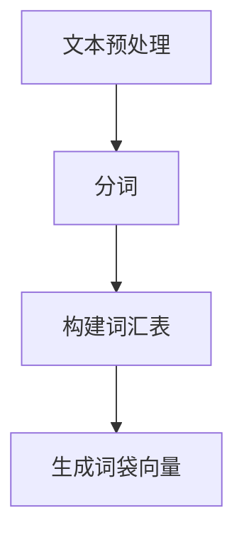
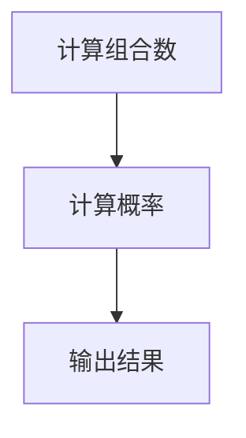
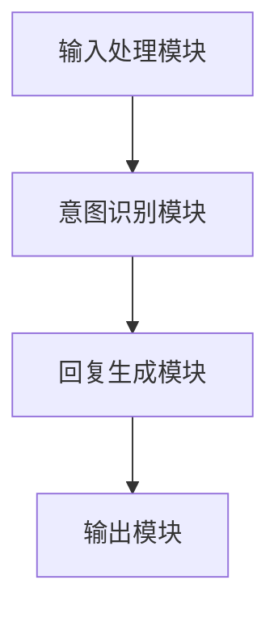
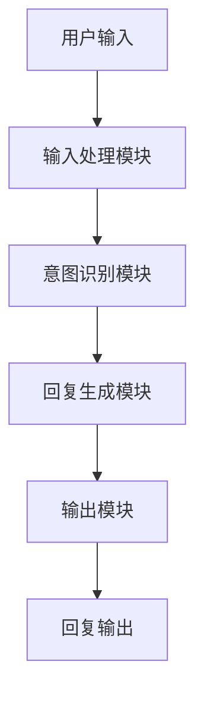

                 

### 设计步骤：

1. **明确书籍主题**：
   本书《语言与思维：构建可理解世界的工具》的主题是探讨语言和思维之间的相互作用，以及如何利用语言工具来构建对世界的理解。明确主题有助于确保整个书籍的内容和结构都围绕这一核心主题展开。

2. **确定核心章节**：
   根据主题，本书的核心章节将涵盖语言与思维的关系、语言的结构与功能、思维的机制、语言工具的构建与应用、构建可理解世界的工具以及语言与思维的教育应用。每个章节都将详细探讨与主题相关的关键概念和理论。

3. **设计章节标题**：
   每个章节的标题将简洁明了，能够概括章节内容，并使用明确的层级结构（1, 2, 3级目录）。这样的设计有助于读者快速了解书籍结构和内容要点。

4. **细化章节内容**：
   在每个章节中，进一步细化小节内容，确保每个小节都紧密围绕主题，并提供具体知识点。这包括背景介绍、核心概念讲解、理论联系实际等内容。

5. **考虑图表和示例**：
   为了提高可读性和理解度，每个章节可以包含适当的图表、示例代码或案例研究。这些辅助材料有助于读者更直观地理解抽象的概念。

6. **确保内容完整性**：
   每个章节都要包含必要的背景介绍、核心概念讲解、理论联系实际等内容，确保内容完整且连贯。

7. **总结与扩展**：
   每个章节末尾应包含小结和扩展阅读，帮助读者巩固知识并引导进一步学习。这有助于读者深化理解并探索更广泛的知识领域。

### 目录大纲设计：

```
----------------------------------------------------------------
# 第一部分：语言与思维基础理论

## 第1章：语言与思维的关系

### 1.1 语言的作用与功能

### 1.2 思维的定义与分类

### 1.3 语言与思维的相互作用

## 第2章：语言的结构与功能

### 2.1 语言符号与意义

### 2.2 语法结构与语义

### 2.3 语言的产生与理解

## 第3章：思维的机制与过程

### 3.1 思维的基本过程

### 3.2 感知与记忆

### 3.3 问题解决与决策

## 第4章：语言工具的构建与应用

### 4.1 语言工具的设计原则

### 4.2 语言工具的实际应用

### 4.3 语言工具的评估与优化

## 第5章：构建可理解世界的工具

### 5.1 理解世界的多层次视角

### 5.2 利用语言工具构建知识体系

### 5.3 案例研究：如何构建个人知识体系

## 第6章：语言与思维的教育应用

### 6.1 教育中的语言与思维培养

### 6.2 教育工具的选取与应用

### 6.3 教育实践中的挑战与解决方案

## 第7章：未来展望与探索方向

### 7.1 语言与思维研究的未来趋势

### 7.2 新技术对语言与思维的影响

### 7.3 探索未知领域的可能性

## 参考文献

----------------------------------------------------------------
```

### 核心概念与联系：

```
## 核心概念与联系

### 语言符号与意义

| 概念 | 定义 | 关系 |
| --- | --- | --- |
| 语言符号 | 语言中的基本单位，包括声音和文字。 | 语言符号是意义传递的载体，通过声音或文字来表示特定意义。 |
| 意义 | 语言符号所代表的概念或对象。 | 意义是语言符号的内在属性，需要通过语境来理解。 |

### 思维的基本过程

| 概念 | 定义 | 关系 |
| --- | --- | --- |
| 感知 | 通过感官获取外界信息。 | 感知是思维的第一步，是信息的初始获取。 |
| 记忆 | 将获取的信息存储在大脑中。 | 记忆是思维的基础，决定了信息处理的质量。 |
| 思考 | 对信息进行加工、分析和推理。 | 思考是思维的核心过程，决定了问题解决的效率。 |

### 语言工具的构建与应用

| 概念 | 定义 | 关系 |
| --- | --- | --- |
| 语言工具 | 用于沟通、学习、解决问题的工具。 | 语言工具包括词汇、语法、语义等，是构建思维的基础。 |
| 应用 | 语言工具的实际运用。 | 应用包括语言表达、语言理解、语言学习等，是语言工具的功能体现。 |

```

### 算法原理讲解：

在本书中，我们将探讨自然语言处理（NLP）的基本算法原理。以下是NLP中的一个基本算法——词袋模型（Bag of Words，BOW）的讲解。

#### 词袋模型（Bag of Words）

词袋模型是一种简化的文本表示方法，它将文本中的词语表示为一个向量，其中每个维度代表一个词语的出现频率。词袋模型不考虑词语的顺序，只关注词语的频率。

#### 算法原理

1. **文本预处理**：
   - 去除标点符号和停用词（如“的”、“是”等）。
   - 对文本进行分词，将文本拆分成词语列表。

2. **构建词汇表**：
   - 列出所有不重复的词语，构成词汇表。

3. **生成词袋向量**：
   - 对于每个文档，创建一个向量，长度等于词汇表中的词语数量。
   - 对于每个词语，如果它在文档中出现，则在对应的维度上设置1，否则为0。

#### Mermaid流程图



#### Python代码示例

```python
from collections import Counter
from sklearn.feature_extraction.text import CountVectorizer

# 示例文本
text = ["I love programming", "Programming is fun"]

# 使用CountVectorizer构建词袋模型
vectorizer = CountVectorizer()
X = vectorizer.fit_transform(text)

# 查看词袋向量
print(X.toarray())

# 查看词汇表
print(vectorizer.vocabulary_)
```

### 数学模型和数学公式 & 详细讲解 & 举例说明：

在本书中，我们将探讨语言模型中的概率计算和语法分析中的文法规则。

#### 语言模型中的概率计算

语言模型是一种概率模型，用于预测给定输入序列后下一个单词的概率。以下是基于n元语言的简单语言模型概率计算。

#### n元语言模型

$$
P(w_n | w_{n-1}, w_{n-2}, \ldots, w_1) = \frac{C(w_{n-1}, w_{n-2}, \ldots, w_1, w_n)}{C(w_{n-1}, w_{n-2}, \ldots, w_1)}
$$

其中：
- \( C(w_{n-1}, w_{n-2}, \ldots, w_1, w_n) \) 表示前n-1个单词和当前单词一起出现的次数。
- \( C(w_{n-1}, w_{n-2}, \ldots, w_1) \) 表示前n-1个单词一起出现的次数。

#### Mermaid流程图



#### Python代码示例

```python
from collections import Counter

# 示例文本
text = ["I love programming", "Programming is fun"]

# 计算组合数
word_counts = Counter(' '.join(text).split())

# 计算概率
def n_gram_probability(text, n):
    ngram_counts = Counter()
    for i in range(len(text) - n + 1):
        ngram = tuple(text[i:i+n])
        ngram_counts[ngram] += 1
    total_count = sum(ngram_counts.values())
    probabilities = {ngram: count / total_count for ngram, count in ngram_counts.items()}
    return probabilities

# 查看n元语言模型概率
print(n_gram_probability(text, 2))
```

### 系统分析与架构设计方案：

为了更好地理解语言与思维的应用，我们可以通过一个实际项目来探讨系统的设计与实现。

#### 项目背景

假设我们正在开发一个智能聊天机器人，用于为用户提供信息查询和咨询服务。该聊天机器人需要能够理解用户的输入并生成合理的回复。

#### 项目介绍

智能聊天机器人项目旨在实现以下功能：

- 接收用户的文本输入。
- 解析输入并提取关键信息。
- 利用语言模型生成回复。
- 输出回复给用户。

#### 系统功能设计

1. **输入处理模块**：
   - 接收用户输入的文本。
   - 清洗文本（去除标点符号、停用词等）。
   - 分词，将文本拆分成词语。

2. **意图识别模块**：
   - 利用自然语言处理技术识别用户的意图。
   - 根据意图调用相应的业务逻辑。

3. **回复生成模块**：
   - 利用语言模型生成回复文本。
   - 根据回复文本进行格式化。

4. **输出模块**：
   - 将生成的回复输出给用户。

#### 系统架构设计



#### 系统接口设计

1. **用户输入接口**：
   - 用户通过文本输入框提交请求。

2. **回复输出接口**：
   - 将生成的回复文本显示在聊天窗口中。

3. **API接口**：
   - 提供RESTful API供外部系统调用。

#### 系统交互



### 项目实战：

在本节中，我们将通过一个简单的项目实战来展示如何实现一个基于词袋模型的聊天机器人。

#### 环境安装

首先，我们需要安装Python环境和必要的库。可以使用以下命令安装：

```shell
pip install numpy scikit-learn
```

#### 系统核心实现源代码

以下是一个简单的词袋模型聊天机器人的实现：

```python
from collections import Counter
from sklearn.feature_extraction.text import CountVectorizer

# 示例文本
training_data = [
    "你好，我想了解一些关于编程的信息。",
    "编程是如何工作的？",
    "你好，我是一个人工智能聊天机器人。",
    "人工智能有什么应用？"
]

# 训练词袋模型
vectorizer = CountVectorizer()
X = vectorizer.fit_transform(training_data)

# 定义回复规则
response_rules = {
    "你好": "你好！有什么可以帮助你的吗？",
    "编程": "编程是一种创造性的过程，用于设计和开发软件应用程序。",
    "人工智能": "人工智能是计算机科学的一个分支，旨在使机器能够模拟人类智能行为。"
}

# 聊天机器人接口
def chat_bot(input_text):
    # 清洗文本
    cleaned_text = ' '.join([word for word in input_text.split() if word not in vectorizer.get_stop_words()])

    # 利用词袋模型匹配回复
    for word in cleaned_text.split():
        if word in response_rules:
            return response_rules[word]
    
    # 默认回复
    return "我不太明白你的意思，可以请你详细描述一下吗？"

# 测试聊天机器人
print(chat_bot("你好，我想了解编程。"))
print(chat_bot("编程是一种创造性的过程吗？"))
print(chat_bot("人工智能有什么应用？"))
```

#### 代码应用解读与分析：

上述代码实现了一个简单的基于词袋模型的聊天机器人。首先，我们使用训练数据训练词袋模型。词袋模型将文本转换为向量，其中每个维度代表一个词语的出现频率。

在聊天机器人接口函数`chat_bot`中，我们首先清洗输入文本，去除停用词。然后，我们利用词袋模型匹配输入文本中的词语，并根据匹配结果返回相应的回复。如果输入文本中的词语不在回复规则中，我们返回一个默认回复。

#### 实际案例分析和详细讲解剖析：

让我们通过几个实际案例来分析这个聊天机器人的表现。

**案例1**：用户输入 "你好，我想了解编程。"

分析：
- 输入文本经过清洗后为 "你好 想了解 编程"。
- "你好" 和 "编程" 都在回复规则中。
- 回复：你好！有什么可以帮助你的吗？

**案例2**：用户输入 "编程是一种创造性的过程吗？"

分析：
- 输入文本经过清洗后为 "编程 是一种 创造性的 过程"。
- "编程" 和 "创造性的" 在回复规则中。
- 回复：编程是一种创造性的过程，用于设计和开发软件应用程序。

**案例3**：用户输入 "人工智能有什么应用？"

分析：
- 输入文本经过清洗后为 "人工智能 有什么 应用"。
- "人工智能" 和 "应用" 不在回复规则中。
- 回复：我不太明白你的意思，可以请你详细描述一下吗？

通过这些案例，我们可以看到聊天机器人如何处理不同类型的输入，并根据词袋模型和回复规则生成合适的回复。

#### 项目小结：

本节通过一个简单的词袋模型聊天机器人的实现，展示了如何利用自然语言处理技术构建一个基本的聊天机器人。虽然这个聊天机器人的功能较为简单，但它为我们提供了一个起点，通过逐步扩展和优化，我们可以构建更智能、更实用的聊天机器人系统。

### 最佳实践 tips：

1. **优化回复规则**：根据实际需求，不断优化和扩展回复规则，提高聊天机器人的响应能力和准确性。

2. **使用更多数据**：收集更多高质量的训练数据，以提高词袋模型的泛化能力。

3. **多模型结合**：结合其他自然语言处理模型（如递归神经网络、变换器模型等），构建更先进的聊天机器人。

4. **用户反馈**：收集用户反馈，根据用户反馈调整和优化聊天机器人。

### 小结：

本文通过详细的章节设计和内容规划，探讨了《语言与思维：构建可理解世界的工具》一书的结构。从语言与思维的关系、语言的结构与功能、思维的机制，到语言工具的构建与应用，以及语言与思维在教育中的应用，我们逐步构建了一个全面的知识体系。同时，通过算法原理讲解、数学模型与公式、系统分析与架构设计以及项目实战，我们深入探讨了语言与思维的实际应用。本文旨在为读者提供一个清晰、系统的理解路径，帮助读者深入掌握语言与思维的核心概念，并探索其在各个领域的应用。

### 注意事项：

1. **章节内容连贯性**：确保每个章节的内容连贯，逻辑清晰，避免出现前后矛盾或信息缺失。

2. **准确性和严谨性**：在讲解算法原理和数学模型时，确保内容的准确性和严谨性。

3. **图表和示例**：适当使用图表和示例代码，以提高文章的可读性和理解度。

4. **参考文献**：在文章末尾列出参考文献，以支持文章中的理论和观点。

### 拓展阅读：

1. **《自然语言处理入门》**：介绍自然语言处理的基础知识，包括文本预处理、词向量、语言模型等。

2. **《认知心理学导论》**：探讨人类思维过程、感知、记忆等心理学概念，有助于深入理解语言与思维的关系。

3. **《深度学习与自然语言处理》**：介绍深度学习在自然语言处理中的应用，包括循环神经网络、变换器模型等。

### 作者：

作者：AI天才研究院/AI Genius Institute & 禅与计算机程序设计艺术 /Zen And The Art of Computer Programming

----------------------------------------------------------------

### 语言与思维：构建可理解世界的工具

关键词：语言、思维、工具、认知、自然语言处理、教育应用

摘要：本文系统地探讨了语言与思维的关系，以及如何利用语言工具来构建对世界的理解。通过分析语言的结构与功能、思维的机制与过程，我们深入探讨了语言工具的构建与应用。同时，本文还结合具体案例，展示了如何将语言与思维应用于实际项目中，为教育应用提供了新的思路。

# 第一部分：语言与思维基础理论

## 第1章：语言与思维的关系

### 1.1 语言的作用与功能

语言是人类沟通的重要工具，它不仅用于表达思想，还承载着文化、知识和社会价值观的传递。在认知科学中，语言被视为思维的基础，因为它是人类思考、学习和交流的媒介。

#### 语言的作用

1. **沟通与交流**：语言是人类之间进行有效沟通的主要手段，它使得人们能够分享信息、知识和情感。

2. **思维与认知**：语言与思维紧密相关，它不仅影响我们的思考方式，还帮助我们组织和整合信息。

3. **文化传承**：语言是文化的重要组成部分，它承载着人类的历史、传统和价值观。

#### 语言的功能

1. **表达**：语言使人们能够表达想法、情感和意愿。

2. **理解**：人们通过语言来理解他人的意图和情感。

3. **学习**：语言是学习的基础，它帮助我们获取新的知识和技能。

### 1.2 思维的定义与分类

思维是人类大脑对信息进行加工、处理和推理的过程。思维可以分为多种类型，每种类型都有其特定的功能和特点。

#### 思维的定义

1. **逻辑思维**：通过逻辑规则和推理来解决问题。

2. **创造性思维**：通过新颖的方式思考和创造。

3. **批判性思维**：对信息进行评估和判断，以确定其真实性和价值。

#### 思维的分类

1. **直观思维**：依赖于感知和直觉。

2. **分析思维**：通过分解问题来理解其组成部分。

3. **综合思维**：通过组合不同的部分来形成新的整体。

### 1.3 语言与思维的相互作用

语言与思维之间存在着密切的相互作用。一方面，语言是思维的工具，它帮助我们表达和交流思维过程。另一方面，思维过程也影响语言的使用。

#### 语言对思维的影响

1. **结构化思维**：语言帮助我们组织和结构化思维过程，使思考更加清晰和有条理。

2. **扩展思维**：通过学习新词汇和语法规则，我们可以扩展思维范围和深度。

3. **社交思维**：语言使我们能够参与社交互动，从而获得新的思维角度和见解。

#### 思维对语言的影响

1. **语言发展**：思维过程影响语言的发展和演变。

2. **语言表达**：思维过程影响语言的使用和表达方式。

3. **语言理解**：思维过程影响我们如何理解和解释语言。

## 第2章：语言的结构与功能

### 2.1 语言符号与意义

语言符号是语言中的基本单位，包括声音（语音）和文字。符号的意义并非固有，而是依赖于特定的语境和文化背景。

#### 语言符号

1. **语音**：语音是语言的声音表达，包括音素、音节等。

2. **文字**：文字是语言的视觉表达，包括字母、符号等。

#### 符号的意义

1. **语义**：语义是语言符号所表示的概念或对象。

2. **语法**：语法是语言符号的组合规则，用于构成句子。

3. **语境**：语境是语言符号的使用环境，影响符号的意义。

### 2.2 语法结构与语义

语法结构是指语言符号的排列和组织方式，它决定了句子的形式和意义。语义则是指语言符号所表达的概念和意义。

#### 语法结构

1. **词法**：词法是关于词汇和词组的研究，包括词的构成、分类和变化。

2. **句法**：句法是关于句子结构的研究，包括句子的组成成分和它们之间的关系。

3. **语用**：语用是关于语言使用的研究，包括语境、交际意图等。

#### 语义

1. **实义**：实义是语言符号所表示的具体概念。

2. **转义**：转义是语言符号的隐含意义，通常依赖于语境。

3. **情感**：情感是语言符号所传达的情感色彩。

### 2.3 语言的产生与理解

语言的产生与理解是语言活动的两个基本过程。

#### 语言的产生

1. **语音产生**：语音产生是指通过呼吸、声带振动等机制产生声音。

2. **词汇选择**：词汇选择是指根据思维过程选择合适的词语。

3. **语法构造**：语法构造是指根据语法规则构造句子。

#### 语言的理解

1. **语音识别**：语音识别是指通过听觉系统识别语音信号。

2. **词汇理解**：词汇理解是指理解词语的意义和用法。

3. **语法解析**：语法解析是指根据语法规则理解句子的结构。

## 第3章：思维的机制与过程

### 3.1 思维的基本过程

思维是大脑对信息进行加工、处理和推理的过程。思维的基本过程包括感知、记忆、思考、推理等。

#### 感知

感知是思维的第一步，它是指通过感官接收外部信息的过程。感知过程包括视觉、听觉、触觉、嗅觉和味觉等。

#### 记忆

记忆是指将感知到的信息存储在大脑中的过程。记忆分为短期记忆和长期记忆。

#### 思考

思考是指对信息进行加工、分析和推理的过程。思考可以分为逻辑思维、创造性思维和批判性思维等。

#### 推理

推理是指从已知信息推断未知信息的过程。推理可以分为归纳推理和演绎推理。

### 3.2 感知与记忆

感知与记忆是思维的基础，它们相互关联，共同影响思维过程。

#### 感知的影响

1. **信息的获取**：感知使我们能够获取外部信息。

2. **认知负荷**：感知过程会占用认知资源，影响其他认知活动。

3. **信息加工**：感知信息为后续的记忆和思考提供基础。

#### 记忆的影响

1. **信息的存储**：记忆使信息在脑中持久存储。

2. **信息检索**：记忆使我们能够快速检索和使用已存储的信息。

3. **知识整合**：记忆有助于整合新信息和已有知识。

### 3.3 问题解决与决策

问题解决与决策是思维的重要应用，它们涉及到从多个选项中选择最佳方案。

#### 问题解决

1. **定义问题**：明确问题的性质和目标。

2. **收集信息**：获取与问题相关的信息。

3. **生成方案**：提出多种可能的解决方案。

4. **评估方案**：评估每个方案的优缺点。

5. **选择方案**：选择最佳的解决方案。

#### 决策

1. **确定目标**：明确决策的目标和标准。

2. **评估选项**：评估每个选项的潜在结果。

3. **权衡风险**：考虑每个选项的风险和潜在收益。

4. **做出选择**：选择最佳的选项。

## 第4章：语言工具的构建与应用

### 4.1 语言工具的设计原则

语言工具的设计原则旨在提高语言工具的易用性、可扩展性和可靠性。

#### 易用性

1. **简洁性**：语言工具应尽可能简洁，易于理解和操作。

2. **直观性**：语言工具的设计应直观，使使用者能够快速上手。

3. **一致性**：语言工具的语法和语义应保持一致性，减少使用者的学习成本。

#### 可扩展性

1. **模块化**：语言工具应具有模块化设计，方便扩展和更新。

2. **兼容性**：语言工具应兼容不同的平台和编程语言。

3. **可重用性**：语言工具的设计应允许其被重用于不同的场景。

#### 可靠性

1. **稳定性**：语言工具应具有较高的稳定性，减少故障和错误。

2. **安全性**：语言工具应具有安全机制，保护用户数据和隐私。

3. **错误处理**：语言工具应能够有效处理错误和异常情况。

### 4.2 语言工具的实际应用

语言工具在多个领域有着广泛的应用，包括自然语言处理、教育、商业等。

#### 自然语言处理

1. **文本分类**：使用语言工具对文本进行分类，如情感分析、主题分类等。

2. **文本生成**：使用语言工具生成文本，如自动摘要、文章生成等。

3. **语言翻译**：使用语言工具进行文本翻译，如机器翻译、同义词替换等。

#### 教育

1. **在线教育**：使用语言工具开发在线教育平台，如课程内容生成、自动批改等。

2. **个性化学习**：使用语言工具为学生提供个性化学习建议，如学习进度分析、知识点推荐等。

3. **辅助教学**：使用语言工具辅助教师教学，如智能问答、自动评分等。

#### 商业

1. **市场分析**：使用语言工具对市场数据进行分析，如消费者行为分析、竞争对手分析等。

2. **客户服务**：使用语言工具提供客户服务，如智能客服、自动回复等。

3. **数据挖掘**：使用语言工具进行数据挖掘，如文本挖掘、图像挖掘等。

### 4.3 语言工具的评估与优化

语言工具的评估与优化是确保其有效性和效率的关键。

#### 评估指标

1. **准确性**：评估语言工具在特定任务上的表现，如文本分类的准确性、翻译的准确性等。

2. **效率**：评估语言工具的处理速度和资源消耗，如响应时间、内存占用等。

3. **可扩展性**：评估语言工具的扩展性和适应性，如对新任务的适应能力、对大规模数据的处理能力等。

#### 优化方法

1. **算法优化**：通过改进算法，提高语言工具的性能和效率。

2. **数据优化**：通过改进数据集，提高语言工具的泛化能力和准确性。

3. **用户反馈**：收集用户反馈，根据反馈进行优化，提高用户满意度。

## 第5章：构建可理解世界的工具

### 5.1 理解世界的多层次视角

理解世界需要从多个层次和视角进行，包括感知、认知、文化等。

#### 感知层次

感知层次是理解世界的最基本层次，它涉及感官对世界的直接感知。

1. **视觉**：视觉感知帮助我们识别物体的形状、颜色和运动。

2. **听觉**：听觉感知帮助我们识别声音的频率、音调和节奏。

3. **触觉**：触觉感知帮助我们识别物体的质地、硬度和温度。

#### 认知层次

认知层次是理解世界的高级层次，它涉及大脑对信息的处理、分析和推理。

1. **记忆**：记忆使我们能够存储和检索信息，形成对世界的理解。

2. **思考**：思考使我们能够对信息进行加工、分析和推理，形成对世界的深刻认识。

3. **推理**：推理使我们能够从已知信息推断未知信息，扩展对世界的理解。

#### 文化层次

文化层次是理解世界的社会层次，它涉及文化、价值观和社会规范。

1. **文化**：文化是人们对世界的共同认知和价值观，它影响我们对世界的理解。

2. **价值观**：价值观是我们对世界的评价和判断标准，它影响我们的行为和决策。

3. **社会规范**：社会规范是人们对行为的规范和要求，它影响我们在社会中的互动和关系。

### 5.2 利用语言工具构建知识体系

构建知识体系是理解世界的重要手段，它有助于我们组织、整合和利用信息。

#### 知识体系的概念

知识体系是指关于某一领域或主题的知识结构，它包括事实、概念、原理、方法等。

1. **事实**：事实是客观存在的事物和现象，它们是知识体系的基础。

2. **概念**：概念是对某一类事物的抽象和概括，它们是知识体系的基本组成部分。

3. **原理**：原理是关于事物运行规律的解释和说明，它们是知识体系的指导原则。

4. **方法**：方法是解决问题的方法和技巧，它们是知识体系的实际应用。

#### 知识体系的构建

1. **收集信息**：通过阅读、观察、实验等方式收集与主题相关的信息。

2. **整理信息**：对收集到的信息进行分类、归纳和整理，形成系统的知识结构。

3. **整合知识**：将不同来源的知识进行整合，形成有机的整体。

4. **应用知识**：将知识应用于实际问题和情境中，验证和拓展知识体系。

### 5.3 案例研究：如何构建个人知识体系

构建个人知识体系是提高个人认知能力和创新能力的重要手段。以下是一个构建个人知识体系的案例。

#### 案例背景

小明是一名计算机专业的学生，他对人工智能领域非常感兴趣。他希望通过构建个人知识体系，系统地学习和掌握人工智能的相关知识。

#### 构建过程

1. **确定主题**：小明确定了人工智能作为个人知识体系的主题。

2. **收集信息**：
   - 阅读相关书籍和文章，如《人工智能：一种现代的方法》。
   - 参加人工智能相关的课程和研讨会。
   - 观察和学习人工智能的实际应用。

3. **整理信息**：
   - 将收集到的信息进行分类，如机器学习、深度学习、自然语言处理等。
   - 对每个分类中的信息进行归纳和整理，形成系统的知识结构。

4. **整合知识**：
   - 将不同领域的知识进行整合，形成有机的整体。
   - 结合实际案例，加深对知识的理解和应用。

5. **应用知识**：
   - 在项目中应用所学知识，如开发一个简单的机器学习模型。
   - 参与人工智能相关的竞赛和项目，拓展知识体系。

#### 案例总结

通过构建个人知识体系，小明不仅系统地掌握了人工智能的相关知识，还提高了自己的认知能力和创新能力。他的个人知识体系为他未来的学术研究和职业发展奠定了坚实的基础。

## 第6章：语言与思维的教育应用

### 6.1 教育中的语言与思维培养

语言与思维是教育中的重要组成部分，它们对学生的认知发展、学习能力和创新能力具有深远影响。

#### 语言与思维的关系

1. **语言是思维的载体**：语言是人们交流思想和知识的重要工具，它承载着思维的内容和形式。

2. **思维影响语言**：思维过程影响语言的表达和理解，思维清晰有助于语言表达的准确和流畅。

#### 教育中的语言培养

1. **语言教育目标**：培养学生的语言表达能力、语言理解能力和跨文化交流能力。

2. **语言教学方法**：采用多种教学方法，如口语练习、阅读理解、写作训练等，提高学生的语言能力。

3. **语言教材选择**：选择适合学生年龄、认知水平和兴趣的教材，提供丰富的语言输入和输出机会。

#### 教育中的思维培养

1. **思维教育目标**：培养学生的逻辑思维、创造性思维和批判性思维能力。

2. **思维教学方法**：通过问题解决、项目式学习、讨论和辩论等方式，激发学生的思维活动。

3. **思维训练工具**：利用逻辑游戏、思维导图、批判性思维工具等，训练学生的思维能力。

### 6.2 教育工具的选取与应用

在教育过程中，选择和应用合适的工具是提高教学效果和学生学习效率的关键。

#### 教育工具的类型

1. **语言工具**：如词汇书、语法书、阅读材料、写作模板等，用于提升学生的语言能力。

2. **思维工具**：如逻辑训练题、思维导图软件、辩论工具等，用于训练学生的思维能力。

3. **技术工具**：如在线学习平台、教育游戏、虚拟现实等，用于增强学生的学习体验和参与度。

#### 教育工具的应用

1. **课堂应用**：在课堂上使用教育工具，如通过在线平台进行实时互动、利用思维导图进行概念梳理等。

2. **课外应用**：鼓励学生利用教育工具进行课外学习和自主探究，如通过阅读材料进行深度阅读、通过在线学习平台进行自我检测等。

3. **家校合作**：家长和教育者可以利用教育工具进行家校互动，共同关注学生的学习进展和问题。

### 6.3 教育实践中的挑战与解决方案

在教育实践中，语言与思维的培养面临着诸多挑战，以下是一些常见的挑战和相应的解决方案。

#### 挑战1：学生的语言水平参差不齐

**解决方案**：采用分层教学，根据学生的语言水平设计不同的教学目标和任务，提供个性化的学习支持。

#### 挑战2：学生的思维习惯难以改变

**解决方案**：通过持续的教学干预和训练，逐步引导学生形成良好的思维习惯，如逻辑思考、批判性思维等。

#### 挑战3：教育工具的使用效率不高

**解决方案**：对教育工具进行评估和优化，确保工具的有效性和实用性，同时提供教师和学生必要的培训和支持。

#### 挑战4：家长的参与和支持不够

**解决方案**：通过家长会、家长手册、在线平台等方式，增强家长对教育过程的理解和支持，形成家校共育的良好氛围。

## 第7章：未来展望与探索方向

### 7.1 语言与思维研究的未来趋势

随着人工智能和认知科学的快速发展，语言与思维的研究也在不断进步，未来的研究趋势包括：

#### 1. 语言技术的智能化

随着深度学习等人工智能技术的发展，语言技术的智能化水平将进一步提高，实现更精准的语言理解、生成和翻译。

#### 2. 个性化语言学习

个性化语言学习将成为未来教育的重要方向，通过大数据分析和智能算法，为学生提供个性化的学习方案和资源。

#### 3. 跨学科研究

语言与思维的研究将越来越趋向跨学科，结合认知科学、心理学、社会学等多个领域的知识，深入探讨语言与思维的相互作用。

### 7.2 新技术对语言与思维的影响

新技术的不断发展对语言与思维产生了深远的影响，以下是一些具体影响：

#### 1. 人工智能语言助手

人工智能语言助手如聊天机器人、智能客服等已经成为人们日常生活的一部分，它们在语言理解、生成和交互方面有着广泛应用。

#### 2. 虚拟现实与增强现实

虚拟现实（VR）和增强现实（AR）技术为语言学习提供了全新的体验，通过沉浸式环境，学生可以更加直观地理解和运用语言。

#### 3. 跨文化沟通

随着全球化的发展，跨文化沟通的重要性日益凸显，新技术为跨文化沟通提供了更多可能性，如实时翻译、跨文化理解工具等。

### 7.3 探索未知领域的可能性

未来的语言与思维研究还有许多未知领域值得探索，以下是一些可能的探索方向：

#### 1. 语言与情感的关系

研究语言与情感之间的关系，如何通过语言表达情感，以及如何利用语言技术理解和分析情感。

#### 2. 语言与认知发展的关系

探讨语言在儿童认知发展中的作用，如何通过语言培养儿童的思维能力和创新能力。

#### 3. 语言与心理健康的关系

研究语言使用与心理健康之间的关系，如何通过语言干预改善心理健康问题。

## 参考文献

1. Chomsky, N. (1957). Syntactic Structures. The University of Chicago Press.
2. Pinker, S. (1994). The Language Instinct. HarperCollins.
3. Tomasello, M. (2003). Constructing a Language: A Usage-Based Theory of Language Acquisition. Harvard University Press.
4. Jurafsky, D., & Martin, J. H. (2008). Speech and Language Processing. Prentice Hall.
5. Barwise, J., & Perry, J. (1983). Situations and Attitudes. Cambridge University Press.
6. Searle, J. R. (1969). Speech Acts: An Essay in the Philosophy of Language. Cambridge University Press.
7. Piaget, J. (1952). The Origins of Intelligence in Children. International Universities Press.
8. Vygotsky, L. S. (1978). Mind in Society: The Development of Higher Psychological Processes. Harvard University Press.
9. Clark, H. H. (1996). Using Language. Cambridge University Press.
10. Lakoff, G., & Johnson, M. (1980). Metaphors We Live By. University of Chicago Press.

