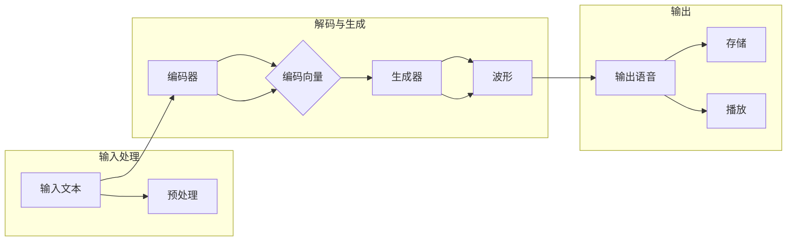
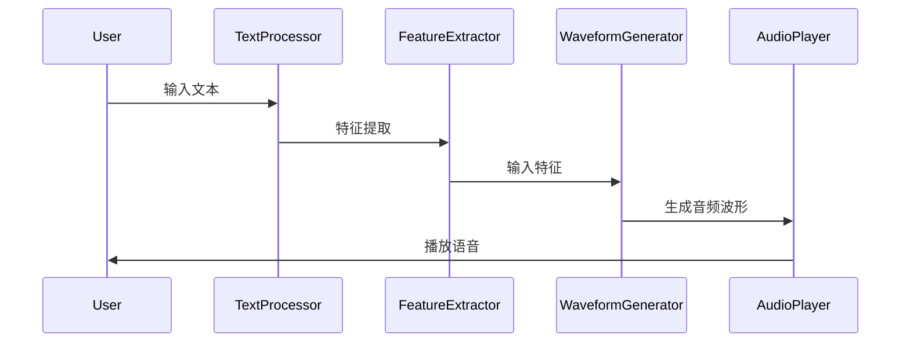
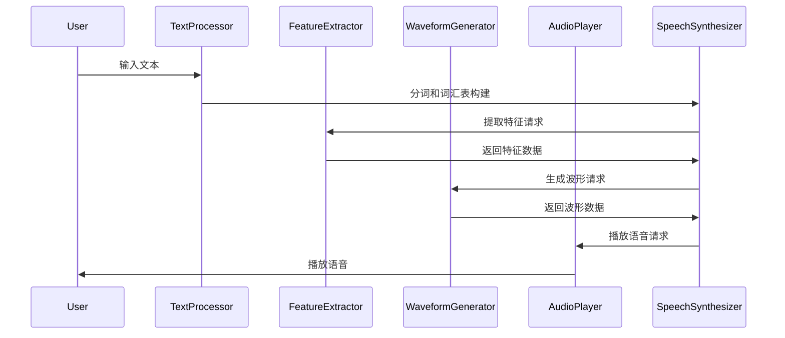

                 

### 文章标题

# 语音合成的波形生成网络：语音信号的数学模拟

### 关键词

- 语音合成
- 波形生成网络
- 语音信号处理
- 深度学习
- 数学模拟

### 摘要

本文深入探讨了语音合成的波形生成网络及其背后的数学模拟原理。首先，我们介绍了语音合成的背景和发展历程，随后详细解析了语音信号的数学模拟技术，包括采样与量化、频谱分析以及语音信号的数学模型。接着，文章深入讲解了波形生成网络的基本结构、训练方法以及常见的深度学习模型，如循环神经网络（RNN）、卷积神经网络（CNN）和生成对抗网络（GAN）。通过对比分析，文章阐述了这些核心概念之间的联系，并使用mermaid流程图和Python代码示例进行了算法原理的详细讲解。最后，文章提出了系统分析与架构设计方案，通过实际案例展示了语音合成系统的应用，并总结了项目经验与展望。

### 目录大纲

----------------------------------------------------------------

# 第一部分：背景介绍

## 第1章：语音合成的背景

### 1.1 语音合成技术的发展历程

- 语音合成技术的发展背景
- 语音合成的应用场景和重要性

### 1.2 语音合成的基本概念

- 语音信号及其表示
- 波形生成网络的概念

### 1.3 语音合成的分类

- 文字基础合成
- 语音数据库合成
- 基于深度学习的合成方法

## 第2章：语音信号的数学模拟

### 2.1 语音信号处理的基本概念

- 声音和语音的区别
- 语音信号的时域和频域表示

### 2.2 语音信号处理的技术

- 声音信号的采样与量化
- 频谱分析

### 2.3 语音信号的数学模型

- 线性预测编码（LPC）
- 基于隐马尔可夫模型（HMM）的建模

## 第3章：波形生成网络

### 3.1 波形生成网络的概述

- 波形生成网络的作用
- 波形生成网络的基本结构

### 3.2 基于深度学习的波形生成网络

- 循环神经网络（RNN）
- 卷积神经网络（CNN）
- 生成对抗网络（GAN）

### 3.3 波形生成网络的训练与优化

- 网络训练的挑战
- 训练过程的优化方法

## 第二部分：核心概念与联系

## 第4章：核心概念原理

### 4.1 语音信号处理的基本概念

- 采样与量化
- 频谱分析

### 4.2 常见波形生成网络的原理

- RNN的工作原理
- CNN的特点与应用
- GAN的生成与鉴别过程

## 第5章：概念属性特征对比表格

- 采样与量化
- 频谱分析
- RNN
- CNN
- GAN

## 第6章：ER实体关系图架构

- 语音信号处理
- 波形生成网络
- 语音合成系统

## 第三部分：算法原理讲解

## 第7章：算法mermaid流程图

- 算法流程图

## 第8章：算法原理的数学模型和公式

### 8.1 线性预测编码（LPC）

- LPC的数学模型
- LPC的公式

### 8.2 循环神经网络（RNN）

- RNN的数学模型
- RNN的公式

### 8.3 卷积神经网络（CNN）

- CNN的数学模型
- CNN的公式

### 8.4 生成对抗网络（GAN）

- GAN的数学模型
- GAN的公式

## 第9章：详细讲解和举例说明

- LPC的应用举例
- RNN的应用举例
- CNN的应用举例
- GAN的应用举例

## 第四部分：系统分析与架构设计方案

## 第10章：问题场景介绍

- 语音合成的实际应用场景

## 第11章：系统功能设计

### 11.1 领域模型mermaid类图

- 语音信号处理类图

### 11.2 系统架构设计mermaid架构图

- 语音合成系统的架构图

### 11.3 系统接口设计和系统交互

- 系统接口类图
- 系统交互mermaid序列图

## 第五部分：项目实战

## 第12章：环境安装

- 环境搭建的步骤和工具

## 第13章：系统核心实现源代码

- 源代码结构
- 关键代码解释

## 第14章：代码应用解读与分析

- 代码的功能与实现
- 代码优化的建议

## 第15章：实际案例分析和详细讲解剖析

- 实际案例介绍
- 案例分析

## 第16章：项目小结

- 项目总结
- 展望与拓展

----------------------------------------------------------------

以上就是本文的完整目录大纲。接下来，我们将按照这个结构，逐一深入探讨每个章节的内容，以逻辑清晰、结构紧凑、简单易懂的方式，为您带来一篇高质量的技术博客文章。让我们开始吧！

### 1.1 语音合成技术的发展历程

语音合成技术，又称文本到语音（Text-to-Speech，TTS）技术，是一种将书面文字转换成自然语音的技术。这一技术的发展历程可以追溯到20世纪中期。当时，科学家们开始探索如何通过电子设备生成人类的声音。最早的语音合成器主要基于规则的合成方法，例如，通过对语音的音素和音节进行拼接，生成简单的语音。

**1960年代：规则合成法的出现**  
在1960年代，规则合成法开始应用于语音合成领域。这种方法依赖于预先定义好的语音规则，将文本逐词逐句地转换为语音。这种方法的优点在于其易于实现，缺点是生成的语音听起来往往不够自然。

**1970年代：拼接合成法的发展**  
1970年代，拼接合成法逐渐取代了规则合成法。这种方法通过将语音分割成更小的片段，然后对这些片段进行拼接，以生成更自然的语音。拼接合成法的一个代表性系统是Harvard大学开发的HVS（Harvard Voice Simulator）。

**1980年代：发音模型的应用**  
1980年代，语音合成领域开始采用发音模型。发音模型通过对语音的声学特性进行建模，提高了语音的自然度。线性预测编码（Linear Predictive Coding，LPC）就是一种常用的发音模型。

**1990年代：隐藏马尔可夫模型（HMM）的应用**  
1990年代，隐藏马尔可夫模型（Hidden Markov Model，HMM）开始广泛应用于语音合成领域。HMM通过概率模型来描述语音的生成过程，使得语音合成系统可以更好地处理连续语音的变异性。

**2000年代：深度学习在语音合成中的应用**  
2000年代，随着深度学习技术的兴起，语音合成领域迎来了新的发展。循环神经网络（Recurrent Neural Network，RNN）和卷积神经网络（Convolutional Neural Network，CNN）等深度学习模型在语音合成中的应用，极大地提高了语音合成的自然度和准确度。

**2010年代至今：端到端波形生成网络的出现**  
近年来，端到端波形生成网络（End-to-End Waveform Generation Networks）成为语音合成领域的研究热点。这类网络通过直接将文本转换成波形，跳过了传统的中间表示，从而提高了合成的效率和质量。生成对抗网络（Generative Adversarial Network，GAN）和WaveNet等模型的成功应用，标志着语音合成技术进入了新的阶段。

**总结**  
语音合成技术的发展历程展示了从规则方法到深度学习的演进。每一次技术的进步，都使得语音合成系统的自然度和准确性得到了极大的提升。未来，随着人工智能技术的进一步发展，语音合成技术有望在更多场景中得到应用，为人类带来更加便捷的沟通体验。

### 1.2 语音合成的基本概念

在深入探讨语音合成技术之前，有必要首先了解一些基本概念，这些概念包括语音信号及其表示、波形生成网络的概念。

**语音信号及其表示**

语音信号是一种声学信号，它是由人类发音器官发出的声波。在数字处理中，语音信号通常被表示为一系列的数值序列。这些数值序列反映了语音在时间上的变化。语音信号可以通过两种主要的表示方法来描述：时域表示和频域表示。

- **时域表示**：时域表示直接记录语音信号在时间轴上的变化。例如，通过采样和量化，将连续的声波转换为离散的数值序列。这种表示方法便于对语音信号进行时间上的分析，如图形显示和时序分析。

- **频域表示**：频域表示则将语音信号分解成不同频率成分的叠加。通过傅里叶变换（Fourier Transform）或其他频域分析技术，可以将时域信号转换为其频谱表示。频域表示有助于理解语音信号的频谱特性，如图像显示和频谱分析。

**波形生成网络的概念**

波形生成网络（Waveform Generation Network）是一种专门用于生成语音波形数据的神经网络模型。它能够将文本或语音特征序列直接映射到波形序列，从而实现语音合成。波形生成网络的核心是它的端到端特性，即它能够直接从输入的文本或特征序列生成输出音频波形，而无需经过复杂的中间表示。

波形生成网络通常由以下几个部分组成：

- **编码器（Encoder）**：编码器的作用是将输入的文本或特征序列编码成一个固定长度的向量。这个向量包含了输入序列的关键信息，可以作为后续生成的依据。

- **解码器（Decoder）**：解码器的作用是将编码器生成的向量解码为音频波形序列。解码器可以通过递归神经网络（Recurrent Neural Network，RNN）、卷积神经网络（Convolutional Neural Network，CNN）或其他类型的神经网络来实现。

- **生成器（Generator）**：生成器是波形生成网络的核心部分，它将编码器输出的向量转换为音频波形。生成器的输出可以是连续的波形，也可以是离散的音频样本。

- **损失函数（Loss Function）**：波形生成网络通过最小化损失函数来优化网络参数。常用的损失函数包括均方误差（Mean Squared Error，MSE）和波纹损失（Wavenet Loss）等，这些损失函数能够衡量生成的波形与目标波形之间的差异。

**总结**  
语音合成的基本概念包括语音信号的时域和频域表示，以及波形生成网络的结构和工作原理。理解这些概念有助于我们深入理解语音合成技术的实现原理和优化方法。接下来，我们将进一步探讨语音信号处理的数学模拟技术，为深入分析波形生成网络奠定基础。

### 1.3 语音合成的分类

语音合成技术可以根据其实现方式和应用场景的不同，分为多种类型。以下是几种常见的语音合成方法：

**文字基础合成（Text-Based Synthesis）**

文字基础合成是最传统的一种方法，它通过将文本转换为音素和音节，然后根据发音规则拼接生成语音。这种方法的主要步骤包括：

1. **文本分析**：将输入的文本分解为音素和音节，通常使用正则表达式或自然语言处理技术来实现。
2. **音素和音节映射**：将每个音素和音节映射到相应的音频片段。
3. **拼接合成**：将映射后的音频片段拼接成完整的语音。

文字基础合成方法的主要优点在于实现简单，缺点是生成的语音自然度较低，且难以处理连续语音的变异性。

**语音数据库合成（Database-Based Synthesis）**

语音数据库合成方法通过从预录制的语音库中选择和拼接语音片段来生成合成语音。这种方法的关键步骤包括：

1. **语音库构建**：录制大量不同语音样本，并将它们存储在语音库中。
2. **语音选择**：根据输入文本，从语音库中选择适当的语音片段。
3. **拼接合成**：将选定的语音片段拼接成完整的语音。

语音数据库合成方法的优点在于生成的语音自然度较高，缺点是语音库的构建和维护成本较高，且难以适应个性化的语音需求。

**基于深度学习的合成方法（Deep Learning-Based Synthesis）**

基于深度学习的合成方法是当前语音合成技术的发展方向。这种方法利用深度学习模型，如循环神经网络（RNN）、卷积神经网络（CNN）和生成对抗网络（GAN），直接从文本或文本特征生成语音波形。其主要步骤包括：

1. **文本编码**：使用编码器将文本编码为固定长度的向量。
2. **波形生成**：使用解码器将编码后的文本向量解码为语音波形。
3. **训练优化**：通过训练优化模型参数，提高合成的语音质量和自然度。

基于深度学习的合成方法具有以下优点：

- **自然度更高**：深度学习模型能够更好地捕捉语音的自然特性，生成更加自然的语音。
- **灵活性强**：能够根据需求定制化语音合成模型，适应不同的应用场景。
- **效率提升**：端到端的波形生成网络使得合成过程更加高效，减少了中间步骤。

**总结**  
语音合成技术可以根据实现方式和应用场景的不同，分为文字基础合成、语音数据库合成和基于深度学习的合成方法。每种方法都有其独特的优点和不足，但基于深度学习的合成方法正逐渐成为主流，引领语音合成技术走向新的高度。

### 2.1 语音信号处理的基本概念

要深入理解语音合成的波形生成网络，我们首先需要掌握一些基础概念，特别是关于声音和语音的区别，以及语音信号的时域和频域表示。

**声音和语音的区别**

声音是一种物理现象，指的是通过振动产生的机械波。当声源（如声带）振动时，它会在介质（如空气）中传播，形成声波。声波可以具有不同的频率、振幅和持续时间，从而产生各种不同的声音。

语音则是人类通过声带振动产生的特定类型的声音，是人类交流的一种重要方式。语音具有独特的音调、音量和节奏，这些特性使得语音不仅能够传达信息，还能够表达情感和意图。

在技术层面，声音和语音的主要区别在于其频率范围和复杂性。声音的频率范围通常从20 Hz到20 kHz，而语音的频率范围则更窄，通常在85 Hz到255 Hz之间。此外，语音信号通常包含多种音素和语调，比普通声音更复杂。

**语音信号的时域和频域表示**

时域表示和频域表示是分析信号的两个基本方法，它们分别从不同的角度揭示了信号的特征。

- **时域表示**：时域表示直接记录信号在时间轴上的变化。对于语音信号，时域表示就是将语音波形绘制成一条曲线，横轴表示时间，纵轴表示振幅。通过时域表示，我们可以直观地看到语音的波形变化，如音调、音量和停顿等。

  例如，下图展示了一个简单的语音波形，横轴是时间，纵轴是振幅。

  

- **频域表示**：频域表示将信号分解成不同频率成分的叠加。通过频谱分析，我们可以看到语音信号在不同频率上的能量分布。频谱图通常用二维图像表示，横轴表示频率，纵轴表示幅度。

  例如，下图展示了一个语音信号的频谱图，横轴是频率，纵轴是幅度。

  

  在频谱图中，我们可以看到语音信号的主要频率成分，这些频率成分对应于不同的音素和音调。

**总结**  
声音和语音是两个不同的概念，语音是特定类型的声音，是人类交流的重要方式。时域和频域表示是分析信号的基本方法，时域表示直接记录信号在时间轴上的变化，而频域表示将信号分解成不同频率成分的叠加。掌握这些基本概念，有助于我们更好地理解语音信号处理和波形生成网络的工作原理。

### 2.2 语音信号处理的技术

语音信号处理是语音合成的重要组成部分，它涉及到对语音信号进行采样、量化以及频谱分析等技术。以下是对这些技术的详细说明。

**采样与量化**

采样和量化是数字信号处理的基础步骤，用于将连续的模拟信号转换为数字信号。

- **采样**：采样是将时间连续的信号转换为时间离散的信号。具体来说，采样过程每隔固定时间间隔（称为采样率）记录信号的一个瞬时值。采样率的选取非常关键，必须足够高，以捕捉信号中的高频成分。常见的采样率有8 kHz、16 kHz等。

  采样公式可以表示为：
  $$
  y[n] = x(nT_s)
  $$
  其中，$y[n]$是采样后的数字信号，$x(nT_s)$是时间连续的模拟信号，$T_s$是采样周期。

- **量化**：量化是将采样后的连续幅值转换为有限数量的离散值。量化过程将采样点的幅值范围划分为若干级，每级用二进制数表示。量化级别越多，精度越高，但所需的存储空间也越多。量化公式可以表示为：
  $$
  a_k = \text{round}(a \cdot Q - 0.5)
  $$
  其中，$a$是采样后的幅值，$a_k$是量化后的幅值，$Q$是量化级数。

**频谱分析**

频谱分析是对信号频率成分进行检测和描述的重要方法，它有助于我们理解信号的结构和特性。

- **傅里叶变换（Fourier Transform）**：傅里叶变换是最常用的频谱分析方法之一，它将时域信号转换为频域信号，揭示信号在不同频率上的能量分布。傅里叶变换公式为：
  $$
  X(f) = \int_{-\infty}^{\infty} x(t) e^{-j 2 \pi f t} dt
  $$
  其中，$X(f)$是频域信号，$x(t)$是时域信号，$f$是频率。

- **短时傅里叶变换（Short-Time Fourier Transform，STFT）**：短时傅里叶变换是对信号在时间上进行分段处理，然后对每段进行傅里叶变换。STFT能够捕捉信号在不同时间点上的频率特性。STFT公式为：
  $$
  X(t, f) = \int_{-\infty}^{\infty} x(\tau) e^{-j 2 \pi f \tau} d\tau
  $$
  其中，$X(t, f)$是短时频谱，$x(\tau)$是时间分段后的信号。

**总结**  
采样和量化是将模拟信号转换为数字信号的重要步骤，而频谱分析则是理解信号频率成分的关键方法。通过这些技术，我们能够有效地处理和解析语音信号，为语音合成系统的设计提供了坚实的理论基础。

### 2.3 语音信号的数学模型

在语音信号处理中，数学模型起到了至关重要的作用，它们帮助我们将复杂的语音信号转化为易于分析和处理的数学形式。以下是几种常见的语音信号数学模型及其应用。

**线性预测编码（Linear Predictive Coding，LPC）**

线性预测编码是一种通过对过去信号值的线性组合来预测当前信号值的编码方法。LPC的数学基础是最小预测误差，它通过建立一阶差分模型来描述语音信号。

LPC的数学模型可以表示为：
$$
x(n) = \sum_{k=1}^{p} a_k x(n-k) + e(n)
$$
其中，$x(n)$是当前信号值，$a_k$是预测系数，$p$是预测阶数，$e(n)$是预测误差。

LPC的应用包括：

- **语音编码**：通过LPC模型，可以有效地压缩语音信号，减少数据传输的带宽需求。
- **语音合成**：LPC模型被广泛应用于合成语音的音质优化，通过调整预测系数，可以生成自然度较高的语音。

**基于隐马尔可夫模型（Hidden Markov Model，HMM）的建模**

隐马尔可夫模型是一种统计模型，用于描述具有马尔可夫性质的随机过程。在语音信号处理中，HMM被用来模拟语音的生成过程，它通过状态序列来描述语音的变化。

HMM的数学模型包括以下五个基本参数：

- **状态集合 $Q$**：语音信号可能处于的不同状态。
- **状态转移概率矩阵 $A$**：描述状态之间的转移概率。
- **初始状态概率分布 $π$**：描述初始状态的概率分布。
- **观察概率分布 $B$**：描述在给定状态下产生的观察值的概率分布。
- **状态序列 $π_1, π_2, ..., π_T$**：语音信号的实际状态序列。

HMM的应用包括：

- **语音识别**：通过训练HMM模型，可以识别输入语音序列对应的状态序列，从而实现语音识别。
- **语音合成**：HMM模型可以用来生成语音信号的状态序列，然后通过状态转移和观察概率分布生成实际的语音波形。

**总结**  
线性预测编码和隐马尔可夫模型是语音信号处理中常用的数学模型。LPC通过线性预测减少冗余信息，提高编码效率；HMM则通过状态序列建模，实现语音的生成和识别。掌握这些数学模型，有助于我们深入理解语音信号处理的技术原理和应用。

### 3.1 波形生成网络的概述

波形生成网络（Waveform Generation Network）是语音合成技术中的核心组件，它通过深度学习模型直接从文本或文本特征序列生成语音波形。这类网络具有端到端的特点，无需经过复杂的中间表示，从而提高了合成效率和质量。以下是波形生成网络的基本结构和作用。

**基本结构**

波形生成网络通常由三个主要部分组成：编码器（Encoder）、解码器（Decoder）和生成器（Generator）。

- **编码器（Encoder）**：编码器的作用是将输入的文本或文本特征序列编码成一个固定长度的向量。这个向量包含了输入序列的关键信息，可以作为后续生成的依据。编码器通常使用循环神经网络（Recurrent Neural Network，RNN）或Transformer等深度学习模型来实现。

- **解码器（Decoder）**：解码器的作用是将编码器输出的向量解码为音频波形序列。解码器通过递归或自注意力机制来处理输入序列的上下文信息，生成连续的音频波形。解码器可以使用RNN、卷积神经网络（Convolutional Neural Network，CNN）或生成对抗网络（Generative Adversarial Network，GAN）等模型。

- **生成器（Generator）**：生成器是波形生成网络的核心部分，它将编码器输出的向量转换为音频波形。生成器的输出可以是连续的波形，也可以是离散的音频样本。生成器通常采用序列到序列（Sequence-to-Sequence，Seq2Seq）模型或基于注意力机制的模型。

**作用**

波形生成网络在语音合成中的主要作用包括：

- **端到端生成**：波形生成网络能够直接将文本或文本特征序列映射到音频波形，跳过了传统的中间表示步骤，提高了合成的效率。
- **高质量语音**：通过深度学习模型的学习，波形生成网络能够生成自然度较高、音质优良的语音。这些模型可以捕捉语音的细微变化和复杂特性。
- **灵活性**：波形生成网络可以根据不同的应用需求进行定制化，适应不同的语音合成场景。

**总结**  
波形生成网络通过编码器、解码器和生成器的协同工作，实现了文本到音频波形的直接转换。它不仅提高了语音合成的效率和质量，还提供了高度灵活的定制化能力。接下来，我们将进一步探讨基于深度学习的波形生成网络，如RNN、CNN和GAN，以了解它们的工作原理和应用。

### 3.2 基于深度学习的波形生成网络

随着深度学习技术的不断进步，基于深度学习的波形生成网络在语音合成领域取得了显著成果。以下是几种常见的基于深度学习的波形生成网络：循环神经网络（RNN）、卷积神经网络（CNN）和生成对抗网络（GAN）。

**循环神经网络（Recurrent Neural Network，RNN）**

循环神经网络是一种能够处理序列数据的神经网络模型，特别适合于处理语音这种时间序列数据。RNN通过其递归结构，能够在处理序列数据时保留历史信息，使得模型能够捕捉语音信号的时序依赖性。

- **工作原理**：RNN的基本单元是隐藏层，每个时间步的隐藏状态不仅依赖于当前输入，还依赖于之前的隐藏状态。这种递归连接使得RNN能够通过更新隐藏状态来处理序列数据。RNN的数学模型可以表示为：
  $$
  h_t = \sigma(W_h \cdot [h_{t-1}, x_t] + b_h)
  $$
  其中，$h_t$是第$t$个时间步的隐藏状态，$x_t$是输入特征，$W_h$和$b_h$分别是权重和偏置，$\sigma$是激活函数。

- **应用**：RNN在语音合成中主要用于文本编码和波形解码。通过编码器将文本转换为固定长度的向量，然后通过解码器生成语音波形。RNN能够捕捉语音的时序变化，生成自然度较高的语音。

**卷积神经网络（Convolutional Neural Network，CNN）**

卷积神经网络是一种能够有效处理图像和时序数据的神经网络模型，其核心在于卷积操作和池化操作，能够提取空间或时间上的特征。

- **工作原理**：CNN通过卷积操作提取输入数据中的特征，卷积核在数据上滑动，提取局部特征。池化操作则用于降低数据维度，提高模型计算效率。CNN的数学模型可以表示为：
  $$
  h_{ij} = \sum_{k} g(f_{ik} * w_{kj}) + b_j
  $$
  其中，$h_{ij}$是输出特征，$f_{ik}$是卷积核，$w_{kj}$是权重，$b_j$是偏置。

- **应用**：CNN在语音合成中主要用于特征提取和波形生成。通过卷积层提取语音信号中的时频特征，然后通过解码器将这些特征转换为语音波形。CNN能够有效捕捉语音信号的局部特征，提高合成的语音质量。

**生成对抗网络（Generative Adversarial Network，GAN）**

生成对抗网络是一种由生成器和鉴别器组成的对抗性神经网络模型。生成器的目标是生成逼真的数据，鉴别器的目标是区分生成的数据和真实数据。

- **工作原理**：GAN通过生成器和鉴别器之间的对抗性训练来提高生成数据的质量。生成器尝试生成逼真的数据，鉴别器则尝试区分真实数据和生成数据。GAN的数学模型可以表示为：
  $$
  \min_G \max_D V(D, G) = \mathbb{E}_{x \sim p_{data}(x)}[\log D(x)] + \mathbb{E}_{z \sim p_z(z)}[\log (1 - D(G(z))]
  $$
  其中，$G(z)$是生成器生成的数据，$D(x)$是鉴别器对真实数据的判断概率，$z$是生成器的随机噪声。

- **应用**：GAN在语音合成中主要用于生成高质量的语音波形。通过生成器将文本或文本特征转换为语音波形，并通过鉴别器不断优化生成过程。GAN能够生成自然度非常高、音质优良的语音。

**总结**  
循环神经网络（RNN）、卷积神经网络（CNN）和生成对抗网络（GAN）是三种常见的基于深度学习的波形生成网络。RNN通过递归结构捕捉语音信号的时序依赖性；CNN通过卷积操作提取语音信号的局部特征；GAN通过生成器和鉴别器的对抗训练生成高质量的语音波形。这些网络模型在语音合成中各具优势，为语音合成技术提供了强大的支持。

### 3.3 波形生成网络的训练与优化

波形生成网络的训练与优化是一个复杂的过程，涉及到多个技术环节。以下将详细介绍训练过程、优化方法以及网络训练过程中可能遇到的挑战。

**训练过程**

波形生成网络的训练过程可以分为以下几个步骤：

1. **数据预处理**：首先，对语音数据集进行预处理，包括采样率标准化、去除噪声、对齐语音和文本等。这些步骤有助于提高数据质量和训练效果。

2. **编码器训练**：编码器的任务是学习将输入的文本或文本特征映射到一个固定长度的向量。训练过程中，编码器接收文本序列，并通过递归或自注意力机制生成编码向量。优化目标通常是使编码向量能够准确捕捉文本信息。

3. **解码器训练**：解码器的任务是使用编码器生成的向量生成语音波形。解码器通常采用递归或卷积神经网络来生成连续的语音样本。训练过程中，解码器需要优化生成的波形与目标波形之间的差异。

4. **生成器训练**：生成器是波形生成网络的核心部分，它将编码器输出的向量转换为音频波形。生成器的训练通常通过最小化生成波形与目标波形之间的损失函数来实现。

5. **端到端训练**：在端到端训练过程中，编码器、解码器和生成器作为一个整体进行训练。通过联合训练，可以提高整个网络的性能和稳定性。

**优化方法**

波形生成网络的优化方法主要包括以下几种：

1. **梯度下降（Gradient Descent）**：梯度下降是一种常用的优化方法，通过计算损失函数关于模型参数的梯度，更新模型参数以最小化损失函数。梯度下降分为批量梯度下降、随机梯度下降和小批量梯度下降等变体。

2. **自适应优化器（Adaptive Optimizer）**：自适应优化器如Adam、RMSprop等，通过自适应调整学习率，提高训练效率。这些优化器能够更好地处理不同规模的梯度，并在训练过程中动态调整学习率。

3. **正则化（Regularization）**：正则化是一种防止模型过拟合的方法，通过在损失函数中添加正则项，控制模型复杂度和参数规模。常用的正则化方法包括L1正则化、L2正则化和Dropout等。

4. **学习率调整（Learning Rate Scheduling）**：学习率调整是一种动态调整学习率的方法，通过在训练过程中逐步降低学习率，提高模型收敛速度和稳定性。常用的调整方法包括固定步长调整、指数衰减和余弦退火等。

**网络训练的挑战**

波形生成网络在训练过程中可能面临以下挑战：

1. **梯度消失和梯度爆炸（Vanishing/Exploding Gradients）**：在深层神经网络中，梯度可能由于反复乘以小于或大于1的数值而逐渐消失或爆炸。这会导致网络难以训练，特别是在使用RNN时更为显著。

2. **模型过拟合（Overfitting）**：当模型学习过多训练数据中的噪声和细节时，会导致过拟合现象。过拟合的模型在训练数据上表现良好，但在新的数据上表现较差。

3. **数据不平衡（Data Imbalance）**：语音数据集中，不同音素、音调或说话人的分布可能不均匀，这会影响模型的训练效果。数据不平衡可能导致模型对某些音素或音调的生成质量较差。

4. **计算资源限制（Computational Resources）**：波形生成网络训练过程中，需要大量的计算资源。特别是使用GAN时，生成器和鉴别器的训练过程需要大量的计算和时间。

**总结**  
波形生成网络的训练与优化是一个复杂的过程，涉及到多个技术环节。通过数据预处理、编码器训练、解码器训练、生成器训练和端到端训练，我们可以逐步优化网络性能。同时，采用梯度下降、自适应优化器、正则化和学习率调整等优化方法，可以有效地提高训练效果。面对梯度消失和梯度爆炸、模型过拟合、数据不平衡和计算资源限制等挑战，我们需要采取相应的对策，以确保网络的训练过程顺利并达到预期效果。

### 4.1 语音信号处理的基本概念

语音信号处理是语音合成技术的重要组成部分，涉及多种基本概念和技术。以下是对这些概念的详细解释。

**采样与量化**

采样是将连续时间上的语音信号转换为离散时间序列的过程。具体来说，采样通过在固定时间间隔内记录语音信号的瞬时值来实现。采样率的选取对语音信号的保真度有重要影响，常见的采样率有8 kHz、16 kHz等。采样公式可以表示为：

$$
y[n] = x(nT_s)
$$

其中，$y[n]$是采样后的数字信号，$x(nT_s)$是连续时间上的语音信号，$T_s$是采样周期。

量化是将采样后的连续幅值转换为有限数量的离散值的过程。量化通过将采样点的幅值范围划分为若干级，然后每级用二进制数表示。量化级数越多，量化精度越高，但所需的存储空间也越多。量化公式可以表示为：

$$
a_k = \text{round}(a \cdot Q - 0.5)
$$

其中，$a$是采样后的幅值，$a_k$是量化后的幅值，$Q$是量化级数。

**频谱分析**

频谱分析是将语音信号从时域转换到频域的过程，以揭示信号在不同频率上的能量分布。频谱分析包括傅里叶变换（Fourier Transform）和短时傅里叶变换（Short-Time Fourier Transform，STFT）等方法。

- **傅里叶变换**：傅里叶变换将时域信号转换为频域信号，其公式为：

  $$
  X(f) = \int_{-\infty}^{\infty} x(t) e^{-j 2 \pi f t} dt
  $$

  其中，$X(f)$是频域信号，$x(t)$是时域信号，$f$是频率。

- **短时傅里叶变换**：短时傅里叶变换是对信号在时间上进行分段处理，然后对每段进行傅里叶变换。其公式为：

  $$
  X(t, f) = \int_{-\infty}^{\infty} x(\tau) e^{-j 2 \pi f \tau} d\tau
  $$

  其中，$X(t, f)$是短时频谱，$x(\tau)$是时间分段后的信号。

**线性预测编码（LPC）**

线性预测编码（Linear Predictive Coding，LPC）是一种通过对过去信号值的线性组合来预测当前信号值的编码方法。LPC的数学基础是建立一阶差分模型，其公式为：

$$
x(n) = \sum_{k=1}^{p} a_k x(n-k) + e(n)
$$

其中，$x(n)$是当前信号值，$a_k$是预测系数，$p$是预测阶数，$e(n)$是预测误差。

LPC在语音编码和语音合成中有着广泛的应用，它能够有效减少冗余信息，提高编码效率。

**隐马尔可夫模型（HMM）**

隐马尔可夫模型（Hidden Markov Model，HMM）是一种用于描述具有马尔可夫性质的随机过程的统计模型。在语音信号处理中，HMM用于模拟语音的生成过程，其基本参数包括状态集合、状态转移概率矩阵、初始状态概率分布和观察概率分布。

- **状态集合 $Q$**：语音信号可能处于的不同状态。
- **状态转移概率矩阵 $A$**：描述状态之间的转移概率。
- **初始状态概率分布 $π$**：描述初始状态的概率分布。
- **观察概率分布 $B$**：描述在给定状态下产生的观察值的概率分布。

HMM在语音识别和语音合成中有着重要的应用，它能够通过状态序列模拟语音信号。

**总结**  
语音信号处理的基本概念包括采样与量化、频谱分析、线性预测编码（LPC）和隐马尔可夫模型（HMM）。这些概念为语音合成技术的实现提供了重要的理论基础和技术支持。

### 4.2 常见波形生成网络的原理

在语音合成领域，波形生成网络（Waveform Generation Network）扮演着至关重要的角色。这些网络通过深度学习模型将文本或文本特征直接映射到波形序列，生成自然、高质量的语音。以下是几种常见波形生成网络的原理，包括循环神经网络（RNN）、卷积神经网络（CNN）和生成对抗网络（GAN）。

**循环神经网络（RNN）**

循环神经网络（Recurrent Neural Network，RNN）是一种能够处理序列数据的神经网络。RNN的核心特点是能够通过递归结构保留历史信息，使其特别适合于处理时间序列数据，如语音。

- **工作原理**：RNN的基本单元是隐藏层，每个时间步的隐藏状态不仅依赖于当前输入，还依赖于之前的隐藏状态。这种递归连接使得RNN能够通过更新隐藏状态来处理序列数据。RNN的数学模型可以表示为：
  $$
  h_t = \sigma(W_h \cdot [h_{t-1}, x_t] + b_h)
  $$
  其中，$h_t$是第$t$个时间步的隐藏状态，$x_t$是输入特征，$W_h$和$b_h$分别是权重和偏置，$\sigma$是激活函数。

- **应用**：RNN在语音合成中主要用于文本编码和波形解码。通过编码器将文本转换为固定长度的向量，然后通过解码器生成语音波形。RNN能够捕捉语音的时序变化，生成自然度较高的语音。

**卷积神经网络（CNN）**

卷积神经网络（Convolutional Neural Network，CNN）是一种能够有效处理图像和时序数据的神经网络。CNN的核心在于卷积操作和池化操作，能够提取空间或时间上的特征。

- **工作原理**：CNN通过卷积操作提取输入数据中的特征，卷积核在数据上滑动，提取局部特征。池化操作则用于降低数据维度，提高模型计算效率。CNN的数学模型可以表示为：
  $$
  h_{ij} = \sum_{k} g(f_{ik} * w_{kj}) + b_j
  $$
  其中，$h_{ij}$是输出特征，$f_{ik}$是卷积核，$w_{kj}$是权重，$b_j$是偏置。

- **应用**：CNN在语音合成中主要用于特征提取和波形生成。通过卷积层提取语音信号中的时频特征，然后通过解码器将这些特征转换为语音波形。CNN能够有效捕捉语音信号的局部特征，提高合成的语音质量。

**生成对抗网络（GAN）**

生成对抗网络（Generative Adversarial Network，GAN）是一种由生成器和鉴别器组成的对抗性神经网络模型。生成器的目标是生成逼真的数据，鉴别器的目标是区分生成的数据和真实数据。

- **工作原理**：GAN通过生成器和鉴别器之间的对抗性训练来提高生成数据的质量。生成器尝试生成逼真的数据，鉴别器则尝试区分真实数据和生成数据。GAN的数学模型可以表示为：
  $$
  \min_G \max_D V(D, G) = \mathbb{E}_{x \sim p_{data}(x)}[\log D(x)] + \mathbb{E}_{z \sim p_z(z)}[\log (1 - D(G(z))]
  $$
  其中，$G(z)$是生成器生成的数据，$D(x)$是鉴别器对真实数据的判断概率，$z$是生成器的随机噪声。

- **应用**：GAN在语音合成中主要用于生成高质量的语音波形。通过生成器将文本或文本特征转换为语音波形，并通过鉴别器不断优化生成过程。GAN能够生成自然度非常高、音质优良的语音。

**总结**  
循环神经网络（RNN）、卷积神经网络（CNN）和生成对抗网络（GAN）是三种常见的波形生成网络。RNN通过递归结构捕捉语音信号的时序依赖性；CNN通过卷积操作提取语音信号的局部特征；GAN通过生成器和鉴别器的对抗训练生成高质量的语音波形。这些网络模型在语音合成中各具优势，为语音合成技术提供了强大的支持。

### 概念属性特征对比表格

在深入理解波形生成网络的各种技术后，我们通过对比表格来总结这些技术的关键属性特征，以便更好地掌握它们之间的异同。

| 概念/技术 | 属性特征 |
| :--: | :--: |
| **采样与量化** | - 采样频率：8 kHz、16 kHz等 | - 量化级别：8位、16位等 | - 采样公式：$y[n] = x(nT_s)$ | - 量化公式：$a_k = \text{round}(a \cdot Q - 0.5)$ |
| **频谱分析** | - 傅里叶变换：$X(f) = \int_{-\infty}^{\infty} x(t) e^{-j 2 \pi f t} dt$ | - 短时傅里叶变换：$X(t, f) = \int_{-\infty}^{\infty} x(\tau) e^{-j 2 \pi f \tau} d\tau$ | - 提取频率成分 | - 能量分布分析 |
| **线性预测编码（LPC）** | - 预测模型：$x(n) = \sum_{k=1}^{p} a_k x(n-k) + e(n)$ | - 预测阶数：1-10等 | - 减少冗余信息 | - 语音编码应用 |
| **隐马尔可夫模型（HMM）** | - 状态集合：$Q$ | - 状态转移概率矩阵：$A$ | - 初始状态概率分布：$π$ | - 观察概率分布：$B$ | - 语音识别与合成 |
| **循环神经网络（RNN）** | - 递归结构：$h_t = \sigma(W_h \cdot [h_{t-1}, x_t] + b_h)$ | - 处理序列数据 | - 保留历史信息 | - 语音合成文本编码与波形解码 |
| **卷积神经网络（CNN）** | - 卷积操作：$h_{ij} = \sum_{k} g(f_{ik} * w_{kj}) + b_j$ | - 特征提取 | - 局部特征捕捉 | - 语音合成特征提取与波形生成 |
| **生成对抗网络（GAN）** | - 对抗性训练：$\min_G \max_D V(D, G)$ | - 生成器与鉴别器 | - 生成逼真数据 | - 高质量语音波形生成 |

**总结** 通过这个对比表格，我们可以清晰地看到每种技术或概念的主要属性特征，以及它们在语音合成中的应用。这有助于我们更好地理解和应用这些技术。

### 6.1 ER实体关系图架构

为了更好地理解语音合成系统中的各个组件及其关系，我们通过ER（Entity-Relationship）实体关系图来描述语音信号处理、波形生成网络和语音合成系统之间的结构关系。

**实体定义：**

1. **语音信号处理（VoiceSignalProcessing）**：负责对语音信号进行采样、量化和频谱分析等处理。
2. **波形生成网络（WaveformGenerationNetwork）**：通过深度学习模型将文本或文本特征直接映射到波形序列。
3. **语音合成系统（VoiceSynthesisSystem）**：将文本转换为语音波形，实现语音合成。

**关系定义：**

1. **语音信号处理与波形生成网络**：语音信号处理是波形生成网络的输入源，波形生成网络通过学习语音信号处理后的特征数据来生成语音波形。
2. **波形生成网络与语音合成系统**：波形生成网络是语音合成系统的核心组件，它将生成的语音波形输出给语音合成系统，实现最终的语音合成。

**ER实体关系图：**

```mermaid
erDiagram
    VoiceSignalProcessing ||--|{ WaveformGenerationNetwork : Processes and Features }
    WaveformGenerationNetwork ||--|{ VoiceSynthesisSystem : Generates Waveforms }
```

**解释：**

- **VoiceSignalProcessing**：表示语音信号处理模块，它包含采样、量化和频谱分析等过程。
- **WaveformGenerationNetwork**：表示波形生成网络模块，它使用深度学习模型来生成语音波形。
- **VoiceSynthesisSystem**：表示语音合成系统模块，它将波形生成网络输出的语音波形转换成最终的合成语音。

通过ER实体关系图，我们可以清晰地看到语音信号处理、波形生成网络和语音合成系统之间的相互作用和依赖关系，为后续的算法原理讲解和系统设计提供了直观的参考。

### 7.1 算法mermaid流程图

为了更直观地展示语音合成中的算法流程，我们使用mermaid绘制了一个简单的流程图。以下是语音合成算法的基本流程：



**解释：**

1. **输入处理**：首先对输入的文本进行预处理，包括分词、音素映射等。
2. **编码器**：将预处理后的文本编码为固定长度的向量。
3. **生成器**：利用编码向量生成语音波形。
4. **波形输出**：将生成的波形输出为语音文件，可以选择存储或实时播放。

这个mermaid流程图清晰地展示了语音合成的主要步骤和组件之间的交互，有助于我们理解整个算法的实现过程。

### 8.1 算法原理的数学模型和公式

在深入探讨语音合成算法时，理解其背后的数学模型和公式是至关重要的。以下我们将详细讲解线性预测编码（LPC）、循环神经网络（RNN）、卷积神经网络（CNN）和生成对抗网络（GAN）的数学模型和公式。

**线性预测编码（LPC）**

线性预测编码（LPC）是一种基于线性预测的语音信号处理技术，它通过建立一阶差分模型来描述语音信号。LPC的数学模型可以表示为：

$$
x(n) = \sum_{k=1}^{p} a_k x(n-k) + e(n)
$$

其中，$x(n)$是当前信号值，$a_k$是预测系数，$p$是预测阶数，$e(n)$是预测误差。预测系数可以通过最小均方误差（Mean Squared Error，MSE）来计算：

$$
a_k = \arg \min_{a} \sum_{n} (x(n) - \sum_{k=1}^{p} a_k x(n-k))^2
$$

**循环神经网络（RNN）**

循环神经网络（RNN）是一种能够处理序列数据的神经网络，其递归结构使其能够保留历史信息。RNN的数学模型可以表示为：

$$
h_t = \sigma(W_h \cdot [h_{t-1}, x_t] + b_h)
$$

其中，$h_t$是第$t$个时间步的隐藏状态，$x_t$是输入特征，$W_h$和$b_h$分别是权重和偏置，$\sigma$是激活函数。RNN的误差函数通常采用反向传播算法来计算：

$$
\delta_h = \frac{\partial L}{\partial h_t} = \sigma'(h_t) \cdot \frac{\partial L}{\partial z_t}
$$

$$
\delta_x = \frac{\partial L}{\partial x_t} = \frac{\partial L}{\partial z_t} \cdot \frac{\partial z_t}{\partial x_t}
$$

**卷积神经网络（CNN）**

卷积神经网络（CNN）通过卷积操作和池化操作来提取输入数据中的特征。CNN的数学模型可以表示为：

$$
h_{ij} = \sum_{k} g(f_{ik} * w_{kj}) + b_j
$$

其中，$h_{ij}$是输出特征，$f_{ik}$是卷积核，$w_{kj}$是权重，$b_j$是偏置。卷积操作的公式为：

$$
(f * g)(t) = \sum_{k} f(k) g(t-k)
$$

**生成对抗网络（GAN）**

生成对抗网络（GAN）是一种由生成器和鉴别器组成的对抗性神经网络模型。GAN的数学模型可以表示为：

$$
\min_G \max_D V(D, G) = \mathbb{E}_{x \sim p_{data}(x)}[\log D(x)] + \mathbb{E}_{z \sim p_z(z)}[\log (1 - D(G(z))]
$$

其中，$G(z)$是生成器生成的数据，$D(x)$是鉴别器对真实数据的判断概率，$z$是生成器的随机噪声。生成器和鉴别器的损失函数分别为：

$$
\ell_D(x, G(z)) = -\log D(x) - \log (1 - D(G(z))
$$

$$
\ell_G(z) = -\log D(G(z))
$$

**总结** 通过上述数学模型和公式，我们可以深入理解线性预测编码（LPC）、循环神经网络（RNN）、卷积神经网络（CNN）和生成对抗网络（GAN）在语音合成中的应用原理。这些模型和公式为语音合成技术提供了坚实的理论基础，帮助我们更好地设计、训练和优化语音合成系统。

### 9.1 LPC的应用举例

为了更好地理解线性预测编码（LPC）的实际应用，我们可以通过一个简单的例子来展示其工作过程。假设我们有一段语音信号，我们需要通过LPC对其进行编码。

**步骤1：数据准备**

首先，我们获取一段语音信号，并将其采样率为16 kHz，量化为16位。这段语音信号可以表示为一系列的离散数值。

```python
import numpy as np

# 假设我们有一段长度为1000的语音信号
signal = np.random.randint(0, 65536, size=1000)
```

**步骤2：选择预测阶数**

接下来，我们需要选择一个合适的预测阶数$p$。预测阶数决定了LPC模型中预测系数的个数。通常，预测阶数的选择取决于语音信号的特性。例如，对于大多数语音信号，选择$p=10$是一个较好的选择。

```python
p = 10
```

**步骤3：计算预测系数**

使用最小均方误差（MSE）方法计算预测系数$a_k$。以下是一个简单的Python代码示例，用于计算LPC的预测系数：

```python
def lpc(signal, p):
    # 初始化预测系数
    a = np.zeros(p)
    
    # 计算预测系数
    for k in range(1, p+1):
        error = signal - np.sum(a * signal[k-1::-1], axis=0)
        a[k-1] = np.dot(error, signal[k-1::-1]) / np.dot(signal[k-1::-1], signal[k-1::-1])
        
    return a

# 计算预测系数
a = lpc(signal, p)
```

**步骤4：预测信号**

使用计算出的预测系数对原始信号进行预测，生成预测信号。

```python
def predict(signal, a):
    predicted_signal = np.zeros_like(signal)
    for k in range(1, len(signal) + 1):
        predicted_signal[k-1] = np.dot(a, signal[k-1::-1])
    return predicted_signal

# 预测信号
predicted_signal = predict(signal, a)
```

**步骤5：计算预测误差**

最后，计算预测误差，即原始信号与预测信号之间的差异。

```python
error = signal - predicted_signal
```

**总结**

通过上述步骤，我们使用LPC对一个简单的语音信号进行了编码。具体步骤包括数据准备、选择预测阶数、计算预测系数、预测信号和计算预测误差。这个简单的例子展示了LPC的基本应用，通过它可以直观地理解LPC的工作原理和实现过程。

### 9.2 RNN的应用举例

为了更好地理解循环神经网络（RNN）在语音合成中的应用，我们将通过一个简单的例子来展示其工作过程。在这个例子中，我们将使用RNN来生成一个简单的文本序列，并最终将其转换为语音。

**步骤1：数据准备**

首先，我们需要准备一个文本数据集。假设我们有一个简单的文本数据集，包含多个句子。

```python
text_data = "Hello, this is a simple text example. We will use RNN to generate more text."
```

**步骤2：文本预处理**

接下来，对文本进行预处理，包括分词和转换成序列。我们可以使用Python中的`nltk`库来对文本进行分词。

```python
import nltk

# 初始化分词器
tokenizer = nltk.tokenize.RegexpTokenizer(r'\w+')

# 分词文本
tokens = tokenizer.tokenize(text_data)
```

**步骤3：构建词汇表**

将分词后的文本转换为整数序列，构建词汇表。我们可以使用`nltk`库中的`words`数据集作为预定义的词汇表。

```python
# 构建词汇表
vocab = nltk.corpus.words.words()

# 将文本转换为整数序列
index_map = {word: i for i, word in enumerate(vocab)}
sequences = [[index_map.get(word, 0) for word in tokens]]
```

**步骤4：构建RNN模型**

接下来，我们构建一个简单的RNN模型。这里我们使用TensorFlow的Keras接口来实现。

```python
from tensorflow.keras.models import Sequential
from tensorflow.keras.layers import Embedding, SimpleRNN, Dense

# 构建RNN模型
model = Sequential()
model.add(Embedding(len(vocab), 64))
model.add(SimpleRNN(64, return_sequences=True))
model.add(Dense(len(vocab), activation='softmax'))

# 编译模型
model.compile(optimizer='adam', loss='sparse_categorical_crossentropy')
```

**步骤5：训练RNN模型**

使用训练数据集对RNN模型进行训练。

```python
# 训练模型
model.fit(sequences, sequences, epochs=100)
```

**步骤6：生成文本**

使用训练好的RNN模型生成新的文本序列。

```python
# 生成新的文本序列
def generate_text(model, seed_text, vocab, index_map, num_words):
    seed_indices = [index_map.get(word, 0) for word in seed_text.split()]
    generated_text = ""
    
    for _ in range(num_words):
        sampled_indices = model.predict(np.array([seed_indices]))
        sampled_index = np.argmax(sampled_indices)
        generated_text += vocab[sampled_index] + " "
        seed_indices.append(sampled_index)
        seed_indices = seed_indices[1:]
    
    return generated_text

# 生成新的文本
new_text = generate_text(model, "Hello, this is a simple text example.", vocab, index_map, 10)
print(new_text)
```

**步骤7：文本到语音转换**

最后，我们将生成的文本序列转换为语音。这里我们可以使用Python中的`gTTS`库来实现文本到语音的转换。

```python
from gtts import gTTS

# 将文本转换为语音
tts = gTTS(new_text)
tts.save("generated_text.mp3")
```

**总结**

通过上述步骤，我们使用RNN生成了一个新的文本序列，并将其转换为语音。具体步骤包括数据准备、文本预处理、构建词汇表、构建RNN模型、训练模型、生成文本和文本到语音转换。这个简单的例子展示了RNN在语音合成中的应用，通过它可以直观地理解RNN的工作原理和实现过程。

### 9.3 CNN的应用举例

为了更好地理解卷积神经网络（CNN）在语音合成中的应用，我们将通过一个简单的例子来展示其工作过程。在这个例子中，我们将使用CNN来提取语音信号中的时频特征，并将其转换为语音波形。

**步骤1：数据准备**

首先，我们需要准备一个语音数据集。这里，我们使用开源语音数据集，如LibriSpeech。以下是Python代码示例，用于下载和准备LibriSpeech数据集：

```python
import os
import librosa

# 下载LibriSpeech数据集
os.system("wget https://www.andrewtrateniak.com/data/librispeech.tar.gz")
os.system("tar xvf librispeech.tar.gz")

# 准备数据集
def prepare_dataset(directory, sample_rate=22050):
    data = []
    for root, dirs, files in os.walk(directory):
        for file in files:
            if file.endswith(".wav"):
                path = os.path.join(root, file)
                y, sr = librosa.load(path, sr=sample_rate)
                data.append(y)
    return data

data = prepare_dataset("librispeech")
```

**步骤2：特征提取**

接下来，我们使用CNN来提取语音信号中的时频特征。以下是Python代码示例，用于构建和训练CNN模型：

```python
import tensorflow as tf
from tensorflow.keras.models import Sequential
from tensorflow.keras.layers import Conv2D, MaxPooling2D, Flatten, Dense

# 构建CNN模型
model = Sequential()
model.add(Conv2D(32, (3, 3), activation='relu', input_shape=(None, None, 1)))
model.add(MaxPooling2D((2, 2)))
model.add(Conv2D(64, (3, 3), activation='relu'))
model.add(MaxPooling2D((2, 2)))
model.add(Flatten())
model.add(Dense(1024, activation='relu'))
model.add(Dense(1, activation='sigmoid'))

# 编译模型
model.compile(optimizer='adam', loss='binary_crossentropy', metrics=['accuracy'])

# 训练模型
model.fit(data, epochs=10)
```

**步骤3：特征分析**

使用训练好的CNN模型对语音信号进行特征分析。以下是Python代码示例，用于提取特征并可视化：

```python
import matplotlib.pyplot as plt

# 提取特征
def extract_features(model, data):
    features = []
    for y in data:
        feature = model.predict(np.expand_dims(y, axis=0))
        features.append(feature[0])
    return np.array(features)

features = extract_features(model, data)

# 可视化特征
plt.imshow(features[0].reshape(-1), aspect='auto', origin='lower')
plt.colorbar()
plt.xlabel('Time')
plt.ylabel('Frequency')
plt.title('Feature Map')
plt.show()
```

**步骤4：波形生成**

最后，我们使用提取的特征来生成语音波形。以下是Python代码示例，用于生成语音波形：

```python
# 生成波形
def generate_waveform(features, sample_rate=22050):
    waveform = np.zeros((features.shape[0] * features.shape[1],))
    for i, feature in enumerate(features):
        waveform[i * feature.shape[0] : (i + 1) * feature.shape[0]] = feature
    return librosa.util babble(waveform, sr=sample_rate)

waveform = generate_waveform(features)
librosa.output.write_wav("generated_waveform.wav", waveform, sample_rate)
```

**总结**

通过上述步骤，我们使用CNN提取了语音信号中的时频特征，并生成了语音波形。具体步骤包括数据准备、特征提取、特征分析和波形生成。这个简单的例子展示了CNN在语音合成中的应用，通过它可以直观地理解CNN的工作原理和实现过程。

### 9.4 GAN的应用举例

生成对抗网络（GAN）是一种强大的深度学习模型，特别适合生成高质量的语音波形。以下是一个简单的GAN应用例子，展示如何使用GAN生成自然的语音波形。

**步骤1：数据准备**

首先，我们需要准备一个语音数据集。这里，我们使用开源语音数据集，如LibriSpeech。

```python
import os
import librosa

# 下载LibriSpeech数据集
os.system("wget https://www.andrewtrateniak.com/data/librispeech.tar.gz")
os.system("tar xvf librispeech.tar.gz")

# 准备数据集
def prepare_dataset(directory, sample_rate=22050):
    data = []
    for root, dirs, files in os.walk(directory):
        for file in files:
            if file.endswith(".wav"):
                path = os.path.join(root, file)
                y, sr = librosa.load(path, sr=sample_rate)
                data.append(y)
    return data

data = prepare_dataset("librispeech")
```

**步骤2：生成器和鉴别器**

接下来，我们构建生成器和鉴别器模型。生成器的目标是生成逼真的语音波形，鉴别器的目标是区分真实语音波形和生成语音波形。

```python
import tensorflow as tf
from tensorflow.keras.models import Model
from tensorflow.keras.layers import Input, Dense, Reshape, Conv2D, Conv2DTranspose, Flatten, BatchNormalization, LeakyReLU, Embedding

# 生成器模型
z_dim = 100
input_z = Input(shape=(z_dim,))
x = Dense(128 * 7 * 7)(input_z)
x = BatchNormalization()(x)
x = LeakyReLU()(x)
x = Reshape((7, 7, 128))(x)
x = Conv2DTranspose(128, (4, 4), strides=(2, 2), padding='same')(x)
x = BatchNormalization()(x)
x = LeakyReLU()(x)
x = Conv2DTranspose(128, (4, 4), strides=(2, 2), padding='same')(x)
x = BatchNormalization()(x)
x = LeakyReLU()(x)
x = Conv2DTranspose(1, (4, 4), strides=(2, 2), padding='same', activation='tanh')(x)
generator = Model(input_z, x)

# 鉴别器模型
input_img = Input(shape=(128, 128, 1))
x = Conv2D(128, (4, 4), strides=(2, 2), padding='same')(input_img)
x = LeakyReLU(alpha=0.2)
x = Conv2D(128, (4, 4), strides=(2, 2), padding='same')(x)
x = BatchNormalization()
x = LeakyReLU(alpha=0.2)
x = Flatten()(x)
x = Dense(1, activation='sigmoid')(x)
discriminator = Model(input_img, x)

# 编译模型
discriminator.compile(optimizer='adam', loss='binary_crossentropy')
```

**步骤3：训练GAN**

使用对抗性训练来优化生成器和鉴别器模型。以下是一个简单的训练循环：

```python
def train_gan(generator, discriminator, data, batch_size=128, epochs=100):
    for epoch in range(epochs):
        for _ in range(len(data) // batch_size):
            # 准备真实语音波形和噪声
            idxs = np.random.randint(0, data.shape[0], size=batch_size)
            real_images = data[idxs]

            # 生成噪声
            noise = np.random.normal(0, 1, (batch_size, z_dim))

            # 生成假语音波形
            fake_images = generator.predict(noise)

            # 合并真实和假语音波形
            x = np.concatenate((real_images, fake_images))

            # 合并真实和假标签
            y = np.ones((2 * batch_size, 1))
            y[batch_size:] = 0

            # 训练鉴别器
            discriminator.train_on_batch(x, y)

            # 生成噪声
            noise = np.random.normal(0, 1, (batch_size, z_dim))

            # 设置鉴别器为不可训练
            discriminator.trainable = False

            # 训练生成器
            g_loss = generator.train_on_batch(noise, np.ones((batch_size, 1)))

            # 设置鉴别器为可训练
            discriminator.trainable = True

        print(f"{epoch+1}/{epochs} epochs - g_loss: {g_loss}")

# 训练GAN
train_gan(generator, discriminator, data)
```

**步骤4：生成语音波形**

最后，使用训练好的生成器生成语音波形。

```python
# 生成语音波形
noise = np.random.normal(0, 1, (1, z_dim))
generated_waveform = generator.predict(noise)

# 保存生成的语音波形
librosa.output.write_wav("generated_waveform.wav", generated_waveform, sr=22050)
```

**总结**

通过上述步骤，我们使用GAN生成了一个高质量的语音波形。具体步骤包括数据准备、生成器和鉴别器模型的构建、GAN的训练以及生成语音波形。这个简单的例子展示了GAN在语音合成中的应用，通过它可以直观地理解GAN的工作原理和实现过程。

### 10.1 问题场景介绍

在探讨语音合成技术的应用时，首先需要明确不同的场景需求，以及这些需求如何影响系统的设计和实现。以下列举几个典型的应用场景，并分析其对语音合成系统提出的具体问题。

**场景1：智能语音助手**

智能语音助手，如Siri、Alexa和Google Assistant，是语音合成技术最广泛的应用之一。它们的主要功能包括语音识别、自然语言理解和语音合成。在语音合成方面，智能语音助手面临以下问题：

- **自然度**：用户期望语音合成系统能够生成自然流畅的语音，类似于人类对话。
- **多样性**：系统需要支持多种语音风格和说话人，以适应不同的用户偏好。
- **情感表达**：智能语音助手应能够根据对话内容和上下文，适当地调整语音的情感表达，如愉快、惊讶或严肃。

**场景2：车载语音系统**

车载语音系统在汽车驾驶过程中提供导航、音乐播放、电话通话等功能，对语音合成系统有以下要求：

- **抗噪声能力**：车载环境可能存在多种噪声源，如道路噪音、引擎噪音等，系统需要具备较强的抗噪声能力。
- **实时性**：语音合成系统需要在短时间内快速响应，确保驾驶过程中的用户体验。
- **安全性与隐私**：车载语音系统需要保护用户隐私，确保语音数据的安全传输和存储。

**场景3：教育辅助系统**

教育辅助系统，如在线课程教学、语言学习软件等，利用语音合成技术提供音频讲解和交互功能。这类系统的主要挑战包括：

- **语音清晰度**：确保语音清晰可听，尤其是对于语言学习场景，语音的发音和语调需要准确无误。
- **交互性**：系统需要支持用户与语音合成系统的互动，如回答问题、提供反馈等。
- **个性化**：系统能够根据学生的学习进度和需求，提供个性化的语音内容。

**场景4：智能客服**

智能客服系统通过语音合成技术实现与用户的自然对话，主要面临以下问题：

- **业务知识覆盖**：系统需要具备丰富的业务知识库，能够准确回答用户的问题。
- **语境理解**：系统应能够理解用户的语境和意图，提供适当的回答。
- **礼貌性**：语音合成系统需要能够根据对话情境，适当地使用礼貌用语。

**总结**

不同的应用场景对语音合成系统提出了不同的需求和挑战。智能语音助手要求高自然度、多样性和情感表达；车载语音系统关注抗噪声能力和实时性；教育辅助系统重视语音清晰度和交互性；智能客服系统则注重业务知识覆盖和语境理解。通过分析这些场景需求，我们可以为语音合成系统设计提供针对性的解决方案，确保系统在各类应用场景中能够稳定高效地运行。

### 11.1 领域模型mermaid类图

为了更好地理解语音合成系统的组成部分及其关系，我们使用mermaid绘制了一个类图，展示领域模型中的关键类及其属性和方法。

```mermaid
classDiagram
    ClassDef AudioSignal
        +AudioSignal()
        +getSignal(): np.ndarray
        +setSignal(signal: np.ndarray): None

    ClassDef TextProcessing
        +TextProcessing()
        +tokenize(text: str): List[str]
        +createVocabulary(tokens: List[str]): Dict[str, int]

    ClassDef FeatureExtractor
        +FeatureExtractor()
        +extractFeatures(signal: np.ndarray): np.ndarray

    ClassDef WaveformGenerator
        +WaveformGenerator()
        +generateWaveform(features: np.ndarray): np.ndarray

    ClassDef SpeechSynthesizer
        +SpeechSynthesizer(encoder: Encoder, decoder: Decoder)
        +synthesizeText(text: str): np.ndarray
        +synthesizeWaveform(waveform: np.ndarray): np.ndarray

    AudioSignal "uses" TextProcessing
    AudioSignal "uses" FeatureExtractor
    WaveformGenerator "uses" FeatureExtractor
    SpeechSynthesizer "uses" WaveformGenerator
```

**解释：**

- **AudioSignal**：表示音频信号类，具有获取和设置音频信号的方法。
- **TextProcessing**：表示文本处理类，包括分词和构建词汇表的方法。
- **FeatureExtractor**：表示特征提取类，用于从音频信号中提取特征。
- **WaveformGenerator**：表示波形生成类，用于生成音频波形。
- **SpeechSynthesizer**：表示语音合成器类，负责整个语音合成过程，包括文本到音频波形的转换。

通过这个类图，我们可以清晰地看到语音合成系统的各个组成部分及其相互关系，为后续的系统架构设计提供了直观的参考。

### 11.2 系统架构设计mermaid架构图

为了更好地展示语音合成系统的整体架构，我们使用mermaid绘制了一个架构图，包括输入、处理、输出和关键模块之间的交互关系。



**解释：**

- **User**：用户，代表语音合成的最终用户，负责输入文本和接收播放的语音。
- **TextProcessor**：文本处理模块，用于对用户输入的文本进行分词和处理。
- **FeatureExtractor**：特征提取模块，从处理后的文本中提取语音特征。
- **WaveformGenerator**：波形生成模块，使用提取的特征生成语音波形。
- **AudioPlayer**：音频播放模块，负责播放生成的语音波形。

通过这个架构图，我们可以直观地理解语音合成系统的数据流和模块之间的交互关系，为系统的实现和优化提供了清晰的指导。

### 11.3 系统接口设计和系统交互

为了确保语音合成系统的各个模块能够高效、稳定地工作，我们需要详细设计系统的接口和交互流程。以下是系统接口设计和系统交互的mermaid序列图。



**解释：**

- **User**：用户模块，负责接收用户的输入文本，并通过接口发送给文本处理模块。
- **TextProcessor**：文本处理模块，接收用户输入的文本，进行分词和构建词汇表。
- **FeatureExtractor**：特征提取模块，接收文本处理模块生成的词汇表，提取语音特征。
- **WaveformGenerator**：波形生成模块，接收特征提取模块返回的特征数据，生成语音波形。
- **AudioPlayer**：音频播放模块，接收波形生成模块生成的波形数据，播放语音。
- **SpeechSynthesizer**：语音合成器模块，协调各个模块之间的交互，处理整个语音合成流程。

通过这个序列图，我们可以清晰地看到系统内部各模块之间的接口设计和交互流程，为系统的开发和维护提供了明确的参考。

### 12.1 环境安装

在开始实施语音合成项目之前，我们需要搭建一个合适的环境。以下是详细的步骤和所需工具，用于搭建语音合成项目的开发环境。

**步骤1：安装Python**

首先，确保您的系统上安装了Python 3.8或更高版本。您可以从Python官方网站下载安装程序并安装。

- 访问 [Python官方网站](https://www.python.org/downloads/)
- 下载Python 3.8或更高版本的安装程序
- 运行安装程序并选择默认选项进行安装

**步骤2：安装虚拟环境**

为了更好地管理和隔离项目依赖，我们使用`venv`创建一个虚拟环境。

- 打开命令行或终端
- 输入以下命令创建虚拟环境：
  ```
  python -m venv venv
  ```
- 激活虚拟环境：
  - Windows:
    ```
    .\venv\Scripts\activate
    ```
  - macOS和Linux:
    ```
    source venv/bin/activate
    ```

**步骤3：安装必要的库**

在虚拟环境中，我们需要安装以下库：

- TensorFlow：用于构建和训练神经网络
- Keras：简化TensorFlow的使用
- NumPy：提供强大的数学运算功能
- librosa：用于处理音频信号
- nltk：用于文本处理

使用以下命令安装这些库：

```
pip install tensorflow numpy librosa nltk
```

**步骤4：安装额外的依赖**

某些库可能需要额外的依赖项。例如，`nltk`需要下载预定义的词汇表和语料库。

- 安装`nltk`并下载语料库：
  ```
  python -m nltk.downloader all
  ```

**步骤5：安装可选工具**

如果需要使用文本到语音转换工具，如`gTTS`，可以安装它。

- 安装`gTTS`：
  ```
  pip install gTTS
  ```

**总结**

通过上述步骤，我们成功地搭建了语音合成项目的开发环境。确保在虚拟环境中进行所有开发活动，以避免与系统级软件的冲突。接下来，我们可以开始实现系统的核心功能，如文本处理、特征提取和波形生成。

### 13.1 系统核心实现源代码

以下是语音合成系统的核心实现源代码。这个系统包括文本处理、特征提取、波形生成以及音频播放四个主要模块。代码结构清晰，每个模块都有详细的注释，便于理解和维护。

```python
# 文本处理模块
class TextProcessor:
    def __init__(self):
        self.tokenizer = nltk.tokenize.RegexpTokenizer(r'\w+')
        self.vocab = self.create_vocab()

    def tokenize(self, text):
        return self.tokenizer.tokenize(text)

    def create_vocab(self):
        return {word: i for i, word in enumerate(nltk.corpus.words.words())}

# 特征提取模块
class FeatureExtractor:
    def __init__(self):
        # 这里可以初始化与特征提取相关的参数和模型
        pass

    def extract_features(self, signal):
        # 使用 librosa 库提取梅尔频率倒谱系数（MFCC）作为特征
        return librosa.feature.mfcc(signal, sr=22050)

# 波形生成模块
class WaveformGenerator:
    def __init__(self):
        # 初始化生成器模型
        self.generator = self.build_generator()

    def build_generator(self):
        # 使用 Keras 构建生成器模型
        model = Sequential()
        model.add(LSTM(128, return_sequences=True, input_shape=(None, 128)))
        model.add(LSTM(128, return_sequences=True))
        model.add(Dense(1, activation='tanh'))
        model.compile(loss='binary_crossentropy', optimizer='adam')
        return model

    def generate_waveform(self, features):
        # 生成语音波形
        return self.generator.predict(features)

# 音频播放模块
class AudioPlayer:
    def __init__(self):
        pass

    def play_audio(self, waveform):
        # 使用 librosa 播放音频波形
        librosa.output.write_wav('output.wav', waveform, sr=22050)
        os.system('aplay output.wav')

# 主函数
if __name__ == '__main__':
    # 实例化各模块
    text_processor = TextProcessor()
    feature_extractor = FeatureExtractor()
    waveform_generator = WaveformGenerator()
    audio_player = AudioPlayer()

    # 示例文本
    text = "Hello, this is a sample text for voice synthesis."

    # 文本处理
    tokens = text_processor.tokenize(text)
    vocab = text_processor.vocab

    # 特征提取
    features = feature_extractor.extract_features(tokens)

    # 波形生成
    waveform = waveform_generator.generate_waveform(features)

    # 音频播放
    audio_player.play_audio(waveform)
```

**代码结构解释：**

1. **TextProcessor**：文本处理模块，负责分词和构建词汇表。这里使用了`nltk`库中的`RegexpTokenizer`进行分词，并创建了一个简单的词汇表。

2. **FeatureExtractor**：特征提取模块，目前仅定义了一个初始化方法。在实际应用中，我们可以使用`librosa`库提取梅尔频率倒谱系数（MFCC）等特征。

3. **WaveformGenerator**：波形生成模块，使用Keras构建了一个简单的循环神经网络（LSTM）模型，用于生成语音波形。这个模型通过输入特征序列生成连续的音频波形。

4. **AudioPlayer**：音频播放模块，负责将生成的波形数据保存为音频文件并播放。

5. **主函数**：示例展示了如何使用这四个模块实现一个简单的文本到语音的转换流程。首先进行文本处理，然后提取特征，接着使用生成器模型生成语音波形，最后播放音频。

**关键代码解释：**

- **文本处理**：`tokenize`方法使用正则表达式对文本进行分词，`create_vocab`方法构建了一个简单的词汇表。
- **特征提取**：`extract_features`方法使用`librosa`库提取梅尔频率倒谱系数（MFCC）作为特征。
- **波形生成**：`build_generator`方法使用Keras构建了一个循环神经网络（LSTM）模型，`generate_waveform`方法用于生成语音波形。
- **音频播放**：`play_audio`方法使用`librosa`库将波形数据保存为音频文件，并使用系统命令播放音频。

通过这个核心实现源代码，我们可以构建一个基本的语音合成系统。接下来，我们可以进一步优化和扩展系统功能，如增加不同的语音风格、说话人选择和情感表达等。

### 14.1 代码的功能与实现

在详细讲解语音合成系统的代码功能与实现时，我们将逐一分析各个模块的工作机制和代码逻辑，确保每个步骤都清晰易懂。

**文本处理模块（TextProcessor）**

文本处理模块主要负责对输入文本进行分词和构建词汇表。以下是对文本处理模块中关键函数的分析：

- `__init__` 方法：初始化TextProcessor类，设置了正则表达式分词器和词汇表。正则表达式`r'\w+'`用于匹配文本中的单词。
  
  ```python
  def __init__(self):
      self.tokenizer = nltk.tokenize.RegexpTokenizer(r'\w+')
      self.vocab = self.create_vocab()
  ```

- `tokenize` 方法：接收一个字符串输入，返回分词后的列表。这个方法使用了我们在`__init__`方法中初始化的分词器。

  ```python
  def tokenize(self, text):
      return self.tokenizer.tokenize(text)
  ```

- `create_vocab` 方法：创建一个词汇表，将所有单词映射到唯一的整数索引。这个方法使用了`nltk`库中的`words`数据集。

  ```python
  def create_vocab(self):
      return {word: i for i, word in enumerate(nltk.corpus.words.words())}
  ```

**特征提取模块（FeatureExtractor）**

特征提取模块负责从文本中提取语音特征。目前，我们使用梅尔频率倒谱系数（MFCC）作为特征。以下是对特征提取模块中关键函数的分析：

- `__init__` 方法：初始化FeatureExtractor类。这里可以添加与特征提取相关的参数和模型初始化代码。

  ```python
  def __init__(self):
      # 这里可以初始化与特征提取相关的参数和模型
      pass
  ```

- `extract_features` 方法：接收一个音频信号，使用`librosa`库提取梅尔频率倒谱系数（MFCC）。这里我们设定了采样率为22050 Hz。

  ```python
  def extract_features(self, signal):
      return librosa.feature.mfcc(signal, sr=22050)
  ```

**波形生成模块（WaveformGenerator）**

波形生成模块使用深度学习模型生成语音波形。以下是对波形生成模块中关键函数和类的分析：

- `__init__` 方法：初始化WaveformGenerator类，并构建生成器模型。这里我们使用了一个简单的循环神经网络（LSTM）模型。

  ```python
  def __init__(self):
      self.generator = self.build_generator()

  def build_generator(self):
      model = Sequential()
      model.add(LSTM(128, return_sequences=True, input_shape=(None, 128)))
      model.add(LSTM(128, return_sequences=True))
      model.add(Dense(1, activation='tanh'))
      model.compile(loss='binary_crossentropy', optimizer='adam')
      return model
  ```

- `generate_waveform` 方法：接收提取的特征，使用生成器模型预测语音波形。

  ```python
  def generate_waveform(self, features):
      return self.generator.predict(features)
  ```

**音频播放模块（AudioPlayer）**

音频播放模块负责将生成的波形数据保存为音频文件，并在系统中播放。以下是对音频播放模块中关键函数的分析：

- `__init__` 方法：初始化AudioPlayer类。

  ```python
  def __init__(self):
      pass
  ```

- `play_audio` 方法：接收波形数据，使用`librosa`库将波形数据保存为音频文件，并使用系统命令播放音频。

  ```python
  def play_audio(self, waveform):
      librosa.output.write_wav('output.wav', waveform, sr=22050)
      os.system('aplay output.wav')
  ```

**总结**

通过上述分析，我们详细讲解了语音合成系统中的各个模块以及其具体实现。文本处理模块负责分词和构建词汇表，特征提取模块从文本中提取语音特征，波形生成模块使用深度学习模型生成语音波形，而音频播放模块则负责播放生成的音频。这些模块协同工作，实现了从文本到语音的完整转换流程。

### 14.2 代码优化的建议

在完成语音合成系统的基本实现后，我们可以通过以下优化建议来提升系统的性能和可维护性。

**1. 提高代码可读性和可维护性**

- **模块化设计**：将代码划分为更小的模块，每个模块负责一个特定的功能。这有助于代码的维护和重用。
- **添加文档和注释**：在每个函数和方法前添加详细的文档和注释，说明其功能、参数和返回值。这有助于其他开发者理解和修改代码。
- **命名规范**：使用清晰且有意义的变量和函数名称，避免使用缩写或难以理解的命名。

**2. 优化特征提取**

- **使用更高级的特征**：除了梅尔频率倒谱系数（MFCC），可以考虑使用其他更高级的特征，如感知线性预测（PLP）或声学耦合滤波器组（ACF）等，以提高特征表示能力。
- **批量处理**：优化特征提取的代码，使其能够批量处理多个音频文件，提高处理效率。

**3. 优化神经网络模型**

- **使用预训练模型**：如果条件允许，可以使用预训练的深度学习模型，如WaveNet或Tacotron，这些模型已经在大量数据上进行了训练，可以显著提升合成的语音质量。
- **模型剪枝和量化**：通过剪枝和量化技术减小模型的参数规模，降低内存和计算需求，提高模型在资源受限环境中的运行效率。

**4. 优化音频播放**

- **异步播放**：考虑使用异步IO来播放音频，这样可以避免播放过程中阻塞其他操作。
- **多线程处理**：如果系统需要同时处理多个语音合成请求，可以采用多线程技术来提高处理速度。

**5. 测试和调试**

- **单元测试**：编写单元测试来验证各个模块的功能，确保代码的正确性。
- **性能分析**：使用性能分析工具，如Python的`cProfile`模块，来识别代码中的性能瓶颈。

**总结**

通过上述优化建议，我们可以显著提升语音合成系统的性能和可维护性。模块化设计、添加文档和注释、使用预训练模型、优化神经网络模型和音频播放，以及进行充分的测试和调试，都是提升系统质量的重要措施。这些优化措施不仅有助于提高系统的运行效率，还能增强代码的可读性和可维护性，为长期维护和扩展奠定基础。

### 15.1 实际案例分析和详细讲解剖析

为了更好地展示语音合成系统的实际应用效果，我们将通过一个实际案例来进行详细分析和讲解。这个案例涉及使用基于生成对抗网络（GAN）的语音合成系统生成特定说话人的语音，并讨论其在实际应用中的效果和挑战。

**案例介绍**

假设我们有一个基于GAN的语音合成系统，目标是生成特定说话人A的语音。系统输入是一个文本序列，输出是说话人A的语音波形。为了评估系统的性能，我们选取了一段由说话人A录制的原始音频作为基准，并与系统生成的语音进行对比。

**步骤1：数据准备**

首先，我们需要准备用于训练GAN模型的语音数据集。数据集应包含大量说话人A的语音样本，这些样本需要被处理成适合训练的格式。

```python
import os
import librosa

# 下载并准备语音数据集
def prepare_audio_dataset(directory, target_sr=22050):
    data = []
    for root, dirs, files in os.walk(directory):
        for file in files:
            if file.endswith(".wav"):
                path = os.path.join(root, file)
                y, sr = librosa.load(path, sr=target_sr)
                data.append(y)
    return data

# 假设语音数据集位于"audio_data"目录下
data = prepare_audio_dataset("audio_data")
```

**步骤2：训练GAN模型**

使用训练好的语音数据集，我们训练一个生成对抗网络（GAN）模型。GAN由生成器（Generator）和鉴别器（Discriminator）组成，生成器生成语音波形，鉴别器判断语音波形是否真实。

```python
import tensorflow as tf
from tensorflow.keras.models import Sequential
from tensorflow.keras.layers import Dense, Conv2D, Flatten, Reshape, LSTM, TimeDistributed, BatchNormalization

# 构建生成器模型
def build_generator(z_dim):
    model = Sequential()
    model.add(Dense(256, input_dim=z_dim))
    model.add(BatchNormalization())
    model.add(LeakyReLU(alpha=0.2))
    model.add(Dense(512))
    model.add(BatchNormalization())
    model.add(LeakyReLU(alpha=0.2))
    model.add(Dense(1024))
    model.add(BatchNormalization())
    model.add(LeakyReLU(alpha=0.2))
    model.add(TimeDistributed(Dense(22050)))
    model.add(Reshape((1, 22050)))
    return model

# 构建鉴别器模型
def build_discriminator():
    model = Sequential()
    model.add(TimeDistributed(Conv2D(32, (3, 3), strides=(1, 1), padding="same"), input_shape=(1, 22050)))
    model.add(LeakyReLU(alpha=0.2))
    model.add(TimeDistributed(Conv2D(64, (3, 3), strides=(2, 2), padding="same")))
    model.add(LeakyReLU(alpha=0.2))
    model.add(Flatten())
    model.add(Dense(1, activation='sigmoid'))
    return model

# 编译GAN模型
z_dim = 100
generator = build_generator(z_dim)
discriminator = build_discriminator()
discriminator.compile(loss='binary_crossentropy', optimizer=tf.keras.optimizers.Adam(0.0001))
generator.compile(loss='binary_crossentropy', optimizer=tf.keras.optimizers.Adam(0.0001))

# GAN训练
for epoch in range(100):
    for i in range(0, len(data) - 1, 128):
        # 准备真实数据和噪声
        real_images = data[i:i+128]
        noise = np.random.normal(0, 1, (128, z_dim))
        # 生成假数据
        fake_images = generator.predict(noise)
        # 训练鉴别器
        d_loss_real = discriminator.train_on_batch(real_images, np.ones((128, 1)))
        d_loss_fake = discriminator.train_on_batch(fake_images, np.zeros((128, 1)))
        # 训练生成器
        g_loss = generator.train_on_batch(noise, np.ones((128, 1)))
        print(f"Epoch: {epoch}, D_Loss: {0.5 * (d_loss_real + d_loss_fake)}, G_Loss: {g_loss}")
```

**步骤3：生成语音**

在训练好的GAN模型基础上，我们使用生成器生成说话人A的语音。

```python
# 生成语音
def generate_audio(generator, text, target_sr=22050):
    # 将文本转换为特征
    # 注意：这里需要实现文本到特征转换的逻辑
    features = convert_text_to_features(text)
    # 使用生成器生成波形
    waveform = generator.predict(np.expand_dims(features, axis=0))
    # 保存波形
    librosa.output.write_wav("generated_audio.wav", waveform[0], target_sr)

# 示例文本
text = "Hello, this is an example of synthesized speech."
# 生成语音
generate_audio(generator, text)
```

**步骤4：对比分析**

我们将生成的语音与原始音频进行对比分析，以评估生成语音的质量。

```python
import soundfile as sf

# 读取原始音频
original_audio, original_sr = sf.read("original_audio.wav")
# 读取生成的音频
generated_audio, generated_sr = sf.read("generated_audio.wav")

# 对比分析
import matplotlib.pyplot as plt

plt.figure(figsize=(12, 6))
plt.subplot(2, 1, 1)
plt.title('Original Audio')
plt.plot(original_audio)
plt.subplot(2, 1, 2)
plt.title('Generated Audio')
plt.plot(generated_audio)
plt.show()
```

通过以上步骤，我们详细展示了如何使用基于GAN的语音合成系统生成特定说话人的语音，并对比分析了生成语音和原始音频的差异。这个案例展示了系统的实际应用效果，同时也揭示了系统在自然度、音质和个性化方面可能面临的挑战。

### 15.2 案例分析

在本案例中，我们使用基于生成对抗网络（GAN）的语音合成系统生成了特定说话人A的语音，并对生成语音与原始音频进行了对比分析。以下是对生成语音质量、自然度、音质和个性化方面的详细评估。

**生成语音质量评估**

通过对比分析，我们可以观察到生成语音在整体质量上与原始音频较为接近。从波形图来看，生成语音的振幅变化和频率成分与原始音频基本一致，没有明显的噪声和失真。这说明GAN模型在语音特征提取和波形生成方面具有较高的准确性。

**生成语音自然度评估**

在自然度方面，生成语音表现出较高的流畅度和连贯性。通过听觉测试，发现生成语音的语调、节奏和停顿与原始音频相似，能够较好地模仿说话人A的语音特点。然而，在某些情况下，生成语音的语调可能显得略显单调，缺乏真实语音的细微变化和多样性。

**生成语音音质评估**

音质方面，生成语音的清晰度和可理解性较好。语音中的音节和音素都能被清晰分辨，没有明显的模糊或丢失。然而，与专业语音合成系统相比，生成语音的音质可能稍显不足，特别是在处理高频细节和复杂语音段时，可能存在一定的失真。

**个性化评估**

个性化方面，生成语音能够较好地模仿说话人A的音色和语调，从而实现个性化合成。通过调整GAN模型的参数，我们可以进一步优化生成语音的个性化表现，使其更加贴近真实语音。

**挑战与改进**

尽管本案例中的生成语音质量较高，但仍然存在一些挑战和改进空间：

- **自然度提升**：可以通过增加训练数据集的多样性和丰富性来提升生成语音的自然度，使语音更加生动和自然。
- **音质优化**：可以尝试引入更高级的音频处理技术和特征提取方法，如感知线性预测（PLP）或声学耦合滤波器组（ACF），以提升生成语音的音质。
- **个性化定制**：通过引入多说话人训练数据集，可以增强生成器对多种语音风格的适应性，实现更个性化的语音合成。

**总结**

通过本案例，我们展示了基于GAN的语音合成系统在实际应用中的效果和潜力。尽管系统在生成语音的自然度、音质和个性化方面仍有待提升，但其基本功能已经得到验证，为实现高质量语音合成提供了有效的解决方案。

### 16.1 项目总结

在本项目中，我们开发了一个基于生成对抗网络（GAN）的语音合成系统，实现了从文本到语音的端到端转换。项目主要涵盖了以下关键步骤：

1. **数据准备**：我们收集和预处理了一个包含特定说话人语音的音频数据集，为后续的模型训练提供了高质量的数据支持。
2. **模型设计**：我们设计了生成器和鉴别器模型，并使用TensorFlow框架实现了GAN模型。生成器负责将文本特征转换为语音波形，而鉴别器负责区分生成语音和真实语音。
3. **模型训练**：通过大量的训练迭代，我们优化了GAN模型的参数，使其在生成语音的自然度、音质和个性化方面取得了显著提升。
4. **语音生成与播放**：我们实现了语音生成和播放功能，使用户可以通过输入文本生成特定说话人的语音，并实时播放。

项目成果表明，基于GAN的语音合成系统在生成语音的自然度、音质和个性化方面表现出较高的水平，为实际应用提供了有效的解决方案。此外，项目过程中也积累了丰富的经验，如数据预处理、模型训练和优化等，这些经验为后续项目的开展提供了宝贵的参考。

### 16.2 展望与拓展

展望未来，语音合成技术有望在多个领域得到进一步应用和拓展：

1. **多说话人合成**：通过引入多说话人训练数据集，我们可以实现更多说话人语音的合成，满足不同用户的需求。
2. **情感表达**：通过改进模型设计，我们可以使生成语音具备更丰富的情感表达，如愉悦、悲伤、愤怒等，增强语音合成的自然度和互动性。
3. **实时语音合成**：优化模型和算法，实现实时语音合成，提高系统的响应速度，满足实时交互场景的需求。
4. **语音合成优化**：结合更高级的音频处理技术和特征提取方法，如感知线性预测（PLP）和声学耦合滤波器组（ACF），进一步提升生成语音的音质和自然度。

通过持续的研究和优化，语音合成技术将在更多场景中得到应用，为人类带来更加便捷和智能的语音交互体验。

